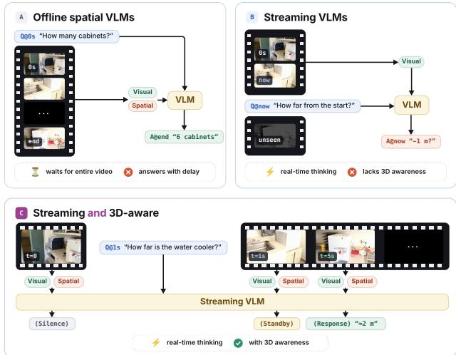
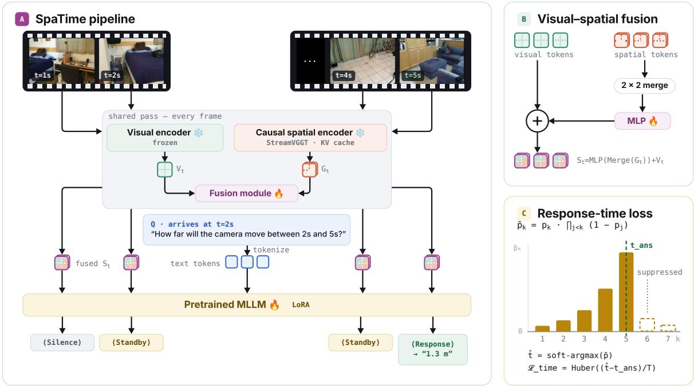
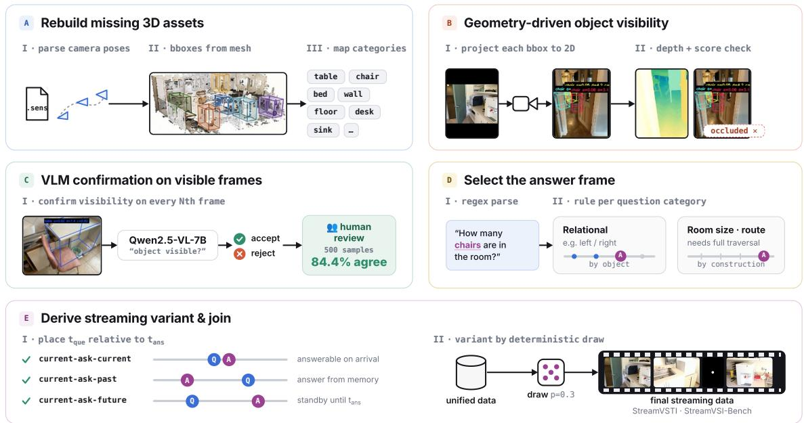
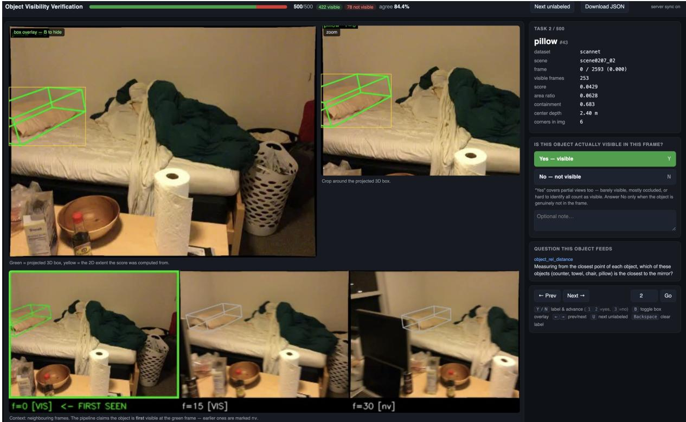

# SpaTime: Streaming Vision-Language Models for Spatio-temporal Reasoning

Hairong Yin<sup>1</sup>, Huangying Zhan<sup>2</sup>, Shin-Fang Chng<sup>2</sup>, Yi Xu<sup>2</sup>, Raymond A. Yeh<sup>1</sup>

<sup>1</sup>Department of Computer Science, Purdue University, USA <sup>2</sup>Goertek Alpha Labs, USA

## Abstract

Embodied agents must reason about 3D space while the video is still arriving, answering questions as soon as they have observed enough of the scene. VLMs that incorporate 3D geometric priors achieve strong spatial reasoning, but they operate ofline, i.e., the full video must be available before they produce an answer. Streaming VLMs process frames causally and decide for themselves when to respond, yet they lack explicit 3D representations. We present SpaTime, a streaming VLM that fuses causal geometry tokens into the language model at every frame, using only the frames observed so far. To supervise when the model answers, we propose a response-time loss that maps per-frame response probabilities to a diferentiable expected response time and penalizes the distance from the ground-truth frame. For evaluation, we construct StreamVSTI-Bench and StreamVSI-Bench, streaming adaptations of VSTI-Bench and VSI-Bench. On StreamVSTI-Bench, SpaTime reaches 49.2% overall accuracy and reduces the mean response-time error by 66% relative to the strongest streaming baseline.

## 1 Introduction

Spatial reasoning over streaming video is an essential capability for real-world embodied intelligence. Consider a robot navigating a kitchen. When asked “is the mug to your left or your right?”, the robot must judge the mug’s position relative to its own viewpoint, which changes as it moves. When asked “how far is the mug from where you started?”, it must maintain a geometric history across frames. In both cases, the question may arrive midstream, while the scene is only partially observed. The robot must decide not only what to answer, but<sup>”</sup> also when. Answering too early means guessing about parts of the scene it has not yet seen, while answering too late stalls the task at hand. Ideally, the robot should answer as soon as it has observed enough information. Deployable embodied and AR systems therefore need a streaming spatial VLM, i.e., a VLM that reasons about 3D spatial relationships on a live video stream and decides on its own when to answer (Fig. 1).

Recent VLM works mainly study one of these two requirements but not both. Ofline VLMs specialized for spatial reasoning, e.g., VG-LLM (Zheng et al. 2025) and VLM-3R (Fan et al. 2026), inject 3D geometric priors into the language model and achieve strong performance on spatial benchmarks such as VSI-Bench (Yang et al. 2025b). However, every stage of their pipeline, i.e., geometry encoding, feature fusion, and generation, operates over the full frame sequence. They therefore cannot answer a question that arrives mid-stream. Streaming VLMs, e.g., VideoLLM-online (Chen et al. 2024b), Dispider (Qian et al. 2025), and Streamo (Xia et al. 2026), take the opposite approach. They process frames causally and emit a state token at each frame, which lets the model decide when to answer. However, they lack any explicit 3D representation and struggle on spatial questions.

  
Figure 1: Ofline VLMs lack real-time answering capability, and general streaming VLMs lack 3D awareness. SpaTime fuses visual and causal 3D geometry tokens to achieve a Streaming VLM for spatial reasoning.

The dificulty is that these two requirements pull in opposite directions. Building a coherent 3D representation has meant attending over all input frames at once, as in geometry encoders such as VGGT (Wang et al. 2025a), which is exactly what causal, frame-by-frame inference forbids. StreamVGGT (Zhuo et al. 2026) shows this conflict is resolvable at the representation level, distilling VGGT’s global representations into a causal transformer whose key-value cache encodes geometry at constant cost per frame. The encoder is therefore no longer the obstacle, but two pieces above it are still missing. First, the geometry tokens have to reach the language model without reintroducing a dependence on future frames, whereas existing fusion strategies are designed for the ofline setting where the full sequence is available. Second, the model has to be supervised on when to answer, yet the losses used by streaming VLMs penalize all temporal errors alike, regardless of how early or late the response is.

We present SpaTime, a streaming VLM (Fig. 2), to address these challenges. For the first, SpaTime runs a frozen StreamVGGT geometry encoder alongside the VLM’s frozen visual encoder and fuses the two at every frame. Following VG-LLM’s (Zheng et al. 2025) fusion strategy, we spatially merge the per-frame geometry tokens, project them through a lightweight MLP, and add them to the visual tokens of the same frame. A LoRA-tuned LLM then reads the fused tokens and predicts a state token at each frame. Because the geometry encoder is causal and the fusion is per-frame, no stage of the pipeline consults a future frame, i.e., it processes only frames ≤ t at time t, and its inference cost per frame stays constant as the stream grows.

For the second, we propose a response-time loss that makes the response time itself trainable. We read per-frame response probabilities of the vocabulary distribution, aggregate them into a diferentiable expected response time via soft argmax, and penalize its deviation from the ground-truth frame. The penalty therefore scales with how far the prediction lands from the correct moment, so responding one frame early costs less than responding ten frames early, a distinction that per-frame cross-entropy and focal losses cannot express.

As no spatial reasoning benchmark supports streaming evaluation, we construct StreamVSTI-Bench and StreamVSI-Bench. These benchmarks are streaming adaptations of the popular spatial reasoning benchmarks of VSTI-Bench (Fan et al. 2026) and VSI-Bench (Yang et al. 2025b) (Sec. 5). We keep the QA annotations of the original benchmarks and assign each question an arrival time and a ground-truth response time. For evaluation, we consider the standard accuracy performance as well as a measure of responsiveness by ∆t, the mean absolute error between predicted and ground-truth response times. On StreamVSTI-Bench, SpaTime reaches 49.2% overall accuracy. Notably, it cuts the mean responsetime error by 66% relative to the strongest streaming baseline while achieving 5.1 points higher spatial accuracy.

Our contributions are as follows:

• We introduce SpaTime, a streaming VLM that fuses causal 3D geometry tokens into a language model without consulting future frames, at constant cost per frame.

• We propose a response-time loss that supervises when the model answers, penalizing a predicted response time in proportion to its distance from the correct frame.

• We develop a streaming conversion pipeline for spatial QA and use it to build two benchmarks, StreamVSTI-Bench and StreamVSI-Bench. Extensive experiments on both show that SpaTime outperforms streaming baselines and narrows the gap to ofline spatial specialists.

## 2 Related Work

Video-language models. Building on image-language pretraining, video LLMs (Li et al. 2023; Maaz et al. 2024; Lin et al. 2024; Li et al. 2025; Zhang et al. 2025d) extend instruction-tuned dialogue to video. Recent open-source generalists, e.g., Qwen2.5-VL (Bai et al. 2025) and InternVL-2.5 (Chen, Wang et al. 2024), approach proprietary systems (OpenAI 2024; Google DeepMind 2024; Anthropic 2024), while MovieChat (Song et al. 2024) and MA-LMM (He et al. 2024) compress past frames into memory banks for long video. Note, all of these models process a video as a completed clip and, as VSI-Bench (Yang et al. 2025b) reports, remain weak at 3D spatial reasoning. We target this challenge under the stricter constraint that frames arrive as a stream.

Spatial reasoning in vision-language models. Existing methods either ground an LLM in explicit 3D input such as point clouds or reconstructed scenes (Hong et al. 2023; Chen et al. 2024c; Huang et al. 2024), or reason from 2D observations alone without global 3D structure (Chen et al. 2024a; Cheng et al. 2024; Zhang et al. 2025b). Closest to our setting, VSI-Bench (Yang et al. 2025b) standardized spatial reasoning in egocentric video, prompting methods that inject geometry into video LLMs. Video-3D LLM (Zheng, Huang, and Wang 2025) adds position-aware encodings, VG-LLM (Zheng et al. 2025) fuses VGGT (Wang et al. 2025a) tokens into Qwen2.5-VL (Bai et al. 2025), and VLM-3R (Fan et al. 2026) fuses CUT3R (Wang et al. 2025b) features into LLaVA-NeXT-Video (Zhang et al. 2024). VSTI-Bench (Fan et al. 2026) further extends evaluation to camera and object motion. However, all these methods operate ofline and require the full video before answering. Unlike these methods, SpaTime brings explicit geometry to the streaming setting.

Streaming VLMs. VideoLLM-online (Chen et al. 2024b) introduced the streaming dialogue paradigm, processing frames sequentially and deciding at each step whether to respond. Flash-VStream (Zhang et al. 2025a) keeps a compressed memory for long streams, Dispider (Qian et al. 2025) disentangles perception, decision, and reaction, and Streamo (Xia et al. 2026) adds explicit state tokens with a state-aware focal loss for the silent/responsive class imbalance. Efective as these models are at deciding when to respond, they do not maintain an explicit 3D representation. SpaTime retains their frame-by-frame decision-making and incorporates geometry into it.

Online 3D reconstruction and causal geometry encoding. Online 3D reconstruction spans SLAM systems (Mur-Artal and Tardós 2017; Teed and Deng 2021; Zhu et al. 2022) and, more recently, fast feed-forward pointmap regression. DUSt3R (Wang et al. 2024) and MASt3R (Leroy, Cabon, and Revaud 2024) recover geometry from image pairs without poses, and Spann3R (Wang and Agapito 2025), Fast3R (Yang et al. 2025a), and MonST3R (Zhang et al. 2025c) extend this incrementally, at scale, and to dynamic scenes. VGGT (Wang et al. 2025a) and CUT3R (Wang et al. 2025b) predict dense geometry, but rely on global attention over all frames, which makes them inherently ofline. MASt3R-SLAM (Murai, Dexheimer, and Davison 2025) and LeanGate (Xiong et al. 2026) target reconstruction and eficiency rather than language-model integration. Most related to this work is StreamVGGT (Zhuo et al. 2026), which distills VGGT into a causal transformer with a KV cache, yielding geometry tokens at constant per-frame cost with minimal quality loss. SpaTime builds directly on it, feeding causal geometry tokens into a streaming VLM for spatial reasoning.

  
Figure 2: SpaTime pipeline. Figure (a) illustrates the overall pipeline. Each frame is encoded by a frozen visual encoder and a frozen causal geometry encoder, then (b) a lightweight projector aligns the geometry tokens with the visual tokens, and fused via element-wise addition. In (c), a response time loss ${ \mathcal { L } } _ { \mathrm { t i m e } }$ aligns the predicted response time with the ground truth.

Concurrent work. Stream3D-VLM (Yu et al. 2026) concurrently develops an online VLM for 3D spatial understanding, likewise building on a frozen StreamVGGT encoder. It fuses geometry through stacked cross-attention and casts response timing as next-token prediction over two decision tokens under a weighted token-level loss. In contrast, SpaTime fuses by additive projection on an exactly aligned token grid, adopts a three-state protocol, and supervises timing with a diferentiable response-time loss on the expected response time. Additionally, our introduced benchmarks are streaming conversions of established ones, which keeps accuracy directly comparable with the ofline literature.

## 3 Preliminaries

We review the background and notation needed to understand this paper, including the streaming task formulation, Streamo (Xia et al. 2026) for streaming video-language modeling (Sec. 3.1), and StreamVGGT (Zhuo et al. 2026) for causal geometry encoding (Sec. 3.2).

Streaming task formulation. Consider a video stream $\mathcal { V } = \{ f _ { t } \} _ { t = 0 } ^ { T - 1 }$ , where each frame $f _ { t } \in \mathbb { R } ^ { 3 \times H \times W }$ arrives sequentially. At an arbitrary time step $t _ { \mathrm { q u e } } \in \{ 0 , \dots , T { - } 1 \}$ }, a user poses a question $Q _ { \mathrm { t x t } } .$ . The model must select a response time ${ t _ { \mathrm { a n s } } \in \bar { \{ { t _ { \mathrm { q u e } } , \dots , T - 1 \} } } }$ and produce an answer $A _ { \mathrm { t x t } }$ Note, both decisions are made causally, $i . e . ,$ from the frames $\{ f _ { 0 } , \ldots , f _ { t _ { \mathrm { a n s } } } \}$ observed up to that point.

## 3.1 Streaming Video-Language Modeling

Streamo (Xia et al. 2026) formulates streaming video understanding as a multi-turn dialogue between a user and an assistant. The video is sampled at a fixed rate, and each frame $f _ { t }$ corresponds to one conversational turn with a timestamp $\displaystyle { \langle t \mathbf { s } - ( t { + } 1 ) \mathbf { s } \rangle }$ . A visual encoder ${ \mathcal E } _ { \mathrm { v i s } }$ maps each frame to a sequence of visual tokens,

$$
V _ { t } = \mathcal { E } _ { \mathrm { v i s } } ( f _ { t } ) , \quad V _ { t } \in \mathbb { R } ^ { N _ { v } \times d } ,\tag{1}
$$

where $N _ { v }$ is the number of visual tokens per frame and d is the hidden dimension of the LLM backbone $\mathcal { F }$ . Text inputs are tokenized and embedded by the LLM’s embedding layer. At each frame, the visual tokens and any associated text tokens are concatenated and fed to $\mathcal { F }$

State tokens. Streamo embeds frame-level response decisions directly into the language model’s vocabulary. Specifically, it introduces three special tokens, and the model starts its assistant turn at each frame t by autoregressively generating one of them: (a) ⟨Silence⟩ keeps the model silent while it continues to process the incoming frame stream; (b) ⟨Standby⟩ signals that relevant visual cues have been identified but more context is still needed; and (c) ⟨Response⟩ triggers the generation of the answer text $A _ { \mathrm { t x t } }$ . The output space at each frame is therefore

$$
\hat { o } _ { t } \in \mathcal { W } \cup \big \{ \langle \mathrm { s i } \mathrm { 1 e n c e } \rangle , \langle \mathrm { s t a n d b y } \rangle , \langle \mathrm { R e s p o n s e } \rangle \big \} ,\tag{2}
$$

where W denotes the LLM’s base vocabulary.

State-aware focal loss. Most frames of a stream are <sup>p̄</sup>silent, so the class distribution over state tokens is heavily p̄imbalanced and standard cross-entropy training collapses to predicting ⟨Silence⟩ at every frame. Streamo addresses this with a state-aware focal loss, which applies inverse-frequency weighting and a focal modulation term at the state-token positions,

$$
\mathcal { L } _ { \mathrm { f o c a l } } = - \sum _ { i } \alpha _ { c _ { i } } \left( 1 - p _ { i } \right) ^ { \gamma } \log p _ { i } ,\tag{3}
$$

where $p _ { i }$ is the predicted probability of the ground-truth token at position $i , \alpha _ { c _ { i } }$ is a class-frequency balancing weight for the ground-truth class $c _ { i } .$ , and $\gamma$ is the focal exponent.

## 3.2 Causal Geometry Encoding

StreamVGGT (Zhuo et al. 2026) replaces VGGT’s (Wang et al. 2025a) global temporal attention with causal temporal attention, so that each frame t attends only to frames $\leq t ,$

$$
\begin{array} { r } { \pmb { G } _ { t } = \pmb { \mathcal { E } } _ { \mathrm { g e o } } ( f _ { t } , \mathsf { K } \pmb { \mathbb { V } } _ { < t } ) , \quad \pmb { G } _ { t } \in \mathbb { R } ^ { N _ { g } \times d _ { g } } , } \end{array}\tag{4}
$$

where ${ \mathcal E } _ { \mathrm { g e o } }$ denotes the full StreamVGGT pipeline and $\mathbb { K V } _ { < t }$ is the cached key-value state from all previous frames. $\mathbf { A t }$ inference, only the current frame’s tokens are computed, while past frames contribute through the cache. The per-frame cost is constant, $i . e . .$ , independent of the sequence length $T ,$

To compensate for the reduced context under causal attention, StreamVGGT is trained by distillation from a pretrained VGGT teacher, matching the teacher’s geometry tokens. This preserves most of VGGT’s representational quality while enabling streaming inference.

We use StreamVGGT as a frozen geometry encoder, whose per-frame tokens $G _ { t }$ serve as the 3D prior that we fuse into the streaming VLM (Sec. 4.1).

## 4 Approach

SpaTime incorporates causal 3D geometry encoding, geometry-visual fusion, and frame-level response control via state tokens in a single streaming architecture, illustrated in Fig. 2. We first describe the geometry-aware streaming architecture (Sec. 4.1), then the response-time loss that supervises when the model should respond (Sec. 4.2).

## 4.1 Geometry-Aware Streaming VLM

At each frame $f _ { t } ,$ the visual encoder ${ \mathcal E } _ { \mathrm { v i s } }$ generates visual tokens $V _ { t } \in \mathbb R ^ { \tilde { N } _ { v } \times d }$ (Eq. (1)), and the geometry encoder ${ \mathcal E } _ { \mathrm { g e o } }$ generates geometry tokens $G _ { t } ~ \in ~ \mathbb { R } ^ { N _ { g } \times d _ { g } }$ (Eq. (4)). Both encoders remain frozen throughout training. We update only the fusion projector, the LLM’s LoRA parameters, the state-token embeddings, and the LM head.

Geometry-visual fusion. Following VG-LLM (Zheng et al. 2025), we fuse geometry tokens into the visual token stream via spatial merging and additive fusion. Specifically, we first merge the geometry token grid with $\phantom { - } 1 2 \times 2$ window, concatenating four adjacent patches into a single vector, and then project the merged tokens to the LLM’s hidden dimension d:

$$
S _ { t } = \underbrace { \mathrm { M L P } \big ( \mathrm { M e r g e } _ { 2 \times 2 } ( G _ { t } ) \big ) } _ { \in \mathbb { R } ^ { N _ { v } \times d } } + V _ { t } ,\tag{5}
$$

where MLP : $\mathbb { R } ^ { 4 d _ { g } }  \mathbb { R } ^ { d }$ is a two-layer MLP. Note, the merge brings the geometry grid to the same $N _ { v }$ tokens as the visual grid, so the two are added position by position. We feed the fused tokens $S _ { t }$ into the LLM backbone $\mathcal { F }$ as the visual input for frame t.

State-token streaming. The LLM backbone follows Streamo’s multi-turn protocol (Sec. 3.1). At each frame t, we concatenate the fused tokens $S _ { t } .$ , the timestamp marker, and any pending question texts as the user turn. The model then generates an assistant turn, beginning with one of the three state tokens {⟨Silence⟩, ⟨Standby⟩, ⟨Response⟩}. If ⟨Response⟩ is predicted, answer text follows. A causal attention mask ensures that tokens at frame t attend only to tokens from frames $\leq t ,$ which preserves strict causality across the pipeline.

## 4.2 Response Time Loss

The state-aware focal loss (Eq. (3)) determines which state token to predict at each frame, but it treats temporal misalignment uniformly. That is, a model predicting ⟨Response⟩ one frame early incurs the same penalty as predicting it ten frames early. We therefore introduce a loss that supplies a diferentiable signal for when to respond.

Formulation. Let $\{ t _ { 1 } , \dots , t _ { T } \}$ denote the $T$ state-token positions in a training sample. At each predictor position $t _ { k } - 1$ $i . e .$ , the row whose next-token distribution determines the state token at $t _ { k }$ , we extract the three-class logit slice corresponding to {⟨Silence⟩, ⟨Standby⟩, ⟨Response⟩}:

$$
\tilde { z } _ { t _ { k } } = z _ { t _ { k } - 1 } \mathopen { } \mathclose \bgroup \left[ \mathopen { } \mathclose \bgroup \left\{ \left\{ \mathrm { S i 1 } \aftergroup \egroup \right\} , \left. \mathrm { S t b } \aftergroup \egroup \right. , \left. \mathrm { R e } \mathrm { s p } \right. \aftergroup \egroup \right\} \aftergroup \egroup \right] \in \mathbb { R } ^ { 3 } ,\tag{6}
$$

and compute a conditional response probability at each statetoken frame:

$$
p _ { k } = \mathrm { s o f t m a x } \left( \tilde { z } _ { t _ { k } } \right) \left[ \left. \mathrm { R e s p o n s e } \right. \right] .\tag{7}
$$

Streaming evaluation protocols only score a model’s initial response. To align training with this metric, we model the probability that frame k is thefirst to emit ⟨Response⟩:

$$
\bar { p } _ { k } = p _ { k } \prod _ { j < k } ( 1 - p _ { j } ) ,\tag{8}
$$

which we evaluate in log-space, log $\begin{array} { r c l } { \bar { p } _ { k } } & { = } & { \log p _ { k } + } \end{array}$ $\textstyle \sum _ { j < k } \log ( 1 - p _ { j } )$ , for numerical stability. To obtain a diferentiable response time prediction, we use the soft-argmax (Luvizon, Tabia, and Picard 2019) over ${ \bar { p } } _ { k } \mathbf { : }$

$$
\hat { t } _ { \mathrm { a n s } } = ( \sum _ { k = 1 } ^ { T } t _ { k } \cdot \bar { p } _ { k } ) \Big / ( \sum _ { k = 1 } ^ { T } \bar { p } _ { k } ) ,\tag{9}
$$

with a safe fallback $\hat { t } _ { \mathrm { a n s } } = t _ { T }$ when $\sum _ { k } \bar { p } _ { k }$ falls below $1 0 ^ { - 4 }$

The response-time loss then penalizes the lengthnormalized deviation from the ground-truth response frame $t _ { \mathrm { a n s } }$ via a Huber loss:

$$
\mathcal { L } _ { \mathrm { t i m e } } = \lambda _ { \mathrm { t i m e } } \cdot \mathrm { H u b e r } _ { \delta } \Bigg ( \frac { \hat { t } _ { \mathrm { a n s } } - t _ { \mathrm { a n s } } } { T } \Bigg ) ,\tag{10}
$$

where $\lambda _ { \mathrm { t i m e } }$ is a scalar weight and Hube $: \delta$ is the Huber loss with $\delta = 0 . 2$ , which limits the efect of outliers.

Type-weighted response-time loss. Not every question requires a timing decision based on visual cues. Among the three temporal variants discussed later in Sec. 5, only currentask-future questions require the model to wait. Current-askcurrent and current-ask-past questions are answerable the moment they arrive, so penalizing their response time hurts the state-token posterior for little timing gain.

  
Figure 3: Data curation. For each question, a geometry-driven visibility check and a VLM check locate the frames where its objects are visible. Next, a per-type rule selects the answer frame, and a query frame is assigned to create the streaming data.

We therefore introduce a per-type weight to the responsetime loss. Let $\tau \in \{ \mathtt { c u r } \}$ , fut, past} denote the temporal type of a training sample, read from the per-sample label stored during benchmark construction, and let $w _ { \tau }$ be the corresponding weight. Scaling each sample’s loss by w<sub>τ</sub> turns Eq. (10) into

$$
{ \mathcal { L } } _ { \mathrm { t i m e } } = \lambda _ { \mathrm { t i m e } } \cdot w _ { \tau } \cdot { \mathrm { H u b e r } } _ { \delta } \left( { \frac { \hat { t } _ { \mathrm { a n s } } - t _ { \mathrm { a n s } } } { T } } \right) .\tag{11}
$$

The weights emphasize questions that require waiting. We give their specific values in Appendix Sec. B.

Combined objective. The full training loss is:

$$
\begin{array} { r } { \mathcal { L } = \mathcal { L } _ { \mathrm { f o c a l } } + \mathcal { L } _ { \mathrm { t i m e } } , } \end{array}\tag{12}
$$

where ${ \mathcal { L } } _ { \mathrm { f o c a l } }$ is the focal cross-entropy (Eq. (3)) over all supervised assistant-turn tokens and ${ \mathcal { L } } _ { \mathrm { t i m e } }$ is the type-weighted response-time loss (Eq. (11)).

## 5 Streaming Spatial Reasoning Benchmarks

Existing spatial benchmarks, $e . g .$ , VSTI-Bench (Fan et al. 2026) and VSI-Bench (Yang et al. 2025b), evaluate full videos ofline, so they cannot capture when an answer becomes viable. We therefore convert them into StreamVSTI-Bench and StreamVSI-Bench with a geometry-grounded pipeline. We preserve the original questions and ground-truth answers built - -on ScanNet (Dai et al. 2017), ScanNet++ (Yeshwanth et al. 2023), and ARKitScenes (Baruch et al. 2021), which keeps accuracy directly comparable with the ofline literature. As shown in Fig. 3, the pipeline has four stages: (a) rebuilding the 3D assets and a per-frame visibility index (Sec. 5.1); (b) confirming recognizability with a VLM (Sec. 5.2); (c) selecting the answer frame t<sub>ans</sub> (Sec. 5.3); and (d) deriving the streaming variant (Sec. 5.4).

## 5.1 3D Assets and Geometry-Driven Visibility

We first collect 3D asset annotations for each scene. For example, we read per-frame camera poses and intrinsics from the .sens archives in ScanNet. For all datasets, we take object-level oriented bounding boxes (OBBs) from the dataset’s instance annotations. We then map each dataset’s category labels to a unified question vocabulary, so that every referred object can be grounded to a 3D box.

With these assets in place, we build a per-frame visibility index for every object-frame pair. Specifically, we project the eight corners of each object’s OBB into the image plane via the camera pose and intrinsics and take the 2D bounding rectangle of the projection. From it we compute an area ratio, the fraction of the frame covered by the rectangle clipped to the image, and a containment ratio, the fraction of the unclipped rectangle that lies inside the image boundary. Containment rejects a case that a naïve area threshold would accept, i.e., a camera close to a large object fills the frame yet observes almost none of it. We consider an object visible when (a) its containment ratio exceeds a minimum threshold, or its area ratio is large enough that the object dominates the frame even when partially cut of; (b) its area ratio exceeds a minimum size, rejecting distant specks; (c) its center lies within a maximum distance from the camera; and (d) for ARKitScenes and ScanNet++, it is not occluded by intervening geometry in the sensor depth map. The product of the two ratios serves as a per-frame visibility score for ranking views. We report the thresholds in Appendix Sec. C.

<table><tr><td></td><td></td><td colspan="2">Numerical Answer Cam-Obj</td><td colspan="2">Multiple-Choice Answer</td><td></td><td>∆t (s)</td></tr><tr><td>Methods</td><td>Avg</td><td>Abs. Dist.</td><td>Cam. Disp.</td><td>Cam. Move. Dir.</td><td>Obj-Obj Cam-Obj Rel. Pos. Rel. Dist.</td><td></td><td>↓</td></tr><tr><td colspan="8">Baseline</td></tr><tr><td>Human Level†</td><td>77.0</td><td>51.4</td><td>46.8</td><td>95.1</td><td>97.5</td><td>94.3</td><td>N/A</td></tr><tr><td>Chance Level†</td><td>27.4</td><td>5.4</td><td>6.2</td><td>40.7</td><td>52.2</td><td>32.4</td><td>N/A</td></tr><tr><td colspan="8">Proprietary (Offline)</td></tr><tr><td>GPT-4o†</td><td>38.2</td><td>29.5</td><td>23.4</td><td>37.3</td><td>58.1</td><td>42.5</td><td>N/A</td></tr><tr><td>Gemini-2.5-Pro†</td><td>42.4</td><td>29.2</td><td>8.0</td><td>30.0</td><td>84.0</td><td>60.7</td><td>N/A</td></tr><tr><td colspan="8">Open-source (Offline)</td></tr><tr><td>InternVL2-8B†</td><td>43.5</td><td>32.9</td><td>13.5</td><td>48.0</td><td>68.0</td><td>55.0</td><td>N/A</td></tr><tr><td>LLaVA-Video-7B†</td><td>40.0</td><td>28.2</td><td>1.8</td><td>49.8</td><td>64.7</td><td>55.6</td><td>N/A</td></tr><tr><td>LLaVA-OneVision-7B†</td><td>41.7</td><td>29.9</td><td>19.3</td><td>47.5</td><td>62.1</td><td>49.8</td><td>N/A</td></tr><tr><td colspan="8">Offline Spatial VLM</td></tr><tr><td>VG-LLM-8B</td><td>47.1</td><td>31.3</td><td>32.5</td><td>48.2</td><td>73.4</td><td>50.0</td><td>N/A</td></tr><tr><td>VLM-3R-7B†</td><td>58.8</td><td>39.4</td><td>39.6</td><td>60.6</td><td>86.5</td><td>68.6</td><td>N/A</td></tr><tr><td colspan="8">Online Video-LLM</td></tr><tr><td>VideoLLM-online</td><td>48.40</td><td>33.43</td><td>32.50</td><td>45.89</td><td>68.02</td><td>69.25</td><td>29.24</td></tr><tr><td>Dispider</td><td>47.25</td><td>33.40</td><td>33.43</td><td>49.68</td><td>58.78</td><td>66.91</td><td>42.59</td></tr><tr><td>Streamo</td><td>44.05</td><td>29.16</td><td>32.61</td><td>49.51</td><td>53.37</td><td>65.06</td><td>0.35</td></tr><tr><td colspan="8">Ours</td></tr><tr><td>Ours</td><td>|49.20</td><td>35.33</td><td>36.66</td><td>46.33</td><td>65.41</td><td>68.05</td><td>0.12</td></tr></table>

Table 1: Results on StreamVSTI-Bench. Accuracy is charitablemode (strict-mode averages are reported separately in Table 4); $\Delta t$ is the mean response-time error in seconds (lower is better), charging a miss the time to video end. Ofline models see the full video and are N/A on timing. <sup>†</sup>: reference numbers from the VLM-3R (Fan et al. 2026) paper.
<table><tr><td rowspan="2">Ablations Geo. Tokens RT Loss</td><td colspan="3">Metrics</td></tr><tr><td></td><td>Strict Charitable</td><td> $\Delta t \left( \mathrm { s } \right) \downarrow$ </td></tr><tr><td></td><td>43.99</td><td>44.05</td><td>0.35</td></tr><tr><td>√</td><td>47.93</td><td>48.37</td><td>0.18</td></tr><tr><td></td><td>48.80</td><td>49.20</td><td>0.12</td></tr></table>

Table 3: Ablation on StreamVSTI-Bench. Components are added cumulatively to a fine-tuned Streamo baseline; the shaded row is our final model.

## 5.2 VLM Confirmation on Visible Frames

Geometric visibility guarantees that a box projects into the frame, not that the object is recognizable there, e.g., motion blur, a doorway edge, or a box that actually sits behind a counter all pass the frustum test. We therefore use a visionlanguage model to double-check. For each object referenced by a question, we overlay its 3D box as a wireframe on the frames where it is geometrically visible and use Qwen2.5-VL-7B (Bai et al. 2025) to confirm that the object is recognizable. The check is deliberately conservative, i.e., parsing is failopen; only a reply that is an explicit “no” overrides geometry, and an object is never rejected for all its frames. This removes early false-positive views without dropping any question.

To validate the resulting visibility labels, we randomly sample 500 object-frame pairs that the pipeline marks as visible and ask human annotators to judge whether the object is indeed recognizable in the corresponding frame. We observe a human-pipeline agreement rate of 84.4%, suggesting that the combined geometric and VLM filtering produces reliable visibility annotations.

## 5.3 Answer-Frame Selection

To identify the correct answer frame, we first identify the objects from the question texts and match them against the scene’s category list from the data annotations. Given the set of referred objects, we select the answer frame $t _ { \mathrm { a n s } }$ based on question type. For instance, an object counting question sets $t _ { \mathrm { a n s } }$ to the first frame in which all instances of the queried object become visible, since only then can the model produce the correct count. A relational question sets $t _ { \mathrm { a n s } }$ to the earliest frame at which all involved objects have appeared. The remaining per-type rules follow similar logic and are listed in Appendix Sec. C.

<table><tr><td rowspan="3"></td><td rowspan="3">Avg</td><td colspan="4">Numerical Answer</td><td colspan="5">Multiple-Choice Answer</td></tr><tr><td>Obj. Count</td><td>Abs. Dist.</td><td>Size</td><td>Obj. Room Size</td><td>Rel. Dist.</td><td>Rel. Dir.</td><td>Route Plan</td><td>Appr. Order</td><td>∆t (s) ↓</td></tr><tr><td colspan="10">Baseline</td></tr><tr><td>Human Level†</td><td>79.2</td><td></td><td></td><td></td><td></td><td></td><td></td><td></td><td></td><td></td></tr><tr><td>Chance Level†</td><td>34.0</td><td>94.3 62.1</td><td>47.0 32.0</td><td>60.4 29.9</td><td>45.9 33.1</td><td>94.7 25.1</td><td>95.8 47.9</td><td>95.8 28.4</td><td>100.0 25.2</td><td>N/A N/A</td></tr><tr><td colspan="10"></td></tr><tr><td>Proprietary (Offline) GPT-4o†</td><td></td><td></td><td></td><td></td><td></td><td></td><td></td><td></td><td></td><td></td></tr><tr><td>Gemini-2.5-Pro†</td><td>34.0 51.5</td><td>46.2 43.8</td><td>5.3 34.9</td><td>43.8 64.3</td><td>38.2 42.8</td><td>37.0 61.1</td><td>41.3 47.8</td><td>31.5 45.9</td><td>28.5 71.3</td><td>N/A N/A</td></tr><tr><td colspan="10">Open-source (Offline)</td></tr><tr><td>InternVL2-8B</td><td>34.6</td><td>23.1</td><td>28.7</td><td>48.2</td><td>39.8</td><td>36.7</td><td>30.7</td><td>29.9</td><td>39.6</td><td>N/A</td></tr><tr><td>LLaVA-Video-7B†</td><td>35.6</td><td>48.5</td><td>14.0</td><td>47.8</td><td>24.2</td><td>43.5</td><td>42.4</td><td>34.0</td><td>30.6</td><td>N/A</td></tr><tr><td>LLaVA-OneVision-7B†</td><td>32.4</td><td>47.7</td><td>20.2</td><td>47.4</td><td>12.3</td><td>42.5</td><td>35.2</td><td>29.4</td><td>24.4</td><td>N/A</td></tr><tr><td colspan="10">Offline Spatial VLM</td></tr><tr><td>VG-LLM-8B†</td><td>50.7</td><td></td><td></td><td></td><td></td><td></td><td></td><td></td><td></td><td></td></tr><tr><td>VLM-3R-7B†</td><td>60.9</td><td>67.9 70.2</td><td>37.7 49.4</td><td>58.6 69.2</td><td>62.0 67.1</td><td>46.6 65.4</td><td>40.7 80.5</td><td>32.4 45.4</td><td>59.2 40.1</td><td>N/A N/A</td></tr><tr><td colspan="10">Online Video-LLM</td></tr><tr><td>VideoLLM-online</td><td>25.92</td><td>31.03</td><td>30.89 0.00</td><td></td><td>0.07</td><td>|36.84 40.68</td><td></td><td>35.05</td><td>26.58</td><td>58.08</td></tr><tr><td>Dispider</td><td>24.14</td><td>27.34</td><td>32.99</td><td>0.00</td><td>0.00</td><td>34.32</td><td>40.15</td><td>28.87</td><td>34.38</td><td>58.26</td></tr><tr><td>Streamo</td><td>25.23</td><td>6.7</td><td>20.6</td><td>29.3</td><td>1.6</td><td>30.3</td><td>25.54</td><td>5.8</td><td>8.3</td><td>7.73</td></tr><tr><td colspan="9">Ours</td></tr><tr><td>Ours</td><td></td><td></td><td></td><td></td><td></td><td></td><td>29.83|38.17 26.58 3.49 0.00 |37.70 43.92 38.46 37.71|7.58</td><td></td><td></td><td></td></tr></table>

Table 2: Results on StreamVSI-Bench (task types unseen in training). Accuracy is charitable-mode (strict-mode averages in Table 4) and $\Delta t$ is the mean response-time error (s, lower better), as in Table 1; ofline models are N/A on timing. <sup>†</sup>: reference numbers from VSI-Bench (Yang et al. 2025b), VG-LLM (Zheng et al. 2025), or VLM-3R (Fan et al. 2026).

## 5.4 Streaming Variants

The question and answer responses are categorized into three temporal variants based on the query frame $ { t _ { \mathrm { q u e } } }$ and the answer frame $t _ { \mathrm { a n s } } \colon$

• Current-ask-current $( t _ { \mathrm { q u e } } = t _ { \mathrm { a n s } } ) \colon$ the evidence is enough to answer at the moment the question is posed, so the model can answer immediately upon arrival.

• Current-ask-past $( t _ { \mathrm { q u e } } > t _ { \mathrm { a n s } } )$ : the question refers to earlier observations and should be answered immediately from memory.

• Current-ask-future $( \mathrm { f _ { q u e } } < \mathrm { f _ { a n s } } ) \mathrm { : }$ : the current evidence is not enough to answer, so the model must predict ⟨Standby⟩ until the answer frame arrives.

Each spatial QA is then randomly assigned to two of its temporal variants. StreamVSTI-Bench comprises 132,568 training and 6,042 test samples over disjoint ScanNet splits, and StreamVSI-Bench contributes 4,726 test samples over 288 videos drawn from ScanNet, ScanNet++, and ARKitScenes. Further statistics are given in Appendix Sec. C.

## 6 Experiments

Evaluation benchmarks. We evaluate on the two streaming benchmarks of Sec. 5: (a) StreamVSTI-Bench, an indistribution evaluation, and (b) StreamVSI-Bench, whose task types are unseen in training. All models are finetuned only on the StreamVSTI-Bench training split.

<table><tr><td>Method</td><td>StreamVSTI</td><td>StreamVSI</td></tr><tr><td>VideoLLM-online</td><td>6.22</td><td>4.94</td></tr><tr><td>Dispider</td><td>23.39</td><td>0.63</td></tr><tr><td>Streamo</td><td>43.99</td><td>21.09</td></tr><tr><td>Ours</td><td>48.80</td><td>29.44</td></tr></table>

Table 4: Strict-mode average accuracy (%) for streaming methods. The strict protocol scores only the earliest predicted ⟨Response⟩ and counts a missing response as zero, penalizing timing failures directly. Ofline models do not respond and are omitted.

Metrics. Following VSI-Bench (Yang et al. 2025b), we report accuracy separately for numerical tasks and multiplechoice tasks under two evaluation modes. The strict mode scores only the model’s earliest predicted ⟨Response⟩ and counts a sample that never emits one as zero. The charitable mode instead force-decodes an answer at the final frame when no ⟨Response⟩ was emitted, isolating spatial reasoning quality from response-timing failures. For streaming models, we also report ∆t, the mean absolute error in seconds between the predicted and ground-truth response times.

Baselines. We compare against three baseline categories. Ofline general VLMs: InternVL2-8B (Chen et al. 2024d), LLaVA-OneVision-7B (Li et al. 2025), LLaVA-Video-7B (Zhang et al. 2025d), GPT-4o (OpenAI 2024), and the Gemini-2.5 (Gemini Team, Google 2025) series. Ofline spatial VLMs: VG-LLM (Zheng et al. 2025) and VLM-3R (Fan et al. 2026), which run on the full video, so ∆t does not apply. Streaming VLMs: Streamo (Xia et al. 2026), VideoLLMonline (Chen et al. 2024b), and Dispider (Qian et al. 2025), all fine-tuned on our training data and evaluated in streaming mode. Ofline numbers are from prior work where available.

Implementation details. SpaTime is fine-tuned with LoRA on the StreamVSTI-Bench training split. The visual and geometry encoders remain frozen (Sec. 4.1). Additional implementation details are documented in Appendix Sec. B.

## 6.1 Results on StreamVSTI-Bench

Tab. 1 presents charitable-mode results on StreamVSTI-Bench. Among streaming models, SpaTime achieves the highest spatial accuracy under both modes, beating the strongest streaming baseline by 4.8 points (strict) and 0.8 (charitable) on average. The gap is starker under the strict protocol (Tab. 4), where baselines that answer late or never collapse, whereas SpaTime stays close to its charitable accuracy. In addition, SpaTime’s ∆t of 0.12 s versus 0.35 s for the best streaming baseline shows its response times closely track the ground truth, and it comes within 9.6 points of VLM-3R while decoding causally.

## 6.2 Generalization to StreamVSI-Bench

We further evaluate generalization on StreamVSI-Bench, whose task types are absent from training. Tab. 2 reports the full per-category breakdown. Since ofline models cannot run under the streaming protocol, we cite their published

<table><tr><td colspan="2">Ablations</td><td colspan="2">∆t (s)↓</td></tr><tr><td>Geo. Tokens RT Loss</td><td></td><td>All</td><td>Future-only</td></tr><tr><td></td><td></td><td>0.18</td><td>0.52</td></tr><tr><td>√</td><td>√</td><td>0.12</td><td>0.35</td></tr></table>

Table 5: The response time loss targets future questions. Mean response-time error ∆t (s, lower is better) over all questions versus current-ask-future questions only, whose answers depend on frames that arrive after the query. Adding the response time loss (row 2) cuts the error most on future questions, where the model must decide how long to wait.

VSI-Bench (Yang et al. 2025b) results as an ofline reference, marked <sup>†</sup>. SpaTime outperforms the streaming baselines by 4.7 points on average, showing that the geometry priors generalize beyond the trained task types.

The experiment also reveals a clear shortcoming: SpaTime scores 0.0 on room-size and 3.5 on object-size estimation. Both categories require predicting an absolute metric extent, yet their question templates are absent from the camera- and object-relational splits of StreamVSTI-Bench used for training, so the model never encounters their answer form during training. Other streaming baselines exhibit the same failure on these categories, confirming that the cause is insuficient training coverage rather than a fundamental geometric limitation. Because our pipeline can synthesize size-estimation questions automatically, augmenting the training mixture with such samples is a promising direction for future work.

## 6.3 Ablation Study

We ablate SpaTime’s components in Tab. 3 by progressively adding each module to a fine-tuned Streamo baseline. Geometry tokens from StreamVGGT yield the largest gain, improving accuracy by 3.9 points (strict) and 4.3 (charitable) while cutting ∆t from 0.35 s to 0.18 s, confirming that explicit 3D priors address the core deficit of streaming VLMs on spatial tasks. Adding the response-time loss further raises charitable accuracy to 49.20 and reduces ∆t to 0.12 s. By construction, the response-time loss supervises current-askfuture questions the most, whose answers depend on frames arriving after the query. Tab. 5 shows that while the overall ∆t decreases modestly (0.18 s to 0.12 s), the error on future questions drops from 0.52 s to 0.35 s. This shows the benefit in the hard timing cases that the loss is designed to address.

## 7 Conclusion

We propose SpaTime, a streaming VLM that brings explicit 3D geometry into causal video reasoning. SpaTime fuses causal geometry tokens from a frozen StreamVGGT encoder into a streaming LLM at every frame, and a response-time loss supervises when the model answers. To train and evaluate in this setting, we construct StreamVSTI-Bench and StreamVSI-Bench, streaming versions of established spatial QA benchmarks. On StreamVSTI-Bench, SpaTime reaches 49.2% overall accuracy and cuts the mean response-time error from 0.35 s to 0.12 s relative to the strongest streaming baseline. We hope SpaTime and these two benchmarks encourage future work on VLMs that reason about 3D space and respond promptly as video frames continue to arrive.

## References

Anthropic. 2024. Claude 3.5 Sonnet. https://www.anthropic. com/news/claude-3-5-sonnet.

Bai, S.; Chen, K.; Liu, X.; Wang, J.; Ge, W.; Song, S.; Dang, K.; Wang, P.; Wang, S.; Tang, J.; et al. 2025. Qwen2.5-VL Technical Report. arXiv preprint arXiv:2502.13923.

Baruch, G.; Chen, Z.; Dehghan, A.; Dimry, T.; Feigin, Y.; Fu, P.; Gebauer, T.; Jofe, B.; Kurz, D.; Schwartz, A.; et al. 2021. ARKitScenes: A diverse real-world dataset for 3D indoor scene understanding using mobile RGB-D data. In Proc. NeurIPS.

Chen, B.; Xu, Z.; Kirmani, S.; Ichter, B.; Sadigh, D.; Guibas, L.; and Xia, F. 2024a. SpatialVLM: Endowing Vision-Language Models with Spatial Reasoning Capabilities. In Proc. CVPR.

Chen, J.; Lv, Z.; Wu, S.; Lin, K. Q.; Song, C.; Gao, D.; Liu, J.-W.; Gao, Z.; Mao, D.; and Shou, M. Z. 2024b. VideoLLMonline: Online video large language model for streaming video. In Proc. CVPR.

Chen, S.; Chen, X.; Zhang, C.; Li, M.; Yu, G.; Fei, H.; Zhu, H.; Fan, J.; and Chen, T. 2024c. LL3DA: Visual Interactive Instruction Tuning for Omni-3D Understanding, Reasoning, and Planning. In Proc. CVPR.

Chen, Z.; Wang, W.; Tian, H.; et al. 2024d. How Far Are We to GPT-4V? Closing the Gap to Commercial Multimodal Models with Open-Source Suites. arXiv preprint arXiv:2404.16821.

Chen, Z.; Wang, W.; et al. 2024. Expanding Performance Boundaries of Open-Source Multimodal Models with Model, Data, and Test-Time Scaling. arXiv preprint arXiv:2412.05271.

Cheng, A.-C.; Yin, H.; Fu, Y.; Guo, Q.; Yang, R.; Kautz, J.; Wang, X.; and Liu, S. 2024. SpatialRGPT: Grounded spatial reasoning in vision-language models. In Proc. NeurIPS.

Dai, A.; Chang, A. X.; Savva, M.; Halber, M.; Funkhouser, T.; and Nießner, M. 2017. ScanNet: Richly-annotated 3D reconstructions of indoor scenes. In Proc. CVPR.

Fan, Z.; Zhang, J.; Li, R.; Zhang, J.; Chen, R.; Hu, H.; Wang, K.; Qu, H.; Zhou, S.; Wang, D.; et al. 2026. VLM-3R: Vision-language models augmented with instruction-aligned 3D reconstruction. In Proc. CVPR.

Gemini Team, Google. 2025. Gemini 2.5: Pushing the Frontier with Advanced Reasoning, Multimodality, Long Context, and Next Generation Agentic Capabilities. arXiv preprint arXiv:2507.06261.

Google DeepMind. 2024. Introducing Gemini 2.0: Our New AI Model for the Agentic Era. https://blog.google/technology/google-deepmind/googlegemini-ai-update-december-2024/.

He, B.; Li, H.; Jang, Y. K.; et al. 2024. MA-LMM: Memory-Augmented Large Multimodal Model for Long-Term Video Understanding. In Proc. CVPR.

Hong, Y.; Zhen, H.; Chen, P.; Zheng, S.; Du, Y.; Chen, Z.; and Gan, C. 2023. 3D-LLM: Injecting the 3D World into Large Language Models. In Proc. NeurIPS.

Huang, J.; Yong, S.; Ma, X.; Linghu, X.; Li, P.; Wang, Y.; Li, Q.; Zhu, S.-C.; Jia, B.; and Huang, S. 2024. An Embodied Generalist Agent in 3D World. In Proc. ICML.

Leroy, V.; Cabon, Y.; and Revaud, J. 2024. Grounding Image Matching in 3D with MASt3R. In Proc. ECCV.

Li, B.; Zhang, Y.; Guo, D.; Zhang, R.; Li, F.; Zhang, H.; Zhang, K.; Li, Y.; Liu, Z.; and Li, C. 2025. LLaVA-OneVision: Easy Visual Task Transfer. TMLR.

Li, K.; He, Y.; Wang, Y.; Li, Y.; Wang, W.; Luo, P.; Wang, Y.; Wang, L.; and Qiao, Y. 2023. VideoChat: Chat-Centric Video Understanding. arXiv preprint arXiv:2305.06355.

Lin, B.; Zhu, B.; Ye, Y.; Ning, M.; Jin, P.; and Yuan, L. 2024. Video-LLaVA: Learning United Visual Representation by Alignment Before Projection. In Proc. EMNLP.

Luvizon, D. C.; Tabia, H.; and Picard, D. 2019. Human pose regression by combining indirect part detection and contextual information. Computers & Graphics.

Maaz, M.; Rasheed, H.; Khan, S.; and Khan, F. S. 2024. Video-ChatGPT: Towards Detailed Video Understanding via Large Vision and Language Models. In Proc. ACL.

Mur-Artal, R.; and Tardós, J. D. 2017. ORB-SLAM2: An Open-Source SLAM System for Monocular, Stereo, and RGB-D Cameras. T-RO.

Murai, R.; Dexheimer, E.; and Davison, A. J. 2025. MASt3R-SLAM: Real-time dense SLAM with 3D reconstruction priors. In Proc. CVPR.

OpenAI. 2024. Hello GPT-4o. https://openai.com/index/ hello-gpt-4o/.

Qian, R.; Ding, S.; Dong, X.; Zhang, P.; Zang, Y.; Cao, Y.; Lin, D.; and Wang, J. 2025. Dispider: Enabling video LLMs with active real-time interaction via disentangled perception, decision, and reaction. In Proc. CVPR.

Song, E.; Chai, W.; Wang, G.; et al. 2024. MovieChat: From Dense Token to Sparse Memory for Long Video Understanding. In Proc. CVPR.

Teed, Z.; and Deng, J. 2021. DROID-SLAM: Deep Visual SLAM for Monocular, Stereo, and RGB-D Cameras. In Proc. NeurIPS.

Wang, H.; and Agapito, L. 2025. 3D Reconstruction with Spatial Memory. In Proc. 3DV.

Wang, J.; Chen, M.; Karaev, N.; Vedaldi, A.; Rupprecht, C.; and Novotny, D. 2025a. VGGT: Visual geometry grounded transformer. In Proc. CVPR.

Wang, Q.; Zhang, Y.; Holynski, A.; Efros, A. A.; and Kanazawa, A. 2025b. Continuous 3D perception model with persistent state. In Proc. CVPR.

Wang, S.; Leroy, V.; Cabon, Y.; Chidlovskii, B.; and Revaud, J. 2024. DUSt3R: Geometric 3D Vision Made Easy. In Proc. CVPR.

Xia, J.; Chen, P.; Zhang, M.; Sun, X.; and Zhou, K. 2026. Streaming Video Instruction Tuning. In Proc. CVPR.

Xiong, X.; Liu, B.; Wang, H.; Li, D.; Chen, N.; Feng, A.; Ding, M.; Banerjee, S.; Zhou, Y.; and Fan, Z. 2026. Accelerating Transformer-Based Monocular SLAM via Geometric Utility Scoring. In Proc. IROS.

Yang, J.; Sax, A.; Liang, K. J.; et al. 2025a. Fast3R: Towards 3D Reconstruction of 1000+ Images in One Forward Pass. In Proc. CVPR.

Yang, J.; Yang, S.; Gupta, A. W.; Han, R.; Fei-Fei, L.; and Xie, S. 2025b. Thinking in space: How multimodal large language models see, remember, and recall spaces. In Proc. CVPR.

Yeshwanth, C.; Liu, Y.-C.; Nießner, M.; and Dai, A. 2023. ScanNet++: A high-fidelity dataset of 3D indoor scenes. In Proc. ICCV.

Yu, H.; Qu, X.; Ke, L.; Zhang, B.; Wang, Y.; Zhu, J.; and Yu, D. 2026. Stream3D-VLM: Online 3D Spatial Understanding with Incremental Geometry Priors. In Proc. ECCV.

Zhang, H.; Wang, Y.; Tang, Y.; et al. 2025a. Flash-VStream: Eficient Real-Time Understanding for Long Video Streams. In Proc. ICCV.

Zhang, J.; Chen, Y.; Zhou, Y.; Xu, Y.; Huang, Z.; Mei, J.; Chen, J.; Yuan, Y.-J.; Cai, X.; Huang, G.; et al. 2025b. From flatland to space: Teaching vision-language models to perceive and reason in 3D. In Proc. NeurIPS.

Zhang, J.; Herrmann, C.; Hur, J.; et al. 2025c. MonST3R: A Simple Approach for Estimating Geometry in the Presence of Motion. In Proc. ICLR.

Zhang, Y.; Li, B.; Liu, h.; Lee, Y. j.; Gui, L.; Fu, D.; Feng, J.; Liu, Z.; and Li, C. 2024. LLaVA-NeXT: A Strong Zero-shot Video Understanding Model. https://llava-vl.github.io/blog/ 2024-04-30-llava-next-video/.

Zhang, Y.; Wu, J.; Li, W.; Li, B.; Ma, Z.; Liu, Z.; and Li, C. 2025d. LLaVA-Video: Video Instruction Tuning with Synthetic Data. TMLR.

Zheng, D.; Huang, S.; Li, Y.; and Wang, L. 2025. Learning from videos for 3D world: Enhancing MLLMs with 3D vision geometry priors. In Proc. NeurIPS.

Zheng, D.; Huang, S.; and Wang, L. 2025. Video-3D LLM: Learning Position-Aware Video Representation for 3D Scene Understanding. In Proc. CVPR.

Zhu, Z.; Peng, S.; Larsson, V.; et al. 2022. NICE-SLAM: Neural Implicit Scalable Encoding for SLAM. In Proc. CVPR.

Zhuo, D.; Zheng, W.; Guo, J.; Wu, Y.; Zhou, J.; and Lu, J. 2026. Streaming 4D visual geometry transformer. In Proc. ICLR.

## A Appendix

The appendix is organized as follows:

• In Appendix Sec. B, we provide additional implementation details, the full hyperparameter configuration, and the evaluation protocol.

• In Appendix Sec. C, we provide additional details on the construction of StreamVSTI-Bench and StreamVSI-Bench, including the human verification study, the temporalchannel timing rules, and the full QA template set.

• In Appendix Sec. D, we provide qualitative results, including a per-channel timing analysis and round-by-round streaming traces.

## B Implementation Details

Architecture and data. SpaTime is built on Qwen2.5-VL-7B-Instruct (Bai et al. 2025) with a frozen StreamVGGT (Zhuo et al. 2026) causal geometry encoder. The trainable geometry projector applies RMSNorm, a 2 × 2 spatial merge, and a two-layer MLP, producing 324 tokens per frame that are added to the Qwen2.5-VL visual tokens (Eq. (5)); the ViT and vision–language aligner remain frozen. The language model is adapted with LoRA on all linear projections, while embed\_tokens and lm\_head are trained in full so that the three state tokens can be learned, yielding 15.0% trainable parameters. Training uses the 132,568-sample StreamVSTI-Bench training set, of which 1% is held out for validation.

Training and optimization. The training objective is the combined loss of Eq. (12): a state-aware focal cross-entropy plus the type-weighted response time loss of Eq. (11), for which we set $w _ { \mathrm { f u t } } = 1$ and $w _ { \mathrm { c u r } } = w _ { \mathrm { p a s t } } = 0$ with $\lambda _ { \mathrm { t i m e } } =$ 3.0, so that timing supervision is applied only to currentask-future samples (41,196 of 132,568), whose answers must wait for evidence that has not yet appeared. We optimize with AdamW under a cosine schedule in bf16 on 4 NVIDIA GH200 GPUs, validating every 50 steps with early stopping. The full hyperparameter configuration is listed in Tab. A1.

Evaluation protocol. All evaluations run on an NVIDIA RTX A6000 streaming at 1 fps. Multiple-choice accuracy is exact match on the first token of the prediction; numerical questions follow VSI-Bench (Yang et al. 2025b) mean relative accuracy (MRA), the fraction of thresholds $\theta \in \{ 0 . 5 0 , 0 . 5 5 , \ldots , 0 . 9 5 \}$ whose relative error $| \hat { y } - y | / | y |$ stays within 1 − θ. The overall score is the unweighted mean of the two, under the strict and charitable modes defined in the main text.

## C Benchmark Construction Details

Dataset statistics. StreamVSTI-Bench comprises 132,568 training samples over 1,201 ScanNet scenes and a held-out test set of 6,042 samples over 312 scenes, with training and test drawn from disjoint source splits so that no test scene is seen during fine-tuning. Each sample averages 71.6 frames, i.e., roughly 72 seconds of streaming video at 1 fps. StreamVSI-Bench contains 4,726 test samples over 288 videos (88 Scan-Net, 150 ARKitScenes, 50 ScanNet++), and preserves the full task category of the original VSI-Bench.

<table><tr><td>Hyperparameter</td><td>Value</td></tr><tr><td>LoRA rank / α / dropout LoRA targets Fully trained modules Trainable parameters Base / projector learning rate</td><td>128 / 256 / 0.05  $\begin{array} { r } { \mathrm { q } , \mathrm { k } , \mathrm { v } , \circ , \mathrm { g a t e } , \mathrm { u p } , } \end{array}$  down embed_tokens,lm_head 1,461.2M (15.0%)</td></tr><tr><td>Optimizer Weight decay / grad. clip Schedule Precision</td><td> $1 \times 1 0 ^ { - 5 } / 5 \times 1 0 ^ { - 4 }$   $\mathrm { A d a m W } , \beta = ( 0 . 9 , 0 . 9 5 )$  0.1/1.0 cosine, 5% warm-up</td></tr><tr><td></td><td>bf16 (projector fp32)</td></tr><tr><td>Batch size / grad. accum. Max sequence length Frame rate / geometry input Visual pixel budget per frame λtime / Huber δ / focal γ Seed</td><td>1 per device / 8 20,480 tokens 1 fps / 518 × 518 3,136-100,352</td></tr></table>

Table A1: Training hyperparameters of SpaTime.
<table><tr><td>Split</td><td>Future</td><td>Current</td><td>Past</td></tr><tr><td>Train (132,568)</td><td>41,196</td><td>22,268</td><td>69,104</td></tr><tr><td>Test (6,042)*</td><td>2,076</td><td>2,075</td><td>1,891</td></tr></table>

Table A2: Temporal-channel distribution of StreamVSTI-Bench.

The construction pipeline is summarized in Sec. 5, and we give the thresholds and per-type rules below.

Visibility index. An object-frame pair is accepted when the box’s containment is at least 0.2 or its area ratio at least 0.05, its area ratio exceeds 0.002, and its center depth is within 8 m. Where a per-frame depth map is available (ARKitScenes, ScanNet++), a box is additionally rejected when a majority of nine probe points (the box center and its eight corners) read more than 0.3 m behind the sensor surface; ScanNet has no aligned depth and runs frustum-only. On the retained frames, Qwen2.5-VL-7B confirms recognizability by sampling every 15th visible frame (capped at 60 per object) with fail-open parsing.

Human verification. To validate the visibility labels produced by the combined geometric and VLM filtering, we randomly sample 500 object–frame pairs that the pipeline marks as visible and ask human annotators to judge whether the object is indeed recognizable in the corresponding frame. Fig. A1 shows the annotation interface where each task presents the full frame with the projected 3D box, a crop around the box, and the neighboring frames surrounding the pipeline’s first-seen frame, together with the question that the object feeds.

Answer-frame rules. After a question’s objects are resolved, the answer frame $t _ { \mathrm { a n s } }$ follows one of four rules:

• Counting takes the last of the per-instance first-seen frames.

• Relative/absolute distance, relative direction, and appearance order take the last of the per-category first-seen

  
Figure A1: Interface for the human verification study of the visibility annotations. For each of the 500 sampled object–frame pairs, annotators see the projected 3D box overlay, a zoomed crop, and neighboring frames around the pipeline’s first-seen claim, and judge whether the object is genuinely recognizable; the resulting human–pipeline agreement is 84.4%.

<table><tr><td>Channel</td><td>Bucket</td><td>n</td><td>Acc. (%)</td><td>Exact round</td><td>∆round</td></tr><tr><td>Current</td><td>MC</td><td>1,440</td><td>62.50</td><td>99.1%</td><td>+0.001</td></tr><tr><td>Current</td><td>Num.</td><td>635</td><td>35.04</td><td>98.7%</td><td>+0.005</td></tr><tr><td>Future</td><td>MC</td><td>1,512</td><td>59.92</td><td>60.4%</td><td>-0.371</td></tr><tr><td>Future</td><td>Num.</td><td>564</td><td>35.32</td><td>74.3%</td><td>-0.242</td></tr><tr><td>Past</td><td>MC</td><td>1,346</td><td>63.45</td><td>100.0%</td><td>0</td></tr><tr><td>Past</td><td>Num.</td><td>545</td><td>36.90</td><td>99.8%</td><td>0</td></tr></table>

Table A3: Per-temporal-channel breakdown on StreamVSTI-Bench. “Exact round” is the fraction of samples whose ⟨Response⟩ lands on precisely the ground-truth round; ∆round is the mean of $t _ { \mathrm { p r e d } } - t _ { \mathrm { g t } }$ , so negative values mean the model answers early.

frames.

• Size estimation takes the single best-framed view, which is scored by the argmax of area ratio × containment.

• Room size and route planning default to the final frame.

If a required object is never visible, the question is left ungrounded.

Streaming split. To form the streaming variant of StreamVSI-Bench, a question becomes current-ask-future with probability 0.3 when its answer frame lies beyond frame 5; its query frame $ { t _ { \mathrm { q u e } } }$ is then drawn uniformly from $[ 0 , t _ { \mathrm { a n s } } - 1 ]$ and its expected response before $t _ { \mathrm { a n s } }$ is ⟨Standby⟩. Otherwise, $t _ { \mathrm { q u e } } = t _ { \mathrm { a n s } }$ and the question is answerable on arrival.

Temporal channels on StreamVSTI-Bench. For StreamVSTI-Bench, each sample’s query frame $ { t _ { \mathrm { q u e } } }$ and response frame $t _ { \mathrm { a n s } }$ are placed relative to the end of the queried interval, denoted $t _ { \mathrm { t a r g e t } } ,$ according to its temporal channel:

• current-ask-future: $\scriptstyle t _ { \mathrm { q u e } }$ is the queried interval’s start, jittered by ±5 frames, and $t _ { \mathrm { a n s } } = t _ { \mathrm { t a r g e t } }$ , so the model must wait and decide when to answer;

• current-ask-current: $t _ { \mathrm { q u e } } = t _ { \mathrm { a n s } } = t _ { \mathrm { t a r g e t } } .$ , so the model answers immediately;

• current-ask-past: $t _ { \mathrm { q u e } } = t _ { \mathrm { t a r g e t } } { + } { \mathcal { U } } \{ 1 . . 5 \}$ frames and $t _ { \mathrm { a n s } } =$ $t _ { \mathrm { q u e } } ,$ , so the model answers immediately from its memory of earlier frames.

Tab. A2 gives the resulting channel distribution. Fig. A3 lists the full QA template set, covering the five task families across the three temporal channels, and Fig. A4 shows the streaming system prompt that instructs the model on when to emit each of the three state tokens.

## D Qualitative Results

Where the timing dificulty lives. Tab. A3 breaks the StreamVSTI-Bench results down by temporal channel. Current and past questions are answerable on the asking round by construction, and the model behaves accordingly where it emits ⟨Response⟩ on exactly the ground-truth round in

Sample: camera\_movement\_direction, current-ask-future, scene0616\_00   
Q (asked at round 39): What will be the primary consistent direction of the camera’s movement   
relative to its orientation from 27.68s to 83.04s?   
Options: A. Left B. Backward C. Forward   
Rounds 0-38 : </Silence> (question not yet asked)   
Rounds 39-82 : </Standby> (44 consecutive rounds -- queried interval in progress)   
Round 83 : </Response> C (ground truth: round 83, answer C -- correct)   
Rounds 84-86 : </Silence>   
Round census: 42 </Silence>, 44 </Standby>, 1 </Response>.

Figure A2: Round-by-round streaming trace of a current-ask-future sample. The model stays silent before the question, hold ⟨Standby⟩ for the 44 rounds during which the queried interval is still in progress, and fires ⟨Response⟩ with the correct answer on exactly the ground-truth round.

98.7–100% of these samples. Essentially all timing dificulty is therefore concentrated in the future channel, where the model must decide how long to wait; even there it hits the exact ground-truth round 60.4% (multiple-choice) to 74.3% (numerical) of the time, and when it misses the round it gets early rather than late (mean signed error −0.37 and −0.24 rounds).

Accuracy itself is nearly uniform across channels (59.9– 63.5% multiple-choice, 35.0–36.9% numerical), so waiting does not degrade answer quality. This concentration of timing dificulty in the future channel is the empirical justification for gating the response time loss to current-ask-future samples (Sec. 4.2).

Streaming traces. Fig. A2 shows a full round-by-round trace of a current-ask-future sample, and Tab. A4 collects further examples across all five task families and all three temporal channels, listing the ground-truth and predicted response rounds side by side. In each case, the model emits ⟨Response⟩ on exactly the ground-truth round with the correct answer, after holding ⟨Standby⟩ for up to 25 rounds on future questions and recalling up to ≈ 97 s of history on past questions.

```ini
[camera_displacement -- numeric]
future : How far (in meters) will the camera move between {t_start}s and {t_end}s? {postfix}
current: What is the camera displacement (in meters) from {t_start}s to {t_end}s? {postfix}
past : Looking back, how far did the camera move between {t_start}s and {t_end}s in
meters? {postfix}
[camera_movement_direction -- multiple choice]
future : What will be the primary consistent direction of the camera’s movement relative to its
orientation from {t_start}s to {t_end}s? {options}
current: What is the primary consistent direction of the camera’s movement relative to its
orientation from {t_start}s to {t_end}s? {options}
past : Looking back, what was the primary consistent direction of the camera’s movement relative
to its orientation from {t_start}s to {t_end}s? {options}
[camera_obj_abs_dist -- numeric]
future : What is the approximate distance (in meters) between the camera (or the person filming)
and the nearest point of the {object} at {t_target}s? {postfix}
current: At current time, what is the approximate distance (in meters) between the camera (or the
person filming) and the nearest point of the {object}? {postfix}
past : Looking back, what is the approximate distance (in meters) between the camera (or the
person filming) and the nearest point of the {object} at {t_target}s? {postfix}
[camera_obj_rel_dist_v1/v2/v3 -- multiple choice, 2/3/4 candidate objects]
future : Measuring from the closest point of each object at {t_target}s, which of these objects
{objects} will be the closest to the camera?\n{options}
current: Measuring from the closest point of each object at current time, which of these objects
{objects} will be the closest to the camera?\n{options}
past : Looking back, measuring from the closest point of each object at {t_target}s, which of
these objects {objects} will be the closest to the camera?\n{options}
[obj_obj_relative_pos_lr/ud/nf -- multiple choice]
future : At {t_target}s, will {obj_A} be to the {axis} relative to {obj_B}?\n{options}
current: At current time, relative to {obj_B}, is {obj_A} to the {axis}?\n{options}
past : Looking back, at {t_target}s, relative to {obj_B}, is {obj_A} to the {axis}?\n{options}
postfix = "\nPlease answer the question using a single word or phrase."
{axis} in [Left/Right], [Up/Down], [Near/Far]
All multiple-choice questions end with: "Answer with the option’s letter from the given choices
directly."
```  
Figure A3: The full QA template set of StreamVSTI-Bench: 5 task families × 3 temporal channels. The template strings are identical between the training-set and test-set generators.

You are a helpful assistant specializing in streaming video analysis.   
You will receive input frame by frame, each labeled with absolute time intervals   
in the exact format <Xs-Ys> (e.g., <0s-1s>). Follow these rules precisely:   
1. Use </Silence> when:   
- No relevant event has started, OR   
- The current input is irrelevant to the given question.   
2. Use </Standby> when:   
- An event is in progress but has not yet completed, OR   
- The current input is relevant but the question cannot yet be answered.   
3. Use </Response> only when:   
- An event has fully concluded, OR   
- The available information is sufficient to fully answer the question.   
Provide a complete description at this point.   
Do not provide partial answers or speculate beyond the given information.   
Whenever you deliver an answer, begin with </Response>.

Figure A4: The streaming system prompt, reproduced verbatim. The literal token strings </Silence>, </Standby>, and </Response> are rendered as ⟨Silence⟩, ⟨Standby⟩, and ⟨Response⟩ in the main text. Each user turn is <Xs-Ys> followed by the frame; the question text is prepended to the user turn of the asking round, and the assistant emits exactly one state token per round.

<table><tr><td>Task / channel</td><td>Scene</td><td>Question (abridged)</td><td>GT (round, ans.)</td><td>Pred. (round, ans.)</td></tr><tr><td>Rel. pos. (lr) / future</td><td>scene0700_02</td><td>At 33.40s, will telephone be to the [Left/Right] relative to keyboard? (asked at round 14)</td><td>(34, A)</td><td>(34, A)</td></tr><tr><td>Rel. dist. (v3) / future</td><td>scene0580_00</td><td>Measuring from the closest point of each object at 43.42s, which of (nightstand, bed) will be closest to the camera? (asked at round 24)</td><td>(44, B)</td><td>(44, B)</td></tr><tr><td>Displacement / future</td><td>scene0664_00</td><td>How far (in meters) will the camera move between 13.12s and 39.35s? (asked at round 14)</td><td>(39, 0.5)</td><td>(39, 0.5)</td></tr><tr><td>Rel. pos. (ud) / current</td><td>scene0231_02</td><td>At current time, relative to backpack, is window to the [Up/Down]?</td><td>(4, A)</td><td>(4, A)</td></tr><tr><td>Rel. dist. (v2) / current</td><td>scene0580_01</td><td>Measuring from the closest point of each object at current time, which of (backpack, table, bed) is closest to the camera?</td><td>(39, C)</td><td>(39, C)</td></tr><tr><td>Movement dir. / past</td><td>scene0050_00</td><td>Looking back, what was the primary consistent direction of the camera&#x27;s movement from 12.11s to 84.80s?</td><td>(109, C)</td><td>(109, C)</td></tr><tr><td>Rel. pos. (nf) / past</td><td>scene0050_02</td><td>Looking back, at 153.03s, relative to camera, is backpack to the [Near/Far]?</td><td>(170, B)</td><td>(170, B)</td></tr></table>

Table A4: Qualitative examples across task families and temporal channels on StreamVSTI-Bench. For every example, the predicted ⟨Response⟩ round matches the ground-truth round exactly and the answer is correct; future-channel examples require holding ⟨Standby⟩ for 20–25 rounds before responding.