# TF-PRVR: Training-Free Partially Relevant Video Retrieval

Giyeol Kim Chanho Eom† Chung-Ang University {giyeolkim, cheom}@cau.ac.kr https://perceptualai-lab.github.io/TF-PRVR/

## Abstract

Partially Relevant Video Retrieval (PRVR) aims to retrieve untrimmed videos containing moments relevant to a given text query. Despite recent progress, existing PRVR methods suffer from two key limitations: a fixed video decomposition scheme that causes semantic dilution, and source-domain overfitting induced by task-specific training. In this paper, we propose TF-PRVR, the first training-free framework for PRVR. TF-PRVR leverages frozen vision-language features to construct video-specific hierarchical representations. It derives temporal semantic signals from frame-level features and applies frequency-based multi-scale analysis to identify adaptive temporal boundaries, producing hierarchical segments with coherent event-level semantics. Built on these segments, TF-PRVR constructs a unified multi-scale graph and propagates query relevance across temporally and semantically related nodes. A moment-aware scoring strategy then aggregates temporally aligned relevance across scales, emphasizing consistently supported moments while suppressing isolated false responses. Without task-specific training, TF-PRVR preserves the general-purpose alignment capability of pre-trained vision-language models and avoids dataset-specific overfitting. Extensive experiments demonstrate consistent performance across datasets with diverse visual and temporal characteristics, suggesting a practical direction for training-free PRVR.

## 1 Introduction

With the rapid growth of social media and video-sharing platforms, the demand for retrieval systems that can identify desired video content from large-scale video corpora has grown substantially. Text to-Video Retrieval (T2VR) [15, 16, 17, 18, 30] addresses this need by mapping text and video representations into a shared embedding space, thereby enabling users to search videos with natural language queries. However, conventional T2VR methods operate under the implicit assumption that each video is pre-trimmed to be fully relevant to its corresponding text query. This assumption may not hold in practice, as real-world videos are often untrimmed and contain multiple distinct events.

To bridge this gap, partially relevant video retrieval (PRVR) [6, 43, 31, 24] has emerged as a more practical setting, aiming to retrieve untrimmed videos where only specific video segments correspond to the given query. Since annotating the precise temporal boundaries of query-relevant moments in untrimmed videos is labor-intensive, existing PRVR methods do not rely on moment-level supervision. Instead, as shown in Fig. 1 (a), they typically leverage pre-trained vision-language models [33] to extract visual and textual features, and encode videos with two complementary branches: a frame branch for capturing fine-grained local semantics and a clip branch for modeling broader temporal contexts. Based on this dual-branch framework, prior methods have mainly focused on how to effectively model clip representations, such as explicit sliding-window construction [6], Gaussianconstrained implicit modeling [43, 42, 24], and prototype-based compression [31, 19].

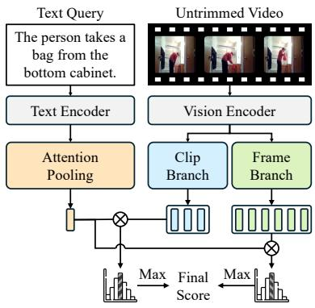  
(a) Dual-Branch Framework

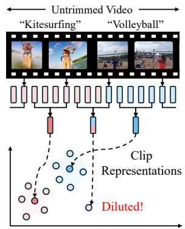  
(b) Semantic Dilution

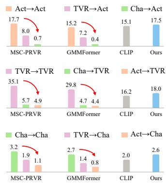  
(c) Cross-Domain Evaluation  
Figure 1: (a) Dual-branch framework of existing PRVR methods [6, 32, 43, 24, 31]. (b) Semantic dilution caused by fixed-size clip aggregation. (c) Cross-dataset comparison (R@1 (%)) on three datasets (TVR [23], ActivityNet Captions (Act) [21], Charades-STA (Cha) [9]) using CLIP-L [33] features. Each group shows in-domain (e.g., Act→Act) and cross-domain (e.g., TVR→Act) results for existing methods [43, 32], zero-shot CLIP, and our training-free TF-PRVR. (Best viewed in color.)

Despite these advances, existing PRVR methods [6, 43, 42, 24, 32, 31, 19] still face two critical challenges. The first challenge lies in the fixed video decomposition scheme that neglects the diverse temporal structures inherent in real-world videos. Videos naturally vary in their overall length, event density, and the duration of distinct events. Although the dual-branch framework (Fig. 1 (a)) attempts to capture multi-granularity features, applying the same predefined two-level hierarchy to all videos may not be sufficient to reflect their diverse temporal characteristics. Moreover, in the clip branch, existing methods aggregate consecutive frames into a fixed number of clip representations to construct potential query-relevant moments. Such aggregation may cause semantic dilution (Fig. 1 (b)), where frames from distinct events are merged into a single clip representation. For instance, when frames from the “Kitesurfing” and “Volleyball” events are pooled together, the resulting clip representation becomes semantically ambiguous, degrading the discriminability of query-relevant moments.

The second challenge arises from source-domain overfitting in existing training-based PRVR methods. As shown in Fig. 1 (c), while prior works [43, 32] achieve promising performance under in-domain evaluation, their retrieval accuracy drops significantly when transferred to unseen target datasets. For instance, MSC-PRVR [32] achieves an R@1 of 35.1% when trained and evaluated on TVR [23], but its performance drops to 5.7% and 4.9% when trained on Charades-STA [9] and ActivityNet Captions [21], respectively. Notably, these results fall substantially below those of the zero-shot CLIP [33] baseline (16.2%). These results suggest that, despite leveraging the rich semantic knowledge of pretrained vision-language models [33], the trainable modules tend to adapt to source-specific statistical patterns, leading to degraded retrieval performance on unseen target datasets. Such sensitivity to the source training distribution limits their applicability to heterogeneous video collections.

In this paper, we propose TF-PRVR, the first training-free framework for partially relevant video retrieval. We first revisit existing PRVR methods [6, 43, 42, 24, 32, 31, 19] through an in-depth analysis and identify two critical limitations: source-domain overfitting induced by task-specific training and fixed video decomposition that overlooks video-specific temporal structures. Motivated by these findings, TF-PRVR avoids PRVR-specific optimization and instead leverages the general semantic alignment of frozen vision-language models. Specifically, it derives temporal semantic signals from frame-level features and performs frequency-based multi-scale analysis to detect adaptive temporal boundaries, constructing hierarchical segments that preserve coherent event-level semantics and reduce semantic dilution. TF-PRVR then builds a query-independent unified multi-scale graph over these segments, over which query relevance is propagated to enforce temporal and semantic consistency. Finally, a moment-aware scoring strategy aggregates temporally aligned relevance across scales, emphasizing consistently supported moments while suppressing isolated responses. Extensive experiments demonstrate consistent training-free retrieval performance across datasets with diverse visual and temporal characteristics, highlighting the effectiveness of our training-free design.

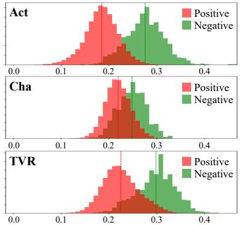  
Figure 2: Cosine similarity distributions of positive and negative text-video pairs.

Table 1: Maximum Mean Discrepancy (MMD) comparison of feature distributions across dataset pairs. MMD is computed on query-, clip-, and frame-level features between each dataset pair. Lower MMD indicates smaller cross-dataset distribution discrepancy.
<table><tr><td>Feature</td><td>Model</td><td>TVR vs Cha</td><td>TVR vs Act</td><td>Cha vs Act</td></tr><tr><td rowspan="3">Query</td><td>CLIP-L [33]</td><td>0.002</td><td>0.001</td><td>0.002</td></tr><tr><td>HLFormer [24]</td><td>0.054</td><td>0.013</td><td>0.051</td></tr><tr><td>MSC-PRVR [32]</td><td>0.063</td><td>0.019</td><td>0.048</td></tr><tr><td rowspan="3">Clip</td><td>CLIP-L [33]</td><td>0.019</td><td>0.017</td><td>0.003</td></tr><tr><td>HLFormer [24]</td><td>0.031</td><td>0.029</td><td>0.014</td></tr><tr><td>MSC-PRVR [32]</td><td>0.030</td><td>0.031</td><td>0.016</td></tr><tr><td rowspan="3">Frame</td><td>CLIP-L [33]</td><td>0.011</td><td>0.014</td><td>0.002</td></tr><tr><td>HLFormer [24]</td><td>0.030</td><td>0.025</td><td>0.013</td></tr><tr><td>MSC-PRVR [32]</td><td>0.029</td><td>0.028</td><td>0.018</td></tr></table>

## 2 Related Work

Partially Relevant Video Retrieval. Conventional text-to-video retrieval methods [15, 16, 17, 18, 41, 30] assume that videos are pre-trimmed and fully relevant to their paired queries, which limits their applicability to real-world untrimmed videos. To address this, partially relevant video retrieval (PRVR) [6, 43, 31, 4, 32, 24, 19, 7] has been introduced as a more practical setting, where a video is considered relevant if it contains at least one moment corresponding to the given query. MS-SL [6] first formulates PRVR as a multiple instance learning problem and proposes a dual-branch framework that encodes videos at both frame and clip scales via multi-scale sliding windows. However, exhaustive clip construction introduces substantial redundancy and storage overhead. To alleviate this, GMMFormer [43] proposes implicit clip modeling by incorporating Gaussian Mixture Model constraints into frame-level self-attention. ProtoPRVR [31] compresses diverse video contexts into compact prototypes to balance retrieval effectiveness and efficiency, and HLFormer [24] introduces hyperbolic space learning to better capture the hierarchical structure of untrimmed videos. Despite these advances, existing methods still rely on fixed video decomposition and task-specific training, making them vulnerable to semantic dilution and domain overfitting. In contrast, we address these issues with video-specific hierarchical representations and a fully training-free retrieval pipeline.

Frequency-Based Temporal Modeling. Frequency-domain analysis has been widely used to reveal temporal structures that are difficult to capture in the raw time domain. Early studies exploit Fourier based representations for action recognition and video captioning, such as HPM [34], which introduces a group-sparse Fourier Temporal Pyramid. Wavelet-based methods have also been used to model non-stationary temporal patterns, as in QUVA Repetition [36], which applies continuous wavelet transforms to optical-flow signals for repetition estimation. More recently, STMFANet [14] applies discrete wavelet transforms along spatial and temporal axes for multi-frequency video prediction. Inspired by these works, we first introduce frequency-based temporal modeling to PRVR. Unlike prior methods that mainly analyze low-level motion or pixel-domain signals, we decompose semantic transitions in frozen vision-language features to identify video-specific temporal boundaries, enabling adaptive hierarchical representation without task-specific training or moment-level annotations.

## 3 Revisiting the Limitations of Existing PRVR Methods

In this section, we empirically analyze two limitations of existing PRVR methods: source-domain overfitting from task-specific training (Sec. 3.1) and rigid video decomposition (Sec. 3.2).

## 3.1 Analysis of Source-Domain Overfitting

To investigate source-domain overfitting in training-based PRVR methods, we first examine text-video similarity distributions. For each dataset, we compute cosine similarities between text queries and videos and plot the distributions of positive pairs and sampled negative pairs in Fig. 2. The results show that both the score ranges and positive-negative margins differ across datasets. ActivityNet Captions [21] shows a relatively clear separation, while Charades-STA [9] has a narrower margin with stronger overlap between positives and negatives. TVR [23] exhibits a distinct distribution pattern. This suggests that ranking objectives optimized on a single dataset may become sensitive to dataset-specific score distributions, limiting their transferability to unseen datasets. To further quantify this discrepancy, we measure Maximum Mean Discrepancy (MMD) [11] between feature distributions across dataset pairs. As shown in Table 1, frozen CLIP-L [33] features maintain small cross-dataset MMD values (e.g., 0.002 between TVR and Cha), while trained PRVR models exhibit substantially larger values (e.g., 0.054 and 0.063 for HLFormer [24] and MSC-PRVR [32]). These results suggest that task-specific training amplifies cross-dataset distribution discrepancies relative to frozen CLIP features, consistent with performance degradation on unseen target datasets.

Table 2: Temporal span statistics under fixed-size clip sampling (32 clips).
<table><tr><td>Datasets</td><td>Avg. Span</td><td>Min. Span</td><td>Max. Span</td></tr><tr><td>Act [21]</td><td>204.01</td><td>2</td><td>1415</td></tr><tr><td>Cha [9]</td><td>91.39</td><td>16</td><td>606</td></tr><tr><td>TVR [23]</td><td>50.87</td><td>2</td><td>181</td></tr></table>

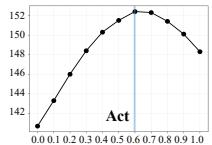

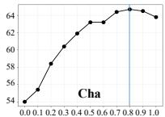  
(a) Dataset-Level Weight � Sweep

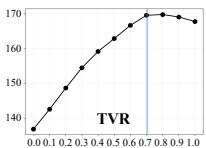

Table 3: SumR performance comparison of existing methods across video length groups on three benchmarks.
<table><tr><td rowspan="2">Datasets</td><td rowspan="2">Model</td><td colspan="3">Video Length</td></tr><tr><td>Full</td><td>Short</td><td>Long</td></tr><tr><td rowspan="3">Act [21]</td><td>MS-SL [6]</td><td>140.1</td><td>122.3</td><td>148.3</td></tr><tr><td>GMMFormer [43]</td><td>146.0</td><td>132.6</td><td>152.3</td></tr><tr><td>HLFormer [24]</td><td>154.9</td><td>144.0</td><td>157.4</td></tr><tr><td rowspan="3">Cha [9]</td><td>MS-SL [6]</td><td>68.4</td><td>67.6</td><td>65.3</td></tr><tr><td>GMMFormer [43]</td><td>72.9</td><td>76.0</td><td>64.4</td></tr><tr><td>HLFormer [24]</td><td>78.7</td><td>79.5</td><td>72.1</td></tr><tr><td rowspan="3">TVR [23]</td><td>MS-SL [6]</td><td>172.4</td><td>181.2</td><td>167.2</td></tr><tr><td>GMMFormer [43]</td><td>176.6</td><td>187.2</td><td>169.6</td></tr><tr><td>HLFormer [24]</td><td>187.7</td><td>199.1</td><td>178.9</td></tr></table>

Table 4: Dataset statistics including average moment and video lengths.

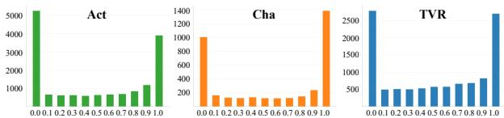  
(b) Distribution of Query-wise Optimal �

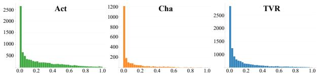  
(c) Query-wise Clip–Frame Temporal Distance Distribution

<table><tr><td rowspan="2">Datasets</td><td colspan="2">Average Length</td><td colspan="3">Moment-to-Video Ratio</td></tr><tr><td>Moments</td><td>Videos</td><td>Min</td><td>Max</td><td>Mean</td></tr><tr><td>Act [21]</td><td>36.2s</td><td>117.6s</td><td>0.48%</td><td>100%</td><td>30.8%</td></tr><tr><td>Cha [9]</td><td>8.1s</td><td>30.0s</td><td>4.3%</td><td>100%</td><td>26.3%</td></tr><tr><td>TVR [23]</td><td>9.1s</td><td>76.2s</td><td>0.48%</td><td>100%</td><td>11.9%</td></tr></table>

Figure 3: (a) Retrieval performance (SumR) across datasets when varying the weighting factor α. (b) Distribution of query-wise optimal α values obtained by selecting the best-performing weight for each query in the test set. (c) Distribution of normalized temporal distances between the clip and frame representations selected by max-pooling.

## 3.2 Analysis of Fixed Video Decomposition

Semantic Dilution. Previous PRVR methods [6, 43, 42, 24, 32, 31] construct clip-level video representations by compressing frame features into a fixed number of clips $( e . g . , 3 2 )$ via average pooling. As shown in Table 2, each clip spans approximately 204.1 frames on ActivityNet Captions (Act) [21], 91.4 on Charades-STA (Cha) [9], and 50.9 on TVR [23] on average. Such content-agnostic aggregation can cause semantic dilution, where discriminative visual cues are mixed with unrelated events and become semantically ambiguous. To examine how fixed decomposition interacts with different temporal characteristics, as shown in Table 3, we split each dataset into short and long video groups. On ActivityNet Captions, where moments are long relative to the video (moment-to-video ratio of 30.8% in Table 4), short videos suffer since long moments are fragmented across multiple clips, while long videos benefit as each clip better aligns with the moment duration. As a result, existing methods consistently perform better on long videos (e.g., 157.4 vs. 144.0 for HLFormer [24], 152.3 vs. 132.6 for GMMFormer [43]). The opposite trend holds on TVR, where moments are short (moment-to-video ratio of 11.9%), long videos suffer from semantic dilution as each clip aggregates unrelated events, while short videos better isolate the moment $( e . g .$ , 178.9 vs. 199.1 for HLFormer [24], 169.6 vs. 187.2 for GMMFormer [43]). These patterns highlight that fixed clip construction may not adapt to diverse temporal characteristics across videos, motivating the need for a video-specific representation with adaptive temporal granularity. We further provide a direct quantitative analysis of segmentation quality and semantic dilution in Appendix B.1.

Sensitivity to Retrieval Score Weighting. The final retrieval score in existing PRVR methods [6, 43, 24, 32, 31] is computed as $S = \alpha \cdot S _ { \mathrm { c l i p } } + ( 1 - \alpha ) \cdot S _ { \mathrm { f r a m e } }$ , where $S _ { \mathrm { c l i p } }$ and $S _ { \mathrm { f r a m e } }$ are obtained by max-pooling over clip and frame representations, and α balances the two branches. We analyze the sensitivity of retrieval performance to α. As shown in Fig. 3 (a), sweeping α with GMMFormer [43] shows that the optimal value differs across datasets (e.g., 0.6 for ActivityNet Captions [21] and 0.8 for Charades-STA [9]), suggesting that the relative importance of two branches depends on dataset-specific temporal characteristics. We further identify the optimal α for each test query as the value yielding the best rank for the ground-truth video. Figure 3 (b) shows substantial variation in these optima across queries, suggesting that a globally fixed weighting may be suboptimal.

Temporal Inconsistency in Branch-Wise Aggregation. Existing methods [6, 43, 24, 32, 31] independently aggregate clip- and frame-level similarities to compute the final retrieval score. However, this branch-wise aggregation does not ensure that the selected clip and frame representations correspond to the same temporal region. To examine this, we measure the normalized temporal distance between the clip and frame representations selected for each query, where values close to 0 indicate temporal alignment and values close to 1 indicate misalignment. As shown in Fig. 3 (c), the distance distribution shows a long-tailed pattern, indicating severe misalignment for a non-negligible number of queries. The same-group rate is only 28.8%, 48.6%, and 38.5% on ActivityNet Captions, Charades-STA, and TVR, respectively, demonstrating that a large portion of selected clip-frame pairs originate from different temporal regions. These results suggest that independent max-pooling aggregation may fail to ensure temporal consistency across branches, limiting the reliability of the final retrieval score.

## 4 TF-PRVR: Training-Free Partially Relevant Video Retrieval Framework

## 4.1 Overview

Motivated by the analyses in Sec. 3, we propose TF-PRVR, a training-free PRVR framework that avoids source-specific task optimization and addresses rigid video decomposition. Given a text query q and a corpus of N untrimmed videos $\mathcal { V } = \{ v _ { 1 } , v _ { 2 } , \ldots , v _ { N } \}$ , TF-PRVR ranks all videos in V by their partial relevance to q without any task-specific training. An overview is illustrated in Fig. 4 (a). TF-PRVR first extracts visual and textual representations using a frozen pre-trained vision-language model [33, 46, 39]. For each video, we encode individual frames to obtain framelevel features $\mathbf { \bar { \Gamma } } ^ { \prime } = [ f _ { 1 } , \mathbf { \bar { f } } _ { 2 } , \dots , f _ { N _ { t } } ] \in \mathbb { R } ^ { N _ { f } \times d }$ , where $N _ { f }$ and d denote the number of frames and feature dimension, respectively. For the text query, we use the [EOS] token embedding as the query representation $t \in \mathbb { R } ^ { \bar { d } }$ . Instead of constructing a fixed number of clip representations, TF-PRVR adaptively decomposes each video according to its semantic structure. It derives temporal semantic signals from frame features and detects video-specific boundaries across multiple temporal scales, producing hierarchical video segments. TF-PRVR then builds a unified multi-scale graph over these segments, where edges capture temporal and semantic relationships within and across scales. Querysegment similarities are used as initial relevance scores, refined through graph-based propagation, and finally aggregated by moment-aware scoring to produce the video-query score. We provide the detailed algorithms of our proposed modules in Appendix E.

## 4.2 Video-Specific Hierarchical Segmentation

Temporal Signal. Given frame features F, we first construct a temporal signal that captures semantic transitions across frames. Since relevant moments exhibit temporally coherent visual semantics, identifying changes in the semantic trajectory provides useful cues for locating potential event boundaries. To this end, we measure how the direction of semantic change varies over time. Specifically, we compute the frame-wise velocity vector between consecutive $\ell _ { 2 } \cdot$ -normalized frame features:

$$
\delta _ { t } = \hat { f } _ { t + 1 } - \hat { f } _ { t } , \quad t = 1 , \ldots , N _ { f } - 1 .\tag{1}
$$

We then define the temporal signal as the cosine dissimilarity between consecutive velocity vectors:

$$
s _ { t } = 1 - \langle \hat { \delta } _ { t } , \hat { \delta } _ { t + 1 } \rangle , \quad t = 1 , \dots , N _ { f } - 2 ,\tag{2}
$$

where $\hat { \delta } _ { t }$ denotes the $\ell _ { 2 }$ -normalized velocity at time t. A large value of $s _ { t }$ indicates a rapid change in the direction of semantic evolution, suggesting a potential boundary between distinct events.

Multi-Scale Decomposition. Since events in untrimmed videos can be defined at varying temporal granularities, a fixed two-level hierarchy may fail to capture video-specific semantic structures. To identify temporal boundaries at multiple granularities in a video-specific manner, we apply the Discrete Wavelet Transform (DWT) to decompose s into frequency components:

$$
\left[ a _ { L } , d _ { L } , d _ { L - 1 } , \ldots , d _ { 1 } \right] = \mathrm { \bf D W T } ( s ; w ) ,\tag{3}
$$

(c) Graph-Based Retrieval with  
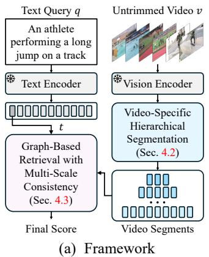  
Overview (Sec. 4.1)

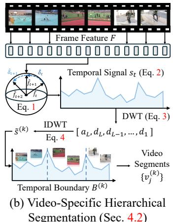

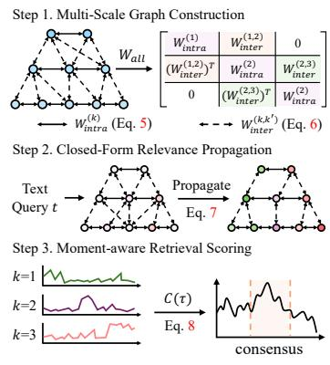  
Multi-Scale Consistency (Sec. 4.3)  
Figure 4: (a) Overview of TF-PRVR. (b) Video-specific hierarchical segmentation derives temporal semantic signals from frame features and decomposes them into multi-scale boundaries to construct coherent video segments. (c) Graph-based retrieval propagates query relevance over a unified multiscale segment graph and aggregates scale-consistent responses for moment-aware scoring.

where w denotes the wavelet basis $( e . g . , \mathrm { d } \mathsf { b } 4 ) , a _ { L }$ is the low-frequency approximation coefficient, and $d _ { \ell }$ is the detail coefficient at scale ℓ. Coarser scales $( e . g . , d _ { L } )$ capture long-range semantic transitions, while finer scales $( e . g . , d _ { 1 } )$ correspond to short-range local changes. The number of decomposition levels L varies across videos, naturally yielding a video-specific multi-scale representation.

Temporal Boundary Detection. Since the approximation coefficient $a _ { L }$ captures low-frequency trends rather than transitions, we focus on the detail coefficients $\{ d _ { k } \}$ , which encode semantic changes at each temporal scale. For each detail level k, we reconstruct a scale-specific temporal response by applying inverse DWT (IDWT) while retaining only the corresponding detail coefficient $d _ { k }$

$$
\tilde { s } ^ { ( k ) } = \mathrm { I D W T } ( [ 0 , \ldots , 0 , ~ d _ { k } , ~ 0 , \ldots , 0 ] ; ~ w ) ,\tag{4}
$$

where $\tilde { s } ^ { ( k ) }$ denotes the reconstructed response at scale k. We then detect temporal boundaries from local maxima of $| \tilde { s } ^ { ( k ) } |$ , obtaining a boundary set $B ^ { ( k ) }$ for each scale. Applying this process across all detail levels yields multi-scale boundary sets for video-specific hierarchical segmentation.

Hierarchical Segment Construction. Given the boundary set $B ^ { ( k ) }$ at scale k, we partition the video into contiguous segments using the detected boundaries. Each segment representation is obtained by average-pooling its frame features, yielding a scale-specific sequence $\{ \bar { v _ { j } ^ { ( k ) } } \} _ { j = 1 } ^ { M _ { k } }$ , where $M _ { k }$ varies across videos and scales. By constructing segments from semantic transition boundaries rather than fixed intervals, TF-PRVR preserves coherent visual semantics and reduces semantic dilution.

## 4.3 Graph-Based Retrieval with Multi-Scale Consistency

Built upon the hierarchical segment representations $\{ v _ { j } ^ { ( k ) } \} _ { j = 1 } ^ { M _ { k } }$ obtained at each scale $k ,$ we construct a unified multi-scale graph that captures both intra-level and inter-level relationships among segments. Given a text query, we initialize segment-level relevance scores and propagate them through the graph in closed form, enforcing multi-scale temporal consistency to produce a reliable final retrieval score.

Intra-Level Affinity. For each scale k, we construct an intra-level affinity matrix $W _ { \mathrm { i n t r a } } ^ { ( k ) } \in \mathbb { R } ^ { M _ { k } \times M _ { k } }$ Let $\hat { v } _ { i } ^ { ( k ) }$ denote the $\ell _ { 2 }$ -normalized segment representation. The affinity between segments i and $j$ at scale k is defined as a combination of visual similarity and temporal proximity:

$$
W _ { \mathrm { i n t r a } } ^ { ( k ) } [ i , j ] = \operatorname* { m a x } \{ 0 , \langle \hat { v } _ { i } ^ { ( k ) } , \hat { v } _ { j } ^ { ( k ) } \rangle \} + \exp ( - | t _ { i } ^ { ( k ) } - t _ { j } ^ { ( k ) } | / \tau _ { k } ) ,\tag{5}
$$

where $t _ { i } ^ { ( k ) }$ is the temporal center of segment $i ,$ and $\tau _ { k } = \overline { { \Delta t } } ^ { ( k ) }$ denotes the mean segment duration at scale k. This allows intra-level connections to adapt to the temporal granularity of each scale.

Inter-Level Affinity. To capture hierarchical relationships across scales, we define inter-level affinity between segments from adjacent levels k and $k ^ { \prime }$ with $| \dot { k } - k ^ { \prime } | = 1$ . The affinity is defined as:

$$
W _ { \mathrm { i n t e r } } [ \boldsymbol { i } ^ { ( k ) } , \boldsymbol { j } ^ { ( k ^ { \prime } ) } ] = \mathrm { I o U } ( [ s _ { i } ^ { ( k ) } , e _ { i } ^ { ( k ) } ] , [ s _ { j } ^ { ( k ^ { \prime } ) } , e _ { j } ^ { ( k ^ { \prime } ) } ] ) \cdot \operatorname* { m a x } \{ 0 , \langle \hat { v } _ { i } ^ { ( k ) } , \hat { v } _ { j } ^ { ( k ^ { \prime } ) } \rangle \} ,\tag{6}
$$

where $\mathrm { I o U } ( \cdot , \cdot )$ measures temporal overlap, and the cosine similarity term measures semantic consistency. By combining temporal overlap with visual similarity, inter-level edges connect segments that are both temporally aligned and semantically related. We only connect adjacent levels to preserve graph sparsity and prevent coarse segments from directly overriding fine-grained signals.

Unified Multi-Scale Graph. We assemble all intra- and inter-level affinity matrices into a unified block-structured adjacency matrix $W _ { \mathrm { a l l } }$ , where diagonal blocks correspond to intra-level affinities and off-diagonal blocks connect adjacent temporal scales. We then add self-connections and apply symmetric normalization [49] to obtain $W _ { \mathrm { n o r m } } .$ , enabling stable relevance propagation across both neighboring segments within the same scale and semantically aligned segments across scales.

Closed-Form Relevance Propagation. To enforce multi-scale relevance consistency efficiently, we adopt a closed-form solution based on graph-based propagation [49, 2, 44]. The refined relevance vector $r ^ { * } \in \mathbb { R } ^ { K _ { \mathrm { t o t a } } }$ l is obtained as:

$$
r ^ { * } = ( 1 - \beta ) ( I - \beta W _ { \mathrm { n o r m } } ) ^ { - 1 } y = K y ,\tag{7}
$$

where $\beta \in ( 0 , 1 )$ balances the initial and propagated relevance, and $\mathcal { K } = ( 1 - \beta ) ( I - \beta W _ { \mathrm { n o r m } } ) ^ { - 1 }$ is a query-independent propagation kernel. Since K depends only on the video graph, it can be precomputed for each video, reducing inference for any query to a single matrix-vector product.

Moment-Aware Retrieval Scoring. After relevance propagation, we compute the final video-level score by aggregating temporally aligned relevance across scales. Specifically, we define a dense temporal grid $\{ \tau \}$ over the video and compute a consensus score at each time point by averaging the propagated relevance scores of the segments covering τ:

$$
C ( \tau ) = \frac { 1 } { | \mathcal { K } _ { \tau } | } \sum _ { k \in \mathcal { K } _ { \tau } } r ^ { * ( k ) } ( \tau ) ,\tag{8}
$$

where $r ^ { * ( k ) } ( \tau )$ is the propagated relevance of the segment at scale $k$ containing $\tau ,$ and $\scriptstyle { \mathcal { K } } _ { \tau }$ is the set of scales covering $\tau .$ . The final score is the strongest temporal consensus, $i . e . , S _ { \mathrm { v i d e o } } = \operatorname* { m a x } _ { \tau } C ( \tau )$ This strategy emphasizes multi-scale consistent responses and suppresses isolated single-scale peaks.

## 5 Experiments

## 5.1 Experimental Setup

Datasets and Evaluation Metrics. We evaluate TF-PRVR on three standard PRVR benchmarks: ActivityNet Captions [21], Charades-STA [9], and TV show Retrieval (TVR) [23]. ActivityNet Captions contains diverse YouTube activity videos with temporally localized descriptions, Charades-STA provides sentence-level annotations for indoor activity segments, and TVR includes videos from six TV shows paired with moment-level natural language queries. Following prior PRVR works [6, 43, 32, 24, 31], we use the standard splits for all datasets. We report rank-based retrieval metrics, R@K with $K \in \{ 1 , 5 , 1 0 , 1 0 0 \}$ }, and SumR, the sum R@1, R@5, R@10, and R@100.

Implementation Details. TF-PRVR is implemented with frozen vision-language backbones and requires no task-specific training. We evaluate three backbones: CLIP-L/14 [33], SigLIP-L/14 [46], and EVA-CLIP-L/14 [39]. We perform multi-scale boundary detection with the db4 wavelet and precompute the query-independent propagation kernel offline. The propagation coefficient is fixed to $\beta = 0 . 7$ for all datasets. At inference, text queries are encoded by the frozen text encoder, followed by graph-based relevance propagation and moment-aware scoring. Experiments are conducted on an NVIDIA RTX 6000 Ada GPU with an Intel Xeon Scalable Processor 6526Y CPU.

## 5.2 Comparison with the State-of-the-Art

Cross-Dataset Transfer Comparison. We examine the transfer degradation of existing training-based PRVR methods by training them on source datasets and evaluating them on ActivityNet Captions [21].

Table 5: Comparison on ActivityNet Captions [21] under cross-dataset transfer and training-free settings. Source training data indicates the PRVR training dataset(s). TF-PRVR† and TF-PRVR‡ use CLIP-L/14 and EVA-CLIP-L/14 [39], respectively, without source-domain PRVR training.
<table><tr><td>Source Training Data</td><td>Method</td><td>R@1</td><td>R@5</td><td>R@10</td><td>R@100</td><td>SumR</td></tr><tr><td colspan="7">Training-based methods with CLIP-L [33]</td></tr><tr><td rowspan="4">Charades-STA [9]</td><td>MS-SL [6]</td><td>0.4</td><td>2.2</td><td>3.9</td><td>17.3</td><td>23.8</td></tr><tr><td>GMMFormer [43]</td><td>0.4</td><td>2.6</td><td>4.3</td><td>18.8</td><td>26.1</td></tr><tr><td>GMMFormerv2 [42]</td><td>0.6</td><td>2.8</td><td>4.6</td><td>19.6</td><td>27.6</td></tr><tr><td>MSC-PRVR [32]</td><td>0.7</td><td>2.8</td><td>4.5</td><td>20.1</td><td>28.1</td></tr><tr><td rowspan="4">TVR [23]</td><td>MS-SL [6]</td><td>6.9</td><td>19.8</td><td>26.5</td><td>59.1</td><td>112.3</td></tr><tr><td>GMMFormer [43]</td><td>7.2</td><td>20.6</td><td>27.1</td><td>61.2</td><td>116.1</td></tr><tr><td>GMMFormerv2 [42]</td><td>8.1</td><td>21.9</td><td>30.8</td><td>62.9</td><td>123.7</td></tr><tr><td>MSC-PRVR [32]</td><td>8.0</td><td>21.1</td><td>30.1</td><td>64.6</td><td>123.8</td></tr><tr><td rowspan="4">Charades-STA [9] + TVR [23]</td><td>MS-SL [6]</td><td>5.4</td><td>15.8</td><td>21.2</td><td>58.9</td><td>101.3</td></tr><tr><td>GMMFormer [43]</td><td>5.9</td><td>16.8</td><td>22.4</td><td>60.0</td><td>105.1</td></tr><tr><td>GMMFormerv2 [42]</td><td>5.6</td><td>16.2</td><td>20.9</td><td>60.8</td><td>103.5</td></tr><tr><td>MSC-PRVR [32]</td><td>6.1</td><td>17.1</td><td>24.8</td><td>58.3</td><td>106.3</td></tr><tr><td colspan="7">Training-free methods</td></tr><tr><td>None</td><td>TF-PRVR† (Ours)</td><td>17.5</td><td>35.1</td><td>55.7</td><td>85.6</td><td>193.9</td></tr><tr><td></td><td>TF-PRVR‡ (Ours)</td><td>18.8</td><td>37.3</td><td>56.9</td><td>87.8</td><td>200.8</td></tr></table>

As shown in Table 5, training-based methods suffer substantial degradation when transferred to the unseen target dataset. For example, MSC-PRVR [32] obtains SumR scores of 28.1, 123.8, and 106.3 when trained on Charades-STA [9], TVR [23], and their combination, respectively, compared with 202.1 under in-domain ActivityNet training (Table 6). These results suggest that task-specific PRVR optimization can lead to substantial source dependence. In contrast, TF-PRVR‡ achieves a SumR of 200.8 on ActivityNet Captions without any source-domain PRVR training, exceeding all source-trained baselines evaluated on the same target dataset. This result demonstrates effective training-free retrieval without relying on source-specific optimization. Additional comparisons on Charades-STA and TVR are provided in Tables A2 and A3, respectively.

In-Domain and Training-Free Comparison. We compare TF-PRVR with existing state-of-the-art PRVR methods on ActivityNet Captions, Charades-STA, and TVR. Training-based methods are evaluated on the same dataset used for training, whereas TF-PRVR requires no PRVR-specific training. As shown in Table 6, TF-PRVR achieves competitive performance across all three benchmarks. On ActivityNet Captions, TF-PRVR obtains an R@1 of 17.5, comparable to MSC-PRVR [32] at 17.7, indicating that video-specific hierarchical segmentation and graph-based relevance propagation can effectively exploit frozen vision-language representations without target-specific optimization. TF-PRVR also improves over the CLIP-L zero-shot baseline, increasing SumR from 172.9 to 193.9 on ActivityNet Captions, from 73.1 to 80.8 on Charades-STA, and from 167.2 to 178.3 on TVR. Notably, several training-based methods with CNN-based visual backbones, such as ResNet152+I3D, underperform CLIP-L zero-shot on ActivityNet Captions and TVR, suggesting that strong visionlanguage alignment can provide substantial benefits even without task-specific training. Although training-based methods achieve higher overall in-domain performance, TF-PRVR remains competitive without PRVR-specific optimization, highlighting the effectiveness of our training-free design.

## 5.3 Ablation Study

Backbone Ablation. We examine whether TF-PRVR consistently improves retrieval performance across different frozen vision-language backbones. As shown in Table 7 (a), TF-PRVR substantially improves over the corresponding zero-shot baseline for all backbones. Specifically, TF-PRVR increases SumR from 172.9 to 193.9 with CLIP-L/14 [33], from 178.7 to 198.5 with SigLIP-L/14 [46], and from 180.4 to 200.8 with EVA-CLIP-L/14 [39]. These consistent gains indicate that TF-PRVR is not tied to a specific backbone. Since our modules operate directly on frozen frame and text features without any task-specific optimization, they can be applied in a plug-and-play manner to different pre-trained vision-language models, demonstrating the flexibility of our training-free framework.

Module Component Ablation. We analyze the contribution of each module in TF-PRVR. As shown in Table 7 (b), we start from the zero-shot EVA-CLIP-L/14 [39] baseline, which scores videos by maxpooling frame-query similarities. Fixed Seg. follows the conventional two-branch setting: it uniformly constructs fixed clip-level segments in addition to frame-level representations, independently applies max pooling in both branches, and combines their scores. This improves SumR from 180.4 to 186.6, but remains limited by content-agnostic decomposition. Replacing it with hierarchical segmentation (HS) increases SumR to 194.7, showing the benefit of video-specific multi-scale semantic boundaries. Adding graph-based relevance propagation (GP) further refines query-segment relevance over the multi-scale graph, improving SumR to 197.8. Finally, moment-aware scoring (MAS) aggregates temporally aligned relevance across scales, achieving the best SumR of 200.8. These results show that HS reduces semantic dilution, while GP and MAS enhance multi-scale temporal consistency.

Table 6: Comparison with state-of-the-art PRVR methods on ActivityNet Captions [21], Charades-STA [9], and TVR [23]. Training-based methods are evaluated in-domain, while training-free methods require no PRVR-specific training. Methods are grouped by training setting and backbone.
<table><tr><td rowspan="2">Method</td><td colspan="5">ActivityNet Captions [21]</td><td colspan="5">Charades-STA [9]</td><td colspan="5">TVR [23]</td></tr><tr><td>R@1</td><td>R@5</td><td>R@10</td><td>R@100</td><td>SumR</td><td>R@1</td><td>R@5</td><td>R@10</td><td>R@100</td><td>SumR</td><td>R@1</td><td>R@5</td><td>R@10</td><td>R@100</td><td>SumR</td></tr><tr><td colspan="10">Training-based methods with ResNet152 [12] + I3D [3] + RoBERTa [27]</td><td colspan="7"></td></tr><tr><td>MS-SL [6]</td><td>7.1</td><td>22.5</td><td>34.7</td><td>75.8</td><td>140.1</td><td>1.8</td><td>7.1</td><td>11.8</td><td>47.7</td><td>68.4</td><td>13.5</td><td>32.1</td><td>43.4</td><td>83.4</td><td>172.4</td></tr><tr><td>PEAN [13]</td><td>7.4</td><td>23.0</td><td>35.5</td><td>75.9</td><td>141.8</td><td>2.7</td><td>8.1</td><td>13.5</td><td>50.3</td><td>74.7</td><td>13.5</td><td>32.8</td><td>44.1</td><td>83.9</td><td>174.2</td></tr><tr><td>LH [8]</td><td>7.4</td><td>23.5</td><td>35.8</td><td>75.8</td><td>142.4</td><td>2.1</td><td>7.5</td><td>12.9</td><td>50.1</td><td>72.7</td><td>13.2</td><td>33.2</td><td>44.4</td><td>85.5</td><td>176.3</td></tr><tr><td>BGM-Net [45]</td><td>7.2</td><td>23.8</td><td>36.0</td><td>76.9</td><td>143.9</td><td>1.9</td><td>7.4</td><td>12.2</td><td>50.1</td><td>71.6</td><td>14.1</td><td>34.7</td><td>45.9</td><td>85.2</td><td>179.9</td></tr><tr><td>GMMFormer [43]</td><td>8.3</td><td>24.9</td><td>36.7</td><td>76.1</td><td>146.0</td><td>2.1</td><td>7.8</td><td>12.5</td><td>50.6</td><td>72.9</td><td>13.9</td><td>33.3</td><td>44.5</td><td>84.9</td><td>176.6</td></tr><tr><td>DL-DKD [7]</td><td>8.0</td><td>25.0</td><td>37.5</td><td>77.1</td><td>147.6</td><td>一</td><td></td><td></td><td></td><td></td><td>14.4</td><td>34.9</td><td>45.8</td><td>84.9</td><td>179.9</td></tr><tr><td>GMMFormerv2 [42]</td><td>8.9</td><td>27.1</td><td>40.2</td><td>78.7</td><td>154.9</td><td>2.5</td><td>8.6</td><td>13.9</td><td>53.2</td><td>78.2</td><td>16.2</td><td>37.6</td><td>48.8</td><td>86.5</td><td>189.1</td></tr><tr><td>ProtoPRVR [31]</td><td>7.9</td><td>24.9</td><td>37.2</td><td>77.3</td><td>147.4</td><td>-</td><td>1</td><td>一</td><td></td><td>-</td><td>15.4</td><td>35.9</td><td>47.5</td><td>86.4</td><td>185.2</td></tr><tr><td>HLFormer [24]]</td><td>8.7</td><td>27.1</td><td>40.1</td><td>79.0</td><td>154.9</td><td>2.6</td><td>8.5</td><td>13.7</td><td>54.0</td><td>78.7</td><td>15.7</td><td>37.1</td><td>48.5</td><td>86.4</td><td>187.7</td></tr><tr><td colspan="10">Training-based methods with CLIP-L [33]</td><td colspan="7"></td></tr><tr><td>MS-SL [6]</td><td>14.7</td><td>37.1</td><td>50.4</td><td>84.6</td><td>186.7</td><td>3.4</td><td>11.5</td><td>18.7</td><td>62.5</td><td>96.0</td><td>31.9</td><td>57.6</td><td>67.7</td><td>93.8</td><td>251.0</td></tr><tr><td>GMMFormer [43]</td><td>15.2</td><td>37.7</td><td>50.5</td><td>83.7</td><td>187.1</td><td>2.7</td><td>10.5</td><td>16.7</td><td>59.4</td><td>89.3</td><td>29.8</td><td>54.2</td><td>64.6</td><td>92.5</td><td>241.1</td></tr><tr><td>AMDNet [38]</td><td>14.0</td><td>36.3</td><td>49.9</td><td>84.2</td><td>184.5</td><td>2.1</td><td>7.8</td><td>13.9</td><td>57.2</td><td>81.1</td><td>27.7</td><td>52.3</td><td>63.3</td><td>92.3</td><td>235.6</td></tr><tr><td>BGM-Net [45]</td><td>15.6</td><td>37.9</td><td>51.3</td><td>85.4</td><td>190.3</td><td>3.0</td><td>11.8</td><td>18.2</td><td>63.7</td><td>96.7</td><td>31.1</td><td>56.3</td><td>66.5</td><td>93.8</td><td>247.7</td></tr><tr><td>GMMFormerv2 [42]</td><td>17.1</td><td>40.6</td><td>53.7</td><td>85.5</td><td>196.9</td><td>3.1</td><td>11.6</td><td>18.2</td><td>61.4</td><td>94.2</td><td>34.0</td><td>59.7</td><td>69.8</td><td>94.6</td><td>258.1</td></tr><tr><td>ProtoPRVR [31]</td><td>16.0</td><td>38.8</td><td>52.4</td><td>85.1</td><td>192.3</td><td>一</td><td></td><td></td><td></td><td></td><td>34.7</td><td>60.0</td><td>70.1</td><td>94.4</td><td>259.2</td></tr><tr><td>ARL [4]</td><td>15.3</td><td>38.4</td><td>51.5</td><td>85.2</td><td>190.4</td><td></td><td></td><td></td><td></td><td></td><td>34.6</td><td>60.4</td><td>70.7</td><td>94.4</td><td>260.1</td></tr><tr><td>MSC-PRVR [32]</td><td>17.7</td><td>42.0</td><td>55.6</td><td>86.8</td><td>202.1</td><td>3.2</td><td>12.6</td><td>20.1</td><td>63.8</td><td>99.7</td><td>35.1</td><td>61.6</td><td>71.5</td><td>94.9</td><td>263.1</td></tr><tr><td colspan="10">Training-free methods with CLIP-L [33]</td><td colspan="7"></td></tr><tr><td>CLIP-L Zero-shot [33]</td><td>15.1</td><td>33.9</td><td>45.1</td><td>78.9</td><td>172.9</td><td>2.0</td><td>8.1</td><td>13.6</td><td>49.4</td><td>73.1</td><td>16.2</td><td>33.5</td><td>41.8</td><td>75.7</td><td>167.2</td></tr><tr><td>TF-PRVR (Ours)</td><td>17.5</td><td>35.1</td><td>55.7</td><td>85.6</td><td>193.9</td><td>2.6</td><td>9.1</td><td>15.5</td><td>53.6</td><td>80.8</td><td>18.0</td><td>35.8</td><td>45.4</td><td>79.1</td><td>178.3</td></tr></table>

Table 7: Ablation studies on ActivityNet Captions [21]. HS, GP, and MAS denote hierarchical segmentation, graph-based relevance propagation, and moment-aware scoring, respectively.  
(a) Backbone ablation.
<table><tr><td>Backbone</td><td>Method</td><td>SumR</td></tr><tr><td>CLIP-L/14 [33] CLIP-L/14 [33]</td><td>Zero-shot TF-PRVR</td><td>172.9 193.9</td></tr><tr><td>SigLIP-L/14 [46] SigLIP-L/14 [46]</td><td>Zero-shot TF-PRVR</td><td>178.7 198.5</td></tr><tr><td>EVA-CLIP-L/14 [39]</td><td>Zero-shot</td><td>180.4</td></tr><tr><td>EVA-CLIP-L/14 [39]</td><td>TF-PRVR</td><td>200.8</td></tr></table>

(b) Module components ablation.
<table><tr><td>Method</td><td>HS</td><td></td><td>GP MAS</td><td>SumR</td></tr><tr><td>EVA-CLIP-L/14 [39]</td><td></td><td></td><td>一</td><td>180.4</td></tr><tr><td>+ Fixed Seg.</td><td></td><td>-</td><td>=</td><td>186.6</td></tr><tr><td>+ HS</td><td>√</td><td>-</td><td>-</td><td>194.7</td></tr><tr><td>+ HS + GP</td><td>√</td><td>√</td><td>-</td><td>197.8</td></tr><tr><td>TF-PRVR</td><td>√</td><td>√</td><td>√</td><td>200.8</td></tr></table>

(c) Temporal signal ablation.
<table><tr><td>Temporal Signal</td><td>SumR</td></tr><tr><td>Uniform fixed intervals</td><td>191.8</td></tr><tr><td>Adjacent feature dissimilarity</td><td>196.5</td></tr><tr><td>Self-similarity matrix</td><td>197.6</td></tr><tr><td>Velocity-direction change</td><td>200.8</td></tr></table>

Temporal Signal Ablation. We further analyze the effect of different temporal signals for constructing video-specific boundaries. In Table 7 (c), all other modules are fixed, and only the temporal signal construction strategy is varied. Uniform fixed intervals divide videos without visual content, and thus cannot adapt to video-specific semantic transitions. Adjacent feature dissimilarity measures cosine dissimilarity between consecutive frame features, but can be sensitive to local appearance changes. Self-similarity matrix derives boundary responses from changes in local similarity patterns within a temporal window, but requires a predefined window size and may produce overly smooth responses. In contrast, our velocity-direction change signal captures changes in the direction of semantic evolution, making it more effective for detecting transitions between distinct events. As shown in Table 7 (c), it achieves the best SumR of 200.8, outperforming the other variants by 3.2–9.0 points. Therefore, we adopt velocity-direction change as the default temporal signal in TF-PRVR. Additional ablation studies and qualitative results are provided in the supplementary material.

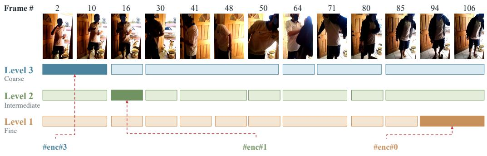

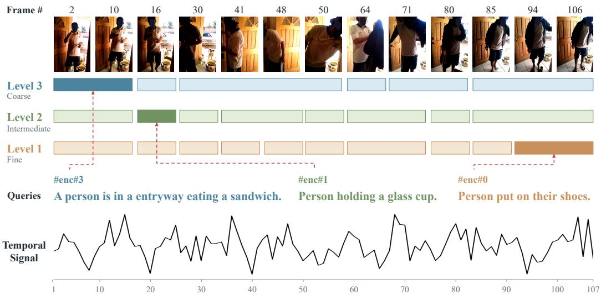  
Figure 5: Qualitative visualization of video-specific hierarchical segmentation on Charades-STA [9]. The rows show segments at different DWT levels, while the temporal signal is shown below. Red dashed lines connect example queries to their best-matched segments.

## 5.4 Qualitative Result

Figure 5 visualizes the video-specific hierarchical segmentation produced by our DWT-based decomposition on a representative Charades-STA video (9JZO2, 107 frames). Each level captures temporal structure at a different granularity: finer levels (Level 1) produce shorter segments that isolate local events, while coarser levels (Level 3) capture broader temporal context. The red dashed lines show that the example text queries align with different segments across levels, illustrating how the hierarchy can capture query-relevant content at appropriate temporal scales. In contrast, fixed clip construction would aggregate approximately 3 frames per clip for this video, fragmenting relevant moments across multiple clips and potentially mixing them with unrelated content. Our video-specific segmentation instead adapts the temporal granularity to the underlying video structure, producing more semantically coherent segments and reducing the risk of semantic dilution.

## 6 Limitations and Future Work

While TF-PRVR achieves consistent training-free retrieval across diverse datasets, its performance depends on the zero-shot capability of the frozen backbone and may be limited in specialized domains. TF-PRVR also requires precomputing and storing the multi-scale graph and propagation kernel, increasing indexed query latency and memory. Despite this overhead, these query-independent components are computed once and reused across queries. Future work may address these limitations by leveraging stronger frozen backbones and developing more memory-efficient relevance propagation.

## 7 Conclusion

In this paper, we have proposed TF-PRVR, a training-free framework for partially relevant video retrieval. Through our analyses and experiments, we have shown that existing PRVR methods are limited by source-domain overfitting induced by task-specific training and rigid video decomposition that cannot fully capture the diverse temporal structures of untrimmed videos. To address these issues, TF-PRVR avoids PRVR-specific optimization, preserves the general-purpose alignment of frozen vision-language models, and constructs video-specific hierarchical representations based on adaptive temporal boundaries. We have further introduced a query-independent unified multi-scale graph with relevance propagation and moment-aware scoring to enforce temporal and semantic consistency across hierarchical segments. Extensive experiments show that TF-PRVR remains effective across datasets with diverse visual and temporal characteristics without source- or target-specific PRVR training. We believe our work provides a practical direction for training-free PRVR.

## Acknowledgements

This work was supported by the National Research Foundation of Korea (NRF) grant funded by the Korea government (MSIT) (RS-2024-00355008), the Institute of Information & communications Technology Planning & Evaluation (IITP) grant funded by the Korea government (MSIT) (RS-2025- 25422680), and the Startup Technology Development Program (RS-2026-25513099) funded by the Ministry of SMEs and Startups (MSS, Korea).

## References

[1] L. Anne Hendricks, O. Wang, E. Shechtman, J. Sivic, T. Darrell, and B. Russell. Localizing moments in video with natural language. In Proceedings of the IEEE international conference on computer vision, pages 5803–5812, 2017.

[2] M. Belkin, P. Niyogi, and V. Sindhwani. Manifold regularization: A geometric framework for learning from labeled and unlabeled examples. Journal of Machine Learning Research, 7:2399–2434, 2006.

[3] J. Carreira and A. Zisserman. Quo vadis, action recognition? a new model and the Kinetics dataset. In Proceedings of the IEEE Conference on Computer Vision and Pattern Recognition, pages 6299–6308, 2017.

[4] C.-H. Cho, W. Moon, W. Jun, M. Jung, and J.-P. Heo. Ambiguity-restrained text-video representation learning for partially relevant video retrieval. In Proceedings of the AAAI Conference on Artificial Intelligence, volume 39, pages 2500–2508, 2025.

[5] D. Damen, H. Doughty, G. M. Farinella, A. Furnari, E. Kazakos, J. Ma, D. Moltisanti, J. Munro, T. Perrett, W. Price, et al. Rescaling egocentric vision: Collection, pipeline and challenges for epic-kitchens-100. International Journal ofComputer Vision, 130(1):33–55, 2022.

[6] J. Dong, X. Chen, M. Zhang, X. Yang, S. Chen, X. Li, and X. Wang. Partially relevant video retrieval. In Proceedings of the 30th ACM International Conference on Multimedia, pages 246–257, 2022.

[7] J. Dong, M. Zhang, Z. Zhang, X. Chen, D. Liu, X. Qu, X. Wang, and B. Liu. Dual learning with dynamic knowledge distillation for partially relevant video retrieval. In Proceedings ofthe IEEE/CVF International Conference on Computer Vision, pages 11302–11312, 2023.

[8] S. Fang, T. Dang, S. Wang, and Q. Huang. Linguistic hallucination for text-based video retrieval. IEEE Transactions on Circuits and Systems for Video Technology, 34(10):9692–9705, 2024.

[9] J. Gao, C. Sun, Z. Yang, and R. Nevatia. TALL: Temporal activity localization via language query. In Proceedings ofthe IEEE International Conference on Computer Vision, pages 5267–5275, 2017.

[10] J. Gao and C. Xu. Fast video moment retrieval. In 2021 IEEE/CVF International Conference on Computer Vision (ICCV), pages 1503–1512. IEEE, 2021.

[11] A. Gretton, K. M. Borgwardt, M. J. Rasch, B. Schölkopf, and A. Smola. A kernel two-sample test. The Journal ofMachine Learning Research, 13:723–773, 2012.

[12] K. He, X. Zhang, S. Ren, and J. Sun. Deep residual learning for image recognition. In Proceedings of the IEEE Conference on Computer Vision and Pattern Recognition, pages 770–778, 2016.

[13] X. Jiang, Z. Chen, X. Xu, F. Shen, Z. Cao, and X. Cai. Progressive event alignment network for partial relevant video retrieval. In 2023 IEEE International Conference on Multimedia and Expo (ICME), pages 1973–1978. IEEE, 2023.

[14] B. Jin, Y. Hu, Q. Tang, J. Niu, Z. Shi, Y. Han, and X. Li. Exploring spatial-temporal multi-frequency analysis for high-fidelity and temporal-consistency video prediction. In Proceedings of the IEEE/CVF Conference on Computer Vision and Pattern Recognition, pages 4554–4563, 2020.

[15] P. Jin, J. Huang, F. Liu, X. Wu, S. Ge, G. Song, D. Clifton, and J. Chen. Expectation-maximization contrastive learning for compact video-and-language representations. Advances in Neural Information Processing Systems, 35:30291–30306, 2022.

[16] P. Jin, J. Huang, P. Xiong, S. Tian, C. Liu, X. Ji, L. Yuan, and J. Chen. Video-text as game players: Hierarchical Banzhaf interaction for cross-modal representation learning. In Proceedings ofthe IEEE/CVF Conference on Computer Vision and Pattern Recognition, pages 2472–2482, 2023.

[17] P. Jin, H. Li, Z. Cheng, J. Huang, Z. Wang, L. Yuan, C. Liu, and J. Chen. Text-video retrieval with disentangled conceptualization and set-to-set alignment. arXiv preprint arXiv:2305.12218, 2023.

[18] P. Jin, H. Li, Z. Cheng, K. Li, X. Ji, C. Liu, L. Yuan, and J. Chen. DiffusionRet: Generative text-video retrieval with diffusion model. In Proceedings of the IEEE/CVF International Conference on Computer Vision, pages 2470–2481, 2023.

[19] W. Jun, W. Moon, C.-H. Cho, M. Jung, and J.-P. Heo. Bridging the semantic granularity gap between text and frame representations for partially relevant video retrieval. In Proceedings of the AAAI Conference on Artificial Intelligence, volume 39, pages 4166–4174, 2025.

[20] M. Jung, S. Choi, J. Kim, J.-H. Kim, and B.-T. Zhang. Modal-specific pseudo query generation for video corpus moment retrieval. In Proceedings ofthe 2022 Conference on Empirical Methods in Natural Language Processing, pages 7769–7781, 2022.

[21] R. Krishna, K. Hata, F. Ren, L. Fei-Fei, and J. Carlos Niebles. Dense-captioning events in videos. In Proceedings of the IEEE International Conference on Computer Vision, pages 706–715, 2017.

[22] J. Lei, T. L. Berg, and M. Bansal. Detecting moments and highlights in videos via natural language queries. Advances in Neural Information Processing Systems, 34:11846–11858, 2021.

[23] J. Lei, L. Yu, T. L. Berg, and M. Bansal. TVR: A large-scale dataset for video-subtitle moment retrieval. In European Conference on Computer Vision, pages 447–463. Springer, 2020.

[24] J. Li, J. Wang, C. Tan, N. Lian, L. Chen, Y. Wang, M. Zhang, S.-T. Xia, and B. Chen. Enhancing partially relevant video retrieval with hyperbolic learning. In Proceedings ofthe IEEE/CVF International Conference on Computer Vision, pages 23074–23084, 2025.

[25] L. Li, Y.-C. Chen, Y. Cheng, Z. Gan, L. Yu, and J. Liu. Hero: Hierarchical encoder for video+ language omni-representation pre-training. In Proceedings of the 2020 conference on empirical methods in natural language processing (EMNLP), pages 2046–2065, 2020.

[26] D. Liu, X. Qu, J. Dong, P. Zhou, Y. Cheng, W. Wei, Z. Xu, and Y. Xie. Context-aware biaffine localizing network for temporal sentence grounding. In 2021 IEEE/CVF Conference on Computer Vision and Pattern Recognition (CVPR), pages 11235–11244, 2021.

[27] Y. Liu, M. Ott, N. Goyal, J. Du, M. Joshi, D. Chen, O. Levy, M. Lewis, L. Zettlemoyer, and V. Stoyanov. RoBERTa: A robustly optimized BERT pretraining approach. arXiv preprint arXiv:1907.11692, 2019.

[28] D. Luo, J. Huang, S. Gong, H. Jin, and Y. Liu. Towards generalisable video moment retrieval: Visualdynamic injection to image-text pre-training. In 2023 IEEE/CVF Conference on Computer Vision and Pattern Recognition (CVPR), pages 23045–23055. IEEE, 2023.

[29] D. Luo, J. Huang, S. Gong, H. Jin, and Y. Liu. Zero-shot video moment retrieval from frozen visionlanguage models. In 2024 IEEE/CVF Winter Conference on Applications ofComputer Vision (WACV), pages 5452–5461. IEEE, 2024.

[30] Y. Ma, G. Xu, X. Sun, M. Yan, J. Zhang, and R. Ji. X-CLIP: End-to-end multi-grained contrastive learning for video-text retrieval. In Proceedings of the 30th ACM International Conference on Multimedia, pages 638–647, 2022.

[31] W. Moon, C.-H. Cho, W. Jun, T. Kim, I. Lee, D. Wee, M. Shim, and J.-P. Heo. Prototypes are balanced units for efficient and effective partially relevant video retrieval. In Proceedings ofthe IEEE/CVF International Conference on Computer Vision, pages 21789–21799, 2025.

[32] W. Moon, M. Jung, G. Park, T.-Y. Kim, C.-H. Cho, W. Jun, and J.-P. Heo. Mitigating semantic collapse in partially relevant video retrieval. In Advances in Neural Information Processing Systems, volume 38, pages 26288–26309, 2025.

[33] A. Radford, J. W. Kim, C. Hallacy, A. Ramesh, G. Goh, S. Agarwal, G. Sastry, A. Askell, P. Mishkin, J. Clark, et al. Learning transferable visual models from natural language supervision. In International Conference on Machine Learning, pages 8748–8763. PMLR, 2021.

[34] H. Rahmani and A. Mian. 3D action recognition from novel viewpoints. In Proceedings of the IEEE Conference on Computer Vision and Pattern Recognition, pages 1506–1515, 2016.

[35] A. Rohrbach, M. Rohrbach, W. Qiu, A. Friedrich, M. Pinkal, and B. Schiele. Coherent multi-sentence video description with variable level of detail. In German conference on pattern recognition, pages 184–195. Springer, 2014.

[36] T. F. Runia, C. G. Snoek, and A. W. Smeulders. Real-world repetition estimation by div, grad and curl. In Proceedings of the IEEE Conference on Computer Vision and Pattern Recognition, pages 9009–9017, 2018.

[37] M. Soldan, M. Xu, S. Qu, J. Tegner, and B. Ghanem. Vlg-net: Video-language graph matching network for video grounding. In 2021 IEEE/CVF International Conference on Computer Vision Workshops (ICCVW), pages 3217–3227. IEEE, 2021.

[38] P. Song, L. Zhang, L. Lan, W. Chen, D. Guo, X. Yang, and M. Wang. Towards efficient partially relevant video retrieval with active moment discovering. IEEE Transactions on Multimedia, 27:6740–6751, 2025.

[39] Q. Sun, Y. Fang, L. Wu, X. Wang, and Y. Cao. EVA-CLIP: Improved training techniques for CLIP at scale. arXiv preprint arXiv:2303.15389, 2023.

[40] G. Wang, X. Wu, Z. Liu, and J. Yan. Prompt-based zero-shot video moment retrieval. In Proceedings of the 30th ACM international conference on multimedia, pages 413–421, 2022.

[41] J. Wang, B. Chen, D. Liao, Z. Zeng, G. Li, S.-T. Xia, and J. Xu. Hybrid contrastive quantization for efficient cross-view video retrieval. In Proceedings of the ACM Web Conference 2022, pages 3020–3030, 2022.

[42] Y. Wang, J. Wang, B. Chen, T. Dai, R. Luo, and S.-T. Xia. GMMFormerv2: An uncertainty-aware framework for partially relevant video retrieval. arXiv preprint arXiv:2405.13824, 2024.

[43] Y. Wang, J. Wang, B. Chen, Z. Zeng, and S.-T. Xia. GMMFormer: Gaussian-Mixture-Model based transformer for efficient partially relevant video retrieval. In Proceedings of the AAAI Conference on Artificial Intelligence, volume 38, pages 5767–5775, 2024.

[44] R. Yang, C. Wu, C. Shan, R. He, and C. Fu. VideoDetective: Clue hunting via both extrinsic query and intrinsic relevance for long video understanding. arXiv preprint arXiv:2603.22285, 2026.

[45] S. Yin, S. Zhao, H. Wang, T. Xu, and E. Chen. Exploiting instance-level relationships in weakly supervised text-to-video retrieval. ACM Transactions on Multimedia Computing, Communications and Applications, 20(10):1–21, 2024.

[46] X. Zhai, B. Mustafa, A. Kolesnikov, and L. Beyer. Sigmoid loss for language image pre-training. In Proceedings ofthe IEEE/CVF International Conference on Computer Vision, pages 11975–11986, 2023.

[47] D. Zhang, X. Dai, X. Wang, Y.-F. Wang, and L. S. Davis. Man: Moment alignment network for natural language moment retrieval via iterative graph adjustment. In 2019 IEEE/CVF Conference on Computer Vision and Pattern Recognition (CVPR), pages 1247–1257. IEEE, 2019.

[48] H. Zhang, A. Sun, W. Jing, G. Nan, L. Zhen, J. T. Zhou, and R. S. M. Goh. Video corpus moment retrieval with contrastive learning. In Proceedings of the 44th International ACM SIGIR Conference on Research and Development in Information Retrieval, pages 685–695, 2021.

[49] D. Zhou, O. Bousquet, T. Lal, J. Weston, and B. Schölkopf. Learning with local and global consistency. Advances in Neural Information Processing Systems, 16, 2003.

[50] L. Zhou, C. Xu, and J. Corso. Towards automatic learning of procedures from web instructional videos. In Proceedings ofthe AAAI conference on artificial intelligence, volume 32, 2018.

## Appendix

Table A1: Comparison on additional video datasets. Source training data denotes the PRVR dataset(s) used to train each method. TF-PRVR and CLIP zero-shot require no PRVR-specific training.
<table><tr><td>Dataset</td><td>Method</td><td>Source Training Data</td><td>R@1</td><td>R@5</td><td>R@10</td><td>R@100</td><td>SumR</td></tr><tr><td rowspan="4">QVHighlights [22]</td><td>GMMFormerv2 [42]</td><td>Act+Cha+TVR</td><td>18.6</td><td>26.5</td><td>29.8</td><td>50.6</td><td>125.5</td></tr><tr><td>MSC-PRVR [32]</td><td>Act+Cha+TVR</td><td>20.1</td><td>29.2</td><td>33.0</td><td>49.8</td><td>132.1</td></tr><tr><td>CLIP Zero-shot [33]</td><td>None</td><td>21.0</td><td>41.4</td><td>52.3</td><td>82.9</td><td>197.6</td></tr><tr><td>TF-PRVR (Ours)</td><td>None</td><td>23.9</td><td>47.5</td><td>57.6</td><td>89.5</td><td>218.5</td></tr><tr><td rowspan="4">EPIC-Kitchens-100 [5]</td><td>GMMFormerv2 [42]</td><td>Act+Cha+TVR</td><td>2.5</td><td>8.1</td><td>12.4</td><td>21.1</td><td>44.1</td></tr><tr><td>MSC-PRVR [32]</td><td>Act+Cha+TVR</td><td>2.8</td><td>8.5</td><td>13.1</td><td>22.9</td><td>47.3</td></tr><tr><td>CLIP Zero-shot [33]</td><td>None</td><td>4.0</td><td>14.4</td><td>23.6</td><td>36.2</td><td>78.2</td></tr><tr><td>TF-PRVR (Ours)</td><td>None</td><td>5.2</td><td>17.8</td><td>28.0</td><td>42.3</td><td>93.3</td></tr><tr><td rowspan="4">TACoS [35]</td><td>GMMFormerv2 [42]</td><td>Act+Cha+TVR</td><td>16.8</td><td>27.5</td><td>42.1</td><td>65.0</td><td>151.4</td></tr><tr><td>MSC-PRVR [32]</td><td>Act+Cha+TVR</td><td>18.6</td><td>30.1</td><td>42.8</td><td>65.2</td><td>156.7</td></tr><tr><td>CLIP Zero-shot [33]</td><td>None</td><td>30.6</td><td>41.8</td><td>52.0</td><td>75.5</td><td>199.9</td></tr><tr><td>TF-PRVR (Ours)</td><td>None</td><td>34.4</td><td>46.5</td><td>57.2</td><td>85.2</td><td>223.3</td></tr><tr><td rowspan="4">YouCook2 [50]</td><td>GMMFormerv2 [42]</td><td>Act+Cha+TVR</td><td>8.4</td><td>24.1</td><td>35.6</td><td>55.0</td><td>123.1</td></tr><tr><td>MSC-PRVR [32]</td><td>Act+Cha+TVR</td><td>8.9</td><td>25.3</td><td>36.8</td><td>57.2</td><td>128.2</td></tr><tr><td>CLIP Zero-shot [33]</td><td>None</td><td>12.5</td><td>34.5</td><td>48.0</td><td>75.4</td><td>170.4</td></tr><tr><td>TF-PRVR (Ours)</td><td>None</td><td>14.2</td><td>38.0</td><td>53.8</td><td>79.6</td><td>185.6</td></tr></table>

## A More Results

## A.1 Evaluation on Additional Diverse Video Datasets

To further evaluate TF-PRVR across diverse visual and temporal characteristics, we conduct additional experiments on QVHighlights [22], EPIC-Kitchens-100 [5], TACoS [35], and YouCook2 [50]. These datasets cover diverse consumer videos, egocentric kitchen activities, fine-grained cooking actions, and procedural instructional videos, respectively. As shown in Table A1, TF-PRVR consistently improves over the zero-shot baseline across all four datasets. Specifically, it improves SumR by 20.9, 15.1, 23.4, and 15.2 on QVHighlights, EPIC-Kitchens-100, TACoS, and YouCook2, respectively. TF-PRVR also outperforms the source-trained PRVR baselines on all four target datasets. These results provide broader evidence that TF-PRVR remains effective across datasets with diverse visual content and temporal characteristics without PRVR-specific training.

## A.2 Additional Cross-Dataset Transfer Results

Charades-STA. We provide additional comparisons on Charades-STA [9] under in-domain, crossdataset transfer, and training-free settings. As shown in Table A2, training-based methods exhibit substantial performance degradation when transferred to Charades-STA from other source datasets. For example, MSC-PRVR [32] achieves a SumR of 99.7 when trained in-domain on Charades-STA, but decreases to 47.7 and 47.4 when trained on ActivityNet Captions [21] and TVR, respectively. In contrast, TF-PRVR requires no source-domain PRVR training and achieves a SumR of 85.4 with EVA-CLIP-L/14, exceeding all source-trained baselines evaluated on Charades-STA. These results further illustrate the source dependence introduced by task-specific PRVR optimization.

TVR. Table A3 shows the results on TVR [23]. MSC-PRVR achieves a SumR of 263.1 when trained in-domain on TVR, but drops to 77.4 and 25.6 when trained on ActivityNet Captions and Charades-STA, respectively. Training on both source datasets yields a SumR of 73.7, which remains substantially below the in-domain result. TF-PRVR does not surpass models trained directly on TVR, but achieves a SumR of 183.6 with EVA-CLIP-L/14 without any source-domain PRVR training, exceeding all source-trained transfer baselines on the same target dataset. Together with the results on ActivityNet Captions, these results demonstrate effective training-free retrieval across multiple target datasets without source-specific PRVR optimization.

Table A2: Comparison on Charades-STA [9] under in-domain, cross-dataset transfer, and training-free settings. Source training data indicates the PRVR training dataset(s). TF-PRVR† and TF-PRVR‡ use CLIP-L/14 and EVA-CLIP-L/14 [39], respectively, without source-domain PRVR training.
<table><tr><td>Source Training Data</td><td>Method</td><td>R@1</td><td>R@5</td><td>R@10</td><td>R@100</td><td>SumR</td></tr><tr><td colspan="7">Training-based methods with CLIP-L [33]</td></tr><tr><td rowspan="4">Charades-STA [9]</td><td>MS-SL [6]</td><td>1.8</td><td>7.1</td><td>11.8</td><td>47.7</td><td>68.4</td></tr><tr><td>GMMFormer [43]</td><td>2.1</td><td>7.8</td><td>12.5</td><td>50.5</td><td>72.9</td></tr><tr><td>GMMFormerv2 [42]</td><td>2.1</td><td>7.8</td><td>12.5</td><td>50.5</td><td>72.9</td></tr><tr><td>MSC-PRVR [32]</td><td>3.2</td><td>12.6</td><td>20.1</td><td>63.8</td><td>99.7</td></tr><tr><td rowspan="4">ActivityNet Captions [21]</td><td>MS-SL [6]</td><td>0.8</td><td>3.4</td><td>6.2</td><td>31.7</td><td>42.1</td></tr><tr><td>GMMFormer [43]</td><td>0.9</td><td>3.7</td><td>6.7</td><td>33.2</td><td>44.5</td></tr><tr><td>GMMFormerv2 [42]</td><td>1.0</td><td>3.9</td><td>6.9</td><td>34.0</td><td>45.8</td></tr><tr><td>MSC-PRVR [32]</td><td>1.1</td><td>4.1</td><td>7.3</td><td>35.2</td><td>47.7</td></tr><tr><td rowspan="4">TVR [23]</td><td>MS-SL [6]</td><td>1.3</td><td>5.9</td><td>10.4</td><td>22.2</td><td>39.8</td></tr><tr><td>GMMFormer [43]</td><td>1.5</td><td>6.4</td><td>11.0</td><td>23.7</td><td>42.6</td></tr><tr><td>GMMFormerv2 [42]</td><td>1.6</td><td>6.8</td><td>11.6</td><td>24.2</td><td>44.2</td></tr><tr><td>MSC-PRVR [32]</td><td>1.9</td><td>7.5</td><td>12.8</td><td>25.2</td><td>47.4</td></tr><tr><td rowspan="4">ActivityNet Captions [21] + TVR [23]</td><td>MS-SL [6]</td><td>1.7</td><td>6.3</td><td>10.2</td><td>44.2</td><td>62.4</td></tr><tr><td>GMMFormer [43]</td><td>1.9</td><td>6.7</td><td>10.9</td><td>45.6</td><td>65.1</td></tr><tr><td>GMMFormerv2 [42]</td><td>2.0</td><td>6.9</td><td>11.3</td><td>46.5</td><td>66.7</td></tr><tr><td>MSC-PRVR [32]</td><td>2.2</td><td>7.2</td><td>11.8</td><td>47.3</td><td>68.5</td></tr><tr><td colspan="7">Training-free methods</td></tr><tr><td>None</td><td>TF-PRVR† (Ours)</td><td>2.6</td><td>9.1</td><td>15.5</td><td>53.6</td><td>80.8</td></tr><tr><td></td><td>TF-PRVR‡ (Ours)</td><td>2.9</td><td>10.6</td><td>16.8</td><td>55.1</td><td>85.4</td></tr></table>

Table A3: Comparison on TVR [23] under in-domain, cross-dataset transfer, and training-free settings. Source training data indicates the PRVR training dataset(s). TF-PRVR† and TF-PRVR‡ use CLIP-L/14 and EVA-CLIP-L/14 [39], respectively, without source-domain PRVR training.
<table><tr><td>Source Training Data</td><td>Method</td><td>R@1</td><td>R@5</td><td>R@10</td><td>R@100</td><td>SumR</td></tr><tr><td colspan="7">Training-based methods with CLIP-L [33]</td></tr><tr><td rowspan="4">TVR [23]</td><td>MS-SL [6]</td><td>31.9</td><td>57.6</td><td>67.7</td><td>93.8</td><td>251.0</td></tr><tr><td>GMMFormer [43]</td><td>29.8</td><td>54.2</td><td>64.6</td><td>92.5</td><td>241.1</td></tr><tr><td>GMMFormerv2 [42]</td><td>34.0</td><td>59.7</td><td>69.8</td><td>94.6</td><td>258.1</td></tr><tr><td>MSC-PRVR [32]</td><td>35.1</td><td>61.6</td><td>71.5</td><td>94.9</td><td>263.1</td></tr><tr><td rowspan="4">ActivityNet Captions [21]</td><td>MS-SL [6]</td><td>3.8</td><td>9.8</td><td>14.2</td><td>40.7</td><td>68.5</td></tr><tr><td>GMMFormer [43]</td><td>4.1</td><td>10.5</td><td>15.1</td><td>42.1</td><td>71.8</td></tr><tr><td>GMMFormerv2 [42]</td><td>4.6</td><td>11.3</td><td>15.9</td><td>43.8</td><td>75.6</td></tr><tr><td>MSC-PRVR [32]</td><td>4.9</td><td>11.7</td><td>16.5</td><td>44.3</td><td>77.4</td></tr><tr><td rowspan="4">Charades-STA [9]</td><td>MS-SL [6]</td><td>0.3</td><td>1.7</td><td>3.1</td><td>17.3</td><td>22.4</td></tr><tr><td>GMMFormer [43]</td><td>0.4</td><td>1.9</td><td>3.4</td><td>18.0</td><td>23.7</td></tr><tr><td>GMMFormerv2 [42]</td><td>0.5</td><td>2.0</td><td>3.7</td><td>18.7</td><td>24.9</td></tr><tr><td>MSC-PRVR [32]</td><td>0.5</td><td>2.2</td><td>3.9</td><td>19.0</td><td>25.6</td></tr><tr><td rowspan="4">ActivityNet Captions [21] + Charades-STA [9]</td><td>MS-SL [6]</td><td>3.6</td><td>9.4</td><td>13.6</td><td>39.5</td><td>66.1</td></tr><tr><td>GMMFormer [43]</td><td>3.9</td><td>10.1</td><td>14.4</td><td>41.0</td><td>69.4</td></tr><tr><td>GMMFormerv2 [42]</td><td>4.2</td><td>10.8</td><td>15.1</td><td>41.8</td><td>71.9</td></tr><tr><td>MSC-PRVR [32]</td><td>4.6</td><td>11.3</td><td>15.5</td><td>42.3</td><td>73.7</td></tr><tr><td colspan="7">Training-free methods</td></tr><tr><td>None</td><td>TF-PRVR† (Ours)</td><td>18.0</td><td>35.8</td><td>45.4</td><td>79.1</td><td>178.3</td></tr><tr><td></td><td>TF-PRVR‡ (Ours)</td><td>19.2</td><td>37.1</td><td>46.8</td><td>80.5</td><td>183.6</td></tr></table>

## B Additional Ablation Study

## B.1 Direct Analysis of Segmentation Quality

To directly assess whether our video-specific segmentation mitigates semantic dilution, we conduct a post-hoc analysis using ground-truth (GT) moment annotations. These annotations are used only for evaluation and are never provided to TF-PRVR during retrieval. Let $G _ { q }$ denote the GT moment for query q, and let $\textstyle { \mathcal { S } } _ { q }$ denote the generated segment candidates. We evaluate segmentation quality from five complementary perspectives. First, temporal alignment measures how well the generated hierarchy contains a segment aligned with the GT moment. We select the best-aligned segment $S _ { q } ^ { * } =$ arg max $\cdot _ { S \in { \mathcal { S } } _ { q } } \operatorname { t I o U } ( S , G _ { q } )$ and report its mean tIoU and R@0.5. Second, GT coverage measures the fraction of the GT moment covered by $S _ { q } ^ { * }$ . Third, fragmentation counts the number of segments overlapping the GT moment at the scale containing $S _ { q } ^ { * }$ , where a lower value indicates that the relevant event is represented more compactly. Fourth, irrelevant-frame inclusion measures the fraction of each overlapping segment lying outside the GT moment. Finally, semantic coherence measures the intra-segment dispersion of frozen VLM features, where lower dispersion indicates more coherent segment content. As shown in Table A4, our video-specific segmentation consistently improves temporal alignment and GT coverage while reducing fragmentation, irrelevant-frame inclusion, and intra-segment feature dispersion across all evaluated datasets. These results provide direct evidence that the proposed segmentation produces better-aligned and more coherent temporal units than fixed decomposition, thereby mitigating semantic dilution.

Table A4: Direct analysis of segmentation quality and semantic dilution. Higher values are better for Mean Best tIoU, R@0.5, and GT Coverage, while lower values are better for Fragmentation, Irrelevant Inclusion, and feature dispersion $D _ { \mathrm { a l l } }$ . GT moments are used only for post-hoc evaluation.
<table><tr><td rowspan="2">Dataset</td><td rowspan="2">Segmentation</td><td rowspan="2">Mean Best tIoU ↑</td><td rowspan="2">R@0.5↑</td><td rowspan="2"> $\begin{array} { c } { \mathrm { G T } } \\ { \mathrm { C o v e r a g e \uparrow } } \end{array}$ </td><td rowspan="2">Fragmentation ↓</td><td rowspan="2">Irrelevant Inclusion ↓</td><td rowspan="2"> $D _ { \mathrm { a l l ~ \downarrow } }$ </td></tr><tr><td></td></tr><tr><td rowspan="2">ActivityNet Captions [21]</td><td>Fixed scheme Ours</td><td>0.177 0.315</td><td>7.2% 24.8%</td><td>0.187 0.354</td><td>12.41 5.86</td><td>0.082 0.041</td><td>0.0864 0.0592</td></tr><tr><td></td><td></td><td></td><td></td><td></td><td></td><td></td></tr><tr><td rowspan="2">Charades-STA [9]</td><td>Fixed scheme Ours</td><td>0.139 0.278</td><td>0.1% 14.2%</td><td>0.151 0.291</td><td>9.78</td><td>0.057</td><td>0.0109</td></tr><tr><td></td><td></td><td></td><td></td><td>4.85</td><td>0.031</td><td>0.0076</td></tr><tr><td rowspan="2">TVR [23]</td><td>Fixed scheme Ours</td><td>0.348 0.462</td><td>27.0% 45.3%</td><td>0.367 0.491</td><td>5.37 2.84</td><td>0.076 0.038</td><td>0.0117</td></tr><tr><td></td><td></td><td></td><td></td><td></td><td></td><td>0.0082</td></tr><tr><td rowspan="2">QVHighlights [22]</td><td>Fixed scheme</td><td>0.346</td><td>23.9% 43.1%</td><td>0.395</td><td>9.87</td><td>0.107</td><td>0.0186</td></tr><tr><td>Ours</td><td>0.475</td><td></td><td>0.528</td><td>4.92</td><td>0.054</td><td>0.0121</td></tr></table>

Table A5: Budget-matched comparison of temporal boundary strategies. Act, Cha, and QVH denote ActivityNet Captions [21], Charades-STA [9], and QVHighlights [22], respectively. All constrained variants use 160 candidates per video, while the unconstrained TF-PRVR uses a video-specific adaptive budget. We report SumR on all datasets.
<table><tr><td>Boundary Strategy</td><td>Budget</td><td>Act [21]</td><td>Cha [9]</td><td>TVR [23]</td><td>QVH [22]</td></tr><tr><td>Uniform fixed intervals (conventional)</td><td>160</td><td>191.8</td><td>80.1</td><td>175.4</td><td>206.1</td></tr><tr><td>Adjacent feature dissimilarity</td><td>160</td><td>196.2</td><td>82.3</td><td>179.4</td><td>212.6</td></tr><tr><td>Self-similarity matrix</td><td>160</td><td>197.0</td><td>83.8</td><td>180.1</td><td>213.9</td></tr><tr><td>Velocity-direction change (Ours)</td><td>160</td><td>200.7</td><td>85.1</td><td>183.0</td><td>218.4</td></tr><tr><td>Ours, unconstrained (video-specific)</td><td>Adaptive</td><td>200.8</td><td>85.4</td><td>183.6</td><td>218.5</td></tr></table>

## B.2 Budget-Matched Boundary Comparison

To isolate the effect of boundary quality from the number of temporal candidates, we conduct a budgetmatched comparison across different boundary construction strategies. Existing PRVR methods use 160 video representations per video, consisting of 128 frame-level and 32 clip-level representations. Accordingly, we restrict each compared segmentation variant to a fixed budget of 160 candidates per video. For each temporal scale, we rank internal boundary candidates by their response strength and retain them until the total budget is reached. When the detected local maxima are insufficient, we additionally select the highest-response positions under the same non-maximum-suppression constraint. In contrast, the unconstrained TF-PRVR adapts the number of segments to each video’s temporal structure, averaging 164.8, 137.6, 145.3, and 152.7 candidates on ActivityNet Captions, Charades-STA, TVR, and QVHighlights, respectively. As shown in Table A5, the proposed velocitydirection signal consistently outperforms uniform fixed intervals, adjacent feature dissimilarity, and self-similarity under the same candidate budget. Its performance is also close to the unconstrained video-specific setting, indicating that the gain primarily comes from more informative boundary placement rather than a larger candidate set.

Table A6: Comparison with training-free baselines using the same frozen features. Act, Cha, and QVH denote ActivityNet Captions [21], Charades-STA [9], and QVHighlights [22], respectively. All values are SumR.
<table><tr><td>Method</td><td>Segmentation</td><td>GP</td><td>MAS</td><td>Act</td><td>Cha</td><td>TVR</td><td>QVH</td></tr><tr><td>Zero-shot</td><td></td><td></td><td></td><td>180.4</td><td>77.5</td><td>172.2</td><td>197.6</td></tr><tr><td>+ Single-scale mean pooling (32 clips)</td><td>Fixed</td><td></td><td></td><td>183.5</td><td>78.1</td><td>173.2</td><td>199.8</td></tr><tr><td>+ Two-branch (clip + frame)</td><td>Fixed</td><td></td><td></td><td>186.6</td><td>78.8</td><td>174.4</td><td>202.1</td></tr><tr><td>+ Multi-scale temporal pooling (3 scales)</td><td>Fixed</td><td></td><td></td><td>188.2</td><td>79.2</td><td>175.0</td><td>203.5</td></tr><tr><td>+ Sliding-window multi-scale (exhaustive)</td><td>Fixed</td><td></td><td></td><td>189.5</td><td>79.5</td><td>175.3</td><td>204.8</td></tr><tr><td>+ Graph propagation only</td><td>Fixed</td><td>√</td><td></td><td>190.6</td><td>80.0</td><td>175.8</td><td>205.9</td></tr><tr><td>+ Graph propagation + moment-aware scoring</td><td>Fixed</td><td>√</td><td>√</td><td>191.8</td><td>80.5</td><td>176.3</td><td>207.0</td></tr><tr><td>+ Adaptive segmentation only</td><td>Adaptive</td><td>一</td><td></td><td>194.7</td><td>82.2</td><td>178.1</td><td>211.4</td></tr><tr><td>+ Adaptive segmentation + GP</td><td>Adaptive</td><td>V</td><td></td><td>197.8</td><td>84.1</td><td>181.2</td><td>215.3</td></tr><tr><td>TF-PRVR (Full)</td><td>Adaptive</td><td>√</td><td>√</td><td>200.8</td><td>85.4</td><td>183.6</td><td>218.5</td></tr></table>

Table A7: Ablation studies on ActivityNet Captions [21]. We analyze the effects of DWT wavelet basis, the number of DWT decomposition levels, graph components, and propagation strength β.  
(a) DWT wavelet basis.
<table><tr><td>Variant</td><td>SumR</td></tr><tr><td>Haar</td><td>197.7</td></tr><tr><td>db4 (default)</td><td>200.8</td></tr><tr><td>db8</td><td>200.6</td></tr><tr><td>sym4</td><td>196.4</td></tr></table>

(b) DWT levels.
<table><tr><td>Variant</td><td>SumR</td></tr><tr><td>L = 2</td><td>195.6</td></tr><tr><td>L = 3</td><td>199.7</td></tr><tr><td>L = 4</td><td>200.3</td></tr><tr><td>L = auto (default)</td><td>200.8</td></tr></table>

(c) Graph components.
<table><tr><td>Variant</td><td>SumR</td></tr><tr><td>Visual intra-level only</td><td>198.4</td></tr><tr><td>Temporal intra-level only</td><td>188.9</td></tr><tr><td>Intra-level only</td><td>195.2</td></tr><tr><td>Inter-level only</td><td>194.6</td></tr><tr><td>Full graph (default)</td><td>200.8</td></tr></table>

(d) β sensitivity.
<table><tr><td>β</td><td>SumR</td></tr><tr><td>0.1</td><td>197.4</td></tr><tr><td>0.3</td><td>199.6</td></tr><tr><td>0.5</td><td>200.4</td></tr><tr><td>0.7 (default)</td><td>200.8</td></tr><tr><td>0.9</td><td>198.6</td></tr></table>

## B.3 Comparison with Training-Free Baselines

To isolate the contribution of TF-PRVR from that of the frozen vision-language backbone, we conduct a controlled comparison with stronger training-free baselines using the same frozen features and no task-specific training. We progressively consider single-scale mean pooling, the conventional twobranch design, multi-scale temporal pooling, exhaustive sliding windows, graph propagation (GP), moment-aware scoring (MAS), and our adaptive hierarchical segmentation. As shown in Table A6, all fixed temporal aggregation variants improve over frame-level zero-shot retrieval. Among the fixed temporal aggregation baselines, exhaustive multi-scale sliding windows achieve the strongest performance. Replacing fixed segmentation with our adaptive hierarchy alone further improves SumR by 5.2, 2.7, 2.8, and 6.6 on ActivityNet Captions, Charades-STA, TVR, and QVHighlights, respectively. Under the same GP and MAS pipeline, adaptive segmentation improves over fixed segmentation by 9.0, 4.9, 7.3, and 11.5 SumR, while GP and MAS provide additional gains. These results show that the improvement of TF-PRVR cannot be attributed to the frozen backbone or stronger fixed temporal aggregation alone.

## B.4 DWT Wavelet Basis

We analyze the effect of the wavelet basis used for frequency-based temporal decomposition. As shown in Table A7 (a), Haar achieves a SumR of 197.7, while db8 and sym4 obtain 200.6 and 196.4, respectively. The Haar basis captures abrupt changes but can be sensitive to noisy local fluctuations, whereas smoother bases such as db8 and sym4 may produce overly smoothed temporal responses and weaken sharp event boundaries. In contrast, db4 provides a favorable trade-off: it is sufficiently localized to detect semantic transitions while remaining stable for multi-scale decomposition. As a result, db4 achieves the best SumR of 200.8, and we use it as the default wavelet basis in TF-PRVR.

Table A8: SumR performance comparison across video length groups on ActivityNet Captions [21], Charades-STA [9], and TVR [23], using CLIP-L/14 [33] features. Videos in each benchmark are partitioned into full, short, and long groups according to video duration.
<table><tr><td rowspan="2">Method</td><td colspan="3">ActivityNet Captions [21]</td><td colspan="3">Charades-STA [9]</td><td colspan="3">TVR [23]</td></tr><tr><td>Full</td><td>Short</td><td>Long</td><td>Full</td><td>Short</td><td>Long</td><td>Full</td><td>Short</td><td>Long</td></tr><tr><td>TF-PRVR (Ours)</td><td>193.9</td><td>193.7</td><td>194.0</td><td>80.8</td><td>80.7</td><td>80.8</td><td>178.3</td><td>178.4</td><td>178.1</td></tr></table>

## B.5 Number of DWT Decomposition Levels

We evaluate the effect of the number of DWT decomposition levels. As shown in Table A7 (b), using a small number of levels, such as $L = 2 .$ , yields a lower SumR of 195.6, indicating insufficient temporal granularity. Increasing the number of levels improves performance, with $L = 3$ and $L = 4$ achieving 199.7 and 200.3, respectively. The automatic level selection achieves the best SumR of 200.8, showing that adapting the decomposition depth to each video better captures video-specific temporal structures. We therefore adopt automatic DWT level selection as the default setting.

## B.6 Graph Components

We examine the contribution of each graph component. As shown in Table A7 (c), using only visual intra-level edges achieves a SumR of 198.4, while using only temporal intra-level edges drops to 188.9. This indicates that semantic similarity is more informative than temporal proximity alone, but temporal structure still provides complementary cues. Intra-level-only and inter-level-only variants obtain 195.2 and 194.6, respectively, showing that both within-scale and cross-scale connections are necessary. The full graph achieves the best SumR of 200.8 by combining visual, temporal, and hierarchical relationships, validating the design of our unified multi-scale graph.

## B.7 Propagation Strength β

We analyze the sensitivity to the propagation coefficient β, which balances the initial query-segment relevance and the propagated graph signal. As shown in Table A7 (d), small values such as $\beta = 0 .$ 1 and $\beta = 0 . 3$ underutilize graph propagation, achieving SumR scores of 197.4 and 199.6. Performance improves as β increases, reaching the best SumR of 200.8 at $\beta = 0 . 7$ . However, a larger value of $\beta = 0 . 9$ reduces SumR to 198.6, suggesting that excessive propagation can oversmooth query-specific relevance. We therefore set $\beta = 0 . 7$ as the default value for all datasets.

## B.8 Performance Comparison Across Video Length

We analyze the robustness of TF-PRVR across different video lengths. As discussed in Table 3 of the main paper, we show that existing PRVR methods exhibit different performance trends on short and long videos depending on the dataset-specific moment duration. This is mainly because fixed clip decomposition uses the same number of clips for all videos, causing the temporal span of each clip to vary with video length. In contrast, TF-PRVR constructs video-specific hierarchical segments from semantic transition boundaries rather than fixed intervals. As shown in Table A8, TF-PRVR maintain highly stable performance across full, short, and long groups on all three benchmarks. On ActivityNet Captions, TF-PRVR achieves 193.7 on short videos and 194.0 on long videos, showing almost no performance gap. Similar trends are observed on Charades-STA, where the scores remain 80.7 and 80.8, and on TVR, where TF-PRVR obtains 178.4 and 178.1 for short and long videos, respectively. These results indicate that TF-PRVR is less sensitive to video duration and can consistently handle diverse temporal structures by adapting its segmentation to each video.

## B.9 Failure Case

While our DWT-based decomposition generally captures semantic transitions, low-variance temporal signals can lead to suboptimal boundaries. As shown in Fig. 5, the recurring indoor background (Frames #2, #16, #30, and #85) produces relatively flat responses, causing coarser levels to occasionally merge semantically distinct moments. However, finer-scale segmentation provides more granular alternatives, while multi-scale graph consistency further mitigates errors from any single level.

Table A9: Deployment-level efficiency comparison on ActivityNet Captions [21]. End-to-end time includes sampled-frame decoding, frozen-feature extraction, index construction, and one text query.
<table><tr><td>Method</td><td>Indexed Query Latency (ms)</td><td>End-to-End Time (s)</td><td>Indexed Query Memory (GB)</td><td>Peak Deployment Memory (GB)</td></tr><tr><td>MS-SL [6]</td><td>54.33</td><td>48.74</td><td>7.57</td><td>8.29</td></tr><tr><td>GMMFormerv2 [42]</td><td>9.74</td><td>48.31</td><td>1.94</td><td>2.66</td></tr><tr><td>MSC-PRVR [32]</td><td>9.78</td><td>48.36</td><td>0.48</td><td>1.20</td></tr><tr><td>TF-PRVR (Ours)</td><td>17.24</td><td>49.08</td><td>3.80</td><td>4.52</td></tr></table>

## B.10 Computational Efficiency

We measure deployment-level efficiency on ActivityNet Captions with 4,430 videos. The end-to-end measurement includes sampled-frame decoding, frozen-feature extraction, index construction, and one text query under identical hardware and batch settings. As shown in Table A9, TF-PRVR incurs higher indexed query latency and memory than compact training-based methods. Compared with MSC-PRVR, latency increases from 9.78 ms to 17.24 ms and indexed memory from 0.48 GB to 3.80 GB. However, the end-to-end time increases only from 48.36 s to 49.08 s, a 0.72 s (1.5%) difference. Because hierarchy, graph, and propagation-kernel construction are query-independent, these costs are amortized across subsequent queries. Thus, the main deployment trade-off is higher index and query-time memory rather than prohibitive latency.

## C Comparison with Video Moment Retrieval and Temporal Grounding

PRVR is closely related to video moment retrieval (VMR) [10, 28, 47, 1, 26], also known as temporal sentence grounding, and video corpus moment retrieval (VCMR) [23, 25, 48, 20]. VMR and temporal grounding typically localize a query-relevant moment within a given video, while VCMR jointly retrieves a relevant video and its temporal moment from a corpus. In contrast, PRVR ranks untrimmed videos according to whether they contain a relevant moment, without requiring moment-level supervision or temporal boundaries as output. Recent zero-shot VMR methods leverage frozen vision-language models for training-free temporal localization [29, 40], while prior grounding methods employ multi-scale temporal candidates or graph-based reasoning [47, 37]. Since existing VMR, and VCMR methods are optimized for precise temporal boundary prediction, their architectures are not naturally aligned with the PRVR protocol. PRVR instead requires deriving a reliable videolevel relevance score over a corpus without relying on moment-level temporal boundary supervision. Consequently, while we share foundational cross-modal concepts, directly adapting these localizationcentric models as baselines for PRVR is conceptually misaligned and non-trivial without substantial structural modifications. Furthermore, since acquiring precise moment-level boundary annotations for massive video corpora is highly labor-intensive, PRVR offers a more scalable and practical solution for real-world video search systems.

## D Positive and Negative Societal Impacts

Positive Societal Impacts. TF-PRVR aims to improve access to relevant information in large-scale untrimmed video collections. By retrieving videos that contain query-relevant moments without requiring task-specific training or moment-level annotations, our framework can reduce the cost of building video retrieval systems and make them more adaptable to diverse real-world domains. This may benefit applications such as educational video search, assistive media browsing, archival retrieval, and efficient content discovery, where users often seek specific information within long videos. The training-free nature of TF-PRVR also reduces the need for large task-specific labeled datasets, potentially lowering computational and annotation costs.

Negative Societal Impacts. As with other video retrieval systems, TF-PRVR could be misused for privacy-invasive search or surveillance. It may also inherit biases and failure modes from the underly ing vision-language backbone, leading to uneven retrieval quality across domains or demographic groups. Practical deployment should therefore consider privacy protection, access control, dataset governance, and careful evaluation of backbone biases.

Algorithm 1 Video-Specific Hierarchical Segmentation   
Require: Frame features $F = [ f _ { 1 } , f _ { 2 } , \ldots , f _ { N _ { f } } ] \in \mathbb { R } ^ { N _ { f } \times d } ;$ wavelet basis w (e.g., db4)   
Ensure: Hierarchical segment representations $\{ \{ v _ { j } ^ { ( k ) } \} _ { j = 1 } ^ { M _ { k } } \} _ { k = 1 } ^ { L }$ and their temporal spans   
$\{ \{ \boldsymbol { s } _ { j } ^ { ( k ) } , \boldsymbol { e } _ { j } ^ { ( k ) } ] \} _ { j = 1 } ^ { M _ { k } } \} _ { k = 1 } ^ { L }$   
1: // Step 1: Temporal Semantic Signal Construction   
2: Normalize frame features: $\hat { f } _ { t } \gets f _ { t } / \lVert f _ { t } \rVert _ { 2 }$ , for $t = 1 , \ldots , N _ { f }$   
3: for $t = 1$ to $N _ { f } - 1$ do   
4: Compute velocity vector: $\delta _ { t } \gets \hat { f } _ { t + 1 } - \hat { f } _ { t }$   
5: Normalize velocity: $\hat { \delta } _ { t } \gets \delta _ { t } / ( \lVert \delta _ { t } \rVert _ { 2 } + \epsilon )$ $\mathsf { P } \epsilon = 1 0 ^ { - 8 }$ for numerical stability   
6: end for   
7: for $t = 1$ to $N _ { f } - 2$ do   
8: Compute temporal signal: $s _ { t } \gets 1 - \langle \hat { \delta } _ { t } , \hat { \delta } _ { t + 1 } \rangle$   
9: end for   
10: Form temporal signal sequence $s = [ s _ { 1 } , s _ { 2 } , \ldots , s _ { N _ { f } - 2 } ]$   
11: // Step 2: Multi-Scale Frequency Decomposition   
12: Determine maximum decomposition level $\mathbf { \dot { \cal L } } \gets \lfloor \log _ { 2 } ( N _ { f } - 2 ) \rfloor$   
13: $[ a _ { L } , d _ { L } , d _ { L - 1 } , \dots , d _ { 1 } ] \gets \mathrm { D } \mathbf { \hat { W } } \mathrm { T } ( s ; w )$ ▷ Discrete Wavelet Transform   
14: // Step 3: Scale-wise Boundary Detection   
15: for $k = 1$ to $L$ do   
16: Construct masked coefficient set $\tilde { D } ^ { ( k ) } \gets [ \mathbf { 0 } , \dots , \mathbf { 0 } , d _ { k } , \mathbf { 0 } , \dots , \mathbf { 0 } ]$   
17: Reconstruct scale-specific response: $\tilde { s } ^ { ( k ) } \gets \mathrm { I D W T } ( \tilde { D } ^ { ( k ) } ; w )$   
18: Compute prominence statistics: $\mu ^ { ( k ) }  \mathrm { m e a n } ( \vert \tilde { s } ^ { ( k ) } \vert ) , \sigma ^ { ( k ) }  \mathrm { s t d } ( \vert \tilde { s } ^ { ( k ) } \vert )$   
19: Detect boundaries from prominent local maxima:   
$\mathcal { B } ^ { ( k ) } \gets \{ t | t \in \mathrm { L o c a l M a x } ( | \tilde { s } ^ { ( k ) } | ) , | \tilde { s } _ { t } ^ { ( k ) } | > \mu ^ { ( k ) } + \sigma ^ { ( k ) } \} _ { \# }$   
where $\mu ^ { ( \bar { k } ) } , \sigma ^ { ( k ) }$ are the mean and std. of $| \tilde { s } ^ { ( k ) } |$   
20: end for   
21: // Step 4: Hierarchical Segment Construction   
22: for $k = 1$ to $L$ do   
23: Sort $B ^ { ( k ) }$ in ascending order; prepend 0 and append $N _ { f }$ to obtain $\{ b _ { 0 } , b _ { 1 } , \dotsc , b _ { M _ { k } } \}$ , where   
$M _ { k } = | \boldsymbol { B } ^ { ( k ) } | + 1$   
24: for $j = 1$ to $M _ { k }$ do   
25: Define segment span: $[ s _ { j } ^ { ( k ) } , e _ { j _ { . } } ^ { ( k ) } ] \gets [ b _ { j - 1 } , b _ { j } ]$ ▷ Skip if $e _ { j } ^ { ( k ) } = s _ { j } ^ { ( k ) }$   
26: Compute segment representation via average pooling:   
$v _ { j } ^ { ( k ) } \gets \frac { 1 } { e _ { j } ^ { ( k ) } - s _ { j } ^ { ( k ) } } \sum _ { t = s _ { j } ^ { ( k ) } + 1 } ^ { e _ { j } ^ { ( k ) } } f _ { t }$   
27: end for   
28: end for   
29: return $\{ \{ v _ { j } ^ { ( k ) } , [ s _ { j } ^ { ( k ) } , e _ { j } ^ { ( k ) } ] \} _ { j = 1 } ^ { M _ { k } } \} _ { k = 1 } ^ { L }$

## E Algorithm Details

We provide algorithmic details of TF-PRVR to clarify the overall procedure. Since TF-PRVR is training-free, the pipeline consists of two main stages: video-specific hierarchical segmentation and graph-based retrieval. Algorithm 1 describes how TF-PRVR constructs multi-scale segment representations by deriving temporal semantic signals from frozen frame features and applying DWT-based boundary detection. Algorithm 2 describes how the resulting hierarchical segments are organized into a unified multi-scale graph, how query relevance is propagated through the graph, and how the final video-level score is computed by moment-aware scoring. All graph structures and propagation kernels are computed independently of text queries and can be precomputed offline for each video.

Algorithm 2 Graph-Based Retrieval with Multi-Scale Consistency   
Require: Hierarchical segments $\{ \{ v _ { j } ^ { ( k ) } , [ s _ { j } ^ { ( k ) } , e _ { j } ^ { ( k ) } ] \} _ { j = 1 } ^ { M _ { k } } \} _ { k = 1 } ^ { L } ;$ text query embedding $t \in \mathbb { R } ^ { d } ;$ ; propagation   
coefficient $\beta \in ( 0 , 1 )$   
Ensure: Final retrieval score $S _ { \mathrm { v i d e o } }$   
1: $\scriptstyle { / } = =$ Stage 1: Offline (Query-Independent, Per-Video Precomputation) ===   
2: Let $\begin{array} { r } { K _ { \mathrm { t o t a l } }  \sum _ { k = 1 } ^ { L } M _ { k } } \end{array}$   
3: Initialize adjacency matrix $W _ { \mathrm { a l l } } \in \mathbb { R } ^ { K _ { \mathrm { t o t a l } } \times K _ { \mathrm { t o t a l } } } \mathrm { a s } \mathbf { 0 }$   
4: Normalize segment representations: $\hat { v } _ { j } ^ { ( k ) }  v _ { j } ^ { ( k ) } / \| v _ { j } ^ { ( k ) } \| _ { 2 } ,$ for all $k , j$   
5: Compute scale-wise temperature: $\tau _ { k } \gets \frac { 1 } { M _ { k } } \sum _ { j = 1 } ^ { M _ { k } } ( e _ { j } ^ { ( k ) } - s _ { j } ^ { ( k ) } )$ ▷ mean segment duration at scale k   
6: // Intra-level affinity   
7: for $k = 1$ to L do   
8: for $i , j = 1 \mathrm { { \bf t o } } M _ { k }$ do   
9: Compute temporal centers: $c _ { i } ^ { ( k ) } \gets ( s _ { i } ^ { ( k ) } + e _ { i } ^ { ( k ) } ) / 2 ; c _ { j } ^ { ( k ) } \gets ( s _ { j } ^ { ( k ) } + e _ { j } ^ { ( k ) } ) / 2$   
10: $W _ { \mathrm { i n t r a } } ^ { ( k ) } [ i , j ] \gets \operatorname* { m a x } \{ 0 , \langle \hat { v } _ { i } ^ { ( k ) } , \hat { v } _ { j } ^ { ( k ) } \rangle \} + \exp \Bigl ( - | c _ { i } ^ { ( k ) } - \bar { c } _ { j } ^ { ( k ) } | / \tau _ { k } \Bigr ) $   
11: end for   
12: end for   
13: // Inter-level affinity (adjacent scales only)   
14: for $k = 1$ to $L - 1$ do   
15: for $i = 1$ to $M _ { k }$ do   
16: for $j = 1$ to $M _ { k + 1 }$ do   
17: $\begin{array} { r } { \check { W } _ { \mathrm { i n t e r } } ^ { ( k , k + 1 ) } [ i , j ] \gets \mathrm { I o U } ( [ s _ { i } ^ { ( k ) } , e _ { i } ^ { ( k ) } ] , [ s _ { j } ^ { ( k + 1 ) } , e _ { j } ^ { ( k + 1 ) } ] ) \cdot \operatorname* { m a x } \{ 0 , \langle \hat { v } _ { i } ^ { ( k ) } , \hat { v } _ { j } ^ { ( k + 1 ) } \rangle \} } \end{array}$   
18: end for   
19: end for   
20: end for   
21: ▷ Inter-level affinity is symmetrized in the assembly step below.   
22: Assemble $W _ { \mathrm { a l l } } { \mathrm { : } }$   
- Diagonal blocks: $W _ { \mathrm { a l l } }$ [block $k ,$ block $k ]  W _ { \mathrm { i n t r a } } ^ { ( k ) }$   
- Adjacent off-diagonal blocks: $W _ { \mathrm { a l l } }$ [block k, block $k { + } 1 ]  W _ { \mathrm { i n t e r } } ^ { ( k , k { + } 1 ) }$   
- Other blocks: 0   
23: Symmetrize: $W _ { \mathrm { a l l } }  ( W _ { \mathrm { a l l } } + W _ { \mathrm { a l l } } ^ { \top } ) / 2$   
24: Add self-loops: $W _ { \mathrm { a l l } }  W _ { \mathrm { a l l } } + I$   
25: Compute degree matrix: $\begin{array} { r } { D \gets \mathrm { d i a g } \Big ( \sum _ { j } W _ { \mathrm { a l l } } [ \cdot , j ] \Big ) } \end{array}$   
26: Symmetric normalization: $W _ { \mathrm { n o r m } }  \stackrel { \cdot } { D } ^ { - 1 / 2 } W _ { \mathrm { a l l } } \stackrel { \cdot } { D } ^ { - 1 / 2 }$   
27: Precompute propagation kernel: $\mathbf { \bar { K } } \gets ( 1 - \beta ) \overline { { ( } } I - \beta W _ { \mathrm { n o r m } } ) ^ { - 1 }$ ▷ Cached per video   
28: // === Stage 2: Online (Query-Dependent Inference) ===   
29: Normalize text query: $\hat { t }  t / \| t \| _ { 2 }$   
30: // Initial query–segment relevance   
31: for $k = 1$ to $L , j = 1$ to $M _ { k }$ do   
32: $y _ { j } ^ { ( k ) } \gets \langle \hat { v } _ { j } ^ { ( k ) } , \hat { t } \rangle$   
33: end for   
34: Stack into vector $y \in \mathbb { R } ^ { K _ { \mathrm { { t o t a l } } } }$ following the block ordering of $W _ { \mathrm { a l l } }$   
35: // Closed-form relevance propagation   
36: $r ^ { * }  \mathbf { K } _ { \mathcal { Y } }$ ▷ Single matrix–vector product   
37: Unstack $r ^ { * }$ into scale-wise scores $\{ r _ { j } ^ { * ( k ) } \} _ { j = 1 } ^ { M _ { k } }$ for $k = 1 , \dots , L$   
38: // Moment-aware scoring   
39: Define dense temporal grid $\mathcal { T } = \{ \tau _ { 1 } , \tau _ { 2 } , \dots , \tau _ { T } \}$ over the video   
40: for each $\tau \in \mathcal T$ do   
41: $\overline { { S _ { \tau } } }  \{ \bar { k } \vert \exists \bar { j } \mathrm { s . t . } s _ { j } ^ { ( k ) } \leq \tau \leq e _ { j } ^ { ( k ) } \}$ ▷ set of scales covering τ   
42: Identify covering segment at each scale $k \in S _ { \tau } .$   
$j ^ { ( k ) } ( \tau )$ ← the unique j such that $s _ { j } ^ { ( k ) } \leq \tau \leq e _ { j } ^ { ( k ) }$   
43: $C ( \tau )  \frac { 1 } { | S _ { \tau } | } \sum _ { k \in S _ { \tau } } r _ { j ^ { ( k ) } ( \tau ) } ^ { * ( k ) }$   
44: end for   
45: Svideo $ \operatorname* { m a x } _ { \tau \in \mathcal { T } } C ( \tau )$   
46: return $S _ { \mathrm { v i d e o } }$

## NeurIPS Paper Checklist

## 1. Claims

Question: Do the main claims made in the abstract and introduction accurately reflect the paper’s contributions and scope?

Answer: [Yes]

Justification: The abstract and introduction state the contributions of the paper.

Guidelines:

• The answer [N/A] means that the abstract and introduction do not include the claims made in the paper.

• The abstract and/or introduction should clearly state the claims made, including the contributions made in the paper and important assumptions and limitations. A [No] or [N/A] answer to this question will not be perceived well by the reviewers.

• The claims made should match theoretical and experimental results, and reflect how much the results can be expected to generalize to other settings.

• It is fine to include aspirational goals as motivation as long as it is clear that these goals are not attained by the paper.

## 2. Limitations

Question: Does the paper discuss the limitations of the work performed by the authors?

Answer: [Yes]

Justification: The limitation section is provided in the main paper.

Guidelines:

• The answer [N/A] means that the paper has no limitation while the answer [No] means that the paper has limitations, but those are not discussed in the paper.

• The authors are encouraged to create a separate “Limitations” section in their paper.

• The paper should point out any strong assumptions and how robust the results are to violations of these assumptions (e.g., independence assumptions, noiseless settings, model well-specification, asymptotic approximations only holding locally). The authors should reflect on how these assumptions might be violated in practice and what the implications would be.

• The authors should reflect on the scope of the claims made, e.g., if the approach was only tested on a few datasets or with a few runs. In general, empirical results often depend on implicit assumptions, which should be articulated.

• The authors should reflect on the factors that influence the performance of the approach. For example, a facial recognition algorithm may perform poorly when image resolution is low or images are taken in low lighting. Or a speech-to-text system might not be used reliably to provide closed captions for online lectures because it fails to handle technical jargon.

• The authors should discuss the computational efficiency of the proposed algorithms and how they scale with dataset size.

• If applicable, the authors should discuss possible limitations of their approach to address problems of privacy and fairness.

• While the authors might fear that complete honesty about limitations might be used by reviewers as grounds for rejection, a worse outcome might be that reviewers discover limitations that aren’t acknowledged in the paper. The authors should use their best judgment and recognize that individual actions in favor of transparency play an important role in developing norms that preserve the integrity of the community. Reviewers will be specifically instructed to not penalize honesty concerning limitations.

## 3. Theory assumptions and proofs

Question: For each theoretical result, does the paper provide the full set of assumptions and a complete (and correct) proof?

Answer: [N/A]

Justification: This paper does not include formal theorems or proofs.

## Guidelines:

• The answer [N/A] means that the paper does not include theoretical results.

• All the theorems, formulas, and proofs in the paper should be numbered and crossreferenced.

• All assumptions should be clearly stated or referenced in the statement of any theorems.

• The proofs can either appear in the main paper or the supplemental material, but if they appear in the supplemental material, the authors are encouraged to provide a short proof sketch to provide intuition.

• Inversely, any informal proof provided in the core of the paper should be complemented by formal proofs provided in appendix or supplemental material.

• Theorems and Lemmas that the proof relies upon should be properly referenced.

## 4. Experimental result reproducibility

Question: Does the paper fully disclose all the information needed to reproduce the main experimental results of the paper to the extent that it affects the main claims and/or conclusions of the paper (regardless of whether the code and data are provided or not)?

Answer: [Yes]

Justification: We discuss the details required to reproduce the experiments in this paper in the Experiments section.

Guidelines:

• The answer [N/A] means that the paper does not include experiments.

• If the paper includes experiments, a [No] answer to this question will not be perceived well by the reviewers: Making the paper reproducible is important, regardless of whether the code and data are provided or not.

• If the contribution is a dataset and/or model, the authors should describe the steps taken to make their results reproducible or verifiable.

• Depending on the contribution, reproducibility can be accomplished in various ways. For example, if the contribution is a novel architecture, describing the architecture fully might suffice, or if the contribution is a specific model and empirical evaluation, it may be necessary to either make it possible for others to replicate the model with the same dataset, or provide access to the model. In general. releasing code and data is often one good way to accomplish this, but reproducibility can also be provided via detailed instructions for how to replicate the results, access to a hosted model (e.g., in the case of a large language model), releasing of a model checkpoint, or other means that are appropriate to the research performed.

• While NeurIPS does not require releasing code, the conference does require all submissions to provide some reasonable avenue for reproducibility, which may depend on the nature of the contribution. For example

(a) If the contribution is primarily a new algorithm, the paper should make it clear how to reproduce that algorithm.

(b) If the contribution is primarily a new model architecture, the paper should describe the architecture clearly and fully.

(c) If the contribution is a new model (e.g., a large language model), then there should either be a way to access this model for reproducing the results or a way to reproduce the model (e.g., with an open-source dataset or instructions for how to construct the dataset).

(d) We recognize that reproducibility may be tricky in some cases, in which case authors are welcome to describe the particular way they provide for reproducibility. In the case of closed-source models, it may be that access to the model is limited in some way (e.g., to registered users), but it should be possible for other researchers to have some path to reproducing or verifying the results.

## 5. Open access to data and code

Question: Does the paper provide open access to the data and code, with sufficient instructions to faithfully reproduce the main experimental results, as described in supplemental material?

Answer: [Yes]

Justification: We provide the source code.

Guidelines:

• The answer [N/A] means that paper does not include experiments requiring code.

• Please see the NeurIPS code and data submission guidelines (https://neurips.cc/ public/guides/CodeSubmissionPolicy) for more details.

• While we encourage the release of code and data, we understand that this might not be possible, so [No] is an acceptable answer. Papers cannot be rejected simply for not including code, unless this is central to the contribution (e.g., for a new open-source benchmark).

• The instructions should contain the exact command and environment needed to run to reproduce the results. See the NeurIPS code and data submission guidelines (https: //neurips.cc/public/guides/CodeSubmissionPolicy) for more details.

• The authors should provide instructions on data access and preparation, including how to access the raw data, preprocessed data, intermediate data, and generated data, etc.

• The authors should provide scripts to reproduce all experimental results for the new proposed method and baselines. If only a subset of experiments are reproducible, they should state which ones are omitted from the script and why.

• At submission time, to preserve anonymity, the authors should release anonymized versions (if applicable).

• Providing as much information as possible in supplemental material (appended to the paper) is recommended, but including URLs to data and code is permitted.

## 6. Experimental setting/details

Question: Does the paper specify all the training and test details (e.g., data splits, hyperparameters, how they were chosen, type of optimizer) necessary to understand the results?

Answer: [Yes]

Justification: Since our framework is training-free, there are no training details such as optimizers or learning rates. All relevant details and hyperparameters are specified in the Experiments section and the supplementary material. Standard dataset splits are used for all benchmarks.

Guidelines:

• The answer [N/A] means that the paper does not include experiments.

• The experimental setting should be presented in the core of the paper to a level of detail that is necessary to appreciate the results and make sense of them.

• The full details can be provided either with the code, in appendix, or as supplemental material.

## 7. Experiment statistical significance

Question: Does the paper report error bars suitably and correctly defined or other appropriate information about the statistical significance of the experiments?

Answer: [No]

Justification: We report standard retrieval metrics on fixed benchmark splits, following the evaluation protocols of prior PRVR work.

Guidelines:

• The answer [N/A] means that the paper does not include experiments.

• The authors should answer [Yes] if the results are accompanied by error bars, confidence intervals, or statistical significance tests, at least for the experiments that support the main claims of the paper.

• The factors of variability that the error bars are capturing should be clearly stated (for example, train/test split, initialization, random drawing of some parameter, or overall run with given experimental conditions).

• The method for calculating the error bars should be explained (closed form formula, call to a library function, bootstrap, etc.)

• The assumptions made should be given (e.g., Normally distributed errors).

• It should be clear whether the error bar is the standard deviation or the standard error of the mean.

• It is OK to report 1-sigma error bars, but one should state it. The authors should preferably report a 2-sigma error bar than state that they have a 96% CI, if the hypothesis of Normality of errors is not verified.

• For asymmetric distributions, the authors should be careful not to show in tables or figures symmetric error bars that would yield results that are out of range (e.g., negative error rates).

• If error bars are reported in tables or plots, the authors should explain in the text how they were calculated and reference the corresponding figures or tables in the text.

## 8. Experiments compute resources

Question: For each experiment, does the paper provide sufficient information on the computer resources (type of compute workers, memory, time of execution) needed to reproduce the experiments?

Answer: [Yes]

Justification: The paper provides the compute resources used for the reported experiments, including the GPU/CPU environment.

Guidelines:

• The answer [N/A] means that the paper does not include experiments.

• The paper should indicate the type of compute workers CPU or GPU, internal cluster, or cloud provider, including relevant memory and storage.

• The paper should provide the amount of compute required for each of the individual experimental runs as well as estimate the total compute.

• The paper should disclose whether the full research project required more compute than the experiments reported in the paper (e.g., preliminary or failed experiments that didn’t make it into the paper).

## 9. Code of ethics

Question: Does the research conducted in the paper conform, in every respect, with the NeurIPS Code of Ethics https://neurips.cc/public/EthicsGuidelines?

Answer: [Yes]

Justification: We have reviewed the NeurIPS Code of Ethics and confirm that our research conforms with it in every respect. We discuss potential privacy, fairness, and societal concerns in the supplementary material.

Guidelines:

• The answer [N/A] means that the authors have not reviewed the NeurIPS Code of Ethics.

• If the authors answer [No], they should explain the special circumstances that require a deviation from the Code of Ethics.

• The authors should make sure to preserve anonymity (e.g., if there is a special consideration due to laws or regulations in their jurisdiction).

## 10. Broader impacts

Question: Does the paper discuss both potential positive societal impacts and negative societal impacts of the work performed?

Answer: [Yes]

Justification: Societal impacts are included in the supplementary material.

Guidelines:

• The answer [N/A] means that there is no societal impact of the work performed.

• If the authors answer [N/A] or [No], they should explain why their work has no societal impact or why the paper does not address societal impact.

• Examples of negative societal impacts include potential malicious or unintended uses (e.g., disinformation, generating fake profiles, surveillance), fairness considerations (e.g., deployment of technologies that could make decisions that unfairly impact specific groups), privacy considerations, and security considerations.

• The conference expects that many papers will be foundational research and not tied to particular applications, let alone deployments. However, if there is a direct path to any negative applications, the authors should point it out. For example, it is legitimate to point out that an improvement in the quality of generative models could be used to generate Deepfakes for disinformation. On the other hand, it is not needed to point out that a generic algorithm for optimizing neural networks could enable people to train models that generate Deepfakes faster.

• The authors should consider possible harms that could arise when the technology is being used as intended and functioning correctly, harms that could arise when the technology is being used as intended but gives incorrect results, and harms following from (intentional or unintentional) misuse of the technology.

• If there are negative societal impacts, the authors could also discuss possible mitigation strategies (e.g., gated release of models, providing defenses in addition to attacks, mechanisms for monitoring misuse, mechanisms to monitor how a system learns from feedback over time, improving the efficiency and accessibility of ML).

## 11. Safeguards

Question: Does the paper describe safeguards that have been put in place for responsible release of data or models that have a high risk for misuse (e.g., pre-trained language models, image generators, or scraped datasets)?

Answer: [N/A]

Justification: This work does not release a new high-risk model, pre-trained generative model, scraped dataset, or data containing newly collected sensitive information.

Guidelines:

• The answer [N/A] means that the paper poses no such risks.

• Released models that have a high risk for misuse or dual-use should be released with necessary safeguards to allow for controlled use of the model, for example by requiring that users adhere to usage guidelines or restrictions to access the model or implementing safety filters.

• Datasets that have been scraped from the Internet could pose safety risks. The authors should describe how they avoided releasing unsafe images.

• We recognize that providing effective safeguards is challenging, and many papers do not require this, but we encourage authors to take this into account and make a best faith effort.

## 12. Licenses for existing assets

Question: Are the creators or original owners of assets (e.g., code, data, models), used in the paper, properly credited and are the license and terms of use explicitly mentioned and properly respected?

Answer: [Yes]

Justification: All datasets and pre-trained models used in this paper are properly cited in the references.

Guidelines:

• The answer [N/A] means that the paper does not use existing assets.

• The authors should cite the original paper that produced the code package or dataset.

• The authors should state which version of the asset is used and, if possible, include a URL.

• The name of the license (e.g., CC-BY 4.0) should be included for each asset.

• For scraped data from a particular source (e.g., website), the copyright and terms of service of that source should be provided.

• If assets are released, the license, copyright information, and terms of use in the package should be provided. For popular datasets, paperswithcode.com/datasets has curated licenses for some datasets. Their licensing guide can help determine the license of a dataset.

• For existing datasets that are re-packaged, both the original license and the license of the derived asset (if it has changed) should be provided.

• If this information is not available online, the authors are encouraged to reach out to the asset’s creators.

## 13. New assets

Question: Are new assets introduced in the paper well documented and is the documentation provided alongside the assets?

Answer: [N/A]

Justification: This paper does not release new datasets, models, or other assets.

Guidelines:

• The answer [N/A] means that the paper does not release new assets.

• Researchers should communicate the details of the dataset/code/model as part of their submissions via structured templates. This includes details about training, license, limitations, etc.

• The paper should discuss whether and how consent was obtained from people whose asset is used.

• At submission time, remember to anonymize your assets (if applicable). You can either create an anonymized URL or include an anonymized zip file.

## 14. Crowdsourcing and research with human subjects

Question: For crowdsourcing experiments and research with human subjects, does the paper include the full text of instructions given to participants and screenshots, if applicable, as well as details about compensation (if any)?

Answer: [N/A]

Justification: This paper does not involve crowdsourcing or research with human subjects.   
All experiments are conducted on existing publicly available datasets.

Guidelines:

• The answer [N/A] means that the paper does not involve crowdsourcing nor research with human subjects.

• Including this information in the supplemental material is fine, but if the main contribution of the paper involves human subjects, then as much detail as possible should be included in the main paper.

• According to the NeurIPS Code of Ethics, workers involved in data collection, curation, or other labor should be paid at least the minimum wage in the country of the data collector.

## 15. Institutional review board (IRB) approvals or equivalent for research with human subjects

Question: Does the paper describe potential risks incurred by study participants, whether such risks were disclosed to the subjects, and whether Institutional Review Board (IRB) approvals (or an equivalent approval/review based on the requirements of your country or institution) were obtained?

Answer: [N/A]

Justification: [N/A]

Guidelines:

• The answer [N/A] means that the paper does not involve crowdsourcing nor research with human subjects.

• Depending on the country in which research is conducted, IRB approval (or equivalent) may be required for any human subjects research. If you obtained IRB approval, you should clearly state this in the paper.

• We recognize that the procedures for this may vary significantly between institutions and locations, and we expect authors to adhere to the NeurIPS Code of Ethics and the guidelines for their institution.

• For initial submissions, do not include any information that would break anonymity (if applicable), such as the institution conducting the review.

## 16. Declaration of LLM usage

Question: Does the paper describe the usage of LLMs if it is an important, original, or non-standard component of the core methods in this research? Note that if the LLM is used only for writing, editing, or formatting purposes and does not impact the core methodology, scientific rigor, or originality of the research, declaration is not required.

Answer: [N/A]

Justification: LLMs were used solely for grammar checking and editing.

Guidelines:

• The answer [N/A] means that the core method development in this research does not involve LLMs as any important, original, or non-standard components.

• Please refer to our LLM policy in the NeurIPS handbook for what should or should not be described.