# GRACE: GENERATION-AWARE LATENT COMPRESSION FOR EFFICIENT VIDEO GENERATION

Jiyoung Kim1 Paul Hyunbin Cho1 Jisu Nam1 Donghoon Lee2 Hyunsung Go2 Yeonkyeong Lee2 Hansaem Kim2 Seungryong Kim1 1KAIST AI 2Kakao Corp.

Project page: https://cvlab-kaist.github.io/GRACE/

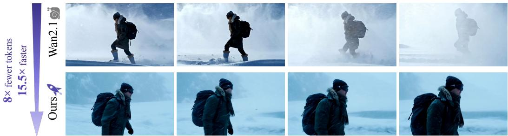  
“…The image captures the person's determined steps as they navigate through the storm… 2

  
“…specifically focusing on the process of eyebrow filling…

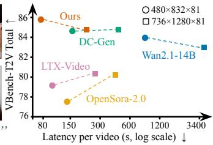  
Figure 1: Teaser. We present GRACE, a novel latent compression technique that fine-tunes pretrained video generation models, such as Wan2.1-14B (Wan et al., 2025), to generate from substantially fewer latent tokens (e.g., nearly 8× fewer). (Top) Text-to-video (T2V) samples at 736p from Wan2.1-14B before compression and from GRACE, using the same prompt. (Bottom left) The same comparison at 480p. (Bottom right) On VBench-T2V (Huang et al., 2023; 2024), GRACE preserves the generation quality of Wan2.1-14B before compression and achieves higher scores than existing high-compression autoencoders (HaCohen et al., 2024; Zheng et al., 2026; He et al., 2026), while generating 11.1× faster at 480p and 15.5× faster at 736p. All models in the plot are evaluated at matched resolutions with 50 sampling steps. The plot reports text-to-video, and the speedup above are measured on image-to-video.

## ABSTRACT

Highly compressed video autoencoders offer an effective way to accelerate video diffusion models, since the Diffusion Transformer (DiT) then operates on far fewer tokens. However, such autoencoders are difficult to obtain: a higher compression ratio degrades reconstruction quality, and recovering it requires more latent channels, which is known to slow DiT convergence. Moreover, the compressed latent space differs from the one the DiT was trained on, so the pretrained DiT must either be retrained from scratch or adapted at considerable cost. Further compressing the autoencoder that the DiT was trained with may seem to preserve compatibility, yet optimizing it for reconstruction alone still shifts the latent away from the distribution the DiT has learned. To address this, we propose Generation-Aware Latent Compression for Efficient Video Generation

(GRACE), a two-stage framework that compresses a pretrained video autoencoder while keeping it compatible with the pretrained DiT. In the first stage, we retain the base latent produced by the frozen pretrained encoder and learn a residual latent that captures the information lost under stronger compression. We further align the compressed latent with the pretrained latent in the feature space of the frozen DiT, so that the autoencoder is optimized for generation rather than reconstruction alone. In the second stage, we adapt the DiT through lightweight fine-tuning and asymmetric denoising, in which the base latent is denoised ahead of the residual latent. GRACE reduces the token count of Wan2.1-I2V-14B by nearly 8× and its latency by 11.1× at 480×832 resolution with 81 frames, while matching the VBench generation quality of the pretrained pipeline before compression.

## 1 INTRODUCTION

Recent advances in video diffusion models (Wan et al., 2025; Ma et al., 2025; HaCohen et al., 2024) have demonstrated remarkable generation quality, yet their computational cost remains a significant bottleneck for both training and inference. This computational cost largely depends on the number of tokens processed by the Diffusion Transformer (DiT) (Peebles & Xie, 2023), whose attention scales quadratically with sequence length.

The number of input tokens scales with the spatio-temporal resolution of the latent produced by the video autoencoder (Wan et al., 2025; HaCohen et al., 2024). Therefore, increasing the autoencoder compression ratio provides a straightforward way to reduce computation. However, fewer tokens limit the representational capacity of the latent, leading to a significant drop in reconstruction quality (Yao et al., 2025).

To preserve reconstruction quality with fewer tokens, previous works (Chen et al., 2025a;c; HaCohen et al., 2024; Zheng et al., 2026; Ma et al., 2025) increase the channel dimension of each token. However, higher-dimensional latents are known to compromise generation quality, introducing a trade-off between reconstruction and generation quality (Yao et al., 2025), and they converge more slowly, raising the training cost. Moreover, modifying the autoencoder architecture typically requires retraining the autoencoder from scratch, making it difficult to fully leverage pretrained knowledge and incurring substantial training cost. Reusing a released high-compression autoencoder avoids such cost but passes the burden to the pretrained DiT, which must adapt to a latent space never seen during pretraining and may not fully converge even on 160 GPUs (Zheng et al., 2026). A natural alternative is to leverage a pretrained autoencoder by adding a lightweight compression block to its architecture. However, we empirically find that this approach still degrades generation quality (Tabs. 1 and 4). Optimizing the autoencoder and the additional compression block solely for reconstruction shifts the resulting latent distribution away from that learned by the pretrained DiT, degrading generation quality (He et al., 2026; Zhao et al., 2024).

These observations point to two key challenges in efficient latent compression: (1) efficiently adapting pretrained autoencoder and DiT models while fully leveraging their pretrained knowledge, and (2) reducing the gap between reconstruction and generation quality introduced by compression. Our key insight is that a pretrained autoencoder and DiT already form a well-aligned generative pipeline, and this alignment can be exploited during compression. We therefore propose Generation-Aware Latent Compression for Efficient Video Generation (GRACE), a training framework that compresses a pretrained video autoencoder while explicitly accounting for both reconstruction and generation quality.

First, to fully leverage the pretrained autoencoder, we introduce a dual-latent representation that separates the pretrained representation from the information lost to compression. The base latent is obtained from the pretrained autoencoder using a spatially and temporally downsampled input, preserving the representation already learned by the pretrained autoencoder. The residual latent then captures the spatial detail and inter-frame motion that the low-resolution base latent cannot represent. This design allows the compressed autoencoder to retain the pretrained representation while using the residual latent only to complement what the downsampled input leaves out.

Second, we introduce asymmetric denoising to exploit this separation during generation. The base latent is denoised at an earlier timestep than the residual latent, allowing the denoised base to provide a stable anchor for the residual to recover the missing information. Both latents are denoised within a single pass, introducing no additional sampling cost.

Finally, to preserve compatibility with the pretrained DiT, we introduce generation-aware alignment, which matches the compressed autoencoder latent with the pretrained latent in the DiT’s feature space. Rather than relying solely on conventional reconstruction objectives such as L1/L2 and perceptual losses (Zhang et al., 2018), we use intermediate DiT features to measure the distance between the compressed and pretrained latents. This generation-aware alignment encourages the compressed latent to remain compatible with the distribution learned by the pretrained DiT, thereby reducing the gap between reconstruction and generation quality.

Our method reduces the token count of Wan2.1-14B by nearly 8× and end-to-end generation latency by 11.1× at 480×832×81, while matching the generation quality of the pretrained pipeline before compression on VBench (Huang et al., 2023; 2024) (Fig. 1), compressing both axes at once to 16× spatial and 8× temporal. The gain grows with resolution, reaching 15.5× at 736×1280×81. Compared with our single-latent baseline and existing high-compression video autoencoders on the same generation backbone, our method achieves better generation quality at the same or fewer tokens, even though its reconstruction on Panda-70M (Chen et al., 2024) is not the best among them, showing that reconstruction fidelity alone does not determine generation quality.

We summarize our contributions as follows:

• We propose GRACE, a diffusion training framework that efficiently compresses a pretrained video autoencoder while preserving the pretrained autoencoder–DiT pipeline and narrowing the reconstruction–generation gap.

• We introduce a dual-latent representation with asymmetric denoising to preserve the pretrained autoencoder representation while recovering the spatial detail and inter-frame motion that the downsampled input leaves out.

• We introduce a generation-aware alignment objective in the feature space of the pretrained DiT to preserve its compatibility with the compressed autoencoder.

• Our method reduces the token count by nearly 8×, compressing both axes at once to 16× spatial and 8× temporal, while matching the generation quality of the pretrained pipeline before compression on VBench with an 11.1× reduction in latency at 480×832×81 and a 15.5× reduction at 736×1280×81.

## 2 RELATED WORK

Latent compression for efficient video generation. Video diffusion models are computationally expensive since they repeatedly denoise a large number of latent tokens. Existing acceleration methods either reduce the number of denoising steps (Song et al., 2022; Lu et al., 2022; Zhao et al., 2023; Wang et al., 2024; Li et al., 2024), often at the cost of quality, or reduce the computation per step (Xi et al., 2025; Sun et al., 2025). Several works (HaCohen et al., 2024; Zheng et al., 2026; Tian et al., 2025; Chen et al., 2025b; Ma et al., 2025) instead propose to compress the latent beyond the common setting of 8× spatial and 4× temporal compression (f8t4), which significantly lowers the token count by a fixed ratio. Existing approaches increase spatial compression through autoencoder architectural changes (Chen et al., 2025a; Tian et al., 2025), or progressively increase temporal compression (Mahapatra et al., 2025). A complementary strategy assigns more channels to each token to preserve reconstruction quality at high compression ratios, but wider latents can degrade generation quality, which recent work addresses by structuring the channel dimension (Chen et al., 2025c; Cai et al., 2026). Our work compresses the video autoencoder in both space and time by fine-tuning a pretrained autoencoder and DiT rather than training either from scratch, keeping training cost low while mainly addressing the generation quality and convergence issues introduced by increased channel capacity.

Autoencoder adaptation for pretrained generators. A few recent works redesign or improve the autoencoder in generation pipelines (Zheng et al., 2025; Chen et al., 2025c; Cai et al., 2026). One line of work regularizes the latent with a pretrained vision foundation model so that a diffusion model learns it more easily (Yao et al., 2025), but trains both the autoencoder and the generator from scratch. Changing the latent space in this way typically requires retraining the DiT from scratch at prohibitive cost, since the new latent distribution no longer matches the one on which the DiT was trained. To avoid this cost, other works reuse the pretrained DiT and close the resulting mismatch during training (Zheng et al., 2026). Some constrain the new latent to remain reconstructable by the pretrained decoder (Zhao et al., 2024), while others align patch embeddings between the pretrained and modified pipelines after the latent space has already diverged (He et al., 2026). We instead optimize the autoencoder latent with intermediate features from the frozen DiT, keeping it close to the representation space where the pretrained generator operates.

## 3 PRELIMINARIES

In this section, we briefly review latent video diffusion models, which consist of a video autoencoder that compresses videos into a latent space and a diffusion transformer that generates within that space. The autoencoder encodes a video into a latent and decodes a latent back into a video, while the diffusion transformer learns to denoise noisy latents.

Video autoencoders. Given an input video $\mathbf { x } \in \mathbb { R } ^ { 3 \times ( 1 + L ) \times H \times W }$ with $1 + L$ frames of height H and width $W$ , a causal video autoencoder encodes it as $\mathbf { z } = \mathcal { E } ( \mathbf { x } ) \in \mathbb { R } ^ { C \times ( 1 + \frac { L } { t } ) \times \frac { H } { f } \times \frac { W } { f } }$ , where C is the number of latent channels, and $f$ and t are the spatial and temporal compression factors. The decoder reconstructs $\hat { \mathbf { x } } = \mathcal { D } ( \mathbf { z } )$ ). Modern video autoencoders compress space and time jointly with 3D causal convolutions (Wan et al., 2025; HaCohen et al., 2024), commonly at f8t4.

Diffusion transformers. A diffusion transformer $\mathbf { v } _ { \theta }$ (Peebles & Xie, 2023) generates in this latent space, patchifying the latent with a patch size $p ,$ so the token count is set by $f , t ,$ , and p together. Following the rectified flow formulation (Esser et al., 2024), a schedule time $u \in [ 0 , 1 ]$ is mapped to the flow matching timestep τ by a shift function $\psi _ { s }$

$$
\tau = \psi _ { s } ( u ) = \frac { s u } { 1 + ( s - 1 ) u } ,\tag{1}
$$

where larger s places more of the schedule at higher noise. Writing $\mathbf { z } _ { 0 }$ for the clean latent $\mathbf { z } ,$ the noisy latent is

$$
\begin{array} { r } { \mathbf { z } _ { \tau } = ( 1 - \tau ) \mathbf { z } _ { 0 } + \tau \mathbf { \epsilon } , \quad \epsilon \sim \mathcal { N } ( 0 , \mathbf { I } ) . } \end{array}\tag{2}
$$

A timestep embedding $\phi ( \tau )$ is mapped by a projection $W _ { \mathrm { m o d } }$ to the modulation m that conditions every transformer block through adaptive layer normalization (AdaLN). Conditioned on m and text embeddings c, v predicts $\left( \epsilon - \mathbf { z } _ { 0 } \right)$

$$
\mathcal { L } _ { \mathrm { v e l o c i t y } } = \mathbb { E } _ { \mathbf { z } _ { 0 } , \epsilon , \tau } \lVert \mathbf { v } _ { \boldsymbol { \theta } } ( \mathbf { z } _ { \tau } , \tau , \mathbf { c } ) - ( \epsilon - \mathbf { z } _ { 0 } ) \rVert ^ { 2 } .\tag{3}
$$

## 4 METHOD

## 4.1 OVERVIEW

We propose GRACE, a two-stage framework that compresses the latent of a pretrained pipeline while preserving generation quality (Fig. 2). Stage 1 fine-tunes the autoencoder into a dual latent of a frozen base and a learned residual, guided by the frozen DiT (Section 4.2). Stage 2 adapts the DiT to that latent, denoising the base ahead of the residual (Section 4.3). In both stages, the pretrained pipeline before compression guides its own compression.

## 4.2 STAGE 1: VIDEO AUTOENCODER TRAINING

We make full use of the pretrained autoencoder, keeping its architecture and weights, which keeps the latent close to the pretrained DiT’s latent space and avoids training from scratch. The straightforward way to reach a higher ratio from there is to add compression blocks inside the encoder and train under the pretrained reconstruction objective $\mathcal { L } _ { \mathrm { r e c o n } }$ (Wan et al., 2025), a weighted sum of L1, LPIPS (Zhang et al., 2018), and KL (Kingma & Welling, 2022) terms (Tab. A.1). This already gives a strong baseline, reconstructing within the range of high-compression autoencoders trained from scratch (Tab. 1). However, reconstruction quality does not carry over to generation, even with the pretrained initialization. The latent drifts to optimize the objective, leaving the DiT with more to adapt to in Stage 2.

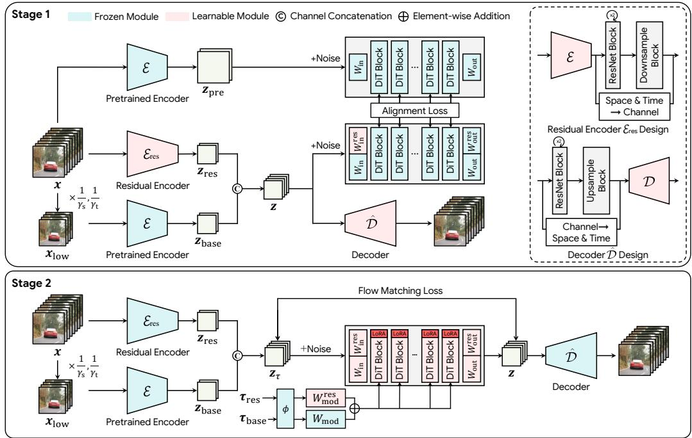  
Figure 2: Overall architecture. Stage 1 trains the autoencoder. The frozen encoder E maps the downsampled input to $\mathbf { z } _ { \mathrm { b a s e } } ,$ the residual encoder ${ \mathcal E } _ { \mathrm { r e s } }$ maps the full-resolution input to $\mathbf { z } _ { \mathrm { r e s } } ,$ , and $\hat { \mathcal { D } }$ decodes both, while $\mathcal { L } _ { \mathrm { a l i g n } }$ matches the compressed latent to the pretrained latent inside the frozen DiT. The dashed box on the right of Stage 1 shows a simplified view of the blocks added to $\mathcal { E } _ { \mathrm { r e s } }$ and $\hat { \mathcal { D } } .$ . Stage 2 adapts the DiT to the compressed latent with LoRA, denoising $\mathbf { z } _ { \mathrm { b a s e } }$ at a lower noise level than $\mathbf { z } _ { \mathrm { r e s } }$ at every step, so the base is denoised first.

Stage 1 addresses this in two ways: (i) dual-latent representation, which anchors the compressed latent in the pretrained latent space, and (ii) generation-aware alignment, which matches the compressed latent to the pretrained latent inside the frozen DiT.

Dual-latent representation. We first design the compressed latent as a dual representation, with a base latent and a residual latent. The base latent, taken from the frozen pretrained encoder $\mathcal { E } _ { : }$ anchors the compressed latent in the pretrained latent space, so the DiT has less to adapt to in Stage 2. Since $\mathcal { E }$ compresses only by $f$ and t, reaching the higher ratio requires reducing the input before encoding, as in prior work (Mahapatra et al., 2025; Zhao et al., 2024): we downsample it spatially by $r _ { s }$ and subsample it temporally by $r _ { t } ,$ , producing $\mathbf { x } _ { \mathrm { l o w } }$ within the resolution range $\mathcal { E }$ was trained on (Wan et al., 2025). Then $\bar { \boldsymbol { \varepsilon } }$ processes $\mathbf { x } _ { \mathrm { l o w } }$ with its original weights as

$$
\begin{array} { r } { \mathbf { z } _ { \mathrm { b a s e } } = \mathcal { E } \big ( \mathbf { x } _ { \mathrm { l o w } } \big ) \in \mathbb { R } ^ { C \times ( 1 + \frac { L } { t \cdot r _ { t } } ) \times \frac { H } { f \cdot r _ { s } } \times \frac { W } { f \cdot r _ { s } } } \ . } \end{array}\tag{4}
$$

This reduced input lowers the token count, which limits the reconstruction capacity of $\mathbf { z } _ { \mathrm { b a s e } }$ (Chen et al., 2025a;c), since the decoder cannot restore what never reached the latent. We therefore introduce a residual encoder $\mathcal { E } _ { \mathrm { r e s } }$ , initialized from the pretrained weights, that takes the video at full resolution and carries the missing information in $C ^ { \prime }$ additional channels,

$$
\begin{array} { r } { \mathbf { z } _ { \mathrm { r e s } } = { \mathcal { E } } _ { \mathrm { r e s } } ( \mathbf { x } ) \in \mathbb { R } ^ { C ^ { \prime } \times ( 1 + \frac { L } { t \cdot r _ { t } } ) \times \frac { H } { f \cdot r _ { s } } \times \frac { W } { f \cdot r _ { s } } } \ . } \end{array}\tag{5}
$$

To match the spatial and temporal size of $\mathbf { z } _ { \mathrm { b a s e } } , \mathcal { E } _ { \mathrm { r e s } }$ includes an additional downsampling stage, paired with a parameter-free shortcut that folds space and time into channels (Chen et al., 2025a). The two latents are concatenated along the channel axis into the compressed latent,

$$
\begin{array} { r } { \mathbf { z } = \left[ \mathbf { z } _ { \mathrm { b a s e } } ; \mathbf { z } _ { \mathrm { r e s } } \right] \in \mathbb { R } ^ { ( C + C ^ { \prime } ) \times ( 1 + \frac { L } { t \cdot r _ { t } } ) \times \frac { H } { f \cdot r _ { s } } \times \frac { W } { f \cdot r _ { s } } } \ . } \end{array}\tag{6}
$$

Input Frame

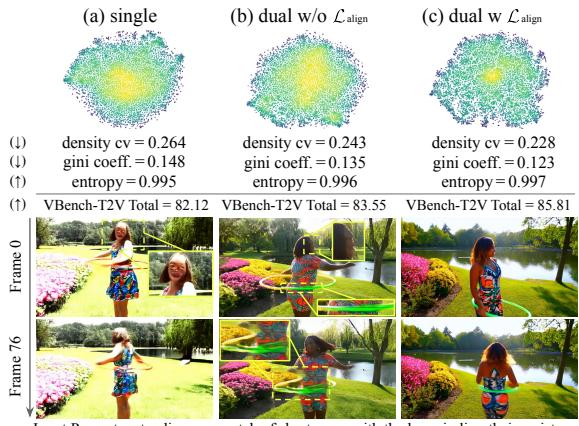

(a)  
(b)  
(c)  
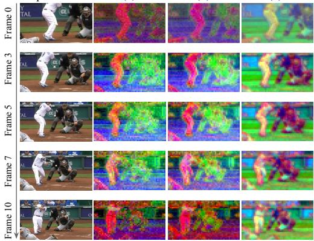  
Input Prompt: ..standing on a patch of short grass with the hop circling their waist...

Figure 3: Effect of the dual latent and $\mathcal { L } _ { \mathrm { a l i g n } } .$ (a) single latent, (b) dual-latent representation without $\mathcal { L } _ { \mathrm { a l i g n } } .$ , and (c) ours, all generated at 480×832×81. (Left) latent distribution, projected with t-SNE and colored by kernel density, with its uniformity metrics (Yao et al., 2025) and the total VBench (Huang et al., 2023; 2024) score below, followed by T2V samples generated after Stage 2. (Right) spatio-temporal structure of the latent, shown as its principal components mapped to RGB under the input frames. More samples are in Figs. I.11 and I.12.

Separating the two parts organizes the latent, which prior work finds to help generation at high latent dimensions (Chen et al., 2025c). As shown in Fig. 3, the dual latent distorts the body less than a single latent and keeps the colors natural, raising the total VBench score and the uniformity of the latent distribution. The decoder is fully fine-tuned, with the residual channels zero-initialized so tha training starts at the pretrained reconstruction quality. For image-to-video (I2V), we also pass the first frame to the decoder to restore detail the compressed latent cannot carry.

Generation-aware alignment in pretrained DiT feature space. The dual-latent representation alone narrows the gap between the compressed latent and the pretrained latent space, but we find it insufficient at higher compression ratios, where the residual latent must carry more information missing from the base. The residual channels are optimized only through the reconstruction ob jective, which improves fidelity but does not directly account for how easily the diffusion model can learn the resulting latent. We introduce generation-aware alignment, a regularizer that supervises the compressed latent inside the feature space of the pretrained DiT without modifying the autoencoder architecture. Our approach builds on the same insight as prior autoencoder adaptation methods: reconstruction fidelity alone does not necessarily yield a compressed latent that the diffusion backbone can learn effectively (Yao et al., 2025; Chen et al., 2025c). Since the pretrained DiT is already adapted to the original latent space, we compare the two latents in its intermediate feature space. We perturb both latents with a shared τ drawn from the pretrained pipeline’s schedule and independently sampled $\epsilon .$ The alignment loss is then defined by passing both noised latents through this frozen DiT and matching their intermediate representations. For the pretrained latent, the frozen encoder encodes the full-resolution video, and $\mathbf { v } _ { \theta }$ patchifies the resulting latent through the original input projection $W _ { \mathrm { i n } }$ before the transformer blocks:

$$
\begin{array} { r } { \mathbf { z } _ { \mathrm { p r e } } = \mathcal { E } ( \mathbf { x } ) \in \mathbb { R } ^ { C \times ( 1 + \frac { L } { t } ) \times \frac { H } { f } \times \frac { W } { f } } , \qquad \mathbf { h } _ { \mathrm { p r e } } ^ { l } = \mathbf { v } _ { \theta } ^ { l } ( \mathbf { z } _ { \mathrm { p r e } , \tau } , \tau , \mathbf { c } ) , } \end{array}\tag{7}
$$

where c is the caption embedding, $\mathbf { z } _ { \mathrm { p r e } , \tau }$ and $\mathbf { z } _ { \tau }$ are the pretrained and compressed latents noised by Eq. 2, and $\mathbf { v } _ { \theta } ^ { l }$ is the l-th layer feature of $\mathbf { v } _ { \theta }$ . For image-to-video, we also pass the first frame to $\mathbf { v } _ { \theta }$ as its image condition. For the compressed latent $\mathbf { z } ,$ we use $\mathbf { v } _ { \theta , + }$ , which shares the frozen transformer body of $\mathbf { v } _ { \theta }$ but extends the input projection along the channel axis with a zero-initialized $W _ { \mathrm { i n } } ^ { \mathrm { r e s } }$ to handle the residual channels. Since this branch runs at a lower latent resolution, its features contain fewer tokens. We reshape them to their spatio-temporal grid, trilinearly upsample them to the fullresolution grid, and apply a zero-initialized per-layer residual projection $P _ { l }$

$$
\begin{array} { r } { { \bf h } _ { \mathrm { c m p } } ^ { l } = { \bf v } _ { \theta , + } ^ { l } ( { \bf z } _ { \tau } , \tau , { \bf c } ) , \qquad { \hat { \bf h } } _ { \mathrm { c m p } } ^ { l } = \mathrm { i n t e r p } ( { \bf h } _ { \mathrm { c m p } } ^ { l } ) + P _ { l } \bigl ( \mathrm { i n t e r p } ( { \bf h } _ { \mathrm { c m p } } ^ { l } ) \bigr ) . } \end{array}\tag{8}
$$

where interp(·) denotes this reshaping and trilinear upsampling.

We then compare the two features at each supervised layer:

$$
\mathcal { L } _ { \mathrm { a l i g n } } = \sum _ { l \in S } \left[ 1 - \sin \bigl ( \mathbf { h } _ { \mathrm { p r e } } ^ { l } , \hat { \mathbf { h } } _ { \mathrm { c m p } } ^ { l } \bigr ) \right] ,\tag{9}
$$

where $\sin ( \cdot , \cdot )$ is the cosine similarity averaged over tokens and S is the set of supervised layers, the first 10 of the 40 DiT blocks (see Appendix E.2 for this choice). The features from $\mathbf { z } _ { \mathrm { p r e } }$ are kept fixed, so $\mathcal { L } _ { \mathrm { a l i g n } }$ only optimizes the compressed representation.

Since $\mathcal { L } _ { \mathrm { a l i g n } }$ and $\scriptstyle { \mathcal { L } } _ { \mathrm { r e c o n } }$ operate on different scales, a fixed weight makes training unstable. Following prior work (Yao et al., 2025), we set the weight as the ratio of their gradient norms with respect to the last convolutional layer of $\mathcal { E } _ { \mathrm { r e s } } ,$ so that the two losses contribute at a comparable scale without manual hyperparameter tuning. The final training objective is

$$
\mathcal { L } = \mathcal { L } _ { \mathrm { r e c o n } } + w _ { \mathrm { a d a p t i v e } } \mathcal { L } _ { \mathrm { a l i g n } } , \qquad w _ { \mathrm { a d a p t i v e } } = \frac { | | \nabla \mathcal { L } _ { \mathrm { r e c o n } } | | } { | | \nabla \mathcal { L } _ { \mathrm { a l i g n } } | | } .\tag{10}
$$

We analyze the resulting latent in Fig. 3 from two complementary perspectives. Following prior work that relates the uniformity of the latent distribution to generation quality (Yao et al., 2025), we fit a kernel density estimate to the t-SNE (van der Maaten & Hinton, 2008) projection and measure its coefficient of variation, Gini coefficient, and normalized entropy (see Appendix C.2 for details). All three improve with the alignment loss, and fewer artifacts remain in the samples, with the total VBench score following. These metrics summarize the latent as a whole, while the PCA visualization in Fig. 3 shows how it varies within and across frames: the dual latent makes the components less noisy, but they stay weak until the alignment loss makes them follow object regions and hold structure across frames.

## 4.3 STAGE 2: VIDEO DIFFUSION TRANSFORMER ADAPTATION

In this section, we adapt the pretrained DiT to the compressed latent while keeping the autoencoder frozen. Since the compressed latent adds $C ^ { \prime }$ unseen channels, we extend the DiT input and output projections from $C { \mathrm { \ t o } } { \mathrm { ~ \bar { \it C } } } + C ^ { \prime }$ channels. We fully fine-tune these projections and apply LoRA (Hu et al., 2021) to the transformer blocks, keeping the adaptation cost low while preserving the pretrained generation capability (He et al., 2026). The DiT is trained with the flow matching loss $\mathcal { L } _ { \mathrm { v e l o c i t y } }$ , applied to the base and the residual latent at different noise levels, which we describe next.

Asymmetric denoising. Our key idea is to denoise the two parts of the latent asymmetrically, keeping the base ahead of the residual so that the residual builds on a reliable foundation throughout generation. The residual encoder is trained to carry what the base does not, so what the residual should contain becomes clearer as the base settles, which makes the residual easier to generate.

During training, we sample a base-ahead offset $\delta \sim \mathcal { U } ( \delta _ { \operatorname* { m i n } } , \delta _ { \operatorname* { m a x } } )$ (Tab. B.1) and a schedule time $\hat { \boldsymbol { u } } \sim \mathcal { U } ( \boldsymbol { 0 } , 1 + \delta )$ per video, and set

$$
\begin{array} { r l r } { u _ { \mathrm { b a s e } } = \operatorname* { m a x } ( \hat { u } - \delta , 0 ) , } & { { } \quad } & { u _ { \mathrm { r e s } } = \operatorname* { m i n } ( \hat { u } , 1 ) , } \\ { \quad } & { { } \quad } & { ( 1 1 ) } \end{array}
$$

where $u = 1$ corresponds to pure noise and $u =$ 0 to a clean latent, so the base is always the less corrupted of the two. We obtain the noise levels $\tau _ { \mathrm { b a s e } }$ and $\tau _ { \mathrm { r e s } }$ from Eq. 1, and noise the base and the residual separately with Eq. 2:

$$
\begin{array} { r } { \mathbf { z } _ { \tau } = \left[ ( 1 - \tau _ { \mathrm { b a s e } } ) \mathbf { z } _ { \mathrm { b a s e } } + \tau _ { \mathrm { b a s e } } \epsilon _ { \mathrm { b a s e } } ; \right. } \\ { \left. ( 1 - \tau _ { \mathrm { r e s } } ) \mathbf { z } _ { \mathrm { r e s } } + \tau _ { \mathrm { r e s } } \epsilon _ { \mathrm { r e s } } \right] , \quad } \end{array}\tag{12}
$$

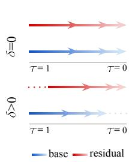  
Frame 74

where $\epsilon _ { \mathrm { b a s e } } , \epsilon _ { \mathrm { r e s } } \sim \mathcal { N } ( 0 , \mathbf { I } )$ . We sample δ rather   
than fixing it, which trains one model across   
offsets. The two timesteps share ϕ and enter   
through separate projections, which keeps the   
conditioning path closer to the pretrained path. We apply the pretrained conditioning path closer to the pretrained path   
zero-initialized zero-initialized $W _ { \mathrm { m o d } } ^ { \mathrm { r e s } }$ to the residual, so adaptat

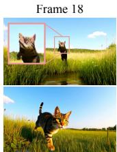

  
Input Prompt : A playful tabby cat with brigh green eyes dashes across the sunlit grass, …  
Figure 4: Denoising order. Each row shows the sampling steps of $\mathbf { z } _ { \mathrm { b a s e } }$ and $\mathbf { z } _ { \mathrm { r e s } }$ (Left) and the generated frames (Right), with $\tau = 1$ pure noise and $\tau = 0$ clean. (Top) Both parts are denoised at the same noise level. (Bottom) $\mathbf { z } _ { \mathrm { b a s e } }$ stays δ ahead of $\mathbf { z } _ { \mathrm { r e s } }$ in schedule time u (Eq. 11) at every step.

$W _ { \mathrm { m o d } }$ to the base and a to the residual, so adaptation begins from the pretrained behavior,

$$
{ \bf m } = W _ { \mathrm { m o d } } \phi ( \tau _ { \mathrm { b a s e } } ) + W _ { \mathrm { m o d } } ^ { \mathrm { r e s } } \phi ( \tau _ { \mathrm { r e s } } ) .\tag{13}
$$

Table 1: Video autoencoder comparison at 256×256×81 reconstruction and $4 8 0 \times 8 3 2 \times 8 1$ generation. We report the VBench-I2V (Huang et al., 2023; 2024) total after adapting the same pretrained Wan2.1-I2V-14B (Wan et al., 2025) to every latent under the same budget. Config lists $f ,$ $t ,$ channel count c, and patch size p, which set the latent token count. Single-latent Baseline is our baseline without the dual latent or the alignment loss. The first row is the pretrained autoencoder before compression, and our method is shaded . Bold marks the best value in each column among the last three rows (4.3k tokens). †Initialized by inflating its own 2D image autoencoder. ‡Trained first at f8t4 and then extended to f16t8 with additional modules.
<table><tr><td rowspan="2">Autoencoder</td><td rowspan="2">Config</td><td rowspan="2"></td><td rowspan="2">AE Training Latent Tokens</td><td colspan="4">Reconstruction</td><td>VBench-I2V</td></tr><tr><td>PSNR↑</td><td>SSIM ↑</td><td>LPIPS ↓</td><td>rFVD↓</td><td>Total ↑</td></tr><tr><td>Wan2.1-VAE (Wan et al., 2025)</td><td>f8t4c16p2</td><td>scratch†</td><td>32.8k</td><td>35.15</td><td>0.958</td><td>0.016</td><td>1.13</td><td>87.92</td></tr><tr><td>Step-Video-VAE (Ma et al., 2025)</td><td>f16t8c64p1</td><td>scratch‡</td><td>17.2k</td><td>33.88</td><td>0.950</td><td>0.029</td><td>3.16</td><td>84.05</td></tr><tr><td>Video DC-AE (Zheng et al., 2026)</td><td>f32t4c128p1</td><td>scratch</td><td>8.2k</td><td>34.61</td><td>0.956</td><td>0.024</td><td>3.70</td><td>84.94</td></tr><tr><td>LTX-VAE (HaCohen et al., 2024)</td><td>f32t8c128p1</td><td>scratch</td><td>4.3k</td><td>31.97</td><td>0.914</td><td>0.051</td><td>19.53</td><td>87.06</td></tr><tr><td>Single-latent Baseline</td><td>f16t8c32p2</td><td>fine-tuned</td><td>4.3k</td><td>33.76</td><td>0.956</td><td>0.031</td><td>13.11</td><td>86.44</td></tr><tr><td>GRACE-VAE (Ours)</td><td>f16t8c32p2</td><td>fine-tuned</td><td>4.3k</td><td>32.63</td><td>0.930</td><td>0.032</td><td>13.53</td><td>87.90</td></tr></table>

The modulation m conditions every transformer block, and the DiT predicts a velocity for each part,

$$
\left[ \hat { \mathbf { v } } _ { \mathrm { b a s e } } , \hat { \mathbf { v } } _ { \mathrm { r e s } } \right] = \mathbf { v } _ { \theta } ( \mathbf { z } _ { \tau } , \left[ \tau _ { \mathrm { b a s e } } , \tau _ { \mathrm { r e s } } \right] , \mathbf { c } ) ,\tag{14}
$$

where $\mathbf { v } _ { \theta }$ here denotes the adapted DiT with the extended projections and LoRA, and the training objective is the average of the flow matching loss of Eq. 3 over the base and the residual. At inference, we fix the offset to $\delta \ : = \ : 0 . 1 5$ and run the same number of sampling steps over $\hat { u } \in$ $[ 0 , 1 + \delta ]$ , so the base leads the residual by δ throughout sampling (Appendix B.2). Both parts are denoised in the same forward pass, rather than one after the other, so the number of function evaluations remains unchanged. Fig. 4 shows that the asymmetric schedule recovers detail on the subject’s face that a shared schedule degrades where motion is large.

## 5 EXPERIMENTS

## 5.1 SETUP

Model configuration. We use Wan2.1 (Wan et al., 2025) as the pretrained pipeline before compression and compress its latent from f8t4p2 to f16t8p2 with $ r _ { s } { = } 2 , r _ { t } { = } 2$ , and ${ \dot { C } } ^ { \prime } { = } 1 6$ residual channels. We refer to our autoencoder as GRACE-VAE, and to the full pipeline of the autoencoder and the adapted DiT as GRACE. We adapt Wan2.1-I2V-14B for image-to-video and Wan2.1-T2V-14B for text-to-video. Both stages are trained on Panda-70M (Chen et al., 2024). Full training and architecture details are in Appendices A and B.

Single-latent baseline. Under the same configuration above, our single-latent baseline only adds compression blocks to the pretrained autoencoder and fine-tunes it, without any further modification, matching our token and channel counts. The DiT is adapted following the training recipe of Wan2.1 (Wan et al., 2025).

## 5.2 VIDEO RECONSTRUCTION RESULTS

Evaluation details. We evaluate reconstruction on Panda-70M (Chen et al., 2024) with PSNR, SSIM (Wang et al., 2004), LPIPS (Zhang et al., 2018), and rFVD (Unterthiner et al., 2019), and generation on VBench-I2V (Huang et al., 2023; 2024). We compare against publicly released video autoencoders that compress more aggressively than Wan2.1-VAE, with the pretrained pipeline before compression as the reference. The compared autoencoders are trained independently of Wan2.1- VAE, whereas our single-latent baseline and GRACE-VAE are fine-tuned from it. To measure generation, we adapt the pretrained Wan2.1-I2V-14B to every latent under the same total budget of 38.5 H200 GPU days. The compared latents spend the whole budget on DiT adaptation, while our pipeline spends 8.5 days on the autoencoder and 30 on the DiT. Our adaptation builds on the frozen Wan2.1 base latent, which is unavailable to the compared autoencoders, so we instead transfer them with the released implementation of DC-Gen (He et al., 2026; Chen et al., 2025b), which is designed to adapt a pretrained DiT to a new latent space (see Appendix C.1 for the adaptation details).

“..releasing a small drizzle of cheese as it approaches the..” “A seagull is flying towards a person's hand, which is..”

Table 2: Video generation on VBench (Huang et al., 2023; 2024) at 480×832×81. Notation follows Tab. 1. Our method preserves the quality of Wan2.1-14B (Wan et al., 2025) before compression on both tasks while using nearly 8× fewer tokens and running 11.1× faster. NFE counts the DiT forward passes per video over 50 sampling steps. Per-dimension scores are in Appendix D.1.
<table><tr><td rowspan="2">Model</td><td rowspan="2">Autoencoder</td><td rowspan="2">Config</td><td rowspan="2">Diffusion Model</td><td rowspan="2">Latent Tokens</td><td rowspan="2">DiT Params</td><td rowspan="2">NFE</td><td colspan="2">Latency (s) ↓ T2V</td><td colspan="4">VBench-T2V</td><td colspan="3">VBench-I2V</td></tr><tr><td></td><td>I2V</td><td>Quality ↑</td><td>Semantic ↑</td><td></td><td>Total ↑</td><td>I2V↑ Quality ↑</td><td>Total ↑</td></tr><tr><td>Wan2.1-14B</td><td>Wan2.1-VAE</td><td>f8t4c16p2</td><td>Wan2.1-14B</td><td>32.8k</td><td>14B</td><td>100</td><td>851.5</td><td>863.2</td><td>85.24</td><td>78.70</td><td>83.93</td><td>95.82</td><td>80.01</td><td>87.92</td></tr><tr><td>Open-Sora 2.0</td><td>Video DC-AE</td><td>f32t4c128p1</td><td>Open-Sora</td><td>8.2k</td><td>11B</td><td>150</td><td>138.6</td><td>138.4</td><td>78.80</td><td>72.35</td><td>77.51</td><td>91.17</td><td>76.96</td><td>84.07</td></tr><tr><td>DC-Gen</td><td>DC-AE-V</td><td>f32t4c32p1</td><td>Wan2.1-14B</td><td>8.2k</td><td>14B</td><td>100</td><td>157.1</td><td>165.0</td><td>85.85</td><td>79.70</td><td>84.62</td><td>88.25</td><td>80.01</td><td>84.13</td></tr><tr><td>LTX-Video 0.9.7</td><td>LTX-VAE</td><td>f32t8c128p1</td><td>LTX-Video</td><td>4.3k</td><td>13B</td><td>150</td><td>99.6</td><td>104.1</td><td>82.88</td><td>64.31</td><td>79.17</td><td>95.62</td><td>80.32</td><td>87.97</td></tr><tr><td>Single-latent Baseline</td><td>Single-latent Baseline</td><td>f16t8c32p2</td><td>Wan2.1-14B</td><td>4.3k</td><td>14B</td><td>100</td><td>76.1</td><td>77.8</td><td>83.21</td><td>77.75</td><td>82.12</td><td>93.67</td><td>79.21</td><td>86.44</td></tr><tr><td>GRACE (Ours)</td><td>GRACE-VAE</td><td>f16t8c32p2</td><td>Wan2.1-14B</td><td>4.3k</td><td>14B</td><td>100</td><td>75.8</td><td>77.7</td><td>86.02</td><td>84.98</td><td>85.81</td><td>95.48</td><td>80.31</td><td>87.90</td></tr></table>

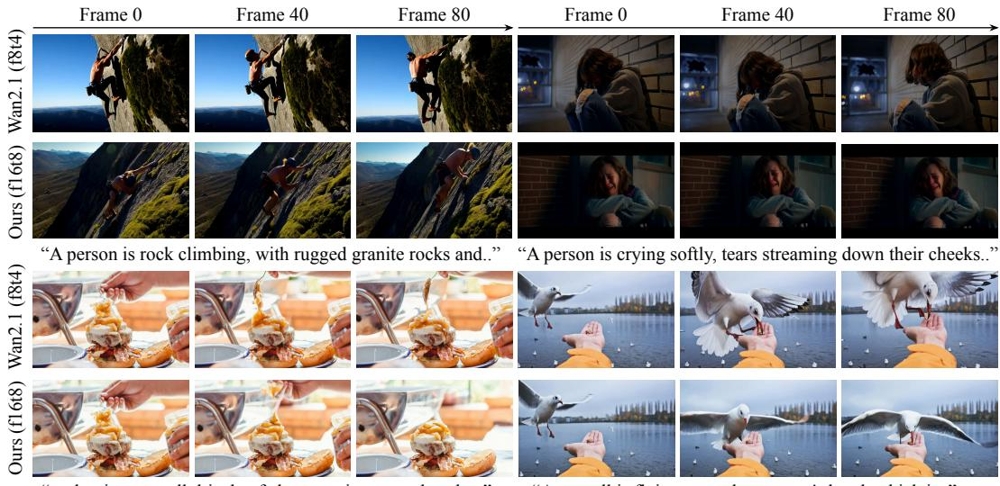  
Figure 5: Qualitative comparison at 480×832×81. VBench (Huang et al., 2023; 2024) samples from Wan2.1-14B (Wan et al., 2025) before compression and GRACE (Ours), generated from the same prompt, for text-to-video (top) and image-to-video (bottom). Best viewed when zoomed in.

Main results. As shown in Tab. 1, better reconstruction does not mean better generation. Step-Video-VAE reconstructs 1.91 dB above LTX-VAE but scores 3.01 lower on VBench-I2V, even at 4× the tokens, and our single-latent baseline reconstructs 1.13 dB above GRACE-VAE yet scores 1.46 lower. GRACE-VAE reaches the highest generation quality among the compressed autoencoders at the smallest token count, within 0.02 of the pretrained pipeline, while Video DC-AE and Step-Video-VAE use 2× and 4× more tokens yet score 2.98 and 3.87 lower than the pretrained pipeline.

## 5.3 VIDEO GENERATION RESULTS

Evaluation details. We evaluate on VBench (Huang et al., 2023; 2024) for both I2V and T2V at 480×832×81 with 50 sampling steps, generating one video per prompt over the full benchmark, and measure latency on a single A100 GPU. The models built on Wan2.1-14B share the same pretrained DiT, while LTX-Video and Open-Sora 2.0 use their own generators, which differ from Wan2.1-14B in model size and training data. Both also run a third guidance branch, which raises the forward passes per video to 150.

Main results. As shown in Tab. 2, GRACE stays within 0.02 of the pretrained pipeline before compression on I2V and exceeds it on T2V, while running 11.1× faster. The T2V gain comes mostly from the semantic score, where GRACE leads the next best model by 5.28. The ablation in Tab. 4 traces this gain to both stages: the dual latent alone keeps the semantic score at the pretrained level, and generation-aware alignment and the base-ahead offset raise it by 3.90 and 2.43. At 736×1280×81 (Tab. 3), GRACE again reaches the highest T2V total at the lowest latency and stays within 0.04 of the pretrained pipeline on I2V while running 15.5× faster.

“A space shuttle taking off into the sky ..”  
Table 3: Video generation on VBench (Huang et al., 2023; 2024) at 736×1280×81. Notation follows Tab. 2. Per-dimension scores are in Appendix D.1. ‡Measured with spatial tiling in the VAE encoder to avoid running out of memory when encoding the conditioning image at this resolution.
<table><tr><td rowspan="2">Model</td><td rowspan="2">Autoencoder</td><td rowspan="2"> $\mathrm { C o n f i g }$ </td><td rowspan="2">Diffusion Model</td><td rowspan="2">Latent Tokens</td><td rowspan="2">DiT Params</td><td rowspan="2">NFE</td><td colspan="2">Latency (s) ↓</td><td colspan="3">VBench-T2V</td><td colspan="3">VBench-I2V</td></tr><tr><td>T2V</td><td>I2V</td><td>Quality ↑</td><td>Semantic ↑</td><td>Total ↑</td><td>I2V↑</td><td>Quality ↑</td><td>Total ↑</td></tr><tr><td>Wan2.1-14B</td><td>Wan2.1-VAE</td><td>f8t4c16p2</td><td>Wan2.1-14B</td><td>77.3k</td><td>14B</td><td>100</td><td>3361.3</td><td>3396.8</td><td>84.69</td><td>76.01</td><td>82.96</td><td>95.56</td><td>80.20</td><td>87.88</td></tr><tr><td>Open-Sora 2.0</td><td>Video DC-AE</td><td>f32t4c128p1</td><td>Open-Sora</td><td>19.3k</td><td>11B</td><td>150</td><td>425.4</td><td>425.4</td><td>80.73</td><td>78.16</td><td>80.22</td><td>93.72</td><td>77.82</td><td>85.77</td></tr><tr><td>DC-Gen</td><td>DC-AE-V</td><td>f32t4c32p1</td><td>Wan2.1-14B</td><td>19.3k</td><td>14B</td><td>100</td><td>456.4</td><td>550.7‡</td><td>86.08</td><td>78.80</td><td>84.62</td><td>92.04</td><td>80.73</td><td>86.39</td></tr><tr><td>LTX-Video 0.9.7</td><td>LTX-VAE</td><td>f32t8c128p1</td><td>LTX-Video</td><td>10.1k</td><td>13B</td><td>150</td><td>264.2</td><td>274.6</td><td>84.46</td><td>63.58</td><td>80.29</td><td>95.71</td><td>81.79</td><td>88.75</td></tr><tr><td>GRACE (Ours)</td><td>GRACE-VAE</td><td>f16t8c32p2</td><td>Wan2.1-14B</td><td>10.1k</td><td>14B</td><td>100</td><td>215.6</td><td>218.8</td><td>85.42</td><td>82.04</td><td>84.74</td><td>95.54</td><td>80.15</td><td>87.84</td></tr></table>

Frame 0  
Frame 40  
Frame 80  
Frame 0  
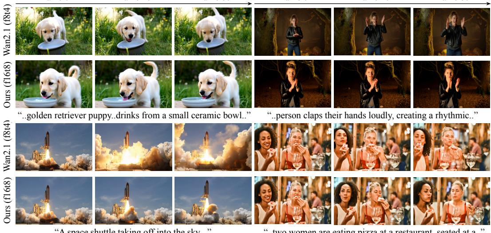  
Frame 40  
Frame 80  
“..two women are eating pizza at a restaurant, seated at a..”

Figure 6: Qualitative comparison at 736×1280×81. VBench (Huang et al., 2023; 2024) samples from Wan2.1-14B (Wan et al., 2025) before compression and GRACE (Ours), generated from the same prompt, for text-to-video (top) and image-to-video (bottom). Best viewed when zoomed in.

Quantitative comparison. In Tabs. 2 and 3, the most direct comparison is DC-Gen, which adapts the same pretrained DiT at twice our token count. GRACE runs faster than DC-Gen and scores higher on every VBench total, although DC-Gen is higher on the quality scores at 736×1280×81, which we examine in the qualitative comparison below. GRACE also follows the conditioning image more closely, leading DC-Gen on the I2V score by 7.23 at 480×832×81. LTX-Video reaches a higher I2V total at the same token count but runs slower, since a third guidance branch adds a DiT pass per step. On T2V, however, LTX-Video scores 6.64 below GRACE at 480×832×81. Open-Sora 2.0 uses about twice our token count, yet runs slower and has the lowest VBench totals in both tasks at both resolutions. In text-to-video, GRACE leads on background consistency and temporal flickering at both resolutions, despite moving more than the pretrained pipeline. Appendix D.2 reports a human evaluation against Wan2.1-14B and DC-Gen.

Qualitative comparison. Figs. 5 and 6 compare GRACE with the pretrained pipeline. GRACE preserves the scene layout, the subject, and the motion of the pretrained samples while using nearly 8× fewer tokens. DC-Gen, by contrast, departs from the pretrained pipeline, producing samples that move more and are consistently more saturated (Figs. I.1–I.4). These differences raise the quality scores of DC-Gen at 736×1280×81, since the LAION aesthetic predictor used by VBench scores saturated images higher (Schuhmann et al., 2022; Taylor et al., 2026). LTX-Video falls short in a different way, often missing the action described in the prompt. In the human action dimension of VBench-T2V, LTX-Video scores 86.00 at both resolutions, against 96.00–100.00 for every other model, including 99.00 and 100.00 for GRACE (Tabs. D.1a and D.2a). At 736×1280×81 in imageto-video, the motion of LTX-Video tends to come from a global zoom or a slow camera movement over the conditioning image, while the scene stays static (Figs. I.7–I.9). GRACE instead stays close to the color and style of the pretrained pipeline.

Table 4: Ablation on design components. Row (III) keeps the autoencoder of (II) but trains the DiT from scratch for the same number of steps. Bold marks the best value in each column among rows (II) and (IV)–(VI).
<table><tr><td rowspan="2" colspan="2">Method</td><td colspan="3">Components</td><td colspan="3">Reconstruction</td><td colspan="3">VBench-T2V</td><td colspan="3">VBench-I2V</td></tr><tr><td>[Zbase; Zres]</td><td>Lalign</td><td>δ&gt; 0</td><td>PSNR ↑</td><td>LPIPS ↓</td><td>rFVD↓</td><td>Quality ↑</td><td>Semantic ↑</td><td>Total ↑</td><td>I2V↑</td><td>Quality ↑</td><td>Total ↑</td></tr><tr><td>(1)</td><td>Wan2.1-14B (pretrained)</td><td>一</td><td>一</td><td>一</td><td>35.15</td><td>0.016</td><td>1.13</td><td>85.24</td><td>78.70</td><td>83.93</td><td>95.82</td><td>80.01</td><td>87.92</td></tr><tr><td>(II)</td><td>Single-latent Baseline</td><td>X</td><td>X</td><td>X</td><td>33.76</td><td>0.031</td><td>13.11</td><td>83.21</td><td>77.75</td><td>82.12</td><td>93.67</td><td>79.21</td><td>86.44</td></tr><tr><td>(III)</td><td>(II) + DiT from scratch</td><td>X</td><td>X</td><td>X</td><td>33.76</td><td>0.031</td><td>13.11</td><td>74.20</td><td>58.40</td><td>71.04</td><td>53.06</td><td>73.94</td><td>63.50</td></tr><tr><td>(IV)</td><td>(II) + dual-latent</td><td>√</td><td>X</td><td>x</td><td>33.10</td><td>0.031</td><td>13.89</td><td>84.77</td><td>78.65</td><td>83.55</td><td>93.96</td><td>79.32</td><td>86.64</td></tr><tr><td>(V)</td><td> $( \mathrm { I V } ) + \mathcal { L } _ { \mathrm { a l i g n } }$ </td><td>√</td><td>V</td><td>X</td><td>32.63</td><td>0.032</td><td>13.53</td><td>85.22</td><td>82.55</td><td>84.68</td><td>95.23</td><td>79.78</td><td>87.51</td></tr><tr><td>(VI)</td><td>(V) + δ &gt; 0 (Ours)</td><td>V</td><td>V</td><td>V</td><td>32.63</td><td>0.032</td><td>13.53</td><td>86.02</td><td>84.98</td><td>85.81</td><td>95.48</td><td>80.31</td><td>87.90</td></tr></table>

## 5.4 TRAINING COST AND CONVERGENCE

Base Latent Most of the training cost lies in adapting the DiT to the compressed lawith 0.40Lostent. Reusing the pretrained DiT reduces this cost substantially, since a w/o0.35ninDiT trained from scratch for the same number of steps falls far behind 0.30Ton both VBench-T2V and VBench-I2V (Tab. 4, rows II and III). Reuse alone is not sufficient, however, as Open-Sora 2.0 reports blurry videos 0.15that do not fully converge even on 160 GPUs after adapting a pretrained 0.10DiT to Video DC-AE, an autoencoder trained from scratch (Zheng et al., 0.002026). Under the same budget, both the Video DC-AE latent and our Global Training Stepssingle-latent baseline fall short of the pretrained pipeline, although the latter is fine-tuned from the pretrained autoencoder with ${ \mathcal { L } } _ { \mathrm { r e c o n } }$ (Tab. 1). The adaptation cost thus appears to depend on how easily the pretrained DiT can learn the latent, which $\mathcal { L } _ { \mathrm { r e c o n } }$ alone does not account for. Adding $\mathcal { L } _ { \mathrm { a l i g n } }$ makes the residual converge faster to a lower flow matching loss (Fig. 7), while the base channels behave almost identically, since the DiT already models the base latent space. As a result, GRACE matches the pretrained pipeline with 8.5 H200 GPU days for the autoencoder and 30 for the DiT.

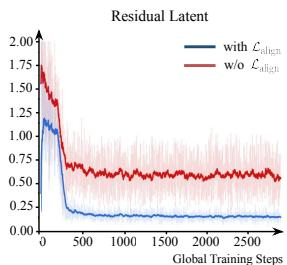  
Figure 7: Convergence during DiT adaptation. With and without $\mathcal { L } _ { \mathrm { a l i g n } } ;$ solid lines show EMA.

## 5.5 ABLATIONS AND DISCUSSION

Ablation on design components. Each component in Tab. 4 improves generation on both tasks. The dual latent and the offset raise the T2V total by 1.43 and 1.13 but the I2V total by only 0.20 and 0.39, as both determine what the generation is anchored to, whereas I2V already provides the conditioning image as an anchor. The dual latent also makes the alignment possible, since $\mathcal { L } _ { \mathrm { a l i g n } }$ needs a pretrained latent to match against. Alignment behaves differently, raising the I2V score as well as both T2V scores, since the conditioning image anchors the content but does not resolve the mismatch between the compressed latent and the DiT’s pretrained denoising space. Alignment therefore recovers most of the gap to the pretrained pipeline on I2V and goes further on T2V, where the total ends up above that pipeline, which may relate to the latent structure that the alignment loss induces (Fig. 3).

Alignment target. We align the compressed latent inside the pretrained DiT (Section 4.2), and Tab. 5 assesses the impact of the alignment target while keeping everything else fixed. Prior work regularizes a high-dimensional latent with a pretrained vision foundation model so that it is easier for a diffusion model to learn (Yao et al., 2025). For that comparison, we use V-

Table 5: Alignment target. Asymmetric denoising is disabled in all rows.
<table><tr><td rowspan="2">Alignment Target</td><td colspan="2">Reconstruction</td><td colspan="3">VBench-T2V</td></tr><tr><td>PSNR ↑ rFVD ↓</td><td></td><td>Quality ↑</td><td>Semantic ↑</td><td>Total ↑</td></tr><tr><td>None</td><td>33.10</td><td>13.89</td><td>84.77</td><td>78.65</td><td>83.55</td></tr><tr><td>V-JEPA 2.1 features</td><td>32.61</td><td>13.93</td><td>84.98</td><td>80.04</td><td>83.99</td></tr><tr><td>Pretrained DiT features (Ours)</td><td>32.63</td><td>13.53</td><td>85.22</td><td>82.55</td><td>84.68</td></tr></table>

JEPA 2.1 (Mur-Labadia et al., 2026), a video foundation model whose dense features are spatially structured and temporally consistent. We keep the loss, the adaptive weighting, and the structure of $P _ { l }$ , and replace the target with V-JEPA 2.1 features of the clean video, applying Pl directly to the compressed latent since the target is no longer in the DiT feature space (see Appendix C.3 for the setup). Aligning to V-JEPA 2.1 raises the semantic score from 78.65 to 80.04, while aligning inside the pretrained DiT raises it far higher, to 82.55, with the totals following the same order. These results suggest that vision foundation models provide useful semantic structure in general, but in our setting, the relevant structure is the one already represented by the pretrained DiT, since the compressed autoencoder is adapted to a fixed denoising model.

Denoising schedule design. Tab. 6 compares the denoising order, used in both DiT adaptation and sampling. Denoising the base first improves the total, while reversing it drops below the synchronous schedule, showing that the direction of the offset is what matters. The gain costs nothing at inference, since both parts are denoised in the same forward pass.

Table 6: Ablation on denoising order.
<table><tr><td rowspan="2">Denoising Order</td><td rowspan="2">Offset</td><td colspan="3">VBench-I2V</td></tr><tr><td>I2V↑</td><td>Quality ↑</td><td>Total ↑</td></tr><tr><td> $\tau _ { \mathrm { b a s e } } = \tau _ { \mathrm { r e s } }$ </td><td>δ = 0</td><td>95.23</td><td>79.78</td><td>87.51</td></tr><tr><td> $\tau _ { \mathrm { b a s e } } > \tau _ { \mathrm { r e s } }$ </td><td>δ &lt; 0</td><td>94.61</td><td>79.72</td><td>87.17</td></tr><tr><td> $\tau _ { \mathrm { b a s e } } < \tau _ { \mathrm { r e s } } \left( \mathbf { O u r s } \right)$ </td><td>δ&gt; 0</td><td>95.48</td><td>80.31</td><td>87.90</td></tr></table>

## 6 CONCLUSION

We presented GRACE, a framework that compresses the latent of a pretrained video diffusion pipeline and adapts the DiT to the compressed latent. GRACE keeps a frozen base latent and learns a residual latent for the information lost under stronger compression, aligns the compressed latent with the pretrained latent in the feature space of the frozen DiT, and denoises the base ahead of the residual so that the residual builds on a settled base. GRACE matches the VBench generation quality of the pretrained pipeline before compression on Wan2.1-I2V-14B while running 11.1× faster at $4 8 0 \times 8 3 2 \times 8 1$ , and the speedup grows with resolution, reaching 15.5× at 736×1280×81. Across the compared autoencoders, better reconstruction does not mean better generation. Optimizing the autoencoder for reconstruction alone moves the latent away from the distribution the DiT has learned, which is why GRACE supervises compression in the space the DiT operates in.

## AI USE STATEMENT

In this work, we used generative AI tools for writing assistance, including polishing prose, short ening captions, and formatting results into LaTeX tables, and for assistance with implementing our method. We have not used generative AI tools for research ideation, methodology design, or experiment design. We used GPT-4o to expand the short VBench-I2V prompts into the evaluation prompts, as described in Appendix C.2; formulating mathematical claims and assisting with proofs are not applicable to this work. Additionally, we used generative AI tools to search for related work, whose relevance and content we verified by reading the cited papers ourselves. We have reviewed all AI-assisted work: AI-assisted code was read and tested by the authors, every number reported in this paper was produced by our own experiments and transcribed into the tables by the authors, and all AI-assisted text was rewritten or approved by the authors. We take responsibility for the final content of this work, including text, claims or artifacts produced with the aid of generative AI.

## REPRODUCIBILITY STATEMENT

The architecture and training setup of our autoencoder are described in Appendix A, and those of the DiT adaptation in Appendix B, with all hyperparameters listed in the corresponding tables. Appendix C describes how each compared autoencoder is adapted to the pretrained DiT and how every model is evaluated, including the sampling configuration of each model and the protocol used to measure latency.

## REFERENCES

Xin Cai, Zhiyuan You, Zhoutong Zhang, and Tianfan Xue. Da-vae: Plug-in latent compression for diffusion via detail alignment, 2026. URL https://arxiv.org/abs/2603.22125.

Junyu Chen, Han Cai, Junsong Chen, Enze Xie, Shang Yang, Haotian Tang, Muyang Li, Yao Lu, and Song Han. Deep compression autoencoder for efficient high-resolution diffusion models, 2025a. URL https://arxiv.org/abs/2410.10733.

Junyu Chen, Wenkun He, Yuchao Gu, Yuyang Zhao, Jincheng Yu, Junsong Chen, Dongyun Zou, Yujun Lin, Zhekai Zhang, Muyang Li, Haocheng Xi, Ligeng Zhu, Enze Xie, Song Han, and Han Cai. Dc-videogen: Efficient video generation with deep compression video autoencoder, 2025b. URL https://arxiv.org/abs/2509.25182.

Junyu Chen, Dongyun Zou, Wenkun He, Junsong Chen, Enze Xie, Song Han, and Han Cai. Dcae 1.5: Accelerating diffusion model convergence with structured latent space, 2025c. URL https://arxiv.org/abs/2508.00413.

Tsai-Shien Chen, Aliaksandr Siarohin, Willi Menapace, Ekaterina Deyneka, Hsiang wei Chao, Byung Eun Jeon, Yuwei Fang, Hsin-Ying Lee, Jian Ren, Ming-Hsuan Yang, and Sergey Tulyakov. Panda-70m: Captioning 70m videos with multiple cross-modality teachers, 2024. URL https: //arxiv.org/abs/2402.19479.

Yu Cheng and Fajie Yuan. Leanvae: An ultra-efficient reconstruction vae for video diffusion models, 2025. URL https://arxiv.org/abs/2503.14325.

Patrick Esser, Sumith Kulal, Andreas Blattmann, Rahim Entezari, Jonas Muller, Harry Saini, Yam¨ Levi, Dominik Lorenz, Axel Sauer, Frederic Boesel, Dustin Podell, Tim Dockhorn, Zion En glish, Kyle Lacey, Alex Goodwin, Yannik Marek, and Robin Rombach. Scaling rectified flow transformers for high-resolution image synthesis, 2024. URL https://arxiv.org/abs/ 2403.03206.

Yoav HaCohen, Nisan Chiprut, Benny Brazowski, Daniel Shalem, Dudu Moshe, Eitan Richardson, Eran Levin, Guy Shiran, Nir Zabari, Ori Gordon, Poriya Panet, Sapir Weissbuch, Victor Kulikov, Yaki Bitterman, Zeev Melumian, and Ofir Bibi. Ltx-video: Realtime video latent diffusion, 2024. URL https://arxiv.org/abs/2501.00103.

Wenkun He, Yuchao Gu, Junyu Chen, Junyi Wu, Wenhang Ge, Dongyun Zou, Yujun Lin, Zhekai Zhang, Haocheng Xi, Muyang Li, et al. Dc-gen: Post-training diffusion acceleration with deeply compressed latent space. In European Conference on Computer Vision, pp. 249–269. Springer, 2026.

Edward J. Hu, Yelong Shen, Phillip Wallis, Zeyuan Allen-Zhu, Yuanzhi Li, Shean Wang, Lu Wang, and Weizhu Chen. Lora: Low-rank adaptation of large language models, 2021. URL https: //arxiv.org/abs/2106.09685.

Ziqi Huang, Yinan He, Jiashuo Yu, Fan Zhang, Chenyang Si, Yuming Jiang, Yuanhan Zhang, Tianxing Wu, Qingyang Jin, Nattapol Chanpaisit, Yaohui Wang, Xinyuan Chen, Limin Wang, Dahua Lin, Yu Qiao, and Ziwei Liu. Vbench: Comprehensive benchmark suite for video generative models, 2023. URL https://arxiv.org/abs/2311.17982.

Ziqi Huang, Fan Zhang, Xiaojie Xu, Yinan He, Jiashuo Yu, Ziyue Dong, Qianli Ma, Nattapol Chanpaisit, Chenyang Si, Yuming Jiang, Yaohui Wang, Xinyuan Chen, Ying-Cong Chen, Limin Wang, Dahua Lin, Yu Qiao, and Ziwei Liu. Vbench++: Comprehensive and versatile benchmark suite for video generative models, 2024. URL https://arxiv.org/abs/2411.13503.

Diederik P Kingma and Max Welling. Auto-encoding variational bayes, 2022. URL https: //arxiv.org/abs/1312.6114.

Jiachen Li, Weixi Feng, Tsu-Jui Fu, Xinyi Wang, Sugato Basu, Wenhu Chen, and William Yang Wang. T2v-turbo: Breaking the quality bottleneck of video consistency model with mixed reward feedback, 2024. URL https://arxiv.org/abs/2405.18750.

Zongjian Li, Bin Lin, Yang Ye, Liuhan Chen, Xinhua Cheng, Shenghai Yuan, and Li Yuan. Wf-vae: Enhancing video vae by wavelet-driven energy flow for latent video diffusion model, 2025. URL https://arxiv.org/abs/2411.17459.

Cheng Lu, Yuhao Zhou, Fan Bao, Jianfei Chen, Chongxuan Li, and Jun Zhu. Dpm-solver: A fast ode solver for diffusion probabilistic model sampling in around 10 steps, 2022. URL https: //arxiv.org/abs/2206.00927.

Guoqing Ma, Haoyang Huang, Kun Yan, Liangyu Chen, Nan Duan, Shengming Yin, Changyi Wan, Ranchen Ming, Xiaoniu Song, Xing Chen, Yu Zhou, Deshan Sun, Deyu Zhou, Jian Zhou, Kaijun Tan, Kang An, Mei Chen, Wei Ji, Qiling Wu, Wen Sun, Xin Han, Yanan Wei, Zheng Ge, Aojie Li, Bin Wang, Bizhu Huang, Bo Wang, Brian Li, Changxing Miao, Chen Xu, Chenfei Wu, Chenguang Yu, Dapeng Shi, Dingyuan Hu, Enle Liu, Gang Yu, Ge Yang, Guanzhe Huang, Gulin Yan, Haiyang Feng, Hao Nie, Haonan Jia, Hanpeng Hu, Hanqi Chen, Haolong Yan, Heng

Wang, Hongcheng Guo, Huilin Xiong, Huixin Xiong, Jiahao Gong, Jianchang Wu, Jiaoren Wu, Jie Wu, Jie Yang, Jiashuai Liu, Jiashuo Li, Jingyang Zhang, Junjing Guo, Junzhe Lin, Kaixiang Li, Lei Liu, Lei Xia, Liang Zhao, Liguo Tan, Liwen Huang, Liying Shi, Ming Li, Mingliang Li, Muhua Cheng, Na Wang, Qiaohui Chen, Qinglin He, Qiuyan Liang, Quan Sun, Ran Sun, Rui Wang, Shaoliang Pang, Shiliang Yang, Sitong Liu, Siqi Liu, Shuli Gao, Tiancheng Cao, Tianyu Wang, Weipeng Ming, Wenqing He, Xu Zhao, Xuelin Zhang, Xianfang Zeng, Xiaojia Liu, Xuan Yang, Yaqi Dai, Yanbo Yu, Yang Li, Yineng Deng, Yingming Wang, Yilei Wang, Yuanwei Lu, Yu Chen, Yu Luo, Yuchu Luo, Yuhe Yin, Yuheng Feng, Yuxiang Yang, Zecheng Tang, Zekai Zhang, Zidong Yang, Binxing Jiao, Jiansheng Chen, Jing Li, Shuchang Zhou, Xiangyu Zhang, Xinhao Zhang, Yibo Zhu, Heung-Yeung Shum, and Daxin Jiang. Step-video-t2v technical report: The practice, challenges, and future of video foundation model, 2025. URL https://arxiv.org/abs/2502.10248.

Aniruddha Mahapatra, Long Mai, Yitian Zhang, David Bourgin, and Feng Liu. Progressive growing of video tokenizers for highly compressed latent spaces. arXiv preprint arXiv:2501.05442, 2025.

Lorenzo Mur-Labadia, Matthew Muckley, Amir Bar, Mido Assran, Koustuv Sinha, Mike Rabbat, Yann LeCun, Nicolas Ballas, and Adrien Bardes. V-jepa 2.1: Unlocking dense features in video self-supervised learning, 2026. URL https://arxiv.org/abs/2603.14482.

NVIDIA, :, Niket Agarwal, Arslan Ali, Maciej Bala, Yogesh Balaji, Erik Barker, Tiffany Cai, Prithvijit Chattopadhyay, Yongxin Chen, Yin Cui, Yifan Ding, Daniel Dworakowski, Jiaojiao Fan, Michele Fenzi, Francesco Ferroni, Sanja Fidler, Dieter Fox, Songwei Ge, Yunhao Ge, Jinwei Gu, Siddharth Gururani, Ethan He, Jiahui Huang, Jacob Huffman, Pooya Jannaty, Jingyi Jin, Seung Wook Kim, Gergely Klar, Grace Lam, Shiyi Lan, Laura Leal-Taixe, Anqi Li, Zhaoshuo´ Li, Chen-Hsuan Lin, Tsung-Yi Lin, Huan Ling, Ming-Yu Liu, Xian Liu, Alice Luo, Qianli Ma, Hanzi Mao, Kaichun Mo, Arsalan Mousavian, Seungjun Nah, Sriharsha Niverty, David Page, Despoina Paschalidou, Zeeshan Patel, Lindsey Pavao, Morteza Ramezanali, Fitsum Reda, Xiaowei Ren, Vasanth Rao Naik Sabavat, Ed Schmerling, Stella Shi, Bartosz Stefaniak, Shitao Tang, Lyne Tchapmi, Przemek Tredak, Wei-Cheng Tseng, Jibin Varghese, Hao Wang, Haoxiang Wang, Heng Wang, Ting-Chun Wang, Fangyin Wei, Xinyue Wei, Jay Zhangjie Wu, Jiashu Xu, Wei Yang, Lin Yen-Chen, Xiaohui Zeng, Yu Zeng, Jing Zhang, Qinsheng Zhang, Yuxuan Zhang, Qingqing Zhao, and Artur Zolkowski. Cosmos world foundation model platform for physical ai, 2025. URL https://arxiv.org/abs/2501.03575.

OpenAI, Josh Achiam, Steven Adler, Sandhini Agarwal, Lama Ahmad, Ilge Akkaya, Florencia Leoni Aleman, Diogo Almeida, Janko Altenschmidt, Sam Altman, Shyamal Anadkat, Red Avila, Igor Babuschkin, Suchir Balaji, Valerie Balcom, Paul Baltescu, Haiming Bao, Mohammad Bavarian, Jeff Belgum, Irwan Bello, Jake Berdine, Gabriel Bernadett-Shapiro, Christopher Berner, Lenny Bogdonoff, Oleg Boiko, Madelaine Boyd, Anna-Luisa Brakman, Greg Brockman, Tim Brooks, Miles Brundage, Kevin Button, Trevor Cai, Rosie Campbell, Andrew Cann, Brittany Carey, Chelsea Carlson, Rory Carmichael, Brooke Chan, Che Chang, Fotis Chantzis, Derek Chen, Sully Chen, Ruby Chen, Jason Chen, Mark Chen, Ben Chess, Chester Cho, Casey Chu, Hyung Won Chung, Dave Cummings, Jeremiah Currier, Yunxing Dai, Cory Decareaux, Thomas Degry, Noah Deutsch, Damien Deville, Arka Dhar, David Dohan, Steve Dowling, Sheila Dunning, Adrien Ecoffet, Atty Eleti, Tyna Eloundou, David Farhi, Liam Fedus, Niko Felix, Simon Posada Fishman, Juston Forte, Isabella Fulford, Leo Gao, Elie Georges, Christian Gib-´ son, Vik Goel, Tarun Gogineni, Gabriel Goh, Rapha Gontijo-Lopes, Jonathan Gordon, Morgan Grafstein, Scott Gray, Ryan Greene, Joshua Gross, Shixiang Shane Gu, Yufei Guo, Chris Hallacy, Jesse Han, Jeff Harris, Yuchen He, Mike Heaton, Johannes Heidecke, Chris Hesse, Alan Hickey, Wade Hickey, Peter Hoeschele, Brandon Houghton, Kenny Hsu, Shengli Hu, Xin Hu, Joost Huizinga, Shantanu Jain, Shawn Jain, Joanne Jang, Angela Jiang, Roger Jiang, Haozhun Jin, Denny Jin, Shino Jomoto, Billie Jonn, Heewoo Jun, Tomer Kaftan, Łukasz Kaiser, Ali Ka mali, Ingmar Kanitscheider, Nitish Shirish Keskar, Tabarak Khan, Logan Kilpatrick, Jong Wook Kim, Christina Kim, Yongjik Kim, Jan Hendrik Kirchner, Jamie Kiros, Matt Knight, Daniel Kokotajlo, Łukasz Kondraciuk, Andrew Kondrich, Aris Konstantinidis, Kyle Kosic, Gretchen Krueger, Vishal Kuo, Michael Lampe, Ikai Lan, Teddy Lee, Jan Leike, Jade Leung, Daniel Levy, Chak Ming Li, Rachel Lim, Molly Lin, Stephanie Lin, Mateusz Litwin, Theresa Lopez, Ryan Lowe, Patricia Lue, Anna Makanju, Kim Malfacini, Sam Manning, Todor Markov, Yaniv Markovski, Bianca Martin, Katie Mayer, Andrew Mayne, Bob McGrew, Scott Mayer McKinney,

Christine McLeavey, Paul McMillan, Jake McNeil, David Medina, Aalok Mehta, Jacob Menick, Luke Metz, Andrey Mishchenko, Pamela Mishkin, Vinnie Monaco, Evan Morikawa, Daniel Mossing, Tong Mu, Mira Murati, Oleg Murk, David Mely, Ashvin Nair, Reiichiro Nakano, Ra-´ jeev Nayak, Arvind Neelakantan, Richard Ngo, Hyeonwoo Noh, Long Ouyang, Cullen O’Keefe, Jakub Pachocki, Alex Paino, Joe Palermo, Ashley Pantuliano, Giambattista Parascandolo, Joel Parish, Emy Parparita, Alex Passos, Mikhail Pavlov, Andrew Peng, Adam Perelman, Filipe de Avila Belbute Peres, Michael Petrov, Henrique Ponde de Oliveira Pinto, Michael, Pokorny, Michelle Pokrass, Vitchyr H. Pong, Tolly Powell, Alethea Power, Boris Power, Elizabeth Proehl, Raul Puri, Alec Radford, Jack Rae, Aditya Ramesh, Cameron Raymond, Francis Real, Kendra Rimbach, Carl Ross, Bob Rotsted, Henri Roussez, Nick Ryder, Mario Saltarelli, Ted Sanders, Shibani Santurkar, Girish Sastry, Heather Schmidt, David Schnurr, John Schulman, Daniel Selsam, Kyla Sheppard, Toki Sherbakov, Jessica Shieh, Sarah Shoker, Pranav Shyam, Szymon Sidor, Eric Sigler, Maddie Simens, Jordan Sitkin, Katarina Slama, Ian Sohl, Benjamin Sokolowsky, Yang Song, Natalie Staudacher, Felipe Petroski Such, Natalie Summers, Ilya Sutskever, Jie Tang, Nikolas Tezak, Madeleine B. Thompson, Phil Tillet, Amin Tootoonchian, Elizabeth Tseng, Preston Tuggle, Nick Turley, Jerry Tworek, Juan Felipe Ceron Uribe, Andrea Vallone, Arun Vi-´ jayvergiya, Chelsea Voss, Carroll Wainwright, Justin Jay Wang, Alvin Wang, Ben Wang, Jonathan Ward, Jason Wei, CJ Weinmann, Akila Welihinda, Peter Welinder, Jiayi Weng, Lilian Weng, Matt Wiethoff, Dave Willner, Clemens Winter, Samuel Wolrich, Hannah Wong, Lauren Workman, Sherwin Wu, Jeff Wu, Michael Wu, Kai Xiao, Tao Xu, Sarah Yoo, Kevin Yu, Qiming Yuan, Wojciech Zaremba, Rowan Zellers, Chong Zhang, Marvin Zhang, Shengjia Zhao, Tianhao Zheng, Juntang Zhuang, William Zhuk, and Barret Zoph. Gpt-4 technical report, 2024. URL https://arxiv.org/abs/2303.08774.

William Peebles and Saining Xie. Scalable diffusion models with transformers, 2023. URL https: //arxiv.org/abs/2212.09748.

Christoph Schuhmann, Romain Beaumont, Richard Vencu, Cade Gordon, Ross Wightman, Mehdi Cherti, Theo Coombes, Aarush Katta, Clayton Mullis, Mitchell Wortsman, Patrick Schramowski, Srivatsa Kundurthy, Katherine Crowson, Ludwig Schmidt, Robert Kaczmarczyk, and Jenia Jit sev. LAION-5B: An open large-scale dataset for training next generation image-text models. In Advances in Neural Information Processing Systems Datasets and Benchmarks Track, 2022.

Jiaming Song, Chenlin Meng, and Stefano Ermon. Denoising diffusion implicit models, 2022. URL https://arxiv.org/abs/2010.02502.

Jianlin Su, Yu Lu, Shengfeng Pan, Ahmed Murtadha, Bo Wen, and Yunfeng Liu. Roformer: Enhanced transformer with rotary position embedding, 2023. URL https://arxiv.org/abs/ 2104.09864.

Wenhao Sun, Rong-Cheng Tu, Jingyi Liao, Zhao Jin, and Dacheng Tao. Asymrnr: Video diffusion transformers acceleration with asymmetric reduction and restoration, 2025. URL https:// arxiv.org/abs/2412.11706.

Jordan Taylor, William Agnew, Maarten Sap, Sarah E Fox, and Haiyi Zhu. The algorithmic gaze of image quality assessment: An audit and trace ethnography of the laion-aesthetics predictor. In Proceedings of the 2026 ACM Conference on Fairness, Accountability, and Transparency, FAccT ’26, pp. 6383–6402. ACM, June 2026. doi: 10.1145/3805689.3806462. URL http: //dx.doi.org/10.1145/3805689.3806462.

Rui Tian, Qi Dai, Jianmin Bao, Kai Qiu, Yifan Yang, Chong Luo, Zuxuan Wu, and Yu-Gang Jiang. Reducio! generating 1k video within 16 seconds using extremely compressed motion latents, 2025. URL https://arxiv.org/abs/2411.13552.

Thomas Unterthiner, Sjoerd van Steenkiste, Karol Kurach, Raphael Marinier, Marcin Michalski, and Sylvain Gelly. Towards accurate generative models of video: A new metric & challenges, 2019. URL https://arxiv.org/abs/1812.01717.

Laurens van der Maaten and Geoffrey Hinton. Visualizing data using t-sne. Journal of Machine Learning Research, 9(86):2579–2605, 2008. URL http://jmlr.org/papers/v9/ vandermaaten08a.html.

Team Wan, Ang Wang, Baole Ai, Bin Wen, Chaojie Mao, Chen-Wei Xie, Di Chen, Feiwu Yu, Haiming Zhao, Jianxiao Yang, Jianyuan Zeng, Jiayu Wang, Jingfeng Zhang, Jingren Zhou, Jinkai Wang, Jixuan Chen, Kai Zhu, Kang Zhao, Keyu Yan, Lianghua Huang, Mengyang Feng, Ningyi Zhang, Pandeng Li, Pingyu Wu, Ruihang Chu, Ruili Feng, Shiwei Zhang, Siyang Sun, Tao Fang, Tianxing Wang, Tianyi Gui, Tingyu Weng, Tong Shen, Wei Lin, Wei Wang, Wei Wang, Wenmeng Zhou, Wente Wang, Wenting Shen, Wenyuan Yu, Xianzhong Shi, Xiaoming Huang, Xin Xu, Yan Kou, Yangyu Lv, Yifei Li, Yijing Liu, Yiming Wang, Yingya Zhang, Yitong Huang, Yong Li, You Wu, Yu Liu, Yulin Pan, Yun Zheng, Yuntao Hong, Yupeng Shi, Yutong Feng, Zeyinzi Jiang, Zhen Han, Zhi-Fan Wu, and Ziyu Liu. Wan: Open and advanced large-scale video generative models, 2025. URL https://arxiv.org/abs/2503.20314.

Fu-Yun Wang, Zhaoyang Huang, Weikang Bian, Xiaoyu Shi, Keqiang Sun, Guanglu Song, Yu Liu, and Hongsheng Li. Animatelcm: Computation-efficient personalized style video generation with out personalized video data, 2024. URL https://arxiv.org/abs/2402.00769.

Zhou Wang, A.C. Bovik, H.R. Sheikh, and E.P. Simoncelli. Image quality assessment: from error visibility to structural similarity. IEEE Transactions on Image Processing, 13(4):600–612, 2004. doi: 10.1109/TIP.2003.819861.

Pingyu Wu, Kai Zhu, Yu Liu, Liming Zhao, Wei Zhai, Yang Cao, and Zheng-Jun Zha. Improved video vae for latent video diffusion model, 2024. URL https://arxiv.org/abs/2411. 06449.

Haocheng Xi, Shuo Yang, Yilong Zhao, Chenfeng Xu, Muyang Li, Xiuyu Li, Yujun Lin, Han Cai, Jintao Zhang, Dacheng Li, Jianfei Chen, Ion Stoica, Kurt Keutzer, and Song Han. Sparse videogen: Accelerating video diffusion transformers with spatial-temporal sparsity, 2025. URL https://arxiv.org/abs/2502.01776.

Jingfeng Yao, Bin Yang, and Xinggang Wang. Reconstruction vs. generation: Taming optimization dilemma in latent diffusion models, 2025. URL https://arxiv.org/abs/2501.01423.

Richard Zhang, Phillip Isola, Alexei A. Efros, Eli Shechtman, and Oliver Wang. The unreasonable effectiveness of deep features as a perceptual metric, 2018. URL https://arxiv.org/abs/ 1801.03924.

Sijie Zhao, Yong Zhang, Xiaodong Cun, Shaoshu Yang, Muyao Niu, Xiaoyu Li, Wenbo Hu, and Ying Shan. Cv-vae: A compatible video vae for latent generative video models, 2024. URL https://arxiv.org/abs/2405.20279.

Wenliang Zhao, Lujia Bai, Yongming Rao, Jie Zhou, and Jiwen Lu. Unipc: A unified predictorcorrector framework for fast sampling of diffusion models, 2023. URL https://arxiv. org/abs/2302.04867.

Boyang Zheng, Nanye Ma, Shengbang Tong, and Saining Xie. Diffusion transformers with representation autoencoders, 2025. URL https://arxiv.org/abs/2510.11690.

Zangwei Zheng, Xiangyu Peng, Yuxuan Lou, Chenhui Shen, Tom Young, Xinying Guo, Binluo Wang, Hang Xu, Hongxin Liu, Mingyan Jiang, Wenjun Li, Yuhui Wang, Anbang Ye, Gang Ren, Qianran Ma, Wanying Liang, Xiang Lian, Xiwen Wu, Yuting Zhong, Zhuangyan Li, Chaoyu Gong, Guojun Lei, Leijun Cheng, Limin Zhang, Minghao Li, Ruijie Zhang, Silan Hu, Shijie Huang, Xiaokang Wang, Yuanheng Zhao, Yuqi Wang, Ziang Wei, and Yang You. Open-sora 2.0: Training a commercial-level video generation model in \$200k, 2026. URL https://arxiv. org/abs/2503.09642.

## APPENDIX

This appendix provides supplementary material to support the main paper.

• Appendix A describes the architecture and the training setup of our autoencoder, and Appendix B provides the corresponding details for the DiT, including how it is extended to the compressed latent.

• Appendix C describes how the compared autoencoders are adapted to the pretrained DiT and how every model is evaluated.

• Appendix D reports per-dimension VBench scores, results at a higher resolution, and a human evaluation.

• Appendix E ablates the autoencoder design and the alignment design.

• Appendix F analyzes the compressed latent and the convergence of each of its parts, and Appendix G reports the training and inference cost.

• Appendix H extends the discussion of related work, Appendix I collects the qualitative samples referenced throughout the paper, and Appendix J states the limitations of our method.

## Contents

A GRACE Autoencoder Details 18   
A.1 Architectural Details. .18   
A.2 Implementation Details . 19   
B GRACE Diffusion Model Details . . . . 20   
B.1 Architectural Details . . . 20   
B.2 Implementation Details . . 20   
C More Details on Evaluation . . 21   
C.1 Adaptation of Other Autoencoders . . . 21   
C.2 Evaluation Protocol . . . . 21   
C.3 Alignment to V-JEPA 2.1 . . 22   
D Additional Evaluation . . 22   
D.1 Video Generation . . 22   
D.2 Human Evaluation . . 25   
E Additional Ablations. . .27   
E.1 Autoencoder Design . . 27   
E.2 Alignment Design . . . 27   
F Additional Analysis . . . 28   
F.1 Latent Analysis . . . 28   
F.2 Convergence Behavior . . . 29   
G Computational Cost . . . 30   
H More Discussion on Related Work . . 30   
I Additional Qualitative Results . . . 30   
J Limitations . . . 43

## A GRACE AUTOENCODER DETAILSSpace & Time 2→ Channel

## A.1 ARCHITECTURAL DETAILSres

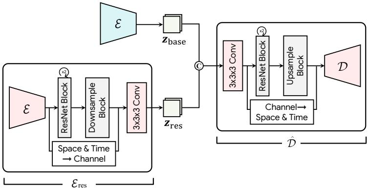  
Figure A.1: Detailed autoencoder architecture. $\mathcal { E } _ { \mathrm { r e s } }$ adds a downsampling stage between its middle blocks and head, consisting of residual blocks and a strided causal convolution, paired with a parameter-free shortcut that folds space and time into channels.

Fig. A.1 shows the architecture of our autoencoder in detail. We reuse the encoder and decoder backbones of Wan2.1 and describe our additions below

Base encoding. We obtain $\mathbf { z } _ { \mathrm { b a s e } }$ from the frozen encoder $\mathcal { E } .$ Since $\mathcal { E }$ compresses at fixed factors, we reduce the video first. We downsample the frames by $r _ { s }$ with bilinear interpolation, and subsample them by $r _ { t }$ in time. We experiment with average pooling, strided sampling, and bilinear interpolation as reduction strategies, and the setting above reconstructs best.

Residual encoding. The residual encoder $\mathcal { E } _ { \mathrm { r e s } }$ has the same architecture as $\mathcal { E } ,$ but takes the fullresolution video, so it needs an additional compression step to match the target resolution. In the pretrained encoder, four downsampling stages are followed by middle blocks that refine the feature at the final resolution through residual and attention layers, and then by a head that projects it to the latent. We add one downsample block between the middle blocks and the head. The block reuses the design of the pretrained downsample blocks, which pass the feature through two residual blocks before a strided convolution over space and a strided causal convolution over time. We attach a non-parametric shortcut to this block, following the residual autoencoding of DC-AE (Chen et al., 2025a). Since the block compresses time as well as space, the shortcut moves both axes into the channel axis, then averages channel groups to match the channel number of the block output. Its result is added to the block output, which leaves the block to learn the residual.

Decoding. The decoder $\hat { \mathcal { D } }$ extends the input convolution of D from $C$ to $C { + } C ^ { \prime }$ channels for the concatenated latent, and adds one upsample block symmetric to the downsample block of ${ \mathcal E } _ { \mathrm { r e s } }$ . The weights for the residual channels are zero-initialized, so training starts at the pretrained reconstruction quality. The non-parametric shortcut of this block runs in the opposite direction, duplicating channels and then applying a channel-to-space-and-time operation. In the image-to-video setting, the first frame is available at inference as well as during training, and we pass it to $\hat { \mathcal { D } }$ to restore detail the compressed latent cannot carry on its own. We encode the first frame with ${ \mathcal E } _ { \mathrm { r e s } }$ and inject its intermediate features into $\hat { \mathcal { D } }$ through gated cross-attention (Tian et al., 2025). We take the feature before each downsampling stage of the encoder and attend to it at the matching stage of $\hat { \mathcal { D } }$ . A learned gate on each block controls how much of the first frame reaches $\hat { \mathcal { D } } .$

Single-latent baseline. The baseline replaces the base and residual pair with a single encoder, so there is no frozen $\mathcal { E }$ and no reduction of the input. The compression block keeps the same design and placement, and both the non-parametric shortcut and the first-frame cross-attention are unchanged.

## A.2 IMPLEMENTATION DETAILS

We train the autoencoder in two phases. In the first phase, we update $\mathcal { E } _ { \mathrm { r e s } }$ and $\hat { \mathcal { D } }$ at $2 5 6 \times 2 5 6 \times 8 1$ along with $W _ { \mathrm { i n } } ^ { \mathrm { r e s } }$ and the per-layer projections $P _ { l }$ . All other parameters of $\mathbf { v } _ { \theta }$ and $\mathbf { v } _ { \theta , + }$ remain frozen. In the second phase, we raise the resolution to $5 1 2 \times 5 1 2 \times 8 1$ and train $\hat { \mathcal { D } }$ alone, following the decoupled high-resolution adaptation of DC-AE (Chen et al., 2025a), which freezes $\mathcal { E } _ { \mathrm { r e s } }$ as well so that the latent space stays fixed while the decoder adapts. E stays frozen in both phases. We train a separate autoencoder for each task, with $\mathcal { L } _ { \mathrm { a l i g n } }$ supervised by the pretrained DiT of that task, and report reconstruction with the image-to-video autoencoder.

Training setup. We train on Panda-70M (Chen et al., 2024) with AdamW, using the hyperparameters in Tab. A.1. The clip length stays at 81 frames, since reconstruction degrades quickly on shorter clips under high temporal compression. The modules we add on the DiT side, $W _ { \mathrm { i n } } ^ { \mathrm { r e s } }$ and $P _ { l }$ , are trained with a separate learning rate.

Initialization. We initialize ${ \mathcal E } _ { \mathrm { r e s } }$ and $\hat { \mathcal { D } }$ from the pretrained weights. The added downsample and upsample blocks are trained from scratch, and the input convolution of $\hat { \mathcal { D } }$ is zero-initialized on the residual channels. The gate of each first-frame cross-attention block is also zero, so the first frame has no effect at the start of training.

Training objective. We follow the loss configuration of the pretrained autoen-

Table A.1: Stage 1 hyperparameters. All settings follow the training recipe of the pretrained autoencoder.
<table><tr><td></td><td>Hyperparameter</td><td>Phase 1</td><td>Phase 2</td></tr><tr><td rowspan="2">Architecture</td><td>pretrained autoencoder (C, C&#x27;)</td><td>Wan2.1-VAE (16, 16)</td><td>Wan2.1-VAE (16, 16)</td></tr><tr><td> $( r _ { s } , r _ { t } )$ </td><td>(2,2)</td><td>(2,2)</td></tr><tr><td rowspan="8">Training setup</td><td>input shape</td><td>256×256×81</td><td>512×512×81</td></tr><tr><td>trained modules</td><td> $\mathcal { E } _ { \mathrm { r e s } } , \hat { \mathcal { D } }$ </td><td>D</td></tr><tr><td>optimizer</td><td>AdamW</td><td>AdamW</td></tr><tr><td>learning rate</td><td>8e-5</td><td>4e-5</td></tr><tr><td>betas</td><td>(0.9,0.999)</td><td>(0.9,0.999)</td></tr><tr><td>weight decay</td><td>1e-4</td><td>1e-4</td></tr><tr><td>scheduler</td><td>constant</td><td>constant</td></tr><tr><td>precision effective batch size</td><td>bf16 32</td><td>bf16 64</td></tr><tr><td rowspan="3"> $\scriptstyle { \mathcal { L } } _ { \mathrm { r e c o n } }$ </td><td></td><td>1.0</td><td>1.0</td></tr><tr><td> $\lambda _ { \mathrm { L 1 } }$  λLPIPS</td><td>3.0</td><td>3.0</td></tr><tr><td>λKL</td><td>3e-6</td><td>3e-6</td></tr><tr><td rowspan="5"> $\mathcal { L } _ { \mathrm { a l i g n } }$ </td><td>reference DiT</td><td>Wan2.1-14B</td><td></td></tr><tr><td>alignment depth</td><td>10</td><td></td></tr><tr><td>P{ bottleneck</td><td>16</td><td></td></tr><tr><td></td><td></td><td></td></tr><tr><td>added-module learning rate</td><td>1e-4</td><td></td></tr></table>

coder, with the weights listed in Tab. A.1. We apply $\mathcal { L } _ { \mathrm { a l i g n } }$ only in the first phase, since the second phase leaves the latent unchanged. Each $P _ { l }$ is a two-layer projection with a bottleneck of 16 channels, zero-initialized on the output so that the alignment starts from no contribution. We sample τ with the scheduler of the pretrained pipeline.

Single-latent baseline. The baseline trains with $\mathcal { L } _ { \mathrm { r e c o n } }$ alone, since there is no residual to shape and $\mathcal { L } _ { \mathrm { a l i g n } }$ never applies. The two phases and every hyperparameter in Tab. A.1 are the same.

## B GRACE DIFFUSION MODEL DETAILS

## B.1 ARCHITECTURAL DETAILS

We reuse the Wan2.1 DiT and modify only what the compressed latent requires.

Input and output projections. Wan2.1-14B patchifies a latent of C channels, and for image-tovideo it also takes a mask and the latent of the conditioning frame. We extend all three along the channel axis. The mask width is tied to the temporal compression factor, so it doubles with the latent, and we copy the pretrained weights into the channels it had before and zero-initialize the rest. The output projection is widened the same way, with the added channels zero-initialized, so the model starts from its pretrained behavior.

Position encoding. Compression places tokens farther apart in the video than the DiT was trained to expect. We therefore scale the RoPE (Su et al., 2023) indices by $r _ { s }$ in space and $r _ { t }$ in time. This restores the token spacing the DiT was pretrained with.

Timestep conditioning. The base and the residual latents are denoised at different noise levels, so the DiT receives two timesteps. For the transformer blocks, we add a second modulation projection $W _ { \mathrm { m o d } } ^ { \mathrm { r e s } }$ for the residual timestep, and the two modulations are summed. The two output heads are conditioned separately, each on its own timestep.

Single-latent baseline. The baseline extends the input and output projections in the same way, but the latent is not split, so one timestep suffices and $\dot { W } _ { \mathrm { m o d } } ^ { \mathrm { r e s } }$ is not added.

## B.2 IMPLEMENTATION DETAILS

We adapt the pretrained DiT to the compressed latent while the autoencoder stays frozen. Before the latent enters the DiT, we standardize each part with statistics measured on the training set, following the pretrained pipeline. We fully fine-tune the input projection, the output heads, and $\bar { W } _ { \mathrm { m o d } } ^ { \mathrm { r e s } }$ , together with the modulation and normalization parameters of each block. LoRA (Hu et al., 2021) is applied to all linear layers in the attention and feed-forward blocks, as well as to the key and value projections of the image cross-attention for image-to-video.

Training setup. We train on Panda-70M (Chen et al., 2024) at $4 8 0 \times 8 3 2 \times 8 1$ with AdamW, using the hyperparameters in Tab. B.1. We apply the standard video preprocessing, filtering out clips with scene cuts or excessive motion, and rewrite the captions with GPT-4o (OpenAI et al., 2024) so that they match the length and detail of the prompts Wan2.1- 14B was trained on. Text conditioning is dropped with probability 0.1 for classifierfree guidance.

Initialization. We keep the pretrained weights for the base channels, and zeroinitialize the weights for the residual channels along with $W _ { \mathrm { m o d } } ^ { \mathrm { r e s } }$

Denoising schedule. We sample the offset per video rather than fixing it, so a single model covers a range of offsets at infer-

Table B.1: Stage 2 hyperparameters. Offset and shift are sampled from a range in training, fixed at inference.
<table><tr><td></td><td>Hyperparameter</td><td>I2V</td><td>T2V</td></tr><tr><td rowspan="6">Architecture</td><td>pretrained DiT input dim</td><td>Wan2.1-I2V-14B</td><td>Wan2.1-T2V-14B</td></tr><tr><td></td><td>72</td><td>32</td></tr><tr><td>hidden dim</td><td>5120</td><td>5120</td></tr><tr><td>blocks</td><td>40</td><td>40</td></tr><tr><td>num. heads</td><td>40</td><td>40</td></tr><tr><td>patch size (C, C&#x27;)</td><td>2 (16, 16)</td><td>2 (16, 16)</td></tr><tr><td rowspan="6">Training setup</td><td>input shape</td><td>480×832×81</td><td>480×832×81</td></tr><tr><td>optimizer</td><td>AdamW</td><td>AdamW</td></tr><tr><td>learning rate</td><td>1e-4</td><td>1e-4</td></tr><tr><td>effective batch size</td><td>128</td><td>128</td></tr><tr><td>offset δ</td><td>[0, 0.6]</td><td>[0, 0.6]</td></tr><tr><td>shift s</td><td>[2,5]</td><td>[2,5]</td></tr><tr><td rowspan="3">LoRA</td><td>rank</td><td>512</td><td>512</td></tr><tr><td>α</td><td>512</td><td>512</td></tr><tr><td>image cross-attention</td><td>√</td><td>X</td></tr><tr><td rowspan="4">Sampling</td><td>steps</td><td>50</td><td>50</td></tr><tr><td>guidance scale</td><td>5.0</td><td>5.0</td></tr><tr><td>offset δ</td><td>0.15</td><td>0.15</td></tr><tr><td>shift s</td><td>3</td><td>3</td></tr></table>

ence. The shift s of Eq. 1 is sampled the same way, and we find that a lower shift, which spends more sampling steps near the clean end, recovers detail better on the compressed latent. The values are listed in Tab. B.1. At inference, we run the same 50 sampling steps as the synchronous schedule over uˆ $\in [ 0 , 1 + \delta ]$ , and $\delta = 0$ recovers the synchronous schedule exactly. In the first few steps, only the base is denoised while the residual stays at pure noise, and in the last few, only the residual is denoised while the base is kept fixed until the final step.

Single-latent baseline. The baseline follows the training recipe of Wan2.1, where a single timestep leaves no offset or shift to sample. The weights added to the projections are randomly initialized, following DC-Gen (He et al., 2026).

## C MORE DETAILS ON EVALUATION

## C.1 ADAPTATION OF OTHER AUTOENCODERS

This section details how the pretrained DiT is adapted to each compared autoencoder in Tab. 1. Our own autoencoder is adapted as described in Section 4.3, which extends the pretrained input and output projections and denoises the base ahead of the residual. Both steps build on the base latent from the frozen Wan2.1 encoder, which is unavailable to the compared autoencoders, as their latent spaces are entirely different from the one the DiT was trained on. For each of them, we therefore adapt Wan2.1-I2V-14B with the released implementation of DC-Gen (He et al., 2026), a recent method that adapts a pretrained DiT to a new latent space in three stages: first the patch embedding, then the input and output layers, and finally the whole transformer with LoRA (Hu et al., 2021). Each autoencoder keeps the patch size of 1 used in its original generation model. This adaptation uses the same total budget of 38.5 H200 GPU days as our full pipeline, and all other settings are shared.

## C.2 EVALUATION PROTOCOL

Autoencoder comparison. In Tab. 1, we use Step-Video-VAE v2 (Ma et al., 2025), the Video DC-AE of Open-Sora 2.0 (Zheng et al., 2026), and LTX-VAE 0.9.7 (HaCohen et al., 2024), whose 13B release is closest in size to the generation backbone we compare against. Video DC-AE is evaluated with the spatial and temporal tiling of its released implementation, which uses spatial tiles of 256 pixels and temporal tiles of 32 frames with an overlap factor of 0.25, and reconstructs better than the untiled variant.

Generation comparison. Every model adapted from Wan2.1, including ours, the single-latent baseline, and the latents in Tab. 1, is sampled with a guidance scale of 5.0 and a flow shift of 3.0 on the ful prompt and conditioning image set of VBench-I2V (Huang et al., 2023; 2024). The other generators in Tab. 2 are run from their released checkpoints, the 13B development release of LTX-Video 0.9.7, the high-compression Video DC-AE release of Open-Sora 2.0, and the released DC-Gen model (He et al., 2026). We run LTX-Video as a single 50-step pass at the target resolution, without its multiscale pipeline and spatial upscaler, so that every model denoises the same number of steps at the same resolution. For text-to-video, each model is run with the prompt pipeline recommended by its authors: Wan2.1-14B, GRACE, and DC-Gen each use GPT-enhanced prompts from the VBench release, LTX-Video uses its built-in prompt enhancer, and Open-Sora 2.0 follows its default textto-image-to-video path without prompt refinement. For image-to-video, VBench-I2V provides only short prompts. We expand them once with GPT-4o (OpenAI et al., 2024) and use the same expanded set for Wan2.1-14B, GRACE, and Open-Sora 2.0, which do not release prompts for this setting. DC-Gen uses the extended prompts released with it, and LTX-Video uses its built-in prompt enhancer. Every model takes 50 sampling steps, but the number of forward passes through the DiT differs. LTX-Video combines classifier-free guidance with spatio-temporal guidance, and Open-Sora 2.0 guides on text and image separately, so both evaluate the DiT three times per step rather than twice. Latency covers the conditioning encode, the denoising loop, and the decode of the output video, measured on a single NVIDIA A100 SXM4-80GB in PyTorch with bfloat16 and no inference-time compilation. It excludes model loading, text encoding, and writing the decoded frames to an MP4 file, none of which depend on the latent resolution.

Latent uniformity. Following VA-VAE (Yao et al., 2025), we measure how evenly the latent tokens are distributed. We encode 10,000 clips at 256×256×81, each from a distinct source video in the Panda-70M (Chen et al., 2024) training split, and keep one token per clip, sampled at a random spatio-temporal position. Every autoencoder is probed at the same clips and positions. The tokens are standardized per channel and embedded with t-SNE (van der Maaten & Hinton, 2008) at a perplexity of 30, and we report the coefficient of variation, Gini coefficient, and normalized entropy of a Gaussian kernel density estimate on the embedding, averaged over two t-SNE seeds.

## C.3 ALIGNMENT TO V-JEPA 2.1

For Tab. 5, we use the frozen V-JEPA 2.1 (Mur-Labadia et al., 2026) ViT-L encoder at 256×256, whose 16×16 patch grid already matches the spatial grid of our f16 latent, so no spatial interpolation is needed. Since V-JEPA 2.1 is trained on clips of up to 64 frames, we apply the alignment to the first 65 frames of each 81-frame training clip. Our causal latent encodes the first frame on its own, so we encode it with V-JEPA 2.1 separately and align it with the first latent frame. Each remaining latent frame covers 8 frames and corresponds to four V-JEPA 2.1 tokens of 2 frames each, so a learnable transposed 3D convolution upsamples these latent frames 4× in time to match. We align to the features of block 23, the final block of the encoder, whose output V-JEPA 2.1 uses directly for dense downstream tasks (Mur-Labadia et al., 2026). The alignment uses the same per-token cosine loss and adaptive weighting as $\mathcal { L } _ { \mathrm { a l i g n } }$

## D ADDITIONAL EVALUATION

## D.1 VIDEO GENERATION

We report the VBench scores for each dimension in Tab. D.1a and Tab. D.1b. Several dimensions rank differently from the totals or across settings, and we discuss them below.

Aesthetic quality. DC-Gen scores above GRACE on this dimension in T2V settings, while scoring below on every total. We observe that its samples are consistently more saturated than those of the pretrained pipeline (Figs. I.1–I.4), and the LAION aesthetic predictor behind this dimension has been shown to track photographic taste rather than fidelity to the prompt or to the conditioning image (Taylor et al., 2026). The dimension therefore rewards a shift in appearance that the other dimensions penalize.

Background consistency, motion smoothness, and temporal flickering. In text-to-video, GRACE leads on background consistency and temporal flickering at both resolutions while moving more than the pretrained pipeline, with a dynamic degree of 62.50 against 56.94 at 480×832. In image-to-video at 480×832, LTX-Video leads on all three dimensions. It runs an extra guidance branch for temporal consistency, and in the image-to-video setting it also moves the least of all compared models, with a dynamic degree of 24.80 against 38.62 for GRACE. Videos that move less tend to score higher on these dimensions (Huang et al., 2023; 2024), and the same holds at 736×1280, where GRACE moves less than LTX-Video (30.89 against 49.59) and leads on background consistency and temporal flickering instead.

Preserving the pretrained appearance. Given the same prompt, GRACE stays close to the color and style of the pretrained pipeline in text-to-video, while DC-Gen often departs from it (Figs. I.3 and I.4). The effect is weaker in image-to-video, where the conditioning image fixes the appearance for every model.

At 736×1280×81 (Tab. D.2a and Tab. D.2b), the other per-dimension scores follow the same pattern. DC-Gen again leads on aesthetic quality in text-to-video while trailing on both totals, and LTX-Video keeps the highest subject consistency in image-to-video.

Table D.1: Per-dimension VBench (Huang et al., 2023; 2024) scores at 480×832×81. Singlelatent Baseline is our baseline without the dual latent or the alignment loss. The best score in each row is in bold. †Reported for reference only, as the official VBench-I2V quality score does not include this dimension.  
(a) VBench-T2V
<table><tr><td rowspan="2">Dimension</td><td rowspan="2" colspan="3">Wan2.1-14B Open-Sora 2.0 LTX-Video 0.9.7</td><td rowspan="2"></td><td colspan="2">Wan2.1-14B +</td></tr><tr><td>DC-Gen Single-latent Baseline</td><td>GRACE (Ours)</td></tr><tr><td>Latent tokens</td><td>32.8k</td><td>8.2k</td><td>4.3k</td><td>8.2k</td><td>4.3k</td><td>4.3k</td></tr><tr><td>Latency (s) ↓</td><td>851.5</td><td>138.6</td><td>99.6</td><td>157.1</td><td>76.1</td><td>75.8</td></tr><tr><td>Quality</td><td></td><td></td><td></td><td></td><td></td><td></td></tr><tr><td>Subject consistency</td><td>96.48</td><td>94.55</td><td>96.74</td><td>96.42</td><td>94.91</td><td>96.76</td></tr><tr><td>Background consistency</td><td>98.14</td><td>96.98</td><td>96.20</td><td>97.88</td><td>98.04</td><td>98.70</td></tr><tr><td>Temporal flickering</td><td>99.20</td><td>98.98</td><td>99.35</td><td>99.25</td><td>99.22</td><td>99.42</td></tr><tr><td>Motion smoothness</td><td>98.71</td><td>99.28</td><td>99.45</td><td>97.74</td><td>99.20</td><td>99.36</td></tr><tr><td>Dynamic degree</td><td>56.94</td><td>58.33</td><td>51.39</td><td>70.83</td><td>47.22</td><td>62.50</td></tr><tr><td>Aesthetic quality</td><td>70.41</td><td>56.09</td><td>60.62</td><td>71.06</td><td>64.77</td><td>68.66</td></tr><tr><td>Imaging quality</td><td>67.55</td><td>41.81</td><td>64.18</td><td>67.50</td><td>65.10</td><td>67.65</td></tr><tr><td>Semantic</td><td></td><td>89.08</td><td>81.33</td><td>92.25</td><td></td><td></td></tr><tr><td>Object class</td><td>92.09</td><td>61.28</td><td>40.62</td><td>84.68</td><td>88.77</td><td>94.15</td></tr><tr><td>Multiple objects</td><td>79.50</td><td></td><td>86.00</td><td>97.00</td><td>72.94</td><td>85.67</td></tr><tr><td>Human action Color</td><td>97.00 89.68</td><td>98.00 69.01</td><td>72.10</td><td>88.36</td><td>98.00 86.41</td><td>99.00</td></tr><tr><td></td><td>78.94</td><td>57.87</td><td>58.16</td><td>79.18</td><td>79.23</td><td>97.29</td></tr><tr><td>Spatial relationship</td><td>47.31</td><td>45.35</td><td>39.97</td><td>52.91</td><td>51.60</td><td>91.16</td></tr><tr><td>Scene</td><td>22.57</td><td>24.12</td><td>20.19</td><td>22.84</td><td>23.12</td><td>57.49</td></tr><tr><td>Appearance style</td><td>23.34</td><td>24.01</td><td>21.10</td><td>22.49</td><td>23.10</td><td>24.79</td></tr><tr><td>Temporal style</td><td>25.63</td><td>25.60</td><td>23.08</td><td>25.39</td><td>24.48</td><td>25.52</td></tr><tr><td>Overall consistency</td><td></td><td></td><td></td><td></td><td></td><td>25.76</td></tr><tr><td>Quality score</td><td>85.24</td><td>78.80</td><td>82.88</td><td>85.85</td><td>83.21</td><td>86.02</td></tr><tr><td>Semantic score</td><td>78.70</td><td>72.35</td><td>64.31</td><td>79.70</td><td>77.75</td><td>84.98</td></tr><tr><td>Total score</td><td>83.93</td><td>77.51</td><td>79.17</td><td>84.62</td><td>82.12</td><td>85.81</td></tr></table>

(b) VBench-I2V
<table><tr><td rowspan="2">Dimension</td><td rowspan="2">Wan2.1-14B Open-Sora 2.0 LTX-Video 0.9.7</td><td rowspan="2"></td><td rowspan="2"></td><td colspan="3">Wan2.1-14B +</td></tr><tr><td>DC-Gen</td><td>Single-latent Baseline</td><td>GRACE (Ours)</td></tr><tr><td>Latent tokens</td><td>32.8k</td><td>8.2k</td><td>4.3k</td><td>8.2k</td><td>4.3k</td><td>4.3k</td></tr><tr><td>Latency (s) ↓</td><td>863.2</td><td>138.4</td><td>104.1</td><td>165.0</td><td>77.8</td><td>77.7</td></tr><tr><td>I2V</td><td></td><td></td><td></td><td></td><td></td><td></td></tr><tr><td>Video-image subject fidelity</td><td>98.92</td><td>94.58</td><td>98.97</td><td>90.97</td><td>96.72</td><td>98.37</td></tr><tr><td>Video-image background fidelity</td><td>99.51</td><td>94.03</td><td>99.20</td><td>93.37</td><td>97.94</td><td>99.28</td></tr><tr><td>Camera motion</td><td>31.59</td><td>58.85</td><td>30.93</td><td>48.89</td><td>33.29</td><td>33.94</td></tr><tr><td>Quality</td><td></td><td></td><td></td><td></td><td></td><td></td></tr><tr><td>Subject consistency</td><td>96.74</td><td>93.70</td><td>97.87</td><td>93.30</td><td>94.79</td><td>95.17</td></tr><tr><td>Background consistency</td><td>97.79</td><td>95.48</td><td>98.39</td><td>96.94</td><td>97.49</td><td>97.58</td></tr><tr><td>Motion smoothness</td><td>98.73</td><td>98.75</td><td>99.52</td><td>97.05</td><td>99.11</td><td>99.11</td></tr><tr><td>Dynamic degree</td><td>25.20</td><td>42.68</td><td>24.80</td><td>59.76</td><td>32.52</td><td>38.62</td></tr><tr><td>Aesthetic quality</td><td>66.69</td><td>57.17</td><td>64.59</td><td>61.60</td><td>62.34</td><td>64.73</td></tr><tr><td>Imaging quality</td><td>71.10</td><td>61.72 97.72</td><td>70.24 99.18</td><td>69.85 95.75</td><td>68.79</td><td>68.82</td></tr><tr><td>Temporal flickering†</td><td>98.04</td><td></td><td></td><td></td><td>98.43</td><td>97.91</td></tr><tr><td>I2V score</td><td>95.82</td><td>91.17</td><td>95.62 80.32</td><td>88.25 80.01</td><td>93.67</td><td>95.48</td></tr><tr><td>Quality score</td><td>80.01</td><td>76.96</td><td></td><td></td><td>79.21</td><td>80.31</td></tr><tr><td>Total score</td><td>87.92</td><td>84.07</td><td>87.97</td><td>84.13</td><td>86.44</td><td>87.90</td></tr></table>

Table D.2: Per-dimension VBench (Huang et al., 2023; 2024) scores at 736×1280×81, following Tab. D.1. The best score in each row is in bold. ‡Measured with spatial tiling in the VAE encoder to avoid running out of memory when encoding the conditioning image at this resolution.  
(a) VBench-T2V
<table><tr><td rowspan="2">Dimension</td><td colspan="4"></td><td colspan="2">Wan2.1-14B +</td></tr><tr><td>Wan2.1-14B</td><td></td><td>Open-Sora 2.0 LTX-Video 0.9.7</td><td>DC-Gen</td><td></td><td>GRACE (Ours)</td></tr><tr><td>Latent tokens</td><td>77.3k</td><td>19.3k</td><td>10.1k</td><td>19.3k</td><td></td><td>10.1k</td></tr><tr><td>Latency (s) ↓</td><td>3361.3</td><td>425.4</td><td>264.2</td><td>456.4</td><td></td><td>215.6</td></tr><tr><td>Quality</td><td></td><td></td><td></td><td></td><td></td><td></td></tr><tr><td>Subject consistency</td><td>94.78</td><td>94.17</td><td>92.96</td><td>96.72</td><td></td><td>95.10</td></tr><tr><td>Background consistency</td><td>97.98</td><td>97.54</td><td>95.46</td><td>97.92</td><td></td><td>98.48</td></tr><tr><td>Temporal flickering</td><td>98.98</td><td>98.81</td><td>98.24</td><td>99.12</td><td></td><td>99.43</td></tr><tr><td>Motion smoothness</td><td>98.70</td><td>99.18</td><td>98.92</td><td>97.74</td><td></td><td>99.18</td></tr><tr><td>Dynamic degree</td><td>58.33</td><td>52.78</td><td>88.89</td><td>72.22</td><td></td><td>59.72</td></tr><tr><td>Aesthetic quality</td><td>68.16</td><td>58.52</td><td>59.89</td><td>70.55</td><td></td><td>67.85</td></tr><tr><td>Imaging quality</td><td>68.39</td><td>55.18</td><td>66.67</td><td>68.80</td><td></td><td>68.81</td></tr><tr><td>Semantic</td><td></td><td></td><td></td><td></td><td></td><td></td></tr><tr><td>Object class</td><td>88.21</td><td>87.90</td><td>76.03</td><td></td><td>87.58</td><td>90.27</td></tr><tr><td>Multiple objects</td><td>77.29</td><td>69.97</td><td>34.53</td><td>82.32</td><td></td><td>78.96</td></tr><tr><td>Human action</td><td>97.00</td><td>100.00</td><td>86.00</td><td>96.00</td><td></td><td>100.00</td></tr><tr><td>Color</td><td>86.60</td><td>81.18</td><td>77.60</td><td>89.96</td><td></td><td>90.29</td></tr><tr><td>Spatial relationship</td><td>67.01</td><td>73.88</td><td>53.98</td><td>81.17</td><td></td><td>81.51</td></tr><tr><td>Scene</td><td>46.29</td><td>52.25</td><td>41.42</td><td>49.27</td><td></td><td>55.67</td></tr><tr><td>Appearance style</td><td>22.20</td><td>24.73</td><td>19.87</td><td>22.52</td><td></td><td>24.74</td></tr><tr><td>Temporal style</td><td>23.04</td><td>24.76</td><td>21.48</td><td>22.78</td><td></td><td>25.71</td></tr><tr><td>Overall consistency</td><td>25.73</td><td>26.35</td><td>23.72</td><td>25.78</td><td></td><td>26.35</td></tr><tr><td>Quality score</td><td>84.69</td><td>80.73</td><td>84.46</td><td></td><td>86.08</td><td>85.42</td></tr><tr><td>Semantic score</td><td>76.01</td><td>78.16</td><td>63.58</td><td></td><td>78.80</td><td>82.04</td></tr><tr><td>Total score</td><td>82.96</td><td>80.22</td><td>80.29</td><td></td><td>84.62</td><td>84.74</td></tr></table>

(b) VBench-I2V
<table><tr><td rowspan="2">Dimension</td><td rowspan="2"></td><td rowspan="2">Wan2.1-14B Open-Sora 2.0 LTX-Video 0.9.7</td><td rowspan="2"></td><td colspan="2">Wan2.1-14B +</td></tr><tr><td>DC-Gen</td><td>GRACE (Ours)</td></tr><tr><td>Latent tokens</td><td>77.3k</td><td>19.3k</td><td>10.1k</td><td>19.3k</td><td>10.1k</td></tr><tr><td>Latency (s) ↓</td><td>3396.8</td><td>425.4</td><td>274.6</td><td>550.7‡</td><td>218.8</td></tr><tr><td>I2V</td><td></td><td></td><td></td><td></td><td></td></tr><tr><td>Video-image subject fidelity</td><td>98.55</td><td>96.65</td><td>98.88</td><td>94.62</td><td>98.34</td></tr><tr><td>Video-image background fidelity</td><td>99.22</td><td>97.09</td><td>98.95</td><td>96.50</td><td>99.42</td></tr><tr><td>Camera motion</td><td>34.34</td><td>46.66</td><td>37.35</td><td>43.25</td><td>33.55</td></tr><tr><td>Quality</td><td></td><td></td><td></td><td></td><td></td></tr><tr><td>Subject consistency</td><td>95.03</td><td>95.17</td><td>96.76</td><td>94.07</td><td>95.95</td></tr><tr><td>Background consistency</td><td>96.69</td><td>96.71</td><td>96.88</td><td>97.62</td><td>98.04</td></tr><tr><td>Motion smoothness</td><td>98.22</td><td>98.96</td><td>99.23</td><td>97.83</td><td>99.17</td></tr><tr><td>Dynamic degree</td><td>41.87</td><td>26.42</td><td>49.59</td><td>57.72</td><td>30.89</td></tr><tr><td>Aesthetic quality</td><td>65.30</td><td>60.03</td><td>64.07</td><td>61.67</td><td>64.90</td></tr><tr><td>Imaging quality</td><td>70.44</td><td>67.61</td><td>70.78</td><td>70.26</td><td>69.83</td></tr><tr><td>Temporal flickering†</td><td>96.92</td><td>98.04</td><td>97.90</td><td>96.70</td><td>98.50</td></tr><tr><td>I2V score</td><td>95.56</td><td>93.72</td><td>95.71</td><td>92.04</td><td>95.54</td></tr><tr><td>Quality score</td><td>80.20</td><td>77.82</td><td>81.79</td><td>80.73</td><td>80.15</td></tr><tr><td>Total score</td><td>87.88</td><td>85.77</td><td>88.75</td><td>86.39</td><td>87.84</td></tr></table>

## D.2 HUMAN EVALUATION

Table D.3: Human evaluation. Participants compared each pair of videos without knowing which model produced which. Each cell gives the percentage of votes preferring our model (Ours), rating both videos about equal (Equal), or preferring the baseline named in the column.
<table><tr><td rowspan="2">Task Aspect</td><td rowspan="2"></td><td colspan="3">vs. Wan2.1-14B (Wan et al., 2025) (%)</td><td colspan="3">vs. DC-Gen (He et al., 2026) (%)</td></tr><tr><td>Ours</td><td>Equal</td><td>Wan2.1-14B</td><td>Ours</td><td>Equal</td><td>DC-Gen</td></tr><tr><td rowspan="3">T2V</td><td>Visual quality</td><td>49.4</td><td>15.4</td><td>35.3</td><td>71.2</td><td>11.5</td><td>17.3</td></tr><tr><td>Temporal consistency</td><td>46.8</td><td>21.2</td><td>32.1</td><td>64.7</td><td>21.2</td><td>14.1</td></tr><tr><td>Text alignment</td><td>52.6</td><td>21.8</td><td>25.6</td><td>62.2</td><td>23.1</td><td>14.7</td></tr><tr><td rowspan="3">I2V</td><td>Visual quality</td><td>23.7</td><td>32.7</td><td>43.6</td><td>60.3</td><td>16.7</td><td>23.1</td></tr><tr><td>Temporal consistency</td><td>29.5</td><td>25.6</td><td>44.9</td><td>64.1</td><td>11.5</td><td>24.4</td></tr><tr><td>Text alignment</td><td>22.4</td><td>42.9</td><td>34.6</td><td>46.8</td><td>29.5</td><td>23.7</td></tr></table>

We conduct a blind user study comparing our method with Wan2.1-14B (Wan et al., 2025) and the adaptation-based DC-Gen (He et al., 2026) in both the T2V and I2V settings, using 40 prompts randomly selected per setting from VBench (Huang et al., 2023; 2024) (with their conditioning images for I2V). Each model uses its own prompt extension; participants see the original VBench prompt. Participants view two videos generated from the same prompt, ours and one baseline, in randomized A/B order, and judge which is better in visual quality (fewer unnatural colors or shapes and a better overall appearance), temporal consistency (no flicker, stutter, or objects changing over time), and text alignment (the subjects, actions, details, and style described in the prompt), with an “about equal” option for each. 39 human raters each rated 16 pairs, eight per setting, so each of the 160 comparison pairs is rated by at least 3 different participants, giving 156 votes per setting, baseline, and criterion. Tab. D.3 reports the win, tie, and loss rates of our method.

Against DC-Gen, which also operates in a compressed latent space, participants prefer our model by a wide margin in both settings, choosing it in 60.3–71.2% of the votes on visual quality and temporal consistency against 14.1–24.4% for DC-Gen. Against Wan2.1-14B before compression, our model is preferred in T2V on all three criteria, with 46.8–52.6% of the votes against 25.6–35.3%, whereas Wan2.1-14B is preferred in I2V with 34.6–44.9% against 22.4–29.5%. In I2V, many votes also rate the two as about equal, up to 42.9% for text alignment. Figs. D.1 and D.2 show the interface used in the study.

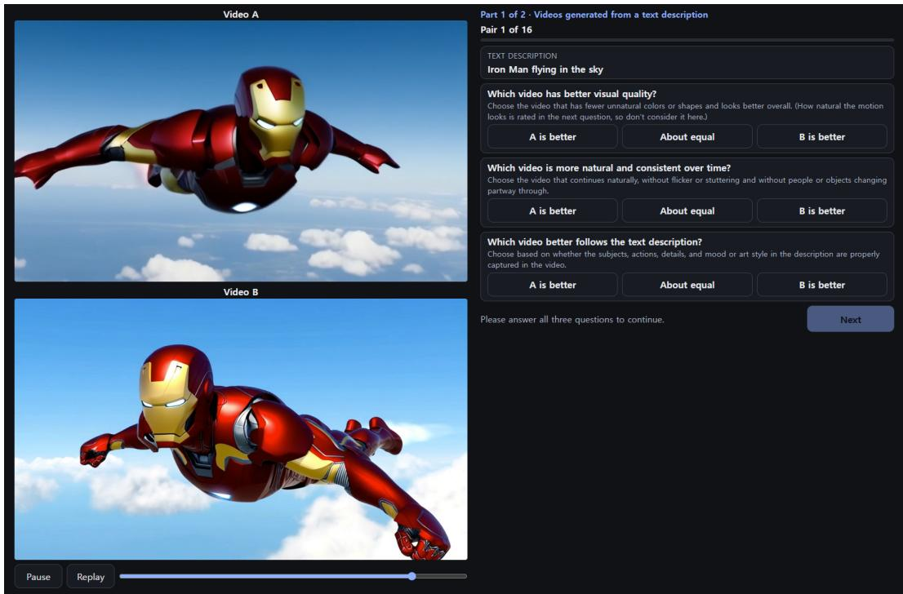  
Figure D.1: User study interface for T2V samples.

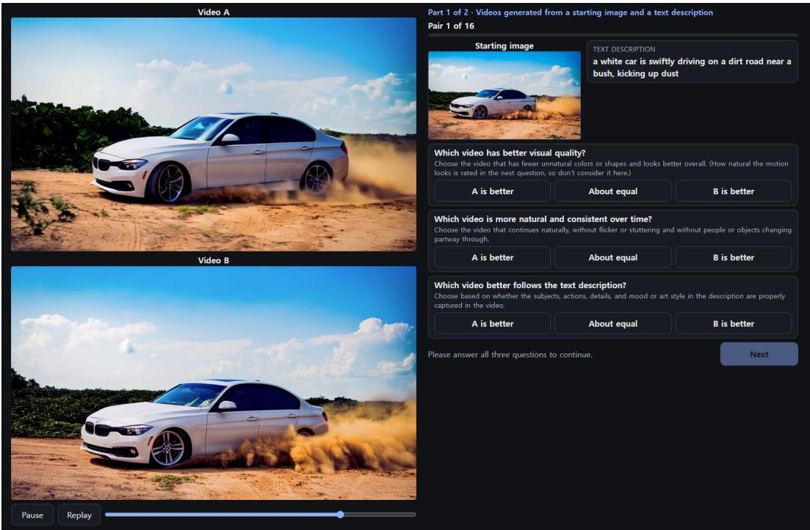  
Figure D.2: User study interface for I2V samples.

## E ADDITIONAL ABLATIONS

## E.1 AUTOENCODER DESIGN

We examine the design choices behind the autoencoder that are not covered in Appendix A.

First-frame conditioning. For image-to-video, $\hat { \mathcal { D } } \mathrm { r e - }$ ceives the first frame through gated cross-attention. We drop it with probability 0.5 during training, so that the decoder learns to reconstruct without it and relies on the compressed latent rather than copying from the first frame. Even without the first frame at inference, reconstruction stays close to that with it (Tab. E.1).

Table E.1: Ablation on first-frame conditioning.
<table><tr><td>First frame</td><td>PSNR↑</td><td>SSIM↑</td><td>LPIPS↓</td></tr><tr><td>X</td><td>31.97</td><td>0.928</td><td>0.038</td></tr><tr><td>√</td><td>32.63</td><td>0.930</td><td>0.032</td></tr></table>

## E.2 ALIGNMENT DESIGN

We examine the design choices behind ${ \mathcal { L } } _ { \mathrm { a l i g n } } ,$ the alignment applied in Stage 1.

Alignment depth. We compare supervising the first 10 blocks of the DiT with supervising all 40. As Tab. E.2 shows, the two settings generate at the same level, within 0.04 on the I2V total, but supervising all 40 loses 0.42 dB in PSNR, raises LPIPS from 0.032 to 0.038, and converges more slowly. The later blocks likely con-

Table E.2: Ablation on alignment depth.
<table><tr><td rowspan="2">Depth</td><td colspan="3">Reconstruction</td><td colspan="3">VBench-I2V</td></tr><tr><td>PSNR↑</td><td>SSIM↑</td><td>LPIPS ↓</td><td>I2V↑</td><td>Quality ↑</td><td>Total ↑</td></tr><tr><td>10</td><td>32.63</td><td>0.930</td><td>0.032</td><td>95.48</td><td>80.31</td><td>87.90</td></tr><tr><td>40</td><td>32.21</td><td>0.929</td><td>0.038</td><td>95.70</td><td>80.19</td><td>87.94</td></tr></table>

flict with ${ \mathcal { L } } _ { \mathrm { r e c o n } }$ more strongly, so the encoder spends its capacity on matching them rather than on reconstruction. We therefore supervise the first 10.

## F ADDITIONAL ANALYSIS

## F.1 LATENT ANALYSIS

In this section, we look into what the base and the residual latent each contain, first by perturbing one part while the other stays clean and then through their principal components.

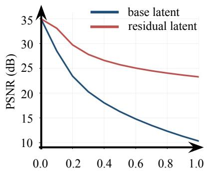  
Frame 0  
Frame 40  
Frame 80

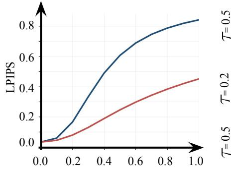

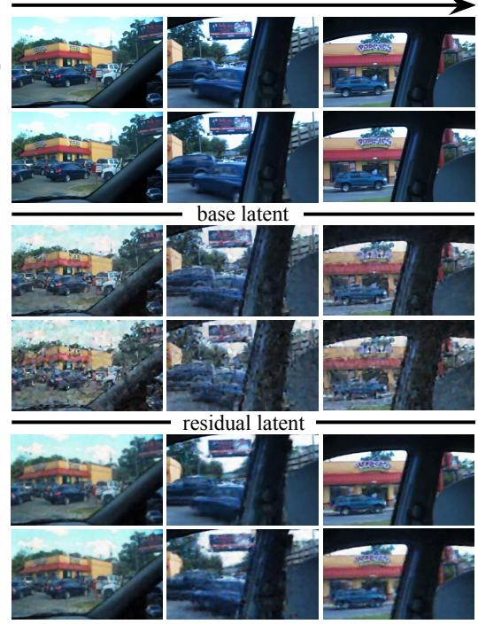  
(a) Quantitative comparison across  
(b) Qualitative comparison across  
Figure F.1: Reconstruction under latent noise. We noise $\mathbf { z } _ { \mathrm { b a s e } }$ or $\mathbf { z } _ { \mathrm { r e s } }$ at level $\tau ,$ , leave the other unchanged, and reconstruct. (a) Reconstruction quality on Panda-70M (Chen et al., 2024) at 480×832×81 as τ grows, measured in PSNR and LPIPS. (b) Reconstructed frames at two levels of $\tau ,$ shown below the input and the noise-free reconstruction, with the first block noising $\mathbf { z } _ { \mathrm { b a s e } }$ and the second noising $\mathbf { z } _ { \mathrm { r e s } }$

Per-latent analysis on reconstruction. We analyze how $\mathbf { z } _ { \mathrm { b a s e } }$ and $\mathbf { z } _ { \mathrm { r e s } }$ each affect the reconstruction performance by injecting a controlled amount of noise into one of them while keeping the other clean. Fig. F.1 sweeps τ from 0 to 1 in the flow matching interpolation of Eq. 2, so that $\tau = 0$ leaves the latent unchanged and $\tau = 1$ replaces it with pure noise. The noise is scaled by the per-channel variance of the latent it is added to. We report PSNR and LPIPS on Panda-70M (Chen et al., 2024) at $4 8 0 \times 8 3 2 \times 8 1$ for each level.

As plotted in Fig. F.1 (a), both PSNR and LPIPS degrade steadily for either latent under noise, and faster for $\mathbf { z } _ { \mathrm { b a s e } }$ across the whole range. Fig. F.1 (b) also shows that both $\mathbf { z } _ { \mathrm { b a s e } }$ and $\mathbf { z } _ { \mathrm { r e s } }$ fail in different ways, with $\mathbf { z } _ { \mathrm { b a s e } }$ breaking the spatial layout of the scene while $\mathbf { z } _ { \mathrm { r e s } }$ keeps the layout and instead blurs each frame and makes the motion appear at a lower frame rate. This is expected from the design, since the reduction in space and time leaves the overall scene in $\mathbf { z } _ { \mathrm { b a s e } }$ while $\mathbf { z } _ { \mathrm { r e s } }$ carries what the reduction removes and the motion between the sampled frames. The larger drop for $\mathbf { z } _ { \mathrm { b a s e } }$ follows as well, and it is what we intend: $\mathbf { z } _ { \mathrm { b a s e } }$ stays in the space the DiT was pretrained on, so the latent that carries more of the reconstruction is also the one that needs the least adaptation. The burden of Stage 2 therefore falls on $\mathbf { z } _ { \mathrm { r e s } }$ , which lies outside the space the pretrained DiT was trained on. A video built from $\mathbf { z } _ { \mathrm { b a s e } }$ alone would show blurred frames and motion that steps between the sampled frames rather than flowing through them, precisely what $\mathbf { z } _ { \mathrm { r e s } }$ was trained to restore.

Frame 0  
Frame 3  
Frame 5  
Frame 7  
Frame 10  
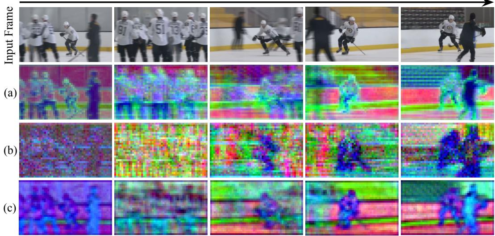  
Figure F.2: PCA visualization of the base and residual latents. Principal Component Analysis $( \mathrm { P C A } )$ of each part at f16t8p2, encoded from a 480×832×81 video, for (a) $\mathbf { z } _ { \mathrm { b a s e } } ,$ (b) $\mathbf { z } _ { \mathrm { r e s } }$ without ${ \mathcal { L } } _ { \mathrm { a l i g n } } ,$ and $\mathbf { ( c ) \ z _ { \mathrm { r e s } } }$ with $\mathcal { L } _ { \mathrm { a l i g n } } .$ . Since E is frozen, $\mathbf { z } _ { \mathrm { b a s e } }$ is the same in both settings.

PCA visualization. Fig. F.2 visualizes the Principal Component Analysis (PCA) of $\mathbf { z } _ { \mathrm { b a s e } }$ and $\mathbf { z } _ { \mathrm { r e s } }$ across video frames, encoded from a 480×832×81 video. The three leading components are computed per clip and mapped to RGB, so colors are not comparable across panels. The components of $\mathbf { z } _ { \mathrm { b a s e } }$ are semantically organized, following the objects in the frame. Without ${ \mathcal { L } } _ { \mathrm { a l i g n } } ,$ noise dominates the components of $\mathbf { z } _ { \mathrm { r e s } } ,$ which show little of the scene. $\mathcal { L } _ { \mathrm { a l i g n } }$ suppresses much of that noise and brings out the objects, and $\mathbf { z } _ { \mathrm { r e s } }$ occasionally resolves them at an even coarser scale than $\mathbf { z } _ { \mathrm { b a s e } }$ . Note that $\mathbf { z } _ { \mathrm { b a s e } }$ is identical in both settings, since $\mathcal { E }$ is frozen.

## F.2 CONVERGENCE BEHAVIOR

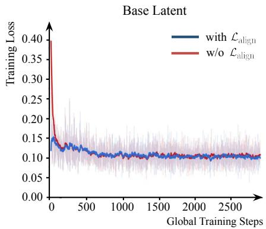

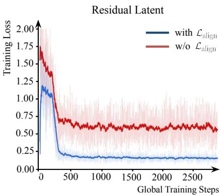  
Figure F.3: Convergence of the base and the residual. Flow matching loss on the base channels (left) and the residual channels (right) during DiT adaptation, for the dual latent with and without $\mathcal { L } _ { \mathrm { a l i g n } }$ . Each part is standardized with its own statistics. Faint curves show the raw loss and solid curves its EMA.

Fig. 7 tracks the flow matching loss on the residual channels during DiT adaptation. Fig. F.3 adds the base channels of the same runs, trained under identical settings except for $\mathcal { L } _ { \mathrm { a l i g n } } ,$ , with each part standardized by its own statistics. The base channels behave almost identically with and without alignment, since the DiT already models that space and has little to adapt. The two runs separate only on the residual, which converges faster and reaches a lower loss with alignment, so the gain in Fig. 7 does not come at the cost of the base.

## G COMPUTATIONAL COST

Tab. G.1 breaks down the training cost of each stage and the inference latency of the pretrained pipeline before compression and ours.

Table G.1: Computational cost. Training in H200 GPU days, and inference at 480×832×81 on a single A100 with 50 sampling steps.
<table><tr><td rowspan="2" colspan="2"></td><td colspan="2">T2V</td><td colspan="2">I2V</td></tr><tr><td>Wan2.1-14B</td><td>Ours</td><td>Wan2.1-14B</td><td>Ours</td></tr><tr><td rowspan="4">Training</td><td>Stage 1, full autoencoder</td><td>一</td><td>6.9</td><td>一</td><td>6.9</td></tr><tr><td>Stage 1, decoder-only (+EMA)</td><td>一</td><td>1.6</td><td></td><td>1.6</td></tr><tr><td>Stage 2</td><td>一</td><td>30</td><td></td><td>30</td></tr><tr><td>Total (H200 GPU days)</td><td></td><td>38.5</td><td></td><td>38.5</td></tr><tr><td colspan="2">Inference latency (s) ↓</td><td>851.5</td><td>75.8</td><td>863.2</td><td>77.7</td></tr></table>

## H MORE DISCUSSION ON RELATED WORK

Improving the latent space for generation. Beyond compression, several works improve the latent space itself so that the diffusion model learns it more easily (Zheng et al., 2025; Chen et al., 2025c; Wu et al., 2024). These works mostly train the generation model from scratch on the resulting latent, whereas we shape the latent so that an already trained model can be reused.

Efficient video autoencoder architectures. Compared to images, video carries an additional temporal dimension, which makes the autoencoder both harder to design and more expensive to run. Wavelet-based designs reduce this cost by replacing part of the convolutional stack with a fixed multi-resolution transform (Li et al., 2025; Cheng & Yuan, 2025; NVIDIA et al., 2025). These reduce the cost of the autoencoder itself rather than the token count the diffusion model processes.

## I ADDITIONAL QUALITATIVE RESULTS

This section collects the qualitative samples referenced throughout the paper: image-to-video and text-to-video generation at 480×832 (Figs. I.1–I.4), text-to-video generation at 736×1280 (Figs. I.5 and I.6), image-to-video generation at 736×1280 against LTX-Video (HaCohen et al., 2024) (Figs. I.7–I.9), generation in various styles (Fig. I.10), and further latent visualizations (Figs. I.11 and I.12).

First Frame

  
Wan2.1 f8t4)

“a white car is swiftly driving on a dirt road near a bush, kicking up dust”

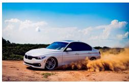

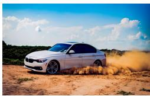

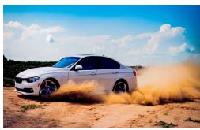

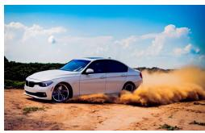

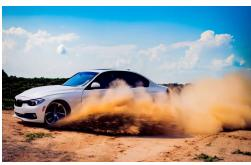

  
Frame 1

  
Frame 27

  
Frame 54

  
Frame 80

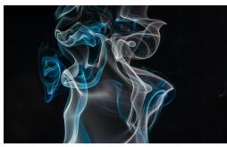  
“a blue and white smoke is swirly in the dark”

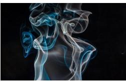

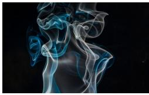

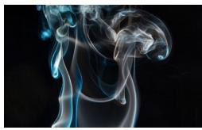

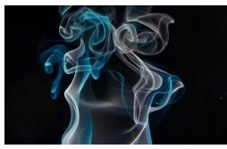

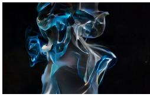  
Frame 1

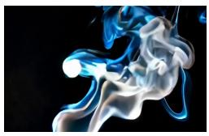

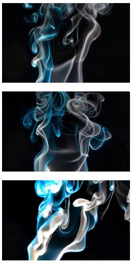  
Frame 27  
Frame 54

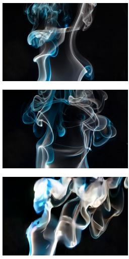  
Frame 80

Figure I.1: Additional image-to-video results. Samples from VBench-I2V (Huang et al., 2023; 2024) at 480×832×81, generated by the pretrained Wan2.1-14B (Wan et al., 2025) at f8t4p2, ours at f16t8p2, and DC-Gen (He et al., 2026) at f32t4p1, from the same conditioning frame and prompt.

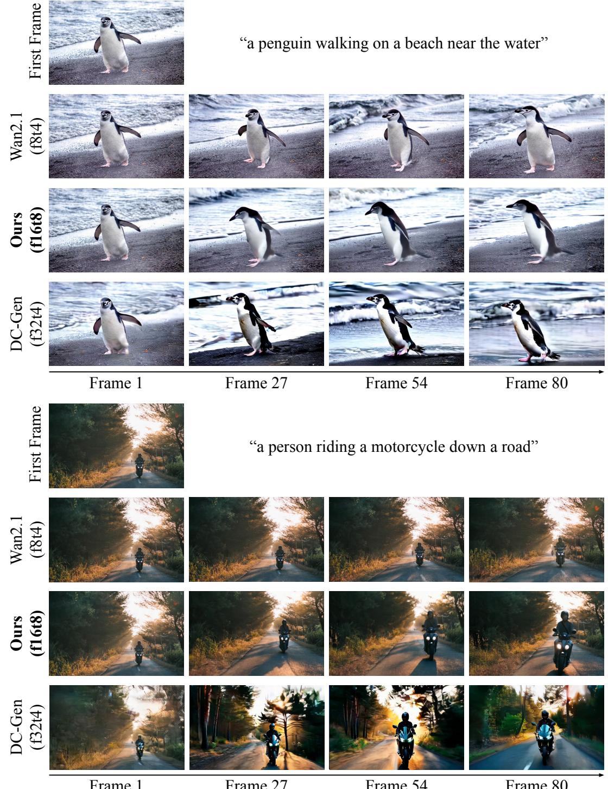  
Figure I.2: Additional image-to-video results (continued). Samples from VBench-I2V (Huang et al., 2023; 2024) at 480×832×81, generated by the pretrained Wan2.1-14B (Wan et al., 2025) at f8t4p2, ours at f16t8p2, and DC-Gen (He et al., 2026) at f32t4p1, from the same conditioning frame and prompt.

Frame 1  
Frame 27  
Frame 54  
Frame 80  
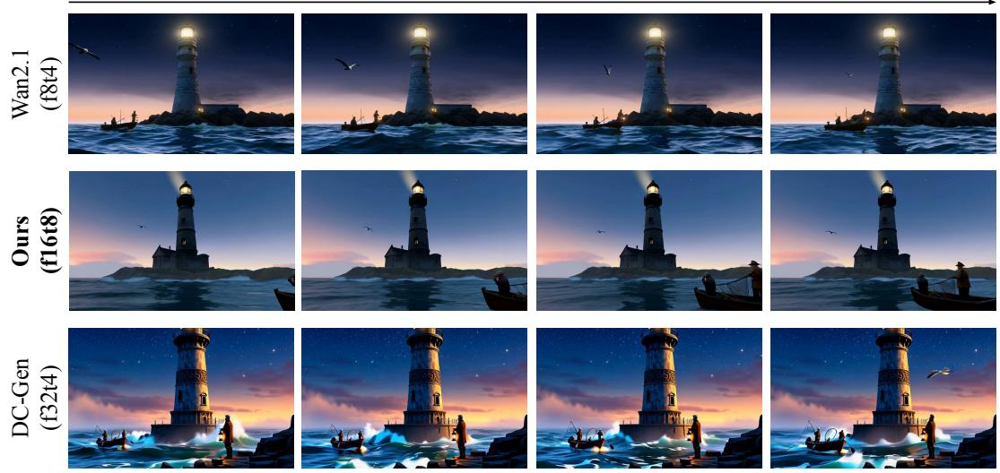  
“a majestic lighthouse ... a vast, starry ocean at sunset”

Frame 1  
Frame 27  
Frame 54  
Frame 80  
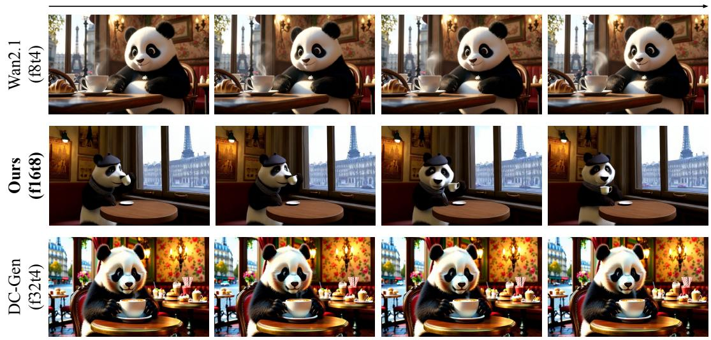  
“A panda drinking coffee in a cafe in Paris”

Figure I.3: Additional text-to-video results. Samples from VBench-T2V (Huang et al., 2023; 2024) at 480×832×81, generated by the pretrained Wan2.1-14B (Wan et al., 2025) at f8t4p2, ours at f16t8p2, and DC-Gen (He et al., 2026) at f32t4p1, from the same prompt.

Frame 1  
Frame 27  
Frame 54  
Frame 80  
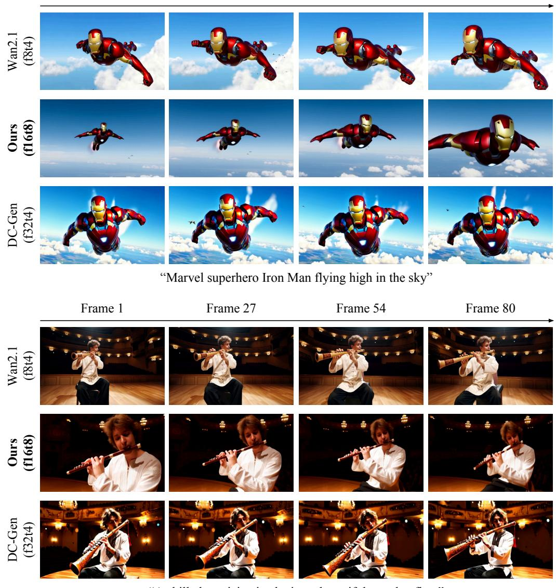  
“A skilled musician is playing a beautiful wooden flute”

Figure I.4: Additional text-to-video results (continued). Samples from VBench-T2V (Huang et al., 2023; 2024) at 480×832×81, generated by the pretrained Wan2.1-14B (Wan et al., 2025) at f8t4p2, ours at f16t8p2, and DC-Gen (He et al., 2026) at f32t4p1, from the same prompt.

Frame 1  
Frame 80  
Frame 27  
Frame 1  
Frame 27  
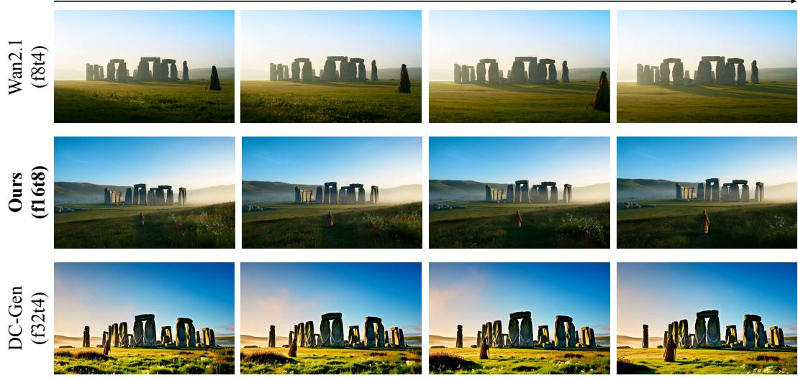  
“the Stonehenge presented itself as an enigmatic puzzle”

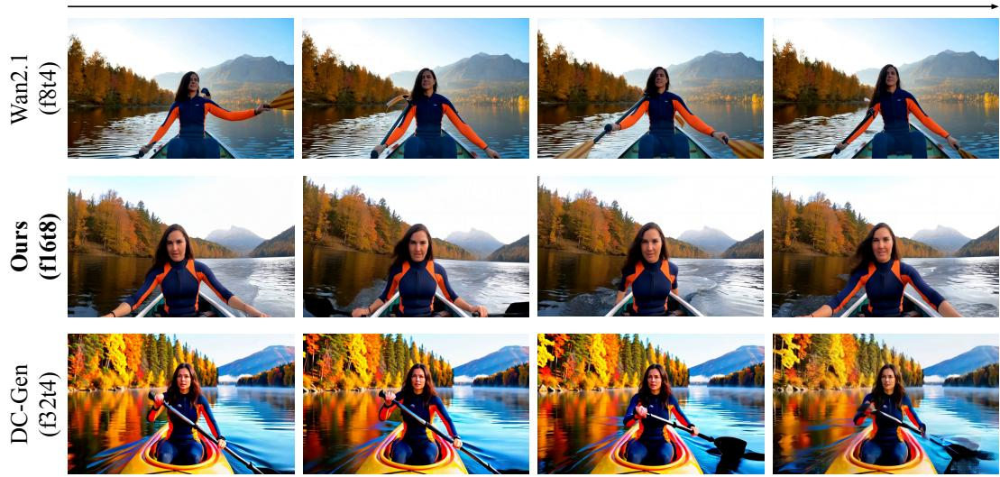  
“A person is canoeing or kayaking”

Figure I.5: Additional high-resolution text-to-video results. Samples at 736×1280×81, generated by the pretrained Wan2.1-14B (Wan et al., 2025) at f8t4p2, ours at f16t8p2, and DC-Gen (He et al., 2026) at f32t4p1, from the same prompt.

Frame 80  
Frame 1  
Frame 27  
Frame 54  
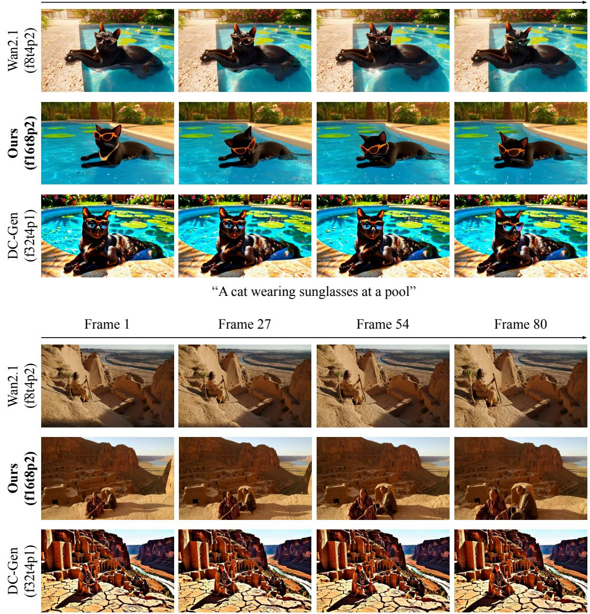  
“Chaco Canyon's ancient ruins ... an enigmatic civilization”

Figure I.6: Additional high-resolution text-to-video results (continued). Samples at 736×1280×81, generated by the pretrained Wan2.1-14B (Wan et al., 2025) at f8t4p2, ours at f16t8p2, and DC-Gen (He et al., 2026) at f32t4p1, from the same prompt.

LTX-0.9.7 (f32t8p1)

Wan2.1 (f8t4p2)

LTX-0.9.7 (f32t8p1)

Ours (f16t8p2)

Ours (f16t8p2)

First Frame

  
Wan2.1 (f8t4p2)

“chopsticks are slowly picking up the bun”

Frame 1  

  
Frame 27

  
Frame 54

  
Frame 80

  
“a great white shark swimming in the ocean”

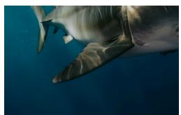

  
Frame 1

  
Frame 27

  
Frame 54

  
Frame 80

Figure I.7: Additional high-resolution image-to-video results. Samples at 736×1280×81, generated by the pretrained Wan2.1-14B (Wan et al., 2025) at f8t4p2, ours at f16t8p2, and LTX-Video (Ha-Cohen et al., 2024) 0.9.7 at f32t8p1, from the same conditioning frame and prompt. The motion of LTX-Video tends to come from a global zoom or a slow camera movement over the conditioning frame, while the scene stays static.

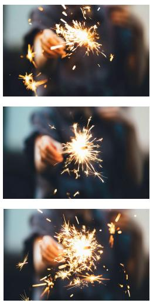  
First Frame  
First Frame

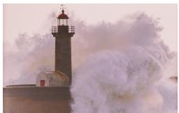  
“a large wave crashes into a lighthouse”  
Wan2.1 (f8t4p2)

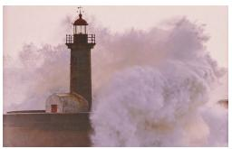

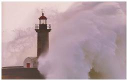

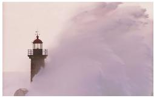

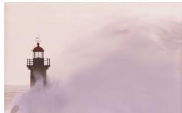  
Ours (f16t8p2)

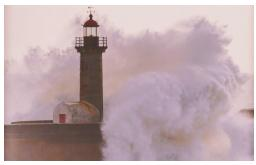  
LTX-0.9.7 (f32t8p1)

  
Frame 1

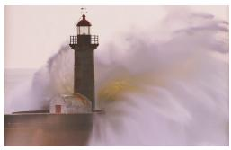

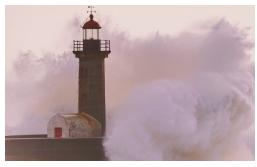  
Frame 27

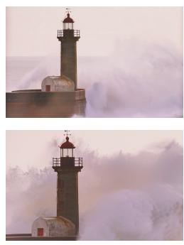  
Frame 54

  
Frame 80

  
“a person holding a sparkler in their hand”  
Wan2.1 (f8t4p2)

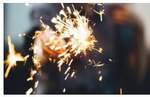

  
LTX-0.9.7 (f32t8p1)

  
Frame 1

  
Frame 27  
Frame 54

  
Frame 80

Figure I.8: Additional high-resolution image-to-video results (continued). Samples at $7 3 \bar { 6 } \times 1 2 8 0 \times 8 1$ , generated by the pretrained Wan2.1-14B (Wan et al., 2025) at f8t4p2, ours at f16t8p2, and LTX-Video (HaCohen et al., 2024) 0.9.7 at f32t8p1, from the same conditioning frame and prompt. The motion of LTX-Video tends to come from a global zoom or a slow camera movement over the conditioning frame, while the scene stays static.

First Frame

First Frame

Frame 1  
  
“a chef is preparing a dish with mushroom”

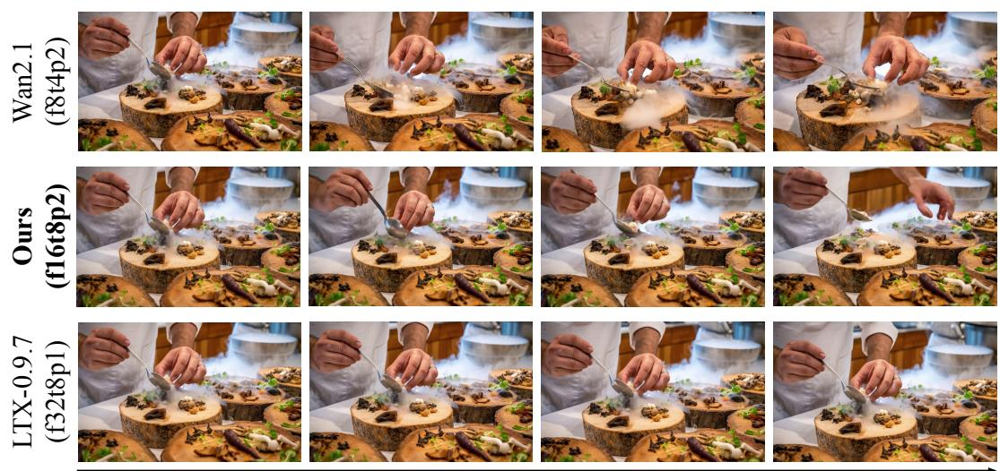  
Frame 27  
Frame 54  
Frame 80

“a couple of horses are running in the dirt”  
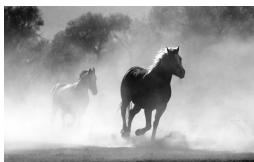  
Wan2.1 (f8t4p2)  
Ours (f16t8p2)

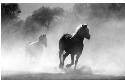  
LTX-0.9.7 (f32t8p1)

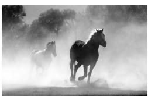

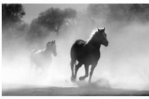  
Frame 1

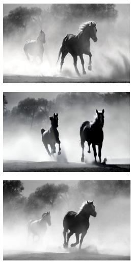  
Frame 27

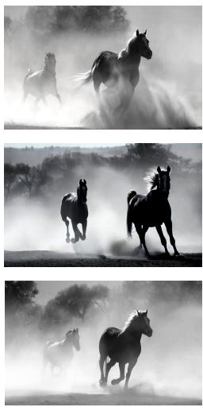  
Frame 54

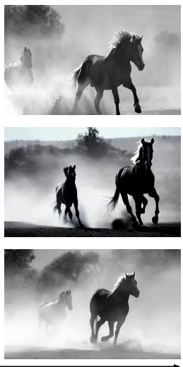  
Frame 80

Figure I.9: Additional high-resolution image-to-video results (continued). Samples at 736×1280×81, generated by the pretrained Wan2.1-14B (Wan et al., 2025) at f8t4p2, ours at f16t8p2, and LTX-Video (HaCohen et al., 2024) 0.9.7 at f32t8p1, from the same conditioning frame and prompt. The motion of LTX-Video tends to come from a global zoom or a slow camera movement over the conditioning frame, while the scene stays static.

“A boat sailing leisurely along the Seine River with the Eiffel Tower in background..”  
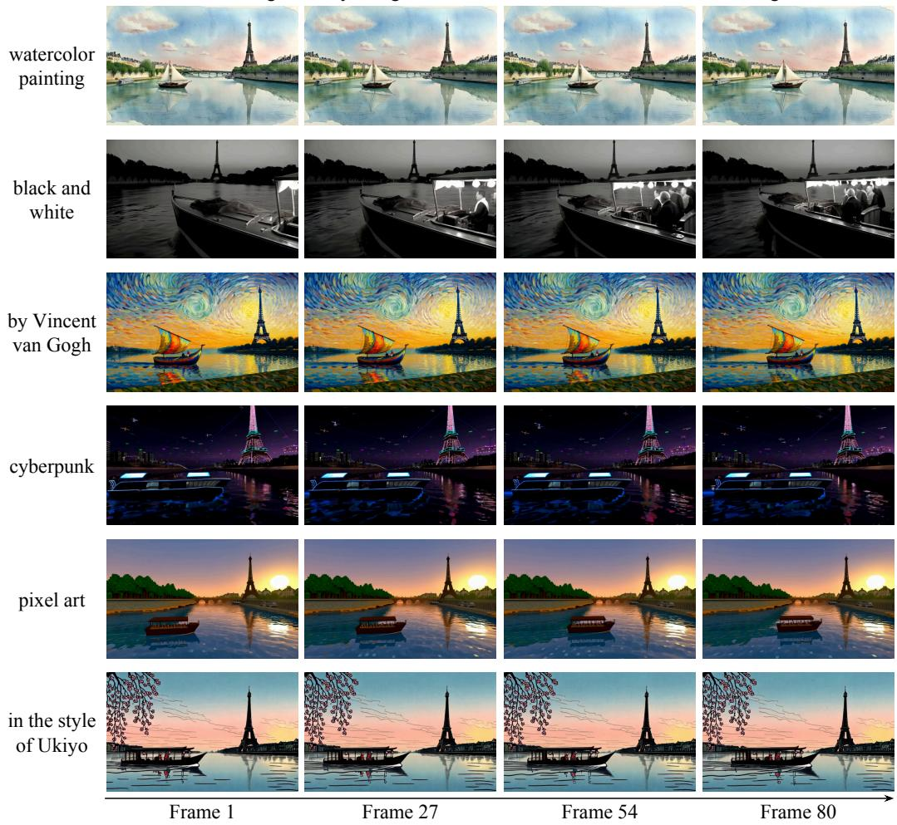  
Figure I.10: Generation in various styles. Text-to-video samples from ours at $7 3 6 \times 1 2 8 0 \times 8 1$ generated from a single prompt with a different style suffix in each row.

Frame 0  
Frame 3  
Frame 5  
Frame 7  
Frame 10  
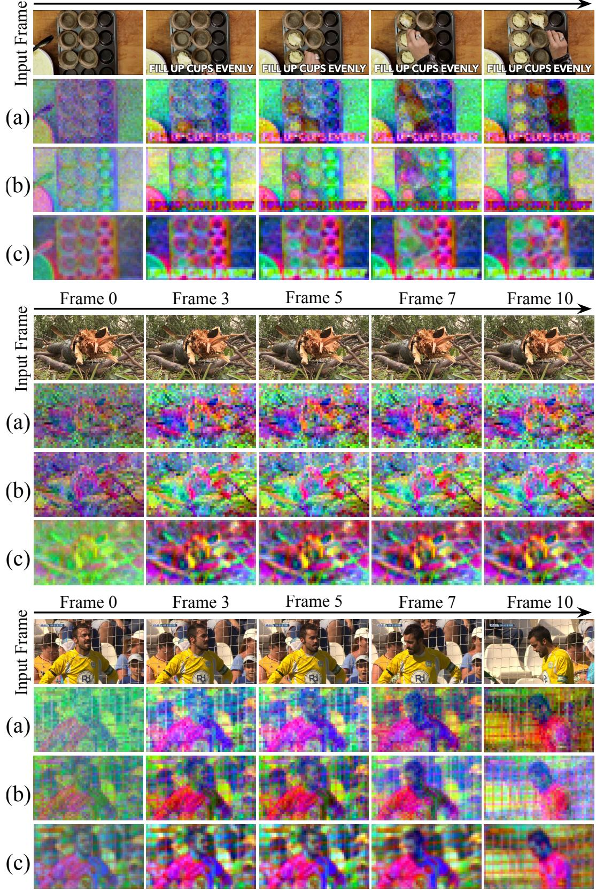  
Figure I.11: Additional latent PCA visualizations. Principal components of the full $C { + } C ^ { \prime }$ latent at f16t8p2, encoded from 480×832×81 videos, for (a) a single encoder, (b) ours without $\mathcal { L } _ { \mathrm { a l i g n } } .$ and (c) ours, with the input frames on top. The three leading components are computed per clip and mapped to RGB, so colors are not comparable across panels.

Frame 0  
Frame 3  
Frame 5  
Frame 7  
Frame 10  
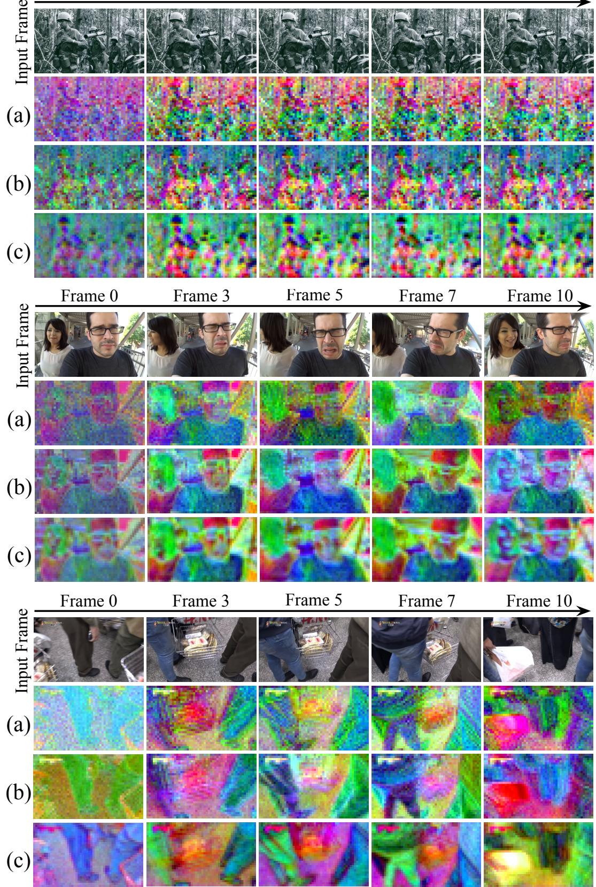  
Figure I.12: Additional latent PCA visualizations (continued). Principal components of the full $C { \bar { + } } C ^ { \prime }$ latent at f16t8p2, encoded from $4 8 0 \times 8 3 2 \times 8 1$ videos, for (a) a single encoder, (b) ours without $\mathcal { L } _ { \mathrm { a l i g n } } .$ , and (c) ours, with the input frames on top. The three leading components are computed per clip and mapped to RGB, so colors are not comparable across panels.

## J LIMITATIONS

Compressing the latent leaves fewer tokens for each frame, and small objects suffer the most. Distant faces, text on signs, and thin structures are often lost or broken, while the overall scene and its motion stay intact. The effect shows in Figs. I.3 and I.4, and it is weaker at 736×1280, where the same compression ratio leaves more tokens per frame. GRACE-VAE is also optimized for the DiT rather than for reconstruction alone, and trades some reconstruction fidelity for generation quality. At the same token count, its PSNR is 1.13 dB below our single-latent baseline (Tab. 1). Adding more residual channels could recover more of this detail, but adapting a pretrained DiT to a higherdimensional latent is itself difficult (Zheng et al., 2026), and we leave this to future work.

Applying GRACE to a new pretrained pipeline also requires training a new autoencoder, since the base latent comes from that pipeline’s frozen encoder and $\mathcal { L } _ { \mathrm { a l i g n } }$ is supervised by its DiT. Each new pipeline therefore costs one more Stage 1 run, 8.5 H200 GPU days in our setting.