# Gaussian Density Splatting Network

Miao Shang Yabin Wang Xiaopeng Hong

Faculty of Computing

Harbin Institute of Technology

miaos0522@gmail.com wang-yabin@outlook.com hongxiaopeng@ieee.org

## Abstract

This paper proposes a novel crowd counting approach, the Gaussian Density Splatting Network (GDSNet). Unlike methods that rely on conventional, grid-based density maps and are sensitive to spatial resolution, GDSNet represents a crowd as a superposition of continuous 2D Gaussian primitives. Our approach is built upon two key contributions. First, we introduce a control-point-based fitting mechanism to structure the prediction of the Gaussian parameters. We design a method to allocate a set of control points that define local regions, from which features are pooled to regress each primitive’s parameters. Second, we adapt a differentiable Gaussian Splatting framework to the counting task by parameterizing each primitive with geometric parameters and a scalar density mass. This formulation allows the network to be trained end-to-end via spatial matching of differentiably rendered density maps, naturally providing both local density supervision and global count optimization. Extensive evaluations on four standard benchmarks show GDSNet consistently outperforms the state of the art.

## 1 Introduction

Crowd counting, the task of estimating the number and spatial distribution of people in an image, serves as a cornerstone of modern intelligent systems, with applications ranging from public safety monitoring to urban planning [1–3]. The core challenge of crowd counting lies in learning an expressive representation of the crowd density function, $f : \mathbb { R } ^ { 2 } \to \mathbb { R } ^ { + }$ , whose integral over the image domain yields the total count. However, existing paradigms for approximating this function suffer from fundamental representational limitations, as illustrated in Fig. 1.

The dominant paradigm, grid-based density map regression, discretizes the domain and models the density function on a rigid grid [4, 5]. This approach is fundamentally constrained by a fixed downsampling ratio of the network backbone, forcing the representation into a limited-resolution, piecewise-constant structure. This architectural rigidity not only introduces quantization artifacts but also struggles to model the continuous scale variations inherent in perspective-distorted scenes. A second paradigm, point-based detection, conceptualizes individuals as discrete points [6, 7]. While continuous in their coordinates, these methods reduce people to Dirac delta-like impulses, ignoring the essential geometric properties of individuals and groups (such as spatial extent and orientation). This oversimplification, combined with a reliance on unstable bipartite matching for supervision, may lead to training instability and limited performance in dense regions [8, 9].

To overcome these limitations, we propose to represent the crowd density field as a superposition of continuous, learnable 2D Gaussian primitives. Each primitive is explicitly parameterized by its location, anisotropic covariance that captures scale and orientation, and scalar density mass representing the local population count. This formulation elegantly unifies the localization-modeling problem (the geometric aspect) and the counting problem (the quantitative aspect) of crowd analysis.

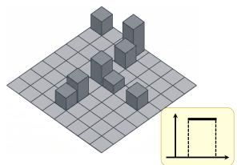  
(a) Grid-based Representation

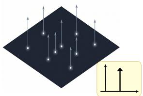  
(b) Point-based Representation

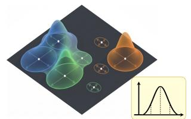  
(c) Continuous Gaussian Representation

Figure 1: Comparison of grid-based, point-based, and our continuous Gaussian representation.

However, this powerful continuous representation introduces a significant optimization challenge, i.e., the learning problem becomes severely ill-posed. Unlike grid-based regression, where spatial support is predefined by pixels, learning a set of free-form Gaussians is prone to failure: First, without guidance, the network may waste modeling capacity in sparse areas while failing to represent high-density regions with sufficient fidelity. Second, the unconstrained optimization of covariance parameters can lead to degenerate solutions, where Gaussians collapse to points, stretch infinitely, or overlap chaotically, resulting in physically implausible representations. Third, the Gaussian optimization procedure usually learns each Gaussian independently and ignores the spatial correlations between neighboring people, leading to a disjointed and locally incoherent density field.

To address this ill-posed problem, we introduce a novel control-point guided approach that transforms unconstrained parameter regression into a structured geometric fitting problem. Our solution is built upon a hierarchy of components that directly counter the three challenges identified above. First, to satisfy the density-fidelity consistency, a structural complexity-guided control-point allocation strategy is introduced, which adaptively places points in structurally salient locations and further partitions the image into locally coherent regions. This directly prevents budget waste in homogeneous regions and perfectly aligns the primitive distribution with the non-uniform crowd density. Second, to prevent physically implausible representations, these control points are organized via Delaunay triangulation to form a mesh of non-overlapping simplices. Each simplex provides a stable geometric prior for the Gaussian primitive and defines an explicit spatial boundary for its center location. Finally, to ensure relational consistency, the final parameters of each Gaussian are predicted via a topology-aware feature aggregation scheme that considers the geometry and features of neighboring simplices. It substantially reduces optimization ambiguity and results in a stable Gaussian regression.

To parameterize each Gaussian primitive based on a simplex formed by the control points, we design a Gaussian Density Splatting Network (GDSNet) to predict the final Gaussian parameters, including the location, covariance, and the density mass, by aggregating features from the local simplex geometry and the underlying image. The entire network is optimized end-to-end by differentiably rendering a density map from the learned primitives and matching it to a ground-truth map. Moreover, we introduce a count consistency loss and a shape regularization loss to enforce mass conservation and geometric stability. Extensive experiments show that GDSNet sets a new state of the art on four challenging benchmarks and demonstrates superior robustness to variations in internal feature resolution at test time, validating the advantages of our continuous representation.

Our main contributions are summarized below:

• We present a unified basis function-based crowd representation. Under this formulation, crowd density is modeled as a superposition of continuous, anisotropic 2D Gaussian primitives, overcoming the intrinsic limitations of discrete density maps and point-based representations.

• We propose a structural complexity-guided control-point allocation method to construct a triangulated topology, which provides structured spatial supports for organizing and parameterizing Gaussian primitives.

• We develop an end-to-end differentiable Gaussian density splatting framework, where primitive parameters are predicted based on the control-point topology. This formulation jointly enables spatially dense supervision and accurate global count optimization, leading to consistent performance improvements across benchmarks.

## 2 Related Work

## 2.1 Crowd Density Representations

Existing crowd counting methods primarily rely on discrete representations, which can be further categorized into grid-based density regression and point-based coordinate localization.

Traditional map-based methods project continuous crowds onto rigid two-dimensional grids, inevitably creating severe scale mismatches and blurry visual overlaps. To alleviate these defects, researchers introduced multiscale architectures [1, 2, 4], hierarchical density experts [10], and scaleaware transformers [11, 12]. Moreover, intermediate targets evolved to prevent instance fusion through probability estimation [13], inverse distance maps [14], and regional integral supervision via Bayesian or spatial transport losses [15–19]. Among these methods, GST [18]and [20] fits appearance Gaussians offline to precompute a transport kernel for training supervision, while retaining a conventional network to regress the density map. Its Gaussians therefore serve as correspondence priors for supervision. Conversely, point-based methods treat crowd distributions as discrete Dirac impulses. Following the bipartite matching paradigm established by P2PNet [6], subsequent frameworks improved querying efficiency and stability via transformer processing [7], quadtree splitting [8], and localized constraints [9, 21]. Predicting isolated proposals intrinsically collapses crowds into zero-dimensional coordinates, entirely ignoring continuous spatial extents. This point-to-point matching paradigm also becomes exceptionally fragile in ultra-dense scenes, resulting in severe training instability and unreliable gradient assignments.

Bridging these representational extremes, GDSNet elevates crowd counting to a continuous functiona approximation using latent Gaussian bases. Unlike GST [18], GDSNet directly predicts mass-carrying Gaussians to represent and render the density field. By explicitly modeling perspective geometry and mathematically decoupling global counts from spatial rendering grids, our framework establishes a matching-free and resolution-agnostic paradigm.

## 2.2 Image Representation and Perception via Continuous Gaussians

Gaussian splatting has significantly advanced visual representation by modeling scenes as continuous geometric mixtures in computer vision tasks such as compression [22], super-resolution [23], and inpainting [24]. Foundational optimization-based methods [22, 25, 26] achieve high-fidelity reconstruction and compression by leveraging multi-scale fitting and entropy-driven initialization. GaussianSR [23] and GSASR [27] further enable arbitrary-scale super-resolution via continuous field modeling. Nonetheless, the iterative optimization remains computationally expensive.

To accelerate inference, feedforward 2DGS approaches have been developed to directly predict Gaussian parameters from visual features [23, 27, 28], which leverage neural networks (e.g., VAE, Transformer, UNet) to directly map image features to Gaussian fields. There are increasing studies on incorporating priors to enhance the quality of representations [29–31, 24]. Among them, Instant GaussianImage [30] represents observable RGB images through Gaussian-based interpolation.

These advances primarily target appearance reconstruction, leaving the formulation of task-oriented Gaussian fields for dense prediction less explored. GDSNet treats Gaussians as adaptive basis elements of an implicit continuous density field, with task-specific responses and spatial support. Through topology-aware primitive interaction and task-specific constraints, it adapts Gaussian repre sentations to crowd density estimation.

## 3 Method

We begin by revisiting density estimation from a representation perspective and reformulate it as continuous Gaussian field reconstruction in Sec. 3.1. We then introduce GDSNet to learn this representation, as shown in Fig. 2 with its key components detailed in the following subsections.

## 3.1 A Unified Mathematical Perspective on Crowd Representation

Given an input image $I \in \mathbb { R } ^ { H \times W \times 3 }$ and annotations $Y = \{ y _ { m } \} _ { m = 1 } ^ { M }$ , crowd counting aims to estimate a non-negative spatial density function $\hat { \mathcal { D } } ( x )$ over the continuous domain $\Omega = \mathbb { R } ^ { 2 }$ . From a functional approximation perspective, we unify existing paradigms as estimating a density field $\hat { \mathcal { D } } ( x )$

Table 1: Comparison of crowd counting paradigms from a basis-function perspective.
<table><tr><td>Paradigm</td><td>Magnitude  $( \alpha _ { i } )$ </td><td>Basis Function (Ψi)</td><td>Spatial Support (ξi)</td><td>State</td><td>Representation Formula  $\hat { \mathcal { D } } ( x )$ </td></tr><tr><td>Grid-based</td><td>Scalar density  $( \hat { d } _ { u } )$ </td><td>Piecewise box  $( \Pi _ { \Omega _ { u } } )$ </td><td>Fixed grid cell (s)</td><td>Discrete</td><td> $\textstyle \sum _ { u \in { \mathcal { G } } _ { s } } { \hat { d } } _ { u } \Pi _ { \Omega _ { u } } ( x )$ </td></tr><tr><td>Point-based</td><td>Binary indicator (I)</td><td>Dirac delta (δ)</td><td>Zero-volume point (µi)</td><td>Discrete</td><td> $\sum _ { i } ^ { \bullet } \mathbb { I } ( p _ { i } > \eta ) \bar { \delta } ( x - \mu _ { i } )$ </td></tr><tr><td>GDSNet</td><td>Density mass (ρi)</td><td>2D Gaussian  $( \mathcal { N } )$ </td><td>Explicit geometry  $( \mu _ { i } , \Sigma _ { i } )$ </td><td>Continuous</td><td> $\begin{array} { r } { \sum _ { i } ^ { \cdot } \rho _ { i } \mathcal { N } ( x ; \bar { \mu } _ { i } , \bar { \Sigma } _ { i } ) } \end{array}$ </td></tr></table>

via a linear combination of basisfunctions:

$$
\hat { \mathcal { D } } ( x ) = \sum _ { i } \alpha _ { i } \Psi _ { i } ( x ; \xi _ { i } ) ,\tag{1}
$$

where $\Psi _ { i }$ denotes the basis function whose spatial support is parameterized by $\xi _ { i } , \alpha _ { i } \geq 0$ is its magnitude. The global integral yields the total count $\begin{array} { r } { \hat { M } = \int _ { \Omega } \hat { \mathcal { D } } ( x ) } \end{array}$ dx.

Limitations of existing paradigms. As summarized in Table 1, existing methods are constrained by their suboptimal basis choices 2. Grid-based methods instantiate $\Psi _ { i }$ as a zero-order box basis with a rigid grid-aligned support. The grid support is dictated by the network’s downsampling stride, limiting flexibility for continuous density variations or sub-pixel congestions. Point-based methods instantiate $\Psi _ { i }$ as a Dirac delta basis with a zero-volume support. The zero-volume support fails to explicitly model the spatial extent, local anisotropy, or continuous occupancy of crowds.

Our solution. To achieve a representation that is both geometrically explicit and spatially continuous, we instantiate the basis $\Psi _ { i }$ as an anisotropic 2D Gaussian and form a continuous representation:

$$
\hat { \mathcal { D } } _ { \mathrm { g d s } } ( x ) = \sum _ { i } \rho _ { i } \mathcal { N } ( x ; \mu _ { i } , \Sigma _ { i } ) .\tag{2}
$$

where $\mathcal { N } ( x ; \mu _ { i } , \Sigma _ { i } )$ is a normalized Gaussian distribution over $\mathbb { R } ^ { 2 }$ . The magnitude $\alpha _ { i }$ corresponds to a learnable density mass $\rho _ { i }$ . The count estimation is the summation of the density mass:

$$
\hat { M } = \int _ { \Omega } \hat { { \mathcal { D } } } _ { \mathrm { g d s } } ( x ) d x = \int _ { \Omega } \sum _ { i } \rho _ { i } \mathcal { N } ( x ; \mu _ { i } , \Sigma _ { i } ) d x = \sum _ { i } \rho _ { i } \int _ { \Omega } \mathcal { N } ( x ; \mu _ { i } , \Sigma _ { i } ) d x = \sum _ { i } \rho _ { i } .\tag{3}
$$

The advantages are manifold. First, the infinitely differentiable smooth basis provides a smooth and flexible function family capable of approximating continuous crowd density variations to approximate the non-linear and smoothly decaying density distributions of real-world crowds under perspective variation and local occlusion. Second, count estimation is decoupled from the rasterization grid through mass summation, which reduces quantization errors. Gaussian geometry nevertheless defines the spatial support of the density field and is jointly learned with mass through spatial supervision. Third, the explicit primitive parameters make it possible to inject geometric and topological constraints into the learning process.

Despite its theoretical elegance, directly optimizing these Gaussian parameters is ill-posed due to non-identifiability and instability arising from unconstrained primitive locations and covariances. Without proper structural regulation, primitives easily collapse into singularities or migrate erratically. To impose structure on this otherwise unconstrained representation, inspired by the construction of free-form curves approximation like Bézier and B-spline curves [32], we propose to govern the continuous representation through a parametric modeling paradigm driven by structural control points. We reformulate the density estimation as a control-point-constrained parameterization problem, regulated by localized points that govern primitive centers and geometric priors.

This transforms free-form Gaussian estimation into a stable process of explicitly constrained parameterization. As in Fig. 2, we first perform structural complexity-guided control point allocation to construct a Delaunay triangulation $\tau$ from the input image (Sec. 3.2), while the counting backbone extracts a dense feature map. Driven by this spatial structure, we then perform topology-aware aggregation to fuse intra- and inter-features. The features are utilized to regress the Gaussian parameters and density mass, governed by a constrained parameterization mechanism (Sec. 3.3). Finally, the primitives undergo differentiable density rendering for end-to-end supervision (Sec. 3.4).

## 3.2 Structural Complexity-Guided Control-Point Allocation

The effectiveness of our parameterization fundamentally relies on the spatial distribution of control points. A naive uniform sampling allocates excessive modeling capacity to homogeneous regions while under-representing complex dense areas. To establish an adaptive spatial topology, we introduce a Structural Complexity-Guided Control-Point Allocation module.

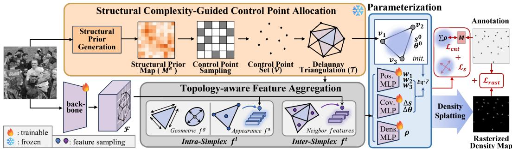  
Figure 2: Pipeline of GDSNet.

Structural Guidance Sampling. Our design is motivated by the observation that local structural complexity reflects the underlying spatial layout of the scene. Regions exhibiting sharp appearance transitions, occlusion boundaries, or abrupt density variations typically present elevated structural complexity, indicating critical transitions in the underlying density field.

To capture critical scene transitions, we define a Structural Prior Map $\mathbf { M } ^ { e } \in [ 0 , 1 ] ^ { H \times W }$ that identifies regions of high structural complexity, such as sharp appearance transitions or occlusion boundaries. These regions require denser point allocation to ensure that the resulting interiors remain structurally coherent and ideally suited for compact Gaussian approximation. Thus, we generate $M ^ { e }$ by leveraging the off-the-shelf spatial structural estimator from the 2DGS framework [30]. This network was trained to predict the optimal locations for placing Gaussians to minimize rendering error, which naturally correlates with high-frequency details, edges, and structural complexity. We provide a detailed discussion on alternative ${ \bf { \bar { \boldsymbol { M } } } } ^ { e }$ in Sec. 4.2.

To convert the structural prior Me into a discrete point set while maintaining explicit control over the representational granularity, we introduce a stride-controlled sampling mechanism, aiming to regulate both the total number of Gaussian primitives and their average spatial bounds across the continuous domain. We first apply non-overlapping max pooling with kernel size and stride s to ${ \bf M } ^ { e }$ , producing a coarse structural response map M¯ e. A Floyd-Steinberg dithering operator [33] is then applied to yield binary activations $z _ { i , j } = \bar { \mathrm { D i t h e r } } ( \bar { \mathbf { M } } _ { i , j } ^ { e } ) \bar { \mathbf { \xi } } \in \{ 0 , 1 \}$ . The resulting control-point set is defined as:

$$
\begin{array} { r } { \mathcal { V } = \left\{ \left( i s + \frac { s } { 2 } , j s + \frac { s } { 2 } \right) | z _ { i , j } = 1 \right\} . } \end{array}\tag{4}
$$

This strategy guarantees that the control points are adaptively distributed based on local structure, while their total quantity |V| is strictly bounded by $\lceil H / \dot { s } \rceil \times \bar { \lceil } W / s \rceil$

The stride s explicitly dictates the spatial resolution of the continuous Gaussian field. Because this continuous paradigm fundamentally decouples density modeling from the fixed pixel grid, modulating s simply adjusts the representation’s granularity. This intrinsic flexibility endows the framework with a strong robustness against varying representation granularities, thereby allowing GDSNet to perform stable, arbitrary test-time scaling without retraining, as validated experimentally in Sec. 4.3.

Delaunay simplex construction. Given the sampled control-point set V, we perform planar Delaunay triangulation [34] to obtain a set of simplices $\dot { \mathcal { T } } = \mathrm { D e l } ( \mathcal { V } ) \dot { = } \{ \tau _ { i } \} _ { i = 1 } ^ { N }$ , where each simplex $\tau _ { i } =$ conv $\mathbf { \bar { ( } } \{ v _ { i , 1 } , v _ { i , 2 } , v _ { i , 3 } \} )$ ) is a convex hull defined by a triplet of vertices from V.

This process yields triangular support domains that align with the structural boundaries identified in the sampling stage. The choice of 2D simplices over arbitrary polygons is motivated by three critical advantages for Gaussian parameterization. First, simplices enable stable and unique geometric regression through barycentric coordinates [35], ensuring smooth gradient flow by restricting primitive centers within a convex feasible region. Second, the Delaunay empty circumcircle property [34] maximizes the minimum internal angle of the mesh, preventing spatially elongated primitives that would violate local density assumptions. Finally, by Euler’s formula, |V| control points yield at most $2 | \mathcal { V } | - 5$ faces [36], bounding the final number of generated Gaussians to $\dot { \mathcal { O } } ( | \mathcal { V } | )$ while guaranteeing a completely hole-free, continuous representation of the crowd. By ensuring that each simplex encloses a region of relative informational stability, this geometric partitioning provides a locally coherent substrate for compact Gaussian approximation.

## 3.3 Topology-Aware Feature Aggregation and Constrained Parameterization

Given the control points V and the simplex set $\tau _ { \ast }$ , the subsequent task is to determine the specific geometric configuration and density mass for each Gaussian primitive. We design a topology-aware feature aggregation module that operates over a topological graph to extract hierarchical features, followed by a formal geometric parameterization that enforces spatial constraints. To capture latent structural dependencies among primitives, we formalize the relational structure of the support domains as a topological graph $\mathcal { G } = \bar { ( \mathcal { T } , \mathcal { E } ) }$ . The connectivity in $\mathcal { G }$ is governed by the shared edges $\mathcal { E }$ of the Delaunay triangulation, with the neighborhood for each simplex $\tau _ { i } \dot { B ( i ) } = \{ \tau _ { j } | \tau _ { i } \cap \overline { { \tau _ { j } } } \in \mathcal { E } \}$ represents the set of adjacent simplices sharing a common edge.

Topology-aware Feature Aggregation. We extract and aggregate features for each primitive over the simplicial graph G to encode both local and global contexts. Specifically, the feature $f _ { i }$ for the i-th Gaussian primitive consists of an intra- and inter-simplex representations, $f _ { i } ^ { l }$ and $f _ { i } ^ { t }$ , respectively.

Intra-simplex feature representation. The intra-simplex representation $f _ { i } ^ { l }$ fuses a geometric representation $f _ { i } ^ { g }$ with an appearance feature $f _ { i } ^ { a }$ . Specifically, $f _ { i } ^ { g }$ is explicitly constructed using the normalized coordinates of the triangle vertices alongside the parameters of the base ellipse $e _ { i }$ fitted to the simplex [37]. The appearance feature $f _ { i } ^ { a }$ is obtained by querying the dense feature map $\mathcal { F } \in \mathbb { R } ^ { C \times \bar { H } ^ { \prime } \times W ^ { \prime } }$ extracted by the counting backbone. To capture the local appearance context across this support region, we sample $\mathcal { F }$ at the triangle barycenter $c _ { i }$ and its three vertices $v _ { i , j } \mathrm { : }$

$$
\begin{array} { r } { f _ { i } ^ { a } = \mathrm { M L P } _ { a p p } \left( \mathcal { F } ( c _ { i } ) \oplus \mathcal { F } ( v _ { i , 1 } ) \oplus \mathcal { F } ( v _ { i , 2 } ) \oplus \mathcal { F } ( v _ { i , 3 } ) \right) , } \end{array}\tag{5}
$$

where ${ \bf M L P } _ { a p p }$ is designed to aggregate these queries.

Inter-simplex topological aggregation. Due to the spatial correlation inherent in crowd distributions, adjacent local regions commonly exhibit similar perspectives, scales, and density patterns. Treating each triangular receptive field independently would neglect this relational structure, leading to incoherent parameter predictions. Therefore, we perform topological context aggregation over the graph $\mathcal { G }$ to ensure consistency across neighboring primitives. For each triangle $\tau _ { i } ,$ we collect its one-hop adjacent neighbors $B ( i )$ and aggregate their graph-induced contextual cues to form $f _ { i } ^ { t }$ , which is then concatenated with the intra-simplex representation:

$$
f _ { i } = f _ { i } ^ { l } \oplus f _ { i } ^ { t } , \quad \mathrm { w h e r e } \quad f _ { i } ^ { t } = \bigoplus _ { b \in \mathcal { B } ( i ) } \mathrm { M L P } _ { n b r } ( c _ { b } \oplus \mathcal { F } ( c _ { b } ) ) .\tag{6}
$$

$c _ { b }$ denotes the barycenter of a neighboring triangle $b ,$ and MLP b compresses the neighbor’s feature channels. Eq. 6 allows the subsequent parameterization to incorporate local perspective and density variations, thereby reducing geometric and spatial inconsistencies across neighboring regions.

Control-Point-Constrained Parameterization. To facilitate stable Gaussian learning, we obtain the final state of each primitive $\mathcal { G } _ { i } = \{ \mu _ { i } , \mathbf { s } _ { i } , \theta _ { i } , \rho _ { i } \}$ through a constrained parameterization governed by the underlying support simplex. Rather than directly regressing these values in an unconstrained domain, we formulate the final parameters as regulated adjustments relative to a base prior.

Specifically, the reference ellipse $e _ { i }$ fitted over the simplex $\tau _ { i }$ establishes a plausible base prior. Taking the aggregated feature representation $f _ { i }$ as input, parallel MLP heads predict a set of relative adjustments alongside the non-negative density mass $\rho _ { i }$ . These geometric adjustments include the barycentric weights $\mathbf { w } _ { i } = [ w _ { i , 1 } , w _ { i , 2 } , w _ { i , 3 } ]$ , the scale offsets $\Delta \mathbf { s } _ { i }$ , and the rotation offset $\Delta \theta _ { i }$

Using the network predictions together with the initial rotation $\theta _ { i } ^ { 0 }$ and base aspect ratio $r _ { i } ^ { 0 } =$ $s _ { i , x } ^ { 0 } / \breve { ( s } _ { i , y } ^ { 0 } + \epsilon )$ derived from $e _ { i } { \mathrm { . } }$ , the final geometric parameters of the Gaussian primitive are:

$$
\mu _ { i } = \sum _ { j = 1 } ^ { 3 } w _ { i , j } v _ { i , j } , \quad \mathbf { s } _ { i } = \Delta \mathbf { s } _ { i } \cdot \left[ \boldsymbol { r } _ { i } ^ { 0 } , 1 \right] ^ { \mathsf { T } } , \quad \theta _ { i } = \theta _ { i } ^ { 0 } + \Delta \theta _ { i } .\tag{7}
$$

Crucially, the optimization of the Gaussian center $\mu _ { i }$ is explicitly anchored by the learned barycentric weights [35]. This restricts the center to a localized feasible region bounded by the convex hull of its associated control points $\begin{array} { r } { \mathcal { R } _ { i } = \{ x \mid x = \sum _ { j = 1 } ^ { 3 } w _ { i , j } v _ { i , j } , \sum _ { j = 1 } ^ { 3 } w _ { i , j } = 1 , w _ { i , j } \geq 0 \} } \end{array}$ . This formulation establishes a rigid spatial boundary that prevents erratic primitive migration.

## 3.4 Continuous Density Rendering and Optimization

Building upon these parameterized Gaussian primitives, GDSNet adapts the differentiable Gaussian splatting framework from traditional RGB color synthesis to crowd density estimation. Specifically,

the continuous density field is formulated by aggregating all Gaussian primitives, each weighted by its corresponding scalar density mass $\rho _ { i }$ , as defined in Eq. 2.

For spatial density alignment, we rasterize the density map and apply Bayesian loss [15]:

$$
\mathcal { L } _ { \mathrm { r a s t } } = \sum _ { m = 1 } ^ { M } \left| 1 - \int _ { \Omega } \mathbf { P } _ { m } ( x ) \hat { \mathcal { D } } ( x ) d x \right| + \left| 0 - \int _ { \Omega } \mathbf { P } _ { b k } ( x ) \hat { \mathcal { D } } ( x ) d x \right| ,\tag{8}
$$

$\mathbf { P } _ { m }$ and $\mathbf { P } _ { b k }$ are the foreground and background posterior probability maps as in [15].

To further enforce global counting consistency, we introduce a count conservation loss

$$
\mathcal { L } _ { \mathrm { c n t } } = \left| M - \sum _ { i = 1 } ^ { N } \rho _ { i } \right| .\tag{9}
$$

To discourage excessively elongated Gaussian shapes, we apply a shape regularization term:

$$
\mathcal { L } _ { \mathrm { s } } = \operatorname* { m a x } _ { i } \left[ s _ { i } ^ { \mathrm { m a x } } / ( s _ { i } ^ { \mathrm { m i n } } + \epsilon ) - \gamma \right] _ { + } ,\tag{10}
$$

where $s _ { i } ^ { \mathrm { m a x } }$ and $s _ { i } ^ { \mathrm { m i n } }$ denote the major and minor axis scales of the i-th Gaussian, respectively, and γ controls the maximum allowable aspect ratio. The overall loss function is:

$$
\begin{array} { r } { \mathcal { L } = \mathcal { L } _ { \mathrm { r a s t } } + \lambda _ { 1 } \mathcal { L } _ { \mathrm { c n t } } + \lambda _ { 2 } \mathcal { L } _ { \mathrm { s } } . } \end{array}\tag{11}
$$

Eq. 11 promotes density reconstruction, count preservation, and Gaussian geometry fitting jointly.

## 4 Experiment Results and Discussion

We evaluate GDSNet on four standard crowd benchmarks: ShanghaiTech A and B [38], JHU-Crowd++ [39], UCF-QNRF [40], and NWPU-Crowd [41], using MAE and MSE as the performance metrics. Following previous competitive methods [9, 19], we utilize the VGG-19 structure as our feature extractor. Default sampling stride s is 10. $\lambda _ { 1 } = \lambda _ { 2 } = 1$ . AdamW optimizer is used, with a learning rate of $1 \times 1 0 ^ { - 5 }$ , a weight decay of $1 \times 1 0 ^ { - 4 }$ , and a batch size of 1. All experiments are conducted on NVIDIA RTX 4090 GPUs. Details and the implementation algorithm are in Suppl. B.

## 4.1 Evaluation Results

We compare GDSNet with representative map-based and point-based methods in Table 2. GDSNet achieves a state-of-the-art performance across all benchmarks. Specifically, GDSNet achieves a significant MAE reduction over the latest point-based method APGCC [9] on JHU++, UCF-QNRF, and NWPU. This is attributed to our continuous Gaussian representation. On ShanghaiTech Part B, GDSNet achieves an MAE of 5.4 and an MSE of 8.0, demonstrating its effectiveness in relatively sparse crowd scenes. By rasterizing Gaussian primitives into a structured density map, we leverage advanced dense supervision from map-based methods, circumventing the bipartite matching instabilities prevalent in ultra-dense regions. Moreover, GDSNet clearly outperforms recent mapbased methods like PML [19] and GST [18], demonstrating the advantages of using continuous basis formulation over rigid grid-aligned scalar fields.

Visualization. Fig. 3 visualizes the intermediate representations of GDSNet across three crowd scenes. These examples exhibit diverse resolutions and significant inter-image and intra-image scale variations, ranging from dense congregations to sparser scenes with varying perspective distortions. The structural prior maps in Fig. 3 (b) identify structural boundaries and high transitions to guide the adaptive allocation of control points. In Fig. 3 (c), the resulting Delaunay triangulation demonstrates strong adaptability across diverse scenes. Specifically, the total number and spatial distribution of the triangular simplices naturally align with the underlying crowd density. Crucially, the triangle mass heatmap reveals a smooth density transition across adjacent simplices, which confirms that our neighbor context aggregation effectively maintains topological continuity and captures structural dependencies between neighboring primitives. Finally, the rasterized density maps in Fig. 3 (d) showcase the continuous density field formed by the superposition of Gaussian primitives, which accurately capture the local geometry and density of the scene.

<table><tr><td rowspan="2">Dataset Method</td><td rowspan="2">Venue &amp; Year</td><td colspan="2">ShTech A</td><td colspan="2">ShTech B</td><td colspan="2">JHU-Crowd++</td><td colspan="2">UCF-QNRF</td><td colspan="2">NWPU</td></tr><tr><td>MAE</td><td>MSE</td><td>MAE</td><td>MSE</td><td>MAE</td><td>MSE</td><td>MAE</td><td>MSE</td><td>MAE</td><td>MSE</td></tr><tr><td>BL [15]</td><td>ICCV 2019</td><td>62.8</td><td>101.8</td><td>7.7</td><td>12.7</td><td>75.0</td><td>299.9</td><td>88.7</td><td>154.8</td><td>105.4</td><td>454.2</td></tr><tr><td>DMCount [16]</td><td>NeurIPS 2020</td><td>59.7</td><td>95.7</td><td>7.4</td><td>11.8</td><td>61.6</td><td>256.1</td><td>85.6</td><td>148.3</td><td>88.4</td><td>388.6</td></tr><tr><td>UOT [17]</td><td>AAAI 2021</td><td>58.1</td><td>95.9</td><td>6.5</td><td>10.2</td><td>60.5</td><td>252.7</td><td>83.3</td><td>142.3</td><td>87.8</td><td>387.5</td></tr><tr><td>GL [42]</td><td>CVPR 2021</td><td>61.3</td><td>95.4</td><td>7.3</td><td>11.7</td><td>59.5</td><td>259.5</td><td>84.3</td><td>147.5</td><td>79.3</td><td>346.1</td></tr><tr><td>P2PNet [6]</td><td>ICCV 2021</td><td>52.7</td><td>85.1</td><td>6.3</td><td>9.9</td><td></td><td></td><td>85.3</td><td>154.5</td><td>72.6</td><td>331.6</td></tr><tr><td>MAN [11]</td><td>CVPR 2022</td><td>56.8</td><td>90.3</td><td></td><td></td><td>53.7</td><td>209.9</td><td>77.3</td><td>131.5</td><td>76.5</td><td>323.0</td></tr><tr><td>CLTR [7]</td><td>ECCV 2022</td><td>56.9</td><td>95.2</td><td>6.5</td><td>10.6</td><td>59.5</td><td>240.6</td><td>85.8</td><td>141.3</td><td>74.3</td><td>333.8</td></tr><tr><td>ChfL [43]</td><td>CVPR 2022</td><td>57.5</td><td>94.3</td><td>6.9</td><td>11.0</td><td>57.0</td><td>235.7</td><td>80.3</td><td>137.6</td><td>76.8</td><td>343.0</td></tr><tr><td>PET [8]</td><td>ICCV 2023</td><td>49.3</td><td>78.8</td><td>6.2</td><td>9.7</td><td>58.5</td><td>238.0</td><td>79.5</td><td>144.3</td><td>74.4</td><td>328.5</td></tr><tr><td>APGCC [9]</td><td>ECCV 2024</td><td>48.8</td><td>76.7</td><td>5.6</td><td>8.7</td><td>54.3</td><td>225.9</td><td>80.1</td><td>136.6</td><td>71.7</td><td>284.4</td></tr><tr><td>Gramformer [12]</td><td>AAAI 2024</td><td>54.7</td><td>87.1</td><td>一</td><td>一</td><td>53.1</td><td>228.1</td><td>76.7</td><td>129.5</td><td>72.5</td><td>316.4</td></tr><tr><td>PML [19]</td><td>ICLR 2025</td><td>55.5</td><td>89.0</td><td>6.0</td><td>9.3</td><td>57.4</td><td>227.4</td><td>76.6</td><td>132.2</td><td>73.6</td><td>338.6</td></tr><tr><td>P2R [21]</td><td>CVPR 2025</td><td>51.0</td><td>79.7</td><td>6.2</td><td>9.8</td><td>58.8</td><td>253.1</td><td>83.3</td><td>138.1</td><td></td><td></td></tr><tr><td>GST [18]</td><td>AAAI 2026</td><td></td><td></td><td></td><td>一</td><td>53.9</td><td>225.4</td><td>80.7</td><td>131.1</td><td>74.4</td><td>306.2</td></tr><tr><td>GDSNet</td><td></td><td>48.8</td><td>76.5</td><td>5.4</td><td>8.0</td><td>52.8</td><td>227.6</td><td>75.9</td><td>130.5</td><td>68.7</td><td>294.2</td></tr></table>

Table 2: Counting performance on ShTech A and B, JHU-Crowd++, UCF-QNRF, and NWPU.

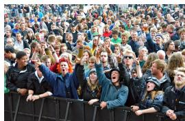

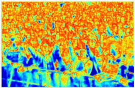

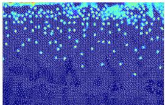

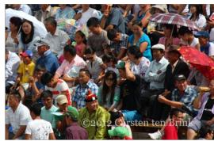  
(a) Input

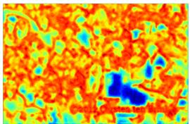  
(b) Structural Prior Map

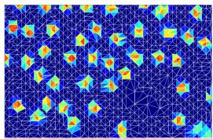  
(c) Simplex Heatmap

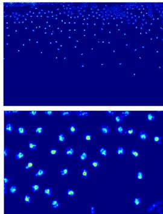  
(d) Rasterized Density Map  
Figure 3: Visualization of the structural prior, simplex heatmap, and rasterized density map. The simplex heatmap is obtained by assigning each Delaunay simplex the mass predicted by its associated Gaussian primitive, revealing how responses are spatially distributed over the triangulated support.

## 4.2 Ablation Study

Contribution of Components. We investigate the contribution of the structural complexity-guided Control Point Allocation (CPA), Simplex-Constrained Parameterization (SCP), and Topology-aware Feature Aggregation (TFA) in GDSNet on the UCF-QNRF dataset in Table 3. Removing the topological context aggregation (Row 2) leads to a performance drop, confirming that explicitly modeling local neighborhood interactions is important for preserving relational consistency among adjacent Gaussian primitives and producing spatially coherent density estimation. Moreover, the substantial degradation in (Rows 3&4) highlights the critical role of our simplex-constrained geometric formulation. Without the explicit geometric boundaries imposed by local simplices, Gaussian parameter learning becomes severely under-constrained, allowing the regression head to fit training samples through arbitrary scale and shape configurations that lack structural regularity. Although these unconstrained variant can achieve satisfactory fitting on the training set, they exhibit significantly weaker generalization on the test set, indicating that simplex support serves as an effective geometric prior that regularizes parameter optimization toward stable and transferable Gaussian representations. Furthermore, Row 3 outperforms Row 4, further suggesting that structural complexity-guided sampling provides more informative primitive allocation than uniform grid sampling. Details are provided in Suppl. D.1.

Gaussian Geometry Ablation. We investigate the role of Gaussian geometry on UCF-QNRF in Table 6. Triangle mass regression uniformly distributes the predicted mass over each triangle. Fixed Gaussians use the center, scale, and orientation of the reference ellipse without learning geometric adjustments. Isotropic Gaussians restrict spatial support to a single scale shared across both axes, whereas the full model learns anisotropic scales and orientation with simplex-constrained centers. All variants share the same primitive allocation, feature aggregation, mass prediction head, and rasterization supervision. As shown in Table 6, compared with triangle mass regression, Gaussian bases provide smooth density responses rather than piecewise-constant distributions. Learnable geometry allows spatial support to adapt to local crowd structure instead of remaining fixed to the initial triangulation. Anisotropic geometry further captures directional variations and elongated density patterns that isotropic support cannot represent. Implementation details are in Suppl. D.3.

Table 3: Ablation of key components.
<table><tr><td>CPA</td><td>SCP</td><td>TFA</td><td>MAE</td><td>MSE</td></tr><tr><td>√</td><td>√</td><td>√</td><td>75.86</td><td>130.52</td></tr><tr><td>√</td><td>√</td><td></td><td>77.89</td><td>132.59</td></tr><tr><td>√</td><td></td><td></td><td>82.94</td><td>135.62</td></tr><tr><td></td><td></td><td></td><td>89.46</td><td>140.85</td></tr></table>

Table 4: Ablation of losses.
<table><tr><td> ${ \mathcal { L } } _ { \mathrm { r a s t } }$ </td><td> $\mathcal { L } _ { \mathrm { c n t } }$ </td><td> $\mathcal { L } _ { \mathrm { g e o } }$ </td><td>MAE MSE</td><td></td></tr><tr><td>一</td><td>√</td><td>√</td><td>94.87154.24</td><td></td></tr><tr><td>√</td><td></td><td></td><td></td><td>77.54133.17</td></tr><tr><td>√</td><td>√</td><td></td><td></td><td>76.87131.58</td></tr><tr><td>√</td><td></td><td>√</td><td></td><td>76.20130.74</td></tr><tr><td>√</td><td>√</td><td>√</td><td>75.86130.52</td><td></td></tr></table>

Table 5: CPA Strategies.
<table><tr><td>Strategy</td><td>MAE</td><td>MSE</td></tr><tr><td>Uniform</td><td>81.65</td><td>133.97</td></tr><tr><td>Sobel</td><td>78.44131.58</td><td></td></tr><tr><td>Structural</td><td>75.86130.52</td><td></td></tr></table>

Table 6: Gaussian geometry ablation on UCF-QNRF.
<table><tr><td>Configuration</td><td>MAE</td><td>MSE</td></tr><tr><td>Triangle mass regression</td><td>82.21</td><td>133.85</td></tr><tr><td>Fixed Gaussian</td><td>81.42</td><td>133.24</td></tr><tr><td>Isotropic Gaussian</td><td>78.79</td><td>132.86</td></tr><tr><td>Full anisotropic Gaussian</td><td>75.86</td><td>130.52</td></tr></table>

Loss Function Ablation. The optimization of GDSNet is guided by a joint objective that addresses the unique characteristics of our Gaussian representation. Table 4 shows that every loss term contributes by providing constraints from different perspectives. The rasterization loss serves as the primary driver by providing supervision on the rendered density field to ensure spatial fidelity. Furthermore, the count loss further refines the estimation by supervising the total density masses of Gaussian primitives. More importantly, geometric regularization plays a vital role in stabilizing primitive shapes by penalizing extreme anisotropies. The synergy of these objectives allows GDSNet to achieve the best accuracy by balancing spatial fidelity, counting precision, and geometric stability.

Impact of Control Point Allocation Strategies. We evaluate three control point allocation strategies: baseline uniform sampling, sampling according to the Sobel filtering responses [26], and our structural complexity-guided sampling. Details and more prior map visualization are in Suppl. D.2.

As in Table 5, uniform sampling yields the highest errors as it allocates control points indiscriminately across the image domain. The support simplex obtained from these control points becomes homogeneous because they have the same geometric characteristics. Compared with ours, sampling by Sobel filtering responses is less effective because it is overly sensitive to sharp boundaries and fine textures. This over-sensitivity results in an excessive allocation of primitives in semantically irrelevant regions, which hurts the counting task.

Our structural complexity guided sampling performs best. Taking the 3rd sample from Fig. 3 as an example, Fig. 4 further visualizes the simplex heatmap and rasterized density maps. Under the same sampling stride, sampling by Sobel filtering responses activates a larger number of broadresponse simplices around each head instance. To satisfy the unit-mass constraint, optimization compensates by aggressively shrinking individual Gaussian scales, resulting in fragmented and pulse-like density responses that undermine local spatial continuity. In contrast, our structural complexity guided sampling produces more compact and spatially focused simplex activations, enabling Gaussian primitives to maintain appropriate support extent and generate smoother, more coherent density reconstruction. Enhanced

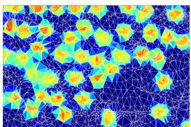

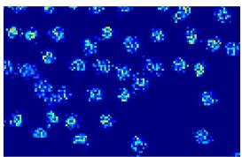

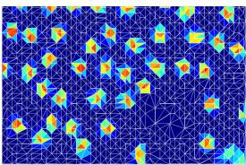

(a) Sobel Filter Response Prior  
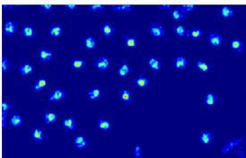  
(b) Structural Prior  
Figure 4: Simplex heatmap (top) and rasterized density map (bottom) of different CPA priors.  
alignment between simplex geometry and crowd structure ultimately leads to more stable Gaussian parameterization and improved counting accuracy.

## 4.3 Discussion on Sampling Stride Sensitivity

Robustness. To evaluate robustness under varying sampling resolutions, we conduct a train-test stride cross-ablation on UCF-QNRF by training GDSNet with strides 8, 10, and 12, and evaluating each across test strides from 6 to 16 without finetuning. As shown in Fig. 5, all configurations maintain MAE below 80 for test strides less than 15, demonstrating strong robustness across a broad sampling range. This verifies that the continuous Gaussian representation effectively reduces dependence on a fixed discrete sampling resolution. Performance drops consistently at test strides 15 and 16 for all settings, revealing an intrinsic undersampling limit rather than train-test mismatch. At such sparse resolutions, Gaussian primitives become excessively coarse, leading to merged local structures and over-smoothed density reconstruction. Training with strides 8 and 10 achieves the strongest overall performance, with stride 10 performing best in most cases. Notably, it even surpasses its matchedstride result when evaluated at neighboring strides (e.g., 6, 7, and 11), indicating that GDSNet can compensate for moderate sampling mismatch through its continuous geometric parameterization. Although stride 12 yields slightly lower accuracy, it still stably achieves an MAE of 77.23 under matched-stride evaluation, highlighting the strong tolerance of the proposed representation to coarser discretization.

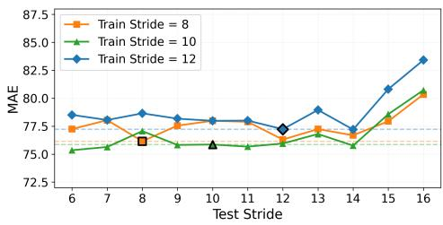

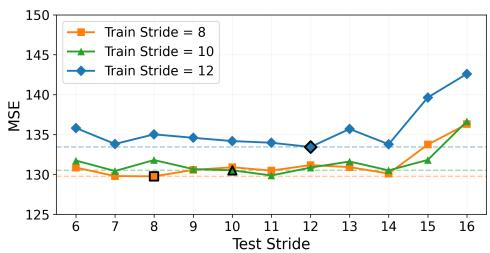  
Figure 5: Performance w.r.t. train and test sampling strides.

Efficiency. The sampling stride s controls the allocation budget. For an $H \times W$ image, the number of sampled control points $V = | \nu |$ satisfies $V \le \lceil H / s \rceil \lceil \mathbf { \bar { W } } / s \rceil$ A planar triangulation with h convex-hull vertices contains $N = 2 V - h - 2 \leq 2 V - 5$ triangular faces, each associated with one Gaussian primitive. Thus, increasing s reduces the upper bound on Gaussian allocation, while the actual allocation remains image-adaptive. Delaunay construction takes $\mathcal { O } ( V \log V )$ time, and feature aggregation over the bounded-degree simplex dual graph takes $\mathcal { O } ( N )$ , yielding quasi-linear $\mathcal { O } ( N \log \bar { N } )$ complexity for topology construction and primitive processing. Detailed runtime, memory, and scaling measurements, including the dominant cost of topology construction, are provided in Suppl. C.

## 5 Conclusion

In this paper, we propose GDSNet, which formulates crowd counting as a continuous density reconstruction problem using Gaussian basis functions, moving beyond traditional grid- and pointbased representations. To address the ill-posed nature of unconstrained continuous modeling, we introduce a control-point-guided parameterization that imposes structured geometric constraints on Gaussian primitives. This design enables stable learning while preserving spatial continuity and flexibility. Extensive experiments on challenging benchmarks demonstrate consistent improvements, with strong robustness to variations in test-time sampling density. How to further accelerate the Delaunay triangulation will be a future direction.

## 6 Acknowledgement

This work was funded in part by the National $\operatorname { K e y }$ R&D Program of China (2025YFC3811300), the National Natural Science Foundation of China (62376070, 62606119, 62076195), the China Postdoctoral Science Foundation under Grant (2026M794773), and the Fundamental Research Fund for the Central Universities (AUGA5710011522).

## References

[1] Yingying Zhang, Desen Zhou, Siqin Chen, Shenghua Gao, and Yi Ma. Single-image crowd counting via multi-column convolutional neural network. In Proceedings of the IEEE conference on computer vision and pattern recognition, pages 589–597, 2016.

[2] Yuhong Li, Xiaofan Zhang, and Deming Chen. Csrnet: Dilated convolutional neural networks for understanding the highly congested scenes. In Proceedings of the IEEE conference on computer vision and pattern recognition, pages 1091–1100, 2018.

[3] Xinkun Cao, Zhipeng Wang, Yanyun Zhao, and Fei Su. Scale aggregation network for accurate and efficient crowd counting. In Proceedings ofthe European conference on computer vision (ECCV), pages 734–750, 2018.

[4] Weizhe Liu, Mathieu Salzmann, and Pascal Fua. Context-aware crowd counting. In Proceedings of the IEEE/CVF conference on computer vision and pattern recognition, pages 5099–5108, 2019.

[5] Tao Han, Lei Bai, Lingbo Liu, and Wanli Ouyang. Steerer: Resolving scale variations for counting and localization via selective inheritance learning. In Proceedings ofthe IEEE/CVF International Conference on Computer Vision, 2023.

[6] Qingyu Song, Changan Wang, Zhengkai Jiang, Yabiao Wang, Ying Tai, Chengjie Wang, Jilin Li, Feiyue Huang, and Yang Wu. Rethinking counting and localization in crowds: A purely pointbased framework. In Proceedings of the IEEE/CVF International Conference on Computer Vision, 2021.

[7] Dingkang Liang, Wei Xu, and Xiang Bai. An end-to-end transformer model for crowd localization. In ECCV, 2022.

[8] Chengxin Liu, Hao Lu, Zhiguo Cao, and Tongliang Liu. Point-query quadtree for crowd counting, localization, and more. In ICCV, pages 1676–1685, 2023.

[9] I-Hsiang Chen, Wei-Ting Chen, Yu-Wei Liu, Ming-Hsuan Yang, and Sy-Yen Kuo. Improving point-based crowd counting and localization based on auxiliary point guidance. In European Conference on Computer Vision, pages 428–444. Springer, 2024.

[10] Zhipeng Du, Miaojing Shi, Jiankang Deng, and Stefanos Zafeiriou. Redesigning multi-scale neural network for crowd counting. IEEE Transactions on Image Processing, 32:3664–3678, 2023.

[11] Hui Lin, Zhiheng Ma, Rongrong Ji, Yaowei Wang, and Xiaopeng Hong. Boosting crowd counting via multifaceted attention. In CVPR, 2022.

[12] Hui Lin, Zhiheng Ma, Xiaopeng Hong, Qinnan Shangguan, and Deyu Meng. Gramformer: Learning crowd counting via graph-modulated transformer. In Proceedings of the AAAI Conference on Artificial Intelligence, volume 38, pages 3395–3403, 2024.

[13] Jian Cheng, Haipeng Xiong, Zhiguo Cao, and Hao Lu. Decoupled two-stage crowd counting and beyond. IEEE Transactions on Image Processing, 30:2862–2875, 2021.

[14] Dingkang Liang, Wei Xu, Yingying Zhu, and Yu Zhou. Focal inverse distance transform maps for crowd localization. IEEE Transactions on Multimedia, 25:6040–6052, 2023.

[15] Zhiheng Ma, Xing Wei, Xiaopeng Hong, and Yihong Gong. Bayesian loss for crowd count estimation with point supervision. In Proceedings of the IEEE/CVF international conference on computer vision, pages 6142–6151, 2019.

[16] Boyu Wang, Huidong Liu, Dimitris Samaras, and Minh Hoai. Distribution matching for crowd counting. In Proceedings of the 34th International Conference on Neural Information Processing Systems, pages 1595–1607, 2020.

[17] Zhiheng Ma, Xing Wei, Xiaopeng Hong, Hui Lin, Yunfeng Qiu, and Yihong Gong. Learning to count via unbalanced optimal transport. In Proceedings of the AAAI Conference on Artificial Intelligence, volume 35, pages 2319–2327, 2021.

[18] Miao Shang and Xiaopeng Hong. 2d gaussians spatial transport for point-supervised density regression. In Proceedings of the AAAI Conference on Artificial Intelligence, volume 40, pages 8824–8832, 2026.

[19] Wei Lin, Jia Wan, and Antoni B. Chan. Proximal mapping loss: Understanding loss functions in crowd counting & localization. In The Thirteenth International Conference on Learning Representations, 2025.

[20] Miao Shang, Xiaopeng Hong, Xiujuan Chai, and Wangmeng Zuo. Untangling context: A gaussian splatting-mediated bayesian framework for crowd counting. Pattern Recognition, page 114725, 2026.

[21] Wei Lin, Chenyang Zhao, and Antoni B. Chan. Point-to-region loss for semi-supervised pointbased crowd counting. In Proceedings ofthe IEEE/CVF Conference on Computer Vision and Pattern Recognition (CVPR), pages 29363–29373, June 2025.

[22] Xinjie Zhang, Xingtong Ge, Tongda Xu, Dailan He, Yan Wang, Hongwei Qin, Guo Lu, Jing Geng, and Jun Zhang. Gaussianimage: 1000 fps image representation and compression by 2d gaussian splatting. In European Conference on Computer Vision, 2024.

[23] Jintong Hu, Bin Xia, Bin Chen, Wenming Yang, and Lei Zhang. Gaussiansr: High fidelity 2d gaussian splatting for arbitrary-scale image super-resolution. arXiv preprint arXiv:2407.18046, 2024.

[24] Hongyu Li, Chaofeng Chen, Xiaoming Li, and Guangming Lu. 2d gaussian splatting with semantic alignment for image inpainting. arXiv preprint arXiv:2509.01964, 2025.

[25] Lingting Zhu, Guying Lin, Jinnan Chen, Xinjie Zhang, Zhenchao Jin, Zhao Wang, and Lequan Yu. Large images are gaussians: High-quality large image representation with levels of 2d gaussian splatting. arXiv preprint arXiv:2502.09039, 2025.

[26] Yunxiang Zhang, Bingxuan Li, Alexandr Kuznetsov, Akshay Jindal, Stavros Diolatzis, Kenneth Chen, Anton Sochenov, Anton Kaplanyan, and Qi Sun. Image-gs: Content-adaptive image representation via 2d gaussians. In Proceedings of the Special Interest Group on Computer Graphics and Interactive Techniques Conference Conference Papers, pages 1–11, 2025.

[27] Du Chen, Liyi Chen, Zhengqiang Zhang, and Lei Zhang. Generalized and efficient 2d gaussian splatting for arbitrary-scale super-resolution. arXiv preprint arXiv:2501.06838, 2025.

[28] Jiajun Dong, Chengkun Wang, Wenzhao Zheng, Lei Chen, Jiwen Lu, and Yansong Tang. Gaussiantoken: An effective image tokenizer with 2d gaussian splatting. arXiv preprint arXiv:2501.15619, 2025.

[29] Long Peng, Anran Wu, Wenbo Li, Peizhe Xia, Xueyuan Dai, Xinjie Zhang, Xin Di, Haoze Sun, Renjing Pei, Yang Wang, et al. Pixel to gaussian: Ultra-fast continuous super-resolution with 2d gaussian modeling. arXiv preprint arXiv:2503.06617, 2025.

[30] Zhaojie Zeng, Yuesong Wang, Tao Guan, Chao Yang, and Lili Ju. Instant gaussianimage: A generalizable and self-adaptive image representation via 2d gaussian splatting. In Proceedings of the IEEE/CVF International Conference on Computer Vision, pages 27896–27905, 2025.

[31] Zhengqiang Zhang, Rongyuan Wu, Lingchen Sun, and Lei Zhang. Gpstoken: Gaussian parameterized spatially-adaptive tokenization for image representation and generation. arXiv preprint arXiv:2509.01109, 2025.

[32] Wolfgang Böhm, Gerald Farin, and Jürgen Kahmann. A survey of curve and surface methods in CAGD. Computer Aided Geometric Design, 1(1):1–60, 1984.

[33] Giorgia Franchini, Roberto Cavicchioli, and Jia Cheng Hu. Stochastic floyd-steinberg dithering on gpu: image quality and processing time improved. In 2019 Fifth International Conference on Image Information Processing (ICIIP), pages 1–6. IEEE, 2019.

[34] N Boris. Delaunay. sur la sphere vide. Izvestia Akademia Nauk SSSR, VII Seria, Otdelenie Matematicheskii i Estestvennyka Nauk, 7:793–800, 1934.

[35] Brian Cabral, Marc Olano, and Philip Nemec. Reflection space image based rendering. In Proceedings of the 26th annual conference on Computer graphics and interactive techniques, pages 165–170, 1999.

[36] Raimund Seidel. The upper bound theorem for polytopes: an easy proof of its asymptotic version. Computational Geometry, 5(2):115–116, 1995.

[37] Andrew W Fitzgibbon, Robert B Fisher, et al. A buyer’s guide to conic fitting. University of Edinburgh, Department of Artificial Intelligence Edinburgh, UK, 1996.

[38] Yingying Zhang, Desen Zhou, Siqin Chen, Shenghua Gao, and Yi Ma. Single-image crowd counting via multi-column convolutional neural network. In 2016 IEEE Conference on Computer Vision and Pattern Recognition (CVPR), pages 589–597, 2016.

[39] Vishwanath A Sindagi, Rajeev Yasarla, and Vishal M Patel. Jhu-crowd++: Large-scale crowd counting dataset and a benchmark method. IEEE transactions on pattern analysis and machine intelligence, 44(5):2594–2609, 2020.

[40] Haroon Idrees, Muhmmad Tayyab, Kishan Athrey, Dong Zhang, Somaya Al-Maadeed, Nasir Rajpoot, and Mubarak Shah. Composition loss for counting, density map estimation and localization in dense crowds. In Proceedings of the European Conference on Computer Vision (ECCV), pages 532–546, 2018.

[41] Qi Wang, Junyu Gao, Wei Lin, and Xuelong Li. Nwpu-crowd: A large-scale benchmark for crowd counting and localization. IEEE transactions on pattern analysis and machine intelligence, 43(6):2141–2149, 2020.

[42] Jia Wan, Ziquan Liu, and Antoni B Chan. A generalized loss function for crowd counting and localization. In Proceedings of the IEEE/CVF conference on computer vision and pattern recognition, pages 1974–1983, 2021.

[43] Weibo Shu, Jia Wan, Kay Chen Tan, Sam Kwong, and Antoni B Chan. Crowd counting in the frequency domain. In Proceedings of the IEEE/CVF conference on computer vision and pattern recognition, pages 19618–19627, 2022.

[44] Karen Simonyan and Andrew Zisserman. Very deep convolutional networks for large-scale image recognition. arXiv preprint arXiv:1409.1556, 2014.

[45] Vickie Ye, Ruilong Li, Justin Kerr, Matias Turkulainen, Brent Yi, Zhuoyang Pan, Otto Seiskari, Jianbo Ye, Jeffrey Hu, Matthew Tancik, and Angjoo Kanazawa. gsplat: An open-source library for Gaussian splatting. arXiv preprint arXiv:2409.06765, 2024.

[46] N. Amini-Naieni and A. Zisserman. Countgd++: Generalized prompting for open-world counting. In Proceedings ofthe IEEE Conference on Computer Vision and Pattern Recognition (CVPR), 2026.

[47] Xiaowen Zhang, Zijie Yue, Yong Luo, Cairong Zhao, Qijun Chen, and Miaojing Shi. Bootstrapping mllm for weakly-supervised class-agnostic object counting. In The Fourteenth International Conference on Learning Representations, 2026.

# Supplementary Material for Gaussian Density Splatting Network

## A Discussion on Mathematical Presentation of Different Counting Paradigms

Given an input image $I \in \mathbb { R } ^ { H \times W \times 3 }$ and point annotations $Y = \{ y _ { m } \} _ { m = 1 } ^ { M }$ , existing methods estimate the crowd distribution via grid-based density regression or point-based detection. From a functional approximation perspective, different counting paradigms can be unified as estimating $\mathcal { D } ( x )$ over the continuous image domain $\Omega = \mathbb { R } ^ { 2 }$ via a linear combination of specific basis functions with varying spatial supports:

$$
\hat { \mathcal { D } } ( x ) = \sum _ { i } \alpha _ { i } \Psi _ { i } ( x ; \xi _ { i } ) ,\tag{12}
$$

where $\Psi _ { i }$ denotes the basis function whose spatial support is parameterized by $\xi _ { i } , w _ { i } \ge 0$ is the discrete magnitude, and the global integral yields the total count $\begin{array} { r } { \hat { M } = \int _ { \Omega } { D ( x ) } } \end{array}$ dx. In the following, we formalize grid-based and point-based methods under this unified view, and subsequently introduce GDSNet as a continuous mathematical approximation representation.

grid-based density estimation. grid-based methods [1, 15] discretize the image plane into a regular grid $\mathcal { G } _ { s } .$ , where s denotes the output stride, and predict a scalar density value for each grid cell. The corresponding continuous density can be viewed as a piecewise-constant approximation:

$$
\hat { \mathcal { D } } _ { \operatorname* { m a p } } ( x ) = \sum _ { u \in \mathcal { G } _ { s } } \hat { d } _ { u } \Pi _ { \Omega _ { u } } ( x ) , \qquad \Pi _ { \Omega _ { u } } ( x ) = \left\{ { 1 , \quad \lVert x - x _ { u } \rVert _ { \infty } \leq s / 2 } , \right.\tag{13}
$$

Here $\hat { d } _ { u }$ is the scalar density predicted for the u-th cell centered at $x _ { u } .$ , and $\Pi _ { \Omega _ { u } }$ is a zero-order box basis with a rigid grid-aligned support. Under our unified framework, the magnitude $\alpha _ { i }$ corresponds to the predicted scalar density $\hat { d } _ { u }$ for the u-th grid cell. The basis $\Psi _ { i }$ is instantiated as a zero-order box function $\Pi _ { \Omega _ { u } } ( x )$ . The spatial support parameter $\xi _ { i }$ is strictly locked to the rigid grid with fixed cell size s. While simple and effective, its spatial support is tightly coupled with the network architecture, and thus rigidly locked to the grid cell size prescribed by the downsampling stride. This rigidity severely limits representational flexibility, barring handling extreme sub-pixel congestions and arbitrary-resolution density sampling.

Point-based prediction. Point-based methods regress on a discrete set of candidate proposals, predicting a confidence score $p _ { i }$ and a coordinate $\mu _ { i }$ for each proposal [6, 21]. After confidence thresholding, the crowd distribution degenerates into a sparse measure supported on isolated points:

$$
\hat { \mathcal { D } } _ { \mathrm { p o i n t } } ( x ) = \sum _ { i } \mathbb { I } ( p _ { i } > \eta ) \delta ( x - \mu _ { i } ) ,\tag{14}
$$

where $\mathbb { I } ( \cdot )$ is the indicator function and $\delta ( \cdot )$ is the Dirac delta basis function, which mathematically possesses a zero-volume isolated support. Under the unified framework, the magnitude $\alpha _ { i }$ degenerates into a binary indicator $\mathbb { I } ( p _ { i } > \eta )$ , and the basis $\Psi _ { i }$ collapses into a Dirac delta function $\delta .$ The support parameter $\xi _ { i }$ comprises solely the isolated coordinate $\mu _ { i }$ . Although point coordinates are continuous, the resulting density has zero-volume support and fails to explicitly model the spatial extent, anisotropy, or smooth occupancy of crowded regions.

GDSNet: continuous Gaussian basis representation. To facilitate a representation that is both geometrically explicit and spatially continuous, we introduce the exponential basis function and formulate the density distribution as a superposition of 2D Gaussian primitives:

$$
\hat { \mathcal { D } } _ { \mathrm { g d s } } ( x ) = \sum _ { i } \rho _ { i } \mathcal { N } ( x ; \mu _ { i } , \Sigma _ { i } ) ,\tag{15}
$$

where $\mathcal { N }$ represents the bivariate Gaussian basis function, parameterized by a learnable continuous center $\mu _ { i } ,$ , an anisotropic covariance matrix $\Sigma _ { i } ,$ and a non-negative density mass scalar $\rho _ { i }$ . Here, the magnitude $w _ { i }$ is represented by a learnable non-negative density mass $\rho _ { i }$ and the basis $\phi _ { i }$ is an exponential Gaussian function. The spatial support parameter $\theta _ { i } = \mathrm { { \dot { \{ \mu _ { i } , \Sigma _ { i } \} } } }$ explicitly models both the continuous center $\mu _ { i }$ and the anisotropic covariance matrix $\Sigma _ { i }$ . Compared with box or Dirac bases, Gaussian bases provide smooth spatial support, explicit geometry, and analytical mass conservation:

$$
\hat { M } = \int _ { \Omega } \hat { { \mathcal { D } } } _ { \mathrm { g d s } } ( x ) d x = \int _ { \Omega } \sum _ { i } \rho _ { i } \mathcal { N } ( x ; \mu _ { i } , \Sigma _ { i } ) d x = \sum _ { i } \rho _ { i } \int _ { \Omega } \mathcal { N } ( x ; \mu _ { i } , \Sigma _ { i } ) d x = \sum _ { i = 1 } ^ { N } \rho _ { i } ,\tag{16}
$$

where the approximation becomes exact when the Gaussian mass outside the image boundary is negligible or handled by the rasterization domain.

## B Implementation Details

All experiments are conducted on one NVIDIA RTX 4090 GPU, implemented in PyTorch 2.0.1 with CUDA 11.8. We use VGG19 [44] with ImageNet-pretrained weights as the backbone. Gaussian Splatting is implemented using gsplat [45]. The sampling stride for control point allocation is set to $s = 1 0$ , the loss balancing temperatures are $\lambda _ { 1 } = \lambda _ { 2 } = 1$ , and the shape regularization threshold is $\gamma = 2$ . The structural prior is generated by an off-the-shelf, frozen structural estimator from [30], without additional training or task-specific fine-tuning, as detailed in Suppl. D.2. The reference ellipse fitted on each triangle simplex is obtained by least-squares fitting to the six points consisting of the three vertices and the three edge midpoints [37]. The Adam optimizer (batch size = 1 and learning $\mathrm { r a t e } = 1 0 ^ { - 5 } )$ ) is used with image crop sizes adjusted per dataset: 256×256 for ShanghaiTech, 384×384 for NWPU, and $5 1 2 { \times } 5 1 2$ for the remaining benchmarks.

The pseudo code of model training and inference is provided in Algorithm 1. Rasterization is required during training for spatial density supervision. At inference, count-only evaluation returns the analytical mass sum, while density-map evaluation additionally renders the learned Gaussian field using its geometry and mass parameters.

## C Complexity and Scalability Analysis

A critical concern for crowd counting in extremely dense scenarios is the scalability of the representation. We analyze the theoretical complexity of GDSNet with respect to the number of allocated Gaussians N, which corresponds to the number of triangular simplices. Unlike transformer-based architectures that typically suffer from quadratic $\mathcal { O } ( N ^ { 2 } )$ or $\mathcal { O } ( \dot { H } ^ { 2 } W ^ { 2 } )$ complexity due to global self-attention, GDSNet maintains a highly efficient scalability profile.

The process begins with the Delaunay triangulation of V control points, which operates in quasilinear O(V log V) time. Since the number of triangular faces N in a planar triangulation is linearly proportional to the number of vertices $( N \approx 2 V )$ , this stage effectively scales as O(N log N). The subsequent Topology-Aware Aggregation is performed over the dual graph of the triangulation, where each Gaussian (simplex) acts as a node. In such a graph, every node is adjacent to at most three neighbors. This bounded degree ensures that the total number of edges in the topological graph is strictly linear, $\mathcal O ( N )$ . Consequently, the message-passing complexity for feature aggregation remains strictly linear, $\mathcal { O } ( N )$ ).

Furthermore, the memory footprint of our continuous representation scales linearly with $N \left( { \mathcal { O } } ( N ) \right)$ contrasting favorably with dense volumetric or high-resolution grid representations. During the rasterization phase, tile-based rendering is bounded by the image resolution $\mathcal { O } ( H \times W )$ and is completely decoupled from the crowd density. This $\mathcal { O } ( \dot { N } \log N )$ overall bound ensures that GDSNet scales robustly even on challenging datasets like JHU-CROWD++ containing tens of thousands of individuals, without encountering out-of-memory (OOM) failures or exponential inference delays.

## C.1 Component-wise Efficiency

Since GDSNet contains multiple components, we provide a detailed component-wise analysis to identify the computational cost distribution of each module. Table 7 reports the parameter, GPU memory, and runtime costs of the main components when processing a 256 × 256 input image. Values prefixed by “+” denote the additional cost of each component.

Algorithm 1: Training and Inference Pipeline of GDSNet   
Input: Input image I, sampling stride s, annotations $Y$ (train only), density-map output flag   
return\_density.   
Output: Updated parameters Θ (train), estimated count $\hat { M }$ (test), rendered map $\hat { \mathcal { D } }$ (optional for   
test).   
/\* Phase 1: Structural Simplexity-Guided Control-Point Allocation   
(Sec. 3.2) \*/   
1 Extract dense semantic feature map ${ \mathcal { F } } \gets \mathbf { B a c k b o n e { _ { \Theta } ( \mathit { I } ) } } ;$   
2 Generate structural prior map $\mathbf { M } ^ { e }  \operatorname* { P r i o r } ( I ) ;$   
3 Apply max-pooling (stride s) and dithering [33] to Me to yield binary activations $z _ { i , j } ;$   
4 Allocate discrete control points $\textstyle \mathcal { V } \gets \left\{ ( i s + \frac { s } { 2 } , j s + \frac { s } { 2 } ) \ | \ z _ { i , j } = 1 \right\}$ ;   
5 Construct simplicial mesh T and topological graph $\mathcal { G } ( \tau , \mathcal { E } ) $ DelaunayTriangulation(V);   
/\* Phase 2: Topology-Aware Feature Aggregation (Sec. 3.3) \*/   
6 foreach simplex $\tau _ { i } \in \mathcal { T }$ do   
7 Fit base reference ellipse [37] $e _ { i }$ and extract its geometric priors $\{ r _ { i } ^ { 0 } , \theta _ { i } ^ { 0 } \}$   
8 Construct geometric feature $f _ { i } ^ { g }$ using normalized vertex coordinates and $_ { e _ { i } ; }$   
9 Sample $\mathcal { F }$ at center $c _ { i }$ and vertices $v _ { i , j }$ to extract appearance feature $f _ { i } ^ { a } ( \mathrm { E q . } 5 ) ;$   
10 Fuse intra-simplex representation $f _ { i } ^ { l } \gets f _ { i } ^ { g } \oplus f _ { i } ^ { a } ;$   
11 Aggregate graph-induced contextual features from neighbors $b \in B ( i )$ to form $f _ { i } ^ { t }$ (Eq. 6);   
12 Concatenate to form the comprehensive primitive feature: $f _ { i } \gets f _ { i } ^ { l } \oplus f _ { i } ^ { t } ;$   
13 end   
/\* Phase 3: Constrained Parameterization (Sec. 3.3) \*/   
14 foreachfeature $f _ { i }$ do   
15 Regress relative adjustments and density mass via parallel MLPs:   
$\mathbf { w } _ { i } , \Delta \mathbf { s } _ { i } , \Delta \theta _ { i } , \boldsymbol { \rho } _ { i } \gets \mathbf { M } \mathbf { L } \mathbf { P } \boldsymbol { \mathrm { s } } _ { \Theta } ( f _ { i } ) ;$   
16 Explicitly restrict center $\mu _ { i }$ within the simplex convex hull via $\begin{array} { r } { \mathbf { w } _ { i } \colon \mu _ { i }  \sum _ { j = 1 } ^ { 3 } w _ { i , j } v _ { i , j } } \end{array}$   
(Eq. 7);   
17 Map scale and rotation relative to base priors: $\mathbf { s } _ { i } \gets \Delta \mathbf { s } _ { i } \cdot [ r _ { i } ^ { 0 } , 1 ] ^ { \top } , \theta _ { i } \gets \theta _ { i } ^ { 0 } + \Delta \theta _ { i } ( \mathrm { E q . ~ } 7 ) ;$   
18 Instantiate continuous Gaussian primitive: $\mathcal { G } _ { i } \gets \{ \mu _ { i } , \mathbf { s } _ { i } , \theta _ { i } , \tilde { \rho } _ { i } \} ;$   
19 end   
/\* Phase 4: State Execution & Optimization (Sec. 3.4) \*/   
20 Compute analytical total count by summing the density mass: Mˆ $ \textstyle \sum _ { i = 1 } ^ { | { \mathcal { T } } | } \rho _ { i } ;$   
21 if is Training Stage then   
22 Rasterize primitives {G } to continuous density map $\hat { \mathcal { D } } 2$ via Gaussian splatting;   
23 Compute spatial alignment Bayesian loss $\mathcal { L } _ { \mathrm { { r a s t } } } ( \hat { \mathcal { D } } , Y ) \left( \mathrm { { E q . 8 } } \right) ;$   
24 Compute global count loss ${ \mathcal { L } } _ { \mathrm { c n t } }$ (Eq. 9) and geometric shape loss $\mathcal { L } _ { s } \left( \mathrm { E q . } 1 0 \right) ;$   
25 Optimize overall objective $\begin{array} { r } { \mathcal { L } = \dot { \mathcal { L } } _ { \mathrm { { r a s t } } } + \lambda _ { 1 } \dot { \mathcal { L } } _ { \mathrm { { c n t } } } + \lambda _ { 2 } \mathcal { L } _ { s } \left( \dot { \mathrm { E q } } . 1 1 \right) } \end{array}$ via backpropagation to   
update Θ;   
26 else   
27 if return\_density then   
28 Rasterize $\left\{ { \mathcal { G } } _ { i } \right\}$ to obtain $\hat { \mathcal { D } } ;$   
29 return M,ˆ Dˆ;   
30 else   
31 return $\hat { M }$   
32 end   
33 end

Table 7: Component-wise parameter, GPU memory, and runtime measurements.
<table><tr><td>Component</td><td>Params (M)</td><td>GPU memory (MB)</td><td>Runtime (ms)</td></tr><tr><td>Baseline: backbone + regression head</td><td>21.50</td><td>130.50</td><td>12.54</td></tr><tr><td>Backbone</td><td>20.02</td><td>48.64</td><td>11.02</td></tr><tr><td>+ Topology computation</td><td>+0</td><td>+0.65</td><td>+9.00</td></tr><tr><td>+ Feature aggregation</td><td>+1.66</td><td>+11.04</td><td>+0.29</td></tr><tr><td>+ Constrained Gaussian parameterization</td><td>+0.04</td><td>+1.70</td><td>+0.20</td></tr><tr><td>+ Gaussian field rasterization</td><td>+0</td><td>+0.21</td><td>+0.11</td></tr></table>

The analysis shows that the Gaussian field learning and rendering modules themselves introduce only marginal computational overhead. The feature aggregation, constrained Gaussian parameterization, and Gaussian field rasterization together require only 0.60 ms and 12.95 MB memory, demonstrating that the Gaussian parameter learning and differentiable rendering modules are lightweight.

The main additional overhead comes from the topology computation. This overhead is mainly caused by the Delaunay triangulation step that explicitly constructs spatial relationships among adaptive control points. Importantly, this operation is non-parametric and does not introduce additional trainable parameters.

In future work, more advanced GPU-accelerated triangulation tools or learned primitive organization strategies can be investigated to further reduce the overhead of topology construction.

## C.2 Scaling with Primitive Allocation

We vary the sampling stride on the same input image under an identical inference setting and exclude image loading time. Table 8 separately reports topology construction to isolate the principal primitivedependent cost. Smaller strides allocate more Gaussians and increase topology construction time. GPU memory varies little over the measured range.

Table 8: Runtime and GPU memory measurements with varying Gaussian primitive allocation.
<table><tr><td>Stride</td><td>Gaussian</td><td>Runtime (ms)</td><td>GPU memory (MB)</td><td>Topology time (ms)</td><td>Topology memory (MB)</td></tr><tr><td>6</td><td>1814</td><td>16.93</td><td>48.95</td><td>14.37</td><td>1.06</td></tr><tr><td>8</td><td>1002</td><td>13.65</td><td>48.93</td><td>11.15</td><td>0.56</td></tr><tr><td>10</td><td>639</td><td>12.27</td><td>48.92</td><td>9.72</td><td>0.55</td></tr><tr><td>12</td><td>451</td><td>10.94</td><td>48.92</td><td>8.42</td><td>0.55</td></tr><tr><td>16</td><td>244</td><td>10.07</td><td>48.91</td><td>7.59</td><td>0.51</td></tr></table>

The results show that the number of allocated Gaussian primitives can be flexibly adjusted through the stride s. The topology computation dominates the primitive-dependent scaling cost and increases consistently as more simplices are allocated. Importantly, as the number of simplices/Gaussians increases, the topology time and overall runtime scale approximately linearly, which empirically validates our claim of quasi-linear complexity. The other costs remain nearly unchanged. These results verify that the computational overhead of the proposed Gaussian representation is controllable with respect to the number of allocated primitives.

## D Implementation Details of Ablation Studies

To investigate the modules in the proposed GDSNet, we implement module ablation and Control Point Allocation (CPA) strategy ablation studies, as shown in Table 9.

## D.1 Implementation of Module Ablations

Removing Topology-aware Feature Aggregation (TFA). This variant removes the inter-simplex neighbor feature while keeping control point allocation, dither sampling, and simplex-constrained parameterization. The final feature for Gaussian becomes:

$$
f _ { i } = f _ { i } ^ { l } ,\tag{17}
$$

Table 9: Implementation comparison of the full model and ablation variants. CPA, SCP, and TFA are the control point allocation, simplex-constrained parameterization, and topology-aware feature aggregation modules, respectively.
<table><tr><td></td><td>Method</td><td>CPA Strategy</td><td>Sampling</td><td>Support Region</td><td>SCP</td><td>TFA</td></tr><tr><td rowspan="4">Module Ablations</td><td>Full GDSNet</td><td>Structural Prior</td><td>Dither</td><td>Triangle Simplex</td><td>√</td><td>√</td></tr><tr><td>w/o TFA</td><td>Structural Prior</td><td>Dither</td><td>Triangle Simplex</td><td></td><td></td></tr><tr><td>w/o (TFA &amp; SCP)</td><td>Structural Prior</td><td>Dither</td><td>Fixed grid patch</td><td></td><td></td></tr><tr><td>w/o (TFA &amp; SCP &amp; CPA)</td><td>Structural Prior</td><td>Uniform grid</td><td>Fixed grid patch</td><td></td><td></td></tr><tr><td rowspan="4">CPA Ablation</td><td>Uniform Grid</td><td>Uniform</td><td>Dither</td><td>Triangle Simplex</td><td>√</td><td>√</td></tr><tr><td>Sobel Filter Response Prior</td><td>Sobel Filter Response Prior</td><td>Dither</td><td>Triangle Simplex</td><td>√</td><td>√</td></tr><tr><td>Structural Prior</td><td>Structural Prior</td><td>Dither</td><td>Triangle Simplex</td><td> $\checkmark$ </td><td>V</td></tr></table>

instead of concatenating the context feature of one-hop Delaunay neighbors. This setting evaluates the contribution of local topological context to scale, rotation, and density mass prediction.

Removing Topology-aware Feature Aggregation (TFA) and Simplex-Constrained Parameterization (SCP). This variant also removes neighbor modeling of the Gaussian feature, and replaces the adaptive triangular receptive field with a fixed square grid patch. For each sampled anchor $v _ { i }$ four patch corners are defined as:

$$
q _ { i , 1 } = v _ { i } + ( - \Delta _ { x } , - \Delta _ { y } ) , \quad q _ { i , 2 } = v _ { i } + ( + \Delta _ { x } , - \Delta _ { y } ) ,\tag{18}
$$

$$
q _ { i , 3 } = v _ { i } + ( - \Delta _ { x } , + \Delta _ { y } ) , q _ { i , 4 } = v _ { i } + ( + \Delta _ { x } , + \Delta _ { y } ) ,\tag{19}
$$

where $\Delta _ { x } = s / W$ and $\Delta _ { y } = s / H$ in normalized coordinates. The local feature is obtained by sampling the backbone feature map at the four patch corners and the center

$$
\begin{array} { r } { f _ { i } ^ { l } = \mathcal { F } ( q _ { i , 1 } ) \oplus \mathcal { F } ( q _ { i , 2 } ) \oplus \mathcal { F } ( q _ { i , 3 } ) \oplus \mathcal { F } ( q _ { i , 4 } ) \oplus \mathcal { F } ( v _ { i } ) . } \end{array}\tag{20}
$$

Without the constraint of the triangle simplex, this variant feeds the Gaussian feature into MLP heads and gets $\{ \Delta \mu , \Delta \mathbf { s } _ { i } , \Delta \theta _ { i } , \rho _ { i } \}$ . The parameters of the Gaussian primitive are:

$$
\mu _ { i } = v _ { i } + \Delta \mu _ { i } , \quad \mathbf { s } _ { i } = \Delta \mathbf { s } _ { i } \cdot \left[ 1 , 1 \right] ^ { \mathrm { ~ l ~ } } , \quad \theta _ { i } = 0 + \Delta \theta _ { i } , \quad \rho _ { i } = \rho _ { i } .\tag{21}
$$

Removing Topology-aware Feature Aggregation (TFA), Simplex-Constrained Parameterization (SCP), and Structural Complexity Guided Control Point Allocation (CPA). This is the most reduced variant. It removes the structural prior and instead places Gaussian anchors uniformly on the image plane:

$$
\mathcal { V } _ { \mathrm { g r i d } } = \{ ( k / 2 + i k , ~ k / 2 + i k ) \} _ { i , j } .\tag{22}
$$

Each anchor uses the same fixed grid-patch receptive field as described above. The feature extraction and Gaussian parameterization follows Eq. 20 and Eq. 21. This experiment evaluates whether uniform spatial allocation with local patch features is sufficient for Gaussian density rendering.

## D.2 Implementation and Visualization of Control Point Allocation Strategy Ablations

Uniform Grid Allocation. In this setting, the structural prior map is replaced by a constant map:

$$
\mathbf { M } ^ { e } ( x ) = 1 , \quad \forall x \in \Omega .\tag{23}
$$

The remaining pipeline is unchanged. This variant isolates the influence of learned complexity guidance from the rest of the topology-aware Gaussian feature aggregation pipeline.

Sobel Filter Response Prior. This variant constructs a prior map from handcrafted image structural prior as in Image-gs [26]. The input image is first converted to grayscale:

$$
Y = 0 . 2 9 9 R + 0 . 5 8 7 G + 0 . 1 1 4 B .\tag{24}
$$

Then, Sobel filters are applied:

$$
G _ { x } = K _ { x } * Y , \qquad G _ { y } = K _ { y } * Y ,\tag{25}
$$

and the response magnitude is computed as:

$$
G = \sqrt { G _ { x } ^ { 2 } + G _ { y } ^ { 2 } } .\tag{26}
$$

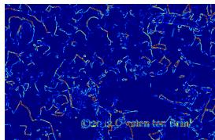

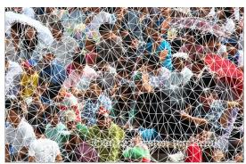

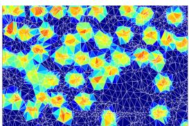

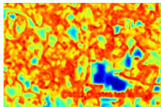  
(a) Prior Map

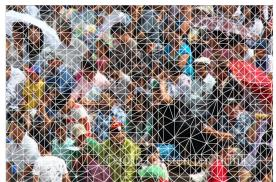  
(b) Triangulation Mesh

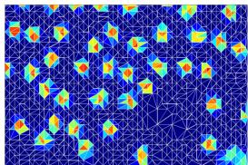  
(c) Simplex Heatmap

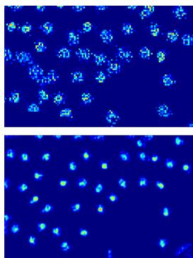  
(d) Rasterized Density Map  
Figure 6: Comparison of Sobel filter response prior (top) and our structural prior (bottom).

After max normalization, the response is squared to emphasize strong edges:

$$
\mathbf { M } _ { \mathrm { g r a d } } ^ { e } = \left( \frac { G } { \operatorname* { m a x } ( G ) + \epsilon } \right) ^ { 2 } .\tag{27}
$$

To avoid overly sparse sampling in flat regions, a small lower bound is applied:

$$
\mathbf { M } _ { \mathrm { g r a d } } ^ { e } = \operatorname* { m a x } ( \mathbf { M } _ { \mathrm { g r a d } } ^ { e } , \rho ) ,\tag{28}
$$

where $\rho$ is a small constant. The subsequent pipeline is identical to the full model.

Structural Complexity Prior. This is the default setting of GDSNet. The prior map is generated by the off-the-shelf, frozen structural estimator from in instantGI [30]. Benefiting from its exceptional generalization across diverse scenes, we directly employ this plug-and-play component to generate Me for all experiments. It is important to note that the InstantGI model is used purelyfor inference in our pipeline to produce the structural prior, and is notfine-tuned or trained on any target dataset. By utilizing this task-agnostic substrate, GDSNet can focus exclusively on task-specific density regression, effectively avoiding optimization instabilities while ensuring robust performance across varied crowd counting benchmarks.

As for the architecture of this estimator, Me is predicted by a ConvNeXt-UNet followed by a pixel-wise MLP:

$$
\mathbf { F } _ { e } = f _ { \mathrm { S P M } } ( I ) , \qquad \mathbf { M } ^ { e } = \sigma ( \phi ( \mathbf { F } _ { e } ) ) ,\tag{29}
$$

where $\mathbf { F } _ { e } \in \mathbb { R } ^ { 6 4 \times H \times W }$ and $\phi$ is a three-layer MLP with channel dimensions $6 4 \to 6 4 \to 6 4 \to 1$ . σ is the Sigmoid activation function.

More Visual Comparison of CPA Strategies. To further elucidate the impact of different priors, we visualize the intermediate stages of GDSNet using Sobel filtering versus our structural prior in Fig. 6. As shown in the top row, the Sobel-generated map is strictly contour-focused, capturing high-frequency edges and irrelevant background noise (e.g., the watermark at the bottom). This leads to an overly fragmented mesh that forces the Gaussian primitives to collapse into thin, erratic shapes, resulting in the noisy and disjointed density field. In contrast, our structural complexity-guided prior (bottom row) identifies geometric manifolds and salient clusters rather than just edges. This provides a more balanced triangulation substrate, allowing the network to regress smooth, ellipsoid-like primitives that accurately represent the spatial occupancy of individuals. This qualitative evidence confirms that our choice of structural prior is essential for maintaining the topological continuity of the crowd density field. Ultimately, this stable initialization effectively regularizes the learning process by anchoring the primitive topology, enabling the model to prioritize precise density mass estimation over topological searching. This synergy translates observed visual coherence into superior counting accuracy.

## D.3 Implementation Details of Gaussian Geometry Ablation

All variants share the same control points, primitive allocation, feature aggregation module, density mass prediction head, and rasterization supervision. They differ in the spatial basis and its geometric parameterization.

Full anisotropic Gaussian parameterization. After Delaunay triangulation, a reference ellipse $e _ { i }$ is fitted to each simplex $\tau _ { i }$ to establish its geometric prior. From the aggregated feature representation, the network predicts barycentric weights $w _ { i , j }$ , scale adjustments $\Delta \mathbf { s } _ { i }$ , a rotation adjustment $\Delta \theta _ { i }$ , and density mass $\rho _ { i }$ . Following Eq. 7, the final geometry is

$$
\mu _ { i } = \sum _ { j = 1 } ^ { 3 } w _ { i , j } v _ { i , j } , \qquad { \bf s } _ { i } = \Delta { \bf s } _ { i } \odot [ r _ { i } ^ { 0 } , 1 ] ^ { \top } , \qquad \theta _ { i } = \theta _ { i } ^ { 0 } + \Delta \theta _ { i } ,\tag{30}
$$

where $r _ { i } ^ { 0 }$ and $\theta _ { i } ^ { 0 }$ are the axis ratio and orientation of the fitted ellipse. The barycentric weights constrain the center to its simplex. The following variants modify this formulation while retaining the shared mass prediction and supervision.

Triangle mass regression. This variant uses a unit-integral, piecewise-constant triangle basis:

$$
\Psi _ { i } ( x ) = \frac { \mathbf { 1 } [ x \in \tau _ { i } ] } { | \tau _ { i } | } , \qquad \hat { \mathcal { D } } ( x ) = \sum _ { i } \rho _ { i } \Psi _ { i } ( x ) ,\tag{31}
$$

where $| \tau _ { i } |$ is the triangle area. The predicted mass is uniformly distributed over each triangle.

Fixed Gaussian. This variant removes learnable geometric adjustments: $\mu _ { i } , \mathbf { s } _ { i } ,$ , and $\theta _ { i }$ are directly set to the center, axis scales, and orientation of the fitted ellipse $e _ { i }$ and remain fixed during training. The density mass $\rho _ { i }$ is still predicted by the mass head.

Isotropic Gaussian. This variant removes anisotropic aspect-ratio modeling by setting $r _ { i } ^ { 0 } = 1$ and tying the two scale dimensions:

$$
\mathbf { s } _ { i } = \Delta s _ { i } [ 1 , 1 ] ^ { \mathsf { T } } .\tag{32}
$$

The center retains the full model’s learnable barycentric parameterization, and $\Delta { } s _ { i }$ is a learnable scalar scale adjustment. Thus, the variant preserves adaptive center and scale estimation while removing directional anisotropy. Rotation does not affect an isotropic Gaussian’s spatial support.

These variants provide a progressive comparison from a piecewise-constant triangle basis to fixed Gaussian support, learnable isotropic support, and full anisotropic geometry. The quantitative results and analysis are provided in Table 6 in the main paper.

## E Comparison with MLLMs

MLLMs and specialized crowd counting networks leverage distinct strengths and cater to different application paradigms.

MLLMs excel at high-level semantic understanding, open-world reasoning, and object-centric counting in sparse scenarios with distinct instances, such as the FSC-147 benchmark which averages approximately 56 objects per image. Specialized networks like GDSNet are purpose-built for ultradense human scenes characterized by extreme scale variations, severe occlusion, and perspective distortion, where benchmarks like ShanghaiTech Part A average 501 persons per image and UCF-QNRF averages 815 persons per image.

Directly applying MLLMs to dense crowd benchmarks remains highly challenging due to visual tokenization resolution limits and auto-regressive numeric regression bottlenecks. Table 10 compares reported ShanghaiTech Part A results, highlighting this performance gap. External model results are taken from CountGD++ [46] and WS-COC [47].

Table 10: Reported MLLM and GDSNet results on ShanghaiTech Part A.
<table><tr><td>Model / source</td><td>Setting</td><td>MAE</td></tr><tr><td>Molmo [46]</td><td>Direct prompting</td><td>7.26 × 108</td></tr><tr><td>Gemini-2.5 [46]</td><td>Direct prompting</td><td>517.17</td></tr><tr><td>LLaVA-OneVision-7B [47]</td><td>Direct prompting</td><td>336.80</td></tr><tr><td>LLaVA-OneVision-7B / WS-COC [47]</td><td>Counting-specific tuning</td><td>128.90</td></tr><tr><td>GDSNet</td><td>Specialized density estimation</td><td>48.80</td></tr></table>

Table 10 indicate a substantial gap between general-purpose MLLMs and specialized models on dense crowd counting. Visual tokenization can limit access to small, heavily occluded heads, while numerical count prediction introduces an additional challenge. Counting-specific tuning improves MLLM performance, but specialized density estimation remains valuable in these dense scenes.

## F Failure Cases and Limitations

In extremely congested scenes, individual heads may occupy only a few pixels. GDSNet can produce a reasonably accurate total count while rendering smooth high-response regions rather than sharply localized peaks, as shown in Fig. 7. Constraining primitives against excessively small support improves training stability but limits response sharpness. The current supervision emphasizes density alignment and count consistency without a strong individual-head localization constraint. Two directions for improvement are extracting centers of high-response primitives or sharpening responses at inference, and jointly optimizing a localization-oriented objective to learn sharper spatial responses alongside accurate counting.

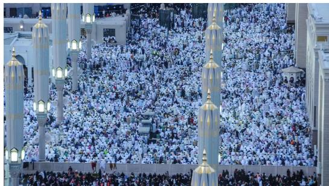

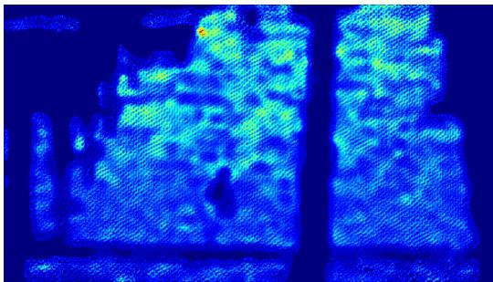  
Figure 7: Representative failure case of GDSNet on a highly congested scene. The model produces a smooth density map which lacks sharply localized peaks for individual heads.