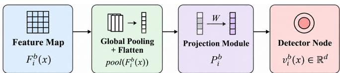
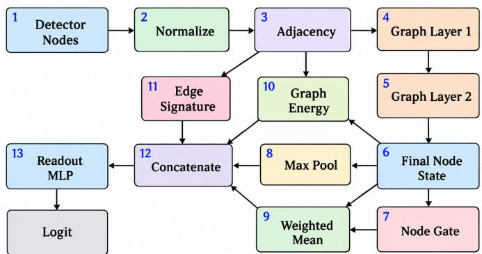
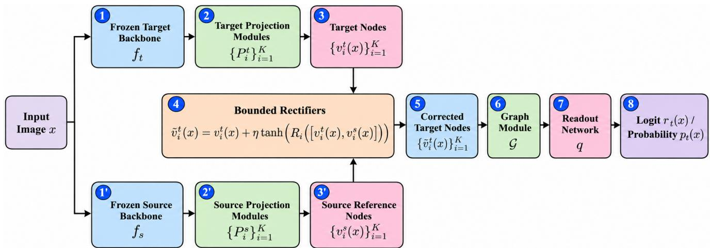

# GraphRectify: Graph-Based Transfer of Adversarial Example Detectors Across Neural Networks

Arash Vashagh and Roozbeh Razavi-Far

Trustworthy and Secure AI (TSAI) Lab, Faculty of Computer Science, University of New Brunswick, Canada Email: arash.vashagh@unb.ca, roozbeh.razavi-far@unb.ca

Abstract—Adversarial example detectors are often tied to the classifier backbone they were trained on, limiting reuse when the protected model is replaced or upgraded. Directly transferring such detectors across backbones is challenging because different networks generally produce incompatible internal representations. We propose GraphRectify, a graphbased framework for transferring adversarial image detectors across classifier backbones. GraphRectify learns a structured representation of intermediate classifier features and adapts representations from a new backbone to the detector learned on the original model, enabling detector reuse. We evaluate GraphRectify across multiple datasets, backbone architectures, and adversarial attacks, including detector-aware adaptive attacks that jointly target the classifier and detector. Across the complete evaluation matrix, GraphRectify achieves higher aggregate ROC-AUC than training a detector from scratch on the new backbone and the evaluated transfer ablations. The gains are particularly strong for transfers between different backbone families and when sufficient data are available. In contrast, training from scratch remains competitive in the most data-limited settings. These results show that adversarial detection knowledge can transfer effectively across heterogeneous classifier architectures rather than being relearned whenever the protected backbone changes.

Index Terms—Adversarial example detection, Transfer learning, Graph neural networks, Adversarial robustness, Detector adaptation

## I. INTRODUCTION

Adversarial example detectors provide an additional test-time mechanism for identifying inputs that have been deliberately perturbed to mislead a neural classifier. Existing approaches use signals such as prediction confidence, input transformations, intermediate feature statistics, and consistency across internal representations [1]–[4]. Detectors that rely on intermediate representations can exploit information that is unavailable from the final classifier output alone, but this dependence also creates a practical limitation. When the protected classifier is replaced or upgraded, its internal feature space changes, so a detector trained for the previous model may no longer operate on compatible representations. Retraining the detector from scratch discards previously learned detection structure and may require additional labeled data and computation, while directly reusing the existing detector is unreliable because independently trained or architecturally different networks do not generally produce aligned internal representations.

We refer to the original protected classifier as the source classifier and its feature-extracting architecture as the source backbone. The new or replacement classifier is the target classifier, and its architecture is the target backbone. The problem we consider in this work is whether the adversarial detection structure learned for the source backbone can be reused after the protected classifier changes to the target backbone.

We address this problem with GraphRectify, a graph-based framework for transferring an adversarial example detector across classifier backbones. GraphRectify converts selected intermediate features into compact fixed-dimensional nodes and learns relationships among these nodes using a dynamic graph module. A detector trained using representations from the source backbone is referred to as the source detector. During source training, the source detector learns a graph-level representation that distinguishes clean and adversarial inputs. After source training, its graph module and readout are frozen and reused when adapting detection to the target backbone.

The main difficulty is that simply projecting target-backbone features into vectors of the same dimension does not ensure that they match the representation structure expected by the source detector. GraphRectify therefore performs target adaptation, meaning that only the target-specific interface to the transferred detector is learned for the new backbone. At each selected stage, a projected representation from the target backbone forms a target node. It is paired with a detached source reference node, obtained from the same input through the frozen source branch, which consists of the source backbone and the source-side projection modules. A lightweight source-guided rectifier predicts a bounded residual correction to the target node. The transferred graph module and readout then process the corrected target nodes. In this way, GraphRectify adapts the target representations to the detection structure learned from the source backbone without training the target classifier to reproduce predictions from the source classifier.

This setting differs from conventional knowledge distillation, which typically transfers predictive behavior from a teacher model to a student [5], [6]. It also differs from prior work on detector generalization across attacks, datasets, or models [7]–[9], as well as meta-learning methods that adapt detectors to previously unseen attacks [10]. Our focus is specifically on reusing a detector whose inputs depend on the internal representations of one classifier after those representations change because the protected backbone has been replaced. GraphRectify separates backbone-specific node construction from the reusable graph-level detection structure and adapts the interface between them.

We evaluate GraphRectify on CIFAR-10, STL-10, and SVHN across three architecture transfers: ResNet18→ResNet34, ResNet34→ResNet18, and ResNet18→MobileNetV2. We use target data to denote the labeled data available in the targetbackbone setting for adapting GraphRectify or training a detector directly on the target backbone. The evaluation considers five target-data fractions, four detector-aware attacks, and three random seeds. We compare GraphRectify with direct transfer, in which the existing detector is reused without target adaptation, and with target-only detectors, which are trained from scratch on the target backbone using the same target-data fraction and without transferring components from the source detector. GraphRectify improves overall detection performance relative to both baselines. Its benefit becomes clearer as more target data are available, although targetonly training can remain competitive in extremely data-limited settings. GraphRectify also improves performance across all three architecture-transfer settings, including the cross-family ResNet18→MobileNetV2 transfer.

The main contributions of this work are as follows:

1) We formulate adversarial detector transfer across classifier backbones as a representation-adaptation problem in which detection structure learned for a source backbone is reused after the protected classifier changes to a target backbone.

2) We propose GraphRectify, which separates backbonespecific node construction from a reusable graph-level detector and introduces source-guided bounded rectification to make target representations compatible with the transferred detection structure.

3) We evaluate GraphRectify across three datasets, three architecture transfers, five target-data fractions, four detector-aware attacks, and three random seeds, including target-only baselines, controlled ablations, and crossfamily transfer to MobileNetV2.

The remainder of this paper is organized as follows. Section II reviews adversarial example detection, detector generalization, transfer learning, and graph-based representation modeling. Section III presents GraphRectify and its sourcetraining and target-adaptation procedures. Section IV describes the datasets, training configuration, attacks, and evaluation metrics. Section V presents the experimental results and ablation studies. Finally, Section VI discusses the findings, limitations, and future directions, and Section VII concludes the paper.

## II. BACKGROUND

This section reviews the areas most directly related to GraphRectify: adversarial example detection, transfer and teacher-guided adaptation, detector reuse across changing settings, and graph-based modeling of internal representations. We emphasize the distinction between transferring classifier behavior and transferring the detection structure built around a classifier’s intermediate representations.

## A. Adversarial Examples and Detection

Deep neural networks are vulnerable to adversarial examples, in which small input perturbations can change a model’s prediction while preserving the semantic content of the original input. Gradient-based attacks such as the Fast Gradient Sign Method (FGSM) and Projected Gradient Descent (PGD) are widely used to construct such examples [11]–[14].

Adversarial example detectors attempt to distinguish these perturbed inputs from clean samples at inference time. Existing methods use several types of signals. Confidence-based approaches use statistics derived from the final classifier output, such as maximum softmax probability [1]. Transformationbased approaches test whether predictions remain stable after operations such as bit-depth reduction or spatial smoothing [15]. Other detectors use information from intermediate representations. Hidden-layer density estimates and dropout uncertainty have been used to separate clean and adversarial inputs [2], while Mahalanobis-distance methods model class-conditional feature distributions across network layers [3].

More recent approaches exploit consistency and changes in internal behavior. ML-LOO uses feature-attribution statistics and studies generalization across attack types [4]. BEYOND compares an input with augmented neighbors using selfsupervised representations [16]. Other work detects adversarial inputs through localized changes across intermediate layers [17]. Collectively, these approaches show that intermediate acti vations contain useful detection signals beyond final prediction confidence.

A detector that relies on internal representations, however, is naturally coupled to the backbone that produces those representations. If that backbone changes, both the dimensionality and distribution of the detector inputs may change. This dependency is central to the transfer problem studied in this paper.

Adversarial detectors must also be evaluated against attacks that account for the detector itself. Adaptive attacks have demonstrated that detectors that appear reliable against nonadaptive attacks can often be bypassed [18]. AutoAttack further established the importance of strong and carefully configured adversarial evaluation [19]. For this reason, our final evaluation uses detector-aware attacks that jointly target classifier misclassification and detector evasion.

## B. Teacher Guidance and Transfer

Teacher–student learning provides mechanisms for transferring information from a previously trained model to another model. Knowledge distillation trains a student to reproduce softened outputs of a teacher [5], [20], while attention transfer uses intermediate teacher representations as additional supervision [6]. In both cases, the objective is primarily to transfer predictive knowledge from one model to another.

Transfer has also been studied in adversarial machine learning. Prior work has examined transfer of adversarial robustness between tasks [21], standalone adversarial detection without access to the protected model’s internal features [22], transferability in audio deepfake detection [23], and adversarial transfer based on self-supervised transformer features [24].

MetaAdvDet uses meta-learning to adapt an adversarial detector to previously unseen attack types [10].

These approaches address forms of transfer that differ from the setting considered here. GraphRectify does not train a target classifier to imitate a source classifier, nor does it transfer class predictions or robustness from one classifier to another. Instead, the protected target classifier remains independently trained and frozen. The transfer objective is to preserve a previously learned adversarial detection mechanism while adapting the intermediate representations supplied to that detector.

## C. Detector Generalization and Reuse

Several studies examine whether adversarial detectors remain effective when the attack, dataset, or protected model changes. DAMAD evaluates detection across databases, attacks, and models using fused texture and autoencoder features [7]. Other approaches improve cross-attack generalization through adversarial domain adaptation or few-shot learning [25], [26]. [8] reduces dependence on internal classifier representations by emphasizing high-frequency adversarial artifacts and reconstructed edge information. Prediction-consistency methods instead compare outputs from a protected model and an auxiliary model to obtain a detection signal [9].

These methods improve generalization by designing detection signals that are less tied to a particular internal representation or by training detectors for broader operating conditions. GraphRectify addresses a different problem. We assume that a useful detector has already been learned around one source backbone and ask whether its learned internal detection structure can be reused after the protected backbone changes.

This distinction matters in limited-data settings. Retraining a detector from scratch on the target backbone discards the structure learned by the source detector. Directly applying the source detector to the target backbone is also unreliable because source and target intermediate features are not naturally aligned. GraphRectify therefore treats backbone replacement as a representation-compatibility problem: target features must be adapted before the previously learned detector processes them.

## D. Graph-Based Internal Signal Modeling

Graph neural networks provide mechanisms for learning from relationships among multiple representations. Graph con volutional networks aggregate neighboring features according to graph connectivity [27], while graph attention networks learn data-dependent weights over neighboring nodes [28]. More generally, graph representation learning provides tools for modeling structured dependencies among multiple feature sources [29].

Graph-based techniques have also appeared in adversarial settings, although with objectives different from ours. GNNGuard improves the robustness of graph neural networks by reducing the influence of suspicious edges during message passing [30]. NeuroTrace represents a neural network forward pass as an input-dependent inference-provenance graph whose nodes and edges encode intermediate activations and computational dependencies [31].

GraphRectify uses a graph for a different purpose. Its graph does not represent an external relational dataset, and it does not reproduce the complete computation graph of the classifier. Instead, selected intermediate feature maps are compressed into a small set of detector nodes. The graph detector learns relationships among these nodes that distinguish clean from adversarial inputs.

This representation creates the transfer problem our method addresses. A graph detector trained on source-backbone nodes expects not only individual node features but also particular relationships among those features. Consequently, matching dimensionality alone is insufficient when the backbone changes. The target nodes must become compatible with the relational structure learned by the source graph detector.

## E. Positioning of Our Work

GraphRectify is motivated by a gap between detector generalization and detector reuse. Existing work has studied detectors that generalize across attacks, datasets, or models, and transfer-learning methods that move predictive knowledge between networks. Neither setting directly addresses the case in which a detector built from one classifier’s intermediate representations must be retained after a different backbone replaces that classifier.

Our approach separates the detector into two roles. The projection modules provide a backbone-specific interface that converts intermediate features into a common node representation, while the graph module captures a reusable relational detection structure. When transferring to a target backbone, we freeze the learned graph detector and adapt the target-side interface instead of relearning the graph-level detector.

The key mechanism is source-guided bounded rectification. Target nodes are paired with detached source reference nodes obtained from the same input, and a lightweight rectifier predicts a bounded correction before graph processing. The source branch therefore guides how the target representation is adapted, but it does not provide the final detection prediction and does not transfer source-classifier class outputs. This allows GraphRectify to preserve a learned graph-level detection structure while adapting it to a new backbone using limited target data.

## III. PROPOSED METHOD

GraphRectify transfers an adversarial detector from a source classifier backbone to a different target backbone. The framework has three main components: (1) backbone-specific projection modules that convert selected intermediate feature maps into fixed-dimensional detector nodes, (2) a graph module and readout network that model relationships among these nodes and produce an adversarial-detection score, and (3) targetside bounded rectifiers that adapt target nodes using detached reference nodes from the frozen source branch.

The method proceeds in two stages. First, the source projection modules, graph module, and readout network are trained jointly while the source classifier remains frozen. Second, the learned graph module and readout are transferred to the target path and frozen. The target projection modules and bounded rectifiers are then optimized so that target representations become compatible with the graph-level detection structure learned on the source backbone.

## A. Problem Setting

Let $b \in \{ s , t \}$ denote either the source branch $( b = s )$ or the target branch $( b = t )$ , and let $f _ { b }$ denote its frozen imageclassification backbone. The source and target backbones solve the same C-class classification task but may have different architectures. For an input image x with true class label $y ,$ the output $f _ { b } ( x ) \in \mathbb { R } ^ { C }$ contains the corresponding class logits. The adversarial detector is a separate binary model in which label 0 denotes a clean input and label 1 denotes an adversarial input.

Let $\mathcal { D } _ { \mathrm { s r c } }$ denote the data used to train the source detector. Let $\mathcal { D } _ { \mathrm { a d a p t } }$ denote the subset of data from the target-backbone setting used to adapt the detector to the target backbone. Let $D _ { s }$ denote the trained source detector, consisting of the source projection modules, graph module, and readout network. Let $D _ { t }$ denote the adapted target detector, consisting of the target projection modules, bounded rectifiers, and the graph module and readout transferred from $D _ { s }$ . The classifier backbones remain separate from the detectors and are denoted explicitly by $f _ { s }$ and $f _ { t }$

For both branches, selected intermediate feature maps are converted into compact nodes using global pooling and lightweight projection modules. We refer to this as projectiononly node construction because no classifier blocks or other architecture-specific modules are copied into the detector. During target adaptation, the same input is evaluated by both frozen backbones. The source branch provides detached reference nodes that guide bounded corrections to the target nodes. Only the corrected target nodes are used to produce the final target detection output.

## B. Base Classifiers and Adversarial Examples

The source and target classifiers are trained independently on clean images before detector learning and remain fixed during detector training and adaptation. During source-detector training or target adaptation, adversarial examples are generated against the corresponding frozen backbone.

Let $x _ { b } ^ { \mathrm { a d v } }$ denote an adversarial example generated against $f _ { b }$ . Projected gradient descent starts from $x _ { b } ^ { 0 } = x$ and updates

$$
\begin{array} { r } { x _ { b } ^ { k + 1 } = \Pi _ { \mathcal { B } _ { \epsilon } ( x ) } \left( x _ { b } ^ { k } + \delta \operatorname { s i g n } \left( \nabla _ { x _ { b } ^ { k } } \mathcal { L } _ { \mathrm { c e } } \left( f _ { b } ( x _ { b } ^ { k } ) , y \right) \right) \right) } \end{array}\tag{1}
$$

where k is the attack-iteration index, $B _ { \epsilon } ( x )$ is the $\ell _ { \infty }$ ball of radius ϵ centered at x, $\Pi _ { B _ { \epsilon } ( x ) }$ denotes projection onto this set, δ is the attack step size, and $\mathcal { L } _ { \mathrm { c e } }$ is the cross-entropy loss. This procedure is used to generate adversarial examples during detector training and adaptation. The detector-aware attacks used for final evaluation are described in Section IV.

Let $x ^ { \mathrm { a u g } }$ denote a weakly augmented version of the clean input used by the contrastive objectives defined below. We construct $x ^ { \mathrm { a u g } }$ using the same weak training augmentation described in Section IV-A, including random cropping with four pixels of padding and random horizontal flipping.

  
Fig. 1: Projection-based node construction. An intermediate feature map is globally pooled and mapped by a lightweight projection module to a d-dimensional detector node.

## C. Projection-Based Node Construction

GraphRectify represents selected intermediate backbone features as a small set of fixed-dimensional detector nodes. From each backbone, we extract feature maps at K selected intermediate stages, where each stage corresponds to a network block or layer group.

Let $F _ { i } ^ { b } ( x )$ denote the feature map extracted from the i-th selected stage of backbone $f _ { b }$ , where $i \in \{ 1 , \ldots , K \}$ . Let $P _ { i } ^ { b }$ denote the projection module associated with that stage. The corresponding detector node is

$$
v _ { i } ^ { b } ( x ) = P _ { i } ^ { b } \left( \operatorname { p o o l } \left( F _ { i } ^ { b } ( x ) \right) \right) , \qquad v _ { i } ^ { b } ( x ) \in \mathbb { R } ^ { d } ,\tag{2}
$$

where $\mathrm { p o o l } ( \cdot )$ denotes global pooling followed by flattening, and d is the common node dimension. Thus, projection modules map intermediate features with potentially different channel dimensions into a shared d-dimensional node space.

Figure 1 illustrates this operation.

## D. Graph-Based Detector

The graph module receives a set of K detector nodes $\{ v _ { i } ( x ) \} _ { i = 1 } ^ { K }$ , each with dimension d. This notation is used generically for the graph input. During source training, these are the source nodes $v _ { i } ^ { s } ( x )$ . After target adaptation is introduced below, the graph receives corrected target nodes instead.

To construct relationships between intermediate representations, each node is first normalized as $\bar { v } _ { i } ( x ) = v _ { i } ( x ) / \| v _ { i } ( x ) \| _ { 2 }$ GraphRectify then constructs an input-dependent adjacency matrix using the nonnegative cosine similarity between each pair of nodes. A self-loop is added to every node, and each row is normalized to sum to one. The resulting affinity from the i-th node to the j-th node is

$$
A _ { i j } ( x ) = \frac { \operatorname* { m a x } \left( 0 , \bar { v } _ { i } ( x ) ^ { \top } \bar { v } _ { j } ( x ) \right) + \mathbb { I } [ i = j ] } { \sum _ { n = 1 } ^ { K } \left( \operatorname* { m a x } \left( 0 , \bar { v } _ { i } ( x ) ^ { \top } \bar { v } _ { n } ( x ) \right) + \mathbb { I } [ i = n ] \right) } ,\tag{3}
$$

where $\mathbb { I } [ \cdot ]$ is the indicator function and n indexes the nodes used for row normalization. Because $A ( x )$ is recomputed for each input, the graph structure depends on the intermediate activation pattern produced by that input.

Let L denote the number of message-passing layers and $h _ { i } ^ { ( \ell ) } ( x )$ the hidden state of the i-th node at the ℓ-th graph layer. The initial state is

$$
h _ { i } ^ { ( 0 ) } ( x ) = v _ { i } ( x ) .\tag{4}
$$

For $\ell \in \{ 0 , \ldots , L - 1 \}$ , message passing updates the node state as

$$
h _ { i } ^ { ( \ell + 1 ) } ( x ) = \psi \left( W _ { \mathrm { s e l f } } ^ { ( \ell ) } h _ { i } ^ { ( \ell ) } ( x ) + W _ { \mathrm { n e i g h } } ^ { ( \ell ) } \sum _ { j = 1 } ^ { K } A _ { i j } ( x ) h _ { j } ^ { ( \ell ) } ( x ) \right) ,\tag{5}
$$

where $W _ { \mathrm { s e l f } } ^ { ( \ell ) }$ and $W _ { \mathrm { n e i g h } } ^ { ( \ell ) }$ are trainable weight matrices for the ℓ-th graph layer, and $\bar { \psi } ( \cdot )$ is its nonlinear activation. The first term preserves information from the node itself, while the second aggregates information from related nodes according to the dynamic adjacency matrix.

After L message-passing layers, GraphRectify summarizes the resulting node states in several complementary ways. Let $g ( \cdot )$ be a trainable scalar scoring function. The importance weight of the i-th node is

$$
\omega _ { i } ( x ) = \frac { \exp { \left( g \left( h _ { i } ^ { ( L ) } ( x ) \right) \right) } } { \sum _ { j = 1 } ^ { K } \exp { \left( g \left( h _ { j } ^ { ( L ) } ( x ) \right) \right) } } .\tag{6}
$$

The attention-weighted node summary is

$$
a ( \boldsymbol { x } ) = \sum _ { i = 1 } ^ { K } \omega _ { i } ( \boldsymbol { x } ) h _ { i } ^ { ( L ) } ( \boldsymbol { x } ) ,\tag{7}
$$

while the element-wise max-pooled summary is

$$
m ( x ) = \operatorname* { m a x } _ { i \in \{ 1 , . . . , K \} } h _ { i } ^ { ( L ) } ( x ) .\tag{8}
$$

In addition to node summaries, the detector retains information about the relationships among nodes. Let $e ( x ) \ =$ vec $( A ( x ) )$ denote the vectorized adjacency matrix, which serves as an edge signature. We also define the graph energy as

$$
E _ { G } ( \boldsymbol { x } ) = \frac { 1 } { K } \sum _ { i = 1 } ^ { K } \sum _ { j = 1 } ^ { K } A _ { i j } ( \boldsymbol { x } ) \left\| h _ { i } ^ { ( L ) } ( \boldsymbol { x } ) - h _ { j } ^ { ( L ) } ( \boldsymbol { x } ) \right\| _ { 2 } ^ { 2 } .\tag{9}
$$

The graph energy measures the weighted disagreement between connected final node states.

The attention-weighted summary a(x) emphasizes informative nodes, $m ( x )$ retains the strongest activation in each representation dimension, $e ( x )$ preserves the input-dependent connectivity pattern, and $E _ { G } ( x )$ summarizes disagreement among connected nodes. These components are concatenated to form

$$
z ( x ) = [ a ( x ) , m ( x ) , e ( x ) , E _ { G } ( x ) ] .\tag{10}
$$

Let $q ( \cdot )$ denote the readout multilayer perceptron. When the graph receives nodes from branch $b ,$ we denote the resulting graph representation, detector logit, and adversarial-detection probability by

$$
\begin{array} { l } { { z _ { b } ( x ) = z ( x ) , \qquad r _ { b } ( x ) = q \left( z _ { b } ( x ) \right) , } } \\ { { p _ { b } ( x ) = \mathrm { s i g m o i d } \left( r _ { b } ( x ) \right) . } } \end{array}\tag{11}
$$

Let $\mathcal { G }$ denote the complete graph module defined by Eqs. (3)– (10).

Figure 2 summarizes this process. The detector first constructs the dynamic graph and applies message passing. It then

  
Fig. 2: Graph-based detector used in GraphRectify. Dynamic graph construction and message passing are followed by node and edge aggregation and a readout network that produces the adversarial-detection logit.

combines node-level summaries with the graph connectivity and energy before the readout network produces the binary detection logit.

## E. Source Detector Training

The first stage of GraphRectify learns the detection structure using the frozen source backbone $f _ { s } .$ For each clean input $x ,$ PGD generates an adversarial counterpart $x _ { s } ^ { \mathrm { a d v } }$ against $f _ { s } .$ . The source projection modules produce graph nodes for the clean, augmented, and adversarial inputs, and the graph module and readout are trained jointly with these projections.

The binary detection term encourages the detector to assign label 0 to the clean input and label 1 to its adversarial counterpart:

$$
\mathcal { L } _ { \mathrm { d e t } } ^ { s } = \mathrm { B C E W i t h L o g i t s } \left( \left[ r _ { s } ( x ) , r _ { s } ( x _ { s } ^ { \mathrm { a d v } } ) \right] , [ 0 , 1 ] \right) .\tag{12}
$$

To preserve local consistency while separating adversarial representations, we additionally use a contrastive term. Let M denote the contrastive margin:

$$
\mathcal { L } _ { \mathrm { c o n } } ^ { s } = \Vert z _ { s } ( x ) - z _ { s } ( x ^ { \mathrm { a u g } } ) \Vert _ { 2 } ^ { 2 } + \operatorname* { m a x } \left( 0 , M - \left. z _ { s } ( x ) - z _ { s } ( x _ { s } ^ { \mathrm { a d v } } ) \right. _ { 2 } \right) ^ { 2 } .
$$

The first term keeps the clean and weakly augmented graph representations close, while the second encourages the adver sarial representation to remain at least margin M away from the clean representation.

We also encourage separation in graph energy. Let $M _ { E }$ denote the graph-energy margin:

$$
\mathcal { L } _ { \mathrm { e n g } } ^ { s } = \operatorname* { m a x } \left( 0 , M _ { E } - \left( E _ { G } ( x _ { s } ^ { \mathrm { a d v } } ) - E _ { G } ( x ) \right) \right) .\tag{14}
$$

Here and below, $E _ { G } ( \cdot )$ is evaluated using the nodes supplied by the active branch.

Let $\lambda _ { \mathrm { { c o n } } }$ and $\lambda _ { E }$ denote the weights of the contrastive and graph-energy terms. The complete source objective is

$$
\mathcal { L } _ { s } = \mathcal { L } _ { \mathrm { d e t } } ^ { s } + \lambda _ { \mathrm { c o n } } \mathcal { L } _ { \mathrm { c o n } } ^ { s } + \lambda _ { E } \mathcal { L } _ { \mathrm { e n g } } ^ { s } .\tag{15}
$$

The source projection modules, G, and $q$ are optimized using $\mathcal { L } _ { s } ,$ , while $f _ { s }$ remains fixed. The checkpoint with the highest

Algorithm 1 Source detector training   
Require: $f _ { s } , \mathcal { D } _ { \mathrm { s r c } } , \{ P _ { i } ^ { s } \} _ { i = 1 } ^ { K } , \mathcal { G } , q , \epsilon , \delta$   
Ensure: $D _ { s }$   
1: Freeze $f _ { s }$   
2: for each training epoch do   
3: for each mini-batch $( x , y ) \sim \mathcal { D } _ { \mathrm { s r c } }$ do   
4: Generate $x _ { s } ^ { \mathrm { a d v } }$ using Eq. (1)   
5: Generate $x ^ { \mathrm { a u g } }$   
6: for each $x ^ { \prime } \in \{ x , x ^ { \mathrm { a u g } } , x _ { s } ^ { \mathrm { a d v } } \}$ do   
7: Extract $\{ F _ { i } ^ { s } ( x ^ { \prime } ) \} _ { i = 1 } ^ { K }$ using $f _ { s }$   
8: Compute $\{ v _ { i } ^ { s } ( x ^ { \prime } ) \} _ { i = 1 } ^ { K }$ using Eq. (2)   
9: Supply $\{ v _ { i } ^ { s } ( x ^ { \prime } ) \} _ { i = 1 } ^ { K }$ to G   
10: Compute $z _ { s } ( x ^ { \prime } ) , r _ { s } ( x ^ { \prime } )$ , and $E _ { G } ( x ^ { \prime } )$   
11: end for   
12: Compute $\mathcal { L } _ { \mathrm { d e t } } ^ { s } , \mathcal { L } _ { \mathrm { c o n } } ^ { s } ,$ and $\mathcal { L } _ { \mathrm { e n g } } ^ { s }$   
13: Update $\{ P _ { i } ^ { s } \} _ { i = 1 } ^ { K } , \mathcal { G } _ { : }$ , and $q$ using Eq. (15)   
14: end for   
15: Evaluate validation ROC-AUC   
16: end for   
17: Select the checkpoint with the highest validation ROC-  
AUC   
18: Form and freeze $D _ { s }$   
19: return $D _ { s }$

validation ROC-AUC is retained. These trained components form $D _ { s }$ and are then frozen for target adaptation. Algorithm 1 summarizes the procedure.

## F. Transfer with Source-Guided Node Rectification

After source training, the graph module $\mathcal { G }$ and readout $q$ learned as part of $D _ { s }$ are transferred to the target path and kept fixed. The target projection modules $\{ P _ { i } ^ { t } \} _ { i = 1 } ^ { \bar { K } }$ are targetspecific because the intermediate feature dimensions of $f _ { t }$ may differ from those of $f _ { s }$

The central transfer problem is that projecting target features into the same d-dimensional space does not guarantee that they follow the representation patterns expected by the graph detector learned on the source backbone. GraphRectify therefore applies a bounded, source-guided correction to each target node before graph reasoning.

For the i-th selected stage and input x, let $v _ { i } ^ { t } ( x )$ denote the target node and $v _ { i } ^ { s } ( x )$ the corresponding detached source reference node. Let $R _ { i } ( \cdot )$ denote the rectifier MLP for the i-th stage, $d _ { R }$ its hidden dimension, and η the correction scale. The corrected target node is

$$
\begin{array} { r } { \widetilde { v } _ { i } ^ { t } ( \boldsymbol { x } ) = v _ { i } ^ { t } ( \boldsymbol { x } ) + \eta \operatorname { t a n h } \left( R _ { i } \left( \left[ v _ { i } ^ { t } ( \boldsymbol { x } ) , v _ { i } ^ { s } ( \boldsymbol { x } ) \right] \right) \right) . } \end{array}\tag{16}
$$

Each rectifier maps the concatenated target and source nodes through two fully connected layers with a nonlinear activation and outputs a residual vector in $\mathbb { R } ^ { d }$ . The hyperbolic tangent bounds each component of the learned correction before scaling by $\eta .$ Consequently, the target node remains the base representation, and the rectifier can modify it only through a bounded residual.

The source node is detached before being supplied to $R _ { i } ,$ so gradients do not update either the source backbone $f _ { s }$ or the source detector $D _ { s }$ . The source branch therefore provides reference information rather than a prediction to be copied. The corrected nodes $\{ \tilde { v } _ { i } ^ { t } ( x ) \} _ { i = 1 } ^ { K }$ are supplied to the transferred G and $q$ to obtain $z _ { t } ( x ) , r _ { t } ( x )$ , and $p _ { t } ( x )$ . Thus, the final detector output is determined by the corrected target path.

## G. Target Adaptation Objective

Target adaptation trains only the target-specific interface to the frozen source detector. PGD first generates $\boldsymbol { x } _ { t } ^ { \mathrm { a d v } }$ against the frozen target classifier $f _ { t } .$ . For each $x ^ { \prime } \in \{ x , x ^ { \mathrm { { \bar { a u g } } } } , x _ { t } ^ { \mathrm { a d v } } \}$ }, the target and source branches independently produce $\{ v _ { i } ^ { t } ( x ^ { \prime } ) \} _ { i = 1 } ^ { K }$ and $\{ v _ { i } ^ { s } ( x ^ { \prime } ) \} _ { i = 1 } ^ { K }$ . The source nodes are detached and paired with the corresponding target nodes to obtain corrected target nodes through Eq. (16). The adaptation path can be written as

$$
x ^ { \prime }  ( \{ v _ { i } ^ { t } ( x ^ { \prime } ) \} _ { i = 1 } ^ { K } , \{ v _ { i } ^ { s } ( x ^ { \prime } ) \} _ { i = 1 } ^ { K } )  \{ \tilde { v } _ { i } ^ { t } ( x ^ { \prime } ) \} _ { i = 1 } ^ { K }  ( z _ { t } ( x ^ { \prime } ) , r _ { t } ( x ^ { \prime } ) ) .\tag{17}
$$

The target detector uses the same three types of objectives as the source detector. The binary detection loss is

$$
\mathcal { L } _ { \mathrm { d e t } } ^ { t } = \mathrm { B C E W i t h L o g i t s } \left( \left[ r _ { t } ( x ) , r _ { t } ( x _ { t } ^ { \mathrm { a d v } } ) \right] , [ 0 , 1 ] \right) .\tag{18}
$$

The target contrastive loss is

$$
\mathcal { L } _ { \mathrm { c o n } } ^ { t } = \Vert z _ { t } ( x ) - z _ { t } ( x ^ { \mathrm { a u g } } ) \Vert _ { 2 } ^ { 2 } + \operatorname* { m a x } \left( 0 , M - \left. z _ { t } ( x ) - z _ { t } ( x _ { t } ^ { \mathrm { a d v } } ) \right. _ { 2 } \right) ^ { 2 } ,
$$

and the graph-energy loss is

(19)

$$
\mathcal { L } _ { \mathrm { e n g } } ^ { t } = \operatorname* { m a x } \left( 0 , M _ { E } - \left( E _ { G } ( x _ { t } ^ { \mathrm { a d v } } ) - E _ { G } ( x ) \right) \right) .\tag{20}
$$

The complete target adaptation objective is

$$
\mathcal { L } _ { t } = \mathcal { L } _ { \mathrm { d e t } } ^ { t } + \lambda _ { \mathrm { c o n } } \mathcal { L } _ { \mathrm { c o n } } ^ { t } + \lambda _ { E } \mathcal { L } _ { \mathrm { e n g } } ^ { t } .\tag{21}
$$

Only the target projection modules $\{ P _ { i } ^ { t } \} _ { i = 1 } ^ { K }$ and rectifiers $\{ R _ { i } \} _ { i = 1 } ^ { \bar { K } }$ are updated. Both classifier backbones, the source detector $D _ { s }$ , and the transferred $\mathcal { G }$ and $q$ remain fixed. Algorithm 2 summarizes the target-adaptation procedure.

Figure 3 summarizes the complete target path. For a given input, the frozen source and target backbones are evaluated in parallel. Their selected intermediate features are transformed into detector nodes by the corresponding projection modules. At each stage, the target node is paired with its detached source reference node and corrected by the bounded rectifier. Only the corrected target nodes are supplied to the transferred graph module and readout. The source branch therefore guides representation adaptation but does not directly produce the target detector output.

## H. Inference on the Target Backbone

At inference, all components are fixed. Given a test image $x ,$ the target backbone and its projection modules produce $\{ v _ { i } ^ { t } ( x ) \} _ { i = 1 } ^ { K }$ , while the frozen source branch produces detached reference nodes $\{ v _ { i } ^ { s } ( x ) \} _ { i = 1 } ^ { K }$ . Equation (16) then produces the corrected target nodes $\{ \tilde { v } _ { i } ^ { t } ( x ) \} _ { i = 1 } ^ { K }$

These corrected target nodes are processed by the transferred graph module and readout to obtain $z _ { t } ( x ) , \ r _ { t } ( x )$ , and the adversarial-detection probability $p _ { t } ( x )$ from Eq. (11). The source branch is used only to construct reference nodes. No loss is evaluated, and no parameters are updated during inference.

  
Fig. 3: GraphRectify target-transfer pipeline. Detached source reference nodes guide bounded corrections to target nodes before the corrected target representations are processed by the transferred graph module and readout.

Algorithm 2 GraphRectify target adaptation   
Require: $f _ { s } , f _ { t } , D _ { s } , { \mathcal { D } } _ { \mathrm { a d a p t } } , \{ P _ { i } ^ { t } \} _ { i = 1 } ^ { K } , \{ R _ { i } \} _ { i = 1 } ^ { K } , \eta$   
Ensure: $D _ { t }$   
1: Freeze $f _ { s } , f _ { t } ,$ and $D _ { s }$   
2: Transfer and freeze $\mathcal { G }$ and $q$ from $D _ { s }$   
3: for each adaptation epoch do   
4: for each mini-batch $( x , y ) \sim \mathcal { D } _ { \mathrm { a d a p t } }$ do   
5: Generate $\boldsymbol { x } _ { t } ^ { \mathrm { a d v } }$ using Eq. (1)   
6: Generate $x ^ { \mathrm { a u g } }$   
7: for each $x ^ { \prime } \in \{ x , x ^ { \mathrm { a u g } } , x _ { t } ^ { \mathrm { a d v } } \}$ do   
8: Compute $\{ \bar { v _ { i } ^ { t } } ( x ^ { \prime } ) \} _ { i = 1 } ^ { K }$ using $f _ { t }$ and the target   
projections   
9: Compute detached $\{ v _ { i } ^ { s } ( x ^ { \prime } ) \} _ { i = 1 } ^ { K }$ using $f _ { s }$ and $D _ { s }$   
10: Compute $\{ \tilde { v } _ { i } ^ { t } ( x ^ { \prime } ) \} _ { i = 1 } ^ { K }$ using Eq. (16)   
11: Supply $\{ \tilde { v } _ { i } ^ { t } ( x ^ { \prime } ) \} _ { i = 1 } ^ { K }$ to the fixed G and $q$   
12: Compute $z _ { t } ( x ^ { \prime } ) , r _ { t } ( x ^ { \prime } )$ , and $E _ { G } ( x ^ { \prime } )$   
13: end for   
14: Compute $\mathcal { L } _ { \mathrm { d e t } } ^ { t } , \mathcal { L } _ { \mathrm { c o n } } ^ { t } ,$ and $\mathcal { L } _ { \mathrm { e n g } } ^ { t }$   
15: Update $\{ P _ { i } ^ { t } \} _ { i = 1 } ^ { K }$ 1 and $\{ R _ { i } \} _ { i = 1 } ^ { K }$ using Eq. (21)   
16: end for   
17: Evaluate validation ROC-AUC   
18: end for   
19: Select the checkpoint with the highest validation ROC-  
AUC   
20: Form and freeze $D _ { t }$   
21: return $D _ { t }$

## I. Computational Complexity

Let $\Gamma _ { s }$ and $\Gamma _ { t }$ denote the costs of one forward pass through $f _ { s }$ and $f _ { t } ,$ respectively. Constructing all pairwise node similarities requires $\bar { O ( } K ^ { 2 } d )$ operations. Each message-passing layer also requires $O ( K ^ { 2 } d )$ operations, giving $O ( L K ^ { \mathsf { \bar { 2 } } } d )$ across

Algorithm 3 GraphRectify inference on the target backbone   
Require: $x , f _ { s } , f _ { t } , D _ { s } , D _ { t }$   
Ensure: $p _ { t } ( x )$   
1: Compute $\{ v _ { i } ^ { t } ( x ) \} _ { i = 1 } ^ { K }$ using $f _ { t }$ and the target projections   
in $D _ { t }$   
2: Compute detached $\{ v _ { i } ^ { s } ( x ) \} _ { i = 1 } ^ { K }$ using $f _ { s }$ and the source   
projections in $D _ { s }$   
3: Compute $\{ \tilde { v } _ { i } ^ { t } ( x ) \} _ { i = 1 } ^ { K }$ using Eq. (16)   
4: Supply $\{ \tilde { v } _ { i } ^ { t } ( x ) \} _ { i = 1 } ^ { K }$ to the fixed $\mathcal { G }$ and $q$   
5: Compute $z _ { t } ( x )$ and $r _ { t } ( x )$   
6: Compute $p _ { t } ( x )$ using Eq. (11)   
7: return $p _ { t } ( x )$

L graph layers. We omit lower-order projection and readout costs from the following expressions.

For the source path, the approximate cost per detector evaluation is

$$
O \left( \Gamma _ { s } + ( L + 1 ) K ^ { 2 } d \right) .\tag{22}
$$

The target path evaluates both frozen backbones. Each rectifier processes a pair of d-dimensional nodes using hidden dimension $d _ { R } ,$ , giving $O ( K d d _ { R } )$ across the K selected stages. The approximate source-guided target cost is therefore

$$
O \left( \Gamma _ { t } + \Gamma _ { s } + K d d _ { R } + ( L + 1 ) K ^ { 2 } d \right) .\tag{23}
$$

Thus, the graph-processing component scales primarily with $L K ^ { 2 } d ,$ while source-guided transfer additionally requires the rectification term $K d d _ { R }$ and a frozen forward pass through $f _ { s } .$ Compared with a target-only detector, this source-backbone evaluation is the main additional inference requirement. The source branch remains fixed and does not itself produce the final target prediction.

## IV. EXPERIMENTAL SETUP

This section describes the datasets, model architectures, transfer settings, training protocol, adaptive attacks, and evaluation metrics used to evaluate GraphRectify. To ensure complete, directly comparable comparisons, we evaluate every method and ablation using the same datasets, architecture transfers, target-data fractions, attacks, and random seeds.

## A. Datasets, Splits, and Hardware

We evaluate GraphRectify on CIFAR-10, STL-10, and SVHN. These datasets provide complementary evaluation settings: CIFAR-10 contains low-resolution natural images, STL 10 contains higher-resolution natural images with substantially fewer labeled examples, and SVHN contains visually distinct street-number images.

For each dataset, we pool the available labeled images and construct a deterministic, disjoint split containing 70% training examples, 10% validation examples, and 20% test examples. We use the training partition to train the image classifiers, source detectors, target-only detectors, and transferred detector components. The validation partition is used exclusively for checkpoint selection, and the test partition is reserved for final evaluation.

All backbones receive three-channel $3 2 \times 3 2$ inputs. STL-10 images are therefore downsampled from $9 6 \times 9 6$ to $3 2 \times 3 2$ Training augmentation consists of random cropping with four pixels of padding and, for CIFAR-10 and STL-10, random horizontal flipping. Horizontal flipping is disabled for SVHN because it can alter digit semantics. Inputs are normalized using dataset-specific channel statistics.

The experiments use a batch size of 128. Detector training is limited to at most 20 mini-batches per epoch, and detector validation uses at most 512 examples. Each final detector evaluation uses 1,024 test examples. We implemented the completed experiments using PyTorch 2.7 and torchvision 0.22 and ran them on a single NVIDIA H100 NVL GPU. Data loading used a single process to avoid accumulating worker processes and file descriptors over the large experimental matrix.

## B. Architectures and Transfer Matrix

We consider three source-to-target architecture transfers:

$$
\begin{array} { r l } & { \mathrm { R e s N e t 1 8 \to R e s N e t 3 4 } , \qquad \mathrm { R e s N e t 3 4 } \to \mathrm { R e s N e t 1 8 } , } \\ & { \mathrm { R e s N e t 1 8 } \to \mathrm { M o b i l e N e t V 2 } . } \end{array}\tag{24}
$$

All three transfers are evaluated on CIFAR-10, STL-10, and SVHN.

For each backbone, we extract features from $K \ = \ 4$ intermediate stages. For ResNet18 and ResNet34, these stages correspond to the outputs of layer1, layer2, layer3, and layer4. For MobileNetV2, we use the outputs of feature layers with zero-based indices 3, 6, 13, and 18 in the torchvision features sequence. The selected stages are ordered from shallow to deep so that the i-th source stage is paired with the i-th target stage during source-guided rectification. All selected features are globally pooled and projected to the common node dimension d = 128.

We train the source and target image classifiers before detector learning and keep them frozen during source-detector training, target adaptation, and evaluation. CIFAR-10 classifiers are trained for 40 epochs. We train STL-10 ResNet18 and ResNet34 classifiers for 40 epochs, while we train STL-10 MobileNetV2 for 120 epochs because the shorter schedule produced insufficient classification accuracy. SVHN classifiers are trained for 80 epochs.

Classifier optimization uses stochastic gradient descent with an initial learning rate of 0.1, momentum 0.9, Nesterov acceleration, and weight decay $5 \times 1 0 ^ { - 4 }$ . We apply a cosineannealing learning-rate schedule over the full training schedule. The checkpoint with the highest validation accuracy is retained. Before detector training, we audit each classifier using its validation accuracy and reject a run if the validation accuracy is below 0.5. The held-out test partition is not consulted during classifier or detector selection and is used only for final evaluation.

All detector configurations use projection-only node construction. Intermediate backbone features are globally pooled and projected to a common node dimension $d = 1 2 8 .$ The dynamic graph head contains $L = 2$ message-passing layers with dropout 0.1. Each feature rectifier has hidden dimension $d _ { R } =$ 64 and correction scale $\eta = 0 . 1$

Each projection module $P _ { i } ^ { b }$ consists of a fully connected layer that maps the globally pooled stage features to the common node dimension $d \ : = \ : 1 2 8$ , followed by a GELU activation and layer normalization. The graph message-passing nonlinearity $\psi$ is GELU. The scalar scoring function $g ( \cdot )$ used for attention weighting is implemented as a single fully connected layer from $\mathbb { R } ^ { d }$ to R, with no additional activation. The readout $q ( \cdot )$ is a two-layer multilayer perceptron that maps the concatenated graph representation from dimension $2 d + K ^ { 2 } + 1$ to a hidden layer of dimension d and then to a scalar detection logit, with GELU between the two layers. Each rectifier $R _ { i }$ contains two fully connected layers with dimensions $2 d  d _ { R }  d ,$ where $d _ { R } = 6 4 .$ , and uses GELU between the layers. Dropout with probability 0.1 is applied after the GELU activation in each graph message-passing layer and after the GELU activation in the readout MLP. It is not applied in the projection modules, attention-scoring layer, or rectifiers.

## C. Detector Training and Adaptation

We train the source detector $D _ { s }$ on the full source training partition and then freeze it. Source detectors are trained for 10 epochs on CIFAR-10 and STL-10 and for 30 epochs on SVHN. During transfer, we keep the source graph head and both image-classification backbones frozen. We optimize only the target projection layers and, when present, the rectifier parameters.

For every dataset and architecture transfer, we evaluate targetdata fractions of 1%, 5%, 10%, 25%, and 100%. We adapt CIFAR-10 and STL-10 for five epochs, while we adapt SVHN for 30 epochs. The selected target examples are deterministic for a given random seed.

Detector optimization uses AdamW with learning rate $5 \times$ $1 0 ^ { - 4 }$ and weight decay $5 \times 1 0 ^ { - 4 }$ . Gradients are clipped to a maximum norm of 1.0. The training objective uses contrastive weight $\lambda _ { \mathrm { c o n } } = 0 . 1$ , contrastive margin $M = 1 . 0 \AA$ , effective graph-energy weight $\lambda _ { E } = 1 0 ^ { - 4 }$ , and graph-energy margin $M _ { E } = 1 . 0 $ . The same objective weights are used for both source-detector training and target adaptation. We validate the detector after every epoch and retain the checkpoint with the highest validation ROC-AUC.

We compare the complete GraphRectify model with four controlled baselines and ablations:

Direct transfer: target-backbone features are mapped to the common d-dimensional node space using targetspecific projection modules. When the source and target stage dimensions match, these modules are initialized from the corresponding source projections; otherwise, they retain their seeded random initialization. The target projections remain fixed, and the frozen source graph module and readout are applied to the resulting target nodes without target adaptation or rectification;

• Target-only: the same projection, graph, and readout architecture used by the source detector is newly instantiated on the frozen target backbone. These detector components are trained from scratch using only the corresponding target-data subset. No detector parameters are transferred from the source branch, no source-reference nodes are used, and no rectification modules are included. Targetonly training uses the same detector objective, optimizer, epoch budget, and mini-batch limit as the corresponding transferred detector;

• No rectifier: the target projection modules are trained on the target adaptation data, while the rectifiers are removed. The transferred graph module and readout remain frozen;

• No source reference: the rectifiers are retained, but their source-reference inputs are replaced with zeros;

• GraphRectify: the complete transferred detector with target projections, source references, and learned feature rectification.

The direct-transfer baseline does not depend on the targetdata fraction because it performs no target adaptation. Consequently, we evaluate it once for each dataset, transfer, seed, and attack, and reuse the result across fraction columns to maintain a rectangular comparison table without repeating the same computation.

## D. Attack Settings

During detector training, we generate adversarial examples using PGD-10 with an $\ell _ { \infty }$ perturbation budget of $\epsilon = 8 / 2 5 5$ , a step size of 2/255, and random initialization. Checkpoint validation uses classifier-directed PGD-20 with the same perturbation budget and step size. We transform perturbations and projection bounds according to each dataset’s normalization statistics so ϵ and the step size retain their pixel-space interpretations.

Final evaluation uses four detector-aware attacks for every dataset, architecture transfer, target-data fraction, method, and seed: FGSM, PGD-20, an APGD-style attack, and a CW-style projected $\ell _ { \infty }$ attack. FGSM uses one step of size 8/255 without random initialization. PGD-20 uses 20 steps of size 2/255.

The CW-style attack uses 40 projected steps and replaces cross-entropy with a logit-margin objective. The APGD-style attack uses 100 iterations, per-example best-solution tracking, a momentum update, and scheduled step-size reduction. We refer to this attack as APGD-style because it is an adaptive projected-gradient implementation rather than the canonical AutoAttack implementation.

Each attack jointly seeks to misclassify the target classifier and evade the detector. Let ξ denote the perturbation. The adaptive objective is

$$
\begin{array} { r l } { \underset { \Vert \xi \Vert _ { \infty } \leq \epsilon } { \operatorname* { m a x } } } & { \lambda _ { \mathrm { c l s } } \mathcal { L } _ { \mathrm { c l s } } \left( f _ { t } ( x + \xi ) , y \right) } \\ & { - \lambda _ { \mathrm { d e t } } \mathrm { B C E W i t h L o g i t s } \left( r _ { t } ( x + \xi ) , 0 \right) . } \end{array}\tag{25}
$$

where $\mathcal { L } _ { \mathrm { c l s } }$ is the cross-entropy loss for FGSM, PGD-20, and the APGD-style attack, and the CW logit-margin objective for the CW-style attack. The detector term encourages the adversarial example to receive the clean label 0. We set $\lambda _ { \mathrm { c l s } } = \lambda _ { \mathrm { d e t } } = 1 . 0$ in every experiment.

For a fixed dataset, transfer, fraction, seed, and attack, all methods use the same evaluation examples and random attack initialization. This pairing ensures that differences between detector variants are not caused by attack randomness.

## E. Evaluation Protocol and Metrics

The primary metric is ROC-AUC, which evaluates the detector’s ranking quality regardless of the decision threshold. We additionally report detection accuracy using a threshold of 0.5, clean target-classifier accuracy, and adversarial target-classifier accuracy. The classifier metrics verify that clean classification remains meaningful and that the generated adversarial examples successfully attack the frozen target classifier.

The complete evaluation matrix contains three datasets, three architecture transfers, five target-data fractions, five detector variants, four adaptive attacks, and three seeds (11, 22, 33). This produces $3 \times 3 \times 5 \times 5 \times 4 \times 3 = 2 7 0 0$ seed-level evaluation cells. Every reported method and ablation is therefore evaluated under the same experimental coverage. Results and completion metadata are saved after each task, allowing interrupted runs to resume without repeating completed experiments, and all seed-level and aggregated results are consolidated into a single output file.

## V. RESULTS

We evaluate all five detector variants using the same three datasets, three architecture transfers, five target-data fractions, four detector-aware attacks, and three random seeds. The complete matrix contains 2,700 seed-level result cells. All classifier checkpoints passed the quality audit across the three datasets, three architectures, and three random seeds. Unless stated otherwise, each result is the mean ± sample standard deviation over seeds 11, 22, and 33. ROC-AUC is the primary metric. We report detection accuracy separately because it depends on the fixed decision threshold.

## A. Performance across Datasets and Target-Data Fractions

Table I gives the main comparison. To avoid selecting individual transfers or attacks, each seed-level entry is first averaged over all three architecture transfers and all four attacks. The table then reports the mean and standard deviation of those three seed-level averages. The direct-transfer detector is independent of the target-data fraction, so its single value is shown once for each dataset rather than repeated in every row.

Across the complete evaluation matrix, GraphRectify obtains an ROC-AUC of $0 . 8 7 7 \pm 0 . 0 1 3$ , compared with $0 . 8 4 0 \pm 0 . 0 1 6$ for target-only training. The paired mean improvement is $0 . 0 3 7 \pm 0 . 0 1 1$ across the three seeds, and the improvement is positive for every seed. GraphRectify also exceeds the no-rectifier and no-source-reference variants, which obtain $0 . 8 1 9 \pm 0 . 0 0 8$ and $0 . 8 1 9 \pm 0 . 0 1 0 .$ , respectively. Thus, the aggregate gain cannot be attributed only to target-side detector training or to additional target-side parameters.

The amount of target data determines when transfer is beneficial. Averaged over datasets, transfers, and attacks, GraphRectify increases from 0.764 ROC-AUC at 1% target data to 0.878, 0.903, 0.918, and 0.918 at 5%, 10%, 25%, and 100%, respectively. At 1%, target-only training is stronger on average (0.789 versus 0.764). From 5% onward, GraphRectify has the higher aggregate ROC-AUC. A plausible explanation is that, with extremely few target examples, fitting target projections and rectifiers is less reliable than training the simpler target-only detector.

The dataset-level results further qualify the aggregate conclusion. On CIFAR-10, GraphRectify reaches $0 . 9 1 5 \pm 0 . 0 2 1$ ROC-AUC compared with $0 . 8 9 7 { \scriptstyle \pm 0 . 0 1 7 }$ for target-only training. On SVHN, the corresponding values are $0 . 9 3 8 \pm 0 . 0 0 5$ and $0 . 8 1 9 \pm 0 . 0 2 1$ . STL-10 is more difficult: GraphRectify is strongest at 25% and 100% target data, while target-only training is stronger in the lower-data regimes. This behavior is consistent with the smaller labeled dataset and the lower STL-10 classifier accuracies, which leave less reliable target features for estimating the transfer modules.

## B. Robustness across Attacks and Architecture Transfers

Table II separates the results by attack and transfer without restricting the comparison to a selected dataset or target-data fraction. GraphRectify gives the highest ROC-AUC under PGD-20, the APGD-style attack, and the CW-style attack. Under FGSM, GraphRectify and target-only training are effectively tied after rounding (0.836 for both). Thus, the aggregate improvement is supported by the iterative attacks and is not driven by a single evaluation objective.

GraphRectify also gives the highest aggregate ROC-AUC for all three architecture transfers. The largest improvement occurs for the cross-family ResNet18-to-MobileNetV2 transfer, where GraphRectify reaches $0 . 8 5 0 \pm 0 . 0 1 4$ , compared with $0 . 7 8 1 \pm 0 . 0 0 5$ for target-only training and approximately 0.72 for the two ablations. This result provides evidence that the transferred graph structure remains useful when the target backbone belongs to a different architecture family.

The direct-transfer results are substantially lower than the adapted variants. In particular, an ROC-AUC below 0.5 means that the score ordering learned on the source representation is not preserved on the target representation; it does not indicate that the adapted experiments used a different evaluation protocol. Because direct transfer is especially sensitive to representation misalignment, our main efficacy claims rely on the paired target-only and ablation comparisons rather than on direct transfer alone.

At the fixed threshold, GraphRectify obtains detection accuracy $0 . 7 0 8 { \pm } 0 . 0 1 2 ,$ , compared with $0 . 6 6 5 { \pm } 0 . 0 1 3$ for targetonly training. The clean target-classifier accuracy is identical across detector variants $( 0 . 8 5 0 \pm 0 . 0 0 5 )$ because the target classifiers and evaluation examples are shared. Under attacks optimized against GraphRectify, adversarial classifier accuracy falls to $0 . 0 9 0 2 \pm 0 . 0 0 0 3$ , confirming that ineffective attacks do not produce the reported detection results.

## C. Ablation Evidence and Result Stability

The ablations are evaluated over the same 540 seed-level conditions as the full method. Relative to the no rectifier variant, GraphRectify improves mean ROC-AUC by $0 . 0 5 8 \pm 0 . 0 0 6$ across seeds. Relative to the no source reference variant, the improvement is $0 . 0 5 8 \pm 0 . 0 0 4$ . The gain is positive for every seed in both comparisons. Across the 180 datasettransfer-fraction-attack conditions obtained after averaging over seeds, GraphRectify is the highest-scoring method in 108 conditions and exceeds target-only training in 127 conditions. The remaining conditions are concentrated in STL-10, the 1% target-data regime, and FGSM, which are the settings where the full transfer module has the smallest advantage.

Based on these results, we can conclude that GraphRectify provides a consistent aggregate improvement, benefits from both bounded rectification and source-reference guidance, and is particularly effective for SVHN and cross-family transfer. Its advantage is strongest once sufficient target data are available, and we should not interpret it as uniformly superior in the most data-limited STL-10 settings.

## VI. DISCUSSION AND FUTURE DIRECTIONS

The results show that detector transfer across classifier backbones requires adaptation rather than direct reuse. Direct transfer performs substantially worse than the adapted variants, indicating that detection behavior learned from sourcebackbone representations is not directly preserved when the backbone changes. GraphRectify addresses this mismatch by retaining the source graph-level detection structure while adapting target representations through projection and source-guided bounded rectification. Across the complete evaluation matrix, GraphRectify achieves a mean ROC-AUC of 0.877, compared with 0.840 for target-only training, and the improvement is positive for all three random seeds.

The benefit of transfer depends on the amount and quality of target data. GraphRectify is not uniformly superior in the most data-limited regime. With only 1% target data, target-only training performs better on average (0.789 versus 0.764 ROC-AUC), whereas GraphRectify has the higher aggregate ROC-AUC from 5% target data onward. A similar limitation appears on STL-10, where target-only training is stronger in several lower-data settings. This suggests that the target projection and rectification modules require sufficient target examples to estimate a useful mapping into the representation space expected by the transferred graph detector. Future work could therefore investigate more data-efficient adaptation, including regularization, parameter sharing across stages, or initialization strategies that reduce the amount of target data required.

TABLE I: ROC-AUC across datasets and target-data fractions. For each seed, values are averaged over all three architecture transfers and all four detector-aware attacks; the table reports mean ± sample standard deviation over three seeds. Bold indicates the highest mean in each row. Direct transfer does not use target data and is therefore constant across fractions.
<table><tr><td>Dataset</td><td>Target data</td><td>Direct</td><td>Target-only</td><td>No rectifier</td><td>No source ref.</td><td>GraphRectify</td></tr><tr><td rowspan="5">CIFAR-10</td><td>1%</td><td rowspan="5"> $0 . 3 3 6 \pm 0 . 1 2 2$ </td><td> $\mathbf { 0 . 8 6 7 \pm 0 . 0 1 1 }$ </td><td> $0 . 8 0 5 \pm 0 . 0 2 8$ </td><td> $0 . 8 0 5 \pm 0 . 0 2 8$ </td><td> $0 . 8 2 6 \pm 0 . 0 2 1$ </td></tr><tr><td>5%</td><td> $0 . 9 1 0 \pm 0 . 0 0 5$ </td><td> $0 . 8 9 7 \pm 0 . 0 3 0$ </td><td> $0 . 8 9 6 \pm 0 . 0 2 9$ </td><td> $\mathbf { 0 . 9 3 3 \pm 0 . 0 3 0 }$ </td></tr><tr><td>10%</td><td> $0 . 9 1 6 \pm 0 . 0 0 9$ </td><td> $0 . 8 9 8 \pm 0 . 0 1 9$ </td><td> $0 . 9 0 1 \pm 0 . 0 1 9$ </td><td> $\mathbf { 0 . 9 4 3 \pm 0 . 0 1 9 }$ </td></tr><tr><td>25%</td><td> $0 . 9 0 5 \pm 0 . 0 4 0$ </td><td> $0 . 8 9 9 \pm 0 . 0 1 6$ </td><td> $0 . 9 0 1 \pm 0 . 0 1 6$ </td><td> $\mathbf { 0 . 9 4 2 \pm 0 . 0 1 7 }$ </td></tr><tr><td>100%</td><td> $0 . 8 8 8 \pm 0 . 0 2 1$ </td><td> $0 . 8 9 6 \pm 0 . 0 1 0$ </td><td> $0 . 8 9 3 \pm 0 . 0 1 3$ </td><td> $\mathbf { 0 . 9 3 2 \pm 0 . 0 2 0 }$ </td></tr><tr><td rowspan="5">STL-10</td><td>1%</td><td rowspan="5"> $0 . 4 0 0 \pm 0 . 0 3 2$ </td><td> $\mathbf { 0 . 7 2 7 \pm 0 . 0 3 3 }$ </td><td> $0 . 5 6 2 \pm 0 . 0 2 1$ </td><td> $0 . 5 6 4 \pm 0 . 0 2 6$ </td><td> $0 . 5 6 4 \pm 0 . 0 3 0$ </td></tr><tr><td>5%</td><td> $\mathbf { 0 . 8 0 2 \pm 0 . 0 3 3 }$ </td><td> $0 . 7 4 9 \pm 0 . 0 1 1$ </td><td> $0 . 7 5 3 \pm 0 . 0 1 9$ </td><td> $0 . 7 5 8 \pm 0 . 0 1 8$ </td></tr><tr><td>10%</td><td> $\mathbf { 0 . 8 2 1 \pm 0 . 0 2 3 }$ </td><td> $0 . 8 1 3 \pm 0 . 0 2 4$ </td><td> $0 . 8 0 7 \pm 0 . 0 1 9$ </td><td> $0 . 8 1 9 \pm 0 . 0 2 8$ </td></tr><tr><td>25%</td><td> $0 . 8 2 4 \pm 0 . 0 1 0$ </td><td> $0 . 8 4 7 \pm 0 . 0 1 3$ </td><td> $0 . 8 4 2 \pm 0 . 0 2 0$ </td><td> $\mathbf { 0 . 8 6 9 \pm 0 . 0 2 4 }$ </td></tr><tr><td>100%</td><td> $0 . 8 4 0 \pm 0 . 0 3 1$ </td><td> $0 . 8 3 2 \pm 0 . 0 3 2$ </td><td> $0 . 8 3 8 \pm 0 . 0 3 3$ </td><td> $\mathbf { 0 . 8 7 0 \pm 0 . 0 2 8 }$ </td></tr><tr><td rowspan="5">SVHN</td><td>1%</td><td rowspan="5"> $0 . 1 6 1 \pm 0 . 0 8 5$ </td><td> $0 . 7 7 1 \pm 0 . 0 3 8$ </td><td> $0 . 7 6 3 \pm 0 . 0 2 6$ </td><td> $0 . 7 7 8 \pm 0 . 0 0 8$ </td><td> $\mathbf { 0 . 9 0 3 \pm 0 . 0 2 2 }$ </td></tr><tr><td>5%</td><td> $0 . 8 3 8 \pm 0 . 0 3 0$ </td><td> $0 . 8 4 1 \pm 0 . 0 1 6$ </td><td> $0 . 8 3 5 \pm 0 . 0 2 2$ </td><td> $\mathbf { 0 . 9 4 4 \pm 0 . 0 0 3 }$ </td></tr><tr><td>10%</td><td> $0 . 8 3 0 \pm 0 . 0 2 6$ </td><td> $0 . 8 2 2 \pm 0 . 0 1 2$ </td><td> $0 . 8 2 3 \pm 0 . 0 1 2$ </td><td> $\mathbf { 0 . 9 4 7 \pm 0 . 0 1 4 }$ </td></tr><tr><td>25%</td><td> $0 . 8 3 4 \pm 0 . 0 1 9$ </td><td> $0 . 8 3 0 \pm 0 . 0 2 3$ </td><td> $0 . 8 2 5 \pm 0 . 0 1 1$ </td><td> $\mathbf { 0 . 9 4 3 \pm 0 . 0 2 5 }$ </td></tr><tr><td>100%</td><td> $0 . 8 2 1 \pm 0 . 0 3 3$ </td><td> $0 . 8 2 6 \pm 0 . 0 3 1$ </td><td> $0 . 8 1 7 \pm 0 . 0 0 7$ </td><td> $\mathbf { 0 . 9 5 4 \pm 0 . 0 0 6 }$ </td></tr></table>

TABLE II: Attack-wise, transfer-wise, and overall results. Attack rows average over datasets, transfers, and target-data fractions; transfer rows average over datasets, attacks, and fractions. Overall rows average over the complete matrix. Each value is the mean ± sample standard deviation over three seed-level averages. Bold marks the strongest detector result; lower adversarial classifier accuracy indicates a stronger successful attack.
<table><tr><td>Condition</td><td>Direct</td><td>Target-only</td><td></td><td>No rectifier No source ref.</td><td>GraphRectify</td></tr><tr><td>Attack-wise ROC-AUC</td><td></td><td></td><td></td><td></td><td></td></tr><tr><td>FGSM</td><td> $0 . 2 6 4 \pm 0 . 0 2 6$ </td><td> $\mathbf { 0 . 8 3 6 \pm 0 . 0 3 1 }$ </td><td> $0 . 7 6 9 \pm 0 . 0 1 6$ </td><td> $0 . 7 7 4 \pm 0 . 0 1 6$ </td><td> $\mathbf { 0 . 8 3 6 \pm 0 . 0 2 3 }$ </td></tr><tr><td>PGD-20</td><td> $0 . 2 8 7 \pm 0 . 0 5 0$ </td><td> $0 . 8 1 0 \pm 0 . 0 1 8$ </td><td> $0 . 8 1 1 \pm 0 . 0 0 6$ </td><td> $0 . 8 0 9 \pm 0 . 0 0 9$ </td><td> $\mathbf { 0 . 8 7 4 \pm 0 . 0 1 1 }$ </td></tr><tr><td>APGD-style</td><td> $0 . 3 1 9 \pm 0 . 0 4 4$ </td><td> $0 . 8 7 7 \pm 0 . 0 1 4$ </td><td> $0 . 8 6 9 \pm 0 . 0 0 9$ </td><td> $0 . 8 6 9 \pm 0 . 0 1 1$ </td><td> $\mathbf { 0 . 9 1 2 \pm 0 . 0 0 7 }$ </td></tr><tr><td>CW-style</td><td> $0 . 3 2 6 \pm 0 . 0 4 0$ </td><td> $0 . 8 3 5 \pm 0 . 0 1 3$ </td><td> $0 . 8 2 5 \pm 0 . 0 0 7$ </td><td> $0 . 8 2 3 \pm 0 . 0 0 8$ </td><td> $\mathbf { 0 . 8 8 5 \pm 0 . 0 1 0 }$ </td></tr><tr><td>Transfer-wise ROC-AUC</td><td></td><td></td><td></td><td></td><td></td></tr><tr><td> $\mathrm { R e s N e t 1 8 }  \mathrm { R e s N e t 3 4 }$ </td><td> $0 . 4 4 4 \pm 0 . 1 3 4$ </td><td> $0 . 8 5 5 \pm 0 . 0 3 1$ </td><td> $0 . 8 5 3 \pm 0 . 0 1 3$ </td><td> $0 . 8 5 1 \pm 0 . 0 2 1$ </td><td> $\mathbf { 0 . 8 7 9 \pm 0 . 0 1 9 }$ </td></tr><tr><td> $\mathrm { R e s N e t } 3 4  \mathrm { R e s N e t } 1 8$ </td><td> $0 . 3 1 1 \pm 0 . 0 8 5$ </td><td> $0 . 8 8 3 \pm 0 . 0 2 0$ </td><td> $0 . 8 8 5 \pm 0 . 0 1 5$ </td><td> $0 . 8 8 4 \pm 0 . 0 1 6$ </td><td> $\mathbf { 0 . 9 0 0 \pm 0 . 0 1 8 }$ </td></tr><tr><td> $\mathrm { R e s N e t 1 8 }  \mathrm { M o b i l e N e t V 2 }$ </td><td> $0 . 1 4 1 \pm 0 . 0 5 8$ </td><td> $0 . 7 8 1 \pm 0 . 0 0 5$ </td><td> $0 . 7 1 7 \pm 0 . 0 2 0$ </td><td> $0 . 7 2 0 \pm 0 . 0 2 4$ </td><td> $\mathbf { 0 . 8 5 0 \pm 0 . 0 1 4 }$ </td></tr><tr><td>Overall metrics</td><td></td><td></td><td></td><td></td><td></td></tr><tr><td>ROC-AUC</td><td> $0 . 2 9 9 \pm 0 . 0 3 3$ </td><td> $0 . 8 4 0 \pm 0 . 0 1 6$ </td><td> $0 . 8 1 9 \pm 0 . 0 0 8$ </td><td> $0 . 8 1 9 \pm 0 . 0 1 0$ </td><td> $\mathbf { 0 . 8 7 7 \pm 0 . 0 1 3 }$ </td></tr><tr><td>Detection accuracy</td><td> $0 . 4 2 5 \pm 0 . 0 2 0$ </td><td> $0 . 6 6 5 \pm 0 . 0 1 3$ </td><td> $0 . 6 6 4 \pm 0 . 0 0 9$ </td><td> $0 . 6 6 5 \pm 0 . 0 0 8$ </td><td> $\mathbf { 0 . 7 0 8 \pm 0 . 0 1 2 }$ </td></tr><tr><td>Adversarial classifier acc.</td><td> $0 . 1 4 1 \pm 0 . 0 1 0$ </td><td> $0 . 1 0 0 \pm 0 . 0 0 4$ </td><td> $0 . 0 9 8 \pm 0 . 0 0 1$ </td><td> $0 . 0 9 8 \pm 0 . 0 0 1$ </td><td> $\mathbf { 0 . 0 9 0 2 \pm 0 . 0 0 0 3 }$ </td></tr></table>

The architecture-transfer results provide additional evidence for the value of reusing the learned graph structure. GraphRectify improves over target-only training for all three evaluated transfers, with its largest aggregate advantage occurring for the cross-family ResNet18→MobileNetV2 setting. This suggests that the graph-level detection structure can remain useful across different convolutional architecture families when the target nodes are appropriately adapted. However, the current experiments are limited to convolutional backbones. An important next step is therefore to evaluate transfer involving substantially different architectures, particularly Vision Trans formers and other token-based vision models. Such extensions require suitable definitions of detector nodes from transformer representations, such as selected block outputs, class-token embeddings, or pooled patch-token representations.

The ablation results further clarify the roles of the proposed components. GraphRectify improves mean ROC-AUC by approximately 0.058 over both the no-rectifier and nosource-reference variants, with positive improvements for every evaluated seed. These results indicate that the gain is not explained only by additional trainable target-side parameters. Instead, both bounded node correction and source-reference guidance contribute to transfer. Future work could examine whether the source-reference branch can be compressed, cached, or approximated while retaining this benefit.

The detector-aware evaluation also places the results in the appropriate security context. GraphRectify performs better than target-only training under the iterative PGD-20, APGD-style, and CW-style attacks, while the two methods are approximately tied under FGSM. The adversarial classifier accuracy remains low under attacks optimized jointly against the classifier and detector, showing that the detection results are not explained by attacks that fail to fool the target classifier. Nevertheless, these experiments cover a specific $\ell _ { \infty }$ threat model and a fixed set of adaptive attacks. Future work should consider additional perturbation models, stronger adaptive strategies, and settings in which new attacks arrive over time. In the latter case, the lightweight target projection and rectification modules could be updated incrementally while the transferred graph detector remains fixed.

Finally, GraphRectify introduces additional inference cost because both the target backbone and the frozen source branch are evaluated to construct the corrected target nodes. This cost is the main practical trade-off relative to a target-only detector. Future work should therefore reduce reliance on the full source backbone during inference. This could be achieved by training a smaller reference encoder to reproduce the required source nodes or by distilling the source-guided corrections into the target branch, allowing the adapted detector to operate using only the target backbone at deployment.

Overall, the experiments support a qualified conclusion: reusing graph-level detection structure together with sourceguided target adaptation provides a consistent aggregate improvement over target-only training and the two transfer ablations, particularly when sufficient target data are available. At the same time, the results identify clear directions for improving data efficiency, architectural generality, adaptive robustness, and inference cost.

## VII. CONCLUSION

We presented GraphRectify, a graph-based framework for transferring adversarial example detectors across classifier backbones by reusing a learned graph-level detection structure and adapting target representations through projection and source-guided bounded rectification. Across three datasets, three architecture transfers, five target-data fractions, and four detector-aware attacks, GraphRectify achieves higher aggregate ROC-AUC than target-only training and both transfer ablations, while the ablation results support source-conditioned rectification as a joint mechanism. The strongest gains appear once a moderate amount of target data is available and in the cross-family ResNet18→MobileNetV2 setting, although target-only training can be competitive or stronger in extremely data-limited settings. Overall, the results show that previously learned adversarial detection structure can be reused across changing classifier backbones rather than being relearned from scratch for every new model.

## REFERENCES

[1] D. Hendrycks and K. Gimpel, “A Baseline for Detecting Misclassified and Out-of-Distribution Examples in Neural Networks,” in International Conference on Learning Representations, 2017.

[2] R. Feinman, R. R. Curtin, S. Shintre, and A. B. Gardner, “Detecting adversarial samples from artifacts,” arXiv preprint arXiv:1703.00410, 2017.

[3] K. Lee, K. Lee, H. Lee, and J. Shin, “A simple unified framework for detecting out-of-distribution samples and adversarial attacks,” Advances in neural information processing systems, vol. 31, 2018.

[4] P. Yang, J. Chen, C.-J. Hsieh, J.-L. Wang, and M. Jordan, “Ml-loo: Detecting adversarial examples with feature attribution,” in Proceedings of the AAAI Conference on Artificial Intelligence, vol. 34, no. 04, 2020, pp. 6639–6647.

[5] G. Hinton, O. Vinyals, and J. Dean, “Distilling the knowledge in a neural network,” in NIPS Deep Learning and Representation Learning Workshop, 2015.

[6] S. Zagoruyko and N. Komodakis, “Paying More Attention to Attention: Improving the Performance of Convolutional Neural Networks via Attention Transfer,” in International Conference on Learning Representations, 2017.

[7] A. Agarwal, G. Goswami, M. Vatsa, R. Singh, and N. K. Ratha, “Damad: Database, attack, and model agnostic adversarial perturbation detector,” IEEE Transactions on Neural Networks and Learning Systems, vol. 33, no. 8, pp. 3277–3289, 2022.

[8] Q. Li, J. Chen, K. He, Z. Zhang, R. Du, J. She, and X. Wang, “Modelagnostic adversarial example detection via high-frequency amplification,” Computers & Security, vol. 141, p. 103791, 2024.

[9] S. Han, C. Lin, Z. Zhao, X. Wang, X. He, Q. Li, C. Wang, Q. Wang, and C. Shen, “Prediction inconsistency helps achieve generalizable detection of adversarial examples,” arXiv preprint arXiv:2506.03765, 2025.

[10] C. Ma, C. Zhao, H. Shi, L. Chen, J. Yong, and D. Zeng, “Metaadvdet: Towards robust detection of evolving adversarial attacks,” in Proceedings of the 27th ACM international conference on multimedia, 2019, pp. 692–701.

[11] I. Goodfellow, J. Shlens, and C. Szegedy, “Explaining and harnessing adversarial examples,” in International Conference on Learning Representations, 2015.

[12] A. Madry, A. Makelov, L. Schmidt, D. Tsipras, and A. Vladu, “Towards deep learning models resistant to adversarial attacks,” in International Conference on Learning Representations, 2018.

[13] A. Vashagh, R. Razavi-Far, M. Meymani, and B. Biggio, “Recent advances in adversarial attacks on model utility, privacy, and explainability: A comprehensive survey,” TechRxiv, vol. 2026, no. 0305, 2026.

[14] M. Meymani, R. Razavi-Far, A. Vashagh, and B. Biggio, “Defense against adversarial attacks: Foundations, strategies, and future directions,” Preprints, 2026.

[15] X. Weilin, E. David, and Q. Yanjun, “Feature squeezing: Detecting adversarial examples in deep neural networks,” Proceedings 2018 Network and Distributed System Security Symposium, 2018.

[16] Z. He, Y. Yang, P.-Y. Chen, Q. Xu, and T.-Y. Ho, “Be your own neighborhood: Detecting adversarial examples by the neighborhood relations built on self-supervised learning,” in Proceedings of the 41st International Conference on Machine Learning, ser. Proceedings of Machine Learning Research, vol. 235. PMLR, 2024, pp. 18 063–18 080.

[17] S. Yun, R. Masukawa, H. Oh, N. D. Bastian, and M. Imani, “A few large shifts: Layer-inconsistency based minimal overhead adversarial example detection,” arXiv preprint arXiv:2505.12586, 2025.

[18] N. Carlini and D. Wagner, “Adversarial examples are not easily detected: Bypassing ten detection methods,” in Proceedings of the 10th ACM workshop on artificial intelligence and security, 2017, pp. 3–14.

[19] F. Croce and M. Hein, “Reliable evaluation of adversarial robustness with an ensemble of diverse parameter-free attacks,” in International conference on machine learning. PMLR, 2020, pp. 2206–2216.

[20] A. Moslemi, A. Briskina, Z. Dang, and J. Li, “A survey on knowledge distillation: Recent advancements,” Machine Learning with Applications, vol. 18, p. 100605, 2024.

[21] T. Davchev, T. Korres, S. Fotiadis, N. Antonopoulos, and S. Ramamoorthy, “An empirical evaluation of adversarial robustness under transfer learning,” arXiv preprint arXiv:1905.02675, 2019.

[22] A. Moitra, Y. Kim, and P. Panda, “Adversarial detection without model information,” arXiv preprint arXiv:2202.04271, 2022.

[23] M. U. Farooq, A. Khan, K. Uddin, and K. M. Malik, “Transferable adversarial attacks on audio deepfake detection,” in 2025 IEEE/CVF Winter Conference on Applications of Computer Vision Workshops (WACVW), 2025, pp. 1555–1564.

[24] S. Wu, Y.-a. Tan, R. Ma, W. Ma, D. Zhu, and Y. Li, “Boosting generative adversarial transferability with self-supervised vision transformer features,” in Proceedings of the IEEE/CVF International Conference on Computer Vision, 2025, pp. 530–540.

[25] H. Peng, Y. Wang, R. Yang, B. Li, R. Wang, and Y. Guo, “Aedpada: Improving generalizability of adversarial example detection via principal adversarial domain adaptation,” ACM Trans. Multimedia Comput. Commun. Appl., vol. 21, no. 2, 2025.

[26] W. Liu, W. Zhang, K. Yang, Y. Chen, K. Guo, and J. Wei, “Enhancing generalization in few-shot learning for detecting unknown adversarial examples,” Neural Processing Letters, vol. 56, no. 2, p. 85, 2024.

[27] T. N. Kipf and M. Welling, “Semi-Supervised Classification with Graph Convolutional Networks,” in International Conference on Learning Representations, 2017.

[28] P. Velickovi ˇ c, G. Cucurull, A. Casanova, A. Romero, P. Li ´ o, and \` Y. Bengio, “Graph attention networks,” in International Conference on Learning Representations, 2018.

[29] W. L. Hamilton, R. Ying, and J. Leskovec, “Representation learning on graphs: Methods and applications,” arXiv preprint arXiv:1709.05584, 2017.

[30] X. Zhang and M. Zitnik, “Gnnguard: Defending graph neural networks against adversarial attacks,” Advances in neural information processing systems, vol. 33, pp. 9263–9275, 2020.

[31] F. B. Hmida, P. Hailemariam, K. A. Khan, and B. Eshete, “Neurotrace: Inference provenance-based detection of adversarial examples,” arXiv preprint arXiv:2604.14457, 2026.