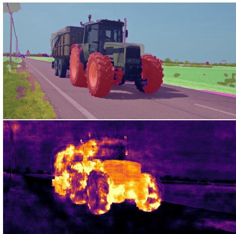
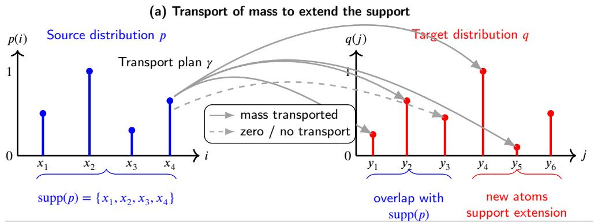
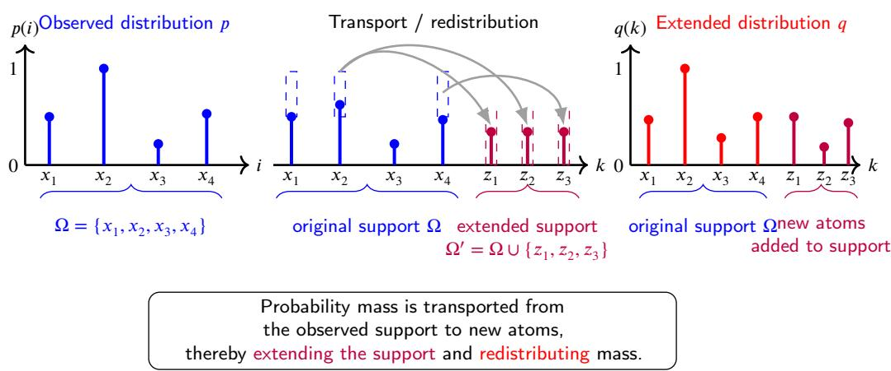
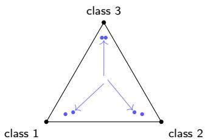
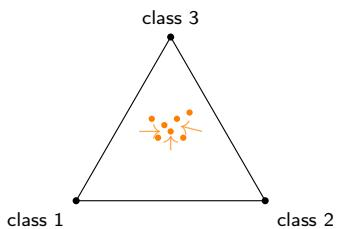
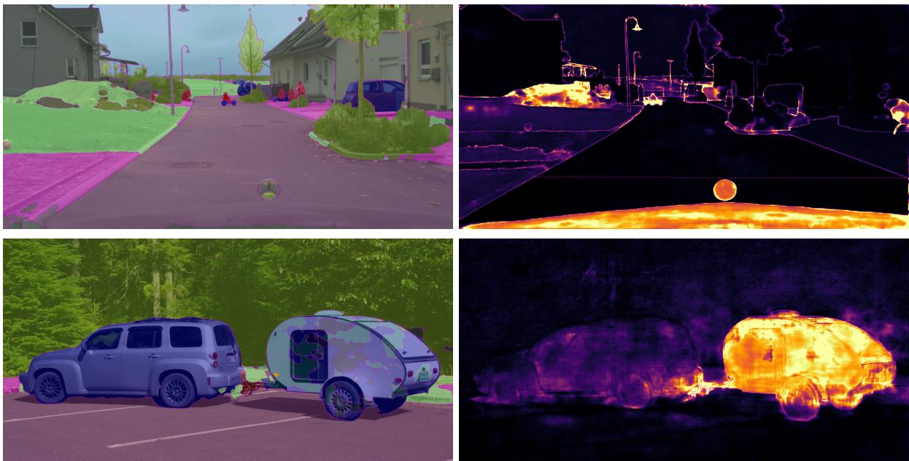

## Highlights

A Probabilistic Perspective on Wasserstein-Based Evidential Uncertainty for Out-of-Distribution Segmentation

Arnold Brosch, Abdelrahman Eldesokey, Michael Felsberg, Kira Maag

• Wasserstein objectives provide geometry-aware evidential OOD segmentation.

• The preferred Wasserstein order depends on the network architecture.

• Requires no auxiliary models, gradients, or additional OOD training data.

# A Probabilistic Perspective on Wasserstein-Based Evidential Uncertainty for Out-of-Distribution Segmentation

Arnold Broscha,∗, Abdelrahman Eldesokeyb, Michael Felsbergc and Kira Maaga

aHeinrich-Heine-University Düsseldorf, Universitätsstraße 1, 40225, Düsseldorf, Germany

bHamad Bin Khalifa University (HBKU), Education City, Gate 8, P.O. Box 5825, Doha, Qatar

cLinköping University, SE-581 83, Linköping, Sweden

## A R T I C L E I N F O

## A BS T R AC T

Semantic segmentation networks operate on a fixed set of classes and therefore fail when out-ofdistribution (OOD) objects appear during deployment, a critical limitation for safety-critical applications such as autonomous driving. Reliably identifying OOD objects requires well-calibrated epistemic uncertainty, yet common softmax-based confidence scores remain overconfident, while Bayesian alternatives such as Monte Carlo dropout or deep ensembles require costly repeated forward passes. Evidential Deep Learning (EDL) ofers an eficient alternative by modeling class probabilities as a Dirichlet distribution learned from a single deterministic forward pass. Existing EDL formulations rely on Euclidean objectives that push predictions towards the simplex vertices, encouraging overconfidence rather than preserving uncertainty for unfamiliar inputs. We instead employ Wasserstein-based objectives, which respect the geometry of the probability simplex, and study the influence of the Wasserstein order on segmentation accuracy and OOD detection within a unified evidential framework. We evaluate this framework on a convolutional (DeepLabV3+) and a transformer-based (SegFormer) architecture on the SegmentMeIfYouCan benchmark, including LostAndFound, RoadObstacle21, RoadAnomaly21, and Fishyscapes. Our results show the optimal Wasserstein order is architecturedependent: second-order objectives dominate on the convolutional backbone, third-order objectives on the transformer backbone, and our framework surpasses comparable baselines on most metrics, with a single deterministic forward pass.

Deep neural networks (DNNs) have become the dominant paradigm for a wide range of computer vision tasks, including image classification [20], object detection [43], and semantic segmentation [10]. Semantic segmentation aims to assign a semantic class label to every pixel of an image, thereby enabling dense scene understanding. In safety-critical domains such as autonomous driving, semantic segmentation constitutes a fundamental component of the perception pipeline, providing detailed information about the surrounding environment and supporting downstream planning and decision-making processes. Well performing architectures, including DeepLabV3+ [10] and SegFormer [52], have demonstrated strong performance on large-scale benchmarks and have significantly advanced the state-of-theart in semantic scene understanding.

Despite these advances, DNNs remain fundamentally constrained by the data used during training. Semantic segmentation models are typically trained on large annotated datasets that represent only a limited subset of the visual variability encountered in real-world environments. As a result, objects, structures, or scene configurations that are absent from the training distribution may occur during deployment. Such observations are commonly referred to as out-of-distribution (OOD) samples [8, 33]. When confronted with OOD objects, segmentation networks frequently exhibit a substantial degradation in performance and may assign highly confident but incorrect predictions to previously unseen content (see Fig. 1). In safety-critical applications, such behavior can have severe consequences, as unknown objects may be misclassified as semantically meaningful classes and consequently result in dangerous downstream decisions.

  
Figure 1: Top: Semantic segmentation by a deep neural network. Bottom: Evidential uncertainty heatmap obtained by our method. Brighter colors correspond to higher uncertainty.

The task of OOD segmentation therefore extends beyond accurate segmentation of known categories and additionally requires reliable identification of regions that do not belong to the learned training distribution. A central challenge in this context is the estimation of epistemic uncertainty, which arises from insuficient knowledge of the model rather than from noise inherent to the input data (i.e., aleatoric uncertainty). Ideally, segmentation models should express increased uncertainty whenever unfamiliar or ambiguous observations are encountered. However, uncertainty measures derived from softmax outputs, such as maximum softmax probability [22] or predictive entropy, are known to be poorly calibrated and often remain overconfident for OOD samples [21]. Bayesian approaches [35], including Monte Carlo Dropout [37] and Deep Ensembles [26], address this limitation by approximating posterior distributions over model parameters and thereby providing a principled framework for uncertainty estimation. Although these methods often improve uncertainty calibration, their reliance on multiple stochastic forward passes introduces substantial computational overhead, which can be prohibitive for dense prediction tasks on high-resolution images.

Evidential Deep Learning (EDL) [44] has emerged as a computationally eficient alternative for uncertainty-aware prediction. Rather than producing point estimates of class probabilities, EDL models the output as the parameters of a Dirichlet distribution and learns class-specific evidence values. The amount of accumulated evidence directly reflects the confidence of the model, while a lack of evidence naturally translates into increased uncertainty. Consequently, EDL enables uncertainty estimation from a single deterministic forward pass and provides an attractive compromise between predictive performance and computational eficiency. Furthermore, the explicit representation of uncertainty makes EDL particularly suitable for OOD detection scenarios, where insuficient evidence should indicate unfamiliar observations.

Most existing EDL approaches rely on Euclidean objectives, such as expected mean squared error (MSE), for optimizing the evidential distribution. While these objectives are analytically convenient, they do not explicitly account for the geometry of probability distributions and may encourage overconfident predictions. Recent work has therefore explored Wasserstein-based objectives as an alternative optimization criterion [7]. In contrast to conventional pointwise losses, Wasserstein distances measure discrepancies directly in the space of probability distributions and respect the underlying geometry of the probability simplex. This property has been shown to improve distributional alignment and may lead to better calibrated uncertainty estimates, particularly in the presence of distributional shifts [7]. The benefits of Wasserstein-based losses for uncertainty modeling have also been investigated in [53].

This work investigates the influence of the Wasserstein order on uncertainty-aware semantic segmentation and OOD segmentation. While first-order Wasserstein distances penalize discrepancies linearly, higher-order variants increasingly emphasize larger deviations between distributions. Consequently, diferent Wasserstein orders may induce different optimization dynamics and afect the balance between segmentation performance on in-distribution samples and uncertainty estimation for OOD observations. This motivates a systematic investigation of first-, second-, and third-order Wasserstein objectives $( W _ { 1 } , W _ { 2 }$ , and $W _ { 3 } )$ [40, 47] within a unified evidential learning framework. Due to diferent specific numerical limitations of expected values we add diferent regularization parameters. We add a MSE and Dice Loss term as well as KL-regularization.

In addition, uncertainty estimation is closely linked to the quality of the learned feature representation. It therefore remains unclear whether the behavior of Wasserstein-based evidential learning is independent of the underlying network architecture or whether it interacts with specific representationlearning mechanisms. To address this question, we evaluate the proposed approach on two fundamentally diferent segmentation architectures: DeepLabV3+, representing convolutional neural networks, and SegFormer, representing transformer-based architectures. While DeepLabV3+ primarily exploits local spatial correlations through hierarchical convolutional feature extraction, SegFormer leverages selfattention mechanisms to capture long-range contextual dependencies. Comparing both architectures provides insights into the relationship between feature representation, uncertainty estimation, and OOD robustness. The code is publicly available on https://github.com/A-Brosch/EDL-OOD-Segmentation.

The main contributions of this work are summarized as follows:

• We investigate Wasserstein-based EDL for uncertaintyaware semantic segmentation in the context of OOD detection.

• We provide a systematic comparison of diferent Wasserstein orders $( W _ { 1 } , W _ { 2 }$ , and $W _ { 3 } )$ and analyze their influence on segmentation performance, uncertainty calibration, and OOD segmentation capability.

• We study the interaction between Wasserstein-based evidential learning and network architecture by evaluating both a convolutional backbone (DeepLabV3+) and a transformer-based backbone (SegFormer).

• We conduct extensive experiments on established OOD segmentation benchmarks, including LostAndFound, RoadObstacle21, RoadAnomaly21, and Fishyscapes, and provide an empirical analysis of the resulting trade-ofs between in-distribution accuracy and OOD awareness.

## 2. Related Work

Existing approaches for OOD segmentation can be broadly grouped into four categories: uncertainty-based methods, feature-space methods, approaches leveraging auxiliary models, and methods that incorporate additional OOD data during training.

Methods Leveraging Auxiliary OOD or Synthetic Data. One line of research uses additional real OOD data during training to explicitly expose the segmentation model to samples outside the closed set of in-distribution classes [5, 15]. An early approach introduces an explicit void or anomaly class for supervision [4], while other works combine outlier exposure with dedicated loss functions and/or specialized network architectures. Examples include entropy maximization on OOD objects [9], energy-based abstention learning [46], hybrid discriminative-generative models [17], and contrastive objectives that learn more robust anomaly representations [32]. The paradigm is also extended to transformer-based mask-classification architectures, such as Mask2Anomaly [42] and EAM [18]. Recent methods increasingly leverage foundation models and vision-language models to obtain more robust representations for OOD segmentation [23, 36, 38, 55].

To reduce the dependence on real OOD samples, several methods instead generate synthetic negative data during training. For example, normalizing flows have been employed to synthesize outlier samples that serve as auxiliary supervision for OOD segmentation [6, 16, 19, 27]. Moreover, RbA [39] generates synthetic negatives and uses them to suppress the energy of OOD pixels, thereby improving the separation between in-distribution and OOD regions. UNO [12] combines negative-objectness scores obtained from synthetic outliers with uncertainty estimates to derive a more robust OOD score.

Auxiliary and Generative Reconstruction Models. The underlying assumption of a further group of methods is that regions from outside the training distribution are dificult to reconstruct or resynthesize faithfully. Besnier et al. [3] operationalize this assumption by training a separate observer network that predicts, from adversarially perturbed features, where the primary segmentation network is likely to fail. A closely related strategy resynthesizes the input image from its predicted segmentation and flags pixels where the resynthesis diverges strongly from the original [31]; variants of this idea restrict the comparison to locally inpainted patches [30], couple reconstruction and segmentation within a single joint model [48], or assess the reconstructability of individual image patches directly [50]. Beyond imagelevel reconstruction, structure-constrained learning distills structural knowledge from a teacher network into a student model, improving segmentation of unseen classes across OOD, zero-shot, and domain-adaptation settings [54].

Feature-Space Approaches. Rather than relying on the network’s predictive confidence, a third group of methods judges an input by where it falls within the learned feature space. cDNP [14] and PixOOD [49] estimate the in-distribution feature distribution non-parametrically or through class-conditional density models, treating pixels whose features fall outside the estimated support as anomalous. A related but distinct strategy fits an explicit density model with a normalizing flow: [6] trains such a flow directly on the feature embeddings and scores pixels by their negative log-likelihood, and FlowEneDet [19] applies the same principle to the energy scores of an already frozen, pretrained segmentation model. [45] takes a complementary route, modeling each known class as a Gaussian while jointly learning a binary anomaly decoder that exploits similarity between classes, whereas Maskomaly [1] requires no additional training at all, repurposing the mask embeddings of a pretrained panoptic network and flagging anomalies through irregularities in their class-agnostic properties.

Uncertainty-Based Methods. A fourth direction relies purely on the network’s own predictive behavior to flag OOD regions, without inspecting its internal features. The simplest such scores are read directly of the softmax output, most notably the maximum softmax probability [22] and predictive entropy, both of which are cheap to compute but tend to stay overconfident on unfamiliar inputs [44]. Sampling-based alternatives instead aggregate several stochastic forward passes, for instance via Monte Carlo Dropout [37] or Deep Ensembles [26], trading substantially higher inference cost for improved calibration. A cheaper route to a similarly informative signal exploits the gradients of the loss landscape with respect to hypothesized labels, as in pixel-wise gradient norms (PGN, [34]), while Mahalanobis [28] and ODIN [29] instead perturb the input itself to sharpen the separation between in- and out-of-distribution confidence scores. Most closely related to our own work, Evidential Deep Learning [44] departs from all of these by reformulating the output layer to directly parameterize a Dirichlet distribution over class probabilities, so that epistemic uncertainty can be read of from the accumulated evidence within a single deterministic forward pass [7].

Positioning of this Work. In contrast to the approaches discussed above, our method requires neither auxiliary architectures, additional OOD training data, nor feature-space postprocessing. Our approach belongs to the class of uncertaintybased OOD segmentation methods, as it derives uncertainty directly and deterministically from the evidential output of the segmentation network itself. Unlike sampling-based approaches such as MC Dropout or deep ensembles, our method requires only a single forward pass and does not rely on multiple stochastic predictions. Furthermore, in contrast to gradient-based or adversarial approaches, no additional backward passes or input perturbations are required. Therefore, our method is computationally closest to output-based uncertainty baselines such as maximum softmax probability.

Our own preliminary study established the general feasibility of Wasserstein-based evidential learning using a fixed first-order objective on a single convolutional architecture [7], and the present work extends this line of research along two axes. First, we systematically vary the order of the Wasserstein objective $( W _ { 1 } , W _ { 2 } , W _ { 3 } )$ to study its efect on the trade-of between in-distribution accuracy and OOD awareness. Second, we evaluate the resulting framework on both a convolutional architecture (DeepLabV3+) and a transformer-based architecture (SegFormer), which lets us disentangle properties of the objective from properties of the learned representation. In addition, we broaden the evaluation from LostAndFound, RoadObstacle21 and RoadAnomaly21 to the complete SegmentMeIfYouCan benchmark, including Fishyscapes.

  
(b) Mass redistribution when enlarging the support

  
Figure 2: Illustration of probability mass transport for support extension.

## 3. Method

Background: Optimal Transport and Wasserstein Distances. Our work builds on the mathematical theory of optimal transport, which studies the minimal cost of transforming one probability distribution into another with respect to a given ground metric [40, 47]. From a measure-theoretic perspective, the training procedure of a segmentation network implicitly defines a probability measure over thejoint space of image features and semantic labels, whose support is fixed by the finite collection of training instances and the label distribution observed during learning, so that the categories realized by this measure constitute the efective domain over which the network can make confident predictions. At deployment, however, the network is queried on inputs that may contain atoms outside this support, namely OOD objects that were never represented during training, so that the test distribution can be viewed as an extension of the training distribution by previously unseen atoms. This can be seen schematically in Fig. 2. Since any probability measure is normalized to unit total mass, accommodating these additional atoms is only possible by redistributing mass away from the atoms already present in the training support, and for an OOD input the network has no means of placing mass on the unseen atom directly, so this mismatch must instead be reflected in how the available mass is redistributed across the known atoms. This observation motivates casting OOD-aware prediction as a mass-transportation problem, for which optimal transport theory provides the natural mathematical language, characterizing the minimal cost of transforming one probability measure into another with respect to a chosen ground metric on the underlying space. Wasserstein distances instantiate this cost for probability distributions and thereby give a geometryaware notion of discrepancy that, in contrast to divergences such as the KL divergence or cross-entropy, remains welldefined and informative even for distributions with disjoint or only partially overlapping support [47, 40], precisely the regime in which OOD detection operates. This property has made Wasserstein distances attractive well beyond their origin in transportation theory. In deep learning, they have been popularized primarily through generative modeling, most notably the Wasserstein GAN [2], which replaces the Jensen-Shannon objective of the original GAN formulation with a Wasserstein critic to stabilize adversarial training, and through eficient approximate solvers such as entropic (Sinkhorn) regularization [40], which make optimal transport tractable at the scale required by deep networks. Closer to our setting, Wasserstein-based losses have also been proposed directly for supervised learning with structured or multi-label outputs [13], exploiting a predefined ground metric between classes to obtain gradients that respect semantic similarity rather than treating all misclassifications as equally costly. It has been shown further to behave beneficial regarding the modeling of uncertainty shown in [53]. Our work difers from these applications in that we do not use the Wasserstein distance to compare a generator distribution to real data or to encode class-level semantic similarity, but instead employ it, within the evidential framework, as a geometry-aware alternative to the Euclidean (MSE) objective for training the parameters of a Dirichlet distribution, following the formulation recently proposed for evidential segmentation in our preliminary study [7], and directly motivated by the support-extension view of OOD detection developed above.

Evidential Deep Learning. EDL provides an alternative to both conventional softmax-based confidence estimation and computationally expensive Bayesian inference. Instead of interpreting network outputs as a single categorical probability vector, EDL models a higher-order distribution over class probabilities [24, 44]. This allows the network to jointly represent class beliefs and epistemic uncertainty within a single deterministic forward pass. Consequently, EDL is particularly attractive for dense prediction tasks such as semantic segmentation, where Bayesian sampling approaches often become computationally expensive.

In semantic segmentation, each pixel � of an input image � is assigned a class label $y$ from a predefined set of classes $i \in \{ 1 , \ldots , C \}$

Given the corresponding logits $l _ { z } ,$ , the network obtains non-negative evidence $e _ { z }$ by applying the ReLU activation element-wise,

$$
e _ { z } = \mathrm { R e L U } ( l _ { z } ) = \mathrm { m a x } ( l _ { z } , 0 ) \mathrm { ~ . ~ }\tag{1}
$$

These evidence values parameterize a Dirichlet distribution

$$
S = \sum _ { i = 1 } ^ { C } e _ { i } + C = \sum _ { i = 1 } ^ { C } \alpha _ { i } , \alpha _ { i } = e _ { i } + 1 ,\tag{2}
$$

where the Dirichlet distribution can be interpreted as a distribution over categorical probability distributions. The expected class probability $p _ { i }$ and associated uncertainty $\boldsymbol { \nu }$ are given by

$$
p _ { i } = { \frac { \alpha _ { i } } { S } } \ , \qquad V = { \frac { C } { S } } \ .\tag{3}
$$

The quantity $S$ corresponds to the total accumulated evidence and therefore reflects the model’s confidence in its prediction. Large values of � indicate strong support for a particular class assignment and consequently low uncertainty, whereas small values correspond to ambiguous observations or regions insuficiently represented by the training data. The quantity � may further be interpreted as the concentration parameter of the Dirichlet distribution. Following the previous measure theoretic interpretation, a large � corresponds to the class assigned to the pixel lies within the support of the learned intraining distribution. Conversely, small values result in flatter distributions that indicate insuficient evidence and increased epistemic uncertainty. In this sense, EDL explicitly separates uncertainty arising from a lack of evidence from uncertainty caused by conflicting class beliefs. Since OOD objects are not part of the training distribution, they are expected to generate little evidence for any known class, naturally resulting in high uncertainty.

  
Figure 3: Illustration of the MSE efect on the probability simplex.

Unlike softmax probabilities, which are normalized regardless of the quality of the underlying representation, evidential predictions explicitly distinguish between confident decisions supported by strong evidence and uncertain decisions characterized by insuficient evidence. This distinction is crucial for OOD segmentation, where the objective is not only to classify known semantic categories but also to identify regions for which the model lacks suficient knowledge.

MSE Loss. Most existing EDL formulations employ Euclidean objectives such as the expected mean squared error (MSE) loss

$$
\mathcal { L } _ { \mathrm { M S E } _ { i } } = ( p _ { i } - y _ { i } ) ^ { 2 } + \frac { p _ { i } ( 1 - p _ { i } ) } { S + 1 } \ : \ : ,\tag{4}
$$

where $y _ { i }$ denotes the one-hot encoded ground-truth label. The second term corresponds to the variance of the Dirichlet distribution and allows the model to jointly minimize prediction error and predictive uncertainty. While this objective generally yields sharp semantic boundaries and strong indistribution segmentation performance, it also encourages predictions to move towards the vertices of the probability simplex, corresponding to highly confident one-hot decisions, see Fig. 3.

Although such behavior is desirable for in-distribution classification, it is less suitable for OOD detection, where uncertainty should be preserved whenever insuficient evidence is available. To address this limitation, we employ a Wasserstein-based objective that explicitly accounts for the geometry of probability distributions.

Wasserstein-based Loss. From a measure-theoretic perspective, the training procedure of a segmentation network implicitly defines a probability measure $\mu _ { \mathrm { t r a i n } }$ over the joint space of image features and semantic labels, whose support is determined by the finite collection of atoms, i.e., the training instances and the label distribution observed during learning. The categories realized by $\mu _ { \mathrm { t r a i n } }$ , together with the range of visual appearances associated with each category, thus constitute the efective domain over which the network can make confident predictions. During deployment, however, the network is queried on samples drawn from a distribution $\mu _ { \mathrm { t e s t } }$ that may contain atoms outside $\operatorname { s u p p } ( \mu _ { \mathrm { t r a i n } } )$ , namely OOD objects that were never represented during training. $\mu _ { \mathrm { t e s t } }$ can therefore be regarded as an extension of $\mu _ { \mathrm { t r a i n } }$ by previously unseen atoms.

Since any probability measure is normalized to unit total mass, accommodating these additional atoms is only possible by redistributing probability mass away from the atoms already present in $\operatorname { s u p p } ( \mu _ { \mathrm { t r a i n } } )$ . For an OOD input, however, the network has no means of placing any mass on the corresponding unseen atom directly. Instead, this mismatch must be reflected in how the available mass is distributed across the known atoms. This observation motivates casting OOD-aware prediction as a mass-transportation problem, for which optimal transport theory [40, 47] provides the natural mathematical language: it characterizes the minimal cost of transforming one probability measure into another with respect to a chosen ground metric on the underlying space. Wasserstein distances instantiate this cost for probability distributions and therefore provide a principled framework for uncertainty-aware OOD detection. Rather than being forced, as under a Euclidean objective, to concentrate the available mass on one of the known atoms, the network is encouraged to withhold this assignment whenever the accumulated evidence for the known atoms is insuficient to justify a confident decision, corresponding to a low total evidence � and hence a high uncertainty $\nu = C / S$ . Since OOD objects are precisely those inputs for which no known atom can absorb the assigned mass with suficient confidence, this construction directly connects the support-extension argument above to the increased epistemic uncertainty that motivates the remainder of this section.

The Wasserstein distance measures the minimal transport efort required to transform one probability distribution into another and therefore provides a geometry-aware notion of similarity. In contrast to Euclidean objectives, Wasserstein distances preserve information about the relative arrangement of probability mass and allow uncertainty to remain distributed across multiple classes when the available evidence is inconclusive.

Using the Dirac metric as transport cost, the Wasserstein loss simplifies to

$$
\mathcal { L } _ { w } = \mathbb { E } \left[ 1 - p _ { y } \right] \mathrm { ~ , ~ }\tag{5}
$$

where $p _ { y }$ denotes the predicted mean probability assigned to the ground-truth class. Note that using a unit transport cost corresponds to treating the support mismatch between distinct atoms as maximal. This choice is motivated by safety-critical applications, where failing to correctly identify OOD objects may lead to hazardous downstream decisions. Consequently, all probability mass assigned to incorrect atoms is penalized equally, encouraging uncertainty rather than overconfident misclassification. Geometrically, this results in smoother transitions within the probability simplex and avoids the aggressive evidence concentration typically induced by MSEbased objectives (see Fig. 4).

  
Figure 4: Illustration of the Wasserstein efect on the probability simplex.

A central contribution of this work is the investigation of the influence of the Wasserstein order on uncertainty-aware semantic segmentation. Previous Wasserstein-based EDL approaches [7] predominantly employ first-order Wasserstein distances and do not analyze the efect of alternative orders. The general �-Wasserstein distance is defined as,

$$
W _ { q } ( \mu , \nu ) = \left( \operatorname * { i n f } _ { \gamma \in \Gamma ( \mu , \nu ) } \int d ( x , y ) ^ { q } d \gamma ( x , y ) \right) ^ { 1 / q } ,\tag{6}
$$

where $\Gamma ( \mu , \nu )$ denotes the set of admissible transport plans and $d ( x , y )$ is the transport cost between two locations [40, 47]. The Wasserstein order determines the relative influence of large and small transport costs on the optimization objective. For transport costs normalized to the interval [0, 1], increasing the order progressively suppresses the contribution of small discrepancies while relatively amplifying larger mismatches. Consequently, higher-order Wasserstein objectives focus increasingly on substantial distributional deviations.

First-order Wasserstein distances $( W _ { 1 } )$ weight transport costs linearly and therefore remain sensitive to both small and large discrepancies between distributions. Higher-order variants such as $W _ { 2 }$ and $W _ { 3 }$ increasingly emphasize larger deviations while suppressing the influence of smaller ones.

In the context of OOD segmentation, this property may have important implications. OOD samples frequently induce predictive distributions that difer substantially from those observed for in-distribution data. By assigning greater importance to such large discrepancies, higher-order Wasserstein objectives may improve the separation between indistribution and OOD observations. Conversely, emphasizing large deviations too strongly may reduce sensitivity to subtle class-specific distinctions required for accurate semantic segmentation. This suggests the existence of an order-dependent trade-of between segmentation accuracy and uncertainty awareness.

From a geometric viewpoint, lower-order Wasserstein objectives preserve local structure within the probability simplex and therefore maintain sensitivity to subtle classspecific variations. Higher-order objectives, on the other hand, increasingly prioritize global distributional discrepancies. Determining how these competing efects influence uncertainty estimation and OOD detection constitutes one of the central research questions of this work.

Regularization Terms. While the Wasserstein loss improves uncertainty calibration, it does not explicitly account for the spatial structure of segmentation outputs. To promote spatial consistency and accurate object boundaries, we therefore include a Dice loss term

$$
{ \mathcal { L } } _ { \mathrm { D i c e } _ { i } } = 1 - { \frac { 2 \sum _ { z } p _ { i } ( z ) y _ { i } ( z ) } { \sum _ { z } p _ { i } ( z ) + \sum _ { z } y _ { i } ( z ) } } .\tag{7}
$$

Unlike pixel-wise objectives, the Dice loss operates on complete segmentation regions and therefore encourages coherent object shapes and improved overlap between predicted and ground-truth masks.

To further reduce overconfident predictions, particularly in ambiguous regions and OOD inputs, we employ a Kullback-Leibler regularization term

$$
\mathcal { L } _ { \mathrm { K L } } = \mathrm { K L } \left[ \mathrm { D i r } ( \alpha ) \| \mathrm { D i r } ( 1 ) \right] ~ ,\tag{8}
$$

with Dir referring to the Dirichlet distribution. This regularization encourages the predicted Dirichlet distribution to remain close to a non-informative uniform prior whenever insuficient evidence is available. In the evidential setting, this mechanism discourages unsupported evidence accumulation and prevents the model from assigning excessive confidence to observations for which little evidence exists. As a result, uncertain predictions are encouraged to collapse towards a vacuous prior distribution rather than towards arbitrary semantic classes, which is particularly beneficial in the presence of OOD objects. To avoid interfering with representation learning during the early training stages, the KL contribution is introduced gradually through an annealing schedule.

Loss Construction. The final training objective is defined as

$$
\begin{array} { r } { \mathcal { L } _ { \mathrm { t o t a l } } = \lambda _ { \mathcal { W } } \displaystyle \frac { 1 } { Z } \sum _ { z } \mathcal { L } _ { \mathcal { W } } + \lambda _ { \mathrm { D i c e } } \frac { 1 } { C } \sum _ { i = 1 } ^ { C } \mathcal { L } _ { \mathrm { D i c e } _ { i } } } \\ { + \lambda _ { \mathrm { K L } } \displaystyle \frac { 1 } { Z } \sum _ { z } \mathcal { L } _ { \mathrm { K L } } + \lambda _ { \mathrm { M S E } } \frac { 1 } { Z } \sum _ { z } \sum _ { i = 1 } ^ { C } \mathcal { L } _ { \mathrm { M S E } _ { i } } ~ , } \end{array}\tag{9}
$$

where � denotes the number of pixels and $\lambda _ { \mathcal { W } } , \lambda _ { \mathrm { D i c e } } , \lambda _ { \mathrm { K L } }$ and $\lambda _ { \mathrm { M S E } }$ control the relative contribution of the individual components. Although the Wasserstein loss serves as the primary optimization objective, we retain a small MSE contribution throughout training. Empirically, pure Wasserstein optimization occasionally leads to slower convergence and reduced segmentation accuracy. The MSE term therefore acts as a stabilizing component that preserves sharp semantic boundaries while the Wasserstein objective maintains uncertainty awareness. Overall, the proposed loss combines four complementary objectives: distributional alignment through Wasserstein optimization, structural consistency through Dice regularization, uncertainty calibration through KL regularization, and optimization stability through MSE supervision.

Although the proposed loss formulation is independent of the underlying segmentation architecture, the resulting uncertainty estimates may depend on the learned feature representations. We therefore evaluate the proposed framework on convolutional as well as on transformer-based architectures. This comparison allows us to assess whether the behavior induced by diferent Wasserstein orders generalizes across fundamentally diferent representation-learning paradigms.

## 4. Experiments

## 4.1. Experimental Setting

Datasets. For training, we employ the Cityscapes dataset [11], one of the standard benchmarks for semantic segmentation in urban street scenes. Cityscapes consists of 2, 975 finely annotated training and 500 validation images, captured in 50 diferent European cities under varying weather and illumination conditions. The dataset provides high-resolution images (1,024 × 2,048 pixels) with pixel-wise annotations for 19 semantic classes, including roads, sidewalks, buildings, vehicles, pedestrians, and trafic infrastructure. Owing to its diversity and annotation quality, Cityscapes has become the de facto standard training dataset for semantic segmentation in autonomous driving and serves as the in-distribution (ID) data throughout this work.

For evaluating OOD segmentation, we follow the oficial SegmentMeIfYouCan (SMIYC) benchmark [8], which comprises four complementary datasets covering diferent OOD scenarios. The LostAndFound (LAF) dataset [41] contains 1,203 real-world images recorded in urban driving environments with numerous small road obstacles, such as boxes, stones, tires, or plastic objects, deliberately placed on the roadway.

RoadObstacle21 [8] extends this setting by providing 412 images with substantially greater diversity in both obstacle categories and environmental conditions. In contrast to LostAndFound, the dataset contains a wider range of everyday objects and naturally occurring road hazards, including construction material, debris, furniture, and other unexpected obstacles, thereby improving the evaluation of real-world robustness.

The Fishyscapes LostAndFound dataset [6] comprises 100 validation images and 275 non-public test images, with refined pixel-wise annotations distinguishing between OOD objects, in-distribution background corresponding to Cityscapes classes, and void regions containing all other pixels.

RoadAnomaly21 [8] contains 100 carefully curated images depicting highly diverse anomalous situations that are largely absent from conventional training datasets. Rather than focusing solely on road obstacles, it includes unusual objects, animals, uncommon vehicles, and rare scene configurations, making it particularly suitable for evaluating the generalization capability of uncertainty-aware segmentation methods under severe distributional shifts.

Model Training. We evaluate the proposed loss formulation on both DeepLabV3+ [10] with a ResNet-50 backbone and

SegFormer [52]. DeepLabV3+ serves as a representative convolutional semantic segmentation architecture, which is commonly used in OOD segmentation literature [6, 7, 8], while SegFormer represents a transformer-based approach with a hierarchical encoder and lightweight decoder. Comparing both architectures allows us to assess whether the proposed Wasserstein-based evidential learning generalizes consistently across diferent segmentation paradigms.

Training is conducted with a batch size of 4 for 80K iterations for DeepLabV3+ and 160K iterations for Seg-Former, using the Adam optimizer [25] with a learning rate of $3 \cdot 1 0 ^ { - 4 }$ and a weight decay of $1 0 ^ { - 4 }$ . All experiments are performed on the Cityscapes training set and evaluated on the SegmentMeIfYouCan benchmark.

We run ablations on the weighting parameters � of our combined loss function, see (9). The KL regularization weight is increased linearly from 0 to $\lambda _ { \mathrm { K L } }$ between iterations 40K and 48K and then kept constant for the remainder of training. This annealing strategy allows the model to first learn discriminative semantic features while the learning rate is still relatively high and subsequently shifts the optimization focus towards uncertainty calibration and regularization. Without this scheduling, KL regularization tends to suppress evidence generation too early during training, resulting in reduced segmentation performance.

SegFormer-Specific Adaptation. When transferring the proposed loss formulation from DeepLabV3+ to SegFormer, we observed a fundamental diference in the logit distributions. While DeepLabV3+ produces logits in the range of approximately −550 to 1500, SegFormer logits are much more compressed, typically ranging from −30 to 5. As a consequence, around 12% of all pixels exhibit only negative logits. Since evidential deep learning derives the evidence values through a ReLU activation, these pixels receive zero evidence despite the model producing a valid segmentation prediction. This highlights the sensitivity of evidential learning to architecture-dependent logit calibration, an efect that has also been discussed for semantic segmentation models in [51]. To mitigate this issue, we replace the ReLU activation with Softplus when evaluating SegFormer logits, ensuring that all predictions contribute non-zero evidence while preserving the ordering of the logits. Compared to the standard Softplus function,

$$
\mathrm { s o f t p l u s } ( x ) = \mathrm { l n } ( 1 + e ^ { x } ) ,\tag{10}
$$

we use the following numerically stable version,

$$
\mathrm { s o f t p l u s } ( x ) = \operatorname* { m a x } ( x , 0 ) + \ln \left( 1 + e ^ { - | x | } \right) .\tag{11}
$$

Evaluation Metrics. To evaluate the OOD segmentation performance, we follow the oficial benchmark protocol and report both pixel-level and segment-level metrics. On the pixel-level, we use the area under the precision-recall curve (AuPRC) and the false positive rate at 95% true positive rate $( \mathrm { F P R } _ { 9 5 } )$ . AuPRC measures the overall separability between OOD and in-distribution pixels across all thresholds, whereas $\mathrm { F P R } _ { 9 5 }$ quantifies the number of incorrectly detected OOD pixels when maintaining a high true positive detection rate. The latter is particularly relevant in safety-critical applications, where excessive false alarms may negatively afect downstream decision systems.

On the segment-level, we report the averaged adjusted similarity-weighted intersection-over-union (sIoU), positive predictive value (PPV), and $F _ { 1 }$ score following the SegmentMeIfYouCan protocol. These metrics evaluate not only whether anomalous pixels are detected, but also whether complete anomalous objects are localized accurately. All segmentlevel measures are averaged across thresholds ranging from 0.25 to 0.75 with a step size of 0.05.

Furthermore, standard semantic segmentation performance is assessed using mean Intersection-over-Union (mIoU) on Cityscapes. Reporting both mIoU and OOD metrics allows us to analyze the trade-of between indistribution segmentation performance and uncertaintyaware OOD detection, which constitutes one of the primary objectives of this work.

## 4.2. Numerical Results

We conduct a series of experiments to systematically evaluate the proposed loss method. We first investigate diferent weightings of the individual loss components and analyze the influence of diferent Wasserstein orders $( W _ { 1 } , W _ { 2 }$ and $W _ { 3 } )$ . Subsequently, we evaluate the proposed formulation across diferent segmentation architectures to assess its general applicability. The results are given in Tables A.1– A.12, and some qualitative examples are shown in Fig. 5. Finally, we compare the resulting models against established OOD segmentation baselines to quantify their performance in OOD segmentation.

Individual loss components. We first analyze the individual loss components. Comparing pure MSE training $\begin{array} { r l } { \left( \lambda _ { \mathrm { M S E } } = \right. } \end{array}$ 1) against pure Wasserstein training $( \lambda _ { \mathcal { W } } = 1 )$ , pure Wasserstein training generally provides stronger OOD performance than pure MSE training. Although this advantage is not consistent across all datasets and architectures, for example, in Fishyscapes LostAndFound, the MSE loss is often stronger than Wasserstein, whereas in the other three datasets, the opposite is observed. Both objectives generally perform considerably worse when optimized individually compared to their combination in the proposed Wasserstein MSE formulation, indicating that the two objectives complement each other. Using the DeepLabV3+ with $W _ { 1 }$ configuration as a representative example (see Table A.1), adding this residual MSE contribution stabilizes training further. A weight of $\lambda _ { \mathrm { M S E } } = 0 . 4 5$ gives the best overall trade of on LostAndFound and RoadObstacle21, improving AuPRC on LAF to 53.2 over both the pure Wasserstein setting (47.5) and the pure MSE variant (25.7). We adopt this value as the reference for the remaining ablations in this configuration. Across the other Wasserstein orders and both architectures, an MSE weight between 0.40 and 0.50 remains consistently among the strongest choices, so this component generalizes well.

  
Figure 5: Left: Semantic segmentation prediction. Right: OOD heatmap obtained by our method using DeeplabV3+, $W _ { 2 }$ , 0.45MSE and 0.75Dice. The top images are from the LostAndFound dataset (a kid playing on the street next to a pile of rubble) and the bottom images from RoadAnomaly21 (a car with an attached caravan).

Introducing the Dice term markedly improves $\mathrm { F P R } _ { 9 5 }$ for $W _ { 1 }$ , reducing it from 23.2 at $\lambda _ { \mathrm { D i c e } } ~ = ~ 0$ to 17.6 on LostAndFound at $\lambda _ { \mathrm { D i c e } } = 0 . 7 5 .$ , while simultaneously raising sIoU and $\overline { { F _ { 1 } } }$ . Stronger Dice weighting $( \lambda _ { \mathrm { D i c e } } = 0 . 8 0 )$ reverses these gains and degrades performance across the board, confirming an optimal intermediate weighting for this order. The Dice regularization efect is less consistent across orders. For DeepLabV3+ with $W _ { 2 }$ and $W _ { 3 }$ , increasing $\lambda _ { \mathrm { D i c e } }$ does not reduce $\mathrm { F P R } _ { 9 5 }$ as clearly as for $W _ { 1 }$ , indicating that this particular benefit is order dependent rather than universal.

Adding annealed KL regularization on top of the Wasserstein Dice MSE combination has a comparatively small and dataset dependent efect throughout our ablations. Consistent with this small and inconsistent efect, the KL term is not required for the best trade of: for DeepLabV3+ with $W _ { 1 }$ order, the configuration $\lambda _ { \mathcal { W } } ~ = ~ 1 . 0 , ~ \lambda _ { \mathrm { M S E } } ~ = ~ 0 . 4 5$ $\lambda _ { \mathrm { D i c e } } = 0 . 7 5 , \lambda _ { \mathrm { K L } } = 0 . 0$ already provides the most robust compromise on LostAndFound (AuPRC 47.4, FPR 17.6, sIoU 26.6, PPV 41.1, $\overline { { F _ { 1 } } }$ 24.2), matching or exceeding the KL-regularized variants on the segmentation-quality metrics while attaining the lowest $\mathrm { F P R } _ { 9 5 }$ of all $W _ { 1 }$ configurations. The KL term therefore primarily serves to calibrate the indistribution predictions, as discussed below, rather than to improve OOD detection.

Wasserstein order. Instead of a trade of that holds uniformly across all datasets, architectures, and metrics, we find that the preferred Wasserstein order depends primarily on the backbone and, to a lesser extent, on the dataset.

On DeepLabV3+, second-order objectives are favored on three of the four benchmarks. $W _ { 2 }$ achieves the strongest LostAndFound detection with 62.9 AuPRC when combined with a Dice weight of 0.75, and it also achieves the best

RoadObstacle21 scores. On RoadAnomaly21, $W _ { 2 }$ reaches 57.9 AuPRC, clearly ahead of the best $W _ { 3 }$ configuration at 43.7 AuPRC. Only on Fishyscapes does $W _ { 3 }$ achieve a higher AuPRC than $W _ { 2 } ,$ and only by a small margin (20.4 compared to 18.0). In general, $W _ { 2 }$ is the preferred order on the convolutional backbone. Third-order objectives on DeepLabV3+ are additionally penalized in terms of false-positive rate: $\mathrm { F P R } _ { 9 5 }$ remains above 80% on both LostAndFound and RoadObstacle21 for the majority of $W _ { 3 }$ configurations, compared to 17.6% for the best $W _ { 1 }$ or $W _ { 2 }$ setting.

On SegFormer, the balance shifts toward the third order. $W _ { 3 }$ attains the best AuPRC on all four benchmarks, reaching 47.9 on LostAndFound, 42.1 on RoadObstacle21, 38.2 on Fishyscapes, and 64.5 on RoadAnomaly21. On the obstacle datasets (i.e., LostAndFound and RoadObstacle21), this lead is pronounced $( W _ { 3 }$ clearly ahead of both $W _ { 1 }$ and $W _ { 2 } )$ whereas on the two more diverse anomaly datasets the advantage of $W _ { 3 }$ over the best $W _ { 2 }$ configuration is small (64.5 versus $5 9 . 6$ on RoadAnomaly21, 38.2 versus 36.5 on Fishyscapes). To summarize, rather than a single globally optimal order, our results point to an architecture-dependent optimum, i.e., $W _ { 2 }$ is the preferred order for the convolutional backbone, with one exception on Fishyscapes, while $W _ { 3 }$ is preferred for the transformer backbone, most clearly on the obstacle datasets.

Architecture comparison. Beyond the choice of objective, we studied the interaction between Wasserstein-based evidential learning and the underlying network architecture by evaluating both a convolutional backbone (DeepLabV3+ with ResNet-50) and a transformer-based backbone (SegFormer).

Table 1  
OOD segmentation benchmark results for the LostAndFound and RoadObstacle21 dataset.
<table><tr><td rowspan="2"></td><td colspan="5">LostAndFound test-NoKnown</td><td colspan="5">RoadObstacle21</td></tr><tr><td>AuPRC ↑</td><td>↓  $\mathsf { F P R } _ { 9 5 }$ </td><td>sloU ↑</td><td>PPV↑</td><td> $\overline { { F _ { 1 } } } \uparrow$ </td><td>AuPRC ↑</td><td>↓  $\mathsf { F P R } _ { 9 5 }$ </td><td>sloU ↑</td><td>PPV ↑</td><td> $\overline { { F _ { 1 } } } \uparrow$ </td></tr><tr><td>Ensemble</td><td>2.9</td><td>82.0</td><td>6.7</td><td>7.6</td><td>2.7</td><td>1.1</td><td>77.2</td><td>8.6</td><td>4.7</td><td>1.3</td></tr><tr><td>MC Dropout</td><td>36.8</td><td>35.6</td><td>17.4</td><td>34.7</td><td>13.0</td><td>4.9</td><td>50.3</td><td>5.5</td><td>5.8</td><td>1.1</td></tr><tr><td>Maximum Softmax</td><td>30.1</td><td>33.2</td><td>14.2</td><td>62.2</td><td>10.3</td><td>15.7</td><td>16.6</td><td>19.7</td><td>15.9</td><td>6.3</td></tr><tr><td>Entropy</td><td>47.1</td><td>21.6</td><td>30.7</td><td>42.1</td><td>30.2</td><td>28.4</td><td>26.7</td><td>14.7</td><td>20.5</td><td>9.7</td></tr><tr><td>PGN</td><td>69.3</td><td>9.8</td><td>50.0</td><td>44.8</td><td>45.4</td><td>16.5</td><td>19.7</td><td>19.5</td><td>14.8</td><td>7.4</td></tr><tr><td>ODIN</td><td>52.9</td><td>30.0</td><td>39.8</td><td>49.3</td><td>34.5</td><td>22.1</td><td>15.3</td><td>21.6</td><td>18.5</td><td>9.4</td></tr><tr><td>Mahalanobis</td><td>55.0</td><td>12.9</td><td>33.8</td><td>31.7</td><td>22.1</td><td>20.9</td><td>13.1</td><td>13.5</td><td>21.8</td><td>4.7</td></tr><tr><td>Ours</td><td>62.9</td><td>49.0</td><td>21.1</td><td>54.5</td><td>27.1</td><td>7.1</td><td>53.9</td><td>7.4</td><td>8.9</td><td>2.8</td></tr></table>

Table 2  
OOD segmentation benchmark results for the Fishyscapes LostAndFound and RoadAnomaly21 dataset.
<table><tr><td rowspan="2"></td><td colspan="5">Fishyscapes LostAndFound</td><td colspan="5">RoadAnomaly21</td></tr><tr><td>AuPRC ↑</td><td> $\mathsf { F P R } _ { 9 5 }$  ↓</td><td>sloU ↑</td><td>PPV↑</td><td> $\overline { { F _ { 1 } } } \uparrow$ </td><td>AuPRC ↑</td><td> $\mathsf { F P R } _ { 9 5 } \downarrow$ </td><td>sloU ↑</td><td>PPV ↑</td><td> $\overline { { F _ { 1 } } } \uparrow$ </td></tr><tr><td>Ensemble</td><td>0.3</td><td>90.4</td><td>3.1</td><td>1.1</td><td>0.4</td><td>17.7</td><td>91.1</td><td>16.4</td><td>20.8</td><td>3.4</td></tr><tr><td>MC Dropout</td><td>14.4</td><td>47.8</td><td>4.8</td><td>18.1</td><td>4.3</td><td>28.9</td><td>69.5</td><td>20.5</td><td>17.3</td><td>4.3</td></tr><tr><td>Maximum Softmax</td><td>5.6</td><td>40.5</td><td>3.5</td><td>9.5</td><td>1.8</td><td>28.0</td><td>72.1</td><td>15.5</td><td>15.3</td><td>5.4</td></tr><tr><td>Entropy</td><td>15.8</td><td>36.1</td><td>7.5</td><td>16.3</td><td>8.6</td><td>30.0</td><td>73.0</td><td>17.8</td><td>15.6</td><td>5.1</td></tr><tr><td>PGN</td><td>26.9</td><td>36.6</td><td>14.8</td><td>29.6</td><td>16.5</td><td>42.8</td><td>56.4</td><td>25.8</td><td>21.8</td><td>9.7</td></tr><tr><td>ODIN</td><td>15.5</td><td>38.4</td><td>9.9</td><td>21.9</td><td>9.7</td><td>33.1</td><td>71.7</td><td>19.5</td><td>17.9</td><td>5.2</td></tr><tr><td>Mahalanobis</td><td>32.9</td><td>8.7</td><td>19.6</td><td>29.4</td><td>19.2</td><td>20.0</td><td>87.0</td><td>14.8</td><td>10.2</td><td>2.7</td></tr><tr><td>Ours</td><td>18.0</td><td>44.3</td><td>3.3</td><td>23.5</td><td>5.1</td><td>57.9</td><td>51.7</td><td>25.8</td><td>32.0</td><td>12.4</td></tr></table>

The architecture comparison shows that the optimal configuration difers between backbones, particularly with respect to the Wasserstein order DeepLabV3+ attains its best detection with $W _ { 2 }$ and comparatively strong Dice regularization, whereas SegFormer reaches its strongest results with $W _ { 3 }$ under light regularization. On RoadAnomaly21 the best Seg-Former configuration is a lean $\lambda _ { \mathrm { M S E } } = 0 . 4 0$ setup that reaches 64.5 AuPRC, the highest OOD detection score of the entire study. This suggests that the globally aggregated features of the transformer interact diferently with the emphasis on large distributional deviations, favoring higher-order objectives and requiring less residual MSE stabilization than the convolutional backbone. This backbone-dependent optimum is also reflected in a dataset specialization: SegFormer leads on three of the four OOD benchmarks, namely RoadObstacle21, Fishyscapes, and RoadAnomaly21, whereas DeepLabV3+ retains a clear advantage on LostAndFound, whose small, well-delineated on-road objects appear well matched to the local receptive fields of the CNN.

Comparison against baselines. We compare our method against 7 uncertainty-based baselines, i.e., sampling-based (Ensemble, MC Dropout), output-based (Maximum Softmax, Entropy), and adversarial samples/gradient-based methods (PGN, ODIN, Mahalanobis). The results for LostAndFound and RoadObstacle21 are given in Table 1, and for Fishyscapes and RoadAnomaly21 in Table 2. For all datasets we report a single, fixed DeepLabV3+ configuration rather than a permetric optimum, so that the comparison remains transparent and is not subject to post-hoc selection across the many logged configurations. Following our finding that $W _ { 2 }$ is the strongest order for the convolutional backbone on the obstacle benchmarks and remains highly competitive on the anomaly benchmarks, we use the second-order configuration $\lambda _ { \mathcal { W } , } = 1 . 0 , \lambda _ { \mathrm { M S E } } = 0 . 4 5 , \lambda _ { \mathrm { D i c e } } = 0 . 7 5 , \lambda _ { \mathrm { K L } } = 0 . 0 .$

While gradient- and adversarial-based methods achieve higher performance on RoadObstacle21 and Fishyscapes, our method reaches competitive results without requiring additional backward passes or input distortions. Compared to the uncertainty-based baselines, our approach outperforms most sampling-based methods while relying on a single forward pass rather than multiple stochastic samples. For instance, on RoadAnomaly21 our method surpasses the strongest baseline PGN in AuPRC (57.9 vs. 42.8) while requiring substantially lower computational overhead. This combination of strong anomaly-ranking performance and minimal inference cost makes the approach particularly well suited to safety-critical, resource-constrained deployment.

In-distribution performance. Table 3 reports the indistribution segmentation performance on the Cityscapes validation set, measured by the mean intersection over union (mIoU) over all 19 evaluation classes. The top row (Baseline) lists the corresponding cross-entropy models trained without any evidential objective (80.09% for DeepLabV3+ and 84.00% for SegFormer). Each remaining entry is written as $\mu _ { - a } ^ { + b } ,$ , where $\mu$ is the mean mIoU averaged over all lossweighting configurations $( \lambda _ { \mathrm { M S E } } , \lambda _ { \mathrm { D i c e } } ,$ and $\lambda _ { \mathrm { K L } } )$ evaluated for that order and architecture, and −� and +� give the largest downward and upward deviation from this mean across those configurations. The pair $( \mu - a , \ \mu + b )$ thus brackets the worst- and best-case in-distribution mIoU attained for the corresponding order, and the width $a + b$ quantifies how sensitive segmentation quality is to the loss weighting.

In-distribution evaluation on the Cityscapes dataset using mIoU. The rows correspond to the three Wasserstein orders $W _ { 1 }$ $W _ { 2 } ,$ , and $W _ { 3 } ,$ and the two columns to the DeepLabV3+ and SegFormer backbones. +� and −� describe the size to the largest and smallest deviation respectively.
<table><tr><td></td><td></td><td>DeepLabV3+ SegFormer</td></tr><tr><td>Baseline</td><td>80.09</td><td>84.00</td></tr><tr><td> $W _ { 1 }$ </td><td> $6 7 . 6 7 _ { - 1 5 . 5 5 } ^ { + 9 . 4 3 }$ </td><td> $8 0 . 6 1 _ { - 0 . 2 4 } ^ { + 0 . 2 7 }$ </td></tr><tr><td> $W _ { 2 }$ </td><td> $5 6 . 1 4 _ { - 5 . 0 1 } ^ { + 6 . 5 3 }$ </td><td> $8 0 . 6 0 _ { - 0 . 4 4 } ^ { + 0 . 3 8 }$ </td></tr><tr><td> $W _ { 3 }$ </td><td> $6 6 . 8 8 _ { - 1 1 . 0 4 } ^ { + 9 . 4 6 }$ </td><td> $8 0 . 5 4 _ { - 0 . 3 6 } ^ { + 0 . 2 0 }$ </td></tr></table>

The two architectures behave fundamentally diferently. SegFormer is remarkably stable: the average mIoU stays within a narrow band of 80.54%–80.61% across all three orders, and every configuration remains above 80.09%, regardless of order or loss weighting, so that in-distribution accuracy is essentially preserved throughout the entire ablation. This indicates that the in-distribution accuracy of SegFormer is essentially decoupled from the specific choice of Wasserstein order and from the surrounding regularization. Thus, the substantial diferences in OOD detection performance observed across SegFormer configurations are therefore obtained without any measurable cost to segmentation quality, making the backbone comparatively robust and straightforward to calibrate.

DeepLabV3+ exhibits diferent behavior. Average mIoU varies considerably across orders, from 67.67% for $W _ { 1 }$ down to 56.14% for $W _ { 2 }$ and back up to 66.88% for $W _ { 3 }$ an 11 percentage point drop for the very order that we identified as the strongest choice for OOD detection on this backbone. Within each order, the spread between the weakest and strongest loss-weighting configuration is an order of magnitude larger than for SegFormer, reaching 24.98 percentage points for $W _ { 1 }$ (range [52.12%, 77.10%]) and 20.50 points for $W _ { 3 }$ (range [55.84%, 76.34%]). Even $W _ { 2 } ,$ the most stable order on this backbone, still spans 11.53 points ([51.13%, 62.66%]). This sensitivity indicates that DeepLabV3+ segmentation quality is tightly entangled with the choice of Dice, KL, and residual MSE weighting, so that a loss configuration selected for strong OOD detection can incur a substantial and dificult-to-predict penalty in indistribution accuracy, in contrast to SegFormer, where the two objectives can efectively be tuned independently.

Relative to the cross-entropy baselines, evidential training does incur a cost in in-distribution accuracy, but its magnitude again depends strongly on the architecture. On SegFormer the reduction is modest and uniform: the mean mIoU drops from the baseline’s 84.00% to roughly 80.5–80.6%, a loss of about 3.4 percentage points that is virtually independent of the Wasserstein order and the loss weighting. On DeepLabV3+ the average reduction is larger and highly configuration dependent, from a baseline of 80.09% down to mean values between 56% and 68%, although the best individual configurations per order remain much closer to the baseline (up to 77.10% for $W _ { 1 }$ and 76.34% for $W _ { 3 } )$ . Crucially, this indistribution penalty is accompanied by a substantial gain in OOD performance: the same evidential models improve OOD detection over the corresponding cross-entropy and samplingbased baselines by large margins, most notably on the diverse anomaly benchmarks (Tables 1 and 2). Thus, our method trades a comparatively small and, for SegFormer, nearly negligible decrease in in-distribution segmentation quality for a markedly stronger ability to flag OOD objects, which is precisely the trade of desired in safety-critical perception.

## 5. Conclusion

This work introduced a Wasserstein based evidential framework for OOD segmentation. Interpreting OOD objects as missing support in the training distribution motivates a geometry aware loss that avoids the overconfidence encouraged by Euclidean MSE. Our ablations show that Wasserstein, Dice, and annealed KL regularization are complementary, with Dice providing the clearest reduction in $\mathrm { F P R } _ { 9 5 }$

The preferred Wasserstein order depends on the backbone. For DeepLabV3+, $W _ { 2 }$ achieves the strongest overall detection on three of four benchmarks and is therefore the most reliable default. For SegFormer, replacing ReLU with softplus resolves missing evidence caused by predominantly negative logits. With this adaptation, SegFormer leads on RoadObstacle21, RoadAnomaly21, and Fishyscapes, while DeepLabV3+ remains stronger on LostAndFound. These results show that evidence activation and transport order should be selected jointly with the architecture.

Across LostAndFound and RoadObstacle21, the proposed method outperforms the evaluated deterministic and sampling based baselines on most comparisons, with particularly clear gains on RoadObstacle21. It requires only a single deterministic forward pass and no auxiliary models, gradient access, or additional OOD training data.

The current Dirac transport cost assigns equal cost to all class confusions, and the analysis is limited to integer Wasserstein orders. Future work can investigate learned semantic cost matrices, fractional orders, architecture specific evidence mappings, and extensions to open vocabulary and video segmentation.

## Funding

M. Felsberg was partially supported by the Swedish Research Council through the project 2022-04266 and by Linkoping University through the Center of Excellence AI4x. The funders had no role in the study design, data collection and analysis, preparation of the manuscript, or decision to submit the work.

## Data and code availability

The source code and experimental configurations used in this study are publicly available at https://github.com/ A-Brosch/EDL-OOD-Segmentation. No new datasets were generated in this study. All datasets used for training and evaluation are publicly available from their respective benchmark providers and are cited in the manuscript.

## Declaration of competing interest

The authors declare that they have no known competing financial interests or personal relationships that could have appeared to influence the work reported in this paper.

## A. More Numerical Results

This section contains all the numerical results in tabular form for the various parameter configurations.

Table A.1  
OOD segmentation results for LostAndFound and RoadObstacle21 using DeepLabV3+ with Wasserstein order $W _ { 1 }$
<table><tr><td></td><td></td><td></td><td></td><td colspan="5">LostAndFound test-NoKnown</td><td colspan="5">RoadObstacle21</td></tr><tr><td> $\lambda _ { w 1 }$ </td><td> $\lambda _ { \mathrm { D i c e } }$ </td><td> $\lambda _ { \mathsf { K L } }$ </td><td> $\lambda _ {  { \mathrm { M S E } } }$ </td><td>AuPRC ↑</td><td> $\mathsf { F P R } _ { 9 5 } \mathrm { ~ J ~ }$  入</td><td>sloU ↑</td><td>PPV ↑</td><td> $\overline { { F _ { 1 } } } \uparrow$ </td><td> $\mathsf { A u P R C } \uparrow$  1</td><td> $\mathsf { F P R } _ { 9 5 }$  ↓</td><td>sloU ↑</td><td>PPV ↑</td><td> $\overline { { F _ { 1 } } } \uparrow$ </td></tr><tr><td>0.00</td><td>0.00</td><td>0.00</td><td>1.00</td><td>25.7</td><td>56.8</td><td>25.9</td><td>27.7</td><td>14.6</td><td>1.6</td><td>62.1</td><td>18.5</td><td>5.6</td><td>2.0</td></tr><tr><td>1.00</td><td>0.00</td><td>0.00</td><td>0.00</td><td>47.5</td><td>27.4</td><td>21.5</td><td>39.2</td><td>19.7</td><td>4.1</td><td>66.0</td><td>6.9</td><td>8.5</td><td>2.0</td></tr><tr><td>1.00</td><td>0.00</td><td>0.00</td><td>0.40</td><td>50.4</td><td>25.8</td><td>21.2</td><td>38.0</td><td>19.2</td><td>30.7</td><td>42.3</td><td>11.6</td><td>26.4</td><td>8.7</td></tr><tr><td>1.00</td><td>0.00</td><td>0.00</td><td>0.45</td><td>53.2</td><td>23.2</td><td>25.3</td><td>37.7</td><td>20.7</td><td>20.2</td><td>31.2</td><td>11.0</td><td>18.3</td><td>5.8</td></tr><tr><td>1.00</td><td>0.00</td><td>0.00</td><td>0.50</td><td>44.4</td><td>30.5</td><td>25.2</td><td>42.8</td><td>23.6</td><td>12.2</td><td>32.6</td><td>3.6</td><td>34.0</td><td>3.4</td></tr><tr><td>1.00</td><td>0.70</td><td>0.00</td><td>0.45</td><td>39.3</td><td>36.1</td><td>23.4</td><td>41.0</td><td>20.9</td><td>11.7</td><td>58.7</td><td>17.2</td><td>14.9</td><td>7.3</td></tr><tr><td>1.00</td><td>0.75</td><td>0.00</td><td>0.45</td><td>47.4</td><td>17.6</td><td>26.6</td><td>41.1</td><td>24.2</td><td>8.8</td><td>35.3</td><td>12.1</td><td>14.2</td><td>5.3</td></tr><tr><td>1.00</td><td>0.80</td><td>0.00</td><td>0.45</td><td>27.0</td><td>39.8</td><td>14.7</td><td>25.3</td><td>8.7</td><td>3.3</td><td>63.1</td><td>5.0</td><td>9.1</td><td>1.3</td></tr><tr><td>1.00</td><td>0.75</td><td>0.10</td><td>0.45</td><td>42.1</td><td>25.5</td><td>19.8</td><td>36.2</td><td>16.3</td><td>2.8</td><td>51.1</td><td>10.4</td><td>7.4</td><td>2.7</td></tr><tr><td>1.00</td><td>0.75</td><td>0.15</td><td>0.45</td><td>53.6</td><td>31.6</td><td>23.4</td><td>38.8</td><td>22.1</td><td>2.8</td><td>51.1</td><td>10.4</td><td>7.4</td><td>2.7</td></tr><tr><td>1.00</td><td>0.75</td><td>0.20</td><td>0.45</td><td>49.1</td><td>38.2</td><td>21.9</td><td>37.5</td><td>20.1</td><td>4.9</td><td>39.0</td><td>16.2</td><td>5.4</td><td>2.7</td></tr></table>

Table A.2  
OOD segmentation results for LostAndFound and RoadObstacle21using DeepLabV3+ with Wasserstein order $W _ { 2 }$
<table><tr><td></td><td></td><td></td><td></td><td colspan="5">LostAndFound test-NoKnown</td><td colspan="5">RoadObstacle21</td></tr><tr><td> $\lambda _ { w 2 }$ </td><td> $\lambda _ { \mathrm { D i c e } }$ </td><td> $\lambda _ { \mathsf { K L } }$ </td><td> $\lambda _ {  { \mathrm { M S E } } }$ </td><td>AuPRC ↑</td><td> $\mathsf { F P R } _ { 9 5 } \downarrow$ </td><td>sloU ↑</td><td>PPV ↑</td><td> $\overline { { F _ { 1 } } } \uparrow$ </td><td>AuPRC ↑</td><td>↓  $\mathsf { F P R } _ { 9 5 }$ </td><td>sloU ↑</td><td>PPV ↑</td><td> $\overline { { F _ { 1 } } } \uparrow$ </td></tr><tr><td>0.00</td><td>0.00</td><td>0.00</td><td>1.00</td><td>25.7</td><td>56.8</td><td>25.9</td><td>27.7</td><td>14.6</td><td>1.6</td><td>62.1</td><td>18.5</td><td>5.6</td><td>2.0</td></tr><tr><td>1.00</td><td>0.00</td><td>0.00</td><td>0.00</td><td>43.8</td><td>38.9</td><td>18.9</td><td>53.9</td><td>21.6</td><td>1.1</td><td>44.5</td><td>14.1</td><td>3.6</td><td>1.7</td></tr><tr><td>1.00</td><td>0.00</td><td>0.00</td><td>0.40</td><td>50.4</td><td>36.9</td><td>18.2</td><td>45.3</td><td>20.3</td><td>13.7</td><td>53.9</td><td>8.0</td><td>15.2</td><td>3.3</td></tr><tr><td>1.00</td><td>0.00</td><td>0.00</td><td>0.45</td><td>46.1</td><td>47.6</td><td>22.7</td><td>53.2</td><td>26.3</td><td>13.5</td><td>40.9</td><td>7.2</td><td>20.6</td><td>4.4</td></tr><tr><td>1.00</td><td>0.00</td><td>0.00</td><td>0.45</td><td>48.8</td><td>38.9</td><td>17.0</td><td>44.4</td><td>18.4</td><td>17.2</td><td>49.9</td><td>6.4</td><td>13.7</td><td>3.0</td></tr><tr><td>1.00</td><td>0.70</td><td>0.00</td><td>0.45</td><td>47.5</td><td>35.0</td><td>23.5</td><td>44.4</td><td>25.9</td><td>13.5</td><td>30.7</td><td>11.2</td><td>22.0</td><td>7.0</td></tr><tr><td>1.00</td><td>0.75</td><td>0.00</td><td>0.45</td><td>62.9</td><td>49.0</td><td>21.1</td><td>54.5</td><td>27.1</td><td>7.1</td><td>53.9</td><td>7.4</td><td>8.9</td><td>2.8</td></tr><tr><td>1.00</td><td>0.80</td><td>0.00</td><td>0.45</td><td>27.4</td><td>52.1</td><td>12.9</td><td>35.2</td><td>12.6</td><td>18.7</td><td>63.0</td><td>16.4</td><td>20.4</td><td>9.2</td></tr><tr><td>1.00</td><td>0.75</td><td>0.10</td><td>0.50</td><td>19.5</td><td>47.5</td><td>10.8</td><td>26.7</td><td>8.8</td><td>2.4</td><td>95.9</td><td>8.8</td><td>4.0</td><td>1.8</td></tr><tr><td>1.00</td><td>0.75</td><td>0.15</td><td>0.50</td><td>6.4</td><td>69.7</td><td>10.1</td><td>13.4</td><td>4.5</td><td>2.8</td><td>38.0</td><td>14.2</td><td>6.5</td><td>2.1</td></tr><tr><td>1.00</td><td>0.75</td><td>0.20</td><td>0.50</td><td>36.5</td><td>51.8</td><td>14.1</td><td>40.0</td><td>14.0</td><td>1.4</td><td>65.5</td><td>9.6</td><td>5.1</td><td>2.0</td></tr></table>

Table A.3  
OOD segmentation results for LostAndFound and RoadObstacle21using DeepLabV3+ with Wasserstein order $W _ { 3 } .$

<table><tr><td></td><td></td><td></td><td></td><td colspan="5">LostAndFound test-NoKnown</td><td colspan="5">RoadObstacle21</td></tr><tr><td> $\lambda _ { w 3 }$ </td><td> $\lambda _ { \mathrm { D i c e } }$ </td><td> $\lambda _ { \mathsf { K L } }$ </td><td> $\lambda _ {  { \mathrm { M S E } } }$ </td><td>AuPRC ↑</td><td>→  $\mathsf { F P R } _ { 9 5 }$ </td><td>sloU ↑</td><td>PPV ↑</td><td> $\overline { { F _ { 1 } } } \uparrow$ </td><td>AuPRC ↑</td><td>↓  $\mathsf { F P R } _ { 9 5 }$ </td><td>sloU ↑</td><td>PPV ↑</td><td> $\overline { { F _ { 1 } } } \uparrow$ </td></tr><tr><td>0.00</td><td>0.00</td><td>0.00</td><td>1.00</td><td>25.7</td><td>56.8</td><td>25.9</td><td>27.7</td><td>14.6</td><td>1.6</td><td>62.1</td><td>18.5</td><td>5.6</td><td>2.0</td></tr><tr><td>1.00</td><td>0.00</td><td>0.00</td><td>0.00</td><td>34.0</td><td>88.1</td><td>13.8</td><td>40.1</td><td>17.0</td><td>12.0</td><td>74.1</td><td>8.4</td><td>18.6</td><td>5.2</td></tr><tr><td>1.00</td><td>0.00</td><td>0.00</td><td>0.40</td><td>10.5</td><td>93.2</td><td>1.3</td><td>12.0</td><td>1.2</td><td>13.7</td><td>50.6</td><td>4.7</td><td>19.3</td><td>3.8</td></tr><tr><td>1.00</td><td>0.00</td><td>0.00</td><td>0.45</td><td>12.6</td><td>89.5</td><td>8.4</td><td>23.5</td><td>8.0</td><td>2.8</td><td>63.1</td><td>5.0</td><td>6.4</td><td>1.9</td></tr><tr><td>1.00</td><td>0.00</td><td>0.00</td><td>0.50</td><td>11.7</td><td>84.9</td><td>2.1</td><td>10.6</td><td>1.6</td><td>5.4</td><td>73.7</td><td>2.9</td><td>6.0</td><td>1.4</td></tr><tr><td>1.00</td><td>0.70</td><td>0.00</td><td>0.45</td><td>15.5</td><td>86.2</td><td>4.3</td><td>16.9</td><td>3.4</td><td>2.4</td><td>82.6</td><td>3.4</td><td>5.3</td><td>0.7</td></tr><tr><td>1.00</td><td>0.75</td><td>0.00</td><td>0.45</td><td>15.0</td><td>92.8</td><td>3.5</td><td>13.4</td><td>2.7</td><td>3.8</td><td>82.8</td><td>4.8</td><td>6.9</td><td>1.1</td></tr><tr><td>1.00</td><td>0.80</td><td>0.00</td><td>0.45</td><td>46.3</td><td>82.7</td><td>13.9</td><td>42.8</td><td>17.1</td><td>1.4</td><td>59.8</td><td>4.7</td><td>4.1</td><td>1.0</td></tr><tr><td>1.00</td><td>0.75</td><td>0.10</td><td>0.45</td><td>9.5</td><td>93.4</td><td>2.6</td><td>15.1</td><td>1.6</td><td>1.4</td><td>90.1</td><td>3.5</td><td>2.5</td><td>0.3</td></tr><tr><td>1.00</td><td>0.75</td><td>0.15</td><td>0.45</td><td>33.8</td><td>83.4</td><td>10.2</td><td>27.8</td><td>9.5</td><td>5.8</td><td>54.6</td><td>4.8</td><td>10.4</td><td>1.7</td></tr><tr><td>1.00</td><td>0.75</td><td>0.20</td><td>0.45</td><td>7.0</td><td>89.0</td><td>6.2</td><td>14.4</td><td>4.0</td><td>7.4</td><td>81.5</td><td>5.4</td><td>9.2</td><td>1.9</td></tr></table>

Table A.4  
OOD segmentation results for Fishyscapes and RoadAnomaly21 using DeepLabV3+ with Wasserstein order $W _ { 1 } .$
<table><tr><td></td><td></td><td></td><td></td><td colspan="5">Fishyscapes LostAndFound</td><td colspan="5">RoadAnomaly21</td></tr><tr><td> $\lambda _ { w 1 }$ </td><td> $\lambda _ { \mathrm { D i c e } }$ </td><td> $\lambda _ { \mathsf { K L } }$ </td><td> $\lambda _ {  { \mathrm { M S E } } }$ </td><td>AuPRC ↑</td><td> $\mathsf { F P R } _ { 9 5 } \mathrm { ~ , ~ }$  1</td><td>sloU ↑</td><td>PPV ↑</td><td> $\overline { { F _ { 1 } } } \uparrow$ </td><td> $\mathsf { A u P R C } \mathrm { ~ , ~ }$  ←</td><td> $\mathsf { F P R } _ { 9 5 }$  ↓</td><td>sloU ↑</td><td>PPV ↑</td><td> $\overline { { F _ { 1 } } } \uparrow$ </td></tr><tr><td>0.00</td><td>0.00</td><td>0.00</td><td>1.00</td><td>25.7</td><td>56.8</td><td>25.9</td><td>27.7</td><td>14.6</td><td>1.6</td><td>62.1</td><td>18.5</td><td>5.6</td><td>2.0</td></tr><tr><td>1.00</td><td>0.00</td><td>0.00</td><td>0.00</td><td>47.5</td><td>27.4</td><td>21.5</td><td>39.2</td><td>19.7</td><td>4.1</td><td>66.0</td><td>6.9</td><td>8.5</td><td>2.0</td></tr><tr><td>1.00</td><td>0.00</td><td>0.00</td><td>0.40</td><td>50.4</td><td>25.8</td><td>21.2</td><td>38.0</td><td>19.2</td><td>30.7</td><td>42.3</td><td>11.6</td><td>26.4</td><td>8.7</td></tr><tr><td>1.00</td><td>0.00</td><td>0.00</td><td>0.45</td><td>53.2</td><td>23.2</td><td>25.3</td><td>37.7</td><td>20.7</td><td>20.2</td><td>31.2</td><td>11.0</td><td>18.3</td><td>5.8</td></tr><tr><td>1.00</td><td>0.00</td><td>0.00</td><td>0.50</td><td>44.4</td><td>30.5</td><td>25.2</td><td>42.8</td><td>23.6</td><td>12.2</td><td>32.6</td><td>3.6</td><td>34.0</td><td>3.4</td></tr><tr><td>1.00</td><td>0.70</td><td>0.00</td><td>0.45</td><td>39.3</td><td>36.1</td><td>23.4</td><td>41.0</td><td>20.9</td><td>11.7</td><td>58.7</td><td>17.2</td><td>14.9</td><td>7.3</td></tr><tr><td>1.00</td><td>0.75</td><td>0.00</td><td>0.45</td><td>47.4</td><td>17.6</td><td>26.6</td><td>41.1</td><td>24.2</td><td>8.8</td><td>35.3</td><td>12.1</td><td>14.2</td><td>5.3</td></tr><tr><td>1.00</td><td>0.80</td><td>0.00</td><td>0.45</td><td>27.0</td><td>39.8</td><td>14.7</td><td>25.3</td><td>8.7</td><td>3.3</td><td>63.1</td><td>5.0</td><td>9.1</td><td>1.3</td></tr><tr><td>1.00</td><td>0.75</td><td>0.10</td><td>0.45</td><td>42.1</td><td>25.5</td><td>19.8</td><td>36.2</td><td>16.3</td><td>2.8</td><td>51.1</td><td>10.4</td><td>7.4</td><td>2.7</td></tr><tr><td>1.00</td><td>0.75</td><td>0.15</td><td>0.45</td><td>53.6</td><td>31.6</td><td>23.4</td><td>38.8</td><td>22.1</td><td>2.8</td><td>51.1</td><td>10.4</td><td>7.4</td><td>2.7</td></tr><tr><td>1.00</td><td>0.75</td><td>0.20</td><td>0.45</td><td>49.1</td><td>38.2</td><td>21.9</td><td>37.5</td><td>20.1</td><td>4.9</td><td>39.0</td><td>16.2</td><td>5.4</td><td>2.7</td></tr></table>

Table A.5  
OOD segmentation results for Fishyscapes and RoadAnomaly21 using DeepLabV3+ with Wasserstein order $W _ { 2 } .$
<table><tr><td></td><td></td><td></td><td></td><td colspan="5">Fishyscapes LostAndFound</td><td colspan="5">RoadAnomaly21</td></tr><tr><td> $\lambda _ { w 2 }$ </td><td> $\lambda _ { \mathrm { D i c e } }$ </td><td> $\lambda _ { \mathsf { K L } }$ </td><td> $\lambda _ {  { \mathrm { M S E } } }$ </td><td>AuPRC ↑</td><td> $\mathsf { F P R } _ { 9 5 } \downarrow$ </td><td>sloU ↑</td><td>PPV ↑</td><td> $\overline { { F _ { 1 } } } \uparrow$ </td><td>AuPRC ↑</td><td>↓  $\mathsf { F P R } _ { 9 5 }$ </td><td>sloU ↑</td><td>PPV ↑</td><td> $\overline { { F _ { 1 } } } \uparrow$ </td></tr><tr><td>0.00</td><td>0.00</td><td>0.00</td><td>1.00</td><td>25.7</td><td>56.8</td><td>25.9</td><td>27.7</td><td>14.6</td><td>1.6</td><td>62.1</td><td>18.5</td><td>5.6</td><td>2.0</td></tr><tr><td>1.00</td><td>0.00</td><td>0.00</td><td>0.00</td><td>4.6</td><td>53.6</td><td>7.1</td><td>12.6</td><td>9.2</td><td>33.0</td><td>60.3</td><td>21.1</td><td>19.5</td><td>5.0</td></tr><tr><td>1.00</td><td>0.00</td><td>0.00</td><td>0.40</td><td>10.1</td><td>38.4</td><td>4.6</td><td>20.8</td><td>4.2</td><td>50.3</td><td>57.9</td><td>20.0</td><td>22.6</td><td>5.6</td></tr><tr><td>1.00</td><td>0.00</td><td>0.00</td><td>0.45</td><td>2.5</td><td>42.0</td><td>11.0</td><td>11.8</td><td>7.3</td><td>42.9</td><td>59.2</td><td>18.9</td><td>23.5</td><td>6.0</td></tr><tr><td>1.00</td><td>0.00</td><td>0.00</td><td>0.50</td><td>3.9</td><td>46.5</td><td>8.5</td><td>10.4</td><td>6.9</td><td>35.6</td><td>65.2</td><td>23.4</td><td>20.3</td><td>6.8</td></tr><tr><td>1.00</td><td>0.70</td><td>0.00</td><td>0.45</td><td>3.4</td><td>44.7</td><td>12.0</td><td>16.3</td><td>8.7</td><td>54.6</td><td>49.4</td><td>20.5</td><td>28.5</td><td>8.6</td></tr><tr><td>1.00</td><td>0.75</td><td>0.00</td><td>0.45</td><td>18.0</td><td>44.3</td><td>3.3</td><td>23.5</td><td>5.1</td><td>57.9</td><td>51.7</td><td>25.8</td><td>32.0</td><td>12.4</td></tr><tr><td>1.00</td><td>0.80</td><td>0.00</td><td>0.45</td><td>3.6</td><td>40.6</td><td>12.2</td><td>16.9</td><td>9.8</td><td>46.6</td><td>58.4</td><td>20.9</td><td>31.0</td><td>7.9</td></tr><tr><td>1.00</td><td>0.75</td><td>0.10</td><td>0.45</td><td>3.0</td><td>37.4</td><td>13.7</td><td>10.4</td><td>7.9</td><td>33.6</td><td>75.3</td><td>13.3</td><td>24.3</td><td>5.2</td></tr><tr><td>1.00</td><td>0.75</td><td>0.15</td><td>0.45</td><td>4.5</td><td>42.3</td><td>15.2</td><td>15.7</td><td>12.9</td><td>38.6</td><td>70.2</td><td>19.0</td><td>22.2</td><td>4.4</td></tr><tr><td>1.00</td><td>0.75</td><td>0.20</td><td>0.45</td><td>3.5</td><td>39.2</td><td>7.4</td><td>9.6</td><td>5.4</td><td>48.8</td><td>58.9</td><td>16.9</td><td>25.9</td><td>5.8</td></tr></table>

Table A.6  
OOD segmentation results for Fishyscapes and RoadAnomaly21 using DeepLabV3+ with Wasserstein order $W _ { 3 }$
<table><tr><td></td><td></td><td></td><td></td><td colspan="5">Fishyscapes LostAndFound</td><td colspan="5">RoadAnomaly21</td></tr><tr><td> $\lambda _ { w 3 }$ </td><td> $\lambda _ { \mathrm { D i c e } }$ </td><td> $\lambda _ { \mathsf { K L } }$ </td><td> $\lambda _ {  { \mathrm { M S E } } }$ </td><td>AuPRC ↑</td><td>→  $\mathsf { F P R } _ { 9 5 }$ </td><td>sloU ↑</td><td>PPV ↑</td><td> $\overline { { F _ { 1 } } } \uparrow$ </td><td>AuPRC ↑</td><td>↓  $\mathsf { F P R } _ { 9 5 }$ </td><td>sloU ↑</td><td>PPV ↑</td><td> $\overline { { F _ { 1 } } } \uparrow$ </td></tr><tr><td>0.00</td><td>0.00</td><td>0.00</td><td>1.00</td><td>25.7</td><td>56.8</td><td>25.9</td><td>27.7</td><td>14.6</td><td>1.6</td><td>62.1</td><td>18.5</td><td>5.6</td><td>2.0</td></tr><tr><td>1.00</td><td>0.00</td><td>0.00</td><td>0.00</td><td>7.7</td><td>53.3</td><td>6.2</td><td>23.6</td><td>20.7</td><td>36.0</td><td>85.0</td><td>16.5</td><td>23.8</td><td>6.5</td></tr><tr><td>1.00</td><td>0.00</td><td>0.00</td><td>0.40</td><td>2.7</td><td>68.3</td><td>1.6</td><td>13.3</td><td>2.4</td><td>40.6</td><td>67.2</td><td>17.0</td><td>26.8</td><td>6.3</td></tr><tr><td>1.00</td><td>0.00</td><td>0.00</td><td>0.45</td><td>2.2</td><td>54.6</td><td>8.9</td><td>9.7</td><td>7.8</td><td>42.3</td><td>76.8</td><td>20.7</td><td>25.5</td><td>7.4</td></tr><tr><td>1.00</td><td>0.00</td><td>0.00</td><td>0.50</td><td>2.3</td><td>52.5</td><td>5.8</td><td>10.8</td><td>4.7</td><td>40.2</td><td>76.3</td><td>15.2</td><td>28.3</td><td>6.0</td></tr><tr><td>1.00</td><td>0.70</td><td>0.00</td><td>0.45</td><td>2.7</td><td>72.9</td><td>3.7</td><td>10.3</td><td>2.8</td><td>43.7</td><td>81.5</td><td>12.9</td><td>22.0</td><td>4.4</td></tr><tr><td>1.00</td><td>0.75</td><td>0.00</td><td>0.45</td><td>4.8</td><td>77.6</td><td>2.5</td><td>16.4</td><td>3.4</td><td>42.0</td><td>71.2</td><td>11.8</td><td>21.9</td><td>3.5</td></tr><tr><td>1.00</td><td>0.80</td><td>0.00</td><td>0.45</td><td>20.4</td><td>67.2</td><td>4.7</td><td>32.5</td><td>6.1</td><td>41.4</td><td>67.9</td><td>15.5</td><td>20.1</td><td>4.3</td></tr><tr><td>1.00</td><td>0.75</td><td>0.10</td><td>0.45</td><td>13.9</td><td>73.4</td><td>2.1</td><td>19.9</td><td>2.7</td><td>31.0</td><td>70.7</td><td>10.9</td><td>20.7</td><td>2.9</td></tr><tr><td>1.00</td><td>0.75</td><td>0.15</td><td>0.45</td><td>12.1</td><td>46.4</td><td>4.0</td><td>22.8</td><td>5.0</td><td>41.1</td><td>68.8</td><td>14.5</td><td>22.1</td><td>4.4</td></tr><tr><td>1.00</td><td>0.75</td><td>0.20</td><td>0.45</td><td>14.9</td><td>59.9</td><td>4.8</td><td>24.8</td><td>6.5</td><td>33.5</td><td>87.3</td><td>14.5</td><td>21.2</td><td>3.9</td></tr></table>

Table A.7  
OOD segmentation results for LostAndFound and RoadObstacle21 using SegFormer with Wasserstein order $W _ { 1 }$
<table><tr><td></td><td></td><td></td><td></td><td colspan="5">LostAndFound test-NoKnown</td><td colspan="5">RoadObstacle21</td></tr><tr><td> $\lambda _ { w 1 }$ </td><td> $\lambda _ { \mathrm { D i c e } }$ </td><td> $\lambda _ { \mathsf { K L } }$ </td><td> $\lambda _ {  { \mathrm { M S E } } }$ </td><td>AuPRC ↑</td><td> $\mathsf { F P R } _ { 9 5 } \downarrow$ </td><td>sloU ↑</td><td>PPV ↑</td><td> $\overline { { F _ { 1 } } } \uparrow$ </td><td> $\mathsf { A u P R C } \uparrow$ </td><td>↓  $\mathsf { F P R } _ { 9 5 }$ </td><td>sloU ↑</td><td>PPV ↑</td><td> $\overline { { F _ { 1 } } } \uparrow$ </td></tr><tr><td>0.00</td><td>0.00</td><td>0.00</td><td>1.00</td><td>22.4</td><td>63.1</td><td>7.0</td><td>13.1</td><td>26.9</td><td>21.2</td><td>64.7</td><td>4.2</td><td>55.7</td><td>3.9</td></tr><tr><td>1.00</td><td>0.00</td><td>0.00</td><td>0.00</td><td>16.1</td><td>57.7</td><td>4.5</td><td>11.6</td><td>1.3</td><td>8.9</td><td>66.1</td><td>3.0</td><td>13.6</td><td>0.8</td></tr><tr><td>1.00</td><td>0.00</td><td>0.00</td><td>0.40</td><td>41.9</td><td>43.9</td><td>23.3</td><td>25.5</td><td>13.1</td><td>29.1</td><td>48.6</td><td>13.0</td><td>20.9</td><td>5.2</td></tr><tr><td>1.00</td><td>0.00</td><td>0.00</td><td>0.45</td><td>34.1</td><td>39.8</td><td>22.4</td><td>19.2</td><td>9.7</td><td>31.5</td><td>35.8</td><td>9.8</td><td>28.6</td><td>5.8</td></tr><tr><td>1.00</td><td>0.00</td><td>0.00</td><td>0.50</td><td>34.1</td><td>49.8</td><td>16.7</td><td>23.8</td><td>9.2</td><td>24.3</td><td>39.0</td><td>11.0</td><td>13.8</td><td>3.0</td></tr><tr><td>1.00</td><td>0.70</td><td>0.00</td><td>0.45</td><td>28.1</td><td>56.1</td><td>17.8</td><td>20.6</td><td>8.1</td><td>25.9</td><td>53.0</td><td>11.0</td><td>25.2</td><td>5.8</td></tr><tr><td>1.00</td><td>0.75</td><td>0.00</td><td>0.45</td><td>10.3</td><td>71.6</td><td>4.3</td><td>10.6</td><td>1.0</td><td>14.8</td><td>70.3</td><td>5.8</td><td>17.1</td><td>2.1</td></tr><tr><td>1.00</td><td>0.80</td><td>0.00</td><td>0.45</td><td>35.6</td><td>56.5</td><td>20.6</td><td>26.7</td><td>11.8</td><td>29.3</td><td>69.4</td><td>13.1</td><td>33.4</td><td>8.0</td></tr><tr><td>1.00</td><td>0.75</td><td>0.10</td><td>0.45</td><td>11.3</td><td>69.7</td><td>3.9</td><td>11.2</td><td>1.2</td><td>9.9</td><td>78.0</td><td>1.7</td><td>63.4</td><td>1.2</td></tr><tr><td>1.00</td><td>0.75</td><td>0.15</td><td>0.45</td><td>31.2</td><td>70.2</td><td>15.2</td><td>25.7</td><td>9.4</td><td>36.3</td><td>40.4</td><td>16.9</td><td>28.7</td><td>9.2</td></tr><tr><td>1.00</td><td>0.75</td><td>0.20</td><td>0.45</td><td>30.0</td><td>53.6</td><td>17.5</td><td>19.6</td><td>8.4</td><td>30.3</td><td>54.7</td><td>13.0</td><td>16.7</td><td>4.3</td></tr></table>

Table A.8  
OOD segmentation results for LostAndFound and RoadObstacle21 using SegFormer with Wasserstein order $W _ { 2 }$
<table><tr><td></td><td></td><td></td><td></td><td colspan="5">LostAndFound test-NoKnown</td><td colspan="5">RoadObstacle21</td></tr><tr><td> $\lambda _ { w 2 }$ </td><td> $\lambda _ { \mathrm { D i c e } }$ </td><td> $\lambda _ { \mathsf { K L } }$ </td><td> $\lambda _ {  { \mathrm { M S E } } }$ </td><td>AuPRC ↑</td><td> $\mathsf { F P R } _ { 9 5 } \downarrow$ </td><td>sloU ↑</td><td>PPV ↑</td><td> $\overline { { F _ { 1 } } } \uparrow$ </td><td>AuPRC ↑</td><td>↓  $\mathsf { F P R } _ { 9 5 }$ </td><td>sloU ↑</td><td>PPV ↑</td><td> $\overline { { F _ { 1 } } } \uparrow$ </td></tr><tr><td>0.00</td><td>0.00</td><td>0.00</td><td>1.00</td><td>22.4</td><td>63.1</td><td>7.0</td><td>13.1</td><td>26.9</td><td>21.2</td><td>64.7</td><td>4.2</td><td>55.7</td><td>3.9</td></tr><tr><td>1.00</td><td>0.00</td><td>0.00</td><td>0.00</td><td>23.2</td><td>65.7</td><td>10.3</td><td>12.8</td><td>3.7</td><td>15.1</td><td>46.5</td><td>3.3</td><td>24.3</td><td>1.5</td></tr><tr><td>1.00</td><td>0.00</td><td>0.00</td><td>0.40</td><td>21.0</td><td>62.9</td><td>7.3</td><td>14.6</td><td>2.9</td><td>18.9</td><td>67.9</td><td>7.7</td><td>11.6</td><td>2.2</td></tr><tr><td>1.00</td><td>0.00</td><td>0.00</td><td>0.45</td><td>8.8</td><td>79.9</td><td>3.2</td><td>8.1</td><td>0.9</td><td>9.4</td><td>81.0</td><td>3.0</td><td>40.9</td><td>2.7</td></tr><tr><td>1.00</td><td>0.00</td><td>0.00</td><td>0.50</td><td>34.8</td><td>62.9</td><td>17.8</td><td>20.5</td><td>9.1</td><td>27.7</td><td>54.7</td><td>10.0</td><td>24.6</td><td>4.7</td></tr><tr><td>1.00</td><td>0.70</td><td>0.00</td><td>0.45</td><td>30.3</td><td>54.0</td><td>13.1</td><td>21.3</td><td>6.5</td><td>19.5</td><td>52.0</td><td>8.0</td><td>17.8</td><td>2.9</td></tr><tr><td>1.00</td><td>0.75</td><td>0.00</td><td>0.45</td><td>32.1</td><td>54.2</td><td>20.4</td><td>21.2</td><td>9.7</td><td>11.7</td><td>73.8</td><td>5.2</td><td>17.4</td><td>1.7</td></tr><tr><td>1.00</td><td>0.80</td><td>0.00</td><td>0.45</td><td>21.8</td><td>74.6</td><td>9.0</td><td>16.8</td><td>3.9</td><td>18.6</td><td>63.5</td><td>9.4</td><td>19.4</td><td>3.1</td></tr><tr><td>1.00</td><td>0.75</td><td>0.10</td><td>0.45</td><td>23.1</td><td>66.7</td><td>10.3</td><td>14.5</td><td>3.9</td><td>25.1</td><td>58.7</td><td>12.5</td><td>25.5</td><td>6.5</td></tr><tr><td>1.00</td><td>0.75</td><td>0.15</td><td>0.45</td><td>11.6</td><td>65.4</td><td>3.4</td><td>7.3</td><td>0.9</td><td>9.5</td><td>47.1</td><td>1.8</td><td>53.2</td><td>1.2</td></tr><tr><td>1.00</td><td>0.75</td><td>0.20</td><td>0.45</td><td>10.9</td><td>72.1</td><td>4.8</td><td>8.9</td><td>1.7</td><td>5.4</td><td>77.5</td><td>0.0</td><td>8.9</td><td>0.0</td></tr></table>

Table A.9  
OOD segmentation results for LostAndFound and RoadObstacle21 using SegFormer with Wasserstein order $W _ { 3 }$

<table><tr><td></td><td></td><td></td><td></td><td colspan="5">LostAndFound test-NoKnown</td><td colspan="5">RoadObstacle21</td></tr><tr><td> $\lambda _ { w 3 }$ </td><td> $\lambda _ { \mathrm { D i c e } }$ </td><td> $\lambda _ { \mathsf { K L } }$ </td><td> $\lambda _ {  { \mathrm { M S E } } }$ </td><td>AuPRC ↑</td><td> $\mathsf { F P R } _ { 9 5 } \mathrm { ~ J ~ }$  4</td><td>sloU ↑</td><td>PPV ↑</td><td> $\overline { { F _ { 1 } } } \uparrow$ </td><td>AuPRC ↑</td><td>↓  $\mathsf { F P R } _ { 9 5 }$ </td><td>sloU ↑</td><td>PPV ↑</td><td> $\overline { { F _ { 1 } } } \uparrow$ </td></tr><tr><td>0.00</td><td>0.00</td><td>0.00</td><td>1.00</td><td>22.4</td><td>63.1</td><td>7.0</td><td>13.1</td><td>26.9</td><td>21.2</td><td>64.7</td><td>4.2</td><td>55.7</td><td>3.9</td></tr><tr><td>1.00</td><td>0.00</td><td>0.00</td><td>0.00</td><td>33.0</td><td>63.0</td><td>13.2</td><td>21.6</td><td>6.9</td><td>20.5</td><td>54.1</td><td>6.1</td><td>27.9</td><td>3.4</td></tr><tr><td>1.00</td><td>0.00</td><td>0.00</td><td>0.40</td><td>38.8</td><td>59.7</td><td>20.0</td><td>30.7</td><td>14.1</td><td>42.1</td><td>57.8</td><td>23.3</td><td>26.7</td><td>11.8</td></tr><tr><td>1.00</td><td>0.00</td><td>0.00</td><td>0.45</td><td>21.1</td><td>64.2</td><td>10.1</td><td>14.5</td><td>4.1</td><td>20.9</td><td>64.6</td><td>10.0</td><td>14.8</td><td>3.1</td></tr><tr><td>1.00</td><td>0.00</td><td>0.00</td><td>0.50</td><td>35.5</td><td>47.5</td><td>18.7</td><td>19.3</td><td>8.9</td><td>29.5</td><td>34.6</td><td>14.5</td><td>24.1</td><td>6.8</td></tr><tr><td>1.00</td><td>0.70</td><td>0.00</td><td>0.45</td><td>16.5</td><td>75.2</td><td>9.8</td><td>14.4</td><td>4.0</td><td>15.0</td><td>79.3</td><td>9.6</td><td>30.1</td><td>5.3</td></tr><tr><td>1.00</td><td>0.75</td><td>0.00</td><td>0.45</td><td>47.9</td><td>52.3</td><td>27.8</td><td>34.2</td><td>19.7</td><td>26.9</td><td>49.8</td><td>18.4</td><td>18.6</td><td>6.1</td></tr><tr><td>1.00</td><td>0.80</td><td>0.00</td><td>0.45</td><td>19.1</td><td>77.7</td><td>8.5</td><td>13.6</td><td>3.2</td><td>24.1</td><td>46.7</td><td>9.5</td><td>27.1</td><td>4.9</td></tr><tr><td>1.00</td><td>0.75</td><td>0.10</td><td>0.45</td><td>15.0</td><td>64.5</td><td>8.3</td><td>9.7</td><td>2.4</td><td>17.1</td><td>44.6</td><td>3.3</td><td>74.5</td><td>3.1</td></tr><tr><td>1.00</td><td>0.75</td><td>0.15</td><td>0.45</td><td>18.4</td><td>69.2</td><td>5.0</td><td>10.9</td><td>1.8</td><td>16.4</td><td>73.4</td><td>4.4</td><td>29.8</td><td>2.8</td></tr><tr><td>1.00</td><td>0.75</td><td>0.20</td><td>0.45</td><td>13.0</td><td>73.0</td><td>8.2</td><td>12.0</td><td>2.4</td><td>14.7</td><td>72.2</td><td>8.6</td><td>19.5</td><td>3.5</td></tr></table>

Table A.10  
OOD segmentation results for Fishyscapes and RoadAnomaly21 using SegFormer with Wasserstein order $W _ { 1 }$
<table><tr><td></td><td></td><td></td><td></td><td colspan="5">Fishyscapes LostAndFound</td><td colspan="5">RoadAnomaly21</td></tr><tr><td> $\lambda _ { w 1 }$ </td><td> $\lambda _ { \mathrm { D i c e } }$ </td><td> $\lambda _ { \mathsf { K L } }$ </td><td> $\lambda _ {  { \mathrm { M S E } } }$ </td><td>AuPRC ↑</td><td> $\mathsf { F P R } _ { 9 5 } \downarrow$ </td><td>sloU ↑</td><td>PPV ↑</td><td> $\overline { { F _ { 1 } } } \uparrow$ </td><td>1  $\mathsf { A u P R C } \uparrow$ </td><td>↓  $\mathsf { F P R } _ { 9 5 }$ </td><td>sloU ↑</td><td>PPV ↑</td><td> $\overline { { F _ { 1 } } } \uparrow$ </td></tr><tr><td>0.00</td><td>0.00</td><td>0.00</td><td>1.00</td><td>32.6</td><td>70.1</td><td>14.4</td><td>49.7</td><td>14.4</td><td>48.2</td><td>96.4</td><td>30.1</td><td>29.5</td><td>8.9</td></tr><tr><td>1.00</td><td>0.00</td><td>0.00</td><td>0.00</td><td>28.9</td><td>67.1</td><td>8.9</td><td>40.3</td><td>11.7</td><td>49.4</td><td>86.6</td><td>32.2</td><td>27.9</td><td>9.9</td></tr><tr><td>1.00</td><td>0.00</td><td>0.00</td><td>0.40</td><td>50.4</td><td>25.8</td><td>21.2</td><td>38.0</td><td>19.2</td><td>30.7</td><td>42.3</td><td>11.6</td><td>26.4</td><td>8.7</td></tr><tr><td>1.00</td><td>0.00</td><td>0.00</td><td>0.45</td><td>53.2</td><td>23.2</td><td>25.3</td><td>37.7</td><td>20.7</td><td>20.2</td><td>31.2</td><td>11.0</td><td>18.3</td><td>5.8</td></tr><tr><td>1.00</td><td>0.00</td><td>0.00</td><td>0.50</td><td>44.4</td><td>30.5</td><td>25.2</td><td>42.8</td><td>23.6</td><td>12.2</td><td>32.6</td><td>3.6</td><td>34.0</td><td>3.4</td></tr><tr><td>1.00</td><td>0.70</td><td>0.00</td><td>0.45</td><td>39.3</td><td>36.1</td><td>23.4</td><td>41.0</td><td>20.9</td><td>11.7</td><td>58.7</td><td>17.2</td><td>14.9</td><td>7.3</td></tr><tr><td>1.00</td><td>0.75</td><td>0.00</td><td>0.45</td><td>47.4</td><td>17.6</td><td>26.6</td><td>41.1</td><td>24.2</td><td>8.8</td><td>35.3</td><td>12.1</td><td>14.2</td><td>5.3</td></tr><tr><td>1.00</td><td>0.80</td><td>0.00</td><td>0.45</td><td>27.0</td><td>39.8</td><td>14.7</td><td>25.3</td><td>8.7</td><td>3.3</td><td>63.1</td><td>5.0</td><td>9.1</td><td>1.3</td></tr><tr><td>1.00</td><td>0.75</td><td>0.10</td><td>0.45</td><td>42.1</td><td>25.5</td><td>19.8</td><td>36.2</td><td>16.3</td><td>2.8</td><td>51.1</td><td>10.4</td><td>7.4</td><td>2.7</td></tr><tr><td>1.00</td><td>0.75</td><td>0.15</td><td>0.45</td><td>53.6</td><td>31.6</td><td>23.4</td><td>38.8</td><td>22.1</td><td>2.8</td><td>51.1</td><td>10.4</td><td>7.4</td><td>2.7</td></tr><tr><td>1.00</td><td>0.75</td><td>0.20</td><td>0.45</td><td>49.1</td><td>38.2</td><td>21.9</td><td>37.5</td><td>20.1</td><td>4.9</td><td>39.0</td><td>16.2</td><td>5.4</td><td>2.7</td></tr></table>

Table A.11  
OOD segmentation results for Fishyscapes and RoadAnomaly21 using SegFormer with Wasserstein order $W _ { 2 }$
<table><tr><td colspan="4"></td><td colspan="5">Fishyscapes LostAndFound</td><td colspan="5">RoadAnomaly21</td></tr><tr><td> $\lambda _ {  Ḋ \mathsf Ḋ \tiny Ḋ \mathsf Ḍ Ḍ 2 }$ </td><td> $\lambda _ { \mathrm { D i c e } }$ </td><td> $\lambda _ { \mathsf { K L } }$ </td><td> $\lambda _ {  { \mathrm { M S E } } }$ </td><td> $\mathsf { A u P R C }$  ↑</td><td> $\mathsf { F P R } _ { 9 5 } \downarrow$ </td><td>sloU ↑</td><td>PPV ↑</td><td> $\overline { { F _ { 1 } } } \uparrow$ </td><td>AuPRC ↑</td><td>↓  $\mathsf { F P R } _ { 9 5 }$ </td><td>sloU ↑</td><td>PPV ↑</td><td> $\overline { { F _ { 1 } } } \uparrow$ </td></tr><tr><td>0.00</td><td>0.00</td><td>0.00</td><td>1.00</td><td>32.6</td><td>70.1</td><td>14.4</td><td>49.7</td><td>14.4</td><td>48.2</td><td>96.4</td><td>30.1</td><td>29.5</td><td>8.9</td></tr><tr><td>1.00</td><td>0.00</td><td>0.00</td><td>0.00</td><td>28.2</td><td>72.2</td><td>6.8</td><td>32.0</td><td>8.1</td><td>48.9</td><td>85.1</td><td>33.5</td><td>24.4</td><td>8.1</td></tr><tr><td>1.00</td><td>0.00</td><td>0.00</td><td>0.40</td><td>35.6</td><td>55.0</td><td>6.9</td><td>63.3</td><td>11.5</td><td>50.3</td><td>87.3</td><td>31.0</td><td>26.9</td><td>8.6</td></tr><tr><td>1.00</td><td>0.00</td><td>0.00</td><td>0.45</td><td>16.2</td><td>73.0</td><td>2.7</td><td>31.0</td><td>3.5</td><td>44.6</td><td>75.0</td><td>35.3</td><td>26.0</td><td>10.6</td></tr><tr><td>1.00</td><td>0.00</td><td>0.00</td><td>0.50</td><td>36.5</td><td>70.5</td><td>8.2</td><td>53.7</td><td>11.9</td><td>59.6</td><td>79.4</td><td>37.8</td><td>28.4</td><td>12.0</td></tr><tr><td>1.00</td><td>0.70</td><td>0.00</td><td>0.45</td><td>30.9</td><td>64.5</td><td>7.5</td><td>48.6</td><td>9.9</td><td>50.6</td><td>88.3</td><td>32.5</td><td>24.6</td><td>8.6</td></tr><tr><td>1.00</td><td>0.75</td><td>0.00</td><td>0.45</td><td>31.8</td><td>68.1</td><td>10.2</td><td>49.2</td><td>14.3</td><td>55.0</td><td>79.9</td><td>33.9</td><td>28.4</td><td>10.0</td></tr><tr><td>1.00</td><td>0.80</td><td>0.00</td><td>0.45</td><td>36.5</td><td>65.1</td><td>7.8</td><td>49.2</td><td>10.3</td><td>49.9</td><td>86.0</td><td>30.4</td><td>28.6</td><td>8.6</td></tr><tr><td>1.00</td><td>0.75</td><td>0.10</td><td>0.45</td><td>29.9</td><td>73.7</td><td>7.9</td><td>47.8</td><td>11.1</td><td>48.3</td><td>93.1</td><td>30.0</td><td>27.5</td><td>8.1</td></tr><tr><td>1.00</td><td>0.75</td><td>0.15</td><td>0.45</td><td>24.4</td><td>65.2</td><td>5.3</td><td>32.7</td><td>5.9</td><td>45.7</td><td>88.2</td><td>30.6</td><td>24.8</td><td>7.7</td></tr><tr><td>1.00</td><td>0.75</td><td>0.20</td><td>0.45</td><td>13.5</td><td>62.1</td><td>3.7</td><td>41.1</td><td>5.1</td><td>48.0</td><td>80.6</td><td>29.1</td><td>28.6</td><td>8.4</td></tr></table>

Table A.12  
OOD segmentation results for Fishyscapes and RoadAnomaly21 using SegFormer with Wasserstein order $W _ { 3 }$

<table><tr><td></td><td></td><td></td><td></td><td colspan="5">Fishyscapes LostAndFound</td><td colspan="5">RoadAnomaly21</td></tr><tr><td> $\lambda _ { w 3 }$ </td><td> $\lambda _ { \mathrm { D i c e } }$ </td><td> $\lambda _ { \mathsf { K L } }$ </td><td> $\lambda _ {  { \mathrm { M S E } } }$ </td><td>AuPRC ↑</td><td>→  $\mathsf { F P R } _ { 9 5 }$ </td><td>sloU ↑</td><td>PPV ↑</td><td> $\overline { { F _ { 1 } } } \uparrow$ </td><td>AuPRC ↑</td><td>↓  $\mathsf { F P R } _ { 9 5 }$ </td><td>sloU ↑</td><td>PPV ↑</td><td> $\overline { { F _ { 1 } } } \uparrow$ </td></tr><tr><td>0.00</td><td>0.00</td><td>0.00</td><td>1.00</td><td>32.6</td><td>70.1</td><td>14.4</td><td>49.7</td><td>14.4</td><td>48.2</td><td>96.4</td><td>30.1</td><td>29.5</td><td>8.9</td></tr><tr><td>1.00</td><td>0.00</td><td>0.00</td><td>0.00</td><td>28.4</td><td>76.0</td><td>9.1</td><td>49.1</td><td>12.2</td><td>57.5</td><td>84.4</td><td>34.3</td><td>28.9</td><td>10.6</td></tr><tr><td>1.00</td><td>0.00</td><td>0.00</td><td>0.40</td><td>37.3</td><td>71.2</td><td>12.7</td><td>54.4</td><td>18.8</td><td>64.5</td><td>72.4</td><td>35.7</td><td>31.7</td><td>13.6</td></tr><tr><td>1.00</td><td>0.00</td><td>0.00</td><td>0.45</td><td>22.4</td><td>69.0</td><td>8.4</td><td>58.5</td><td>13.6</td><td>42.4</td><td>90.1</td><td>30.3</td><td>26.3</td><td>8.3</td></tr><tr><td>1.00</td><td>0.00</td><td>0.00</td><td>0.50</td><td>38.0</td><td>60.3</td><td>10.3</td><td>66.7</td><td>15.5</td><td>56.8</td><td>85.0</td><td>36.6</td><td>28.6</td><td>11.4</td></tr><tr><td>1.00</td><td>0.70</td><td>0.00</td><td>0.45</td><td>24.1</td><td>73.0</td><td>5.4</td><td>50.8</td><td>7.4</td><td>46.4</td><td>82.8</td><td>31.8</td><td>25.7</td><td>7.7</td></tr><tr><td>1.00</td><td>0.75</td><td>0.00</td><td>0.45</td><td>38.2</td><td>73.3</td><td>11.2</td><td>43.5</td><td>15.7</td><td>63.4</td><td>74.6</td><td>36.9</td><td>32.8</td><td>13.8</td></tr><tr><td>1.00</td><td>0.80</td><td>0.00</td><td>0.45</td><td>21.8</td><td>78.7</td><td>9.6</td><td>35.9</td><td>10.5</td><td>42.1</td><td>93.2</td><td>30.3</td><td>24.7</td><td>6.9</td></tr><tr><td>1.00</td><td>0.75</td><td>0.10</td><td>0.45</td><td>26.6</td><td>64.5</td><td>8.8</td><td>49.6</td><td>11.4</td><td>49.4</td><td>83.1</td><td>32.8</td><td>27.3</td><td>8.7</td></tr><tr><td>1.00</td><td>0.75</td><td>0.15</td><td>0.45</td><td>34.5</td><td>69.9</td><td>9.9</td><td>43.9</td><td>13.7</td><td>46.4</td><td>93.2</td><td>32.4</td><td>25.8</td><td>8.1</td></tr><tr><td>1.00</td><td>0.75</td><td>0.20</td><td>0.45</td><td>17.4</td><td>69.0</td><td>4.6</td><td>39.9</td><td>5.9</td><td>42.3</td><td>94.2</td><td>32.2</td><td>28.5</td><td>8.9</td></tr></table>

## CRediT authorship contribution statement

Arnold Brosch: Conceptualization, Methodology, Software, Validation, Formal analysis, Investigation, Data curation, Writing – original draft, Writing – review & editing, Visualization. Abdelrahman Eldesokey: Conceptualization, Software. Michael Felsberg: Conceptualization, Writing – review & editing. Kira Maag: Conceptualization, Writing – review & editing, Supervision, Resources.

## References

[1] Ackermann, J., Sakaridis, C., Yu, F., 2023. Maskomaly: Zeroshot mask anomaly segmentation, in: 34th British Machine Vision Conference 2023, BMVC 2023, Aberdeen, UK, November 20-24, 2023, BMVA. URL: https://papers.bmvc2023.org/0329.pdf.

[2] Arjovsky, M., Chintala, S., Bottou, L., 2017. Wasserstein generative adversarial networks, in: Precup, D., Teh, Y.W. (Eds.), Proceedings of the 34th International Conference on Machine Learning, ICML 2017, Sydney, NSW, Australia, 6-11 August 2017, PMLR. pp. 214–223. URL: http://proceedings.mlr.press/v70/arjovsky17a.html.

[3] Besnier, V., Bursuc, A., Picard, D., Briot, A., 2021. Triggering failures: Out-of-distribution detection by learning from local adversarial attacks in semantic segmentation, in: Proceedings of the IEEE/CVF International Conference on Computer Vision (ICCV), pp. 15681–15690.

doi:10.1109/ICCV48922.2021.01541.

[4] Bevandić, P., Krešo, I., Oršić, M., Šegvić, S., 2019. Simultaneous semantic segmentation and outlier detection in presence of domain shift, in: Fink, G.A., Frintrop, S., Jiang, X. (Eds.), Pattern Recognition, Springer International Publishing, Cham. pp. 33–47.

[5] Biase, G.D., Blum, H., Siegwart, R., Cadena, C., 2021. Pixel-wise anomaly detection in complex driving scenes, in: IEEE Conference on Computer Vision and Pattern Recognition, CVPR, Computer Vision Foundation / IEEE. pp. 16918–16927. doi:10.1109/CVPR46437.2021. 01664.

[6] Blum, H., Sarlin, P., Nieto, J.I., Siegwart, R., Cadena, C., 2019. Fishyscapes: A benchmark for safe semantic segmentation in autonomous driving, in: IEEE/CVF International Conference on Computer Vision Workshops, ICCV Workshops, IEEE. pp. 2403–2412. doi:10.1109/ICCVW.2019.00294.

[7] Brosch, A., Eldesokey, A., Felsberg, M., Maag, K., 2025. Out-ofdistribution segmentation via wasserstein-based evidential uncertainty, in: European Symposium on Artificial Neural Networks, Computational Intelligence and Machine Learning (ESANN).

[8] Chan, R., Lis, K., Uhlemeyer, S., Blum, H., Honari, S., Siegwart, R., Fua, P., Salzmann, M., Rottmann, M., 2021a. Segmentmeifyoucan: A benchmark for anomaly segmentation, in: Vanschoren, J., Yeung, S. (Eds.), Proceedings of the Neural Information Processing Systems Track on Datasets and Benchmarks. URL: https: //datasets-benchmarks-proceedings.neurips.cc/paper\_files/paper/ 2021/file/d67d8ab4f4c10bf22aa353e27879133c-Paper-round2.pdf.

[9] Chan, R., Rottmann, M., Gottschalk, H., 2021b. Entropy maximization and meta classification for out-of-distribution detection in semantic segmentation, in: IEEE/CVF International Conference on Computer Vision (ICCV), IEEE. doi:10.1109/iccv48922.2021.00508.

[10] Chen, L.C., Zhu, Y., Papandreou, G., Schrof, F., Adam, H., 2018. Encoder-decoder with atrous separable convolution for semantic image segmentation, in: Ferrari, V., Hebert, M., Sminchisescu, C., Weiss, Y. (Eds.), Computer Vision – ECCV 2018, Springer International Publishing, Cham. pp. 833–851.

[11] Cordts, M., Omran, M., Ramos, S., Rehfeld, T., Enzweiler, M., Benenson, R., Franke, U., Roth, S., Schiele, B., 2016. The cityscapes dataset for semantic urban scene understanding, in: IEEE Conference on Computer Vision and Pattern Recognition (CVPR). doi:10.1109/ CVPR.2016.350.

[12] Delić, A., Grcic, M., Šegvić, S., 2024. Outlier detection by ensembling uncertainty with negative objectness, in: 35th British Machine Vision Conference 2024, BMVC 2024, Glasgow, UK, November 25-28, 2024, BMVA. URL: https://papers.bmvc2024.org/0779.pdf.

[13] Frogner, C., Zhang, C., Mobahi, H., Araya-Polo, M., Poggio, T., 2015. Learning with a wasserstein loss, in: Advances in Neural Information Processing Systems (NeurIPS), pp. 2053–2061. URL: https://papers. neurips.cc/paper/5679-learning-with-a-wasserstein-loss.pdf.

[14] Galesso, S., Argus, M., Brox, T., 2023. Far away in the deep space: Dense nearest-neighbor-based out-of-distribution detection, in: Proceedings of the IEEE/CVF International Conference on Computer Vision (ICCV) Workshops, pp. 4477–4487.

[15] Gao, Z., Yan, S., He, X., 2023. Atta: Anomaly-aware testtime adaptation for out-of-distribution detection in segmentation, in: Oh, A., Naumann, T., Globerson, A., Saenko, K., Hardt, M., Levine, S. (Eds.), Advances in Neural Information Processing Systems, Curran Associates, Inc.. pp. 45150–45171. URL: https://proceedings.neurips.cc/paper\_files/paper/2023/file/ 8dcc306a2522c60a78f047ab8739e631-Paper-Conference.pdf.

[16] Grcic, M., Bevandić, P., Kalafatić, Z., Segvic, S., 2024. Dense out-ofdistribution detection by robust learning on synthetic negative data. Sensors 24. doi:10.3390/s24041248.

[17] Grcic, M., Bevandić, P., Segvic, S., 2022. Densehybrid: Hybrid anomaly detection for dense open-set recognition, in: Avidan, S., Brostow, G.J., Cissé, M., Farinella, G.M., Hassner, T. (Eds.), European Conference on Computer Vision (ECCV), Springer. pp. 500–517. doi:10.1007/978-3-031-19806-9\_29.

[18] Grcic, M., Šarić, J., Šegvić, S., 2023. On advantages of mask-level recognition for outlier-aware segmentation. IEEE/CVF Conference on Computer Vision and Pattern Recognition Workshops (CVPRW) , 2937–2947doi:10.1109/CVPRW59228.2023.00295.

[19] Gudovskiy, D.A., Okuno, T., Nakata, Y., 2023. Concurrent misclassification and out-of-distribution detection for semantic segmentation via energy-based normalizing flow, in: Evans, R.J., Shpitser, I. (Eds.), Uncertainty in Artificial Intelligence, UAI, PMLR. pp. 745–755.

[20] He, K., Zhang, X., Ren, S., Sun, J., 2016. Deep Residual Learning for Image Recognition, in: Proceedings of 2016 IEEE Conference on Computer Vision and Pattern Recognition, IEEE. pp. 770–778. URL: http: //ieeexplore.ieee.org/document/7780459, doi:10.1109/CVPR.2016.90.

[21] Hein, M., Andriushchenko, M., Bitterwolf, J., 2018. Why relu networks yield high-confidence predictions far away from the training data and how to mitigate the problem. CoRR abs/1812.05720. URL: http://arxiv.org/abs/1812.05720, arXiv:1812.05720.

[22] Hendrycks, D., Gimpel, K., 2018. A baseline for detecting misclassified and out-of-distribution examples in neural networks. doi:10.48550/ arXiv.1610.02136, arXiv:1610.02136.

[23] Hölle, M., Kellermann, W., Belagiannis, V., 2025. Uncertaintyaware likelihood ratio estimation for pixel-wise out-of-distribution detection, in: Proceedings of the IEEE/CVF International Conference on Computer Vision (ICCV) Workshops, pp. 772–782.

[24] Holmquist, K., Klasén, L., Felsberg, M., 2023. Evidential deep learning for class-incremental semantic segmentation, in: Scandinavian Conference on Image Analysis, pp. 32–48.

[25] Kingma, D.P., Ba, J., 2015. Adam: A method for stochastic optimization, in: International Conference on Learning Representations (ICLR).

[26] Lakshminarayanan, B., Pritzel, A., Blundell, C., 2017. Simple and scalable predictive uncertainty estimation using deep ensembles, in: Proceedings of the 31st International Conference on Neural Information Processing Systems, Curran Associates Inc., Red Hook, NY, USA. p. 6405–6416.

[27] Lee, C.W., Leveugle, S., Stolpner, S., Langley, C., Grouchy, P., Kelly, J., Waslander, S.L., 2026. Flowclas: Enhancing normalizing flow via contrastive learning for anomaly segmentation, in: IEEE/CVF Winter Conference on Applications of Computer Vision (WACV).

[28] Lee, K., Lee, K., Lee, H., Shin, J., 2018. A simple unified framework for detecting out-of-distribution samples and adversarial attacks. Neural Information Processing Systems (NeurIPS) .

[29] Liang, S., Li, Y., Srikant, R., 2018. Enhancing the reliability of out-of-distribution image detection in neural networks. International Conference on Learning (ICLR) .

[30] Lis, K., Honari, S., Fua, P., Salzmann, M., 2024. Detecting road obstacles by erasing them. IEEE Transactions on Pattern Analysis and Machine Intelligence 46, 2450–2460. doi:10.1109/TPAMI.2023.3335152.

[31] Lis, K., Nakka, K., Fua, P., Salzmann, M., 2019. Detecting the unexpected via image resynthesis, in: IEEE/CVF International Conference on Computer Vision (ICCV), IEEE. pp. 2152–2161. doi:10.1109/ICCV. 2019.00224.

[32] Liu, Y., Ding, C., Tian, Y., Pang, G., Belagiannis, V., Reid, I., Carneiro, G., 2023. Residual pattern learning for pixel-wise outof-distribution detection in semantic segmentation, in: IEEE/CVF International Conference on Computer Vision (ICCV), pp. 1151–1161. doi:10.1109/ICCV51070.2023.00112.

[33] Maag, K., Chan, R., Uhlemeyer, S., Kowol, K., Gottschalk, H., 2023. Two video data sets for tracking and retrieval of out of distribution objects, in: Wang, L., Gall, J., Chin, T.J., Sato, I., Chellappa, R. (Eds.), Computer Vision – ACCV 2022, Springer Nature Switzerland, Cham. pp. 476–494.

[34] Maag, K., Riedlinger, T., 2024. Pixel-wise gradient uncertainty for convolutional neural networks applied to out-of-distribution segmentation, in: Proceedings of the 19th International Joint Conference on Computer Vision, Imaging and Computer Graphics Theory and Applications, SCITEPRESS - Science and Technology Publications. p. 112–122. doi:10.5220/0012353300003660.

[35] MacKay, D.J.C., 1992. A practical bayesian framework for backpropagation networks. Neural Computation 4, 448–472. doi:10.1162/neco. 1992.4.3.448.

[36] Marschall, S., Maag, K., 2025. Multi-scale foreground-background confidence for out-of-distribution segmentation, in: International Joint Conference on Computer Vision, Imaging and Computer Graphics Theory and Applications, pp. 486–496. doi:10.5220/0013241800003912.

[37] Mukhoti, J., Gal, Y., 2019. Evaluating bayesian deep learning methods for semantic segmentation. URL: https://arxiv.org/abs/1811.12709, arXiv:1811.12709.

[38] Nayal, N., Shoeb, Y., Güney, F., 2025. A likelihood ratio-based approach to segmenting unknown objects. International Journal of Computer Vision 133, 6860–6872. doi:10.1007/s11263-025-02509-0.

[39] Nayal, N., Yavuz, M., Henriques, J.F., Güney, F., 2023. Rba: Segmenting unknown regions rejected by all, in: IEEE/CVF International Conference on Computer Vision, ICCV, IEEE. pp. 711–722. doi:10. 1109/ICCV51070.2023.00072.

[40] Peyré, G., Cuturi, M., 2019. Computational optimal transport. Foundations and Trends in Machine Learning 11, 1–257. doi:10. 1561/2200000073. publisher Copyright: © 2019 Now Publishers Inc. All Rights Reserved.

[41] Pinggera, P., Ramos, S., Gehrig, S., Franke, U., Rother, C., Mester, R., 2016. Lost and found: detecting small road hazards for self-driving vehicles, in: IEEE/RSJ International Conference on Intelligent Robots and Systems (IROS), pp. 1099–1106. doi:10.1109/IROS.2016.7759186.

[42] Rai, S., Cermelli, F., Fontanel, D., Masone, C., Caputo, B., 2023. Unmasking anomalies in road-scene segmentation, in: IEEE/CVF International Conference on Computer Vision, ICCV, IEEE. pp. 4014– 4023. doi:10.1109/ICCV51070.2023.00373.

[43] Redmon, J., Divvala, S., Girshick, R., Farhadi, A., 2015. You only look once: Unified, real-time object detection. URL: http://arxiv. org/abs/1506.02640. cite arxiv:1506.02640.

[44] Sensoy, M., Kaplan, L., Kandemir, M., 2018. Evidential deep learning to quantify classification uncertainty, in: Bengio, S., Wallach, H., Larochelle, H., Grauman, K., Cesa-Bianchi, N., Garnett, R. (Eds.), Advances in Neural Information Processing Systems, Curran Associates, Inc. URL: https://proceedings.neurips.cc/paper\_files/paper/2018/ file/a981f2b708044d6fb4a71a1463242520-Paper.pdf.

[45] Sodano, M., Magistri, F., Nunes, L., Behley, J., Stachniss, C., 2024. Open-world semantic segmentation including class similarity, in: 2024 IEEE/CVF Conference on Computer Vision and Pattern Recognition (CVPR), pp. 3184–3194. doi:10.1109/CVPR52733.2024.00307.

[46] Tian, Y., Liu, Y., Pang, G., Liu, F., Chen, Y., Carneiro, G., 2022. Pixelwise energy-biased abstention learning for anomaly segmentation on complex urban driving scenes, in: Computer Vision – ECCV 2022: 17th European Conference, Tel Aviv, Israel, October 23–27, 2022, Proceedings, Part XXXIX, Springer-Verlag, Berlin, Heidelberg. p. 246–263. doi:10.1007/978-3-031-19842-7\_15.

[47] Villani, C., 2008. Optimal transport – Old and new. volume 338. pp. xxii+973. doi:10.1007/978-3-540-71050-9.

[48] Vojir, T., Šipka, T., Aljundi, R., Chumerin, N., Reino, D.O., Matas, J., 2021. Road anomaly detection by partial image reconstruction with segmentation coupling, in: IEEE/CVF International Conference on Computer Vision (ICCV), pp. 15631–15640. doi:10.1109/ICCV48922. 2021.01536.

[49] Vojíř, T., Šochman, J., Matas, J., 2024. Pixood: Pixel-level outof-distribution detection, in: Computer Vision – ECCV 2024: 18th European Conference, Milan, Italy, September 29–October 4, 2024, Proceedings, Part LX, Springer-Verlag, Berlin, Heidelberg. p. 93–109. doi:10.1007/978-3-031-73027-6\_6.

[50] Vojíř, T., Matas, J., 2023. Image-consistent detection of road anomalies as unpredictable patches, in: IEEE/CVF Winter Conference on Applications of Computer Vision (WACV), pp. 5480–5489. doi:10. 1109/WACV56688.2023.00545.

[51] Wang, D., Gong, B., Wang, L., 2023. On Calibrating Semantic Segmentation Models: Analyses and An Algorithm , in: 2023 IEEE/CVF Conference on Computer Vision and Pattern Recognition (CVPR), IEEE Computer Society, Los Alamitos, CA, USA. pp. 23652–23662.

URL: https://doi.ieeecomputersociety.org/10.1109/CVPR52729.2023. 02265, doi:10.1109/CVPR52729.2023.02265.

[52] Xie, E., Wang, W., Yu, Z., Anandkumar, A., Alvarez, J.M., Luo, P., 2021. Segformer: Simple and eficient design for semantic segmentation with transformers, in: Ranzato, M., Beygelzimer, A., Dauphin, Y., Liang, P., Vaughan, J.W. (Eds.), Advances in Neural Information Processing Systems, Curran Associates, Inc.. pp. 12077– 12090. URL: https://proceedings.neurips.cc/paper\_files/paper/ 2021/file/64f1f27bf1b4ec22924fd0acb550c235-Paper.pdf.

[53] Xiong, Z., Jonnarth, A., Eldesokey, A., Johnander, J., Wandt, B., Forssen, P.E., 2024. Hinge-Wasserstein: Estimating Multimodal Aleatoric Uncertainty in Regression Tasks , in: 2024 IEEE/CVF Conference on Computer Vision and Pattern Recognition Workshops (CVPRW), IEEE Computer Society, Los Alamitos, CA, USA. pp. 3471–3480. URL: https://doi.ieeecomputersociety.org/10.1109/ CVPRW63382.2024.00351, doi:10.1109/CVPRW63382.2024.00351.

[54] Zhang, H., Li, F., Qi, L., Yang, M.H., Ahuja, N., 2024. Csl: classagnostic structure-constrained learning for segmentation including the unseen, in: Proceedings of the Thirty-Eighth AAAI Conference on Artificial Intelligence and Thirty-Sixth Conference on Innovative Applications of Artificial Intelligence and Fourteenth Symposium on Educational Advances in Artificial Intelligence, AAAI Press. doi:10.1609/aaai.v38i7.28535.

[55] Zhong, L., Sicking, J., Hueger, F., Gottschalk, H., 2024. VL4AD: Vision-language models improve pixel-wise anomaly detection, in: ECCV 2024 Workshop on Vision-Centric Autonomous Driving (VCAD).

ARNOLD BROSCH received the M.Sc. in Mathematics in 2024 from Bergische Universität Wuppertal. He is currently a PhD student at Heinrich-Heine-University Düsseldorf. His research interests include computer vision, uncertainty quantification, robustness in deep learning, representation learning, optimal transport, stochastic analysis.

ABDELRAHMAN ELDESOKEY received the Ph.D. degree in computer vision and deep learning from Linköping University, Sweden, in 2021, and was a Postdoctoral Fellow with King Abdullah University of Science and Technology (KAUST), Saudi Arabia. He is currently an Assistant Professor with Hamad Bin Khalifa University (HBKU), Qatar, where he leads the Vision, Generative AI and Perception (VGAP) Lab. His research spans computer vision, controllable image and video generation, multi-modal large language models and agentic systems, and 3D scene understanding.

MICHAEL FELSBERG received the Ph.D. degree from Kiel University, Germany, in 2002, and the Docent degree from Linköping University, Sweden, in 2005. He has been a Full Professor with Linköping University, since 2008. His research focuses on visual learning theory and includes also video object and instance segmentation, classification, segmentation, and registration of point clouds, as well as eficient machine learning techniques for incremental, few-shot, and long-tailed settings. He received the DAGM Olympus Award in 2005, the PAMI Mark Everingham Prize in 2026, and is a fellow of IAPR, ELLIS, and AAIA.

KIRA MAAG received the Ph.D. degree in Mathematics from the University of Wuppertal, Germany, in 2021. Since 2024, she has been a Junior Professor of Visual Analytics in Computer Science with Heinrich Heine University Düsseldorf, Germany. Her research focuses on trustworthy artificial intelligence for computer vision, including uncertainty quantification, robustness, adversarial attacks, out-of-distribution detection, and reliable visual perception under distribution shifts, with applications in automated driving and safety-critical systems.