# How Private is Private? A Comparative Study for Face De-Identification

Hui Wei1,2 Hao Yu1,2 Hui Kuurila-Zhang2 Guoying Zhao1,2∗

1ELLIS Institute Finland, Finland

2Center for Machine Vision and Signal Analysis (CMVS), University of Oulu, Finland {hui.wei, hao.2.yu, hui.zhang, guoying.zhao}@oulu.fi https://cv-ac.github.io/hifd/

## Abstract

Face de-identification (FDeID) has emerged as a critical privacy-preserving technology, yet its evaluation remains fundamentally fragmented. Existing protocols rely on inconsistent metrics, heterogeneous datasets, and partial annotation coverage, so methods targeting different utility dimensions, such as landmark versus expression preservation, are reported on different benchmarks under different metrics, rendering cross-method comparison infeasible. We revisit FDeID evaluation from both the data and metric perspectives. On the data side, we introduce UTILFACE, a curated, demographically balanced benchmark with high identity diversity, assembled from four large-scale face datasets through identity-aware cleaning, resolution enhancement, and stratified filtering. On the metric side, we propose HiFD, a Hierarchical Face De-identification metric that unifies identity suppression, multi-level utility preservation, and image quality under a single consistency-based paradigm: every component is computed from pretrained estimators’ outputs on the original face and its de-identified counterpart, directly quantifying how much identity is suppressed and how much downstream-perceivable utility survives. HiFD organizes facial signals into a three-level utility hierarchy spanning macro cues (L1), micro cues (L2), and imperceptible cues (L3), and aggregates the five resulting components into a single interpretable score via weighted harmonic mean, with configurable application-specific profiles. Using this unified protocol, we conduct a comprehensive comparative study spanning adversarial, GAN-based, and diffusion-based methods, surfacing trade-offs and failure modes that remain invisible under existing protocols. We release the benchmark and evaluation toolkit to foster systematic and reproducible research in privacy-preserving human face analysis.

## 1 Introduction

The ubiquity of visual sensing in modern society has intensified the tension between advancing computer vision capabilities and privacy protection [29, 21, 20, 30, 42]. Among all visual cues, human faces constitute uniquely identifying biometric signals and are captured pervasively by surveillance cameras, autonomous vehicles, and smart devices, often without explicit user consent [70, 11]. This reality has motivated extensive research on face de-identification (FDeID), which aims to modify facial imagery such that identity recognition is prevented while other task-relevant visual information is preserved for downstream applications [56, 52, 23, 99]. Despite over two decades of active research, a fundamental question remains insufficiently answered: how private is private?

Answering this question is hard because FDeID is inherently multi-objective. A successful method must not only suppress identity but also preserve various categories of facial utility, e.g., age [15], gender [58], expression [64], and landmarks [86], with the relevant subset depending on the downstream application. The community has responded by developing methods that each target a different subset of these utilities, and by evaluating each method on whichever dataset happens to carry the corresponding annotations. The result is a fragmented evaluation landscape in which a method optimized for expression preservation [86] cannot be directly compared with one designed for detection preservation [31], since they target fundamentally different utility dimensions on entirely different benchmarks [49, 84]. This fragmentation is reinforced by the absence of a unified benchmark: no existing dataset jointly provides the annotation coverage, identity diversity, and image quality required for reliable multi-dimensional evaluation [26, 51, 62, 34], so prior works have relied on heterogeneous task-specific datasets that produce mutually incompatible results. For instance, A3GAN [91] evaluates expression preservation on ExpW [95], whereas SASMask [16] assesses age preservation on AgeDB [62], and the two simply cannot be meaningfully compared. We reviewed over 100 FDeID-related papers and quantified this fragmentation: more than 60 datasets and 20 evaluation metrics are used across prior protocols.

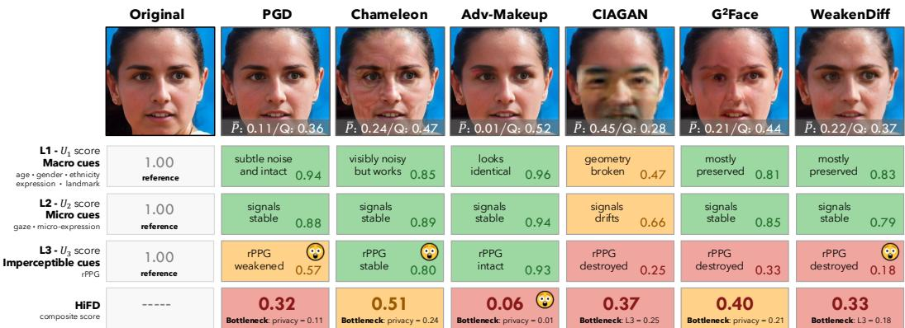  
Figure 1: HiFD reveals what the eye and single-axis metrics cannot. One face processed by six FDeID methods. Privacy score (P¯) and quality score (Q) overlay each de-identified image. Rows report utility scores at each hierarchy level (L1 macro: $U _ { 1 } , { \mathbf { L } } 2$ micro: $U _ { 2 } , \dot { \mathrm { L } } 3$ imperceptible: $U _ { 3 } )$ and the composite HiFD. The bottleneck tag names the weakest of $\{ \bar { P } , Q , U _ { 1 } , U _ { 2 } , U _ { 3 } \}$ . Cells marked flag scores that contradict naive intuition: (i) Chameleon [10] looks visibly noisy yet $U _ { 3 } = 0 . 8 \mathrm { C }$ because the rPPG signal remains stable, whereas PGD, whose perturbation is invisible, drops to 0.57. (ii) Adv-Makeup [89] looks identical to the original yet collapses to $\mathbf { H i F D } = 0 . 0 6$ . (iii) WeakenDiff [68] passes L1 and L2 yet destroys the rPPG signal at L3.

Beyond the fragmentation of what is measured, we identify a deeper concern in how utility is measured. Existing protocols cast utility preservation as the classification or regression accuracy of attribute predictions against externally annotated labels: a method is said to preserve expression if a classifier still predicts the annotated expression label on the de-identified image [87, 68]. This formulation is problematic on two counts. Operationally, it requires per-attribute ground-truth annotations on the evaluation dataset, which is precisely why no single benchmark suffices for multi-attribute evaluation (Tab. 1) and why the field has fragmented across taskspecific datasets in the first place. Conceptually, it misaligns evaluation with de-

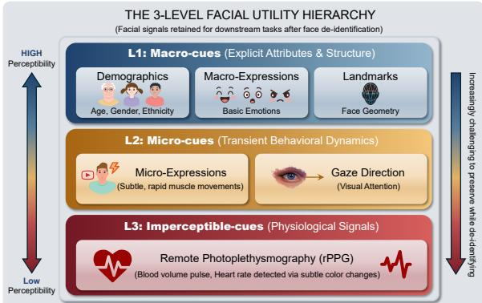  
Figure 2: The proposed 3-level facial utility hierarchy. Facial utilities are categorized by perceptual accessibility into macro-cues (L1), micro-cues (L2), and imperceptible-cues (L3), motivating a hierarchical metric for FDeID evaluation.

ployment: what matters in practice is whether downstream models can still extract task-relevant information from the de-identified face, not whether their predictions match a static set of human annotations. We argue instead that utility should be measured by the consistency $s ( f ( \mathbf { x } ) , f ( { \hat { \mathbf { x } } } ) )$ between an attribute estimator’s predictions on the original face x and its de-identified counterpart xˆ. This consistency-based formulation directly quantifies whether the information a model extracts from a face survives de-identification, eliminates the per-image annotation requirement, and unifies evaluation across attributes and datasets.

Table 1: Annotation coverage of face datasets previously used for FDeID evaluation. No prior dataset provides the joint L1+L2+L3 annotation coverage that fragmented FDeID protocols have collectively required, forcing each method to be evaluated on a different subset. Under our consistency-based paradigm (§3.2), UTILFACE itself requires no such annotations and the video benchmarks at the bottom (DFME for microexpressions; PURE for rPPG) supply the L2/L3 coverage that no image dataset offers.
<table><tr><td rowspan="2">Dataset</td><td rowspan="2">Modality</td><td rowspan="2">#Images/Videos</td><td rowspan="2">#IDs</td><td colspan="4">L1: Macro-Cues</td><td colspan="2">L2: Micro-Cues</td><td rowspan="2">L3 rPPG</td></tr><tr><td>Age Gender</td><td>Ethnicity</td><td></td><td>Macro-Exp. Landmark</td><td>Micro-Exp.</td><td>Gaze</td></tr><tr><td>LFW [26]</td><td>Image</td><td>13,233</td><td>5,749</td><td>X</td><td>X X</td><td></td><td>X</td><td>X</td><td>X X</td><td>x</td></tr><tr><td>CelebA [51]</td><td>Image</td><td>202,599</td><td>10,177</td><td>X</td><td>X</td><td></td><td></td><td>X</td><td>x</td><td>x</td></tr><tr><td>FFHQ [34]</td><td>Image</td><td>70,000</td><td></td><td></td><td></td><td>X</td><td></td><td></td><td>X</td><td>X</td></tr><tr><td>AgeDB [62]</td><td>Image</td><td>16,488</td><td>568</td><td></td><td></td><td>X</td><td>X</td><td>X</td><td>x</td><td>x</td></tr><tr><td>RFW [78]</td><td>Image</td><td>40,000</td><td>12,000</td><td>X</td><td></td><td>X</td><td>X</td><td>X</td><td>X</td><td>X</td></tr><tr><td>AffectNet [61]</td><td>Image</td><td>450,000</td><td></td><td></td><td></td><td></td><td></td><td></td><td>X</td><td>X</td></tr><tr><td>FairFace [33]</td><td>Image</td><td>108,501</td><td></td><td></td><td></td><td>X</td><td>X</td><td>X</td><td>x</td><td>X</td></tr><tr><td>UTKFace [96]</td><td>Image</td><td>23,708</td><td></td><td></td><td></td><td>X</td><td></td><td>X</td><td>X</td><td>x</td></tr><tr><td>GazeCapture [39]</td><td>Image</td><td>2,445,504</td><td>1,450</td><td>X X</td><td>X</td><td>X</td><td>X</td><td>X</td><td></td><td>X</td></tr><tr><td>PubFig [40]</td><td>Image</td><td>58,797</td><td>200</td><td>X X</td><td></td><td>X</td><td>X</td><td></td><td>X</td><td>X</td></tr><tr><td>FERET [65]</td><td>Image</td><td>14,126</td><td>1,199</td><td>X</td><td></td><td>X</td><td>X</td><td></td><td>X</td><td>X</td></tr><tr><td>VGGFace2 [6]</td><td>Image</td><td>3,310,000</td><td>9,131</td><td>X X</td><td></td><td>X</td><td></td><td></td><td>X</td><td>X</td></tr><tr><td>CASIA-WebFace [88]</td><td>Image</td><td>494,414</td><td>10,575</td><td>X X</td><td>X</td><td>X</td><td>X</td><td>X</td><td>x</td><td>x</td></tr><tr><td>DFME [97]</td><td>Video</td><td>7,526 clips</td><td>671</td><td>X X</td><td>X</td><td>X</td><td>X</td><td></td><td>X</td><td>X</td></tr><tr><td>PURE [72]</td><td>Video</td><td>60 videos</td><td>10</td><td>X X</td><td>X</td><td>X</td><td>X</td><td>X</td><td>x</td><td></td></tr></table>

Orthogonal to how utility is measured, we further observe that facial signals exhibit a natural hierarchy of perceptual granularity that existing protocols overlook (Fig. 2). Macro-level cues such as demographics and facial geometry are spatially coarse, semantically salient, and readily perceivable by human observers [62, 61]. Micro-level cues such as gaze direction and microexpressions depend on precise localized geometry and temporal dynamics that are far more fragile under facial manipulation [39, 97]. Imperceptible cues such as rPPG-based physiological signals, encoded in sub-pixel skin color variations, are the most susceptible to any image modification [72, 32]. This stratification suggests that FDeID methods affect each level differently, which a single scalar utility score cannot expose, motivating a hierarchical metric that evaluates preservation at all three granularities and surfaces the trade-offs between them.

Based on the above observations, we make the following contributions:

• UTILFACE: a curated, balanced FDeID benchmark. We construct a face benchmark assembled from multiple large-scale datasets through identity-aware cleaning, resolution enhancement, and stratified filtering, providing a demographically balanced evaluation substrate with high identity diversity and image quality. We further integrate established video benchmarks (DFME [97], PURE [72]) to enable standardized evaluation across all utility levels.

• A three-level facial utility hierarchy. We propose the first structured formalization of facial utility for FDeID, organizing signals into macro-cues (L1), micro-cues (L2), and imperceptible-cues (L3), and providing a principled lens for understanding which downstream tasks remain viable after de-identification (see Fig. 2).

• HiFD: a unified, consistency-based metric. We introduce HiFD (Hierarchical Face Deidentification metric), which integrates identity suppression, multi-level utility preservation, and image quality into an interpretable score via weighted harmonic mean aggregation, with applicationspecific weighting profiles and graceful adaptation across image and video modalities (see Fig. 1).

• A comprehensive comparative study of FDeID methods. We evaluate representative adversarial, GAN-based, and diffusion-based methods under UTILFACE and HiFD, surfacing trade-offs and failure modes that remain invisible under fragmented protocols.

## 2 Related Work

## 2.1 FDeID Methods

FDeID has evolved substantially from early approaches to sophisticated learning-based techniques. Early methods employed simple image processing operations including pixelation, blurring, and masking [4, 27, 43, 82]. While computationally efficient, these approaches fundamentally trade utility for privacy, degrading visual quality and destroying most facial information. The k-Same family of algorithms [18, 19, 58, 63] introduced a principled privacy formulation based on k-anonymity [74], synthesizing faces that match at least k individuals in a database. However, these methods produce visible artifacts and offer limited control over the privacy-utility trade-off. Recent advances in generative modeling have enabled more nuanced approaches: Generative Adversarial Networks (GAN) [17]-based methods disentangle identity from attributes [56], inpaint faces conditioned on surrounding context [28], or manipulate latent representations [2], while diffusion models [24] offer improved fidelity and controllability [73]. Despite this methodological diversity, existing methods share a common evaluation blind spot: utility preservation is assessed in a fragmented manner, with each work measuring different attributes on different datasets using different metrics. Our benchmark addresses this gap through systematic, multi-level utility evaluation under a unified protocol.

## 2.2 Evaluation Metrics and Protocols

Evaluation of FDeID spans three dimensions: identity suppression, utility preservation, and image quality, each of which has accumulated a heterogeneous collection of metrics. Identity suppression is most commonly reported as the de-identification success rate [71, 37, 80, 50, 68], with continuous or ranked variants including recognition accuracy drop [47, 91], cosine similarity [85, 94], identity distance [5, 84], Rank-N-T [87, 77], and AUC [57, 66, 64], which differ in normalization and recognizer dependence. Utility preservation is typically tied to the attribute being evaluated, using categorical accuracy for expression [56] and classification or regression error for age and gender [16]; these protocols need annotations from different datasets (see Tab. 1). Image quality draws from reference-based metrics such as PSNR and SSIM [81], learned perceptual metrics such as LPIPS [93], and distributional metrics such as FID [22]. This proliferation of heterogeneous metrics and protocols impedes systematic comparison and reproducibility, while no existing metric provides a unified assessment across all three dimensions [83]. HiFD addresses both by adopting a consistency-based formulation and aggregating all three dimensions into a single interpretable score.

## 2.3 Facial Signal Analysis

Facial images encode abundant information spanning identity features and non-identity utility cues across multiple granularities. At the coarsest level, well-established tasks such as age estimation [15], gender classification [55], ethnicity recognition [33], expression recognition [45], and facial landmark detection [44] represent mature fields with established benchmarks and high-performing models; these macro-level signals are spatially coarse, semantically salient, and readily perceivable by human observers. At a finer level, micro-expressions [97] and gaze direction [9] capture subtle behavioral and attentional states that are critical for affective computing, deception detection, and humancomputer interaction; these signals depend on precise localized geometry and temporal dynamics that are far more fragile under facial manipulation. At the finest level, deep learning approaches for rPPG, including DeepPhys [8], PhysNet [90], and EfficientPhys [48], now recover heart rate and physiological waveforms from sub-pixel skin color variations in face videos, with transformative potential for telehealth and remote patient monitoring.

This natural stratification, from coarse attributes perceivable at a glance, through subtle behavioral dynamics, to physiological signals invisible to the naked eye, suggests an inherent hierarchy of facial signal that FDeID methods affect at different rates. Yet this hierarchical structure remains unexplored in FDeID evaluation. We formalize this observation and introduce a three-level utility framework that enables principled assessment of what facial information FDeID methods preserve or destroy.

## 3 Proposed Protocol

## 3.1 UTILFACE Benchmark

A benchmark suitable for comprehensive FDeID evaluation must simultaneously provide sufficient identity diversity for meaningful privacy evaluation, adequate image quality for reliable attribute estimation, and demographic balance to avoid evaluation bias. No existing face dataset satisfies these three requirements jointly (Tab. 1). We therefore design a four-stage curation pipeline that aggregates, cleans, enhances, and balances face images from four large-scale sources; a summary of each stage and its output statistics is reported in Tab. 2, and full operational details (restoration-tool selection, identity-deduplication threshold, quality-filter justification) are deferred to Appendix A.

Source aggregation. We aggregate WebFace42M [101], Glint360K [3], MS1MV2 [12], and MegaFace [36], yielding an unfiltered pool of approximately 69.55M images across 3.12M identities. These datasets were originally curated to train robust face recognition models and thus contain substantial proportions of challenging samples (heavy blur, extreme pose, occlusion) that, while beneficial for recognition training, are unsuitable for utility-aware FDeID evaluation.

Table 2: UTILFACE curation pipeline. Each stage progressively filters the pool toward a high-quality, demographically balanced evaluation benchmark.
<table><tr><td>Stage</td><td>Operation</td><td>#Images</td><td>#Identities</td></tr><tr><td>1. Aggregation</td><td>Merge 4 source datasets</td><td>~69.55M</td><td>~3.12M</td></tr><tr><td>2. Cleaning + Enhancement</td><td>Identity-aware filtering; GFPGAN / CodeFormer</td><td>~20.58M</td><td>~701,810</td></tr><tr><td>3. Quality filter</td><td>NIQE &lt; 5.0</td><td>~8.69M</td><td>~640,035</td></tr><tr><td>4. Balanced sampling</td><td>Hierarchical stratified sampling</td><td>99,928</td><td>2,069</td></tr></table>

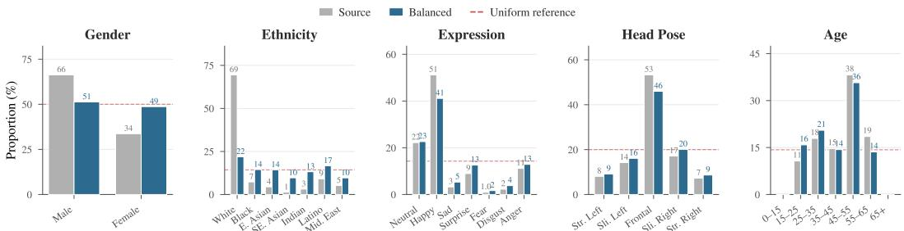  
Figure 3: Distributions comparison before and after the balance sampling. Each panel reports the proportion of images across categories for five facial annotations: gender, ethnicity, expression, head pose, and age.

Identity-aware cleaning and resolution enhancement. We discard samples that would compromise downstream evaluation: images with zero or multiple detected faces, non-RGB inputs, heavily blurred samples, and cross-dataset duplicate identities identified via pretrained ArcFace [12] similarity. Surviving low-resolution samples are upsampled to 448×448 or 512×512 using blind face restoration [79, 100], with the upsampling ratio capped at 4× to preserve perceptual fidelity. This stage yields ∼ 20.58M images across ∼ 701,810 identities.

Perceptual quality filtering. We apply a quality filter based on NIQE [60], discarding images with NIQE ≥ 5.0, an empirically motivated cut-off that admits naturalistic faces while rejecting restoration failures. The pool contains ∼ 8.69M images across ∼ 640,035 identities after this stage.

Demographically balanced benchmark construction. The remaining pool exhibits strong distributional skew across gender, ethnicity, expression, pose, and age (Fig. 3, grey bars), which would otherwise conflate method performance with demographic bias. We apply a hierarchical stratified sampling strategy operating at the identity level: identities are partitioned into 14 strata defined by gender and ethnicity, then ranked within each stratum by a composite score combining image count and diversity over expression and head pose. The top-ranked identities fill an equal per-stratum budget, and all images of each selected identity are retained. The resulting UTILFACE benchmark contains 99,928 images across 2,069 identities (mean 48.3, median 30 images per identity), with near-uniform gender balance (51.5% / 48.5%) and a flattened ethnicity distribution that reduces the largest-to-smallest category ratio from 53× to 2.3× (Fig. 3, teal bars).

Unlike the image datasets in Tab. 1, UTILFACE carries no attribute annotations by design: the consistency-based HiFD metric measures the consistency between estimator outputs on x and xˆ, so ground-truth labels are neither needed nor desirable.

## 3.2 HiFD Metric

Evaluating FDeID requires jointly quantifying two competing objectives: how effectively identity is suppressed and howfaithfully non-identity information is retained. Existing protocols report these objectives in isolation, treat utility as a monolithic concept, and often rely on ground-truth labels. We address these limitations with HiFD, a unified scalar metric that integrates identity suppression, hierarchical utility preservation, and image quality into a single interpretable score. HiFD adopts a consistency-based formulation throughout: every component is computed as the consistency between a pretrained estimator’s outputs on the original input and its de-identified counterpart, directly quantifying the amount of downstream-perceivable information that survives de-identification. We first define a generic consistency function, instantiate it on the three-level hierarchy, then specify privacy and quality, and combine all five into the composite HiFD score.

Consistency design principle. For the k-th estimator with output space ${ \mathcal { V } } _ { k }$ , a consistencyfunction $s _ { k } : \mathcal { V } _ { k } \times \mathcal { V } _ { k } \to \overline { { [ 0 , 1 ] } }$ takes the estimator’s outputs on the original face x and its de-identified counterpart xˆ and returns their agreement as a similarity score, with 1 indicating identical outputs. We require every $s _ { k }$ to satisfy: (i) boundedness, $s _ { k } \in [ 0 , 1 ]$ with $s _ { k } = 1$ when the outputs are identical; (ii) type-appropriateness, tailored to the output modality (scalar, categorical distribution, coordinate array, or temporal signal); (iii) graceful degradation, with a well-defined value at degenerate inputs. The metric does not require per-image ground-truth labels; the only quantities specified a priori are global normalization constants (attribute ranges, error caps) that are hand-defined once for each task, based on domain conventions. See details in Appendix B.1.

Hierarchical utility scores. We instantiate the principle above on the three-level hierarchy of Fig. 2, yielding five L1, two L2, and two L3 consistency scores. L1 (macro-cues) covers age, gender, ethnicity, macro-expression, and landmark consistency, using truncated absolute error for scalars, total variation distance for categorical posterior distributions (with a top-1-plus-confidence binary posterior reconstructed for gender), and normalized mean error (NME) for landmark coordinates anchored on the inter-ocular distance of x; we aggregate into $U _ { 1 }$ by unweighted averaging. L2 (micro-cues) covers gaze and micro-expression consistency, aggregated into $U _ { 2 }$ as the mean when video is available and as $s _ { \mathrm { g a z e } }$ alone for image-only inputs. L3 (imperceptible cues) covers blood-volume-pulse (BVP) and heart-rate (HR) consistency from rPPG signals, aggregated into $U _ { 3 }$ after averaging over an ensemble of rPPG estimators (PhysNet [90], EfficientPhys [48], FactorizePhys [32]). BVP uses a positive-correlation rescaling that assigns zero consistency to uncorrelated or anti-correlated pairs, and HR uses a tightened cap of $\tau _ { \mathrm { H R } } = 2 0$ bpm to match the clinical relevance threshold.

Privacy and quality. $\bar { P }$ measures identity suppression as the mean embedding-space dissimilarity across an ensemble of M face recognizers (ArcFace [12], CosFace [76], AdaFace [38]), rescaled from cosine similarity to [0, 1]; the ensemble mitigates the known vulnerability of single-recognizer evaluation against adversarial methods. $Q$ combines a reference-based perceptual similarity (LPIPS [93]) and a no-reference naturalness score (NIQE [60]) with equal weight, both bounded to [0, 1].

Composite HiFD score. All five dimensions $( \bar { P } , Q , U _ { 1 } , U _ { 2 } , U _ { 3 } )$ are bounded in [0, 1] by construction, allowing a weighted harmonic mean aggregation that penalizes imbalanced methods more strongly than arithmetic or geometric averaging:

$$
\mathbf { H i F D } = \left( w _ { P } + w _ { Q } + \sum _ { \ell = 1 } ^ { L } w _ { \ell } \right) \cdot \left( \frac { w _ { P } } { \bar { P } + \epsilon } + \frac { w _ { Q } } { Q + \epsilon } + \sum _ { \ell = 1 } ^ { L } \frac { w _ { \ell } } { U _ { \ell } + \epsilon } \right) ^ { - 1 } ,\tag{1}
$$

where $\mathbf { w } = ( w _ { P } , w _ { Q } , w _ { 1 } , . . . , w _ { L } )$ are non-negative importance weights, $\epsilon = 1 0 ^ { - 6 }$ prevents division by zero, and $L \in \{ \mathrm { i } , 2 , 3 \}$ is the number of hierarchy levels scoreable for the given input: $L = 1$ for images without gaze, $\dot { L } = 2$ for images with gaze or video without rPPG support, and $L = 3$ for video supporting rPPG. The outer factor $( \sum { \bar { w } } )$ renders the score self-normalizing. We define three weighting profiles: (i) Privacy-First $( w _ { P } = 0 . 5$ , remainder equal) for high-risk surveillance; (ii) Balanced (uniform weights), used as the default; (iii) Clinical $\scriptstyle ( w _ { 3 } = 0 . 4$ , remainder equal) for telehealth applications prioritizing physiological-signal preservation.

Properties. By construction, HiFD satisfies: (i) boundedness, $\mathbf { H i F D } \in [ 0 , 1 ] ;$ (ii) monotonicity, improving any component increases the score; (iii) vetoing, the harmonic mean drives the score toward zero when any single component approaches zero; (iv) graceful degradation across modalities via $L ; \left( \mathrm { v } \right)$ annotation-free, every component depends only on estimator outputs on x and xˆ.

## 4 Comparative Analysis

## 4.1 Experimental Setup

FDeID methods. We evaluate 12 representative methods spanning the three dominant FDeID paradigms based on their underlying generation mechanism. (i) Adversarial perturbation, which applies ε-bounded gradient-based noise to fool face recognition models: MI-FGSM [13], PGD [54], TI-DIM [14], TIP-IM [87], and Chameleon [10]. (ii) GAN-based generation, which produces anonymized images via a learned generator trained with adversarial objectives: CIAGAN [56] for identity-conditioned replacement, AMT-GAN [25] for adversarial makeup transfer, Adv-Makeup [89] for eye-region makeup, DeID-rPPG [69] for heart-rate preservation, and $\mathbf { G } ^ { 2 } ]$ Face [86] for geometry and expression preservation. (iii) Diffusion-based generation, represented by DiffAM [73] and WeakenDiff [68], anonymizes faces through iterative denoising sampling.

Table 3: HiFD comparative results. Consistency scores (higher is better, $\in [ 0 , 1 ] )$ of each method under the HiFD protocol. Sub-scores are reported per dimension; $U _ { 1 }$ averages the five L1 consistency scores, $U _ { 2 }$ averages gaze and micro-expression, and $U _ { 3 }$ averages BVP and HR. The final column is the HiFD composite.
<table><tr><td rowspan="2">Method</td><td rowspan="2"> $\bar { P } \uparrow$ </td><td rowspan="2"> $Q \uparrow$ </td><td colspan="5">L1: Macro-cues</td><td rowspan="2"> $U _ { 1 } \uparrow$ </td><td colspan="2">L2: Micro-cues</td><td rowspan="2"> $U _ { 2 } \uparrow$ </td><td colspan="2">L3: rPPG</td><td rowspan="2"> $U _ { 3 } \uparrow$ </td><td rowspan="2">HiFD↑</td></tr><tr><td> $\mathrm { A g e }$ </td><td>Gen.</td><td>Eth.</td><td> $\mathbf { M E x p }$ </td><td>Lmk</td><td> $\boldsymbol { \mathrm { G a z e } }$ </td><td>ME</td><td> $\overline { { { \bf B } { \bf V } { \bf P } } }$ </td><td>HR</td></tr><tr><td colspan="10">(a) Adversarial perturbation</td><td></td><td></td><td></td><td></td><td></td><td></td></tr><tr><td>MI-FGSM</td><td>0.134</td><td>0.360</td><td>0.975</td><td>0.962</td><td>0.916</td><td>0.951</td><td>0.834</td><td>0.928</td><td>0.936</td><td>0.799</td><td>0.868</td><td>0.471</td><td>0.478</td><td>0.474</td><td>0.343</td></tr><tr><td>PGD</td><td>0.113</td><td>0.362</td><td>0.978</td><td>0.968</td><td>0.935</td><td>0.964</td><td>0.843</td><td>0.938</td><td>0.940</td><td>0.817</td><td>0.878</td><td>0.577</td><td>0.555</td><td>0.566</td><td>0.321</td></tr><tr><td>TI-DIM</td><td>0.500</td><td>0.342</td><td>0.880</td><td>0.826</td><td>0.656</td><td>0.739</td><td>0.684</td><td>0.757</td><td>0.921</td><td>0.722</td><td>0.821</td><td>0.424</td><td>0.425</td><td>0.424</td><td>0.509</td></tr><tr><td>TIP-IM</td><td>0.496</td><td>0.446</td><td>0.927</td><td>0.882</td><td>0.701</td><td>0.794</td><td>0.728</td><td>0.806</td><td>0.944</td><td>0.812</td><td>0.878</td><td>0.643</td><td>0.605</td><td>0.624</td><td>0.607</td></tr><tr><td>Chameleon</td><td>0.239</td><td>0.474</td><td>0.915</td><td>0.897</td><td>0.780</td><td>0.839</td><td>0.816</td><td>0.850</td><td>0.961</td><td>0.816</td><td>0.889</td><td>0.821</td><td>0.777</td><td>0.799</td><td>0.508</td></tr><tr><td colspan="3">(b) GAN-based generation</td><td></td><td></td><td></td><td></td><td></td><td></td><td></td><td></td><td></td><td></td><td></td><td></td><td></td></tr><tr><td>Adv-Makeup</td><td>0.012</td><td>0.524</td><td>0.987</td><td>0.980</td><td>0.942</td><td>0.971</td><td>0.917</td><td>0.960</td><td>0.966</td><td>0.916</td><td>0.941</td><td>0.964</td><td>0.898</td><td>0.931</td><td>0.056</td></tr><tr><td>AMT-GAN</td><td>0.156</td><td>0.481</td><td>0.966</td><td>0.911</td><td>0.737</td><td>0.868</td><td>0.821</td><td>0.861</td><td>0.938</td><td>0.553</td><td>0.745</td><td>0.132</td><td>0.164</td><td>0.148</td><td>0.282</td></tr><tr><td>CIAGAN</td><td>0.450</td><td>0.276</td><td>0.894</td><td>0.549</td><td>0.291</td><td>0.529</td><td>0.075</td><td>0.468</td><td>0.748</td><td>0.572</td><td>0.660</td><td>0.225</td><td>0.269</td><td>0.247</td><td>0.369</td></tr><tr><td>DeID-rPPG</td><td>0.013</td><td>0.407</td><td>0.980</td><td>0.971</td><td>0.890</td><td>0.963</td><td>0.854</td><td>0.932</td><td>0.940</td><td>0.838</td><td>0.889</td><td>0.940</td><td>0.875</td><td>0.907</td><td>0.061</td></tr><tr><td>G2Face</td><td>0.210</td><td>0.443</td><td>0.953</td><td>0.898</td><td>0.712</td><td>0.817</td><td>0.665</td><td>0.809</td><td>0.903</td><td>0.793</td><td>0.848</td><td>0.324</td><td>0.328</td><td>0.326</td><td>0.400</td></tr><tr><td colspan="2">(c) Diffusion-based generation</td><td></td><td></td><td></td><td></td><td></td><td></td><td></td><td></td><td></td><td></td><td></td><td></td><td></td><td></td></tr><tr><td>WeakenDiff</td><td>0.222</td><td>0.371</td><td>0.951</td><td>0.922</td><td>0.680</td><td>0.865</td><td>0.754</td><td>0.834</td><td>0.924</td><td>0.659</td><td>0.792</td><td>0.169</td><td>0.201</td><td>0.185</td><td>0.332</td></tr><tr><td>DiffAM</td><td>0.159</td><td>0.471</td><td>0.959</td><td>0.923</td><td>0.698</td><td>0.802</td><td>0.583</td><td>0.793</td><td>0.908</td><td>0.715</td><td>0.811</td><td>0.538</td><td>0.575</td><td>0.557</td><td>0.394</td></tr></table>

Datasets. All privacy, L1 attributes, L2 gaze, and quality metrics are computed on UTILFACE (99,928 images, 2,069 identities). L2 micro-expression is evaluated on DFME [97] test-set A (474 video clips). L3 rPPG is evaluated on PURE [72] (10 subjects, 60 video clips). Additionally, we use RAF-DB [46] and MMPD [75] for the HiFD validation.

Estimators. Every score in HiFD is a consistency score between a pretrained estimator’s outputs on the original and the de-identified input. Privacy uses an ensemble of ArcFace [12], CosFace [76], and AdaFace [38] face recognizers, with face bounding boxes and 5-point landmarks cached once on the original via RetinaFace [11] and reused on the de-identified counterparts for consistent alignment. L1: age and gender via MiVOLO [41] (trained on UTKFace), ethnicity via FairFace [33], macro-expression via POSTER [98] (trained on RAF-DB), and 68-point facial landmarks via MediaPipe [53] Face Landmarker. L2: gaze estimation via L2CS-Net [1] (trained on Gaze360 [35]), and micro-expression via SAMER [67] (five-class). L3: BVP waveforms via PhysNet [90], Efficient-Phys [48], and FactorizePhys [32] (all trained on UBFC-rPPG dataset). Quality: LPIPS-VGG [93] and NIQE [60] computed via pyiqa.

Implementation details. All inference and scoring runs on 8 AMD MI250X GPUs. HiFD components are aggregated per method (privacy and per-image sub-scores as mean over 99,928 keys; rPPG as mean over 60 clips × 3 estimators; micro-expression as mean over 474 clips) and combined via the weighted harmonic mean in Eq. (1). Unless otherwise noted, we report the Balanced profile $( w _ { P } = w _ { Q } = w _ { 1 } = w _ { 2 } = w _ { 3 } ) \quad$ . Normalization caps follow $\ S 3 . 2 \colon \Delta _ { \mathrm { a g e } } = 1 0 0$ , τNME = 0.10, $\theta _ { \mathrm { m a x } } = 9 0 ^ { \circ } , \tau _ { \mathrm { H R } } = 2 0  { \mathrm { b p m } } , \tau _ { \mathrm { N } } = 5 , \alpha = 0 . 5$ . See Appendix for more details.

## 4.2 Main Results

Tab. 3 reports HiFD and all sub-scores across the 12 evaluated methods. Five findings emerge that are invisible under existing fragmented protocols.

Finding 1: The privacy-utility frontier is not monotonic across paradigms. No FDeID family dominates on both axes and each trades privacy for utility on its own terms. Adversarial methods retain the highest macro-cue scores $( U _ { 1 } > 0 . { \bar { 9 } } 2$ for PGD and MI-FGSM), as expected from their minimally visible pixel perturbations, but only the two with explicit transferability objectives reach $\bar { P } \approx 0 . 5 \mathrm { \dot { 0 } }$ (TI-DIM, TIP-IM). MI-FGSM and PGD stall at $\bar { P } < 0 . 1 4$ , suggesting that recent robust recognizers largely survive naive gradient attacks; in operational terms they de-identify only 8% of faces at any false-accept rate (Appendix C.2). GAN methods cover the widest privacy range: CIAGAN reaches $\bar { P } = 0 . 4 5$ by replacing the face entirely, but at severe cost on $U _ { 1 } \left( 0 . 4 7 \right)$ and landmarks (0.08), while cosmetic methods such as Adv-Makeup preserve macro-cues almost perfectly yet offer virtually no identity suppression $( \bar { P } = 0 . 0 1 )$ . Diffusion methods sit between these extremes. WeakenDiff achieves $\bar { P } = \overline { { 0 . 2 2 } }$ and $U _ { 1 } = 0 . 8 3$ . DiffAM, despite its explicit adversarial-makeup objective, scores only $\bar { P } = 0 . 1 6$ on our ArcFace/CosFace/AdaFace ensemble, since its makeup perturbations were trained against IRSE50/IR152/MobileFace/FaceNet and transfer imperfectly to modern recognizers.

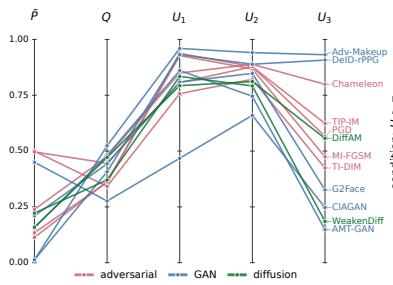

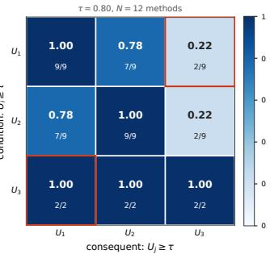  
Figure 4: Hierarchical utility preservation is asymmetrically coupled. (Left) Parallel coordinates plot over the five HiFD axes $( \bar { P } , Q , U _ { 1 } , U _ { 2 }$ $U _ { 3 } )$ . (Right) Preservation matrix at threshold $\tau = 0 . 8 0$ . Cell $( i , j )$ reports $\operatorname* { P r } ( U _ { j } \geq \tau | U _ { i } \geq \tau )$ across the 12 methods, with the intersection over marginal count shown. Red boxes highlight the asymmetric pair $( U _ { 1 } , U _ { 3 } )$ $\mathrm { P r } ( \bar { U } _ { 1 } \ge \tau | U _ { 3 } \ge \tau ) { = } 1 . 0 0$ but $\mathrm { P r } ( \bar { U } _ { 3 } \bar { \geq } \tau | U _ { 1 } \geq \tau ) { = } 0 . 2 2$

Table 4: HiFD under the three profiles. Privacy-First: $w _ { P } { = } 0 . 5 ;$ Balanced: uniform; Clinical: $w _ { 3 } { = } 0 . 4 ;$ re-≥τmaining weights distributed equally.
<table><tr><td>Method</td><td>Privacy-First</td><td>Balanced</td><td>Clinical</td></tr><tr><td colspan="4">(a) Adversarial perturbation</td></tr><tr><td>MI-FGSM</td><td>0.217</td><td>0.343</td><td>0.369</td></tr><tr><td>PGD</td><td>0.190</td><td>0.321</td><td>0.360</td></tr><tr><td>TI-DIM TIP-IM</td><td>0.506 0.560</td><td>0.509 0.607</td><td>0.485 0.611</td></tr><tr><td>Chameleon</td><td>0.357</td><td>0.508</td><td>0.558</td></tr><tr><td colspan="4">(b) GAN-based generation</td></tr><tr><td>Adv-Makeup</td><td>0.023</td><td>0.056</td><td>0.073</td></tr><tr><td>AMT-GAN</td><td>0.217</td><td>0.282</td><td>0.230</td></tr><tr><td>CIAGAN</td><td>0.396</td><td>0.369</td><td>0.328</td></tr><tr><td>DeID-rPPG</td><td>0.026</td><td>0.061</td><td>0.079</td></tr><tr><td>G2Face</td><td>0.298</td><td>0.400</td><td>0.378</td></tr><tr><td colspan="4">(c) Diffusion-based generation</td></tr><tr><td>WeakenDiff</td><td>0.280</td><td>0.332</td><td>0.277</td></tr><tr><td>DiffAM</td><td>0.254</td><td>0.394</td><td>0.425</td></tr></table>

DiffAM nonetheless outperforms WeakenDiff on $U _ { 2 } , U _ { 3 } ,$ , and Q (0.81, 0.56, 0.47) and trails only marginally on $U _ { 1 } ( 0 . 7 9 \mathrm { v s . 0 . 8 3 } ) .$ , yielding a higher HiFD of 0.394 versus 0.332.

Finding 2: Hierarchical signals degrade at different rates. Preservation drops from L1 to L3 for almost every method, with the steepest collapse in generative families. AMT-GAN, CIAGAN, $\mathrm { G ^ { 2 } F a c e }$ , and WeakenDiff all score $\bar { U _ { 3 } } < 0 . 3 3$ , confirming that face synthesis decouples macro appearance from fine-grained skin-color dynamics. Adversarial methods preserve $U _ { 3 }$ best (TIP-IM 0.62, Chameleon 0.80), since bounded $\ell _ { \infty }$ or $\ell _ { 2 }$ noise leaves low-frequency skin signals largely intact. Only Adv-Makeup $( U _ { 3 } { = } 0 . 9 3 )$ and DeID-rPPG $( U _ { 3 } = 0 . 9 1 )$ combine high $U _ { 3 }$ with high $U _ { 1 }$ , but both trade this preservation for a complete loss of identity suppression.

Finding 3: Hierarchical preservation is asymmetrically coupled. Does retaining the strictest level $U _ { 3 }$ imply retention of $U _ { 2 }$ and $U _ { 1 } ,$ , and conversely? Fig. 4 answers across the 12 methods. The parallelcoordinates panel (left) shows the polylines fanning out from $U _ { 1 }$ to $U _ { 3 } { \mathrm { : } }$ nine of the twelve methods exceed 0.80 on $U _ { 1 }$ and nine on $U _ { 2 } .$ , yet only Adv-Makeup and DeID-rPPG sit above $U _ { 3 } = 0 . 9 0$ while AMT-GAN, CIAGAN, WeakenDiff, and $\mathrm { G ^ { 2 } I }$ Face fall below $U _ { 3 } = 0 . 3 5$ . The conditional preservation matrix (right) quantifies the implication structure at threshold $\tau = 0 . 8 0$ : every method that preserves $U _ { 3 }$ also preserves $U _ { 1 }$ and $\begin{array} { r } { \bar { U _ { 2 } } ( \operatorname* { P r } ( U _ { 1 } \geq \tau \mid U _ { 3 } \geq \tau ) = \operatorname* { P r } ( U _ { 2 } \geq \tau \mid U _ { 3 } \geq \tau ) = 1 . 0 0 ) } \end{array}$ yet only 22% (two of nine) of the methods that preserve $U _ { 1 }$ also preserve $U _ { 3 } ;$ the asymmetry holds for every $\tau \in [ 0 . 7 0 , 0 . 9 0 ]$ ]. Practically, the asymmetry refutes the common shortcut of certifying L3 preservation by inspecting macro cues alone. This is precisely what the harmonic-mean aggregation enforces via the vetoing property: a near-zero $U _ { 3 }$ component cannot be masked by strong $U _ { 1 }$ scores, so methods are ranked by their weakest dimension rather than their average. TIP-IM achieves the highest HiFD of 0.607 for this reason: it is the only method that reaches at least 0.44 on every dimension simultaneously, while specialized methods such as DeID-rPPG $( U _ { 3 } { = } 0 . 9 1 )$ and $\mathrm { G ^ { 2 } F a c e }$ $( U _ { 1 } = 0 . 8 1 )$ ) excel on a single axis but do not dominate the composite.

Finding 4: Application-specific profiles reshape the ranking. Tab. 4 reports HiFD under the three profiles defined in $\ S \bar { 3 } . 2$ . Under Privacy-First $( w _ { P } = 0 . 5 )$ , CIAGAN rises within the GAN family thanks to its strong identity suppression, yet TIP-IM still leads overall because its balanced profile avoids any near-zero component. Under Clinical $( w _ { 3 } = 0 . 4 )$ , adversarial methods (TIP-IM, Chameleon) dominate as they retain physiological rPPG signals, while most GAN-based methods collapse since their face synthesis destroys sub-pixel dynamics regardless of visual fidelity. Adv-Makeup and DeID-rPPG remain at the bottom across all profiles: despite excellent utility preservation, their near-zero identity suppression $( \bar { P } < 0 . 0 2 )$ is mathematically penalized by the harmonic-mean aggregation. The optimal FDeID choice therefore depends on which utility levels the downstream application prioritizes, but no profile rescues a method that fails on identity suppression.

Finding 5: FDeID methods are largely demographic-agnostic, with adversarial methods showing the largest disparities. Fig. 5 decomposes each method’s HiFD score across two genders and seven ethnicities. Across all 12 methods, no single method shows a per-gender gap larger than 0.035 or a seven-way ethnicity range larger than 0.064, both an order of magnitude below the inter-method spread in Tab. 4. The four methods with the widest per-method ethnicity range, PGD (0.064), Chameleon (0.050), MI-FGSM (0.049), and DiffAM (0.039), are all gradient-based or makeup-style perturbations that depend on local skin-tone gradients, which plausibly explains why they treat East

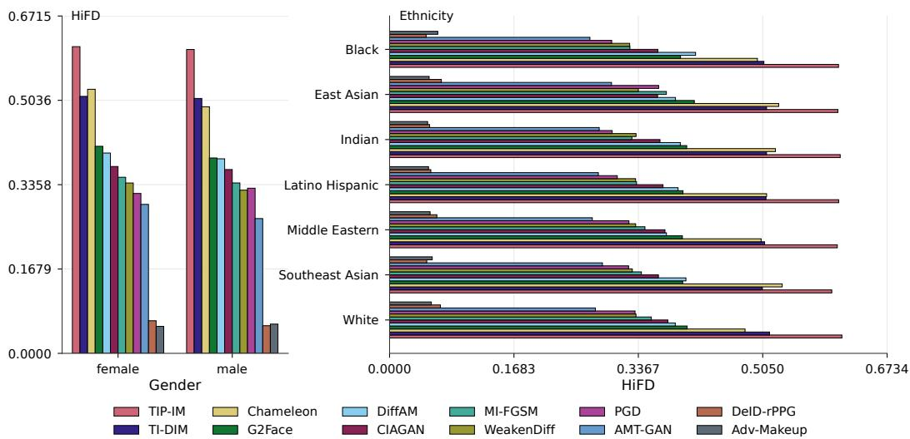  
Figure 5: Per-demographic-slice HiFD on UTILFACE. Methods are ordered by global HiFD (descending). Left shows the female/male split and right shows the seven-way ethnicity split (alphabetical). Differences across demographic strata are small in absolute terms (< 0.07 within any method) compared to the inter-method spread.

Asian samples slightly differently from the rest. The top-ranked TIP-IM (gender gap 0.006, ethnicity range 0.014) and the bottom-ranked Adv-Makeup and DeID-rPPG (disparities $\leq 0 . 0 2 1 )$ confirm that neither leadership nor failure is concentrated on any subgroup. The results demonstrate that current FDeID methods, despite spanning three different generation paradigms, do not exhibit the demographic-specific failure modes that have been documented for face recognition itself. The dominant axis of variation in FDeID quality is the choice of method, not the identity of the subject.

## 4.3 HiFD Validation

Every HiFD component is a consistency score, computed from a pretrained estimator’s outputs on x and xˆ without any label. Its validity therefore rests on two questions: does the consistency score track true utility preservation, and does the privacy score correspond to an operational notion of privacy? Fig. 6 places the consistency score next to a ground-truth score for every method, using ground truth that is available outside UTILFACE. For macro-expression (Fig. 6a) we de-identified the labeled RAF-DB test set (3,068 images) with all twelve methods and compared the consistency score with the fraction of ground-truth accuracy the same estimator retains on the de-identified images: the two bars differ by at most 0.06 for every method, both place CIAGAN far below the rest, and both agree on the three best-preserving methods. Per image, the consistency score predicts whether the true label survives with AUC 0.98 over 28,614 pairs, and only 1.1% of pairs with a consistency score above 0.8 hide a flipped label. For rPPG (Fig. 6b), MMPD’s contact sensor gives the true heart rate, so the ground-truth bar is the fraction of heart-rate accuracy retained after de-identification. The two scores live on different scales, because heart-rate error saturates, but they order the methods the same way: the same three best (Adv-Makeup, DeID-rPPG, Chameleon, whose de-identification raises the true error by under 1 bpm) and the same three worst (AMT-GAN, CIAGAN, WeakenDiff, by 4.5 to 7.4 bpm), with eleven of twelve methods within one rank of each other. A consistency score can still mislead for near-tie posteriors, which flip the hard label under an arbitrarily small total-variation change, or for an estimator that is degenerate on the de-identified domain. The first is why we measured hidden flips, and the second is bounded by estimator substitution (Appendix C.4).

For privacy (Fig. 6c) we fit verification thresholds on 3M different-identity impostor pairs and measure de-identification success, the fraction of faces no longer verified as their original. The bars show what P¯ means in practice: the three methods with $\bar { P } \geq 0 . 4 5$ (TI-DIM, TIP-IM, CIAGAN) de-identify 93 to 96% of faces at $\mathrm { F A R ~ 1 0 ^ { - 3 } }$ , the seven methods with P¯ between 0.11 and 0.24 de-identify at most 27% (three of them under 1%), and the two with $\bar { P } \approx 0 . 0 1$ de-identify none. Within the middle band the mapping is not monotone (MI-FGSM and PGD reach 8% at $\bar { P } \approx 0 . 1 2$ while WeakenDiff stays below 1% at 0.22), which is what a continuous embedding margin produces when it meets a thresholded decision. The practitioner-level reading is nevertheless unambiguous: only three of twelve methods de-identify usefully. Extended evaluations are detailed in Appendix C and E.

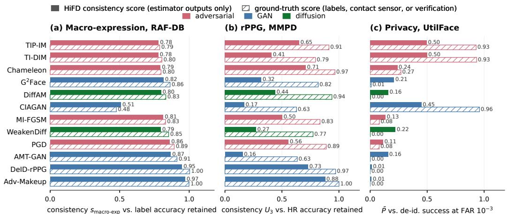  
Figure 6: Consistency scores next to ground-truth scores. (a) Macro-expression consistency on the deidentified RAF-DB against the fraction of ground-truth label accuracy retained. (b) $U _ { 3 }$ on MMPD against the fraction of contact-sensor heart-rate accuracy retained. (c) Privacy score $\bar { P }$ against FDeID success at FAR $1 0 ^ { - 3 }$

## 4.4 How Private is Private?

Our comparative study delivers a sobering answer: under the unified HiFD protocol, no current FDeID method is simultaneously private and utility-preserving across all three hierarchical levels. The best-performing method in our study, TIP-IM, attains a HiFD of only 0.607, meaning that even the strongest baseline leaves a measurable gap on at least one of the five axes $( \bar { P } , Q , U _ { 1 } , U _ { 2 } , U _ { 3 } ) ;$ every other method we evaluate scores below 0.52. The privacy axis itself is the most fragile: nine of the twelve methods achieve $\bar { P } < 0 . 3 0$ against our three-recognizer ensemble, and only three de-identify more than 80% of faces at a false-accept rate of $1 0 ^ { - 2 }$ (Tab. 9), indicating that perceived “privacy” in much of the prior literature reflects evaluation against a single, often outdated recognizer rather than genuine identity suppression against modern systems. When privacy is achieved, it is typically purchased at a steep and uneven cost across the hierarchy, with macro cues (L1) most often retained, micro cues (L2) partially degraded, and physiological signals (L3) silently destroyed by virtually all generative approaches regardless of their visual fidelity. Consequently, we argue that future FDeID research should report HiFD alongside its constituent components rather than any single privacy or utility number in isolation.

## 5 Conclusion

We presented UTILFACE and HiFD, a paired benchmark and hierarchical metric for face deidentification. UTILFACE is a curated, demographically balanced corpus assembled from four large-scale sources. HiFD unifies identity suppression, three-level utility preservation, and image quality into a single consistency-based score, computed without per-image attribute annotations. A comparative study over 12 representative methods spanning adversarial, GAN-based, and diffusionbased families surfaces trade-offs invisible to existing protocols: hierarchical signals degrade asymmetrically, with macro cues mostly retained, micro cues partially degraded, and physiological rPPG silently destroyed by virtually all generative approaches; most adversarial methods, once evaluated against an ensemble of modern recognizers, exhibit limited identity suppression; and no current method is simultaneously private and utility-preserving across all three levels.

Limitation. HiFD is consistency-based, so its validity rests on the pretrained estimators used to compute each consistency score, and any bias of these estimators is inherited by HiFD. Ensembling for $\mathring { P }$ and $U _ { 3 }$ and the substitution study of Appendix C.4 bound this dependence but do not remove it: the released protocol scores L1 and L2 with one estimator per attribute, and improvements in the underlying models will translate directly into more faithful scores.

Acknowledgements. This work was supported by the Research Council of Finland (former Academy of Finland) Academy Professor project EmotionAI (grants 336116, 359894), HPC project FaceCanvas (grant number 364905), the University of Oulu & Research Council of Finland Profi 7 (grant 352788), and EU HORIZON-MSCA-SE-2022 project ACMod (grant 101130271). The authors also wish to acknowledge CSC – IT Center for Science, Finland, for computational resources.

## References

[1] Ahmed A Abdelrahman, Thorsten Hempel, Aly Khalifa, Ayoub Al-Hamadi, and Laslo Dinges. L2cs-net: Fine-grained gaze estimation in unconstrained environments. In 2023 8th International Conference on Frontiers ofSignal Processing (ICFSP), pages 98–102. IEEE, 2023.

[2] Ayush Agarwal, Pratik Chattopadhyay, and Lipo Wang. Privacy preservation through facial deidentification with simultaneous emotion preservation. Signal, Image and Video Processing, 15(5):951– 958, 2021.

[3] Xiang An, Xuhan Zhu, Yuan Gao, Yang Xiao, Yongle Zhao, Ziyong Feng, Lan Wu, Bin Qin, Ming Zhang, Debing Zhang, et al. Partial fc: Training 10 million identities on a single machine. In Proceedings ofthe IEEE/CVF International Conference on Computer Vision, pages 1445–1449, 2021.

[4] Michael Boyle, Christopher Edwards, and Saul Greenberg. The effects of filtered video on awareness and privacy. In Proceedings of the 2000 ACM Conference on Computer Supported Cooperative Work, pages 1–10, 2000.

[5] Jingyi Cao, Bo Liu, Yunqian Wen, Rong Xie, and Li Song. Achieving privacy-preserving multi-view consistency with advanced 3d-aware face de-identification. In ACM MM Asia, pages 1–7, 2023.

[6] Qiong Cao, Li Shen, Weidi Xie, Omkar M Parkhi, and Andrew Zisserman. Vggface2: A dataset for recognising faces across pose and age. In IEEE FG, pages 67–74. IEEE, 2018.

[7] Chaofeng Chen, Jiadi Mo, Jingwen Hou, Haoning Wu, Liang Liao, Wenxiu Sun, Qiong Yan, and Weisi Lin. Topiq: A top-down approach from semantics to distortions for image quality assessment. IEEE Transactions on Image Processing, 33:2404–2418, 2024.

[8] Weixuan Chen and Daniel McDuff. Deepphys: Video-based physiological measurement using convolutional attention networks. In European Conference on Computer Vision, pages 349–365, 2018.

[9] Yihua Cheng, Haofei Wang, Yiwei Bao, and Feng Lu. Appearance-based gaze estimation with deep learning: A review and benchmark. IEEE Transactions on Pattern Analysis and Machine Intelligence, 46(12):7509–7528, 2024.

[10] Ka-Ho Chow, Sihao Hu, Tiansheng Huang, and Ling Liu. Personalized privacy protection mask against unauthorized facial recognition. In European Conference on Computer Vision, pages 434–450. Springer, 2024.

[11] Jiankang Deng, Jia Guo, Evangelos Ververas, Irene Kotsia, and Stefanos Zafeiriou. Retinaface: Singleshot multi-level face localisation in the wild. In Proceedings ofthe IEEE/CVF Conference on Computer Vision and Pattern Recognition, pages 5203–5212, 2020.

[12] Jiankang Deng, Jia Guo, Niannan Xue, and Stefanos Zafeiriou. Arcface: Additive angular margin loss for deep face recognition. In Proceedings of the IEEE/CVF Conference on Computer Vision and Pattern Recognition, pages 4690–4699, 2019.

[13] Yinpeng Dong, Fangzhou Liao, Tianyu Pang, Hang Su, Jun Zhu, Xiaolin Hu, and Jianguo Li. Boosting adversarial attacks with momentum. In Proceedings of the IEEE/CVF Conference on Computer Vision and Pattern Recognition, pages 9185–9193, 2018.

[14] Yinpeng Dong, Tianyu Pang, Hang Su, and Jun Zhu. Evading defenses to transferable adversarial examples by translation-invariant attacks. In Proceedings of the IEEE/CVF Conference on Computer Vision and Pattern Recognition, pages 4312–4321, 2019.

[15] Xin Geng, Zhi-Hua Zhou, and Kate Smith-Miles. Automatic age estimation based on facial aging patterns. IEEE Transactions on Pattern Analysis and Machine Intelligence, 29(12):2234–2240, 2007.

[16] Huihui Gong, Minjing Dong, Siqi Ma, Seyit Camtepe, Surya Nepal, and Chang Xu. Stealthy physical masked face recognition attack via adversarial style optimization. IEEE Transactions on Multimedia, 26:5014–5025, 2023.

[17] Ian Goodfellow, Jean Pouget-Abadie, Mehdi Mirza, Bing Xu, David Warde-Farley, Sherjil Ozair, Aaron Courville, and Yoshua Bengio. Generative adversarial nets. In Advances in Neural Information Processing Systems, pages 1–9, 2014.

[18] Ralph Gross, Edoardo Airoldi, Bradley Malin, and Latanya Sweeney. Integrating utility into face deidentification. In International Workshop on Privacy Enhancing Technologies, pages 227–242. Springer, 2005.

[19] Ralph Gross, Latanya Sweeney, Fernando De la Torre, and Simon Baker. Model-based face deidentification. In Proceedings ofthe IEEE/CVF Conference on Computer Vision and Pattern Recognition Workshop, pages 161–161. IEEE, 2006.

[20] Hongyan Gu, Xinyi Zhang, Jiang Li, Hui Wei, Baiqi Li, and Xinli Huang. Federated learning vulnerabili ties: Privacy attacks with denoising diffusion probabilistic models. In Proceedings of the ACM on Web Conference, pages 1149–1157, 2024.

[21] Md Rezwan Hasan, Richard Guest, and Farzin Deravi. Presentation-level privacy protection techniques for automated face recognition—a survey. ACM Computing Surveys, 55(13s):1–27, 2023.

[22] Martin Heusel, Hubert Ramsauer, Thomas Unterthiner, Bernhard Nessler, and Sepp Hochreiter. Gans trained by a two time-scale update rule converge to a local nash equilibrium. In Advances in Neural Information Processing Systems, pages 815–823, 2017.

[23] Carlos Hinojosa, Miguel Marquez, Henry Arguello, Ehsan Adeli, Li Fei-Fei, and Juan Carlos Niebles. Privhar: Recognizing human actions from privacy-preserving lens. In European Conference on Computer Vision, pages 314–332. Springer, 2022.

[24] Jonathan Ho, Ajay Jain, and Pieter Abbeel. Denoising diffusion probabilistic models. In Advances in Neural Information Processing Systems, pages 6840–6851, 2020.

[25] Shengshan Hu, Xiaogeng Liu, Yechao Zhang, Minghui Li, Leo Yu Zhang, Hai Jin, and Libing Wu. Protecting facial privacy: Generating adversarial identity masks via style-robust makeup transfer. In Proceedings ofthe IEEE/CVF Conference on Computer Vision and Pattern Recognition, pages 15014– 15023, 2022.

[26] Gary B Huang, Marwan Mattar, Tamara Berg, and Eric Learned-Miller. Labeled faces in the wild: A database for studying face recognition in unconstrained environments. In Workshop on faces in’Real-Life’Images: detection, alignment, and recognition, pages 1–11, 2008.

[27] Scott E Hudson and Ian Smith. Techniques for addressing fundamental privacy and disruption tradeoffs in awareness support systems. In Proceedings of the ACM Conference on Computer Supported Cooperative Work, pages 248–257, 1996.

[28] Håkon Hukkelås and Frank Lindseth. Deepprivacy2: Towards realistic full-body anonymization. In Proceedings of the IEEE/CVF Winter Conference on Applications of Computer Vision, pages 1329–1338, 2023.

[29] Håkon Hukkelås, Rudolf Mester, and Frank Lindseth. Deepprivacy: A generative adversarial network for face anonymization. In International Symposium on Visual Computing, pages 565–578. Springer, 2019.

[30] Xuemei Jia, Jiawei Du, Hui Wei, Ruinian Xue, Zheng Wang, Hongyuan Zhu, and Jun Chen. Balancing privacy and performance: A many-in-one approach for image anonymization. In Proceedings ofthe AAAI Conference on Artificial Intelligence, volume 39, pages 17608–17616, 2025.

[31] Baowei Jiang, Bing Bai, Haozhe Lin, Yu Wang, Yuchen Guo, and Lu Fang. Dartblur: Privacy preservation with detection artifact suppression. In Proceedings of the IEEE/CVF Conference on Computer Vision and Pattern Recognition, pages 16479–16488, 2023.

[32] Jitesh Joshi, Sos Agaian, and Youngjun Cho. Factorizephys: Matrix factorization for multidimensional attention in remote physiological sensing. In Advances in Neural Information Processing Systems, volume 37, pages 96607–96639, 2024.

[33] Kimmo Karkkainen and Jungseock Joo. Fairface: Face attribute dataset for balanced race, gender, and age for bias measurement and mitigation. In Proceedings of the IEEE/CVF Winter Conference on Applications of Computer Vision, pages 1548–1558, 2021.

[34] Tero Karras, Samuli Laine, and Timo Aila. A style-based generator architecture for generative adversarial networks. In Proceedings of the IEEE/CVF Conference on Computer Vision and Pattern Recognition, pages 4401–4410, 2019.

[35] Petr Kellnhofer, Adria Recasens, Simon Stent, Wojciech Matusik, and Antonio Torralba. Gaze360: Physically unconstrained gaze estimation in the wild. In Proceedings of the IEEE/CVF International Conference on Computer Vision, pages 6912–6921, 2019.

[36] Ira Kemelmacher-Shlizerman, Steven M Seitz, Daniel Miller, and Evan Brossard. The megaface benchmark: 1 million faces for recognition at scale. In Proceedings ofthe IEEE/CVF Conference on Computer Vision and Pattern Recognition, pages 4873–4882, 2016.

[37] Seyyed Mohammad Sadegh Moosavi Khorzooghi and Shirin Nilizadeh. Examining stylegan as a utilitypreserving face de-identification method. In Proceedings on Privacy Enhancing Technologies, page 341–358, 2023.

[38] Minchul Kim, Anil K Jain, and Xiaoming Liu. Adaface: Quality adaptive margin for face recognition. In Proceedings of the IEEE/CVF Conference on Computer Vision and Pattern Recognition, pages 18750– 18759, 2022.

[39] Kyle Krafka, Aditya Khosla, Petr Kellnhofer, Harini Kannan, Suchendra Bhandarkar, Wojciech Matusik, and Antonio Torralba. Eye tracking for everyone. In Proceedings of the IEEE/CVF Conference on Computer Vision and Pattern Recognition, pages 2176–2184, 2016.

[40] Neeraj Kumar, Alexander C Berg, Peter N Belhumeur, and Shree K Nayar. Attribute and simile classifiers for face verification. In ICCV, pages 365–372. IEEE, 2009.

[41] Maksim Kuprashevich and Irina Tolstykh. Mivolo: Multi-input transformer for age and gender estimation. In International Conference on Analysis of Images, Social Networks and Texts, pages 212–226. Springer, 2023.

[42] Lamyanba Laishram, Muhammad Shaheryar, Jong Taek Lee, and Soon Ki Jung. Toward a privacypreserving face recognition system: A survey of leakages and solutions. ACM Computing Surveys, 57(6):1–38, 2025.

[43] Geoffrey Letournel, Aurélie Bugeau, V-T Ta, and J-P Domenger. Face de-identification with expressions preservation. In IEEE International Conference on Image Processing, pages 4366–4370. IEEE, 2015.

[44] Hui Li, Zidong Guo, Seon-Min Rhee, Seungju Han, and Jae-Joon Han. Towards accurate facial landmark detection via cascaded transformers. In Proceedings ofthe IEEE/CVF Conference on Computer Vision and Pattern Recognition, pages 4176–4185, 2022.

[45] Shan Li and Weihong Deng. Deep facial expression recognition: A survey. IEEE Transactions on Affective Computing, 13(3):1195–1215, 2020.

[46] Shan Li, Weihong Deng, and JunPing Du. Reliable crowdsourcing and deep locality-preserving learning for expression recognition in the wild. In Proceedings ofthe IEEE/CVF Conference on Computer Vision and Pattern Recognition, pages 2852–2861, 2017.

[47] Yuezun Li and Siwei Lyu. De-identification without losing faces. In Proceedings of the ACM Workshop on Information Hiding and Multimedia Security, pages 83–88, 2019.

[48] Xin Liu, Brian Hill, Ziheng Jiang, Shwetak Patel, and Daniel McDuff. Efficientphys: Enabling simple, fast and accurate camera-based cardiac measurement. In Proceedings ofthe IEEE/CVF Winter Conference on Applications ofComputer Vision, pages 5008–5017, 2023.

[49] Yang Liu, Kevin HM Cheng, Marko Savic, Haoyu Chen, Zitong Yu, and Guoying Zhao. 3d face de-identification with preserving multi-facial attributes: A benchmark. IEEE TBIOM, pages 1–14, 2025.

[50] Yuanwei Liu, Hui Wei, Chengyu Jia, Ruqi Xiao, Weijian Ruan, Xingxing Wei, Joey Tianyi Zhou, and Zheng Wang. Projattacker: A configurable physical adversarial attack for face recognition via projector. In Proceedings of the IEEE/CVF Conference on Computer Vision and Pattern Recognition, pages 21248–21257, 2025.

[51] Ziwei Liu, Ping Luo, Xiaogang Wang, and Xiaoou Tang. Deep learning face attributes in the wild. In Proceedings of the IEEE/CVF International Conference on Computer Vision, pages 3730–3738, 2015.

[52] Jhon Lopez, Carlos Hinojosa, Henry Arguello, and Bernard Ghanem. Privacy-preserving optics for enhancing protection in face de-identification. In Proceedings ofthe IEEE/CVF Conference on Computer Vision and Pattern Recognition, pages 12120–12129, 2024.

[53] Camillo Lugaresi, Jiuqiang Tang, Hadon Nash, Chris McClanahan, Esha Uboweja, Michael Hays, Fan Zhang, Chuo-Ling Chang, Ming Guang Yong, Juhyun Lee, et al. Mediapipe: A framework for building perception pipelines. arXiv preprint arXiv:1906.08172, 2019.

[54] Aleksander Madry, Aleksandar Makelov, Ludwig Schmidt, Dimitris Tsipras, and Adrian Vladu. Towards deep learning models resistant to adversarial attacks. In International Conference on Learning Representations, pages 1–23, 2018.

[55] Erno Makinen and Roope Raisamo. Evaluation of gender classification methods with automatically detected and aligned faces. IEEE Transactions on Pattern Analysis and Machine Intelligence, 30(3):541– 547, 2008.

[56] Maxim Maximov, Ismail Elezi, and Laura Leal-Taixé. Ciagan: Conditional identity anonymization generative adversarial networks. In Proceedings ofthe IEEE/CVF Conference on Computer Vision and Pattern Recognition, pages 5447–5456, 2020.

[57] Blaž Meden, Manfred Gonzalez-Hernandez, Peter Peer, and Vitomir Štruc. Face deidentification with controllable privacy protection. Image and Vision Computing, 134:104678, 2023.

[58] Lily Meng and Zongji Sun. Face de-identification with perfect privacy protection. In International Convention on Information and Communication Technology, Electronics and Microelectronics, pages 1234–1239. IEEE, 2014.

[59] Anish Mittal, Anush K Moorthy, and Alan C Bovik. Blind/referenceless image spatial quality evaluator. In 2011 Conference Record ofthe Forty Fifth Asilomar Conference on Signals, Systems and Computers (ASILOMAR), pages 723–727. IEEE, 2011.

[60] Anish Mittal, Rajiv Soundararajan, and Alan C Bovik. Making a “completely blind” image quality analyzer. IEEE Signal Processing Letters, 20(3):209–212, 2012.

[61] Ali Mollahosseini, Behzad Hasani, and Mohammad H Mahoor. Affectnet: A database for facial expression, valence, and arousal computing in the wild. IEEE Transactions on Affective Computing, 10(1):18–31, 2017.

[62] Stylianos Moschoglou, Athanasios Papaioannou, Christos Sagonas, Jiankang Deng, Irene Kotsia, and Stefanos Zafeiriou. Agedb: The first manually collected, in-the-wild age database. In Proceedings of the IEEE/CVF Conference on Computer Vision and Pattern Recognition Workshop, pages 51–59, 2017.

[63] Elaine M Newton, Latanya Sweeney, and Bradley Malin. Preserving privacy by de-identifying face images. IEEE Transactions on Knowledge and Data Engineering, 17(2):232–243, 2005.

[64] Yuchen Pan, Junjun Jiang, Kui Jiang, Zhihao Wu, Keyuan Yu, and Xianming Liu. Opticaldr: A deep optical imaging model for privacy-protective depression recognition. In Proceedings ofthe IEEE/CVF Conference on Computer Vision and Pattern Recognition, pages 1303–1312, 2024.

[65] P Jonathon Phillips, Harry Wechsler, Jeffery Huang, and Patrick J Rauss. The feret database and evaluation procedure for face-recognition algorithms. Image and vision computing, 16(5):295–306, 1998.

[66] Hugo Proença. The uu-net: Reversible face de-identification for visual surveillance video footage. IEEE Transactions on Circuits and Systems for Video Technology, 32(2):496–509, 2022.

[67] Bo-Kai Ruan, Ling Lo, Hong-Han Shuai, and Wen-Huang Cheng. Mimicking the annotation process for recognizing the micro expressions. In Proceedings ofthe ACM International Conference on Multimedia, pages 228–236, 2022.

[68] Ali Salar, Qing Liu, Yingli Tian, and Guoying Zhao. Enhancing facial privacy protection via weakening diffusion purification. In Proceedings of the IEEE/CVF Conference on Computer Vision and Pattern Recognition, pages 8235–8244, 2025.

[69] Marko Savic and Guoying Zhao. De-identification of facial videos while preserving remote physiological utility. In BMVC, pages 1–14. BMVA Press, 2023.

[70] Florian Schroff, Dmitry Kalenichenko, and James Philbin. Facenet: A unified embedding for face recognition and clustering. In Proceedings of the IEEE/CVF Conference on Computer Vision and Pattern Recognition, pages 815–823, 2015.

[71] Mahmood Sharif, Sruti Bhagavatula, Lujo Bauer, and Michael K Reiter. Accessorize to a crime: Real and stealthy attacks on state-of-the-art face recognition. In ACM SIGSAC, pages 1528–1540, 2016.

[72] Ronny Stricker, Steffen Müller, and Horst-Michael Gross. Non-contact video-based pulse rate measurement on a mobile service robot. In IEEE International Symposium on Robot and Human Interactive Communication, pages 1056–1062. IEEE, 2014.

[73] Yuhao Sun, Lingyun Yu, Hongtao Xie, Jiaming Li, and Yongdong Zhang. Diffam: Diffusion-based adversarial makeup transfer for facial privacy protection. In Proceedings ofthe IEEE/CVF Conference on Computer Vision and Pattern Recognition, pages 24584–24594, 2024.

[74] Latanya Sweeney. k-anonymity: A model for protecting privacy. International journal ofUncertainty, Fuzziness and Knowledge-based Systems, 10(05):557–570, 2002.

[75] Jiankai Tang, Kequan Chen, Yuntao Wang, Yuanchun Shi, Shwetak Patel, Daniel McDuff, and Xin Liu. Mmpd: Multi-domain mobile video physiology dataset. In 2023 45th Annual International Conference of the IEEE Engineering in Medicine & Biology Society, pages 1–5. IEEE, 2023.

[76] Hao Wang, Yitong Wang, Zheng Zhou, Xing Ji, Dihong Gong, Jingchao Zhou, Zhifeng Li, and Wei Liu. Cosface: Large margin cosine loss for deep face recognition. In Proceedings of the IEEE/CVF Conference on Computer Vision and Pattern Recognition, pages 5265–5274, 2018.

[77] Haobo Wang, Weiqi Luo, Xiaohua Xie, Peijia Zheng, Wenmin Huang, and Jiwu Huang. Adv-inversion: Stealthy adversarial attacks via gan-inversion for facial privacy protection. IEEE Transactions on Information Forensics and Security, pages 1–15, 2025.

[78] Mei Wang, Weihong Deng, Jiani Hu, Xunqiang Tao, and Yaohai Huang. Racial faces in the wild: Reducing racial bias by information maximization adaptation network. In Proceedings ofthe IEEE/CVF International Conference on Computer Vision, pages 692–702, 2019.

[79] Xintao Wang, Yu Li, Honglun Zhang, and Ying Shan. Towards real-world blind face restoration with generative facial prior. In Proceedings of the IEEE/CVF Conference on Computer Vision and Pattern Recognition, pages 9168–9178, 2021.

[80] Ye Wang, Zeyan Liu, Bo Luo, Rongqing Hui, and Fengjun Li. The invisible polyjuice potion: an effective physical adversarial attack against face recognition. In ACM SIGSAC, pages 3346–3360, 2024.

[81] Zhou Wang, Alan C Bovik, Hamid R Sheikh, and Eero P Simoncelli. Image quality assessment: From error visibility to structural similarity. IEEE Transactions on Image Processing, 13(4):600–612, 2004.

[82] Hui Wei, Hao Yu, and Guoying Zhao. Face de-identification: A domain-centric survey from capture to processing. IEEE Transactions on Pattern Analysis and Machine Intelligence, 2026.

[83] Hui Wei, Hao Yu, and Guoying Zhao. Fdeid-toolbox: Face de-identification toolbox. arXiv preprint arXiv:2603.13121, 2026.

[84] Yunqian Wen, Bo Liu, Jingyi Cao, Rong Xie, and Li Song. Divide and conquer: a two-step method for high quality face de-identification with model explainability. In Proceedings of the IEEE/CVF International Conference on Computer Vision, pages 5148–5157, 2023.

[85] Yunqian Wen, Bo Liu, Jingyi Cao, Rong Xie, Li Song, and Zhu Li. Identitymask: Deep motion flow guided reversible face video de-identification. IEEE Transactions on Circuits and Systems for Video Technology, 32(12):8353–8367, 2022.

[86] Haoxin Yang, Xuemiao Xu, Cheng Xu, Huaidong Zhang, Jing Qin, Yi Wang, Pheng-Ann Heng, and Shengfeng He. G²face: High-fidelity reversible face anonymization via generative and geometric priors. IEEE Transactions on Information Forensics and Security, 19:8773–8785, 2024.

[87] Xiao Yang, Yinpeng Dong, Tianyu Pang, Hang Su, Jun Zhu, Yuefeng Chen, and Hui Xue. Towards face encryption by generating adversarial identity masks. In Proceedings of the IEEE/CVF International Conference on Computer Vision, pages 3897–3907, 2021.

[88] Dong Yi, Zhen Lei, Shengcai Liao, and Stan Z Li. Learning face representation from scratch. arXiv preprint arXiv:1411.7923, 2014.

[89] Bangjie Yin, Wenxuan Wang, Taiping Yao, Junfeng Guo, Zelun Kong, Shouhong Ding, Jilin Li, and Cong Liu. Adv-makeup: A new imperceptible and transferable attack on face recognition. In Proceedings of the International Joint Conference on Artificial Intelligence, pages 1–7, 2021.

[90] Zitong Yu, Xiaobai Li, and Guoying Zhao. Remote photoplethysmograph signal measurement from facial videos using spatio-temporal networks. In BMVC, 2019.

[91] Liming Zhai, Qing Guo, Xiaofei Xie, Lei Ma, Yi Estelle Wang, and Yang Liu. A3gan: Attribute-aware anonymization networks for face de-identification. In Proceedings ofthe ACM International Conference on Multimedia, pages 5303–5313, 2022.

[92] Kaipeng Zhang, Zhanpeng Zhang, Zhifeng Li, and Yu Qiao. Joint face detection and alignment using multitask cascaded convolutional networks. IEEE Signal Processing Letters, 23(10):1499–1503, 2016.

[93] Richard Zhang, Phillip Isola, Alexei A Efros, Eli Shechtman, and Oliver Wang. The unreasonable effectiveness of deep features as a perceptual metric. In Proceedings ofthe IEEE/CVF Conference on Computer Vision and Pattern Recognition, pages 586–595, 2018.

[94] Yaofang Zhang, Yuchun Fang, Yiting Cao, and Jiahua Wu. Rbgan: Realistic-generation and balancedutility gan for face de-identification. Image and Vision Computing, 141:104868, 2024.

[95] Zhanpeng Zhang, Ping Luo, Chen Change Loy, and Xiaoou Tang. From facial expression recognition to interpersonal relation prediction. International Journal ofComputer Vision, 126(5):550–569, 2018.

[96] Zhifei Zhang, Yang Song, and Hairong Qi. Age progression/regression by conditional adversarial autoencoder. In Proceedings of the IEEE/CVF Conference on Computer Vision and Pattern Recognition, pages 5810–5818, 2017.

[97] Sirui Zhao, Huaying Tang, Xinglong Mao, Shifeng Liu, Yiming Zhang, Hao Wang, Tong Xu, and Enhong Chen. Dfme: A new benchmark for dynamic facial micro-expression recognition. IEEE Transactions on Affective Computing, 15(3):1371–1386, 2023.

[98] Ce Zheng, Matias Mendieta, and Chen Chen. Poster: A pyramid cross-fusion transformer network for facial expression recognition. In Proceedings of the IEEE/CVF International Conference on Computer Vision, pages 3146–3155, 2023.

[99] Fengfan Zhou, Bangjie Yin, Hefei Ling, Qianyu Zhou, and Wenxuan Wang. Improving the transferability of adversarial attacks on face recognition with diverse parameters augmentation. In Proceedings of the IEEE/CVF Conference on Computer Vision and Pattern Recognition, pages 3516–3527, 2025.

[100] Shangchen Zhou, Kelvin Chan, Chongyi Li, and Chen Change Loy. Towards robust blind face restoration with codebook lookup transformer. In Advances in Neural Information Processing Systems, volume 35, pages 30599–30611, 2022.

[101] Zheng Zhu, Guan Huang, Jiankang Deng, Yun Ye, Junjie Huang, Xinze Chen, Jiagang Zhu, Tian Yang, Jiwen Lu, Dalong Du, et al. Webface260m: A benchmark unveiling the power of million-scale deep face recognition. In Proceedings of the IEEE/CVF Conference on Computer Vision and Pattern Recognition, pages 10492–10502, 2021.

## Technical Appendix

## A UTILFACE Benchmark: Extended Details

This section completes §3.1 with the operational details deferred for space: per-source statistics, the identity-deduplication threshold, the pose-conditioned routing between GFPGAN and CodeFormer, the empirical NIQE < 5.0 cut-off, the composite ranking driving hierarchical stratified sampling, and source-dataset licenses.

## A.1 Source Dataset Statistics

We aggregate four large-scale face recognition datasets, summarized in Tab. 5. These datasets differ substantially in scale, identity count, and image-per-identity ratio, which motivates the aggregation: no single source provides the combination of identity diversity and image coverage required for reliable privacy evaluation.

Table 5: Source datasets aggregated into the UTILFACE pool.
<table><tr><td>Dataset</td><td>#Identities</td><td>#Images</td><td>Images / ID</td></tr><tr><td>WebFace42M [101]</td><td>2M</td><td>42M</td><td>21.0</td></tr><tr><td>Glint360K [3]</td><td>360K</td><td>17M</td><td>47.2</td></tr><tr><td>MS1MV2 [12]</td><td>85K</td><td>5.8M</td><td>68.2</td></tr><tr><td>MegaFace [36]</td><td>672K</td><td>4.7M</td><td>7.1</td></tr><tr><td>Aggregated pool</td><td>~3.12M</td><td>~69.55M</td><td>22.3</td></tr></table>

## A.2 Identity-Aware Cleaning

We discard samples that would compromise downstream evaluation through four criteria: (i) images with zero or multiple detected faces, which introduce annotation ambiguity; (ii) non-RGB images (e.g., grayscale, infrared), which are incompatible with color-dependent estimators, in particular rPPG; (iii) heavily blurred images, particularly prevalent in WebFace42M; (iv) cross-dataset duplicate identities, identified by computing pairwise cosine similarities between per-identity mean embeddings from a pretrained ArcFace model [12] from the InsightFace library. Identity pairs whose cosine similarity exceeds $\tau _ { \mathrm { i d } } = 0 . 5 5$ are merged (when from different sources) or the lower-quality instance removed. The threshold $\tau _ { \mathrm { i d } } = 0 . 5 5$ was chosen empirically: on a held-out set of manually verified same-identity and different-identity pairs, this value yielded a false-merge rate below 1% while capturing over 90% of cross-dataset duplicates.

## A.3 Resolution Enhancement

Surviving low-resolution samples are upsampled to 448×448 or 512×512 using blind face restoration, with the upsampling ratio capped at 4× to preserve perceptual fidelity. We employ two complementary restoration methods: GFPGAN [79], which produces high-quality results for near-frontal faces, and CodeFormer [100], which is more robust for faces with substantial pose variation where GFPGAN introduces visible artifacts such as eye-region asymmetry and texture flattening. Head pose is estimated from the detected 5-point landmarks; samples with an estimated yaw magnitude above $3 0 ^ { \circ }$ are routed to CodeFormer, and the remainder to GFPGAN. Samples undetectable by MTCNN [92] after both restoration attempts are discarded.

## A.4 Perceptual Quality Filtering

We apply a no-reference perceptual quality filter based on NIQE [60], discarding images with NIQE $\geq 5 . 0$ . The threshold was chosen empirically using FFHQ [34] as a naturalistic-face quality anchor: 95% of FFHQ images fall below NIQE = 5.0, providing a principled cut-off that admits naturalistic, high-fidelity faces while rejecting restoration failures and residual low-quality samples from the source datasets. Filtering at this threshold removes approximately 58% of the pool after Stage 2, disproportionately concentrated in the heavily-blurred WebFace42M subset.

## A.5 Hierarchical Stratified Sampling

After Stage 3 the pool, while large and high-quality, exhibits strong distributional skew: males account for 66.4% of detected faces, White subjects 69.5%, “Happy” expressions 51.2%, frontal head poses 53.3%, and the 45–55 age bin alone 38.2%. Categories such as Southeast Asian (1.3%), Fear (1.0%), and Strong-Right pose (7.3%) are severely underrepresented (Fig. 3, grey bars). Evaluating FDeID methods on such a skewed distribution would conflate method performance with demographic bias.

We correct this with hierarchical stratified sampling at the identity level. Identities are first partitioned into 14 strata defined by the product of two gender categories and seven ethnicity categories. Within each stratum, identities are ranked by a composite score

$$
\mathrm { s c o r e ( i d ) } = \alpha _ { \mathrm { c n t } } \cdot \mathrm { l o g } ( n _ { \mathrm { i d } } ) + \alpha _ { \mathrm { d i v } } \cdot \big ( H _ { \mathrm { e x p } } ( \mathrm { i d } ) + H _ { \mathrm { p o s e } } ( \mathrm { i d } ) \big ) ,\tag{2}
$$

where $n _ { \mathrm { i d } }$ is the number of images belonging to the identity, $H _ { \mathrm { e x p } }$ and $H _ { \mathrm { p o s e } }$ are Shannon entropies over expression and head-pose categories respectively, and $\alpha _ { \mathrm { c n t } } = \alpha _ { \mathrm { d i v } } = 0 . 5$ by default. The top-ranked identities fill an equal per-stratum budget of approximately 150 identities, and all images of each selected identity are retained to maximize per-identity coverage.

Although not directly stratified, expression, head pose, and age achieve full coverage via diversityaware ranking, which up-weights underrepresented categories (Fear, Disgust, Strong-Left/Right, ages 15–25 / 55–65) by 1.5–4× over the Stage-3 pool.

## A.6 Licenses and Release

Source datasets are used under their respective licenses: WebFace42M (research-only, noncommercial), Glint360K (research-only), MS1MV2 (research-only, derived from MS-Celeb-1M), MegaFace (research-only, subject to the MegaFace Terms of Use). Each of these licenses permits research use and derivative processing of the data, and none forbids the construction or distribution of derived identifiers such as identity keys and file lists. We release UTILFACE as a set of identityindexed processing and sampling scripts together with the list of selected identity keys and image filenames from each source, rather than as a redistributed image archive, so that downstream users obtain the underlying images directly from the original providers under the original licenses and the release exposes nothing beyond the public sources. The release scripts, evaluation toolkit, and computed HiFD scores for all baseline methods are made available for research use.

Consent and provenance. All sources were collected by their original authors from public web imagery of (mostly public) figures without individual consent, and MS1MV2 in particular derives from MS-Celeb-1M, whose collection has drawn community scrutiny. We acknowledge this explicitly.

Safeguards. The identity keys are opaque per-source indices and are useful only to someone who already holds the licensed source data. The release is gated behind the same research-only terms as the sources, the accompanying documentation states the intended use (evaluation of de-identification, not training of recognizers, not re-identification of individuals).

Broader impact. The intended positive impact is a common, annotation-free yardstick that lets privacy-preserving face analysis be compared and improved reproducibly, and that exposes silent failures $( e . g .$ , destroyed physiological signals) before deployment in telehealth or surveillance contexts. Two negative uses are foreseeable. First, a benchmark that scores identity suppression against modern recognizers can be used to tune methods whose purpose is to evade lawful face recognition; we consider this risk modest because the recognizers we ensemble are public and the adversarial methods we evaluate already exist, and because the same measurements are what defenders need. Second, any face benchmark concentrates biometric data; the release design above (no pixels, no embeddings, gated research-only terms, removal on request) is our mitigation. HiFD is a machine-recognizer score and should not be read as a guarantee of anonymity against human observers or future recognizers.

## B HiFD Metric: Extended Details

§3.2 named HiFD’s consistency functions and stated the resulting properties without giving their explicit forms. This section supplies them: the closed form of every L1, L2, and L3 consistency function; the global normalization constants and their rationale; and an aggregation ablation establishing the weighted harmonic mean as the only choice consistent with the vetoing property.

## B.1 Consistency Function Definitions

Given an original face x (or video clip $\mathbf { X } )$ and its de-identified counterpart $\hat { \mathbf { x } } \left( \mathrm { o r } \hat { \mathbf { X } } \right)$ , every consistency function is defined as follows.

Age estimation (L1). The estimator $f _ { \mathrm { a g e } } ( \cdot )$ outputs a scalar age $a \in [ 0 , 1 0 0 ]$ ; we use truncated absolute error:

$$
s _ { \mathrm { a g e } } ( \mathbf { x } , \hat { \mathbf { x } } ) = \mathrm { m a x } \bigg ( 0 , ~ 1 - \frac { \left| f _ { \mathrm { a g e } } ( \mathbf { x } ) - f _ { \mathrm { a g e } } ( \hat { \mathbf { x } } ) \right| } { \Delta _ { \mathrm { a g e } } } \bigg ) , \quad \Delta _ { \mathrm { a g e } } = 1 0 0 .\tag{3}
$$

Ethnicity and macro-expression recognition (L1). Both tasks produce softmax outputs $\textbf { p } \in$ $\Delta ^ { K - 1 }$ over $K$ classes $( K = 7$ for FairFace ethnicity, $K = 7$ for POSTER macro-expression on RAF-DB). Rather than using only the top-1 label, we use total variation distance between the full posterior distributions, which captures both the label match and the confidence profile:

$$
\begin{array} { r } { s _ { \mathrm { c l s } } \big ( \mathbf { x } , \hat { \mathbf { x } } \big ) = 1 - \frac { 1 } { 2 } \left\| f _ { \mathrm { c l s } } \big ( \mathbf { x } \big ) - f _ { \mathrm { c l s } } \big ( \hat { \mathbf { x } } \big ) \right\| _ { 1 } \in \mathrm { ~ [ 0 , 1 ] , } } \end{array}\tag{4}
$$

for cls $\in$ {ethnicity, macro-exp}. Two methods producing the same top-1 class but different posterior distributions are distinguished correctly under this definition.

Gender recognition (L1). The MiVOLO age and gender estimator emits a top-1 binary label $\hat { y } \in$ {male, female} and an associated confidence $c \in [ \bar { 0 } , 1 ]$ rather than a softmax head. We construct an equivalent binary posterior $\mathbf { p } _ { \mathrm { g e n d e r } } \in \Delta ^ { 1 }$ by placing mass c on the predicted class and 1−c on the other, and then apply the same total-variation consistency:

$$
\mathbf { p } _ { \mathrm { g e n d e r } } = \left\{ \left[ c , \ 1 - c \right] \right. \hat { y } = \mathrm { m a l e } , \qquad \quad s _ { \mathrm { g e n d e r } } ( \mathbf { x } , \hat { \mathbf { x } } ) = 1 - \frac { 1 } { 2 } \left\| \mathbf { p } _ { \mathrm { g e n d e r } } ( \mathbf { x } ) - \mathbf { p } _ { \mathrm { g e n d e r } } ( \hat { \mathbf { x } } ) \right\| _ { 1 } .\tag{5}
$$

This reduces to a indicator weighted by the joint confidence: $s _ { \mathrm { g e n d e r } } = 1$ when both predictions agree with full confidence and decreases linearly as either confidence drops or the labels diverge.

Landmark detection (L1). The estimator $f _ { \mathrm { l m k } } ( \cdot )$ outputs $K _ { \mathrm { l m k } }$ 2D coordinates $\mathbf { L } \in \mathbb { R } ^ { K _ { \mathrm { l m k } } \times 2 }$ We quantify consistency via the normalized mean error (NME), using the inter-ocular distance $d _ { \mathrm { i o } }$ measured on x (not xˆ) as normalizer:

$$
\mathbf { N M E } ( \mathbf { L } , { \hat { \mathbf { L } } } ) = { \frac { 1 } { K _ { \mathrm { l m k } } d _ { \mathrm { i o } } } } \sum _ { i = 1 } ^ { K _ { \mathrm { l m k } } } \| \mathbf { L } _ { i } - { \hat { \mathbf { L } } } _ { i } \| _ { 2 } , \quad s _ { \mathrm { l m k } } ( \mathbf { x } , { \hat { \mathbf { x } } } ) = \operatorname* { m a x } \left( 0 , \ 1 - { \frac { \mathbf { N M E } } { \tau _ { \mathrm { N M E } } } } \right) ,\tag{6}
$$

with cap $\tau _ { \mathrm { N M E } } = 0 . 1 0$ , beyond which face landmarks are considered unreliable in standard benchmarks. Anchoring $d _ { \mathrm { i o } }$ on the original image ensures that any scale changes introduced by deidentification $( e . g .$ ., face warping, region replacement) are properly penalized.

L1 aggregation. The L1 utility score is the unweighted mean of the five consistency scores:

$$
\begin{array} { r } { U _ { 1 } ( \mathbf { x } , \hat { \mathbf { x } } ) = \frac { 1 } { 5 } \big ( s _ { \mathrm { a g e } } + s _ { \mathrm { g e n d e r } } + s _ { \mathrm { e t h } } + s _ { \mathrm { m a c r o - e x p } } + s _ { \mathrm { l m k } } \big ) . } \end{array}\tag{7}
$$

Gaze estimation (L2). The estimator $f _ { \mathrm { g a z e } }$ outputs a 3D unit gaze direction $ { \mathbf { g } } \in \mathbb { S } ^ { 2 }$ . We use the standard angular error, normalized by a ${ \dot { \theta _ { \mathrm { m a x } } } } = { \bar { 9 0 } } ^ { \circ }$ cap:

$$
\theta ( \mathbf { g } , \hat { \mathbf { g } } ) = \operatorname { a r c c o s } \big ( \mathbf { g } \cdot \hat { \mathbf { g } } \big ) , \quad s _ { \mathrm { g a r e } } ( \mathbf { x } , \hat { \mathbf { x } } ) = \operatorname* { m a x } \left( 0 , \ 1 - \frac { \theta ( \mathbf { g } , \hat { \mathbf { g } } ) } { \theta _ { \operatorname* { m a x } } } \right) .\tag{8}
$$

Micro-expression recognition (L2). This task is video-based. Let X and $\hat { \mathbf X }$ denote the original and de-identified video clips, and let $f _ { \mathrm { m e } }$ output a softmax distribution over ME classes. The class space differs from macro-expression: SAMER [67] outputs a posterior over the five CASME II categories (happiness, disgust, repression, surprise, others), and we apply it to DFME clips without retraining. The consistency function is shared with the L1 categorical tasks:

$$
\begin{array} { r } { s _ { \mathrm { m e } } ( \mathbf { X } , \hat { \mathbf { X } } ) = 1 - \frac { 1 } { 2 } \left. f _ { \mathrm { m e } } ( \mathbf { X } ) - f _ { \mathrm { m e } } ( \hat { \mathbf { X } } ) \right. _ { 1 } . } \end{array}\tag{9}
$$

L2 aggregation. For image-only inputs where $s _ { \mathrm { m e } }$ is undefined, $U _ { 2 }$ reduces to gaze alone:

$$
U _ { 2 } = { \left\{ \begin{array} { l l } { { \frac { 1 } { 2 } } \left( s _ { \mathrm { g a z e } } + s _ { \mathrm { m e } } \right) } & { { \mathrm { i f ~ v i d e o , } } } \\ { s _ { \mathrm { g a z e } } } & { { \mathrm { i f ~ i m a g e ~ o n l y } } . } \end{array} \right. }\tag{10}
$$

Because $U _ { 2 }$ integrates sub-scores across modalities, we report $s _ { \mathrm { g a z e } }$ and $s _ { \mathrm { m e } }$ separately in experimental tables and only aggregate into $U _ { 2 }$ at the final composite step, so that cross-modality comparisons remain interpretable.

rPPG signals (L3). L3 is intrinsically video-level. Given an rPPG estimator $h ( \cdot )$ , we obtain a BVP waveform $\mathbf { b } \in \mathbb { R } ^ { T }$ and a derived heart rate r in beats per minute (bpm). Because destroyed rPPG signals typically manifest as uncorrelated output rather than anti-correlated, we use a positive correlation rescaling for BVP, assigning zero consistency to uncorrelated or anti-correlated pairs; HR uses the tightened clinical-relevance cap $\tau _ { \mathrm { H R } } = 2 0$ bpm:

$$
s _ { \mathrm { B V P } } ( \mathbf { X } , \hat { \mathbf { X } } ) = \operatorname* { m a x } \bigl ( 0 , \rho ( \mathbf { b } , \hat { \mathbf { b } } ) \bigr ) , \qquad s _ { \mathrm { H R } } ( \mathbf { X } , \hat { \mathbf { X } } ) = \operatorname* { m a x } \biggl ( 0 , 1 - \frac { \vert r - \hat { r } \vert } { \tau _ { \mathrm { H R } } } \biggr ) .\tag{11}
$$

By convention, $\rho = 0$ whenever either signal has zero variance. To reduce estimator-specific bias, we average over an ensemble of $K _ { 3 }$ rPPG estimators:

$$
U _ { 3 } = \frac { 1 } { K _ { 3 } } \sum _ { k = 1 } ^ { K _ { 3 } } \frac { 1 } { 2 } \big ( s _ { \mathrm { B V P } } ^ { ( k ) } + s _ { \mathrm { H R } } ^ { ( k ) } \big ) .\tag{12}
$$

Privacy score. Identity suppression is measured as an embedding-space dissimilarity under a face recognition model R. Because cosine similarity takes values in [−1, 1], we rescale to [0, 1]:

$$
\begin{array} { r } { P ( \mathbf { x } , \hat { \mathbf { x } } ) = \frac { 1 } { 2 } \big ( 1 - \cos ( \mathcal { R } ( \mathbf { x } ) , \mathcal { R } ( \hat { \mathbf { x } } ) ) \big ) . } \end{array}\tag{13}
$$

To reduce dependence on any single backbone, a known vulnerability when evaluating adversarial methods optimized against specific recognizers, we average across an ensemble of M recognition models: $\begin{array} { r } { \bar { P } = \frac { 1 } { M } \sum _ { m = 1 } ^ { M } P _ { m } } \end{array}$

Quality score. We combine a reference-based perceptual similarity and a no-reference naturalness score, with both terms bounded to [0, 1]:

$$
Q ( \mathbf { x } , { \hat { \mathbf { x } } } ) = \alpha \cdot \left( 1 - \operatorname* { m i n } ( \mathrm { L P I P S } ( \mathbf { x } , { \hat { \mathbf { x } } } ) , 1 ) \right) + ( 1 - \alpha ) \cdot \mathrm { N I Q E } ^ { * } ( { \hat { \mathbf { x } } } ) ,\tag{14}
$$

where LPIPS [93] captures perceptual fidelity and $\mathrm { N I Q E } ^ { * } ( \hat { \mathbf { x } } ) = \operatorname* { m a x } ( 0 , \operatorname* { m i n } ( 1 , ( { \boldsymbol { \tau } } _ { \mathrm { N } } { - } \mathrm { N I Q E } ( \hat { \mathbf { x } } ) ) / { \boldsymbol { \tau } } _ { \mathrm { N } } ) )$ is the normalized inverse NIQE score with $\tau _ { \mathrm { N } } = 5 ,$ , matching our curation threshold. LPIPS values exceed 1 for heavily corrupted inputs; clipping via min(·, 1) is inconsequential in practice because such cases already correspond to visually destroyed faces. We set $\alpha = 0 . 5$ by default.

## B.2 Normalization-Constant Choices

Tab. 6 summarizes the global normalization constants used throughout HiFD and the rationale for each. These constants are specified a priori and shared across all methods, so they do not introduce method-specific bias.

Table 6: Normalization constants in HiFD.
<table><tr><td>Constant</td><td>Value</td><td>Rationale</td></tr><tr><td> $\Delta _ { \mathrm { a g e } }$ </td><td>100 years</td><td>Full biological age range.</td></tr><tr><td>TNME</td><td>0.10</td><td>Threshold beyond which face landmarks are considered unreliable in standard benchmarks.</td></tr><tr><td> $\theta _ { \mathrm { m a x } }$ </td><td> $9 0 °$ </td><td>Maximum possible angular error between two 3D unit vectors in the forward hemisphere.</td></tr><tr><td>THR</td><td>20 bpm</td><td>Clinical relevance threshold; errors above this render HR estimates unusable for downstream tasks.</td></tr><tr><td>TN</td><td>5</td><td>Matches the NIQE curation threshold used to filter UTIL- FACE.</td></tr><tr><td>α</td><td>0.5</td><td>Equal weighting of reference-based and no-reference qual- ity components.</td></tr><tr><td>€</td><td> $1 0 ^ { - 6 }$ </td><td>Prevents division by zero in the harmonic mean.</td></tr></table>

## B.3 Aggregation-Choice Ablation

We compare three aggregation schemes on the same five component scores $\{ \bar { P } , Q , U _ { 1 } , U _ { 2 } , U _ { 3 } \}$ under uniform weights, to justify the weighted harmonic mean as the choice for HiFD.

Aggregation formulas. Let $\mathbf { c } = ( \bar { P } , Q , U _ { 1 } , U _ { 2 } , U _ { 3 } ) \in [ 0 , 1 ] ^ { 5 }$ be the per-method component vector, and let $n = 5$ denote its dimensionality. The three schemes evaluated under uniform weights $w _ { i } = 1 / n$ are

$$
\begin{array} { l l } { { \displaystyle { \cal A } ( { \bf c } ) = \frac { 1 } { n } \sum _ { i = 1 } ^ { n } c _ { i } } } & { { \mathrm { ( a r i t h m e t i c ~ m e a n ) , } } } \\ { { \displaystyle \mathcal { G } ( { \bf c } ) = \left( \prod _ { i = 1 } ^ { n } c _ { i } \right) ^ { 1 / n } } } & { { \mathrm { ( g e o m e t r i c ~ m e a n ) , } } } \\ { { \displaystyle \mathcal { H } ( { \bf c } ) = n \bigg / \sum _ { i = 1 } ^ { n } \frac { 1 } { c _ { i } + \epsilon } } } & { { \mathrm { ( w e i g h t e d ~ h a r m o n i c ~ m e a n , ~ o u r ~ H i F D ) , } } } \end{array}\tag{15}
$$

with $\epsilon = 1 0 ^ { - 6 }$ . H in Eq. (15) is the uniform-weight specialization of the weighted form in Eq. (1): substituting $w _ { P } = w _ { Q } = w _ { 1 } = w _ { 2 } = w _ { 3 } = 1 / 5$ into the numerator $\displaystyle \sum$ w gives 1 and the denominator becomes $\begin{array} { r } { \frac { 1 } { n } \sum _ { i } \frac { 1 } { c _ { i } + \epsilon } } \end{array}$ , which after multiplying numerator and denominator by n yields H. The known inequality $\mathcal { H } \leq \dot { \mathcal { G } } \leq A$ (with equality only when all $c _ { i }$ are identical) means the three schemes always agree on perfectly balanced methods but diverge sharply when one $c _ { i }$ is near zero.

Worked example (Adv-Makeup). We illustrate on Adv-Makeup, whose component vector is c = (0.012, 0.524, 0.960, 0.941, 0.931):

$$
\begin{array} { r } { A = ( 0 . 0 1 2 + 0 . 5 2 4 + 0 . 9 6 0 + 0 . 9 4 1 + 0 . 9 3 1 ) / 5 \approx 0 . 6 7 3 , } \end{array}
$$

$$
\mathcal { G } = ( 0 . 0 1 2 \times 0 . 5 2 4 \times 0 . 9 6 0 \times 0 . 9 4 1 \times 0 . 9 3 1 ) ^ { 1 / 5 } \approx 0 . 3 5 0 ,
$$

$$
\begin{array} { r } { \mathcal { H } = 5 / \left( \frac { 1 } { 0 . 0 1 2 + \epsilon } + \frac { 1 } { 0 . 5 2 4 } + \frac { 1 } { 0 . 9 6 0 } + \frac { 1 } { 0 . 9 4 1 } + \frac { 1 } { 0 . 9 3 1 } \right) \approx 0 . 0 5 6 . } \end{array}
$$

The single near-zero component $\bar { P } = 0 . 0 1 2$ is invisible to ${ \mathcal { A } } ,$ mildly visible to ${ \mathcal { G } } ,$ and dominates H via the $\mathrm { \breve { 1 } / 0 . 0 1 2 } \approx 8 3$ term that swamps the other four reciprocals (each $\leq 1 / 0 . 5 2 4 \approx 1 . 9 1 )$

Table 7: Aggregation-scheme comparison on the Balanced profile (all 12 methods). Each cell is computed from the same five component scores $\{ \bar { P } , Q , U _ { 1 } , U _ { 2 } , U _ { 3 } \}$ in Tab. 3 via Eq. (15) with uniform weights. Ranks (gray) are over the full set of twelve methods.
<table><tr><td rowspan="3">Method</td><td colspan="5">Component scores</td><td colspan="3">Aggregation scheme (value, rank / 12)</td></tr><tr><td> $\bar { P }$ </td><td>Q</td><td> $U _ { 1 }$ </td><td> $U _ { 2 }$ </td><td> $U _ { 3 }$ </td><td>A (Arith.)</td><td>G (Geom.)</td><td>H (Harm., Ours)</td></tr><tr><td>(a) Adversarial perturbation</td><td></td><td></td><td></td><td></td><td></td><td></td><td></td></tr><tr><td colspan="9"></td></tr><tr><td>MI-FGSM</td><td>0.134</td><td>0.360</td><td>0.928</td><td>0.868</td><td>0.474</td><td>0.553 (8)</td><td>0.450 (7)</td><td>0.343 (7)</td></tr><tr><td>PGD</td><td>0.113</td><td>0.362</td><td>0.938</td><td>0.878</td><td>0.566</td><td>0.572 (5)</td><td>0.453 (6)</td><td>0.321 (9)</td></tr><tr><td>TI-DIM</td><td>0.500</td><td>0.342</td><td>0.757</td><td>0.821</td><td>0.424</td><td>0.569 (6)</td><td>0.538 (3)</td><td>0.509 (2)</td></tr><tr><td>TIP-IM</td><td>0.496</td><td>0.446</td><td>0.806</td><td>0.878</td><td>0.624</td><td>0.650 (3)</td><td>0.628 (1)</td><td>0.607 (1)</td></tr><tr><td>Chameleon</td><td>0.239</td><td>0.474</td><td>0.850</td><td>0.889</td><td>0.799</td><td>0.650 (2)</td><td>0.585 (2)</td><td>0.508 (3)</td></tr><tr><td colspan="9">(b) GAN-based generation</td></tr><tr><td>Adv-Makeup</td><td>0.012</td><td>0.524</td><td>0.960</td><td>0.941</td><td>0.931</td><td>0.673 (1)</td><td>0.350 (11)</td><td>0.056 (12)</td></tr><tr><td>AMT-GAN</td><td>0.156</td><td>0.481</td><td>0.861</td><td>0.745</td><td>0.148</td><td>0.478 (11)</td><td>0.372 (10)</td><td>0.282 (10)</td></tr><tr><td>CIAGAN</td><td>0.450</td><td>0.276</td><td>0.468</td><td>0.660</td><td>0.247</td><td>0.420 (12)</td><td>0.394 (9)</td><td>0.369 (6)</td></tr><tr><td>DeID-rPPG</td><td>0.013</td><td>0.407</td><td>0.932</td><td>0.889</td><td>0.907</td><td>0.630 (4)</td><td>0.332 (12)</td><td>0.061 (11)</td></tr><tr><td>G²Face</td><td>0.210</td><td>0.443</td><td>0.809</td><td>0.848</td><td>0.326</td><td>0.527 (9)</td><td>0.461 (5)</td><td>0.400 (4)</td></tr><tr><td colspan="9">(c) Diffusion-based generation</td></tr><tr><td>WeakenDiff</td><td>0.222</td><td>0.371</td><td>0.834</td><td>0.792</td><td>0.185</td><td>0.481 (10)</td><td>0.398 (8)</td><td>0.332 (8)</td></tr><tr><td>DiffAM</td><td>0.159</td><td>0.471</td><td>0.793</td><td>0.811</td><td>0.557</td><td>0.558 (7)</td><td>0.485 (4)</td><td>0.394 (5)</td></tr></table>

Discussion. Three failure modes of the non-harmonic schemes emerge from Tab. 7. (i) Arithmetic mean is uninformative for unbalanced profiles. Adv-Makeup $( \bar { P } = 0 . 0 1 2 )$ achieves the highest $\mathcal { A } = 0 . 6 7 3$ across all twelve methods, and DeID-rPPG $( \bar { P } = 0 . 0 1 3 )$ ranks fourth at $\mathcal { A } = 0 . 6 3 0$ both near-zero-privacy methods are placed in the top four despite offering essentially no identity suppression. The valid leader TIP-IM is demoted to rank $3 \left( \mathcal { A } = 0 . 6 5 0 \right)$ , trailing Adv-Makeup by 0.023. (ii) Geometric mean ranks the bottom correctly but scores it too leniently. Adv-Makeup and DeID-rPPG, both with near-zero privacy $( \bar { P } \le 0 . 0 1 3 )$ , correctly fall to ranks 11 and 12 under G, yet their scores $( \mathcal { G } = 0 . 3 5 0$ and 0.332) land within 0.05 of mid-pack AMT-GAN $( \mathcal { G } = 0 . 3 7 2 )$ , whose privacy is an order of magnitude higher $( \bar { P } = 0 . 1 5 6 )$ . Under H, the same two methods score 4 to 5 times lower than AMT-GAN $( \mathcal { H } = 0 . 2 8 2 )$ , and the leader-to-loser gap widens from $\mathcal { G } _ { \mathrm { ~ S ~ } } ^ { \prime } 0 . 2 9 6$ to 0.551. Vetoing requires that a near-zero component drive the composite toward zero, not merely to the bottom of a narrow range, so $\mathcal { G }$ satisfies vetoing in rank but not in score. (iii) Harmonic mean correctly resolves both pathologies. Adv-Makeup and DeID-rPPG drop to ranks 12 and 11 at $\mathcal { H } \in \{ 0 . 0 5 6 , 0 . 0 6 1 \}$ , an order of magnitude below the leader TIP-IM (H = 0.607); the gap is now 0.551. The rank order between TIP-IM (rank 1) and Adv-Makeup (rank 12) under H is exactly inverted relative to A (where Adv-Makeup is rank 1 and TIP-IM rank 3): the harmonic mean does not merely widen an existing gap, it reverses an incorrect ranking.

Why this matters. Property (iii) vetoing from §3.2 requires that any near-zero component drives the composite toward zero (exactly what is observed for H on Adv-Makeup and DeID-rPPG). This property is what makes HiFD a valid privacy-utility trade-off score: an FDeID method that fails on identity suppression should not be ranked highly regardless of its utility profile, because such a method does not de-identify in the first place. Neither $\mathcal { A }$ (which inverts the correct ranking by placing Adv-Makeup at rank 1) nor G (which preserves the ranking but compresses near-zero-privacy methods into the same neighborhood as methods with real identity suppression) satisfies this requirement, justifying the weighted harmonic mean as the only sound choice for HiFD.

## C Validity, Uncertainty, and Robustness of HiFD

This section collects the experiments that establish how far HiFD can be trusted: the validation of the consistency paradigm behind §4.3 against ground truth, the operational calibration of ${ \bar { P } } ,$ statistical uncertainty, estimator substitution, weight sensitivity, and the quality axis.

## C.1 Validation of the Consistency Paradigm

The consistency formulation replaces per-image labels with estimator consistency. This section tests, on the two attribute families for which ground truth is obtainable, whether consistency tracks true utility preservation; §4.3 summarizes the results.

## C.1.1 Macro-Expression: RAF-DB Test Split

We de-identified the entire RAF-DB test split (3,068 images with ground-truth seven-class expression labels; POSTER’s training distribution, which is what makes labels available) with all twelve methods, and for every (method, image) pair recorded both the consistency score $s _ { \mathrm { m a c r o - e x p } } ( \mathbf { x } , \hat { \mathbf { x } } )$ and whether the same estimator still predicts the correct label on xˆ. POSTER reaches 77.8% accuracy on the originals. Tab. 8 reports per-method results; pooled over 28,614 pairs, the consistency score predicts label survival with AUC 0.981, and among the 20,096 pairs with consistency above 0.8 only 1.06% have a flipped true label. Across methods, mean consistency correlates with ground-truth accuracy retention at Spearman 0.944 and Pearson 0.992; the leading group (Adv-Makeup, DeID-rPPG, AMT-GAN) and the worst method (CIAGAN) coincide under both. The out-of-distribution complement is the POSTER/AffectNet substitution of Appendix C.4, which agrees with the RAF-DB-trained estimator at Spearman 0.979.

Table 8: Does consistency track true expression preservation? (RAF-DB test split, n=3,068). Consistency is the mean $s _ { \mathrm { m a c r o - e x p } } ;$ accuracy is POSTER’s top-1 accuracy on the de-identified images against ground truth (originals: 0.778), with a 95% image-level bootstrap CI; retention is accuracy on xˆ over accuracy on x; AUC is the per-image ability of the consistency score to predict that the true label survives; the last column is the fraction of pairs with consistency > 0.8 whose true label nevertheless flipped.
<table><tr><td>Method</td><td>Consistency</td><td>Accuracy on </td><td>Retention</td><td>AUC</td><td>Hidden flips</td></tr><tr><td colspan="6">(a) Adversarial perturbation</td></tr><tr><td>MI-FGSM</td><td>0.813</td><td>0.646 [0.629, 0.662]</td><td>0.830</td><td>0.976</td><td>1.7%</td></tr><tr><td>PGD</td><td>0.860</td><td>0.694 [0.678, 0.710]</td><td>0.892</td><td>0.971</td><td>1.6%</td></tr><tr><td>TI-DIM</td><td>0.777</td><td>0.625 [0.607, 0.642]</td><td>0.804</td><td>0.979</td><td>0.7%</td></tr><tr><td>TIP-IM</td><td>0.779</td><td>0.613 [0.597,0.630]</td><td>0.788</td><td>0.983</td><td>0.8%</td></tr><tr><td>Chameleon</td><td>0.792</td><td>0.621 [0.604, 0.638]</td><td>0.798</td><td>0.974</td><td>1.1%</td></tr><tr><td colspan="6">(b) GAN-based generation</td></tr><tr><td>Adv-Makeup</td><td>0.970</td><td>0.777 [0.762,0.792]</td><td>0.999</td><td>0.968</td><td>1.3%</td></tr><tr><td>AMT-GAN</td><td>0.867</td><td>0.710 [0.694, 0.725]</td><td>0.912</td><td>0.981</td><td>0.5%</td></tr><tr><td>CIAGAN</td><td>0.509</td><td>0.370 [0.353,0.387]</td><td>0.476</td><td>0.980</td><td>0.2%</td></tr><tr><td>DeID-rPPG G²Face</td><td>0.948</td><td>0.781 [0.766, 0.795]</td><td>1.003</td><td>0.974</td><td>1.4%</td></tr><tr><td></td><td>0.815</td><td>0.671 [0.654, 0.687]</td><td>0.863</td><td>0.975</td><td>1.0%</td></tr><tr><td colspan="6">(c) Diffusion-based generation</td></tr><tr><td>WeakenDiff</td><td>0.795</td><td>0.663 [0.646, 0.679]</td><td>0.852</td><td>0.980</td><td>0.7%</td></tr><tr><td>DiffAM</td><td>0.797</td><td>0.647 [0.631,0.664]</td><td>0.832</td><td>0.976</td><td>0.9%</td></tr></table>

Pooled / across methods AUC 0.981 over 28,614 pairs; hidden flips 1.06% of 20,096; Spearman(consistency, retention) = 0.944, Pearson = 0.992

When consistency can fail. For categorical attributes the consistency score is $1 - \mathrm { T V } ( \mathbf { p } , \hat { \mathbf { p } } )$ , and total variation upper-bounds the change in probability mass on any class, including the true one, so a large drop in soft ground-truth accuracy cannot coexist with high consistency. The hard-label case is not bounded in the worst case: $\mathbf { p } = ( 0 . 5 1 , 0 . 4 9 )$ and $\hat { \mathbf { p } } = \bar { ( } 0 . 4 9 , 0 . 5 1 )$ have $\mathrm { T V } = 0 . 0 2$ and a certain argmax flip. This near-tie case is why we measured hidden flips rather than assumed them away. The second failure mode is an estimator that is degenerate on the de-identified domain and therefore agrees with itself trivially (the “poorly trained estimator outputs neutral for both” scenario). Independently trained models do not share a degenerate failure mode, so Appendix C.4 tests this case and finds sub-score correlations of 0.94 to 0.98 across estimators.

## C.1.2 rPPG: Contact-Sensor Ground Truth

MMPD and PURE ship contact-sensor pulse waveforms, so the true heart rate of every clip is known. For each method we compute the mean absolute HR error of the rPPG ensemble on the de-identified clips minus that on the originals (∆MAE, in bpm); a method that preserves the pulse leaves ∆MAE near zero. Ranking methods by −∆MAE agrees with the consistency-based $U _ { 3 }$ at Spearman 0.944 on MMPD (0.993 on PURE) with the same top three (Adv-Makeup, DeID-rPPG, Chameleon) and bottom three (AMT-GAN, CIAGAN, WeakenDiff) on both datasets (per-method values in Tab. 14). Among clips whose consistency score exceeds 0.8, none has a de-identification-induced HR error above 10 bpm on either dataset (21,951 chunks on MMPD, 9,839 on PURE), so a high $U _ { 3 }$ never hides a destroyed pulse. In absolute terms the estimators, used without retraining, are weak on MMPD (34.3 bpm MAE on the originals against 21.9 bpm on PURE); the consistency score measures the change induced by de-identification, which is what the contact sensor validates, not absolute accuracy.

## C.2 Operational Privacy at Fixed False-Accept Rates

P¯ is a rescaled embedding dissimilarity. To give it an operational reading we fit verification thresholds for each recognizer and for the ensemble score on 3M different-identity impostor pairs drawn from UTILFACE originals, at false-accept rates of $1 0 ^ { - 2 } , 1 0 ^ { - 3 }$ , and $1 0 ^ { - 4 }$ (ensemble cosine thresholds 0.172, 0.247, and 0.316; per-recognizer thresholds 0.165 to 0.355). De-identification success is the fraction of UTILFACE images whose de-identified version is not verified as its own original at that threshold. Tab. 9 reports the ensemble success rates at all three FARs; per-recognizer rates follow the same pattern, with AdaFace the hardest recognizer to escape $( e . g .$ , TIP-IM 0.759 / 0.868 / 0.933 on AdaFace against 0.930 / 0.970 / 0.987 on ArcFace at the three $\mathrm { F A R s } )$ . In practitioner units, $\bar { P } { \approx } 0 . 5$ maps to 93 to 97% de-identification at $\mathrm { F A R } \leq 1 0 ^ { - 3 }$ , the middle band $( \hat { P }$ from 0.11 to 0.24) to 27% down to under $1 \%$ , and $\bar { P } \approx 0 . 0 1$ to 0%; the residual (MI-FGSM and PGD reach 8% at a $\bar { P }$ near AMT-GAN’s) is what a continuous margin meeting a thresholded decision produces. Spearman correlation between $\bar { P }$ and success is 0.783, 0.769, and 0.804 at the three thresholds; the same three methods (TI-DIM, TIP-IM, CIAGAN) lead under $\bar { P }$ and under success, their internal order differing at $1 0 ^ { - 3 }$ and $1 0 ^ { - 4 }$ . The threat model is a machine recognizer: Appendix E shows that human same-person judgments reproduce this ranking within a paradigm but not across paradigms, because adversarial perturbations are engineered against recognizers and leave the face plainly recognizable to a person.

Table 9: De-identification success at fixed false-accept rates (recognizer ensemble; fraction of UTILFACE faces no longer verified as their original), ordered by ${ \bar { P } } .$
<table><tr><td>Method</td><td> $\bar { P }$ </td><td> $\mathbf { F A R 1 0 ^ { - 2 } }$ </td><td> $\mathbf { F A R 1 0 ^ { - 3 } }$ </td><td>FAR  $1 0 ^ { - 4 }$ </td></tr><tr><td>TI-DIM</td><td>0.500</td><td>0.859</td><td>0.935</td><td>0.971</td></tr><tr><td>TIP-IM</td><td>0.496</td><td>0.856</td><td>0.930</td><td>0.967</td></tr><tr><td>CIAGAN</td><td>0.450</td><td>0.839</td><td>0.959</td><td>0.987</td></tr><tr><td>Chameleon</td><td>0.239</td><td>0.188</td><td>0.270</td><td>0.351</td></tr><tr><td>WeakenDiff</td><td>0.222</td><td>0.000</td><td>0.001</td><td>0.008</td></tr><tr><td>G²Face</td><td>0.210</td><td>0.002</td><td>0.010</td><td>0.033</td></tr><tr><td>DiffAM</td><td>0.159</td><td>0.001</td><td>0.004</td><td>0.008</td></tr><tr><td>AMT-GAN</td><td>0.156</td><td>0.000</td><td>0.002</td><td>0.007</td></tr><tr><td>MI-FGSM</td><td>0.134</td><td>0.077</td><td>0.080</td><td>0.084</td></tr><tr><td>PGD</td><td>0.113</td><td>0.078</td><td>0.079</td><td>0.081</td></tr><tr><td>DeID-rPPG</td><td>0.013</td><td>0.000</td><td>0.000</td><td>0.000</td></tr><tr><td>Adv-Makeup</td><td>0.012</td><td>0.000</td><td>0.000</td><td>0.000</td></tr><tr><td colspan="2">Spearman with  $\bar { P }$ </td><td>0.783</td><td>0.769</td><td>0.804</td></tr></table>

## C.3 Statistical Uncertainty

Protocol. Image-level sub-scores on UTILFACE are resampled at the identity level (2,062 identity blocks over the 2,069 curated identities, recovered as contiguous key runs), micro-expression at the subject level on DFME (42 subjects), and rPPG at the subject level on PURE (10 subjects) and MMPD (33 subjects). Each of B = 2,000 resamples draws blocks with replacement, recomputes every component mean, and re-aggregates the composite; we report percentile 95% intervals. Intervals therefore capture sampling variability over identities and subjects, not estimator or seed variability.

Findings. Tab. 10 lists the intervals. (i) TIP-IM is top-1 in 100% of the 2,000 resamples; its margin over the runner-up is 0.097 with 95% CI [0.086, 0.108]. (ii) The intervals of TI-DIM ([0.490, 0.519]) and Chameleon ([0.503, 0.516]) overlap and their order varies across resamples, so we report ranks 2 and 3 as a tie throughout the paper. (iii) The image axes are estimated with half-widths below 0.006, whereas the video axes are wider: the mean micro-expression interval width is 0.047 against 0.0027 for gaze (a ratio of 17.6), and the PURE $U _ { 3 }$ intervals are the widest in the table because ten subjects is few. This asymmetry is the reason L2 and L3 conclusions carry less evidential weight than L1. It does not put the L2 conclusions in doubt, since the intervals remain far apart for every comparison that matters (e.g., CIAGAN $U _ { 2 } = 0 . 6 5 8 \ [ 0 . 6 4 4 , 0 . 6 7 1 ]$ against Adv-Makeup 0.936 [0.927, 0.944]). (iv) The small video corpora refine but do not drive the composite: scoring on the image axes alone $( { \bar { P } } , Q , U _ { 1 }$ , gaze, every small-N video component removed) agrees with the full ranking at Spearman 0.888 with the same top three, removing Q leaves Spearman 0.979, and the held-out MMPD replication (Appendix D.3) tightens the $U _ { 3 }$ intervals by an order of magnitude while reproducing the PURE ordering. On the concern that the harmonic mean amplifies a noisy weak component: vetoing is intentional (a method that fails an axis should not rank highly), it acts on the mean of each axis rather than on a single sample, and the intervals above make the residual uncertainty explicit.

Table 10: Component scores with 95% bootstrap intervals (Balanced profile). Intervals are percentile intervals of the mean under identity-level resampling on UTILFACE (P¯, Q, gaze) and subject-level resampling on DFME (ME, $U _ { 2 } )$ and PURE $( U _ { 3 } ) ;$ HiFD combines all three. Point estimates for gaze, ME, and $U _ { 2 }$ are the identity- and subject-weighted means at the center of the resampling distribution (every identity or subject counts once), which differ from the image- and clip-weighted means reported in Tab. 3 by at most 0.025. The two weightings agree on every ranking statement in the paper.
<table><tr><td>Method</td><td> $\bar { P }$ </td><td>Q</td><td>Gaze</td><td>ME</td><td> $U _ { 2 }$ </td><td> $U _ { 3 } \left( \mathrm { P U R E } \right)$ </td><td>HiFD</td></tr><tr><td colspan="8">(a) Adversarial perturbation</td></tr><tr><td>MI-FGSM</td><td>0.134 [0.133,0.138]</td><td>0.360 [0.359,0.360]</td><td>0.937 [0.936,0.938]</td><td>0.800 [0.782, 0.817]</td><td>0.868 [0.859, 0.877]</td><td>0.474 [0.392, 0.505]</td><td>0.343 [0.334, 0.348]</td></tr><tr><td>PGD</td><td>0.113 [0.112,0.117]</td><td>0.362 [0.362,0.363]</td><td>0.941 [0.939, 0.942]</td><td>0.818 [0.797,0.836]</td><td>0.879 [0.869, 0.889]</td><td>0.566 [0.485, 0.602]</td><td>0.321 [0.316, 0.328]</td></tr><tr><td>TI-DIM</td><td>0.500 [0.500, 0.506]</td><td>0.342 [0.341,0.342]</td><td>0.923 [0.922, 0.924]</td><td>0.715 [0.688, 0.740]</td><td>0.819 [0.806, 0.832]</td><td>0.424 [0.356, 0.444]</td><td>0.509 [0.490, 0.519]</td></tr><tr><td>TIP-IM</td><td>0.496 [0.496, 0.501]</td><td>0.446 [0.445,0.447]</td><td>0.944 [0.943, 0.945]</td><td>0.812 [0.790, 0.834]</td><td>0.878 [0.868, 0.889]</td><td>0.624 [0.542, 0.662]</td><td>0.607 [0.593, 0.618]</td></tr><tr><td>Chameleon</td><td>0.239 [0.235, 0.246]</td><td>0.474 [0.473,0.477]</td><td>0.965 [0.964,0.966]</td><td>0.797 [0.777, 0.817]</td><td>0.881 [0.870, 0.892]</td><td>0.799 [0.722, 0.838]</td><td>0.508 [0.503, 0.516]</td></tr><tr><td colspan="8">(b) GAN-based generation</td></tr><tr><td>Adv-Makeup</td><td>0.012 [0.012, 0.012]</td><td>0.524 [0.523,0.524]</td><td>0.967 [0.967,0.968]</td><td>0.904 [0.886, 0.921]</td><td>0.936 [0.927, 0.944]</td><td>0.931 [0.892, 0.956]</td><td>0.056 [0.055, 0.057]</td></tr><tr><td>AMT-GAN</td><td>0.156 [0.156,0.162]</td><td>0.481 [0.479,0.481]</td><td>0.938 [0.937,0.939]</td><td>0.577 [0.539, 0.614]</td><td>0.758 [0.738, 0.778]</td><td>0.148 [0.121,0.165]</td><td>0.282 [0.261, 0.296]</td></tr><tr><td>CIAGAN</td><td>0.450 [0.450, 0.452]</td><td>0.276 [0.275,0.276]</td><td>0.741 [0.738, 0.744]</td><td>0.575 [0.546, 0.602]</td><td>0.658 [0.644, 0.671]</td><td>0.247 [0.193, 0.270]</td><td>0.369 [0.348,0.387]</td></tr><tr><td>DeID-rPPG</td><td>0.013 [0.013,0.013]</td><td>0.407 [0.406,0.407]</td><td>0.942 [0.940, 0.943]</td><td>0.833 [0.813,0.852]</td><td>0.887 [0.877, 0.897]</td><td>0.907 [0.855,0.937]</td><td>0.061 [0.059, 0.061]</td></tr><tr><td>G²Face</td><td>0.210 [0.209, 0.213]</td><td>0.443 [0.442,0.443]</td><td>0.903 [0.902, 0.905]</td><td>0.787 [0.769, 0.805]</td><td>0.845 [0.836, 0.854]</td><td>0.326 [0.274, 0.338]</td><td>0.400 [0.384, 0.406]</td></tr><tr><td colspan="8">(c) Diffusion-based generation</td></tr><tr><td>WeakenDiff</td><td>0.222 [0.221, 0.225]</td><td>0.371 [0.370,0.371]</td><td>0.926 [0.925, 0.927]</td><td>0.643 [0.610, 0.674]</td><td>0.784 [0.768, 0.799]</td><td>0.185 [0.151, 0.200]</td><td>0.332 [0.308, 0.342]</td></tr><tr><td>DiffAM</td><td>0.159 [0.157,0.160]</td><td>0.471 [0.471,0.472]</td><td>0.910 [0.908, 0.911]</td><td>0.700 [0.674,0.725]</td><td>0.805 [0.792, 0.817]</td><td>0.557 [0.455, 0.611]</td><td>0.394 [0.382, 0.399]</td></tr></table>

## C.4 Estimator Substitution and Multi-Model Averaging

The consistency formulation transfers the annotation dependency to an estimator dependency. We therefore test, over every scored image in UTILFACE, whether replacing an L1 estimator by an independently trained public checkpoint changes the ranking. The alternatives (listed with their architectures and training corpora in Tab. 16) are: for ethnicity, a ViT with its ownfive-class label space, a stricter test than a same-taxonomy swap; for macro-expression, POSTER trained on AffectNet instead of RAF-DB, and an independently trained FER ViT; for age, a ViT age classifier instead of MiVOLO. We ran both direct substitution (one estimator swapped) and multi-model averaging.

Table 11: Estimator substitution and averaging leave the ranking unchanged. Sub-score correlation is the Spearman correlation between the per-method sub-score under the published estimator and under the alternative; HiFD Spearman compares the resulting composite ranking with Tab. 3.
<table><tr><td>Attribute</td><td>Substitution</td><td>Sub-score correlation</td><td>HiFD Spearman</td><td>Rank changes</td></tr><tr><td>Ethnicity</td><td>FairFace (7-class) → ViT ethnicity (5-class)</td><td>0.937</td><td>1.000</td><td>0</td></tr><tr><td>Macro-expression</td><td>POSTER/RAF-DB → POSTER/AffectNet</td><td>0.979</td><td>1.000</td><td>0</td></tr><tr><td>Macro-expression</td><td>POSTER/RAF-DB → FER ViT</td><td>0.979</td><td>1.000</td><td>0</td></tr><tr><td>Age</td><td>MiVOLO → ViT age</td><td>0.944</td><td>1.000</td><td>0</td></tr><tr><td>All L1 sub-scores</td><td>averaged over 2–3 models each</td><td>一</td><td>1.000</td><td>0</td></tr></table>

Axes that already ensemble: recognizers, pairwise Spearman 1.000 / 0.965 / 0.965; rPPG estimators, 0.972 / 1.000 / 0.972.

Tab. 11 summarizes: every substitution and the fully averaged composite give Spearman 1.000 with the published ranking, zero rank changes, and the same top three. The alternatives also agree with the published estimators at the sub-score level (0.937 to 0.979) despite different training corpora and label spaces, so the sub-scores themselves are not artefacts of one model. The averaged composite differs from Tab. 3 by at most 0.002 per method. Combined with the component-removal checks of Appendix C.3, this bounds how much any single estimator can move the conclusions.

## C.5 Weight-Profile Sensitivity

The three profiles of §3.2 are hand-specified. Fig. 7 re-aggregates the component scores of Tab. 3 while one weight sweeps continuously from 0.2 to 0.6 and the remaining weight is split equally over the other four axes; Tab. 12 tabulates the four methods that are ever in the top three. TIP-IM is rank 1 at every $w _ { P } ;$ the only top-three change is CIAGAN, whose $\bar { P } = 0 . 4 5$ is the highest among GAN methods, rising from rank 6 to rank 3 as privacy is weighted more heavily. Under $w _ { 3 }$ , TIP-IM stays first until $w _ { 3 } = 0 . 6$ , where Chameleon $( U _ { 3 } = 0 . 8 0$ , the highest among methods with $\bar { P } > 0 . 2 )$ edges ahead by 0.006. This 0.006 margin is smaller than the half-width of either method’s bootstrap interval at Balanced (Appendix C.3), so the swap at the extreme of the sweep is a statistical tie rather than a reversal. The profiles are thus illustrative points on smooth curves, and the leader is not an artifact of any particular setting.

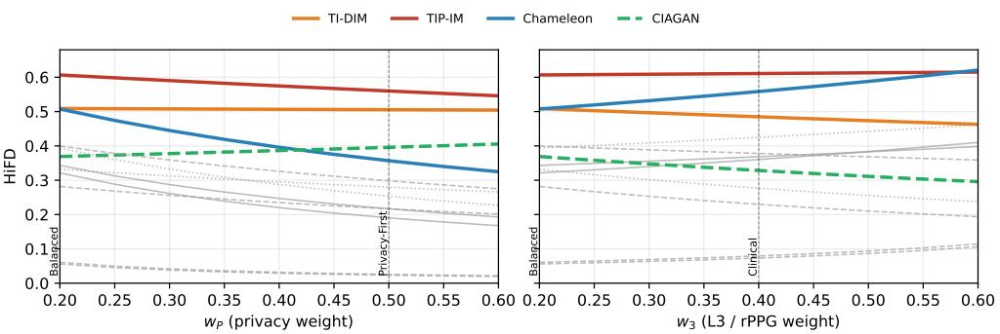  
Figure 7: Continuous weight sweeps. HiFD for all twelve methods as wP (left) or w3 (right) varies from 0.2 to 0.6 with the remaining weight split equally; solid, dashed, and dotted lines are adversarial, GAN, and diffusion methods, and the four methods that ever enter the top three are highlighted.

Table 12: Weight sweep, tabulated. HiFD of the four methods that enter the top three at any setting.
<table><tr><td rowspan="2">Method</td><td colspan="5"> $w _ { P }$  (remainder equal)</td><td colspan="5"> $w _ { 3 }$  (remainder equal)</td></tr><tr><td>0.2</td><td>0.3</td><td>0.4</td><td>0.5</td><td>0.6</td><td>0.2</td><td>0.3</td><td>0.4</td><td>0.5</td><td>0.6</td></tr><tr><td>TIP-IM</td><td>0.607</td><td>0.590</td><td>0.575</td><td>0.560</td><td>0.546</td><td>0.607</td><td>0.609</td><td>0.611</td><td>0.613</td><td>0.615</td></tr><tr><td>TI-DIM</td><td>0.509</td><td>0.508</td><td>0.507</td><td>0.506</td><td>0.504</td><td>0.509</td><td>0.497</td><td>0.485</td><td>0.474</td><td>0.463</td></tr><tr><td>Chameleon</td><td>0.508</td><td>0.445</td><td>0.396</td><td>0.357</td><td>0.325</td><td>0.508</td><td>0.532</td><td>0.558</td><td>0.588</td><td>0.621</td></tr><tr><td>CIAGAN</td><td>0.369</td><td>0.378</td><td>0.386</td><td>0.396</td><td>0.406</td><td>0.369</td><td>0.348</td><td>0.328</td><td>0.311</td><td>0.296</td></tr><tr><td>Leader</td><td colspan="5">TIP-IM throughout</td><td colspan="5">TIP-IM</td></tr></table>

## C.6 Quality Axis: Reference-Free Alternatives

Half of Q is LPIPS similarity to the original. Since successful identity replacement necessarily changes appearance, LPIPS could in principle conflate “changed the face” with “degraded the face”. We tested this with two measures that never see the original, BRISQUE [59] and TOPIQ face-IQA [7], on a paired 12,000-image subset per method, and rebuilt a reference-free quality term $Q _ { \mathrm { n r } }$ as the mean of the two normalized scores. Tab. 13 reports the results. Three observations. (i) LPIPS is not the mechanism penalizing replacement methods: dropping it moves the replacement family down on average (mean rank shift −0.5) and the perturbation family up (+0.5), and CIAGAN falls from rank 6 to 9 rather than rising, because its quality deficit is visible without any reference (BRISQUE 80.9 and TOPIQ 0.250 against 38.4 and 0.752 for the originals, and the highest facedetection failure rate of any method, 0.7%). Genuinely clean appearance-changing methods score near the originals (Adv-Makeup 39.0, AMT-GAN 39.4). (ii) The published and reference-free Q rank methods almost independently (Spearman 0.126): the two capture different things, fidelity to the source versus freedom from artifacts, which is why we report the sub-scores separately. (iii) The composite is insensitive to the choice: substituting $Q _ { \mathrm { n r } }$ leaves Spearman 0.951 with the same top three, and removing Q altogether leaves 0.979. The human study (Appendix E) adds that LPIPS has no detectable rank association with human naturalness, so $Q$ should be described as an artifact and fidelity term rather than a naturalness term.

Table 13: Reference-free quality and its effect on the composite. BRISQUE (lower is better) and TOPIQ face-IQA (higher is better) on 12,000 images per method (originals: 38.4 / 0.752). $Q _ { \mathrm { n r } }$ averages the normalized scores; ranks in parentheses are within the column. The last three columns are HiFD with $Q _ { \mathrm { n r } }$ substituted, with Q removed (four-axis harmonic mean), and as published.
<table><tr><td>Method</td><td>BRISQUE↓</td><td>TOPIQ↑</td><td> $Q _ { \mathrm { n r } }$  (rank)</td><td>Q (rank)</td><td> $\mathbf { H i F D } [ Q _ { \mathrm { n r } } ]$ </td><td>HiFD[no Q]</td><td>HiFD</td></tr><tr><td colspan="8">(a) Adversarial perturbation</td></tr><tr><td>MI-FGSM</td><td>15.7</td><td>0.633</td><td>0.738 (2)</td><td>0.360 (10)</td><td>0.380 (6)</td><td>0.339 (7)</td><td>0.343 (7)</td></tr><tr><td>PGD</td><td>14.9</td><td>0.648</td><td>0.749 (1)</td><td>0.362 (9)</td><td>0.354 (7)</td><td>0.313 (9)</td><td>0.321 (9)</td></tr><tr><td>TI-DIM</td><td>25.3</td><td>0.575</td><td>0.661 (4)</td><td>0.342 (11)</td><td>0.595 (2)</td><td>0.580 (2)</td><td>0.509 (2)</td></tr><tr><td>TIP-IM</td><td>40.5</td><td>0.670</td><td>0.632 (7)</td><td>0.446 (5)</td><td>0.660 (1)</td><td>0.667 (1)</td><td>0.607 (1)</td></tr><tr><td>Chameleon</td><td>40.5</td><td>0.701</td><td>0.648 (5)</td><td>0.474 (3)</td><td>0.538 (3)</td><td>0.517 (3)</td><td>0.508 (3)</td></tr><tr><td colspan="8">(b) GAN-based generation</td></tr><tr><td>Adv-Makeup</td><td>39.0</td><td>0.740</td><td>0.675 (3)</td><td>0.524 (1)</td><td>0.056 (12)</td><td>0.046 (12)</td><td>0.056 (12)</td></tr><tr><td>AMT-GAN</td><td>39.4</td><td>0.666</td><td>0.636 (6)</td><td>0.481 (2)</td><td>0.290 (10)</td><td>0.255 (10)</td><td>0.282 (10)</td></tr><tr><td>CIAGAN</td><td>80.9</td><td>0.250</td><td>0.221 (12)</td><td>0.276 (12)</td><td>0.346 (9)</td><td>0.403 (4)</td><td>0.369 (6)</td></tr><tr><td>DeID-rPPG</td><td>69.7</td><td>0.497</td><td>0.400 (11)</td><td>0.407 (7)</td><td>0.061 (11)</td><td>0.050 (11)</td><td>0.061 (11)</td></tr><tr><td>G²Face</td><td>48.6</td><td>0.632</td><td>0.573 (9)</td><td>0.443 (6)</td><td>0.417 (4)</td><td>0.390 (5)</td><td>0.400 (4)</td></tr><tr><td colspan="8">(c) Diffusion-based generation</td></tr><tr><td>WeakenDiff</td><td>61.7</td><td>0.592</td><td>0.488 (10)</td><td>0.371 (8)</td><td>0.347 (8)</td><td>0.323 (8)</td><td>0.332 (8)</td></tr><tr><td>DiffAM</td><td>40.8</td><td>0.643</td><td>0.617 (8)</td><td>0.471 (4)</td><td>0.410 (5)</td><td>0.378 (6)</td><td>0.394 (5)</td></tr><tr><td colspan="8">Spearman with published HiFD</td></tr></table>

## D Comparative Study: Extended Results

## D.1 Qualitative Comparisons

We present qualitative comparisons on two representative UTILFACE samples chosen to span pose and lighting variation: Fig. 8 shows a near-frontal female subject under uniform illumination, and Fig. 9 shows a three-quarter-view male subject under lateral lighting. The 12-method grids are organized identically (rows by paradigm, columns by method) to enable cross-method visual comparison.

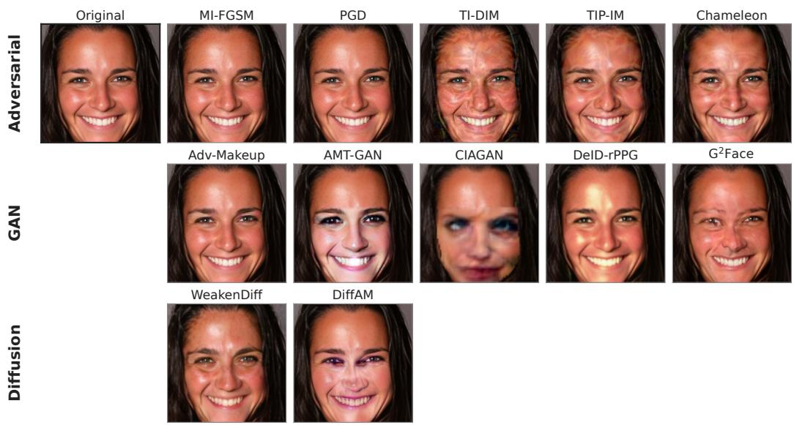  
Figure 8: Qualitative comparison on a representative UTILFACE sample. Original (top-left) and 12 deidentified outputs grouped by paradigm.

## D.2 Demographic Fairness Under Profile Reweighting

We extend the demographic decomposition of Fig. 5 to the two non-balanced profiles defined in §3.2: the Privacy-First profile (Fig. 10), which doubles the privacy weight, and the Clinical profile (Fig. 11), which emphasizes physiological L3 utility.

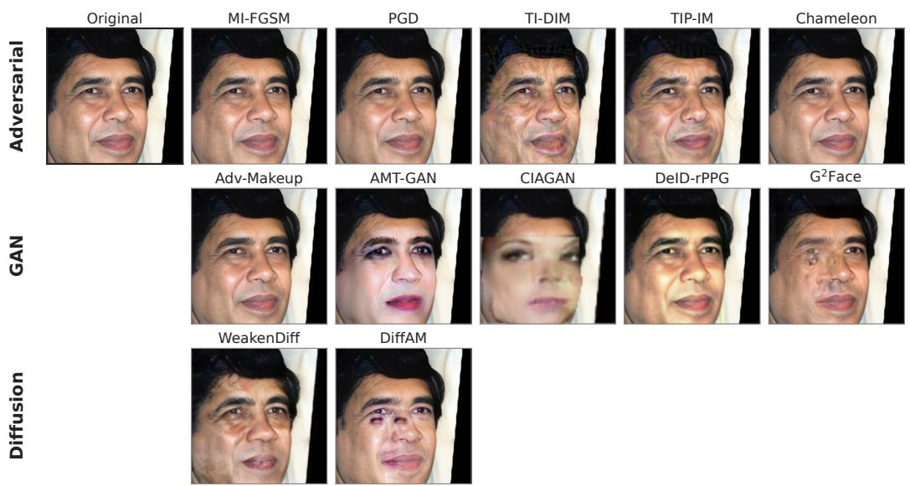

Figure 9: Qualitative comparison on a representative UTILFACE sample. Same layout as Fig. 8.  
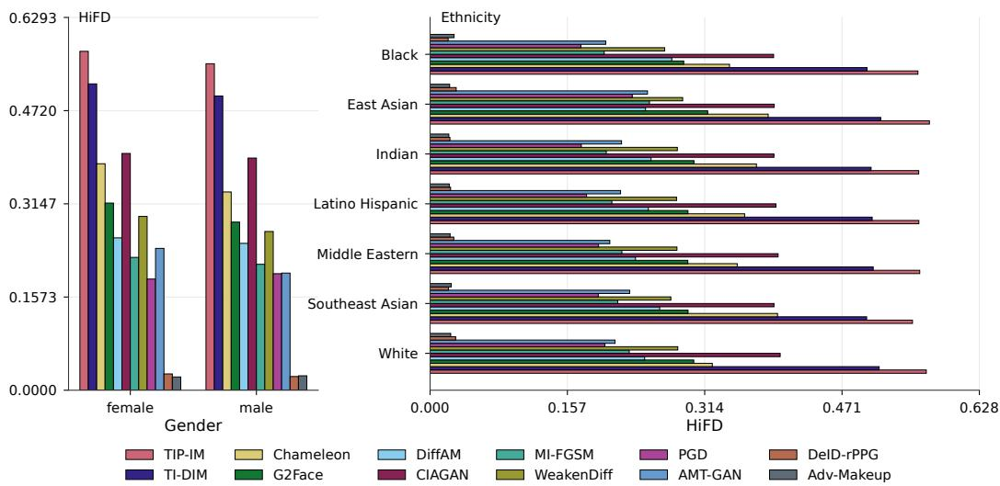  
Figure 10: Per-demographic-slice Privacy-First HiFD on UTILFACE. Same layout as Fig. 5; methods are ordered by global Privacy-First HiFD (descending). Left shows the female/male split and right shows the seven-way ethnicity split (alphabetical).

Under Privacy-First, the aggregate male-female gap widens slightly to 0.018 (female 0.287, male 0.269) and the ethnicity spread widens to 0.021 (East Asian highest at 0.292, Black lowest at 0.271). Per-method, Chameleon shows the widest gender gap (0.048) and the widest ethnicity range (0.075, peaking on Southeast Asian), while CIAGAN, Adv-Makeup, and DeID-rPPG retain ranges below 0.010. Under Clinical, the aggregate gaps shrink: 0.008 for gender and 0.013 for ethnicity, with PGD the widest by ethnicity (0.059, East Asian peak) and Chameleon the widest by gender (0.032). Across both profiles, the qualitative structure observed on the Balanced profile is preserved: the East-Asian-peak / Black-trough ordering survives the reweighting on the aggregate. The per-method peak ethnicity is method-specific rather than profile-specific (PGD and MI-FGSM peak on East Asian, Chameleon on Southeast Asian, DiffAM on Black) and matches the Balanced ranking; and the methods with the smallest disparities under the Balanced HiFD (TIP-IM, TI-DIM, CIAGAN, Adv-Makeup; ethnicity $\mathrm { r a n g e } \le 0 . 0 2 0$ under every profile) remain so. The top-ranked method TIP-IM continues to lead under both profiles (HiFD = 0.560 Privacy-First, 0.611 Clinical) with gender $\mathrm { g a p } \leq 0 . 0 2 1$ and ethnicity range ≤ 0.019, so its leadership is not a profile-specific artifact. Profile reweighting changes which component is amplified, not which subgroup is favored.

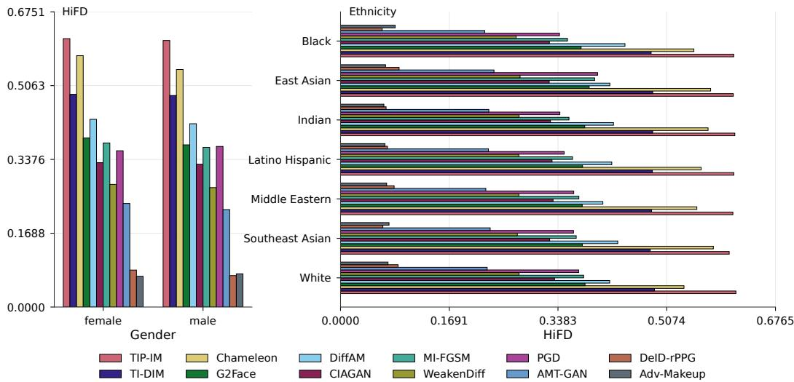  
Figure 11: Per-demographic-slice Clinical HiFD on UTILFACE. Same layout as Fig. 5.

Table 14: $U _ { 3 }$ on MMPD versus PURE. MMPD $U _ { 3 } ;$ PURE $U _ { 3 } ;$ the range of $U _ { 3 }$ over the four illumination and five motion conditions of MMPD; and the contact-sensor validation of Appendix C.1.2: the increase in heart-rate MAE caused by de-identification (∆MAE, bpm) and the fraction of the original HR accuracy retained.
<table><tr><td>Method</td><td> $U _ { 3 }$  MMPD [95% CI]</td><td> $U _ { 3 }$  PURE</td><td>Illumination range</td><td>Motion range</td><td>∆MAE (bpm)</td><td>HR retention</td></tr><tr><td colspan="7">(a) Adversarial perturbation</td></tr><tr><td>MI-FGSM</td><td>0.503 [0.491, 0.514]</td><td>0.474</td><td>[0.470, 0.520]</td><td>[0.400, 0.689]</td><td>3.3 [2.5,4.2]</td><td>0.834</td></tr><tr><td>PGD</td><td>0.558 [0.546, 0.570]</td><td>0.566</td><td>[0.523, 0.578]</td><td>[0.445, 0.755]</td><td>2.2 [1.5,3.0]</td><td>0.889</td></tr><tr><td>TI-DIM</td><td>0.410 [0.398, 0.421]</td><td>0.424</td><td>[0.379, 0.437]</td><td>[0.322, 0.585]</td><td>4.1 [3.2,5.0]</td><td>0.794</td></tr><tr><td>TIP-IM</td><td>0.651 [0.640, 0.662]</td><td>0.624</td><td>[0.614, 0.683]</td><td>[0.591, 0.767]</td><td>1.7 [1.0,2.4]</td><td>0.913</td></tr><tr><td>Chameleon</td><td>0.709 [0.700, 0.718]</td><td>0.799</td><td>[0.677, 0.723]</td><td>[0.677, 0.727]</td><td>0.7 [0.0, 1.3]</td><td>0.966</td></tr><tr><td colspan="7">(b) GAN-based generation</td></tr><tr><td>Adv-Makeup</td><td>0.880 [0.874, 0.885]</td><td>0.931</td><td>[0.870, 0.885]</td><td>[0.863, 0.920]</td><td>0.0 [−0.5,0.4]</td><td>1.001</td></tr><tr><td>AMT-GAN</td><td>0.156 [0.149, 0.163]</td><td>0.148</td><td>[0.149, 0.167]</td><td>[0.113, 0.232]</td><td>7.3 [6.3,8.3]</td><td>0.635</td></tr><tr><td>CIAGAN</td><td>0.170 [0.164, 0.177]</td><td>0.247</td><td>[0.169, 0.172]</td><td>[0.128, 0.224]</td><td>7.4 [6.5,8.4]</td><td>0.628</td></tr><tr><td>DeID-rPPG G²Face</td><td>0.729 [0.719, 0.739]</td><td>0.907</td><td>[0.684, 0.785]</td><td>[0.676, 0.816]</td><td>0.6 [−0.1, 1.2]</td><td>0.971</td></tr><tr><td></td><td>0.319 [0.310, 0.329]</td><td>0.326</td><td>[0.293, 0.339]</td><td>[0.261, 0.434]</td><td>3.6 [2.7,4.5]</td><td>0.819</td></tr><tr><td colspan="7">(c) Diffusion-based generation</td></tr><tr><td>WeakenDiff DiffAM</td><td>0.273 [0.264, 0.282]</td><td>0.185</td><td>[0.256, 0.281]</td><td>[0.212, 0.429]</td><td>4.5 [3.6,5.4]</td><td>0.773</td></tr><tr><td></td><td>0.441 [0.432, 0.449]</td><td>0.557</td><td>[0.434, 0.446]</td><td>[0.378, 0.515]</td><td>1.2 [0.4,2.1]</td><td>0.939</td></tr></table>

Spearman(MMPD, PURE) = 0.986 (Pearson 0.967); same top three and bottom three. Spearman(U3, −∆MAE) = 0.944 on MMPD, 0.993 on PURE

## D.3 L3 Replication on the MMPD Dataset

PURE has ten subjects, so we replicate the L3 evaluation on a larger dataset. We de-identified the full MMPD dataset [75] (33 subjects, 655 trials, 392,832 frames after intersecting the keys common to all methods; frame-identical across conditions) with all twelve methods and re-ran the three rPPG estimators with no retraining. We deliberately did not use UBFC-rPPG, on which PhysNet, EfficientPhys, and FactorizePhys are trained, to avoid a train/test leak. MMPD is stratified by four illumination conditions (LED-low, LED-high, incandescent, natural) and five motion conditions (stationary, stationary after exercise, rotation, talking, walking), which lets us check that the familylevel separation is not an artifact of one recording condition.

Tab. 14 reports the results. The PURE ordering replicates at Spearman 0.986 with the same top three (Adv-Makeup, DeID-rPPG, Chameleon) and bottom three (AMT-GAN, CIAGAN, WeakenDiff), and the MMPD intervals (subject-level bootstrap over 33 subjects) are five to six times tighter than the PURE intervals of Tab. 10, so $U _ { 3 }$ is no longer the small-sample component of the composite. Finding 2 replicates at the family level: the five adversarial methods average $\mathsf { \bar { U } } _ { 3 } = 0 . 5 6 6$ on MMPD (0.577 on PURE), the seven generative methods 0.424 (0.472), and the five generative methods that resynthesize the face region (AMT-GAN, CIAGAN, $\mathrm { G ^ { 2 } }$ Face, WeakenDiff, DiffAM) only 0.272 (0.293); the two GAN methods that leave the skin largely untouched, Adv-Makeup (eye-region makeup) and DeIDrPPG (trained to preserve the pulse), are the exceptions already noted. The separation is not an artifact of one condition: Adv-Makeup holds $U _ { 3 } \ \stackrel { - } { \in } \ [ 0 . 8 6 3 , 0 . 9 \dot { 2 } 0 ]$ across every illumination and motion condition and CIAGAN stays within [0.128, 0.224] throughout. Two methods move noticeably between datasets (DeID-rPPG 0.907 → 0.729, Chameleon 0.799 → 0.709), consistent with MMPD’s harder motion and lighting, without changing their ranks. The contact-sensor columns give the same ranking from ground truth rather than consistency.

## E Human Perceptual Study

HiFD is estimator-based. The study reported here asks whether its judgments agree with human perception on the three axes where a mismatch would matter most: (H1) does human naturalness track the reference-free quality terms rather than LPIPS; (H2) does human-judged attribute preservation track $U _ { 1 }$ , with the concrete counter-hypothesis that CIAGAN preserves demographics to a human despite its low $U _ { 1 }$ ; (H3) does the privacy score track human identity matching. It is not a validation of HiFD against human perception in general, and we report its limits with its results.

## E.1 Protocol

Design. Within-subject, two parts, the unpaired part always first so that seeing an original cannot anchor the naturalness judgments. Part 1 (unpaired). One face at a time, no original shown, condition not disclosed; two independent 5-point items: naturalness (“Could this be a real, unedited photograph?”, from Definitely edited to Definitely a real photo) and artifacts (“How visible are visual defects?”, from None visible to Severe). Unmodified originals are included as unlabeled stimuli. Part 2 (paired). Original and de-identified image side by side with random left/right order; the rater ticks which of four attributes still match (age within about ten years, gender, ethnicity, facial expression) as independent checkboxes, then judges identity (same person / different people / unsure). Asking per attribute is deliberate: $U _ { 1 }$ is an average of per-attribute consistency scores, so only a per-attribute human measurement is commensurable with it.

Stimuli. Thirty base identities drawn stratified across the 14 gender-by-ethnicity strata of UTIL-FACE, so the rated sample inherits the benchmark’s balance; 13 conditions (12 methods plus the unmodified original); 390 unique images. Each rater sees a balanced block of 39 single images (3 per condition), 24 pairs (2 per method), and 4 quality-control trials (two identical pairs, one deliberately corrupted image, and the originals themselves), about 15 minutes in total.

Quality control, pre-specified. Three checks were fixed before collection: mean naturalness on originals at or above 3.0; the corrupted image rated at most 2.0; identical pairs judged “same person”. A rater failing two or more checks is excluded; trials answered faster than 800 ms are dropped. 24 raters were collected; the rule excluded 2, leaving 22 against a target of 30. Check 1 turned out to be mis-specified against a restored-image benchmark (it fires for 10 of 24 raters because the originals themselves are rated only 3.32/5; see below) and is retained only because it was pre-registered; every result below is stable under all four exclusion rules we tested, including one that keeps only 9 raters.

Participants and consent. Participants were consenting adults (≥ 18) recruited as a convenience sample. Participation was voluntary. No name, e-mail address, IP address, or other identifying information was recorded; responses stayed in the rater’s browser until the rater chose to download and return a results file, with no server, cookies, or tracking, and withdrawal was possible at any point by closing the page. Raters were told that the faces are of real people from public research datasets and were asked not to save or share them. The consent screen and the two instruction screens are reproduced verbatim below.

Face image perception study. About 15 minutes. No personal data is collected. What you will do. You will look at photographs of faces and answer short questions about them. Some images are unmodified photographs; others have been altered by automatic privacyprotection software. Your job is to report what you see. There are no right or wrong answers on the rating questions. About the images. The faces are of real people, taken from public research datasets that are already used for scientific work under their stated licences. Please do not save, copy or share the images. Your data. No name, email, IP address or any identifying information is recorded. Responses stay in your browser until you download a results file at the end and return it to the researcher. No cookies and no tracking of any kind. You may stop at any time by closing this page; nothing is sent unless you choose to download and return the file. Responses are used only in aggregate, to evaluate an image-quality metric. Before you start. Use a laptop or desktop if you can, on a screen you can see clearly. Work somewhere without glare, at your normal viewing distance. If you use glasses or contacts for screen work, please wear them. [ ] I am at least 18 years old, I have read the above, and I agree to take part.

Part 1 of 2: single images. You will see one face at a time. For each one, answer two separate questions. Question 1. Is it a real photo? Could this be an ordinary, unedited photograph of a person? Judge the image as a whole. Do not try to guess whether software was used, just report how real it looks to you. Question 2. Are there visible defects? Blurring, smearing, warped features, visible seams or edges, odd colour patches, repeated texture. Report only what you can actually see. These two questions are independent. An image can look like a real photograph and still have a small defect somewhere, and a picture can be defect-free yet still look artificial. Please answer each on its own. You can click the options or press keys 1 to 5. Answer at a comfortable pace and trust your first impression; there is no time limit but you should not deliberate for long.

Part 2 of 2: image pairs. Now you will see two images side by side. One is an original photograph and the other has been altered by privacy software, but the order is random, so do not assume the original is on either side. Question 1. What still matches? Tick each characteristic that looks the same in both images. Judge each one separately. It is perfectly normal for some to match and others not. Question 2. Same person? Would you say these two images show the same individual? Choose Unsure if you genuinely cannot tell; that is a useful answer, not a failure. Judge only the characteristics asked about. The two images may differ in many other ways at the same time, and that is expected.

Analysis, specified before collection. Per-condition means with cluster-bootstrap intervals that resample raters (10,000 resamples); method-level Spearman correlations of human naturalness against BRISQUE, TOPIQ, NIQE, LPIPS, and the published Q (H1), of human attribute preservation against U with per-method residuals (H2), and of human same-person rate against P¯ and fixed-FAR success (H3), each with a permutation p-value over methods; Krippendorff’s α for the ordinal items and Fleiss’ κ for the binary items. Reporting the residuals, not only the correlation, is what makes H2 a test rather than a demonstration.

## E.2 Results

Table 15: Human ratings by condition (22 raters, 1,386 trials). Naturalness and artifacts are 5-point means on unpaired images (higher naturalness and lower artifacts are better); attributes kept is the fraction of the four attributes judged to match on pairs; same person is the fraction of pairs judged to show the same individual (lower is more private). Intervals are rater-level cluster bootstraps.
<table><tr><td>Condition</td><td>Naturalness↑</td><td>Artifacts↓</td><td>Attributes kept↑</td><td>Same person↓</td></tr><tr><td>Unmodified original</td><td>3.32 [2.92, 3.70]</td><td>2.08</td><td>一</td><td>一</td></tr><tr><td colspan="5">(a) Adversarial perturbation</td></tr><tr><td>MI-FGSM</td><td>3.12 [2.73,3.53]</td><td>2.08</td><td>0.966 [0.898, 1.000]</td><td>0.977 [0.932, 1.000]</td></tr><tr><td>PGD</td><td>3.35 [2.95,3.71]</td><td>2.02</td><td>0.932 [0.847,0.994]</td><td>1.000 [1.000, 1.000]</td></tr><tr><td>TI-DIM</td><td>1.32 [1.14, 1.52]</td><td>4.52</td><td>0.881 [0.795,0.949]</td><td>0.886 [0.773, 0.977]</td></tr><tr><td>TIP-IM</td><td>1.55 [1.27, 1.86]</td><td>4.29</td><td>0.858 [0.761, 0.938]</td><td>0.909 [0.795, 1.000]</td></tr><tr><td>Chameleon</td><td>2.20 [1.83, 2.58]</td><td>3.32</td><td>0.938 [0.869, 0.989]</td><td>0.932 [0.864, 1.000]</td></tr><tr><td colspan="5">(b) GAN-based generation</td></tr><tr><td>Adv-Makeup</td><td>3.27 [2.85, 3.65]</td><td>2.11</td><td>0.972 [0.920, 1.000]</td><td>0.977 [0.932, 1.000]</td></tr><tr><td>AMT-GAN</td><td>1.98 [1.71, 2.26]</td><td>3.58</td><td>0.830 [0.739, 0.909]</td><td>0.727 [0.568, 0.886]</td></tr><tr><td>CIAGAN</td><td>1.20 [1.02, 1.42]</td><td>4.80</td><td>0.159 [0.085, 0.244]</td><td>0.114 [0.000, 0.250]</td></tr><tr><td>DeID-rPPG</td><td>2.36 [1.86, 2.89]</td><td>3.24</td><td>0.903 [0.818,0.966]</td><td>0.977 [0.932, 1.000]</td></tr><tr><td>G²Face</td><td>1.23 [1.08, 1.44]</td><td>4.56</td><td>0.722 [0.614,0.824]</td><td>0.614 [0.455, 0.773]</td></tr><tr><td colspan="5">(c) Diffusion-based generation</td></tr><tr><td>WeakenDiff</td><td>2.26 [1.91, 2.64]</td><td>3.05</td><td>0.818 [0.733, 0.892]</td><td>0.795 [0.682, 0.909]</td></tr><tr><td>DiffAM</td><td>1.15 [1.03, 1.32]</td><td>4.70</td><td>0.682 [0.551, 0.795]</td><td>0.636 [0.455, 0.795]</td></tr></table>

Raters discriminated. Three methods (PGD, Adv-Makeup, MI-FGSM) are statistically indistinguishable from the unmodified original on naturalness (within-rater differences with intervals covering zero) and the other nine are all significantly below it (Tab. 15). Naturalness and artifacts correlate at −0.85 across trials, related but not redundant. The originals themselves score only 3.32/5:

UTILFACE images pass through GFPGAN/CodeFormer restoration, so raters correctly decline to call them unedited photographs. This is a finding about the benchmark, not about the raters, and it means the naturalness ceiling of UTILFACE is not 5.

H1: what human naturalness tracks. At the method level, human naturalness correlates with BRISQUE at Spearman 0.517 (permutation $p = 0 . 0 9 )$ , with TOPIQ at 0.336 $( p = 0 . 2 8 )$ , with NIQE at −0.133, with the published $Q$ at 0.091, and with LPIPS at exactly $0 . 0 0 0 \ : ( p = 1 . 0 0 )$ . The defensible claim is the null: LPIPS similarity to the original has no detectable rank association with human naturalness. The reference-free alternatives do better (the paired gap BRISQUE minus LPIPS $\mathrm { i s + 0 . 4 9 [ + 0 . 3 2 , + 0 . 6 2 ] }$ under the rater bootstrap), but with twelve methods even BRISQUE does not reach significance against method sampling, so we do not claim a validated naturalness proxy. HiFD (Balanced) itself correlates at $- 0 . 6 2$ with human naturalness; this is the intended trade-off rather than a disagreement, since naturalness runs at −0.66 against $\bar { P }$ and +0.91 against $U _ { 1 }$ , and within the human data the same-person rate correlates at +0.89 with naturalness: the methods humans cannot see through are the ones they rate unnatural. HiFD does not, and should not, track naturalness.

H2: attribute preservation and the CIAGAN question. Human attribute preservation tracks $U _ { 1 }$ at Spearman 0.762 [0.567, 0.848], permutation $p = 0 . 0 0 7$ . The counter-hypothesis that CIAGAN may preserve recognizable demographic attributes to a human despite its low $U _ { 1 }$ is refuted in the opposite direction: humans put CIAGAN’s attribute preservation at 0.159 [0.085, 0.244], far below its $U _ { 1 }$ of 0.468, with Pr(human $\ge U _ { 1 } ) = 0 . 0 0 0$ under the rater bootstrap. If $U _ { 1 }$ errs on CIAGAN, it errs by being too generous. The largest positive residual is TI-DIM, where humans credit more preservation (0.881) than $U _ { 1 }$ does (0.757).

H3: privacy, and why pooling is the wrong test. Pooled over all twelve methods, the human same-person rate correlates with $\bar { P } \mathrm { a t } - 0 . 5 4 9 \bar { ( p = 0 . 0 7 ) }$ and with fixed-FAR success at only −0.247. This pools two threat models. Within the five adversarial methods the Spearman correlation with fixed-FAR success is −1.000, and within the seven generative methods (GAN-based and diffusionbased) it $\mathrm { i s - 1 . 0 0 0 }$ : humans reproduce the operational de-identification ranking exactly inside each paradigm. The pooled figure is low because adversarial methods are engineered to defeat a recognizer while remaining near-invisible to a person (PGD same-person rate 1.000 at $\bar { P } = 0 . 1 1 3 )$ , whereas replacement methods change the face outright (CIAGAN 0.114). The correct statement is that $\bar { P }$ is a machine-recognizer privacy score, it ranks operational risk correctly within a paradigm, and humans are not the adversary it models.

The frontier, measured entirely by humans. No method hides identity from a human (sameperson $\mathrm { r a t e } < 0 . 5 )$ while preserving attributes to a human $( > 0 . 7 )$ . Only CIAGAN clears the identity bar, and it destroys the attributes doing so; every method that keeps attributes above 0.7 is still recognized as the same person by at least 61% of raters. Sweeping the identity threshold over $\{ 0 . 3 , \bar { 0 . 4 } , 0 . 5 , 0 . 6 \}$ and the attribute threshold over {0.5, 0.6, 0.7, 0.8} leaves the set empty in all sixteen combinations; only at an identity threshold of 0.7, meaning 70% of raters still say “same person”, does any method qualify, which is not de-identification.

Reliability and limitations. Krippendorff’s α is 0.42 on naturalness and 0.64 on artifacts; Fleiss’ κ on the attribute majority is 0.45. The naturalness value is below the conventional 0.667 and must be read as such; two contributors are uneven block assignment (raters were not assigned round-robin, so 78 of 312 (identity, condition) cells are singly rated and one block drew no rater) and the compressed effective range (originals at 3.32 rather than at ceiling), which deflates α mechanically. Method-level correlations rest on twelve points, and the permutation p-values are the conservative reading. Raters are a convenience sample rather than a demographically balanced panel. Every conclusion above survives all four exclusion rules (pre-specified, $n = 2 2 ;$ none, $n = 2 4 ;$ dropping the mis-specified check, $n = 1 8 ;$ any single failure excludes, $n = 9 )$ . For these reasons the study supports three specific claims (LPIPS is not what humans respond to; $U _ { 1 }$ is not too generous to attribute-destroying methods; $\bar { P }$ is a recognizer-side score) and one replication of the central finding, not a general validation of HiFD against human perception.

Table 16: Pretrained checkpoints used in HiFD. URLs as released by the original authors. † Architecture is the inference backbone. ArcFace, CosFace, and AdaFace are insightface-style IR networks trained with different losses on different data.
<table><tr><td>Component</td><td>Model</td><td>Arch.†</td><td>Train data</td><td>Source</td></tr><tr><td colspan="5">Privacy ensemble</td></tr><tr><td>P (1/3)</td><td>ArcFace [12]</td><td>IR-R100</td><td>MS1MV3</td><td>insightface model zoo</td></tr><tr><td>P (2/3)</td><td>CosFace [76]</td><td>IR-R50</td><td>Glint360K</td><td>insightface model zoo</td></tr><tr><td>P (3/3)</td><td>AdaFace [38]</td><td>IR-50</td><td>MS1MV2</td><td>official release</td></tr><tr><td colspan="5">L1 macro-cues</td></tr><tr><td>Age, Gender</td><td>MiVOLO [41]</td><td>ViT-MiVOLO</td><td>UTKFace</td><td>official release</td></tr><tr><td>Ethnicity</td><td>FairFace [33]</td><td>ResNet-34</td><td>FairFace 7-race</td><td>official release</td></tr><tr><td>Macro-expression</td><td>POSTER [98]</td><td>POSTER</td><td>RAF-DB (K=7)</td><td>official release</td></tr><tr><td>Landmarks (68)</td><td>MediaPipe [53]</td><td>FaceLandmarker</td><td>in-the-wild faces</td><td>Google MP tasks</td></tr><tr><td colspan="5">L1 alternatives used only in the substitution study (Appendix C.4)</td></tr><tr><td>Age (alt.)</td><td>ViT age classifier</td><td>ViT-B/16</td><td>FairFace age bins</td><td>HFnateraw/vit-age-classifier</td></tr><tr><td>Ethnicity (alt.)</td><td>ViT ethnicity (5-class)</td><td>ViT-B/16</td><td>independent 5-class corpus</td><td>HF cledoux42/Ethnicity_Test_v003</td></tr><tr><td>Macro-exp. (alt.)</td><td>POSTER [98]</td><td>POSTER</td><td>AffectNet (K=7)</td><td>official release</td></tr><tr><td>Macro-exp. (alt.)</td><td>FER ViT</td><td>ViT-B/16</td><td>FER-2013 (K=7)</td><td>HF trpakov/vit-face-expression</td></tr><tr><td colspan="5">L2 micro-cues</td></tr><tr><td>Gaze</td><td>L2CS-Net [1]</td><td>ResNet-50</td><td>Gaze360 [35]</td><td>official release</td></tr><tr><td>Micro-expression</td><td>SAMER [67]</td><td>ResNet-18 (×2)</td><td>CASME II (K=5, 26 LOSO folds)</td><td>official release</td></tr><tr><td colspan="5">L3 imperceptible cues</td></tr><tr><td>rPPG (1/3)</td><td>PhysNet [90]</td><td>3D-CNN</td><td>UBFC-rPPG</td><td>rPPG-Toolbox release</td></tr><tr><td>rPPG (2/3)</td><td>EfficientPhys [48]</td><td>TS-CNN</td><td>UBFC-rPPG</td><td>rPPG-Toolbox release</td></tr><tr><td>rPPG (3/3)</td><td>FactorizePhys [32]</td><td>FSAM</td><td>UBFC-rPPG</td><td>rPPG-Toolbox release</td></tr><tr><td colspan="5">Quality</td></tr><tr><td>LPIPS-VGG</td><td>LPIPS [93]</td><td>VGG-16</td><td></td><td>pyiqa</td></tr><tr><td>NIQE</td><td>NIQE [60]</td><td>hand-crafted</td><td></td><td>pyiqa</td></tr><tr><td colspan="5">Detection / alignment (cached once on the original)</td></tr><tr><td>Face detection</td><td>RetinaFace [11]</td><td>ResNet-50</td><td>WIDER FACE</td><td>official release</td></tr></table>

## F Reproducibility Details

## F.1 Hardware and Software Environment

All inference and scoring jobs were executed on a supercomputer equipped with AMD MI250X GPUs. We use a Conda environment built on rocm/6.0.3 with PyTorch 2.3.1. The single global random seed is 42, applied to NumPy, PyTorch (CUDA/HIP RNGs), and Python’s random module at the top of every extraction script. All estimators are run in inference mode with a fixed batch order.

## F.2 Pretrained Estimator Checkpoints

Tab. 16 lists every pretrained checkpoint used in HiFD. All checkpoints are released by their original authors under research-only licenses.