# INSTANCEBENCH: DIAGNOSING REFERENTIAL REA-SONING AND TARGET IDENTITY IN REFERRING EX-PRESSION SEGMENTATION

Yuchen Li<sup>1</sup> Shaoyang Zhou<sup>1</sup> Yiran Wang<sup>1</sup> Ruiyi Deng<sup>1</sup> Haoyu Wang<sup>1</sup> Ziru Wei<sup>2</sup> Zhen Zhao<sup>3</sup> Luping Zhou<sup>1</sup>

<sup>1</sup>The University of Sydney <sup>2</sup>The ATLAS Institute <sup>3</sup>Shanghai Artificial Intelligence Laboratory

Project page: https://github.com/aierwaixi/InstanceBench

## ABSTRACT

Referring Expression Segmentation (RES) links natural-language descriptions to pixel-level object masks. Yet standard evaluation provides limited insight into instance-level referential reasoning: it does not systematically distinguish referential logics, test target preservation across valid grounding paths, or separate target-selection from mask-generation errors. We introduce InstanceBench, an instance-centered diagnostic benchmark comprising 6,194 images, 9,264 target instances, and 25,077 human-verified expressions. Each target-centric expression set (TCES) fixes the image and target mask while pairing a minimal expression with a same-target variant that uses another valid cue or grounding path. A compact referential-logic taxonomy spans direct target evidence, same-class selection, relational and compositional grounding, and exclusion, while logiccritical construction suppresses simpler shortcuts. Identity-aware metrics measure target retention and set-level success while separating selection from maskgeneration errors. Across 22 native-mask RES checkpoints from 18 model families, the strongest checkpoint reaches 67.1% mIoU but only 59.6% All@0.7. Controlled interventions confirm language sensitivity, while failure decomposition identifies target selection rather than mask decoding as the main bottleneck. On a controlled training subset, matched supervision improves identity-aware performance, showing that the diagnosed capability responds to targeted supervision. Collectively, InstanceBench supports a measure–diagnose–improve cycle: measuring target consistency across grounding paths, localizing failure sources, and evaluating targeted interventions.

## 1 INTRODUCTION

Referring Expression Segmentation (RES) produces a pixel-level mask for the object instance specified by a natural-language expression. Unlike category-level segmentation, RES requires two coupled decisions: target selection and mask generation. This distinction is critical when multiple objects of the same category share a scene. For example, the same person may be identified as “the second person from the left,” “the person beside the bicycle,” or “the person between two seated women”—three valid expressions that follow different grounding paths but should return to the same target instance. Rather than mere paraphrases, these expressions instantiate different referential logics: ways of structuring visual evidence to distinguish the target from competing instances. Executing these referential logics requires more than image–text alignment: models must identify target evidence, compare same-class instances, resolve object relations, compose multiple constraints, or eliminate alternatives.

Datasets such as RefCOCO, RefCOCO+, and RefCOCOg (Yu et al., 2016; Mao et al., 2016) have advanced RES, and recent systems (Wang et al., 2026a;b; Wei et al., 2025a;b) achieve increasingly strong mask-overlap scores. Yet it remains unclear how reliably these models execute different forms of instance-level referential reasoning. Standard evaluation provides limited diagnostic insight: expressions are not systematically organized by the logic needed to identify the target; alternative valid descriptions of the same instance are evaluated independently, obscuring consistency across grounding paths; and mask overlap conflates target-selection with mask-generation errors.

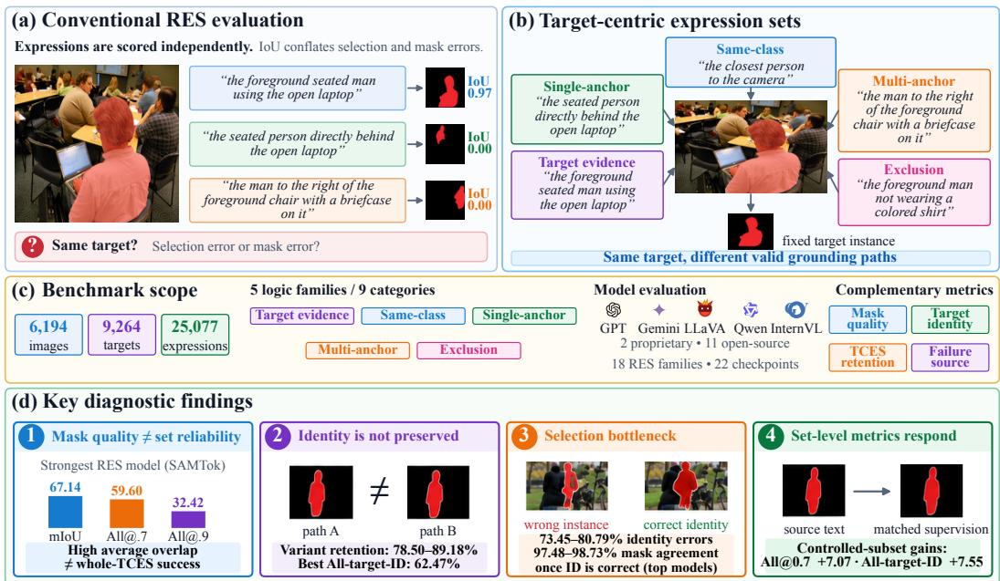  
Figure 1: Overview of InstanceBench. (a) Independent RES scoring conflates target selection with mask quality. (b) A target-centric expression set (TCES) fixes the image and target while varying valid grounding paths. (c) Benchmark scope: the referential-logic taxonomy, evaluated models, and complementary metrics. (d) Diagnostics reveal reliability and identity gaps, localize failures to target selection, and assess matched supervision.

Recent benchmarks (Table 1) broaden referring-expression evaluation through controlled and compositional expressions (CLEVR-Ref+ (Liu et al., 2019) and Cops-Ref (Chen et al., 2020)), finegrained compositional grounding with hard negatives (FineCops-Ref (Yang et al., 2025; Liu et al., 2024)), generalized or reasoning-intensive references (gRefCOCO (Liu et al., 2023), MMR (Jang et al., 2025), and ReasonSeg (Lai et al., 2024)), ambiguity and shortcut diagnostics (aRef-COCO (Mao et al., 2025) and Ref-Adv (Dong et al., 2026)), and counterfactual tests of pixelgrounding hallucination (HalluSegBench (Li et al., 2026)). These benchmarks increase task difficulty and diagnostic coverage but primarily score expressions independently. Even when a target has several annotated expressions, as in RefCOCO, these are not systematically constructed to identify it through different referential logics, and their joint success is not a primary evaluation target. A complementary axis thus remains largely unmeasured: referential reliability, i.e., whether a model preserves a fixed target’s identity across valid expressions that identify it through distinct, logiccritical grounding paths. Measuring it raises three instance-level questions: Which referential logics can models reliably execute? Do different valid grounding paths preserve the same target? When they fail, is the error in target selection or mask generation?

To this end, we introduce InstanceBench, an instance-centered dataset and diagnostic benchmark comprising 6,194 COCO and OpenImages (Kuznetsova et al., 2020; Benenson et al., 2019) images, 9,264 target instances, and 25,077 human-verified expressions. Its basic unit is a target-centric expression set (TCES): one image, one fixed target mask, and multiple valid expressions that refer to that same instance. Each core TCES pairs a minimal expression with an alternative that identifies the target through a different valid cue; additional annotations support controlled analyses of linguistic reformulation and target-preserving variation. InstanceBench categorizes expressions by the referential logic required to isolate the target, rather than by surface wording. Its taxonomy spans direct target evidence, same-class set selection, single-anchor relations, multi-anchor or nested composi tion, and negation or exclusion. Paraphrases preserve both the underlying logic and grounding path, whereas cross-logic variants change the grounding path while keeping the image and target fixed. Logic-critical, shortcut-controlled construction ensures that the annotated logic is necessary for disambiguation. Identity-aware and TCES-level metrics measure which referential logics models can execute reliably, whether target identity is preserved across grounding paths, and whether failures arise from target selection or mask generation. Across 22 native-mask RES checkpoints from 18 model families, the strongest one reaches 67.1% expression-level mIoU but only 59.6% All@0.7. Controlled text interventions establish language sensitivity, yet performance varies sharply across referential logics and models often fail to preserve the target across valid grounding paths. Failure decomposition identifies target selection as the dominant bottleneck in key relational and compositional failures. InstanceBench therefore provides an actionable map of current RES capability more than merely a harder test.

Table 1: Comparison with representative published REC/RES benchmarks.
<table><tr><td></td><td colspan="2">Data</td><td colspan="3">Diagnostic construction</td><td colspan="3">Diagnostic evaluation</td></tr><tr><td>Benchmark</td><td>Real images masks</td><td>Pixel</td><td>Taxonomy scale</td><td>Controlled</td><td>Controlled same-target Logic-wise construction grounding-path variants diagnosis reliability decomposition</td><td></td><td></td><td>Set-level Selection-mask</td></tr><tr><td>RefCOCO/+/g</td><td>√</td><td>√</td><td></td><td></td><td></td><td></td><td></td><td></td></tr><tr><td>CLEVR-Ref+</td><td></td><td>√</td><td>5 categories</td><td>√</td><td></td><td>√</td><td></td><td></td></tr><tr><td>Cops-Ref</td><td>√</td><td></td><td>6 logic forms</td><td>√</td><td></td><td>√</td><td></td><td></td></tr><tr><td>FineCops-Ref</td><td>√</td><td></td><td>6 structures</td><td>√</td><td>√</td><td>√</td><td></td><td></td></tr><tr><td>gRefCOCO</td><td>√</td><td>√</td><td></td><td></td><td></td><td></td><td></td><td></td></tr><tr><td>ReasonSeg</td><td>√</td><td>√</td><td></td><td></td><td></td><td></td><td></td><td></td></tr><tr><td>MMR</td><td>√</td><td>√</td><td></td><td></td><td></td><td></td><td></td><td></td></tr><tr><td>Ref-Adv</td><td>√</td><td></td><td></td><td>√</td><td></td><td>√</td><td></td><td></td></tr><tr><td>aRefCOCO</td><td>√</td><td>√</td><td></td><td>√</td><td></td><td>√</td><td></td><td></td></tr><tr><td>HalluSegBench</td><td>√</td><td>√</td><td></td><td>√</td><td></td><td>√</td><td></td><td></td></tr><tr><td>InstanceBench (Ours)</td><td> $\surd$ </td><td> $\surd$ </td><td>9 categories</td><td>√</td><td>√</td><td>√</td><td>√</td><td>√</td></tr></table>

Our contributions are threefold: (i) we introduce InstanceBench, an instance-centered RES bench mark that systematically evaluates referential reasoning across nine logic categories. Its targetcentric expression sets hold the image and target fixed while varying valid grounding paths, enabling controlled evaluation beyond isolated expression–mask pairs. (ii) we develop identity-aware and set-level diagnostics that measure target preservation across grounding paths and separate targetselection from mask-generation failures, complementing conventional mask-overlap metrics. (iii) through extensive evaluation of 22 native-mask RES checkpoints from 18 model families, we reveal substantial variation across referential logics and identify target selection as the dominant bottleneck in key relational and compositional failures. Controlled interventions and matched logic-aware supervision validate the diagnosis, improving identity-aware performance.

## 2 THE INSTANCEBENCH DATASET

## 2.1 DATA SOURCES AND SPLITS

InstanceBench contains 6,194 unique images, 9,264 target instances, and 25,077 retained humanverified expressions. The training, validation, and test sets contain 3,299/895/2,000 images, 4,896/1,450/2,918 TCESs, and 14,083/3,624/7,370 expressions, respectively. Images, category labels, and instance masks are drawn from the corresponding source splits of RefCOCO/+/g and Open-Images V7; all referring expressions are newly constructed and human-verified. We apply the GE4 criterion, which requires at least four instances of the target category in each selected image. Because this criterion leaves the eligible RefCOCO/+/g pool strongly skewed toward person-category targets, we complement it with OpenImages, which contributes a broader range of object categories and same-class multi-instance scenes. We remove cross-source perceptual duplicates. The resulting benchmark covers 221 normalized categories across the training, validation, and test splits. Ap pendix Figure 8 summarizes the full-dataset target-category and referential-logic distributions.

## 2.2 DATASET DESIGN AND CONSTRUCTION

Target-centric expression sets. Instead of evaluating expression–mask pairs independently, InstanceBench uses the target instance and its coordinated expressions as the joint evaluation unit. A target-centric expression set (TCES) is defined as ${ \mathcal T } = ( \dot { I } , G , { \mathcal E } )$ , where I is an image, G is a fixed ground-truth instance mask, and $\mathcal { E } = \{ e _ { 1 } , \ldots , e _ { K } \}$ contains valid expressions that all refer to G. Each TCES contains two core expression roles. The minimal expression contains only the cues needed to identify G through its annotated referential logic and grounding evidence, excluding descriptors that could independently identify the target and bypass the intended grounding path. For example, if one red-clothed woman appears among several men and color is the intended identifying cue, we use “the person in red” rather than “the woman in red,” because “woman” alone would already identify the target and make the color cue unnecessary. The same-target variant expression refers to the same target through a different valid cue or grounding path. Each expression receives one canonical referential-logic label, and the two roles preferentially use different referential logics whenever supported by the image. A dense diagnostic subset additionally includes paraphrases that vary linguistic realization while preserving both referential logic and grounding path.

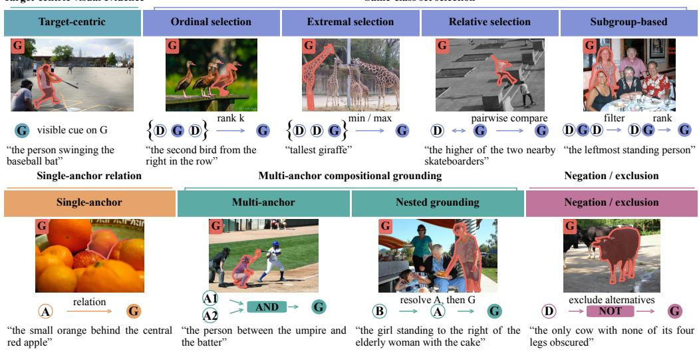  
Figure 2: Referential-logic taxonomy. InstanceBench organizes nine categories into five evidence families. G, D, and A/B denote the target, same-class distractors, and anchors; AND, B → A → G, and NOT denote joint constraints, nested anchor resolution, and exclusion.

Referential-logic taxonomy. We use referential logic to denote how the visual evidence needed to distinguish a target from competing instances is structured and resolved, rather than the surface wording or cue types in an expression. A target may be identified from evidence on the target itself, by selecting it within a same-class set, through a relation to a single anchor, by jointly or recursively resolving multiple anchors, or by excluding competing instances. These five evidence structures induce nine canonical categories (Figure 2): target-centric visual evidence; same-class set selection, including ordinal, extremal, relative, and subgroup-based selection; single-anchor relation; multi anchor compositional grounding, including parallel multi-anchor relation and hierarchical nested grounding; and negation/exclusion. A category is assigned only when its corresponding reasoning operation is necessary for uniquely identifying the target: mentioning another object is relational only when resolving that anchor is necessary, while negative wording constitutes exclusion only when eliminating competing instances is required. Appearance, action, possession, and fine-grained relation types are retained as auxiliary metadata rather than separate logic categories. Complete definitions, boundary cases, precedence rules, and additional examples are provided in Appendix B.

Logic-controlled generation. For each GE4-qualified target, the image, target identity, and mask remain fixed. Every expression must uniquely identify its target and be logic-critical and shortcutcontrolled: its annotated referential logic must be necessary, and no other descriptor may identify the target independently. Given the image, target mask, and category, we use GPT-5.5 (OpenAI, 2026a) in a two-stage prompting pipeline. Crucially, GPT-5.5 neither defines the referential-logic taxonomy nor freely chooses an expression’s logic. We provide the taxonomy and validity contract; the analysis stage identifies which prescribed logic–cue specifications are feasible for the fixed target. A quota-aware scheduler selects two supported specifications while favoring logic diversity and under-represented logic categories; and the generation stage produces the minimal expression and same-target variant. Figure 3 summarizes the pipeline, with complete prompts in Appendix D.

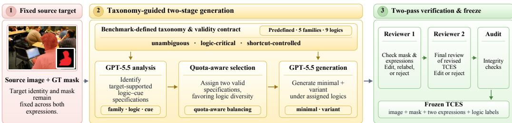  
Figure 3: InstanceBench construction pipeline.

Human verification. Every proposal undergoes two serial reviews by different annotators; seven annotators participated across batches. Reviewer 1 checks mask quality, referential correctness, uniqueness, naturalness, logic necessity, and taxonomy assignment, rejecting unusable masks and directly revising correctable expressions. When a proposed expression could plausibly refer to multiple instances, Reviewer 1 rewrites it to restore uniqueness; Reviewer 2 then independently re-verifies the revised TCES for uniqueness and logic necessity before finalization. Approved TCESs then undergo automated integrity checks. Of 9,885 resolved targets, 9,264 (93.7%) were retained and 621 (6.3%) rejected. Of 25,077 released expressions, 14,938 (59.6%) derive from retained generated items and 10,139 (40.4%) are human-added replacements or additions. A separate blinded audit evaluates taxonomy reproducibility and target validity on 300 expressions from 150 image-unique TCESs. Two experienced annotators who had not seen the sampled items independently select the referred same-class candidate, assign one of the five logic families, and assess uniqueness and logic necessity, without seeing the released target identities or taxonomy labels. They agree on 91.7% of five-family assignments (Cohen’s $\mathbf { \nabla } \kappa = \mathbf { 0 . 8 9 }$ ; TCES-clustered 95% CI: 88.3–94.7%) and on the selected target identity for 95.7% of expressions. Their target selections match the fixed target on 95.3% and 98.3% of expressions, respectively. Appendix C reports the complete protocol.

## 3 EVALUATION PROTOCOL

InstanceBench evaluates expression-level mask quality, TCES-level reliability, and target-identity preservation. The headline metrics are mIoU, All@0.7, and All-target-ID; the remaining measures diagnose retention, normalized consistency, and failure source. Let $\bar { \boldsymbol { \tau } }$ denote the evaluated TCESs and $\textstyle { \boldsymbol { \mathcal { K } } } _ { t }$ the expressions evaluated for TCES t. For expression k, $P _ { t , k }$ is its predicted mask, $G _ { t }$ is the fixed target mask, and $q _ { t , k } = \mathrm { I o U } ( P _ { t , k } , G _ { t } )$ . Unless otherwise stated, $\textstyle { \mathcal { K } } _ { t }$ contains the two core expressions; analyses over all available diagnostic expressions are explicitly marked as dense.

Mask and set-level accuracy. At the expression level, we report the standard mIoU, oIoU, and Precision@τ. At the TCES level, we define:

$$
\mathrm { W o r s t P a t h I o U } = \frac { 1 } { | \mathcal { T } | } \sum _ { t \in \mathcal { T } } \operatorname* { m i n } _ { k \in \mathcal { K } _ { t } } q _ { t , k } , \qquad \mathrm { A l l } \ @ \tau = \frac { 1 } { | \mathcal { T } | } \sum _ { t \in \mathcal { T } } \mathbf { 1 } [ \operatorname* { m i n } _ { k \in \mathcal { K } _ { t } } q _ { t , k }  \ \geq \ \tau ] .\tag{1}
$$

Worst-path IoU exposes the weakest grounding path, whereas $\mathrm { { A l l } } @ \tau$ requires every evaluated expression in a TCES to succeed. We use $\tau \in \{ 0 . 7 , 0 . 9 \}$

Target-identity assignment. For each TCES t, let $\mathcal { C } _ { t } ~ = ~ \{ G _ { t , 1 } , \ldots , G _ { t , n _ { t } } \}$ denote all sourceannotated instances of the target category for which valid masks are available, including the annotated target $G _ { t }$ . Identity-based evaluation uses ${ \mathcal { T } } _ { \mathrm { I D } } = \{ t \in { \mathcal { T } } : | { \mathcal { C } } _ { t } | \geq 2 \}$ . To separate target selection from boundary quality, the evaluator assigns each predicted mask $P$ to the most compatible $G _ { t , i } \in \mathcal { C } _ { t }$ using:

$$
s ( P , G _ { t , i } ) = \frac { | P \cap G _ { t , i } | } { \sqrt { | P | | G _ { t , i } | } } .\tag{2}
$$

Let $s _ { 1 }$ and $s _ { 2 }$ be the highest and second-highest scores. We accept the best match when $s _ { 1 } \geq 0 . 1 0$ and $s _ { 1 } - s _ { 2 } \geq 0 . 0 5 ;$ ; the absolute threshold requires sufficient overlap, while the margin rejects ambiguous assignments but tolerates boundary errors. Otherwise, the identity is unresolved. Instances without source-provided masks lie outside $\mathcal { C } _ { t } ;$ a prediction matching no inventory instance therefore remains unresolved and receives no identity credit. For each $P _ { t , k }$ , we set $A _ { t , k } = 1$ only when the assigned instance is the annotated target of TCES $t ;$ assignment to another instance or an unresolved result gives $A _ { t , k } = 0$ . Missing or invalid predictions receive zero IoU and unresolved identity. Under the standard mask-output protocol, masks in $\mathcal { C } _ { t }$ are used only by the evaluator and are never provided to the model.

Correct identity preservation. On $\mathcal { T } _ { \mathrm { I D } }$ , we define All-target-ID as:

$$
\mathrm { A l l - t a r g e t { - } I D } = \frac { 1 } { | \mathcal T _ { \mathrm { I D } } | } \sum _ { t \in \mathcal T _ { \mathrm { I D } } } \mathbf { 1 } [ A _ { t , k } = 1 , \forall k \in \mathcal K _ { t } ] .\tag{3}
$$

Thus, agreement on the same wrong instance receives no credit. For a minimal expression m and companion c, target-ID retention and target-and-mask retention are:

$$
\mathrm { I D R e t } = \operatorname* { P r } ( A _ { t , c } = 1 \mid A _ { t , m } = 1 ) , \ \mathrm { T M @ } \tau = \operatorname* { P r } ( A _ { t , c } = 1 , q _ { t , c } \geq \tau \mid A _ { t , m } = 1 , q _ { t , m } \geq \tau ) .\tag{4}
$$

Target-ID retention measures robustness to an alternative valid expression, while TM@τ additionally requires both predictions to satisfy the mask threshold.

Normalized consistency. Raw target-ID retention can be lower for a harder companion expression even without weaker cross-expression coupling. We therefore compare a same-logic paraphrase p and an alternative-path variant v on the same TCESs, sharing the image, target, and minimal expression m. For $\bar { x } \in \{ p , v \}$ , let $\pi _ { m } = \mathrm { P r } ( A _ { t , m } = 1 ) , \pi _ { x } ^ { \cdot } = \mathrm { P r } ( \bar { A _ { t , x } } = { \bar { 1 } } )$ , and $\pi _ { m x } =$ $\operatorname* { P r } ( A _ { t , m } = 1 , A _ { t , x } = 1 )$ . For non-degenerate marginals, we define:

$$
\mathrm { N C I } ( m , x ) = \frac { \pi _ { m x } - \pi _ { m } \pi _ { x } } { \operatorname* { m i n } ( \pi _ { m } , \pi _ { x } ) - \pi _ { m } \pi _ { x } } , \qquad \mathrm { \Delta N C I } = \mathrm { N C I } ( m , v ) - \mathrm { N C I } ( m , p ) .\tag{5}
$$

NCI equals zero under marginal independence and one at the maximum co-success permitted by the marginals; negative values indicate co-success below independence. Hence, negative ∆NCI indicates weaker target-identity coupling after a grounding-path change than after same-logic rewording.

Failure localization. Predictions with $q _ { t , k } < \tau$ are divided into identity errors $( A _ { t , k } = 0 )$ and correct-ID/poor-mask errors $( A _ { t , k } = 1 )$ ; confirmed switches to another same-category instance form a subset of identity errors. Finally, conditional mask IoU, IoU $\lceil \left( \boldsymbol { P } _ { t , m } , \boldsymbol { P } _ { t , c } \right)$ , is computed only when both predictions are assigned to the annotated target, isolating mask stability after correct target selection.

## 4 EXPERIMENTS

## 4.1 EXPERIMENTAL SETUP

Evaluation split. All main results use the InstanceBench test set, comprising 2,000 images, 2,918 TCESs, and 5,836 core expressions, with one minimal expression and one same-target variant per TCES. The test set also contains 1,534 additional diagnostic expressions; analyses using these annotations are explicitly marked as dense.

Models and inference. We evaluate 18 model families and 22 released checkpoint variants (Table 2) using their official repositories, released weights, and native image preprocessing. Universal multi-task systems (U) comprise SAMTok (Zhou et al., 2026), X2SAM (Wang et al., 2026b), UniPixel (Liu et al., 2025), Sa2VA (Yuan et al., 2026), X-SAM (Wang et al., 2026a), InstructSeg (Wei et al., 2025b), HyperSeg (Wei et al., 2025a), and PSALM (Zhang et al., 2024). RES models with additional reasoning or segmentation supervision (R+) comprise ConverSeg (Sahoo & Gkioxari, 2026), EVF-SAM2 (Zhang et al., 2026), SaFiRe (Mao et al., 2025), and SSP-SAM (Tang et al., 2025); task-focused RES models (R) comprise DETRIS (Huang et al., 2025), PaDT (Su et al., 2026), VATEX (Nguyen-Truong et al., 2025), and LAVT (Yang et al., 2022); CoHD (Luo et al., 2025) is the GRES specialist (G), and RefChess (Tong et al., 2026) is the training-free foundation-model composition (Z). Given their substantially broader training data, we use U models to estimate the current transfer-performance ceiling; causal architectural conclusions are based on the matched-supervision study in Section 4.6. X2SAM and X-SAM main-leaderboard results average three full-test inference runs due to stochastic decoding; their dense identity, matched-logic, and intervention analyses use the pre-specified seed-0 run. All other checkpoints are deterministic in our setup.

Statistical protocol. NCI is unitless; all other metrics are percentages. Pairwise comparisons and logic-category effects are clustered by TCES, so multiple expressions for the same target are

Table 2: Overall performance on the InstanceBench core test set (2,918 TCESs; 5,836 expressions). All values are percentages; best results are bold.
<table><tr><td>Model / checkpoint</td><td>Venue</td><td>Group</td><td>oIoU</td><td>mIoU</td><td>P@.7</td><td>All@.7</td><td>All@.9</td><td>Worst-path IoU</td></tr><tr><td>SAMTok-CO</td><td>CVPR&#x27;26</td><td>U</td><td>57.56</td><td>67.14</td><td>71.18</td><td>59.60</td><td>32.42</td><td>56.28</td></tr><tr><td>X2SAM</td><td>ECCV’26</td><td>U</td><td>55.77</td><td>65.92</td><td>68.50</td><td>56.60</td><td>38.73</td><td>54.43</td></tr><tr><td>UniPixel-7B</td><td>NeurIPS’25</td><td>U</td><td>54.68</td><td>62.78</td><td>63.18</td><td>51.82</td><td>24.61</td><td>52.07</td></tr><tr><td>Sa2VA-2B</td><td>TPAMI&#x27;26</td><td>U</td><td>53.44</td><td>58.83</td><td>59.13</td><td>45.37</td><td>21.83</td><td>45.87</td></tr><tr><td>X-SAM</td><td>AAAI&#x27;26</td><td>U</td><td>39.91</td><td>56.81</td><td>58.16</td><td>46.60</td><td>30.27</td><td>45.28</td></tr><tr><td>InstructSeg</td><td>ICCV’25</td><td>U</td><td>41.55</td><td>52.73</td><td>53.51</td><td>39.07</td><td>21.38</td><td>38.52</td></tr><tr><td>HyperSeg-3B</td><td>CVPR’25</td><td>U</td><td>41.49</td><td>52.58</td><td>53.80</td><td>39.75</td><td>22.72</td><td>38.93</td></tr><tr><td>PSALM</td><td>ECCV’24</td><td>U</td><td>31.35</td><td>43.23</td><td>43.63</td><td>27.76</td><td>14.46</td><td>27.59</td></tr><tr><td>ConverSeg-3B</td><td>CVPR’26</td><td>R+</td><td>48.15</td><td>56.84</td><td>55.83</td><td>43.04</td><td>13.98</td><td>45.32</td></tr><tr><td>EVF-SAM2</td><td>IVC&#x27;26</td><td>R+</td><td>46.75</td><td>55.37</td><td>54.76</td><td>39.07</td><td>18.57</td><td>40.53</td></tr><tr><td>SaFiRe-mixed</td><td>NeurIPS&#x27;25</td><td>R+</td><td>37.55</td><td>46.33</td><td>44.07</td><td>31.19</td><td>10.90</td><td>33.77</td></tr><tr><td>SSP-SAM-RefCOCO</td><td>TCSVT’25</td><td>R+</td><td>16.35</td><td>17.06</td><td>3.74</td><td>1.99</td><td>0.62</td><td>11.05</td></tr><tr><td>SSP-SAM-RefCOCOg</td><td>TCSVT’25</td><td>R+</td><td>16.59</td><td>16.78</td><td>3.50</td><td>1.99</td><td>0.69</td><td>10.86</td></tr><tr><td>SSP-SAM-RefCOCO+</td><td>TCSVT’25</td><td>R+</td><td>15.87</td><td>16.34</td><td>3.34</td><td>1.82</td><td>0.58</td><td>10.57</td></tr><tr><td>DETRIS</td><td>AAAI&#x27;25</td><td>R</td><td>32.89</td><td>44.54</td><td>44.29</td><td>30.09</td><td>10.76</td><td>30.95</td></tr><tr><td>PaDT-REC-3B</td><td>ICLR’26</td><td>R</td><td>36.51</td><td>42.01</td><td>34.73</td><td>29.95</td><td>3.36</td><td>34.89</td></tr><tr><td>VATEX-Swin-B</td><td>WACV&#x27;25</td><td>R</td><td>25.53</td><td>37.34</td><td>36.87</td><td>21.80</td><td>10.66</td><td>22.54</td></tr><tr><td>LAVT-RefCOCO</td><td>CVPR’22</td><td>R</td><td>26.13</td><td>34.06</td><td>29.23</td><td>14.67</td><td>5.14</td><td>19.23</td></tr><tr><td>LAVT-RefCOCOg</td><td>CVPR’22</td><td>R</td><td>28.56</td><td>33.31</td><td>25.51</td><td>12.95</td><td>3.77</td><td>19.71</td></tr><tr><td>LAVT-RefCOCO+</td><td>CVPR’22</td><td>R</td><td>25.17</td><td>32.40</td><td>28.72</td><td>15.08</td><td>5.14</td><td>18.72</td></tr><tr><td>CoHD</td><td>ICCV’25</td><td>G</td><td>28.26</td><td>35.82</td><td>33.04</td><td>18.92</td><td>7.57</td><td>21.93</td></tr><tr><td>RefChess-hybrid</td><td>ICML&#x27;26</td><td>Z</td><td>19.36</td><td>30.06</td><td>27.91</td><td>15.32</td><td>8.19</td><td>16.75</td></tr></table>

not treated as independent samples. We report 95% bootstrap confidence intervals for the central matched comparisons. All nine canonical referential-logic categories contain at least 113 expressions in the test set; smaller categories are interpreted with correspondingly wider uncertainty.

## 4.2 OVERALL PERFORMANCE: HIGH MIOU DOES NOT IMPLY SET-LEVEL RELIABILITY

Table 2 reveals a substantial gap between expression-level mask quality and target-level reliability. SAMTok obtains the strongest mIoU at 67.14%, yet solves both core expressions in only 59.60% of TCESs at IoU 0.7; at IoU 0.9 this falls to 32.42%. X2SAM has a similar profile (65.92 mIoU and 56.60 All@.7), while its higher All@.9 illustrates that model rankings can depend on whether average overlap, whole-set reliability, or high-precision masks are required. Together with the lower WorstPathIoU values, these results show that expression-level averages can obscure weak grounding paths within a TCES and motivate reporting expression- and TCES-level metrics together.

General-purpose MLLM extension. We additionally evaluate general-purpose MLLMs under two diagnostic protocols. In direct localization, each model predicts a box that is converted into a mask by the same frozen SAM 3 backend (Carion et al., 2026); oracle candidate-ID evaluation instead supplies the source-annotated candidate inventory C<sub>t</sub> and isolates target selection from mask generation. Qwen3.8-27B reaches 69.83% mIoU and 63.48% All@.7 in the box-to-mask setting, while Gemini-3.8-Flash achieves 76.29% expression-level target accuracy but only 65.17% All-target-ID under oracle candidate selection. Thus, strong MLLMs also exhibit a substantial gap between indi vidual grounding accuracy and same-target reliability. Because these protocols use either a separate segmentation backend or oracle candidate masks, they are diagnostic extensions rather than directly comparable native-mask RES evaluations. Complete results are reported in Appendix Tables 6 and 7.

## 4.3 WHICH REFERENTIAL LOGICS CHALLENGE CURRENT MODELS?

Figure 4(a) reveals markedly non-uniform capability profiles across referential logics. Direct targetcentric evidence and extremal descriptions are comparatively easy, while ordinal selection, negation/exclusion, and relational composition remain weaker. This variation is visible within every model and therefore cannot be summarized by a single scalar difficulty score. Complete numerical results and category counts are reported in Appendix Table 9. Per-model logic rankings are stable across COCO and OpenImages (per-model Spearman $\rho = 0 . 7 5 – 0 . 9 5 ;$ ; Appendix Figure 7 and Table 15). To reduce visual and linguistic confounding, we match ordinal and extremal examples by target size, category, expression length, and same-class instance count. Ordinal mIoU remains lower by 10.27 points for X2SAM (95% CI [−15.82, −4.89]), 17.02 for SAMTok $( [ - 2 2 . 6 5 , - 1 1 . 5 3 ] )$ , 25.52 for UniPixel ([−30.51, −20.29]), and 20.86 for X-SAM ([−26.23, −15.51]). The ordinal– extremal gap therefore persists under these matched controls. Nested grounding also remains below matched spatial controls for X2SAM, SAMTok, and X-SAM, whereas the smaller multi-anchor– spatial effects are not statistically resolved for these models. Complete matched results appear in Appendix Table 10. These results localize capability gaps to specific forms of referential binding.

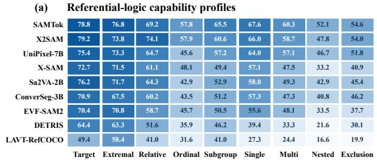

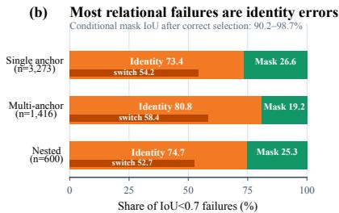  
Figure 4: Referential-logic capability and failure localization. (a) Cells report expression-level mIoU across the nine canonical referential logics, revealing model-specific capability profiles. (b) At IoU 0.7, target-identity errors dominate failures on single-anchor, multi-anchor, and nested expressions. The dark inset denotes confirmed same-class switches, a strict subset of identity errors; the remaining green segment is correct-ID, poor-mask failure.

Table 3: Same-target consistency. Retention/NCI use 988 COCO-derived matched TCESs; dense All-target-ID and core-pair conditional mask IoU use 2,867 identity-eligible TCESs. ∆NCI is vari ant minus paraphrase; brackets are 95% TCES-bootstrap CIs.
<table><tr><td>Model</td><td>Para. Ret.</td><td>Variant Ret.</td><td>Para. NCI</td><td>Variant NCI</td><td>∆NCI [95% CI]</td><td>All-target-ID</td><td>Cond. mask IoU</td></tr><tr><td>SAMTok</td><td>97.55</td><td>88.47</td><td>0.565</td><td>0.151</td><td>-0.414[-0.621, -0.242]</td><td>62.47</td><td>97.48</td></tr><tr><td>X2SAM</td><td>96.75</td><td>89.18</td><td>0.662</td><td>0.201</td><td>-0.462[-0.634, -0.295]</td><td>58.32</td><td>98.05</td></tr><tr><td>UniPixel</td><td>97.42</td><td>89.16</td><td>0.770</td><td>0.287</td><td>-0.483[-0.642, -0.322]</td><td>58.98</td><td>92.31</td></tr><tr><td>Sa2VA</td><td>96.17</td><td>85.43</td><td>0.593</td><td>0.147</td><td>-0.446[-0.612, -0.288]</td><td>51.48</td><td>90.16</td></tr><tr><td>ConverSeg</td><td>96.11</td><td>87.22</td><td>0.660</td><td>0.340</td><td>-0.320 [-0.476, -0.169]</td><td>51.62</td><td>90.30</td></tr><tr><td>PaDT</td><td>96.07</td><td>83.84</td><td>0.644</td><td>0.185</td><td>-0.459[-0.602, -0.335]</td><td>50.12</td><td>94.56</td></tr><tr><td>X-SAM</td><td>95.48</td><td>83.37</td><td>0.611</td><td>0.165</td><td>-0.446[-0.583, -0.331]</td><td>48.45</td><td>98.73</td></tr><tr><td>EVF-SAM2</td><td>94.31</td><td>78.50</td><td>0.583</td><td>0.058</td><td>-0.525[-0.658, -0.395]</td><td>44.65</td><td>88.32</td></tr></table>

## 4.4 SAME-TARGET CONSISTENCY AND FAILURE LOCALIZATION

Table 3 shows that paraphrase retention is 94.31–97.55%, whereas alternative-path retention falls to 78.50–89.18%, a drop of 7.58–15.81 points. Lower standalone variant accuracy does not explain this gap: paraphrase NCI is 0.565–0.770, compared with 0.058–0.340 for variants, and ∆NCI ranges from −0.320 to −0.525, with every 95% confidence interval below zero. Thus, after matching the image, target, and minimal expression and normalizing marginal accuracy, changing the grounding evidence is associated with substantially weaker target-identity preservation than same-logic re wording. Even SAMTok selects the annotated target across every dense expression in only 62.47% of identity-eligible TCESs. All-target-ID directly measures correct identity preservation across the set; All@.7 additionally requires a good mask. Full track-specific retention and TM@.7 results are reported in Appendix Table 14, with a descriptive visualization in Appendix Figure 6(a).

Figure 4(b) and Appendix Table 17 decompose predictions below IoU 0.7 on single-anchor and compositional expressions. Across five universal models, target-identity errors account for 73.45– 80.79% of these failures; confirmed same-class switches, a strict subset, already comprise 52.67– 58.40% of these failures. In a separate conditional analysis, when both predictions are assigned to the annotated target, their mask IoU remains 90.16–98.73%. Together, these results identify the primary bottleneck as resolving and preserving target identity under relational constraints, rather than mask delineation once the target is correctly resolved.

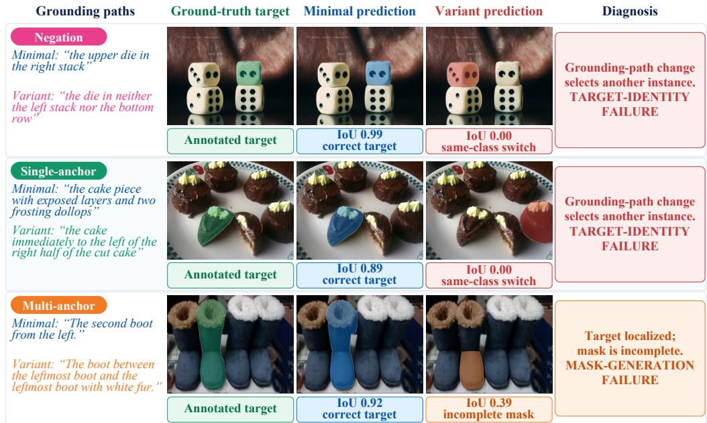  
Figure 5: Qualitative diagnoses under a fixed target. Green: ground truth; blue: minimal prediction; red: wrong-instance variant; orange: incomplete target mask.

## 4.5 LANGUAGE SENSITIVITY IS NOT REFERENTIAL RELIABILITY

We use two controlled interventions to test whether the failures arise from text neglect. Replacing each expression with its category name reduces mIoU by 36.95–44.91 points, showing that models rely on disambiguating language. More decisively, when an expression is replaced by one referring to another same-category instance in the same image, 90.29–94.23% of predictions shift toward the newly described target. Systems are therefore language-responsive, but this sensitivity does not imply reliable execution of the required referential logic or preservation of target identity across valid grounding paths. Appendix Table 11 reports full statistics.

## 4.6 THE DIAGNOSED CAPABILITY RESPONDS TO SUPERVISION

Appendix Figure 6(b) and Table 8 evaluate whether the diagnosed capability responds to targeted supervision. To isolate expression supervision from source-domain shift, we use a fixed COCOderived subset (930 training images; 1,980 TCESs) aligned with the RefCOCO-family domain of both architectures. Images, masks, rows, initialization, optimization, and seeds are matched across supervision settings. Relative to the source-text control, logic-aware supervision improves LAVT mIoU, All@.7, and All-target-ID by 5.00, 7.07, and 7.55 points, respectively. DETRIS benefits most from the 50/50 mixture, improving the same metrics by 1.78, 2.55, and 4.34 points. The larger target-level gains show that the diagnosed deficiency is learnable, while the different bes supervision setting reveals an architecture–supervision interaction.

## 4.7 QUALITATIVE DIAGNOSIS

Figure 5 presents representative cases under a fixed annotated target. Here, Minimal and Variant are two valid expression roles for that target, not different model variants. In the first two rows, changing the grounding path redirects the prediction to another same-category instance despite an accurate minimal-expression prediction. In the third, the model retains the intended instance but produces an incomplete mask. These examples illustrate the two diagnosed mechanisms rather than their prevalence, which is quantified in Figure 4(b) and Appendix Table 17.

## 5 CONCLUSION

InstanceBench reframes RES evaluation around target-identity reliability across valid grounding paths. On the test set, average mIoU overstates whole-TCES reliability, and errors arise mainly from target selection rather than mask generation. Counterfactual text interventions show that models are language-sensitive yet fail to preserve identity across valid grounding paths, while the controlledsubset study shows that this capability responds to supervision. As a controlled diagnostic benchmark rather than an estimate of RES performance under natural distributions, InstanceBench maps model capability over referential logics to guide targeted improvement.

## REFERENCES

Shuai Bai, Yuxuan Cai, Ruizhe Chen, Keqin Chen, Xionghui Chen, Zesen Cheng, Lianghao Deng, Wei Ding, Chang Gao, Chunjiang Ge, et al. Qwen3-VL technical report. arXiv preprint arXiv:2511.21631, 2025a. URL https://arxiv.org/abs/2511.21631.

Shuai Bai, Keqin Chen, Xuejing Liu, Jialin Wang, Wenbin Ge, Sibo Song, Kai Dang, Peng Wang, Shijie Wang, Jun Tang, et al. Qwen2.5-VL technical report. arXiv preprint arXiv:2502.13923, 2025b. URL https://arxiv.org/abs/2502.13923.

Rodrigo Benenson, Stefan Popov, and Vittorio Ferrari. Large-scale interactive object segmentation with human annotators. In 2019 IEEE/CVF Conference on Computer Vision and Pattern Recognition (CVPR), pp. 11692–11701. IEEE, 2019.

Nicolas Carion, Laura Gustafson, Yuan-Ting Hu, Shoubhik Debnath, Ronghang Hu, Didac Suris Coll-Vinent, Chaitanya Ryali, Kalyan Vasudev Alwala, Haitham Khedr, Andrew Huang, et al. Sam 3: Segment anything with concepts. In International conference on learning representations, volume 2026, pp. 138846–138923, 2026.

Zhenfang Chen, Peng Wang, Lin Ma, Kwan-Yee K Wong, and Qi Wu. Cops-ref: A new dataset and task on compositional referring expression comprehension. In 2020 IEEE/CVF Conference on Computer Vision and Pattern Recognition (CVPR), pp. 10083–10092. IEEE, 2020.

Qihua Dong, Kuo Yang, Lin Ju, Handong Zhao, Yitian Zhang, Yizhou Wang, Huimin Zeng, Jianglin Lu, and Yun Fu. Ref-Adv: Exploring MLLM visual reasoning in referring expression tasks. In International Conference on Learning Representations, 2026.

GLM-V Team, Wenyi Hong, Wenmeng Yu, Xiaotao Gu, Guo Wang, Guobing Gan, Haomiao Tang, Jiale Cheng, Ji Qi, Shuaiqi Duan, et al. GLM-4.1V-Thinking and GLM-4.5V: Towards versatile multimodal reasoning with scalable reinforcement learning. arXiv preprint arXiv:2507.01006, 2025. URL https://arxiv.org/abs/2507.01006.

Google DeepMind. Gemini 3.8 Flash model card. Google DeepMind model card, 2026. URL https://deepmind.google/models/model-cards/gemini-3-8-flash/.

Jiaqi Huang, Zunnan Xu, Ting Liu, Yong Liu, Haonan Han, Kehong Yuan, and Xiu Li. Densely connected parameter-efficient tuning for referring image segmentation. In Proceedings of the AAAI Conference on Artificial Intelligence, volume 39, pp. 3653–3661, 2025.

Donggon Jang, Yucheol Cho, Suin Lee, Taehyeon Kim, and Dae Shik Kim. Mmr: A large-scale benchmark dataset for multi-target and multi-granularity reasoning segmentation. In International Conference on Learning Representations, volume 2025, pp. 67406–67431, 2025.

Alina Kuznetsova, Hassan Rom, Neil Alldrin, Jasper Uijlings, Ivan Krasin, Jordi Pont-Tuset, Shahab Kamali, Stefan Popov, Matteo Malloci, Alexander Kolesnikov, et al. The open images dataset v4: Unified image classification, object detection, and visual relationship detection at scale. International journal ofcomputer vision, 128(7):1956–1981, 2020.

Xin Lai, Zhuotao Tian, Yukang Chen, Yanwei Li, Yuhui Yuan, Shu Liu, and Jiaya Jia. Lisa: Reasoning segmentation via large language model. In 2024 IEEE/CVF Conference on Computer Vision and Pattern Recognition (CVPR), pp. 9579–9589. IEEE, 2024.

Bo Li, Yuanhan Zhang, Dong Guo, Renrui Zhang, Feng Li, Hao Zhang, Kaichen Zhang, Peiyuan Zhang, Yanwei Li, Ziwei Liu, and Chunyuan Li. LLaVA-OneVision: Easy visual task transfer. arXiv preprint arXiv:2408.03326, 2024. URL https://arxiv.org/abs/2408.03326.

Xinzhuo Li, Adheesh Juvekar, Jiaxun Zhang, Xingyou Liu, Muntasir Wahed, Kiet A Nguyen, Yifan Shen, Tianjiao Yu, and Ismini Lourentzou. Counterfactual segmentation reasoning: Diagnosing and mitigating pixel-grounding hallucination. In Proceedings of the IEEE/CVF Conference on Computer Vision and Pattern Recognition, pp. 7450–7460, 2026.

Chang Liu, Henghui Ding, and Xudong Jiang. Gres: Generalized referring expression segmentation. In 2023 IEEE/CVF Conference on Computer Vision and Pattern Recognition (CVPR), pp. 23592– 23601. IEEE, 2023.

Junzhuo Liu, Xuzheng Yang, Weiwei Li, and Peng Wang. Finecops-ref: A new dataset and task for fine-grained compositional referring expression comprehension. In Proceedings of the 2024 Conference on Empirical Methods in Natural Language Processing, pp. 15440–15457, 2024.

Runtao Liu, Chenxi Liu, Yutong Bai, and Alan L Yuille. Clevr-ref+: Diagnosing visual reasoning with referring expressions. In 2019 IEEE/CVF Conference on Computer Vision and Pattern Recognition (CVPR), pp. 4180–4189. IEEE, 2019.

Ye Liu, Zongyang Ma, Junfu Pu, Zhongang Qi, Yang Wu, Ying Shan, and Chang Chen. Unipixel: Unified object referring and segmentation for pixel-level visual reasoning. Advances in Neural Information Processing Systems, 38:126078–126108, 2025.

Zhuoyan Luo, Yinghao Wu, Tianheng Cheng, Yong Liu, Yicheng Xiao, Hongfa Wang, Xiao-Ping Zhang, and Yujiu Yang. Cohd: A counting-aware hierarchical decoding framework for generalized referring expression segmentation. In 2025 IEEE/CVF International Conference on Computer Vision (ICCV), pp. 22685–22694. IEEE, 2025.

Junhua Mao, Jonathan Huang, Alexander Toshev, Oana Camburu, Alan L Yuille, and Kevin Murphy. Generation and comprehension of unambiguous object descriptions. In Proceedings of the IEEE conference on computer vision and pattern recognition, pp. 11–20, 2016.

Zhenjie Mao, Yang Yuhuan, Chaofan Ma, Dongsheng Jiang, Jiangchao Yao, Ya Zhang, and Yanfeng Wang. Safire: Saccade-fixation reiteration with mamba for referring image segmentation. Advances in Neural Information Processing Systems, 38:7122–7148, 2025.

Hai Nguyen-Truong, E-Ro Nguyen, Tuan-Anh Vu, Minh-Triet Tran, Binh-Son Hua, and Sai-Kit Yeung. Vision-aware text features in referring image segmentation: From object understanding to context understanding. In 2025 IEEE/CVF Winter Conference on Applications of Computer Vision (WACV), pp. 4988–4998. IEEE, 2025.

OpenAI. GPT-5.5 system card. Technical report, OpenAI, April 2026a. URL https://openai. com/index/gpt-5-5-system-card/.

OpenAI. GPT-5.6 system card. Technical report, OpenAI, July 2026b. URL https:// deploymentsafety.openai.com/gpt-5-6.

OpenBMB. MiniCPM-V 4.6 model card. Hugging Face model card, 2026. URL https:// huggingface.co/openbmb/MiniCPM-V-4.6.

Qwen Team. Qwen3.8-27B model card. Hugging Face model card, 2026. URL https: //huggingface.co/Qwen/Qwen3.8-27B.

Aadarsh Sahoo and Georgia Gkioxari. Conversational image segmentation: Grounding abstract concepts with scalable supervision. In Proceedings of the IEEE/CVF Conference on Computer Vision and Pattern Recognition, pp. 39476–39485, 2026.

Yongyi Su, Haojie Zhang, Shijie Li, Nanqing Liu, Jingyi Liao, Junyi Pan, Yuan Liu, Xiaofen Xing, Chong Sun, Chen Li, et al. Patch-as-decodable-token: Towards unified multi-modal vision tasks in mllms. In International Conference on Learning Representations, volume 2026, pp. 147893– 147919, 2026.

Wei Tang, Xuejing Liu, Yanpeng Sun, and Zechao Li. Ssp-sam: Sam with semantic-spatial prompt for referring expression segmentation. IEEE Transactions on Circuits and Systems for Video Technology, 2025.

Shiyan Tong, Jinxia Zhang, Zhiyuan Wang, Hao Tian, Yingying Wang, Kanjian Zhang, and Haikun Wei. Refchess: Training-free contextual search for zero-shot referring image segmentation. In Proceedings ofthe 43rd International Conference on Machine Learning, 2026.

Hao Wang, Limeng Qiao, Zequn Jie, Zhijian Huang, Chengjian Feng, Qingfang Zheng, Lin Ma, Xiangyuan Lan, and Xiaodan Liang. X-sam: From segment anything to any segmentation. In Proceedings of the AAAI Conference on Artificial Intelligence, volume 40, pp. 26187–26196, 2026a.

Hao Wang, Limeng Qiao, Chi Zhang, Lin Ma, Guanglu Wan, Xiangyuan Lan, and Xiaodan Liang. X2SAM: Any segmentation in images and videos. In European Conference on Computer Vision, 2026b.

Weihan Wang, Qingsong Lv, Wenmeng Yu, Wenyi Hong, Ji Qi, Yan Wang, Junhui Ji, Zhuoyi Yang, Lei Zhao, Xixuan Song, et al. CogVLM: Visual expert for pretrained language models. arXiv preprint arXiv:2311.03079, 2023. URL https://arxiv.org/abs/2311.03079.

Weiyun Wang, Zhangwei Gao, Lixin Gu, Hengjun Pu, Long Cui, Xingguang Wei, Zhaoyang Liu, Linglin Jing, Shenglong Ye, Jie Shao, et al. InternVL3.5: Advancing open-source multimodal models in versatility, reasoning, and efficiency. arXiv preprint arXiv:2508.18265, 2025. URL https://arxiv.org/abs/2508.18265.

Cong Wei, Yujie Zhong, Haoxian Tan, Yong Liu, Jie Hu, Dengjie Li, Zheng Zhao, and Yujiu Yang. Hyperseg: Hybrid segmentation assistant with fine-grained visual perceiver. In 2025 IEEE/CVF Conference on Computer Vision and Pattern Recognition (CVPR), pp. 8931–8941. IEEE, 2025a.

Cong Wei, Yujie Zhong, Haoxian Tan, Yingsen Zeng, Yong Liu, Hongfa Wang, and Yujiu Yang. Instructseg: Unifying instructed visual segmentation with multi-modal large language models. In 2025 IEEE/CVF International Conference on Computer Vision (ICCV), pp. 20193–20203. IEEE, 2025b.

Xuzheng Yang, Junzhuo Liu, Peng Wang, Guoqing Wang, Yang Yang, and Heng Tao Shen. New dataset and methods for fine-grained compositional referring expression comprehension via specialist-mllm collaboration. IEEE Transactions on Pattern Analysis and Machine Intelligence, 47(10):8598–8612, 2025.

Zhao Yang, Jiaqi Wang, Yansong Tang, Kai Chen, Hengshuang Zhao, and Philip HS Torr. Lavt: Language-aware vision transformer for referring image segmentation. In 2022 IEEE/CVF Con ference on Computer Vision and Pattern Recognition (CVPR), pp. 18134–18144. IEEE, 2022.

Licheng Yu, Patrick Poirson, Shan Yang, Alexander C Berg, and Tamara L Berg. Modeling context in referring expressions. In European conference on computer vision, pp. 69–85. Springer, 2016.

Haobo Yuan, Xiangtai Li, Tao Zhang, Yueyi Sun, Zilong Huang, Shilin Xu, Shunping Ji, Yunhai Tong, Lu Qi, Jiashi Feng, et al. Sa2va: Marrying sam2 with mllm for dense grounded understanding of images and videos. IEEE Transactions on Pattern Analysis and Machine Intelligence, 2026.

Yuxuan Zhang, Tianheng Cheng, Lianghui Zhu, Lei Liu, Heng Liu, Longjin Ran, Xiaoxin Chen, Wenyu Liu, and Xinggang Wang. Evf-sam: Early vision-language fusion for text-prompted segment anything model. Image and Vision Computing, 173:106028, 2026.

Zheng Zhang, Yeyao Ma, Enming Zhang, and Xiang Bai. Psalm: Pixelwise segmentation with large multi-modal model. In European Conference on Computer Vision, pp. 74–91. Springer, 2024.

Yikang Zhou, Tao Zhang, Dengxian Gong, Yuanzheng Wu, Ye Tian, Haochen Wang, Haobo Yuan, Jiacong Wang, Lu Qi, Hao Fei, et al. Samtok: Representing any mask with two words. In Proceedings ofthe IEEE/CVF Conference on Computer Vision and Pattern Recognition, pp. 37852– 37863, 2026.

## A EXPANDED RELATED WORK

Table 1 summarizes the design axes that distinguish InstanceBench from representative REC and RES benchmarks; here we discuss the corresponding research lines in greater detail.

Standard referring-expression benchmarks. RefCOCO, RefCOCO+, and RefCOCOg established the principal real-image test beds for referring-expression comprehension and segmentation (Yu et al., 2016; Mao et al., 2016). RefCOCO and RefCOCO+ were collected through an interactive reference game, with RefCOCO+ disallowing absolute-location terms, while RefCOCOg contains longer descriptions collected in a non-interactive setting. These datasets provide diverse human expressions and instance annotations, but conventionally evaluate each expression–target pair independently; they neither organize expressions by required referential logic nor treat coordinated descriptions of one fixed target as a set-level reliability unit.

Controlled and compositional reference. CLEVR-Ref+ uses synthetic scenes, functional programs, and exact masks to expose intermediate compositional reasoning steps under controlled visual distributions (Liu et al., 2019). Cops-Ref transfers controlled composition to real images through an expression engine spanning six reasoning forms and a test protocol with visually similar distracting images (Chen et al., 2020). FineCops-Ref further stresses fine-grained composition with controllable difficulty, multi-hop relations, and edited negative text or image cases that test whether a model can reject an absent referent (Liu et al., 2024; Yang et al., 2025). These benchmarks diag nose compositional grounding, whereas InstanceBench asks a different question: whether distinct, valid, logic-critical grounding paths in the same image return to the same annotated target.

Generalized and reasoning segmentation. gRefCOCO extends conventional single-target RES to single-target, multi-target, and no-target expressions with pixel supervision (Liu et al., 2023). ReasonSeg instead uses implicit instructions requiring semantic or world knowledge to identify a mask (Lai et al., 2024), while MMR expands reasoning segmentation to multi-target outputs and both object- and part-level granularity (Jang et al., 2025). These resources broaden what an expression may denote and what knowledge it may require. InstanceBench remains focused on instancelevel reference, but controls the image and target identity so that changes across expressions can be attributed to the grounding path rather than to a change in the requested output.

Ambiguity, shortcuts, and counterfactual grounding. Ref-Adv suppresses shortcut cues using minimally sufficient expressions and hard same-image distractors, and evaluates reasoning facets such as negation (Dong et al., 2026). aRefCOCO reannotates challenging cases to probe objectdistracting and category-implicit ambiguity in referring image segmentation (Mao et al., 2025). HalluSegBench pairs factual scenes with controlled visual counterfactuals, testing whether segmentation models abstain when the queried evidence has been removed or replaced (Li et al., 2026). InstanceBench is complementary to these stress tests: it holds the visual input and ground-truth mask fixed, varies the valid evidence used to identify that mask, and evaluates logic-wise capability, same-target set reliability, and the separation of target-selection from mask-generation failures.

## B TAXONOMY ANNOTATION GUIDE

Same-class set selection. This family explicitly constructs a set of same-category candidates and selects one using ordinal, extremal, relative, or subgroup-based logic. For example, “the second wine bottle from the left” requires ordering the bottles before indexing the target. By contrast, “the person on the left side of the image” is a scene-frame spatial description unless it denotes the leftmost member of a same-class set.

Single-anchor relation. The target is identified through one relation to one independently resolvable anchor. Spatial, distance, contact, containment, facing, looking, and body-orientation relations share this evidence topology and are retained as auxiliary relation types. Merely mentioning another object is insufficient: resolving the anchor and applying the target–anchor relation must be necessary to identify the target. Intrinsic pose or orientation that identifies the target without resolving an anchor is instead target-centric visual evidence.

Multi-anchor compositional grounding. This family contains two distinct reasoning structures. A multi-anchor relation jointly applies parallel constraints from multiple independently resolvable anchors. In “the dark suitcase between the wooden crate and the tan suitcase,” both anchors constrain the target. Nested grounding instead follows a hierarchical chain: it first resolves a relationally described anchor and then uses that anchor to locate the target. If one independently resolvable anchor alone suffices, the expression remains in the single-anchor family.

Table 4: The complete InstanceBench referential-logic taxonomy. Categories are defined by the evidence and inference required to uniquely identify the target. An en dash indicates that a family is not further divided into subtypes.
<table><tr><td>Family</td><td>Subtype</td><td>Example</td><td>Identification requirement</td></tr><tr><td rowspan="4">Same-class set selec- tion</td><td>Ordinal</td><td>“the second wine bottle from the left&quot;</td><td>Order the same-class instances and se- lect a specified index.</td></tr><tr><td>Extremal</td><td>“the leftmost visible person&quot;</td><td>Select the instance attaining a positional or visual extremum.</td></tr><tr><td>Relative selection</td><td>“the larger of the two pizza slices&quot;</td><td>Compare same-class instances using a visible property or distance.</td></tr><tr><td>Subgroup-based</td><td>&quot;the right pale-pink cruller among the two at the bottom&quot;</td><td>Form a constrained subgroup before se- lecting one member from it.</td></tr><tr><td>Single-anchor relation</td><td></td><td>“the young girl immediately to the left Resolve one independently identifiable of the woman cutting the pizza&quot;</td><td>anchor and apply one spatial, distance, contact, containment, facing, looking, or body-orientation relation.</td></tr><tr><td rowspan="2">Multi-anchor composi- tional grounding</td><td>Multi-anchor rela- tion</td><td>&quot;the dark suitcase between the wooden crate and the tan suitcase&quot;</td><td>Jointly resolve at least two anchors whose combined constraints identify</td></tr><tr><td>Nested grounding</td><td>&quot;the woman to the left of the light- clothed man holding a wine glass&quot;</td><td>the target. Resolve a relationally described anchor before using it to locate the target.</td></tr><tr><td>Target-centric visual evidence</td><td></td><td>“the foreground woman cutting the pizza with a fork and knife&quot;</td><td>Identify the target using its visible ap- pearance, part, state, pose, action, pos- session, or interaction.</td></tr><tr><td>Negation or exclusion</td><td></td><td>“the person who is not wearing a T-shirt or a sleeveless shirt&quot;</td><td>Eliminate candidate instances satisfy- ing the excluded condition.</td></tr></table>

Target-centric visual evidence. The target is selected using its directly visible appearance, parts, state, pose, action, possession, or interaction. This family provides a direct-evidence reference condition against which set-based and relational logics can be compared. A visible interaction remains target-centric when resolving the interacted object as an independent anchor is unnecessary for identification.

Negation or exclusion. The target is identified by eliminating candidates for which an attribute, object, action, or relation holds. Negation is assigned only when the excluded condition is necessary for disambiguation; a redundant negative modifier does not make an expression an exclusion example. Because elimination may operate on target cues, relations, or candidate sets, exclusion is treated as a cross-cutting logic but as one canonical evaluation category.

## C INDEPENDENT QUALITY-AUDIT PROTOCOL

The independent audit uses a quota-balanced stratified sample of 300 core expressions from 150 image-unique TCESs. The sample contains 75 COCO/RefCOCO-family and 75 OpenImages images and is balanced across the benchmark’s canonical referential logics. Two experienced annotators independently review every expression; neither has previously seen any selected image or expression. For each item, the interface shows the original image and all annotated same-class candidates under target-independent randomized identifiers while withholding the released target identity and mask, taxonomy and text-role labels, source and batch metadata, and the other annotator’s decisions.

Each annotator selects the referred candidate, assigns the applicable referential logic, checks unique reference, and judges logic criticality and shortcut control. Logic labels are mapped deterministically to the five high-level families used for the primary reproducibility analysis. The audit records five-family inter-annotator agreement, target-selection accuracy against the fixed target, and independent pass rates for the three quality criteria. Target or taxonomy mismatches, inter-annotator disagreements, and negative quality judgments are resolved by a third adjudicator. Confidence intervals are computed by resampling the 150 TCESs while keeping the two expressions within each TCES together.

The completed audit yields 91.7% five-family agreement (Cohen’s κ = 0.89; TCES-clustered 95% CI: 88.3–94.7%). At the finer nine-category level, agreement is 89.3% (Cohen’s κ = 0.88; TCESclustered 95% CI: 85.7–92.7%). The annotators also agree on selected target identity for 95.7% of expressions. Their selections match the fixed target on 95.3% and 98.3% of expressions, respectively. Their independent positive rates are 97.3%/99.0% for unique reference, 97.0%/99.3% for logic criticality, and 96.0%/99.7% for shortcut control.

## D GPT ANNOTATION PROMPTS

The annotation pipeline uses two model calls separated by a deterministic quota-aware assignment stage. The analysis call receives the complete image, binary target mask, and known target category and returns feasible referential logics under a structured JSON schema. The local scheduler prefer entially selects two supported logic categories from different high-level families when feasible while accounting for category deficits. The generation call then realizes the selected logics as one minimal expression and one same-target variant.

The released implementation schema and prompts use the field name operation for referential-logic labels. They also retain separate spatial relation and orientation relation generation tags; evaluation maps both deterministically to the canonical single anchor relation category while preserving the original tags as auxiliary metadata. The listings below reproduce the prompts verbatim; angle-bracketed fields denote per-example inputs. The JSON response schemas are supplied separately through structured output.

## D.1 STAGE 1: FEASIBILITY ANALYSIS

ROLE AND OUTCOME   
You are constructing a high-quality instance-level referring-expression   
,→ segmentation benchmark. Image B fixes   
one PRESENT target in Image A. Inspect the full scene and internally test   
,→ candidate referential operations. Normally   
return a compact menu of two or three genuinely feasible operations from   
,→ different high-level families. Return four   
when all four are independently strong and natural, or one only if no   
,→ reliable cross-family pair exists. Do not   
generate final expressions and do not reveal your reasoning.

## MANDATORY INTERNAL CHECKS

1. Target preservation: it is visibly true of exactly the masked target ,→ and uses no property inferred from the mask.

2. Uniqueness: it rejects every visible same-class competitor, including   
,→ the hardest competitor you identify internally.   
3. Minimal logic: removing the defining operation makes the description   
,→ ambiguous, changes the target, or changes the identification problem.

4. Shortcut control: no easier unary target cue in the planned wording ,→ makes the assigned operation unnecessary.

5. Anchor validity: every anchor is visible, independently identifiable,   
,→ and non-circular; multiple anchors are returned only when they are jointly necessary.

6. Naturalness: the operation can be expressed as a concise, natural ,→ target-centered noun phrase.

7. Difficulty preference: do not return a trivial directional extremum ,→ when a reliable anchor-based, ↔ when a reliable anchor-based,

compositional, target-evidence, negation, or nontrivial same-class ,→ operation is available.

## INTERNAL COVERAGE SCAN

Silently consider every taxonomy leaf before choosing the compact menu, ,→ including orientation\_relation,

multi\_anchor\_relation, nested\_grounding, and negation\_or\_exclusion. This ,→ is a recall check, not a quota command:

return one only when it is visibly supported, unique, operation-critical, ,→ shortcut-controlled, and natural.

## OUTPUT POLICY

\- Do not output evidence narratives, distractor descriptions, or ,→ chain-of-thought.

\- For each operation, output only its labels, a short semantic blueprint, ,→ short anchor noun phrases, three audit

\- Keep logic\_blueprint to at most 18 words and each anchor to at most 8 ,→ words.

\- Set unique, operation\_critical, and shortcut\_controlled to true only

,→ after the corresponding internal check passes.

\- Omit any operation that fails a mandatory check. Do not invent an ,→ operation to improve dataset balance.

\- Treat extremal as a low-priority fallback. Omit it when at least two ,→ reliable non-extremal families are available.

\- Ordinal means an explicit non-endpoint rank such as second or third

leftmost, rightmost, topmost, bottommost, first, last, or compound ,→ forms such as second-lowest as ordinal.

\- Set usable\_for\_benchmark=true only when at least two non-low-confidence ,→ operations from different families pass.

\- Give a rejection\_reason only when usable\_for\_benchmark=false; keep it ,→ to one short sentence.

## BOUNDARIES

\- Expression role and referential logic are independent dimensions.

\- Scene-frame left/right is spatial; leftmost/rightmost within a

,→ same-class set is extremal.

\- One sufficient anchor is single-anchor; multiple anchors must be ,→ jointly necessary for multi-anchor.

\- Mentioning another object does not by itself make an expression ,→ relational.

\- Negation is valid only when exclusion is necessary for uniqueness; it

\- Use affirmative except for negation\_or\_exclusion, which uses

,→ explicit\_negation or implicit\_exclusion.

\- For non-leaf families use the listed subtype; for leaf families use ,→ subtype=none.

## REFERENTIAL-LOGIC TAXONOMY

## 1. same\_class\_selection

\- ordinal: order same-class instances and select an explicit index.

\- extremal: select the instance at a visible positional or measurable ,→ extreme.

\- relative\_selection: compare or rank same-class instances by a ,→ visible property or distance.

\- subgroup\_based: define a visually coherent subgroup before selecting ,→ one member.

## 2. single\_anchor\_relation

\- spatial\_relation: resolve one independent anchor and apply one

,→ visible spatial/topological relation.

\- orientation\_relation: resolve one independent anchor and use facing, ,→ looking, or body orientation.

## 3. multi\_anchor\_composition

\- multi\_anchor\_relation: at least two anchors or relations are jointly ,→ necessary.

```csv
- nested_grounding: first resolve a relationally described anchor,
,→ then locate the target from it.
4. target_centric_visual_evidence (leaf; subtype=none)
The necessary evidence is directly visible on or through the target:
,→ appearance, part, state, pose,
action, possession, wearing, or interaction. Do not create auxiliary
,→ benchmark subtypes.
5. negation_or_exclusion (leaf; subtype=none)
Eliminate same-class alternatives by a necessary negative or exclusion
,→ condition. The target is present;
this is not an empty-target query or a multi-instance union.
PER-CATEGORY EXAMPLES AND BOUNDARIES (classification guidance, not
,→ templates to copy)
Every taxonomy leaf is illustrated below. The examples show the intended
,→ logical operation, but an operation may
be returned only when all mentioned evidence is visible and the operation
,→ is necessary to identify the masked target.
1. same_class_selection
- ordinal
Good: "the second of four bottles from the left"; "the third of five
,→ birds from the right".
Boundary: it must use a non-endpoint indexed rank among at least three
,→ candidates. "the first bottle from the
left", "the last bird", and "the second-lowest airplane" are not valid
,→ ordinal examples for this benchmark.
extremal
Good: "the leftmost bottle"; "the highest bird"; "the largest
,→ suitcase".
Boundary: it selects an endpoint or measurable extreme. It is a
,→ low-priority fallback, not a preferred easy
expression, and it has no independently identified anchor.
relative_selection
Good: "the dog larger than the dog beside the door"; "the chair closer
,→ to the table than the matching chair by
the wall".
Boundary: it compares same-class candidates by a visible property or
,→ distance. An explicit second/third index is
ordinal; a global endpoint such as "the largest dog" is extremal.
subgroup_based
Good: "the middle chair among the three chairs around the small table";
,→ "the standing person nearest the two
seated people".
Boundary: the subgroup definition must be necessary. "the leftmost
,→ chair" alone is extremal, and "the chair by
the table" alone is a single-anchor spatial relation.
2. single_anchor_relation
- spatial_relation
Good: "the bottle to the left of the red cup"; "the cat under the
,→ wooden table".
Boundary: the relation is evaluated against one independently
,→ identifiable anchor. "the leftmost bottle" has no
anchor and is extremal; if two anchors are jointly necessary, use
,→ multi_anchor_relation.
orientation_relation
Good: "the horse facing the red fence"; "the airplane pointing toward
,→ the control tower".
Boundary: facing, gaze, heading, or body orientation relative to one
,→ independently identifiable anchor must be
necessary. "the horse left of the red fence" is spatial, while "the
,→ left-facing horse" has no anchor and is
```

## target-centric visual evidence.

3. multi\_anchor\_composition   
- multi\_anchor\_relation   
Good: "the person between the woman in red and the man with an   
,→ umbrella"; "the suitcase below the bench and to   
the right of the blue bin".   
Boundary: both anchors or relations must be jointly necessary. If   
,→ either anchor alone uniquely identifies the   
target, use the corresponding single-anchor relation instead.   
nested\_grounding   
Good: "the dog beside the woman holding an umbrella"; "the chair next   
,→ to the table behind the sofa".   
Boundary: first resolve an anchor through its own modifier or relation,   
,→ then use that anchor to locate the target.   
A directly identifiable anchor gives a single-anchor relation; two   
,→ parallel target-to-anchor constraints give a   
multi\_anchor\_relation rather than nested grounding.   
4. target\_centric\_visual\_evidence (subtype=none)   
Good: "the bird with its wings spread"; "the suitcase with the broken   
,→ handle"; "the person holding a tennis   
racket".   
Boundary: the decisive appearance, part, state, pose, action,   
,→ possession, wearing, or interaction evidence is   
visible on or through the target. "the horse facing the red fence" is   
,→ anchor-relative orientation, and "the   
person beside the bicycle" is a spatial relation rather than   
,→ target-centric evidence.   
5. negation\_or\_exclusion (subtype=none)   
Good: "the person not wearing a hat"; "the cup without a lid"; "the   
,→ surfboard that is neither pink nor yellow".   
Boundary: the negative or exclusion condition must eliminate visible   
,→ same-class alternatives and uniquely select   
one present target. It must not ask for an absent object, return the   
,→ complement of a region, or denote a union of   
multiple surviving instances.   
These examples define boundaries only. Never copy an example unless every   
,→ mentioned object, property, rank, and   
relation is visibly true in the current image and uniquely identifies the   
,→ masked target.   
DYNAMIC INPUT   
Known target category: "<KNOWN\_TARGET\_CATEGORY>". Treat it as a hard   
,→ constraint. If the image and mask clearly contradict   
it, set category\_consistent=false and usable\_for\_benchmark=false. Return   
,→ only the supplied structured output.   
D.2 STAGE 2: EXPRESSION GENERATION   
ROLE AND OUTCOME   
Generate exactly two concise noun-phrase referring expressions for the   
,→ single PRESENT target fixed by Image B:   
one minimal expression and one same-target variant. The assigned   
,→ operations belong to different high-level   
families and must identify exactly the same masked instance. Reinspect   
,→ Image A and perform all checks internally;   
do not reveal reasoning or evidence narratives.   
MANDATORY INTERNAL CHECKS   
- Both expressions preserve the masked target and reject every visible   
,→ same-class competitor.   
- The minimal expression is the shortest natural realization sufficient   
,→ under primary\_logic.

- The variant faithfully realizes variant\_logic and is not merely a   
,→ paraphrase.   
- Removing each assigned operation makes its expression ambiguous or   
,→ changes the identification problem.   
- No added color, appearance, or absolute-position cue makes the assigned   
,→ operation unnecessary.   
- Avoid leftmost/rightmost/topmost/bottommost wording unless the assigned   
,→ subtype is extremal. Even for extremal,   
use it only because the scheduler explicitly selected that low-priority   
,→ fallback.   
- If the assigned subtype is ordinal, use a genuine non-endpoint indexed   
,→ rank (normally second or later) and never   
use first, last, any superlative, or a compound ranking such as   
,→ second-lowest.   
- Anchors are visible, independently identifiable, and non-circular.   
- No expression mentions masks, annotations, boxes, coordinates, panels,   
,→ or image regions.   
- No invisible detail is inferred; negation/exclusion never becomes an   
,→ absent-target query or union.   
OUTPUT POLICY   
Return only the two expressions, their assigned labels, and compact   
,→ boolean self-checks. If either expression fails   
any internal check, return needs\_reassignment with no expressions and one   
,→ short rejection reason. Do not weaken,   
relabel, or replace an invalid assigned operation.   
SELECTED TARGET AND OPERATIONS   
{   
"target\_head": "<TARGET\_HEAD>",   
"primary\_logic": "<PRIMARY\_LOGIC\_JSON>",   
"variant\_logic": "<VARIANT\_LOGIC\_JSON>"   
RELEVANT CLASSIFICATION BOUNDARIES   
- ordinal uses a genuine non-endpoint index among at least three   
,→ candidates.   
- extremal uses an endpoint or superlative and has no independently   
,→ identified anchor.   
- One sufficient anchor is single-anchor; two parallel necessary anchors   
,→ are multi\_anchor\_relation; resolving a   
modified or relational anchor first is nested\_grounding.   
- Negation must uniquely select one present target; it is never an   
,→ absent-target query or a multi-instance union.   
- Never turn a non-extremal assigned operation into an easy extremal   
,→ phrase.   
ASSIGNED-LOGIC REALIZATION EXAMPLES (guidance only; never copy   
,→ unsupported details)   
- ordinal: "the second of four bottles from the left"   
- extremal: "the largest suitcase"   
- relative\_selection: "the dog larger than the dog beside the door"   
- subgroup\_based: "the middle chair among the three chairs around the   
,→ small table"   
- spatial\_relation: "the bottle to the left of the red cup"   
- orientation\_relation: "the horse facing the red fence"   
- multi\_anchor\_relation: "the person between the woman in red and the man   
,→ with an umbrella"   
- nested\_grounding: "the dog beside the woman holding an umbrella"   
- target\_centric\_visual\_evidence: "the bird with its wings spread"   
- negation\_or\_exclusion: "the person not wearing a hat"   
These examples illustrate operations, not reusable wording. Realize only   
,→ the assigned logic\_blueprint and visible   
anchors for the current masked target.   
Return only the supplied structured output.

Table 5: Training-regime audit for representative evaluated checkpoints. “Extra” indicates downstream supervision beyond classic RefCOCO-family RES.
<table><tr><td>Model</td><td>Group</td><td>Language backbone</td><td>Extra</td><td>Audited downstream training scope</td></tr><tr><td>X2SAM</td><td>U</td><td>Qwen3-VL</td><td>Yes</td><td>RefCOCO/+/g plus generic, reasoning, grounded-conversation, interactive, and visual-grounded segmentation over images and videos.</td></tr><tr><td>SAMTok</td><td>U</td><td>MLLM</td><td>Yes</td><td>Large-scale mask-tokenizer pretraining and mask-text conversations span- ning RES, instance/scene parsing, region QA, and interactive reasoning.</td></tr><tr><td>UniPixel</td><td>U</td><td>MLLM</td><td>Yes</td><td>Joint image/video referring, reasoning, video segmentation, captioning, and pixel-QA-related tasks.</td></tr><tr><td>Sa2VA</td><td>U</td><td>Qwen3-VL</td><td>Yes</td><td>Image/video instruction tuning for chat, RES, referring-video segmenta- tion, and grounded caption generation.</td></tr><tr><td>X-SAM</td><td>U</td><td>MLLM</td><td>Yes</td><td>Conversation alignment followed by generic, referring, reasoning, grounded-conversation, interactive, and visual-grounded segmentation.</td></tr><tr><td>HyperSeg / In- U structSeg</td><td></td><td>MLLM</td><td>Yes</td><td>Joint generic/referring/reasoning and image/video segmentation mixtures.</td></tr><tr><td>PSALM</td><td>U</td><td>MLLM</td><td>Yes</td><td>Caption alignment, panoptic segmentation, RefCOCO/+/g, interactive seg-</td></tr><tr><td>ConverSeg</td><td>R+</td><td>Qwen2.5-VL</td><td>Yes</td><td>mentation, and instruction tuning. RefCOCO/+/g plus a synthetic conversational image-segmentation cur- riculum.</td></tr><tr><td>EVF-SAM2 SaFiRe / SSP- SAM</td><td>/ R+</td><td>Mixed / none</td><td>Yes</td><td>RefCOCO-family training augmented with generic, part, stuff, REC, or grounding datasets, depending on the checkpoint.</td></tr><tr><td>PaDT / DETRIS / VATEX / LAVT</td><td>R</td><td>Task-specific</td><td>No</td><td>RefCOCO-family mixed or dataset-specific referring supervision without unrelated downstream tasks in the evaluated checkpoint.</td></tr><tr><td>CoHD</td><td>G</td><td>Specialist</td><td>Different</td><td>gRefCOCO single-, multi-, count-, and no-target supervision.</td></tr><tr><td>RefChess</td><td>Z</td><td>VLM scorer</td><td>None</td><td>Training-free composition of pretrained SAM and vision-language pro- posal scoring/search.</td></tr></table>

## E TRAINING-REGIME AUDIT

Table 5 summarizes the downstream supervision associated with representative evaluated checkpoints. Universal systems combine RefCOCO-family supervision with mixtures of generic segmentation, reasoning segmentation, grounded conversation, region question answering, interactive segmentation, or video data. R+ systems add narrower auxiliary segmentation or grounding data, while R systems use task-focused referring supervision. CoHD uses generalized RES supervision, and RefChess composes pretrained components without task-specific training. The heterogeneous regimes make Table 2 a transfer-performance comparison; controlled conclusions rely on the matched-supervision study.

## F ADDITIONAL EXPERIMENTAL DETAILS AND DATASET STATISTICS

This section collects evaluation details and full results omitted from the main paper for space. Sections F.1–F.2 document the MLLM and matched-supervision protocols; Sections F.3–F.8 provide complete logic profiles, interventions, dense-track and source analyses, dataset composition, and robustness checks.

## F.1 GENERAL-PURPOSE MLLM EVALUATION

Evaluation protocols. The evaluated model families comprise Qwen2.5-VL (Bai et al., 2025b), Qwen3-VL (Bai et al., 2025a), Qwen3.8-27B (Qwen Team, 2026), InternVL3.5 (Wang et al., 2025), LLaVA-OneVision (Li et al., 2024), GLM-4.1V (GLM-V Team et al., 2025), MiniCPM-V-4.6 (OpenBMB, 2026), and CogVLM-Grounding (Wang et al., 2023), together with the proprietary Gemini 3.8 Flash (Google DeepMind, 2026) and GPT-5.6 Sol (OpenAI, 2026b) APIs in the candidate-ID protocol. Direct localization presents the original image and one core expression, and requests exactly one bounding box in a fixed JSON schema. Qwen2.5-VL outputs absolute image coordinates, while the remaining open checkpoints use integer coordinates normalized to [0, 1000]; coordinates are converted to the original image frame, clipped to its bounds, and reordered if necessary. Open-weight models use greedy decoding, and closed APIs use structured JSON generation with temperature zero where supported. An unparseable or invalid box is treated as an empty prediction and receives zero overlap. Each valid box is passed to the same frozen facebook/sam3 sam3.pt checkpoint as a geometric prompt. We select SAM 3’s highest-confidence proposal, bilinearly upsample its logits to the original resolution, and threshold the sigmoid mask at 0.5. Default output limits range from 128 to 1,024 tokens by checkpoint; only truncated Qwen3-VL-8B outputs were selectively regenerated with a 4,096-token limit, leaving already completed predictions unchanged.

Table 6: Direct localization by general-purpose MLLMs on the InstanceBench test set. Each predicted box is converted to a mask by the same frozen SAM3 backend. The resulting two-component pipeline is diagnostic and is not directly comparable with native-mask RES models. All values are percentages.
<table><tr><td rowspan="2">Model</td><td colspan="3">Localization and mask quality</td><td colspan="3">TCES reliability</td></tr><tr><td>Box Acc.@.5</td><td>oIoU</td><td>mIoU</td><td>All@.7</td><td>All-target-ID</td><td>Variant ret.</td></tr><tr><td>Qwen2.5-VL-7B</td><td>66.91</td><td>43.45</td><td>53.20</td><td>42.21</td><td>52.27</td><td>77.59</td></tr><tr><td>Qwen2.5-VL-32B-AWQ</td><td>73.57</td><td>49.20</td><td>58.98</td><td>48.99</td><td>59.73</td><td>81.42</td></tr><tr><td>Qwen2.5-VL-72B-AWQ</td><td>75.64</td><td>52.07</td><td>61.01</td><td>51.46</td><td>61.44</td><td>81.73</td></tr><tr><td>Qwen3-VL-4B</td><td>73.83</td><td>53.90</td><td>63.20</td><td>53.99</td><td>59.94</td><td>78.85</td></tr><tr><td>Qwen3-VL-8B-Thinking</td><td>71.36</td><td>55.56</td><td>60.84</td><td>52.04</td><td>57.67</td><td>79.14</td></tr><tr><td>Qwen3.8-27B</td><td>81.43</td><td>60.43</td><td>69.83</td><td>63.48</td><td>69.77</td><td>85.40</td></tr><tr><td>InternVL3.5-8B</td><td>63.04</td><td>45.96</td><td>52.08</td><td>34.94</td><td>54.81</td><td>75.83</td></tr><tr><td>LLaVA-OneVision-7B</td><td>7.85</td><td>4.79</td><td>4.59</td><td>0.65</td><td>6.56</td><td>38.52</td></tr><tr><td>GLM-4.1V-9B-Thinking</td><td>71.94</td><td>51.18</td><td>61.68</td><td>52.79</td><td>57.78</td><td>78.98</td></tr><tr><td>MiniCPM-V-4.6</td><td>57.21</td><td>39.70</td><td>48.08</td><td>34.81</td><td>44.94</td><td>70.51</td></tr><tr><td>CogVLM-Grounding</td><td>67.13</td><td>45.68</td><td>57.65</td><td>46.69</td><td>51.26</td><td>72.88</td></tr></table>

Table 7: Oracle same-class candidate-ID diagnosis on the InstanceBench test set. The protocol supplies the source-annotated candidate inventory $\mathcal { C } _ { t }$ and therefore isolates target selection within the annotated instance space. It is an upper-context diagnostic rather than the standard RES input protocol. All values are percentages.
<table><tr><td>Model</td><td>Expr.-ID</td><td>Minimal-ID</td><td>Variant-ID</td><td>All-target-ID</td><td>Variant ret.</td></tr><tr><td>Qwen2.5-VL-7B</td><td>43.95</td><td>46.69</td><td>41.21</td><td>30.61</td><td>65.57</td></tr><tr><td>Qwen2.5-VL-32B-AWQ</td><td>53.38</td><td>55.09</td><td>51.67</td><td>38.91</td><td>70.63</td></tr><tr><td>Qwen2.5-VL-72B-AWQ</td><td>54.11</td><td>56.03</td><td>52.20</td><td>41.63</td><td>74.30</td></tr><tr><td>Qwen3-VL-8B-Thinking</td><td>45.08</td><td>50.24</td><td>39.92</td><td>29.50</td><td>58.71</td></tr><tr><td>Qwen3.8-27B</td><td>66.07</td><td>68.41</td><td>63.74</td><td>54.22</td><td>79.26</td></tr><tr><td>Gemini-3.8-Flash</td><td>76.29</td><td>77.30</td><td>75.28</td><td>65.17</td><td>84.30</td></tr><tr><td>GPT-5.6-sol</td><td>70.76</td><td>74.09</td><td>67.43</td><td>56.52</td><td>76.28</td></tr></table>

The oracle candidate-ID protocol is restricted to $\mathcal { T } _ { \mathrm { I D } }$ . Every instance in $\mathcal { C } _ { t }$ is enclosed by an identical yellow box and assigned a deterministic, target-independent integer ID obtained from a SHA-256 ordering of the image–category inventory. The model receives the full scene, the expression, the category, and the valid ID range, and returns one integer. Local checkpoints use deterministic decoding; API models use the same prompt with schema-constrained output. Missing, unparsable, or out-of-range IDs are scored as incorrect. Ground-truth masks remain private scoring data in both protocols, and the correct candidate ID is additionally withheld under candidate-ID evaluation.

## F.2 MATCHED-SUPERVISION RESULTS

Matched-supervision implementation. Matched supervision uses fixed image-disjoint manifests from a COCO-derived diagnostic subset. All supervision settings share 930 training images and 1,980 TCESs (7,461 expression–mask rows), together with 84 validation images and 166 TCESs (621 rows). The source-text control replaces every track expression with its original RefCOCOfamily expression; the logic-aware setting retains the human-verified track expressions; and the 50/50 setting makes a deterministic row-level mixture of the two. Thus, images, masks, target frequency, row count, and optimization budget are identical across supervision settings; only expression supervision changes.

Table 8: Matched-supervision study on the controlled COCO-derived subset (mean ± standard deviation over three seeds). Images, masks, rows, optimization steps, initialization, and seeds are fixed across supervision settings; only expression supervision changes.
<table><tr><td>Architecture Supervision</td><td></td><td>mIoU</td><td></td><td>All@.7 All-target-ID</td></tr><tr><td rowspan="3">LAVT</td><td>Source text</td><td> $3 3 . 0 2 { \pm } 0 . 6 9$ </td><td> $1 3 . 7 7 { \scriptstyle \pm 0 . 5 4 }$ </td><td> $2 5 . 9 5 { \pm } 1 . 0 0 \ $ </td></tr><tr><td>50/50 mixed</td><td>36.77±1.49</td><td> $1 8 . 6 8 { \pm } 1 . 9 1 $ </td><td> $3 2 . 2 6 { \pm } 0 . 7 8 $ </td></tr><tr><td>Logic-aware tracks</td><td>38.02±0.57</td><td> $2 0 . 8 4 { \pm } 0 . 3 3$ </td><td> $3 3 . 5 1 { \pm } 0 . 4 2 $ </td></tr><tr><td rowspan="3">DETRIS</td><td>Source text</td><td>43.86±0.05</td><td> $2 9 . 5 2 { \pm } 0 . 3 3$ </td><td> $3 7 . 6 7 { \scriptstyle \pm 0 . 0 7 }$ </td></tr><tr><td>50/50 mixed</td><td> $4 5 . 6 4 { \pm } 0 . 0 6$ </td><td> $3 2 . 0 7 { \scriptstyle \pm 0 . 2 7 }$ </td><td> $4 2 . 0 0 { \pm } 0 . 1 1 $ </td></tr><tr><td>Logic-aware tracks</td><td> $4 4 . 7 9 { \scriptstyle \pm 0 . 6 1 }$ </td><td> $3 1 . 2 7 { \pm } 1 . 5 0 $ </td><td> $4 1 . 1 9 { \pm } 1 . 4 4$ </td></tr></table>

Table 9: Expression-level mIoU by canonical referential-logic category on the InstanceBench test set. Counts are shared across models.
<table><tr><td rowspan="2">Model</td><td rowspan="2">Target evidence (1,273)</td><td rowspan="2">Single anchor (1,830) (401)</td><td rowspan="2">Extremal</td><td rowspan="2">Subgroup</td><td rowspan="2">Multi- anchor (635)</td><td rowspan="2"></td><td rowspan="2">Exclusion Nested Relative (653)</td><td rowspan="2">(207)</td><td rowspan="2">(113)</td></tr><tr><td>Ordinal (403)</td></tr><tr><td>SAMTok</td><td>78.84</td><td>67.65</td><td>76.81</td><td>(321) 65.50</td><td>60.32</td><td>57.82</td><td>54.56</td><td>52.14</td><td>69.23</td></tr><tr><td>X2SAM</td><td>79.19</td><td>66.00</td><td>73.75</td><td>60.59</td><td>58.66</td><td>57.92</td><td>53.95</td><td>47.84</td><td>74.07</td></tr><tr><td>UniPixel</td><td>75.41</td><td>64.04</td><td>73.30</td><td>57.23</td><td>57.09</td><td>45.59</td><td>51.77</td><td>46.73</td><td>64.66</td></tr><tr><td>X-SAM</td><td>72.69</td><td>57.06</td><td>71.45</td><td>49.43</td><td>47.47</td><td>48.07</td><td>40.95</td><td>33.25</td><td>61.12</td></tr><tr><td>Sa2VA</td><td>76.21</td><td>58.04</td><td>71.67</td><td>52.89</td><td>49.31</td><td>42.87</td><td>45.37</td><td>42.91</td><td>64.34</td></tr><tr><td>ConverSeg</td><td>70.89</td><td>57.35</td><td>67.51</td><td>51.23</td><td>47.34</td><td>43.54</td><td>46.17</td><td>40.83</td><td>60.16</td></tr><tr><td>EVF-SAM2</td><td>70.43</td><td>55.57</td><td>70.83</td><td>50.50</td><td>48.13</td><td>45.68</td><td>37.68</td><td>33.54</td><td>58.71</td></tr><tr><td>DETRIS</td><td>64.36</td><td>39.45</td><td>63.30</td><td>46.23</td><td>33.28</td><td>35.93</td><td>30.13</td><td>21.64</td><td>51.56</td></tr><tr><td>LAVT-RefCOCO</td><td>49.37</td><td>27.32</td><td>58.43</td><td>41.04</td><td>24.44</td><td>31.60</td><td>19.90</td><td>16.56</td><td>40.97</td></tr></table>

LAVT is initialized from the released RefCOCO checkpoint with BERT-base-uncased and trained at 480×480 resolution using AdamW, learning rate $1 0 ^ { - 5 }$ , weight decay $1 0 ^ { - 2 }$ , and a polynomial decay schedule with power 0.9. DETRIS is initialized from its released mixed checkpoint and official mixed configuration, and uses Adam with learning rate $2 \times 1 0 ^ { - 5 }$ , zero weight decay, mixed precision, and the same polynomial schedule. Both architectures are continued for three epochs with batch size four; the best validation-mIoU checkpoint is evaluated on the held-out test set. We use matched seeds 1337, 2027, and 4099 for every architecture and supervision setting.

## F.3 COMPLETE REFERENTIAL-LOGIC PROFILES

Table 9 gives the full nine-category breakdown behind the aggregate capability analysis: direct target evidence is consistently easier, whereas nested, exclusion, and other composition-heavy references remain more challenging. After matching observable target and expression properties, Table 10 confirms a robust ordinal penalty and a smaller but generally persistent nested-grounding penalty; the multi-anchor contrast is weaker and its intervals often include zero.

## F.4 CONTROLLED LANGUAGE INTERVENTIONS

Category-only evaluation uses one minimal expression per TCES (n = 2,918), and the text-swap intervention covers 1,370 expressions with an eligible same-image, same-category donor. Explicitlogic and candidate-deliberation prompting cover all 5,836 core expressions; the same-class-context ablation is restricted to 1,225 identity-eligible same-class-selection expressions. Donor mIoU reaches 76.60–80.61, confirming that swapped expressions redirect both target selection and mask output.

We additionally test whether simple inference-time changes repair the diagnosed weakness. Explicit-logic prompting changes mIoU by −1.54 to −0.29 points, candidate deliberation by −2.05 to +0.13, and oracle same-class context by −1.52 to +2.34. These small and model-dependent effects show that the failure is not reliably corrected by verbalizing the logic, requesting deliberation, or suppressing non-candidate context.

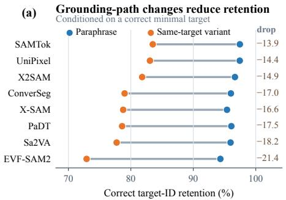

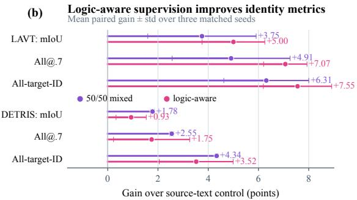  
Figure 6: Supplementary identity-retention and supervision views. (a) Descriptive target-ID retention conditioned on a correct minimal prediction. Each segment connects the same model’s paraphrase and alternative-path retention; the strictly matched comparison and normalized consistency analysis are reported in Table 3. (b) Paired gains over the source-text control in the three-epoch subset study. Points are mean within-seed differences and error bars are their standard deviations over seeds. Both panels are supplementary: panel (a) uses all eligible dense-track instances, while panel (b) measures a short continuation rather than general out-of-domain reasoning improvement.

Table 10: Matched referential-logic effects in mIoU percentage points. Each cell reports treated minus control mIoU with a 95% TCES-clustered bootstrap confidence interval. Candidate controls are matched exactly by normalized target category and source stream, then selected by nearestneighbor distance over log target-area fraction, log same-class count, and expression length; controls may be reused. N is the number of matched treated TCESs.
<table><tr><td>Treated — control</td><td>N</td><td>X2SAM</td><td>SAMTok</td><td>UniPixel</td><td>X-SAM</td></tr><tr><td>Ordinal — extremal</td><td>349</td><td>-10.27 [−15.82, -4.89]</td><td>-17.02 [-22.65, -11.53]</td><td>-25.52 [-30.51, -20.29]</td><td> $- 2 0 . 8 6 \ [ - 2 6 . 2 3 , - 1 5 . 5 1 ]$ </td></tr><tr><td>Multi-anchor — spatial</td><td>618</td><td>-3.13 [−7.27, 1.04]</td><td>-1.63 [-5.66, 2.47]</td><td>-1.83 [-5.28, 1.78]</td><td> $2 . 1 7 \ [ - 5 . 6 9 , 1 . 5 4 ]$ </td></tr><tr><td>Nested — spatial</td><td>200</td><td>-13.09 [-20.43, -6.02]</td><td> $- 7 . 3 3 \ [ - 1 4 . 4 5 , - 0 . 8 3 ]$ </td><td>-6.61 [-12.90, 0.30]</td><td> $- 9 . 8 4 \ [ - 1 5 . 8 7 , - 3 . 7 8 ]$ </td></tr></table>

## F.5 DENSE DIAGNOSTIC TRACKS AND SOURCE TRANSFER

The full eligible dense tracks complement the strictly matched analysis in the main paper. Table 12 shows that alternative-path and exclusion expressions are less reliable than paraphrases, while Table 13 jointly reports source-specific mIoU and All@0.7; both descriptive gaps also reflect differences in category and referential-logic composition. Table 14 reports the corresponding identityretention results over every eligible optional track.

Table 11: Complete controlled-intervention results. Category-only drop is relative to minimal expression mIoU. Donor preference measures whether a same-image, same-category text swap redirects the prediction toward the newly described instance. The final three columns report paired mIoU changes, in percentage points, relative to the corresponding original expressions.
<table><tr><td rowspan="2">Model</td><td colspan="2">Category only</td><td colspan="2">Text swap</td><td colspan="3">Inference-time aid (∆ mIoU)</td></tr><tr><td>mIoU</td><td>Drop</td><td>Donor IoU</td><td>Donor pref.</td><td>Logic-explicit</td><td>Deliberation</td><td>SC context</td></tr><tr><td>X2SAM</td><td>24.29</td><td>-44.48</td><td>80.61</td><td>93.50</td><td>-0.50</td><td>+0.13</td><td>+0.58</td></tr><tr><td>SAMTok</td><td>24.84</td><td>-44.91</td><td>79.46</td><td>94.23</td><td>-0.40</td><td>-0.16</td><td>-1.52</td></tr><tr><td>UniPixel</td><td>21.24</td><td>-43.78</td><td>77.12</td><td>93.07</td><td>-0.29</td><td>-0.44</td><td>+0.99</td></tr><tr><td>X-SAM</td><td>22.34</td><td>-36.95</td><td>76.60</td><td>90.29</td><td>-1.54</td><td>-2.05</td><td>+2.34</td></tr></table>

Table 12: Track-level mIoU on the 7,370-expression dense test set. Same-target denotes alternative valid grounding evidence, and exclusion is grouped by logic category. Paired exclusion drop compares 589 exclusion–minimal pairs from the same TCES. Optional tracks cover different TCES subsets, so their raw mIoUs are descriptive.
<table><tr><td>Model / checkpoint</td><td>Minimal</td><td>Paraphrase</td><td>Same-target</td><td>Exclusion</td><td>Paired exclusion drop</td></tr><tr><td>SAMTok-CO</td><td>69.73</td><td>82.94</td><td>66.36</td><td>57.76</td><td>13.03</td></tr><tr><td>X2SAM</td><td>68.74</td><td>82.22</td><td>65.08</td><td>56.90</td><td>13.81</td></tr><tr><td>UniPixel-7B</td><td>65.00</td><td>80.00</td><td>62.25</td><td>54.46</td><td>13.96</td></tr><tr><td>Sa2VA-2B</td><td>62.22</td><td>78.63</td><td>56.97</td><td>48.04</td><td>17.52</td></tr><tr><td>X-SAM</td><td>59.30</td><td>79.59</td><td>56.57</td><td>44.02</td><td>14.42</td></tr><tr><td>ConverSeg-3B</td><td>59.06</td><td>75.59</td><td>56.35</td><td>48.35</td><td>12.43</td></tr><tr><td>EVF-SAM2</td><td>59.76</td><td>76.08</td><td>52.32</td><td>38.90</td><td>23.08</td></tr><tr><td>PaDT-REC-3B</td><td>43.98</td><td>70.43</td><td>43.11</td><td>31.69</td><td>9.00</td></tr></table>

Table 13: Source-specific expression-level accuracy and TCES-level reliability on the core test (1,464 COCO and 1,454 OpenImages TCESs; two expressions per TCES). ∆ is OpenImages minus COCO. X2SAM and X-SAM are three-run means. Source differences are descriptive because the two subsets also differ in visual domain, object-category distribution, and referential-logic composition.
<table><tr><td rowspan="2">Model</td><td colspan="3">Expression-level mIoU</td><td colspan="3">TCES-level All@0.7</td></tr><tr><td>COCO</td><td>OI</td><td>∆</td><td>COCO</td><td>OI</td><td>∆</td></tr><tr><td>SAMTok-CO</td><td>76.86</td><td>57.35</td><td>-19.52</td><td>75.34</td><td>43.74</td><td>-31.60</td></tr><tr><td>X2SAM</td><td>77.80</td><td>53.96</td><td>-23.84</td><td>75.46</td><td>37.62</td><td>-37.84</td></tr><tr><td>UniPixel-7B</td><td>74.61</td><td>50.86</td><td>-23.75</td><td>70.15</td><td>33.36</td><td>-36.79</td></tr><tr><td>Sa2VA-2B</td><td>71.82</td><td>45.74</td><td>-26.08</td><td>64.69</td><td>25.93</td><td>-38.76</td></tr><tr><td>ConverSeg-3B</td><td>70.07</td><td>43.52</td><td>-26.56</td><td>61.95</td><td>24.00</td><td>-37.95</td></tr><tr><td>EVF-SAM2</td><td>68.45</td><td>42.20</td><td>-26.25</td><td>56.15</td><td>21.87</td><td>-34.28</td></tr><tr><td>X-SAM</td><td>73.64</td><td>39.86</td><td>-33.78</td><td>67.81</td><td>25.24</td><td>-42.56</td></tr><tr><td>InstructSeg</td><td>68.35</td><td>37.00</td><td>-31.35</td><td>58.33</td><td>19.67</td><td>-38.66</td></tr><tr><td>HyperSeg-3B</td><td>68.61</td><td>36.45</td><td>-32.16</td><td>59.22</td><td>20.15</td><td>-39.07</td></tr><tr><td>SaFiRe-mixed</td><td>62.36</td><td>30.19</td><td>-32.18</td><td>49.32</td><td>12.93</td><td>-36.39</td></tr><tr><td>VATEX-Swin-B</td><td>50.20</td><td>24.39</td><td>-25.81</td><td>32.92</td><td>10.59</td><td>-22.33</td></tr></table>

Table 14: Full dense-track identity retention and target-and-mask retention. Unlike the strictly matched analysis in Table 3, each column here uses all TCESs containing that optional track, so these values are descriptive rather than a controlled path-change comparison.
<table><tr><td>Model</td><td>Para. Ret.</td><td>Variant Ret.</td><td>Excl. Ret.</td><td>Para. TM@.7</td><td>Variant TM@.7</td><td>Excl. TM@.7</td></tr><tr><td>SAMTok</td><td>97.45</td><td>83.51</td><td>75.57</td><td>97.12</td><td>83.64</td><td>75.17</td></tr><tr><td>X2SAM</td><td>96.67</td><td>81.81</td><td>71.03</td><td>96.43</td><td>81.96</td><td>72.34</td></tr><tr><td>UniPixel</td><td>97.44</td><td>83.06</td><td>73.05</td><td>96.50</td><td>81.66</td><td>73.01</td></tr><tr><td>Sa2VA</td><td>95.97</td><td>77.73</td><td>67.03</td><td>95.34</td><td>74.99</td><td>63.75</td></tr><tr><td>ConverSeg</td><td>96.02</td><td>79.01</td><td>69.41</td><td>95.10</td><td>76.58</td><td>64.03</td></tr><tr><td>PaDT</td><td>96.09</td><td>78.60</td><td>68.77</td><td>95.98</td><td>82.57</td><td>71.77</td></tr><tr><td>X-SAM</td><td>95.39</td><td>78.77</td><td>63.81</td><td>95.28</td><td>79.61</td><td>64.62</td></tr><tr><td>EVF-SAM2</td><td>94.34</td><td>72.92</td><td>53.05</td><td>92.88</td><td>68.93</td><td>49.58</td></tr></table>

## F.6 SOURCE-STRATIFIED REFERENTIAL-LOGIC ROBUSTNESS

COCO and OpenImages differ in visual domain, object categories, and referential-logic composition, so a pooled logic profile could in principle conflate source difficulty with logic difficulty. Figure 7 therefore recomputes the nine-category profiles within each source. Absolute performance is lower on OpenImages, consistent with Table 13, but the relative difficulty structure is strongly preserved.

(a) COCO: expression-level mIoU by referential logic
<table><tr><td>SAMTok</td><td>83.9</td><td>83.6</td><td>76.1</td><td>58.0</td><td>72.6</td><td>75.8</td><td>72.2</td><td>61.7</td><td>70.6</td><td rowspan="7">90</td></tr><tr><td>X2SAM</td><td>84.9</td><td>81.2</td><td>78.7</td><td>63.4</td><td>72.1</td><td>77.3</td><td>75.4</td><td>61.0</td><td>66.7</td></tr><tr><td>UniPixel</td><td>81.9</td><td>80.3</td><td>72.2</td><td>50.4</td><td>67.5</td><td>75.0</td><td>71.7</td><td>51.3</td><td>69.7</td></tr><tr><td>X-SAM</td><td>81.9</td><td>82.8</td><td>76.3</td><td>54.4</td><td>65.3</td><td>72.9</td><td>68.3</td><td>56.0</td><td>59.4</td></tr><tr><td>Sa2VA</td><td>82.5</td><td>79.9</td><td>70.3</td><td>42.0</td><td>65.6</td><td>70.2</td><td>66.7</td><td>50.8</td><td>63.1</td></tr><tr><td>ConverSeg</td><td>77.9</td><td>75.8</td><td>71.7</td><td>47.4</td><td>60.1</td><td>70.4</td><td>66.9</td><td>51.2</td><td>61.1</td></tr><tr><td>EVF-SAM2</td><td>78.2</td><td>79.0</td><td>72.5</td><td>49.4</td><td>64.0</td><td>65.7</td><td>63.3</td><td>48.0</td><td>52.7</td></tr><tr><td>DETRIS</td><td>74.3</td><td>74.1</td><td>70.2</td><td>43.8</td><td>62.4</td><td>54.1</td><td>47.4</td><td>37.9</td><td>44.7</td></tr><tr><td>LAVT-RefCOCO</td><td>57.8</td><td>69.3</td><td>55.0</td><td>36.3</td><td>55.2</td><td>37.4</td><td>40.1</td><td>28.3</td><td>28.6</td></tr><tr><td></td><td>Target (939)</td><td>Extremal (249)</td><td>Relative (57)</td><td>Ordinal (194)</td><td>Subgroup (134)</td><td>Single (932)</td><td>Multi (175)</td><td>Nested (64)</td><td>Exclusion (184)</td></tr></table>

(b) OpenImages: expression-level mIoU by referential logic
<table><tr><td>SAMTok</td><td>64.7</td><td>65.7</td><td>62.3</td><td>57.6</td><td>60.4</td><td>59.2</td><td>55.8</td><td>47.9</td><td>48.2</td><td rowspan="5">40 30</td></tr><tr><td>X2SAM</td><td>63.0</td><td>61.6</td><td>69.4</td><td>52.8</td><td>52.3</td><td>54.3</td><td>52.3</td><td>41.9</td><td>49.0</td></tr><tr><td>UniPixel</td><td>57.0</td><td>61.8</td><td>57.0</td><td>41.1</td><td>49.9</td><td>52.6</td><td>51.5</td><td>44.7</td><td>44.8</td></tr><tr><td>X-SAM</td><td>46.8</td><td>52.8</td><td>45.6</td><td>42.1</td><td>38.0</td><td>40.6</td><td>39.5</td><td>23.1</td><td>33.7</td></tr><tr><td>Sa2VA</td><td>58.5</td><td>58.1</td><td>58.2</td><td>43.6</td><td>43.8</td><td>45.4</td><td>42.7</td><td>39.4</td><td>38.4</td></tr><tr><td>ConverSeg</td><td>51.2</td><td>53.9</td><td>48.4</td><td>40.0</td><td>44.9</td><td>43.8</td><td>39.9</td><td>36.2</td><td>40.3</td><td>20</td></tr><tr><td>EVF-SAM2</td><td>48.7</td><td>57.4</td><td>44.6</td><td>42.3</td><td>40.8</td><td>45.1</td><td>42.4</td><td>27.1</td><td>31.8</td><td></td></tr><tr><td>DETRIS</td><td>36.4</td><td>45.6</td><td>32.6</td><td>28.6</td><td>34.6</td><td>24.3</td><td>27.9</td><td>14.4</td><td>24.4</td><td>10</td></tr><tr><td>LAVT-RefCOCO</td><td>25.7</td><td>40.7</td><td>26.6</td><td>27.2</td><td>30.9</td><td>16.9</td><td>18.5</td><td>11.3</td><td>16.5</td><td></td></tr><tr><td rowspan="2"></td><td>Target</td><td>Extremal</td><td>Relative</td><td>Ordinal</td><td>Subgroup</td><td>Single</td><td>Multi</td><td>Nested</td><td>Exclusion</td><td rowspan="2"></td></tr><tr><td>(334)</td><td>(152)</td><td>(56)</td><td>(209)</td><td>(187)</td><td>(898)</td><td>(460)</td><td>(143)</td><td>(469)</td></tr></table>

Figure 7: Source-specific referential-logic profiles. Cells report expression-level mIoU; parentheses give the number of expressions in each source–logic slice. Across all nine models and in both sources, ordinal expressions score below extremal descriptions and nested grounding scores below single-anchor relations. The exact within-source ordering is not identical, but the principal difficulty pattern is stable.

Table 15 quantifies this stability. Per-model Spearman correlations between the COCO and Open-Images category rankings range from 0.750 to 0.950 (median 0.833). The ordinal–extremal and nested–single-anchor gaps are negative for every model in both sources. Target-centric evidence and extremal descriptions remain among the easier categories, although which one ranks first can change across models and sources; we therefore do not claim an identical total ordering.

Table 15: Cross-source stability of referential-logic difficulty. ρ is the Spearman correlation between each model’s nine-category mIoU rankings on COCO and OpenImages. Gap columns are mIoU percentage-point differences; negative values mean that ordinal is harder than extremal or that nested is harder than single-anchor, respectively.
<table><tr><td colspan="2"></td><td colspan="2">Ordinal — extremal</td><td colspan="2">Nested — single-anchor</td></tr><tr><td>Model</td><td>ρ</td><td>COCO</td><td>OI</td><td>COCO</td><td>OI</td></tr><tr><td>SAMTok</td><td>0.867</td><td>-25.52</td><td>-8.12</td><td>-14.10</td><td>-11.36</td></tr><tr><td>X2SAM</td><td>0.833</td><td>-17.78</td><td>-8.75</td><td>-16.23</td><td>-12.37</td></tr><tr><td>UniPixel</td><td>0.950</td><td>-29.91</td><td>-20.69</td><td>-23.68</td><td>-7.99</td></tr><tr><td>X-SAM</td><td>0.750</td><td>-28.36</td><td>-10.69</td><td>-16.87</td><td>-17.57</td></tr><tr><td>Sa2VA</td><td>0.833</td><td>-37.89</td><td>-14.49</td><td>-19.43</td><td>-6.02</td></tr><tr><td>ConverSeg</td><td>0.783</td><td>-28.45</td><td>-13.93</td><td>-19.23</td><td>-7.60</td></tr><tr><td>EVF-SAM2</td><td>0.900</td><td>-29.65</td><td>-15.16</td><td>-17.66</td><td>-18.01</td></tr><tr><td>DETRIS</td><td>0.817</td><td>-30.33</td><td>-16.93</td><td>-16.20</td><td>-9.90</td></tr><tr><td>LAVT-RefCOCO</td><td>0.767</td><td>-32.93</td><td>-13.48</td><td>-9.14</td><td>-5.54</td></tr></table>

The failure-localization conclusion also holds within each source (Table 16). Identity errors account for 66.46–78.79% of the analyzed COCO failures and 73.50–81.34% of the OpenImages failures. OpenImages nested expressions have a modestly larger correct-ID/poor-mask share than their COCO counterparts (26.50% versus 21.21%), but target-selection errors still dominate that slice.

Table 16: Source-specific failure decomposition at IoU 0.7, pooled over the five U-group models SAMTok, X2SAM, UniPixel, Sa2VA, and X-SAM. N counts model–expression failures, not unique benchmark expressions. Same-class switches are a strict subset of identity errors.
<table><tr><td>Source</td><td>Logic category</td><td>N</td><td>Identity error</td><td>Same-class switch</td><td>Correct ID, poor mask</td></tr><tr><td>COCO</td><td>Single-anchor</td><td>984</td><td>66.46</td><td>59.45</td><td>33.54</td></tr><tr><td>COCO</td><td>Multi-anchor</td><td>205</td><td>77.56</td><td>69.76</td><td>22.44</td></tr><tr><td>COCO</td><td>Nested</td><td>132</td><td>78.79</td><td>70.45</td><td>21.21</td></tr><tr><td>OpenImages</td><td>Single-anchor</td><td>2,289</td><td>76.45</td><td>51.99</td><td>23.55</td></tr><tr><td>OpenImages</td><td>Multi-anchor</td><td>1,211</td><td>81.34</td><td>56.48</td><td>18.66</td></tr><tr><td>OpenImages</td><td>Nested</td><td>468</td><td>73.50</td><td>47.65</td><td>26.50</td></tr></table>

## F.7 SUPPLEMENTARY DATASET COMPOSITION

Figure 8 summarizes target-category and logic coverage over the complete release, while Figure 9 isolates the test-set source mix and the grounding-path transition matrix. Together they show that COCO and OpenImages contribute complementary image distributions and that the benchmark covers all nine canonical referential logics rather than concentrating on a single construction pattern.

## F.8 FAILURE LOCALIZATION AND STATISTICAL ROBUSTNESS

Table 17: Failure decomposition at IoU 0.7, aggregated over the five universal models in Table 3. Same-class switches are a strict subset of identity errors.
<table><tr><td>Logic category</td><td>Identity error</td><td>Same-class switch</td><td>Correct ID, poor mask</td></tr><tr><td>Single-anchor</td><td>73.45</td><td>54.23</td><td>26.55</td></tr><tr><td>Multi-anchor</td><td>80.79</td><td>58.40</td><td>19.21</td></tr><tr><td>Nested</td><td>74.67</td><td>52.67</td><td>25.33</td></tr></table>

(a) Target categories

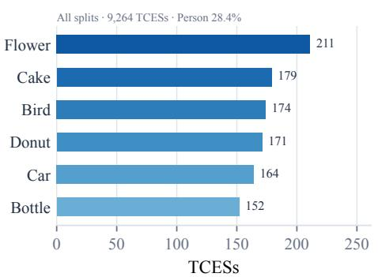  
(b) Logic coverage

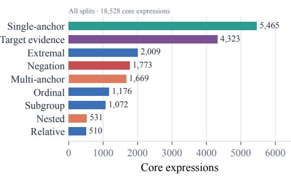  
Figure 8: Full-dataset composition. (a) The six most frequent non-person target categories, with the person share reported in-panel. (b) Coverage of all 18,528 core expressions over the nine canonical referential-logic categories. Both panels summarize the complete 9,264-TCES release.

(a) Source composition  
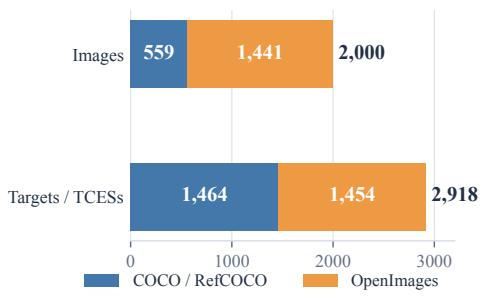

(b) Different grounding paths, fixed target  
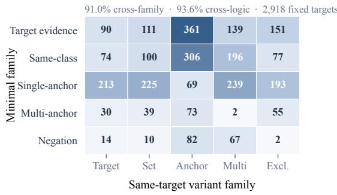  
Figure 9: Supplementary test-set composition and grounding-path statistics. (a) COCO/RefCOCO and OpenImages contribute complementary image distributions and similar numbers of fixed target instances. (b) The full transition matrix reports the family of the minimal expression (rows) and same-target variant (columns) for all 2,918 test-set TCESs.

Table 18: Sensitivity to the identity-assignment score and margin thresholds, pooled over the five universal models used in Table 17. Core-pair All-target-ID is computed over 14,335 model–TCES pairs. Failure columns use the 5,289 predictions below IoU 0.7 in the single-anchor, multi-anchor, and nested categories; identity error is the sum of confirmed same-class switches and unresolved assignments. Bold indicates the default setting.
<table><tr><td>Min. score</td><td>Min. margin</td><td>Core-pair All- target-ID</td><td>Identity error</td><td>Same-class switch</td><td>Unresolved</td><td>Correct ID, poor mask</td></tr><tr><td>0.05</td><td>0.00</td><td>59.77</td><td>73.28</td><td>58.04</td><td>15.24</td><td>26.72</td></tr><tr><td>0.05</td><td>0.05</td><td>59.04</td><td>75.31</td><td>55.51</td><td>19.80</td><td>24.69</td></tr><tr><td>0.10</td><td>0.00</td><td>59.60</td><td>73.64</td><td>57.67</td><td>15.98</td><td>26.36</td></tr><tr><td>0.10</td><td>0.05</td><td>58.92</td><td>75.55</td><td>55.17</td><td>20.38</td><td>24.45</td></tr><tr><td>0.10</td><td>0.10</td><td>58.53</td><td>76.73</td><td>53.73</td><td>22.99</td><td>23.27</td></tr><tr><td>0.15</td><td>0.05</td><td>58.86</td><td>75.80</td><td>54.81</td><td>20.99</td><td>24.20</td></tr></table>

Across all tested settings, identity errors account for 73.28–76.73% of relational and compositional failures, while confirmed same-class switches alone account for 53.73–58.04%.

Statistical reporting. Confidence intervals resample TCESs, preserving within-mask dependence. After merging the retained spatial and orientation tags, logic-profile counts range from 113 relativeselection to 1,830 single-anchor expressions; we report every category but interpret smaller ones through their uncertainty. Raw optional-track mIoU differences may reflect subset composition, whereas paired identity analyses use matched TCESs. The NCI analysis retains 988 complete $( m , p , v )$ triplets after excluding three duplicate-paraphrase TCESs before inspecting model outputs.