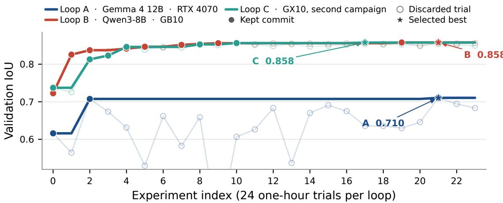

# Insights from Autoresearch for Solar Panel Segmentation

Justinas Lekavičius1 Kürşat Kömürcü1,2,3 Valentas Gružauskas1 Linas Petkevičius1

1Vilnius University, Institute of Computer Science, Artificial Intelligence Methods Lab

2IRISA, Université Bretagne Sud

3European Commission Joint Research Centre

Abstract This paper investigates AutoResearch, a protocol in which a coding language model edits a training program under a one-hour GPU budget and retains a change only if validation IoU improves. The protocol is applied to photovoltaic panel segmentation on a frozen real-image split, with DeepLabV3–ResNet-50 held fixed. Three campaigns of 24 experiments, using Gemma 4 12B, Qwen3-8B all improve their one-hour baselines, but retained modifications do not transfer across hardware. The Qwen3-8B configuration, trained on real images only, reaches a test IoU of 0.836 versus 0.833 for the reference GAN-augmented schedule. Research repository https://github.com/VU-AIML/automl4eo-autoresearch-segmentation.

## 1 Introduction

Earth observation (EO) segmentation is experimentally sensitive. Loss functions, learning-rate schedules, optimizers, and augmentations interact with class imbalance, ground sampling distance (GSD), and the available GPU memory. Loss function varies from vision-language models Komurcu and Petkevicius (2025) to recent I-JEPA approaches Kömürcü and Petkevicius (2026). Published training configurations are often sized for a hardware platform and epoch budget that difer from those available in a later study. As a result, transferring a reported configuration is not always efective, and manual search of the design space is time-consuming.

AutoResearch (Karpathy, 2025) is not a new segmentation architecture. It is a constrained autonomous experiment loop: a coding agent may edit only the training program, runs a trial under a fixed wall-clock budget, retains the change if a scalar validation metric improves, and otherwise reverts. This approach is the continuation of the field, as automated approaches were tried in Yamada et al. (2025); Becktepe et al. (2025); Wąsala et al. (2025); Opdam (2025). The original implementation of autoresearch targets single-GPU language-model pretraining, with a budget of about 300 s per idea and validation bits-per-byte as the acceptance criterion. We argue that the same control protocol is a natural AutoML operator for EO segmentation, provided that the data split and the evaluator remain outside the agent’s control. At each step the coding model sees the current training program, the parseable run footer, and a short instruction file that states the IoU keep/revert rule and the frozen files; it then proposes a free-form code edit rather than a point in a pre-declared search space.

The experimental testbed is the photovoltaic (PV) panel segmentation setting of Lekavičius and Gružauskas (2024): DeepLabV3 (Chen et al., 2017) with a ResNet-50 backbone (He et al., 2016), images resampled to 0.1 m/pixel and 512 × 512, and a 2048/256/256 split of real images. That work improved test intersection-over-union (IoU) from 0.801 without augmentation to 0.833 by adding 1228 pix2pix (Isola et al., 2017) images and training for up to 100 epochs on an A100 GPU. In the present study the architecture and split are frozen, the synthetic images are withheld, and AutoResearch searches only the training program under a one-hour budget.

The contributions of this paper are threefold. First, the AutoResearch protocol is ported from language-model pretraining to binary PV segmentation, with an immutable evaluator and a fixed real-image split. Second, three independent 24-experiment campaigns are reported on two GPU classes, and the retained modifications are compared. Third, the best Qwen3-8B configuration is evaluated once on the held-out test split and placed next to the reference Table 5 numbers of Lekavičius and Gružauskas (2024).

The remainder of the paper is structured as follows. Section 2 describes the protocol. Section 3 reports the experimental study. Section 4 concludes.

## 2 Method

The preparation program owns the canonical real split, GSD resampling, object-centric $5 1 2 \times 5 1 2$ crops, ImageNet normalization, and the evaluation function (mean per-image IoU on the 256-image validation set). The F1 score is logged but is not the acceptance metric. The agent never trains on validation or test images and cannot edit the evaluator. Training is launched only through a wrapper that unloads the coding model, enforces the wall-clock budget, and prints a parseable footer.

The agent may edit only the training program (loss, optimizer, schedule, auxiliary head, gradient clipping, and train-time augmentation). The architecture remains DeepLabV3–ResNet-50. Let $c _ { t }$ denote the current retained training program and �(�) the validation IoU after 3600 s. A proposed edit $\Delta _ { t }$ is committed if $m ( c _ { t } + \Delta _ { t } ) > m ( c _ { t } )$ ; otherwise the tree is reset to $c _ { t }$ . Failed runs are treated as rejections. Each campaign is capped at 24 logged experiments, including the baseline. Under a frozen architecture and evaluator the loop is close to code-level hyperparameter search; its extra degree of freedom is that proposals need not lie in a pre-specified space.

## 3 Experimental study

The data follow the reference paper: 640 image–mask pairs from each of four GSDs (PV08 0.8 m, PV03 0.3 m, IGN 0.2 m, PV01+Google 0.1 m) (Jiang et al., 2021; Kasmi et al., 2023), split 512/64/64 per GSD, with random seed 35. Only real images are used; the 1228 pix2pix extras are never loaded. Three independent campaigns are run on this split (Table 1).

Loop A is executed under a 12 GB memory constraint (batch size 2). Loops B and C use a cached 512 × 512 loader on GX10-class hardware (Loop C later retains batch sizes 12 and 16). Disk caching of the resampled pairs is a harness constant, not an agent proposal. The test split is scored once, after Loop $\mathrm { B , }$ on the best validation checkpoint.

## 3.1 Retained modifications

As we can see in Figure 1 overlays the three traces. Solid lines show the running best of each campaign, i.e. the selected configuration trajectory. Rejected trials are drawn transparently; stars mark the selected best of each campaign.

In Loop A, a cosine schedule with 5% linear warmup increases validation IoU from 0.616 to 0.708. Reducing Adam weight decay from $1 0 ^ { - 4 } ~ \mathrm { t o } ~ 1 0 ^ { - 5 }$ then yields 0.710. Dice, AdamW, auxiliary BCE, gradient clipping, geometric and photometric augmentation, polynomial decay, and encoder freezing are rejected. Gradient-norm clipping at 1.0 reduces IoU to 0.349, which lies below the range of Figure 1.

Loop B retains nine modifications after the baseline. Combining per-image soft Dice with BCE (Milletari et al., 2016) is the largest gain (+0.103). A polynomial schedule over the remaining wall clock then replaces the reference StepLR with step size 20 (+0.012), which would otherwise reduce the learning rate after approximately 20 of the ≈32 epochs that fit in one hour. Smaller retained changes follow: DeepLab auxiliary logits with weight 0.4, horizontal flipping, AdamW (Loshchilov and Hutter, 2017), 180 s warmup, gradient-norm clipping at 1.0, BCE positive class weight 2, and vertical flipping (+0.0001).

Loop C, an independent GX10 campaign, also begins with Dice (+0.076) and then diverges. It retains flipping together with Dice, a lower peak learning rate, a larger batch, and finally a

Table 1: Summary of the three AutoResearch campaigns. Architecture, split, seed, and a one-hour training budget are shared. Loops A and C are not evaluated on the held-out test set.
<table><tr><td></td><td>Loop A</td><td>Loop B</td><td>Loop C</td></tr><tr><td>Coding model</td><td>Gemma 4 12B</td><td>Qwen3-8B</td><td>Qwen3-8B</td></tr><tr><td>GPU</td><td>RTX 4070 12 GB</td><td>3 ASUS Ascent GX10 ASUS Ascent GX10</td><td></td></tr><tr><td>Batch / peak VRAM</td><td>2 / ≈9 GB</td><td>8 / 18-35 GB</td><td>8→16 / 35-36 GB</td></tr><tr><td>Baseline val. IoU</td><td>0.616</td><td>0.723</td><td>0.737</td></tr><tr><td>Best val. IoU</td><td>0.710</td><td>0.858</td><td>0.858</td></tr><tr><td>∆ val. IoU</td><td>+0.094</td><td>+0.135</td><td>+0.120</td></tr><tr><td>Retained / rejected</td><td>3 / 21</td><td>10 / 14</td><td>7 / 17</td></tr><tr><td>Best test IoU / F1</td><td></td><td>0.836 / 0.891</td><td></td></tr></table>

  
Figure 1: Validation IoU over three AutoResearch campaigns on the same frozen real split and one-hour budget. Solid lines show the running best of each campaign. Transparent markers correspond to rejected trials. Stars mark the selected best of each campaign. The Loop A clipping trial (IoU 0.349) lies below the plotted range.

Dice-heavy configuration with color jitter at batch size 16 (validation IoU 0.858). Unlike Loop B, it does not retain AdamW, polynomial decay, an auxiliary head, or gradient clipping.

Table 2 compares overlapping families of modifications. Changes retained in Loop B are often rejected in Loops A and C, or are not proposed. Dice is the only large, repeated retention on GX10-class hardware; it decreases IoU on the 4070 baseline. Cosine decay is the only large retention under 12 GB and is rejected in both GX10 campaigns. Horizontal flipping, color jitter, and a lower peak learning rate change sign depending on the configuration on which they are stacked. Rotation, encoder freezing, and exponential moving averages of the weights are rejected in every campaign that tries them. The two GX10 campaigns reach the same validation IoU of 0.858 with diferent retained sequences. This coincidence is consistent with a one-hour performance plateau on this backbone and split, rather than with a unique AutoML default.

Diminishing returns are visible in all three traces. After the first one or two retained changes, later accepted deltas are of the order of $1 0 ^ { - 3 }$ IoU, which is within single-run variation that the protocol does not estimate.

## 3.2 Comparison with the reference schedule

Table 3 places Loop B on the same frozen 256-image test identifiers as Table 5 of Lekavičius and Gružauskas (2024). The comparison is not matched for compute: the reference trains for up to 100 epochs with early stopping on an A100 (batch size 48) and, in gan60, adds 1228 synthetic images.

Table 2: Outcome of overlapping modification families. Deltas are computed against the configuration on which the change was stacked. Retention means that the commit became the new incumbent.
<table><tr><td>Modification family</td><td>Loop A</td><td>Loop B</td><td>Loop C</td></tr><tr><td>Soft Dice (+BCE)</td><td>rejected</td><td>retained +0.103</td><td>retained +0.076</td></tr><tr><td>Cosine schedule</td><td>retained +0.092</td><td>rejected</td><td>rejected</td></tr><tr><td>Polynomial LR 0.9</td><td>rejected</td><td>retained +0.012</td><td></td></tr><tr><td>AdamW vs. Adam</td><td>rejected</td><td>retained +0.005</td><td></td></tr><tr><td>Auxiliary head ×0.4</td><td>rejected</td><td>retained +0.004</td><td></td></tr><tr><td>Gradient clip 1.0</td><td>rejected -0.359</td><td>retained +0.002</td><td></td></tr><tr><td>Horizontal flip</td><td>rejected</td><td></td><td>retained +0.005 rejected, then retained</td></tr><tr><td>Lower peak LR</td><td>rejected 3×10−4</td><td>rejected</td><td>retained</td></tr><tr><td>Larger batch</td><td>- (12 GB)</td><td></td><td>retained 8→12→16</td></tr><tr><td>Color jitter</td><td>rejected</td><td>rejected</td><td>retained +0.001</td></tr><tr><td>Rotation / freeze / EMA</td><td>rejected</td><td>rejected</td><td>rejected</td></tr></table>

Table 3: Loop B compared with Table 5 of Lekavičius and Gružauskas (2024) on the same 256 test images. Loops A and C are validation-only.
<table><tr><td>Setup</td><td>Data</td><td>Budget</td><td>IoU</td><td>F1</td></tr><tr><td>Paper no_aug</td><td>real</td><td>≤100 ep. (A100)</td><td>0.801</td><td>0.853</td></tr><tr><td>Paper basic_aug</td><td>real</td><td>≤100 ep. (A100)</td><td>0.813</td><td>0.865</td></tr><tr><td>Paper gan60 (paper best)</td><td>real + 60% GAN</td><td>≤100 ep. (A100)</td><td>0.833</td><td>0.880</td></tr><tr><td>Loop C best (val.)</td><td>real</td><td>3600 s (GX10)</td><td>0.858†</td><td></td></tr><tr><td>Loop B best (val.)</td><td>real</td><td>3600 s (GX10)</td><td>0.858†</td><td>0.908†</td></tr><tr><td>Loop B best (test)</td><td>real</td><td>3600 s (GX10)</td><td>0.836</td><td>0.891</td></tr></table>

†Validation split; not comparable to the paper’s test rows.

Loop B trains for 3600 s on 2048 real images, without test-time flipping and without a change of backbone. Loops A and C are validation-only.

On this protocol, the one-hour real-only configuration improves IoU by 0.034 and F1 by 0.038 relative to no\_aug, and IoU by 0.002 and F1 by 0.011 relative to gan60. The gap between validation and test IoU is approximately 0.022, so neither GX10 validation figure of 0.858 should be read as a test result. The comparison is specific to this split, backbone, and GPU; it is not evidence that AutoResearch outperforms GAN augmentation in general.

Each proposed change is evaluated with a single random seed (35). Loops A and C have no test evaluation. The coding model is confounded with GPU class, and the agent cannot change the backbone, the split, or the metric.

## 4 Conclusion

Motivated by the cost of manually searching EO segmentation configurations, this paper investigates AutoResearch as an AutoML operator for solar-panel segmentation. Three campaigns improve onehour DeepLabV3 baselines on a frozen real split. The retained modifications are a cosine schedule with reduced weight decay under 12 GB, and two GX10 sequences that both reach a validation IoU of 0.858. The Qwen3-8B configuration matches the reference test IoU without synthetic images. The protocol is efective under a declared budget if the evaluator remains frozen and retained modifications are not treated as universal defaults. A direct comparison with a declared-space tuner, and a less restricted loop that may edit architecture, preprocessing, or literature-derived ideas, are left to future work.

## References

Becktepe, J., Hennig, L., Oeltze-Jafra, S., and Lindauer, M. (2025). Auto-nnu-net: towards automated medical image segmentation. arXiv preprint arXiv:2505.16561.

Chen, L.-C., Papandreou, G., Schrof, F., and Adam, H. (2017). Rethinking atrous convolution for semantic image segmentation. arXiv preprint arXiv:1706.05587.

He, K., Zhang, X., Ren, S., and Sun, J. (2016). Deep residual learning for image recognition. In Proceedings of the IEEE conference on computer vision and pattern recognition, pages 770–778.

Isola, P., Zhu, J.-Y., Zhou, T., and Efros, A. A. (2017). Image-to-image translation with conditional adversarial networks. In 2017 IEEE conference on computer vision and pattern recognition (CVPR), pages 5967–5976. Ieee.

Jiang, H., Yao, L., Lu, N., Qin, J., Liu, T., Liu, Y., and Zhou, C. (2021). Multi-resolution dataset for photovoltaic panel segmentation from satellite and aerial imagery. Earth System Science Data Discussions, 2021:1–17.

Karpathy, A. (2025). autoresearch. https://github.com/karpathy/autoresearch. Accessed 2026- 09-20.

Kasmi, G., Saint-Drenan, Y.-M., Trebosc, D., Jolivet, R., Leloux, J., Sarr, B., and Dubus, L. (2023). A crowdsourced dataset of aerial images with annotated solar photovoltaic arrays and installation metadata. Scientific Data, 10(1):59.

Komurcu, K. and Petkevicius, L. (2025). Multispectral image caption unification using difusion and cycle gan models. IEEE Access, 13:193708–193718.

Kömürcü, K. and Petkevicius, L. (2026). Sat-jepa-dif: Caption-guided zero-rgb satellite image forecasting via self-supervised difusion. IEEE Geoscience and Remote Sensing Letters.

Lekavičius, J. and Gružauskas, V. (2024). Data augmentation with generative adversarial network for solar panel segmentation from remote sensing images. Energies, 17(13):3204.

Loshchilov, I. and Hutter, F. (2017). Decoupled weight decay regularization. arXiv preprint arXiv:1711.05101.

Milletari, F., Navab, N., and Ahmadi, S.-A. (2016). V-net: Fully convolutional neural networks for volumetric medical image segmentation. In 2016 fourth international conference on 3D vision (3DV), pages 565–571. Ieee.

Opdam, K. (2025). Finding and Visualising Patterns and Knowledge Gaps in the Field of AutoML for Earth Observation. PhD thesis, LIACS, Leiden University.

Wąsala, J., Maasakkers, J. D., Schuit, B. J., Leguijt, G., Aben, I., Schneider, R., Hoos, H., and Baratchi, M. (2025). Automergenet: automl-based m-source satellite data fusion evaluated with atmospheric case studies. IEEE Journal of Selected Topics in Applied Earth Observations and Remote Sensing.

Yamada, Y., Lange, R. T., Lu, C., Hu, S., Lu, C., Foerster, J., Clune, J., and Ha, D. (2025). The ai scientist-v2: Workshop-level automated scientific discovery via agentic tree search. arXiv preprint arXiv:2504.08066.