P I X E L S PAC E G E N E R AT I V E M O D E L S

# Iris-3B: Going Beyond the Latent with Pixel-Space Diffusion Training, Conversion and Fine-Tuning

Hanqiu Li Cai†, Chema Garabito

SperidLabs · †Project lead · Code and models: github.com/speridlabs/iris-3b

## A B S T R AC T

Pixel-space diffusion models avoid the lossy VAE of latent models, which suggests an advantage on downstream tasks where fine-grained detail matters. We test this claim along both routes to a pixel-space backbone. We pretrain Iris-3B, a 3B-parameter pixel-space text-to-image transformer, from scratch through a 256 512 1024 curriculum, after first ablating the prediction target and representation alignment REPA at $2 5 6 ^ { 2 }$ to decide what to scale. We also convert a pretrained latent model, FLUX.2 Klein base 4B [1], to pixel space. We fine-tune both families for monocular depth estimation and for image restoration/super-resolution. We find no significant improvement from using a pixel-space generative prior. Fine-tuned for depth with one matched direct-regression recipe, Iris-3B is level with the latent FLUX.2 Klein and the converted pixel FLUX.2 Klein falls behind it, and on 4 DIV2K restoration neither pixel model beats a latent FLUX.2 Klein fine-tune, the converted one trailing it slightly. We document the recipes, the failure modes and the remaining confounds behind this negative result. Nevertheless, Iris-3B shows that pixel-space pretraining with the pixel-transformer PiT head of PixelDiT [2] scales to 3B parameters and to text-to-image quality competitive with latent models, matching Qwen-Image [3] on OneIG under the official evaluators at $1 0 2 4 ^ { 2 }$ . We release its weights and training code in the hope that they help pave the way for further work on pixel-space generation.

  
F I G . 1 Samples from Iris-3B at a one-megapixel budget across aspect ratios, generated directly in pixel space.

## 01 · Introduction

Latent diffusion [4] has become the dominant paradigm for high-resolution image synthesis. By running the generative process in the compressed space of a pretrained variational autoencoder VAE, it makes training and sampling at high resolution affordable. This efficiency comes at a price. The autoencoder is trained separately from the generator and reconstructs with loss, so its errors compound with those of the generator and the two cannot be optimized jointly [2]; any detail the codec discards lies beyond the generator’s reach. Generating directly in pixel space removes this bottleneck, and recent work has made it competitive: transformers operating on raw pixels now rival latent models on class-conditional ImageNet [5] and approach them in text-to-image quality [2, 6], pretrained latent models can be converted to pixel space at a fraction of the cost of training from scratch [7, 8], and raw pixel patches can serve as the only visual interface of a unified model that both understands and generates images and video [9].

These works, however, judge pixel-space models by what they generate or understand, not by how well they serve as backbones for other tasks. Pretrained generators are increasingly valued for exactly that reason, as backbones for other vision tasks: finetuned generators define the state of the art in monocular depth estimation [10, 11] and supply strong priors for image restoration [12]. For such tasks the codec is a structural limitation rather than an aesthetic one. When the backbone is a latent model, every dense output, whether a depth map or a restored photograph, must be decoded by an autoencoder that was optimized to reconstruct natural images. It is therefore natural to expect that a pixel-space generator should transfer better than a latent one to tasks in which fine spatial detail matters.

In this report we put this hypothesis to the test, obtaining pixel-space backbones by both routes the literature offers. First, we pretrain Iris-3B, a 3B-parameter pixel-space text-to-image transformer, from scratch through a 256 512 1024 curriculum. To choose its recipe, we ablate pretraining strategies on a 1.3B PixelDiT at 2562: prediction targets (x vs. v) and representation-alignment objectives REPA, iREPA, DINOv3 targets and Self-Flow), each compared with its own control at matched steps Sec. 3.1). Under the official evaluators at 10242, Iris-3B reaches GenEval 0.798 and DPG 86.52, showing that pixel-space pretraining is practical at this scale. Second, we convert a pretrained latent model, FLUX.2 Klein base 4B [1], to pixel space. We then fine-tune both kinds of model for two detail-critical tasks, monocular depth estimation and image restoration with super-resolution, and compare them against latent counterparts.

Contrary to our expectation, we find no significant improvement from a pixel-space generative prior. We fine-tune Iris-3B, the converted FLUX.2 Klein and the latent FLUX.2 Klein for depth with one matched recipe and score them on NYUv2, KITTI, ETH3D, ScanNet and DIODE Iris-3B is level with the latent model, and the converted pixel model falls behind it. On restoration, the converted model trails its latent counterpart slightly. None of these comparisons is free of confounds, and we document those that remain rather than claim to have resolved them. We nonetheless believe that the negative result, together with the recipes that produced it, is useful to anyone weighing pixelspace backbones for dense prediction.

In summary, we make the following contributions:

We explore fine-tuning pixel-space generative models, both trained from scratch and converted from latent models, for monocular depth estimation and image restoration, and evaluate them against latent counterparts. We find no significant improvement from pixel space and document the confounds that remain Sec. 5).

We evaluate pretraining strategies for pixel-space models in a controlled 256px ablation campaign, covering prediction targets (x vs. v) and representation-alignment strategies REPA, iREPA, DINOv3 targets and Self-Flow) Sec. 3.1).

We convert FLUX.2 Klein base 4B to pixel space and identify the input interface as the obstacle, which a gain-matched ridge initialization and a scaled trunk learning rate (LR) remove (Sec. 4).

We release Iris-3B, an open 3B-parameter pixelspace text-to-image model trained from scratch, showing that pixel-space generation works at scale, together with its weights and training code.

## 02 · Related Work

Pixel-space generation. Early pixel-space diffusion models relied on cascades or on pixel-level U Nets. Recent work shows that a single transformer can generate in pixel space. JiT [5] uses large patches and predicts clean images, which avoids the failure of noise prediction in high dimensions. PixelDiT [2] splits the model into a patch-level transformer and a pixel-level transformer that refines texture, and scales to high-resolution text-to-image generation. DiP [13] and PixNerd [14] replace the per-patch linear decoder with a lightweight pixel decoder and a neural field, respectively. PixelGen [15] adds perceptual losses to clean-image prediction and trains a competitive textto-image model on a small compute budget. Asym-Flow [6] restricts noise prediction to a low-rank subspace. Concurrent with this report, PixelUMM [9] extends the encoder-free approach to a unified model that understands and generates images and video in pixel space. Raw pixel patches are its only visual interface, with no ViT encoder and no VAE. Its design studies anticipate several of our own findings, which we note where they arise.

Latent-to-pixel conversion. A complementary line of work obtains pixel-space models by converting pretrained latent ones. L2P [7] replaces the VAE with large-patch tokenization, freezes the intermediate layers and trains only the shallow ones on images generated by the source model, approaching the quality of the source at a small fraction of its training cost. Jiang et al. [8] study this transition systematically, ablating initialization, data composition, prediction target, decoder and noise schedule, and obtain converted models that match or exceed their latent counterparts while running faster end to end. Asym-Flow [6] instead aligns its low-rank pixel subspace with the latent space, which yields a seamless initialization from FLUX.2 Klein 9B and a converted model that surpasses its latent base.

Generative priors for dense prediction. Vision Banana [19] argues that generation pretraining yields generalist visual representations. Marigold [10] finetunes a latent text-to-image model into an affineinvariant depth estimator, and E2EFT [16] shows that a single-step, end-to-end fine-tune works as well as the multi-step original; our depth recipe follows this single-step design. Marigold V2 [11] moves to modern DiTs, adds representation alignment against groundtruth features and a Sinkhorn-based second stage; it names the recovery of sharp, detailed depth among the open problems of the field. PointDiT [17] trains a pixel-space DiT for point maps from scratch, conditioned on DINOv3 features [18], and shows that a point-map VAE injects reconstruction noise whereas denoising raw point-map patches recovers sharper structure.

Generative restoration. Diffusion-based restoration conditions a pretrained text-to-image generator on the low-quality image. StableSR [20] adds a time-aware encoder to Stable Diffusion, and Diff-BIR [21] first removes degradations with a restoration module and then regenerates detail with a diffusion prior. SeeSR [22] adds semantic prompts, and SUPIR [23] scales the approach to SDXL with largescale training data and text guidance. To reduce the cost of iterative sampling, OSEDiff [24] distills restoration into a single step with variational score distillation, and HYPIR [12] initializes a one-step restoration network from a diffusion model’s score prior and trains it adversarially. Training degradations typically follow Real-ESRGAN [25].

Representation alignment. REPA [26] aligns intermediate DiT features with a frozen DINOv2 [27] encoder and speeds up training substantially. iREPA [28] argues that the spatial structure of the target features matters more than their global content. Self-Flow [29] replaces the external encoder with a self-supervised objective built into flow matching. We ablate all three Sec. 3.1).

## 03 · Iris-3B: Pretraining a Pixel-Space Model

## 3.1 Ablations at 256px

We first select the pretraining recipe with ablations on a 1.3B dual-stream PixelDiT reproduction [2] at 2562. All arms train on a fixed subset of our pretraining data at global batch 256 and are scored with one protocol: EMA weights, 25-step FlowDPM++ sampling, CFG 4.5, GenEval [30], DPGBench [31], FID10K against a held-out split, and CLIP score. Each arm is compared with its own control at matched steps.

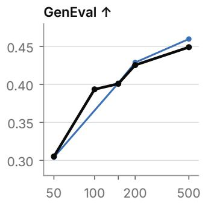

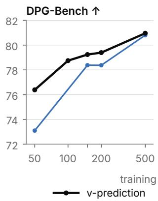

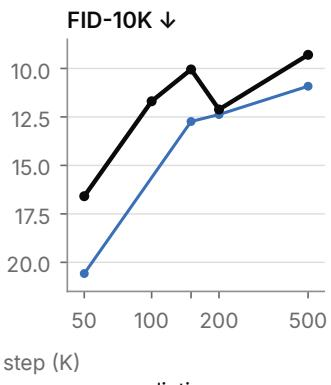

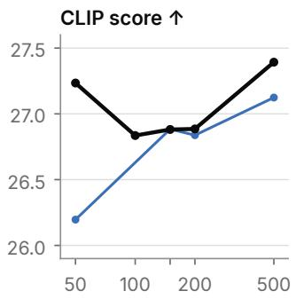  
FIG. 2 x- versus v-prediction at $2 5 6 ^ { 2 }$ , absolute scores at matched steps (EMA, 25-step FlowDPM++, CFG 4.5). Following JiT [5], the xprediction arm also uses its logit-normal timestep distribution (0.8, 0.8) instead of (0.0, 1.0), so the contrast does not isolate the prediction target.

Prediction target. Our first ablation compares xand v-prediction. JiT [5] argues that predicting the clean image is necessary once patch tokens are highdimensional, and Jiang et al. [8] find x-prediction consistently stronger when converting latent models to pixel space. In our setting we see no such benefit Fig. 2): v-prediction trains stably, the two targets are tied on GenEval at every milestone, and xprediction is worse on DPG and FID. Following JiT, which trains on noisier timesteps than the common default, the x-prediction arm also uses JiT’s timestep distribution: logit-normal (0.8, 0.8) over the noise level instead of our default (0.0, 1.0), which shifts training toward noisier timesteps. The contrast therefore does not isolate the prediction target alone. We keep vprediction.

Representation alignment. We then compare four alignment objectives Fig. 3). The control is REPA [26] with a frozen DINOv2 teacher. The other arms keep everything else fixed and change only the alignment: iREPA [28], which adds a convolutional projector and spatial normalization; REPA with a DINOv3 [18] teacher; and Self-Flow [29], which replaces the external teacher with a self-supervised objective.

REPA with DINOv2 is the strongest overall. It leads on GenEval at every milestone and is level with the best arm on DPG and CLIP. Switching the teacher to DINOv3 lowers GenEval at every milestone and worsens FID throughout; its small DPG lead at the end is within evaluation noise. iREPA is the one arm with a real gain on any metric: its FID is better than the control’s at 150K and 200K, but it trails on GenEval and CLIP at nearly every milestone, and its FID advantage has almost vanished by 250K. Self-Flow is far behind on all four metrics. It starts near zero on GenEval and closes much of the gap as training proceeds, but remains well below the control at 250K. We keep REPA with DINOv2.

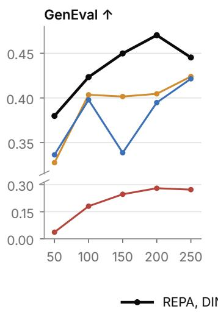

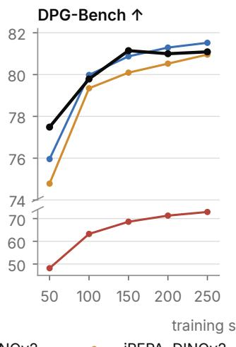

## 3.2 Scaling to Iris-3B

We then scale the selected training recipe (vprediction with DINOv2 REPA to 3B parameters. The architectural changes below target efficiency at scale and were not selected by the 256px ablations. Iris-3B is a flow-matching [32] transformer that operates directly on RGB pixels Fig. 4). The image is split into 16 16 patches, so a 10242 image becomes a 64 64 token grid; PixelUMM [9] likewise finds that 32 32 patches train to a higher loss than 16 16 even when they see four times as many images. The trunk follows the hybrid layout of FLUX.1 [33]: 8 dual-stream MMDiT blocks [34], in which text and image tokens keep separate weights, followed by 16 single-stream blocks, at width 2560. Attention uses GQA [35] with 20 Q and 5 KV heads, a sigmoid output gate [36] and sandwich normalization [37] with RMSNorm [38], following recent large text-to-image models [39, 40]. Timestep modulation replaces the per-block adaLN of DiT [41] with one shared projection per stream (image and text) plus per-block learned biases (shared-bias adaLN, in the spirit of adaLN-single [42] and the light bias modulation of Krea 2 [40]; at equal FLOPs this removes 28% of the parameters of the same model with per-block adaLN.

A four-block pixel transformer PiT head [2] decodes the trunk output to pixels. Each block modulates every pixel from its patch token and runs a per-pixel MLP; for attention, the pixels of each patch are compacted into one 1280-wide token, attended across the patch grid and expanded back. The text encoder is a frozen Qwen3-VL-4B-Instruct [43]. We read 12 of its layers and fuse them with layerwise attention pooling [44] followed by a two-block refiner. Image tokens use 2D axial RoPE [45, 46], which has no parameters tied to resolution, so the same weights run at every stage of the curriculum.

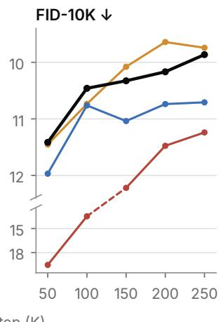

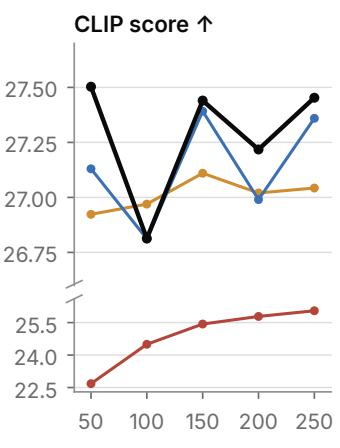  
FIG. 3 Representation-alignment ablations at 2562, absolute scores at matched steps (same protocol as Fig. 2). All arms share the same model and data and differ only in the alignment objective. Each y-axis is broken to fit Self-Flow on the same scale.

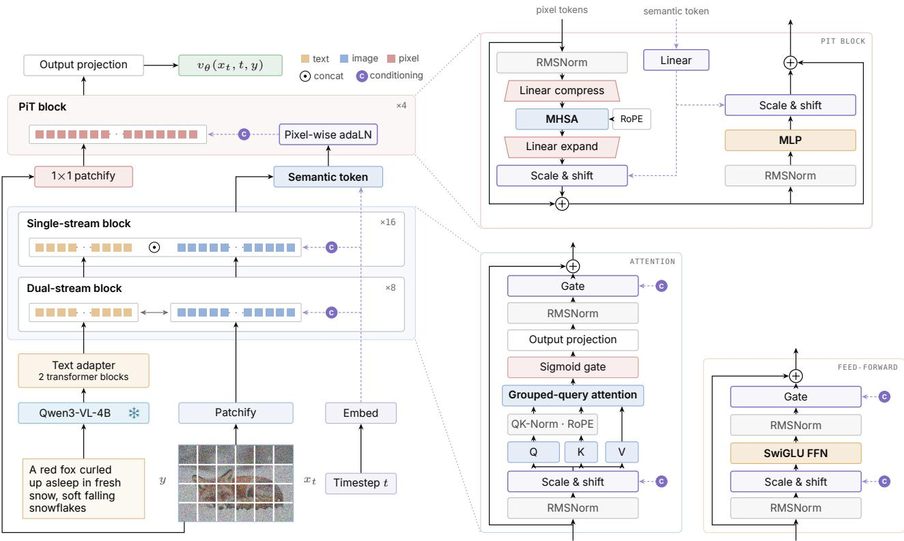  
FIG. 4 Iris-3B architecture. Left: the full model, with a hybrid dual/single-stream trunk over 16 16 pixel patches and a PiT pixel head. Top the PiT block of PixelDiT [2]. a trunk block. Details in Sec. 3.2.

## 3.3 Training

Data. We pretrain on a large collection of English image-text pairs that mixes real photographs, synthetic images from recent generators, and renderedtext images added to strengthen text rendering. Each stage uses its own set of aspect-ratio buckets. The $2 5 6 ^ { 2 }$ stage uses centered square crops. The 512 and 1024 stages assign every image to the nearest of 21 shared aspect-ratio buckets (1:4 to4:1, with nearly equal token counts); only images whose short edge reaches the stage resolution are admitted. Rare buckets within a source are merged so that every (source, bucket) cell holds at least one global batch. Because fewer images meet the resolution threshold, non-photographic content dominates the 1024 stage. For supervised fine-tuning SFT we use a curated set of high-quality synthetic and real images whose captions are filtered for quality and prompt alignment.

Objective. Given a clean image $x _ { 0 }$ , noise $\epsilon \sim \mathcal { N } ( 0 , I )$ and a caption c, we interpolate along the rectified-flow path

$$
x _ { \sigma } = \left( 1 - \sigma \right) x _ { 0 } + \sigma \epsilon\tag{1}
$$

and train the network to predict the velocity $v = \epsilon - x _ { 0 }    \colon$

$$
\mathcal { L } _ { \mathsf { f l o w } } = \mathbb { E } _ { x _ { 0 } , \epsilon , \sigma } \Bigl [ \bigl \| v _ { \theta } ( x _ { \sigma } , \sigma , c ) - ( \epsilon - x _ { 0 } ) \bigr \| _ { 2 } ^ { 2 } \Bigr ]\tag{2}
$$

The noise level is drawn from a shifted logit-normal distribution:

$$
\sigma = \frac { s u } { 1 + ( s - 1 ) u } \qquad u \sim \mathsf { l o g i t \mathrm { \mathsf { \mathrm { - } n o r m a l } } } ( 0 , 1 )\tag{3}
$$

with shift $s = 2 , 3 ,$ 4 at 256, 512 and 1024. The total loss adds REPA

$$
\mathcal { L } = \mathcal { L } _ { \sf f l o w } + \lambda \mathcal { L } _ { \sf R E P A }\tag{4}
$$

where $\mathcal { L } _ { \sf R E P A }$ is the negative cosine similarity between projected trunk tokens and DINOv2B/14 patch features, with $\lambda = 0 . 5$ in the 256 stage and $\lambda = 0$ afterwards.

Optimization and curriculum. We train with hybrid Muon [47, 48]: Muon (momentum 0.95, Nesterov, RMS-matched LR for the hidden weight matrices and AdamW $( \beta _ { 1 } { = } 0 . 9 , \ \beta _ { 2 } { = } 0 . 9 5 )$ for embeddings, norms and biases, with weight decay 0 and gradient clipping at 0.5. The LR is a constant $1 0 ^ { - 4 }$ after a 2K-step linear warmup. We keep an EMA of the weights with decay

0.9999 and drop the caption for 10% of samples to enable CFG. We train in three resolution stages Tab. 1). From the 512 stage onward, RoPE uses isotropic coordinates for non-square images. For the 1024 stage we halve the LR to $5 \times 1 0 ^ { - 5 }$ and reduce the global batch to 512.

SFT. We fine-tuned the final pretraining checkpoint on the curated set at 1024 resolution Tab. 1), with a constant LR of $4 \times 1 0 ^ { - 5 }$

TAB. 1 Training stages. Samples = steps global batch.
<table><tr><td>STAGE</td><td>STEPS</td><td>BATCH</td><td>SAMPLES</td></tr><tr><td>256</td><td>0-367K</td><td>1024</td><td>375.8M</td></tr><tr><td>512 multi-AR</td><td>367K-530K</td><td>1024</td><td>166.9M</td></tr><tr><td>1024 multi-AR</td><td>530K-625K</td><td>512</td><td>48.6M</td></tr><tr><td>SFT</td><td>625K-665K</td><td>512</td><td>20.5M</td></tr></table>

## 3.4 Evaluation

We scored Iris-3B EMA with the official, unmodified evaluators of GenEval [30], DPGBench [31], LongText-Bench [49] and OneIGBench [50]. Images were generated at 10242 with CFG 3, 100 sampling steps and 4 samples per prompt, from the official prompts without rewriting, and every sample was scored (no best-of-N). All scores are for the released checkpoint SFT step 665K, Tab. 1).

TAB. 2 Official benchmarks at 10242. References are copied from the respective papers; FLUX.1-dev from Qwen-Image [3] (GenEval, DPG), X-Omni [49] (LongText) and OnelG-Bench [50] OneIG, English overall). ∗Uses prompt rewriting.
<table><tr><td>MODEL</td><td>GENEVAL</td><td>DPG</td><td>LONGTEXT</td><td>ONEIG</td></tr><tr><td>FLUX.1-dev 12B [33]</td><td>0.66</td><td>83.8</td><td>0.607</td><td>0.434</td></tr><tr><td>i1 3B* [51]</td><td>0.84</td><td>86.7</td><td>0.922</td><td>一</td></tr><tr><td>Z-Image 6B* [39]</td><td>0.84</td><td>88.1</td><td>0.935</td><td>0.546</td></tr><tr><td>Qwen-Image 20B [3]</td><td>0.87</td><td>88.3</td><td>0.943</td><td>0.539</td></tr><tr><td>Iris-3B</td><td>0.798</td><td>86.52</td><td>0.857</td><td>0.540</td></tr></table>

Iris-3B is competitive with strong latent models on the official benchmarks Tab. 2). It clearly surpasses FLUX.1-dev, is level with i1 on DPG, and trails i1, ZImage and Qwen-Image on GenEval, although i1 and ZImage use prompt rewriting. On GenEval it is strongest on single objects, two objects and colors, and weakest on position and counting. English longtext rendering is its clearest gap, behind all three, while on OneIGEN its overall score matches Qwen-Image and is just below ZImage. Samples are shown in Fig. 1 and App. A.

## 04 · Latent-to-Pixel Conversion

Our second route to a pixel-space model converts a pretrained latent model, FLUX.2 Klein base 4B [1].

## 4.1 Setup

We follow the conversion recipe of Jiang et al. [8], which builds on L2P [7] but trains the full model. The VAE is removed and replaced by 16 16 pixel patches, which gives each token the same 16 16-pixel footprint as the parent’s latent tokenization. A new input projection maps pixel patches into the trunk, and a new pixel head decodes the trunk output. We ablate two heads, DiP [13] and a four-block PiT, and use the latter for the downstream evaluations to match Iris-3B. The model predicts clean images, trained with a logitnormal timestep distribution at 10242 on a 11 mix of real photographs and images generated by the stepdistilled FLUX.2 Klein 4B, a sibling of the parent rather than the parent itself.

## 4.2 Ridge initialization and trunk LR

Published conversions [7, 8] present the transfer as straightforward: replace the VAE, train briefly, and the converted model approaches its parent; Jiang et al. convert FLUX.2 Klein 9B this way at a global batch of 128. In our small-batch probes on FLUX.2 Klein base 4B it is not. Under the setup above, a 1K-step probe still generates prompt-independent patch-grid noise, and the unmodified recipe needs more than ten times as many steps to approach the loss that the recipe below reaches in 1K. We trace this to the input interface. The trunk was trained on embeddings of VAE latents, so a randomly initialized input projection feeds it inputs it has never seen, and for FLUX even the best per-patch linear map from pixels explains only 14% of the variance of these embeddings.

Two changes fix this Fig. 5). The first is a gainof the new input projection. We fit, by ridge regression, a linear map from each 16 16 RGB patch to the parent’s own embedding of the matching latent token, and choose the regularization so that the map passes noise with the same gain as the parent’s latent path, rather than to maximize held-out $R ^ { 2 }$ , which amplifies pixel noise. Like the Procrustes initialization of AsymFlow [6], this fits the new projection to the parent’s latent interface. The second change scales the trunk LR by the ratio of the parent’s weight RMS to that of ZImage [39], our reference latent parent, which for FLUX is 0.12 the head’s rate. FLUX’s trunk weights are much smaller, so the same Adam step moves them several times further relative to their size; the scaled rate equalizes this relative update. On its own, a ridge initialization fit for held-out $R ^ { 2 }$ more than halves the 1K-step loss, and so does the scaled LR alone, but neither alone produces coherent images. Together they turn patch noise into photorealistic, prompt-aligned images within 1K steps, and the gain-matched variant also removes a colour cast left by the R2-tuned fit. These probes used a global batch of 8 and 1K steps; we did not test whether the benefit survives at the global batch of 128 used by Jiang et al. [8].

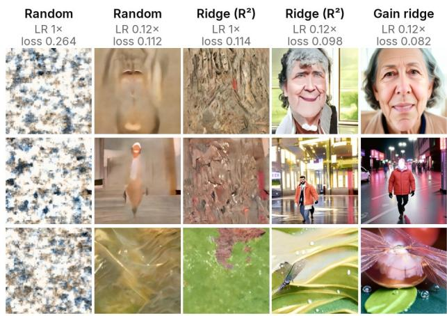  
FIG. 5 FLUX.2 Klein conversion probes after only 1K steps at $1 0 2 4 ^ { 2 }$ , one column per input initialization and trunk LR, with the median loss over steps 900–1000 PiT head, global batch 8; “Gain ridge” is the gain-matched ridge). These are early diagnostic samples used to compare initializations, not final results; see Fig. 6 for the converted model.

## 4.3 Production conversions

With this recipe we converted FLUX.2 Klein with both heads. Both produce photorealistic images and render short words correctly. For the production runs we use a global batch of 112, caption dropout 0.1 and a 1K step trunk warmup. We use the PiT-head conversion after 30K steps (PiT 30K) as the converted parent for the downstream tasks, matching the head of Iris-3B Fig. 6). We have not measured GenEval, DPG or FID for the converted models, so we cannot say how close they come to their latent parent.

## 05 · Downstream Tasks

Our hypothesis is that direct pixel generation should beat latent models on tasks where fine detail matters, since a latent backbone must decode every output through a lossy autoencoder. We test this by finetuning both pixel-space models and comparing them with latent counterparts.

## 5.1 Protocol

We fine-tune two pixel-space parents, Iris-3B and the converted FLUX.2 Klein PiT 30K, on monocular depth estimation and image restoration. We choose these two tasks because they are where a VAE should hurt most. Both are dense, pixel-aligned predictions: depth must place thin structures and object boundaries at the right pixel, and restoration must synthesize the high-frequency texture and fine detail that an 8 downsampling autoencoder compresses most aggressively. Both are established applications of latent generative priors [11, 12]. A clean test of the hypothesis needs a latent twin of each parent trained with the same downstream recipe, data and budget. Tab. 3 shows which comparisons we have. Two are matched, both on FLUX.2 Klein.

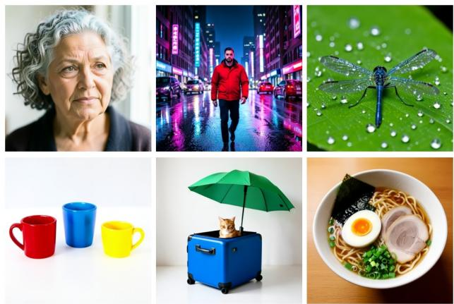  
FIG. 6 Samples from PiT 30K, the converted FLUX.2 Klein used downstream, at 10242 CFG 4, 100 steps), generated directly in pixel space.

TAB. 3 Downstream coverage. ✓: scored; n/a: no latent twin exists.
<table><tr><td colspan="3">DEPTH</td><td colspan="2">RESTORATION</td></tr><tr><td>PARENT</td><td>PIXEL</td><td>LATENT</td><td>PIXEL</td><td>LATENT</td></tr><tr><td>Iris-3B</td><td>√</td><td>n/a</td><td>√</td><td>n/a</td></tr><tr><td>FLUX.2 Klein</td><td>√</td><td>√</td><td>√</td><td>√</td></tr></table>

Iris-3B has no latent twin by construction. For depth we train it with the same recipe as the two FLUX.2 Klein arms, which puts all three on equal footing but does not isolate the representation space, since the parents differ in size, pretraining data and compute.

## 5.2 Monocular depth

We compare three parents: the latent FLUX.2 Klein base 4B, its pixel conversion PiT 30K and Iris-3B, labelled Klein latent, Klein pixel and Iris-3B in the tables. All three are fine-tuned with one recipe and one budget, so the only intended difference is the parent.

Recipe. Each model predicts depth $\hat { d }$ in a single deterministic forward pass from the RGB image with the empty prompt, at the final timestep and with a zero noise input. The target d is relative log depth, normalized per image by the 2nd and 98th percentiles of the valid ground truth. The pixel models read depth from their RGB output through a three-to-one convolution; the latent model first decodes its output latent with the frozen FLUX.2 VAE and reads depth from the decoded image through the same convolution. The loss is a masked L1 term plus a weighted L1 term on depth gradients, taken over the set M of valid pixels:

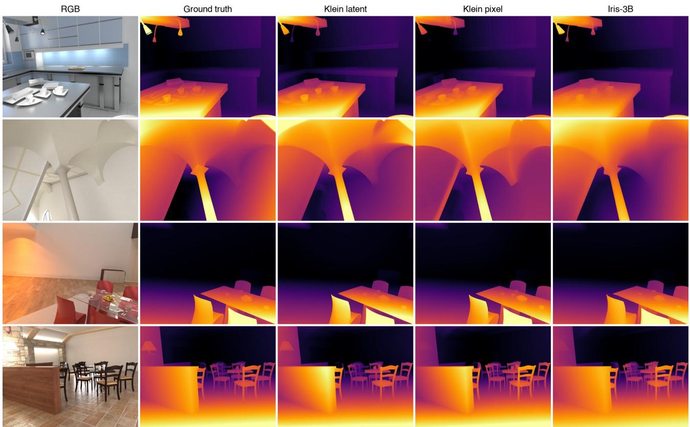  
F I G . 7 Depth on four Hypersim test frames from the three arms of Tab. 4, each trained with the same direct-regression recipe for 10K steps. Predictions are fitted to the ground truth with a scale and shift in log depth and shown as inverse depth on a shared per-row colour scale; black marks invalid ground truth.

$$
\mathcal { L } _ { \sf d e p t h } = \frac { 1 } { | M | } \sum _ { p \in M } \left( \left| \hat { d } _ { p } - d _ { p } \right| + 5 \left. \nabla \hat { d } _ { p } - \nabla d _ { p } \right. _ { 1 } \right)\tag{5}
$$

We fully fine-tune with AdamW $( \beta ~ = ~ ( 0 . 9 , 0 . 9 9 9 )$ weight decay 0.01 at a constant LR of $3 \times 1 0 ^ { - 5 }$ without warmup, gradient clipping at 1.0, global batch 32 and 10K steps, and evaluate the raw weights. We chose direct regression after it clearly beat a flow objective on the converted parent; the choice among L1-family losses made no meaningful difference.

Data. Training uses only synthetic data: Hypersim and Virtual KITTI 2 at 480 640 and 352 1216, mixed 91 per batch, with random horizontal flips. Pixels that are invalid or beyond the far plane 65 m and 80 m) are masked from the loss. All arms see the same images in nearly the same order; only the batch layout across devices, and with it the pooling of the L1 loss, differs.

Evaluation. We score the five standard zero-shot benchmarks, NYUv2, KITTI, ETH3D, ScanNet and DIODE, with the unmodified evaluation code of

Marigold V2 [11], which fits each prediction to the ground truth with a per-image scale and shift in log depth. We also report its soft edge error SEE on the Hypersim test split, the metric most sensitive to fine detail. All arms share the same inputs, preprocessing and scorer.

Neither pixel-space model clearly improves on the latent one Tab. 4). Iris-3B is level with the latent FLUX.2 Klein on the mean of both metrics: it is better on KITTI and DIODE and has the lowest edge error, and it is worse on NYUv2, ETH3D and ScanNet. The converted pixel model is behind the latent model on every benchmark except KITTI, where the two are level, and level with it on SEE. The predictions are also close qualitatively Fig. 7; benchmark examples in App. B, Fig. 9). We therefore find no significant improvement from using a pixel-space generator as the prior for depth. Each arm is a single run at a short budget, and the per-benchmark differences between Iris-3B and the latent model go both ways and cancel in the mean, so they should not be read as a win for either.

The converted model’s deficit is the one consistent gap. Its parent was adapted from the latent model with a short latent-to-pixel conversion, whereas the latent arm starts from the fully pretrained model, so its prior is likely weaker. Iris-3B, a pixel model pretrained from scratch, shows no such gap, which points to the conversion rather than to pixel space. We have not measured the converted model’s generation quality Sec. 4), so this remains a hypothesis.

T A B . 4 Depth after 10K steps of the same direct-regression recipe, zero-shot on five benchmarks. AbsRel  and $\delta _ { 1 } \cdot$ per benchmark, their mean over the five benchmarks, and SEE at kernel 3 on Hypersim .
<table><tr><td rowspan="2"></td><td colspan="2">NYUV2</td><td colspan="2">KITTI</td><td colspan="2">ETH3D</td><td colspan="2">SCANNET</td><td colspan="2">DIODE</td><td colspan="2">MEAN</td><td>HYPERSIM</td></tr><tr><td>PARENT</td><td>AbsRel.↓  $\delta _ { 1 } \uparrow$ </td><td>AbsRel.↓</td><td> $\delta _ { 1 } \uparrow$ </td><td>AbsRel↓</td><td> $\delta _ { 1 } \uparrow$ </td><td>AbsRel↓</td><td> $\delta _ { 1 } \uparrow$ </td><td>AbsRel↓</td><td> $\delta _ { 1 } \uparrow$ </td><td>AbsRel.↓</td><td> $\delta _ { 1 } \uparrow$ </td><td>SEE↓</td></tr><tr><td>Klein latent</td><td>.050</td><td>.967</td><td>.086</td><td>.921</td><td>.058</td><td>.971</td><td>.060</td><td>.954</td><td>.107</td><td>.924</td><td>.072</td><td>.947</td><td>.528</td></tr><tr><td>Klein pixel</td><td>.064</td><td>.953</td><td>.087</td><td>.919</td><td>.065</td><td>.960</td><td>.075</td><td>.931</td><td>.117</td><td>.906</td><td>.081</td><td>.934</td><td>.526</td></tr><tr><td>Iris-3B</td><td>.057</td><td>.961</td><td>.083</td><td>.927</td><td>.064</td><td>.965</td><td>.069</td><td>.939</td><td>.082</td><td>.935</td><td>.071</td><td>.946</td><td>.496</td></tr></table>

The raw depth maps of Iris-3B also show a faint patch grid. It is hard to see in Fig. 7, where predictions are aligned and colour-mapped, so we measure it directly: the mean curvature of the predicted depth on the pixels next to a 16 16 patch border, divided by its mean everywhere else. A model without a grid scores about one.

TAB. 5 Patch-grid ratio of the raw depth predictions of Tab. 4: mean absolute second difference of the prediction on pixels adjacent to 16 16 patch borders over its mean elsewhere, both image axes, 60 images per benchmark. 1 means no grid . NYUv2 and ScanNet are omitted because the latent model, which has no patch grid, already scores well below one there.
<table><tr><td>PARENT</td><td>HYPERSIM</td><td>KITTI</td><td>ETH3D</td><td>DIODE</td></tr><tr><td>Klein latent</td><td>0.97</td><td>0.99</td><td>0.99</td><td>0.98</td></tr><tr><td>Klein pixel</td><td>1.31</td><td>1.44</td><td>1.36</td><td>1.34</td></tr><tr><td>Iris-3B</td><td>2.14</td><td>1.61</td><td>2.21</td><td>2.25</td></tr></table>

The latent model has no grid, and both pixel-space models do, Iris-3B most strongly Tab. 5). The cause is the patchified design shared by most pixel-space generators. The input is cut into non-overlapping patches by a pixel-unshuffle, and each patch is decoded largely from its own trunk token, so neighbouring patches can disagree at their border. The latent model’s VAE decoder, by contrast, has overlapping receptive fields that smooth across tokens. PixelUMM [9] independently reports the same grid in its images and videos, strongest at high guidance and in smooth regions. It finds that convolutional output heads that mix neighbouring patches suppress the grid, with PixelShuffle heads giving the best trade-off against training loss. The artifacts are small next to the depth error itself, but they work against the fine spatial detail that motivated pixel space in the first place.

## 5.3 Restoration and super-resolution

Recipe. All restoration models follow the one-step recipe of HYPIR [12]: the degraded image is upsampled to the target size and a single forward pass

with the empty prompt returns the restored image $\hat { y } .$ Against the clean image $y ,$ the loss combines a pixel, a perceptual and an adversarial term:

$$
\mathcal { L } _ { \mathtt { S R } } = \left\| \hat { y } - y \right\| _ { 2 } ^ { 2 } + 5 \mathcal { L } _ { \mathtt { L P I P S } } ( \hat { y } , y ) + 0 . 5 \mathcal { L } _ { \mathtt { a d v } } ( \hat { y } )\tag{6}
$$

$\mathcal { L } _ { \sf L P I P S }$ uses VGG features, and the critic of $\mathcal { L } _ { \sf a d v }$ sits on a frozen OpenCLIP ConvNeXt-XXL trunk. We fully fine-tune with AdamW at an LR of $1 0 ^ { - 5 }$ for both generator and critic, on $1 0 2 4 ^ { 2 }$ crops with horizontal flips. Training pairs come from a curated set of high-quality photographs degraded on the fly with the secondorder Real-ESRGAN pipeline [25] at 4 , including its sharpening.

FLUX.2 Klein, pixel vs. latent. This is our second matched comparison. We fine-tuned the latent FLUX.2 Klein and its converted pixel counterpart PiT 30K with the same data, losses and schedule: global batch 8 and 500 warmup steps, 10K steps with a linear decay to zero over the last 2K, then continued to 30K with the LR reset and decayed again over the last 2K. We score the raw weights. We evaluate both on DIV2K [52] validation images with native 4 degradations, using fidelity metrics PSNR, SSIM, LPIPS and no-reference quality metrics NIQE, MUSIQ, DeQA.

The pixel model is not better. It is worse on most metrics in Tab. 6, most clearly SSIM and NIQE, and level on LPIPS. Each arm is a single run and we ran no significance test, so the small differences should be read as “no advantage” rather than as a reliable loss. The latent arm is itself a fine-tune rather than the untouched parent.

Iris-3B. We also adapted Iris-3B into a one-step restoration model with the same recipe, at a constant LR for 10K steps, with global batch 40 for the first 5K and 10 thereafter, and score an EMA of the weights (decay 0.999. On the same DIV2K pairs it is slightly below both FLUX.2 Klein models on fidelity and DeQA, between them on NIQE, and the best of all methods in Tab. 6 on MUSIQ. Its parent checkpoint, batch, schedule and budget differ from the FLUX.2 Klein arms, and its inference adds wavelet colour correction and tiling, so this comparison is not matched.

Iris-3B: 504×336 input, 2016×1344 output  
Input (bicubic)  
HYPIR-SD2  
Klein latent  
Klein pixel  
Iris-3B  
Ground truth  
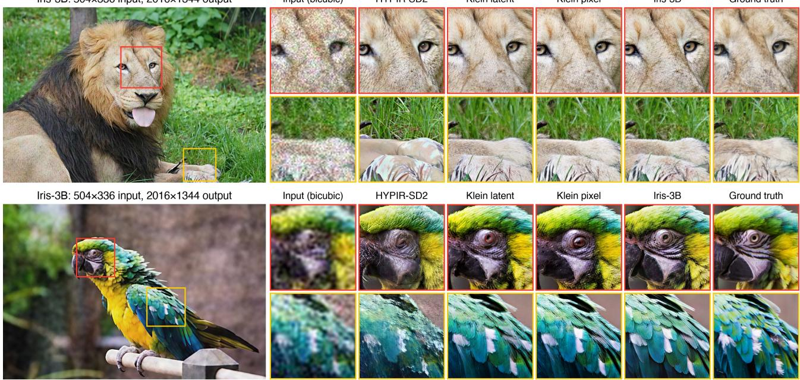  
FIG. 8 4 restoration of two DIV2K validation images with native Real-ESRGAN degradations (the Tab. 6 pairs). Left: the full Iris-3B output. Right: the marked regions for each method, cropped from full-resolution outputs. HYPIRSD2 is the public release. All methods use an empty prompt and one forward pass. We chose the images and regions after viewing the outputs.

TAB. 6 DIV2K 4 restoration on validation images with native 4 Real-ESRGAN degradations; every method receives the same saved input pairs and is scored with the same PyIQA metric settings and DeQAScore revision. PSNR and SSIM are computed on RGB. Public methods run at their released settings, except that all text conditioning (including tag and caption generators) is replaced by an empty prompt. Grouped as ours, GAN, multi-step diffusion, one-step diffusion.

<table><tr><td>MODEL</td><td>PSNR↑</td><td>SSIM↑ LPIPS↓</td><td>NIQE↓</td><td></td><td>MUSIQ↑ DEQA↑</td></tr><tr><td>Klein latent</td><td>20.99 0.557</td><td>0.275</td><td>3.26</td><td>67.11</td><td>4.06</td></tr><tr><td>Klein pixel</td><td>20.87 0.504</td><td>0.274</td><td>4.11</td><td>67.03</td><td>4.04</td></tr><tr><td>Iris-3B</td><td>20.68 0.481</td><td>0.292</td><td>3.94</td><td>68.01</td><td>3.87</td></tr><tr><td>R-ESRGAN [25]</td><td>21.76 0.579</td><td>0.386</td><td>3.79</td><td>60.37</td><td>3.85</td></tr><tr><td>StableSR [20]</td><td>21.91 0.557</td><td>0.407</td><td>4.10</td><td>53.91</td><td>3.59</td></tr><tr><td>DiffBIR v2 [21]</td><td>21.29 0.476</td><td>0.471</td><td>3.39</td><td>66.21</td><td>3.88</td></tr><tr><td>SeeSR [22]</td><td>22.25 0.580</td><td>0.373</td><td>4.71</td><td>59.46</td><td>3.78</td></tr><tr><td>SUPIR-v0Q [23]</td><td>21.53 0.501</td><td>0.386</td><td>3.91</td><td>59.64</td><td>3.79</td></tr><tr><td>InvSR [53]</td><td>20.18 0.534</td><td>0.426</td><td>4.43</td><td>60.94</td><td>3.57</td></tr><tr><td>OSEDiff [24]</td><td>21.40</td><td>0.542 0.352</td><td>3.49</td><td>67.75</td><td>3.91</td></tr><tr><td>S3Diff [54]</td><td>21.77</td><td>0.551 0.311</td><td>3.45</td><td>66.70</td><td>3.89</td></tr><tr><td>HYPIR-SD2 [12]</td><td>19.96</td><td>0.521 0.353</td><td>3.12</td><td>67.53</td><td>3.96</td></tr></table>

Overall, the pixel-space models we adapt are not better than latent models on the benchmark numbers, but they are competitive with open-source restoration methods. Our three models, HYPIR-SD2 and OSEDiff sit within a narrow band on the no-reference metrics MUSIQ and DeQA. SeeSR and RESRGAN lead on SSIM and are among the best on PSNR, but trail our models and HYPIRSD2 on LPIPS and MUSIQ. We show qualitative results on DIV2K in Fig. 8 and, in App. C, on further DIV2K images Figs. 10 and 11) and on real-world inputs Figs. 12 and 13).

## 06 · Conclusion

We pretrained Iris-3B, a 3B-parameter pixel-space text-to-image model, from scratch to 10242. It is competitive with strong latent models on the official benchmarks, showing that end-to-end pixel-space pretraining with a PiT head scales to 3B parameters without a VAE. We also converted FLUX.2 Klein to pixel space, which gives a pixel model and a latent twin from the same parent and makes a controlled comparison possible. Fine-tuned for image restoration, the converted model trails its latent twin slightly. Finetuned for monocular depth with one matched recipe, neither pixel model improves on the latent FLUX.2 Klein: Iris-3B is level with it, and the converted model trails it, possibly because the short conversion leaves it with a weaker prior. We find no significant improvement from a pixel-space generative prior. We release the weights and training code of Iris-3B as a strong starting point for further work on pixel-space generation.

Limitations. Our downstream comparisons are confounded. Iris-3B has no latent twin, so its depth comparison with the latent FLUX.2 Klein mixes the representation space with differences in size, pretraining data and compute. The two matched comparisons share one converted parent, whose generative prior is likely weaker than that of the latent model it was converted from, so they compare a briefly converted model with a fully pretrained one. Each depth and restoration arm is a single run at a short budget with no significance test, and the Iris-3B restoration arm is not matched to the FLUX.2 Klein arms. Iris-3B was trained with modest compute and data and is not state of the art in terms of raw generation quality. Finally, like most pixel-space methods, our models decode the pixels of each patch largely on their own, which leaves faint patch artifacts in dense predictions.

Future work. Three directions follow. First, improving Iris-3B itself, whose quality and speed can be raised with reinforcement learning and few-step distillation. Second, removing the patch grid. The PiT head of Iris-3B exchanges information between patches only through one compacted token per patch, so neighbouring pixels across a patch border are never processed together at pixel resolution, and the grid this leaves is most visible in dense predictions. An output head with overlapping receptive fields, such as the convolutional and PixelShuffle heads studied in PixelUMM [9], is the natural fix, and depth estimation is a direct test of whether it helps. Third, editing and reference-based generation without a VAE. Editing must reproduce the unchanged parts of a source image exactly, which is where a lossy latent should hurt most. PixelUMM conditions on clean reference images given as raw pixel patches, without a separate VAE stream, and Iris-3B already reads its prompt through a vision-language encoder. Adding editing data and reference images to its training would give a fully pixel-space editing model. Paired with a latent model pretrained on the same data with matched compute, it would remove the confounds of this study and test whether pixel space helps where its advantage should be largest.

## References

[01] Black Forest Labs. FLUX.2 [klein]: Towards Interactive Visual Intelligence. https://bfl.ai/blog/ flux2-klein-towards-interactive-visual-intelligence, 2026.

[02] Yongsheng Yu, Wei Xiong, Weili Nie, Yichen Sheng, Shiqiu Liu, and Jiebo Luo. PixelDiT Pixel Diffusion Transformers for Image Generation. arXiv:2511.20645, 2025.

[03] Chenfei Wu et al. Qwen-Image Technical Report. arXiv:2508.02324, 2025.

[04] Robin Rombach, Andreas Blattmann, Dominik Lorenz, Patrick Esser, and Björn Ommer. High-Resolution Image Synthesis with Latent Diffusion Models. In CVPR, 2022.

[05] Tianhong Li and Kaiming He. Back to Basics: Let Denoising Generative Models Denoise. arXiv:2511.13720, 2025.

[06] Hansheng Chen, Jan Ackermann, Minseo Kim, Gordon Wet-

zstein, and Leonidas Guibas. Asymmetric Flow Models. arXiv:2605.12964, 2026.

[07] Zhennan Chen, Junwei Zhu, Xu Chen, Jiangning Zhang, Jiawei Chen, Zhuoqi Zeng, Wei Zhang, Chengjie Wang, Jian Yang, and Ying Tai. L2P Unlocking Latent Potential for Pixel Generation. arXiv:2605.12013, 2026.

[08] Dengyang Jiang, Ruoyi Du, Zhennan Chen, Dongyang Liu, Zanyi Wang, Mingzhe Zheng, Xiangpeng Yang, Huanqia Cai, Aiming Hao, Yuming Jiang, Peng Gao, Harry Yang, and Steven Hoi. An Empirical Study of Training Pixel-Space Text-to-Image Diffusion Models. arXiv:2608.16887, 2026.

[09] Cong Wei, Xuanchi Ren, Bryan Chu, Weiming Ren, Huan Ling, Jiahui Huang, Laura Leal-Taixé, Sanja Fidler, Wenhu Chen, Zian Wang, and Jay Zhangjie Wu. PixelUMM Encoder-Free Unified Image and Video Understanding and Generation. arXiv:2609.38597, 2026.

[10] Bingxin Ke, Anton Obukhov, Shengyu Huang, Nando Metzger, Rodrigo Caye Daudt, and Konrad Schindler. Repurposing Diffusion-Based Image Generators for Monocular Depth Estimation. In CVPR, 2024.

[11] Igor Pavlovic, Thiemo Wandel, Anton Obukhov, Luca Bartolomei, Andrey Davydov, Fabio Tosi, Matteo Poggi, Sabine Süsstrunk, and Dengxin Dai. Marigold V2 Revisiting Diffusion Transformers for Monocular Depth Estimation. arXiv:2609.08084, 2026.

[12] Xinqi Lin et al. Harnessing Diffusion-Yielded Score Priors for Image Restoration. arXiv:2507.20590, 2025.

[13] Zhennan Chen et al. DiP Taming Diffusion Models in Pixel Space. arXiv:2511.18822, 2025.

[14] Shuai Wang et al. PixNerd: Pixel Neural Field Diffusion. arXiv:2507.23268, 2025.

[15] Zehong Ma, Ruihan Xu, and Shiliang Zhang. Pixel-Gen: Improving Pixel Diffusion with Perceptual Supervision. arXiv:2602.02493, 2026.

[16] Gonzalo Martin Garcia et al. Fine-Tuning Image-Conditional Diffusion Models is Easier than You Think. In WACV, 2025.

[17] Haofei Xu, Rundi Wu, Philipp Henzler, Nikolai Kalischek, Michael Oechsle, Fabian Manhardt, Marc Pollefeys, Andreas Geiger, Federico Tombari, and Michael Niemeyer. Point-DiT Pixel-Space Diffusion for Monocular Geometry Estimation. arXiv:2607.02515, 2026.

[18] Oriane Siméoni et al. DINOv3. arXiv:2508.10104, 2025.

[19] Valentin Gabeur et al. Image Generators are Generalist Vision Learners. arXiv:2604.20329, 2026.

[20] Jianyi Wang, Zongsheng Yue, Shangchen Zhou, Kelvin C. K. Chan, and Chen Change Loy. Exploiting Diffusion Prior for Real-World Image Super-Resolution. IJCV, 2024.

[21] Xinqi Lin et al. DiffBIR Towards Blind Image Restoration with Generative Diffusion Prior. In ECCV, 2024.

[22] Rongyuan Wu, Tao Yang, Lingchen Sun, Zhengqiang Zhang, Shuai Li, and Lei Zhang. SeeSR Towards Semantics-Aware Real-World Image Super-Resolution. In CVPR, 2024.

[23] Fanghua Yu, Jinjin Gu, Zheyuan Li, Jinfan Hu, Xiangtao Kong, Xintao Wang, Jingwen He, Yu Qiao, and Chao Dong. Scaling Up to Excellence: Practicing Model Scaling for Photo-Realistic Image Restoration In the Wild. In CVPR, 2024.

[24] Rongyuan Wu, Lingchen Sun, Zhiyuan Ma, and Lei Zhang. One-Step Effective Diffusion Network for Real-World Image Super-Resolution. In NeurIPS, 2024.

[25] Xintao Wang, Liangbin Xie, Chao Dong, and Ying Shan. Real-ESRGAN Training Real-World Blind Super-Resolution with

Pure Synthetic Data. In ICCV Workshops, 2021.

[26] Sihyun Yu et al. Representation Alignment for Generation: Training Diffusion Transformers Is Easier Than You Think. In ICLR, 2025.

[27] Maxime Oquab et al. DINOv2 Learning Robust Visual Features without Supervision. TMLR, 2024.

[28] Jaskirat Singh et al. What Matters for Representation Alignment: Global Information or Spatial Structure? arXiv:2512.10794, 2025.

[29] Hila Chefer, Patrick Esser, Dominik Lorenz, Dustin Podell, Vikash Raja, Vinh Tong, Antonio Torralba, and Robin Rombach. Self-Supervised Flow Matching for Scalable Multi-Modal Synthesis. In ICML, 2026.

[30] Dhruba Ghosh, Hannaneh Hajishirzi, and Ludwig Schmidt. GenEval: An Object-Focused Framework for Evaluating Textto-Image Alignment. In NeurIPS Datasets and Benchmarks, 2023.

[31] Xiwei Hu et al. ELLA Equip Diffusion Models with LLM for Enhanced Semantic Alignment. arXiv:2403.05135, 2024.

[32] Yaron Lipman, Ricky T. Q. Chen, Heli Ben-Hamu, Maximilian Nickel, and Matt Le. Flow Matching for Generative Modeling. In ICLR, 2023.

[33] Black Forest Labs. FLUX.1. https://github.com/ black-forest-labs/flux, 2024.

[34] Patrick Esser et al. Scaling Rectified Flow Transformers for High-Resolution Image Synthesis. In ICML, 2024.

[35] Joshua Ainslie, James Lee-Thorp, Michiel de Jong, Yury Zemlyanskiy, Federico Lebrón, and Sumit Sanghai. GQA Training Generalized Multi-Query Transformer Models from Multi-Head Checkpoints. In EMNLP, 2023.

[36] Zihan Qiu et al. Gated Attention for Large Language Models: Non-linearity, Sparsity, and Attention-Sink-Free. In NeurIPS, 2025.

[37] Ming Ding et al. CogView: Mastering Text-to-Image Generation via Transformers. In NeurIPS, 2021.

[38] Biao Zhang and Rico Sennrich. Root Mean Square Layer Normalization. In NeurIPS, 2019.

[39] ZImage Team. ZImage: An Efficient Image Generation Foundation Model with Single-Stream Diffusion Transformer. arXiv:2511.22699, 2025.

[40] Krea. Krea 2 Technical Report. https://www.krea.ai/blog/ krea-2-technical-report, 2026.

[41] William Peebles and Saining Xie. Scalable Diffusion Models with Transformers. In ICCV, 2023.

[42] Junsong Chen et al. PixArt-α: Fast Training of Diffusion Transformer for Photorealistic Text-to-Image Synthesis. In ICLR, 2024.

[43] Shuai Bai et al. Qwen3VL Technical Report. arXiv:2511.21631, 2025.

[44] Kevin Li, Manuel Brack, Sudeep Katakol, Hareesh Ravi, and Ajinkya Kale. UniFusion: Vision-Language Model as Unified Encoder in Image Generation. arXiv:2510.12789, 2025.

[45] Jianlin Su, Yu Lu, Shengfeng Pan, Ahmed Murtadha, Bo Wen, and Yunfeng Liu. RoFormer: Enhanced Transformer with Rotary Position Embedding. Neurocomputing, 2024.

[46] Byeongho Heo, Song Park, Dongyoon Han, and Sangdoo Yun. Rotary Position Embedding for Vision Transformer. In ECCV, 2024.

[47] Keller Jordan et al. Muon: An Optimizer for Hidden Layers in Neural Networks. https://kellerjordan.github.io/posts/ muon/, 2024.

[48] Jingyuan Liu et al. Muon is Scalable for LLM Training. arXiv:2502.16982, 2025.

[49] Zigang Geng et al. XOmni: Reinforcement Learning Makes Discrete Autoregressive Image Generative Models Great Again. arXiv:2507.22058, 2025.

[50] Jingjing Chang et al. OneIGBench: Omni-dimensional Nuanced Evaluation for Image Generation. arXiv:2506.07977, 2025.

[51] Boya Zeng et al. i1 A Simple and Fully Open Recipe for Strong Text-to-Image Models. arXiv:2606.11289, 2026.

[52] Eirikur Agustsson and Radu Timofte. NTIRE 2017 Challenge on Single Image Super-Resolution: Dataset and Study. In CVPR Workshops, 2017.

[53] Zongsheng Yue, Kang Liao, and Chen Change Loy. Arbitrarysteps Image Super-resolution via Diffusion Inversion. In CVPR, 2025.

[54] Aiping Zhang, Zongsheng Yue, Renjing Pei, Wenqi Ren, and Xiaochun Cao. Degradation-Guided One-Step Image Super-Resolution with Diffusion Priors. arXiv:2409.17058, 2024.

[55] Yuang Ai et al. DreamClear: High-Capacity Real-World Image Restoration with Privacy-Safe Dataset Curation. In NeurIPS, 2024.

## A · Text-to-Image Samples

Samples from the final Iris-3B checkpoint EMA weights after SFT, generated directly in pixel space at native aspect ratios of about one megapixel with CFG 3 and 100 sampling steps. Each image uses one fixed seed, was picked from a single rendering of a broad prompt set, and is shown with its full prompt, without prompt rewriting.

  
A family of elephants walking across the African savanna at sunset, silhouettes against a huge orange sun, dust in the air

  
A giant whale swimming through the clouds above a small village at sunset, surreal fantasy art, soft warm colors

  
A floating market of airships above a cloud city at sunrise, steampunk fantasy

  
Volcanic eruption at night in Iceland, rivers of glowing lava flowing across black fields, plumes of steam lit orange, long exposure

  
The aurora borealis swirling green and violet over a snowy Lofoten fishing village with red wooden cabins, reflections in a calm fjord, night photograph

  
A vintage red convertible driving along a coastal highway at golden hour, sun flare, 1970s film photograph aesthetic, Kodak Portra colors

  
The Sydney Opera House at blue hour reflecting in the harbor, city lights

  
A Hokusai inspired painting of a red Mount Fuji under a sky of small white clouds

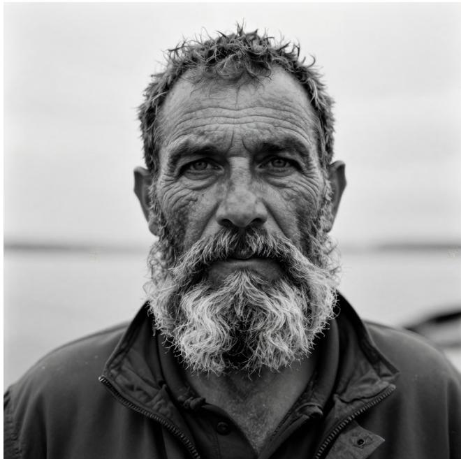  
Black and white portrait of a fisherman with a thick grey beard and deep wrinkles, piercing eyes, overcast light, fine grain film photograph

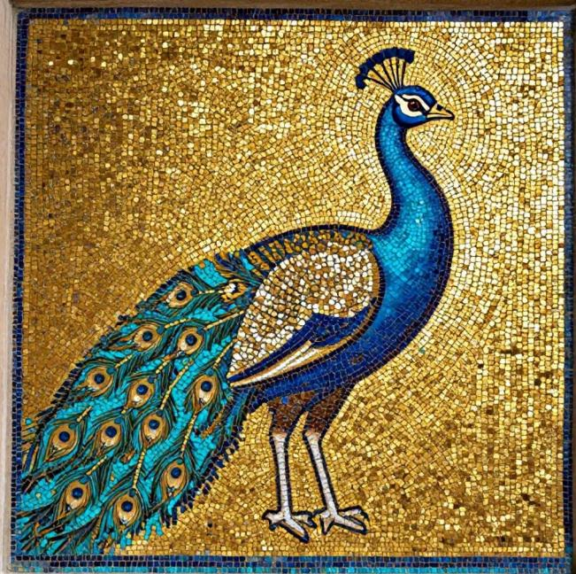  
A Byzantine-style mosaic of a peacock made of tiny gold and turquoise tiles, shimmering texture

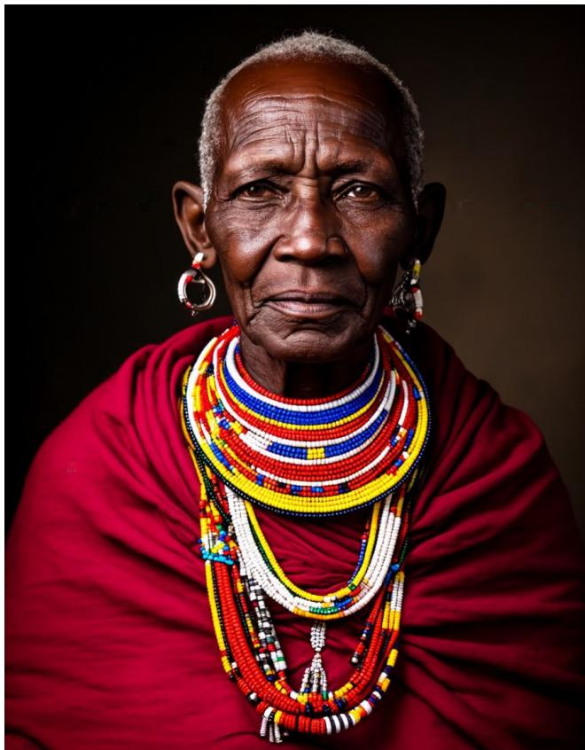  
Studio portrait of a Maasai elder wearing vibrant beaded jewelry, deep red cloth, dark backdrop, Rembrandt lighting, ultra detailed skin texture

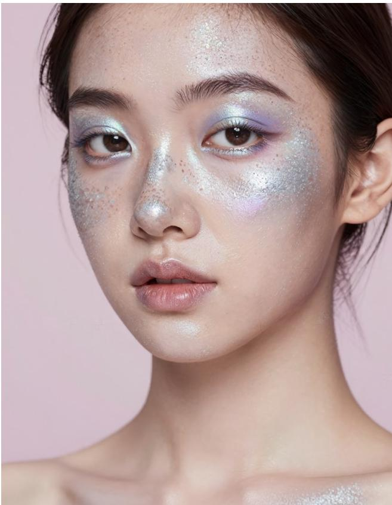  
Close-up portrait of a young woman with silver glitter freckles and iridescent makeup, soft pastel background, high fashion beauty photography

  
A Frida Kahlo inspired self portrait with monkeys, tropical leaves and flowers in the hair

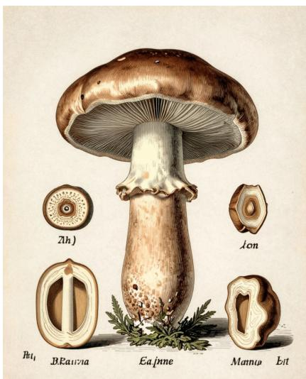  
A botanical scientific illustration of a mushroom with labeled cross-sections, vintage engraving style

  
A glass sculpture of a heart filled with flowers, caustics and reflections, 3D render

  
Thousands of sky lanterns rising into the night sky at Yi Peng festival in Chiang Ma

  
The ancient city of Petra with the Treasury carved into pink sandstone, morning light

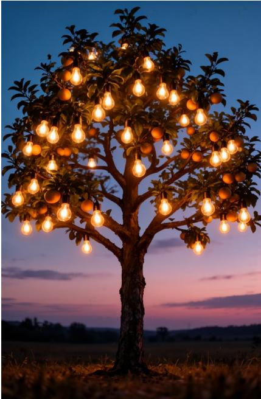  
A tree with lightbulbs instead of fruits glowing at dusk, surreal concept art

  
A linocut print of a stag in a forest, bold black carved lines on cream paper, folk art style

  
An intricate embroidery of wildflowers and bees on linen fabric, colorful silk threads, close-up textile photograph

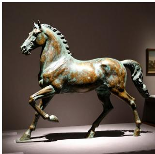  
A bronze sculpture of a horse in motion, patina, dramatic museum spotlight

  
A Moroccan riad courtyard with intricate zellige tiles, a fountain, orange trees and arched doorways, warm sunlight and long shadows

## B · Additional Depth Results

Predictions of the three arms of Tab. 4 on two evenly spaced images from each of NYUv2, KITTI, ETH3D, ScanNe and DIODE (top to bottom), not selected by quality. Each panel shows the raw relative-log-depth prediction as inverse depth (near is bright), scaled to its own 2nd–98th percentile; no ground-truth alignment is applied.

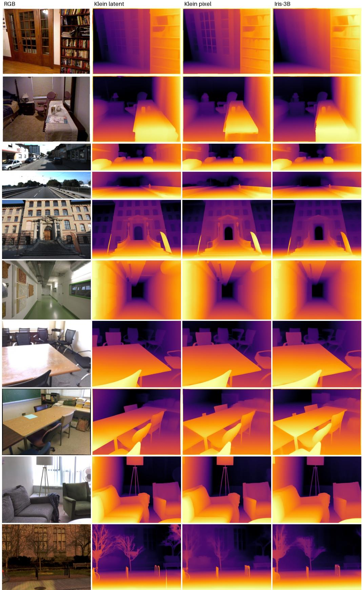  
FIG. 9 Depth on the five zero-shot benchmarks after 10K steps of the same direct-regression recipe.

## C · Additional Restoration Results

All panels use the same models and settings as Fig. 8: one forward pass and an empty prompt, except that the Iris-3B panels of Fig. 12 come from an earlier checkpoint of the same run 5K steps). We chose the images and regions after viewing the outputs.

Iris-3B: 504×384 input, 2016×1536 output  
Input (bicubic)  
HYPIR-SD2  
Klein latent  
Klein pixel  
Iris-3B  
Ground truth  
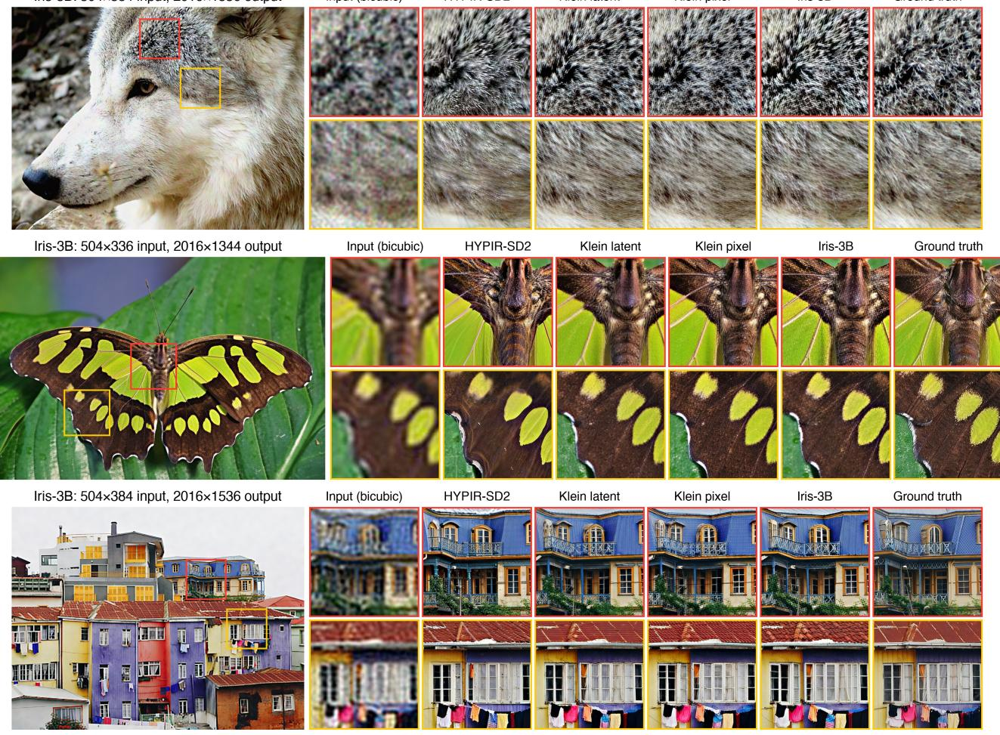

F I G . 1 0 4 restoration of further DIV2K validation images with native Real-ESRGAN degradations (the Tab. 6 pairs).  
Iris-3B: 504×336 input, 2016×1344 output  
Input (bicubic)  
HYPIR-SD2  
Klein latent  
Klein pixel  
Iris-3B  
Ground truth  
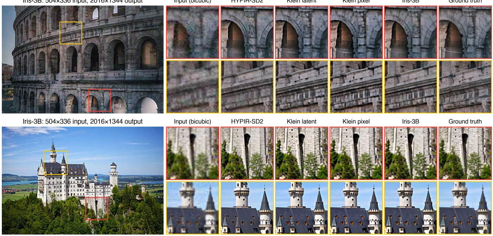  
FIG. 11 4 restoration of further DIV2K validation images (continued).

Iris-3B: 256×256 input, 1024×1024 output  
Input (bicubic)  
HYPIR-SD2  
Klein latent  
Klein pixel  
Iris-3B  
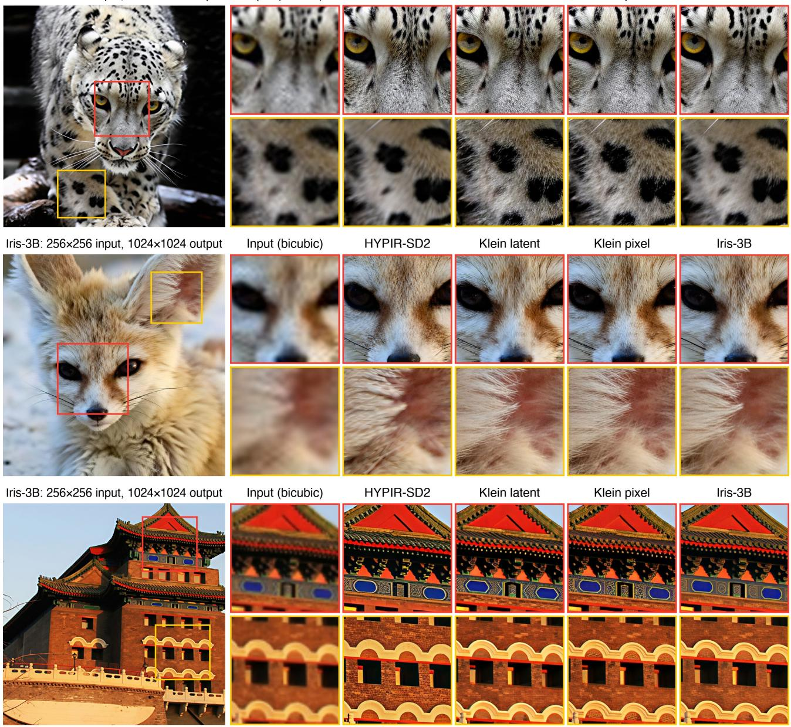  
F I G . 1 2 4 restoration of real-world low-quality images from RealLQ250 [55] (no ground truth).

Iris-3B  
Iris-3B: 256×256 input, 1024×1024 output  
Input (bicubic)  
HYPIR-SD2  
Klein latent  
Klein pixel  
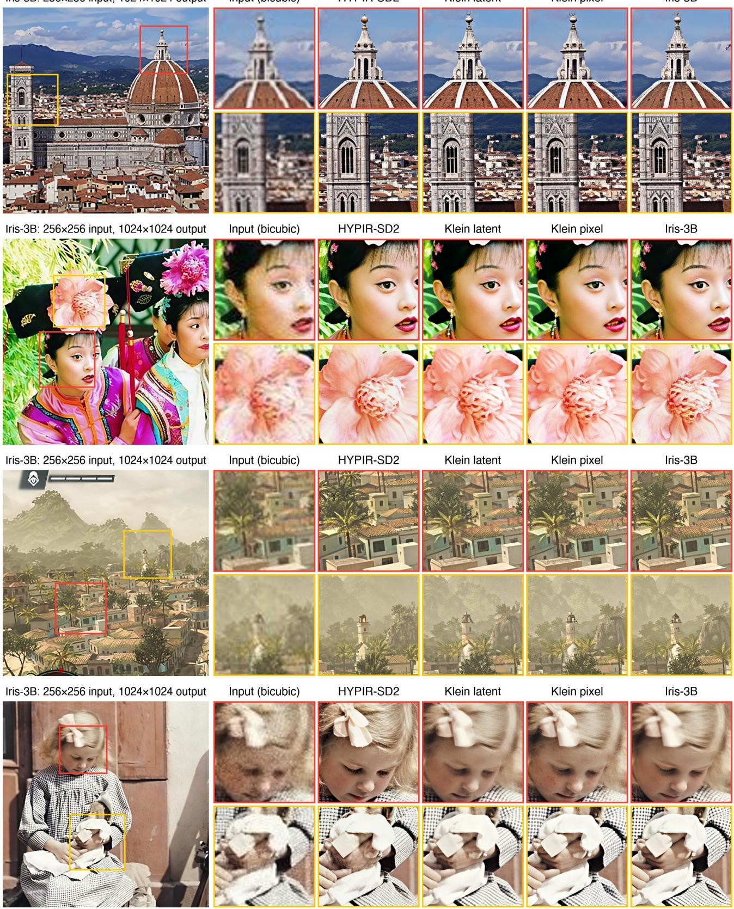  
F I G . 1 3 4× restoration of four real-world example inputs from the public HYPIR repository [12] (no ground truth).