# Juno : TAMING PREDICTIVE LATENTS FOR VISION-LANGUAGE-ACTION MODELS

Yuchen Zhu1,2 Chenyi Xu2,3 Yulin Zhang4 Gang Xu2 Wentao Zhu2

1University of Science and Technology of China 2Eastern Institute of Technology, Ningbo 3Hangzhou Dianzi University 4ShanghaiTech University

Project page · https://juno-policy.github.io/

## ABSTRACT

Joint-embedding predictive architectures (JEPAs) predict masked or future observations in representation space, offering a natural source of predictive latents for vision–language–action (VLA) models. Yet making these latents useful across pretraining, policy learning, and deployment requires addressing three failures: mismatch with embodiment-specific control, interference with action learning, and teacher miscalibration under distribution shifts. We introduce Juno, a unified framework built around one action-conditioned JEPA that serves as a controlaligned representation backbone, a predictive teacher, and an adaptable dynamics model. During pretraining, we train it on embodiment-matched trajectories and use a dynamic CLS loss to transfer motion-weighted patch dynamics to a compact global state. During policy learning, we fuse current-frame JEPA patches into VLA perception and use a decoupled reasoning branch with separate transformation parameters to distill future latent states for action generation. During deployment, we adapt the world model on all observed transitions, including failed rollouts, freeze the adapted teacher, and re-align the policy on verified executions using LoRA adapters and a trainable action head, without expert corrections or task rewards. On SimplerEnv, Juno raises average success from 60.9% to 68.5% over Qwen3GR00T, the strongest baseline, and test-time adaptation further reaches 72.7%; on a real robot, it retains 70%–75% success under background, height, and object shifts where the base policy collapses to 0%.

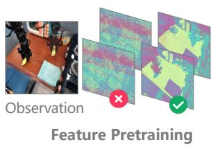

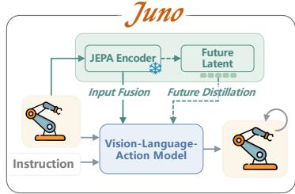

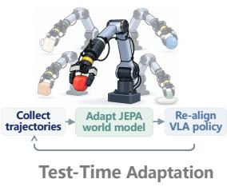

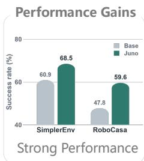

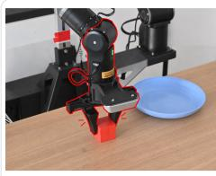

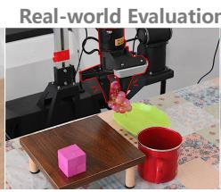  
Scene variation (OOD)

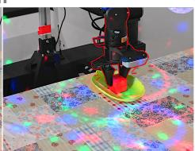  
Lighting variation (OOD)

Figure 1: We present Juno, a unified framework that makes predictive latents useful across the vision-language-action (VLA) lifecycle. Juno integrates control-aligned JEPA pretraining, visual feature fusion and decoupled future-latent distillation, and dynamics-first test-time adaptation that updates the world model before re-aligning the policy. It improves performance on SimplerEnv and RoboCasa and supports robust real-world manipulation under distribution shifts.

## 1 INTRODUCTION

Joint-embedding predictive architectures (JEPAs) predict masked or future observations in representation space rather than in pixels (LeCun et al., 2022; Baevski et al., 2022; Assran et al., 2023; Bardes et al., 2024). This principle has progressed from image and video level self-supervision to action-conditioned prediction for embodied agents (Assran et al., 2025; Maes et al., 2026). A growing number of vision–language–action (VLA) systems further show that such predictive latents benefit policy learning, whether through latent world models (Sun et al., 2026; Wang et al., 2026a), future-representation alignment (Zheng et al., 2025b; Zhao et al., 2026; Xu et al., 2026; Xia et al., 2026), foresight tokens (Ma et al., 2026; Qian et al., 2025b), or latent subgoals (Chen et al., 2026; Huang et al., 2026). The question is therefore no longer whether prediction helps, but how to make it useful across the VLA lifecycle.

Making a predictive latent useful meets three obstacles, one per stage. At pretraining, representations learned from broad internet video are visually strong but poorly matched to embodiment-specific controllable motion (Assran et al., 2025). At policy learning, predictive objectives are typically grafted onto the shared vision–language pathway (Zheng et al., 2025b; Sun et al., 2026; Xu et al., 2026), where prediction gradients interfere with control and future-aligned states need not be actiondecodable. At deployment, adaptation methods assume a reliable frozen teacher (Zhang et al., 2026b; Park et al., 2026; Yuan et al., 2026), yet severe shifts miscalibrate the teacher itself, and the failed rollouts dominating deployment data cannot serve as policy targets. We show that a single action-conditioned JEPA addresses all three, serving as a control-aligned representation backbone, a predictive teacher, and an adaptable dynamics model. Juno realizes these roles through Control-Aligned Pretraining, Decoupled Predictive Reasoning, and Dynamics-First Test-Time Adaptation.

For representation learning, we choose a lightweight action-conditioned JEPA (Maes et al., 2026) and train it from pixels on the same embodiment-matched trajectories used for policy learning. This choice is motivated by the qualitative evidence in Fig. 2: its patch features respond locally to robot–object interaction, while features from a large internet-video teacher spread across the scene. Its compact global token, however, dilutes exactly these local changes, so we introduce a dynamic CLS loss that transfers motion-weighted patch dynamics onto the global token, applied in a second stage with a frozen patch supervisor.

For policy learning, we fuse current-frame JEPA patch features into the VLA’s visual tokens (Miao et al., 2026; Li et al., 2023) and append learnable reasoning queries processed by a decoupled branch with separate transformation parameters under shared causal attention (Liang et al., 2025; Luo et al., 2026; Qian et al., 2025a). The branch is distilled against the frozen teacher’s future latent states, one reasoning query per future step, and its hidden states condition the flow-matching action decoder. Future observations provide targets only during training; at deployment the branch acts on the current observation and instruction. Since the branch receives both alignment and action gradients, the aligned state is trained to be decodable into actions rather than merely predictive.

For deployment, even a control-aligned teacher miscalibrates under severe shifts, and updating a policy against a miscalibrated teacher confounds world-model error with policy error. Our key observation is an asymmetry: failed actions are poor policy targets, but their consequences remain valid dynamics supervision. Juno-TTT therefore adapts the world model on all observed transitions, freezes the adapted teacher, and re-aligns the policy on verified executions with LoRA adapters and a trainable action head, without expert corrections or task rewards.

Our contributions follow the three stages:

• Control-Aligned Pretraining. We propose a dynamic CLS loss that aligns the global state token with motion-weighted patch dynamics, and show that matching the predictive teacher to the embodiment and control distribution can matter more than pretraining scale alone.

• Decoupled Predictive Reasoning. We integrate JEPA features into a VLA through patch-level fusion and a decoupled reasoning branch distilled from future latent states, so that predictive computation supports action generation without restructuring the VLA backbone.

• Dynamics-First Test-Time Adaptation. We propose a failure-aware adaptation procedure that exploits all deployment transitions, successful or not, for world-model adaptation, followed by conservative policy re-alignment on verified data with the adapted teacher held fixed.

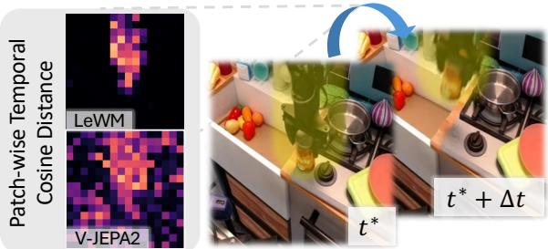  
(a) Temporal Frame Pair

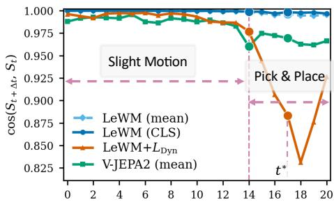  
(b) Temporal State Similarity  
Figure 2: (a) Patch-wise temporal cosine distance between frames $t ^ { \star }$ and $t ^ { \star } { + } \Delta t$ for LeWM and V-JEPA2. (b) Temporal state similarity $\cos ( c _ { t } , c _ { t + \Delta t } )$ over the episode, spanning slight motion (t ≤ 14) and pick-and-place (t > 14). LeWM (CLS) stays nearly constant, whereas $\mathrm { L e W M + } L _ { \mathrm { d y n } }$ becomes sensitive during pick-and-place; mean-pooled baselines are shown for reference.

## 2 RELATED WORK

Latent Predictive World Models. Generative world models often expend capacity on task-irrelevant visual details (Hafner et al., 2025; Hansen et al., 2024; Zhang et al., 2020), whereas Joint-Embedding Predictive Architectures (JEPAs) predict future representations directly, without pixel reconstruction (LeCun et al., 2022; Baevski et al., 2022; Assran et al., 2023; Bardes et al., 2024; Balestriero & LeCun, 2025). This principle now extends to action-conditioned prediction and embodied planning (Assran et al., 2025; Mur-Labadia et al., 2026; Zhou et al., 2024; Terver et al., 2025; Zhang et al., 2026c; Maes et al., 2026; Sun et al., 2026; Xu et al., 2026), and to latent-action abstractions from unlabeled videos (Bruce et al., 2024; Ye et al., 2025; Bu et al., 2025; Tharwat et al., 2025). Yet none of these works determines which predictive state best matches a particular robot controller.

World Action Models. VLA policies increasingly incorporate world-model signals for temporal reasoning (Zheng et al., 2025b; Sun et al., 2026; Chen et al., 2026; Wu et al., 2024; Cen et al., 2025): representation-centric methods align policy states with future-observation embeddings from visual teachers (Miao et al., 2026; Zhao et al., 2026; Xu et al., 2026; Xia et al., 2026), while others expose predicted dynamics to action generation through foresight tokens, latent subgoals, or aligned visual–action tokens (Ma et al., 2026; Huang et al., 2026; Su et al., 2026; Hu et al., 2024; Wang et al., 2026a; Luo et al., 2026). Across these granularities, however, future alignment alone does not show that the aligned policy state can be decoded into the corresponding action.

Test-Time Training in Robotics. Test-time training (TTT) adapts models to deployment inputs via self-supervised inner-loop optimization, without revisiting the training set (Sun et al., 2020; Wang et al., 2020; 2022; Hansen et al., 2020; Liu et al., 2021). In robotics, test-time updates either adapt latent prompts, adapters, or policy components via state-grounding, future-consistency, predictionerror, or progress signals (Zhang et al., 2026b; Park et al., 2026; Yuan et al., 2026; Bai et al., 2025; Ji et al., 2026), or serve as adaptive memory over interaction histories and unlabeled videos (Sun et al., 2024; Zhang et al., 2026a; Jiang et al., 2026; Feng et al., 2026; Wang et al., 2026b). These methods, however, all assume a reliable frozen teacher: under a severe shift, the world model that provides the adaptation target may itself be miscalibrated.

## 3 METHOD

## 3.1 PRELIMINARIES

Vision-Language-Action Policy. We consider a robot trajectory $\tau = \{ ( o _ { t } , a _ { t } , o _ { t + 1 } ) \} _ { t = 1 } ^ { T }$ , where $o _ { t }$ is the current visual observation and $a _ { t }$ is the executed action (or an action chunk). We write D for the corresponding transition distribution. A VLA policy maps an observation and a language instruction ℓ (together with proprioceptive state when available) to an action distribution $\pi _ { \psi } ( a _ { t } \mid o _ { t } , \ell )$ parameterized by ψ.

JEPA World Model. A joint-embedding predictive architecture (JEPA) encodes an observation into a latent state and predicts the latent state of a future observation rather than reconstructing pixels (LeCun et al., 2022; Assran et al., 2023). Following LeWM (Maes et al., 2026), we use an action-conditioned JEPA world model with an encoder $f _ { \theta }$ and a latent predictor $g _ { \phi } \mathrm { . }$

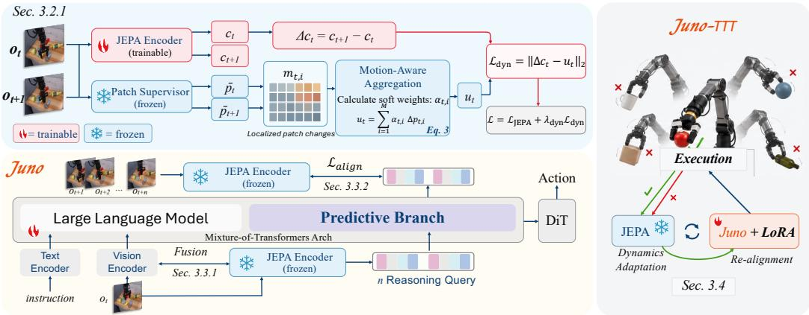  
Figure 3: Overview of Juno. Top left: Dynamic CLS pretraining aligns CLS transitions with motion-weighted patch changes from a frozen JEPA supervisor. Bottom left: JEPA features enrich visual tokens, while a decoupled predictive branch distills future latent states to jointly guide action generation. Right: Test-time adaptation updates the world model using both successful and failed executions, then re-aligns the policy on verified successful executions. Flame and snowflake icons indicate trainable and frozen modules, respectively.

$$
[ c _ { t } , P _ { t } ] = f _ { \theta } ( o _ { t } ) , \qquad \hat { c } _ { t + 1 } = g _ { \phi } ( c _ { t } , a _ { t } ) , \qquad \mathcal { L } _ { \mathrm { J E P A } } = \mathcal { L } _ { \mathrm { p r e d } } ( \hat { c } _ { t + 1 } , c _ { t + 1 } ) + \lambda _ { \mathrm { r e g } } \mathcal { R } ( c ) ,\tag{1}
$$

where $\boldsymbol { c } _ { t } \in \mathbb { R } ^ { D }$ denotes the CLS token, $P _ { t } = [ p _ { t , 1 } , \dots , p _ { t , M } ] \in \mathbb { R } ^ { M \times D }$ denotes the patch-token grid, and R is the latent regularizer. The predicted $\hat { c } _ { t + 1 }$ is obtained from $\left( { { c _ { t } } , { a _ { t } } } \right)$ , while $c _ { t + 1 }$ is encoded from the observed next frame. Thus, $c _ { t }$ summarizes the current observation for latent-state prediction, and $P _ { t }$ retains the spatial evidence used by our Dynamic CLS objective.

## 3.2 CONTROL-ALIGNED PRETRAINING

We adopt LeWM as our representation backbone, a lightweight end-to-end action-conditioned world model trained directly from pixels with roughly 15M parameters in its ViT-Tiny configuration (Maes et al., 2026). The world model is trained from pixels on the same embodiment-matched trajectory data used for policy learning (Sec. 4.1), so that its representation is aligned with the downstream control distribution. As shown in Fig. 2(a), its patch features respond more locally to robot–object interactions than V-JEPA 2 (Assran et al., 2025). At the same time, its action-conditioned training objective naturally supports test-time adaptation (Sec. 3.4).

However, to maximize planning efficiency, LeWM uses only the CLS token $c _ { t }$ as the state for prediction and planning (LeCun et al., 2022), while discarding the patch grid $P _ { t }$ . This creates a clear bottleneck: in Fig. 2(b), the CLS token changes little during pick-and-place even though the patch tokens respond to the local interaction. Since the CLS token summarizes the whole scene, a sparse object or contact change can be diluted by static background and appearance. We therefore use the patch-level change to supervise the CLS token, so that the state used by the VLA remains compact while retaining control-relevant motion.

## 3.2.1 DYNAMIC CLS LOSS

As shown in Fig. 2, the patch grid $P _ { t }$ captures localized changes more clearly than the CLS token $c _ { t }$ We therefore introduce an auxiliary loss that transfers patch-level changes to the CLS representation, trained in two stages. We first train LeWM with the standard objective $\mathcal { L } _ { \mathrm { J E P A } }$ (Eq. 1), whose patch tokens already respond reliably to local interaction. We then freeze this encoder as a patch supervisor ${ \bar { f } } ,$ writing $[ \bar { c } _ { t } , \bar { P } _ { t } ] = \bar { f } ( o _ { t } )$ , and continue training the world model under the auxiliary loss below. The frozen supervisor keeps the patch target stable while the trainable encoder $f _ { \theta }$ is being reshaped, serving as a stop-gradient reference that cannot drift.

For each transition sampled from D, we define the change of the i-th frozen patch token as

$$
\Delta { { \bar { p } } _ { t , i } } = { { \bar { p } } _ { t + 1 , i } } - { { \bar { p } } _ { t , i } } , \qquad { { m } _ { t , i } } = \frac { { { \| \Delta { { \bar { p } } _ { t , i } } \| } _ { 2 } } } { { \sqrt D } } .\tag{2}
$$

Then we do a Motion-Aware Aggregation by converting the relative patch-change magnitudes into soft weights $\alpha _ { t , i } ( \mathrm { F i g . }$ 3 Top left):

$$
\widetilde { m } _ { t , i } = \frac { m _ { t , i } } { \operatorname* { m a x } \Bigl ( M ^ { - 1 } \sum _ { j = 1 } ^ { M } m _ { t , j } , \epsilon \Bigr ) } , \qquad \alpha _ { t , i } = \frac { \exp ( \widetilde { m } _ { t , i } / \tau ) } { \sum _ { j = 1 } ^ { M } \exp ( \widetilde { m } _ { t , j } / \tau ) } ,\tag{3}
$$

where $\tau$ denotes the temperature, ϵ is a small constant that prevents division by zero, and M is the number of patches. We define the motion-weighted patch target as $\begin{array} { r } { u _ { t } = \sum _ { i = 1 } ^ { M } \alpha _ { t , i } \Delta \bar { p } _ { t , i } } \end{array}$ and, for the trainable encoder, the corresponding CLS transition as $\Delta c _ { t } = c _ { t + 1 } - c _ { t }$ . We then optimize the loss function as shown in Fig. 3:

$$
\begin{array} { r } { \mathcal { L } _ { \mathrm { d y n } } ( \theta ) = \mathbb { E } _ { ( o _ { t } , a _ { t } , o _ { t + 1 } ) \sim \mathcal { D } } \left[ \| \Delta c _ { t } - u _ { t } \| _ { 2 } ^ { 2 } \right] . } \end{array}\tag{4}
$$

The action $a _ { t }$ is not directly used in this auxiliary target; it remains part of the action-conditioned JEPA objective in Eq. 1. The second-stage objective is

$$
\mathcal { L } _ { \mathrm { L e W M + D y n } } = \mathcal { L } _ { \mathrm { J E P A } } + \lambda _ { \mathrm { d y n } } \mathcal { L } _ { \mathrm { d y n } } .\tag{5}
$$

This preserves LeWM’s single-CLS interface while making $c _ { t }$ more responsive to localized changes captured by $P _ { t }$

## 3.3 DECOUPLED PREDICTIVE REASONING

## 3.3.1 PATCH-LEVEL FUSION

As shown in Fig.3 bottom left, after pretraining, we freeze the JEPA encoder $f _ { \theta }$ and denote it by $E _ { J }$ Its current-frame patch features are projected to the VLA hidden width by a trainable two-layer MLP and fused into the native visual tokens through cross-attention with a gated residual connection (fixed gain γ), which preserves the spatial information in $P _ { t }$ while leaving the original VLA token sequence unchanged.

## 3.3.2 FUTURE LATENT-STATE DISTILLATION AND ACTION GENERATION

We instantiate the predictive branch with the Mixture-of-Transformers (MoT) decoder block (Liang et al., 2025; Luo et al., 2026), the vision language and predictive reasoning branches keep separate non-embedding parameters while sharing one causal attention graph. The vision–language branch thus preserves the representation used for action generation, while the reasoning branch is dedicated to predicting future JEPA states.

We append K learnable reasoning queries to the vision–language sequence. Let $H _ { R , t } ^ { L }$ denote the final reasoning states, and let the trainable projector $g _ { r }$ produce the predicted future states $\widehat { Z } _ { t } = g _ { r } ( H _ { R , t } ^ { L } )$ . During training, the frozen JEPA encoder provides detached CLS targets from the K future observations: $Z _ { t } ^ { + } = E _ { J } ^ { \mathrm { c l s } } ( o _ { t + \Delta : t + K \Delta } )$ . Since the number of future targets matches the number of reasoning queries, we align them one-to-one:

$$
\mathcal { L } _ { \mathrm { a l i g n } } = \frac { 1 } { B K } \sum _ { b = 1 } ^ { B } \sum _ { k = 1 } ^ { K } \left[ 1 - \cos ( \widehat { z } _ { b , k } , z _ { b , k } ^ { + } ) + \lambda _ { \mathrm { s l l } } \mathrm { S m o o t h L } 1 _ { \delta } ( \widehat { z } _ { b , k } , z _ { b , k } ^ { + } ) \right] ,\tag{6}
$$

The full hidden sequence, including the vision–language and reasoning states, conditions the flowmatching action decoder. Thus, the reasoning branch receives both future-state alignment and action-generation gradients; this joint pathway is what makes the aligned state decodable into actions rather than merely predictive of future observations. The joint objective is

$$
\mathcal { L } _ { \mathrm { V L A } } = \mathcal { L } _ { \mathrm { F M } } + \alpha \mathcal { L } _ { \mathrm { a l i g n } } ,\tag{7}
$$

At inference time, the future-state target path is removed, and the predictive branch operates only on the current observation and language instruction.

## 3.4 DYNAMICS-FIRST TEST-TIME ADAPTATION

The control-aligned pretraining and decoupled predictive reasoning above already yield strong frozenteacher policies in simulation and on real robots (Sec. 4.2, Sec. 4.3), and remain robust to moderate shifts in background, layout, and object instance. Under more severe shifts, however—strong observation noise or abrupt illumination change—the frozen JEPA teacher itself becomes unreliable, and the policy coupled to it collapses. We therefore add a dynamics-first test-time adaptation stage, motivated by a single observation:

A failed action cannot teach the robot what to do, but faithfully witnesses how the world responds.

A failed rollout still faithfully records how the executed actions change the environment, and these transitions can be exploited without expert correction or task reward. Our method therefore proceeds in two stages(Fig. 3 right): (i) adapt the world model to the observed test-time environment using all interaction trajectories as action-conditioned dynamics supervision; (ii) re-align the policy with the adapted representation on verified executions only.

Test-time data curation. We partition the collected deployment buffer into two disjoint subsets: transitions from verified successful executions, $\mathcal { D } _ { \mathrm { o k } }$ , and transitions from failed executions, $\mathcal { D } _ { \mathrm { f a i l } } .$ after a lightweight cleaning procedure that removes invalid segments (details in the appendix D). We write ${ \mathcal { D } } _ { \mathrm { t t t } } = { \mathcal { D } } _ { \mathrm { o k } } \cup { \mathcal { D } } _ { \mathrm { f a i l } }$ for the full buffer.

Stage 1: Dynamics adaptation. The world model is adapted on the full buffer $\mathcal { D } _ { \mathrm { t t t } }$ with the same action-conditioned objective used in pretraining (Eq. 1), performing a full-parameter update of both $f _ { \theta }$ and $g _ { \phi }$ initialized from their pretrained weights:

$$
\theta ^ { \star } , \phi ^ { \star } = \arg \operatorname* { m i n } _ { \theta , \phi } \ \mathbb { E } _ { ( o _ { t } , a _ { t } , o _ { t + 1 } ) \sim \mathcal { D } _ { \operatorname { t t t } } } \left[ \mathcal { L } _ { \mathrm { p r e d } } \big ( g _ { \phi } ( c _ { t } , a _ { t } ) , c _ { t + 1 } \big ) + \lambda _ { \mathrm { r e g } } \mathcal { R } ( c ) \right] ,\tag{8}
$$

where $[ c _ { t } , P _ { t } ] = f _ { \theta } ( o _ { t } )$ as defined in Sec. 3.1. Crucially, this objective supervises only the consequences of the executed actions, so failed trajectories provide the same learning signal as successful ones at this stage.

Stage 2: Policy re-alignment. The adapted encoder is then frozen, $E _ { J } ^ { \mathrm { t t t } } { \triangleq } f _ { \theta ^ { \star } }$ , and produces the future-state targets $\widetilde { Z } _ { t } ^ { + } = E _ { J } ^ { \mathrm { t t t , c l s } } ( o _ { t + \Delta : t + K \Delta } )$ in place of the original teacher in Eq. 6. The policy is re-aligned on verified executions only, using the same composite objective as in training (Eq. 7):

$$
\mathcal { L } _ { \mathrm { t t t } } ( \psi ) = \mathbb { E } _ { \mathcal { D } _ { \mathrm { o k } } } \Big [ \mathcal { L } _ { \mathrm { F M } } ( \psi ) + \lambda _ { \mathrm { t t t } } \mathcal { L } _ { \mathrm { a l i g n } } ( \psi ; \widetilde { Z } ^ { + } ) \Big ] .\tag{9}
$$

For stability under scarce test-time data, the policy is updated through LoRA adapters inserted into all policy weights while the pre-trained backbone remains frozen; the action head is fully trainable without LoRA, and all test-time updates use a reduced learning rate. We refer to this two-stage procedure as Juno-TTT. Note the asymmetry between the stages: dynamics adaptation consumes every transition, whereas policy re-alignment trusts only verified executions—failed actions never become supervision targets. Freezing $E _ { J } ^ { \mathrm { { \breve { t t t } } } }$ keeps the alignment target fixed throughout policy adaptation.

## 4 EXPERIMENTS

We evaluate Juno along three axes: manipulation performance in simulation, transfer of the observed benefits to real-robot manipulation, and adaptation to deployment shifts through test-time training. We first evaluate the policy without test-time updates to assess the combined effect of JEPA-enhanced perception and predictive specialization. Adaptation results are distinguished from this frozen-policy evaluation because they use additional deployment interactions and optimization.

## 4.1 EXPERIMENTAL SETUP

Benchmarks. We evaluate SimplerEnv(Li et al., 2024b) with the WidowX embodiment and RoboCasa-GR1 Tabletop Tasks with the GR1 embodiment. For the real-world evaluation, we use the right arm of a bimanual AgileX Cobot Magic platform under nominal and shifted conditions,

as illustrated in Fig. 4. Detailed task descriptions and shift specifications are provided later and in the supplementary material.

## Real-robot benchmark

All real-robot conditions, including in-domain evaluation, test spatial position generalization: tasks are executed at positions excluded from the demonstrations. “In-domain” retains the nominal appearance and object configuration under a held-out arrangement, while OOD conditions also vary visual or physical factors.

Models and training. We use Qwen3GR00T (Ye et al., 2026) as the base VLA and primary baseline. The training data are selected according to the evaluated benchmark rather than shared across benchmarks. For SimplerEnv, we train on the BridgeData V2 and Fractal datasets. For RoboCasa-GR1, we train one multitask model jointly on the benchmark’s own GR1 Tabletop Tasks data. For the real-robot experiments, we initialize from a policy pretrained for SimplerEnv and then adapt it with a small set of simple demonstrations collected on the this platform.

Evaluation protocol. For each benchmark, we report task success rates and their unweighted mean across tasks. RoboCasa-GR1 is evaluated for 50 episodes per task. SimplerEnv results are averaged over 4 evaluation runs, and we report the mean success rate of each task. For the real-robot experiments, we run 20 trials per condition and report the success rate.

## 4.2 SIMULATION BENCHMARK RESULTS

Table 1: Success rates (%) of VLA models evaluated with the WidowX robot in the SimplerEnv simulation benchmark. The best result in each column is shown in bold, and the second-best distinct result is underlined. Tied results receive the same formatting. Parenthetical arrows on the last two rows are the change from Qwen3GR00T.

<table><tr><td>Method</td><td>Average</td><td>Put Spoon on Towel</td><td>Put Carrot on Plate</td><td>Stack Green Block on Yellow Block</td><td>Put Eggplant in Yellow Basket</td></tr><tr><td>OpenVLA-OFT (Kim et al., 2024)</td><td>41.8</td><td>34.2</td><td>30.0</td><td>30.0</td><td>72.5</td></tr><tr><td>RoboVLM (Li et al., 2026)</td><td>42.7</td><td>50.0</td><td>37.5</td><td>0.0</td><td>83.3</td></tr><tr><td>Magma (Yang et al., 2025)</td><td>44.8</td><td>37.5</td><td>29.2</td><td>20.8</td><td>91.7</td></tr><tr><td>CogACT (Li et al., 2024a)</td><td>51.3</td><td>71.7</td><td>50.8</td><td>15.0</td><td>67.5</td></tr><tr><td>SpatialVLA (Qu et al., 2025)</td><td>34.4</td><td>20.8</td><td>20.8</td><td>25.0</td><td>70.8</td></tr><tr><td>TraceVLA (Zheng et al., 2025a)</td><td>27.7</td><td>12.5</td><td>16.6</td><td>16.6</td><td>65.0</td></tr><tr><td>VideoVLA (Shen et al., 2026)</td><td>53.1</td><td>75.0</td><td>20.8</td><td>45.8</td><td>70.8</td></tr><tr><td>VLA-JEPA (Sun et al., 2026)</td><td>57.3</td><td>75.0</td><td>70.8</td><td>12.5</td><td>70.8</td></tr><tr><td>π0 (Black et al., 2024)</td><td>53.1</td><td>29.2</td><td>62.5</td><td>29.2</td><td>91.6</td></tr><tr><td>π0.5 (Intelligence et al., 2025)</td><td>57.1</td><td>49.3</td><td>64.7</td><td>44.7</td><td>69.7</td></tr><tr><td>Isaac-GR00T-N1.6-Bridge (NVIDIA et al., 2025)</td><td>57.1</td><td>64.5</td><td>65.5</td><td>5.5</td><td>93.0</td></tr><tr><td>Qwen3GR00T (Baseline) (Ye et al., 2026)</td><td>60.9</td><td>72.9</td><td>60.4</td><td>14.6</td><td>95.8</td></tr><tr><td>Juno (Ours)</td><td>68.5(↑7.6)</td><td>86.5(↑13.6)</td><td>59.4(↓1.0)</td><td>31.3 (↑16.7)</td><td>96.9(↑1.1)</td></tr><tr><td>+ Juno-TTT (Ours)</td><td>72.7 (↑11.8)</td><td>94.8 (↑21.9)</td><td>62.5 (↑2.1)</td><td>37.5(↑22.9)</td><td>95.8</td></tr></table>

SimplerEnv. Table 1 shows that Juno achieves 68.5% average success, the highest among methods evaluated without TTT: +7.6 over Qwen3GR00T (60.9%) and +11.2 over the strongest prior method (VLA-JEPA, 57.3%), also surpassing the π0/π0.5 and GR00T-N1.6 families (53.1%–57.1%). The gains are broad rather than isolated: spoon placement exceeds every prior method by at least 11.5 points (86.5%), block stacking more than doubles the base VLA (14.6% to 31.3%), and eggplant reaches a column-best 96.9%, while carrot stays essentially flat (60.4% to 59.4%); three of four tasks improve with no meaningful regression on the fourth.

RoboCasa-GR1. Table 2 evaluates a single model across all 24 tasks. Juno achieves 59.6% average success, improving on Qwen3GR00T (47.8%) by 11.8 points and on the strongest listed baseline, Qwen3OFT (48.8%), by 10.8 points. It outperforms Qwen3GR00T on 21 of 24 tasks and achieves the highest score on 16, with gains up to 46.0% → 80.0% (bottle placement with cabinet closing) and regressions limited to two tasks (at most −6 points). Per-task results are reported in Appendix C.2.

Table 2: RoboCasa-GR1 Tabletop Tasks. The 24 tasks are partitioned into five evaluation groups. Each entry is the unweighted mean success rate (%) within the corresponding group (Overall averages over all 24 tasks). Best result in each column is shown in bold.
<table><tr><td>Method</td><td>PnP + Close</td><td>PnP From Cuttingboard</td><td>PnP From Placemat</td><td>PnP From Plate</td><td>PnP From Tray</td><td>Avg.</td></tr><tr><td>GR00T-N1.6</td><td>24.2</td><td>56.9</td><td>51.9</td><td>57.6</td><td>55.1</td><td>47.6</td></tr><tr><td>Qwen3PI</td><td>42.3</td><td>46.0</td><td>43.5</td><td>44.0</td><td>44.0</td><td>43.9</td></tr><tr><td>Qwen3OFT</td><td>43.7</td><td>50.4</td><td>41.5</td><td>61.0</td><td>49.2</td><td>48.8</td></tr><tr><td>Qwen3FAST</td><td>35.0</td><td>50.4</td><td>33.5</td><td>45.0</td><td>32.0</td><td>39.0</td></tr><tr><td>Qwen3GR00T</td><td>50.3</td><td>52.8</td><td>38.0</td><td>58.5</td><td>39.2</td><td>47.8</td></tr><tr><td>Juno (Ours)</td><td>57.3</td><td>64.8</td><td>55.5</td><td>68.0</td><td>53.6</td><td>59.6</td></tr></table>

Table 3: Frozen-policy real-world evaluation on the right arm of ALOHA. Success rate (%) over 20 trials.  
Table 4: Test-time training on ALOHA. Success rate (%) over 20 trials under Gaussian observation noise and dynamic lighting.
<table><tr><td rowspan="2">Method</td><td rowspan="2">In-Domain</td><td colspan="3">Out-of-Domain</td></tr><tr><td>Background</td><td>+ Height</td><td>+ H + Object</td></tr><tr><td>Qwen3GR00T</td><td>40.0(8/20)</td><td>0.0 (0/20)</td><td>0.0 (0/20)</td><td>0.0 (0/20)</td></tr><tr><td>Juno</td><td>100.0 (20/20)</td><td>75.0 (15/20)</td><td>70.0 (14/20)</td><td>70.0 (14/20)</td></tr></table>

<table><tr><td>Method</td><td>Gaussian Noise</td><td>Dynamic Lighting</td></tr><tr><td>Juno (frozen)</td><td>40.0 (8/20)</td><td>55.0 (11/20)</td></tr><tr><td>+ Juno-TTT</td><td>65.0 (13/20)</td><td>70.0 (14/20)</td></tr></table>

4.3 REAL-WORLD ROBOT EVALUATION  
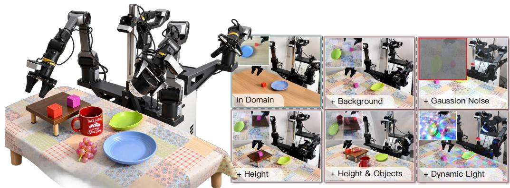  
(a) Experimental settings  
(b) Test Tasks  
(c) TTT Tasks  
Figure 4: Real-robot setup and evaluation conditions. (a) AgileX Cobot Magic, an ALOHA-style platform; only the right PiPER arm is used. (b) Nominal and shifted conditions involving background, manipulation height, and objects for evaluating the frozen policy. (c) Gaussian observation noise and dynamic lighting conditions for test-time training, evaluated separately from the frozen-policy results.

Platform and Data Collection. We evaluate physical transfer on an AgileX Cobot Magic ALOHAstyle leader–follower system with 6-DoF PiPER follower arms and parallel grippers, using only the right arm. Actions are 7-dimensional end-effector deltas comprising translation, rotation, and a binary gripper command. After pretraining on the base policy’s public data, we collect 60 adaptation demonstrations for “Put the red cube into the blue bowl.”, with 20 demonstrations at each of three fixed cube positions. (More details in appendix C.3)

Evaluation Conditions. From the nominal setting, we evaluate three cumulative shifts (Fig. 4(b)): background changes the tablecloth, cube color, and bowl shape/color; height additionally raises the work plane by 10 cm; and object replaces the cube with a grape and updates the instruction. We compare Juno with Qwen3GR00T over 20 trials per condition, with all models frozen to measure generalization without deployment adaptation.

In-domain manipulation performance. In the in-domain condition, Juno succeeds in all 20 trials (100%), whereas the baseline succeeds in 8 of 20 (40%), a gap of 60 percentage points (Table 3). The policy therefore solves the task reliably after adaptation from only 60 demonstrations.

Generalization under deployment shifts. The advantage widens under distribution shift. Juno retains 75% success (15/20) with an out-of-distribution background and 70% (14/20) under both the added height change and the combined height-plus-object change, so performance degrades gracefully and remains stable as the shifts accumulate. The baseline collapses to 0 of 20 trials in all three shifted conditions, despite reaching 40% in domain. Since both policies remain frozen here, these gains are attributable to the learned representations alone; test-time adaptation brings further improvements under more severe shifts (Sec. 4.4).

## 4.4 TEST-TIME ADAPTATION RESULTS

We next evaluate Juno-TTT (Sec. 3.4) under an offline protocol: the policy first collects a fixed set of rollouts in the deployment environment, the two-stage adaptation runs offline, and the adapted policy is then evaluated frozen. Collection sizes and optimization budgets are given in Appendix D.

Simulation. On SimplerEnv, we apply Juno-TTT in the nominal evaluation condition, which isolates the benefit of deployment data in the absence of distribution shift. Adaptation raises average success from 68.5% to 72.7% (Table 1), improving three of the four tasks: spoon placement from 86.5% to 94.8%, block stacking from 31.3% to 37.5%, and carrot placement from 59.4% to 62.5%, while eggplant placement stays essentially unchanged (96.9% to 95.8%). Thus, even without any shift, the policy’s own rollouts provide useful dynamics supervision for further improvement.

Real robot. The benefit grows under severe deployment shifts on the PiPER arm (Table 4), where we collect 40 rollouts separately in each condition and adapt the model to that condition. Under Gaussian observation noise, the frozen policy retains only 40% success, and Juno-TTT recovers it to 65%; under dynamic lighting, Juno-TTT raises success from 55% to 70%.

## 4.5 ABLATION STUDY

Component ablation. Table 5 reports a leave-oneout ablation on SimplerEnv under the same evaluation protocol as the main results. Fusion and the MoT branch form a coupled pair. Removing fusion alone causes the largest drop (53.9%), even below the base VLA, yet removing it together with the MoT branch recovers to 60.4%: without the fused patch pathway, the predictive branch imposes future-state objectives on ungrounded representations and turns harmful. Conversely, removing the MoT branch alone costs only 3.1 points (65.4%), so its value is realized through fusion. The alignment loss is what makes this pair useful: without $\mathcal { L } _ { \mathrm { a l i g n } } ,$ the model gains nothing over the base VLA (60.8% vs. 60.9%), i.e., the predictive branch helps only when its predictions are directly supervised. The dynamic CLS loss contributes a smaller but consistent gain (−2.9).

Table 5: Component ablation on SimplerEnv (average success, %). Each row removes one component; dark red arrows give the drop from the full model. Evaluation follows the main SimplerEnv protocol.
<table><tr><td>Fusion MoT</td><td></td><td> $\mathcal { L } _ { \mathrm { a l i g n } }$ </td><td> $\mathcal { L } _ { \mathrm { d y n } }$ </td><td>Avg.</td></tr><tr><td rowspan="4">√ √</td><td>√</td><td>√</td><td>√</td><td>53.9(↓14.6)</td></tr><tr><td></td><td>√</td><td>√</td><td>65.4(↓3.1)</td></tr><tr><td>√</td><td></td><td>√</td><td>60.8 (↓7.7)</td></tr><tr><td></td><td>√</td><td>√</td><td>60.4 (↓8.1)</td></tr><tr><td>√</td><td>√</td><td>√</td><td></td><td>65.6 (↓2.9)</td></tr><tr><td>√</td><td>√</td><td>√</td><td>√</td><td>68.5</td></tr></table>

## 5 CONCLUSION

We present Juno, a unified framework that integrates predictive world models into VLA pretraining, policy learning, and test-time adaptation. By combining control-aligned representations, decoupled predictive reasoning, and dynamics-first adaptation, Juno links future-state prediction with action generation and improves robustness through deployment experience. Experiments in SimplerEnv, RoboCasa-GR1, and real-world manipulation show higher success and resilience to distribution shifts. Future work will scale up training and evaluation across larger datasets, broader tasks, and multiple embodiments, further taming predictive latents for general-purpose VLA control.

## REFERENCES

Mahmoud Assran, Quentin Duval, Ishan Misra, Piotr Bojanowski, Pascal Vincent, Michael Rabbat, Yann LeCun, and Nicolas Ballas. Self-supervised learning from images with a joint-embedding predictive architecture. In 2023 IEEE/CVF Conference on Computer Vision and Pattern Recognition (CVPR), pp. 15619–15629. IEEE, 2023.

Mido Assran, Adrien Bardes, David Fan, Quentin Garrido, Russell Howes, Matthew Muckley, Ammar Rizvi, Claire Roberts, Koustuv Sinha, Artem Zholus, et al. V-jepa 2: Self-supervised video models enable understanding, prediction and planning. arXiv preprint arXiv:2506.09985, 2025.

Alexei Baevski, Wei-Ning Hsu, Qiantong Xu, Arun Babu, Jiatao Gu, and Michael Auli. Data2vec: A general framework for self-supervised learning in speech, vision and language. In International conference on machine learning, pp. 1298–1312. PMLR, 2022.

Zechen Bai, Chen Gao, and Mike Zheng Shou. Evolve-vla: Test-time training from environment feedback for vision-language-action models. arXiv preprint arXiv:2512.14666, 2025.

Randall Balestriero and Yann LeCun. Lejepa: Provable and scalable self-supervised learning without the heuristics. arXiv preprint arXiv:2511.08544, 2025.

Adrien Bardes, Quentin Garrido, Jean Ponce, Xinlei Chen, Michael Rabbat, Yann LeCun, Mahmoud Assran, and Nicolas Ballas. Revisiting feature prediction for learning visual representations from video. arXiv preprint arXiv:2404.08471, 2024.

Kevin Black, Noah Brown, Danny Driess, Adnan Esmail, Michael Equi, Chelsea Finn, Niccolo Fusai, Lachy Groom, Karol Hausman, Brian Ichter, et al. π0: A vision-language-action flow model for general robot control. arXiv preprint arXiv:2410.24164, 2024.

Jake Bruce, Michael D Dennis, Ashley Edwards, Jack Parker-Holder, Yuge Shi, Edward Hughes, Matthew Lai, Aditi Mavalankar, Richie Steigerwald, Chris Apps, et al. Genie: Generative interactive environments. In Forty-first international conference on machine learning, 2024.

Qingwen Bu, Yanting Yang, Jisong Cai, Shenyuan Gao, Guanghui Ren, Maoqing Yao, Ping Luo, and Hongyang Li. Univla: Learning to act anywhere with task-centric latent actions. arXiv preprint arXiv:2505.06111, 2025.

Jun Cen, Chaohui Yu, Hangjie Yuan, Yuming Jiang, Siteng Huang, Jiayan Guo, Xin Li, Yibing Song, Hao Luo, Fan Wang, et al. Worldvla: Towards autoregressive action world model. arXiv preprint arXiv:2506.21539, 2025.

Jialei Chen, Kai Wang, Kang Chen, Shuaihang Chen, Feng Gao, Wenhao Tang, Zhiyuan Li, Weilin Liu, Zhuyu Yao, Boxun Li, et al. Lawam: Latent world action models for efficient dynamics-aware robot policies. arXiv preprint arXiv:2606.15768, 2026.

Yusen Feng, Bingchen Han, Jiangran Lyu, Kai Liu, Yixin Zheng, Yuxuan Wan, Weiheng Liu, Sun Han, Ruiqin Li, Yulong Zhang, Fangfu Liu, Xuesong Shi, Libin Liu, Yizhou Wang, Zhizheng Zhang, and He Wang. Wam-ttt: Steering world-action models by watching human play at test time, 2026. URL https://arxiv.org/abs/2607.06988.

Danijar Hafner, Jurgis Pasukonis, Jimmy Ba, and Timothy Lillicrap. Mastering diverse control tasks through world models. Nature, 640(8059):647–653, 2025.

Nick Hansen, Hao Su, and Xiaolong Wang. Td-mpc2: Scalable, robust world models for continuous control. In International Conference on Learning Representations, volume 2024, pp. 47376–47405, 2024.

Nicklas Hansen, Rishabh Jangir, Yu Sun, Guillem Alenyà, Pieter Abbeel, Alexei A Efros, Lerrel Pinto, and Xiaolong Wang. Self-supervised policy adaptation during deployment. arXiv preprint arXiv:2007.04309, 2020.

Yucheng Hu, Yanjiang Guo, Pengchao Wang, Xiaoyu Chen, Yen-Jen Wang, Jianke Zhang, Koushil Sreenath, Chaochao Lu, and Jianyu Chen. Video prediction policy: A generalist robot policy with predictive visual representations. arXiv preprint arXiv:2412.14803, 2024.

Jinbang Huang, Wenyuan Chen, Zhiyuan Li, Oscar Pang, Xiao Hu, Lingfeng Zhang, Yuanzhao Hu, Zhanguang Zhang, Mark Coates, Tongtong Cao, et al. H-wm: Robotic task and motion planning guided by hierarchical world model. arXiv preprint arXiv:2602.11291, 2026.

Physical Intelligence, Kevin Black, Noah Brown, James Darpinian, Karan Dhabalia, Danny Driess, Adnan Esmail, Michael Equi, Chelsea Finn, Niccolo Fusai, et al. pi extunderscore 0.5: a visionlanguage-action model with open-world generalization. arXiv preprint arXiv:2504.16054, 2025.

Hongjin Ji, Guoyang Xia, Luoyang Sun, Fangxiang Feng, and Lei Ren. Vane: Reliable test-time training for vision-language-action models via future visual representation prediction. arXiv preprint arXiv:2608.09448, 2026.

Yunfan Jiang, Yevgen Chebotar, Ruijie Zheng, Fengyuan Hu, Yunhao Ge, Jimmy Wu, Tianyuan Dai, Scott Reed, Li Fei-Fei, Yuke Zhu, et al. Robottt: Context scaling for robot policies. arXiv preprint arXiv:2607.15275, 2026.

Moo Jin Kim, Karl Pertsch, Siddharth Karamcheti, Ted Xiao, Ashwin Balakrishna, Suraj Nair, Rafael Rafailov, Ethan Foster, Grace Lam, Pannag Sanketi, et al. Openvla: An open-source vision-language-action model. arXiv preprint arXiv:2406.09246, 2024.

Yann LeCun et al. A path towards autonomous machine intelligence version 0.9. 2, 2022-06-27. Open Review, 62(1):1–62, 2022.

Junnan Li, Dongxu Li, Silvio Savarese, and Steven Hoi. Blip-2: Bootstrapping language-image pre-training with frozen image encoders and large language models. In International conference on machine learning, pp. 19730–19742. PmLR, 2023.

Qixiu Li, Yaobo Liang, Zeyu Wang, Lin Luo, Xi Chen, Mozheng Liao, Fangyun Wei, Yu Deng, Sicheng Xu, Yizhong Zhang, et al. Cogact: A foundational vision-language-action model for synergizing cognition and action in robotic manipulation. arXiv preprint arXiv:2411.19650, 2024a.

Xinghang Li, Peiyan Li, Long Qian, Minghuan Liu, Dong Wang, Jirong Liu, Bingyi Kang, Xiao Ma, Xinlong Wang, Di Guo, et al. What matters in building vision–language–action models for generalist robots. Nature Machine Intelligence, 8(2):158–172, 2026.

Xuanlin Li, Kyle Hsu, Jiayuan Gu, Karl Pertsch, Oier Mees, Homer Rich Walke, Chuyuan Fu, Ishikaa Lunawat, Isabel Sieh, Sean Kirmani, Sergey Levine, Jiajun Wu, Chelsea Finn, Hao Su, Quan Vuong, and Ted Xiao. Evaluating real-world robot manipulation policies in simulation. arXiv preprint arXiv:2405.05941, 2024b.

Weixin Liang, Lili Yu, Liang Luo, Srinivasan Iyer, Ning Dong, Chunting Zhou, Gargi Ghosh, Mike Lewis, Wen-tau Yih, Luke Zettlemoyer, and Xi Victoria Lin. Mixture-of-transformers: A sparse and scalable architecture for multi-modal foundation models. Transactions on Machine Learning Research, 2025.

Yuejiang Liu, Parth Kothari, Bastien Van Delft, Baptiste Bellot-Gurlet, Taylor Mordan, and Alexandre Alahi. Ttt++: When does self-supervised test-time training fail or thrive? Advances in Neural Information Processing Systems, 34:21808–21820, 2021.

Hao Luo, Wanpeng Zhang, Yicheng Feng, Sipeng Zheng, Haiweng Xu, Chaoyi Xu, Ziheng Xi, Yuhui Fu, and Zongqing Lu. Being-h0. 7: A latent world-action model from egocentric videos. arXiv preprint arXiv:2605.00078, 2026.

Haoxiang Ma, Junhao Cai, Xiaoxu Xu, Hao Li, Yuyin Yang, Yang Tian, Jiafei Cao, Hongrui Zhu, Zherui Qiu, Yuqiang Yang, et al. Internvla-a1. 5: Unifying understanding, latent foresight, and action for compositional generalization. arXiv preprint arXiv:2607.04988, 2026.

Lucas Maes, Quentin Le Lidec, Damien Scieur, Yann LeCun, and Randall Balestriero. Leworldmodel: Stable end-to-end joint-embedding predictive architecture from pixels. arXiv preprint arXiv:2603.19312, 2026.

Shangchen Miao, Ningya Feng, Jialong Wu, Ye Lin, Xu He, Dong Li, and Mingsheng Long. Jepa-vla: Video predictive embedding is needed for vla models. arXiv preprint arXiv:2602.11832, 2026.

Lorenzo Mur-Labadia, Matthew Muckley, Amir Bar, Mido Assran, Koustuv Sinha, Mike Rabbat, Yann LeCun, Nicolas Ballas, and Adrien Bardes. V-jepa 2.1: Unlocking dense features in video self-supervised learning. arXiv preprint arXiv:2603.14482, 2026.

NVIDIA, Johan Bjorck, Fernando Castañeda, Nikita Cherniadev, Xingye Da, Runyu Ding, Linxi "Jim" Fan, Yu Fang, Dieter Fox, Fengyuan Hu, Spencer Huang, Joel Jang, Zhenyu Jiang, Jan Kautz, Kaushil Kundalia, Lawrence Lao, Zhiqi Li, Zongyu Lin, Kevin Lin, Guilin Liu, Edith Llontop, Loic Magne, Ajay Mandlekar, Avnish Narayan, Soroush Nasiriany, Scott Reed, You Liang Tan, Guanzhi Wang, Zu Wang, Jing Wang, Qi Wang, Jiannan Xiang, Yuqi Xie, Yinzhen Xu, Zhenjia Xu, Seonghyeon Ye, Zhiding Yu, Ao Zhang, Hao Zhang, Yizhou Zhao, Ruijie Zheng, and Yuke Zhu. GR00T N1: An open foundation model for generalist humanoid robots. In ArXiv Preprint, March 2025.

Sangwu Park, Wonjoong Kim, Yeonjun In, Sein Kim, Hongseok Kang, and Chanyoung Park. Testtime training for visual foresight vision-language-action models. arXiv preprint arXiv:2605.08215, 2026.

Kui Qian, Yue Deng, Zhengyan Li, and Xiulan Wen. A liquid neural network with physical evolution for variable continuous time series prediction. Journal of Computational Science, pp. 102757, 2025a.

Kui Qian, Yue Deng, Zhengyan Li, and Xiulan Wen. A physical dynamical evolution learning model for human pose estimation network. Evolving Systems, 16(3):97, 2025b.

Delin Qu, Haoming Song, Qizhi Chen, Yuanqi Yao, Xinyi Ye, Yan Ding, Zhigang Wang, JiaYuan Gu, Bin Zhao, Dong Wang, et al. Spatialvla: Exploring spatial representations for visual-languageaction model. arXiv preprint arXiv:2501.15830, 2025.

Yichao Shen, Fangyun Wei, Zhiying Du, Yaobo Liang, Yan Lu, Jiaolong Yang, Nanning Zheng, and Baining Guo. Videovla: Video generators can be generalizable robot manipulators. Advances in neural information processing systems, 38:95597–95621, 2026.

Yue Su, Sijin Chen, Haixin Shi, Mingyu Liu, Zhengshen Zhang, Ningyuan Huang, Weiheng Zhong, Zhengbang Zhu, Yuxiao Liu, and Xihui Liu. World guidance: World modeling in condition space for action generation. arXiv preprint arXiv:2602.22010, 2026.

Jingwen Sun, Wenyao Zhang, Zekun Qi, Shaojie Ren, Zezhi Liu, Hanxin Zhu, Guangzhong Sun, Xin Jin, and Zhibo Chen. Vla-jepa: Enhancing vision-language-action model with latent world model. arXiv preprint arXiv:2602.10098, 2026.

Yu Sun, Xiaolong Wang, Zhuang Liu, John Miller, Alexei Efros, and Moritz Hardt. Test-time training with self-supervision for generalization under distribution shifts. In International conference on machine learning, pp. 9229–9248. PMLR, 2020.

Yu Sun, Xinhao Li, Karan Dalal, Jiarui Xu, Arjun Vikram, Genghan Zhang, Yann Dubois, Xinlei Chen, Xiaolong Wang, Sanmi Koyejo, et al. Learning to (learn at test time): Rnns with expressive hidden states. arXiv preprint arXiv:2407.04620, 2024.

Basile Terver, Tsung-Yen Yang, Jean Ponce, Adrien Bardes, and Yann LeCun. What drives success in physical planning with joint-embedding predictive world models? arXiv preprint arXiv:2512.24497, 2025.

Bahey Tharwat, Yara Nasser, Ali Abouzeid, and Ian Reid. Latent action pretraining through world modeling. arXiv preprint arXiv:2509.18428, 2025.

Dequan Wang, Evan Shelhamer, Shaoteng Liu, Bruno Olshausen, and Trevor Darrell. Tent: Fully test-time adaptation by entropy minimization. arXiv preprint arXiv:2006.10726, 2020.

Junke Wang, Qihang Zhang, Shuai Yang, Yiming Luo, Yujun Shen, Zuxuan Wu, Yu-Gang Jiang, and Yinghao Xu. Repwam: World action modeling with representation visual-action tokenizers. arXiv preprint arXiv:2606.13674, 2026a.

Qin Wang, Olga Fink, Luc Van Gool, and Dengxin Dai. Continual test-time domain adaptation. In 2022 IEEE/CVF Conference on Computer Vision and Pattern Recognition (CVPR), pp. 7191–7201. IEEE, 2022.

Ying Wang, Oumayma Bounou, Yann LeCun, and Mengye Ren. Adajepa: An adaptive latent world model. arXiv preprint arXiv:2606.32026, 2026b.

Hongtao Wu, Ya Jing, Chilam Cheang, Guangzeng Chen, Jiafeng Xu, Xinghang Li, Minghuan Liu, Hang Li, and Tao Kong. Unleashing large-scale video generative pre-training for visual robot manipulation. In International Conference on Learning Representations, volume 2024, pp. 10641–10662, 2024.

Guoyang Xia, Fengfa Li, Hongjin Ji, Lei Ren, Fangxiang Feng, Kun Zhan, and Yan Xie. Vlaflow: A unified training framework for vision-language-action models via co-training and future latent alignment. arXiv preprint arXiv:2607.01586, 2026.

Xiaoxu Xu, Hao Li, Jinhui Ye, Yilun Chen, Jia Zeng, Xinyi Chen, Linning Xu, Dahua Lin, Weixin Li, and Jiangmiao Pang. Futurevla: Joint visuomotor prediction for vision-language-action model. arXiv preprint arXiv:2603.10712, 2026.

Jianwei Yang, Reuben Tan, Qianhui Wu, Ruijie Zheng, Baolin Peng, Yongyuan Liang, Yu Gu, Mu Cai, Seonghyeon Ye, Joel Jang, et al. Magma: A foundation model for multimodal ai agents. In 2025 IEEE/CVF Conference on Computer Vision and Pattern Recognition (CVPR), pp. 14203–14214. IEEE, 2025.

Jinhui Ye, Ning Gao, Senqiao Yang, Jinliang Zheng, Zixuan Wang, Yuxin Chen, Pengguang Chen, Yilun Chen, Shu Liu, and Jiaya Jia. Starvla-α: Reducing complexity in vision-language-action systems. In European Conference on Computer Vision (ECCV), 2026.

Seonghyeon Ye, Joel Jang, Byeongguk Jeon, Se June Joo, Jianwei Yang, Baolin Peng, Ajay Mandlekar, Reuben Tan, Yu-Wei Chao, Bill Yuchen Lin, et al. Latent action pretraining from videos. In International Conference on Learning Representations, volume 2025, pp. 28213–28239, 2025.

Ge Yuan, Qiyuan Qiao, Jing Zhang, and Dong Xu. Adaworldpolicy: World-model-driven diffusion policy with online adaptive learning for robotic manipulation. arXiv preprint arXiv:2602.20057, 2026.

Amy Zhang, Rowan McAllister, Roberto Calandra, Yarin Gal, and Sergey Levine. Learning invariant representations for reinforcement learning without reconstruction. arXiv preprint arXiv:2006.10742, 2020.

Tianyuan Zhang, Sai Bi, Yicong Hong, Kai Zhang, Fujun Luan, Songlin Yang, Kalyan Sunkavalli, William Freeman, and Hao Tan. Test-time training done right. In International Conference on Learning Representations, volume 2026, pp. 157604–157638, 2026a.

Wenbo Zhang, Jianxiong Li, Shuai Yang, Sijin Chen, Jiajun Liu, Lingqiao Liu, and Xiao Ma. Tttvla: Test-time latent prompt optimization for vision-language-action models. arXiv preprint arXiv:2606.03127, 2026b.

Zhenghao Zhang, Yuanxiang Wang, Zhenyu Guan, Yujia Yang, Bingkang Shi, Tianyu Zong, Hongzhu Yi, Guoqing Chao, Xingchen Chen, Tiankun Yang, et al. Delta-jepa: Learning action-sensitive world models via latent difference decoding. arXiv preprint arXiv:2606.31232, 2026c.

Han Zhao, Jingbo Wang, Wenxuan Song, Shuai Chen, Yang Liu, Yan Wang, Haoang Li, and Donglin Wang. Frappe: Infusing world modeling into generalist policies via multiple future representation alignment. arXiv preprint arXiv:2602.17259, 2026.

Ruijie Zheng, Yongyuan Liang, Shuaiyi Huang, Jianfeng Gao, Hal Daumé III, Andrey Kolobov, Furong Huang, and Jianwei Yang. Tracevla: Visual trace prompting enhances spatial-temporal awareness for generalist robotic policies. In International Conference on Learning Representations, volume 2025, pp. 54277–54296, 2025a.

Ruijie Zheng, Jing Wang, Scott Reed, Johan Bjorck, Yu Fang, Fengyuan Hu, Joel Jang, Kaushil Kundalia, Zongyu Lin, Loic Magne, et al. Flare: Robot learning with implicit world modeling. arXiv preprint arXiv:2505.15659, 2025b.

Gaoyue Zhou, Hengkai Pan, Yann LeCun, and Lerrel Pinto. Dino-wm: World models on pre-trained visual features enable zero-shot planning. arXiv preprint arXiv:2411.04983, 2024.

## SUPPLEMENTARY MATERIAL CONTENTS

A Additional Representation Analysis 16   
A.1 Attention and PCA Visualization . 16   
A.2 CLS Transition Similarity Across Action Patterns 17   
B Training Details 17   
B.1 Training Data 17   
B.2 Policy Optimization . 18   
B.3 Control-Aligned Encoder Pretraining . 19   
C Evaluation Details 19   
C.1 SimplerEnv 19   
C.2 RoboCasa-GR1 19   
C.3 Real-world Evaluation 19   
D Test-Time Training 21   
D.1 Procedure 21   
D.2 SimplerEnv 21   
D.3 Real Robot 21   
E Qualitative Results 21   
E.1 Simulation Evaluation . 21   
E.2 Real-world Evaluation 22

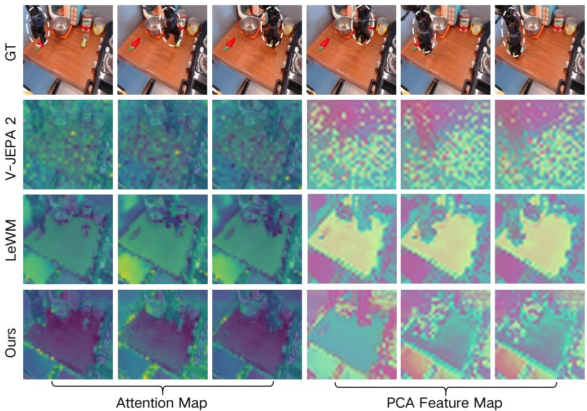  
Figure 5: Spatial feature structure. Final-layer attention (left) and PCA of patch embeddings (right) for V-JEPA 2, LeWM, and our control-aligned encoder trained with the Dynamic CLS loss (Ours). LeWM focuses on the manipulation region, while Ours shows more concentrated attention along robot and object boundaries than LeWM. PCA is fitted separately on the same frames; colors are comparable only within each encoder.

## A ADDITIONAL REPRESENTATION ANALYSIS

A useful predictive target should preserve state changes that matter for control while remaining stable under irrelevant appearance variation. We therefore compare two frozen encoders: V-JEPA 2, pretrained on video (Assran et al., 2025; Mur-Labadia et al., 2026), and the control-aligned encoder, denoted Ours in the figures. As introduced in the first part of Method, the control-aligned encoder is trained on robot trajectories with an action-conditioned JEPA objective and the Dynamic CLS loss (Eq. 4). The analyses cover spatial feature structure and the relationship between global-token transitions and action patterns. They assess teacher suitability in the studied control setting and do not isolate pretraining data, architecture, and objective as independent factors.

Feature extraction. Patch-level maps use each encoder’s native grid. Feature channels and PCA colors are not assumed to correspond across encoders.

## A.1 ATTENTION AND PCA VISUALIZATION

Figure 5 shows final-layer attention and PCA of patch embeddings. V-JEPA 2 distributes attention across the scene and exhibits fine-scale PCA variation. LeWM concentrates on the manipulation region, with PCA maps that distinguish the robot, bowl, and object from much of the tabletop. Compared with LeWM, our control-aligned encoder, trained with the Dynamic CLS loss, shows more concentrated attention along the edges of the robot and manipulated objects, outlining their boundaries more clearly while retaining this foreground–background separation in its PCA maps. These maps indicate where information is represented; they do not identify the pixels used by the downstream policy.

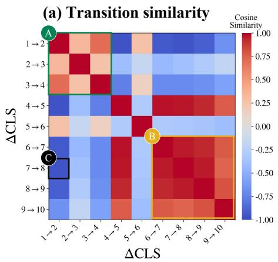

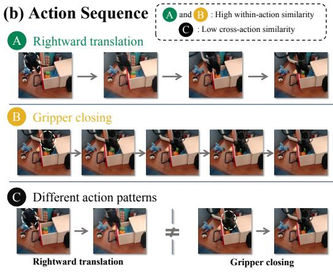  
Figure 6: CLS transition similarity across action patterns. (a) Pairwise cosine similarity between CLS transition vectors $\Delta c _ { t } = c _ { t + 1 } - c _ { t } ;$ warmer colors indicate higher similarity. The green block (A) covers rightward-translation transitions 1 → 2 through 3 → 4, and the yellow block (B) covers gripper-closing transitions $6 \to 7$ through $9 \to 1 0 .$ . The black-outlined cell (C) contrasts $1  2$ with $7  8 ,$ illustrating low similarity across the two action patterns. (b) Corresponding observation sequences and the cross-action comparison; dashed white circles highlight the gripper region.

## A.2 CLS TRANSITION SIMILARITY ACROSS ACTION PATTERNS

We next examine whether changes in the global CLS token reflect the type of motion, using the control-aligned encoder introduced in Method. For the ten observations in the illustrated sequence, let $c _ { t } = \Phi _ { \theta } ^ { \mathrm { { \tiny { c l s } } } } ( o _ { t } )$ and $\Delta c _ { t } = c _ { t + 1 } - c _ { t } .$ , following the notation of Eq. 4. Figure 6 compares the nine transition vectors through $S _ { i j } = \cos ( \Delta c _ { i } , \Delta c _ { j } )$ , for $i , j \in \{ 1 , \ldots , 9 \}$ . Each axis entry denotes an observation transition, so the matrix measures similarity between representation changes rather than between individual frame embeddings.

The off-diagonal entries within A and B show higher similarity among transitions with the same action pattern: rightward translation in A and gripper closing in B. In contrast, C compares a translation transition with a closing transition and exhibits low similarity. In this example, the global-token changes therefore distinguish the two motion patterns while remaining more consistent within each pattern. This observation is consistent with the motivation of the Dynamic CLS loss to encode motionrelevant changes in the global state. The visualization concerns transition direction in representation space; it does not measure transition magnitude or, by itself, isolate the effect of the loss.

## B TRAINING DETAILS

## B.1 TRAINING DATA

Bridge/Fractal. SimplerEnv policies are trained on BridgeData V2 and Fractal in LeRobot format (Table 6). The sampler first selects a source with probability $1 / 2 ,$ , then an episode and timestep uniformly within that source, so equal source weights are not uniform over all frames. The two datasets keep their native rates (5 Hz and 3 Hz); frame offsets are counted in dataset steps. The policy uses one RGB view, resized to $2 2 4 \times 2 2 4$ . Each example contains the current image and instruction, a contiguous 16-step action chunk, and eight future images at stride 2 for latent alignment. Indices past the episode end are clamped to the last frame. Future images are training targets only.

RoboCasa-GR1. We train one multitask policy on the 24 GR1 Tabletop Tasks with equal tasksampling weights; within a task, an episode and timestep are drawn uniformly. The policy receives the ego-view RGB image at $2 2 4 \times 2 2 4$ and the task instruction, without proprioception. Actions are 16-step chunks with 29 channels (two arms, two hands, and waist), min–max normalized to [−1, 1]. Latent alignment uses eight future images at stride 2, as in Bridge/Fractal training.

Table 6: Bridge/Fractal data inventory. Encoder pretraining windows use four observations at stride two and do not cross episode boundaries.
<table><tr><td>Dataset</td><td>Episodes</td><td>Frames</td><td>Rate (Hz)</td><td>Pretraining windows</td></tr><tr><td>BridgeData V2</td><td>53,192</td><td>1,893,026</td><td>5</td><td>1,520,923</td></tr><tr><td>Fractal</td><td>87,212</td><td>3,786,400</td><td>3</td><td>3,178,323</td></tr></table>

Table 7: Policy optimization. Shared optimizer, precision, and backbone settings are described in the text.
<table><tr><td>Parameter</td><td>Bridge/Fractal RoboCasa-GR1</td><td></td><td>PiPER fine-tuning</td></tr><tr><td>Update budget</td><td> $1 0 0 { , } 0 0 0$ </td><td>100,000</td><td>50,000</td></tr><tr><td>Devices × batch per device</td><td> $8 \times 1 6$ </td><td> $8 \times 8$ </td><td> $8 \times 1 6$ </td></tr><tr><td>Global batch size</td><td>128</td><td> $^ { 6 4 }$ </td><td>128</td></tr><tr><td>Backbone learning rate</td><td> $1 0 ^ { - 5 }$ </td><td> $1 0 ^ { - 5 }$ </td><td> $1 0 ^ { - 4 } \mathrm { ( L o R A ) }$ </td></tr><tr><td>Predictive-branch learning rate</td><td> $1 0 ^ { - 4 }$ </td><td> $1 0 ^ { - 4 }$ </td><td> $1 0 ^ { - 4 } \mathrm { ( L o R A ) }$ </td></tr><tr><td>Action-decoder learning rate</td><td> $1 0 ^ { - 4 }$ </td><td> $1 0 ^ { - 4 }$ </td><td> $1 0 ^ { - 5 }$ </td></tr><tr><td>Other trainable modules’ rate</td><td> $1 0 ^ { - 5 }$ </td><td> $3 \times 1 0 ^ { - 5 }$ </td><td> $5 \times 1 0 ^ { - 6 }$ </td></tr><tr><td>Learning-rate warm-up</td><td>5,000</td><td> $5 { , } 0 0 0$ </td><td>500</td></tr><tr><td>Checkpoint interval</td><td>5,000</td><td>10,000</td><td>5,000</td></tr><tr><td>Action dimension / chunk length</td><td>7/16</td><td>29/16</td><td>7/16</td></tr><tr><td>Alignment warm-up / plateau / decay</td><td>5k / 30k / 70k</td><td>5k / 30k / 70k</td><td>0.5k / 10k / 20k</td></tr></table>

Real-world. We initialize from the SimplerEnv policy and fine-tune on 60 leader–follower demonstrations of “Put the red cube into the blue bowl” (20 at each of three cube positions) on the right PiPER arm of an AgileX Cobot Magic platform. Acquisition records top-view and right-wrist RGB at $6 4 0 \times 4 8 0$ and 30 Hz; the training adapter uses the top view at $2 2 4 \times 2 2 4$ and a 15-fps export. HDF5 poses are converted from millimeters/degrees to meters/radians. Translational actions are consecutive position differences; rotational actions are base-frame XYZ Euler increments from $R _ { t + 1 } R _ { t } ^ { - 1 }$ ; the gripper encodes the next open/closed state in {0, 1}. Trailing stationary frames are trimmed. The exported 8D state is stored but not consumed by the policy.

## B.2 POLICY OPTIMIZATION

Table 7 lists the three recipes. All use Qwen3-VL-4B-Instruct with a GR00T flow-matching decoder, AdamW $( \beta _ { 1 } , \beta _ { 2 } ) = ( 0 . 9 , 0 . 9 5 ) , \epsilon = 1 0 ^ { - 8 }$ , weight decay $1 0 ^ { - 8 }$ , gradient clipping 1.0, cosine decay to $5 \times 1 0 ^ { - 7 }$ , random seed 42, BF16, and DeepSpeed $\scriptstyle \dot { \mathrm { Z e R O - } } 2$ . The backbone, predictive branch, action decoder, and fusion modules are trainable; the pretrained control-aligned teacher is frozen. The predictive branch is initialized by copying the corresponding Qwen text-layer weights. Each action chunk is trained with eight flow-matching noise/time samples; inference uses four Euler steps. Patch fusion uses eight attention heads and residual gain $\gamma = 0 . 2$ . There are $K = 8$ predictive queries, matching the eight future targets.

Alignment follows Eq. 6 with $\lambda _ { \mathrm { s l 1 } } = \delta = 0 . 1$ . The coefficient $\alpha ( s )$ in $\mathcal { L } = \mathcal { L } _ { \mathrm { F M } } + \alpha ( s ) \mathcal { L } _ { \mathrm { a l i g n } }$ warms up linearly over W steps, stays at 1 for P steps, then half-cosine decays over D steps to 0.05 (Table 7). For Bridge/Fractal and RoboCasa, decay starts at 35,000 updates and does not quite reach 0.05 within the 100,000-step budget. Learning-rate warmup and alignment warmup are separate schedules.

PiPER fine-tuning starts from a Bridge/Fractal checkpoint at 95,000 updates and retains $\mathcal { L } _ { \mathrm { a l i g n } }$ LoRA (rank 32, α = 64, dropout 0.05) is applied to attention and MLP projections in the backbone and predictive branch, with those base weights frozen. The action decoder and remaining fusion, projection, and query parameters are updated directly.

## B.3 CONTROL-ALIGNED ENCODER PRETRAINING

The control-aligned encoder is trained on Bridge/Fractal windows of four frames at offsets 0, 2, 4, 6 (three context observations and one prediction target). Each stride-two transition is conditioned on the two intervening 7D actions, concatenated to 14D. Unlike the equal-source policy sampler, windows are shuffled, so source mass follows Table 6 (about 32% Bridge / 68% Fractal). A seeded 90/10 split is applied at the window level, so an episode can contribute to both subsets.

The encoder is ViT-Tiny (224 × 224, patch 14, 768D hidden) with a 192D latent projector. The action-conditioned predictor has six layers, 16 heads, and dropout 0.1. Training uses 8 devices, batch 256 per device (global 2,048), AdamW at $5 \times 1 0 ^ { - 5 }$ , weight decay $1 0 ^ { - 3 }$ , gradient clipping 1.0, and BF16. SIGReg has weight 0.2 (1,024 projections, 17 knots). Dynamic CLS has weight 0.2 and temperature $\tau = 0 . 5 ;$ its patch targets come from a frozen copy of the source encoder. The policy uses the epoch-36 export of this run.

## C EVALUATION DETAILS

## C.1 SIMPLERENV

We evaluate the official WidowX Bridge suite: spoon-on-towel, carrot-on-plate, green-on-yellow stacking, and eggplant-in-basket. Object poses are randomized in episode mode over indices 0–23 (24 episodes per task). We repeat the suite over four independent runs (96 episodes per task). Control is 5 Hz, simulation is 500 Hz, and each episode is limited to 120 control steps. Robot base orientation is held at the identity. The first three tasks use the Bridge table with base $( x , y ) = ( 0 . 1 4 7 , 0 . 0 2 8 )$ m; eggplant uses the sink-camera setup with base (0.127, 0.06) m. Success is the binary outcome from the official evaluator. We report the mean over the four runs and the unweighted mean across tasks (Table 1). The Juno-TTT row uses the same launcher after test-time training. Policy inference is served in BF16 over WebSocket to the simulator client.

## C.2 ROBOCASA-GR1

The multitask policy is evaluated on all 24 GR1 Tabletop Tasks in Table 8 (GR1 arms and waist with Fourier hands), with 50 episodes per task, a 720-step horizon, and 12 executed actions from each predicted chunk. An episode counts as success if the simulator success flag is true at any step. We report per-task rates and their unweighted mean. As in SimplerEnv, a BF16 policy server communicates with the client over WebSocket.

Table 8 provides the full per-task breakdown corresponding to the grouped results in Table 2.

## C.3 REAL-WORLD EVALUATION

Platform and observations. We use the right PiPER follower arm of an AgileX Cobot Magic ALOHA-style platform (six revolute joints; parallel-gripper opening 0–70 mm). The left arm and mobile base are unused. Inference runs in BF16 on an NVIDIA DGX Spark; a ROS Noetic client on the robot PC exchanges images, instructions, and action chunks over a wired WebSocket. Top-view and right-wrist RGB are recorded with Intel RealSense D435 cameras at $6 4 0 \times 4 8 0$ and 30 Hz. The policy consumes only the top view, resized to $2 2 4 \times 2 2 4$ , as in fine-tuning. Figure 7 shows the colored lamp used only in the dynamic-lighting TTT setting (Fig. 4c).

Control. The policy outputs a $1 6 \times 7$ delta end-effector chunk in the robot base frame (meters, radians, binary gripper), denormalized with the checkpoint’s 1st/99th-percentile statistics. Deployment runs at 15 Hz and executes the full 16-step chunk (≈ 1.07 s) before the next observation and replan, unlike the 5 Hz SimplerEnv protocol. Each chunk is integrated from fresh end-effector feedback; inference is synchronous and the previous Cartesian target is held while waiting. Increments are converted by damped least-squares IK on the PiPER URDF. Targets outside workspace or joint limits are rejected. If the IK residual exceeds 0.01 m or 0.10 rad, that action is skipped. Latched tracking faults require an operator reset and count as failures.

Table 8: Full per-task results on RoboCasa-GR1 Tabletop Tasks. A single multitask model is trained for all 24 tasks. Entries are success rates (%); Average is the unweighted mean over all tasks. The best result in each row is shown in bold.
<table><tr><td>Task</td><td>GR00T-N1.6</td><td>Qwen3GR00T</td><td>Qwen3PI</td><td>Qwen3OFT</td><td>Qwen3FAST</td><td>Juno (Ours)</td></tr><tr><td>PnPBottleToCabinetClose</td><td>51.5</td><td>46.0</td><td>26.0</td><td>30.0</td><td>38.0</td><td>80.0</td></tr><tr><td>PnPCanToDrawerClose</td><td>13.0</td><td>80.0</td><td>62.0</td><td>76.0</td><td>44.0</td><td>86.0</td></tr><tr><td>PnPCupToDrawerClose</td><td>8.5</td><td>54.0</td><td>42.0</td><td>44.0</td><td>56.0</td><td>48.0</td></tr><tr><td>PnPMilkToMicrowaveClose</td><td>14.0</td><td>48.0</td><td>50.0</td><td>44.0</td><td>44.0</td><td>44.0</td></tr><tr><td>PnPPotatoToMicrowaveClose</td><td>41.5</td><td>28.0</td><td>42.0</td><td>32.0</td><td>14.0</td><td>32.0</td></tr><tr><td>PnPWineToCabinetClose</td><td>16.5</td><td>46.0</td><td>32.0</td><td>36.0</td><td>14.0</td><td>54.0</td></tr><tr><td>PnPNovelFromCuttingboardToBasket</td><td>58.0</td><td>48.0</td><td>40.0</td><td>50.0</td><td>54.0</td><td>60.0</td></tr><tr><td>PnPNovelFromCuttingboardToCardboardbox</td><td>46.5</td><td>40.0</td><td>46.0</td><td>40.0</td><td>42.0</td><td>58.0</td></tr><tr><td>PnPNovelFromCuttingboardToPan</td><td>68.5</td><td>68.0</td><td>60.0</td><td>70.0</td><td>58.0</td><td>78.0</td></tr><tr><td>PnPNovelFromCuttingboardToPot</td><td>65.0</td><td>52.0</td><td>40.0</td><td>54.0</td><td>58.0</td><td>68.0</td></tr><tr><td>PnPNovelFromCuttingboardToTieredbasket</td><td>46.5</td><td>56.0</td><td>44.0</td><td>38.0</td><td>40.0</td><td>60.0</td></tr><tr><td>PnPNovelFromPlacematToBasket</td><td>58.5</td><td>42.0</td><td>44.0</td><td>32.0</td><td>36.0</td><td>66.0</td></tr><tr><td>PnPNovelFromPlacematToBowl</td><td>57.5</td><td>44.0</td><td>52.0</td><td>58.0</td><td>38.0</td><td>64.0</td></tr><tr><td>PnPNovelFromPlacematToPlate PnPNovelFromPlacematToTieredshelf</td><td>63.0</td><td>48.0</td><td>50.0</td><td>52.0</td><td>42.0</td><td>70.0</td></tr><tr><td></td><td>28.5</td><td>18.0</td><td>28.0</td><td>24.0</td><td>18.0</td><td>22.0</td></tr><tr><td>PnPNovelFromPlateToBowl</td><td>57.0</td><td>60.0</td><td>52.0</td><td>60.0</td><td>52.0</td><td>62.0</td></tr><tr><td>PnPNovelFromPlateToCardboardbox PnPNovelFromPlateToPan</td><td>43.5</td><td>50.0</td><td>40.0</td><td>50.0</td><td>30.0</td><td>64.0</td></tr><tr><td>PnPNovelFromPlateToPlate</td><td>51.0 78.7</td><td>54.0 70.0</td><td>36.0</td><td>66.0</td><td>48.0</td><td>76.0</td></tr><tr><td></td><td></td><td></td><td>48.0</td><td>68.0</td><td>50.0</td><td>70.0</td></tr><tr><td>PnPNovelFromTrayToCardboardbox PnPNovelFromTrayToPlate</td><td>51.5</td><td>38.0</td><td>34.0</td><td>44.0</td><td>28.0</td><td>54.0</td></tr><tr><td></td><td>71.0 64.5</td><td>56.0</td><td>64.0</td><td>56.0</td><td>34.0</td><td>70.0</td></tr><tr><td>PnPNovelFromTrayToPot</td><td></td><td>50.0</td><td>44.0</td><td>62.0</td><td>46.0</td><td>60.0</td></tr><tr><td>PnPNovelFromTrayToTieredbasket PnPNovelFromTrayToTieredshelf</td><td>57.0 31.5</td><td>36.0 16.0</td><td>50.0 28.0</td><td>54.0</td><td>36.0</td><td>48.0</td></tr><tr><td></td><td></td><td></td><td></td><td>30.0</td><td>16.0</td><td>36.0</td></tr><tr><td>Average</td><td>47.6</td><td>47.8</td><td>43.9</td><td>48.8</td><td>39.0</td><td>59.6</td></tr></table>

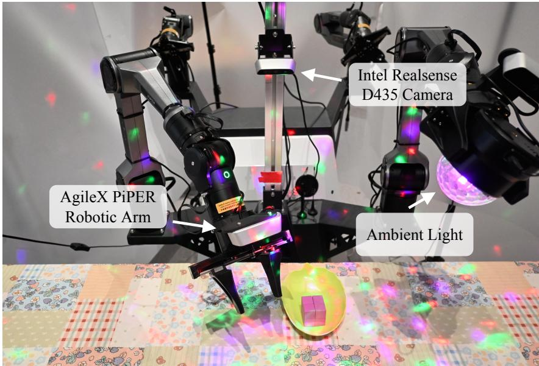  
Figure 7: Real-robot workstation with additional colored illumination. This lighting is used for dynamic-lighting test-time training, not for the frozen-policy columns in Table 3.

Protocol. We run 20 frozen-policy trials per model and condition (Table 3). Every condition, including in-domain, uses cube positions held out from the three demonstration placements. Indomain keeps nominal appearance and objects. The remaining columns are cumulative (Fig. 4b): background replaces the tablecloth and changes the cube color and the bowl’s shape and color; height additionally raises the work plane by 10 cm; object further replaces the cube with a grape and updates the instruction. Success is placing the designated object in the designated bowl without operator intervention.

## D TEST-TIME TRAINING

## D.1 PROCEDURE

TTT is reported separately from frozen-policy evaluation because it uses additional deployment interaction and optimization. A recorded transition $\left( o _ { t } , a _ { t } , o _ { t + 1 } \right)$ is valid supervision for actionconditioned dynamics whether or not the action completes the task; using $a _ { t }$ as an imitation target is not. Stage A therefore adapts the world model on all deployment transitions, including failures (Eq. 8). Stage B freezes this teacher and updates the policy on successful data only, with joint alignment and flow-matching (Eq. 9). Stage B updates the backbone and predictive branch through LoRA adapters while keeping their pretrained weights frozen. The action decoder is fully trainable without LoRA, and the adapted teacher remains frozen throughout policy re-alignment. Alignment weight is held at 1 throughout Stage B.

## D.2 SIMPLERENV

SimplerEnv TTT uses rollouts of the frozen Bridge/Fractal policy as the deployment stream. Stage A trains all world-model parameters for 10 epochs with AdamW at $1 0 ^ { - 6 }$ , weight decay $1 0 ^ { - 3 }$ , batch $8 \times 1 6$ , BF16, SIGReg weight 0.2, and an episode-level 90/10 split. Windows keep three context frames and one prediction target at stride 2. Stage B runs 400 steps with batch $8 \times 4$ , DeepSpeed ZeRO-2, a learning rate of $5 \times 1 0 ^ { - 7 }$ for the backbone LoRA adapters and $5 \times 1 0 ^ { - 6 }$ for the other LoRA adapters and the fully trainable action head, 10-step warmup, and cosine decay to $5 \times 1 0 ^ { - 8 }$ Action chunks remain length 16 with eight future frames at stride 2; inference uses four Euler steps.

## D.3 REAL ROBOT

For the 15 Hz dynamic-lighting condition, we collect 40 deployment rollouts. Stage A uses all valid transitions from these rollouts, including those from failed executions. Stage B uses only transitions from verified successful executions. RGB supervision is the top camera at $2 2 4 \times 2 2 4$ . Control matches Appendix C.3 (15 Hz, 16-step chunks). Action normalization is taken from PiPER fine-tuning and is not refit on the deployment rollouts. The world model is warm-started from the Bridge/Fracta frozen-CLS checkpoint; the policy is warm-started from the PiPER-adapted checkpoint after 5,000 updates. Stage A follows the SimplerEnv world-model recipe for 10 epochs. Stage B follows the 400-step joint fine-tune above, with checkpoints every 50 steps. These updates are not applied in Table 3.

## E QUALITATIVE RESULTS

We present paired rollouts in simulation and on the real robot to illustrate policy behavior before and after the improvements studied in this work. In all four figures, the upper row shows a failed execution and the lower row shows a successful execution, with frames ordered from left to right. Some pairs compare Juno with the base VLA, and others compare Juno before and after test-time training. The lighting example is the former; the Gaussian-noise example is the latter.

## E.1 SIMULATION EVALUATION

Base VLA versus Juno. Figure 8 compares Qwen3GR00T and Juno on the SimplerEnv task “Put the spoon on the towel.” The baseline rollout in the upper row fails to place the spoon on the towel. In contrast, Juno in the lower row picks up the spoon, transports it to the towel, and releases it on the target surface. This pair illustrates how the performance difference reported in Table 1 can manifest in a complete manipulation sequence.

Juno before and after TTT. Figure 9 compares Juno before and after TTT on “Put eggplant into yellow basket.” In the upper row, the policy lifts the eggplant but does not complete its transfer into

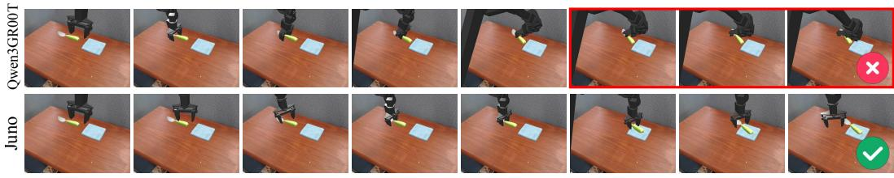  
Put the spoon on the towel

Figure 8: Simulation: base VLA versus Juno. Spoon placement in SimplerEnv. The upper row shows an unsuccessful Qwen3GR00T rollout; the lower row shows a successful Juno rollout that places the spoon on the towel. Frames progress from left to right.

the basket. In the lower row, the adapted policy grasps the eggplant, moves it from the sink to the yellow basket, and completes placement. This is one rollout pair. Average success on this task stays essentially unchanged after TTT (96.9% to 95.8%, Table 1).

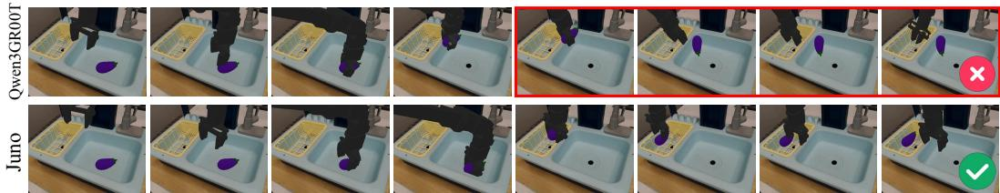  
Put eggplant into yellow basket

Figure 9: Simulation: Juno before and after TTT. Eggplant placement in SimplerEnv. The upper row shows a failed Juno execution before adaptation; the lower row shows successful placement into the yellow basket after TTT (Juno-TTT in the figure). Frames progress from left to right.

## E.2 REAL-WORLD EVALUATION

The real-robot examples show cube-to-bowl manipulation under Gaussian observation noise and flickering colored lighting. As in simulation, each figure pairs a failed rollout with a successful one, while the model comparison differs between the two conditions.

Gaussian observation noise: before and after TTT. Figure 10 compares Juno before and after TTT with noise-corrupted observations, shown in the frame insets. Before adaptation, the robot approaches the cube and attempts to grasp it, but the cube remains outside the bowl in the shown sequence. After TTT, the robot grasps and lifts the cube, transports it over the bowl, and releases it inside. This pair illustrates successful task completion after adaptation in the presence of observation corruption.

Flickering lighting: base VLA versus Juno. Figure 11 compares Qwen3GR00T and Juno under flickering colored illumination. The changing light patterns alter the appearance of the tabletop, robot, and objects throughout the rollouts. In the upper row, the baseline attempts to manipulate the cube but leaves it on the tabletop outside the bowl. In the lower row, Juno grasps the cube, carries it to the bowl, and completes placement despite the changing illumination. This comparison is between the frozen base policy and frozen Juno. The dynamic-lighting gain of Juno-TTT is the separate result in Table 4 (55% to 70%).

Together, these examples illustrate differences in task completion between the base VLA and Juno, and between Juno before and after TTT. They complement the quantitative evaluation; the selected rollouts alone do not establish success rates or isolate the causes of individual failures.

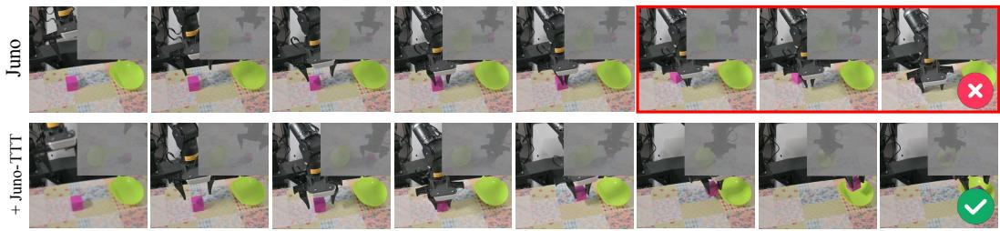  
Put the purple cube into the blue bowl

Figure 10: Real robot: Gaussian observation noise. The upper row shows a failed Juno rollout before TTT; the lower row shows a successful rollout after TTT (Juno-TTT in the figure). Insets display the noise-corrupted observations. Frames progress from left to right, ending with the cube outside the bowl in the upper row and inside it in the lower row.  
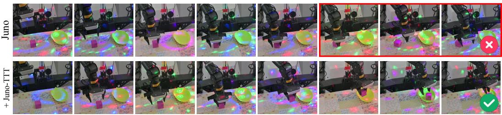  
Put the purple cube into the blue bowl

Figure 11: Real robot: flickering colored lighting. The upper row shows an unsuccessful Qwen3GR00T rollout; the lower row shows a successful Juno rollout. Colored light patterns vary across the scene as the robot attempts to place the cube into the bowl. Frames progress from left to right.