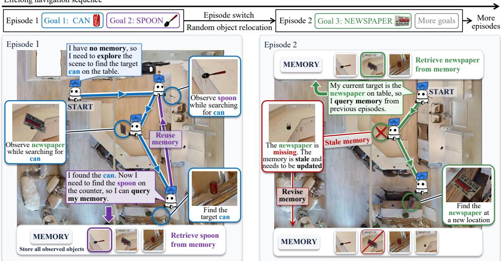
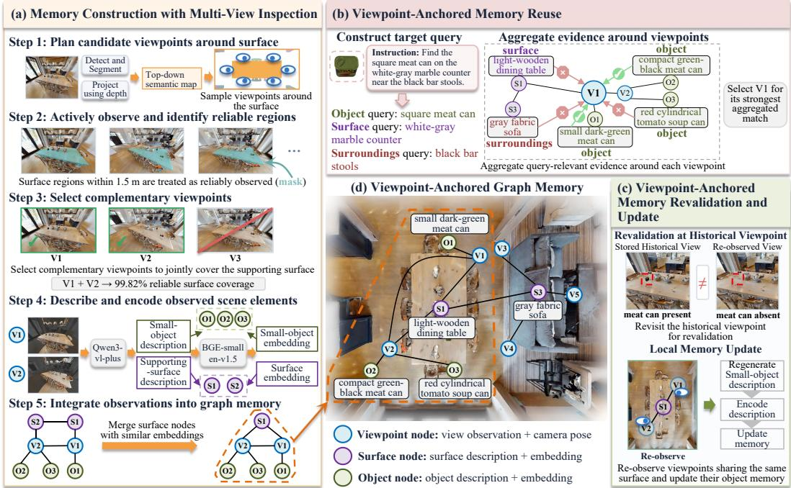
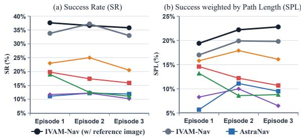

# LIFELONG SMALL-OBJECT NAVIGATION IN CHANG-ING OBJECT LAYOUTS: A BENCHMARK AND METHOD

Jiagan Huang, Zikun Zhou\*, Zijian Ni, Hongpeng Wang, Guangming Lu, Jun Yu, and Wenjie Pei Harbin Institute of Technology, Shenzhen 水 Corresponding authors

## ABSTRACT

Household robots need to continually navigate to different objects in the same environment, many of which are small and portable, such as tools and toys. Their small visual footprint and frequent occlusion make reliable observation difficult, and they may be moved by people without the robot observing the changes. We formulate this challenging task as Lifelong Small-object Navigation in Changing Object Layouts (LiSoNav-COL). Agents must seek suitable viewpoints for reliable observation, accumulate and reuse scene knowledge to efficiently locate subsequent targets, and update outdated memory after object relocation. To eliminate the need for prior scene scanning, we also require agents to start navigation with empty scene memory. Although practical, this task still lacks benchmarks designed around its defining assumptions. To bridge this gap, we introduce LiSoNav-Eval, a dedicated benchmark spanning 28 indoor scenes with 45 smallobject categories. Its lifelong navigation sequences include both unchanged and relocated targets to evaluate memory reuse and adaptation to object relocation. To address this challenging task, we propose a navigation method based on multiview Inspection with Viewpoint-Anchored Memory, dubbed IVAM-Nav. IVAM-Nav actively observes supporting surfaces from complementary viewpoints for reliable small-object perception and anchors the resulting memory to their observation viewpoints, supporting relational memory reuse and revalidation under similar viewing conditions. Extensive experiments on LiSoNav-Eval demonstrate favorable performance of IVAM-Nav against representative methods. Benchmark analyses also show that smaller objects, larger environments, and longer relocation distances pose greater challenges. The dataset and code are available here.

## 1 INTRODUCTION

Object-goal navigation requires embodied agents to search for and navigate to target objects specified by images or language (Krantz et al., 2023; Zhu et al., 2021). In household environments, robots may repeatedly perform such tasks in the same scene, motivating lifelong navigation that retains and reuses experience across successive tasks (Khanna et al., 2024b). Scene memory supports this process by preserving previously acquired object information to reduce redundant exploration.

In everyday household activities, many objects that robots need to locate and manipulate are small, portable items, such as tools and toys. People may move objects unnoticed by the robot, leaving its scene memory outdated and requiring verification and updates. These objects also occupy only a small portion of the visual field and are often occluded, making them difficult to observe clearly (Wang & Soh, 2023). These real-world challenges motivate us to study Lifelong Smallobject Navigation in Changing Object Layouts (LiSoNav-COL). In this task, an agent starts with no prior scene memory and navigates to successive small-object goals within the same environment, incrementally acquiring scene knowledge throughout the navigation. Given that unobserved object relocations may render its memory outdated, the agent must learn to reuse accumulated scene knowledge while adapting to these changes for accurate and efficient navigation. Starting with an empty memory eliminates the need for a separate scene-scanning phase in real-world applications.

Lifelong navigation sequence  
  
Figure 1: An example navigation sequence in LiSoNav-Eval, in which the agent is instructed to find the CAN on the table, the SPOON on the counter, the NEWSPAPER on the table, and other targets in sequence. Starting with no prior scene memory, the agent searches for the CAN while constructing memory from observed objects, which is later reused to find the SPOON. Between episodes, randomly selected objects are relocated without the agent observing the changes. When searching for the NEWSPAPER, the agent first revisits the remembered location, finds the newspaper missing, updates the scene memory, and then locates the newspaper elsewhere. This example illustrates how LiSoNav-Eval evaluates small-object navigation as agents accumulate scene knowledge, reuse it across tasks, and respond to changes in object locations.

Existing navigation benchmarks adopt task assumptions that differ from those of LiSoNav-COL. The mainstream lifelong navigation benchmarks (Wani et al., 2020; Khanna et al., 2024b; Wang et al., 2026) mainly evaluate experience reuse in static scenes, where target locations remain unchanged across subtasks. OpenIN (Tang et al., 2025) evaluates sequential navigation after object relocation, but starts with a preconstructed scene graph and relocates objects before the task sequence begins. This setting assesses the use of prior scene knowledge after relocation, rather than its online acquisition and maintenance through repeated changes. Meanwhile, the small-object navigation benchmark (Wang & Soh, 2023) focuses on perception and target search in static scenes under a single-goal setting. These evaluation settings do not jointly capture the requirements of LiSoNav-COL: acquiring scene knowledge from an initially empty memory, reusing it across small-object navigation tasks, and adapting to repeated object relocation.

To support systematic evaluation of LiSoNav-COL, we introduce LiSoNav-Eval, a new benchmark comprising navigation sequences and an evaluation protocol for this task. Figure 1 presents an illustrative example of our benchmark, where the agent completes a sequence of small-object navigation subtasks (each corresponding to a specific goal) in the same environment, starting with no prior scene memory and retaining the knowledge acquired during task execution. Specifically, each navigation sequence comprises multiple episodes, each containing several navigation subtasks. Ob ject locations remain unchanged within each episode, while randomly selected objects are relocated between episodes without the agent observing the changes. By including both unchanged and relocated targets, LiSoNav-Eval preserves opportunities to benefit from previously acquired knowledge while testing adaptation when remembered locations become outdated. Together, these settings support the evaluation of small-object navigation as agents accumulate scene knowledge, reuse it across tasks, and respond to changes in object layouts.

In LiSoNav-COL, incomplete or unreliable small-object observations can limit the effectiveness of existing scene-memory methods (Huang et al., 2026; Yang et al., 2025; Tang et al., 2025). Object relocation compounds these observation difficulties, making memory reuse and revalidation more challenging. In this paper, we propose IVAM-Nav, a lifelong small-object navigation method based on multi-view Inspection and Viewpoint-Anchored Memory, to address these challenges. Our key idea is to actively inspect the supporting surfaces where the target may be located from multiple viewpoints and anchor the memory to these viewpoints. Specifically, the agent acquires reliable and complementary observations around potential supporting surfaces and stores them with their camera poses and semantic associations. These records enable reobservation under similar viewing conditions to effectively verify and update the memory. Extensive experiments on LiSoNav-Eval demonstrate the effectiveness of our algorithm. Our contributions can be summarized as:

• We formulate LiSoNav-COL, a new task for lifelong small-object navigation from empty scene memory under changing object layouts. We also introduce LiSoNav-Eval, a dedicated benchmark for evaluating agent performance on this task.

• We propose IVAM-Nav, which constructs a viewpoint-anchored graph memory through active multi-view inspection. This design supports relational memory reuse and memory revalidation under similar viewing conditions, enabling robust navigation.

• Extensive experiments on LiSoNav-Eval demonstrate favorable performance of IVAM-Nav against representative methods, and benchmark analyses identify smaller objects, larger envi ronments, and longer relocation distances as persistent challenges.

## 2 RELATED WORK

Lifelong navigation in changing environments. Existing navigation tasks and benchmarks span single-goal, sequential, and lifelong settings in largely static scenes (Chaplot et al., 2020; Krantz et al., 2023; Zhu et al., 2021; Wani et al., 2020; Khanna et al., 2024b; Miao et al., 2026; Yu et al., 2025; WANG et al., 2026), while dynamic settings consider moving objects and spatiotemporal retrieval (Kurenkov et al., 2023; Dorbala et al., 2026; Jiang et al., 2025; Bogenberger et al., 2026; Chen et al., 2025). Most closely related to our setting, OpenIN studies changing object layouts but requires a preconstructed scene representation before navigation, with its evaluation data and implementation currently unavailable (Tang et al., 2025). LiSoNav-Eval instead evaluates lifelong small-object navigation from empty memory under changing object layouts.

Memory construction, reuse, and revalidation. Existing navigation methods construct and query scene memory through object- or scene-centric graphs, visual observations, and spatial representations (Gu et al., 2024; Werby et al., 2024; Yang et al., 2025; Liu et al., 2025; Jiang et al., 2025; Zhu et al., 2025; Chang et al., 2024; Wang & Soh, 2023; Xu et al., 2026; Ge et al., 2026), while dynamic-memory methods further update or reassess stored information based on new observations (Tang et al., 2025; Jiang et al., 2025; Liu et al., 2025; Yan et al., 2025; Zhao et al., 2026; Ko et al., 2025). APRR and MSGNav actively adjust viewpoints after target detection or localization for manipulation or final-view selection (Qin et al., 2025; Huang et al., 2026). In contrast, IVAM-Nav builds reliable small-object memory via complementary multi-view inspection and uses acquisition viewpoints as persistent anchors for relational retrieval and revalidation.

## 3 LISONAV-EVAL BENCHMARK

## 3.1 TASK DEFINITION

The agent is required to complete a sequence of navigation subtasks (each corresponding to a small object goal) in the same indoor environment with no prior scene memory. It needs to retain the knowledge acquired during subtask execution to facilitate the subsequent subtasks. The lifelong navigation sequence in LiSoNav-Eval spans three or four consecutive episodes, with each episode containing two or three navigation subtasks. Figure 1 illustrates such a sample.

The goal object of each subtask is specified by a natural language instruction. To clearly specify the target object, the instruction is designed to include coarse contextual cues, such as its supporting surface or nearby surroundings, while leaving its exact current location unspecified. This formulation also aligns with how people typically describe the location of a small object in a home environment. Herein, we show two instruction samples:

• Instruction 1: Find the tissue box on the speckled countertop near the sink.

• Instruction 2: Find the turquoise Lego Duplo brick on a small wooden table next to a bed.

We also provide an optional reference image to aid small-object recognition, which reveals no information about the current location of the target. In real-world applications, such images could be obtained through online searches or other external sources. Within an episode, object locations remain unchanged, and subtasks are executed sequentially from the terminal pose of the preceding subtask. Objects are relocated only between episodes to render memory outdated, not during navigation, to avoid turning the task into online tracking of moving objects.

Table 1: Comparison of LiSoNav-Eval with existing lifelong navigation benchmarks. \dager indicates that the corresponding evaluation data are not publicly released.
<table><tr><td></td><td></td><td>Scenes Subtasks</td><td>Semantic target categories</td><td>Object relocation</td><td>Relocated subtasks</td><td>Relocated ratio</td><td>Prior scene knowledge</td><td>Subtasks per sequence</td></tr><tr><td>MultiON 3-ON val (Wani et al., 2020)</td><td>11</td><td>3,150</td><td>1</td><td>No</td><td>1</td><td>一</td><td>No</td><td>3.00</td></tr><tr><td>GOAT val-unseen (Khanna et al., 2024b)</td><td>36</td><td>2,669</td><td>36</td><td>No</td><td>一</td><td></td><td>No</td><td>7.41</td></tr><tr><td>OpenIN† (Tang et al., 2025)</td><td>4</td><td></td><td>一</td><td>Yes</td><td></td><td>100%</td><td>Yes</td><td>4-5</td></tr><tr><td>LMEE-Bench test (Wang et al., 2026)</td><td>36</td><td>828</td><td>38</td><td>No</td><td></td><td></td><td>No</td><td>4.99</td></tr><tr><td>LiSoNav-Eval (Ours)</td><td>28</td><td>1,199</td><td>45</td><td>Yes</td><td>545</td><td>45.45%</td><td>No</td><td>8.27</td></tr></table>

A subtask is successful when the agent stops within 1.5 m of the valid instance matching the target description. Each subtask has a path-length budget of 10 times the shortest geodesic distance from the start to the target, and terminates immediately once this budget is exceeded. This budget allows exploration and recovery from outdated location information after object relocation while limiting excessive search. We report standard navigation metrics (SR and SPL), together with Historical Revisit (HR) and Relocated-target SR. Detailed definitions are provided in 5.1.

## 3.2 LISONAV-EVAL DATASET

Scene and object assets. We use indoor scenes from HM3D (Ramakrishnan et al., 2021) and select 82 diverse small-object instances across 45 categories from YCB (Calli et al., 2015) and HSSD (Khanna et al., 2024a), covering portable household items such as cups, balls, tools, and fruits.

Dataset construction. To construct a lifelong navigation sequence, we first populate an HM3D scene with small objects. We use Qwen-VL-Max (Bai et al., 2023) to identify suitable supporting surfaces and define category-specific placement rules. These rules exclude implausible objectsurface combinations, such as placing food on beds. We also limit local object density to avoid excessive clutter and occlusion that would make small objects unnecessarily difficult to observe. Based on these rules, we randomly generate an initial object configuration for each scene and sample the target objects episode by episode. Targets selected in the first episode remain at their initial locations. In each subsequent episode, a selected target has a probability of being relocated to another compatible supporting surface, preserving plausible object placements after relocation. The same target is not selected more than once within an episode, but may reappear in later episodes, allowing previously acquired knowledge to be useful for subsequent subtasks.

Since LiSoNav-COL starts from empty scene memory, relocating an object that was not previously observed may not invalidate any acquired memory. To increase the likelihood that relocation creates stale memory, we preferentially sample objects in the same semantic region as, and within 5 m of, a previously selected target, as they are more likely to have been observed during earlier navigation.

Dataset verification. To ensure each target is visually identifiable from a suitable viewpoint, we sample observations around every target with the target near the view center. We use Qwen-VL-Max to assess target recognizability and manually remove overly difficult cases.

Dataset annotation. We provide a textual description for each of the 82 small-object instances, emphasizing attributes that distinguish visually similar instances. For coarse contextual cues, we use a real observation around the target location and Qwen-VL-Max to generate coarse descriptions of the supporting surface and available surroundings using attributes such as category, color, and material, while excluding fine-grained spatial details that could reveal the target’s precise location.

Dataset statistics. As shown in Table 1, LiSoNav-Eval contains 145 lifelong navigation sequences from 28 HM3D scenes, comprising 500 episodes and 1,199 subtasks across 45 categories and 82 small-object instances. 545 (45.45%) of these subtasks involve relocated targets. Each navigation sequence contains 8.27 subtasks on average. Compared with OpenIN (Tang et al., 2025), LiSoNav-Eval spans more scenes and includes more subtasks per sequence. Besides, LiSoNav-Eval also supports evaluation of both knowledge reuse and adaptation to object relocation.

  
Figure 2: Overview of IVAM-Nav. IVAM-Nav maintains a viewpoint-anchored graph memory through three processes: (a) Memory construction with multi-view inspection actively observes supporting surfaces from complementary viewpoints to acquire reliable small-object evidence. (b) Viewpoint-anchored memory reuse aggregates relational evidence around historical viewpoints to retrieve those relevant to the current query. (c) Viewpoint-anchored memory revalidation and update revisits retrieved historical viewpoints to verify memory under similar viewing conditions and locally update inconsistent information.

## 4 IVAM-NAV

To handle this challenging task, we propose IVAM-Nav, which is designed to actively inspect supporting surfaces from multiple viewpoints for reliable small-object perception and anchor its memory to these viewpoints. For the first task in a new environment, the agent searches for and navigates to a supporting surface where the target may be located. It then samples nearby viewpoints and retains a small complementary set to obtain clear observations of the supporting surface. These observations, together with their poses and related scene information, form a viewpoint-anchored graph memory. For subsequent subtasks, the agent aggregates the small-object and supportingsurface memories attached to each historical viewpoint and evaluates their relevance to the target query to retrieve the most relevant viewpoint. This design enables the agent to revisit previously recorded viewpoints and verify memory under similar viewing conditions.

## 4.1 OVERALL FRAMEWORK

IVAM-Nav is a navigation framework built on a viewpoint-anchored graph memory. It comprises three core processes: (a) memory construction with multi-view inspection, (b) viewpoint-anchored memory reuse, and (c) viewpoint-anchored memory revalidation and update, as shown in Figure 2.

For each navigation subtask, the agent first queries the memory and revisits relevant historical viewpoints. At each revisited viewpoint, it checks the current observation for the target and compares it with the stored observation to assess memory validity. Detected inconsistencies trigger reobservation and updates at viewpoints associated with the same supporting surface. When useful historical candidates are unavailable or exhausted, the agent explores unobserved regions and actively inspects selected supporting surfaces, constructing new memories for subsequent tasks. The agent stops once the MLLM confirms the target in a current observation. Next we detail the three core processes.

## 4.2 PERSISTENT VIEWPOINT-ANCHORED GRAPH MEMORY

The memory of IVAM-Nav is initialized empty and progressively accumulated throughout the entire lifelong navigation sequence. As shown in Figure 2(d), it is organized as a viewpoint-anchored graph $\mathcal { G } = ( \nu , \mathcal { E } )$ with viewpoint, surface, and object nodes. Viewpoint nodes store observations and camera poses, while surface and object nodes store semantic descriptions and embeddings and are connected to their observation viewpoints. Viewpoints observing the same surface are connected, while nearby distinct surfaces are linked, enabling relational aggregation during retrieval. Historical viewpoints thus serve as anchors for memory retrieval and preserve the poses needed for revalidation under similar viewing conditions.

## 4.3 MEMORY CONSTRUCTION WITH MULTI-VIEW INSPECTION

To construct reliable memory, IVAM-Nav combines frontier-based exploration with active multiview inspection of selected supporting surfaces, as illustrated in Figure 2(a). During exploration, RGB-D observations are used to detect and segment supporting surfaces, which are projected onto a top-down semantic map using depth and camera poses. Based on the target instruction, an MLLM selects either a frontier for further exploration or a nearby supporting surface for multi-view inspection. If a surface is selected, the agent samples viewpoints around it based on the semantic map (Step 1). The agent then visits the sampled viewpoints to acquire close-range observations (Step 2). For each viewpoint v, we define its reliable observation region $\mathcal { R } ( v )$ as the visible surface region within a predefined observation range, visualized by the mask in Step 2 of Figure 2(a). We then select a compact complementary subset that jointly covers the supporting surface (Step 3) by greedily maximizing the additional reliable surface coverage:

$$
v ^ { * } = \arg \operatorname* { m a x } _ { v \in \mathcal { C } \backslash \mathcal { S } } \frac { \left| \mathcal { R } ( v ) \setminus \bigcup _ { u \in \mathcal { S } } \mathcal { R } ( u ) \right| } { \left| \mathcal { R } _ { \operatorname { s u r f } } \right| } ,\tag{1}
$$

where $\mathcal { C }$ and S denote the visited and selected viewpoint sets, respectively, ${ \mathcal { R } } _ { \mathrm { s u r f } }$ is the supportingsurface region, and | · | denotes the area of a region. Selection stops once the required coverage is reached, reducing redundant observations while preserving reliable small-object information across the supporting surface. For each selected viewpoint, we mask regions beyond the reliable observation range in the corresponding view. We then use an MLLM to describe the visible small objects and supporting surface, and encode the resulting descriptions into semantic embeddings (Step 4). These scene elements are associated with their observation viewpoints and integrated into the graph (Step 5), with semantically consistent observations of the same supporting surface merged into a shared surface node.

## 4.4 VIEWPOINT-ANCHORED MEMORY REUSE

Memory reuse allows accumulated scene knowledge to guide subsequent navigation, but noisy or incomplete small-object information can make direct object-level retrieval unreliable. IVAM-Nav therefore treats historical viewpoints as retrieval anchors and evaluates them using the object, surface, and surroundings information associated with each viewpoint, as shown in Figure 2(b). The instruction is decomposed into object, surface, and surroundings queries and encoded into the same semantic space as the corresponding memory information.

For each viewpoint node, we aggregate query-relevant information within its two-hop graph neighborhood, capturing sufficient local context while limiting unrelated information. The object and surface queries are matched with directly connected object and surface nodes, respectively, such as O1 and S1 for V1 in the figure. The second hop further uses object information from neighboring viewpoints and surroundings information from nearby surfaces. The highest-scoring viewpoints are selected for revisit and memory revalidation.

## 4.5 VIEWPOINT-ANCHORED MEMORY REVALIDATION AND UPDATE

A retrieved viewpoint provides both a target-search location and an observation reference for memory revalidation. As shown in Figure 2(c), IVAM-Nav revisits the viewpoint and uses an MLLM to compare the new observation with the stored view under similar viewing conditions, focusing on small-object presence and spatial arrangement. This reduces viewpoint-induced variation, making inconsistencies more indicative of actual scene changes. When an inconsistency is detected, IVAM-Nav follows graph relations to re-observe related viewpoints sharing the same surface and updates their small-object descriptions and embeddings. This relation-guided revision removes stale local information without unnecessary global memory reconstruction.

Table 2: Overall performance on LiSoNav-Eval. Oracle variants use ground-truth detection assistance as described in Sec. 5.1.
<table><tr><td>Method</td><td>Cross-task Memory</td><td>Stale-memory Revision</td><td>Overall SR↑</td><td>Overall SPL↑</td><td>HR</td><td>Relocated-target SR↑</td></tr><tr><td>VLFM (Yokoyama et al., 2024)</td><td>No</td><td>一</td><td>12.3%</td><td>8.8%</td><td>27.6%</td><td>11.7%</td></tr><tr><td>AstraNav (Hu et al., 2026)</td><td>Yes</td><td>No</td><td>12.2%</td><td>9.5%</td><td>23.2%</td><td>9.2%</td></tr><tr><td>DualMap (Jiang et al., 2025)</td><td>Yes</td><td>Yes</td><td>13.9%</td><td>10.2%</td><td>35.2%</td><td>10.3%</td></tr><tr><td>DynaMem (Liu et al., 2025)</td><td>Yes</td><td>Yes</td><td>18.0%</td><td>12.7%</td><td>38.1%</td><td>14.9%</td></tr><tr><td>DynaMem Oracle (Liu et al., 2025)</td><td>Yes</td><td>Yes</td><td>20.1%</td><td>14.4%</td><td>39.6%</td><td>15.8%</td></tr><tr><td>3D-Mem (Yang et al., 2025)</td><td>Yes</td><td>No</td><td>21.9%</td><td>15.5%</td><td>34.3%</td><td>17.2%</td></tr><tr><td>3D-Mem Oracle (Yang et al., 2025)</td><td>Yes</td><td>No</td><td>27.5%</td><td>18.3%</td><td>49.2%</td><td>19.3%</td></tr><tr><td>IVAM-Nav</td><td>Yes</td><td>Yes</td><td>33.4%</td><td>18.4%</td><td>77.4%</td><td>30.5%</td></tr><tr><td>IVAM-Nav (w/ reference image)</td><td>Yes</td><td>Yes</td><td>36.3%</td><td>21.3%</td><td>79.6%</td><td>30.1%</td></tr></table>

## 5 EXPERIMENTS

## 5.1 EXPERIMENTAL SETUP

Baselines. We select representative baselines with different cross-task memory capabilities. VLFM (Yokoyama et al., 2024) provides a reference without cross-task memory. AstraNav (Hu et al., 2026) and 3D-Mem (Yang et al., 2025) retain and reuse scene knowledge across tasks but do not explicitly revise stale information, whereas DualMap (Jiang et al., 2025) and DynaMem (Liu et al., 2025) additionally incorporate mechanisms for adapting stored scene information to environmental changes. Together, these methods provide comparisons across navigation without cross-task memory, cross-task memory reuse, and memory adaptation under scene changes.

For a consistent task interface, all methods receive the same navigation instructions while retaining their core memory mechanisms. Since DualMap assumes a preconstructed scene map, we initialize it by traversing each environment along a predefined route before evaluation. We additionally report oracle variants of 3D-Mem and DynaMem with ground-truth small-object detections within 1 m. These variants reduce failures caused by small-object detection, allowing us to examine whether performance differences persist when this perceptual difficulty is partially alleviated. Details of baseline adaptations are provided in Appendix.

Evaluation metrics. We report Success Rate (SR) and Success weighted by Path Length (SPL) for overall navigation performance. To evaluate historical-memory retrieval, we additionally introduce Historical Revisit (HR) as a behavioral measure. Among subtasks with valid historical target observations, HR is the fraction of such subtasks for which the agent revisits within 1.5 m of a location where the target was previously observed. Whether a target was previously observed is determined using ground-truth simulator information, with detailed criteria provided in Appendix. To evaluate adaptation to object relocation, we further report Relocated-target SR, computed over subtasks whose targets have been relocated before the current task.

Implementation details. IVAM-Nav uses YOLO-World (Cheng et al., 2024) and SAM-L (Kir illov et al., 2023) for supporting-surface perception, Qwen3-VL (Bai et al., 2025) for MLLM-based operations, and BGE-small-en-v1.5 (Xiao et al., 2024) for textual semantic embeddings. We use qwen3-vl-plus-2025-12-19 for all MLLM calls. For a controlled comparison, baseline components requiring MLLM inference also use the same model. Hyperparameters are fixed across all experiments, with further implementation details provided in Appendix.

## 5.2 OVERALL PERFORMANCE

As shown in Table 2, IVAM-Nav achieves an overall SR of 33.4% and SPL of 18.4%, outperforming all baselines in SR and remaining competitive in path efficiency. Notably, 3D-Mem Oracle and DynaMem Oracle achieve 27.5% and 20.1% SR despite receiving ground-truth small-object detection assistance, suggesting that alleviating small-object perception difficulty alone does not fully address LiSoNav-COL, where accumulated scene knowledge must also be effectively reused and maintained as object locations change. With an additional reference image, IVAM-Nav further reaches 36.3% SR and 21.3% SPL, indicating that improved target appearance information can provide additional benefits. In addition, IVAM-Nav achieves an HR of 77.4%, substantially higher than the baselines, indicating that its memory frequently guides the agent back to previously observed target locations. However, high HR alone does not imply success in LiSoNav-COL, as historical locations may become outdated after object relocation and require revalidation. On relocated targets, IVAM-Nav achieves 30.5% SR, compared with 19.3% for 3D-Mem Oracle and 15.8% for DynaMem Oracle.

  
VLFM DualMap DynaMem 3D-Mem  
Figure 3: Performance across the first three episodes.

Table 3: Ablation study of IVAM-Nav on the LiSoNav-Eval subset.
<table><tr><td>Setting</td><td>SR↑</td><td>SPL↑</td></tr><tr><td>w/o cross-task memory</td><td>33.06%</td><td>9.18%</td></tr><tr><td>w/o complementary viewpoints</td><td>26.12%</td><td>13.75%</td></tr><tr><td>w/o graph aggregation</td><td>26.53%</td><td>13.66%</td></tr><tr><td>w/o historical-viewpoint revisit</td><td>28.98%</td><td>14.73%</td></tr><tr><td>w/o memory update</td><td>24.90%</td><td>14.22%</td></tr><tr><td>w/o contextual cues</td><td>30.20%</td><td>15.38%</td></tr><tr><td>Full</td><td></td><td>36.73% 21.38%</td></tr></table>

Table 4: Performance under static and changing-object-layout settings on the LiSoNav-Eval analysis subset. Relative drops are computed from the static to the changing setting.
<table><tr><td rowspan="2">Method</td><td rowspan="2">Cross-task Memory</td><td rowspan="2">Stale-memory Revision</td><td colspan="3">SR</td><td colspan="3">SPL</td></tr><tr><td>Static</td><td>Changing</td><td>Drop (%)</td><td>Static</td><td>Changing</td><td>Drop (%)</td></tr><tr><td>AstraNav (Hu et al., 2026)</td><td>Yes</td><td>No</td><td>14.7%</td><td>11.0%</td><td>25.2%</td><td>12.9%</td><td>8.5%</td><td>34.1%</td></tr><tr><td>DynaMem (Liu et al., 2025)</td><td>Yes</td><td>Yes</td><td>20.8%</td><td>17.6%</td><td>15.7%</td><td>15.7%</td><td>12.6%</td><td>19.7%</td></tr><tr><td>IVAM-Nav</td><td>Yes</td><td>Yes</td><td>40.8%</td><td>36.7%</td><td>10.0%</td><td>25.6%</td><td>21.4%</td><td>16.4%</td></tr></table>

Together, these results show that IVAM-Nav effectively reuses accumulated scene knowledge while remaining effective under object relocation.

Performance across episodes. Figure 3 reports the first three episodes shared by all sequences, excluding Episode 4 to ensure comparison over the same sequence set. Episode 1 contains no object relocation, while later episodes provide more accumulated memory for reuse but may also introduce stale memory through relocation. IVAM-Nav, with or without a reference image, maintains strong SR across episodes, while its SPL increases after Episode 1 and remains consistently higher thereafter, indicating sustained efficiency benefits from accumulated memory despite potential staleness. In contrast, other cross-task memory methods generally show larger SR degradation or less consistent SPL benefits in later episodes.

## 5.3 METHOD ANALYSIS

To enable efficient controlled analysis, we conduct the following experiments on a representative LiSoNav-Eval subset containing 245 subtasks, using the reference-image variant of IVAM-Nav to reduce target-recognition ambiguity and focus the analysis on its memory mechanisms. The representativeness of the subset is analyzed in Appendix, and its composition will be released.

Ablation study. We consider six variants. w/o memory removes cross-task memory entirely. w/o complementary viewpoints retains only one viewpoint near each supporting surface during memory construction. w/o graph aggregation matches memory candidates independently with the target object without aggregating graph information around historical viewpoints. w/o historical-viewpoint revisit navigates to the associated supporting surface for revalidation but does not return to the stored viewpoint. w/o memory update leaves inconsistent historical memory unchanged and continues to use it for subsequent navigation decisions. Finally, w/o contextual cues removes the surface and surroundings cues from the instruction, using only the small-object description for memory retrieval, to evaluate IVAM-Nav when such contextual information is unavailable.

As shown in Table 3, removing cross-task memory reduces SPL from 21.38% to 9.18%, showing the benefit of accumulated memory for navigation efficiency. Retaining only a single viewpoint for each surface reduces SR from 36.73% to 26.12%, supporting the use of complementary viewpoints to obtain reliable small-object information. Without graph aggregation, SR decreases to 26.53%, showing that aggregating scene information around historical viewpoints improves memory retrieval over independently matching memory candidates. Without historical-viewpoint revisit for revalidation, SR drops to 28.98%, showing the benefit of revisiting the original observation viewpoint under similar viewing conditions. Disabling memory update yields the largest SR drop, to 24.90%, highlighting the importance of revising stale memory rather than continuing to use it for subsequent decisions.

Finally, even without contextual cues, IVAM-Nav retains an SR of 30.20%, indicating that the method remains effective when it relies only on the small-object description.

Table 5: Results by object size. Small and Large correspond to bounding-box volumes of < 1 L and $\geq 1 \mathrm { L } ,$ respectively.
<table><tr><td rowspan="2">Method</td><td colspan="2">Small</td><td colspan="2">Large</td></tr><tr><td>SR↑</td><td>SPL↑</td><td>SR↑</td><td>SPL↑</td></tr><tr><td>VLFM (Yokoyama et al., 2024)</td><td>11.2%</td><td>7.4%</td><td>14.8%</td><td>12.0%</td></tr><tr><td>AstraNav (Hu et al., 2026)</td><td>12.5%</td><td>9.6%</td><td>11.5%</td><td>9.1%</td></tr><tr><td>DualMap (Jiang et al., 2025)</td><td>13.2%</td><td>9.5%</td><td>15.6%</td><td>11.8%</td></tr><tr><td>DynaMem (Liu et al., 2025)</td><td>17.9%</td><td>12.7%</td><td>18.3%</td><td>12.8%</td></tr><tr><td>3D-Mem (Yang et al., 2025)</td><td>20.9%</td><td>14.4%</td><td>24.3%</td><td>18.1%</td></tr><tr><td>IVAM-Nav</td><td>29.2%</td><td>16.4%</td><td>42.9%</td><td>23.0%</td></tr><tr><td>IVAM-Nav (w/ reference image)</td><td>33.3%</td><td>19.5%</td><td>43.2%</td><td>25.4%</td></tr></table>

Table 6: Results by relocation distance. Short and Long correspond to geodesic displacements of < 7.5 m and $\ge 7 . 5  { \mathrm { m } }$ , respectively.
<table><tr><td rowspan="2">Method</td><td colspan="2">Short</td><td colspan="2">Long</td></tr><tr><td>SR↑</td><td>SPL↑</td><td>SR↑</td><td>SPL↑</td></tr><tr><td>VLFM (Yokoyama et al., 2024)</td><td>13.9%</td><td>10.1%</td><td>9.7%</td><td>7.2%</td></tr><tr><td>AstraNav (Hu et al., 2026)</td><td>11.3%</td><td>9.1%</td><td>7.2%</td><td>7.2%</td></tr><tr><td>DualMap (Jiang et al., 2025)</td><td>10.5%</td><td>7.7%</td><td>10.1%</td><td>7.6%</td></tr><tr><td>DynaMem (Liu et al., 2025)</td><td>17.6%</td><td>11.9%</td><td>12.2%</td><td>7.7%</td></tr><tr><td>3D-Mem (Yang et al., 2025)</td><td>21.0%</td><td>17.4%</td><td>13.6%</td><td>10.0%</td></tr><tr><td>IVAM-Nav</td><td>35.5%</td><td>18.4%</td><td>25.5%</td><td>13.4%</td></tr><tr><td>IVAM-Nav (w/ reference image)</td><td>34.5%</td><td>18.0%</td><td>25.9%</td><td>13.2%</td></tr></table>

Table 7: Results by environment scale. Small, Medium, and Large correspond to navigable areas of $< 3 2 { \mathrm { m } } ^ { 2 } .$ , 32– $< 6 4 \mathrm { m } ^ { \mathrm { \tilde { 2 } } }$ , and $\geq 6 4  { \mathrm { m ^ { 2 } } } ,$ , respectively.
<table><tr><td rowspan="2">Method</td><td colspan="2">Small</td><td colspan="2">Medium</td><td colspan="2">Large</td></tr><tr><td>SR↑</td><td>SPL↑</td><td>SR↑</td><td>SPL↑</td><td>SR↑</td><td>SPL↑</td></tr><tr><td>VLFM (Yokoyama et al., 2024)</td><td>16.7%</td><td>12.3%</td><td>11.7%</td><td>8.0%</td><td>8.9%</td><td>6.7%</td></tr><tr><td>AstraNav (Hu et al., 2026)</td><td>13.3%</td><td>11.6%</td><td>12.8%</td><td>10.0%</td><td>10.1%</td><td>6.6%</td></tr><tr><td>DualMap (Jiang et al., 2025)</td><td>18.3%</td><td>12.1%</td><td>13.2%</td><td>10.2%</td><td>11.0%</td><td>8.4%</td></tr><tr><td>DynaMem (Liu et al., 2025)</td><td>20.7%</td><td>15.6%</td><td>18.5%</td><td>12.9%</td><td>14.6%</td><td>9.6%</td></tr><tr><td>3D-Mem (Yang et al., 2025)</td><td>31.6%</td><td>26.1%</td><td>19.6%</td><td>12.8%</td><td>16.4%</td><td>9.9%</td></tr><tr><td>IVAM-Nav</td><td>41.5%</td><td>22.4%</td><td>33.7%</td><td>19.1%</td><td>25.0%</td><td>13.5%</td></tr><tr><td>IVAM-Nav (w/ reference image)</td><td>50.5%</td><td>30.3%</td><td>34.3%</td><td>20.3%</td><td>25.9%</td><td>14.2%</td></tr></table>

Table 8: Prior-observation rate of relocated targets.
<table><tr><td>Method</td><td>Rate</td></tr><tr><td>VLFM (Yokoyama et al., 2024)</td><td>42.4%</td></tr><tr><td>AstraNav (Hu et al., 2026)</td><td>55.1%</td></tr><tr><td>DynaMem (Liu et al., 2025)</td><td>49.7%</td></tr><tr><td>DynaMem Oracle (Liu et al., 2025)</td><td>49.4%</td></tr><tr><td>3D-Mem (Yang et al., 2025)</td><td>72.7%</td></tr><tr><td>3D-Mem Oracle (Yang et al., 2025)</td><td>73.8%</td></tr><tr><td>IVAM-Nav</td><td>71.0%</td></tr><tr><td>IVAM-Nav (w/ reference image)</td><td>74.1%</td></tr></table>

Robustness to object relocation. To assess how robustly different methods handle object relocation and the resulting stale memory, we compare representative cross-task memory methods under static and changing-object-layout settings. The static setting removes cross-episode object relocation, with details provided in Appendix. As shown in Table 4, IVAM-Nav exhibits the smallest degradation under scene changes, with relative SR and SPL drops of 10.0% and 16.4%, respectively. This indicates that IVAM-Nav is less affected by object relocation and the potentially stale memory it introduces. See Appendix for further analysis.

## 5.4 BENCHMARK ANALYSIS

We analyze LiSoNav-Eval along factors that affect small-object perception, target search, and adaptation to scene changes. As shown in Table 5, most methods perform worse on smaller objects, reflecting the increased difficulty of acquiring reliable visual information when targets occupy a limited image area. Table 7 shows a clear performance decline as environment scale increases, indicating the greater exploration and search difficulty in larger spaces. For relocated targets, Table 6 shows that most methods perform worse under longer relocation distances, suggesting that larger location changes make recovery from outdated target memory more challenging.

Prior target observation. To assess whether relocation may invalidate acquired target information, we measure the fraction of relocated targets observed before relocation using ground-truth simulator information and the HR observation criterion. As shown in Table 8, prior-observation rates range from 42.4% to 74.1% across methods, showing that relocation can frequently make historical target information outdated. Moreover, the SR gap between unchanged and relocated targets is larger for previously observed targets than for unobserved targets for both IVAM-Nav (12.08 vs. 3.11 percentage points) and DynaMem (9.00 vs. 5.84 percentage points). See for details.

## 6 LIMITATIONS AND FUTURE DIRECTIONS

IVAM-Nav leaves several directions for future work. Active multi-view observation introduces additional navigation cost, motivating more cost-aware acquisition strategies. Memory revalidation is mainly triggered by retrieved historical viewpoints, motivating broader and opportunistic memory maintenance. Memory reuse and exploration are currently sequential and could be more tightly in tegrated. Finally, LiSoNav-Eval relocates small objects while keeping background scenes stable; future benchmarks could consider broader scene changes. See Appendix for further discussion.

## 7 CONCLUSION

We introduced LiSoNav-COL, which studies lifelong small-object navigation from empty memory under changing object layouts, together with the LiSoNav-Eval benchmark. We further pro-

posed IVAM-Nav, which combines multi-view inspection for reliable memory construction with viewpoint-anchored memory reuse and revalidation. Experiments show consistent improvements over existing navigation and scene-memory methods and validate the key designs of IVAM-Nav.

## REFERENCES

Jinze Bai, Shuai Bai, Shusheng Yang, Shijie Wang, Sinan Tan, Peng Wang, Junyang Lin, Chang Zhou, and Jingren Zhou. Qwen-vl: A versatile vision-language model for understanding, local ization, text reading, and beyond. arXiv preprint arXiv:2308.12966, 2023.

Shuai Bai, Yuxuan Cai, Ruizhe Chen, Keqin Chen, Xionghui Chen, Zesen Cheng, Lianghao Deng, Wei Ding, Chang Gao, Chunjiang Ge, Wenbin Ge, Zhifang Guo, Qidong Huang, Jie Huang, Fei Huang, Binyuan Hui, Shutong Jiang, Zhaohai Li, Mingsheng Li, Mei Li, Kaixin Li, Zicheng Lin, Junyang Lin, Xuejing Liu, Jiawei Liu, Chenglong Liu, Yang Liu, Dayiheng Liu, Shixuan Liu, Dunjie Lu, Ruilin Luo, Chenxu Lv, Rui Men, Lingchen Meng, Xuancheng Ren, Xingzhang Ren, Sibo Song, Yuchong Sun, Jun Tang, Jianhong Tu, Jianqiang Wan, Peng Wang, Pengfei Wang, Qiuyue Wang, Yuxuan Wang, Tianbao Xie, Yiheng Xu, Haiyang Xu, Jin Xu, Zhibo Yang, Mingkun Yang, Jianxin Yang, An Yang, Bowen Yu, Fei Zhang, Hang Zhang, Xi Zhang, Bo Zheng, Humen Zhong, Jingren Zhou, Fan Zhou, Jing Zhou, Yuanzhi Zhu, and Ke Zhu. Qwen3-vl technical report. arXiv preprint arXiv:2511.21631, 2025.

Benjamin Bogenberger, Oliver Harrison, Orrin Dahanaggamaarachchi, Lukas Brunke, Jingxing Qian, Siqi Zhou, and Angela P. Schoellig. Where did i leave my glasses? open-vocabulary semantic exploration in real-world semi-static environments. IEEE Robotics and Automation Letters, 11(3):3342–3349, 2026. doi: 10.1109/LRA.2026.3656790.

Berk Calli, Arjun Singh, Aaron Walsman, Siddhartha Srinivasa, Pieter Abbeel, and Aaron M. Dollar. The ycb object and model set: Towards common benchmarks for manipulation research. In 2015 International Conference on Advanced Robotics (ICAR), pp. 510–517, 2015. doi: 10.1109/ICAR. 2015.7251504.

Matthew Chang, Theophile Gervet, Mukul Khanna, Sriram Yenamandra, Dhruv Shah, So Yeon Min, Kavit Shah, Chris Paxton, Saurabh Gupta, Dhruv Batra, Roozbeh Mottaghi, Jitendra Malik, and Devendra Singh Chaplot. GOAT: GO to Any Thing. In Proceedings of Robotics: Science and Systems, Delft, Netherlands, July 2024. doi: 10.15607/RSS.2024.XX.073.

Devendra Singh Chaplot, Dhiraj Gandhi, Abhinav Gupta, and Ruslan Salakhutdinov. Object goal navigation using goal-oriented semantic exploration. In Neural Information Processing Systems (NeurIPS), 2020.

Taijing Chen, Sateesh Kumar, Junhong Xu, Georgios Pavlakos, Joydeep Biswas, and Roberto Mart´ın-Mart´ın. Searching in space and time: Unified memory-action loops for open-world object retrieval, 2025. URL https://arxiv.org/abs/2511.14004.

Tianheng Cheng, Lin Song, Yixiao Ge, Wenyu Liu, Xinggang Wang, and Ying Shan. Yolo-world: Real-time open-vocabulary object detection. In 2024 IEEE/CVF Conference on Computer Vision and Pattern Recognition (CVPR), pp. 16901–16911, 2024. doi: 10.1109/CVPR52733.2024. 01599.

Vishnu Sashank Dorbala, Bhrij Patel, Amrit Singh Bedi, and Dinesh Manocha. Personalized embodied navigation for portable object finding, 2026. URL https://arxiv.org/abs/2403. 09905.

Zuhao Ge, Xiaosong Jia, Chao Wu, Yuchen Zhou, Zuxuan Wu, and Yu-Gang Jiang. Evomemnav: Efficient self-evolving fine-grained memory for zero-shot embodied navigation, 2026. URL https://arxiv.org/abs/2606.03509.

Qiao Gu, Ali Kuwajerwala, Sacha Morin, Krishna Murthy Jatavallabhula, Bipasha Sen, Aditya Agarwal, Corban Rivera, William Paul, Kirsty Ellis, Rama Chellappa, et al. Conceptgraphs: Open-vocabulary 3d scene graphs for perception and planning. In 2024 IEEE International Conference on Robotics and Automation (ICRA), pp. 5021–5028. IEEE, 2024.

Junjun Hu, Xinda Xue, Botao Ren, Minghua Luo, Jintao Chen, Haochen Bai, Liangliang You, and Mu Xu. Astranav-memory: Contexts compression for long memory. In Proceedings of the IEEE/CVF Conference on Computer Vision and Pattern Recognition (CVPR), pp. 8097–8109, June 2026.

Xun Huang, Shijia Zhao, Yunxiang Wang, Xin Lu, Wanfa Zhang, Rongsheng Qu, Weixin Li, Yunhong Wang, and Chenglu Wen. Msgnav: Unleashing the power of multi-modal 3d scene graph for zero-shot embodied navigation. In Proceedings of the IEEE/CVF Conference on Computer Vision and Pattern Recognition (CVPR), pp. 37154–37163, June 2026.

Jiajun Jiang, Yiming Zhu, Zirui Wu, and Jie Song. Dualmap: Online open-vocabulary semantic mapping for natural language navigation in dynamic changing scenes. IEEE Robotics and Automation Letters, 10(12):12612–12619, 2025. doi: 10.1109/LRA.2025.3621942.

Mukul Khanna, Yongsen Mao, Hanxiao Jiang, Sanjay Haresh, Brennan Shacklett, Dhruv Batra, Alexander Clegg, Eric Undersander, Angel X. Chang, and Manolis Savva. Habitat synthetic scenes dataset (hssd-200): An analysis of 3d scene scale and realism tradeoffs for objectgoal navigation. In 2024 IEEE/CVF Conference on Computer Vision and Pattern Recognition (CVPR), pp. 16384–16393, 2024a. doi: 10.1109/CVPR52733.2024.01550.

Mukul Khanna, Ram Ramrakhya, Gunjan Chhablani, Sriram Yenamandra, Theophile Gervet, Matthew Chang, Zsolt Kira, Devendra Singh Chaplot, Dhruv Batra, and Roozbeh Mottaghi. Goat-bench: A benchmark for multi-modal lifelong navigation. In 2024 IEEE/CVF Conference on Computer Vision and Pattern Recognition (CVPR), pp. 16373–16383, 2024b. doi: 10.1109/CVPR52733.2024.01549.

Alexander Kirillov, Eric Mintun, Nikhila Ravi, Hanzi Mao, Chloe Rolland, Laura Gustafson, Tete Xiao, Spencer Whitehead, Alexander C. Berg, Wan-Yen Lo, Piotr Dollar, and Ross Girshick.´ Segment anything. In 2023 IEEE/CVF International Conference on Computer Vision (ICCV), pp. 3992–4003, 2023. doi: 10.1109/ICCV51070.2023.00371.

Po-Chen Ko, Hung-Ting Su, CY Chen, Jia-Fong Yeh, Min Sun, and Winston H. Hsu. Contextaware replanning with pre-explored semantic map for object navigation. In Pulkit Agrawal, Oliver Kroemer, and Wolfram Burgard (eds.), Proceedings of The 8th Conference on Robot Learning, volume 270 of Proceedings ofMachine Learning Research, pp. 4253–4267. PMLR, 06–09 Nov 2025. URL https://proceedings.mlr.press/v270/ko25b.html.

Jacob Krantz, Theophile Gervet, Karmesh Yadav, Austin Wang, Chris Paxton, Roozbeh Mottaghi, Dhruv Batra, Jitendra Malik, Stefan Lee, and Devendra Singh Chaplot. Navigating to objects specified by images. In 2023 IEEE/CVF International Conference on Computer Vision (ICCV), pp. 10882–10891, 2023. doi: 10.1109/ICCV51070.2023.01002.

Andrey Kurenkov, Michael Lingelbach, Tanmay Agarwal, Emily Jin, Chengshu Li, Ruohan Zhang, Li Fei-Fei, Jiajun Wu, Silvio Savarese, and Roberto Mart´ın-Mart´ın. Modeling dynamic environments with scene graph memory, 2023. URL https://arxiv.org/abs/2305.17537.

Peiqi Liu, Zhanqiu Guo, Mohit Warke, Soumith Chintala, Chris Paxton, Nur Muhammad Mahi Shafiullah, and Lerrel Pinto. Dynamem: Online dynamic spatio-semantic memory for open world mobile manipulation. In 2025 IEEE International Conference on Robotics and Automation (ICRA), pp. 13346–13355, 2025. doi: 10.1109/ICRA55743.2025.11127619.

Bo Miao, Weijia Liu, Jun Luo, Lachlan Shinnick, Jian Liu, Thomas Hamilton-Smith, Yuhe Yang, Zijie Wu, Vanja Videnovic, Feras Dayoub, and Anton van den Hengel. Langmap: A human-verified benchmark for hierarchical open-vocabulary goal navigation. arXiv preprint arXiv:2602.02220, 2026.

Liang Qin, Min Wang, Peiwei Li, Wengang Zhou, and Houqiang Li. Active perception meets ruleguided rl: A two-phase approach for precise object navigation in complex environments. In 2025 IEEE/CVF International Conference on Computer Vision (ICCV), pp. 7603–7612, 2025. doi: 10.1109/ICCV51701.2025.00713.

Santhosh Kumar Ramakrishnan, Aaron Gokaslan, Erik Wijmans, Oleksandr Maksymets, Alexander Clegg, John Turner, Eric Undersander, Wojciech Galuba, Andrew Westbury, Angel Chang, Manolis Savva, Yili Zhao, and Dhruv Batra. Habitat-matterport 3d dataset (hm3d): 1000 large-scale 3d environments for embodied ai. In J. Vanschoren and S. Yeung (eds.), Proceedings of the Neural Information Processing Systems Track on Datasets and Benchmarks, volume 1, 2021. URL https://datasets-benchmarks-proceedings.neurips.cc/paper\_files/ paper/2021/file/34173cb38f07f89ddbebc2ac9128303f-Paper-round2. pdf.

Yujie Tang, Meiling Wang, Yinan Deng, Zibo Zheng, Jingchuan Deng, Sibo Zuo, and Yufeng Yue. Openin: Open-vocabulary instance-oriented navigation in dynamic domestic environments. IEEE Robotics and Automation Letters, 10(9):9256–9263, 2025. doi: 10.1109/LRA.2025.3592071.

Jia-Ming Wang and Harold Soh. Small object navigation with context information. In AAAI Summer Symposia, 2023. URL https://api.semanticscholar.org/CorpusID: 265120186.

Sen Wang, Bangwei Liu, Zhenkun Gao, Lizhuang Ma, Xuhong Wang, Yuan Xie, and Xin Tan. Explore with long-term memory: A benchmark and multimodal llm-based reinforcement learning framework for embodied exploration. In Proceedings of the IEEE/CVF Conference on Computer Vision and Pattern Recognition (CVPR), pp. 37098–37108, June 2026.

XUDONG WANG, Jiahua Dong, Baichen Liu, Qi Lyu, Lianqing Liu, and Zhi Han. Lifelong embodied navigation learning. In C. Vondrick, B. Hariharan, C. Raffel, L. Pinto, D. Yang, and A. Faust (eds.), International Conference on Learning Representations, volume 2026, pp. 115492–115515, 2026. URL https://proceedings.iclr.cc/paper\_files/paper/2026/file/ bbd7d8bd780fcf7143add2317ba04638-Paper-Conference.pdf.

Saim Wani, Shivansh Patel, Unnat Jain, Angel X. Chang, and Manolis Savva. Multi-on: Benchmarking semantic map memory using multi-object navigation. In Neural Information Processing Systems (NeurIPS), 2020.

Abdelrhman Werby, Chenguang Huang, Martin Buchner, Abhinav Valada, and Wolfram Burgard.¨ Hierarchical open-vocabulary 3d scene graphs for language-grounded robot navigation. Robotics: Science and Systems, 2024.

Shitao Xiao, Zheng Liu, Peitian Zhang, Niklas Muennighoff, Defu Lian, and Jian yun Nie. C-pack: Packed resources for general chinese embeddings. Proceedings of the 47th International ACM SIGIR Conference on Research and Development in Information Retrieval, 2024.

Yunzhe Xu, Yiyuan Pan, and Zhe Liu. Dream to recall: Imagination-guided experience retrieval for memory-persistent vision-and-language navigation. IEEE Transactions on Pattern Analysis and Machine Intelligence, 48(8):9035–9049, 2026. doi: 10.1109/TPAMI.2026.3679426.

Zhijie Yan, Shufei Li, Zuoxu Wang, Lixiu Wu, Han Wang, Jun Zhu, Lijiang Chen, and Jihong Liu. Dynamic open-vocabulary 3d scene graphs for long-term language-guided mobile manipulation. IEEE Robotics and Automation Letters, 10(5):4252–4259, 2025. doi: 10.1109/LRA.2025. 3547643.

Yuncong Yang, Han Yang, Jiachen Zhou, Peihao Chen, Hongxin Zhang, Yilun Du, and Chuang Gan. 3d-mem: 3d scene memory for embodied exploration and reasoning. In Proceedings ofthe Computer Vision and Pattern Recognition Conference (CVPR), pp. 17294–17303, June 2025.

Naoki Yokoyama, Sehoon Ha, Dhruv Batra, Jiuguang Wang, and Bernadette Bucher. Vlfm: Vision-language frontier maps for zero-shot semantic navigation. In International Conference on Robotics and Automation (ICRA), 2024.

Ming-Ming Yu, Fei Zhu, Wenzhuo Liu, Yirong Yang, Qunbo Wang, Wenjun Wu, and Jing Liu. C-nav: Towards self-evolving continual object navigation in open world. Advances in Neural Information Processing Systems (NeurIPS), 2025.

Shibo Zhao, Guofei Chen, Honghao Zhu, Zhiheng Li, Changwei Yao, Nader Zantout, Seungchan Kim, Wenshan Wang, Ji Zhang, and Sebastian Scherer. SuperMap: A Spatio-Temporal SLAM System for Visual-Language Navigation. In Proceedings ofRobotics: Science and Systems, Sydney, Australia, July 2026. doi: 10.15607/RSS.2026.XXII.052.

Fengda Zhu, Xiwen Liang, Yi Zhu, Qizhi Yu, Xiaojun Chang, and Xiaodan Liang. Soon: Scenario oriented object navigation with graph-based exploration. In 2021 IEEE/CVF Conference on Computer Vision and Pattern Recognition (CVPR), pp. 12684–12694, 2021. doi: 10.1109/CVPR46437.2021.01250.

Ziyu Zhu, Xilin Wang, Yixuan Li, Zhuofan Zhang, Xiaojian Ma, Yixin Chen, Baoxiong Jia, Wei Liang, Qian Yu, Zhidong Deng, Siyuan Huang, and Qing Li. Move to understand a 3d scene: Bridging visual grounding and exploration for efficient and versatile embodied navigation. In 2025 IEEE/CVF International Conference on Computer Vision (ICCV), pp. 8120–8132, 2025. doi: 10.1109/ICCV51701.2025.00761.