# Label-free cell counting and viability prediction with brightfield imaging and deep learning

AMIR REZA VAZIFEH,1 CHRISTIAN ZEIGLER,2 SORNANATHAN MEYYAPPAN,3 RICHARD JESKE,4 JASON W. FLEISCHER,1,\*

1Department of Electrical and Computer Engineering, Princeton University, Princeton, NJ 08544, USA

2Waters Corporation, Immerse Cambridge, 301 Binney Street, Suite 102, Cambridge, MA 02142, USA

3Waters Corporation, 34 Maple St, Milford, MA 01757, USA

4Waters Corporation, Immerse Delaware, 590 Avenue 1743, Newark, DE 19130, USA \*jasonf@princeton.edu

Abstract: Cell viability assessment is a core requirement in cell culture systems, with critical applications in biopharmaceutical manufacturing and drug development. Conventionally, it is measured by adding membrane-impermeable dyes to a sample (a process called staining), which allows compromised cell membranes to be distinguished from intact ones. However, staining has several limitations: (a) chemical agents can perturb normal cellular processes of the cells being measured, (b) it is often ambiguous to assign viability to individual cells whose membrane integrity is only partially compromised. (c) photobleaching can undermine measurement accuracy over time when using fluorescent stains, and (d) staining cannot be performed in situ or in real time. Here, we show that (1) stained cells captured under brightfield imaging contain suficient information to distinguish live and dead cells, and (2) cells captured under unstained brightfield imaging exhibit similar image features to their stained counterparts, enabling models trained on stained cells to generalize to unstained ones. We then report the development and validation of ViabiLens, an AI-assisted software for label-free cell viability analysis. The ViabiLens combines a cell detection model for localizing individual cells with a convolutional neural network (CNN) classifier for live/dead prediction, paired with an interactive UMAP-based viewer for visualizing and exploring individual cells across the sample. Evaluated on Chinese Hamster Ovary (CHO) cells spanning a wide range of viability conditions, ViabiLens achieves a mean absolute error of 2.68% on unstained samples against fluorescence-based reference measurements. We also release a benchmark dataset for label-free cell viability analysis to facilitate future research, available at https://amirrezavazifeh.github.io/ViabiLens-Project-Page/.

## 1. Introduction

Cell culture technology is central to the biopharmaceutical industry, where living cells are grown in bioreactors to produce therapeutic proteins such as monoclonal antibodies [1]. CHO cells are the mammalian cell line most widely used for this purpose [2, 3]. Biologics produced this way now dominate the pharmaceutical industry, accounting for 8 of the 10 top-selling drugs in 2023 [4] and reaching a record 40% share of FDA approvals in 2022, a steady rise over the past 25 years [5]. Key to consistent and predictable operation of cell culture systems is the ability to accurately know the total number of cells (cell count) and the percentage of live or dead cells (cell viability). Beyond bio-production, cells themselves are increasingly being used as therapeutics, including CAR-T cells, stem cells, and tumor-infiltrating lymphocyte therapies [6]. As dying cells can reduce therapeutic eficacy and pose immunological risks to patients, accurate measurement of cellular health is particularly important [7].

Conventional approaches for measuring cell viability typically rely on membrane-impermeable dyes (e.g., Trypan Blue or the combination of acridine orange (AO) and propidium iodide (PI)), where loss of membrane integrity is used as an indicator of cell death [8, 9]. In AO/PI assays, live and dead cells emit fluorescence at diferent wavelengths based on membrane permeability, enabling their discrimination via fluorescence imaging (Fig. 1). However, this approach is subject to several limitations. First, the requirement to add chemical agents introduces inherent disruption to the sample: cells exposed to staining agents may behave diferently from unstained cells, and in some cases the staining process itself can kill the cells being measured [10]. Dye exposure can also cause dead cells to rupture and break apart into debris, causing them to be under-counted and biasing measured viability upward [11, 12]. Second, the boundary between live and dead populations is not always clear-cut, as cells sometimes appear in both fluorescent channels simultaneously. In addition, PI positivity does not always mean death. For example, cells stressed by heat can take up PI immediately, but their membranes often reseal shortly afterwards [13]. Third, photobleaching (the progressive loss of fluorescent signal that occurs when a fluorophore is exposed to excitation light [14]) can reduce measurement reliability over time. Finally, because a physical sample must be pulled manually from the bioreactor and chemically prepared prior to imaging, these measurements cannot be performed in situ or in real time. This manual process is also time-consuming, increases the risk of contaminating the batch, and prevents continuous monitoring of cell health [15].

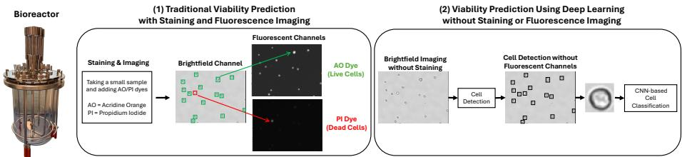  
Fig. 1. Comparison of traditional and proposed methods for cell viability assessment. Left: A bioreactor used for cell culture. Middle: Traditionally, cells are stained and fluorescently imaged to distinguish live from dead cells. Right: The proposed deep-learning-based method detects and classifies individual cells as live or dead directly from brightfield images, without staining or fluorescence imaging. In either case, sample-level viability is computed as the ratio of live cells to the total cell count.

Recent advances in artificial intelligence have provided an alternative approach to bypass the staining process altogether. A common example is virtual staining, in which neural networks with U-Net-like architectures [16] are trained to predict fluorescence images directly from brightfield or phase contrast inputs [17–20]. These methods, however, require accurately co-registered image pairs for training, which are not always available in practice or are laborious to acquire at the volumes needed for proper training. Furthermore, virtual staining shares some of the same limitations as physical staining: some cells appear in both predicted fluorescent channels, leading to ambiguous viability classification. Since viability is ultimately defined as the ratio of live to total cells, cell counting must still be performed on the predicted fluorescence images, meaning an additional postprocessing step is required. An alternative strategy formulates viability assessment as a cell detection and classification problem, where individual cells are first localized and subsequently classified. This paradigm has been applied to diferent imaging modalities, including second harmonic generation and autofluorescence microscopy [21], optical coherence microscopy [22], brightfield imaging [23, 24], phase imaging [25], 2D light scattering [26], diferential interference contrast [27], and digital holographic imaging [28]. Despite recent progress, existing studies are mostly evaluated on limited datasets covering a narrow range of viability conditions [21–24, 26, 28], are often trained and validated on stained samples [23, 24], and frequently rely on complicated optical setups.

In addition, the assumption that unstained images are suficiently similar to stained ones has rarely been examined. This is particularly important as ground-truth viability labels can only be obtained from stained samples, so models must be trained on stained images and then applied to unstained ones to enable label-free assessment. If staining alters cell morphology, the model’s ability to generalize from stained to unstained images will be limited.

In this work, we present ViabiLens, a deep-learning-based pipeline for predicting the viability of label-free cells directly from brightfield images. We first examine whether brightfield images of stained cells contain suficient information to distinguish live cells from dead ones. Building on this, we develop two supervised models: a cell detection model for localizing individual cells and a CNN classifier for assigning viability labels to each detected cell, both trained on stained samples. A key underlying assumption is that staining does not fundamentally alter the brightfield appearance of cells, allowing a model trained on stained cells to generalize to unstained ones. We first validate this assumption by analyzing the image features of individual stained and unstained cells, showing that the two populations exhibit closely matching distributions. We then test our pipeline on paired stained and unstained samples withheld from training, spanning a wide range of viability conditions. On CHO cells, our pipeline achieves a mean absolute error of 2.68% against fluorescence-based measurement. Repeating the experiments under diferent imaging modalities, e.g. phase imaging across diferent focal planes, gives consistent results. These findings demonstrate the generalizability of our approach and show that unstained transmitted light images can be used directly for label-free viability prediction.

## 2. Methods

The overall methodology is shown in Fig. 2. Our pipeline consists of two stages: an object detection model for localizing individual cells, followed by a CNN classifier to predict their viability. We first describe the image acquisition procedure, including sample preparation, imaging settings, and the train/test split. We then detail the cell detection and classification models, followed by the evaluation metrics used to assess each stage.

## 2.1. Sample Preparation

NISTCHO, a clonal CHO-K1 cell line producing cNISTmAb (NIST, SKU 8675), was thawed and cultured in 30 mL of EX-CELL® CD CHO Fusion medium (MilliporeSigma, cat. 14365C) in a 125 mL shake flask at $3 7 ^ { \circ } \mathrm { C } .$ , 135 rpm (25 mm throw), 80% relative humidity, and $5 \% \mathrm { C O } _ { 2 } .$ . Cells were passaged every 3–4 days by dilution into fresh medium and seeded at $0 . 3 { - } 0 . 4 \times 1 0 ^ { 6 }$ cells/mL. To obtain samples spanning the range of viabilities typically encountered in bioprocessing, fed-batch cultures were inoculated at $0 . 8 \times 1 0 ^ { 6 }$ cells/mL in EX-CELL® Advanced CHO Fed-batch Medium (MilliporeSigma, cat. 14365C) or Fusion medium in a 2 L shake flask with an initial working volume of 492 mL. Starting on day 3 and every other day thereafter, EX-CELL Advanced CHO Feed 1 (MilliporeSigma, cat. 24368C) was added at 5% $( { \mathrm { v / v } } ) ,$ and a 400 g/L glucose solution (MilliporeSigma, cat. G7021) was fed daily to restore the glucose concentration to 6 g/L. Cultures were maintained for 14 days, with samples taken at multiple time points for imaging.

## 2.2. Image Acquisition

Cells were stained at a 1:1 volumetric ratio with ViaStain™ AO-PI staining solution (Revvity cat. CS2-0106-5ML) and incubated for 10 minutes prior to imaging. A total of 75 stained CHO cell images (resolution 2080 × 2784 pixels; 1.37 mm × 1.84 mm) were collected using the Cellaca™ PLX image cytometer over a two-week period. For 15 of these stained images, corresponding pre-staining brightfield images were also acquired immediately prior to dye addition. These 15 stained/unstained image pairs were held out as the test set and were not used at any stage of training. For stained samples, the PLX instrument provides (i) one brightfield image and two corresponding fluorescence images, each acquired using a separate fluorescent channel to detect AO and PI fluorescence respectively (470/532 nm excitation/emission at 15 ms exposure for AO; 531/655 nm at 40 ms for PI), as shown in Fig. 1, (ii) cell-level bounding boxes, and (iii) live/dead viability labels for each cell; none of these annotations are available for the unstained images. We use the PLX-provided bounding boxes and viability labels for training.

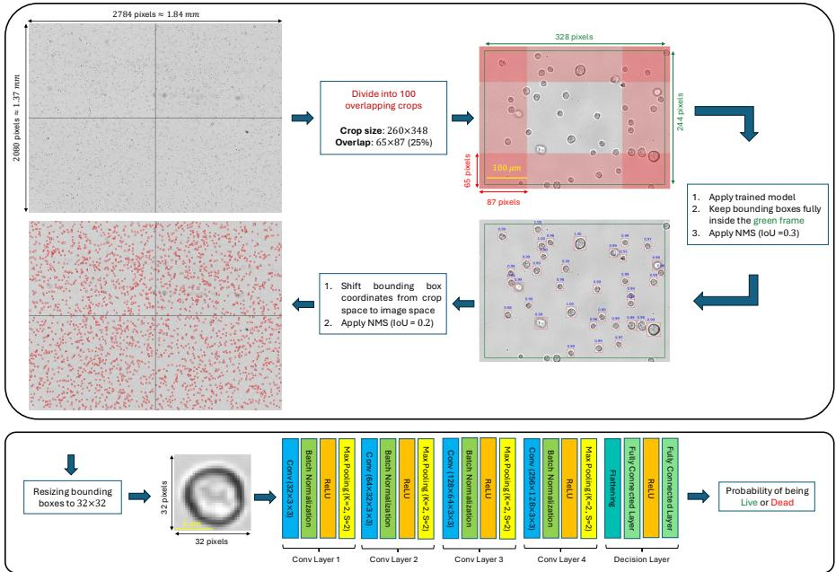  
Fig. 2. Overview of the cell detection and viability analysis pipeline. The brightfield image is divided into 100 overlapping crops (25% overlap in each direction), with red-shaded regions indicating overlap with adjacent crops. Each crop is independently fed into a trained model, and only bounding boxes falling fully within the green frame are retained to discard incomplete cells near boundaries. Non-Maximum Suppression (NMS) with an Intersection over Union (IoU) threshold of 0.3 is then applied to remove redundant detections within each crop. Bounding box coordinates are then shifted to full image space, where a second NMS (at ��� = 0.2) eliminates duplicate detections arising from cells appearing in red-shaded regions. Each detected cell is resized to 32×32 pixels and classified as live or dead by the CNN model.

## 2.3. Cell Detection

To isolate individual cells in transmitted-light images, several approaches have been proposed. Before the deep learning era, classical image-processing methods were the primary tools for cell detection and segmentation, relying on fixed pipelines such as edge detection and morphological processing (e.g. the Watershed approach [29]). However, these algorithms often struggle in the presence of overlapping cells. More recently, deep learning-based methods have emerged as a more robust alternative. In particular, instance segmentation and object detection models can directly predict pixel-level masks or bounding boxes for individual cells. By training on small clusters as well, architectures such as Mask R-CNN [30], Faster R-CNN [31], YOLO [32], and DETR [33] enable more accurate separation of overlapping cells in a broader range of environments.

Because our PLX dataset provides bounding boxes, we trained an object detector (using the Faster R-CNN architecture) rather than an instance segmentation model. The model used a ResNet-50-FPN [34] backbone initialized with weights pretrained on the COCO dataset [35] and was fine-tuned for binary detection (cell vs. background). Training directly on full-resolution (2080 × 2784) images led to poor performance due to the large image area and relatively small cell size. We therefore divided each image into 100 overlapping crops of size 260 × 348 pixels. The training set consisted of 45 stained images, resulting in a total of 4,500 crops. Bounding-box annotations provided by PLX were used as ground-truth labels. Input images were standardized using the dataset mean and standard deviation before training. The model was trained for 25 epochs with a batch size of 4 using stochastic gradient descent with a learning rate of 0.001, momentum of 0.9, and weight decay of $5 \times 1 0 ^ { - \hat { 4 } }$

The inference process is shown in Fig. 2. At inference, each image was divided into 100 overlapping crops matching the training resolution, with 25% overlap in both dimensions to ensure that cells near the boundaries appeared fully within at least one crop. Each crop was independently fed into a trained model, and only bounding boxes falling fully within the central safe zone were retained to discard incomplete cells near the crop boundaries. Since object detectors typically return multiple overlapping bounding boxes per object, NMS [36] (with $I o U = 0 . 3 )$ was applied to remove redundant detections within each crop. Bounding box coordinates were then shifted to the full image space.

Since a cell may appear in the overlapping regions of adjacent crops, a second NMS (with $I o U = 0 . 2 )$ was applied to eliminate duplicate detections between crops. To maintain fixed-size inputs for the classification models, each detected cell was resized to $3 2 \times 3 2 { \mathrm { p x } }$ and fed into the CNN. This size was selected because 95% of cells were $1 9 \times 1 8$ px or smaller, while preserving aspect ratio and minimizing distortion for most cells. Anti-aliasing was applied during resizing to avoid downsampling artifacts for larger cells.

## 2.4. Cell Classification

We trained a compact CNN classifier (Fig. 2) on 137,434 annotated cells (120,983 live and 16,451 dead) from 60 stained images to predict cell viability. The dataset was split into 80% training and 20% validation, preserving the label distribution across both subsets. It was trained using cross-entropy loss and the Adam optimizer [37] with a learning rate of $1 0 ^ { - 6 }$ for 50 epochs. The CNN has 651, 234 learnable parameters and requires 14.96 million FLOPs, with an inference time of approximately 0.50 ms per-sample on an NVIDIA A100 GPU. Once the model is trained, it can be applied to individual cell patches from either stained or unstained images. Since the model outputs a two-element softmax vector (probability of live vs. dead), the final label is assigned with a 0.5 decision threshold.

## 2.5. Evaluation Metrics

We provide separate evaluation metrics for both cell detection and classification stages of the pipeline, along with an end-to-end evaluation metric for viability analysis on unstained samples. For cell detection on stained samples, we report precision, recall, F1-score, and mean Average Precision (mAP) at an IoU threshold of 0.5 using PLX bounding box annotations as the reference (exact definitions in Supplement 1). We also compare methods based on total cell counts. Since reference bounding boxes are not available for unstained images, evaluation on these samples is limited to total cell counts and qualitative visual comparison.

Classifier performance is evaluated on both the training and validation sets using the confusion matrix, overall accuracy, precision, recall, and F1-score. Due to the class imbalance (88% live cells), precision, recall, and F1-score are computed with respect to the dead (minority) class. Additionally, we report the receiver operating characteristic (ROC) curve, area under the curve (AUC), and the precision–recall curve.

Sample-level viability is quantified as the number of live cells divided by the total number of cells. We applied our full pipeline to 15 stained and unstained image pairs. Since PLX provides viability measurements only for stained samples, we treat PLX measured viability of each stained image as the reference for its corresponding unstained pair. Overall performance is summarized by the mean absolute error (MAE) and coeficient of determination $( R ^ { 2 }$ score).

## 3. Results

We first perform a calibration run using stained cells to determine whether live and dead cell populations exhibit distinct signatures under brightfield imaging. We then perform the same analysis to show that stained and unstained cells share suficiently similar image features to allow a model trained on stained samples to generalize to unstained ones. We then present results for the cell detection, cell viability classifier, and an end-to-end evaluation of our pipeline on unstained samples.

## 3.1. Live and Dead Cell Discrimination in Brightfield Imaging

Our hypothesis is that live and dead cell populations exhibit suficient diferences in brightfield images that they can be distinguished by their morphology alone. To test this, we use unsupervised machine learning to compare individual cell images and sort them into representative groups. For simplicity of presentation, we map the original high-dimensional space of the images into a 2D scatter plots. After running the algorithms, interpretation of the resulting clusters is assisted by applying the PLX labels for cell detection and viability labeling.

We applied three dimensionality reduction algorithms to the cell populations (vectorized and standardized prior to dimensionality reduction): Principal Component Analysis (PCA) [38], t-distributed Stochastic Neighbor Embedding (t-SNE) [39], and Uniform Manifold Approximation and Projection (UMAP) [40]. PCA projects data onto directions of maximum variance, providing a linear view of the feature space. t-SNE and UMAP are nonlinear methods that preserve both local and global structure by grouping similar samples and separating dissimilar ones in a low-dimensional embedding [41]. UMAP has been used for similar tasks, including rare cell population detection [42], RNA sequencing visualization [43], arrhythmia detection in cardiac waveforms [44], and phenotyping microglial cells [45].

Results of the 2D embeddings are shown in Fig. 3. To create a 2D plot using PCA, we keep only the first two principal components (a poor cutof in this case, as they capture only ∼30% of the total variance). In the raw output, i.e. without added labels, the points overlap, and there is no way to distinguish live vs. dead cells; adding labels reveals their positions, showing that the cells below the diagonal are mostly live. t-SNE and UMAP, however, produce much more noticeable separation between live and dead cell populations, due to their ability to preserve local nonlinear structure that a linear mapping cannot capture.

To further characterize the image features of live and dead populations, we computed the average Fourier spectrum across all live and dead cells [22]. As shown in Fig. 3, live cells exhibit markedly higher frequency content than dead cells, particularly along the principal frequency axes. This is consistent with the biological expectation that live cells possess sharper, more well-defined membrane boundaries and denser intracellular structure, both of which contribute to stronger high-frequency components in the Fourier domain. Dead cells exhibit smoother and more difuse intensity profiles, esp. in the tails of the distribution, reflecting membrane degradation and loss of structural integrity.

A common way to quantitatively assess the separation is to train a �-nearest-neighbors (KNN) classifier directly on the 2D embeddings, which assigns each point the majority label among its � nearest neighbors in the embedding space [40]. This measures how well live and dead cells are grouped within their own population and separated from the other in the 2D space. t-SNE and UMAP achieve an accuracy of up to ∼95% and an F1-score of ∼0.80 across a range of � values. We also applied the same KNN classification to the original high-dimensional cell representations, which yielded comparable performance to t-SNE and UMAP, indicating nonlinear embeddings largely preserve the local structure relevant to distinguishing live and dead cells. Together, these results indicate that live and dead cells occupy distinct regions of the image-feature space, and and this low-dimensional separation reflects the structure of the original high-dimensional cell.

Closer inspection of the UMAP embedding in Fig. 4 reveals that the dead-cell population decomposes into two morphologically distinct sub-clusters. The first (red cluster) consists of cells that appear predominantly white and featureless, with the membrane outline still visible but a marked loss or degradation of intracellular content. The second (blue cluster) comprises cells with a heterogeneous appearance, with a visible but less distinct membrane outline. We speculate that the red cluster may reflect a later stage of cell death in which membrane permeabilization has led to substantial loss or degradation of intracellular content, producing a homogeneous appearance. The blue cluster, retaining a faint but discernible membrane outline is broadly consistent with reports that membrane-compromised cells appear as a blurred halo in brightfield imagery [46], and may represent an earlier or otherwise distinct stage of membrane degradation.

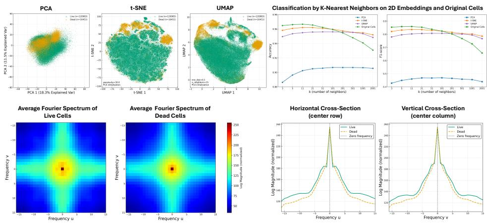  
Fig. 3. Comparison of live and dead cells under brightfield imaging. Top row: Two-dimensional embeddings obtained via PCA, t-SNE, and UMAP, computed from 137,434 stained cells captured from 60 samples. Live cells are shown in green and dead cells in red. A k-NN classifier is applied to the 2D embeddings and original cells for live vs. dead classification, as shown in the rightmost panel. Bottom row: Average Fourier spectra of live and dead cell patches (left two panels) and their horizontal and vertical cross-sections through the frequency origin (right two panels).

The ability to distinguish morphologically distinct dead-cell subpopulations highlights a key advantage of unsupervised representation learning: unlike supervised classifiers that collapse all dead cells into a single label, unsupervised embeddings preserve morphological diversity, enabling cell phenotyping without any label. Live cells (green cluster), by contrast, have sharp membrane boundaries and moderate intracellular texture. The UMAP embedding also exposes a cluster of irregular crops (cyan cluster). These may be attributable to overlapping cells, where the bounding box inevitably includes a small portion of an adjacent cell. They may also result from PLX detection errors where the cell body extends beyond the patch boundary. The separation of these malformed samples from the main clusters demonstrates that UMAP can efectively identify outlier samples in the dataset [44, 47]. Removing these samples improves dataset quality and leads to more consistent training.

## 3.2. Similarity of Stained and Unstained Cells in Brightfield Imaging

Our unsupervised methods allow us to prove a key assumption underlying all previous imaging in cell classification: that unstained brightfield cell images suficiently resemble their stained counterparts, such that a model trained on stained images can generalize to unstained ones. (Proving this also motivated our use of fluorescent staining to generate cell viability ground truth, rather than visible exclusion stains such as trypan blue or erythrosin B, which would dramatically alter the brightfield appearance of the cells.) For confirmation, we collected populations of unpaired stained and unstained individual cells, where cell extraction in both conditions was performed using our trained model to ensure consistency. Although the stained and unstained images come from the same bioreactor sample, no one-to-one correspondence between individual cells across the two conditions can be established. This is because adding the stain and mixing disturbs the cells’ positions within the well, making it impossible to track and image the same individual cells before and after staining.

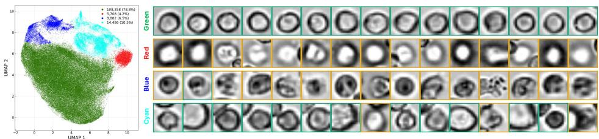  
Fig. 4. Unsupervised phenotyping of live and dead cells via UMAP. Left: UMAP embedding colored by cluster, with clusters manually determined based on visual separation. Right: representative brightfield cell patches from each cluster. Green and yellow frames around each cell represent live and dead, respectively.

As shown in Fig. 5, applying PCA, t-SNE, and UMAP to the cell populations produces intermixing of stained and unstained cells in the projected 2D space. This indicates that the two populations occupy overlapping regions of the feature space. To quantify this, we trained the same KNN classifier used in our live/dead analysis to distinguish stained from unstained cells. Across all four representations, including the original high-dimensional cells, classification accuracy remains low (∼56–68%) and close to chance level, well below the ∼95% accuracy achieved on the live/dead task. Likewise, the Fourier profiles of stained vs. unstained cells are nearly identical. Taken together, the results show that AO and PI staining does not substantially alter cell appearance under brightfield imaging.

## 3.3. Cell Detection Performance

We compared the trained model against three baselines: (1) the Cellaca™ PLX image cytometer, (2) a classical image-processing pipeline (details in Supplement 1), and (3) the pre-trained Cellpose [48]. Fig. 6 shows qualitative detection results on stained and unstained images (more examples in Supplement 1). PLX provides bounding-box annotations only for stained samples - and thus is not applicable in label-free settings - and its system misses a noticeable number of cells. However, these cells still exhibit fluorescence signals, suggesting that the omissions are likely due to limitations of the detection algorithm rather than any biological diference. The image-processing pipeline performs well on isolated cells but struggles to accurately resolve overlapping or aggregated cells (known as cell clumping). On the other hand, localizing and studying cell clumps may itself be of interest, and image processing can provide bounding boxes for these scenarios. Despite its limitations at the instance level, it can also provide a lower bound on the total number of cells in the sample (as all cells within a clump are counted as a single detection). Cellpose struggles with cells exhibiting a white appearance, which are primarily dead cells, and often produces inaccurate segmentation, including overly large merged regions or excessively small spurious detections. In contrast, our approach can detect cells even within tightly clustered regions. Further, it provides a confidence score for each prediction, which can be used to filter out low-confidence detections and improve robustness.

Table 1 reports detection performance for all four methods on stained and unstained images. For stained samples, we report cell counts, precision, recall, F1-score, and mAP; for unstained samples we report only cell counts due to the absence of reference annotations. For cell counts, our method detects approximately 17% more cells compared to the PLX measurement (on the training set). Visual inspection across diferent samples suggests that our method is able to recover missed or inaccurate bounding boxes. This also suggests that training on a large set of imperfect annotations may allow a deep learning model to generalize beyond individual annotation errors and recover missed cells. Cellpose detects slightly more cells than our method, but visual inspection indicates that some of these detections correspond to very small false-positive cells or large bounding boxes that do not correspond to individual cells. Overall, our method achieves the best performance across most evaluation metrics, with ��� ≥ 0.9 on both the training and test sets.

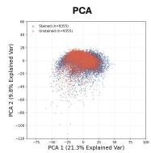

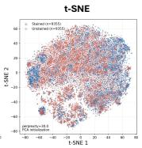

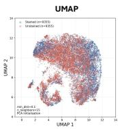

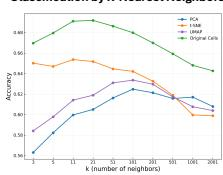

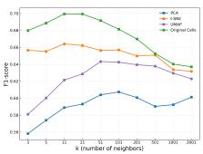

Stained Cells Unstained ○○○○○○○ Cells  
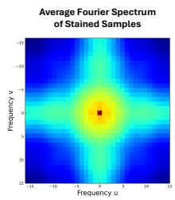

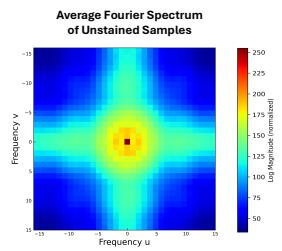

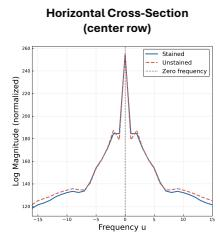

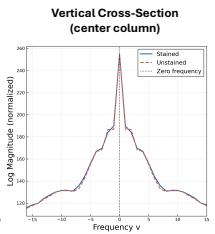  
Fig. 5. Comparison of stained and unstained cells under brightfield imaging. Top row: 2D embeddings obtained via PCA, t-SNE, and UMAP, computed from 18,710 cells captured from 15 stained and unstained image pairs. Unstained patches were randomly subsampled to match the stained count; the two sets are not paired one-to-one. Middle row: 20 examples of stained and unstained cells. Bottom row: Average Fourier spectra of stained and unstained cellS (left two panels) and their horizontal and vertical cross-sections through the frequency origin (right two panels).

Cell appearance can vary across focal planes, and the detection model should remain robust to such focus-dependent changes. To verify this, we evaluated the pipeline on a focal stack acquired at a fixed field of view, with ten diferent focal planes (Fig. 7; additional example in Supplement 1). Due to slight sample movement during acquisition, cells are not perfectly registered across planes, with some entering or leaving the field of view. Despite this, the model consistently detected 50 ± 2 cells across all of the focal range and correctly identify all of the cells within each focal plane.

## 3.4. Cell Classification Performance

As shown in Fig. 8, the CNN model achieves 98.64% accuracy (F1-score = 0.94) on the training set and 98.10% accuracy (F1-score = 0.92) on the validation set, with AUC values of 0.9978 and 0.9958, respectively. The precision-recall curves further support strong classification performance, with average precision of 0.9858 on training and 0.9749 on validation. The loss and accuracy curves in Fig. 8 show close agreement between training and validation across epochs, confirming that the model generalizes well without overfitting.

Table 1. Cell detection results on stained and unstained samples. PLX serves as the reference measurement; since it only provides bounding-box annotations for stained samples, some unstained metrics are marked NA.
<table><tr><td rowspan="2"></td><td rowspan="2">Samples</td><td colspan="4">Total Cell Count</td><td colspan="3">Precision / Recall / F1</td><td rowspan="2">mAP</td></tr><tr><td>PLX</td><td>Img. Proc.</td><td>Cellpose [48]</td><td>Ours</td><td>Img. Proc.</td><td>Cellpose [48]</td><td>Ours</td></tr><tr><td>Train</td><td>45 stained samples</td><td>112,947</td><td>105,190</td><td>136,334</td><td>132,680</td><td>0.56 / 0.52 / 0.53</td><td>0.76 / 0.89 / 0.81</td><td>0.84 / 0.95 / 0.89</td><td>0.90</td></tr><tr><td rowspan="2">Test</td><td>30 stained samples</td><td>32,543</td><td>29,000</td><td>33,868</td><td>33,083</td><td>0.80 / 0.73 / 0.76</td><td>0.80 / 0.83 / 0.81</td><td>0.92 / 0.95 / 0.94</td><td>0.93</td></tr><tr><td>15 unstained samples</td><td>NA</td><td>14,305</td><td>17,667</td><td>16,889</td><td>NA</td><td>NA</td><td>NA</td><td>NA</td></tr></table>

## 3.5. End-to-End Viability Prediction

We applied our pipeline to 15 samples with paired stained and unstained images, with PLX viability measurements on stained samples serving as reference. Sample-level viability is predicted with our pipeline, and performance is evaluated using both MAE and the $R ^ { 2 }$ score, with 90% confidence intervals (CI) obtained via bootstrap resampling. Results are summarized in Fig. 9.

For stained samples, we achieved an MAE of 3.57% (90% CI: [2.75, 4.47]) and $R ^ { 2 }$ of 0.82 (90% CI: [0.60, 0.92]). The scatter plot shows our predictions falling slightly below PLX measurements across most samples; a potential reason is that our detection model identifies more cells than PLX, and these additional cells tend to have lower viability, which pulls down the overall sample-level estimate. A population-level analysis using the unsupervised algorithm UMAP. For stained samples, where ground-truth labels are available, UMAP is applied to cells extracted and labeled by PLX, revealing visually separable live and dead clusters. By visualizing representative examples from each cluster in the UMAP plot (Fig. 9), we observe distinct morphological patterns: Cluster 1 consists of sharp, well-defined cells that are predominantly live; Cluster 2 contains featureless, translucent cells lacking internal structure; Cluster 3 comprises fuzzy, blurred cells that frequently contain a small dark internal punctum, which may correspond to a condensed nucleus or debris material; and Cluster 4 captures image patches containing multiple adjoining cells, likely corresponding to cells undergoing division.

For unstained samples, we achieved an MAE of 2.68% (90% CI: [1.72, 3.89]) and $R ^ { 2 }$ of 0.85 (90% CI: [0.73, 0.93]). We conducted an analogous UMAP analysis, where cells are extracted using the trained model and labeled with the CNN classifier. Predicted dead cells are grouped closely together in the embedding, and again we observe four main clusters,suggesting that the CNN has learned discriminative features that generalize beyond stained samples. Examining representative unstained cells from the UMAP embedding reveals morphological patterns that closely mirror those observed in the stained samples: Cluster 1 again consists of sharp cells that are predominantly predicted live; Cluster 2 contains cells with a white appearance resembling those in stained Cluster 2 and is mostly predicted as dead; Cluster 3 comprises the majority of predicted-dead cells, which appear fuzzy and blurred; and Cluster 4 similarly captures image patches with multiple adjoining cells, likely corresponding to cells undergoing division. This correspondence suggests that the visual features distinguishing live and dead cells are largely preserved between stained and unstained imaging, supporting the CNN’s ability to generalize across modalities.

## 4. Discussion

Our results demonstrate that deep-learning-based cell detection and classification can predict sample-level viability directly from unstained brightfield images, closely matching the reference measurements obtained from stained samples. Compared to virtual staining approaches, which predict fluorescence images from brightfield inputs and require cell counting and viability analysis as a subsequent post-processing step, our method produces per-cell viability predictions directly. Virtual staining also inherits an ambiguity present in physical staining: some cells appear in both fluorescent channels simultaneously, and a virtual staining model can replicate this efect, making viability classification more ill-defined. The detection-and-classification paradigm avoids these issues entirely. Furthermore, the output of the classifier provides a continuous probability of being live or dead rather than a hard binary label, ofering a more quantitative and nuanced characterization of cell viability. The temperature parameter of the softmax can also be adjusted before training to control the sharpness of these probabilities, allowing more or less deterministic predictions. A similar score is available from the detection stage, where the objectness confidence can be used to filter out low-quality bounding box proposals. A natural future direction is to train on paired brightfield and fluorescence crops of single cells (e.g., virtual staining at the single-cell level) to provide richer information about cell health while remaining compatible with the detection-then-classification paradigm introduced here.

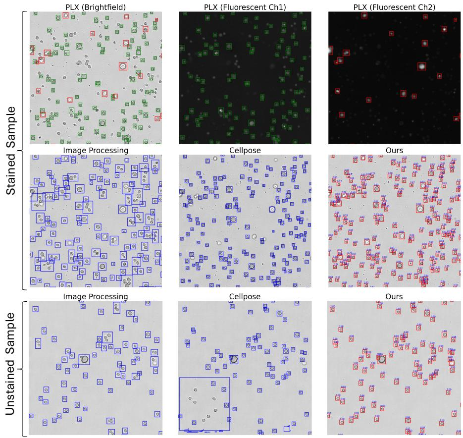  
Fig. 6. Qualitative comparison of cell detection methods on stained and unstained brightfield images. Top two rows: PLX output used as reference annotation, shown alongside its two fluorescent channels: Ch1 (live cells, green bounding boxes) and Ch2 (dead cells, red bounding boxes). Detection results from the image-processing baseline, Cellpose, and our model are shown; confidence scores on our model’s detections reflect the predicted probability of each proposal being a cell. Bottom row: Bounding boxes from aforementioned methods on unstained samples. PLX relies on fluorescent channels and therefore does not support unstained samples.

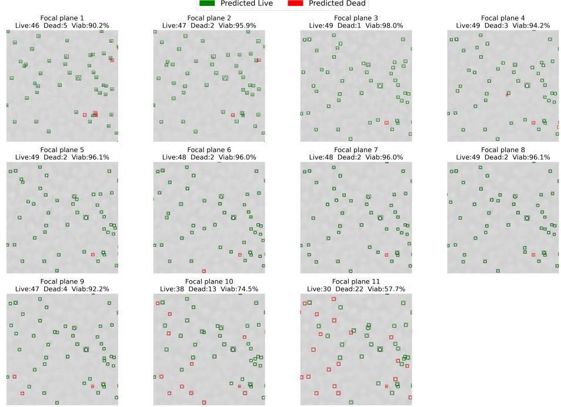  
Fig. 7. Performance of our pipeline on cells under ten diferent focal planes. Cell appearance changes across focal planes, and while detection remains robust, the viability classifier can be more sensitive to focal planes outside its training distribution. Cells are also moving, so frames are not perfectly registrable. The video is available here.

Several factors can influence pipeline performance. Focal plane is one such factor: as shown in Fig. 7, predictions on the same cell captured at diferent depths can vary, particularly for the viability classifier, which may not have been exposed to all focal planes during training. Nevertheless, a focal stack of individual cells opens the opportunity for three-dimensional reconstruction of cell structure [49], which could potentially improve viability classification. Bounding box accuracy is another source of variability: the same cell classified under slightly shifted bounding boxes can receive diferent viability labels, as the crop content changes. One way to address this is to jointly train the detector and classifier by optimizing the detector for live, dead, and background classes rather than cell versus background alone. However, since object detectors return multiple overlapping proposals per cell and each potentially receiving a diferent live/dead prediction, this formulation complicates downstream NMS and requires careful design, unless using architectures that avoid NMS altogether, such as DETR [33]. In addition, because individual cells are small relative to the original image, the trained model must be applied to smaller regions. Rather than manually cropping these regions, the bounding boxes generated by image processing can provide candidate cell regions with fewer overlapping cells, which can then be processed by the trained model.

In Supplement 1, we repeat all experiments using a higher-resolution microscope across diferent imaging modalities and focal planes, and results remain consistent, supporting the generalizability of our claims. When multiple modalities or focal planes are available at training time, multi-modal learning can further improve performance over any single modality. Finally, we have shown that nonlinear dimensionality reduction via UMAP enables unsupervised phenotyping of live and dead cell populations. In the multi-modal setting, manifold alignment ofers a complementary tool: by mapping cell representations from diferent imaging conditions onto a shared low-dimensional space, it can enhance the discriminability of live and dead populations across modalities and facilitate knowledge transfer between imaging conditions [50].

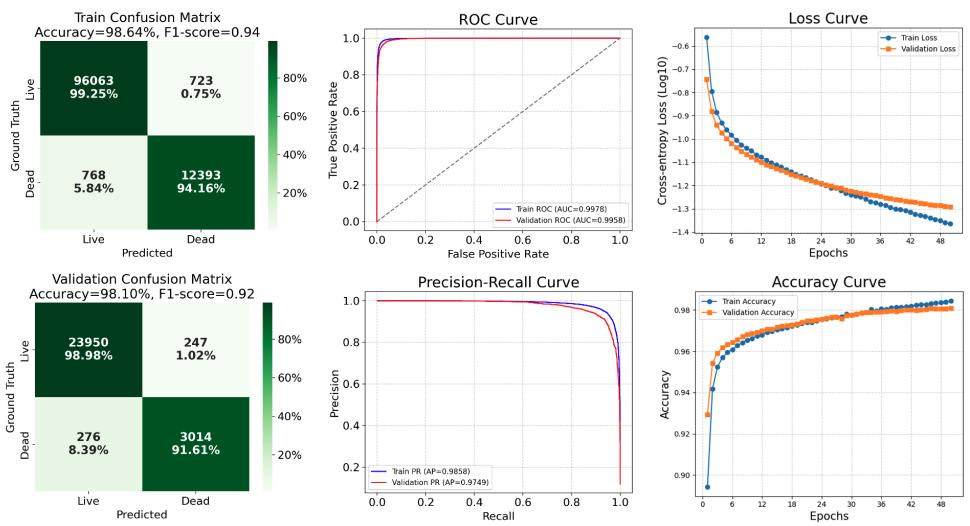  
Fig. 8. Performance of the binary cell viability classifier. Left: training and validation confusion matrices. Middle: ROC curve and precision-recall curve. Right: loss and accuracy curves across 50 epochs.

## 5. Conclusion

We presented an deep-learning-based pipeline for cell viability assessment directly from unstained brightfield images. We first established that live and dead cells exhibit distinct morphological signatures under stained brightfield imaging, and that stained and unstained cells share closely matched image features. These two findings jointly justify training on stained samples and deploying on unstained ones. Our pipeline combines a cell detection model for localizing individual cells with a compact CNN classifier for live/dead prediction, achieving a mean absolute error of 2.68% on unstained CHO cells across a wide range of viability conditions. These results open new possibilities for continuous, non-invasive monitoring of cell health.

## Funding

The authors gratefully acknowledge financial support from Waters Corporation.

## Acknowledgments

Portions of this work were previously presented at the Optica Biophotonics Congress 2026 [50] and at Frontiers in Optics + Laser Science (FiO+LS) 2026.

## Disclosures

The authors declare that there are no conflicts of interest related to this article.

## Data Availability

The dataset supporting this study is publicly available here.

Supplemental document. See Supplement 1 for supporting content.

Stained

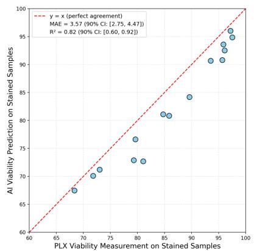

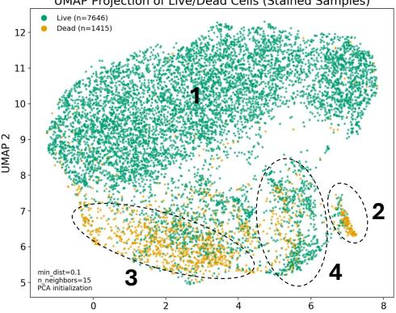

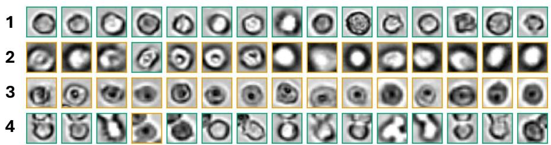  
Unstained

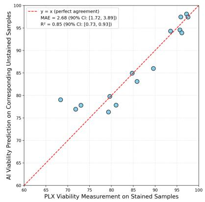

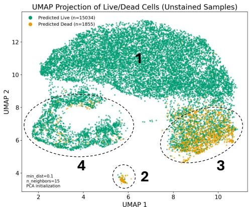

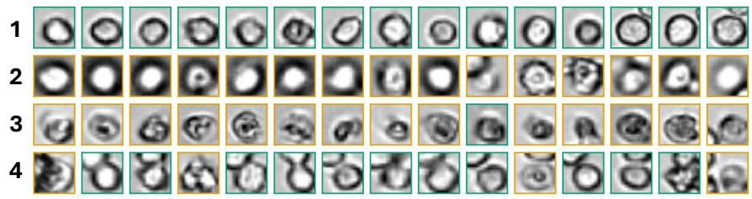  
Fig. 9. Sample-level viability predictions and UMAP projections for stained and unstained samples. Scatter plots show predicted viability against PLX viability measurement, with the dashed line indicating perfect agreement. UMAP projections show live (green) and dead (yellow) cell populations, where stained samples use PLX-measured labels and unstained samples use CNN-predicted labels. Representative cell image samples from each cluster are shown below the corresponding UMAP projection.

## References

1. I. Jyothilekshmi and N. S. Jayaprakash, “Trends in monoclonal antibody production using various bioreactor systems,” J. Microbiol. Biotechnol. 31, 349–357 (2021).

2. F. M. Wurm, “Production of recombinant protein therapeutics in cultivated mammalian cells,” Nat. Biotechnol. 22, 1393–1398 (2004).

3. J. Y. Kim, Y.-G. Kim, and G. M. Lee, “Cho cells in biotechnology for production of recombinant proteins: current state and further potential,” Appl. Microbiol. Biotechnol. 93, 917–930 (2012).

4. P. Verdin, “Top companies and drugs by sales in 2023,” Nat. Rev. Drug Discov. 23, 240 (2024).

5. A. C. Martins, F. Albericio, and B. G. de la Torre, “Fda approvals of biologics in 2022,” Biomedicines 11 (2023).

6. O. L. Reddy, D. F. Stroncek, and S. R. Panch, “Improving car t cell therapy by optimizing critical quality attributes,” Semin. Hematol. 57, 33–38 (2020). Transfusion Support in Patients with Hematologic Disease: Transfusions in Special Clinical Circumstances.

7. Y. Cai, M. Prochazkova, Y.-S. Kim, et al., “Assessment and comparison of viability assays for cellular products,” Cytotherapy 26, 201–209 (2024).

8. K. V. Naveen, A. Tyagi, O. M. H. Ibrahium, et al., “From dye exclusion to high-throughput screening: A review of cell viability assays and their applications,” Biotechnol. Adv. 87, 108764 (2026).

9. F. Piccinini, A. Tesei, C. Arienti et al., “Cell counting and viability assessment of 2d and 3d cell cultures: Expected reliability of the trypan blue assay,” Biol. Proced. Online 19, 8 (2017).

10. A. K. H. Kwok, C.-K. Yeung, T. Y. Y. Lai, et al., “Efects of trypan blue on cell viability and gene expression in human retinal pigment epithelial cells,” Br. J. Ophthalmol. 88, 1590–1594 (2004).

11. L. L.-Y. Chan, D. Kuksin, D. J. Laverty, et al., “Morphological observation and analysis using automated image cytometry for the comparison of trypan blue and fluorescence-based viability detection method,” Cytotechnology 67, 461–473 (2015).

12. L. L.-Y. Chan, W. L. Rice, and J. Qiu, “Observation and quantification of the morphological efect of trypan blue rupturing dead or dying cells,” PLOS ONE 15, 1–17 (2020).

13. H. M. Davey and P. Hexley, “Red but not dead? membranes of stressed saccharomyces cerevisiae are permeable to propidium iodide,” Environ. Microbiol. 13, 163–171 (2011).

14. J. W. Lichtman and J.-A. Conchello, “Fluorescence microscopy,” Nat. Methods 2, 910–919 (2005).

15. Z. X. Chan, S. P. Chelvam, W.-X. Sin, et al., “Automated, aseptic sampling with small-volume capacity from microbioreactors for cell therapy process analysis,” Front. Bioeng. Biotechnol. Volume 13 - 2025 (2025).

16. O. Ronneberger, P. Fischer, and T. Brox, “U-net: Convolutional networks for biomedical image segmentation,” in Medical Image Computing and Computer-Assisted Intervention – MICCAI 2015, N. Navab, J. Hornegger, W. M. Wells, and A. F. Frangi, eds. (Springer International Publishing, Cham, 2015), pp. 234–241.

17. C. Hu, S. He, Y. J. Lee, et al., “Live-dead assay on unlabeled cells using phase imaging with computational specificity,” Nat. Commun. 13, 713 (2022).

18. E. M. Christiansen, S. J. Yang, D. M. Ando, et al., “In silico labeling: Predicting fluorescent labels in unlabeled images,” Cell 173, 792–803.e19 (2018).

19. Y. Liu, H. Yuan, Z. Wang, and S. Ji, “Global pixel transformers for virtual staining of microscopy images,” IEEE Trans. on Med. Imaging 39, 2256–2266 (2020).

20. Y. Rivenson, T. Liu, Z. Wei, et al., “Phasestain: the digital staining of label-free quantitative phase microscopy images using deep learning,” Light. Sci. & Appl. 8, 23 (2019).

21. X. Chen, Y. Li, N. Wyman, et al., “Deep learning provides high accuracy in automated chondrocyte viability assessment in articular cartilage using nonlinear optical microscopy,” Biomed. Opt. Express 12, 2759–2772 (2021).

22. S. Park, V. Veluvolu, W. S. Martin, et al., “Label-free, non-invasive, and repeatable cell viability bioassay using dynamic full-field optical coherence microscopy and supervised machine learning,” Biomed. Opt. Express 13, 3187–3194 (2022).

23. F. Eren, M. Aslan, D. Kanarya, et al., “Deepcan: A modular deep learning system for automated cell counting and viability analysis,” IEEE J. Biomed. Health Informatics 26, 5575–5583 (2022).

24. B. Li, Z. Song, L. Shi, et al., “Label-free viability detection of T-cells based on 2D bright-field microscopic images and deep learning,” in Biophysical Society ofGuangDong Province Academic Forum: Precise Photons and Life Health (PPLH 2022), vol. 12603 S. Yang, ed., International Society for Optics and Photonics (SPIE, 2023), p. 126030D.

25. C. Serafini, V. Gorti, P. Casteleiro Costa et al., “Label-free in-line characterization of immune cell culture using quantitative phase imaging,” npj Regen. Med. 10, 56 (2025).

26. S. Li, Y. Li, J. Yao, et al., “Label-free classification of dead and live colonic adenocarcinoma cells based on 2d light scattering and deep learning analysis,” Cytom. Part A 99, 1134–1142 (2021)

27. E. Centofanti, A. Oyler-Yaniv, and J. Oyler-Yaniv, “Deep learning–based image classification reveals heterogeneous execution of cell death fates during viral infection,” Mol. Biol. Cell 36, ar29 (2025).

28. J. Verduijn, L. Van der Meeren, D. V. Krysko, and A. G. Skirtach, “Deep learning with digital holographic microscopy discriminates apoptosis and necroptosis,” Cell Death Discov. 7, 229 (2021).

29. L. Vincent and P. Soille, “Watersheds in digital spaces: an eficient algorithm based on immersion simulations,” IEEE Trans. on Pattern Anal. Mach. Intell. 13, 583–598 (1991).

30. K. He, G. Gkioxari, P. Dollár, and R. Girshick, “Mask r-cnn,” in 2017 IEEE International Conference on Computer

Vision (ICCV), (2017), pp. 2980–2988.

31. S. Ren, K. He, R. Girshick, and J. Sun, “Faster r-cnn: towards real-time object detection with region proposal networks,” in Proceedings ofthe 29th International Conference on Neural Information Processing Systems - Volume 1, (MIT Press, Cambridge, MA, USA, 2015), NIPS’15, p. 91–99.

32. J. Redmon, S. Divvala, R. Girshick, and A. Farhadi, “You only look once: Unified, real-time object detection,” in 2016 IEEE Conference on Computer Vision and Pattern Recognition (CVPR), (2016), pp. 779–788.

33. N. Carion, F. Massa, G. Synnaeve, et al., “End-to-end object detection with transformers,” in Computer Vision – ECCV 2020: 16th European Conference, Glasgow, UK, August 23–28, 2020, Proceedings, Part I, (Springer-Verlag, Berlin, Heidelberg, 2020), p. 213–229.

34. K. He, X. Zhang, S. Ren, and J. Sun, “Deep residual learning for image recognition,” in 2016 IEEE Conference on Computer Vision and Pattern Recognition (CVPR), (2016), pp. 770–778.

35. T.-Y. Lin, M. Maire, S. Belongie, et al., “Microsoft coco: Common objects in context,” in Computer Vision – ECCV 2014, D. Fleet, T. Pajdla, B. Schiele, and T. Tuytelaars, eds. (Springer International Publishing, Cham, 2014), pp. 740–755.

36. A. Neubeck and L. Van Gool, “Eficient non-maximum suppression,” in 18th International Conference on Pattern Recognition (ICPR’06), vol. 3 (2006), pp. 850–855.

37. D. P. Kingma and J. Ba, “Adam: A method for stochastic optimization,” (2017).

38. K. Pearson, “Liii. on lines and planes of closest fit to systems of points in space,” The London, Edinburgh, Dublin Philos. Mag. J. Sci. 2, 559–572 (1901).

39. L. van der Maaten and G. Hinton, “Visualizing data using t-sne,” J. Mach. Learn. Res. 9, 2579–2605 (2008).

40. L. McInnes, J. Healy, and J. Melville, “Umap: Uniform manifold approximation and projection for dimension reduction,” (2020).

41. M. T. Islam and J. W. Fleischer, “The Shape of Attraction in UMAP: Exploring the Embedding Forces in Dimensionality Reduction,” Trans. on Mach. Learn. Res. (2026).

42. L. Weijler, M. Diem, M. Reiter, and M. Maurer-Granofszky, “Detecting rare cell populations in flow cytometry data using umap,” in 2020 25th International Conference on Pattern Recognition (ICPR), (2021), pp. 4903–4909.

43. E. Becht, L. McInnes, J. Healy et al., “Dimensionality reduction for visualizing single-cell data using umap,” Nat. Biotechnol. 37, 38–44 (2019).

44. A. R. Vazifeh and J. W. Fleischer, “Manifold learning for personalized and label-free detection of cardiac arrhythmias,” Informatics Med. Unlocked 64, 101770 (2026).

45. G. Colombo, R. J. A. Cubero, L. Kanari et al., “A tool for mapping microglial morphology, morphomics, reveals brain-region and sex-dependent phenotypes,” Nat. Neurosci. 25, 1379–1393 (2022).

46. G. Pattarone, L. Acion, M. Simian, et al., “Learning deep features for dead and living breast cancer cell classification without staining,” Sci. Reports 11, 10304 (2021).

47. M. T. Islam and J. W. Fleischer, “Outlier detection in large radiological datasets using umap,” in Topology- and Graph-Informed Imaging Informatics, C. Chen, Y. Singh, and X. Hu, eds. (Springer Nature Switzerland, Cham, 2025), pp. 111–121.

48. C. Stringer, T. Wang, M. Michaelos, and M. Pachitariu, “Cellpose: a generalist algorithm for cellular segmentation,” Nat. Methods 18, 100–106 (2021).

49. N. C. Pegard and J. W. Fleischer, “Three-dimensional deconvolution microfluidic microscopy using a tilted channel,” J. Biomed. Opt. 18, 040503 (2013).

50. A. R. Vazifeh and J. W. Fleischer, “Manifold alignment for label-free cell phenotyping in multimodal microscopy,” in Optica Biophotonics Congress 2026, (Optica Publishing Group, 2026), p. MW1B.4.