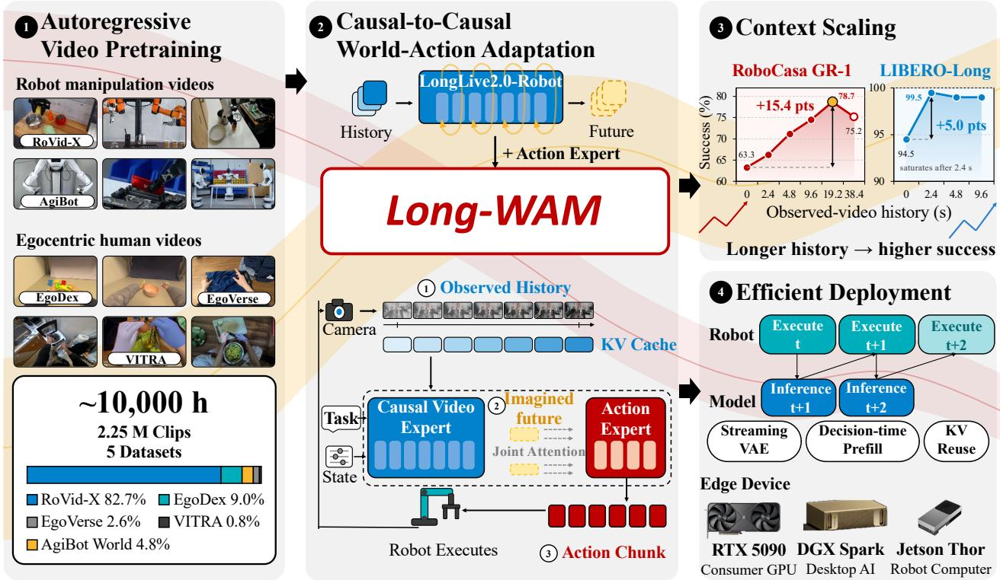

# Long-WAM: Scaling the Context of World-Action Models

Wei Huang1 3 \*, Bohan Zhang2 \*, Chenzhi Liu3 , Isabella Liu1 4, Shuai Yang1 , Weian Mao1 Luozhou Wang1, Yicheng Xiao3, Weifeng Lin1, Qixin Hu, Bryan Chu1, Sifei Liu1 Linxi “Jim” Fan1, Xiaojuan Qi3, Song Han1 2, Yukang Chen1

1NVIDIA 2MIT 3HKU 4UCSD

Equal contribution.

Code Project Page

Abstract: Real-time robot control demands enough visual history to infer motion and task progress, but processing that history can delay action. We present Long-WAM, a model–system framework for scaling the context of causal world-action models under real-time control constraints. Our central finding is that access to history is not the same as using it: longer histories pay off far more when the video foundation is pretrained autoregressively (AR). We first learn causal prediction from robot and egocentric videos without action labels, then preserve this history-to-future structure during world-action adaptation. On RoboCasa GR-1, increasing context from 0.0 to 19.2 seconds raises success from 63.3% to 78.7%, whereas a bidirectionally pretrained initialization shows no net gain; robot-domain AR pretraining further raises peak success on GR-1 and LIBERO-Long. Long-WAM also achieves the best results among compared methods on LIBERO-Long, RoboTwin 2.0, and DOMINO. Streaming observation encoding, asynchronous execution, and hardware-specific acceleration enable deployment on RTX 5090, DGX Spark, and Jetson AGX Thor without dropping future prediction; on RTX 5090, each action chunk, including future-video latent prediction, takes 107.4 ms. Real-time deployment on Unitree G1 and YAM supports dynamic and long-horizon manipulation, including 95% success on dynamic cup stacking, where $\pi _ { 0 . 5 }$ and Fast-WAM succeed in none of 20 trials. As a memory-informed executor, Long-WAM also complements higher-level planning in composite tasks.

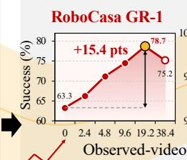

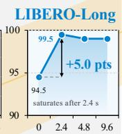  
Figure 1 | Overview of Long-WAM. (1) AR video pretraining. LongLive2.0-Robot learns predictive dynamics from approximately 10,000 window-equivalent hours of robot and egocentric videos. (2) Causal-to-causal adaptation. We preserve causal video dependencies while conditioning action-chunk denoising on observed history. (3) Context scaling. Relative to current-observation-only control, success increases from 63.3% to 78.7% on RoboCasa GR-1 and from 94.5% to 99.5% on LIBERO-Long, peaking at 19.2 and 2.4 seconds of history, respectively. (4) Efficient deployment. Asynchronous execution, streaming VAE encoding, decision-time prefill, within-call KV reuse, and hardware-specific acceleration enable real-time control on RTX 5090, DGX Spark, and Jetson AGX Thor.

## 1. Introduction

Fast robot control requires understanding how the scene is changing. A single image can reveal an object’s position but leave its motion and interaction progress ambiguous. World-action models (WAMs) bring video prediction to closed-loop control [3, 26, 52], making visual history a natural resource for action. Yet processing more history can delay the response it is meant to improve. We therefore ask: how does WAM control scale with visual context, and how can those gains be retained under real-time constraints?

Recent WAMs retain history through causal caches and persistent or selected memories [42, 44, 47, 50]. Yet access to history is distinct from learning to predict from it. DreamZero [52] and LingBot-VA [26] adapt bidirectionally pretrained video generators to causal video–action prediction, whereas LingBot-VA 2.0 [55] jointly pretrains causal video and learned latent actions. We investigate a complementary route: first learn autoregressive (AR) video prediction, then adapt to actions while preserving its history-to-future structure. Appendix 2 discusses related work.

We introduce Long-WAM (Figure 1), a model–system framework for context scaling in real-time robot control. Our central finding is that the value of longer context depends on how the video foundation is pretrained (Figure 6). On GR-1, both AR-pretrained foundations gain from extending context from 0.0 to 19.2 seconds, whereas a bidirectional initialization does not; the robot-domain AR model’s lead over it grows from 3.3 points without history to 17.1 points at 19.2 seconds. AR pretraining already learns the causal temporal factorization that WAM adaptation retains, giving the model a basis for using history rather than merely accessing it. Our LongLive2.0-Robot foundation learns from roughly 10,000 window-equivalent hours of robot and egocentric video; we preserve its causal structure during action adaptation, and robot-domain pretraining further raises peak success on both LIBERO-Long and GR-1.

Longer context helps only if the controller still responds in time, so we co-design asynchronous execution and edge acceleration while retaining future prediction. Predictive conditioning from the AR video foundation supports smooth action handoffs without blending or prefix guidance; streaming VAE encodes incoming observations while the robot executes, reducing post-trigger computation; and NVFP4 quantization with device-specific kernel tuning accelerates the video–action pipeline on RTX 5090, DGX Spark, and Jetson AGX Thor. With four denoising steps per expert, the optimized pipeline takes 107.4 ms per action chunk on RTX 5090, including the full observation VAE computation, a 3.3× speedup over BF16 eager execution (Section 4, Table 8).

On RoboCasa [33] GR-1 Tabletop [37], increasing the history window from 0.0 to 19.2 seconds raises success from 63.3% to 78.7% (+15.4 points). On LIBERO-Long [30], 2.4 seconds of history improves success from 94.5% to 99.5%. Long-WAM also achieves 94.4% average success on RoboTwin 2.0 [9] and 34.9% success on DOMINO [15], the highest among compared methods. On a Unitree G1, Long-WAM grasps cups from a conveyor moving at 7.5 cm/s in 90% of trials and stacks moving cups in 95%, settings in which neither $\pi _ { 0 . 5 }$ [38] nor Fast-WAM [54] succeeds once. On YAM, it completes tasks lasting over 40 seconds on average with 81.7% success, extending the evaluation from rapid interception to sustained execution. Long-WAM also serves as the executor of a hierarchical system on RoboCasa365 [34]: pairing its unchanged checkpoint with GPT-6 Astra raises overall success from 31.4% to 54.4%, versus 25.2% for the planner alone. Planner augmentation yields a larger gain for Long-WAM (+23.0 points) than for $\pi _ { 0 . 5 }$ (+13.6; Section 6), suggesting that stronger execution lets planning pay off more. Together, these results suggest that context is a resource for generative control whose value depends on both predictive pretraining and timely execution.

## 2. Related Work

World-action modeling from video generators. WAMs connect visual dynamics to executable actions. Motus [3] combines pretrained video, vision–language, and action experts; DreamZero [52] and LingBot-VA [26] adapt bidirectional video backbones to causal control. Their video pretraining supplies visual priors, while causal prediction and action coupling are learned downstream. LingBot-VA 2.0 [55] instead jointly pretrains causal video and learned latent actions in a shared representation. EVA [48] aligns video generation with executable actions through inverse-dynamics rewards, and $\omega { \mathrm { - E V A } }$ [45] evaluates latent action consequences. Long-WAM develops a staged route: action-free robot-video AR pretraining followed by action adaptation under the same causal ordering. The action model thus inherits a visual dynamics prior explicitly trained for history-to-future prediction, separating predictive pretraining from learning an embodiment’s action representation.

Memory and context scaling. Cache capacity, physical history duration, and the cost of rebuilding visual context are distinct quantities. Causal caches, compressed histories, and event retrieval provide complementary memory interfaces [26, 42, 44, 47, 50, 52]. Echo-Memory [25] studies memory for camera-conditioned video generation; RoboTTT [20] studies context scaling in robot policies; WAM-TTT [16] adapts memory from human video to steer a frozen WAM. Long-WAM studies the robot’s own observed interaction history: we vary its temporal extent across trained causal WAM variants and examine closed-loop success and online computation. Our focus is how predictive pretraining shapes the benefit of longer context, complementing work on memory compression, retrieval, and adaptation.

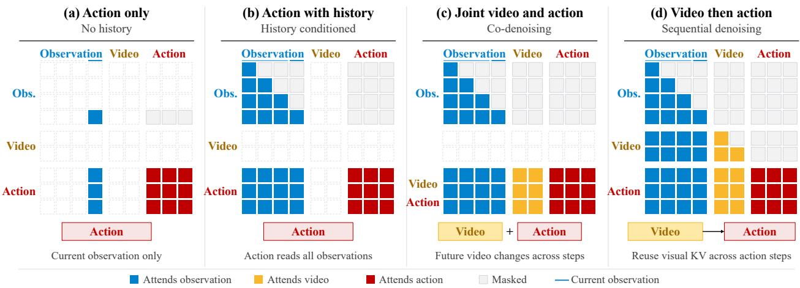  
Figure 2 | Attention patterns and video–action inference strategies. (a) Action generation from the current observation only; (b) history-conditioned action generation without future prediction; (c) joint video–action co-denoising (CoD); (d) video prediction followed by action denoising (IDM). IDM conditions actions on both observed history and predicted future latents, reusing visual KV across action-denoising steps.

Efficient and deployable generative control. Large video backbones make online WAM control expensive. Prior systems reduce this cost through caching, few-step generation, pipelined execution, action-only decoding, or hierarchical update rates [7, 26, 52, 54]. LongLive-2.0 further develops parallel AR training, compressed KV caches, low-precision execution, and asynchronous VAE decoding [11]. Complementary work on compilation, kernel orchestration, and video-DiT quantization reduces inference cost [2, 19, 57]. Asynchronous deployment additionally requires consistency between consecutive action chunks. Existing methods constrain these transitions through inference-time guidance, prefix-conditioned training, or denoising-time blending [5, 6, 29]. An empirical WAM study highlights the importance of temporal alignment and the precision–smoothness trade-offs of transition strategies [32]. Long-WAM exhibits robust continuity under direct asynchronous switching while retaining explicit future visual conditioning. We preserve this imagine-then-act path and address its sequential cost through streaming observation encoding and device-specific acceleration, targeting continuity and speed together.

## 3. Scaling the Context of WAMs from AR Video Generation

Long-WAM connects context scaling to the ability to predict physical evolution from history. We first learn robot motion and interaction dynamics through long-sequence AR video pretraining, then transfer this predictive foundation to action generation while preserving its causal temporal structure. The resulting policy conditions actions on both observed history and anticipated futures, making prediction an intermediate representation for control. We then study how the benefit of additional history depends on the video initialization, distinguishing access to a longer context from the learned ability to exploit it.

## 3.1. LongLive2.0-Robot: Robot-Domain AR Video Pretraining

Data and initialization. LongLive2.0-Robot continues training from LongLive-2.0’s 16-second AR checkpoint [11] on approximately 10,000 window-equivalent hours from RoVid-X [14], AgiBot World [1], EgoDex [18], EgoVerse [39], and VITRA [27]. Because supervision is video-only, the model can learn from multiple embodiments without requiring a shared action space. Appendix B.1 details the data accounting.

Teacher-forcing training. We pretrain on robot-video sequences up to 30 seconds long, exposing the model to extended motion and interaction histories. To support this temporal span, we adopt LongLive-2.0’s sequence-parallel AR training [11], which shards long sequences across GPUs. Following the teacher-forcing formulation for AR video generation [59], block-causal attention supervises every noisy chunk from its ground-truth prefix in parallel, while the conditioning image stays clean and outside the loss. We retain LongLive-2.0’s error recycling, derived from SVI [28]. For a clean target chunk $z _ { i } ,$ let $\bar { z } _ { i } , \bar { \epsilon } _ { i }$ , and $h _ { < i }$ denote the target latent, sampled Gaussian noise, and preceding ground-truth context after optional buffered-error perturbations. The noisy input and teacher-forcing objective are

$$
x _ { i } ^ { \sigma _ { i } } = ( 1 - \sigma _ { i } ) \bar { z } _ { i } + \sigma _ { i } \bar { \epsilon } _ { i } , \qquad \sigma _ { i } \in [ 0 , 1 ] ,\tag{1}
$$

$$
\mathcal { L } _ { \mathrm { T F - A R } } = \mathbb { E } \Bigl [ w ( \sigma _ { i } ) \lVert v _ { \theta } ( x _ { i } ^ { \sigma _ { i } } , \sigma _ { i } \mid h _ { < i } , c ) - ( \bar { \epsilon } _ { i } - z _ { i } ) \rVert _ { 2 } ^ { 2 } \Bigr ] .\tag{2}
$$

Here $\sigma _ { i }$ is the sampled noise level, $v _ { \theta }$ the video velocity predictor, � the language condition, and � the scheduler weight. The recovery target retains the original $z _ { i }$ , teaching correction of rollout-like errors. Given one image and a language prompt, the model predicts coherent robot motion and object interactions (Appendix C), providing a predictive prior for action adaptation.

## 3.2. Causal-to-Causal World-Action Adaptation

Causal coupling. Following DreamZero [52] and LingBot-VA [26], we couple video and action experts through an asymmetric interface. Video queries read only their own and earlier visual blocks, never action tokens; action queries read observed history, partially denoised futures, and the entire noisy action chunk. This preserves pretrained causal visual dependencies while grounding actions in both past and anticipated interaction. Crucially, the history-to-future ordering is learned during video pretraining, not introduced only at action adaptation. At a decision made at control step �, let $Z _ { t } ^ { - }$ denote observed video latents, $q _ { t }$ the robot state, � the language instruction, and ${ \bf A } _ { t } = a _ { t : t + H - 1 }$ an �-step action chunk. The video expert � predicts $K _ { v }$ future latent steps $\widetilde { Z } _ { t } ^ { + }$ to noise level $\sigma _ { \star } \in ( 0 , 1 )$ , then supplies their joint visual cache $\textstyle { \mathcal { K } } _ { t }$ to action expert �:

$$
\begin{array} { r l } & { \widetilde { Z } _ { t } ^ { + } = \mathrm { R o l l o u t } _ { \theta , \sigma _ { \star } } ( \epsilon ^ { v } \mid Z _ { t } ^ { - } , c , q _ { t } ) , \quad \mathcal { K } _ { t } = \mathrm { P r e f l l } _ { \theta } ( Z _ { t } ^ { - } , \widetilde { Z } _ { t } ^ { + } ; c , q _ { t } , \sigma _ { \star } ) , } \\ & { \widehat { \mathbf { A } } _ { t } = \mathrm { D e n o i s e } _ { \psi } ( \epsilon ^ { a } \mid { \cal K } _ { t } , c , q _ { t } ) . } \end{array}\tag{3}
$$

Here $\epsilon ^ { v }$ and $\epsilon ^ { a }$ are independent Gaussian noise, $\textstyle { \mathcal { K } } _ { t }$ contains layer-wise video keys and values, and observed latents remain clean throughout. We refer to this predict-then-act mode as inverse dynamics modeling (IDM, Figure 2).

Training and inference. Training uses two passes: video flow matching conditioned on clean history, then action flow matching conditioned on history and a forward-noised ground-truth future, using $\sigma _ { \star } = 0 . 9$ . The second pass detaches the visual cache, so action loss updates only the action expert and proprioceptive adapter. Both branches predict noise-minus-data velocity, with weighted objective $\mathcal { L } = \lambda _ { v } \mathcal { L } _ { \mathrm { v i d e o } } + \lambda _ { a } \mathcal { L } _ { \mathrm { a c t i o n } }$ , where $\lambda _ { v }$ and $\lambda _ { a }$ balance the losses. At inference, the four video steps (V4) stop at $\sigma _ { \star } = 0 . 9$ rather than at a clean video, and future latents are never decoded to pixels; their cache is reused throughout action denoising. Appendix B.2 specifies the training surrogate, masking, and cache scope.

## 3.3. Context Scaling of World-Action Models

We scale the duration of real observations in the causal prefix, keeping the visual forecast and action horizon fixed within each benchmark. This tests whether additional past evidence improves the same near-term control decision, rather than changing how far the model predicts or acts. Each window uses a separately trained model evaluated at its training context length; zero history retains the current observation. Missing early-episode history repeats the initial frame.

We compare Wan2.2 (bidirectional), LongLive-2.0 (AR), and LongLive2.0-Robot (robot-domain AR) initializations under causal WAM adaptation. Here, bidirectional describes pretraining, not the adapted policy’s temporal mask. The question is whether longer context yields greater control benefits when causal prediction is learned before action adaptation. We sweep 0–38.4 seconds on RoboCasa GR-1 Tabletop [33, 37], with a complementary context study on LIBERO-Long [30] (Section 5.3). Longer prefixes also increase prefill, attention, and cache costs. We therefore treat context as an execution resource whose value depends on both predictive benefit and response time; the following infrastructure section addresses this deployment cost.

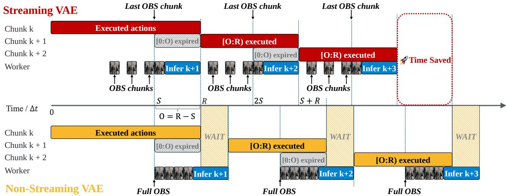  
Figure 3 | Asynchronous model–robot execution with streaming VAE. Both schedules use the same nominal trigger stride � and overlap $O = R - S$ . Streaming VAE (top) encodes observation (OBS) chunks as they arrive and meets the handoff deadline $T _ { \mathrm { r e a d y } } \leq O \Delta t$ . Full-window encoding (bottom) delays handoffs and subsequent triggers, accumulating robot idle time. Time is shown in units of $\Delta t$

## 4. Long-WAM Infrastructure: Real-Time Edge Deployment

Real-time deployment must accommodate both historical observations and future prediction within the time available to prepare the next action chunk. We address this constraint by co-designing asynchronous execution and edge acceleration (Figures 3 and 4). Asynchronous scheduling overlaps model inference with robot execution, while streaming causal VAE encoding moves prefix observation encoding ahead of the inference trigger. Shared optimizations, including NVFP4 quantization and within-call KV reuse, combine with device-specific kernel tuning to accelerate the video–action pipeline on RTX 5090, DGX Spark, and Jetson AGX Thor. Together, these designs target timely action handoffs while retaining the predictive conditioning that supports history-aware control.

## 4.1. Asynchronous Execution

Pure asynchronous execution suffices. We overlap inference with robot execution without blending or prefix guidance. At decision � (control step $t _ { k } )$ , the predicted chunk is $\widehat { \mathbf { A } } _ { t _ { k } } \in \mathbb { R } ^ { H \times d }$ , where � is the action dimension (Section 3.2). Only the first � steps are eligible for execution; inference has nominal stride $S \left( R / 2 \le S < R \le H \right)$ , leaving an overlap of $O = R - S$ steps. At the handoff, the controller discards the elapsed prefix and executes the new chunk’s aligned suffix, waiting if it arrives late (Figure 3).

Pure asynchronous execution can disrupt action continuity [32], motivating inference-time guidance [5] and trainingtime action conditioning [6]. Long-WAM requires neither in our experiments. Conditioned on temporally continuous LongLive2.0-Robot forecasts, consecutive chunks tend to agree in their overlap: on RoboTwin 2.0 [9], Long-WAM nearly keeps its synchronous success under asynchrony, whereas Fast-WAM [54] and LingBot-VA [26] lose 15.4 and 45.5 percentage points (Table 7).

Streaming VAE. Reducing overlap from 12 to 8 control steps lowers overlap RMSE about fourfold and jerk nearly threefold (Appendix E). At fixed �, shorter overlap requires later inference triggers and a tighter handoff deadline:

$$
T _ { \mathrm { r e a d y } } \leq O \Delta t = ( R - S ) \Delta t ,\tag{4}
$$

where $\Delta t$ is the control interval and $T _ { \mathrm { r e a d y } }$ includes transfer, queueing, and computation from the time the trigger observation becomes available.

Streaming causal VAE encoding processes incoming frame groups. After the trigger, we encode the remaining frames, concatenate features, and project and normalize the latents. At the same $S$ and $O ,$ it avoids full-window encoding’s repeated waits and accumulated idle time (Figure 3), allowing later triggers and shorter overlap while retaining the latest observation.

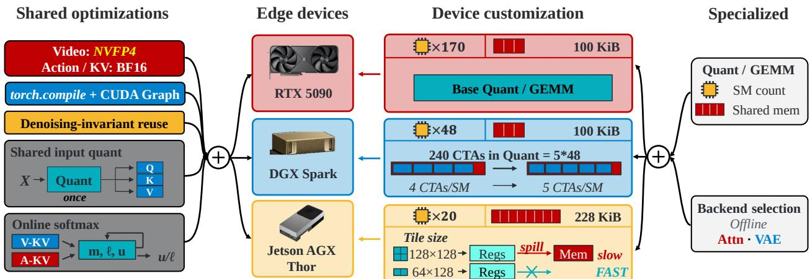  
Figure 4 | Optimizations for efficient edge deployment. Shared optimizations and device-specific tuning accelerate edge inference. “Base” denotes the Quant/GEMM implementation; shape-specific dispatch and autotuning remain enabled.

## 4.2. Efficient Edge Deployment

Local inference avoids network delays, but video-first prediction is costly on limited onboard compute. We accelerate Long-WAM on NVIDIA GeForce RTX 5090, DGX Spark, and Jetson AGX Thor to support short-overlap execution (Equation 4) while preserving visual imagination. Shared optimizations reduce common computation and data-movement costs; device-specific tuning addresses platform constraints, balancing portability and hardware efficiency.

Shared optimizations. Across devices (Figure 4), video-expert linear layers use W4A4 NVFP4 (four-bit weights and activations) during generation and key–value (KV) prefill [11, 35], while action compute and KV storage remain BF16. Action quantization offers limited latency savings and may compromise control precision, so we retain BF16. NVFP4 reduces compute and weight/activation storage, but adds small quantization and scaling kernels whose launch overhead can offset the compute savings. When NVFP4 is combined with CUDA Graph replay [17] and PyTorch compilation [2], launch overhead is reduced and eligible operations are fused. We also reuse denoising-invariant text/state KV, observedvideo KV, and FP32 RoPE tables [43] within each inference call to reduce redundant computation; streaming-VAE operations that update state remain outside CUDA Graph capture.

Shared input quantization quantizes the shared input to Q/K/V projections once and reuses the quantized activations and scales across three separate GEMMs. We combine attention over separate video and action KV buffers using online softmax [31] with a shared normalization, avoiding buffer concatenation. For each query, let $( m _ { j } , \ell _ { j } , u _ { j } )$ denote the maximum attention logit, the sum of exponentials shifted by $m _ { j }$ , and their value-weighted sum for segment $j \in \{ v , a \}$ ; the merged output is

$$
m = \operatorname * { m a x } ( m _ { v } , m _ { a } ) , \mathrm { A t t n } = \frac { e ^ { m _ { v } - m } u _ { v } + e ^ { m _ { a } - m } u _ { a } } { e ^ { m _ { v } - m } \ell _ { v } + e ^ { m _ { a } - m } \ell _ { a } } .
$$

This preserves joint attention without a concatenated KV buffer. We also coalesce memory accesses, fuse scale/bias and cast operations, and simplify VAE layouts and padding, subject to shape and backend constraints.

Device-specific tuning. Quant/GEMM tuning adjusts tile sizes, warps per block, pipeline stages, and buffers. Backend selection includes VAE layout and convolution tuning [12] and RTX 5090/Spark attention backends. RTX 5090 retains base Quant/GEMM implementations with shape-specific dispatch and execution tuning. Spark reduces quantization time with compact buffers and per-shape choices of warps per block. More resident thread blocks per streaming multiprocessor (SM) allow the illustrated grid to run in one wave. Thor’s larger per-block shared-memory budget supports GEMM configurations unavailable on Spark; smaller epilogue tiles avoid register spills. These adaptations reflect hardware constraints, not device-exclusive algorithms. Together, shared optimizations and device-specific tuning yield 3.2–4.1× total speedups over BF16 eager execution. Section 6.2 compares model latencies and cumulative gains (Tables 6 and 8).

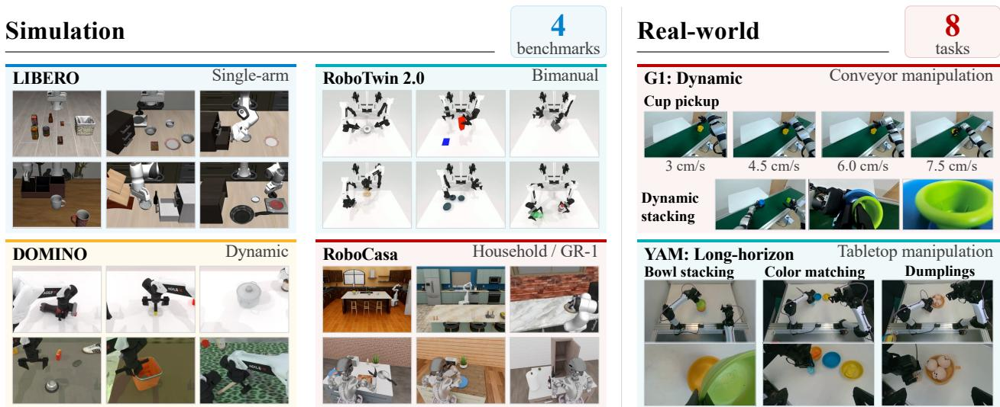  
Figure 5 | Simulation environments and real-world tasks. Our evaluation spans four simulation benchmarks—LIBERO, RoboTwin 2.0, DOMINO, and RoboCasa—and eight real-world task configurations on G1 and YAM. These include cup pickup at four conveyor speeds, dynamic cup stacking, bowl stacking, brick sorting by color, and dumpling placement into a pan.

Table 1 | Success rate (SR, %) on LIBERO. w/o V: no future-video denoising; CoD: video–action co-denoising; IDM: inverse dynamics modeling.
<table><tr><td>Method</td><td>Spatial</td><td>Object</td><td>Goal</td><td>Long</td><td>Avg.</td></tr><tr><td>OpenVLA</td><td>84.7</td><td>88.4</td><td>79.2</td><td>53.7</td><td>76.5</td></tr><tr><td>OpenVLA-OFT</td><td>97.6</td><td>98.4</td><td>97.9</td><td>94.5</td><td>97.1</td></tr><tr><td>GR00T-N1</td><td>94.4</td><td>97.6</td><td>93.0</td><td>90.6</td><td>93.9</td></tr><tr><td>π0</td><td>96.8</td><td>98.8</td><td>95.8</td><td>85.2</td><td>94.1</td></tr><tr><td>π0.5</td><td>98.8</td><td>98.2</td><td>98.0</td><td>92.4</td><td>96.9</td></tr><tr><td>UniVLA</td><td>95.4</td><td>98.8</td><td>93.6</td><td>94.0</td><td>95.5</td></tr><tr><td>X-VLA</td><td>98.2</td><td>98.6</td><td>97.8</td><td>97.6</td><td>98.1</td></tr><tr><td>LingBot-VA</td><td>98.5</td><td>99.6</td><td>97.2</td><td>98.5</td><td>98.5</td></tr><tr><td>Motus</td><td>96.8</td><td>99.8</td><td>96.6</td><td>97.6</td><td>97.7</td></tr><tr><td>Fast-WAM</td><td>98.2</td><td>100.0</td><td>97.0</td><td>95.2</td><td>97.6</td></tr><tr><td>Long-WAM (w/o V)</td><td>98.0</td><td>99.5</td><td>97.0</td><td>94.5</td><td>97.3</td></tr><tr><td>Long-WAM (CoD)</td><td>98.6</td><td>99.8</td><td>96.8</td><td>95.8</td><td>97.8</td></tr><tr><td>Long-WAM (IDM)</td><td>99.5</td><td>100.0</td><td>98.0</td><td>99.5</td><td>99.5</td></tr></table>

Table 2 | Success rate (SR, %) on RoboTwin 2.0.
<table><tr><td>Method</td><td>Clean</td><td>Rand.</td><td>Avg.</td></tr><tr><td>π0</td><td>65.9</td><td>58.4</td><td>62.2</td></tr><tr><td>π0.5</td><td>82.7</td><td>76.8</td><td>79.8</td></tr><tr><td>Motus</td><td>88.7</td><td>87.0</td><td>87.8</td></tr><tr><td>Motus (Wan2.2)</td><td>77.6</td><td>77.0</td><td>77.3</td></tr><tr><td>LingBot-VA</td><td>92.9</td><td>91.5</td><td>92.2</td></tr><tr><td>LingBot-VA 2.0</td><td>93.8</td><td>93.4</td><td>93.6</td></tr><tr><td>Fast-WAM</td><td>91.9</td><td>91.8</td><td>91.8</td></tr><tr><td>AHA-WAM</td><td>93.4</td><td>92.2</td><td>92.8</td></tr><tr><td>ABot-M0.5</td><td>94.0</td><td>94.2</td><td>94.1</td></tr><tr><td>Qwen-RobotManip</td><td>93.7</td><td>94.0</td><td>93.9</td></tr><tr><td>Long-WAM (w/o V)</td><td>92.4</td><td>91.6</td><td>92.0</td></tr><tr><td>Long-WAM (CoD)</td><td>94.0</td><td>93.1</td><td>93.6</td></tr><tr><td>Long-WAM (IDM)</td><td>94.7</td><td>94.2</td><td>94.4</td></tr></table>

## 5. Experiments

## 5.1. Implementation Details

Pretraining LongLive2.0-Robot uses approximately 30,720 GPU-hours on 64 NVIDIA H100 GPUs; downstream WAMs train on 16 GB200 GPUs. WAM training uses AdamW with a peak learning rate of 10−4, cosine decay, 5% warmup, BF16 precision, and gradient clipping at 1.0. Robot experiments use a Unitree G1 humanoid and a YAM bimanual manipulator. Appendix D lists baseline references.

## 5.2. Results on Simulation Benchmarks

We evaluate on LIBERO [30], RoboTwin 2.0 [9], DOMINO [15], and RoboCasa GR-1 [37] (Figure 5). For the first three benchmarks, the main results use up to 2.4 seconds of context; DOMINO adds moving objects, where recent

Figure 6 | Context scaling with three video initializations. Context windows are Table 4 | Success rate (SR, %) displayed at equal spacing. on RoboCasa GR-1.  
LongLive2.0-Robot LongLive2.0 Bidirectional (Wan2.2)  
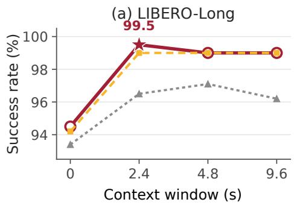

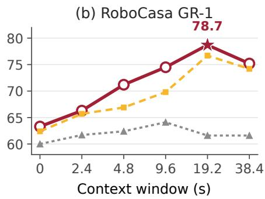

<table><tr><td>Method</td><td>SR↑</td></tr><tr><td>π0</td><td>62.5</td></tr><tr><td>Diffusion Policy Fast-WAM</td><td>32.7</td></tr><tr><td>GR00T-N1.5</td><td>47.5 64.1</td></tr><tr><td>DreamZero</td><td>62.4</td></tr><tr><td>Cosmos Policy</td><td>67.1</td></tr><tr><td>Long-WAM (2.4 s)</td><td>63.3</td></tr><tr><td>Long-WAM (19.2 s)</td><td>78.7</td></tr></table>

motion informs anticipation and interception. RoboCasa GR-1, whose tasks chain several object transfers, hosts the longer-context study. We further evaluate compositional tasks on RoboCasa365, with GPT-6 Astra as a high-level planner (Appendix 6, Table 5).

LIBERO. Long-WAM (IDM) achieves the highest average success (99.5%) and 99.5% on LIBERO-Long (Table 1). Its margin is largest on LIBERO-Long, the suite with the longest tasks, where it exceeds LingBot-VA [26] and Fast-WAM [54] by 1.0 and 4.3 points.

RoboTwin 2.0. Long-WAM (IDM) leads on average (94.4%) and Clean (94.7%), and ties the best Randomized score (94.2%; Table 2). Its average exceeds ABot-M0.5 and LingBot-VA 2.0 [55] by 0.3 and 0.8 points, respectively.

DOMINO. After dynamic-data fine-tuning, Long-WAM leads with 34.9% SR and 45.1 MS (Table 3), exceeding the strongest baseline on each metric: Fast-WAM by 15.0 SR points and PUMA [15] by 10.1 MS points. Recent observations supply motion cues that a single image cannot, supporting prediction-conditioned interception; Section 6.1 tests this ability on a physical conveyor.

Table 3 | DOMINO results after dynamic-data fine-tuning. Success rate (SR); manipulation score (MS).
<table><tr><td>Method</td><td>SR (%) ↑</td><td>MS ↑</td></tr><tr><td>OpenVLA</td><td>1.5</td><td>6.1</td></tr><tr><td>π0</td><td>8.2</td><td>24.0</td></tr><tr><td>π0.5</td><td>9.6</td><td>26.2</td></tr><tr><td>InternVLA-M1</td><td>5.4</td><td>27.6</td></tr><tr><td>OpenVLA-OFT</td><td>9.1</td><td>24.1</td></tr><tr><td>StarVLA-OFT</td><td>10.9</td><td>30.5</td></tr><tr><td>PUMA</td><td>17.2</td><td>35.0</td></tr><tr><td>Fast-WAM</td><td>19.9</td><td>33.3</td></tr><tr><td>Long-WAM</td><td>34.9</td><td>45.1</td></tr></table>

## 5.3. Ablation Studies

Context Scaling. Adding 2.4 seconds of history raises LIBERO-Long success from 94.5% to 99.5% with LongLive2.0- Robot and 94.2% to 99.0% with LongLive-2.0 (Figure 6). On RoboCasa GR-1, chosen for its multi-stage tasks [33, 37], scaling from 2.4 to 19.2 seconds improves success from 66.3% to 78.7% and 65.7% to 76.7%, respectively. The different peak context lengths suggest task-dependent memory needs: short histories capture most gains on LIBERO-Long, while GR-1 benefits from substantially longer interaction context. Robot-video pretraining yields higher peaks on both benchmarks; its 78.7% exceeds the strongest GR-1 baseline by 11.6 points (Table 4). At 38.4 seconds, success decreases to 75.2% and 74.2%; this window is three times the average training trajectory (12.1 seconds), and 80.4% of its sampled history frames are padding. We hypothesize that the decline reflects limited history coverage rather than an intrinsic memory limit. Context also has a price: 8× more history raises RTX 5090 latency 3.2× (107.4 to 341.0 ms; Appendix G).

Autoregressive vs. Bidirectional Pretraining. The AR advantage itself grows with context: on GR-1, the robotdomain AR variant leads bidirectional initialization by 3.3 points without history and 17.1 points at 19.2 seconds (Figure 6). The bidirectional variant rises from 61.7% at 2.4 seconds to 64.1% at 9.6, then returns to 61.6% at 19.2; both AR variants instead gain 12.4 and 11.0 points over the 2.4–19.2-second interval. All variants use causal WAM adaptation, yet access to history alone does not reproduce the AR variants’ long-context gains. A plausible explanation is that AR pretraining learns the history-to-future dependencies retained during action adaptation, allowing additional observations to inform control through a predictive representation.

Table 5 | Success rate (SR, %) on RoboCasa365. Overall averages 50 tasks: 18 Atomic-Seen, 16 Composite-Seen, and 16 Composite-Unseen. Baseline sources: Appendix D.
<table><tr><td>Method</td><td>Atomic Seen</td><td>Composite Seen</td><td>Composite Unseen</td><td>Overall</td></tr><tr><td>Diffusion Policy</td><td>15.7</td><td>0.2</td><td>1.3</td><td>6.1</td></tr><tr><td>Azero-Robotics-1</td><td>30.3</td><td>3.8</td><td>1.6</td><td>12.6</td></tr><tr><td>π0</td><td>34.6</td><td>6.1</td><td>1.1</td><td>14.8</td></tr><tr><td>GigaWorld-Policy 0.1</td><td>44.4</td><td>11.8</td><td>2.9</td><td>20.7</td></tr><tr><td>GR00T N1.6</td><td>51.1</td><td>9.4</td><td>1.7</td><td>21.9</td></tr><tr><td>GR00T N1.5</td><td>50.7</td><td>14.8</td><td>2.7</td><td>23.9</td></tr><tr><td>WorldDreamer</td><td>66.3</td><td>26.7</td><td>9.0</td><td>35.3</td></tr><tr><td>RLDX-1</td><td>67.6</td><td>27.9</td><td>8.5</td><td>36.0</td></tr><tr><td>PRTS</td><td>66.3</td><td>30.3</td><td>18.8</td><td>39.6</td></tr><tr><td>Qwen-RobotManip</td><td>68.6</td><td>20.1</td><td>14.9</td><td>35.9</td></tr><tr><td>ABot-M0.5</td><td>75.6</td><td>37.7</td><td>3.3</td><td>40.3</td></tr><tr><td>GPT-6 Astra</td><td>31.5</td><td>22.4</td><td>20.8</td><td>25.2</td></tr><tr><td>π0.5</td><td>39.6</td><td>7.1</td><td>1.2</td><td>16.9</td></tr><tr><td>π0.5 + GPT-6 Astra</td><td>46.5</td><td>24.0</td><td>19.0</td><td>30.5</td></tr><tr><td>Long-WAM</td><td>67.9</td><td>15.8</td><td>6.1</td><td>31.4</td></tr><tr><td>Long-WAM + GPT-6 Astra</td><td>85.6</td><td>38.8</td><td>35.0</td><td>54.4</td></tr></table>

Video–Action Denoising Strategy. We compare action denoising without future-video prediction (w/o V), joint video–action denoising (CoD), and video prediction followed by history- and prediction-conditioned action denoising (IDM; Tables 1 and 2). IDM’s largest suite-level gains occur on LIBERO-Long: 99.5%, versus 94.5% (w/o V) and 97.8% (CoD), suggesting that first estimating how an interaction will evolve provides a useful condition for coordinating subsequent actions across multiple substeps. The resulting policy also supports dynamic grasping (Section 6.1). These gains use partially denoised future latents, without pixel-level synthesis, highlighting prediction as an intermediate control representation. Our infrastructure addresses the sequential-inference cost while preserving this predictive path (Section 6.2).

## 6. Atomic Execution and Compositional Planning

RoboCasa365 [34] separates atomic household skills from their composition into multi-stage tasks, allowing us to examine Long-WAM as the execution foundation of a hierarchical robot system. We use a Human300-trained checkpoint with 2.4 seconds of visual context, then add GPT-6 Astra without further policy training. The planner grounds task goals into atomic subinstructions, selects execution-prefix lengths, and can issue bounded end-effector corrections; Long-WAM supplies the learned action chunks. Table 5 compares GPT-6 Astra alone, standalone and planner-augmented policies, and benchmark reference methods [40].

Strong atomic execution. Long-WAM alone achieves 67.9% Atomic-Seen success, compared with 39.6% for �0.5 and 31.5% for GPT-6 Astra alone, providing a strong physical skill foundation. Querying the same policy every 15 steps yields 84.4% without a planner, close to the hierarchical system’s 85.6%.

Planning unlocks unseen skill compositions. With the policy checkpoint and visual context unchanged, adding the planner raises Composite-Seen success from 15.8% to 38.8% and Composite-Unseen success from 6.1% to 35.0%; Overall improves from 31.4% to 54.4%. The 15-step control reaches only 11.2% and 5.0% on the composite splits, so shorter execution intervals alone do not explain these gains.

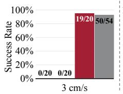

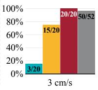

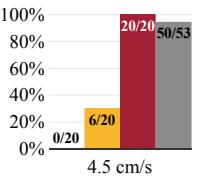

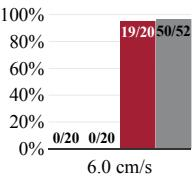

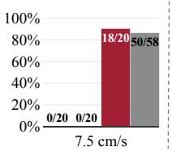

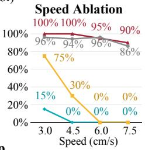

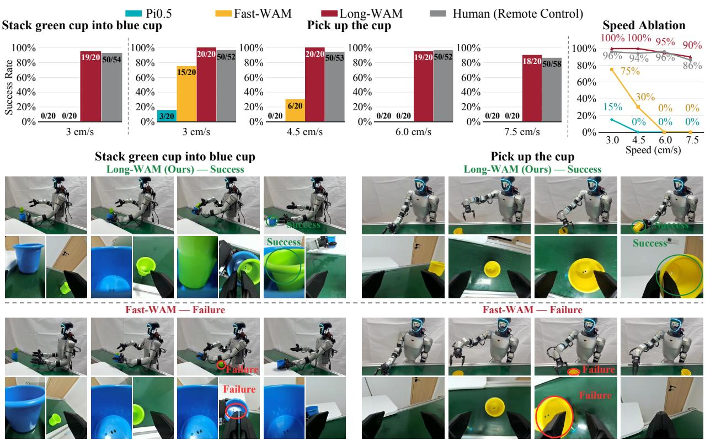  
Figure 7 | Dynamic manipulation on Unitree G1. Long-WAM maintains 90–100% grasping success across conveyor speeds and achieves 95% success on dynamic cup stacking. Top: policy and human teleoperation comparisons. Bottom: Long-WAM and Fast-WAM rollouts.

Strong policies amplify agentic planning. GPT-6 Astra alone reaches 25.2% Overall success, and pairing it with � reaches 30.5%, compared with 54.4% for Long-WAM + GPT-6 Astra. On unseen compositions, the Long-WAM hierarchy achieves 35.0%, exceeding both GPT-6 Astra alone (20.8%) and the $\pi _ { 0 . 5 }$ hierarchy (19.0%). Planner augmentation yields a larger reported Overall gain for Long-WAM: 23.0 percentage points, versus 13.6 for $\pi _ { 0 . 5 }$ . These system-level comparisons highlight execution quality as a key complement to reasoning: Long-WAM supplies strong physical skills, while high-level planning extends their use to unseen compositions. This supports the division of labor in Appendix A, in which agentic planning and memory-informed execution jointly enable more capable long-horizon behavior.

## 6.1. Real-world Deployment

We evaluate dynamic manipulation on Unitree G1 and long-horizon tasks on YAM, with 20 trials per policy and condition.

Dynamic Tasks. Conveyor speed separates the policies (Figure 7). As the belt accelerates from 3.0 to 7.5 cm/s, the grasping success of Fast-WAM [54] falls from 75% to 0% and that of �0.5 [38] from 15% to 0%, whereas Long-WAM stays at 90–100% (100%, 100%, 95%, and 90%). Stacking a moving green cup into a blue cup at 3 cm/s adds alignment and placement to interception; Long-WAM succeeds in 19 of 20 trials, and neither baseline succeeds once.

Long-Horizon Tasks. On YAM, where tasks last over 40 seconds on average, Long-WAM succeeds in 80%, 80%, and 85% of trials on brick sorting by color, placing dumplings in a pan, and stacking bowls (81.7% on

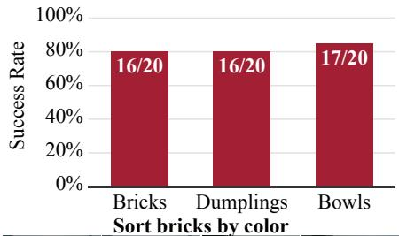

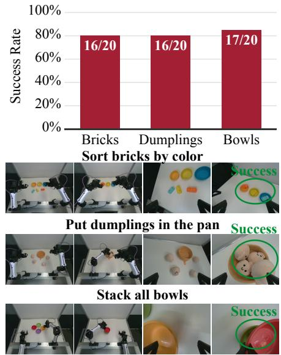  
Figure 8 | Long-horizon execution on YAM: 20 trials per task.

Table 6 | RTX 5090 end-to-end latency and RoboTwin 2.0 success rate (SR; Clean/Randomized mean). BF16 eager is the unoptimized V4/A4 baseline.
<table><tr><td>Method</td><td>Latency (ms) ↓</td><td>SR (%) ↑</td></tr><tr><td>LingBot-VA</td><td>3618.4</td><td>92.2</td></tr><tr><td>Motus</td><td>1201.1</td><td>87.8</td></tr><tr><td>Cosmos Policy</td><td>470.6</td><td></td></tr><tr><td>Fast-WAM</td><td>244.1</td><td>91.8</td></tr><tr><td>Long-WAM</td><td></td><td></td></tr><tr><td>BF16 eager</td><td>356.0</td><td>94.4</td></tr><tr><td>Optimized (V4/A4)</td><td>107.4</td><td>93.5</td></tr><tr><td>Optimized (V2/A2)</td><td>81.8</td><td>92.5</td></tr></table>

Table 7 | RoboTwin 2.0 success rate (SR, %). Sync: Table 2; Async: our evaluation. Jerk denotes a discrete smoothness proxy; see Appendix E.
<table><tr><td rowspan="2">Method</td><td rowspan="2">Sync</td><td colspan="3">Async</td></tr><tr><td>SR↑ SR↑</td><td>RMSE↓</td><td>Jerk↓</td></tr><tr><td>Fast-WAM</td><td>91.8</td><td>76.4</td><td>0.0731</td><td>0.1316</td></tr><tr><td>LingBot-VA</td><td>92.2</td><td>46.7</td><td>0.1432</td><td>0.6592</td></tr><tr><td>Long-WAM (CoD)</td><td>93.6</td><td>93.2</td><td>0.0260</td><td>0.0479</td></tr><tr><td>Long-WAM (IDM)</td><td>94.4</td><td>94.2</td><td>0.0246</td><td>0.0436</td></tr></table>

average; Figure 8), sustaining multi-step execution and rapid interception.

## 6.2. Efficiency

Latency. On RTX 5090, the optimizations detailed in Section 4.2 jointly reduce the V4/A4 end-to-end inference latency to 107.4 ms while largely preserving SR (BF16: 94.4%; optimized: 93.5%; Table 6). Long-WAM achieves a 2.3× speedup over Fast-WAM [54] (244.1 ms) despite additionally predicting future video frames. Both optimized variants outperform existing baselines in both inference latency and reported SR; notably, V2/A2 trades a modest 1.0-point drop in SR for an additional 24% latency reduction (81.8 ms). The other baselines are evaluated under their native deployment configurations and denoising budgets.

Table 8 | End-to-end latency (E2E) of Long-WAM under cumulative optimizations across devices, including the full VAE computation. Each row keeps all preceding optimizations on a fixed input; speedups are relative to BF16 eager. The first optimized stage combines NVFP4 quantization, CUDA Graph replay, and compilation.
<table><tr><td>Optimization</td><td colspan="2">RTX 5090</td><td colspan="2">DGX Spark</td><td colspan="2">Thor</td></tr><tr><td></td><td>E2E (ms) ↓</td><td>Speedup ↑</td><td>E2E (ms) ↓</td><td>Speedup ↑</td><td>E2E (ms) ↓</td><td>Speedup ↑</td></tr><tr><td>Shared optimizations</td><td></td><td></td><td></td><td></td><td></td><td></td></tr><tr><td>BF16 eager + NVFP4 quantization</td><td>356.0</td><td>1.0×</td><td>1342.8</td><td>1.0×</td><td>1215.2</td><td>1.0×</td></tr><tr><td>+ CUDA Graph + compile</td><td>172.4</td><td>2.1×</td><td>686.4</td><td>2.0×</td><td>762.4</td><td>1.6×</td></tr><tr><td>+ Denoising-invariant reuse</td><td>144.9</td><td>2.5×</td><td>464.5</td><td>2.9×</td><td>524.5</td><td>2.3×</td></tr><tr><td>+ Shared input quantization</td><td>130.3</td><td>2.7×</td><td>427.8</td><td>3.1×</td><td>476.5</td><td>2.6×</td></tr><tr><td>+ Video-action online softmax</td><td>126.9</td><td>2.8×</td><td>419.9</td><td>3.2×</td><td>468.2</td><td>2.6×</td></tr><tr><td>Device-specific tuning</td><td></td><td></td><td></td><td></td><td></td><td></td></tr><tr><td>+ Quant/GEMM tuning</td><td>119.1</td><td>3.0×</td><td>415.6</td><td>3.2×</td><td>458.9</td><td>2.6×</td></tr><tr><td>+ Backend selection</td><td>107.4</td><td>3.3×</td><td>328.2</td><td>4.1×</td><td>378.7</td><td>3.2×</td></tr></table>

Pure Asynchronous Execution. Long-WAM largely preserves synchronous success. At � = 12 (� = 24), IDM loses 0.2 percentage points (94.4% to 94.2%) and CoD loses 0.4; Fast-WAM and LingBot-VA [26] lose 15.4 and 45.5 (Table 7). Long-WAM’s overlap RMSE and jerk are about one-third of Fast-WAM’s. With a shorter overlap (� = 16), asynchronous success reaches 95.0%, on par with synchronous execution (Appendix E).

Cumulative Acceleration. NVFP4’s compute savings can be offset by the launch overhead of added small kernels. When combined with CUDA Graph replay and compilation, NVFP4 yields end-to-end speedups while retaining reduced weight and activation storage. Together with the remaining shared optimizations, this reduces latency to 126.9, 419.9, and 468.2 ms on RTX 5090, Spark, and Thor (Table 8). Device-specific tuning reduces latency by another 15–22%, yielding 107.4, 328.2, and 378.7 ms, for total speedups of 3.3×, 4.1×, and 3.2× over BF16 eager. Appendix F details timing and configuration-dependent KV reuse effects.

## References

[1] AgiBot-World-Contributors, Qingwen Bu, Jisong Cai, Li Chen, Xiuqi Cui, Yan Ding, Siyuan Feng, Shenyuan Gao, Xindong He, Xuan Hu, Xu Huang, Shu Jiang, Yuxin Jiang, Cheng Jing, Hongyang Li, Jialu Li, Chiming Liu, Yi Liu, Yuxiang Lu, Jianlan Luo, Ping Luo, Yao Mu, Yuehan Niu, Yixuan Pan, Jiangmiao Pang, Yu Qiao, Guanghui Ren, Cheng Ruan, Jiaqi Shan, Yongjian Shen, Chengshi Shi, Mingkang Shi, Modi Shi, Chonghao Sima, Jianheng Song, Huijie Wang, Wenhao Wang, Dafeng Wei, Chengen Xie, Guo Xu, Junchi Yan, Cunbiao Yang, Lei Yang, Shukai Yang, Maoqing Yao, Jia Zeng, Chi Zhang, Qinglin Zhang, Bin Zhao, Chengyue Zhao, Jiaqi Zhao, and Jianchao Zhu. AgiBot World Colosseo: A Large-scale Manipulation Platform for Scalable and Intelligent Embodied Systems, 2025. URL https://arxiv.org/abs/2503.06669.

[2] Jason Ansel, Edward Yang, Horace He, Natalia Gimelshein, Animesh Jain, Michael Voznesensky, Bin Bao, Peter Bell, David Berard, Evgeni Burovski, Geeta Chauhan, Anjali Chourdia, Will Constable, Alban Desmaison, Zachary DeVito, Elias Ellison, Will Feng, Jiong Gong, Michael Gschwind, Brian Hirsh, Sherlock Huang, Kshiteej Kalambarkar, Laurent Kirsch, Michael Lazos, Mario Lezcano, Yanbo Liang, Jason Liang, Yinghai Lu, C. K. Luk, Bert Maher, Yunjie Pan, Christian Puhrsch, Matthias Reso, Mark Saroufim, Marcos Yukio Siraichi, Helen Suk, Shunting Zhang, Michael Suo, Phil Tillet, Xu Zhao, Eikan Wang, Keren Zhou, Richard Zou, Xiaodong Wang, Ajit Mathews, William Wen, Gregory Chanan, Peng Wu, and Soumith Chintala. PyTorch 2: Faster Machine Learning Through Dynamic Python Bytecode Transformation and Graph Compilation. In Proceedings ofthe 29th ACM International Conference on Architectural Supportfor Programming Languages and Operating Systems, Volume 2, pp. 929–947. ACM, 2024. doi: 10.1145/3620665.3640366. URL https://doi.org/10.1145/3620665.3640366.

[3] Hongzhe Bi, Hengkai Tan, Shenghao Xie, Zeyuan Wang, Shuhe Huang, Haitian Liu, Ruowen Zhao, Yao Feng, Chendong Xiang, Yinze Rong, Hongyan Zhao, Hanyu Liu, Zhizhong Su, Lei Ma, Hang Su, and Jun Zhu. Motus: A Unified Latent Action World Model, 2025. URL https://arxiv.org/abs/2512.13030.

[4] Kevin Black, Noah Brown, Danny Driess, Adnan Esmail, Michael Equi, Chelsea Finn, Niccolo Fusai, Lachy Groom, Karol Hausman, Brian Ichter, Szymon Jakubczak, Tim Jones, Liyiming Ke, Sergey Levine, Adrian Li-Bell, Mohith Mothukuri, Suraj Nair, Karl Pertsch, Lucy Shi, Laura Smith, James Tanner, Quan Vuong, Anna Walling, Haohuan Wang, and Ury Zhilinsky. � : A Vision-Language-Action Flow Model for General Robot Control. In Robotics: Science and Systems XXI, RSS2025. Robotics: Science and Systems Foundation, June 2025. doi: 10.15607/rss.2025.xxi.010. URL http: //dx.doi.org/10.15607/RSS.2025.XXI.010.

[5] Kevin Black, Manuel Galliker, and Sergey Levine. Real-Time Execution of Action Chunking Flow Policies. In Advances in Neural Information Processing Systems 38, NeurIPS 2025, pp. 37596–37620. Neural Information Processing Systems Foundation, Inc. (NeurIPS), 2025. doi: 10.52202/085713-1122. URL http://dx.doi.org/10.52202/085713-1122.

[6] Kevin Black, Allen Z. Ren, Michael Equi, and Sergey Levine. Training-Time Action Conditioning for Efficient Real-Time Chunking, 2025. URL https://arxiv.org/abs/2512.05964.

[7] Jisong Cai, Long Ling, Shiwei Chu, Zhongshan Liu, Jiayue Kang, Zhixuan Liang, Wenjie Xu, Yinan Mao, Weinan Zhang, Xiaokang Yang, Ru Ying, Ran Zheng, and Yao Mu. AHA-WAM:Asynchronous Horizon-Adaptive World-Action Modeling with Observation-Guided Context Routing, 2026. URL https://arxiv.org/abs/2606.09811.

[8] Ronghan Chen, Yandan Yang, Zuojin Tang, Dongjie Huo, Tong Lin, Haoning Wu, Haoyun Liu, Yuzhi Chen, Lulu Zheng, Botai Yuan, Tianlun Li, Mingxin Wang, Dekang Qi, Bin Hu, Wei Mei, Yuze Xuan, Haolong Yang, Yanqing Zhu, Mu Xu, Zhiheng Ma, and Xinyuan Chang. ABot-M0.5: Unified Mobility-and-Manipulation World Action Model, 2026. URL https://arxiv.org/abs/2607.00678.

[9] Tianxing Chen, Zanxin Chen, Baijun Chen, Zijian Cai, Yibin Liu, Zixuan Li, Qiwei Liang, Xianliang Lin, Yiheng Ge, Zhenyu Gu, Weiliang Deng, Yubin Guo, Tian Nian, Xuanbing Xie, Qiangyu Chen, Kailun Su, Tianling Xu, Guodong Liu, Mengkang Hu, Huan ang Gao, Kaixuan Wang, Zhixuan Liang, Yusen Qin, Xiaokang Yang, Ping Luo, and Yao Mu. RoboTwin 2.0: A Scalable Data Generator and Benchmark with Strong Domain Randomization for Robust Bimanual Robotic Manipulation, 2025. URL https://arxiv.org/abs/2506.18088.

[10] Xinyi Chen, Yilun Chen, Yanwei Fu, Ning Gao, Jiaya Jia, Weiyang Jin, Hao Li, Yao Mu, Jiangmiao Pang, Yu Qiao, Yang Tian, Bin Wang, Bolun Wang, Fangjing Wang, Hanqing Wang, Tai Wang, Ziqin Wang, Xueyuan Wei, Chao Wu, Shuai Yang, Jinhui Ye, Junqiu Yu, Jia Zeng, Jingjing Zhang, Jinyu Zhang, Shi Zhang, Feng Zheng, Bowen Zhou, and Yangkun Zhu. InternVLA-M1: A Spatially Guided Vision-Language-Action Framework for Generalist Robot Policy, 2025. URL https://arxiv.org/abs/2510.13778.

[11] Yukang Chen, Luozhou Wang, Wei Huang, Shuai Yang, Bohan Zhang, Yicheng Xiao, Ruihang Chu, Weian Mao, Qixin Hu, Shaoteng Liu, Yuyang Zhao, Huizi Mao, Ying-Cong Chen, Enze Xie, Xiaojuan Qi, and Song Han. LongLive-2.0: An NVFP4 Parallel Infrastructure for Long Video Generation, 2026. URL https://arxiv.org/abs/2605.18739.

[12] Sharan Chetlur, Cliff Woolley, Philippe Vandermersch, Jonathan Cohen, John Tran, Bryan Catanzaro, and Evan Shelhamer. cuDNN: Efficient Primitives for Deep Learning, 2014. URL https://arxiv.org/abs/1410.0759.

[13] Cheng Chi, Siyuan Feng, Yilun Du, Zhenjia Xu, Eric Cousineau, Benjamin Burchfiel, and Shuran Song. Diffusion Policy: Visuomotor Policy Learning via Action Diffusion. In Robotics: Science and Systems XIX, RSS2023. Robotics: Science and Systems Foundation, July 2023. doi: 10.15607/rss.2023.xix.026. URL http://dx.doi.org/10.15607/RSS.2023. XIX.026.

[14] Yufan Deng, Zilin Pan, Hongyu Zhang, Xiaojie Li, Ruoqing Hu, Yufei Ding, Yiming Zou, Yan Zeng, and Daquan Zhou Rethinking Video Generation Model for the Embodied World, 2026. URL https://arxiv.org/abs/2601.15282.

[15] Heng Fang, Shangru Li, Shuhan Wang, Xuanyang Xi, Dingkang Liang, and Xiang Bai. Towards Generalizable Robotic Manipulation in Dynamic Environments. In European Conference on Computer Vision (ECCV), 2026.

[16] Yusen Feng, Bingchen Han, Jiangran Lyu, Kai Liu, Yixin Zheng, Yuxuan Wan, Weiheng Liu, Sun Han, Ruiqin Li, Yulong Zhang, Fangfu Liu, Xuesong Shi, Libin Liu, Yizhou Wang, Zhizheng Zhang, and He Wang. WAM-TTT: Steering World-Action Models by Watching Human Play at Test Time, 2026. URL https://arxiv.org/abs/2607.06988.

[17] Alan Gray. Getting Started with CUDA Graphs. NVIDIA Technical Blog, 2019. URL https://developer.nvidia. com/blog/cuda-graphs/.

[18] Ryan Hoque, Peide Huang, David Yoon, Mouli Sivapurapu, and Jian Zhang. EgoDex: Learning Dexterous Manipulation from Large-Scale Egocentric Video. In C. Vondrick, B. Hariharan, C. Raffel, L. Pinto, D. Yang, and A. Faust (eds.), International Conference on Learning Representations, volume 2026, pp. 4218–4237, 2026. URL https://proceedings.iclr.cc/ paper\_files/paper/2026/file/07fcc6e2b89439d3ee5ab60939aaa6a0-Paper-Conference.pdf.

[19] Muyan Hu, Ashwin Venkatram, Shreyashri Biswas, Balamurugan Marimuthu, Bohan Hou, Gabriele Oliaro, Haojie Wang, Liyan Zheng, Xupeng Miao, Jidong Zhai, and Zhihao Jia. Optimal Kernel Orchestration for Tensor Programs with Korch. In Proceedings ofthe 29th ACM International Conference on Architectural Supportfor Programming Languages and Operating Systems, Volume 3, pp. 755–769. ACM, 2024. doi: 10.1145/3620666.3651383. URL https://doi.org/10.1145/ 3620666.3651383.

[20] Yunfan Jiang, Yevgen Chebotar, Ruijie Zheng, Fengyuan Hu, Yunhao Ge, Jimmy Wu, Tianyuan Dai, Scott Reed, Li Fei-Fei, Yuke Zhu, and Linxi “Jim” Fan. RoboTTT: Context Scaling for Robot Policies, 2026. URL https://arxiv.org/abs/ 2607.15275.

[21] Dongyoung Kim, Huiwon Jang, Myungkyu Koo, Suhyeok Jang, Taeyoung Kim, Beomjun Kim, Byungjun Yoon, Changsung Jang, Daewon Choi, Dongsu Han, Donguk Lee, Heeseung Kwon, Hojin Jeon, Jaehyun Kang, Jaekyoung Bae, Jihyuk Lee, Jimin Lee, John Won, Joonwoo Ahn, Junhyeong Park, Junyoung Sung, Kyungmin Lee, Minseong Han, Minsung Yoon, Sejune Joo, Seonil Son, Seungcheol Park, Seunggeun Cho, Seungjun Moon, Seungku Kim, Yonghoon Dong, Yongjin Cho, Youngchan Kim, Chang Hwan Kim, Dohyeon Kim, Heecheol Kim, Heewon Lee, Hensen Ahn, Hyungkyu Ryu, Hyunsoo Choi, Hyunsoo Shin, Jaeheon Jung, Jaewoo Kim, Jinwook Kim, Joochul Chang, Joonsoo Kim, Junghun Park, Jungwoo Park, Junho Cho, Junhyeok Park, Junwon Lee, Kangwook Lee, Kwanghoon Kim, Kyoungwhan Choe, Manoj Bhadu, Nayoung Oh, Sangjun Kim, Sangwoo Kim, Seunghoon Shim, Seunghyun Kim, Seungjun Lee, Seungyup Ka, Sungryol Yang, Wook Jung, Yashu Shukla, Yeonjae Lee, Yeonwoo Bae, and Jinwoo Shin. RLDX-1 Technical Report, 2026. URL https://arxiv.org/abs/2605.03269.

[22] Moo Jin Kim, Karl Pertsch, Siddharth Karamcheti, Ted Xiao, Ashwin Balakrishna, Suraj Nair, Rafael Rafailov, Ethan Foster, Grace Lam, Pannag Sanketi, Quan Vuong, Thomas Kollar, Benjamin Burchfiel, Russ Tedrake, Dorsa Sadigh, Sergey Levine, Percy Liang, and Chelsea Finn. OpenVLA: An Open-Source Vision-Language-Action Model, 2024. URL https: //arxiv.org/abs/2406.09246.

[23] Moo Jin Kim, Chelsea Finn, and Percy Liang. Fine-Tuning Vision-Language-Action Models: Optimizing Speed and Success, 2025. URL https://arxiv.org/abs/2502.19645.

[24] Moo Jin Kim, Yihuai Gao, Tsung-Yi Lin, Yen-Chen Lin, Yunhao Ge, Grace Lam, Percy Liang, Shuran Song, Ming-Yu Liu, Chelsea Finn, and Jinwei Gu. Cosmos Policy: Fine-Tuning Video Models for Visuomotor Control and Planning, 2026. URL https://arxiv.org/abs/2601.16163.

[25] Wayne King, Zeyue Xue, Yuxuan Bian, Jie Huang, Haoran Li, Yaowei Li, Yaofeng Su, Yuming Li, Haoyu Wang, Shiyi Zhang, Songchun Zhang, Yuwei Niu, Sihan Xu, Junhao Zhuang, Haoyang Huang, and Nan Duan. Echo-Memory: A Controlled Study of Memory in Action World Models, 2026. URL https://arxiv.org/abs/2606.09803.

[26] Lin Li, Qihang Zhang, Yiming Luo, Shuai Yang, Ruilin Wang, Fei Han, Mingrui Yu, Zelin Gao, Nan Xue, Xing Zhu, Yujun Shen, and Yinghao Xu. Causal World Modeling for Robot Control, 2026. URL https://arxiv.org/abs/2601.21998.

[27] Qixiu Li, Yu Deng, Yaobo Liang, Lin Luo, Lei Zhou, Chengtang Yao, Lingqi Zeng, Zhiyuan Feng, Huizhi Liang, Sicheng Xu, Yizhong Zhang, Xi Chen, Hao Chen, Lily Sun, Dong Chen, Jiaolong Yang, and Baining Guo. Scalable Vision-Language-Action Model Pretraining for Robotic Manipulation with Real-Life Human Activity Videos, 2025. URL https://arxiv.org/ abs/2510.21571.

[28] Wuyang Li, Wentao Pan, Po-Chien Luan, Yang Gao, and Alexandre Alahi. Stable Video Infinity: Infinite-Length Video Generation with Error Recycling. In C. Vondrick, B. Hariharan, C. Raffel, L. Pinto, D. Yang, and A. Faust (eds.), International Conference on Learning Representations, volume 2026, pp. 23406–23432, 2026. URL https://proceedings.iclr.cc/ paper\_files/paper/2026/file/2858f8c8683aaa8c12d487354cf328dc-Paper-Conference.pdf.

[29] Xuewu Lin, Tianwei Lin, Yun Du, Hongyu Xie, Yiwei Jin, Jiawei Li, Shijie Wu, Qingze Wang, Mengdi Li, Mengao Zhao, Ziang Li, Chaodong Huang, Hongzhe Bi, Lichao Huang, and Zhizhong Su. HoloBrain-0 Technical Report, 2026. URL https://arxiv.org/abs/2602.12062.

[30] Bo Liu, Yifeng Zhu, Chongkai Gao, Yihao Feng, Qiang Liu, Yuke Zhu, and Peter Stone. LIBERO: Benchmarking Knowledge Transfer for Lifelong Robot Learning. In A. Oh, T. Naumann, A. Globerson, K. Saenko, M. Hardt, and S. Levine (eds.), Advances in Neural Information Processing Systems, volume 36, pp. 44776–44791. Curran Associates, Inc., 2023. doi: 10.52202/075280-1939. URL https://proceedings.neurips.cc/paper\_files/paper/2023/file/ 8c3c666820ea055a77726d66fc7d447f-Paper-Datasets\_and\_Benchmarks.pdf.

[31] Maxim Milakov and Natalia Gimelshein. Online normalizer calculation for softmax, 2018. URL https://arxiv.org/ abs/1805.02867.

[32] Motubrain Team. World Action Models in Real Time: An Empirical Study of Smooth Execution via Asynchronous Deployment, 2026. URL https://arxiv.org/abs/2608.01880.

[33] Soroush Nasiriany, Abhiram Maddukuri, Lance Zhang, Adeet Parikh, Aaron Lo, Abhishek Joshi, Ajay Mandlekar, and Yuke Zhu. RoboCasa: Large-Scale Simulation of Household Tasks for Generalist Robots. In Proceedings ofRobotics: Science and Systems, Delft, Netherlands, July 2024. doi: 10.15607/RSS.2024.XX.050. URL https://www.roboticsproceedings. org/rss20/p050.html.

[34] Soroush Nasiriany, Sep Nasiriany, Abhiram Maddukuri, and Yuke Zhu. RoboCasa365: A Large-Scale Simulation Framework for Training and Benchmarking Generalist Robots. In C. Vondrick, B. Hariharan, C. Raffel, L. Pinto, D. Yang, and A. Faust (eds.), International Conference on Learning Representations, volume 2026, pp. 98643–98667, 2026. URL https://proceedings.iclr.cc/paper\_files/paper/2026/file/ a05003fdb1e9562ab0c0a9719ea4de10-Paper-Conference.pdf.

[35] NVIDIA. NVIDIA Blackwell Architecture Technical Brief, 2024. URL https://resources.nvidia.com en-us-blackwell-architecture/blackwell-architecture-technical-brief.

[36] NVIDIA, Johan Bjorck, Fernando Castañeda, Nikita Cherniadev, Xingye Da, Runyu Ding, Linxi “Jim” Fan, Yu Fang, Dieter Fox, Fengyuan Hu, Spencer Huang, Joel Jang, Zhenyu Jiang, Jan Kautz, Kaushil Kundalia, Lawrence Lao, Zhiqi Li, Zongyu Lin, Kevin Lin, Guilin Liu, Edith Llontop, Loic Magne, Ajay Mandlekar, Avnish Narayan, Soroush Nasiriany, Scott Reed, You Liang Tan, Guanzhi Wang, Zu Wang, Jing Wang, Qi Wang, Jiannan Xiang, Yuqi Xie, Yinzhen Xu, Zhenjia Xu, Seonghyeon Ye, Zhiding Yu, Ao Zhang, Hao Zhang, Yizhou Zhao, Ruijie Zheng, and Yuke Zhu. GR00T N1: An Open Foundation Model for Generalist Humanoid Robots, 2025. URL https://arxiv.org/abs/2503.14734.

[37] NVIDIA GEAR. PhysicalAI-Robotics-GR00T-Teleop-Sim: Simulation GR1 Tabletop Task 1K Dataset. Hugging Face dataset, 2025. URL https://huggingface.co/datasets/nvidia/PhysicalAI-Robotics-GR00T-Teleop-Sim.

[38] Physical Intelligence, Kevin Black, Noah Brown, James Darpinian, Karan Dhabalia, Danny Driess, Adnan Esmail, Michael Equi, Chelsea Finn, Niccolo Fusai, Manuel Y. Galliker, Dibya Ghosh, Lachy Groom, Karol Hausman, Brian Ichter, Szymon Jakubczak, Tim Jones, Liyiming Ke, Devin LeBlanc, Sergey Levine, Adrian Li-Bell, Mohith Mothukuri, Suraj Nair, Karl Pertsch, Allen Z. Ren, Lucy Xiaoyang Shi, Laura Smith, Jost Tobias Springenberg, Kyle Stachowicz, James Tanner, Quan Vuong, Homer Walke, Anna Walling, Haohuan Wang, Lili Yu, and Ury Zhilinsky. � : a Vision-Language-Action Model with Open-World Generalization, 2025. URL https://arxiv.org/abs/2504.16054.

[39] Ryan Punamiya, Simar Kareer, Zeyi Liu, Josh Citron, Ri-Zhao Qiu, Xiongyi Cai, Alexey Gavryushin, Jiaqi Chen, Davide Liconti, Lawrence Y. Zhu, Patcharapong Aphiwetsa, Baoyu Li, Aniketh Cheluva, Pranav Kuppili, Yangcen Liu, Dhruv Patel, Aidan Gao, Hye-Young Chung, Ryan Co, Renee Zbizika, Jeff Liu, Xiaomeng Xu, Haoyu Xiong, Geng Chen, Sebastiano Oliani, Wenkai Xuan, Chenyu Yang, Xi Wang, James Fort, Richard Newcombe, Josh Gao, Jason Chong, Garrett Matsuda, Aseem Doriwala, Marc Pollefeys, Robert Katzschmann, Xiaolong Wang, Shuran Song, Judy Hoffman, and Danfei Xu. EgoVerse: An Egocentric Human Dataset for Robot Learning from Around the World, 2026. URL https://arxiv.org/abs/2604.07607.

[40] RoboCasa Team. RoboCasa365 Leaderboard. https://robocasa.ai/leaderboard.html, 2026. Snapshot updated September 12, 2026; accessed September 16, 2026.

[41] StarVLA Community. StarVLA: A Lego-like Codebase for Vision-Language-Action Model Developing, 2026. URL https: //arxiv.org/abs/2604.05014.

[42] Haisheng Su, Zongdai Liu, Xin Jin, Haoxuan Dou, Chengming Hu, Baorun Li, Zhanwang Liu, Ruiyan Xu, Jianjie Fang, Xin Zhang, Zhenjie Yang, Xue Yang, Chen Gao, Junchi Yan, Yong Li, and Wei Wu. WorldScape Policy 2.0: Empowering Steerable World Action Modeling with Reasoning-Augmented Memory, 2026. URL https://arxiv.org/abs/2607.18840.

[43] Jianlin Su, Murtadha Ahmed, Yu Lu, Shengfeng Pan, Wen Bo, and Yunfeng Liu. RoFormer: Enhanced transformer with Rotary Position Embedding. Neurocomputing, 568:127063, 2024. ISSN 0925-2312. doi: 10.1016/j.neucom.2023.127063. URL https://doi.org/10.1016/j.neucom.2023.127063.

[44] Xiaoquan Sun, Ruijian Zhang, Chen Cao, Yihan Sun, Jiahui Chen, Zetian Xu, Bo Chen, Haijier Chen, Zhen Yang, Jiarun Zhu, Yijun Hong, JingZhe Xu, Jingrui Pang, Mingqi Yuan, and Jiayu Chen. HiMem-WAM: Hierarchical Memory-Gated World Action Models for Robotic Manipulation, 2026. URL https://arxiv.org/abs/2606.10363.

[45] Zhenguo Sun, Yu Sun, Hande Huang, and Alois Knoll. �-EVA: Envision, Verify, and Act with Latent Interactive World Models, 2026. URL https://arxiv.org/abs/2606.09457.

[46] Team Wan, Ang Wang, Baole Ai, Bin Wen, Chaojie Mao, Chen-Wei Xie, Di Chen, Feiwu Yu, Haiming Zhao, Jianxiao Yang, Jianyuan Zeng, Jiayu Wang, Jingfeng Zhang, Jingren Zhou, Jinkai Wang, Jixuan Chen, Kai Zhu, Kang Zhao, Keyu Yan, Lianghua Huang, Mengyang Feng, Ningyi Zhang, Pandeng Li, Pingyu Wu, Ruihang Chu, Ruili Feng, Shiwei Zhang, Siyang Sun, Tao Fang, Tianxing Wang, Tianyi Gui, Tingyu Weng, Tong Shen, Wei Lin, Wei Wang, Wei Wang, Wenmeng Zhou, Wente Wang, Wenting Shen, Wenyuan Yu, Xianzhong Shi, Xiaoming Huang, Xin Xu, Yan Kou, Yangyu Lv, Yifei Li, Yijing Liu, Yiming Wang, Yingya Zhang, Yitong Huang, Yong Li, You Wu, Yu Liu, Yulin Pan, Yun Zheng, Yuntao Hong, Yupeng Shi, Yutong Feng, Zeyinzi Jiang, Zhen Han, Zhi-Fan Wu, and Ziyu Liu. Wan: Open and Advanced Large-Scale Video Generative Models, 2025. URL https://arxiv.org/abs/2503.20314.

[47] Kai Wang, Zhaopeng Gu, Yixiang Chen, Yuan Xu, Qisen Ma, Jiabing Yang, Zhaowen Li, Yan Huang, Liang Wang, and Peng Su. DIM-WAM: World-Action Modeling with Diverse Historical Event Memory, 2026. URL https://arxiv.org/abs/

[48] Ruixiang Wang, Qingming Liu, Yueci Deng, Guiliang Liu, Zhen Liu, and Kui Jia. EVA: Aligning Video World Models with Executable Robot Actions via Inverse Dynamics Rewards, 2026. URL https://arxiv.org/abs/2603.17808.

[49] Yuqi Wang, Xinghang Li, Wenxuan Wang, Junbo Zhang, Yingyan Li, Yuntao Chen, Xinlong Wang, and Zhaoxiang Zhang. Unified Vision-Language-Action Model, 2025. URL https://arxiv.org/abs/2506.19850.

[50] Sizhe Yang, Juncheng Mu, Tianming Wei, Chenhao Lu, Xiaofan Li, Linning Xu, Zhengrong Xue, Zhecheng Yuan, Dahua Lin, Jiangmiao Pang, and Huazhe Xu. MemoryWAM: Efficient World Action Modeling with Persistent Memory, 2026. URL https://arxiv.org/abs/2606.20562.

[51] Angen Ye, Boyuan Wang, Chaojun Ni, Guan Huang, Guosheng Zhao, Hao Li, Hengtao Li, Jie Li, Jindi Lv, Jingyu Liu, Min Cao, Peng Li, Qiuping Deng, Wenjun Mei, Xiaofeng Wang, Xinze Chen, Xinyu Zhou, Yang Wang, Yifan Chang, Yifan Li, Yukun Zhou, Yun Ye, Zhichao Liu, and Zheng Zhu. GigaWorld-Policy: An Efficient Action-Centered World–Action Model, 2026. URL https://arxiv.org/abs/2603.17240.

[52] Seonghyeon Ye, Yunhao Ge, Kaiyuan Zheng, Shenyuan Gao, Sihyun Yu, George Kurian, Suneel Indupuru, You Liang Tan, Chuning Zhu, Jiannan Xiang, Ayaan Malik, Kyungmin Lee, William Liang, Nadun Ranawaka, Jiasheng Gu, Yinzhen Xu, Guanzhi Wang, Fengyuan Hu, Avnish Narayan, Johan Bjorck, Jing Wang, Gwanghyun Kim, Dantong Niu, Ruijie Zheng, Yuqi Xie, Jimmy Wu, Qi Wang, Ryan Julian, Danfei Xu, Yilun Du, Yevgen Chebotar, Scott Reed, Jan Kautz, Yuke Zhu, Linxi “Jim” Fan, and Joel Jang. World Action Models are Zero-shot Policies, 2026. URL https://arxiv.org/abs/2602.15922.

[53] Haoqi Yuan, Zhixuan Liang, Anzhe Chen, Ye Wang, Haoyang Li, Pei Lin, Yiyang Huang, Zixing Lei, Tong Zhang, Jiazhao Zhang, Jie Zhang, Jingyang Fan, Gengze Zhou, Qihang Peng, Chenxu Lv, Xiaoyue Chen, An Yang, Fei Huang, Junyang Lin, Dayiheng Liu, Jingren Zhou, Chenfei Wu, and Xiong-Hui Chen. Qwen-RobotManip Technical Report: Alignment Unlocks Scale for Robotic Manipulation Foundation Models, 2026. URL https://arxiv.org/abs/2606.17846.

[54] Tianyuan Yuan, Zibin Dong, Yicheng Liu, and Hang Zhao. Fast-WAM: Do World Action Models Need Test-time Future Imagination?, 2026. URL https://arxiv.org/abs/2603.16666.

[55] Qihang Zhang, Lin Li, Luyao Zhang, Shuai Yang, Yiming Luo, Shuaiting Li, Ruilin Wang, Junke Wang, Jiahao Shao, Gangwei Xu, Jiaming Zhou, Yishu Shen, Yudong Jin, Fangyi Xu, Shuailei Ma, Jiaqi Liao, Guanxing Lu, Zifan Shi, Yongkun Wen, Yujie Zhao, Weixuan Tang, Xinyang Wang, Chaojian Li, Jiapeng Zhu, Ka Leong Cheng, Nan Xue, Xing Zhu, Yujun Shen, and Yinghao Xu. Native Video-Action Pretraining for Generalizable Robot Control, 2026. URL https://arxiv.org/abs/ 2607.08639.

[56] Yang Zhang, Jiangyuan Zhao, Chenyou Fan, Fangzheng Yan, Tian Li, Haitong Tang, Sen Fu, Xuan’er Wu, Qizhen Weng, Weinan Zhang, Xiu Li, Chi Zhang, Chenjia Bai, and Xuelong Li. PRTS: A Primitive Reasoning and Tasking System via Contrastive Representations, 2026. URL https://arxiv.org/abs/2604.27472.

[57] Tianchen Zhao, Tongcheng Fang, Haofeng Huang, Rui Wan, Widyadewi Soedarmadji, Enshu Liu, Shiyao Li, Zinan Lin, Guohao Dai, Shengen Yan, Huazhong Yang, Xuefei Ning, and Yu Wang. ViDiT-Q: Efficient and Accurate Quantization of Diffusion Transformers for Image and Video Generation. In Y. Yue, A. Garg, N. Peng, F. Sha, and R. Yu (eds.), International Conference on Learning Representations, volume 2025, pp. 65811–65841, 2025. URL https://proceedings.iclr.cc/paper\_ files/paper/2025/file/a4a1ee071ce0fe63b83bce507c9dc4d7-Paper-Conference.pdf.

[58] Jinliang Zheng, Jianxiong Li, Zhihao Wang, Dongxiu Liu, Xirui Kang, Yuchun Feng, Yinan Zheng, Jiayin Zou, Yilun Chen, Jia Zeng, Ya-Qin Zhang, Jiangmiao Pang, Jingjing Liu, Tai Wang, and Xianyuan Zhan. X-VLA: Soft-Prompted Transformer as Scalable Cross-Embodiment Vision-Language-Action Model, 2025. URL https://arxiv.org/abs/2510.10274.

[59] Deyu Zhou, Quan Sun, Yuang Peng, Kun Yan, Runpei Dong, Duomin Wang, Zheng Ge, Nan Duan, and Xiangyu Zhang. Taming Teacher Forcing for Masked Autoregressive Video Generation. In Proceedings of the IEEE/CVF Conference on Computer Vision and Pattern Recognition (CVPR), pp. 7374–7384, June 2025. URL https://openaccess.thecvf.com/content/CVPR2025/html/Zhou\_Taming\_Teacher\_Forcing\_ for\_Masked\_Autoregressive\_Video\_Generation\_CVPR\_2025\_paper.html.

## A. Discussion and Conclusion

Long-WAM studies context scaling where memory must ultimately serve action. The empirical gains on LIBERO-Long, RoboCasa GR-1, and real-world manipulation make recent physical history a useful resource for world-action modeling, while the deployment system connects that resource to responsive execution. This shifts the design question from whether a policy has memory to how its context, predictive representation, and execution budget should be designed together.

The goal is not unlimited history in the low-level controller. A manipulation policy benefits from remembering motion and recent interaction state, whereas hour-scale goals, reasoning, and task decomposition are naturally handled by a higher-level planner. These roles are complementary: a planner can maintain semantic continuity while Long-WAM executes local objectives with the physical context needed for control. The appropriate window may therefore depend on the task and the available compute, rather than follow a universal duration.

Each context window in our study is trained as its own model, which gives a clean view of how much history helps at every length; the natural next step is a single policy that adjusts its window at test time. The measured latency profile (74.6 ms without history, 341.0 ms at 19.2 seconds; Appendix G) indicates how much computation such adaptivity could reclaim. The decline at 38.4 seconds coincides with sparse real history in current datasets (80.4% padding), so longer and denser robot recordings offer a direct route to extending the useful window. With the streaming deployment stack in place, real-robot context-length studies are a natural next step, showing how the simulated trends carry over to physical interaction.

The observed trends motivate adaptive context allocation: preserving the history relevant to the current interaction while matching computation to its response requirements. They do not prescribe a power law or a fixed memory optimum. More broadly, Long-WAM motivates evaluating generative robot policies jointly by what they remember, how well they act, and how quickly they can incorporate new observations.

## B. Data and Model Training Details

## B.1. Pretraining Data

The pretraining corpus contains 2,294,889 model-ready text-and-image-to-video samples from five dataset families. Table 9 records the six source subsets, including two AgiBot World subsets. The reported training, validation, and test splits contain 2,251,021, 21,931, and 21,937 samples, respectively. The approximately 10,000-hour training scale is a window-equivalent estimate: assigning 16 seconds to each training sample yields 10,004.5 aggregate hours. It is not a measurement of unique raw footage; overlapping windows, source clip lengths, and padding affect that distinction.

Table 9 | Pretraining data composition. Counts describe the full corpus before the train/validation/test split, not the published size of each source dataset.

<table><tr><td>Source subset</td><td>Samples</td></tr><tr><td>RoVid-X [14] AgiBot World: ful1146[1]</td><td>1,898,562 69,834</td></tr><tr><td>AgiBot World: 5.2–32 s supplement EgoDex [18]</td><td>40,497 207,044</td></tr><tr><td>EgoVerse [39]</td><td>59,742</td></tr><tr><td>VITRA [27] Total</td><td>19,210</td></tr></table>

Pretraining uses video prediction without action supervision, so sources need not share action coordinates or actuator dimensions. Action-space-independent supervision is a property of this stage; improved transfer to an unseen embodiment would require a separate evaluation.

## B.2. Training Objectives and Inference Interface

Video pretraining. Let $z _ { i }$ denote an uncorrupted target chunk and $\epsilon _ { i } \sim \mathcal { N } ( 0 , I )$ its base Gaussian noise. With context, latent, and noise perturbations $\delta _ { i } ^ { c } , \delta _ { i } ^ { z }$ , and $\delta _ { i } ^ { \epsilon }$ , the error-recycling inputs are

$$
\overline { { \epsilon } } _ { i } = \epsilon _ { i } + \delta _ { i } ^ { \epsilon } , \qquad x _ { i } ^ { \sigma _ { i } } = ( 1 - \sigma _ { i } ) ( z _ { i } + \delta _ { i } ^ { z } ) + \sigma _ { i } \overline { { \epsilon } } _ { i } , \qquad h _ { < i } = ( z _ { j } + \delta _ { j } ^ { c } ) _ { j < i } .\tag{5}
$$

Perturbations are sampled from buffered model errors when their corresponding augmentation is enabled, and are zero otherwise. The velocity target is $\bar { \epsilon } _ { i } - z _ { i }$ , not $\bar { \epsilon } _ { i } - \left( z _ { i } + \delta _ { i } ^ { z } \right)$ : latent-input corruption is corrected toward the original target. The conditioning image remains unperturbed and is excluded from the loss. Paired clean/noisy streams implement teacher forcing: a target block accesses preceding context blocks and its own noisy tokens, without accessing later blocks or its own clean target. Loss is averaged over eligible target elements and weighted by the scheduler, as in Eq. 2.

World-action adaptation. Both branches use the flow path $x ^ { \sigma } = ( 1 - \sigma ) x + \sigma \epsilon$ and target $u = \epsilon - x$ . For branch $b \in \{ v , a \}$ , let $m _ { b }$ select valid supervised elements and $r _ { b }$ be its prediction residual. The masked loss is

$$
\mathcal { L } _ { b } = \mathbb { E } \left[ w _ { b } ( \sigma _ { b } ) \frac { \| m _ { b } \odot r _ { b } \| _ { 2 } ^ { 2 } } { \operatorname* { m a x } ( \| m _ { b } \| _ { 1 } , 1 ) } \right] , \qquad r _ { b } = v _ { b } ( x _ { b } ^ { \sigma _ { b } } , \sigma _ { b } \mid \mathrm { c o n d i t i o n i n g } ) - ( \epsilon _ { b } - x _ { b } ) .\tag{6}
$$

Here $\odot$ is element-wise multiplication, and the temporal validity mask is broadcast over feature dimensions. It excludes fully padded future latent steps and padded action timesteps. The video pass supervises noisy future latents with the observed prefix clamped clean. The action pass uses a detached video cache built from the observed prefix and ground-truth future latents forward-noised to $\sigma _ { \star } = 0 . 9$ . It updates the action expert and the shared proprioceptive adapter through the action-conditioning path, without backpropagating into the video cache. The two-pass objective does not use the paired-stream or error-recycling augmentations of video pretraining.

At inference, partial video rollout starts from Gaussian noise and stops at $\sigma _ { \star } ;$ it does not observe ground-truth future frames. Training and inference share this noise level but not the source of the future latents: the training surrogate retains a residual ground-truth component. This is a training approximation, not an assertion of identical conditioning distributions. Future latents remain in latent space, and the resulting visual KV cache is reused throughout joint action-chunk denoising.

Cache scope. The implementation appends a projection of the latest robot state $q _ { t }$ to the conditioning tokens of both experts. Consequently, visual features can depend on $q _ { t }$ at multiple layers. Reuse within one action solve is distinct from reuse across decisions: updating $q _ { t }$ , evicting old context, or changing temporal positions can invalidate previously computed visual keys and values. Any persistent-cache optimization must specify its refresh semantics and maintain the intended observation/position alignment.

## C. LongLive2.0-Robot Video Predictions

Given a single image and a language instruction, LongLive2.0-Robot predicts how a robot interacts with its environment (Figure 9). The selected rollouts follow the prompted tasks: the gripper positions a lid over a pan and withdraws, transfers the specified shoe into a container, and pulls a drawer open. Pouring and T-shirt folding further illustrate coordinated motion involving changing object configurations. Across these examples, the predicted arm movements and object transitions form coherent, task-directed sequences rather than merely preserving scene appearance. These qualitative results provide evidence that robot-video pretraining learns a predictive representation of robot motion and object interaction, supplying a task-conditioned visual prior for subsequent world-action adaptation.

## D. Baseline Details

Our policy baselines include Diffusion Policy [13], OpenVLA [22], OpenVLA-OFT [23], GR00T [36], �0 [4], �0.5 [38], UniVLA [49], X-VLA [58], InternVLA-M1 [10], and StarVLA [41]. UniVLA refers to Wang et al.’s Unified Vision-Language-Action Model; PUMA is the method introduced with DOMINO [15].

World-action baselines include Motus [3], LingBot-VA [26], LingBot-VA 2.0 [55], Fast-WAM [54], AHA-WAM [7], DreamZero [52], Cosmos Policy [24], and ABot-M0.5 [8]. RoboCasa365 comparisons additionally include Azero-

Start frame

Predicted video continuation →

Temporal order within each row: left to right

(a) Prompt: “cover the frying pan with a glass lid”

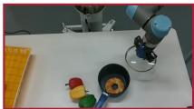  
f = 0

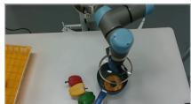  
f = 25

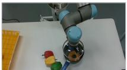  
f = 50

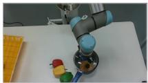  
f = 74

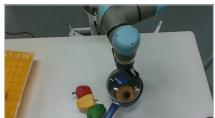  
f = 99

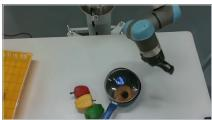  
f = 124

(b) Prompt: “pick up the brown shoe and place it into the blue container”

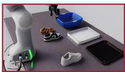  
f = 0

  
f = 50

  
f = 101

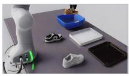  
f = 151

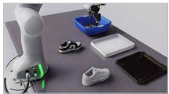  
f = 202

  
f = 252

(c) Prompt: “pull open the drawer”

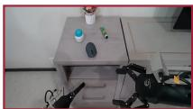  
f = 0

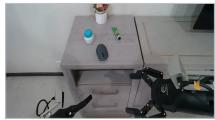  
f = 50

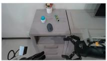  
f = 101

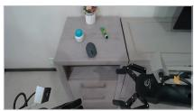  
f = 151

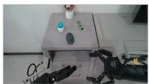  
f = 202

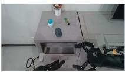  
f = 252

(d) Prompt: “pour water into a bowl”  
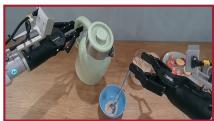  
f = 0

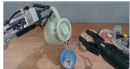  
f = 50

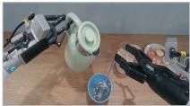  
f = 101

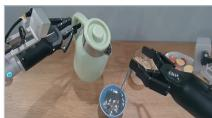  
f = 151

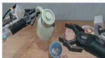  
f = 202

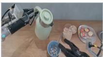  
f = 252

(e) Prompt: “fold the t shirt”

  
f = 0

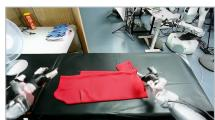  
f = 50

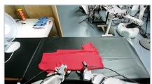  
f = 101

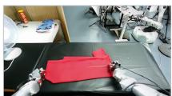  
f = 151

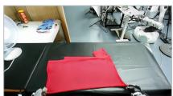  
f = 202

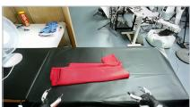  
f = 252

Figure 9 | Task-conditioned video prediction with LongLive2.0-Robot. Five selected text-and-image-to-video (TI2V) examples, with the task prompt shown above each row. � denotes the zero-based frame index. All frames retain the original field of view.

Robotics-1, WorldDreamer, GR00T N1.5/N1.6, GigaWorld-Policy [51], RLDX-1 [21], and PRTS [56], with external baseline scores from the leaderboard [40], except Qwen-RobotManip, whose scores come from its technical report [53].

Video initialization comparisons use Wan2.2 [46], LongLive-2.0 [11], and our LongLive2.0-Robot; GPT-6 Astra serves as the high-level planner in Appendix 6.

## E. Discussion of Asynchronous Overlap Length

We evaluate Long-WAM (IDM) on RoboTwin 2.0 [9], varying the trigger stride � with the execution horizon fixed at � = 24, giving overlaps � = � − � of 12, 8, and 4 control steps. Table 10 reports Long-WAM’s success rate and action continuity under these settings. The � = 12 result is also used for Long-WAM (IDM) in Table 7.

Continuity metrics. Overlap RMSE compares predictions aligned to the same absolute control steps within the overlap of � control steps. Let � contain the non-gripper action dimensions and $d _ { c } = | \mathcal { C } |$ . Using the action chunks

defined in Section 4.1, we compute

$$
E _ { \mathrm { o v l p } } ^ { k } ( S ) = \frac { \| \widehat { \mathbf { A } } _ { t _ { k } } [ S : R , \mathcal { C } ] - \widehat { \mathbf { A } } _ { t _ { k + 1 } } [ 0 : O , \mathcal { C } ] \| _ { F } } { \sqrt { O d _ { c } } } .
$$

Slices are zero-indexed with exclusive upper endpoints. Jerk is a per-step proxy computed from measured non-gripper joint states $q _ { t } \colon$ we take the RMS of $q _ { t + 3 } - 3 q _ { t + 2 } + 3 q _ { t + 1 } - q _ { t }$ over windows that cross a chunk handoff, without dividing by $\Delta t ^ { 3 }$ . Both metrics are computed per episode and then averaged equally over episodes with valid measurements, including successful and failed episodes.

Table 10 | Effect of asynchronous overlap length. With $R = 2 4$ , increasing the trigger stride � shortens the overlap �. RMSE and jerk decrease throughout the tested range, whereas the highest observed success rate (SR) occurs at $S = 1 6$ Stride and overlap are measured in control steps.
<table><tr><td>S</td><td>Overlap O</td><td>SR (%) ↑</td><td>RMSE↓</td><td>Jerk↓</td></tr><tr><td>12</td><td>12</td><td>94.2</td><td>0.0246</td><td>0.0436</td></tr><tr><td>16</td><td>8</td><td>95.0</td><td>0.0063</td><td>0.0156</td></tr><tr><td>20</td><td>4</td><td>94.3</td><td>0.0058</td><td>0.0143</td></tr></table>

Smoothness and decision frequency. Both RMSE and jerk decrease as the overlap shortens, with a larger reduction from 12 to 8 steps than from 8 to 4 steps. This trend motivates the short-overlap execution enabled by streaming VAE (Section 4.1). The success rate does not improve monotonically with smoothness: it rises from 94.2% to 95.0%, then falls to 94.3%. We interpret this pattern as a trade-off between action continuity and decision frequency. At a fixed control interval $\Delta t ,$ , increasing � lengthens the nominal interval between inference decisions, �Δ�, reducing the nominal decision frequency to $f _ { \mathrm { d e c i s i o n } } = 1 / ( S \Delta t )$ when no handoff waits occur. The robot still executes actions at the control rate $1 / \Delta t .$ Slower feedback can therefore offset the benefit of smoother chunk transitions. Minimizing discontinuity alone need not maximize task success.

## F. IDM versus Co-Denoising: Capability and Inference Latency

Long-WAM (IDM) retains video-first causal imagination: it predicts future visual latents independently of action tokens, then denoises actions conditioned on those predictions (Section 3.2). Co-denoising (CoD) instead updates future video and actions jointly, with bidirectional interaction at each denoising step. IDM provides the action expert with an explicit prediction of the future before generating actions, at the cost of sequential video and action inference. IDM achieves modestly higher reported average success rates on both LIBERO and RoboTwin 2.0 (Tables 1 and 2).

Latency protocol. We compare optimized end-to-end inference latency on NVIDIA GeForce RTX 5090, including the full observation VAE computation but excluding preprocessing, text encoding, and controller/IPC overhead. Both variants use video NVFP4, BF16 action compute and KV storage, and observed-video KV reuse. For CoD, the first joint step builds the history KV cache for reuse by later steps; future-video and action KV continue to be updated jointly. Each variant uses its own trained denoising schedule.

Reported latencies are the mean of the medians from two independent processes, each with five excluded warmups and 30 steady-state samples. The cumulative V4/A4 study in Table 8 uses the same aggregation and sample counts, excludes cold stabilization, and includes the full observation VAE and inference computation while excluding setup, text encoding, controller overhead, and IPC. Table 11 combines the IDM measurements from Table 6 with the CoD measurements. These timing runs are separate from the task-success evaluations above; the comparison uses each variant’s trained schedule and cache implementation, so it does not isolate execution order as the sole source of the latency difference.

Capability and compute rate. CoD takes 90.9 ms with V4/A4 and 65.7 ms with V2/A2, compared with 107.4 and 81.8 ms for IDM (Table 11). IDM achieves higher success in the separate task evaluations, while its optimized inference reaches 9.3 and 12.2 Hz at the two budgets. The two-step configuration therefore fits within a 100 ms inference-compute budget. Online execution must also accommodate transfer and scheduling costs (Equation 4); asynchronous execution overlaps inference with ongoing robot motion. The real-world results in Section 6.1 provide separate evidence that IDM’s video-first design supports responsive manipulation.

Table 11 | Optimized IDM and CoD inference on RTX 5090. V4/A4 and V2/A2 use four and two steps per expert, respectively; CoD shares the denoising schedule across experts. Latency includes observation VAE computation. Rates are the reciprocals of inference latencies, not robot control frequencies.
<table><tr><td></td><td colspan="2">V4/A4</td><td colspan="2">V2/A2</td></tr><tr><td>Method</td><td>Latency (ms) ↓</td><td>Rate (Hz) ↑</td><td>Latency (ms) ↓</td><td>Rate (Hz) ↑</td></tr><tr><td>Long-WAM (IDM)</td><td>107.4</td><td>9.3</td><td>81.8</td><td>12.2</td></tr><tr><td>Long-WAM (CoD)</td><td>90.9</td><td>11.0</td><td>65.7</td><td>15.2</td></tr></table>

Table 12 | Context-dependent latency on RTX 5090. End-to-end inference time per action chunk with the Long-WAM infrastructure. Context � counts preceding control intervals, corresponding to �/20 seconds of history; � = 0 retains the current observation.
<table><tr><td>Context P</td><td>History (s)</td><td>Latency (ms) ↓</td></tr><tr><td>0</td><td>0.0</td><td>74.6</td></tr><tr><td>48</td><td>2.4</td><td>107.4</td></tr><tr><td>96</td><td>4.8</td><td>138.3</td></tr><tr><td>192</td><td>9.6</td><td>204.5</td></tr><tr><td>384</td><td>19.2</td><td>341.0</td></tr></table>

Observed-video KV reuse in IDM. Observed-video KV reuse changes token shapes. On RTX 5090, shape-specific dispatch extends the base quantizer’s 588-token tile choice to the 392/196-token inputs produced by reuse. With the complete V4/A4 configuration, latency is 107.4 ms with reuse versus 112.6 ms without it (4.6%). Spark reaches 328.2 ms versus 394.9 ms without reuse (16.9%). With V2/A2, reuse gives no latency reduction on RTX 5090 (81.8 versus 81.3 ms), while latency on Spark decreases from 280.8 to 254.4 ms (9.4%). These comparisons hold the remaining configuration fixed within each device and denoising budget. They differ from the reuse-stage gains in Table 8, which are measured before subsequent device-specific tuning.

## G. Context-Dependent Inference Latency

Table 12 shows efficient long-context inference with our infrastructure on RTX 5090: increasing history eightfold, from 2.4 to 19.2 seconds, raises end-to-end chunk latency from 107.4 to 341.0 ms (approximately 3.2×). These results use the shared optimizations and device-specific tuning in Section 4.2. For online execution, streaming VAE additionally moves prefix encoding ahead of the inference trigger, reducing post-trigger preparation work (Section 4.1).

## H. Additional Real-World Deployment Visualizations

We provide detailed rollouts complementing the real-robot evaluation in Section 6.1. The montages retain the original overview and wrist-camera views, with red annotations marking failure events and green annotations marking successful outcomes. These selected examples illustrate execution behavior; aggregate success rates are reported in the main text.

## H.1. Dynamic Composite Manipulation

Figures 10–12 show dynamic cup stacking on Unitree G1. Long-WAM coordinates grasping the blue cup, intercepting the moving green cup, and nesting it inside the blue cup. The baseline rollouts instead miss the green cup during interception.

π0.5  
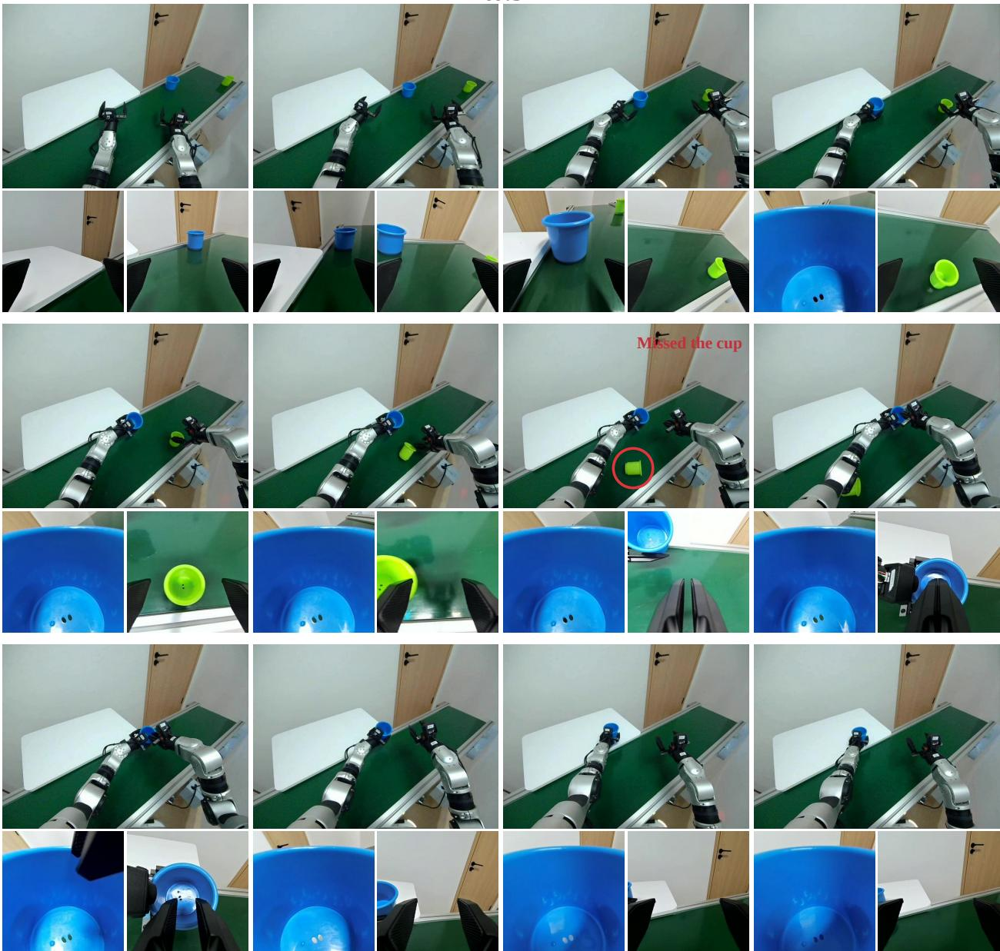  
Figure 10 | Dynamic cup stacking with �0.5. Time progresses left to right within each four-column block, then continues in the next block below; each overview frame is accompanied by two wrist views. The policy grasps the blue cup but misses the moving green cup (red circle), leaving the composite task incomplete.

## H.2. Moving-Object Grasping at Different Speeds

Figures 13–15 compare conveyor grasping at four speeds. The baseline examples expose missed interceptions at higher speeds, whereas Long-WAM completes the illustrated grasp at every speed, consistent with the dynamic-control results in Section 6.1.

## H.3. Long-Horizon Manipulation

Figure 16 shows Long-WAM executing three YAM tasks that require successive object interactions. The sequences illustrate task-directed progress through repeated pickup and placement, complementing the fast dynamic behaviors above. These tasks last over 40 seconds on average (Section 6.1).

Fast-WAM  
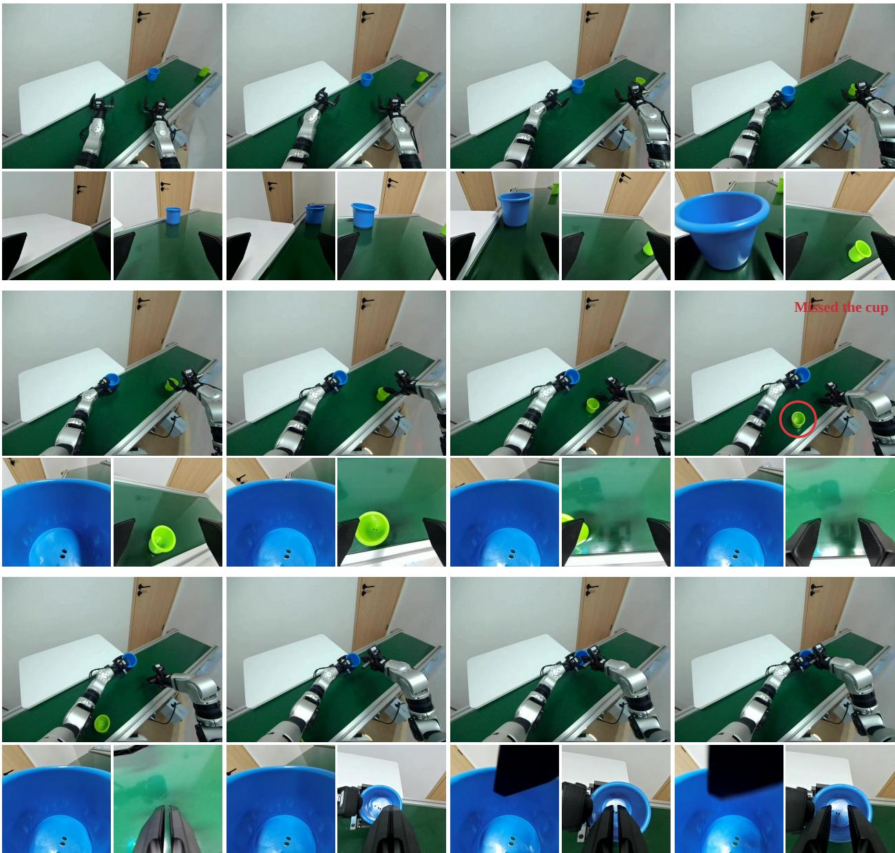  
Figure 11 | Dynamic cup stacking with Fast-WAM. The sequence follows the same reading order as Figure 10. After grasping the blue cup, the policy reaches toward the green cup but misses it as it moves along the conveyor. The subsequent frames show that the nesting stage is not completed.

Long-WAM (Ours)  
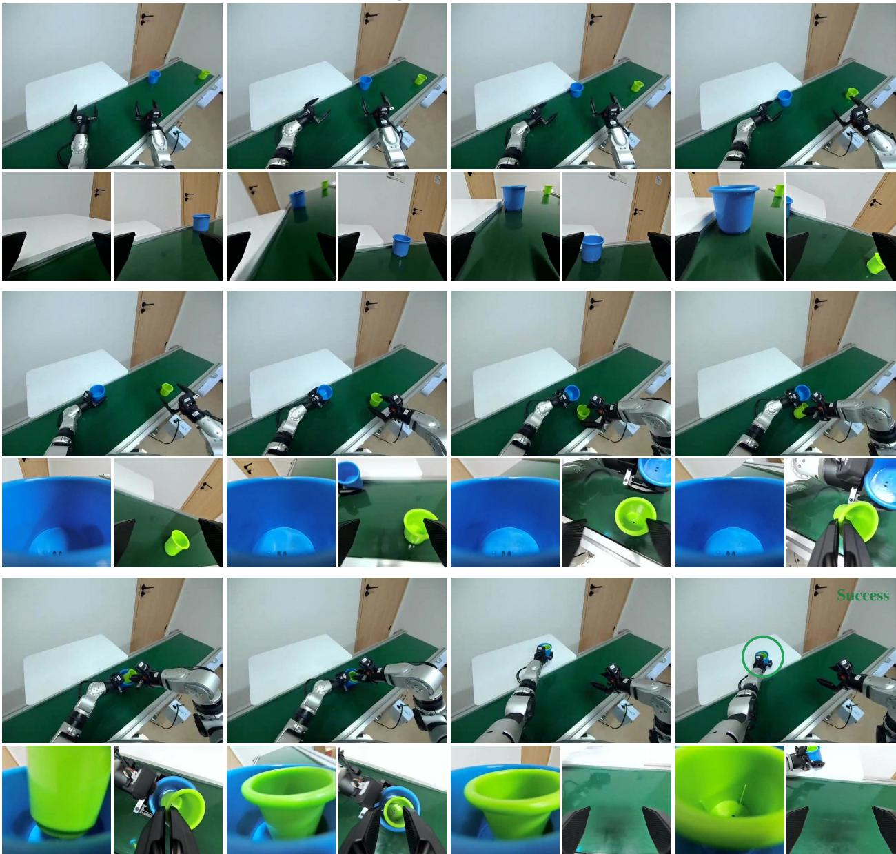  
Figure 12 | Dynamic cup stacking with Long-WAM. Long-WAM grasps the blue cup, intercepts the moving green cup, and places the green cup inside the blue cup. The overview and wrist views reveal the transition from interception to alignment and insertion, illustrating coordinated execution across the stages of this dynamic task.

3.0 cm/s  
4.5 cm/s  
π0.5  
6.0 cm/s  
7.5 cm/s  
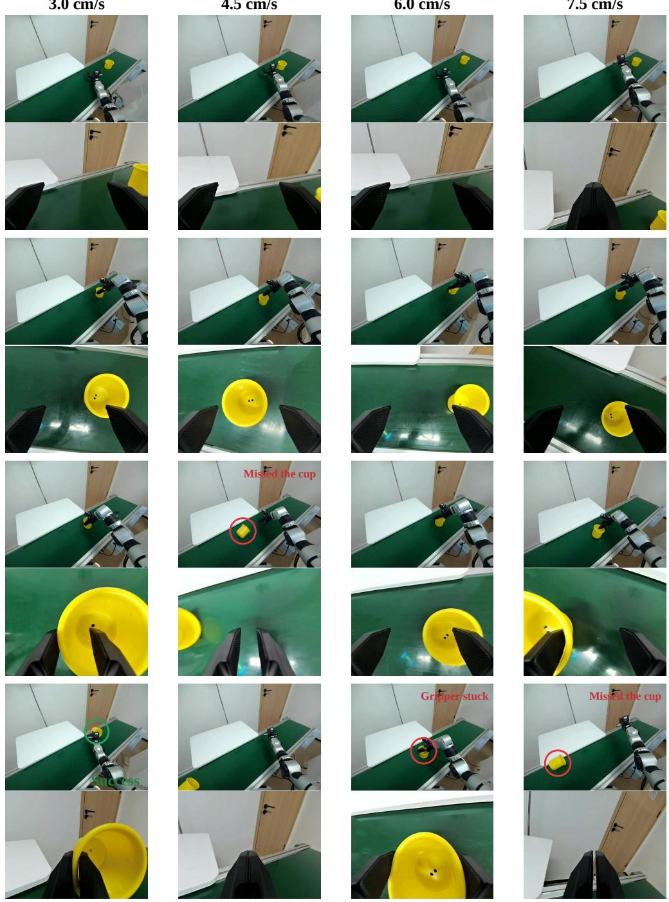  
Figure 13 | Moving-object grasping with $\pi _ { 0 . 5 } .$ . Columns show 3.0, 4.5, 6.0, and 7.5 cm/s; time advances downward through paired overview and wrist views. The selected rollout succeeds at 3.0 cm/s, misses the cup at 4.5 and 7.5 cm/s, and exhibits the annotated gripper-stuck failure at 6.0 cm/s.

3.0 cm/s  
4.5 cm/s  
Fast-WAM  
6.0 cm/s  
7.5 cm/s  
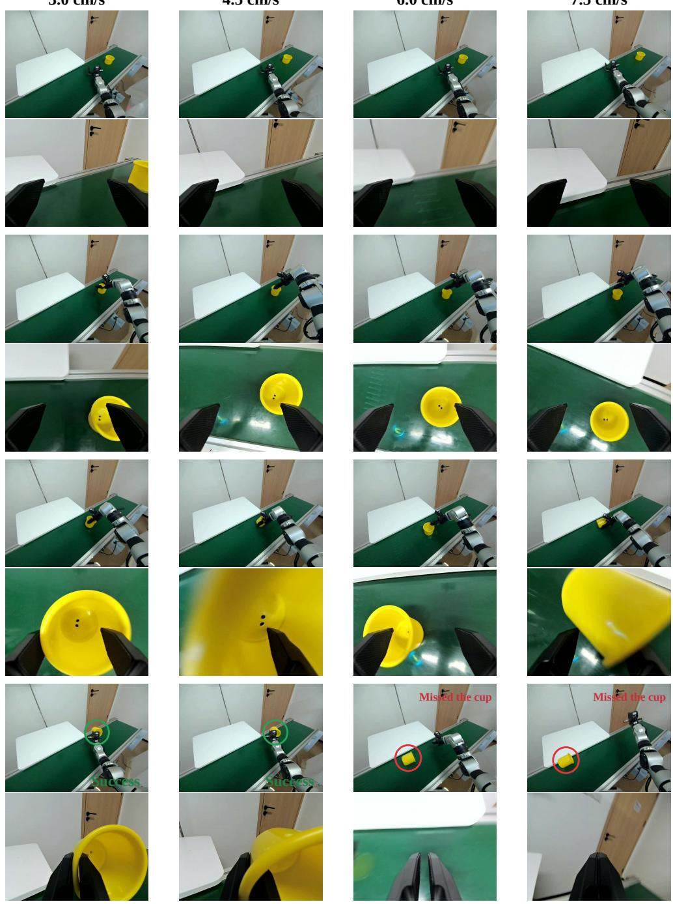  
Figure 14 | Moving-object grasping with Fast-WAM. Columns and temporal ordering match Figure 13. The selected rollouts succeed at 3.0 and 4.5 cm/s but miss the cup at 6.0 and 7.5 cm/s. The wrist views show the target moving beyond the gripper before a secure grasp is established.

3.0 cm/s  
4.5 cm/s  
Long-WAM (Ours)  
6.0 cm/s  
7.5 cm/s  
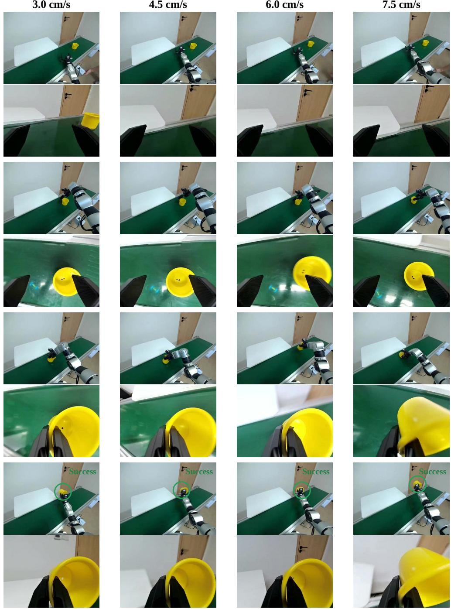  
Figure 15 | Moving-object grasping with Long-WAM. The illustrated rollouts complete the grasp at all four conveyor speeds, including 6.0 and 7.5 cm/s. Successive wrist views show the moving cup entering the gripper and being retained after closure, illustrating responsive interception under progressively tighter timing constraints.

Long-WAM (Ours)  
  
Figure 16 | Long-horizon manipulation with Long-WAM on YAM. Top to bottom: brick sorting by color, placing dumplings in a pan, and stacking bowls. Each task contains six chronological snapshots, read left to right, with paired wrist views below each overview frame. The final snapshots show successful task configurations across all three tasks.