# MORCA: OFFLINE-TO-ONLINE REINFORCEMENT LEARNING FOR ADAPTIVE CACHE REUSE IN VIDEO DIFFUSION ACCELERATION

Yuxiang Xiong<sup>1\*</sup> Ruiyan Wang<sup>1\*</sup> Wenqiang Wang<sup>2\*</sup> Teng Hu<sup>1‡</sup> Songhang Shen<sup>1</sup> Bohao Feng<sup>3</sup> Hongqian Deng<sup>2</sup> Ran Yi<sup>1†</sup>

<sup>1</sup>Shanghai Jiao Tong University <sup>2</sup>Alibaba Cloud Computing <sup>3</sup>Alibaba Token Hub, Alibaba Group

{xiongyuxiang, 22-wry, hu-teng, 1479014299, ranyi}@sjtu.edu.cn {channing.wwq, fengbohao.fbh}@alibabainc.com hongqiandeng@foxmail.com

## ABSTRACT

Diffusion Transformers (DiTs) achieve remarkable performance in video synthesis, but their iterative denoising process suffers from high inference latency. To address this, caching has emerged as an effective acceleration strategy by capitalizing on inter-step redundancy during denoising. Existing dynamic caching methods typically estimate the error that cache reuse would introduce at each denoising step (step error) to guide cache decisions, whereas our concern is how much quality loss cache reuse would cause in the final generated video (terminal error). We show that step error does not directly correspond to terminal error and that latent information helps capture their relationship, thereby informing cache decisions. Moreover, existing threshold-based methods cannot provide precise speedup control, making it difficult to meet practical requirements for user-specified acceleration targets. To address these limitations, we introduce MORCA, a cache scheduling framework trained through offline-to-online reinforcement learning to make latent-aware reuse/recompute decisions under user-specified acceleration targets. Extensive experiments on different video generation models across multiple target acceleration ratios demonstrate that MORCA achieves better generation fidelity than state-of-the-art caching methods under comparable computational budgets. Code is available at https://github.com/x10ngyx/MORCA.

## 1 INTRODUCTION

Diffusion Transformers (DiTs) (Peebles & Xie, 2023) combined with Flow Matching paradigms (Lipman et al., 2023; Liu et al., 2023) have demonstrated remarkable capabilities in highfidelity visual generation (Wan et al., 2025; Kong et al., 2025). Despite this progress, the multi-step iterative denoising process incurs substantial computational cost and high inference latency, particularly for video synthesis. To address this bottleneck, various acceleration approaches have emerged, including distillation, quantization, sparse attention, and caching. Among these, distillation requires additional training of the generative model, while quantization and sparse attention typically rely on specialized kernels. Caching offers a lightweight alternative with flexible speed–quality trade-offs.

Cache-based methods exploit inter-step redundancy by skipping the computation of the entire denoising network or selected components (typically the DiT blocks) at some denoising steps and reusing the corresponding results cached at previous steps. Early methods adopt fixed cache schedules (Ma et al., 2024; Li et al., 2024; Zhao et al., 2025b; Liu et al., 2025b) (e.g., recomputing only at fixed intervals), which do not account for runtime denoising dynamics. Dynamic caching methods (Liu et al., 2025a; Kahatapitiya et al., 2025; Chung et al., 2026; Bu et al., 2026) attempt to estimate the error that cache reuse would introduce at each denoising step and use these estimates to make cache decisions through threshold-based rules.

(a)  
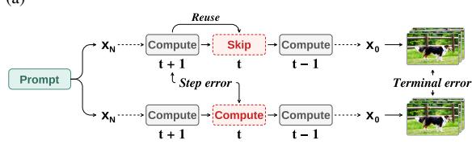

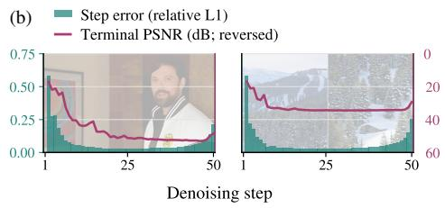  
Figure 1: Step error and terminal error. (a) Following SeaCache, we cache and reuse the residuals of the DiT blocks. For each step, we evaluate two cases: (i) reusing the residual cached at the previous step and (ii) recomputing the DiT blocks, with all other steps computed normally. We measure step error as the relative L1 difference between the cached and recomputed residuals, and terminal error using the PSNR of the resulting video with cache reuse relative to the no-cache reference. (b) Step error does not directly correspond to terminal error. Results are shown for Wan2.1.

However, this paradigm relies exclusively on the immediate error introduced by cache reuse (step error) to make decisions, whereas our concern is the quality loss in the final generated video (terminal error). How the former translates into the latter through subsequent denoising steps remains unclear. To investigate this relationship, we conduct a series of experiments. As shown in Fig. 1, step error exhibits similar patterns across these prompts, while terminal error varies substantially. Quantitative results in Table 1 further show that step error alone is insufficient to accurately predict terminal error.

We propose that latents may contain information that helps capture how step error translates into terminal error, thus informing cache decisions. To test this idea, we train a predictor to estimate terminal error from step error. As reported in Table 1, incorporating lightweight features extracted from the input latents at the current and previous steps (see Sec. 3.2) substantially improves prediction accuracy.

Table 1: Latent features improve terminalerror prediction. Terminal error is measured using PSNR. Results on Wan2.1.
<table><tr><td>Input</td><td>RMSE (dB) ↓ Spearman ↑</td></tr><tr><td>Step error</td><td>6.971 0.5288</td></tr><tr><td>Step error + step index</td><td>4.421 0.7528</td></tr><tr><td>Step error + latent</td><td>2.849 0.9357</td></tr><tr><td>Step error + latent + step index</td><td>2.832 0.9361</td></tr></table>

Motivated by this finding, we train a latent-aware scheduler to make terminal-error-guided cache decisions. We provide the scheduler with SeaCache’s proxy signal for step error (see Sec. 3.1) and latent features to help bridge the gap between step error and terminal error. Given the sequential nature of cache scheduling, we formulate it as a Markov decision process (MDP) and optimize the scheduler using reinforcement learning. In practical applications, users often require a specific acceleration ratio. While existing threshold-based caching methods offer only approximate speedup control through threshold adjustment, we use the observed relationship between speedup and the number of reuse steps (Fig. 3) to translate the target acceleration ratio into a reuse budget constraint, then reduce the resulting constrained MDP to an equivalent standard augmented MDP (Sec. 3.2).

Since collecting training data requires costly inference runs, we adopt an offline-to-online reinforcement learning framework based on IQL (Kostrikov et al., 2022) to train the scheduler. As an off-policy algorithm, IQL offers higher data utilization than on-policy methods. Offline training provides an effective and stable initialization from limited data, while online fine-tuning allows the scheduler to explore under its current policy and further improve performance. Our contributions are summarized as follows:

• We propose MORCA, a latent-aware cache scheduling framework trained through offline-toonline reinforcement learning to make adaptive cache decisions under user-specified speedups.

• We design a budget-constrained and latent-aware scheduler that can make terminal-errorguided cache decisions while precisely controlling the acceleration ratio.

• We introduce an offline-to-online RL paradigm for scheduler optimization: the offline stage provides an effective initialization, while online fine-tuning further improves its performance.

• Extensive experiments on different video generation models demonstrate that MORCA achieves better speed–quality trade-offs than state-of-the-art caching methods.

## 2 RELATED WORK

## 2.1 DIFFUSION INFERENCE ACCELERATION

Existing approaches to accelerating diffusion inference mainly include fast sampling, distillation, quantization, sparse attention, and caching. Fast samplers and numerical solvers reduce model evaluations but may sacrifice quality under aggressive step reduction (Song et al., 2021; Liu et al., 2022; Lu et al., 2022; 2025; Zhao et al., 2023). Distillation enables few-step or one-step generation but requires additional training (Salimans & Ho, 2022; Song et al., 2023; Luo et al., 2023; Yin et al., 2024). Quantization reduces the precision of weights and activations (Shang et al., 2023; Li et al., 2023; He et al., 2023; Zhao et al., 2025a), while sparse attention restricts attention computation to selected token pairs (Xi et al., 2025). Both effectively lower per-step computation but typically rely on specialized kernels to realize inference speedups.

## 2.2 CACHING-BASED DIFFUSION MODEL ACCELERATION

Cache-based acceleration methods exploit inter-step redundancy by skipping computation in all or part of the denoising network at selected steps and reusing previously cached results. These methods can be characterized along three complementary dimensions. Caching Granularity determines what is cached and reused, including layer or DiT-block outputs (Wimbauer et al., 2024; Chen et al., 2024), attention outputs (Zhao et al., 2025b), CFG branch outputs (Lyu et al., 2025), and finergrained token features (Zou et al., 2025). Cache Reuse Strategy determines how cached features are utilized, evolving from direct reuse (Ma et al., 2024; Zhao et al., 2025b) to feature correction or approximation (Lyu et al., 2025; Bu et al., 2026), and further to explicit feature forecasting (Liu et al., 2025b). Caching Schedule determines which steps reuse cached results and which recompute. Early methods typically employ fixed schedules with predefined recomputation steps (Ma et al., 2024; Li et al., 2024; Zhao et al., 2025b; Liu et al., 2025b), which do not adapt to runtime denoising dynamics. Dynamic methods instead estimate the error that cache reuse would introduce at each step and apply threshold-based rules to guide cache decisions. TeaCache uses timestep-modulated input differences as a proxy for output variation, AdaCache further incorporates motion-aware information, DiCache estimates caching errors through shallow-layer probes, and SeaCache derives a spectral-evolutionaware cache signal by suppressing noise-dominated components (Liu et al., 2025a; Kahatapitiya et al., 2025; Bu et al., 2026; Chung et al., 2026). Recent works have also explored learning-based cache scheduling (Zhao et al., 2026b; Xie et al., 2026; Zhao et al., 2026a), which we discuss and compare in detail in Sec. 2.3.

## 2.3 REINFORCEMENT-LEARNING-BASED CACHE SCHEDULING

Cache scheduling is naturally a sequential decision problem suited to reinforcement learning. RAPID<sup>3</sup> is the first work to formulate cache scheduling as an MDP and train a scheduler through reinforcement learning to make cache-reuse decisions at each denoising step (Zhao et al., 2026b). Concurrent with our work, BAG and OnlineCache explore different approaches to learning cache schedules. BAG constructs a high-quality schedule dataset through expensive offline search and distills these schedules into a lightweight gating network for per-step decisions (Zhao et al., 2026a). OnlineCache uses REINFORCE to train a latent-aware scheduler, but its on-policy RL paradigm limits data reuse and training flexibility. Moreover, its reward-based speedup control cannot guarantee meeting user-specified acceleration targets (Xie et al., 2026).

## 3 METHOD

In this section, we present MORCA, an offline-to-online reinforcement learning framework for budget-constrained and latent-aware cache scheduling in video diffusion acceleration, as illustrated in Fig. 2. Building upon SeaCache (Sec. 3.1), MORCA retains its caching granularity and cache reuse strategy while replacing its threshold-based decision rule with a learned scheduler. In addition to SeaCache’s signals and related statistics, the scheduler incorporates latent features and reuse budget dynamics to make terminal-error-guided cache decisions under user-specified acceleration targets (Sec. 3.2). We optimize the scheduler through a two-stage offline-to-online IQL paradigm to achieve both high sample efficiency and strong performance (Sec. 3.3).

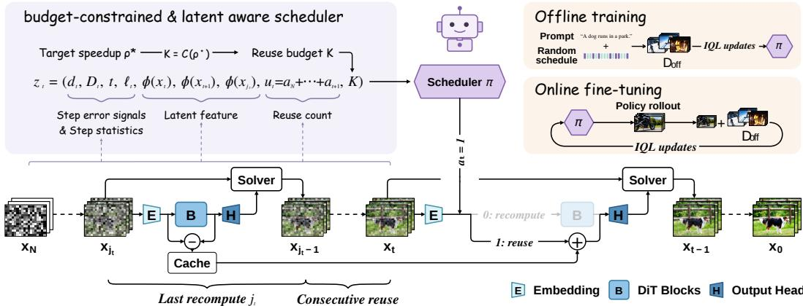  
Figure 2: Overview of MORCA. Bottom: A learned scheduler makes reuse/recompute decisions at each denoising step. Top left: The scheduler is budget-constrained and latent-aware. The target speedup is mapped to the required total number of reuse steps, which, together with step-error proxies and step statistics, latent features, and the current reuse count extracted from the denoising state, is fed into the scheduler for decision-making (Sec. 3.2). Top right: The scheduler is optimized through offline-to-online reinforcement learning using IQL (Sec. 3.3).

## 3.1 PRELIMINARIES

Cache-Based Inference. We first introduce the standard denoising process, followed by a typical cache-based inference pipeline. Given a text condition $c ,$ video generation proceeds through N denoising steps. At step t, the input latent $x _ { t }$ passes through a DiT denoiser comprising an input embedding module $E _ { \theta }$ , a stack of DiT blocks $B _ { \theta }$ , and an output head $H _ { \theta } \colon$

$$
h _ { t } = E _ { \theta } ( x _ { t } ) , \qquad y _ { t } = B _ { \theta } ( h _ { t } , t , c ) , \qquad o _ { t } = H _ { \theta } ( y _ { t } , t ) .\tag{1}
$$

The latent is updated as $x _ { t - 1 } = \mathcal { U } _ { t } ( x _ { t } , o _ { t } )$ , where $\mathcal { U } _ { t }$ denotes the diffusion- or flow-based sampling update rule. With classifier-free guidance (CFG), $o _ { t }$ is replaced by $o _ { t } ^ { \mathrm { C F G } } = o _ { t } ^ { \mathrm { u } } + w \big ( o _ { t } - o _ { t } ^ { \mathrm { u } } \big )$ , where $o _ { t } ^ { \mathrm { u } }$ is computed using the empty or negative text condition $c _ { \mathrm { u } }$ , and w is the guidance scale. After the final denoising step, the latent $x _ { 0 }$ is decoded into a video by the VAE decoder.

Cache-based inference decides whether to recompute or reuse at each denoising step. A binary action $a _ { t } \in \{ 0 , 1 \}$ } determines whether to skip the DiT blocks and directly reuse a previously cached residual $( a _ { t } = 1 )$ or compute the blocks normally $( a _ { t } = 0 )$ . The block residual at step t is defined as $\Delta _ { t } = y _ { t } - h _ { t }$ . Accordingly,

$$
h _ { t } = E _ { \theta } ( x _ { t } ) , \qquad \hat { y } _ { t } = \left\{ \begin{array} { l l } { B _ { \theta } ( h _ { t } , t , c ) , } & { a _ { t } = 0 , } \\ { h _ { t } + \Delta _ { j _ { t } } , } & { a _ { t } = 1 , } \end{array} \right. \qquad \hat { o } _ { t } = H _ { \theta } ( \hat { y } _ { t } , t ) ,\tag{2}
$$

where $j _ { t } =$ min $\{ j > t : a _ { j } = 0 \}$ is the most recent recomputation step.

Under CFG, the two branches typically share $a _ { t }$ but maintain separate residual caches. Their outputs are combined using the same guidance rule for the sampling update. The complete cache schedule is $\mathbf { a } = \left( a _ { N } , \ldots , a _ { 1 } \right)$ .

SeaCache. SeaCache (Chung et al., 2026) applies a Spectral-Evolution-Aware (SEA) filter to the timestep-modulated input latent and uses the filtered representation, denoted by $\widetilde { x } _ { t }$ , to construct a lightweight proxy signal for estimating the relative change between adjacent steps:

$$
d _ { t } = \frac { \| \widetilde { x } _ { t } - \widetilde { x } _ { t + 1 } \| _ { 1 } } { \| \widetilde { x } _ { t + 1 } \| _ { 1 } + \epsilon } .\tag{3}
$$

It further computes the accumulated distance since the most recent recomputation step as $D _ { t } \ =$ $\textstyle \sum _ { i = t } ^ { j _ { t } - 1 } d _ { i }$ and determines the action using a threshold δ: $a _ { t } ^ { \mathrm { S C } } = \mathbb { I } [ D _ { t } \leq \delta ]$

## 3.2 BUDGET-CONSTRAINED AND LATENT-AWARE SCHEDULER

We formulate cache scheduling as a budget-constrained MDP and reduce it to an equivalent standard augmented MDP compatible with standard RL optimization. We then introduce a compact latentaware state representation for efficient scheduler implementation.

Constrained MDP Formulation. Cache scheduling is inherently a sequential decision problem, as each recompute/reuse decision affects subsequent denoising states and therefore has long-term consequences. We formulate it as a finite-horizon MDP $\mathcal { M } \overset { \vartriangle } { = } ( \boldsymbol { \mathcal { S } } , \boldsymbol { \mathcal { A } } , P , \boldsymbol { R } , \boldsymbol { N } )$ At each step $t ,$ $s _ { t } \in S$ denotes the denoising state, and $a _ { t } \in \mathcal { A } = \{ 0 , 1 \}$ denotes the action, with 0 corresponding to recomputation and 1 to cache reuse. The transition dynamics P describe how the denoising state evolves under the selected action through the corresponding denoising update. We define the reward R in terms of the generated video’s quality, measured by its PSNR relative to the no-cache reference $y ^ { \star }$ generated with the same prompt and random seed:

$$
r _ { t } = \left\{ { 0 , \atop \operatorname* { m i n } \{ { \mathrm { P S N R } ( y , y ^ { \star } ) , ~ r _ { \operatorname* { m a x } } } \} } , \quad 1 < t \leq N , \qquad R ( \tau ) = \sum _ { t = 1 } ^ { N } r _ { t } . \right.\tag{4}
$$

where y denotes the video generated under the cache schedule and $r _ { \mathrm { m a x } }$ is a fixed finite cap on PSNR. The horizon N is the number of denoising steps.

Given a target acceleration ratio $\rho ^ { \star } ,$ , we further constrain the computation budget. Since all denoising steps share the same backbone, each reuse operation yields approximately the same computational saving. Empirically, inference latency decreases approximately linearly with the reuse count K and is similar across prompts. Combined with $\rho = T _ { \mathrm { f u l l } } / T _ { \mathrm { i n f } }$ , this yields K ≈ $\alpha { - } \beta / \rho \left( \mathrm { F i g . } 3 \right)$ . We therefore calibrate the target acceleration ratio to a reuse budget $K = \mathcal C ( \bar { \rho } ^ { \star } )$ and formulate cache scheduling as a constrained MDP. We seek to learn a scheduler policy π that maximizes the expected return while satisfying the prescribed reuse budget:

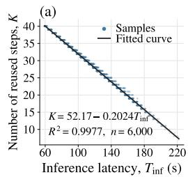

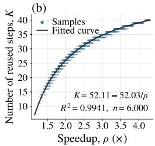  
Figure 3: Calibration of reuse budget K against (a) inference latency and (b) speedup on Wan2.1. The fitted functions take the forms (a) $K = \alpha - \beta T _ { \mathrm { i n f } }$ and (b) $K = \alpha - \beta / \rho$

$$
\operatorname* { m a x } _ { \pi } \mathbb { E } _ { \tau \sim \pi } [ R ( \tau ) ] \mathrm { ~ \quad ~ s . t . ~ } \mathrm { ~ \quad ~ } \sum _ { t = 1 } ^ { N } a _ { t } = K .\tag{5}
$$

Reduction to a Standard MDP. However, RL algorithms generally do not directly guarantee constraint satisfaction. To make the constrained scheduling problem compatible with standard RL optimization, we transform it into an equivalent augmented MDP following the reduction approach of McMahan & Zhu (2024). Let $\begin{array} { r } { u _ { t } = \sum _ { i = t + 1 } ^ { N } a _ { i } } \end{array}$ denote the number of reuse actions already taken and $b _ { t } = K - u _ { t }$ the remaining budget. Since the optimal decision depends on both the current denoising state and the remaining budget, we augment the state as

$$
{ \bar { s } } _ { t } = ( s _ { t } , u _ { t } , K ) .\tag{6}
$$

We further restrict the action set to prevent decisions that make the prescribed reuse budget unattainable. After taking action $a _ { t }$ , the remaining budget $b _ { t } - a _ { t }$ must be achievable within the remaining t − 1 denoising steps. We therefore define the feasible action set as

$$
\bar { \mathcal { A } } _ { t } \big ( \bar { s } _ { t } \big ) = \{ a \in \{ 0 , 1 \} \ | \ 0 \leq b _ { t } - a \leq t - 1 \} .\tag{7}
$$

This construction yields a standard augmented MDP M<sup>¯</sup> that preserves the optimal feasible value and guarantees the prescribed reuse budget. A formal proof is provided in Appendix D.

Latent-Aware State Representation. In the formulation and reduction above, $\bar { s } _ { t }$ denotes the full denoising state needed to determine transition and reward distributions. In practice, we use a simpli fied representation of $\bar { s } _ { t }$ as the scheduler input to control computational overhead. Recall from Sec. 1 that our scheduler aims to make terminal-error-guided decisions. Existing methods already provide effective proxy signals for estimating step error, but this local error does not directly correspond to terminal error (Fig. 1). Latent information helps bridge this gap (Table 1).

Our scheduler input therefore consists of three components. (i) Step-error proxies and related statistics: we retain signals and statistics associated with SeaCache’s cache decisions, including the adjacent-step distance $d _ { t }$ , accumulated distance $D _ { t }$ , current denoising step $t ,$ and number of consecutive reuse steps $\ell _ { t } = j _ { t } - t - 1$ . (ii) Latent information: each latent has shape $C \times T \times H \times W$ where $C , T , H$ , and W denote the channel count, latent frame count, height, and width, respectively. To control computational overhead, we extract compact features instead of using the full latent. We apply 3D pooling to each latent and 2D pooling to its temporal mean and variance. Denoting these pooling operators by $\mathcal { P } _ { 3 }$ and $\mathcal { P } _ { 2 }$ , and the temporal mean and variance by $\mu _ { T } ( x )$ and $\sigma _ { T } ^ { 2 } ( x )$ , respectively, we define $\phi ( x ) \ : = \ : \left( \mathcal { P } _ { 3 } ( x ) , \mathcal { P } _ { 2 } ( \mu _ { T } ( x ) ) , \mathcal { P } _ { 2 } ( \sigma _ { T } ^ { 2 } ( x ) ) \right)$ We use $\phi$ to extract features from latents relevant to the current denoising state: the current latent $x _ { t }$ , the previous-step latent $x _ { t + 1 }$ and the latent at the most recent recomputation step $x _ { j _ { t } }$ . (iii) Budget information: following the reduction above, we include $u _ { t }$ and $K$ to handle the budget constraint. Together, these components form the compact scheduler input:

$$
z _ { t } = ( d _ { t } , D _ { t } , t , \ell _ { t } , \phi ( x _ { t } ) , \phi ( x _ { t + 1 } ) , \phi ( x _ { j _ { t } } ) , u _ { t } , K ) .\tag{8}
$$

## 3.3 OFFLINE-TO-ONLINE REINFORCEMENT LEARNING PARADIGM

Since collecting cache-scheduling trajectories requires expensive video-generation rollouts, we adopt a two-stage offline-to-online reinforcement learning paradigm based on Implicit Q-Learning (IQL) (Kostrikov et al., 2022) to achieve both high sample efficiency and strong performance. As an off-policy algorithm, IQL enables repeated reuse of collected data across optimization updates, unlike on-policy methods such as REINFORCE, which require fresh rollouts under the current policy. In the offline stage, the scheduler learns from a relatively small set of pre-collected random trajectories, providing an effective policy initialization. Starting from this initialization, online fine-tuning enables further exploration and policy improvement.

Offline Training. We randomly sample cache schedules under different prompts and target acceleration ratios, run the video-generation model with these schedules, and convert the resulting trajectories into transition tuples $\left( z _ { t } , a _ { t } , r _ { t } , z _ { t - 1 } \right)$ to construct the training dataset $\mathcal { D } _ { \mathrm { o f f } }$ . Further details of dataset construction are provided in Appendix B.3.

As illustrated in Algorithm 1(a), IQL maintains a value network $V _ { \psi }$ , two Q-networks $Q _ { \theta _ { 1 } }$ and $Q _ { \theta _ { 2 } }$ and their corresponding target networks $Q _ { \bar { \theta } _ { 1 } }$ and $Q _ { \bar { \theta } _ { 2 } }$ . The target networks track the Q-networks through exponential moving average (EMA) updates. IQL trains the Q-functions against temporal difference targets and learns the value function through expectile regression on the target Q-values:

$$
\begin{array} { r } { \mathcal { L } _ { Q } ( \theta _ { i } ) = \mathbb { E } _ { ( z _ { t } , a _ { t } , r _ { t } , z _ { t - 1 } ) \sim \mathcal { D } } \left[ ( r _ { t } + \gamma V _ { \psi } ( z _ { t - 1 } ) - Q _ { \theta _ { i } } ( z _ { t } , a _ { t } ) ) ^ { 2 } \right] , \qquad i = 1 , 2 . } \end{array}\tag{9}
$$

$$
\mathcal { L } _ { V } ( \psi ) = \mathbb { E } _ { ( z _ { t } , a _ { t } ) \sim \mathcal { D } } \left[ \ell _ { \tau } \left( \bar { Q } ( z _ { t } , a _ { t } ) - V _ { \psi } ( z _ { t } ) \right) \right] .\tag{10}
$$

where $\ell _ { \tau } ( u ) = | \tau - \mathbb { I } [ u < 0 ] | u ^ { 2 }$ is the expectile loss, $\begin{array} { r } { \bar { Q } ( z _ { t } , a _ { t } ) = \operatorname* { m i n } _ { i \in \{ 1 , 2 \} } Q _ { \bar { \theta } _ { i } } ( z _ { t } , a _ { t } ) } \end{array}$ , and $\gamma$ is the discount factor. The scheduler policy is then learned through advantage-weighted behavior cloning, assigning larger weights to actions with higher estimated advantages:

$$
\mathcal { L } _ { \pi } ( \varphi ) = - \mathbb { E } _ { ( z _ { t } , a _ { t } ) \sim \mathcal { D } } \left[ \exp \left( \beta A ( z _ { t } , a _ { t } ) \right) \log \pi _ { \varphi } ( a _ { t } \mid z _ { t } ) \right] ,\tag{11}
$$

where $A ( z _ { t } , a _ { t } ) = \bar { Q } ( z _ { t } , a _ { t } ) - V _ { \psi } ( z _ { t } )$ , and β controls advantage weighting. For further details of IQL, we refer readers to Kostrikov et al. (2022).

By learning preferentially from higher-advantage actions in a relatively small dataset of randomly sampled trajectories, the offline stage provides a good initial policy without requiring prior knowledge of effective cache schedules. In contrast, starting online training from scratch may incur substantial unnecessary data collection and training costs under an initially weak policy.

Online Fine-Tuning. Starting from the offline-trained scheduler, we perform online fine-tuning as shown in Algorithm 1(b). In each round, we collect a batch of online trajectories under randomly sampled prompts and target acceleration ratios, sampling each step’s cache decision from the current scheduler policy $\pi _ { \varphi } ( \cdot \mid z _ { t } )$ . These trajectories are added to the replay buffer alongside the offline and previously collected online data. We first perform a short critic-only warm-up with the policy fixed to adapt the Q- and V-networks to the new data, then jointly train the value functions and policy using the same IQL procedure as in offline training. Sampling trajectories from the current policy enables further exploration, while retaining the offline data in the replay buffer helps stabilize learning during fine-tuning.

```latex
Algorithm 1 Offline-to-Online IQL Training for MORCA
(a) Offline training (b) Online fine-tuning
1: Randomly initialize $\psi , \theta _ { 1 } , \theta _ { 2 } , \varphi$ 1: $\mathcal { D }  \mathcal { D } _ { \mathrm { o f f } }$
2: $\begin{array} { r } { \bar { \theta } _ { i }  \theta _ { i } , \quad i = 1 , 2 } \end{array}$ 2: Initialize $\psi , \theta _ { 1 } , \theta _ { 2 } , \bar { \theta } _ { 1 } , \bar { \theta } _ { 2 } , \varphi$ from the offline
3: $\mathcal { D }  \mathcal { D } _ { \mathrm { o f f } }$ training results
4: for each gradient step do 3: for $k \doteq 1 , \ldots , N _ { \mathrm { o n } }$ do
5: CRITICUPDATE 4: Collect new data $\Delta \mathcal { D }$ using $\pi _ { \varphi }$
6: ACTORUPDATE 5: $\mathcal { D }  \mathcal { D } \cup \Delta \mathcal { D }$
7: end for 6: for each gradient step do ▷ warm-up
7: CRITICUPDATE
Shared updates 8: end for
procedure CRITICUPDATE 9: for each gradient step do ▷ joint
$\psi  \psi - \lambda _ { V } \nabla _ { \psi } \mathcal { L } _ { V } ( \psi )$ 10: CRITICUPDATE
$\begin{array} { r } { \dot { \theta } _ { i }  \dot { \theta } _ { i } - \lambda _ { Q } \nabla _ { \theta _ { i } } \mathcal { L } _ { Q } ( \dot { \theta _ { i } } ) , \quad i = 1 , 2 } \end{array}$ 11: ACTORUPDATE
$\bar { \theta } _ { i }  \eta \bar { \theta } _ { i } + ( \dot { 1 } - \dot { \eta } ) \dot { \theta } _ { i } , \quad i = 1 , 2$ 12: end for
end procedure 13: end for
procedure ACTORUPDATE 14: return $\pi _ { \varphi }$
$\varphi  \varphi - \lambda _ { \pi } \nabla _ { \varphi } \mathcal { L } _ { \pi } ( \varphi )$
end procedure
$N _ { \mathrm { o n } }$ is the number of online rounds; $\lambda _ { V } , \lambda _ { Q } , \lambda _ { \pi }$ are learning rates; η is the target-network EMA decay.
```

## 4 EXPERIMENTS

## 4.1 EXPERIMENTAL SETTINGS

Model configurations. We evaluate two pretrained text-to-video models from the Wan family (Wan et al., 2025): Wan2.2-T2V-A14B on NVIDIA RTX A6000 GPUs and Wan2.1-T2V-1.3B on NVIDIA GeForce RTX 4090 GPUs. Both use 50 denoising steps; other inference settings are provided in Appendix A.

Training configurations. We collect 2,500 offline trajectories from 100 prompts for Wan2.2 (25 schedules per prompt), with target speedups in [1.5×, 3.5×], and 4,000 from 1,000 prompts for Wan2.1 (four schedules per prompt), with target speedups in [2.0×, 4.5×]. Offline IQL runs for 200 epochs with a learning rate of $1 \bar { 0 ^ { - 4 } }$ for all networks. Online fine-tuning runs for 16 rounds, each adding 100 trajectories and performing five epochs of critic-only warm-up followed by 20 epochs of joint training, with learning rates of $4 \times \mathrm { 1 0 ^ { - 5 } }$ for the policy network and $1 0 ^ { - 4 }$ for the Q and V networks. Both stages use the AdamW optimizer and a batch size of 256. Further details are provided in Appendix B.

Baseline configurations. We compare against four representative caching-based acceleration methods: TeaCache (Liu et al., 2025a), MagCache (Ma et al., 2025), DiCache (Bu et al., 2026), and SeaCache (Chung et al., 2026). For Wan2.2, only MagCache has an official implementation; we port the others from Wan2.1 with model-specific adaptations. We use their official Wan2.1 implementations directly. Implementation details are provided in Appendix C.

Evaluation protocol. We sample 200 prompts from VBench (Huang et al., 2024) as a fixed evaluation set and measure visual quality using PSNR, SSIM, and LPIPS against no-cache references generated with the same prompts and random seeds. We report inference latency. We compare methods at approximately 1.8×, 2.4×, and 3.0× speedup for Wan2.2, and 2.4×, 3.0×, and 4.0× for Wan2.1. We use lower target speedups for Wan2.2 to preserve generation fidelity, as it is more sensitive to cache reuse.

Table 2: Quantitative comparison with baselines. The best result is highlighted in bold, while the second-best result is underlined.
<table><tr><td>Model</td><td>Target</td><td>Method</td><td>Latency (s)↓</td><td>Speedup↑</td><td>PSNR↑</td><td>SSIM↑</td><td>LPIPS↓</td></tr><tr><td rowspan="18">Wan2.2</td><td></td><td>Original</td><td>990.56</td><td>1.00×</td><td></td><td></td><td></td></tr><tr><td rowspan="5">1.8×</td><td>TeaCache</td><td>562.63</td><td>1.76×</td><td>17.04</td><td>0.5984</td><td>0.2882</td></tr><tr><td>MagCache</td><td>544.78</td><td>1.82×</td><td>16.41</td><td>0.5662</td><td>0.3041</td></tr><tr><td>DiCache</td><td>551.29</td><td>1.80×</td><td>18.51</td><td>0.6516</td><td>0.2232</td></tr><tr><td>SeaCache</td><td>546.99</td><td>1.81×</td><td>19.91</td><td>0.7016</td><td>0.1888</td></tr><tr><td>Ours</td><td>549.19</td><td>1.80×</td><td>22.13</td><td>0.7507</td><td>0.1681</td></tr><tr><td rowspan="5">2.4×</td><td>TeaCache</td><td>415.21</td><td>2.39×</td><td>15.31</td><td>0.5325</td><td>0.3658</td></tr><tr><td>MagCache</td><td>417.22</td><td>2.37×</td><td>15.31</td><td>0.5185</td><td>0.3632</td></tr><tr><td>DiCache</td><td>416.43</td><td>2.38×</td><td>16.51</td><td>0.5759</td><td>0.2923</td></tr><tr><td>SeaCache</td><td>419.76</td><td>2.36×</td><td>17.38</td><td>0.6074</td><td>0.2840</td></tr><tr><td>Ours</td><td>421.15</td><td>2.35×</td><td>19.24</td><td>0.6516</td><td>0.2513</td></tr><tr><td rowspan="5">3.0×</td><td>TeaCache</td><td>322.88</td><td>3.07×</td><td>14.40</td><td>0.4913</td><td>0.4211</td></tr><tr><td>MagCache</td><td>332.74</td><td>2.98×</td><td>13.41</td><td>0.4336</td><td>0.4839</td></tr><tr><td>DiCache</td><td>340.50</td><td>2.91×</td><td>15.54</td><td>0.5259</td><td>0.3623</td></tr><tr><td>SeaCache</td><td>320.41</td><td>3.09×</td><td>14.99</td><td>0.5151</td><td>0.3941</td></tr><tr><td>Ours</td><td>326.93</td><td>3.03×</td><td>16.77</td><td>0.5639</td><td>0.3435</td></tr><tr><td rowspan="20">Wan2.1</td><td></td><td>Original</td><td>255.94</td><td>1.00×</td><td></td><td></td><td></td></tr><tr><td rowspan="5">2.4×</td><td>TeaCache</td><td>106.82</td><td>2.40×</td><td>20.12</td><td>0.7361</td><td>0.1596</td></tr><tr><td>MagCache</td><td>107.54</td><td>2.38×</td><td>22.31</td><td>0.8075</td><td>0.1198</td></tr><tr><td>DiCache</td><td>108.27</td><td>2.36×</td><td>22.28</td><td>0.8139</td><td>0.0992</td></tr><tr><td>SeaCache</td><td>109.00</td><td>2.35×</td><td>22.86</td><td>0.8174</td><td>0.1131</td></tr><tr><td>Ours</td><td>109.68</td><td>2.33×</td><td>23.91</td><td>0.8279</td><td>0.1073</td></tr><tr><td rowspan="5">3.0×</td><td>TeaCache</td><td>87.71</td><td>2.92×</td><td>17.39</td><td>0.6199</td><td></td></tr><tr><td>MagCache</td><td>86.09</td><td>2.97×</td><td>20.04</td><td>0.6888</td><td>0.2674 0.1910</td></tr><tr><td>DiCache</td><td>86.82</td><td>2.95×</td><td>19.69</td><td>0.7170</td><td>0.1813</td></tr><tr><td>SeaCache</td><td>84.66</td><td>3.02×</td><td>18.78</td><td>0.6710</td><td></td></tr><tr><td>Ours</td><td>84.98</td><td>3.01×</td><td>20.95</td><td></td><td>0.2226</td></tr><tr><td rowspan="5">4.0×</td><td>TeaCache</td><td></td><td></td><td></td><td>0.7244</td><td>0.1745</td></tr><tr><td>MagCache</td><td>64.16 64.09</td><td>3.99×</td><td>14.09 17.03</td><td>0.4625</td><td>0.4554</td></tr><tr><td>DiCache</td><td>64.24</td><td>3.99× 3.98×</td><td>14.68</td><td>0.4974 0.4611</td><td>0.3917</td></tr><tr><td>SeaCache</td><td>64.91</td><td>3.94×</td><td>17.13</td><td>0.5840</td><td>0.4198 0.3025</td></tr><tr><td>Ours</td><td>65.49</td><td>3.91×</td><td>18.24</td><td>0.5891</td><td>0.2898</td></tr><tr><td></td><td></td><td></td><td></td><td></td><td></td><td></td></tr></table>

## 4.2 QUANTITATIVE COMPARISON

Table 2 compares MORCA with existing caching methods at comparable speedups. Since MORCA builds on SeaCache by replacing its threshold-based scheduling with a learned scheduler, we focus on this comparison to demonstrate the effectiveness of our learned scheduling policy. On Wan2.2, MORCA achieves the best PSNR, SSIM, and LPIPS at all three target speedups, with PSNR gains over SeaCache of 2.22, 1.86, and 1.78 dB at 1.8×, 2.4×, and 3.0×, respectively. On Wan2.1, it achieves the highest PSNR and SSIM at all three targets, improving PSNR over SeaCache by 1.05, 2.17, and 1.11 dB at 2.4×, 3.0×, and 4.0×, respectively. LPIPS also improves over this baseline at all three settings and is best among all methods at 3.0× and 4.0×. Wan2.2 generally exhibits lower fidelity than Wan2.1 at comparable speedups, suggesting greater sensitivity to cache reuse (Sec. 4.3).

## 4.3 QUALITATIVE COMPARISON

Fig. 4 presents visual comparisons with existing caching methods. As shown, MORCA better pre serves the original structure while retaining fine details, as highlighted in the boxed regions. In particular, we observe that the spatial structure of videos generated by Wan2.2 is more sensitive to cache reuse, leading to relatively lower fidelity metrics. Compared with other methods, MORCA is notably better at preserving the original structure.

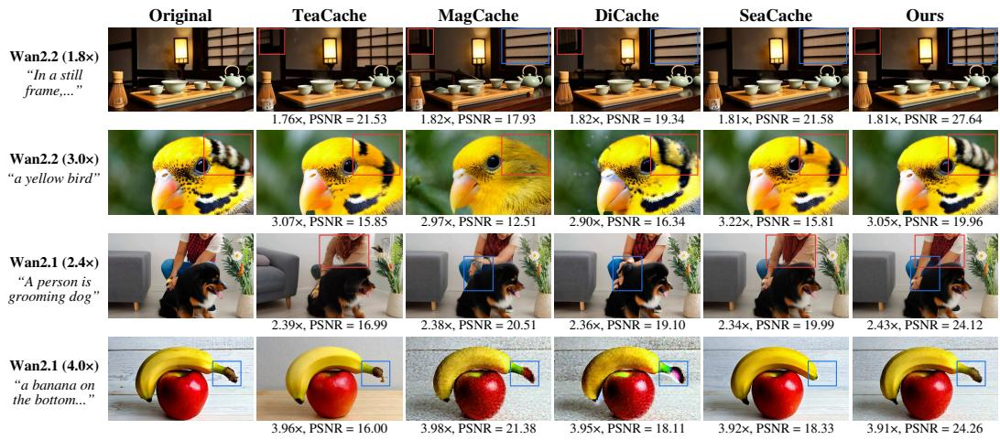  
Figure 4: Qualitative comparison with baselines. Differences are highlighted in the boxed regions.

Table 3: Ablation on Latent-Aware State Design. Offline training results on Wan2.1 at approximately 3.0× speedup.
<table><tr><td>Variant</td><td> $\mathcal { P } _ { 3 } ( x )$ </td><td> $\mathcal { P } _ { 2 } ( \mu _ { T } ( x ) )$ </td><td> $\mathcal { P } _ { 2 } ( \sigma _ { T } ^ { 2 } ( x ) )$ </td><td>Latency (s)↓</td><td>Speedup↑</td><td>PSNR↑</td><td>SSIM↑</td><td>LPIPS↓</td></tr><tr><td>A0</td><td></td><td></td><td></td><td>85.46</td><td>2.99×</td><td>19.93</td><td>0.6420</td><td>0.2240</td></tr><tr><td>A1</td><td>√</td><td>•</td><td></td><td>86.10</td><td>2.97×</td><td>19.92</td><td>0.6515</td><td>0.2273</td></tr><tr><td>A2</td><td></td><td>√</td><td></td><td>86.89</td><td>2.95×</td><td>19.76</td><td>0.6429</td><td>0.2314</td></tr><tr><td>A3</td><td></td><td>•</td><td>√</td><td>85.39</td><td>3.00×</td><td>19.27</td><td>0.6151</td><td>0.2441</td></tr><tr><td>A4</td><td>√</td><td>√</td><td>•</td><td>85.38</td><td>3.00×</td><td>20.06</td><td>0.6598</td><td>0.2197</td></tr><tr><td>A5</td><td>√</td><td>•</td><td>√</td><td>85.29</td><td>3.00×</td><td>19.83</td><td>0.6484</td><td>0.2320</td></tr><tr><td>A₆</td><td></td><td>√</td><td>√</td><td>85.12</td><td>3.01×</td><td>19.71</td><td>0.6402</td><td>0.2362</td></tr><tr><td>Ours</td><td>√</td><td>√</td><td>√</td><td>85.27</td><td>3.00×</td><td>20.38</td><td>0.6873</td><td>0.2036</td></tr></table>

## 4.4 ABLATION AND ANALYSIS

Target Speedup Control. In Table 2, our method achieves mean absolute speedup errors of 0.03 and 0.05, and mean absolute relative inference-time errors of 1.15% and 1.55% on Wan2.2 and Wan2.1, respectively. Note that the number of reuse steps is discrete, so attainable acceleration ratios are also discrete, resulting in unavoidable error in speedup control.

Ablation on Latent-Aware State Design. Table 3 compares scheduler performance with and without latent features in the state representation. The results show that incorporating latent features enables better scheduling decisions.

Ablation on the Training Paradigm. Table 4 examines our training design through three comparisons. With comparable amounts of training data, (i) IQL outperforms REINFORCE, demonstrating the sample efficiency advantage of off-policy learning; and (ii) offline IQL outperforms online IQL trained from scratch, supporting the effectiveness of offline initialization under a limited data budget. Finally, (iii) online fine-tuning further improves the offline-initialized scheduler.

Table 4: Ablation on the Training Paradigm. Results on Wan2.1 at approximately 3.0× speedup.
<table><tr><td>Variant</td><td colspan="3">Latency (s)↓ Speedup↑ PSNR↑ SSIM↑ LPIPS↓</td><td></td><td></td></tr><tr><td colspan="7">(i) IQL vs. REINFORCE</td></tr><tr><td>REINFORCE</td><td>84.66</td><td>3.02×</td><td>18.97</td><td>0.6251</td><td>0.2506</td></tr><tr><td>IQL (offline)</td><td>85.27</td><td>3.00×</td><td>20.38</td><td>0.6873</td><td>0.2036</td></tr><tr><td colspan="6">(ii) Offline-only vs. online-only</td></tr><tr><td>Online-only</td><td>84.65</td><td>3.02×</td><td>18.84</td><td>0.5845</td><td>0.3212</td></tr><tr><td>Offline-only</td><td>85.27</td><td>3.00×</td><td>20.38</td><td>0.6873</td><td>0.2036</td></tr><tr><td colspan="6">(iii) Offline-only vs. offline-to-online</td></tr><tr><td>Offline-only</td><td>85.27</td><td>3.00×</td><td>20.38</td><td>0.6873</td><td>0.2036</td></tr><tr><td>Offline-to-online</td><td>84.98</td><td>3.01×</td><td>20.95</td><td>0.7244</td><td>0.1745</td></tr></table>

## 5 CONCLUSION

We presented MORCA, a cache scheduling framework for accelerating video diffusion models. Motivated by the gap between step error and terminal error that existing methods do not adequately address, along with their limited control over acceleration ratios, we formulated cache scheduling as an MDP, designed a budget-constrained and latent-aware scheduler for terminal-error-guided decisions under user-specified acceleration targets, and optimized it through offline-to-online IQL training. Extensive experiments on different video generation models demonstrate that MORCA achieves better speed–quality trade-offs than state-of-the-art caching methods. As a schedule-level approach, MORCA can potentially be combined with different caching granularities and cache reuse strategies for further gains. Exploring these combinations is a promising direction for future work.

## REFERENCES

Jiazi Bu, Pengyang Ling, Yujie Zhou, Yibin Wang, Yuhang Zang, Dahua Lin, and Jiaqi Wang. Dicache: Let diffusion model determine its own cache. In C. Vondrick, B. Hariharan, C. Raffel, L. Pinto, D. Yang, and A. Faust (eds.), International Conference on Learning Representations, volume 2026, pp. 73778–73803, 2026. URL https://proceedings.iclr.cc/paper\_files/paper/2026/file/ 78288ef33b18a351c3cd679dc9a15c8d-Paper-Conference.pdf.

Pengtao Chen, Mingzhu Shen, Peng Ye, Jianjian Cao, Chongjun Tu, Christos-Savvas Bouganis, Yiren Zhao, and Tao Chen. δ-dit: A training-free acceleration method tailored for diffusion transformers, 2024. URL https://arxiv.org/abs/2406.01125.

Jiwoo Chung, Sangeek Hyun, MinKyu Lee, Byeongju Han, Geonho Cha, Dongyoon Wee, Youngjun Hong, and Jae-Pil Heo. Seacache: Spectral-evolution-aware cache for accelerating diffusion models. In Proceedings of the IEEE/CVF Conference on Computer Vision and Pattern Recognition (CVPR), pp. 14283–14294, June 2026.

Yefei He, Luping Liu, Jing Liu, Weijia Wu, Hong Zhou, and Bohan Zhuang. Ptqd: Accurate post-training quantization for diffusion models. In A. Oh, T. Naumann, A. Globerson, K. Saenko, M. Hardt, and S. Levine (eds.), Advances in Neural Information Processing Systems, volume 36, pp. 13237–13249. Curran Associates, Inc., 2023. doi: 10.52202/ 075280-0580. URL https://proceedings.neurips.cc/paper\_files/paper/ 2023/file/2aab8a76c7e761b66eccaca0927787de-Paper-Conference.pdf.

Ziqi Huang, Yinan He, Jiashuo Yu, Fan Zhang, Chenyang Si, Yuming Jiang, Yuanhan Zhang, Tianxing Wu, Qingyang Jin, Nattapol Chanpaisit, Yaohui Wang, Xinyuan Chen, Limin Wang, Dahua Lin, Yu Qiao, and Ziwei Liu. Vbench: Comprehensive benchmark suite for video generative models. In Proceedings of the IEEE/CVF Conference on Computer Vision and Pattern Recognition (CVPR), pp. 21807–21818, June 2024.

Kumara Kahatapitiya, Haozhe Liu, Sen He, Ding Liu, Menglin Jia, Chenyang Zhang, Michael S. Ryoo, and Tian Xie. Adaptive caching for faster video generation with diffusion transformers. In Proceedings of the IEEE/CVF International Conference on Computer Vision (ICCV), pp. 15240– 15252, October 2025.

Weijie Kong, Qi Tian, Zijian Zhang, Rox Min, Zuozhuo Dai, Jin Zhou, Jiangfeng Xiong, Xin Li, Bo Wu, Jianwei Zhang, Kathrina Wu, Qin Lin, Junkun Yuan, Yanxin Long, Aladdin Wang, Andong Wang, Changlin Li, Duojun Huang, Fang Yang, Hao Tan, Hongmei Wang, Jacob Song, Jiawang Bai, Jianbing Wu, Jinbao Xue, Joey Wang, Kai Wang, Mengyang Liu, Pengyu Li, Shuai Li, Weiyan Wang, Wenqing Yu, Xinchi Deng, Yang Li, Yi Chen, Yutao Cui, Yuanbo Peng, Zhentao Yu, Zhiyu He, Zhiyong Xu, Zixiang Zhou, Zunnan Xu, Yangyu Tao, Qinglin Lu, Songtao Liu, Dax Zhou, Hongfa Wang, Yong Yang, Di Wang, Yuhong Liu, Jie Jiang, and Caesar Zhong. Hunyuanvideo: A systematic framework for large video generative models, 2025. URL https://arxiv.org/abs/2412.03603.

Ilya Kostrikov, Ashvin Nair, and Sergey Levine. Offline reinforcement learning with implicit qlearning. In International Conference on Learning Representations, 2022. URL https:// openreview.net/forum?id=68n2s9ZJWF8.

Senmao Li, Taihang Hu, Joost van de Weijer, Fahad Shahbaz Khan, Tao Liu, Linxuan Li, Shiqi Yang, Yaxing Wang, Ming-Ming Cheng, and Jian Yang. Faster diffusion: Rethinking the role of the encoder for diffusion model inference. In A. Globerson, L. Mackey, D. Belgrave, A. Fan, U. Paquet, J. Tomczak, and C. Zhang (eds.), Advances in Neural Information Processing Systems, volume 37, pp. 85203–85240. Curran Associates, Inc., 2024. doi: 10.52202/ 079017-2706. URL https://proceedings.neurips.cc/paper\_files/paper/ 2024/file/9ad996b5c45130de2bc00b60d8607904-Paper-Conference.pdf.

Xiuyu Li, Yijiang Liu, Long Lian, Huanrui Yang, Zhen Dong, Daniel Kang, Shanghang Zhang, and Kurt Keutzer. Q-diffusion: Quantizing diffusion models. In Proceedings of the IEEE/CVF International Conference on Computer Vision (ICCV), pp. 17535–17545, October 2023.

Yaron Lipman, Ricky T. Q. Chen, Heli Ben-Hamu, Maximilian Nickel, and Matthew Le. Flow matching for generative modeling. In International Conference on Learning Representations, 2023. URL https://openreview.net/forum?id=PqvMRDCJT9t.

Feng Liu, Shiwei Zhang, Xiaofeng Wang, Yujie Wei, Haonan Qiu, Yuzhong Zhao, Yingya Zhang, Qixiang Ye, and Fang Wan. Timestep embedding tells: It’s time to cache for video diffusion model. In Proceedings ofthe IEEE/CVF Conference on Computer Vision and Pattern Recognition (CVPR), pp. 7353–7363, June 2025a.

Jiacheng Liu, Chang Zou, Yuanhuiyi Lyu, Junjie Chen, and Linfeng Zhang. From reusing to forecasting: Accelerating diffusion models with taylorseers. In Proceedings of the IEEE/CVF International Conference on Computer Vision (ICCV), pp. 15853–15863, October 2025b.

Luping Liu, Yi Ren, Zhijie Lin, and Zhou Zhao. Pseudo numerical methods for diffusion models on manifolds. In International Conference on Learning Representations, 2022. URL https: //openreview.net/forum?id=PlKWVd2yBkY.

Xingchao Liu, Chengyue Gong, and Qiang Liu. Flow straight and fast: Learning to generate and transfer data with rectified flow. In International Conference on Learning Representations, 2023. URL https://openreview.net/forum?id=XVjTT1nw5z.

Cheng Lu, Yuhao Zhou, Fan Bao, Jianfei Chen, Chongxuan LI, and Jun Zhu. Dpm-solver: A fast ode solver for diffusion probabilistic model sampling in around 10 steps. In S. Koyejo, S. Mohamed, A. Agarwal, D. Belgrave, K. Cho, and A. Oh (eds.), Advances in Neural Information Processing Systems, volume 35, pp. 5775–5787. Curran Associates, Inc., 2022. doi: 10.52202/ 068431-0418. URL https://proceedings.neurips.cc/paper\_files/paper/ 2022/file/260a14acce2a89dad36adc8eefe7c59e-Paper-Conference.pdf.

Cheng Lu, Yuhao Zhou, Fan Bao, Jianfei Chen, Chongxuan Li, and Jun Zhu. Dpm-solver++: Fast solver for guided sampling of diffusion probabilistic models. Machine Intelligence Research, 22 (4):730–751, Aug 2025. ISSN 2731-5398. doi: 10.1007/s11633-025-1562-4. URL https: //doi.org/10.1007/s11633-025-1562-4.

Simian Luo, Yiqin Tan, Longbo Huang, Jian Li, and Hang Zhao. Latent consistency models: Syn thesizing high-resolution images with few-step inference, 2023. URL https://arxiv.org/ abs/2310.04378.

Zhengyao Lyu, Chenyang Si, Junhao Song, Zhenyu Yang, Yu Qiao, Ziwei Liu, and Kwan-Yee K Wong. Fastercache: Training-free video diffusion model acceleration with high quality. In Y. Yue, A. Garg, N. Peng, F. Sha, and R. Yu (eds.), International Conference on Learning Representations, volume 2025, pp. 33132–33156, 2025. URL https://proceedings.iclr.cc/paper\_files/paper/2025/file/ 518046d86bbc41a0707727c38301ad8e-Paper-Conference.pdf.

Xinyin Ma, Gongfan Fang, and Xinchao Wang. Deepcache: Accelerating diffusion models for free. In Proceedings of the IEEE/CVF Conference on Computer Vision and Pattern Recognition (CVPR), pp. 15762–15772, June 2024.

Zehong Ma, Longhui Wei, Feng Wang, Shiliang Zhang, and Qi Tian. Magcache: Fast video gen eration with magnitude-aware cache. In D. Belgrave, C. Zhang, H. Lin, R. Pascanu, P. Koniusz,

M. Ghassemi, and N. Chen (eds.), Advances in Neural Information Processing Systems, volume 38, Main Conference, pp. 34348–34380. Curran Associates, Inc., 2025. doi: 10.52202/ 085713-1153. URL https://proceedings.neurips.cc/paper\_files/paper/ 2025/file/311207bb626e36a8f1d3eb92aa67af22-Paper-Conference.pdf.

Jeremy McMahan and Xiaojin Zhu. Anytime-constrained reinforcement learning. In Sanjoy Dasgupta, Stephan Mandt, and Yingzhen Li (eds.), Proceedings of The 27th International Conference on Artificial Intelligence and Statistics, volume 238 of Proceedings of Machine Learning Research, pp. 4321–4329. PMLR, 02–04 May 2024. URL https://proceedings.mlr. press/v238/mcmahan24a.html.

William Peebles and Saining Xie. Scalable diffusion models with transformers. In Proceedings of the IEEE/CVF International Conference on Computer Vision (ICCV), pp. 4195–4205, October 2023.

Tim Salimans and Jonathan Ho. Progressive distillation for fast sampling of diffusion models. In International Conference on Learning Representations, 2022. URL https://openreview. net/forum?id=TIdIXIpzhoI.

Yuzhang Shang, Zhihang Yuan, Bin Xie, Bingzhe Wu, and Yan Yan. Post-training quantization on diffusion models. In Proceedings of the IEEE/CVF Conference on Computer Vision and Pattern Recognition (CVPR), pp. 1972–1981, June 2023.

Jiaming Song, Chenlin Meng, and Stefano Ermon. Denoising diffusion implicit models. In International Conference on Learning Representations, 2021. URL https://openreview.net/ forum?id=St1giarCHLP.

Yang Song, Prafulla Dhariwal, Mark Chen, and Ilya Sutskever. Consistency models. In Andreas Krause, Emma Brunskill, Kyunghyun Cho, Barbara Engelhardt, Sivan Sabato, and Jonathan Scarlett (eds.), Proceedings of the 40th International Conference on Machine Learning, volume 202 of Proceedings ofMachine Learning Research, pp. 32211–32252. PMLR, 23–29 Jul 2023. URL https://proceedings.mlr.press/v202/song23a.html.

Team Wan, Ang Wang, Baole Ai, Bin Wen, Chaojie Mao, Chen-Wei Xie, Di Chen, Feiwu Yu, Haiming Zhao, Jianxiao Yang, Jianyuan Zeng, Jiayu Wang, Jingfeng Zhang, Jingren Zhou, Jinkai Wang, Jixuan Chen, Kai Zhu, Kang Zhao, Keyu Yan, Lianghua Huang, Mengyang Feng, Ningyi Zhang, Pandeng Li, Pingyu Wu, Ruihang Chu, Ruili Feng, Shiwei Zhang, Siyang Sun, Tao Fang, Tianxing Wang, Tianyi Gui, Tingyu Weng, Tong Shen, Wei Lin, Wei Wang, Wei Wang, Wenmeng Zhou, Wente Wang, Wenting Shen, Wenyuan Yu, Xianzhong Shi, Xiaoming Huang, Xin Xu, Yan Kou, Yangyu Lv, Yifei Li, Yijing Liu, Yiming Wang, Yingya Zhang, Yitong Huang, Yong Li, You Wu, Yu Liu, Yulin Pan, Yun Zheng, Yuntao Hong, Yupeng Shi, Yutong Feng, Zeyinzi Jiang, Zhen Han, Zhi-Fan Wu, and Ziyu Liu. Wan: Open and advanced large-scale video generative models, 2025. URL https://arxiv.org/abs/2503.20314.

Felix Wimbauer, Bichen Wu, Edgar Schoenfeld, Xiaoliang Dai, Ji Hou, Zijian He, Artsiom Sanakoyeu, Peizhao Zhang, Sam Tsai, Jonas Kohler, Christian Rupprecht, Daniel Cremers, Peter Vajda, and Jialiang Wang. Cache me if you can: Accelerating diffusion models through block caching. In Proceedings of the IEEE/CVF Conference on Computer Vision and Pattern Recognition (CVPR), pp. 6211–6220, June 2024.

Haocheng Xi, Shuo Yang, Yilong Zhao, Chenfeng Xu, Muyang Li, Xiuyu Li, Yujun Lin, Han Cai, Jintao Zhang, Dacheng Li, Jianfei Chen, Ion Stoica, Kurt Keutzer, and Song Han. Sparse videogen: Accelerating video diffusion transformers with spatial-temporal sparsity. In Aarti Singh, Maryam Fazel, Daniel Hsu, Simon Lacoste-Julien, Felix Berkenkamp, Tegan Maharaj, Kiri Wagstaff, and Jerry Zhu (eds.), Proceedings of the 42nd International Conference on Machine Learning, volume 267 of Proceedings of Machine Learning Research, pp. 68208–68224. PMLR, 13–19 Jul 2025. URL https://proceedings.mlr.press/v267/xi25c.html.

Zhikang Xie, Xichen Ye, Yifan Wu, Haoshen Yu, Li chenan, Peizhu Gong, Weizhong Zhang, and Cheng Jin. Onlinecache: Learning dynamic caching policies with error correction for efficient diffusion inference, 2026. URL https://arxiv.org/abs/2607.29398.

Tianwei Yin, Michaël Gharbi, Richard Zhang, Eli Shechtman, Frédo Durand, William T. Freeman, and Taesung Park. One-step diffusion with distribution matching distillation. In Proceedings of the IEEE/CVF Conference on Computer Vision and Pattern Recognition (CVPR), pp. 6613–6623, June 2024.

Tianchen Zhao, Tongcheng Fang, Haofeng Huang, Rui Wan, Widyadewi Soedarmadji, Enshu Liu, Shiyao Li, Zinan Lin, Guohao Dai, Shengen Yan, Huazhong Yang, Xuefei Ning, and Yu Wang. Vidit-q: Efficient and accurate quantization of diffusion transformers for image and video generation. In Y. Yue, A. Garg, N. Peng, F. Sha, and R. Yu (eds.), International Conference on Learning Representations, volume 2025, pp. 65811–65841, 2025a. URL https://proceedings.iclr.cc/paper\_files/paper/2025/file/ a4a1ee071ce0fe63b83bce507c9dc4d7-Paper-Conference.pdf.

Tong Zhao, Mingkun Lei, Yucheng Han, and Chi Zhang. Bag: Budget-aware gating for diffusion caching, 2026a. URL https://arxiv.org/abs/2608.09231.

Wangbo Zhao, Yizeng Han, Zhiwei Tang, Jiasheng Tang, Pengfei Zhou, Kai Wang, Bohan Zhuang, Zhangyang Wang, Fan Wang, and Yang You. Rapidˆ3: Tri-level reinforced acceleration policies for diffusion transformer. In C. Vondrick, B. Hariharan, C. Raffel, L. Pinto, D. Yang, and A. Faust (eds.), International Conference on Learning Representations, volume 2026, pp. 149423– 149446, 2026b. URL https://proceedings.iclr.cc/paper\_files/paper/ 2026/file/f1cf02ce09757f57c3b93c0db83181e0-Paper-Conference.pdf.

Wenliang Zhao, Lujia Bai, Yongming Rao, Jie Zhou, and Jiwen Lu. Unipc: A unified predictorcorrector framework for fast sampling of diffusion models. In A. Oh, T. Naumann, A. Globerson, K. Saenko, M. Hardt, and S. Levine (eds.), Advances in Neural Information Processing Systems, volume 36, pp. 49842–49869. Curran Associates, Inc., 2023. doi: 10.52202/ 075280-2170. URL https://proceedings.neurips.cc/paper\_files/paper/ 2023/file/9c2aa1e456ea543997f6927295196381-Paper-Conference.pdf.

Xuanlei Zhao, Xiaolong Jin, Kai Wang, and Yang You. Real-time video generation with pyramid attention broadcast. In Y. Yue, A. Garg, N. Peng, F. Sha, and R. Yu (eds.), International Conference on Learning Representations, volume 2025, pp. 3296– 3319, 2025b. URL https://proceedings.iclr.cc/paper\_files/paper/2025/ file/092c2d45005ea2db40fc24c470663416-Paper-Conference.pdf.

Chang Zou, Xuyang Liu, Ting Liu, Siteng Huang, and Linfeng Zhang. Accelerating diffusion transformers with token-wise feature caching. In Y. Yue, A. Garg, N. Peng, F. Sha, and R. Yu (eds.), International Conference on Learning Representations, volume 2025, pp. 75467–75488, 2025. URL https://proceedings.iclr.cc/paper\_files/paper/2025/file/ bbe024e0517fe12ac3a8d388b19ff9fe-Paper-Conference.pdf.

## APPENDIX

A Model Configurations. . . 15   
B MORCA Implementation Details . . 15   
B.1 Network Architecture . . 15   
B.2 Training Hyperparameters . . 15   
B.3 Dataset Preparation . . 15   
C Baseline Implementation Details . . . 16   
D Reduction of the Hard-Constrained MDP . . . 17   
E Additional Experiments . . . 18   
E.1 Additional Qualitative Comparisons . . 18   
E.2 Scheduler Overhead . . . 18   
E.3 Detailed Comparisons with SeaCache. . . . 18   
E.3.1 Schedule Visualizations at the Same Reuse Budget . . . . 18   
E.3.2 Additional Target Acceleration Ratios . . . 20   
F Limitations . . . . 20

## A MODEL CONFIGURATIONS

Table 5 summarizes the inference configurations for Wan2.2 and Wan2.1. Both models use 50 denoising steps at a resolution of 832 × 480 and a frame rate of 16 fps. Wan2.2 generates 45- frame videos using DPM++, while Wan2.1 generates 81-frame videos using UniPC. Model-specific settings, including flow shift, CFG scale, and model offloading, are also reported.

Table 5: Inference configurations for Wan2.2 and Wan2.1.
<table><tr><td>Setting</td><td>Wan2.2</td><td>Wan2.1</td></tr><tr><td>Resolution  $\overline { { ( W \times H ) } }$ </td><td>832 × 480</td><td>832 × 480</td></tr><tr><td>Frames</td><td>45</td><td>81</td></tr><tr><td>Frame rate</td><td>16 fps</td><td>16 fps</td></tr><tr><td>Sampler</td><td>DPM++</td><td>UniPC</td></tr><tr><td>Denoising steps</td><td>50</td><td>50</td></tr><tr><td>Flow shift</td><td>12</td><td>5</td></tr><tr><td>CFG scale</td><td>4/3 (high/low)</td><td>5</td></tr><tr><td>Noise-stage boundary</td><td>0.875</td><td>N/A</td></tr><tr><td>Model offloading</td><td>Enabled</td><td>Disabled</td></tr></table>

## B MORCA IMPLEMENTATION DETAILS

## B.1 NETWORK ARCHITECTURE

For both video generation models, we use four separate networks for $\pi _ { \varphi } , Q _ { \theta _ { 1 } } , Q _ { \theta _ { 2 } }$ , and $V _ { \psi }$ . The pooled features of $x _ { t } , x _ { t + 1 }$ , and $x _ { j _ { t } }$ form a $4 8 \times 4 \times 8 \times 8$ spatiotemporal tensor and two $4 8 \times 8 \times 8$ tensors representing temporal means and variances, respectively (batch dimension omitted). The spatiotemporal tensor passes through a 3D CNN branch, while the temporal mean and variance tensors are concatenated along the channel dimension and passed through a 2D CNN branch. Each branch has three convolutional layers of widths (32, 32, 64), followed by adaptive average pooling and flattening, producing 512- and 256-dimensional vectors for the 3D and 2D branches, respectively. Concatenation and a linear projection followed by SiLU map the combined 768-dimensional vector to a 128-dimensional latent embedding. Appending seven scalar state $\mathrm { f e a t u r e s \mathrm { - } } d _ { t } , D _ { t } , t .$ $\ell _ { t } , u _ { t } , K ,$ , and a cache-valid bit—gives a 135-dimensional input to an MLP with two 256-unit hidden layers, each followed by LayerNorm and SiLU. The policy outputs two action logits, each Q-network outputs two action values, and the V-network outputs a scalar. Two additional target Q networks share the architecture of their corresponding Q-networks and are updated through EMA. Only the policy network is needed at inference time. Further implementation details will be provided in the code release.

## B.2 TRAINING HYPERPARAMETERS

Table 6 summarizes the training and IQL settings, where γ denotes the discount factor, τ the expectile level for value regression, and β the advantage-weighting coefficient. The weight cap $w _ { \mathrm { m a x } }$ limits the policy weights as min $( \exp ( \beta \tilde { A } ) , w _ { \mathrm { m a x } } )$ , where $\bar { \tilde { A } }$ is the normalized advantage. The EMA decay η controls target-Q network updates via $\theta _ { \mathrm { t a r g e t } }  \eta \theta _ { \mathrm { t a r g e t } } + ( 1 - \eta ) \theta _ { Q }$

## B.3 DATASET PREPARATION

Data Generation Pipeline. A straightforward way to generate random cache schedules is to independently sample a reuse/recompute decision at each denoising step. However, this is likely to produce trajectories with limited learning value, wasting costly generation rollouts. Instead, we adopt a more stable approach by randomizing at the threshold level: we sample a smooth threshold curve that varies across the N denoising steps, replace SeaCache’s fixed threshold with this curve, and run inference to collect the resulting denoising trajectory.

To generate a random threshold curve, we control three aspects: its mean level, amplitude, and shape. The mean level is determined by mapping a sampled target acceleration ratio $\rho ^ { \star }$ to a threshold center $\mu = g ( \rho ^ { \star } )$ through calibration. A randomly sampled amplitude factor determines the magnitude of threshold variations. To generate the shape, we randomly select a few reference steps from the N denoising steps, sample random relative threshold values at these steps, and apply cubic smoothstep interpolation across all steps. These three factors jointly determine the threshold curve, followed by adjustments to satisfy the required bounds and smoothness constraints.

Table 6: Training and IQL hyperparameters for the two stages, shared across Wan2.2 and Wan2.1.
<table><tr><td>Group</td><td>Setting</td><td>Offline IQL</td><td>Online fine-tuning</td></tr><tr><td rowspan="9">Training</td><td>Training duration</td><td>200 epochs</td><td>16 rounds</td></tr><tr><td>Optimizer</td><td>AdamW</td><td>AdamW</td></tr><tr><td>πLR</td><td>10-4</td><td> $4 \times 1 0 ^ { - 5 }$ </td></tr><tr><td>Q/V LR</td><td>10⁻4</td><td>10⁻4</td></tr><tr><td>Batch size</td><td>256</td><td>256</td></tr><tr><td>Adam betas</td><td>(0.9,0.999)</td><td>(0.9,0.999)</td></tr><tr><td>Adam epsilon</td><td>10-8</td><td>10-8</td></tr><tr><td>Weight decay</td><td>0.01</td><td>0.01</td></tr><tr><td>Maximum gradient norm</td><td>1.0</td><td>1.0</td></tr><tr><td rowspan="8">IQL</td><td>γ</td><td>1.0</td><td>1.0</td></tr><tr><td>τ</td><td>0.7</td><td>0.7</td></tr><tr><td>β</td><td>1.5</td><td>1.0</td></tr><tr><td>Wmax</td><td>30</td><td>20</td></tr><tr><td>η</td><td>0.999</td><td>0.999</td></tr><tr><td>New trajectories</td><td>N/A</td><td>100 per round</td></tr><tr><td>Critic-only warm-up</td><td>N/A</td><td>5 epochs per round</td></tr><tr><td>Joint updates</td><td>N/A</td><td>20 epochs per round</td></tr></table>

After each rollout, we convert the trajectory into N transition tuples. For each step t, we compute the cumulative reuse count $\begin{array} { r } { u _ { t } = \sum _ { i = t + 1 } ^ { N } a _ { i } } \end{array}$ and assign the trajectory’s total reuse count $\begin{array} { r } { K = \sum _ { i = 1 } ^ { N } a _ { i } } \end{array}$ as the reuse budget. We combine these counts with the step-error signals, step statistics, and latent features extracted from the recorded denoising process to construct the state vector $z _ { t } .$ . Using the reward defined in the main text, each trajectory yields N transition tuples:

$$
( z _ { t } , a _ { t } , r _ { t } , z _ { t - 1 } ) , \qquad t = N , \ldots , 1 .
$$

Further implementation details will be provided in the code release.

Dataset scale. We collect 2,500 random cache-scheduling trajectories for Wan2.2 (100 prompts × 25 schedules), covering speedups from 1.5× to 3.5×, and 4,000 for Wan2.1 (1,000 prompts × 4 schedules), covering speedups from 2.0× to 4.5×.

Forced-action handling. We identify two types of forced actions: (1) actions imposed by the exact reuse-budget constraint, when only one action remains feasible; and (2) mandatory recomputation at the first denoising step and the last denoising step, as well as the high-noise/low-noise expertswitching step in Wan2.2. Since these actions are determined by action restrictions rather than policy choices, we exclude the corresponding transitions from the policy loss while retaining them for the standard Q- and V-function updates.

## C BASELINE IMPLEMENTATION DETAILS

For Wan2.2, we port the official Wan2.1 implementations and add mandatory recomputation at the high-noise/low-noise expert-switching step to initialize the newly activated expert’s cache. Mag Cache uses its official Wan2.2 implementation directly. For TeaCache on Wan2.2, we fit separate fourth-degree polynomials for the high- and low-noise stages using 70 calibration prompts. For Wan2.1, we use the official Wan2.1 implementations released by the respective caching methods. Table 7 summarizes the key configurations for three approximate acceleration regimes.

Method-specific settings. TeaCache and SeaCache use use\_ret\_steps=False for both models. For Wan2.1, SeaCache additionally uses power\_exp=3 and power\_const=1. Di-Cache uses probe\_depth=1 for both models, with DCTA enabled and its correction coefficients clipped to [1, 2].

Table 7: Baseline configurations at three target acceleration ratios for each model. $\delta$ denotes the cache threshold, K the maximum number of consecutive reuse steps for MagCache, and R the retention ratio.
<table><tr><td>Model</td><td>Method</td><td>1.8×</td><td>2.4×</td><td>3.0×</td></tr><tr><td>Wan2.2</td><td>TeaCache MagCache DiCache</td><td>δ=0.29  $\delta = 0 . 0 7 2 , K = 2 , R = 0 . 2$   $\delta { = } 0 . 0 7 5 , R { = } 0 . 2$ </td><td>δ=0.45  $\delta = 0 . 1 9 9 , K = 4 , R = 0 . 2$   $\delta { = } 0 . 1 7 2 , R { = } 0 . 2$ </td><td>δ=0.68  $\delta = 0 . 1 9 8 , K = 5 , R = 0 . 1$   $\delta = 0 . 3 9 6 , R { = } 0 . 2$ </td></tr><tr><td>Model</td><td>SeaCache Method</td><td>δ=0.24 2.4×</td><td>δ=0.38 3.0×</td><td>δ=0.55 4.0×</td></tr><tr><td></td><td>TeaCache</td><td>δ=0.142</td><td>δ=0.195</td><td>δ=0.36</td></tr><tr><td>Wan2.1</td><td>MagCache DiCache SeaCache</td><td> $\delta = 0 . 1 5 0 0 , K = 6 , R = 0 . 2$   $\begin{array} { c } { \delta = 0 . 1 5 5 , R { = } 0 . 2 } \\ { \delta = 0 . 2 8 } \end{array}$ </td><td> $\delta = 0 . 9 2 4 6 , K = 8 , R = 0 . 2$  δ=0.365, R=0.2 δ=0.47</td><td> $\delta = 8 . 0 , K = 4 0 , R = 0 . 2$  δ=12.0, R=0.17 δ=0.7</td></tr></table>

## D REDUCTION OF THE HARD-CONSTRAINED MDP

We use the MDP and terminal reward defined in the main text, with $s _ { t }$ denoting the full Markov state and $P _ { t }$ denoting the step-t transition kernel corresponding to $P$ in the main text. Assume standard Borel state spaces and measurable transition and reward kernels. PSNR is capped at the fixed finite maximum $r _ { \mathrm { m a x } }$ defined in the main text, yielding bounded rewards for videos in a fixed bounded pixel range.

The displayed formulas assume that every step permits reuse. Fix an integer budget $K \in$ $\{ 0 , \ldots , N \}$ . Let $b _ { t } ~ = ~ K - u _ { t }$ denote the remaining reuse budget, as in the main text. Recall the augmented state and action restriction:

$$
\begin{array} { c } { \displaystyle { \bar { s } _ { t } = ( s _ { t } , u _ { t } , K ) , \qquad u _ { t } = \sum _ { i = t + 1 } ^ { N } a _ { i } , } } \\ { \displaystyle { \bar { \mathcal { A } } _ { t } ( \bar { s } _ { t } ) = \{ a \in \{ 0 , 1 \} : 0 \leq b _ { t } - a \leq t - 1 \} . } } \end{array}\tag{12}
$$

Only integer counts satisfying $0 \leq u _ { t } \leq \operatorname* { m i n } \{ K , N - t \}$ and $0 \leq b _ { t } \leq t$ are included. The augmented process preserves the initial distribution and transitions $P _ { t }$ of the original state component and all rewards, with $u _ { N } = 0$ and $u _ { t - 1 } = u _ { t } + a _ { t }$ . Predetermined recomputation steps are handled by excluding reuse at those steps and adjusting the budget range, bounds on the cumulative reuse count, and action restriction to count only steps at which reuse is permitted.

Proposition D.1. Let $\Pi _ { K } ^ { \mathrm { h i s t } }$ denote all possibly randomized history-dependent policies satisfying $\textstyle \sum _ { t = 1 } ^ { N } a _ { t } = K$ almost surely. Let $\bar { \Pi } ^ { \mathrm { h i s t } }$ and $\bar { \Pi } ^ { \mathrm { d e t } }$ denote, respectively, all admissible possibly randomized history-dependent policies and all admissible time-dependent deterministic Markov policies of the augmented MDP. The reduction guarantees exactly K reuse actions almost surely and preserves the optimal feasible value:

$$
\operatorname* { s u p } _ { \pi \in \Pi _ { K } ^ { \mathrm { h i s t } } } \mathbb { E } _ { \tau \sim \pi } [ R ( \tau ) ] = \operatorname* { m a x } _ { \bar { \pi } \in \bar { \Pi } ^ { \mathrm { d e t } } } \mathbb { E } _ { \bar { \tau } \sim \bar { \pi } } [ R ( \bar { \tau } ) ] ,\tag{13}
$$

where $R ( \bar { \tau } )$ denotes the unchanged return along the corresponding original trajectory.

Proof. The augmented process is Markov because $s _ { t }$ is Markov and the count update is deterministic.

Step 1. Feasibility. It is straightforward to verify that the augmented action sets are nonempty at every nonterminal state, every admissible augmented policy satisfies the prescribed reuse budget almost surely, and every feasible original policy respects the augmented action restriction almost surely.

Step 2. Policy correspondence. Since cumulative counts are determined by the original history, any feasible original policy can be represented as an admissible augmented policy by adding these counts, and any admissible augmented policy can be executed in the original process by maintaining them. In either direction, corresponding policies induce identical original state-action trajectory distributions and equal expected returns, with measurable feasible actions assigned on histories of probability zero where necessary. Consequently,

$$
\operatorname* { s u p } _ { \pi \in \Pi _ { K } ^ { \mathrm { h i s t } } } \mathbb { E } _ { \tau \sim \pi } [ R ( \tau ) ] = \operatorname* { s u p } _ { \bar { \pi } \in \bar { \Pi } ^ { \mathrm { h i s t } } } \mathbb { E } _ { \bar { \tau } \sim \bar { \pi } } [ R ( \bar { \tau } ) ] .\tag{14}
$$

Step 3. Markov optimality. Since the terminal reward is included in $r _ { 1 }$ , set $\bar { V } _ { 0 } ^ { \star } = 0$ and define the optimal action-value and value functions of the augmented MDP backward along the denoising trajectory, in the order $t = 1 , \ldots , N$

$$
\begin{array} { r l } & { \bar { Q } _ { t } ^ { \star } ( \bar { s } , a ) = \mathbb { E } \big [ r _ { t } + \bar { V } _ { t - 1 } ^ { \star } \big ( \bar { s } _ { t - 1 } \big ) \mid \bar { s } _ { t } = \bar { s } , \ a _ { t } = a \big ] , } \\ & { \quad \bar { V } _ { t } ^ { \star } ( \bar { s } ) = \underset { a \in \bar { \mathcal { A } } _ { t } ( \bar { s } ) } { \operatorname* { m a x } } \bar { Q } _ { t } ^ { \star } ( \bar { s } , a ) . } \end{array}\tag{15}
$$

The value functions are bounded and measurable, and the finite nonempty action sets admit a measurable maximizing rule $f _ { t } ,$ , with ties broken by choosing the smaller action. For any $\bar { \pi } \in \bar { \Pi } ^ { \mathrm { h i s t } }$ backward induction from the terminal state $t = 0$ , using the tower property and the Markov transition, gives almost surely, for $1 \leq t \leq N$

$$
\mathbb { E } ^ { \bar { \pi } } \left[ \sum _ { i = 1 } ^ { t } r _ { i } \mid \bar { h } _ { t } \right] \leq \sum _ { a \in \bar { \mathcal { A } } _ { t } ( \bar { s } _ { t } ) } \bar { \pi } _ { t } ( a \mid \bar { h } _ { t } ) \bar { Q } _ { t } ^ { \star } ( \bar { s } _ { t } , a )\tag{16}
$$

where $\bar { h } _ { t }$ is the augmented history through time t. Under $f = \left( f _ { N } , \ldots , f _ { 1 } \right)$ , equality holds throughout. Integrating over the initial state distribution shows that f attains the optimal expected return over all admissible augmented history-dependent policies. Together with the policy correspondence, this proves the proposition. □

## E ADDITIONAL EXPERIMENTS

## E.1 ADDITIONAL QUALITATIVE COMPARISONS

Figs. 7 and 8 present additional qualitative comparisons between MORCA and the baseline methods on Wan2.2 and Wan2.1, respectively, at three target acceleration ratios.

## E.2 SCHEDULER OVERHEAD

We additionally measure the time spent on scheduler execution and calculate its proportion of the total inference time. As shown in Table 8, this proportion is approximately 1%, indicating acceptable overhead.

Table 8: Scheduler overhead on Wan2.2. The scheduler introduces acceptable overhead.
<table><tr><td>Target</td><td>Latency (s)</td><td>Scheduler time (s)</td><td>Proportion (%)</td></tr><tr><td>1.8×</td><td>549.19</td><td>3.95</td><td>0.72</td></tr><tr><td>2.4×</td><td>421.15</td><td>3.94</td><td>0.94</td></tr><tr><td>3.0×</td><td>326.93</td><td>3.93</td><td>1.20</td></tr></table>

## E.3 DETAILED COMPARISONS WITH SEACACHE

## E.3.1 SCHEDULE VISUALIZATIONS AT THE SAME REUSE BUDGET

Fig. 5 visualizes the cache schedules of MORCA and SeaCache under the same reuse budgets. MORCA learns schedules that differ from SeaCache’s and achieves better generation fidelity in both examples.

(a) 1.8×, K = 24  
(b) 3.0×, K = 36 “a hair drier on the right of a toothbrush, front view”  
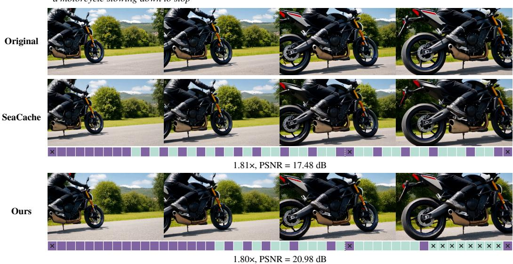

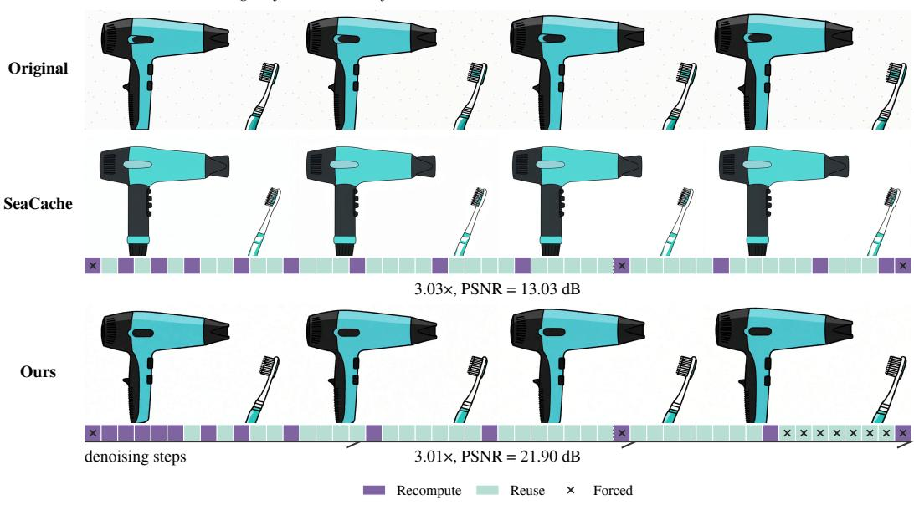  
Figure 5: Visualization of schedules and corresponding generation results under the same reuse budget on Wan2.2.

## E.3.2 ADDITIONAL TARGET ACCELERATION RATIOS

We compare MORCA with SeaCache on Wan2.2 at nine target acceleration ratios ranging from 1.5× to 3.5× in increments of 0.25×. As shown in Fig. 6, MORCA consistently outperforms SeaCache in PSNR, SSIM, and LPIPS across all settings.

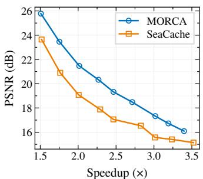  
(a)

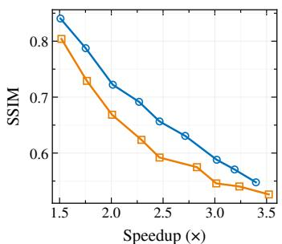  
(b)

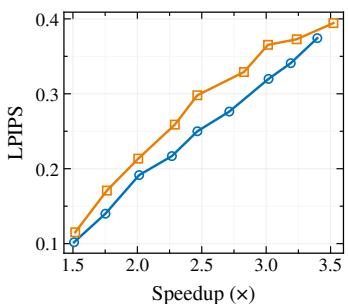  
(c)  
Figure 6: Speed–quality trade-offs of MORCA and SeaCache on Wan2.2. MORCA consistently achieves better fidelity at comparable speedups.

## F LIMITATIONS

Due to differences in denoising dynamics across models, MORCA’s learned scheduler cannot be directly transferred between models and requires separate training for each model. This introduces additional costs for collecting cache-scheduling trajectories and optimizing the scheduler. These costs may limit its practical adoption when training resources are constrained.

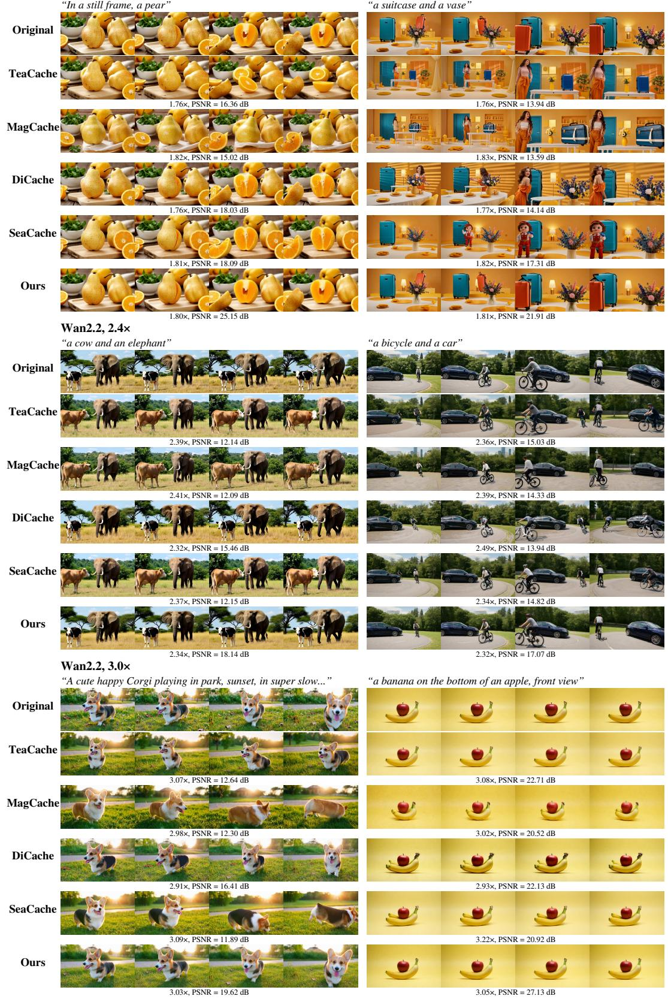  
Figure 7: Additional qualitative comparisons on Wan2.2. From top to bottom: target acceleration ratios of 1.8×, 2.4×, and 3.0×.

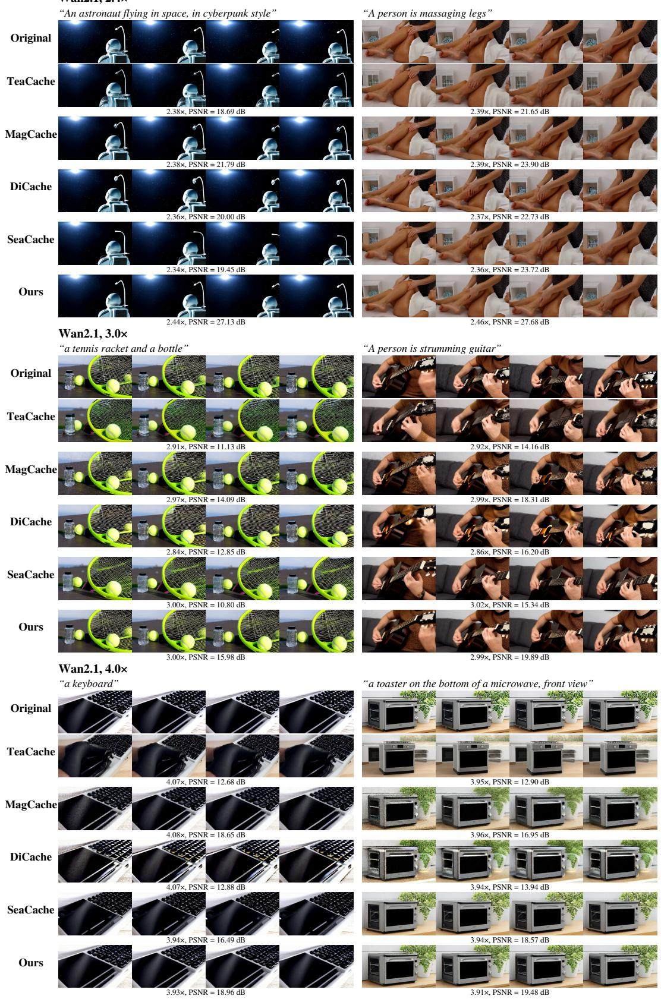  
Figure 8: Additional qualitative comparisons on Wan2.1. From top to bottom: target acceleration ratios of 2.4×, 3.0×, and 4.0×.