# Distilling Routed 3D Privilege for Spatial Reasoning in Vision-Language Models

Hongxing Li1,∗, Yixin Li1,∗, Dingming Li1, Zixuan Wang1, Yuchen Yan1, Wenqi Zhang1, Weiming Lu1, Yongliang Shen1,†

1Zhejiang University {hongxing.li, syl}@zju.edu.cn

## Abstract

Spatial reasoning remains a persistent weakness of visionlanguage models (VLMs), because RGB inputs do not directly provide geometric evidence. Existing remedies either inject 3D into the model at inference, paying architecture and latency costs, or train with outcome rewards that supervise only the final answer. Spatial errors originate in perception: a misjudged depth or direction can be corrected only by the scene’s true geometry, which the 3D-scanned sources of spatial training corpora already provide. We propose GPD (Geometry Privileged Distillation), which makes geometric evidence the privilege in on-policy self-distillation (OPSD). For each question, depth, semantic, and bird’s-eye-view (BEV) cues are rendered as compact text and routed to the teacher alongside the reference answer; a privileged KL, applied only to incorrect trajectories, augments GRPO, and the deployed model remains RGB-only. On the 4B backbone, GPD achieves 57.1 on VSI-Bench and 37.6 average across MindCube, SPAR-Bench, MMSI-Bench, and ViewSpatial, outperforming both GRPO and answer-privileged OPSD across spatial reasoning benchmarks. Ablations confirm the complementarity of 3D and answer privilege, the advantage of question-conditioned routing over full-context injection, and the benefit of restricting distillation to incorrect trajectories. Our code is available at https://github.com/ZJU-REAL/GPD.

## 1 Introduction

Spatial reasoning requires a vision-language model (VLM) to judge distance, direction, and layout, as in planning a route, grasping the nearest object, or estimating how far a sofa is from a door. Benchmarks consistently show that these judgments remain dificult for current VLMs (Yang et al. 2025a; Wang et al. 2025; Zhang et al. 2025; Yang et al. 2025b; Li et al. 2025a). The dificulty stems from the input: RGB frames do not directly provide geometric evidence, so the model must infer depth and layout from appearance alone.

Two lines of work address this gap. Explicit 3D methods integrate geometric encoders or representations into the model (Chen et al. 2024; Cheng et al. 2024; Wu et al. 2026; Zheng, Huang, and Wang 2025), or invoke perception and reconstruction tools at test time (Han et al. 2025; Chen et al. 2026; Cho et al. 2026; Qi et al. 2025), at the cost of architectural changes and additional inference overhead. Training-based methods adapt the model on spatial question-answering data through supervised fine-tuning or outcome-based reinforcement learning (Ouyang et al. 2025; Li et al. 2025b; Ma et al. 2025); RGB-only inference is preserved, but supervision comes only from the final answer, so a geometric error along the reasoning chain, such as a wrong depth order or a flipped left–right relation, is neither localized nor corrected.

The two lines thus sit on opposite sides of a trade-of: explicit 3D methods gain geometric evidence but add inference overhead, while training-based methods keep inference RGB-only but train without geometric supervision. Yet at training time, geometry is readily available: spatial corpora derived from 3D scans provide depth, semantics, and layout directly, and of-the-shelf models can estimate the same signals otherwise. These 3D signals cannot serve as inputs at deployment, but they can supervise training as privileged information. The question is how to turn this privilege into supervision that an RGB-only model can internalize.

A natural starting point is on-policy self-distillation (OPSD) (Zhao et al. 2026; Yang et al. 2026), which converts privilege into supervision: the student samples responses from the task input alone, while the same model, additionally given the privileged context, scores each sampled token as a teacher. In spatial reasoning, however, errors originate in perception: the model misjudges depth, position, or extent, then reasons coherently over the wrong facts. The reference answer, the standard privilege in OPSD, cannot correct such errors: a misjudged depth or direction can be corrected only by the scene’s true geometry. The privilege must instead supply geometric evidence matched to the question: counting, distance, and layout each rest on diferent evidence.

We introduce GPD, an on-policy self-distillation framework that provides the teacher with question-relevant geometric evidence. For each query, GPD constructs textual cues from depth, semantic segmentation, and bird’s-eye-view (BEV) layouts, and presents the routed cues to the teacher together with the reference answer. The student samples trajectories from RGB observations and the question, while the same VLM, conditioned on the privileged context, re-scores these trajectories token by token. GPD combines this distillation signal with GRPO and applies the privileged KL only to incorrect trajectories, concentrating process supervision on trajectories that require correction. The privilege thus enters only through the training signal, and the deployed model remains RGB-only. Figure 1 illustrates the distinction between GPD and the two prior paradigms.

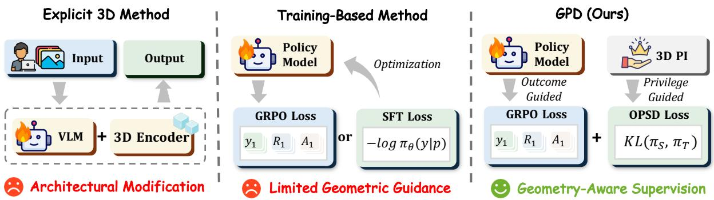  
Figure 1: Comparison of three paradigms for spatial reasoning in VLMs: explicit 3D methods that require architectural modification, training-based methods that rely on outcome-only supervision, and GPD that introduces question-routed 3D cues as training-time privilege.

We evaluate GPD with Qwen3-VL-Instruct backbones at 2B and 4B scales on five spatial reasoning benchmarks. On the 4B backbone, GPD achieves 57.1 on VSI-Bench (Yang et al. 2025a) and 37.6 average across MindCube (Wang et al. 2025), SPAR (Zhang et al. 2025), MMSI (Yang et al. 2025b), and ViewSpatial (Li et al. 2025a), outperforming both GRPO and answer-privileged OPSD. Ablations confirm the efectiveness of each component. Further analysis indicates that the geometric cues have been internalized by the student model. Together, these results establish question-routed geometric privilege as efective supervision for spatial reasoning. Our contributions are threefold:

• We formulate geometry-aware privileged self-distillation for spatial reasoning, where the teacher is equipped with spatially grounded evidence, enabling meaningful tokenlevel distillation along incorrect reasoning trajectories.

• We propose GPD, equipping an OPSD teacher with question-routed depth, semantic, and BEV cues, concentrating token-level distillation on incorrect trajectories while retaining RGB-only inference.

• Experiments across two model scales and five benchmarks demonstrate consistent improvements over GRPO and answer-privileged OPSD, with ablations validating the key design choices.

## 2 Related Work

Spatial Reasoning in VLMs. Existing work improves spatial reasoning in VLMs through explicit 3D augmentation or training-based adaptation. Explicit methods integrate geometric encoders or representations into VLMs (Chen et al. 2024; Cheng et al. 2024; Wu et al. 2026), or use auxiliary perception, reconstruction, and tool-based pipelines at inference time (Han et al. 2025; Chen et al. 2026; Cho et al. 2026). Training-based methods instead apply supervised fine-tuning or outcome-based reinforcement learning to spatial questionanswering data (Ouyang et al. 2025; Li et al. 2025b; Ma et al. 2025). GPD connects these directions by using 3D cues as teacher-side training privilege, providing geometry-aware token-level supervision while leaving the student architecture and inference inputs unchanged.

On-policy Self-distillation. Knowledge distillation transfers information through teacher distributions (Hinton, Vinyals, and Dean 2015). OPSD extends this idea to onpolicy reasoning by conditioning a teacher on privileged information and re-scoring student rollouts token by token (Zhao et al. 2026; Yang et al. 2026). Recent studies examine the stability and refinement of this supervision (Kim and Lee 2026; Shen et al. 2026; Kaur et al. 2026), while multimodal variants use privileged crops, zoomed views, or visual-thought traces (Yuan et al. 2026; Cai et al. 2026; Li et al. 2026). GPD instead constructs question-routed textual privilege from depth, semantics, and BEV layouts, and applies distillation only to incorrect trajectories.

## 3 Method

## 3.1 Overview of GPD

GPD addresses a core tension in spatial reasoning: 3D geometric cues such as depth, layout, and object positions are highly informative for training, yet unavailable at inference when only RGB images and text are observed. Rather than discarding this information or requiring it at test time, GPD uses it as training-time privilege to guide policy learning.

As illustrated in Figure 2, the method proceeds in two stages. First, for each training sample, GPD constructs compact textual summaries of depth, semantic, and BEV cues ofline, then routes only the question-relevant subset to form a privileged context for the teacher. Second, during training, the same VLM plays two roles: as a student conditioned only on RGB and question, it samples on-policy trajectories; as a privileged teacher additionally conditioned on the routed 3D cues and reference answer, it re-scores those trajectories token by token. Training combines outcome-based GRPO (Shao et al. 2024) with privilege-guided distillation applied selectively to incorrect trajectories, leaving the inference interface unchanged.

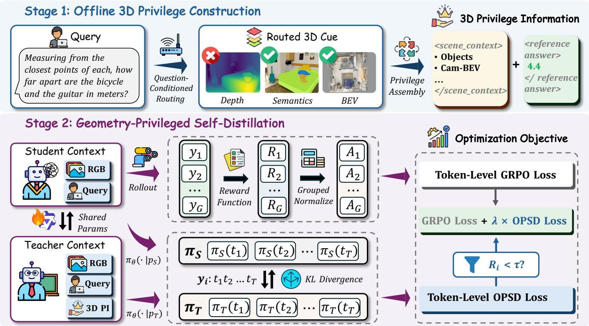  
Figure 2: Overview of GPD. Stage 1 constructs 3D privilege ofline and routes question-relevant cues to form the teacher context. Stage 2 trains the same VLM as student and teacher: the student samples on-policy trajectories optimized by GRPO; the teache provides token-level KL supervision selectively to incorrect trajectories as the OPSD loss. The two losses are jointly optimized.

## 3.2 Ofline 3D Privilege Construction

We represent each training example as $( v , q , a ^ { \star } )$ , where v denotes the RGB observations, q the question, and $a ^ { \star }$ the answer. For each example, GPD constructs an available subset of three 3D cues ofline: depth, semantic, and BEV.

Textual 3D Cue Extraction. When aligned 3D annotations are available, we derive depth, semantic, and BEV cues directly from them; otherwise, we estimate depth via Depth Anything 3 (Lin et al. 2025a) and obtain semantic instance masks and labels via Grounded-SAM-2 (Ren et al. 2024a), with BEV cues included only when reliable camera poses and scene-layout information are available. All cues are computed once and fixed throughout training. Let $\mathcal { M } \subseteq \{ \mathrm { d e p t h } $ , semantic, BEV} denote the modalities available for a given example. For each m $\in \mathcal { M }$ , a fixed template converts its cue into a textual summary $s _ { m } \colon$ depth records object distances and near–far order, semantic lists objects with their image regions, and BEV describes top-down relations. Frame identifiers are retained for multi-frame inputs.

Question-Conditioned Routing. Diferent spatial questions require diferent forms of geometric evidence: counting questions rely on semantic and visibility cues, whereas distance and navigation questions benefit from depth and BEV. Injecting all modalities indiscriminately may introduce irrelevant context and dilute the teacher signal. GPD therefore performs question-conditioned routing ofline, using the base

VLM to select a relevant subset $r ( q ) \subseteq { \mathcal { M } }$ for each question. The routed scene context is

$$
c _ { \mathrm { s c e n e } } ( q ) = \operatorname { c o n c a t } ( s _ { m } : m \in r ( q ) ) ,\tag{1}
$$

and the complete privilege provided to the teacher is

$$
c _ { \mathrm { p r i v } } ( \boldsymbol { q } , \boldsymbol { a } ^ { \star } ) = \mathrm { c o n c a t } ( c _ { \mathrm { s c e n e } } ( \boldsymbol { q } ) , \boldsymbol { a } ^ { \star } ) .\tag{2}
$$

We present an example of the teacher privilege as follows.

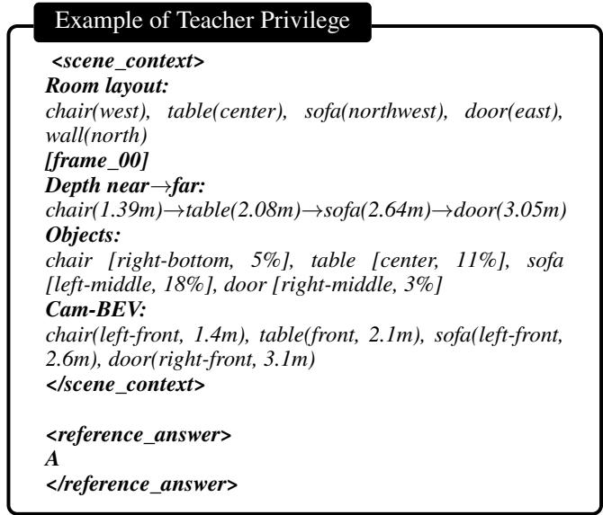

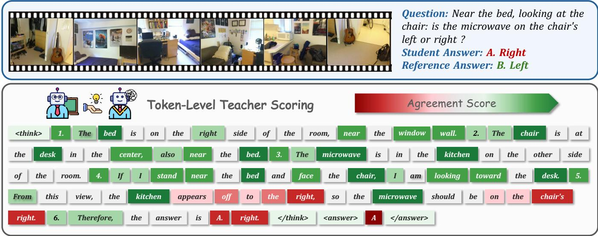  
Figure 3: Token-level teacher scoring on a student trajectory. The student answers incorrectly (A. Right) while the reference answer is B. Left. The teacher assigns high agreement scores to spatially grounded tokens and progressively rejects tokens where the reasoning goes astray.

## 3.3 Geometry-Privileged Self-Distillation

During training, the same VLM serves as both student and teacher under diferent conditioning contexts. The student receives only the RGB observations and question, $p _ { S } ~ = ~ \mathrm { c o n c a t } ( v , q )$ , while the teacher additionally receives the ofline-constructed privilege, $\begin{array} { r l } { p _ { T } } & { { } = } \end{array}$ concat $( v , q , c _ { \mathrm { p r i v } } ( q , a ^ { \star } ) ) ,$ ).

Outcome-Guided Policy Optimization. For each training example, the student samples a group of $G$ responses $\{ \bar { y _ { i } } \} _ { i = 1 } ^ { G } \ \bar { \sim } \ \pi _ { \theta } ( \cdot \ | \ p _ { S } )$ using only the student context $p _ { S } ,$ where each response $y _ { i } = ( t _ { 1 } , t _ { 2 } , \dots , t _ { T } )$ consists of $T$ tokens. A group-normalized advantage $A _ { i }$ is computed from the outcome reward $R _ { i }$ of $y _ { i }$ . We then optimize the following GRPO objective over all sampled responses

$$
\begin{array} { r l r } & { } & { \mathcal { L } _ { \mathrm { G R P O } } ( \theta ) = - \mathbb { E } _ { \{ y _ { i } \} _ { i = 1 } ^ { G } } \Bigg [ \frac { 1 } { G } \sum _ { i = 1 } ^ { G } \frac { 1 } { T } \sum _ { j = 1 } ^ { T } \operatorname* { m i n } \Big ( \rho _ { i , j } A _ { i } , } \\ & { } & { \mathrm { c l i p } ( \rho _ { i , j } , 1 \pm \varepsilon ) A _ { i } \Big ) - \beta \frac { 1 } { G } \sum _ { i = 1 } ^ { G } D _ { \mathrm { K L } } [ \pi _ { \theta } \| \pi _ { \mathrm { r e f } } ] _ { i } \Bigg ] , } \end{array}\tag{3}
$$

where $\rho _ { i , j } ~ = ~ \pi _ { \theta } ( t _ { j } ~ \mid ~ t _ { < j } , p _ { S } ) / \pi _ { \theta _ { \mathrm { o l d } } } ( t _ { j } ~ | ~ t _ { < j } , p _ { S } )$ is the token-level importance sampling ratio, and $D _ { \mathrm { K L } } [ \pi _ { \theta } \lVert \pi _ { \mathrm { r e f } } ] =$ $\begin{array} { r } { \sum _ { j = 1 } ^ { T } \operatorname { [ l o g } \pi _ { \boldsymbol { \theta } } ( \dot { t } _ { j } \mid t _ { < j } , p _ { S } ) - \operatorname { l o g } \pi _ { \mathrm { r e f } } ( t _ { j } \mid t _ { < j } , \dot { p _ { S } } ) ] } \end{array}$ is the token-level KL divergence with the frozen reference policy $\pi _ { \mathrm { r e f } }$ . Here, $\beta$ controls the strength of regularization toward the reference policy.

Privilege-Guided Policy Distillation. At each token position $j ,$ the teacher and student induce conditional distributions $\pi _ { \boldsymbol { \theta } } ( \cdot \cdot \mid t _ { < j } , p _ { T } )$ and $\pi _ { \boldsymbol { \theta } } ( \cdot \cdot \mid t _ { < j } , p _ { S } )$ respectively. The per-token reverse KL divergence is expensive to compute due to the full-vocabulary summation. We therefore take a single-sample estimate on the student-sampled token $t _ { j } \sim \pi _ { \theta } ( \cdot \mid t _ { < j } , p _ { S } )$ , yielding the token-level teacher–student log-probability gap

$$
\Delta _ { i , j } = \log \pi _ { \theta } ( t _ { j } \mid t _ { < j } , p _ { T } ) - \log \pi _ { \theta } ( t _ { j } \mid t _ { < j } , p _ { S } ) ,\tag{4}
$$

and its corresponding reverse KL estimate $\begin{array} { r l } { d _ { i , j } } & { { } = } \end{array}$ $\exp ( \Delta _ { i , j } ) - \bar { \Delta _ { i , j } } - 1$ . The distillation loss is then aggregated over all valid tokens and responses as

$$
\mathcal { L } _ { \mathrm { O P S D } } ( \boldsymbol { \theta } ) = \sum _ { i = 1 } ^ { G } \sum _ { j = 1 } ^ { T } u _ { i , j } d _ { i , j } \bigg / \sum _ { i = 1 } ^ { G } \sum _ { j = 1 } ^ { T } u _ { i , j } ,\tag{5}
$$

where $u _ { i , j } \in \{ 0 , 1 \}$ indicates a valid response token. This aligned comparison provides token-level supervision along the student’s own reasoning trajectory, rather than on teachergenerated rollouts. Figure 3 illustrates the token-level teacher scoring on a representative incorrect trajectory.

Error-Gated Joint Objective. Directly applying distillation on all trajectories is suboptimal: when the student already produces correct responses, the teacher signal may introduce noise or conflicting gradients. We therefore gate $\mathcal { L } _ { \mathrm { O P S D } }$ to incorrect trajectories only, leaving correct ones unafected. To further suppress occasionally large distillation signals, we aggregate the OPSD loss over valid tokens from incorrect trajectories within each optimization micro-batch and clip the resulting scalar at 1.5 before scaling:

$$
\tilde { \mathcal { L } } _ { \mathrm { O P S D } } = \operatorname* { m i n } \left( \sum _ { i \in \mathcal { E } } \sum _ { j = 1 } ^ { T } u _ { i , j } d _ { i , j } \bigg / \sum _ { i \in \mathcal { E } } \sum _ { j = 1 } ^ { T } u _ { i , j } , 1 . 5 \right) \ : ,\tag{6}
$$

where $\mathcal { E } = \{ i : R _ { i } < \tau \}$ denotes the set of incorrect trajectories and we set $\tau = 0 . 5$ . The final joint objective is

$$
\begin{array} { r } { \mathcal { L } = \mathcal { L } _ { \mathrm { G R P O } } + \lambda \tilde { \mathcal { L } } _ { \mathrm { O P S D } } , } \end{array}\tag{7}
$$

where λ controls the strength of the distillation signal.

<table><tr><td rowspan="2">Model</td><td rowspan="2">Avg.</td><td colspan="4">Numerical Question</td><td colspan="4">Multiple-choice Question</td></tr><tr><td></td><td></td><td>Obj. Cnt Abs. Dist. Obj. Size Room Size</td><td></td><td></td><td></td><td></td><td>Rel. Dist. Rel. Dir. Route Plan. Appr. Order</td></tr><tr><td colspan="10">General-Purpose VLMs</td></tr><tr><td>GPT-4o (Hurst et al. 2024)</td><td>34.0</td><td>46.2</td><td>5.3</td><td>43.8</td><td>38.2</td><td>37.0</td><td>41.3</td><td>31.5</td><td>28.5</td></tr><tr><td>Gemini-3-Pro (Team et al. 2024)</td><td>52.5</td><td>38.0</td><td>37.8</td><td>72.7</td><td>44.1</td><td>59.9</td><td>55.7</td><td>45.9</td><td>66.0</td></tr><tr><td>LLaVA-OneVision-72B (Li et al. 2024)</td><td>40.3</td><td>43.5</td><td>23.9</td><td>57.6</td><td>37.5</td><td>42.5</td><td>39.9</td><td>32.5</td><td>44.6</td></tr><tr><td>Qwen2.5-VL-7B (Bai et al. 2025b)</td><td>35.8</td><td>43.5</td><td>15.1</td><td>48.5</td><td>41.1</td><td>36.3</td><td>40.1</td><td>28.4</td><td>33.7</td></tr><tr><td colspan="10">3D-Augmented Methods</td></tr><tr><td>Spatial-MLLM-4B (Wu et al. 2026)</td><td>47.3</td><td>65.6</td><td>35.5</td><td>64.2</td><td>40.6</td><td>41.3</td><td>47.9</td><td>34.0</td><td>49.2</td></tr><tr><td>Think3D-4B (Zhang et al. 2026)</td><td></td><td></td><td>-</td><td>-</td><td></td><td>44.7</td><td>39.0</td><td>36.7</td><td>61.2</td></tr><tr><td colspan="10">Outcome-Supervised Methods</td></tr><tr><td>SpaceR-7B (Ouyang et al. 2025)</td><td>44.5</td><td>63.2</td><td>30.0</td><td>60.3</td><td>37.6</td><td>39.7</td><td>45.6</td><td>31.4</td><td>48.2</td></tr><tr><td>SpatialLadder-3B (Li et al. 2025b)</td><td>45.7</td><td>63.5</td><td>34.3</td><td>61.7</td><td>43.9</td><td>45.4</td><td>44.8</td><td>35.6</td><td>36.4</td></tr><tr><td colspan="10">Controlled Training Variants</td></tr><tr><td>Qwen3-VL-2B (Bai et al. 2025a)</td><td>51.3</td><td>59.9</td><td>42.1</td><td>70.3</td><td>54.0</td><td>51.7</td><td>43.1</td><td>27.3</td><td>61.7</td></tr><tr><td>+ GRPO</td><td>51.3</td><td>60.2</td><td>41.2</td><td>71.5</td><td>47.9</td><td>50.8</td><td>44.6</td><td>29.9</td><td>64.4</td></tr><tr><td>+ OPSD</td><td>50.8</td><td>64.1</td><td>40.8</td><td>69.4</td><td>48.1</td><td>51.4</td><td>44.7</td><td>29.9</td><td>57.8</td></tr><tr><td>+ GPD</td><td>51.7</td><td>61.2</td><td>42.1</td><td>71.3</td><td>48.7</td><td>51.8</td><td>45.0</td><td>29.4</td><td>64.2</td></tr><tr><td>Qwen3-VL-4B (Bai et al. 2025a)</td><td>55.4</td><td>67.5</td><td>43.0</td><td>74.3</td><td>61.3</td><td>52.7</td><td>47.9</td><td>33.5</td><td>62.9</td></tr><tr><td>+ GRPO</td><td>56.4</td><td>70.2</td><td>44.4</td><td>74.9</td><td>61.7</td><td>51.3</td><td>49.9</td><td>33.5</td><td>65.5</td></tr><tr><td>+ OPSD</td><td>55.7</td><td>68.2</td><td>46.0</td><td>73.8</td><td>58.1</td><td>51.8</td><td>48.6</td><td>36.6</td><td>62.6</td></tr><tr><td>+ GPD</td><td>57.1</td><td>70.6</td><td>44.8</td><td>74.9</td><td>62.3</td><td>54.2</td><td>50.7</td><td>34.0</td><td>64.9</td></tr></table>

Table 1: VSI-Bench results across numerical and multiple-choice spatial reasoning subtasks. For controlled training variants, bold indicates the best result within each backbone.

<table><tr><td>Method MindCube SPAR MMSI ViewSpatial</td></tr><tr><td> $\operatorname { A v g } .$  GPT-40 38.8 36.4 30.3 32.6 34.5</td></tr><tr><td>Qwen2.5-VL-7B 29.3 30.2 25.9 37.9 30.8</td></tr><tr><td>SpatialLadder-3B 43.5 32.9 27.4 39.9 35.9</td></tr><tr><td>Qwen3-VL-2B 31.7 31.8 24.3 36.6 31.1</td></tr><tr><td>+ GRPO 35.8 38.5 19.8 36.7 32.7</td></tr><tr><td>+ OPSD 31.2 30.9 21.7 36.8 30.2</td></tr><tr><td>+ GPD 38.4 38.2 21.1 36.8 33.6</td></tr><tr><td></td></tr><tr><td>Qwen3-VL-4B 21.5 35.2 27.7 39.1 30.9</td></tr><tr><td>+ GRPO 33.0 41.4 28.7 39.6 35.7</td></tr><tr><td>+ OPSD 21.9 36.3 27.5 40.4 31.5</td></tr><tr><td>+ GPD 38.0 43.4 29.4 39.8 37.6</td></tr></table>

Table 2: Results on MindCube, SPAR-Bench, MMSI-Bench, and ViewSpatial. For controlled training variants, bold indicates the best result within each backbone.

## 4 Experiments

## 4.1 Experimental Setup

Baselines and Benchmarks. We compare GPD with general-purpose VLMs (Hurst et al. 2024; Team et al. 2024; Li et al. 2024; Bai et al. 2025b), 3D-augmented methods (Wu et al. 2026; Zhang et al. 2026), and outcome-supervised methods (Ouyang et al. 2025; Li et al. 2025b). For controlled comparison, we train GRPO and OPSD on the same data and backbone (Shao et al. 2024; Zhao et al. 2026). We evaluate on five benchmarks (Yang et al. 2025a; Wang et al. 2025; Zhang et al. 2025; Yang et al. 2025b; Li et al. 2025a):

VSI-Bench covers eight video-based spatial reasoning subtasks; MindCube tests mental spatial modeling from limited views; SPAR-Bench evaluates 3D object relations and scene geometry; MMSI-Bench assesses multi-image spatial intelligence; and ViewSpatial-Bench evaluates perspectivedependent spatial understanding.

Training Dataset. We train on 10K VSI, 4K SPAR, and 1K MindCube training-split samples. For VSI and SPAR, which are derived from ScanNet scenes (Dai et al. 2017), privileged information is generated directly from 3D annotations. For MindCube, which lacks aligned 3D ground truth, we estimate depth with Depth Anything 3 (Lin et al. 2025b) and obtain semantic instance cues with Grounded-SAM-2 (Ren et al. 2024b). All methods and ablations share the same training mixture and precomputed privileged information.

Training Details. All experiments are based on Qwen3- VL-Instruct backbones at 2B and 4B scales (Bai et al. 2025a). We train for one epoch with a learning rate of $1 \times 1 0 ^ { - 6 }$ , a rollout group size of $n = 8 .$ , and a privileged-distillation weight of $\lambda = 0 . 0 0 3$

## 4.2 Main Results

Results on VSI-Bench. Table 1 compares GPD against general-purpose VLMs, 3D-augmented methods, outcomesupervised methods, and controlled training variants on VSI-Bench. With Qwen3-VL-4B, GPD achieves the highest average accuracy of 57.1 among controlled training variants, improving over the base model by 1.7 points, GRPO by 0.7 points, and OPSD by 1.4 points. With Qwen3-VL-2B, GPD similarly achieves the best controlled average of 51.7, outperforming the base model and GRPO by 0.4 points and OPSD by 0.9 points. Across both scales, the improvements on geometry-dependent subtasks align with routed 3D privilege providing depth order and spatial layout cues that are dificult to recover from RGB alone.

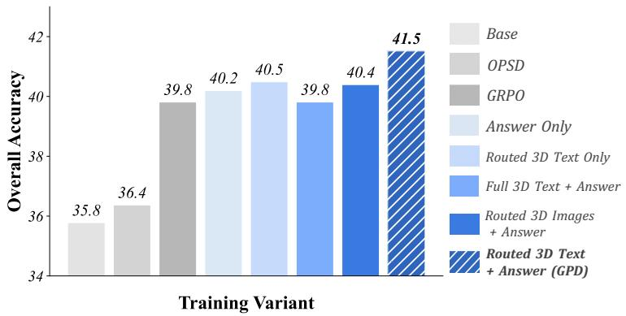

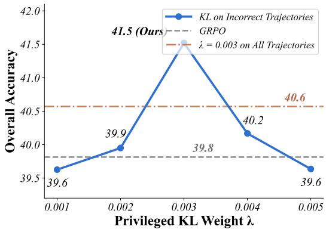  
Figure 4: Ablation studies on Qwen3-VL-4B. Left: Privilege-component ablation. Grey bars represent no-signal or single-signal baselines; blue bars represent variants that combine outcome reward with privileged KL. Right: Privileged KL weight sweep. The dashed grey line marks GRPO and the dashed orange line marks the all-trajectories variant at λ = 0.003.

Results on Additional Benchmarks. Table 2 reports results on MindCube, SPAR-Bench, MMSI-Bench, and ViewSpatial. With Qwen3-VL-4B, GPD achieves the highest controlled average of 37.6, improving over GRPO by 1.9 points and OPSD by 6.1 points. GPD obtains the best result among controlled variants on MindCube (38.0 vs. 33.0 for GRPO, +5.0 points), SPAR (43.4 vs. 41.4 for GRPO, +2.0 points), and MMSI (29.4 vs. 28.7 for GRPO, +0.7 points). With Qwen3-VL-2B, GPD again achieves the best controlled average of 33.6, outperforming GRPO by 0.9 points and OPSD by 3.4 points, with the largest gain on MindCube (38.4 vs. 35.8 for GRPO, +2.6 points).

## 4.3 Ablation Study

Efect of Privilege Components. Figure 4 (left) ablates the privilege design on Qwen3-VL-4B, reporting Avg. as the mean over VSI, MindCube, SPAR, MMSI and ViewSpatial. Adding the reference answer alone reaches 40.2 (+0.4 points over GRPO), and adding routed 3D text alone reaches 40.5 (+0.7 points). Combining both yields 41.5, confirming that the two sources are complementary: the answer specifies the target outcome while the 3D context supplies geometric evidence. Full 3D text injection (39.8) falls below routed text by 1.7 points despite containing more information, confirming that indiscriminate injection introduces noise. Routed images reach 40.4, below routed text (41.5) by 1.1 points, suggesting that structured text aligns geometric cues with the symbolic reasoning trajectory better than visual overlays.

Efect of Privileged KL. Figure 4 (right) sweeps the privileged KL weight λ and its application scope with all other components fixed. Applying privileged KL to all trajectories rather than incorrect ones alone reduces Avg. by 0.9 points to 40.6, consistent with noisy teacher signals disturbing already-correct trajectories. Among incorrect-only variants, Avg. rises from 39.6 at λ = 0.001 to 41.5 at λ = 0.003 (+1.7 points over GRPO), then decreases to 40.2 at λ = 0.004 and 39.6 at λ = 0.005. Too small a weight provides insuficient process-level correction; too large a weight over-constrains the policy and degrades performance.

## 4.4 Further Analysis

Zero-Shot Privilege Injection. Before RL training, we run a controlled zero-shot study on a 1000-question VSI-590K subset to decide how 3D privilege should be presented. We evaluate Qwen3-VL-4B-Instruct using identical RGB observations and, when applicable, the same ofline questionconditioned routing over depth, semantic segmentation, and BEV, without providing the reference answer. Figure 5 (left) summarizes the results. All image-based variants and full text injection remain below the RGB-only baseline (49.1): full 3D images drop to 47.4, while routed images and full text both reach 48.3. Routed text is the only variant that exceeds the baseline, reaching 52.2 (+3.1 points), motivating its use as the privilege form in GPD.

Routing Distribution. Figure 5 (right) shows the normalized routing distribution across VSI task categories. The pattern aligns well with geometric intuition: object counting is routed entirely to semantic maps, absolute distance relies predominantly on depth, room size is dominated by BEV, and relative direction uses both semantic and BEV. This alignment confirms that the question-conditioned router selects relevant 3D cues rather than injecting every modality.

Training Dynamics. Figure 6 compares GPD and GRPO training curves on Qwen3-VL-4B. Both methods show similar validation accuracy in early steps, but GPD gradually pulls ahead and continues to improve while GRPO plateaus. The entropy plot reveals why: GPD reaches a higher entropy peak earlier than GRPO, indicating that privileged KL encourages broader exploration in the early training phase. As entropy levels align in later steps, GPD maintains its accuracy advantage, suggesting that the spatial reasoning modes shaped by privileged supervision are retained.

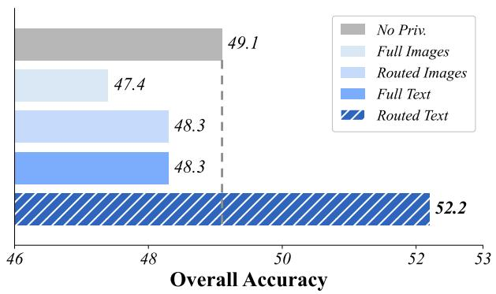

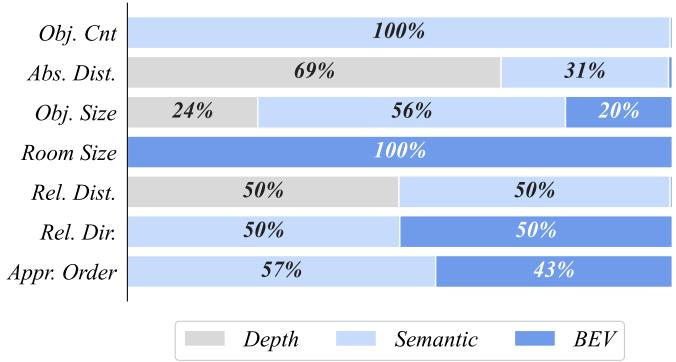  
Figure 5: Privilege injection analysis on Qwen3-VL-4B-Instruct. Left: Zero-shot overall accuracy under diferent privilege forms on a VSI-590K subset. Right: Normalized routing weight distribution across VSI task categories and 3D modalities.

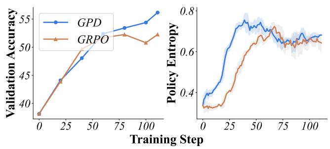

Figure 6: Training dynamics of GPD and GRPO on Qwen3- VL-4B. Left: validation accuracy. Right: policy entropy.  
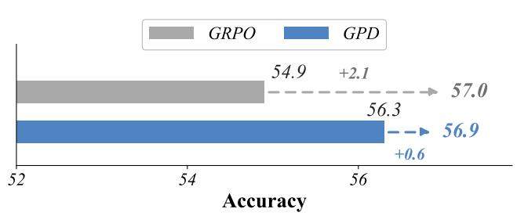  
Figure 7: Comparison of test-time 3D privilege dependence between GRPO and GPD.

Privilege Internalization. To test whether GPD internalizes 3D cues during training, we evaluate models trained on Qwen3-VL-4B with and without privilege injection at test time, as shown in Figure 7. GPD (56.3) already outperforms GRPO (54.9) under RGB-only inference, and gains less when routed 3D text is injected at test time (+0.6 vs. +2.1 for GRPO). The smaller privilege gap suggests that GPD internalizes geometric cues during training rather than remaining dependent on them at inference.

Case Study. Figure 8 shows a representative case where GPD answers correctly and GRPO fails. GPD correctly localizes the camera, maps the left-forward motion to the spatial frame, and grounds the fountain via cross-view correspondence. GRPO misidentifies the fountain’s position relative to the jar and reaches the wrong conclusion. This illustrates a failure mode of outcome-only supervision, where a geometrically incorrect intermediate judgment goes uncorrected in the absence of process-level geometric guidance.

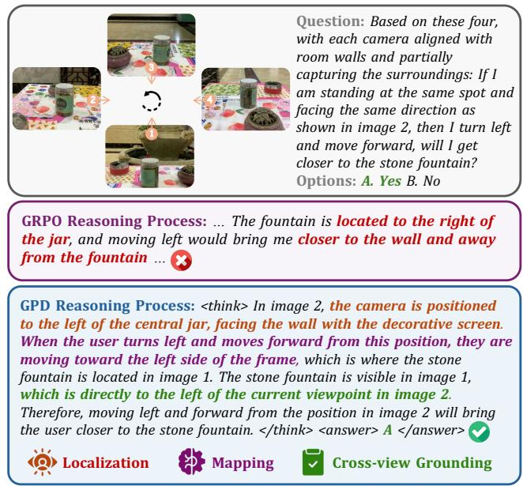  
Figure 8: Case study comparing GPD and GRPO on a multiview spatial question.

## 5 Conclusion

We present GPD, which augments GRPO with an OPSD teacher conditioned on question-routed depth, semantic, and BEV textual cues together with the reference answer. The teacher applies token-level KL supervision selectively to incorrect student trajectories, enabling the student to internalize geometric reasoning during training while retaining RGB-only inference. Across both model scales and benchmarks, GPD improves overall accuracy over GRPO and outperforms answer-privileged OPSD.

## References

Bai, S.; Cai, Y.; Chen, R.; Chen, K.; Chen, X.; Cheng, Z.; Deng, L.; Ding, W.; Gao, C.; Ge, C.; et al. 2025a. Qwen3-VL Technical Report. arXiv preprint arXiv:2511.21631.

Bai, S.; Chen, K.; Liu, X.; Wang, J.; Ge, W.; Song, S.; Dang, K.; Wang, P.; Wang, S.; Tang, J.; et al. 2025b. Qwen2.5-VL Technical Report. arXiv preprint arXiv:2502.13923.

Cai, Y.; Liu, J.; Liu, Y.; Deng, H.; Yao, L.; Zheng, Y.; Ouyang, K.; Li, Z.; Wang, Z.; Sun, X.; Bai, H.; and Li, X. 2026. Thinking Without Images: Internalizing Visual Manipulation with On-Policy Self-Distillation. arXiv preprint arXiv:2606.08719.

Chen, B.; Xu, Z.; Kirmani, S.; Ichter, B.; Driess, D.; Florence, P.; Sadigh, D.; Guibas, L.; and Xia, F. 2024. SpatialVLM: Endowing Vision-Language Models with Spatial Reasoning Capabilities. In Proceedings ofthe IEEE/CVF Conference on Computer Vision and Pattern Recognition (CVPR), 14455– 14465.

Chen, Z.; Lu, X.; Zheng, Z.; Li, P.; He, L.; Zhou, Y.; Shao, J.; Zhuang, B.; and Sheng, L. 2026. Geometrically-constrained agent for spatial reasoning. In Proceedings ofthe IEEE/CVF Conference on Computer Vision and Pattern Recognition, 38689–38699.

Cheng, A.-C.; Yin, H.; Fu, Y.; Guo, Q.; Yang, R.; Kautz, J.; Wang, X.; and Liu, S. 2024. SpatialRGPT: Grounded Spatial Reasoning in Vision-Language Models. In Advances in Neural Information Processing Systems.

Cho, S.; Hachiuma, R.; Badki, A.; Su, H.; Lee, B.-K.; Song, C. H.; Liu, S.; Radhakrishnan, S.; Kim, S.; Wang, Y.-C. F.; et al. 2026. SpatialClaw: Rethinking Action Interface for Agentic Spatial Reasoning. arXiv preprint arXiv:2606.13673.

Dai, A.; Chang, A. X.; Savva, M.; Halber, M.; Funkhouser, T.; and Nießner, M. 2017. ScanNet: Richly-annotated 3D Reconstructions of Indoor Scenes. In Proceedings of the IEEE Conference on Computer Vision and Pattern Recognition (CVPR), 5828–5839.

Han, Y.; Zhou, E.; Rong, S.; An, J.; Wang, P.; Wang, Z.; Chi, C.; Sheng, L.; and Zhang, S. 2025. TIGeR: Tool-Integrated Geometric Reasoning in Vision-Language Models for Robotics. arXiv preprint arXiv:2510.07181.

Hinton, G.; Vinyals, O.; and Dean, J. 2015. Distilling the Knowledge in a Neural Network. arXiv preprint arXiv:1503.02531.

Hurst, A.; Lerer, A.; Goucher, A. P.; Perelman, A.; Ramesh, A.; Clark, A.; Ostrow, A.; Welihinda, A.; Hayes, A.; Radford, A.; et al. 2024. Gpt-4o system card. arXiv preprint arXiv:2410.21276.

Kaur, S.; Ri, N.; He, Y.; Fowl, L.; and Arora, S. 2026. Rethinking On-Policy Self-Distillation for Thinking Models. arXiv preprint arXiv:2607.05184.

Kim, J.; and Lee, D. 2026. OPSD Compresses What RLVR Teaches: A Post-RL Compaction Stage for Reasoning Models. arXiv preprint arXiv:2605.06188.

Li, B.; Zhang, Y.; Guo, D.; Zhang, R.; Li, F.; Zhang,H.; Zhang, K.; Zhang, P.; Li, Y.; Liu, Z.; et al. 2024.

Llava-onevision: Easy visual task transfer. arXiv preprint arXiv:2408.03326.

Li, D.; Li, H.; Wang, Z.; Yan, Y.; Zhang, H.; Chen, S.; Hou, G.; Jiang, S.; Zhang, W.; Shen, Y.; et al. 2025a. Viewspatialbench: Evaluating multi-perspective spatial localization in vision-language models. arXiv preprint arXiv:2505.21500.

Li, H.; Li, D.; Wang, Z.; Yan, Y.; Wu, H.; Zhang, W.; Shen, Y.; Lu, W.; Xiao, J.; and Zhuang, Y. 2025b. Spatialladder: Progressive training for spatial reasoning in vision-language models. arXiv preprint arXiv:2510.08531.

Li, P.; Gao, Z.; Zhang, L.; Huang, M.; Li, Y.; Xu, F.; and Liu, J. 2026. Visual-OPSD: Cross-Modal On-Policy Self-Distillation for Eficient Unified Multimodal Reasoning. arXiv preprint arXiv:2606.18974.

Lin, H.; Chen, S.; Liew, J.; Chen, D. Y.; Li, Z.; Shi, G.; Feng, J.; and Kang, B. 2025a. Depth anything 3: Recovering the visual space from any views. arXivpreprint arXiv:2511.10647.

Lin, H.; Chen, S.; Liew, J.; Chen, D. Y.; Li, Z.; Shi, G.; Feng, J.; and Kang, B. 2025b. Depth Anything 3: Recovering the Visual Space from Any Views. arXiv preprint arXiv:2511.10647.

Ma, W.; Chou, Y.-C.; Liu, Q.; Wang, X.; de Melo, C.; Xie, J.; and Yuille, A. 2025. SpatialReasoner: Towards Explicit and Generalizable 3D Spatial Reasoning. arXiv preprint arXiv:2504.20024.

Ouyang, K.; Liu, Y.; Wu, H.; Liu, Y.; Zhou, H.; Zhou, J.; Meng, F.; and Sun, X. 2025. Spacer: Reinforcing mllms in video spatial reasoning. arXiv preprint arXiv:2504.01805.

Qi, Z.; Zhang, Z.; Fang, Y.; Wang, J.; and Zhao, H. 2025. Gpt4scene: Understand 3d scenes from videos with visionlanguage models. arXiv preprint arXiv:2501.01428.

Ren, T.; Liu, S.; Zeng, A.; Lin, J.; Li, K.; Cao, H.; Chen, J.; Huang, X.; Chen, Y.; Yan, F.; et al. 2024a. Grounded sam: Assembling open-world models for diverse visual tasks. arXiv preprint arXiv:2401.14159.

Ren, T.; Liu, S.; Zeng, A.; Lin, J.; Li, K.; Cao, H.; Chen, J.; Huang, X.; Chen, Y.; Yan, F.; et al. 2024b. Grounded SAM: Assembling Open-World Models for Diverse Visual Tasks. arXiv preprint arXiv:2401.14159.

Shao, Z.; Wang, P.; Zhu, Q.; Xu, R.; Song, J.; Bi, X.; Zhang, H.; Zhang, M.; Li, Y. K.; Wu, Y.; and Guo, D. 2024. DeepSeekMath: Pushing the Limits of Mathematical Reasoning in Open Language Models. arXiv preprint arXiv:2402.03300.

Shen, Z.; Tong, J.; Yan, S.; Shen, C.; Chen, H.; Ye, W.; Hu, X.; Miao, R.; Wang, H.; Zhao, J.; Chen, G.; and Ye, J. 2026. Purified OPSD: On-Policy Self-Distillation Without Losing How to Think. arXiv preprint arXiv:2607.02234.

Team, G.; Georgiev, P.; Lei, V. I.; Burnell, R.; Bai, L.; Gulati, A.; Tanzer, G.; Vincent, D.; Pan, Z.; Wang, S.; et al. 2024. Gemini 1.5: Unlocking multimodal understanding across millions of tokens of context. arXiv preprint arXiv:2403.05530.

Wang, Q.; Yin, B.; Zhang, P.; Zhang, J.; Wang, K.; Wang, Z.; Zhang, J.; Chandrasegaran, K.; Liu, H.; Krishna, R.; Xie,

S.; Li, M.; Wu, J.; and Fei-Fei, L. 2025. MindCube: Spatial Mental Modeling from Limited Views. arXiv preprint arXiv:2506.21458.

Wu, D.; Liu, F.; Hung, Y.-H.; and Duan, Y. 2026. Spatialmllm: Boosting mllm capabilities in visual-based spatial intelligence. Advances in neural information processing systems, 38: 13569–13597.

Yang, C.; Qin, C.; Si, Q.; Chen, M.; Gu, N.; Yao, D.; Lin, Z.; Wang, W.; Wang, J.; and Duan, N. 2026. Self-distilled rlvr. arXiv preprint arXiv:2604.03128.

Yang, J.; Yang, S.; Gupta, A. W.; Han, R.; Fei-Fei, L.; and Xie, S. 2025a. Thinking in Space: How Multimodal Large Language Models See, Remember, and Recall Spaces. In Proceedings of the IEEE/CVF Conference on Computer Vision and Pattern Recognition (CVPR).

Yang, S.; Xu, R.; Xie, Y.; Yang, S.; Li, M.; Lin, J.; Zhu, C.; Chen, X.; Duan, H.; Yue, X.; Lin, D.; Wang, T.; and Pang, J. 2025b. MMSI-Bench: A Benchmark for Multi-Image Spatial Intelligence. arXiv preprint arXiv:2505.23764.

Yuan, Q.; Lou, J.; Yu, X.; Lin, H.; Sun, L.; Han, X.; and Lu, Y. 2026. Vision-OPD: Learning to See Fine Details for Multimodal LLMs via On-Policy Self-Distillation. arXiv preprint arXiv:2605.18740.

Zhang, J.; Chen, Y.; Zhou, Y.; Xu, Y.; Huang, Z.; Mei, J.; Chen, J.; Yuan, Y.-J.; Cai, X.; Huang, G.; Quan, X.; Xu, S.; and Li, Z. 2025. From Flatland to Space: Teaching Vision-Language Models to Perceive and Reason in 3D. arXiv preprint arXiv:2503.22976.

Zhang, Z.; Wu, Y.; Jia, L.; Wang, Y.; Zhang, Z.; Li, Y.; Ran, B.; Zhang, F.; Sun, Z.; Yin, Z.; et al. 2026. Think3D: Thinking with Space for Spatial Reasoning. arXiv preprint arXiv:2601.13029.

Zhao, S.; Xie, Z.; Liu, M.; Huang, J.; Pang, G.; Chen, F.; and Grover, A. 2026. Self-Distilled Reasoner: On-Policy Self-Distillation for Large Language Models. arXiv preprint arXiv:2601.18734.

Zheng, D.; Huang, S.; and Wang, L. 2025. Video-3d llm: Learning position-aware video representation for 3d scene understanding. In Proceedings ofthe IEEE/CVF Conference on Computer Vision and Pattern Recognition, 8995–9006.