# DreamTrue: Action-Faithful Robot World Model with Counterfactual Post-Training

Junyan Li1\* Ruizhi Li1\* Yu Liu2† Xiangshuo Liu1§

Mingchao Sun2 Hongyu Pan2 Mu Xu2 Lue Fan1†B Zhaoxiang Zhang1B

1NLPR, Institute of Automation, Chinese Academy of Sciences (CASIA)

2Amap, Alibaba Group

Equal contribution. † Co-Project Leads.

{lue.fan, zhaoxiang.zhang}@ia.ac.cn

## Abstract

We present DREAMTRUE, a multi-view, cross-embodiment robot world model for actionfaithful and physically plausible video prediction. Training such a model on existing robot datasets faces two obstacles: imprecise calibration can impair action following, while limited coverage of unsuccessful interactions can bias predictions toward successful outcomes. To improve action following across embodiments, we render action trajectories into image-space conditions and introduce offline geometric calibration to align these conditions with the target videos. To broaden interaction coverage, we introduce counterfactual post-training, modifying recorded action trajectories and generating future videos under a wider range of actions and contact configurations. To provide feedback on these predictions without paired ground-truth futures, we construct a human-annotated video dataset covering robot, object, and interaction defects and use it to train an embodied video reward model. Its scores guide reinforcement-learning post-training toward more physically plausible interaction outcomes. On AgiBot, DREAMTRUE attains state-of-the-art action following, while reducing the human-assessed interaction defect rate from from 48.12% to 6.25%. Notably, our model ranks first in the world model track of the AgiBot World Challenge 2026. The project page can be found at https://brave-eai.github.io/DreamTrue.

## 1 Introduction

Robot world models predict how a scene evolves under a given action sequence, providing virtual environments for robot learning and evaluation (Ha & Schmidhuber, 2018; Hafner et al., 2020; Zhou et al., 2024; Li et al., 2025b). To be reliable as simulators, they must accurately follow the specified actions and produce physically plausible interactions with surrounding objects (Yue et al., 2025; Shang et al., 2026).

Public robot datasets provide extensive action–video recordings for learning these capabilities (Open X-Embodiment, 2024; Khazatsky et al., 2024; Wu et al., 2025; Bu et al., 2025b), but training from these data faces two challenges. First, action conditions must accurately represent the robot’s intended trajectory in the target video. Rendering actions through each robot’s model provides direct visual guidance for action following by expressing different embodiments’ actions in the image space of the target video (Chen et al., 2026; Alzayer et al., 2026). This approach, however, depends on accurate camera calibration, which is not always available in existing recordings. Calibration error can spatially misalign the rendered robot with its appearance in the recorded video, making the action conditions inconsistent with the training targets. Second, training data dominated by successful demonstrations provide limited coverage of missed grasps, slipping objects, and unsuccessful contact (Peng et al., 2026). Recent work identifies a tendency to predict successful outcomes even under actions that lead to failure. For example, a model may predict that an object rises with the gripper despite a missed grasp. Such hallucinations can overestimate action success, misleading action selection and producing overly optimistic policy evaluations.

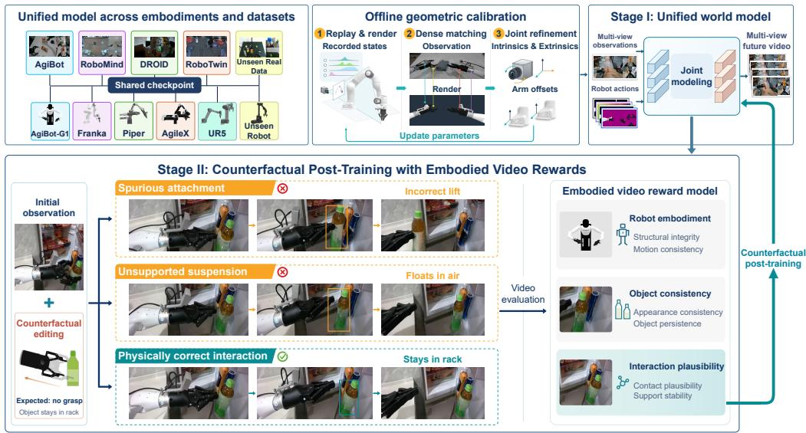  
Figure 1: Overview of DREAMTRUE. Camera calibration aligns robot renderings with recorded videos. Stage I learns action-conditioned prediction across embodiments, while Stage II uses video rewards for counterfactual post-training to improve interaction plausibility.

Collecting new real-robot trajectories with accurate calibration and broad coverage of failed interactions would help address these challenges, but would require substantial time and resources (Khazatsky et al., 2024). We therefore seek to improve the quality of existing data by correcting calibration errors and broaden model training by constructing counterfactual action trajectories, without additional real-robot data collection.

To this end, we introduce DREAMTRUE, a multi-view, cross-embodiment robot world model for action-faithful and physically plausible video prediction. To improve the accuracy of action–video supervision, we propose offline geometric calibration to align robot renderings with recorded video frames. Known robot geometry and recorded robot states allow us to render the robot and establish image correspondences with the observations. These correspondences guide camera parameter refinement without dedicated calibration sequences. The optimized parameters are then used to render action trajectories, providing spatially aligned visual conditions for supervised training across robot datasets. To broaden the actions and interactions encountered during training, we propose counterfactual post-training with embodied video rewards. For a given scene, we modify recorded trajectories to construct counterfactual actions that may lead to unsuccessful interactions, and condition the world model on these actions to generate future videos. Although paired groundtruth futures are unavailable, some prediction errors remain directly observable: an object rising after a missed grasp or remaining suspended after losing support reveals an implausible interaction (Figure 1). We therefore construct a human-annotated video defect dataset covering videos generated by multiple world models. Annotations span robot embodiment, object consistency, and interaction plausibility, and are used to train an embodied video reward model. Its scores guide reinforcementlearning post-training to reduce observable defects and encourage physically plausible interaction outcomes. This provides feedback under actions beyond the recorded trajectories without requiring additional real-world collection of failed executions.

We train DREAMTRUE across multiple public robot datasets and evaluate action following, visual quality, and interaction plausibility. On the AgiBot benchmark, DREAMTRUE achieves the highest nDTW score of 0.8772 among the evaluated methods for action following and reduces the humanassessed interaction defect rate from 48.12% to 6.25% through reward-guided post-training. Our contributions are threefold:

• We introduce DREAMTRUE, a multi-view, cross-embodiment robot world model that improves action following and interaction plausibility without additional real-robot training data collection.

• We propose an offline geometric calibration method to improve alignment between action conditions and recorded videos without dedicated calibration sequences. We release the resulting calibration for three datasets, covering 153,666 retained episodes and over 1,660 hours.

• We develop a reward-guided post-training approach that learns from human annotations of robot, object, and interaction defects, enabling feedback under counterfactual actions without paired future videos. We release annotations for 44.9K videos, including 30.4K defect annotations.

## 2 Related Work

Action-conditioned robot world models. Action-conditioned world models leverage videogeneration priors to predict robot motion and environmental responses (Li et al., 2025b; Yang et al., 2026b). Ctrl-World enables multi-view, long-horizon prediction, while Genie Envisioner and GE-Sim 2.0 use action-conditioned simulation for policy learning and closed-loop evaluation (Guo et al., 2025; Liao et al., 2026; Qiu et al., 2026). To expand interaction coverage, DreamDojo transfers knowledge from large-scale human videos, PlayWorld uses autonomous robot interaction data, and FACT predicts future videos and task progress from failure trajectories (Gao et al., 2026; Yin et al., 2026; Peng et al., 2026). Learned world-model rollouts support policy evaluation, data generation, and policy optimization (Gemini Robotics et al., 2025; NVIDIA et al., 2025; Zhu et al., 2025b; Guo et al., 2026; Jiang et al., 2026; Sun et al., 2026). Our model follows this line while emphasizing action-faithful and physically coherent predictions under counterfactual actions.

Geometric action representations and robot–camera calibration. BridgeV2W renders robot states into pixel-aligned embodiment masks, while Masked Visual Actions constructs visual action conditions through segmentation or robot rendering (Chen et al., 2026; Alzayer et al., 2026); EnerVerse-AC further adds camera-ray encoding for multi-view generation (Jiang et al., 2025a). Their fidelity depends on accurate robot–camera geometry. Classical hand–eye calibration solves the AX = XB relation, while markerless methods use differentiable rendering; both require dedicated calibration sequences (Tsai & Lenz, 1989; Chen et al., 2023; Hong et al., 2024). PointWorld instead refines camera poses from existing recordings but relies on accurate depth from sensors or FoundationStereo (Huang et al., 2026; Wen et al., 2025). We recover camera parameters and robot mounting offsets from RGB demonstrations alone, without dedicated sequences or depth, making the approach applicable to most open manipulation datasets.

Embodied video evaluation and reward-based post-training. EWMBench evaluates embodied videos by scene, motion, and semantics, while WorldArena combines perceptual quality with downstream functional evaluation (Yue et al., 2025; Shang et al., 2026). WorldCompass post-trains interactive world models without paired futures, using rewards for camera-trajectory following and frame-level visual quality (Wang et al., 2026; Li et al., 2025a; Yuan et al., 2026; Ping et al., 2026). These rewards primarily capture agent motion and generic visual quality rather than physical object interaction. We instead learn an embodied video reward from human annotations of robot, object, and interaction defects and use it to post-train physically coherent object interaction under counterfactual robot actions.

## 3 Method

## 3.1 Problem Formulation and Overview

Given initial multi-view observations $\pmb { x } _ { 0 } ^ { 1 : V }$ , a task instruction $\ell ,$ and an action sequence $\pmb { a } _ { 1 : T }$ , we model the distribution of future videos as

$$
\begin{array} { r } { \hat { \pmb { x } } _ { 1 : T } ^ { 1 : V } \sim p _ { \theta } \left( \pmb { x } _ { 1 : T } ^ { 1 : V } \ | \ \pmb { x } _ { 0 } ^ { 1 : V } , \ell , \pmb { a } _ { 1 : T } \right) , } \end{array}\tag{1}
$$

where V is the number of camera views, $T$ is the prediction horizon, and θ denotes model parameters. Our framework consists of offline geometric calibration and two training stages. We first refine camera parameters and optional robot mounting offsets to improve spatial alignment between robot renderings and recorded video frames. Stage I represents action sequences as robot renderings and trains a multi-view generator across embodiments for accurate action following. Stage II uses a learned video reward model to guide post-training toward more plausible robot–object interactions.

## 3.2 Offline Geometric Calibration

We refine camera parameters using image correspondences from existing recordings to improve alignment between robot renderings and video frames, without dedicated calibration sequences.

Image correspondence construction. We first render the robot’s URDF model using recorded robot states and initial camera parameters, projecting the known robot geometry into the image space of the recorded videos. We then establish pixel correspondences between the rendered and observed robots, forming $\mathcal { P } _ { \mathrm { a l i g n } }$ (Figure 2a). To further constrain the calibration, we incorporate static-background correspondences across frames, $\mathcal { P } _ { \mathrm { t i m e } }$ (Figure 2b), and correspondences between synchronized views, $\mathcal { P } _ { \mathrm { v i e w } }$ (Figure 2c). We extract correspondences using RoMaV2 (Edstedt et al., 2026), with masks from SAM3 (Carion et al., 2025) fine-tuned on robot segmentation data restricting robot–observation matching to arm regions.

Joint calibration. Using the three correspondence sets, we jointly refine camera parameters Θ, including intrinsics, extrinsics, and distortion, together with relative arm mounting offsets ξ where applicable. For $\mathcal { P } _ { \mathrm { a l i g n } }$ , we minimize the reprojection error between $\pi _ { i } ( X _ { i } ( s , \xi ) ; \Theta , \xi )$ and its matched pixel $\mathbf { \Delta } \mathbf { u } _ { i }$ in the recorded frame. The matched rendering pixel identifies a point on the known robot surface, whose 3D position $X _ { i } ( s , \xi )$ is determined by the recorded robot state s and arm mounting offset ξ. The projection $\pi _ { i }$ uses camera parameters Θ and, for arm-mounted cameras, also depends on $\xi .$ For $\mathcal { P } _ { \mathrm { t i m e } }$ and $\mathcal { P } _ { \mathrm { v i e w } }$ , we impose the same ray-coplanarity constraint: rays $r _ { a } , r _ { b }$ observing the same scene point must be coplanar with the baseline between their camera centers $\mathbf { \delta } _ { o _ { a } , o _ { b } }$ . These constraints give the joint objective

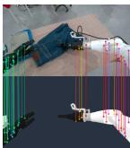  
(a) $\mathcal { P } _ { \mathrm { a l i g n } }$

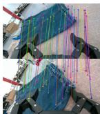

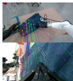  
(b) $\mathcal { P } _ { \mathrm { t i m e } }$  
(c) $\mathcal { P } _ { \mathrm { v i e w } }$  
Figure 2: Correspondences used for calibration: (a) robot renderings and observations, (b) static backgrounds across time, and (c) synchronized camera views.

$$
( \Theta ^ { * } , \xi ^ { * } ) = \underset { \Theta , \xi } { \operatorname { a r g m i n } } \ \lambda _ { a } \left. \| u _ { i } - \pi _ { i } ( X _ { i } ( s , \xi ) ; \Theta , \xi ) \| _ { 2 } ^ { 2 } \right. _ { \mathcal { P } _ { \mathrm { a l g n } } } + \lambda _ { e } \left. \left| ( r _ { a } \times r _ { b } ) ^ { \top } ( o _ { a } - o _ { b } ) \right| \right. _ { \mathcal { P } _ { \mathrm { v i o w } } \cup \mathcal { P } _ { \mathrm { t i m e } } } .\tag{2}
$$

Here, $\langle \cdot \rangle _ { \mathcal { P } }$ denotes an average over correspondences in ${ \mathcal { P } } _ { : }$ , and $\lambda _ { a } , \lambda _ { e }$ balance the two terms. The optimized parameters $( \Theta ^ { * } , \xi ^ { * } )$ are then used to construct robot renderings for action conditioning.

## 3.3 Stage I: Supervised Training with Cross-Embodiment Action Representation

Stage I learns action-conditioned future prediction across robot embodiments using a unified imagespace action representation (Figure 3).

Cross-Embodiment action representation. Actions are defined differently across robot embodiments, making it difficult to use the same action encoder across datasets. We therefore convert these specific actions into image-space conditions in a common format, allowing actions from different embodiments to be encoded in the same way. Specifically, using the robot’s URDF model $\rho$ and the optimized parameters $( \Theta ^ { * } , \xi ^ { * } )$ , we render the robot according to the action trajectory $\pmb { a } _ { 1 : T }$ producing RGB images $R _ { t } ^ { v }$ , depth maps $D _ { t } ^ { v }$ , and amodal masks $M _ { t } ^ { v }$ at each time step t and view v. We additionally encode gripper states and camera motion to provide state cues beyond the robot renderings. Gripper openings are linearly mapped to background RGB intensities in [0, 255], yielding $\tilde { R } _ { t } ^ { v }$ , while camera rays are encoded as dense Plucker maps ¨ $P _ { t } ^ { v }$ . The resulting action representation is: $\mathcal { C } = \{ ( \tilde { R } _ { t } ^ { v } , D _ { t } ^ { v } , M _ { t } ^ { v } , P _ { t } ^ { v } ) \} _ { t = 1 : T , v = 1 : V } .$

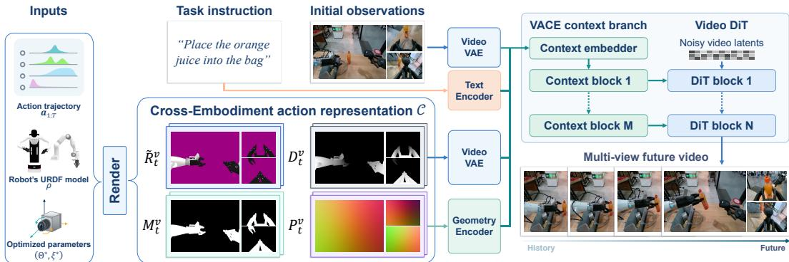  
Figure 3: Unified multi-view world model. Robot renderings, gripper openings, and camera rays condition the video DiT through a VACE branch to predict multi-view future videos.

Action-conditioned training. We incorporate the action representation C into the generator through a VACE (Jiang et al., 2025b) conditioning branch. The rendered RGB images and normalized depth maps are separately encoded by the pretrained video VAE, while the masks and Plucker maps are¨ jointly encoded by a 3D convolutional geometry encoder. The resulting features are concatenated to form the input context of the VACE branch, which produces residuals injected into the corresponding DiT (Peebles & Xie, 2023) layers. For multi-view prediction, video latents from different views are tiled along the width dimension in a fixed order, with the action features arranged in the same layout. Initial multi-view observations are encoded as reference latent frames.

We train the generator on multiple robot datasets D, using paired future videos as supervision. Let z denote the ground-truth multi-view video latent, $z _ { \tau }$ its noisy version at time τ with sampled noise ϵ, and uτ the corresponding flow-matching (Lipman et al., 2023) velocity target. Given the condition $c = ( \pmb { x } _ { 0 } ^ { 1 : V } , \ell , \mathcal { C } )$ , we train the generator $f _ { \theta }$ with the objective

$$
\begin{array} { r } { \mathcal { L } _ { \mathrm { S F T } } = \mathbb { E } _ { ( z , c ) \sim \mathcal { D } , \tau , \epsilon } \left[ \| f _ { \theta } ( z _ { \tau } , \tau ; c ) - u _ { \tau } \| _ { 2 } ^ { 2 } \right] . } \end{array}\tag{3}
$$

## 3.4 Stage II: Counterfactual Post-Training with Embodied Video Rewards

Stage II extends training with counterfactual actions, exposing the model to a broader range of action and contact configurations. We learn a video reward model from human annotations of generation defects and use its feedback to guide reinforcement learning (Zhu et al., 2023; Black et al., 2024).

Counterfactual action construction. We modify a recorded trajectory by applying an SE(3) perturbation to its final end-effector pose and interpolating from the fixed initial pose to the perturbed endpoint. Inverse kinematics (Guo et al., 2021) converts this trajectory into a counterfactual action sequence, which we use to construct the conditioning inputs C as described in Section 3.3. The initial observations are fixed to explore the predicted outcomes of different actions from the same scene.

Embodied video reward learning. Although counterfactual actions lack paired ground-truth future videos, the physical plausibility of their generated predictions can still be assessed through observable defects. For example, an object rising with a gripper after a missed grasp reveals an interaction error without requiring a reference video. To capture defects in both the robot and objects themselves and their interactions, we construct a human-annotated video defect dataset using pre-

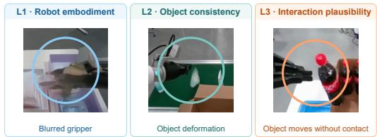  
Figure 4: Representative defects across three dimensions: robot embodiment (L1), object consistency (L2), and interaction plausibility (L3).

dictions from multiple world models under recorded and counterfactual actions. The annotations cover three complementary dimensions: robot embodiment (L1), object consistency (L2), and interaction plausibility (L3), as illustrated in Figure 4.

Using these annotations, we fine-tune a vision-language reward model (Qwen Team, 2026) $q _ { \phi }$ with cross-entropy loss to predict defects in each dimension. Given a generated video xˆ and a fixed evaluation prompt, let $p _ { \phi } ^ { k } ( \hat { x } )$ denote the predicted defect probability for $k \in \{ \mathrm { L 1 } , \mathrm { L 2 } , \mathrm { L 3 } \}$ . We define the continuous reward as $R ^ { k } ( \hat { x } ) = - p _ { \phi } ^ { k } ( \hat { x } )$ , so that lower predicted defect probabilities yield higher rewards. This converts binary annotations into continuous feedback for generator post-training. Reward-model data and annotation details are provided in Section B.1.

Reward-guided generator post-training. Starting from Stage I, we post-train the generator by augmenting the recorded trajectories with the counterfactual actions constructed above. For each resulting action condition, we sample a group of future videos and score them with the frozen reward model $q _ { \phi }$ . All predictions receive the three defect-based rewards. Predictions under recorded actions additionally receive a PSNR reward against their paired ground-truth futures to preserve fidelity. Following GDPO (Liu et al., 2026), we normalize each reward within the sampled group, combine the resulting advantages using a weighted sum, and apply batch-wise normalization to obtain $A _ { i }$ . We then optimize the generator with DiffusionNFT (Zheng et al., 2026b):

$$
\mathcal { L } _ { \mathrm { N F T } } = \mathbb { E } _ { i , \tau , \epsilon _ { i } } \left[ r ( A _ { i } ) \ell _ { i } ^ { + } + \bigl ( 1 - r ( A _ { i } ) \bigr ) \ell _ { i } ^ { - } \right] .\tag{4}
$$

Here, $\tau$ and $\epsilon _ { i }$ denote the sampled noise time and noise, respectively. The positive and negative denoising objectives $\ell _ { i } ^ { + }$ and $\ell _ { i } ^ { - }$ and the clipped-advantage mapping $r ( \cdot )$ follow DiffusionNFT.

## 4 Experiments

## 4.1 Experimental Setup

Datasets and benchmarks. DREAMTRUE is jointly trained on AgiBotWorld-Beta (Bu et al., 2025a), DROID (Khazatsky et al., 2024), RoboMIND 2.0 (Hou et al., 2025), and RoboTwin 2.0 (Chen et al., 2025). After filtering, the training data contain 2,232 h of multi-view trajectories across five robot arm types in real and simulated environments (Figure 10, in appendix). We evaluate future prediction on held-out episodes from these datasets. On AgiBot, we additionally construct 160 counterfactual test conditions across 54 tasks by perturbing recorded trajectories as described in Section 3.4.

Baselines and metrics. We compare against DreamDojo (Gao et al., 2026), GE-Sim 2.0 (Qiu et al., 2026), Genie Envisioner (Liao et al., 2026), and EnerVerse-AC (Jiang et al., 2025a), using their native conditioning interfaces. We also compare our Stage-I model (Ours (w/o RL)) with the full Stage-II model (Ours (full)) to assess the effect of reward-guided post-training. We measure action following using normalised dynamic time warping (nDTW) from EWMBench (Yue et al., 2025), and visual fidelity against ground-truth videos using PSNR (Hore & Ziou, 2010), SSIM (Wang et al., 2004), and LPIPS (Zhang et al., 2018). We additionally report EWMScore-P, which aggregates 15 metrics across six WorldArena quality dimensions (Shang et al., 2026). To assess physical plausibility, three independent annotators inspect counterfactual predictions for defects in robot embodiment, object consistency, and interaction plausibility. We report defect rates based on majority agreement (Fleiss κ = 0.7817 for any-defect labels). Further evaluation details are provided in Section C.1.

## 4.2 Action Following and Interaction Plausibility

Table 1: Benchmark evaluation on AgiBot under recorded and counterfactual actions. Defect rates are reported in percent (%); best , second-best , and third-best scores are highlighted in blue.
<table><tr><td></td><td colspan="5">Recorded actions</td><td colspan="4">Counterfactual actions</td></tr><tr><td>Model</td><td>EWMScore-P ↑</td><td>PSNR↑</td><td>SSIM ↑</td><td>LPIPS ↓</td><td>nDTW ↑</td><td>Embodiment ↓</td><td>Object ↓</td><td>Interaction ↓</td><td>nDTW ↑</td></tr><tr><td>EnerVerse-AC</td><td>68.61</td><td>19.17</td><td>0.863</td><td>0.158</td><td>0.8058</td><td>1.25</td><td>49.38</td><td>48.12</td><td>0.6828</td></tr><tr><td>Genie Envisioner</td><td>70.37</td><td>20.72</td><td>0.890</td><td>0.112</td><td>0.8124</td><td>0.00</td><td>43.75</td><td>54.38</td><td>0.7379</td></tr><tr><td>DreamDojo</td><td>70.01</td><td>19.27</td><td>0.812</td><td>0.163</td><td>0.6578</td><td>0.00</td><td>12.50</td><td>16.25</td><td>0.6407</td></tr><tr><td>GE-Sim 2.0</td><td>72.36</td><td>19.91</td><td>0.874</td><td>0.130</td><td>0.8063</td><td>0.00</td><td>3.75</td><td>7.50</td><td>0.7817</td></tr><tr><td>Ours (w/o RL)</td><td>72.84</td><td>22.66</td><td>0.928</td><td>0.099</td><td>0.8711</td><td>0.00</td><td>31.88</td><td>48.12</td><td>0.8735</td></tr><tr><td>Ours (full)</td><td>72.51</td><td>23.06</td><td>0.936</td><td>0.094</td><td>0.8772</td><td>0.00</td><td>3.12</td><td>6.25</td><td>0.8831</td></tr></table>

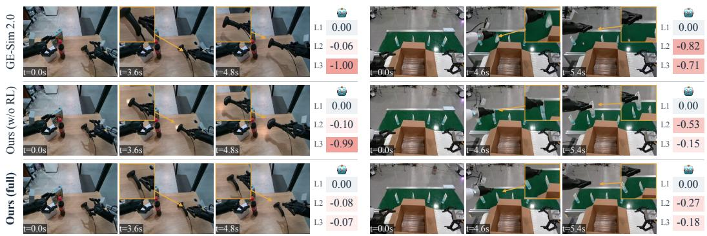  
Figure 5: Qualitative comparison of counterfactual action predictions. Compared with GE-Sim 2.0 and our model without RL, the full model avoids unsupported scanner motion and object disappearance or duplication in these examples. Yellow annotations highlight relevant regions. The reward model scores L1–L3 assess embodiment, object, and interaction quality, respectively.

DREAMTRUE accurately follows the supplied ac  
tions while maintaining visual fidelity. As shown in   
Table 1, the full model achieves the highest nDTW   
among evaluated methods under both recorded   
and counterfactual actions, with scores of 0.8772   
and 0.8831, respectively. It also achieves the   
best PSNR, SSIM, and LPIPS against ground-truth   
videos. Our model ranks first in the world model   
track of the AgiBot World Challenge 2026, achieving the highest overall score, action following, and track of the AgiBot World Challenge 2026, achievir visual quality among participating teams (Table 2). visual quality among participating teams (Table 2).

Table 2: Action-conditioned generation results of the world model track of the AgiBot World Challenge 2026. Best results are in bold; second-best results are underlined.
<table><tr><td>Team</td><td>Visual Quality ↑ Scene Consistency ↑ Action Following ↑ | EWMScore ↑</td><td></td><td></td><td></td></tr><tr><td>Loop</td><td>0.6207</td><td>0.9024</td><td>0.9492</td><td>0.8241</td></tr><tr><td>PAIWorld</td><td>0.6161</td><td>0.9041</td><td>0.9531</td><td>0.8245</td></tr><tr><td> Ours</td><td>0.6246</td><td>0.8974</td><td>0.9651</td><td>0.829</td></tr></table>

We further evaluate whether objects respond coherently to the supplied actions. Compared with Stage I, reward-guided post-training reduces object defects from 31.88% to 3.12% and interaction defects from 48.12% to 6.25% (Table 1). Meanwhile, nDTW remains comparable, indicating that interaction quality improves without compromising action following. Figure 5 illustrates the reduced defects: the full model leaves an object on the table after a missed grasp and avoids the object disappearance or duplication observed in the comparison examples. Figure 6 further examines interaction outcomes when the initial scene is fixed and the actions vary, covering different grasp targets and single- and dual-arm manipulation. Grasped objects move with the grippers, while ungrasped objects remain on the table, including cases where only one arm successfully grasps. These examples illustrate physically plausible object responses under different actions.

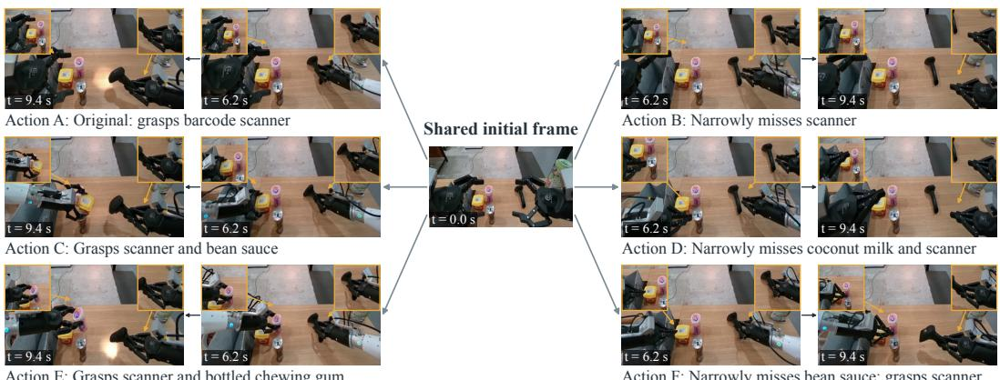  
Action E: Grasps scanner and bottled chewing gum  
Action F: Narrowly misses bean sauce; grasps scanner

Figure 6: Predictions from the same initial scene under multiple action conditions.

## 4.3 Prediction across Embodiments and Environments

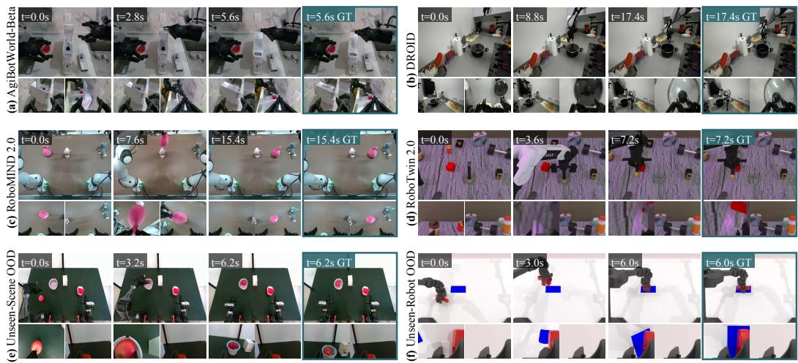  
Figure 7: Prediction across embodiments and environments. A shared checkpoint generates rollouts on 4 datasets and generalises without additional fine-tuning to (e) unseen real-world scenes and (f) an unseen robot embodiment (WidowX250).

Our model supports prediction across different robot embodiments and environments, as assessed on held-out episodes from DROID, RoboMIND 2.0, and RoboTwin 2.0 (Table 3). On DROID, it outperforms Ctrl-World across all three fidelity metrics, improving PSNR from 22.00 to 22.95 and reducing LPIPS from 0.162 to 0.073. Figure 7(a–d) shows representative predictions

Table 3: Multi-view recorded-action fidelity on DROID, RoboMIND 2.0, and RoboTwin 2.0.
<table><tr><td>Dataset</td><td>Model</td><td>PSNR ↑</td><td>SSIM↑</td><td>LPIPS ↓</td></tr><tr><td>DROID</td><td>Ctrl-World</td><td>22.00</td><td>0.772</td><td>0.162</td></tr><tr><td>RoboMIND 2.0</td><td>Ours (full)</td><td>22.95</td><td>0.848</td><td>0.073</td></tr><tr><td></td><td>Ours (full)</td><td>23.84</td><td>0.826</td><td>0.126</td></tr><tr><td>RoboTwin 2.0</td><td>Ours (full)</td><td>27.35</td><td>0.834</td><td>0.155</td></tr></table>

across all four training datasets, covering real and simulated robot manipulation.

We further examine transfer to an unseen robot embodiment and unseen real-world scenes. For embodiment transfer, we introduce WidowX250, which is excluded from training, into RoboTwin 2.0. For scene transfer, we evaluate self-collected Piper recordings in unseen real-world scenes. Without additional fine-tuning, the model produces the predictions shown in Figure $7 ( \mathrm { e , f } ) ,$ , providing qualitative evidence of transfer in both settings. Extended video sequences are provided in Section D.

## 4.4 Policy Outcome Evaluation

Following world-model-based policy evaluation, we examine whether generated rollouts faithfully reproduce the success rates and rankings of robotic policies without spurious completions. Across three bimanual RoboTwin 2.0 tasks (Chen et al., 2025) under easy and hard settings, each world model predicts visual outcomes conditioned on 240 action trajectories supplied by four VLA policies, comparing humanannotated video outcomes against ground-truth simulation labels (Section C.2).

As visualized in Figure 8, our model yields a linear fit that virtually matches the ideal diagonal $( y =$ $1 . 0 3 2 x - 0 . 0 0 9 )$ , whereas baseline predictions exhibit a substantial upward shift $( y = 0 . 9 1 9 x + 0 . 0 8 7 )$ . This divergence is most evident in the low-success regime, where baseline rollouts consistently float above the diagonal by hallucinating completions on failed grasps. In contrast, our predictions cluster tightly along the

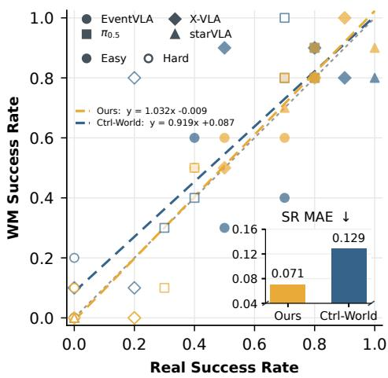  
Figure 8: Policy outcome alignment against ground-truth simulation across 24 evaluation conditions (inset: success-rate MAE).

diagonal across both easy and hard settings, cutting success-rate MAE from 12.92 to 7.08 percentage points (pp) as shown in the inset. Across the 24 task–policy–setting combinations, our model achieves strong rank correlation (Spearman $\rho = 0 . 9 3 7 )$ and near-zero aggregate bias $( + 0 . 4 2 { \ p p } )$ .

## 4.5 Effect of Geometric Calibration

Table 4: Ablation on geometric calibration across training and inference stages on AgiBot and DROID. Sync error (Synchronous Position Error) measures the 2D Euclidean distance (in pixels) between predicted and ground-truth end-effector positions across temporally aligned frames.
<table><tr><td>Dataset</td><td>Train calib.</td><td>Infer calib.</td><td>EWMScore-P ↑</td><td>PSNR ↑</td><td>SSIM↑</td><td>nDTW ↑</td><td>Sync error (px) ↓</td></tr><tr><td>AgiBot</td><td>Dataset-provided</td><td>Dataset-provided</td><td>72.11</td><td>21.06</td><td>0.898</td><td>0.8159</td><td>7.73</td></tr><tr><td>AgiBot</td><td>Dataset-provided</td><td>Refined</td><td>72.38</td><td>21.38</td><td>0.907</td><td>0.8243</td><td>5.77</td></tr><tr><td>AgiBot</td><td>Refined</td><td>Refined</td><td>72.84</td><td>22.66</td><td>0.928</td><td>0.8711</td><td>4.60</td></tr><tr><td>DROID</td><td>Dataset-provided</td><td>Dataset-provided</td><td>71.03</td><td>20.77</td><td>0.809</td><td>0.7718</td><td>11.78</td></tr><tr><td>DROID</td><td>Dataset-provided</td><td>Refined</td><td>71.51</td><td>21.36</td><td>0.817</td><td>0.8569</td><td>10.21</td></tr><tr><td>DROID</td><td>Refined</td><td>Refined</td><td>72.29</td><td>22.66</td><td>0.841</td><td>0.8919</td><td>8.06</td></tr></table>

We evaluate geometric calibration using area-weighted IoU between robot renderings and SAM3 masks. Relative to dataset-provided calibration, our method improves mean IoU by 0.228 on 130,182 AgiBot episodes and 0.212 on 63,061 DROID episodes, with improvements on 97.1% and 91.6% of episodes, respectively (Figure 9). On DROID, we additionally compare against PointWorld (Huang et al., 2026). Despite using RGB only, our method outperforms PointWorld on 75.5% of 38,356 episodes (Figure 9e); PointWorld relies on FoundationStereo (Wen et al., 2025) depth and therefore requires stereo inputs, which is unavailable in our other datasets.

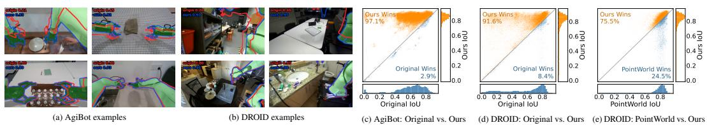

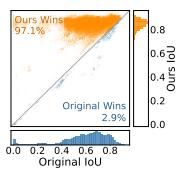

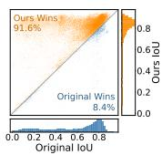

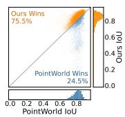  
Figure 9: Geometric calibration results. (a,b) SAM3 masks (green) overlaid with Original (red) and Ours (blue) contours. (c–e) IoU comparisons against Original and PointWorld, using AgiBot’s head view and DROID’s two external view mean. Points above the diagonal favor Ours.

Table 4 further examines how improved alignment affects video prediction. Applying refined calibration only at inference improves all reported metrics on both datasets, indicating that the generator benefits from more accurate action conditions even without retraining. Using refined calibration during training as well yields further gains: PSNR improves by 1.28 dB on AgiBot and 1.30 dB on DROID, with a consistent reduction in synchronous position error across both datasets. These results support the value of spatial alignment for both inference-time conditioning and learning from paired actions and videos.

## 4.6 Reward Model Evaluation

We assess whether the embodied video reward model identifies defects in agreement with human judgments on 4,893 held-out manipulation clips (Table 5). Data splits and metric definitions are provided in Section B.1. Across the three dimensions, the model achieves an average accuracy of 86.33% and macro-F1 of 74.21%. The per-dimension results on L1–L3 further support the model’s ability to identify robot, object, and interaction defects, providing complementary feedback for Stage-II post-training. The effect

Table 5: Defect discrimination performance of the embodied video reward model on the held-out validation benchmark. Accuracy and macro-F1 are reported in percent (%).
<table><tr><td>Dimension</td><td>Accuracy ↑</td><td>Macro-F1 ↑</td><td>MAE↓</td></tr><tr><td>L1: Embodiment</td><td>96.69</td><td>69.37</td><td>0.041</td></tr><tr><td>L2: Object</td><td>79.24</td><td>79.00</td><td>0.243</td></tr><tr><td>L3: Interaction</td><td>83.08</td><td>74.27</td><td>0.198</td></tr><tr><td>Average</td><td>86.33</td><td>74.21</td><td>0.160</td></tr></table>

of this feedback on generation quality is evaluated independently by human annotators in Section 4.2.

## 5 Conclusion and Limitations

We present DREAMTRUE, a multi-view, cross-embodiment robot world model for action-faithful and physically plausible video prediction. Offline geometric calibration improves action following and prediction fidelity by aligning rendered action conditions with recorded videos, while counterfactual post-training improves robot–object interaction plausibility through broader interaction coverage and feedback from a learned embodied video reward model. Experiments further show that the resulting predictions enable more accurate estimation of policy outcomes, supporting the use of world models for evaluating robot actions before execution. We also release refined calibration results for 153,666 episodes across three datasets and a video defect annotation corpus covering 44.9K videos from multiple world models.

Limitations. The action representation, generator, and VLM reward model all operate in image space; under occlusion or limited views, the framework may generate or reward visually plausible but physically incorrect interactions.

## References

Hadi Alzayer, Wenlong Huang, Haonan Chen, Christopher Luey, Lvmin Zhang, Maneesh Agrawala, Gordon Wetzstein, Li Fei-Fei, Yilun Du, et al. Masked visual actions for unified world modeling. arXiv preprint arXiv:2607.19343, 2026.

Kevin Black, Michael Janner, Yilun Du, Ilya Kostrikov, and Sergey Levine. Training diffusion models with reinforcement learning. In International Conference on Learning Representations, 2024.

Kevin Black, Noah Brown, James Darpinian, Karan Dhabalia, Danny Driess, Adnan Esmail, Michael Robert Equi, Chelsea Finn, Niccolo Fusai, et al. π0.5: A vision-language-action model with open-world generalization. In Conference on Robot Learning, pp. 17–40, 2025.

Qingwen Bu, Jisong Cai, Li Chen, Xiuqi Cui, Yan Ding, Siyuan Feng, Shenyuan Gao, Xindong He, Xu Huang, et al. AgiBot world colosseo: A large-scale manipulation platform for scalable and intelligent embodied systems. In 2025 IEEE/RSJ International Conference on Intelligent Robots and Systems (IROS), pp. 3549–3556, 2025a. doi: 10.1109/IROS60139.2025.11247088.

Qingwen Bu, Jisong Cai, Li Chen, Xiuqi Cui, Yan Ding, Siyuan Feng, Xindong He, Xu Huang, et al. Agibot world colosseo: A large-scale manipulation platform for scalable and intelligent embodied systems. In 2025 IEEE/RSJ International Conference on Intelligent Robots and Systems (IROS). IEEE, 2025b.

Nicolas Carion, Laura Gustafson, Yuan-Ting Hu, Shoubhik Debnath, Ronghang Hu, Didac Suris, Chaitanya Ryali, Kalyan Vasudev Alwala, Haitham Khedr, et al. SAM 3: Segment Anything with Concepts. arXiv preprint arXiv:2511.16719, 2025.

Linghao Chen, Yuzhe Qin, Xiaowei Zhou, and Hao Su. EasyHeC: Accurate and automatic hand-eye calibration via differentiable rendering and space exploration. IEEE Robotics and Automation Letters, 8(11):7234–7241, 2023. doi: 10.1109/LRA.2023.3315551.

Tianxing Chen, Zanxin Chen, Baijun Chen, Zijian Cai, Yibin Liu, Qiwei Liang, et al. RoboTwin 2.0: A scalable data generator and benchmark with strong domain randomization for robust bimanual robotic manipulation. arXiv preprint arXiv:2506.18088, 2025.

Yixiang Chen, Peiyan Li, Jiabing Yang, Keji He, Xiangnan Wu, Yuan Xu, Kai Wang, Jing Liu, Nianfeng Liu, et al. BridgeV2w: Bridging video generation models to embodied world models via embodiment masks. arXiv preprint arXiv:2602.03793, 2026.

Johan Edstedt, David Nordstrom, Yushan Zhang, Georg B¨ okman, Jonathan Astermark, Viktor¨ Larsson, Anders Heyden, Fredrik Kahl, Marten Wadenb˚ ack, et al. RoMa v2: Harder Better Faster¨ Denser Feature Matching. In European Conference on Computer Vision, 2026.

Shenyuan Gao, William Liang, Kaiyuan Zheng, Ayaan Malik, Seonghyeon Ye, Sihyun Yu, Wei-Cheng Tseng, Yuzhu Dong, Kaichun Mo, et al. DreamDojo: A generalist robot world model from large-scale human videos. arXiv preprint arXiv:2602.06949, 2026.

Gemini Robotics, Coline Devin, Yilun Du, Debidatta Dwibedi, Ruiqi Gao, Abhishek Jindal, Thomas Kipf, Sean Kirmani, Fangchen Liu, et al. Evaluating gemini robotics policies in a veo world simulator. arXiv preprint arXiv:2512.10675, 2025.

Runlin Guo, Xinsong Lin, Minghua Liu, Jiayuan Gu, and Hao Su. MPlib: a lightweight motion planning library, 2021. URL https://github.com/haosulab/MPlib. Documentation: https://motion-planning-lib.readthedocs.io/latest/.

Yanjiang Guo, Lucy Xiaoyang Shi, Jianyu Chen, and Chelsea Finn. Ctrl-world: A controllable generative world model for robot manipulation. arXiv preprint arXiv:2510.10125, 2025.

Yanjiang Guo, Tony Lee, Lucy Xiaoyang Shi, Jianyu Chen, Percy Liang, and Chelsea Finn. VLAW: Iterative co-improvement of vision-language-action policy and world model. arXiv preprint arXiv:2602.12063, 2026.

David Ha and J”urgen Schmidhuber. Recurrent world models facilitate policy evolution. In Advances in Neural Information Processing Systems, volume 31, pp. 2451–2463, 2018.

Danijar Hafner, Timothy P. Lillicrap, Jimmy Ba, and Mohammad Norouzi. Dream to control: Learning behaviors by latent imagination. In International Conference on Learning Representations, 2020.

Zhengdong Hong, Kangfu Zheng, and Linghao Chen. EasyHeC++: Fully automatic hand-eye calibration with pretrained image models. In 2024 IEEE/RSJ International Conference on Intelligent Robots and Systems (IROS), pp. 816–823, 2024. doi: 10.1109/IROS58592.2024.10801359.

Alain Hore and Djemel Ziou. Image quality metrics: PSNR vs. SSIM. In International Conference on Pattern Recognition (ICPR), pp. 2366–2369, 2010. doi: 10.1109/ICPR.2010.579.

Chengkai Hou, Kun Wu, Jiaming Liu, Zhengping Che, Di Wu, Fei Liao, Guangrun Li, Jingyang He, Qiuxuan Feng, et al. RoboMIND 2.0: A multimodal, bimanual mobile manipulation dataset for generalizable embodied intelligence. arXiv preprint arXiv:2512.24653, 2025.

Wenlong Huang, Yu-Wei Chao, Arsalan Mousavian, Ming-Yu Liu, Dieter Fox, Kaichun Mo, and Li Fei-Fei. PointWorld: Scaling 3d world models for in-the-wild robotic manipulation. arXiv preprint arXiv:2601.03782, 2026.

Yuxin Jiang, Shengcong Chen, Siyuan Huang, Liliang Chen, Pengfei Zhou, Yue Liao, Xindong He, Chiming Liu, Hongsheng Li, et al. EnerVerse-AC: Envisioning embodied environments with action condition. arXiv preprint arXiv:2505.09723, 2025.

Zeyinzi Jiang, Zhen Han, Chaojie Mao, Jingfeng Zhang, Yulin Pan, and Yu Liu. VACE: All-in-one video creation and editing. In Proceedings of the IEEE/CVF International Conference on Computer Vision, 2025b.

Zhennan Jiang, Shangqing Zhou, Yutong Jiang, Zefang Huang, Mingjie Wei, Yuhui Chen, Tianxing Zhou, Zhen Guo, Hao Lin, et al. WoVR: World models as reliable simulators for post-training VLA policies with RL. arXiv preprint arXiv:2602.13977, 2026.

Alexander Khazatsky, Karl Pertsch, Suraj Nair, Ashwin Balakrishna, Sudeep Dasari, Siddharth Karamcheti, Soroush Nasiriany, Mohan Kumar Srirama, Lawrence Yunliang Chen, et al. DROID: A large-scale in-the-wild robot manipulation dataset. Robotics: Science and Systems (RSS), 2024.

Chenyu Li, Oscar Michel, Xichen Pan, Sainan Liu, Mike Roberts, and Saining Xie. PISA experiments: Exploring physics post-training for video diffusion models by watching stuff drop. In International Conference on Machine Learning, 2025a.

Xinqing Li, Xin He, Le Zhang, Min Wu, Xiaoli Li, and Yun Liu. A comprehensive survey on world models for embodied AI. arXiv preprint arXiv:2510.16732, 2025.

Yue Liao, Pengfei Zhou, Siyuan Huang, Donglin Yang, Shengcong Chen, Yuxin Jiang, Yue Hu, Jingbin Cai, Si Liu, et al. Genie envisioner: A unified world foundation platform for robotic manipulation. In International Conference on Learning Representations, 2026.

Yaron Lipman, Ricky T. Q. Chen, Heli Ben-Hamu, Maximilian Nickel, and Matt Le. Flow matching for generative modeling. In International Conference on Learning Representations, 2023.

Shih-Yang Liu, Xin Dong, Ximing Lu, Shizhe Diao, Peter Belcak, Mingjie Liu, Min-Hung Chen, Hongxu Yin, Yu-Chiang Frank Wang, et al. GDPO: Group reward-decoupled normalization policy optimization for multi-reward RL optimization. arXiv preprint arXiv:2601.05242, 2026.

NVIDIA, Arslan Ali, Junjie Bai, Maciej Bala, Yogesh Balaji, Aaron Blakeman, Tiffany Cai, Jiaxin Cao, Tianshi Cao, et al. World simulation with video foundation models for physical AI. arXiv preprint arXiv:2511.00062, 2025.

Open X-Embodiment. Open x-embodiment: Robotic learning datasets and RT-X models. In 2024 IEEE International Conference on Robotics and Automation (ICRA), pp. 6892–6903, 2024. doi: 10.1109/ICRA57147.2024.10611477.

William Peebles and Saining Xie. Scalable diffusion models with transformers. In Proceedings of the IEEE/CVF International Conference on Computer Vision, 2023.

Quanquan Peng, Yutong Liang, Rui Yan, Nicklas Hansen, and Xiaolong Wang. FACT: Failure-aware causal training for world-action models. arXiv preprint arXiv:2608.10232, 2026.

Bowen Ping, Chengyou Jia, Minnan Luo, Hangwei Qian, and Ivor Tsang. Flow-factory: A unified framework for reinforcement learning in flow-matching models. arXiv preprint arXiv:2602.12529, 2026.

Boxiang Qiu, Liliang Chen, Yue Liao, Nan Wang, Lintao Wang, Jiayi Luo, Wenzhi Zhao, Shengcong Chen, Di Chen, et al. GE-Sim 2.0: A roadmap towards comprehensive closed-loop video world simulators for robotic manipulation. arXiv preprint arXiv:2605.27491, 2026.

Qwen Team. Qwen3.5-omni technical report. arXiv preprint arXiv:2604.15804, 2026.

Yu Shang, Zhuohang Li, Yiding Ma, Weikang Su, Xin Jin, Ziyou Wang, Lei Jin, Xin Zhang, Yinzhou Tang, et al. WorldArena: A unified benchmark for evaluating perception and functional utility of embodied world models. arXiv preprint arXiv:2602.08971, 2026.

Xiaoquan Sun, Zetian Xu, Chen Cao, Zonghe Liu, Yihan Sun, Jingrui Pang, Ruijian Zhang, Zhen Yang, Kang Pang, et al. AtomVLA: Scalable post-training for robotic manipulation via predictive latent world models. arXiv preprint arXiv:2603.08519, 2026.

Roger Y. Tsai and Reimar K. Lenz. A new technique for fully autonomous and efficient 3d robotics hand/eye calibration. IEEE Transactions on Robotics and Automation, 5(3):345–358, 1989. doi: 10.1109/70.34770.

Homer Walke, Kevin Black, Abraham Lee, Moo Jin Kim, Max Du, Chongyi Zheng, Tony Zhao, Philippe Hansen-Estruch, Quan Vuong, et al. BridgeData V2: A dataset for robot learning at scale. In Conference on Robot Learning, 2023.

Zehan Wang, Tengfei Wang, Haiyu Zhang, Xuhui Zuo, Junta Wu, Haoyuan Wang, Wenqiang Sun, Zhenwei Wang, Chenjie Cao, et al. WorldCompass: Reinforcement learning for long-horizon world models. arXiv preprint arXiv:2602.09022, 2026.

Zhou Wang, Alan C. Bovik, Hamid R. Sheikh, and Eero P. Simoncelli. Image quality assessment: From error visibility to structural similarity. IEEE Transactions on Image Processing, 13(4): 600–612, 2004. doi: 10.1109/TIP.2003.819861.

Bowen Wen, Matthew Trepte, Joseph Aribido, Jan Kautz, Orazio Gallo, and Stan Birchfield. FoundationStereo: Zero-shot stereo matching. In Proceedings of the IEEE/CVF Conference on Computer Vision and Pattern Recognition (CVPR), pp. 5249–5260, June 2025.

Kun Wu, Chengkai Hou, Jiaming Liu, Zhengping Che, Xiaozhu Ju, Zhuqin Yang, Meng Li, Yinuo Zhao, Zhiyuan Xu, et al. Robomind: Benchmark on multi-embodiment intelligence normative data for robot manipulation. In Robotics: Science and Systems (RSS) 2025. Robotics: Science and Systems Foundation, 2025.

Ganlin Yang, Zhangzheng Tu, Yuqiang Yang, Sitong Mao, Junyi Dong, Tianxing Chen, Jiaqi Peng, Jing Xiong, Jiafei Cao, et al. EventVLA: Event-driven visual evidence memory for long-horizon vision-language-action policies. In Conference on Robot Learning, 2026a.

Yuxue Yang, Lue Fan, Ziqi Shi, Junran Peng, Feng Wang, and Zhaoxiang Zhang. NeoVerse: Enhancing 4d world model with in-the-wild monocular videos. In Proceedings of the IEEE/CVF Conference on Computer Vision and Pattern Recognition, 2026b.

Jinhui Ye, Ning Gao, Senqiao Yang, Jinliang Zheng, Zixuan Wang, Yuxin Chen, Pengguang Chen, Yilun Chen, Shu Liu, et al. StarVLA-α: Reducing complexity in vision-language-action systems. In European Conference on Computer Vision, 2026.

Tenny Yin, Zhiting Mei, Zhonghe Zheng, Miyu Yamane, David Wang, Jade Sceats, Samuel M. Bateman, Lihan Zha, Apurva Badithela, et al. PlayWorld: Learning robot world models from autonomous play. arXiv preprint arXiv:2603.09030, 2026.

Jianhao Yuan, Xiaofeng Zhang, Felix Friedrich, Nicolas Beltran-Velez, Melissa Hall, Reyhane Askari-Hemmat, Xiaochuang Han, Nicolas Ballas, Michal Drozdzal, et al. Inference-time physics alignment of video generative models with latent world models. arXiv preprint arXiv:2601.10553, 2026.

Hu Yue, Siyuan Huang, Yue Liao, Shengcong Chen, Pengfei Zhou, Liliang Chen, Maoqing Yao, and Guanghui Ren. EWMBench: Evaluating scene, motion, and semantic quality in embodied world models. arXiv preprint arXiv:2505.09694, 2025.

Richard Zhang, Phillip Isola, Alexei A. Efros, Eli Shechtman, and Oliver Wang. The unreasonable effectiveness of deep features as a perceptual metric. In Proceedings of the IEEE Conference on Computer Vision and Pattern Recognition, pp. 586–595, 2018.

Jinliang Zheng, Jianxiong Li, Zhihao Wang, Dongxiu Liu, Xirui Kang, Yuchun Feng, Yinan Zheng, Jiayin Zou, Yilun Chen, et al. X-VLA: Soft-prompted transformer as scalable cross-embodiment vision-language-action model. In International Conference on Learning Representations, 2026a.

Kaiwen Zheng, Huayu Chen, Haotian Ye, Haoxiang Wang, Qinsheng Zhang, Kai Jiang, Hang Su, Stefano Ermon, Jun Zhu, et al. DiffusionNFT: Online diffusion reinforcement with forward process. In International Conference on Learning Representations, 2026b. Oral presentation.

Siyuan Zhou, Yilun Du, Jiaben Chen, Yandong Li, Dit-Yan Yeung, and Chuang Gan. Robodreamer: Learning compositional world models for robot imagination. In International Conference on Machine Learning, 2024.

Fangqi Zhu, Hongtao Wu, Song Guo, Yuxiao Liu, Chilam Cheang, and Tao Kong. IRASim: A fine-grained world model for robot manipulation. In Proceedings ofthe IEEE/CVF International Conference on Computer Vision, 2025a.

Fangqi Zhu, Zhengyang Yan, Zicong Hong, Quanxin Shou, Xiao Ma, and Song Guo. WMPO: World model-based policy optimization for vision-language-action models. arXiv preprint arXiv:2511.09515, 2025.

Zhengbang Zhu, Hanye Zhao, Haoran He, Yichao Zhong, Shenyu Zhang, Haoquan Guo, Tingting Chen, and Weinan Zhang. Diffusion models for reinforcement learning: A survey. arXiv preprint arXiv:2311.01223, 2023.

# SUPPLEMENTARY MATERIAL

## A Model, Data, and Condition Construction

The following details specify the implementation and condition interface used for the reported experiments.

Throughout the paper, Ours (w/o RL) denotes the supervised Stage-I checkpoint, while Ours (full) denotes the Stage-II checkpoint obtained by counterfactual post-training from the same Stage-I model.

## A.1 Implementation and Training

The video generator, initialized from Wan2.1-VACE-14B, processes 101-frame clips with three synchronized views at 240 × 320 resolution per view and a frame-aligned shared visual action representation. It conditions on the first RGB frame from each view and the task instruction to predict the remaining 100 frames. DROID uses two external cameras and one gripper camera; the other three-view layouts use a primary camera and two wrist cameras. Video latents are tiled along the width dimension in a fixed order, with action features arranged in the same layout. Stage I trains the DiT and VACE LoRA branches together with the 3D convolutional geometry encoder for masks and Plucker maps. Stage II keeps the base generator, the geometry encoder, and the reward model frozen¨ and updates only the DiT and VACE LoRA branches. The model has approximately 0.7B trainable parameters. The LoRA rank is 128 and the Stage-II learning rate is $5 \times 1 0 ^ { - 6 }$ . The frozen Qwen3.5-9B reward model supplies L1, L2, and L3 rewards for both types of conditions; PSNR is added only for recorded actions with paired ground-truth futures. GDPO normalizes each reward within a group, combines the normalized rewards with a weighted sum, and applies batch-wise normalization. The resulting advantages weight the positive and negative denoising objectives of DiffusionNFT. The normalized L1, L2, and L3 reward channels are equally weighted with a weight of 1 each, while the recorded-action PSNR channel has a weight of 0.5.

Stage I jointly samples AgiBotWorld-Beta, DROID, RoboMIND 2.0, and RoboTwin 2.0, comprising the 2,232 h of filtered trajectories described in Section 4.1. The shared action representation accommodates their different embodiments and camera layouts. Stage II reuses recorded conditions together with their counterfactual action edits; paired-future fidelity is applied only to samples with an observed future. No dataset-specific fine-tuning is used for the cross-embodiment results.

## A.2 Condition Construction

## A.2.1 Implementation Details Offline Geometric Calibration

For real-world data, offline geometric calibration is applied before condition rendering. It jointly refines camera intrinsics, extrinsics, distortion, and, where applicable, arm mounting offsets using the correspondence losses in Section 3.2. Robot–image alignment uses render–observation correspondences, while temporal and cross-view correspondences impose ray coplanarity. Calibration quality is evaluated by area-weighted IoU between rendered robot masks and SAM3 masks over 130,182 AgiBot episodes and 63,061 DROID episodes, as reported in Section 4.5 and Figure 9. The calibration ablation separately considers refinement at inference only and at both training and inference.

We group episodes within each real-world dataset by available collection metadata, such as collector, camera, and robot identifiers. Within each group, we calibrate a randomly selected episode and evaluate the resulting parameters on other episodes using randomly sampled frames. We progressively calibrate additional episodes with poor alignment for each group. AgiBot and RoboMIND use a fixed initialization, whereas DROID uses 32 initializations to accommodate varying camera extrinsics. Arm mounting offsets are optimized for RoboMIND and for the self-collected Piper recordings used in unseen-scene OOD evaluation. For RoboTwin and the WidowX250 embodiment transferred into it, we use ground-truth geometry from the simulator.

Evaluation episodes undergo calibration-quality checks and may receive additional calibration when alignment is poor. Calibration of evaluation episodes does not use ground-truth frames from the prediction interval. The calibrated geometry is frozen and used to render the action conditions for video prediction.

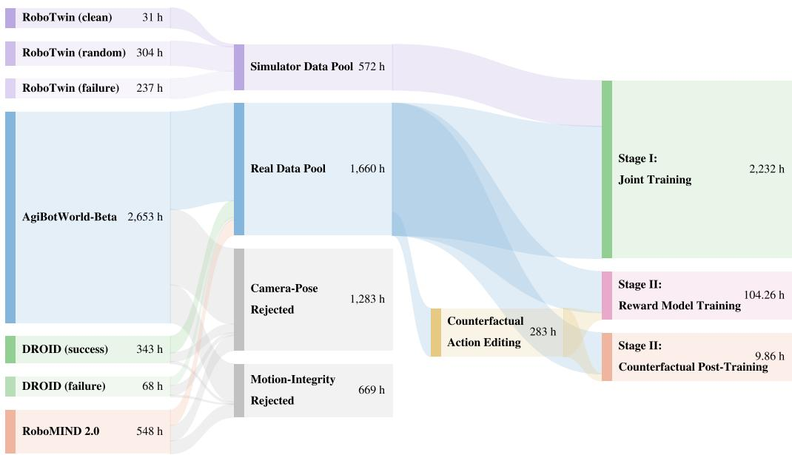  
Figure 10: Training-data curation pipeline from raw demonstration sources through geometric calibration and motion filtering to the two training stages; numbers denote cumulative hours.

Released calibration. We release per-episode calibration parameters for the filtered real-data pool shown in Figure 10, covering 153,666 episodes and 1,660.31 h across AgiBotWorld-Beta (1,225.60 h), DROID (239.73 h), and RoboMIND 2.0 (194.98 h). Each record contains camera intrinsics, extrinsics, and distortion parameters. DROID and RoboMIND 2.0 records additionally contain mounting offsets and calibration-quality metrics.

## A.2.2 Rendered Channels

For every frame and view, the preprocessing pipeline stores robot RGB, depth, mask, camera metadata, and robot state. Robot RGB and normalized depth are encoded by the video VAE, while the robot mask and Plucker map are processed by the 3D convolutional geometry encoder. Link-level¨ segmentation and simulator metadata support preprocessing and evaluation but are not model inputs.

## A.2.3 Gripper Channel Convention

Gripper openings are linearly mapped to background RGB intensities in [0, 255], as in Stage I. The left and right gripper values occupy the red and green channels, respectively. These continuous state cues are included in the rendered RGB condition before VAE encoding.

## A.2.4 Counterfactual Trajectory Construction

An SE(3) perturbation is applied to the final end-effector pose of a demonstrated trajectory. We interpolate from the fixed initial pose to this perturbed endpoint and use inverse kinematics to obtain the modified joint sequence. Initial observations and the task instruction remain unchanged. Counterfactual edits retain the original episode’s fixed calibration parameters. Robot renderings and trajectory-dependent wrist-camera geometry are recomputed from the modified sequence to construct the same shared action representation used in Stage I. Only kinematically feasible conditions are retained.

## B Reward Model, Annotation, and Metrics

## B.1 Embodied Video Reward Model and Human Annotation

The annotation form contains three dimensions: L1 Embodiment, L2 Object, and L3 Interaction. L1 records duplication, disappearance, and structural or material defects; L2 records object appearance, disappearance, deformation, material, and texture defects; and L3 records contact–motion mismatch and physically implausible interaction. For reward-model training, all three dimensions use the binary labels none and defective, derived from a single annotation per generated video. For downstream human evaluation, defect rates are computed from video-level majority labels provided by three independent annotators, as specified in Section C.1.

The reward model predicts the three top-level labels in one structured response. A single response supplies three label distributions at their respective token positions. For each dimension k, the reward is the negative defect-label probability, $R ^ { k } ( \hat { x } ) = - p _ { \phi } ^ { k } ( \hat { x } )$ , as defined in Stage II. The three channels are normalized independently by GDPO. We fine-tune all parameters of Qwen3.5-9B with an autoregressive cross-entropy loss weighted per sample and per dimension. The weights balance task–label groups within each source variant and then balance total weights across variants for each dimension. The corpus combines paired ground-truth videos, used as defect-free references, with human-annotated predictions from several world models under recorded or kinematically valid counterfactual action conditions. Videos are sampled at 5 FPS, resized to a height of 240 pixels, tiled in their existing multi-view layout. The model receives only the video being assessed and a fixed evaluation prompt at scoring time, without an additional paired source future or rendered action condition.

Data composition and split. The reward-model corpus combines ground-truth videos with annotated predictions under recorded and counterfactual actions. It covers AgiBot (Bu et al., 2025a), DROID (Khazatsky et al., 2024), RoboMIND (Hou et al., 2025), and RoboTwin (Chen et al., 2025), and additionally includes predictions generated from single-view Bridge dataset (Walke et al., 2023). Bridge is used only for reward-model training and validation, not for training the multi-view video generator. Predictions come from our model and seven external models: DreamDojo (Gao et al., 2026), Ctrl-World (Guo et al., 2025), EnerVerse-AC (Jiang et al., 2025a), Genie Envisioner (Liao et al., 2026), GE-Sim 2.0 (Qiu et al., 2026), Cosmos Predict 2.5 (NVIDIA et al., 2025), and IRASim (Zhu et al., 2025a). The training and validation sets contain 31,600 and 4,893 distinct video paths, respectively (Table 6), and are split by source-episode identifier.

Released annotations. The annotation corpus covers 44.9K original videos and contains 30.4K defect labels across the L1, L2, and L3 dimensions. After filtering, 36,493 distinct video paths are used for reward-model training and validation, including 31,600 training videos and 4,893 validation videos.

Table 6: Reward-model data composition, counted by distinct video paths.
<table><tr><td>Video source</td><td>Training</td><td>Validation</td></tr><tr><td>Ground-truth videos</td><td>3,680</td><td>667</td></tr><tr><td>Recorded-action predictions</td><td>16,067</td><td>2,090</td></tr><tr><td>Counterfactual-action predictions</td><td>11,853</td><td>2,136</td></tr><tr><td>Total</td><td>31,600</td><td>4,893</td></tr></table>

Validation uses the 4,893-video set reported in Table 5 with the fixed joint prompt. The reward model is frozen during Stage-II generator post-training. Downstream defect rates in Table 1 are assessed independently by human annotators.

Probability-based MAE. For video i and dimension $k , p _ { i } ^ { k }$ denotes the defect probability predicted by the reward model, and $y _ { i } ^ { k } \in \{ 0 , 1 \}$ is the corresponding binary annotation, where 1 indicates a defect. The MAE in Table 5 is

$$
\mathrm { M A E } _ { k } = \frac { 1 } { N } \sum _ { i = 1 } ^ { N } \left| p _ { i } ^ { k } - y _ { i } ^ { k } \right| , \quad \quad N = 4 , 8 9 3 .\tag{5}
$$

## B.2 nDTW Action-Following Metric

We use nDTW following EWMBench (Yue et al., 2025) to evaluate action following. This metric is used only for evaluation and does not enter Stage-II post-training. It measures gripper-trajectory agreement; Embodiment, Object, and Interaction defects are evaluated separately.

## C Evaluation and Baseline Protocol

## C.1 Evaluation and Human Annotation Details

Counterfactual benchmark. Counterfactual evaluation uses the same 160 conditions across 54 AgiBot tasks for all methods. We evaluate outputs from DreamDojo, GE-Sim 2.0, Genie Envisioner, EnerVerse-AC, Ours (w/o RL), and Ours (full). Table 1 reports the benchmark results under recorded and counterfactual actions.

Recorded-action evaluation sets. The AgiBot recorded-action evaluation in Table 1 uses the same 800 episodes for all methods and nDTW. The recorded-action evaluations in Table 3 use 50 episodes each from DROID, RoboMIND 2.0, and RoboTwin 2.0. All evaluation episodes are held out from training.

Baseline protocol. Each method receives the same initial observation, task instruction, and counterfactual action semantics through its native conditioning interface. All methods are evaluated on the same condition set using the same metrics; our model receives the rendered robot conditions and camera-ray encodings described in Section A.2.

Human evaluation. Three annotators independently assess each of the 960 counterfactual videos (160 conditions for each of the six evaluated models) for Embodiment, Object, and Interaction defects. Model identities are hidden from annotators, and the video presentation order is randomized independently for each annotator. The annotation records contain one assessment from each annotator for every video; all 960 videos therefore have complete triplicate annotations. We do not introduce a separate repeat-pass or adjudication label. As a data-integrity check, we found no missing or duplicate annotator–video records. Annotations are aggregated at the video level: a video is labeled defective in a dimension if at least two annotators identify a defect in that dimension. A video may have defects in multiple dimensions, so these fractions may overlap.

Table 7: WorldArena quality on recorded actions. EWMScore-P aggregates the six displayed quality dimensions. Best, second-best, and third-best scores are highlighted.  
WorldArena quality (recorded actions)
<table><tr><td>Model</td><td>Visual ↑</td><td>Motion ↑</td><td>Content ↑</td><td>Physics ↑</td><td>3D↑</td><td>Control ↑</td><td>EWMScore-P ↑</td></tr><tr><td>EnerVerse-AC</td><td>64.72</td><td>38.14</td><td>72.12</td><td>76.56</td><td>94.99</td><td>80.56</td><td>68.61</td></tr><tr><td>Genie Envisioner</td><td>70.22</td><td>36.47</td><td>73.25</td><td>78.38</td><td>97.46</td><td>82.00</td><td>70.37</td></tr><tr><td>DreamDojo</td><td>71.41</td><td>36.44</td><td>74.13</td><td>75.19</td><td>96.71</td><td>80.21</td><td>70.01</td></tr><tr><td>GE-Sim 2.0</td><td>70.62</td><td>41.01</td><td>74.83</td><td>81.72</td><td>97.87</td><td>83.41</td><td>72.36</td></tr><tr><td>Ours (w/o RL)</td><td>70.73</td><td>40.73</td><td>75.61</td><td>81.40</td><td>96.55</td><td>87.79</td><td>72.84</td></tr><tr><td>Ours (full)</td><td>69.30</td><td>40.24</td><td>75.62</td><td>81.36</td><td>96.66</td><td>88.09</td><td>72.51</td></tr></table>

Table 8: Inter-annotator agreement on the 960 counterfactual videos used in Table 1. Observed agreement is the mean fraction of agreeing annotator pairs per video.
<table><tr><td>Dimension</td><td>Observed agreement (%)</td><td>Fleiss κ</td></tr><tr><td>Any defect</td><td>89.72</td><td>0.7817</td></tr><tr><td>L1: Embodiment</td><td>99.65</td><td>0.4427</td></tr><tr><td>L2: Object</td><td>89.31</td><td>0.7135</td></tr><tr><td>L3: Interaction</td><td>87.15</td><td>0.7031</td></tr></table>

Table 8 reports observed agreement and Fleiss κ for any defect and for the three annotation dimensions.

Table 9 reports majority-vote defect rates with Wilson 95% confidence intervals. Because all models use the same conditions, pairwise comparisons use two-sided exact McNemar tests on majority labels; these tests are descriptive and are not corrected for multiple comparisons.

## C.2 Policy Evaluation Details

Tasks and environment settings. We evaluate policy outcomes on three representative dual-arm manipulation tasks from RoboTwin 2.0 (Chen et al., 2025) using the Aloha-AgileX bimanual embodiment: beat block hammer, handover block, and place dual shoes. Together, these tasks cover diverse bimanual manipulation behaviors, including tool use, handover, and coordinated object placement.

We construct 60 frozen evaluation scenarios (10 distinct random seeds for each of the three tasks under two visual environment settings). The two settings comprise Easy (clean), which retains canonical asset textures, and Hard (randomized), where tabletop and object surface textures are randomly assigned unseen patterns. Each case defines fixed initial scene seeds, object poses, and language instructions, and was empirically verified to be solvable via expert teleoperation.

Evaluated VLA policies. We benchmark four open-source vision-language-action models: EventVLA (Yang et al., 2026a), π0.5 (Black et al., 2025), X-VLA (Zheng et al., 2026a), and starVLA (Ye et al., 2026), using their official 50-task co-training checkpoints released by RoboTwin 2.0 (Chen et al., 2025). Each policy executes in the simulator across the 60 frozen cases, yielding a total of 240 evaluation episodes (4 policies × 60 cases).

Table 9: Majority-vote counterfactual defect rates with Wilson 95% confidence intervals. Each rate uses the same 160 conditions as Table 1.
<table><tr><td>Model</td><td>L1: Embodiment (%)</td><td>L2: Object (%)</td><td>L3: Interaction (%)</td></tr><tr><td>EnerVerse-AC</td><td>1.25 [0.34, 4.44]</td><td>49.38 [41.73, 57.05]</td><td>48.12 [40.52, 55.82]</td></tr><tr><td>Genie Envisioner</td><td>0.00 [0.00, 2.34]</td><td>43.75 [36.30, 51.49]</td><td>54.38 [46.65, 61.90]</td></tr><tr><td>DreamDojo</td><td>0.00 [0.00, 2.34]</td><td>12.50 [8.24, 18.52]</td><td>16.25 [11.34, 22.75]</td></tr><tr><td>GE-Sim 2.0</td><td>0.00 [0.00, 2.34]</td><td>3.75 [1.73, 7.94]</td><td>7.50 [4.34, 12.65]</td></tr><tr><td>Ours (w/o RL)</td><td>0.00 [0.00, 2.34]</td><td>31.88 [25.15, 39.45]</td><td>48.12 [40.52, 55.82]</td></tr><tr><td>Ours (full)</td><td>0.00 [0.00, 2.34]</td><td>3.12 [1.34, 7.11]</td><td>6.25 [3.43, 11.12]</td></tr></table>

Action conditioning and outcome annotation. Each world model (Ctrl-World and Ours) predicts multi-view future video rollouts conditioned on the initial observation and the complete action trajectory executed by a given policy. Human annotators independently evaluate each generated video rollout to determine whether task success conditions defined by RoboTwin were fulfilled (e.g., successful block placement, non-dropped handover, target contact). Annotators are fully blinded to the generating model identity and policy checkpoint, with the video display sequence randomized independently for each annotator. Final success labels are aggregated via majority vote.

Metric definitions and evaluation rationale. To comprehensively benchmark world models as reliable offline policy evaluators, we report metrics spanning group-level calibration, ranking consistency, and episode-level classification:

• Success-Rate Mean Absolute Error (MAE): Computed across the K = 24 distinct task–policy– setting combinations as $\begin{array} { r } { \mathbf { M A E } = \frac { 1 } { K } \sum _ { k = 1 } ^ { K } | \hat { s } _ { k } - s _ { k } ^ { * } | } \end{array}$ , where $\hat { s } _ { k }$ and $s _ { k } ^ { * }$ denote the world model rollout success rate and ground-truth simulation success rate (each over 10 episodes), respectively. Reported in percentage points (pp). It quantifies the absolute calibration gap between generative evaluation and physics simulation.

• Signed Bias: Defined as Bias $\begin{array} { r } { \mathbf { \Sigma } = \frac { 1 } { K } \sum _ { k = 1 } ^ { K } \left( \hat { s } _ { k } - s _ { k } ^ { * } \right) } \end{array}$ in percentage points. It measures systematic directional distortion: a positive bias indicates “optimistic hallucination” where failed manipulations are rendered as spurious completions, whereas a value near zero signifies unbiased outcome reflection.

• Pearson Correlation (r) and Spearman Rank Correlation (ρ): Pearson r evaluates the linear alignment between predicted and simulated success rates, while Spearman $\rho$ measures rank-order agreement across the 24 task–policy–setting combinations.

• Episode Accuracy (Acc) and F1 Score: Computed over all $N = 2 4 0$ individual episodes treating outcome prediction as binary classification. $\textstyle \mathrm { A c c } = { \frac { \mathrm { T P } + \mathrm { T N } } { N } }$ and $\begin{array} { r } { \mathrm { F } 1 = \frac { \mathrm { 2 T P } } { \mathrm { 2 T P } + \mathrm { F P } + \mathrm { F N } } } \end{array}$ evaluate trajectory-level discrimination, with F1 balancing performance under class imbalance (40% ground-truth successes vs. 60% failures).

Table 10: Policy outcome evaluation on RoboTwin 2.0. Bold denotes best performance.
<table><tr><td>Model</td><td>MAE (pp) ↓</td><td>Bias (pp)</td><td>Acc. ↑</td><td>F1↑</td><td>Pearson r ↑</td><td>Spearman  $\rho \uparrow$ </td></tr><tr><td>Ctrl-World</td><td>12.92</td><td>+5.42</td><td>0.838</td><td>0.810</td><td>0.860</td><td>0.850</td></tr><tr><td>Ours</td><td>7.08</td><td>+0.42</td><td>0.904</td><td>0.881</td><td>0.964</td><td>0.937</td></tr></table>

Detailed outcome confusion matrix. Across all 240 policy episodes, the ground-truth RoboTwin executions contain 96 successes (40.0%) and 144 failures (60.0%). Table 11 details the confusion matrix and episode-level classification metrics for both models. Ctrl-World produces 26 false positives (predicting success when the policy execution actually failed), resulting in an outcome precision of only 76.15% and an inflated positive bias of +5.42 percentage points. In contrast, our model reduces false positives to 12, achieving 87.63% precision, 88.54% recall, and an overall accuracy of

90.42%, confirming that physically coherent video prediction significantly suppresses hallucinated task completions.

Table 11: Episode-level outcome classification breakdown across 240 policy rollouts (96 ground-truth successes, 144 ground-truth failures).
<table><tr><td>Model</td><td>TP</td><td>FP</td><td>FN</td><td>TN</td><td>Precision (%)</td><td>Recall (%)</td><td>Accuracy (%)</td><td>F1 Score</td></tr><tr><td>Ctrl-World</td><td>83</td><td>26</td><td>13</td><td>118</td><td>76.15</td><td>86.46</td><td>83.75</td><td>0.810</td></tr><tr><td>Ours</td><td>85</td><td>12</td><td>11</td><td>132</td><td>87.63</td><td>88.54</td><td>90.42</td><td>0.881</td></tr></table>

## D Additional Out-of-Distribution Rollouts

Figures 11 and 12 present all twelve qualitative clips supplied for the two OOD settings: six selfcollected Piper recordings and six WidowX250 sequences. Each example shows four sampled time points, including the first and last video frames. Head and active-wrist views are synchronized within each column; t denotes elapsed time in seconds from the start of each prediction video, computed using its frame rate. The inactive wrist view is omitted for compactness. These examples supplement the representative OOD examples in the main evaluation.

t=2.6 s

t=5.2 s

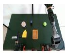

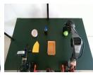

Head  
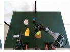  
Active wrist

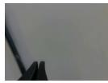

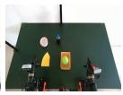  
Head

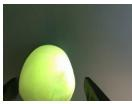  
t=0.0 s  
t=2.6 s

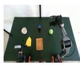

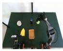

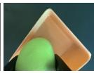

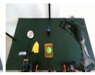

t=5.2 s  
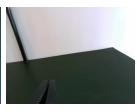

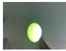  
t=0.0 s

Active wrist  
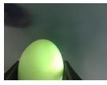  
t=2.6 s

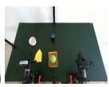

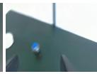  
t=5.2 s

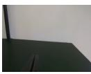  
t=7.8 s

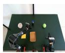

(a)  
Head  
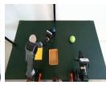

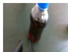  
t=0.0 s

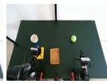  
(b)  
Active wrist

  
t=3.2 s

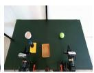

  
t=6.2 s

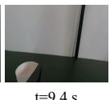  
(c)

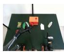

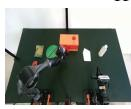  
Head

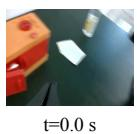

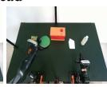  
Active wrist

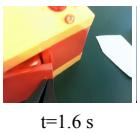

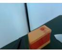  
(d)  
t=3.4 s

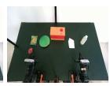

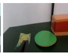  
t=5.0 s

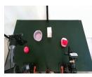

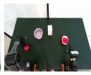  
Head

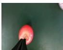

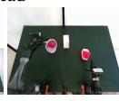  
Active wrist

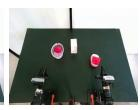  
Head

  
t=0.0 s

  
(e)

  
t=4.2 s  
t=6.2 s

Active wrist  

  
(f)

  
t=7.8 s

Figure 11: Self-collected Piper recordings. Six predicted rollouts, tagged (a)–(f), with synchronized head (top) and active-wrist (bottom) views for each example. Columns progress forward in time, with elapsed video time in seconds below.

t=1.2 s  

Head  

Active wrist  

t=0.0 s  

Head  

  
Active wrist

(a)  

  
(b)

  
Head

Active wrist  
  
t=0.0 s

  
(c)

  
Head

  
Active wrist

  
(d)

  
t=5.2 s

Head  

Active wrist  

  
(e)

Head  

Active wrist  

  
(f)

  
Figure 12: Unseen-Robot OOD: WidowX250. Six predicted rollouts, tagged (a)–(f), covering hammering (a), stapler transport (b, c), and container placement in clean (d) and randomized (e, f) scenes. Each example pairs synchronized head (top) and active-wrist (bottom) frames, with columns progressing forward in time.

## E Additional Cross-Embodiment Rollouts

Figures 13 to 16 present all twenty-four qualitative clips for the four training benchmarks: six AgiBotWorld-Beta sequences, six DROID sequences, six RoboMIND 2.0 sequences, and six RoboTwin 2.0 sequences. Each example shows four sampled time points, including the first and last video frames. The dataset’s camera views are synchronized within each column; t denotes elapsed time in seconds from the start of each prediction video, computed using its frame rate. These clips supplement the representative cross-embodiment qualitative results in the main evaluation.

  
(e)  
(f)  
Figure 13: Cross-embodiment rollouts: AgiBotWorld-Beta. Six predicted rollouts, tagged (a)– (f), each pairing synchronized head (top), left-gripper (middle), and right-gripper (bottom) views, covering beverage pouring (a, b), object carrying (c), and checkout scenes (d)–(f). Columns progress forward in time, with elapsed video time in seconds below.

Left exterior  
Left exterior  
Left exterior  
Left exterior  
  
(a)

Left exterior  
  
(b)

  
(c)

  
(d)

  
(e)

  
(f)  
Figure 14: Cross-embodiment rollouts: DROID. Six real-world Franka rollouts, tagged (a)–(f), with synchronized left-exterior (top), right-exterior (middle), and gripper (bottom) views, spanning diverse scenes and collection sites. Columns progress forward in time, with elapsed video time in seconds below.

Head  

Left gripper  
  
Right gripper

  
(a)

Head  
  
(c)

Head  
  
(e)

Head  

Left gripper  
  
Right gripper

  
(b)

Head  
  
(d)

Head  
  
(f)  
Figure 15: Cross-embodiment rollouts: RoboMIND 2.0. Six predicted rollouts, tagged (a)–(f), each pairing synchronized head (top), left-gripper (middle), and right-gripper (bottom) views, covering dual-arm toy handover (a), inter-arm tape passing into a tray (b), open-box toy placement (c), drawer manipulation (d), color-constrained block placement (e), and dual-arm capacitor assembly (f). Columns progress forward in time, with elapsed video time in seconds below.

Right gripper  

  
Head

Left gripper  
  
Right gripper

(a)  
Head  
  
(c)

Head  
  
(e)

Head  

Left gripper  

(b)  
Head  
  
(d)

  
(f)  
Figure 16: Cross-embodiment rollouts: RoboTwin 2.0. Six simulated rollouts, tagged (a)–(f), each pairing synchronized head (top), left-gripper (middle), and right-gripper (bottom) views, covering hammering (a), color ranking (b), roller grasping (c), block handover (d), can-and-pot transport (e), and A-to-B placement (f). Columns progress forward in time, with elapsed video time in seconds below.