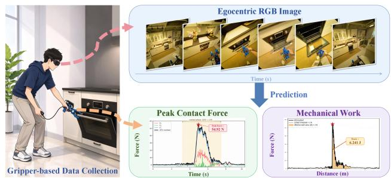
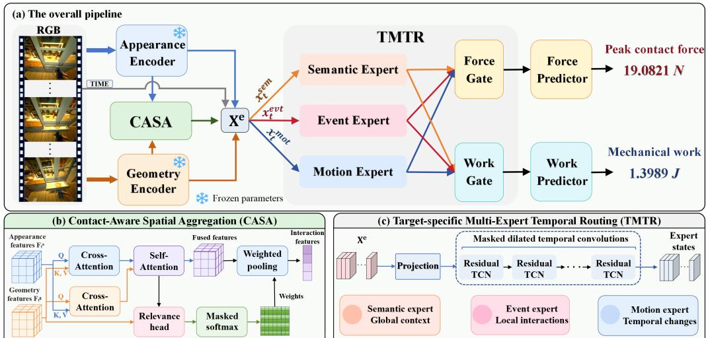
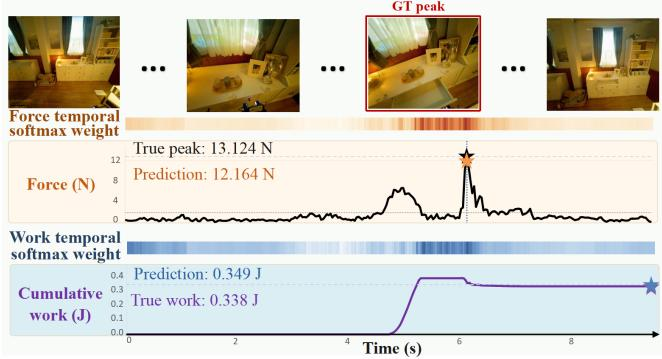

# EGOPHYS: ESTIMATING PEAK CONTACT FORCE AND MECHANICAL WORK FROM EGOCENTRIC MANIPULATION VIDEO

Zhuo Dong1, Jianhua Yang2, Haohao Li3, Yumeng Zhao1, Keji He1, Yan Huang2, Liang Wang2

1 School of Artificial Intelligence, Shandong University, Jinan, China 2 Institute of Automation, Chinese Academy of Sciences, Beijing, China 3 School of Mechanical Engineering, Tianjin University, Tianjin, China

## ABSTRACT

Physically grounded manipulation of articulated objects requires understanding both the maximum forces encountered during contact and the work performed as their parts move. Peak contact force and mechanical work quantify these complementary aspects, but estimating them from egocentric video is challenging because physical interaction cues are local and indirect. Moreover, peak force is associated with brief contact events, whereas mechanical work depends on forcemotion coupling throughout the contact duration. To address these challenges, we propose EgoPhys, an RGB-only framework comprising Contact-Aware Spatial Aggregation (CASA) and Target-Specific Multi-Expert Temporal Routing (TMTR). CASA integrates appearance and geometry features to emphasize interaction-relevant cues, while TMTR models semantic, event, and motion cues with specialized temporal experts and routes them separately for force and work prediction. On the test split from Hoi! dataset, EgoPhys substantially improves predictions of peak force and mechanical work, achieving MAEs of 5.205 \pm 0.584 N and 0.894 ± 0.081 J, respectively.

Index Terms— Egocentric Video Understanding, Contact Force Prediction, Video Temporal Modeling

## 1. INTRODUCTION

Understanding and manipulating articulated objects, such as drawers and doors, requires reasoning about how their parts can move and the forces needed to move them. Existing visionbased methods localize actionable regions [1], infer articulation geometry and motion [2, 3], or learn manipulation policies [4]. These methods characterize articulated part motion, but provide limited information about the physical quantities involved in interactions.

Previous studies have explored different force estimation tasks. Pham et al. [5] and Li et al. [6] recover interaction forces from observed hand-object motion under contact and dynamics constraints. PressureVision++ [7] and EgoPressure [8] estimate pressure at hand-object contacts from RGB ob servations, while ForceSight [9] predicts a three-dimensional force goal from an RGB-D observation and a language instruction. Vision-based tactile methods such as Sparsh [10] and FeelAnyForce [11] infer contact forces from local sensor deformation, where contact is directly observed. However, these formulations rely on explicit dynamics, measured depth, task instructions, or tactile observations. Estimating interaction force and work directly from egocentric RGB video remains comparatively underexplored.

  
Fig. 1. Task overview. Egocentric RGB video is captured by a head-mounted camera, while force/torque and tool-motion signals are recorded by the Hoi! custom gripper. The task is to predict peak contact force and contact-phase mechanical work from the egocentric RGB video alone.

Egocentric video with synchronized force measurements remains scarce. HOI4D [12] and Ego4D [13] capture rich ego centric interactions but lack force sensing, while RH20T [14] and ForceMimic [15] record force or wrench signals mainly for robot learning. The custom-gripper recordings in Hoi! [16] bridge this gap by providing head-mounted egocentric video synchronized with force/torque and tool-motion measurements during articulated manipulation. Building on these synchronized signals, we study sequence-level prediction of peak contact force and contact-phase mechanical work from egocentric RGB video.

As illustrated in Fig. 1, we predict peak resultant contact force and mechanical work over the contact phase from a short head-mounted RGB clip. The task has two key challenges. First, the visual consequences of physical interaction are often subtle and spatially localized around the gripper–object contact region, and can therefore be overwhelmed by background content and egocentric camera motion. Second, the two targets exhibit different temporal dependencies: peak force is governed by brief high-load events, whereas mechanical work depends on force–motion coupling throughout the contact phase. These characteristics call for interaction-centered spatial aggregation and target-specific temporal modeling.

To address these challenges, we propose EgoPhys with two main components. Contact-Aware Spatial Aggregation (CASA) integrates dense appearance and geometry features and selectively aggregates interaction-relevant spatial evidence. TMTR models semantic context, transient interaction events, and multi-scale motion changes with specialized temporal experts, and learns target-specific mixtures of their representations for force and work prediction. Based on the algorithm described above, we won the ECCV 2026 Hoi! Force Prediction Challenge [17].

Our contributions are threefold: (i) We investigate joint estimation of peak contact force and contact-phase mechanical work from egocentric RGB video and propose EgoPhys, an RGB-only framework. (ii) We introduce CASA and TMTR to aggregate interaction-relevant evidence and learn targetspecific mixtures of semantic, event, and motion representations. (iii) Experiments on a fixed Hoi! test split demonstrate the effectiveness of EgoPhys for both targets.

## 2. METHOD

## 2.1. Problem Formulation

Given a short head-mounted RGB clip $\chi ~ = ~ \{ I _ { t } \} _ { t = 1 } ^ { T }$ , our goal is to predict peak contact force and mechanical work for the gripper-object interaction. Following the force estimation setting in the challenge of the Force-Grounded, Cross-View Articulated Manipulation [17], the targets are derived from synchronized gripper force/torque measurements and end-effector velocity. Let ∆ denote the interaction interval and $\mathcal { C } = \{ t \in \Delta : \| \mathbb { F } ( t ) \| _ { 2 } > 2 \mathrm { N } \}$ denote the contact set. The two targets are defined as

$$
P _ { f } = \operatorname* { m a x } _ { t \in \Delta } \| \mathbb { F } ( t ) \| _ { 2 } ; \qquad P _ { w } = \left| \int _ { \mathcal { C } } \mathbb { F } ( t ) ^ { \top } \mathbf { v } ( t ) \mathrm { d } t \right| ,\tag{1}
$$

where $\mathbb { F } ( t )$ and $\mathbf { v } ( t )$ denote the contact-force vector and the velocity of the end-effector at time t, respectively. $P _ { f }$ measures peak resultant contact force (Newtons), while $P _ { w }$ measures the magnitude of work during contact (Joules).

## 2.2. Framework Overview

As illustrated in Fig. 2, EgoPhys consists of Contact-Aware Spatial Aggregation (CASA) and Target-Specific Multi-Expert Temporal Routing (TMTR). CASA fuses appearance and geometry features and selectively aggregates interaction-relevant spatial evidence. TMTR models semantic, event, and motion streams with separate temporal experts and routes them independently for force and work prediction.

## 2.3. Contact-Aware Spatial Aggregation

CASA integrates complementary appearance and geometry cues while emphasizing spatial regions relevant to physical interaction. For frame t, the dense features extracted by DI-NOv3 [18] and Depth Anything 3 (DA3) [19] are projected into a common space and denoted as $\mathbf { F } _ { t } ^ { \mathrm { a } } , \mathbf { F } _ { t } ^ { \mathrm { g } } \in \dot { \mathbb { R } } ^ { B \times P \times D }$ where $P = h w$ is the number of spatial locations and D is the embedding dimension. Then, we utilize bidirectional crossattention to exchange information between them:

$$
\begin{array} { r l } & { \widetilde { \mathbf { F } } _ { t } ^ { \mathrm { a } } = \mathrm { C A } \left( \mathbf { F } _ { t } ^ { \mathrm { a } } , \mathbf { F } _ { t } ^ { \mathrm { g } } , \mathbf { F } _ { t } ^ { \mathrm { g } } \right) , } \\ & { \widetilde { \mathbf { F } } _ { t } ^ { \mathrm { g } } = \mathrm { C A } \left( \mathbf { F } _ { t } ^ { \mathrm { g } } , \mathbf { F } _ { t } ^ { \mathrm { a } } , \mathbf { F } _ { t } ^ { \mathrm { a } } \right) , } \end{array}\tag{2}
$$

where $\mathrm { C A } ( Q , K , V )$ denotes cross-attention. The updated features are concatenated and refined through one layer spatial self-attention:

$$
\mathbf { F } _ { t } = \mathrm { S A } \big ( \big [ \widetilde { \mathbf { F } } _ { t } ^ { \mathrm { a } } ; \widetilde { \mathbf { F } } _ { t } ^ { \mathrm { g } } \big ] \big ) .\tag{3}
$$

To emphasize interaction-relevant regions, a single-layer MLP is used to predict spatial scores, $i . e . , s _ { t } = M L P ( \mathbf { F } _ { t } )$ where $s _ { t } \in \mathbb { R } ^ { B \times \mathbf { \bar { P } } }$ . The scores are normalized across spatial locations and used to compute a weighted frame-level representation:

$$
\mathbf { z } _ { t } = \sum _ { p = 1 } ^ { P } \alpha _ { t , p } \mathbf { F } _ { t , p } ; \qquad \alpha _ { t , p } = \frac { \exp ( s _ { t , p } ) } { \sum _ { q = 1 } ^ { P } \exp ( s _ { t , q } ) } .\tag{4}
$$

The resulting feature ${ \bf Z } = \{ { \bf z } _ { t } \} _ { t = 1 } ^ { T } \in \mathbb { R } ^ { B \times T \times D }$ is then passed to the subsequent temporal modeling.

## 2.4. Target-Specific Multi-Expert Temporal Routing

TMTR uses three independently parameterized experts with a shared architecture: the semantic expert provides interaction context for both targets, the event expert captures brief changes indicative of peak force, and the motion expert models sustained changes associated with mechanical work. Targetspecific gates then combine these complementary cues separately for the prediction of force and work.

Expert input construction. The semantic expert uses the projected DINOv3 class token $\mathbf { c } _ { t } ^ { c l s }$ and the average-pooled patch feature $\mathbf { g } _ { t }$ to encode scene and object context. The event expert uses the output feature $\mathbf { z } _ { t }$ of CASA, which preserves interaction-relevant evidence. The motion expert captures changes in both interaction-centered and global cues through multi-scale temporal differences:

$$
\delta _ { t } ^ { ( \ell ) } = [ \mathbf { z } _ { t } - \mathbf { z } _ { t - \ell } ; \mathbf { g } _ { t } - \mathbf { g } _ { t - \ell } ] , \quad \ell \in \{ 1 , 4 , 8 \} .\tag{5}
$$

Each difference compares the current frame with the frame ℓ steps earlier, with the unavailable differences set to zero. A temporal embedding $\mathbf { r } _ { t }$ is appended to each input stream:

$$
\begin{array} { r l r } & { \mathbf { x } _ { t } ^ { \mathrm { s e m } } = [ \mathbf { c } _ { t } ^ { \mathrm { c l s } } ; \mathbf { g } _ { t } ; \mathbf { r } _ { t } ] ; } & { \mathbf { x } _ { t } ^ { \mathrm { e v t } } = [ \mathbf { z } _ { t } ; \mathbf { r } _ { t } ] ; } \\ & { \mathbf { x } _ { t } ^ { \mathrm { m o t } } = [ \delta _ { t } ^ { ( 1 ) } ; \delta _ { t } ^ { ( 4 ) } ; \delta _ { t } ^ { ( 8 ) } ; \mathbf { r } _ { t } ] . } \end{array}\tag{6}
$$

  
Fig. 2. Overview of our proposed EgoPhys framework. Given an egocentric RGB clip, frozen appearance and geometry encoders extract complementary visual features. CASA aggregates interaction-relevant spatial evidence, while TMTR models complementary temporal cues to predict peak contact force and contact-phase mechanical work

Modeling of temporal experts. Each expert projects its input to the same dimension $D ,$ followed by six residual temporal convolution blocks:

$$
\mathbf { H } ^ { e } = { \mathcal { E } } _ { e } ( \mathbf { X } ^ { e } ) \in \mathbb { R } ^ { B \times T \times D } , \quad e \in \{ \mathrm { s e m } , \mathrm { e v t } , \mathrm { m o t } \} .\tag{7}
$$

Here, ${ \bf X } ^ { e } = \{ { \bf x } _ { t } ^ { e } \} _ { t = 1 } ^ { T } ,$ , sem, evt, and mot denote semantic expert, event expert, and motion expert, respectively. Each block uses a depthwise temporal convolution of kernel size 3, followed by pointwise channel expansion and projection, with layer normalization, GELU, dropout, and a residual connection. Dilation rates 1, 2, 4, 8, 16, 32 capture the temporal context on multiple scales.

Then, two independent gates combine outputs of three experts $\{ \mathbf { h } _ { t } ^ { s e m } , \mathbf { h } _ { t } ^ { e v t } , \mathbf { h } _ { t } ^ { m o t } \}$ for force (f) and work (w). Given the concatenated feature $\mathbf { q } _ { t } = [ \mathbf { h } _ { t } ^ { s e m } , \mathbf { h } _ { t } ^ { e v t } , \mathbf { h } _ { t } ^ { m o t } ]$ , the taskspecific representations are

$$
\begin{array} { r l } & { \boldsymbol { \pi } _ { t } ^ { k } = s o f t m a x ( \mathbf { W } _ { k } L N ( \mathbf { q } _ { t } ) + \mathbf { b } _ { k } ) ; } \\ & { \mathbf { h } _ { t } ^ { k } = L N ( \displaystyle \sum _ { e } \pi _ { t , e } ^ { k } \mathbf { h } _ { t } ^ { e } ) , \qquad k \in \{ f , w \} , } \end{array}\tag{8}
$$

where softmax normalizes weights over experts and $L N ( \cdot )$ denotes the layer normalization.

For each target $k \in \{ f , w \}$ , we compute attention weights over the valid frames $\nu$ and aggregate each routed sequence into clip-level representations:

$$
\mathbf { v } ^ { k } = \sum _ { t \in \mathcal { V } } \beta _ { t } ^ { k } \mathbf { h } _ { t } ^ { k } ; \qquad \beta _ { t } ^ { k } = \frac { \exp \left( \psi _ { k } ( \mathbf { h } _ { t } ^ { k } ) \right) } { \sum _ { s \in \mathcal { V } } \exp ( \psi _ { k } ( \mathbf { h } _ { s } ^ { k } ) ) } ,\tag{9}
$$

where $\psi _ { k }$ predicts a scalar attention score. The representations $\mathbf { v } ^ { f }$ and $\mathbf { v } ^ { w }$ are passed to separate prediction heads.

## 2.5. Prediction and Learning Objectives

Two independent regression heads map the target-specific representations ${ \bf v } ^ { f }$ and $\mathbf { v } ^ { w }$ to non-negative estimates of peak contact force $\hat { P } _ { f }$ and mechanical work $\hat { P } _ { w } ,$ respectively. During training, the primary loss is defined as $\begin{array} { r l r } { \hat { \mathcal L } _ { \mathrm { r e g } } } & { = } & { { \frac { 1 } { B } } \sum _ { i = 1 } ^ { \bar { B } } \left( { \frac { | \hat { P } _ { f , i } - P _ { f , i } | } { s _ { f } } } + { \frac { | \hat { P } _ { w , i } - P _ { w , i } | } { s _ { w } } } \right) } \end{array}$ The scales $s _ { f }$ and $s _ { w }$ are the 75th percentiles of positive training targets, with lower bounds of 1 N and 0.05 J, respectively. We also in troduce two frame-level auxiliary losses. The masked Smooth L1 loss $\mathcal { L } _ { \mathrm { m e a n } }$ supervises the frame-level mean force, while a masked binary cross-entropy loss ${ \mathcal { L } } _ { \mathrm { e n v } }$ supervises the loaded interval from the first to the last contact. The overall objective is

$$
\begin{array} { r } { \mathcal { L } = \mathcal { L } _ { \mathrm { r e g } } + \lambda _ { 1 } \mathcal { L } _ { \mathrm { m e a n } } + \lambda _ { 2 } \mathcal { L } _ { \mathrm { e n v } } , } \end{array}\tag{10}
$$

where both $\lambda _ { 1 }$ and $\lambda _ { 2 }$ are set to 0.06.

## 3. EXPERIMENTS

## 3.1. Experimental Setup

Dataset. Following the Hoi! processing pipeline [16] and manual verification of interaction boundaries, we obtain 336 clips from 22 gripper recordings across 18 scenes. We randomly split the 336 clips into 264 training, 36 validation, and 36 test clips for experiments. Each clip pairs head-mounted RGB video with synchronized gripper force/torque and endeffector motion measurements, from which we derive peak contact force and contact-phase mechanical work labels.

Evaluation metrics. We evaluate predictions using mean absolute error (MAE), median absolute error (MedianAE), root mean squared error (RMSE), and mean relative error (MRE). MAE, MedianAE, and RMSE are reported in newtons for force and joules for work. MRE is defined as:

$$
\mathrm { M R E } = \frac { 1 } { M } \sum _ { i = 1 } ^ { M } \frac { | \hat { P _ { i } } - P _ { i } | } { \operatorname* { m a x } ( | P _ { i } | , 1 0 ^ { - 8 } ) } ,\tag{11}
$$

Table 1. Comparison with baseline methods on test split.
<table><tr><td colspan="5">Peak Contact Force</td></tr><tr><td>Methods</td><td> $\mathbf { M A E } \left( N \right) \downarrow$ </td><td> $\mathbf { M e d i a n A E } \left( N \right) \downarrow$ </td><td> $\mathrm { R M S E } \left( N \right) \downarrow$ </td><td>MRE↓</td></tr><tr><td>DINOv3-only</td><td> $9 . 3 2 0 \pm 0 . 1 8 9$ </td><td> $5 . 6 9 6 \pm 0 . 3 3 7$ </td><td> $1 3 . 8 2 7 \pm 0 . 2 9 0$ </td><td> $0 . 5 8 4 \pm 0 . 0 1 5$ </td></tr><tr><td>DA3-only</td><td> $9 . 3 1 8 \pm 0 . 7 7 0$ </td><td> $5 . 7 0 2 \pm 0 . 5 2 3$ </td><td> $1 3 . 6 8 9 \pm 1 . 3 3 4$ </td><td> $0 . 5 9 6 \pm 0 . 0 3 9$ </td></tr><tr><td>DINOv3+DA3</td><td> $8 . 7 9 6 \pm 1 . 2 3 0$ </td><td> $5 . 7 0 2 \pm 0 . 8 0 1$ </td><td> $1 2 . 6 8 9 \pm 1 . 9 4 9$ </td><td> $0 . 6 0 0 \pm 0 . 0 6 8$ </td></tr><tr><td>Full Model</td><td> ${ \bf 5 . 2 0 5 \pm 0 . 5 8 4 }$ </td><td> ${ \bf 3 . 4 9 2 \pm 0 . 5 9 4 }$ </td><td> ${ \bf 7 . 1 3 2 \pm 0 . 7 6 5 }$ </td><td> $\mathbf { 0 . 3 0 1 \pm 0 . 0 3 1 }$ </td></tr></table>

<table><tr><td>Methods</td><td> $\mathbf { M A E } \left( J \right) \downarrow$ </td><td> $\mathbf { M e d i a n A E } \left( J \right) \downarrow$ </td><td> $\operatorname { R M S E } \left( J \right) \downarrow$ </td><td>MRE↓</td></tr><tr><td>DINOv3-only</td><td> $1 . 7 0 0 \pm 0 . 0 3 2$ </td><td> $0 . 6 6 5 \pm 0 . 1 3 9$ </td><td> $3 . 0 8 8 \pm 0 . 0 9 4$ </td><td> $1 . 9 4 8 \pm 0 . 3 4 7$ </td></tr><tr><td>DA3-only</td><td> $1 . 6 5 6 \pm 0 . 1 2 8$ </td><td> $0 . 8 2 3 \pm 0 . 0 3 7$ </td><td> $2 . 7 5 1 \pm 0 . 2 3 4$ </td><td> $2 . 1 4 6 \pm 0 . 2 6 5$ </td></tr><tr><td>DINOv3+DA3</td><td> $1 . 6 2 4 \pm 0 . 1 2 4$ </td><td> $0 . 8 5 2 \pm 0 . 0 5 0$ </td><td> $2 . 6 9 5 \pm 0 . 2 2 6$ </td><td> $2 . 0 3 4 \pm 0 . 3 3 7$ </td></tr><tr><td>Full Model</td><td> $\mathbf { 0 . 8 9 4 \pm 0 . 0 8 1 }$ </td><td> ${ \bf 0 . 4 2 7 \pm 0 . 0 4 5 }$ </td><td> ${ \bf 1 . 5 0 8 \pm 0 . 2 0 3 }$ </td><td> ${ \bf 1 . 2 3 7 \pm 0 . 1 8 9 }$ </td></tr></table>

  
Fig. 3. Qualitative results on the selected test video clip. where M is the number of test clips.

Implementation details. We extract appearance and geometry features offline using frozen DINOv3 and DA3 encoders, respectively, and pool their dense feature maps into $7 \times 7$ grids. The common embedding dimension D and the hidden dimension of each temporal expert are both set to 192. We train EgoPhys for 60 epochs using AdamW with a batch size of 2 and an initial learning rate of $2 \times 1 0 ^ { - 4 }$ . Results are reported as the mean and standard deviation over six random seeds.

## 3.2. Experimental Results

We compare EgoPhys with three baselines: DINOv3-only and DA3-only apply spatial average pooling to the appearance and geometry features from their respective encoders, while DI-NOv3+DA3 concatenates the two pooled representations at each frame. All baselines use temporal attention pooling to obtain clip-level representations, followed by separate prediction heads for the two targets. As shown in Table 1, EgoPhys achieves the lowest errors across all four metrics for both force and work. Compared with DINOv3+DA3, it reduces the force and work MAEs from 8.796 N to 5.205 N and from 1.624 J to 0.894 J, respectively. Fig. 3 presents one test example in which both predictions are close to their ground truth values. The force branch concentrates its temporal weights near the force peak, whereas the work branch distributes them more broadly over the interaction, illustrating their different temporal dependencies.

Table 2. Ablation of the main components.
<table><tr><td rowspan="3">Models</td><td colspan="2">Peak Contact Force</td><td colspan="2">Mechanical Work</td></tr><tr><td> $\mathbf { M A E } \left( N \right) \downarrow$ </td><td>MRE↓</td><td> $\mathbf { M A E } \left( J \right) \downarrow$ </td><td>MRE↓</td></tr><tr><td></td><td></td><td> $1 . 6 2 4 \pm 0 . 1 2 4$ </td><td> $2 . 0 3 4 \pm 0 . 3 3 7$ </td></tr><tr><td>#A #B</td><td> $8 . 7 9 6 \pm 1 . 2 3 0$   $7 . 7 7 6 \pm 0 . 3 0 8$ </td><td> $0 . 6 0 0 \pm 0 . 0 6 8$   $0 . 4 4 7 \pm 0 . 0 2 4$ </td><td> $1 . 4 5 6 \pm 0 . 2 1 0$ </td><td> $2 . 0 6 2 \pm 0 . 4 7 6$ </td></tr><tr><td>#C</td><td> $5 . 9 8 2 \pm 0 . 2 9 9$ </td><td> $0 . 3 3 5 \pm 0 . 0 3 0$ </td><td> $1 . 1 0 3 \pm 0 . 1 6 9$ </td><td> $1 . 4 2 8 \pm 0 . 2 2 2$ </td></tr><tr><td>Full model</td><td> ${ \bf 5 . 2 0 5 \pm 0 . 5 8 4 }$ </td><td> $\mathbf { 0 . 3 0 1 \pm 0 . 0 3 1 }$  </td><td> ${ \bf 0 . 8 9 4 \pm 0 . 0 8 1 }$  </td><td> ${ \bf 1 . 2 3 7 \pm 0 . 1 8 9 }$ </td></tr><tr><td></td><td></td><td></td><td></td><td></td></tr></table>

Table 3. Comparison of temporal expert configurations.
<table><tr><td rowspan="2">Expert</td><td colspan="2">Peak Contact Force</td><td colspan="2">Mechanical Work</td></tr><tr><td> $\mathbf { M A E } \left( N \right) \downarrow$ </td><td>MRE↓</td><td> $\mathbf { M A E } \left( J \right) \downarrow$ </td><td>MRE↓</td></tr><tr><td>Semantic</td><td> $5 . 7 5 3 \pm 0 . 2 6 7$ </td><td> $0 . 3 1 9 \pm 0 . 0 1 8$ </td><td> $1 . 0 9 3 \pm 0 . 0 7 4$ </td><td> $1 . 4 6 7 \pm 0 . 2 1 9$ </td></tr><tr><td>Event</td><td> $6 . 4 0 1 \pm 0 . 3 9 6$ </td><td> $0 . 3 4 6 \pm 0 . 0 3 6$ </td><td> $1 . 3 4 4 \pm 0 . 1 7 2$ </td><td> $1 . 8 0 1 \pm 0 . 2 6 9$ </td></tr><tr><td>Motion</td><td> $7 . 0 3 9 \pm 0 . 5 7 0$ </td><td> $0 . 4 3 2 \pm 0 . 0 4 3$ </td><td> $1 . 5 7 1 \pm 0 . 0 6 7$ </td><td> $1 . 8 8 3 \pm 0 . 3 1 4$ </td></tr><tr><td>All (Concat)</td><td> $6 . 3 0 3 \pm 0 . 2 6 3$ </td><td> $0 . 3 5 9 \pm 0 . 0 2 3$ </td><td> $1 . 1 8 9 \pm 0 . 0 3 7$ </td><td> $1 . 5 7 8 \pm 0 . 2 3 2$ </td></tr><tr><td>All (Gate)</td><td> ${ \bf 5 . 2 0 5 \pm 0 . 5 8 4 }$  </td><td> $\mathbf { 0 . 3 0 1 \pm 0 . 0 3 1 }$  </td><td> ${ \bf 0 . 8 9 4 \pm 0 . 0 8 1 }$  </td><td> ${ \bf 1 . 2 3 7 \pm 0 . 1 8 9 }$ </td></tr></table>

## 3.3. Ablation Study

Table 2 evaluates the main components for peak contact force and mechanical work prediction. Adding CASA (#B) to the DINOv3+DA3 baseline (#A) reduces the respective MAEs from 8.796 N to 7.776 N and from 1.624 J to 1.456 J, suggesting that spatially localized interaction cues benefit both targets. TMTR (#C) further reduces the MAEs to 5.982 N and 1.103 J, indicating the value of modeling temporal evidence beyond frame-level aggregation. The auxiliary mean-force and loaded-envelope losses further reduce the force and work MAEs to 5.205 N and 0.894 J, achieving the lowest errors for peak contact force and mechanical work. As shown in Table 3, the semantic expert is the strongest individual expert, yet direct concatenation of all three experts performs worse. The full gated configuration improves upon concatenation for both force (5.205 N versus 6.303 N) and work (0.894 J versus 1.189 J). These experiments suggest that semantic context is informative on its own, while combining temporal cues selectively is more effective than simply concatenating them.

## 4. CONCLUSION

We presented EgoPhys, a framework for jointly estimating peak contact force and contact-phase mechanical work from egocentric RGB video. EgoPhys combines CASA for aggregating interaction-relevant appearance and geometry evidence with TMTR for modeling semantic, event, and motion cues through target-specific routing. On the fixed test split constructed from the Hoi! dataset, EgoPhys achieves MAEs of $5 . 2 0 5 \pm 0 . 5 8 4 N$ for peak contact force and $0 . 8 9 4 \pm 0 . 0 8 1$ J for mechanical work, representing significant improvements over the DINOv3+DA3 baseline. Ablation studies further demonstrate the effectiveness of CASA and TMTR modules. In future work, we will further investigate the generalization of EgoPhys to unseen scenes and objects in egocentric videos.

## 5. REFERENCES

[1] Kaichun Mo, Leonidas J Guibas, Mustafa Mukadam, Abhinav Gupta, and Shubham Tulsiani, “Where2act: From pixels to actions for articulated 3d objects,” in ICCV, 2021, pp. 6813–6823.

[2] Ben Eisner, Harry Zhang, and David Held, “Flowbot3d: Learning 3d articulation flow to manipulate articulated objects,” Robotics: Science and Systems, 2022.

[3] Harry Zhang, Ben Eisner, and David Held, “Flowbot++: Learning generalized articulated objects manipulation via articulation projection,” arXiv preprint arXiv:2306.12893, 2023.

[4] Yufei Wang, Ziyu Wang, Mino Nakura, Pratik Bhowal, Chia-Liang Kuo, Yi-Ting Chen, Zackory Erickson, and David Held, “Articubot: Learning universal articulated object manipulation policy via large scale simulation,” arXiv preprint arXiv:2503.03045, 2025.

[5] Tu-Hoa Pham, Abderrahmane Kheddar, Ammar Qammaz, and Antonis A Argyros, “Towards force sensing from vision: Observing hand-object interactions to infer manipulation forces,” in CVPR, 2015, pp. 2810–2819.

[6] Zongmian Li, Jiri Sedlar, Justin Carpentier, Ivan Laptev, Nicolas Mansard, and Josef Sivic, “Estimating 3d motion and forces of person-object interactions from monocular video,” in CVPR, 2019, pp. 8632–8641.

[7] Patrick Grady, Jeremy A Collins, Chengcheng Tang, Christopher D Twigg, Kunal Aneja, James Hays, and Charles C Kemp, “Pressurevision++: Estimating fingertip pressure from diverse rgb images,” in WACV, 2024, pp. 8683–8693.

[8] Yiming Zhao, Taein Kwon, Paul Streli, Marc Pollefeys, and Christian Holz, “Egopressure: A dataset for hand pressure and pose estimation in egocentric vision,” in CVPR, 2025, pp. 27727–27738.

[9] Jeremy A. Collins, Cody Houff, You Liang Tan, and Charles C. Kemp, “Forcesight: Text-guided mobile manipulation with visual-force goals,” in ICRA, 2024, pp. 10874–10880.

[10] Carolina Higuera, Akash Sharma, Chaithanya Krishna Bodduluri, Taosha Fan, Patrick Lancaster, Mrinal Kalakrishnan, Michael Kaess, Byron Boots, Mike Lambeta, Tingfan Wu, et al., “Sparsh: Self-supervised touch representations for vision-based tactile sensing,” arXiv preprint arXiv:2410.24090, 2024.

[11] Amir-Hossein Shahidzadeh, Gabriele M Caddeo, Koushik Alapati, Lorenzo Natale, Cornelia Fermuler, and¨ Yiannis Aloimonos, “Feelanyforce: Estimating contact

force feedback from tactile sensation for vision-based tactile sensors,” in ICRA, 2025, pp. 251–257.

[12] Yunze Liu, Yun Liu, Che Jiang, Kangbo Lyu, Weikang Wan, Hao Shen, Boqiang Liang, Zhoujie Fu, He Wang, and Li Yi, “Hoi4d: A 4d egocentric dataset for categorylevel human-object interaction,” in CVPR, 2022, pp. 20981–20990.

[13] Kristen Grauman, Andrew Westbury, Eugene Byrne, Zachary Chavis, Antonino Furnari, Rohit Girdhar, Jackson Hamburger, Hao Jiang, Miao Liu, Xingyu Liu, et al., “Ego4d: Around the world in 3,000 hours of egocentric video,” in CVPR, 2022, pp. 18995–19012.

[14] Hao-Shu Fang, Hongjie Fang, Zhenyu Tang, Jirong Liu, Chenxi Wang, Junbo Wang, Haoyi Zhu, and Cewu Lu, “Rh20t: A comprehensive robotic dataset for learning diverse skills in one-shot,” in ICRA, 2024, pp. 653–660.

[15] Wenhai Liu, Junbo Wang, Yiming Wang, Weiming Wang, and Cewu Lu, “Forcemimic: Force-centric imitation learning with force-motion capture system for contactrich manipulation,” in ICRA, 2025, pp. 1105–1112.

[16] Tim Engelbracht, Rene Zurbr ´ ugg, Matteo Wohlrapp,¨ Martin Buchner, Abhinav Valada, Marc Pollefeys, Her-¨ mann Blum, and Zuria Bauer, “Hoi!-a multimodal dataset for force-grounded, cross-view articulated manipulation,” in CVPR, 2026, pp. 8880–8890.

[17] Zuria Bauer, Tim Engelbracht, Rene Zurbr´ ugg, et al.,¨ “ECCV 2026 Workshop: Force-grounded, cross-view articulated manipulation,” https://hoi-dataset .ethz.ch/workshop.html#ws-challenge, 2026.

[18] Oriane Simeoni, Huy V Vo, Maximilian Seitzer, Federico´ Baldassarre, Maxime Oquab, Cijo Jose, Vasil Khalidov, Marc Szafraniec, Seungeun Yi, Michael Ramamonjisoa,¨ et al., “Dinov3,” arXiv preprint arXiv:2508.10104, 2025.

[19] Haotong Lin, Sili Chen, Junhao Liew, Donny Y Chen, Zhenyu Li, Guang Shi, Jiashi Feng, and Bingyi Kang, “Depth anything 3: Recovering the visual space from any views,” arXiv preprint arXiv:2511.10647, 2025.