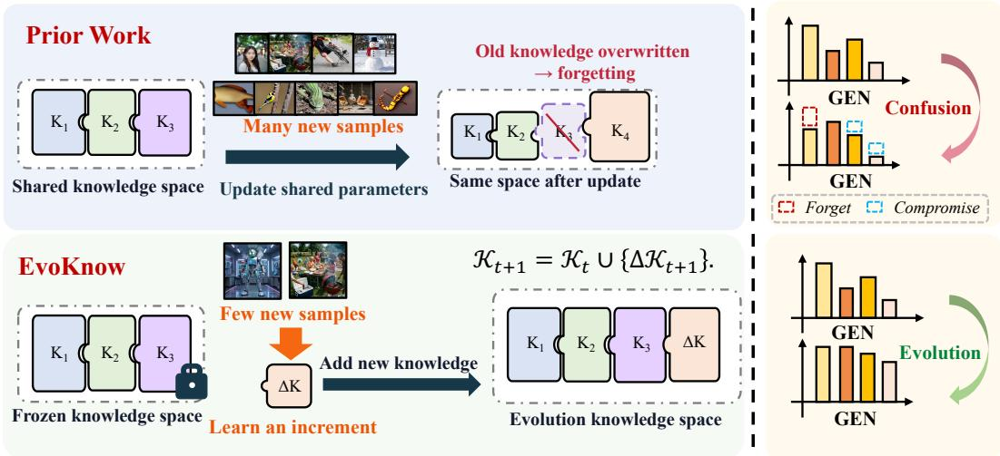
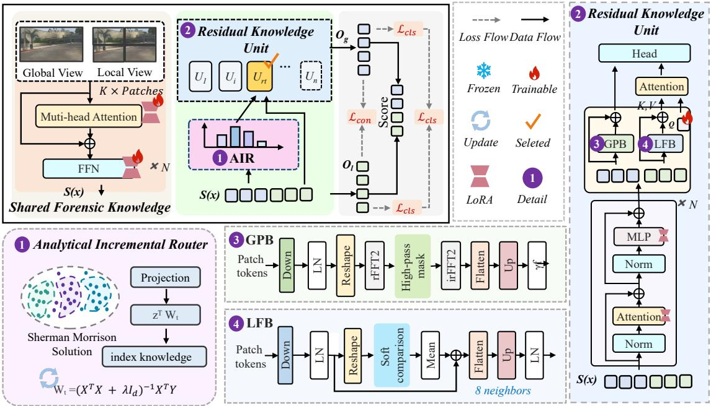
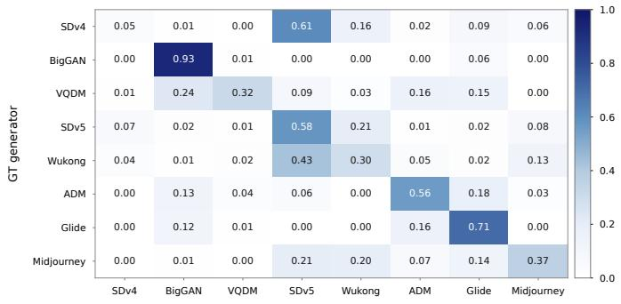
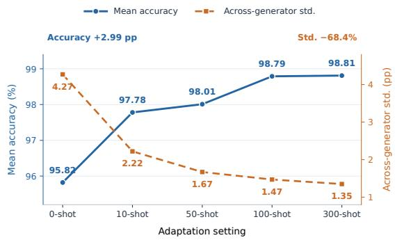
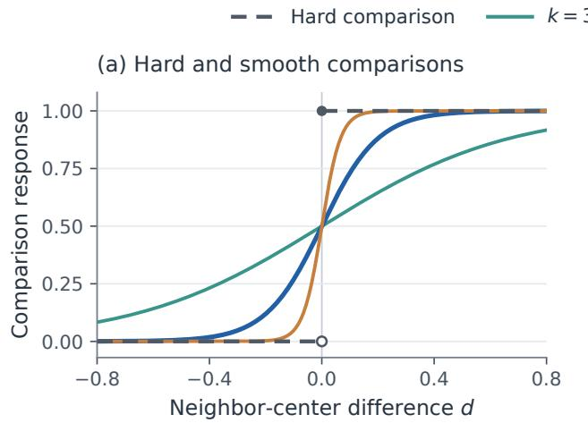
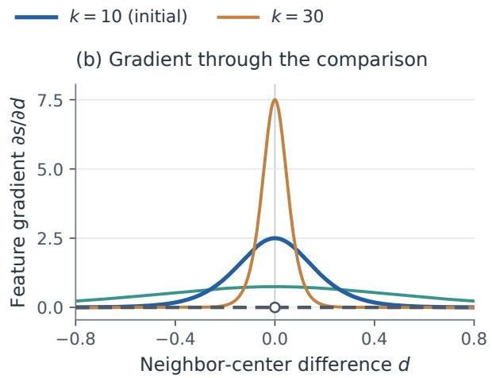
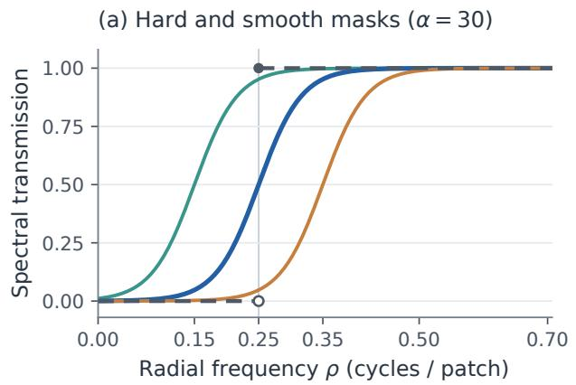
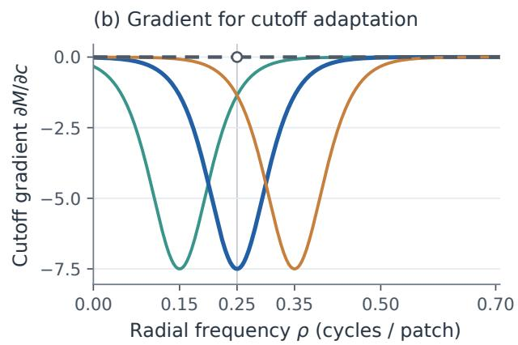

# EVOKNOW: CONTINUAL KNOWLEDGE EVOLUTION FOR AI-GENERATED IMAGE DETECTION

## A PREPRINT

Zhiheng Peng1, Wenwei Jin1∗†, Yangshi Ge1, Siyu Xia2, Jiawei Li1 & Xu Tang1

1Xiaohongshu Inc.

2Southeast University

{pengzhiheng,geyangshi,wangdesheng,tangshen}@xiaohongshu.com {wenwei1217.jin,siyuxia}@gmail.com

October 9, 2026

## ABSTRACT

AI-generated image detectors are commonly trained on fixed generator domains and become difficult to maintain as new generative models emerge. Continual adaptation is challenging because replaying historical generated images is costly, whereas updating shared parameters with limited current-domain data can overwrite prior forensic knowledge. We propose EvoKnow, a replay-free framework that formulates continual AI-generated image detection as forensic knowledge evolution. EvoKnow preserves a shared forensic basis learned from base domains, incrementally adds isolated residual experts for complementary generator-relevant evidence, and retrieves expertise through an Analytical Incremental Router (AIR) updated in closed form from current-stage generated images and accumulated sufficient statistics. Experiments demonstrate effective cross-generator generalization, few-shot expansion, and long-horizon continual adaptation. With ten generated images per arriving generator, EvoKnow achieves 96.70% average accuracy on non-base GenImage generators and 94.48% accuracy on Chameleon without target-benchmark adaptation. Under a strict replay-free continual learning protocol, EvoKnow achieves state-of-the-art continual learning performance, attaining 96.32% mean stage-wise accuracy and 4.32% average forgetting.

Keywords AI-Generated Image Detection · Continual learning

## 1 Introduction

Recent advances in AI image generation have substantially improved the realism and semantic coherence of generated images. While these models enable a wide range of creative applications, their misuse also facilitates misinformation, identity impersonation, and forged visual evidence. Reliable AI-generated image detection has therefore become a fundamental problem in digital media forensics Wang et al. [2024], Zhang et al. [2025a], Guo et al. [2023].

Existing detectors are typically trained on data from a fixed set of generative models and aim to generalize beyond the observed training domains Zhu et al. [2023], Wang et al. [2026a], Xu et al. [2025]. However, new generative models continuously emerge and may exhibit forensic traces absent from the original training data. When a detector fails on an emerging generator, retraining with historical and new generated images is costly and requires retaining an ever-growing image collection. Alternatively, adapting a shared detector using limited new-domain data can overwrite previously acquired forensic knowledge and cause catastrophic forgetting.

We therefore consider generator-incremental AI-generated image detection, where generators arrive sequentially, only a few images are available from each newly observed generator, and historical generated images cannot be replayed. The objective is to expand detection coverage to emerging generators while preserving performance on previously observed domains. The central challenge is to adapt from limited current-domain evidence without either overwriting prior forensic knowledge or retaining historical generated images.

  
Figure 1: Continual AIGC detection with EvoKnow. Instead of repeatedly reshaping a unified forensic space, EvoKnow freezes transferable shared evidence and incrementally adds isolated residual expertise for newly arriving generators. Historical synthetic images are not replayed.

Our key observation is that forensic evidence is neither entirely shared nor entirely domain-specific. Different generators exhibit transferable synthetic characteristics, whereas an emerging generator may require complementary evidence that is insufficiently captured by the existing representation. Continually updating a single shared model promotes transfer but is prone to forgetting, whereas learning an independent model for every generator avoids interference but redundantly models common evidence. As illustrated in Figure 1, a practical detector should instead preserve transferable forensic knowledge and incrementally acquire complementary evidence for emerging generators.

Based on this principle, we propose EvoKnow (Evolution of Forensic Knowledge), a replay-free knowledge-allocation framework for continual AI-generated image detection. EvoKnow preserves a shared forensic basis learned from base domains and frozen during incremental adaptation, while operationalizing incremental residual knowledge through isolated, unit-specific residual experts for arriving generator domains. By freezing the shared forensic learner and previously learned experts, EvoKnow avoids parameter interference during new-domain adaptation. An Analytical Incremental Router (AIR) performs expert retrieval through recursive closed-form updates using current-stage generated images and accumulated sufficient statistics. Our replay-free protocol excludes retaining or replaying historical AIgenerated images and their instance-level features. Task-agnostic real images are sampled from a predefined shared training pool only as negative-class supervision for binary real/fake detection.

Our contributions are summarized as follows:

• A novel perspective. We formulate continual AI-generated image detection as replay-free forensic knowledge evolution. Rather than repeatedly updating a shared detector, this perspective preserves transferable basedomain evidence and incrementally acquires complementary forensic evidence from limited observations of emerging generators.

• A new method. We propose EvoKnow, which combines a frozen shared forensic basis, isolated incremental residual experts, and AIR for analytical expert retrieval. EvoKnow expands detection coverage from currentstage generated images and accumulated router statistics without retaining historical generated images.

• Strong performance. With ten generated images per arriving generator, EvoKnow achieves 96.70% average accuracy on non-base GenImage generators and 94.48% accuracy on Chameleon without target-benchmark adaptation. Under a strict replay-free continual protocol, it attains 96.32% mean stage-wise accuracy with 4.32% average forgetting, demonstrating leading continual learning performance without historical generatedimage replay.

## 2 Related Work

## 2.1 Cross-Generator AI-Generated Image Detection

Early AI-generated image detectors were often designed for specific generative architectures or artifact patterns. More recent work instead learns transferable forensic representations that generalize across generators through frequency artifacts, reconstruction discrepancies, local textures, foundation-model features, or distribution alignment Yu et al. [2025], Chen et al. [2024a], Yan et al. [2024], Tan et al. [2025], Yao et al. [2026], Liu et al. [2024a], Yang et al. [2025]. These methods improve detection on unseen generators by exploiting evidence shared across generative models.

However, cross-generator detection is typically studied in a static setting, where a detector trained on fixed source domains is expected to generalize without further adaptation. In deployment, newly emerging generators may exhibit forensic characteristics insufficiently covered by the source-domain representation. Retraining on accumulated data requires repeated optimization and storage of an ever-growing collection of historical generated images. EvoKnow complements static cross-generator detection by preserving a transferable shared forensic basis and incrementally expanding detection coverage with complementary generator-relevant evidence from newly arriving domains.

## 2.2 Continual AI-Generated Image Detection

Continual AI-generated image detection adapts a detector to sequentially arriving generators while retaining performance on previously observed domains. Recent studies have explored continual or parameter-efficient formulations, including Wang et al. Wang et al. [2026a], Zhang et al. Zhang et al. [2025b], and OmniDFA Wu et al. [2026]. More generally, continual learning mitigates forgetting through replay, regularization, constrained optimization, or parameter-efficient adaptation. Replay requires retaining historical samples, whereas repeatedly updating shared parameters can still interfere with prior knowledge.

Analytical continual learning updates regularized least-squares solutions from accumulated sufficient statistics Zhuang et al. [2022, 2024]. Analytic subspace routing further combines isolated low-rank experts with recursive least-squares routing Tong et al. [2025]. EvoKnow adopts this analytical update principle for AI-generated image detection, but organizes knowledge differently: it freezes a shared forensic basis and incrementally adds isolated experts for complementary generator-relevant forensic evidence. Its Analytical Incremental Router performs expert retrieval from current-stage generated images and accumulated sufficient statistics, without retaining historical generated images.

## 3 Method

As illustrated in Figure 2, EvoKnow instantiates continual forensic knowledge evolution through three components: a frozen shared forensic basis that preserves transferable evidence, isolated incremental residual experts that emphasize complementary generator-relevant evidence from limited current-stage generated images, and AIR for analytical expert retrieval without retaining historical generated images. The following sections formalize the replay-free setting and describe these components.

## 3.1 Problem Setting

We study replay-free continual AI-generated image detection over a sequence of emerging generator domains $\{ \mathcal { D } _ { t } \} _ { t = 1 } ^ { T }$ where each domain corresponds to a specific generative model. At stage t, only a few AI-generated images $\mathcal { D } _ { t } ^ { + }$ are available. For binary real/fake training, we randomly sample a task-agnostic real-image reference set $\mathcal { D } _ { t } ^ { - } \subset \mathcal { D }$ real from a predefined shared real-image training pool. This pool is independent of generator domains and is used only as negative-class supervision; real images are excluded from AIR fitting. Historical generated images and their instance-level features are unavailable and cannot be retained or replayed.

We formulate continual adaptation as forensic knowledge evolution: transferable evidence learned from base domains is preserved, while complementary generator-relevant evidence is incrementally acquired. At stage t, the knowledge base is

$$
\begin{array} { r } { \mathcal { K } _ { t } = \underbrace { \left\{ \mathcal { K } ^ { \mathrm { s h } } , U _ { 0 } \right\} } _ { \mathrm { f r o z e n b a s e k n o w l e d g e } } \cup \underbrace { \left\{ \Delta \mathcal { K } _ { i } \right\} _ { i = 1 } ^ { t } } _ { \mathrm { i n c r e m e n t a l r e s i d u a l k n o w l e d g e } } , } \end{array}\tag{1}
$$

where $\mathcal { K } ^ { \mathrm { s h } }$ denotes the shared forensic basis learned by the frozen shared forensic learner, and $U _ { 0 }$ denotes the base expert trained on top of this basis using offline base-domain data. Each $\Delta { \cal K } _ { i }$ denotes generator-relevant residual knowledge acquired for the i-th arriving domain and is operationalized through an incremental residual expert $U _ { i }$

  
Figure 2: Overview of EvoKnow. A global view and K local views first pass through a frozen shared forensic learner. AIR performs expert retrieval over the base expert and isolated incremental residual experts. Within each expert, LoRA adapts semantic evidence shared by both branches, GPB emphasizes structural evidence in the global branch, and LFB emphasizes frequency evidence in the local branch. Cross-attention aggregates local evidence, which is fused with the global score for real-versus-synthetic prediction. When a new generator arrives, only its new incremental residual expert is trained and AIR is updated in closed form; the shared forensic learner and previously learned experts remain frozen, and historical synthetic images are not replayed.

AIR is not itself a forensic knowledge unit; rather, it performs expert retrieval among the base expert and incremental residual experts.

Given an image x, the frozen shared forensic learner outputs the routing-cut representation $S ( x )$ , from which AIR derives a routing feature $\mathbf { z } ( x ) = g ( S ( x ) )$ . After learning stage t, AIR selects from the base expert and the t incremental residual experts:

$$
r _ { t } ( x ) = \mathcal { R } _ { t } ( \mathbf { z } ( x ) ) \in \{ 0 , \ldots , t \} , \qquad p _ { t } ( y = 1 \mid x ) = U _ { r _ { t } ( x ) } ( S ( x ) ) .\tag{2}
$$

At stage t, EvoKnow learns $\Delta K _ { t }$ from $\mathcal { D } _ { t } ^ { + }$ and $\mathcal { D } _ { t } ^ { - }$ while freezing the shared forensic learner, the base expert $U _ { 0 }$ , and all previously learned incremental residual experts. Starting from $\mathcal { K } _ { 0 } = \{ \mathcal { K } ^ { \mathrm { s h } } , U _ { 0 } \}$ , the knowledge base is updated as

$$
{ \cal K } _ { t } = { \cal K } _ { t - 1 } \cup \{ \Delta { \cal K } _ { t } \} , \qquad t \geq 1 .\tag{3}
$$

AIR is then updated to $\mathcal { R } _ { t }$ using current-stage generated images and accumulated sufficient statistics. Only learned model parameters and aggregated router statistics are preserved across stages.

## 3.2 Shared Forensic Knowledge

The shared forensic learner is built on a pretrained image encoder, $\mathrm { e . g . }$ , DINOv3, with shared LoRA modules adapted in its first ℓ Transformer blocks. Given one global view $x _ { g }$ and K local views $\{ x _ { k } ^ { \mathrm { l o c } } \} _ { k = 1 } ^ { K }$ of image x, the patch-token features at the routing cut form the representation $S ( x )$ . This representation provides the shared forensic basis $\mathcal { K } ^ { \mathrm { s h } }$ serves as the input to the base or incremental residual experts, and is used by AIR to derive routing features.

The base expert $U _ { 0 }$ is trained on top of $\mathcal { K } ^ { \mathrm { s h } }$ using offline base-domain data. Together, $\{ \mathcal { K } ^ { \mathrm { s h } } , U _ { 0 } \}$ form the frozen base knowledge after Phase I. Subsequent stages therefore preserve the shared forensic basis and adapt only through newly added incremental residual experts.

## 3.3 Incremental Residual Knowledge Unit

For an arriving generator domain, we operationalize $\Delta K _ { t }$ through an incremental residual expert $U _ { t }$ . Rather than explicitly modeling an additive correction to the output of the base expert $U _ { 0 } , U _ { t }$ emphasizes complementary generator relevant forensic evidence that is insufficiently captured by the frozen shared forensic basis. Each expert takes the routing-cut representation $S ( x )$ as input and follows the multi-view detection paradigm of $U _ { 0 }$ through isolated, unit-specific adaptation modules.

Specifically, unit-specific LoRA modules are inserted into the attention and MLP projections of Transformer blocks following the routing cut and are shared by the global and local branches. GPB augments the global branch with structural evidence from differentiable neighboring-patch comparisons, whereas LFB augments local branches with fine-grained spectral evidence using a learnable high-pass mask. These modules produce unit-specific residual features that are added to the corresponding branch representations. Detailed formulations of GPB and LFB are given in Appendix A.3 and Appendix A.4.

For expert $U _ { i }$ , unit-specific heads map global and aggregated-local features to logits $o _ { g } ^ { i }$ and $o _ { l } ^ { i } .$ , respectively. Its prediction is

$$
U _ { i } ( S ( x ) ) = \bigl [ \mathrm { s o f t m a x } \bigl ( \mathrm { F u s e } ( o _ { g } ^ { i } , o _ { l } ^ { i } ) \bigr ) \bigr ] _ { \mathrm { g e n } } , \qquad i \in \{ 0 , \ldots , t \} ,\tag{4}
$$

where $[ \cdot ] _ { \mathrm { g e n } }$ denotes the AI-generated probability. After training, $U _ { t }$ is frozen and added to the expert set, while the shared forensic learner, the base expert $U _ { 0 } ,$ , and all previously learned incremental residual experts remain frozen.

## 3.4 Analytical Incremental Router

We introduce an Analytical Incremental Router (AIR) for expert retrieval. Rather than identifying the exact source generator, AIR selects the base or incremental residual expert whose forensic evidence is most compatible with an input. AIR derives a routing feature $\mathbf { z } ( x ) = g ( S ( x ) )$ from the routing-cut representation $S ( x )$ , where $g ( \cdot )$ mean-pools patch tokens and applies a fixed Gaussian projection, ReLU activation, and $\ell _ { 2 }$ normalization. Since the shared forensic learner and $g ( \cdot )$ remain frozen after base training, routing features are comparable across incremental stages.

AIR is initialized using base-domain generated images assigned to $U _ { 0 }$ . When $U _ { t }$ is added, AIR incorporates its expert-retrieval targets by regularized least squares with recursive updates. It retains aggregated sufficient statistics and learned router parameters, but not historical generated images or their instance-level features. At inference, AIR selects

$$
\boldsymbol { r } _ { t } ( \boldsymbol { x } ) = \arg \operatorname* { m a x } _ { 0 \leq i \leq t } \mathbf { z } ( \boldsymbol { x } ) ^ { \top } \mathbf { w } _ { t , i } ,\tag{5}
$$

where $\mathbf { w } _ { t , i }$ is the routing weight for $U _ { i }$ . The selected expert then performs binary real/fake detection. Detailed AIR initialization and recursive updates are provided in Appendix ${ \mathrm { A . 5 . } }$

## 3.5 Unified Multi-view Objective and Three-phase Optimization

Unified Multi-view Objective. Both the base expert and each incremental residual expert follow the same multi-view detection formulation. Let $p _ { g } , p _ { l }$ , and $p _ { f }$ denote predictions from the global, aggregated-local, and fused branches, respectively. We use

$$
\mathcal { L } _ { \mathrm { c l s } } = \sum _ { b \in \{ g , l , f \} } \omega _ { b } \mathrm { C E } ( y , p _ { b } ) ,\tag{6}
$$

where CE denotes label-smoothed cross-entropy and $\omega _ { b }$ balances branch supervision. The uniformity loss ${ \mathcal { L } } _ { \mathrm { u n i } }$ encourages generated images to activate spatially distributed regions. The weak patch-level loss $\mathcal { L } _ { \mathrm { p a t c h } }$ encourages pooled patch responses to remain discriminative, and the consistency loss ${ \mathcal { L } } _ { \mathrm { c o n s } }$ aligns predictions across global and local views. Their detailed definitions are provided in Appendix A.1. The unified multi-view objective is

$$
\mathcal { L } = \mathcal { L } _ { \mathrm { c l s } } + \lambda _ { \mathrm { u n i } } \mathcal { L } _ { \mathrm { u n i } } + \lambda _ { \mathrm { p a t c h } } \mathcal { L } _ { \mathrm { p a t c h } } + \lambda _ { \mathrm { c o n s } } \mathcal { L } _ { \mathrm { c o n s } } .\tag{7}
$$

Three-phase Optimization. EvoKnow evolves forensic knowledge in three phases. Phase I learns the shared forensic basis and base expert $U _ { 0 }$ from offline base domains. Phase II adds an incremental residual expert for each arriving generator domain while freezing the shared forensic learner, the base expert, and all previously learned incremental residual experts. Phase III expands AIR from current-stage generated images and accumulated sufficient statistics. Phases I and II optimize the unified multi-view objective in Eq. 7 over different parameter sets, whereas Phase III updates AIR in closed form without gradient-based optimization.

In Phase I, we jointly optimize the shared forensic learner and base expert, denoted by $\Theta ^ { \mathrm { b a s e } }$ , on offline base-domain data:

$$
\Theta ^ { \mathrm { b a s e } } = \arg \operatorname* { m i n } _ { \Theta ^ { \mathrm { b a s e } } } \mathcal { L } \big ( \mathcal { D } _ { \mathrm { b a s e } } ^ { + } , \mathcal { D } _ { \mathrm { b a s e } } ^ { - } ; \Theta ^ { \mathrm { b a s e } } \big ) .\tag{8}
$$

The learned shared forensic learner and base expert $U _ { 0 }$ are then frozen.

At stage t of Phase II, we instantiate $U _ { t }$ and optimize only its parameters $\Theta _ { t } \mathbf { : }$

$$
\Theta _ { t } = \arg \operatorname* { m i n } _ { \Theta _ { t } } \mathcal { L } \big ( \mathcal { D } _ { t } ^ { + } , \mathcal { D } _ { t } ^ { - } ; \Theta _ { t } \big ) .\tag{9}
$$

Only the unit-specific LoRA modules, GPB, LFB, and prediction heads of $U _ { t }$ are updated; the shared forensic learner, $U _ { 0 }$ , and $\{ U _ { i } \} _ { i = 1 } ^ { t - 1 }$ remain frozen. The trained $U _ { t }$ is subsequently frozen and added to the expert set.

In Phase III, AIR is updated from routing features of current-stage generated images and accumulated sufficient statistics by recursive regularized least squares, rather than by optimizing Eq. 7.

## 4 Experiments

## 4.1 Experimental Protocol

Benchmarks and Protocol. We evaluate EvoKnow on GenImage Zhu et al. [2023], UniversalFakeDetect Ojha et al. [2023], and Chameleon Yan et al. [2025], covering controlled cross-generator expansion, diverse GAN and diffusion generators, and in-the-wild images, respectively. Unless otherwise specified, each arriving generator provides ten AI-generated images for incremental adaptation; the zero-shot Base model and adaptation-budget analysis are exceptions. At each stage, a task-agnostic real-image reference set is sampled from a predefined shared training pool for binary supervision. The pool is disjoint from evaluation splits, independent of generator domains, and excluded from AIR fitting. Historical generated images and their instance-level features are neither retained nor replayed. AIR is initialized from base-domain generated images and updated using current-stage generated images and accumulated sufficient statistics. Benchmark-specific sequences, base domains, and knowledge-unit organizations are given in the corresponding settings.

Evaluation Metrics. We report average accuracy (Ave.) for cross-generator and in-the-wild evaluation. For continual detection, let $\mathbf { B } \in \mathbb { R } ^ { T \times T }$ denote the task-accuracy matrix, where $B _ { i , j }$ is the accuracy on task j after learning through stage i, evaluated using the complete pipeline including AIR. We report the final average accuracy and average forgetting as

$$
\mathrm { A A } = \frac { 1 } { T } \sum _ { j = 1 } ^ { T } B _ { T , j } , \qquad \mathrm { A F } = \frac { 1 } { T - 1 } \sum _ { j = 1 } ^ { T - 1 } \left( B _ { j , j } - B _ { T , j } \right) .\tag{10}
$$

Higher AA and lower AF are better. For the 14-stage benchmark of Wang et al. Wang et al. [2026a], we additionally report $\begin{array} { r } { \overline { { \mathrm { A A } } } = \frac { 1 } { T } \sum _ { t = 1 } ^ { T } \mathrm { A A } _ { t } } \end{array}$ , the mean observed-domain accuracy over the continual trajectory.

Baselines and Implementation. For cross-generator evaluation, we compare EvoKnow with detectors based on frequency artifacts, reconstruction cues, local patterns, and foundation-model features, including CNNSpot Wang et al. [2020], UnivFD Ojha et al. [2023], NPR Tan et al. [2024a], FatFormer Liu et al. [2024b], AIDE Yan et al. [2025], SAFE Yao et al. [2026], MiraGe Shi et al. [2025], OmniDFA Wu et al. [2026], F3Net Li et al. [2021], FreqNet Tan et al. [2024b], C2P-CLIP Tan et al. [2025], DIRE Wang et al. [2023], ESSP Chen et al. [2024b], and LIDA Wang et al. [2026b]. These reported results follow the source-domain protocols of their respective methods and therefore provide contextual comparisons rather than strictly controlled same-source evaluations. For continual detection, we compare against sequential fine-tuning, joint training, replay-based, regularization-based, and constraint-based methods under the reported 14-stage benchmark protocol Wang et al. [2026a]. Implementation details and AIR initialization are provided in Appendix A.2 and Appendix A.5.

## 4.2 Generalization of Shared Forensic Knowledge

We first evaluate whether the shared forensic basis learned in Phase I generalizes beyond its base domain before incremental expansion. Table 1 reports the zero-shot Base configuration, trained only on GenImage SD v1.4, together with the expanded configurations used in subsequent analyses. Despite this single-domain initialization, EvoKnow (Base) achieves 93.66% average accuracy on non-base GenImage generators and 95.98% on UniversalFakeDetect excluding the ProGAN reference domain. It further reaches 93.92% accuracy on the in-the-wild Chameleon benchmark. Under the respective reported source-domain protocols in Table 1, this Chameleon result is 10.44 percentage points higher than the reported OmniDFA result Wu et al. [2026]. These results suggest that the frozen shared forensic basis captures transferable real-versus-generated evidence and provides a strong starting point for incremental knowledge expansion.

Table 1: Cross-generator and cross-benchmark detection accuracy (%). Gray rows denote base domains and orange rows denote summary metrics; base domains are excluded from averages. Ave. averages non-base generators, while GAN Ave. and Diffusion Ave. summarize the corresponding UniversalFakeDetect groups. Existing-detector results follow their reported ProGAN-based protocols, whereas EvoKnow is initialized from GenImage SD v1.4; this is therefore a reported-result comparison rather than a controlled same-source evaluation. Base denotes the zero-shot shared forensic learner and base expert, Exp. denotes generator-based GenImage expansion with ten images per arriving generator, and Transfer evaluates Exp. directly on external benchmarks without target adaptation. EvoKnow columns are shaded in blue. Best and second-best summary values are shown in bold and underlined; † denotes OmniDFA models trained with UniversalFakeDetect data
<table><tr><td rowspan="2">Dataset</td><td rowspan="2">Generator / Metric</td><td colspan="9">Existing Detectors Base: ProGAN</td><td colspan="3">EvoKnow Base: SD v1.4</td></tr><tr><td>CNNSpot UnivFD NPR FatFormer C2P-CLIP AIDE*</td><td></td><td></td><td></td><td></td><td></td><td>SAFE*</td><td>MiraGe*</td><td>OmniDFABase</td><td></td><td>Exp. Transfer</td><td></td></tr><tr><td rowspan="10">GenImage</td><td>SD v1.4 (base)</td><td>96.3</td><td>55.6</td><td>55.1</td><td>53.6</td><td>77.5</td><td>77.2</td><td>99.9</td><td>98.8</td><td>97.47†</td><td>99.70</td><td>98.18</td><td></td></tr><tr><td>BigGAN</td><td>46.8</td><td>84.4</td><td>57.7</td><td>82.2</td><td>85.9</td><td>50.6</td><td>77.4</td><td>96.5</td><td>97.33†</td><td>93.80</td><td>93.77</td><td></td></tr><tr><td>Midjourney</td><td>52.8</td><td>55.1</td><td>53.4</td><td>52.1</td><td>56.6</td><td>58.2</td><td>95.7</td><td>83.2</td><td>97.58†</td><td>93.10</td><td>96.06</td><td></td></tr><tr><td>SD v1.5</td><td>95.9</td><td>55.7</td><td>55.0</td><td>53.8</td><td>76.9</td><td>77.4</td><td>99.8</td><td>98.5</td><td>97.75†</td><td>99.70</td><td>98.53</td><td></td></tr><tr><td>ADM</td><td>50.1</td><td>62.5</td><td>43.8</td><td>61.4</td><td>71.6</td><td>50.4</td><td>59.5</td><td>82.7</td><td>85.50†</td><td>78.10</td><td>96.21</td><td></td></tr><tr><td>GLIDE</td><td>39.8</td><td>61.3</td><td>41.2</td><td>65.5</td><td>73.5</td><td>54.6</td><td>91.7</td><td>91.3</td><td>96.71†</td><td>95.50</td><td>96.27</td><td></td></tr><tr><td>Wukong</td><td>78.6</td><td>61.1</td><td>57.4</td><td>60.9</td><td>79.4</td><td>70.5</td><td>95.7</td><td>97.6</td><td>97.78†</td><td>99.70</td><td>98.64</td><td></td></tr><tr><td>VQDM</td><td>53.4</td><td>76.9</td><td>48.4</td><td>72.5</td><td>73.7</td><td>50.8</td><td>98.0</td><td>92.4</td><td>96.78†</td><td>95.70</td><td>97.41</td><td></td></tr><tr><td>Ave. (excl. base)</td><td>59.63</td><td>65.29</td><td>50.99</td><td>64.06</td><td>73.94</td><td>58.93</td><td>88.07</td><td>91.74</td><td>95.63†</td><td>93.66</td><td>96.70</td><td></td></tr><tr><td></td><td></td><td></td><td></td><td></td><td></td><td></td><td></td><td></td><td></td><td></td><td></td><td></td><td></td></tr><tr><td rowspan="10"></td><td>GAN family ProGAN (base)</td><td>99.99</td><td></td><td>100.0099.84</td><td>99.89</td><td>99.98</td><td>99.99</td><td>99.86</td><td>100.00</td><td></td><td>93.75</td><td></td><td>96.50</td></tr><tr><td>CycleGAN</td><td>85.20</td><td>98.50</td><td>95.00</td><td>99.32</td><td>97.31</td><td>98.49</td><td>98.87</td><td>94.30</td><td></td><td>90.46</td><td></td><td>94.80</td></tr><tr><td>BigGAN</td><td>70.20</td><td>94.50</td><td>87.55</td><td>99.50</td><td>99.12</td><td>83.95</td><td>89.73</td><td>96.50</td><td></td><td>98.03</td><td></td><td>99.00</td></tr><tr><td>StyleGAN</td><td>85.70</td><td>82.00</td><td>96.23</td><td>97.15</td><td>96.44</td><td>99.65</td><td>98.04</td><td>96.80</td><td></td><td>93.73</td><td></td><td>96.20</td></tr><tr><td>GauGAN</td><td>78.95</td><td>99.50</td><td>86.57</td><td>99.41</td><td>99.17</td><td>73.24</td><td>91.52</td><td>93.60</td><td></td><td>97.99</td><td></td><td>98.80</td></tr><tr><td>StarGAN</td><td>91.70</td><td>97.00</td><td>99.75</td><td>99.75</td><td>99.60</td><td>99.90</td><td>99.90</td><td>96.10</td><td></td><td>93.83</td><td></td><td>98.00</td></tr><tr><td>GAN Ave. (excl. base)</td><td>82.35</td><td></td><td>94.3093.02</td><td>99.03</td><td>98.33</td><td>91.05</td><td>95.61</td><td></td><td></td><td></td><td></td><td></td></tr><tr><td></td><td></td><td></td><td></td><td></td><td></td><td></td><td></td><td>95.46</td><td></td><td>94.81</td><td></td><td>97.36</td></tr><tr><td>FakeDetect Diffusion family Guided</td><td>65.66</td><td>78.14</td><td>97.35</td><td>94.20</td><td>96.10</td><td>97.85</td><td>97.25</td><td>98.00</td><td></td><td></td><td></td><td>99.10</td></tr><tr><td>LDM200</td><td>60.07</td><td>70.03</td><td>84.55</td><td>76.00</td><td>69.10</td><td>88.50</td><td>82.35</td><td>82.00</td><td></td><td>98.50 83.60</td><td></td><td>91.50</td></tr><tr><td>LDM200c</td><td>54.03</td><td>94.19</td><td>97.65</td><td>98.60</td><td>99.25</td><td>98.20</td><td>98.80</td><td>98.30</td><td></td><td></td><td></td><td>99.55</td></tr><tr><td>GLIDE100</td><td>54.96</td><td>73.76</td><td>98.00</td><td>94.90</td><td>97.25</td><td>97.45</td><td>98.65</td><td>94.60</td><td></td><td>99.27 98.50</td><td></td><td>99.10</td></tr><tr><td>GLIDE100/27</td><td>54.14</td><td>94.36</td><td>98.20</td><td>98.65</td><td>99.30</td><td>98.40</td><td>98.80</td><td>98.60</td><td></td><td>99.30</td><td></td><td>99.60</td></tr><tr><td></td><td>60.78</td><td>79.07</td><td>96.25</td><td>94.35</td><td>95.25</td><td>98.15</td><td>95.75</td><td>97.50</td><td></td><td>97.97</td><td></td><td>98.80</td></tr><tr><td>GLIDE50/27 GLIDE100/10</td><td>63.80</td><td>79.85</td><td>97.15</td><td>94.65</td><td>95.25</td><td>98.40</td><td>96.60</td><td>97.50</td><td></td><td>97.97</td><td></td><td>98.80</td></tr><tr><td>DALL-E</td><td>55.58</td><td>86.78</td><td>87.15</td><td>98.75</td><td>98.55</td><td>97.50</td><td>97.50</td><td>98.60</td><td></td><td>98.53</td><td></td><td>99.20</td></tr><tr><td>Diffusion Ave.</td><td></td><td>58.63</td><td>82.02 94.54</td><td></td><td>93.76</td><td>93.76</td><td>96.81</td><td>95.71</td><td>95.64</td><td></td><td>96.71</td><td>98.21</td></tr><tr><td></td><td>Ave. (excl. base)</td><td>67.75</td><td>86.74 93.95</td><td></td><td>95.79</td><td>95.51</td><td>94.59</td><td>95.67</td><td>95.57</td><td></td><td>95.98</td><td></td><td>97.88</td></tr><tr><td colspan="2">Chameleon Acc.</td><td>60.11</td><td></td><td>55.62 58.13</td><td>51.20</td><td>51.10</td><td>62.60</td><td></td><td></td><td>83.48</td><td>93.92</td><td></td><td>94.48</td></tr></table>

## 4.3 Few-shot Incremental Knowledge Expansion and Transfer

We next evaluate whether Phase II expands the frozen shared forensic basis using limited evidence from emerging generators. On GenImage, each arriving generator adds an incremental residual expert trained with only ten AIgenerated images, while the shared forensic learner, base expert, and previously learned experts remain frozen. Under this generator-based 10-shot setting, average accuracy on non-base generators improves from 93.66% to 96.70%; notably, ADM accuracy increases from 78.10% to 96.21%. The expanded model also improves external evaluation without target-benchmark adaptation, raising UniversalFakeDetect Ave. from 95.98% to 97.88% and Chameleon accuracy from 93.92% to 94.48%. These results suggest that incremental residual experts provide complementary generator-relevant forensic evidence beyond the frozen shared basis, improving both observed-domain coverage and external transfer. Alternative knowledge-unit organizations are analyzed in Section 4.5.

Table 2: Continual detection on the 14-stage multi-source benchmark of Wang et al. Wang et al. [2026a], covering GANs, deepfakes, and diffusion models. ProGAN is the base domain, and each subsequent generator provides ten generated images for adaptation. Baselines follow their reported continual-learning protocols; Joint explicitly uses accumulated historical data. In contrast, EvoKnow neither retains nor replays historical generated images or their instance-level features, and uses task-agnostic real-image supervision for binary detection. The first 14 columns report stage-wise observed-domain accuracy AA using the complete AIR pipeline; AA averages AA over the trajectory, and AF is in percentage points. Baseline AF signs are converted for consistent comparison. Best non-Joint results are bolded, with ties highlighted once.
<table><tr><td rowspan="2">Method</td><td colspan="10">Observed-domain average accuracy (AAt, %)</td><td colspan="7">Continual summary</td></tr><tr><td>ProGAN Deepfake BigGAN</td><td></td><td></td><td>StyleGAN2</td><td></td><td></td><td></td><td>DDPM ADM DALL-E GLIDE SD v1.4 Midjourney</td><td></td><td></td><td></td><td></td><td></td><td></td><td>VQDM SD v2.1 SDXL v1.0 SD v3.0AA ↑</td><td></td><td>AF↓</td></tr><tr><td>Seq</td><td>99.99</td><td>94.46</td><td>81.01</td><td>94.05</td><td>90.35</td><td>80.14</td><td>79.66</td><td>76.68</td><td>84.50</td><td>73.82</td><td></td><td>74.31</td><td>51.90</td><td>57.29</td><td>73.85</td><td>79.43</td><td>23.04</td></tr><tr><td>Joint</td><td>99.99</td><td>98.77</td><td>99.34</td><td>99.57</td><td>98.15</td><td>98.97</td><td>98.81</td><td>98.54</td><td>98.80</td><td></td><td>98.30</td><td>98.38</td><td>95.69</td><td>95.17</td><td>96.01</td><td>98.18</td><td>1.77</td></tr><tr><td>ER Chaudhry et al. [2019]</td><td>99.99</td><td>98.26</td><td>96.77</td><td>96.96</td><td>90.92</td><td>85.97</td><td>86.18</td><td>84.65</td><td>84.11</td><td></td><td>83.94</td><td>83.73</td><td>84.51</td><td>86.02</td><td>90.68</td><td>89.48</td><td>12.10</td></tr><tr><td>EWC Kirkpatrick et al. [2017]</td><td>99.99</td><td>92.57</td><td>91.63</td><td>93.73</td><td>89.44</td><td>82.87</td><td>79.85</td><td>70.47</td><td>82.35</td><td></td><td>80.11</td><td>77.10</td><td>67.97</td><td>69.39</td><td>78.11</td><td>82.54</td><td>21.52</td></tr><tr><td>OSLA Ritter et al. [2018]</td><td>99.99</td><td>98.37</td><td>90.25</td><td>94.98</td><td>87.69</td><td>76.65</td><td>85.05</td><td>75.53</td><td></td><td>83.32</td><td>77.86</td><td>85.92</td><td>69.61</td><td>73.33</td><td>79.08</td><td>84.12</td><td>23.77</td></tr><tr><td>A-GEM Chaudhry et al. [2018]</td><td>99.99</td><td>87.70</td><td>85.48</td><td>93.03</td><td>92.70</td><td>85.18</td><td>80.14</td><td>70.58</td><td>83.37</td><td></td><td>78.33</td><td>75.76</td><td>66.07</td><td>68.50</td><td>73.91</td><td>81.48</td><td>25.52</td></tr><tr><td>SI Zenke et al. [2017]</td><td>99.99</td><td>93.82</td><td>82.67</td><td>92.32</td><td>90.68</td><td>84.65</td><td>76.98</td><td>74.66</td><td>80.73</td><td></td><td>77.57</td><td>80.98</td><td>64.58</td><td>69.54</td><td>75.26</td><td>81.75</td><td>17.40</td></tr><tr><td>iCaRL Rebuffi et al. [2017]</td><td>99.99</td><td>94.38</td><td>83.19</td><td>94.63</td><td>91.52</td><td>79.87</td><td>87.93</td><td>78.18</td><td>84.64</td><td></td><td>76.18</td><td>79.38</td><td>64.26</td><td>65.29</td><td>70.51</td><td>82.14</td><td>24.72</td></tr><tr><td>Wang et al. Wang et al. [2026a]</td><td>99.99</td><td>99.06</td><td>99.13</td><td>99.07</td><td>98.38</td><td>97.30</td><td>96.13</td><td>95.95</td><td>94.90</td><td></td><td>93.53</td><td>96.20</td><td>87.41</td><td>89.55</td><td>92.32</td><td>95.64</td><td>8.91</td></tr><tr><td>EvoKnow (10-shot)</td><td>99.97</td><td>95.55</td><td>96.75</td><td>94.85</td><td>98.81</td><td>96.24</td><td>98.39</td><td>96.30</td><td>98.16</td><td></td><td>97.39</td><td>96.08</td><td>93.28</td><td>92.40</td><td>94.31</td><td>96.32</td><td>4.32</td></tr></table>

## 4.4 Replay-free Continual Knowledge Evolution

We next evaluate long-horizon continual adaptation on the 14-stage multi-source benchmark of Wang et al. Wang et al. [2026a], spanning GANs, deepfakes, and diffusion models. Unlike GenImage experiments, this benchmark uses ProGAN as the base domain to initialize the shared forensic learner, base expert ${ \mathrm { { \bar { U } } _ { 0 } } } ,$ and AIR expert-0 routing target. Each subsequent generator provides ten AI-generated images, while historical generated images are neither retained nor replayed.

Table 2 reports stage-wise observed-domain accuracy AAt, its trajectory average AA, and average forgetting (AF). EvoKnow achieves 96.32% mean stage-wise accuracy with 4.32% average forgetting, yielding the highest reported mean stage-wise accuracy and the lowest reported average forgetting among non-Joint methods. Unlike the Joint reference, EvoKnow never accesses accumulated historical generated images. These results support the knowledgeevolution design: the frozen shared forensic learner preserves transferable evidence, incremental residual experts add complementary evidence without modifying prior experts, and AIR expands expert retrieval through accumulated sufficient statistics.

## 4.5 Ablation and Analysis

We analyze the multi-view forensic formulation, routing representation, and adaptation-sample budget of EvoKnow.   
Additional analysis of residual knowledge organization is provided in Appendix B.3.

Multi-view Forensic Modeling. Table 3(a) evaluates the multi-view formulation, forensic cues, and auxiliary supervision. Combining global and local views improves balanced accuracy from 89.18% to 93.54%, showing that image-level structural context and local appearance evidence are complementary. Cross-view consistency and weak patch supervision further improve the full model to 94.40%. These results support the use of multi-view supervision for learning spatially distributed and cross-view-consistent forensic evidence.

Routing Representation and Expert Specialization. Table 3(b) shows that routing features improve linear-probe accuracy from 68.58% to 79.42% and k-NN accuracy from 67.83% to 78.83%, indicating that they expose expertrelevant forensic variation more clearly than the shared representation. As visualized in Figure 3(a), generators with related forensic characteristics exhibit similar expert-selection patterns, whereas more distinctive generators activate specialized incremental residual experts. AIR is therefore used for expert retrieval rather than exact source attribution; additional diagnostics are provided in Appendix B.4.

Adaptation-Sample Budget. Figure 3(b) varies the number of generated adaptation images in the fixed GenImage stream and evaluates transfer on UniversalFakeDetect. Larger budgets improve average accuracy and reduce acrossgenerator variation. Notably, ten images per arriving generator already improve coverage beyond the frozen shared forensic basis, whereas additional samples mainly benefit generators that are challenging under zero-shot transfer. Complete generator-wise results are reported in Appendix B.2.

(a) Multi-view modeling ablation (BA, %)
<table><tr><td>Views</td><td>Cues</td><td>Cons.</td><td>Patch.</td><td>BA</td></tr><tr><td>Global</td><td>none</td><td></td><td></td><td>88.99</td></tr><tr><td>Global</td><td>structure</td><td></td><td></td><td>89.16</td></tr><tr><td>Global</td><td>frequency</td><td></td><td></td><td>89.03</td></tr><tr><td>Global</td><td>structure+frequency</td><td></td><td></td><td>89.18</td></tr><tr><td>Global+local</td><td>structure+frequency</td><td></td><td></td><td>93.54</td></tr><tr><td>Global+local</td><td>structure+frequency</td><td>√</td><td></td><td>93.98</td></tr><tr><td>Global+local</td><td>structure+frequency</td><td></td><td>√</td><td>93.87</td></tr><tr><td>Global+local</td><td>structure+frequency</td><td></td><td>V</td><td>94.40</td></tr></table>

(b) Frozen-representation probes (%)
<table><tr><td>Representation</td><td>Linear</td><td>k-NN</td></tr><tr><td>Shared</td><td>68.58</td><td>67.83</td></tr><tr><td>Shared+structure</td><td>69.50</td><td>67.92</td></tr><tr><td>Shared+structure+frequency</td><td>69.50</td><td>68.42</td></tr><tr><td>Router</td><td>79.42</td><td>78.83</td></tr></table>

Table 3: Ablation and routing-representation analysis of EvoKnow. (a) Balanced accuracy (BA) under different view configurations, forensic cues, cross-view consistency (Cons.), and weak patch-level supervision (Patch.). (b) Five-fold linear-probe and k-NN accuracy of frozen shared and routing representations.  
  
(a) Generator-to-expert routing assignments

  
(b) Accuracy and standard deviation trends  
Figure 3: Expert retrieval and adaptation-sample analysis. (a) Generator-to-expert routing assignments. (b) Effect of the GenImage adaptation budget on cross-generator evaluation over UniversalFakeDetect, reported by average accuracy and across-generator standard deviation. UniversalFakeDetect is used only for evaluation.

## 5 Conclusion

We presented EvoKnow, a replay-free knowledge-allocation framework for continual AI-generated image detection. EvoKnow preserves a shared forensic basis learned from base domains, incrementally adds isolated residual experts for complementary generator-relevant evidence from limited current-stage generated images, and uses AIR for analytical expert retrieval through accumulated sufficient statistics. This design expands detection coverage without retaining or replaying historical generated images or their instance-level features. Experiments demonstrate strong crossgenerator and in-the-wild generalization, effective few-shot expansion, and robust continual adaptation. On the 14-stage benchmark, EvoKnow achieves the highest reported mean stage-wise accuracy and lowest reported average forgetting among non-Joint methods. These results suggest that continual detectors can preserve transferable forensic evidence, incrementally acquire complementary knowledge, and retrieve relevant expertise without image replay.

## References

Tao Wang, Yushu Zhang, Shuren Qi, Ruoyu Zhao, Zhihua Xia, and Jian Weng. Security and privacy on generative data in aigc: A survey. ACM Computing Surveys, 57(4):1–34, 2024.

Wenhua Zhang, Weicheng Li, Xuanrong Rao, Lixin Zou, Xiangyang Luo, Chubin Zhuang, Yongjie Hong, Zhen Qin, Hengyu Chang, Chenliang Li, et al. Aiguard: A benchmark and lightweight detection for e-commerce aigc risks. In Findings ofthe Associationfor Computational Linguistics: ACL 2025, pages 12437–12450, 2025a.

Danhuai Guo, Huixuan Chen, Ruoling Wu, and Yangang Wang. Aigc challenges and opportunities related to public safety: A case study of chatgpt. Journal ofSafety Science and Resilience, 4(4):329–339, 2023.

Mingjian Zhu, Hanting Chen, Qiangyu Yan, Xudong Huang, Guanyu Lin, Wei Li, Zhijun Tu, Hailin Hu, Jie Hu, and Yunhe Wang. Genimage: A million-scale benchmark for detecting ai-generated image. Advances in neural information processing systems, 36:77771–77782, 2023.

Hanyi Wang, Jun Lan, Yaoyu Kang, Huijia Zhu, Weiqiang Wang, Zhuosheng Zhang, and Shilin Wang. Generalizable and adaptive continual learning framework for ai-generated image detection. IEEE Transactions on Multimedia, 2026a.

Qijie Xu, Can Wang, Jiawei Chen, Siwei Lyu, and Defang Chen. Fully ai-generated image detection: Definition, recent advances and challenges. arXiv preprint arXiv:2502.19716, 2025.

Peipeng Yu, Jianwei Fei, Hui Gao, Xuan Feng, Zhihua Xia, and Chip Hong Chang. Unlocking the capabilities of large vision-language models for generalizable and explainable deepfake detection. arXiv preprint arXiv:2503.14853, 2025.

Baoying Chen, Jishen Zeng, Jianquan Yang, and Rui Yang. Drct: Diffusion reconstruction contrastive training towards universal detection of diffusion generated images. In ICML, volume 2, page 6, 2024a.

Zhiyuan Yan, Jiangming Wang, Zhendong Wang, Peng Jin, Ke-Yue Zhang, Shen Chen, Taiping Yao, Shouhong Ding, Baoyuan Wu, and Li Yuan. Effort: Efficient orthogonal modeling for generalizable ai-generated image detection. arXiv preprint arXiv:2411.15633, 2(6):7, 2024.

Chuangchuang Tan, Renshuai Tao, Huan Liu, Guanghua Gu, Baoyuan Wu, Yao Zhao, and Yunchao Wei. C2p-clip: Injecting category common prompt in clip to enhance generalization in deepfake detection. In Proceedings of the AAAI Conference on Artificial Intelligence, volume 39, pages 7184–7192, 2025.

Yulin Yao, Kangfeng Zheng, Bin Wu, Chunhua Wu, Jujie Wang, Jiaqi Gao, Minjiao Yang, and Dan Luo. Safe: Semantic-and frequency-enhanced curriculum for cross-domain deepfake detection. In Proceedings of the AAAI Conference on Artificial Intelligence, volume 40, pages 11919–11927, 2026.

Jiawei Liu, Fanrui Zhang, Jiaying Zhu, Esther Sun, Qiang Zhang, and Zheng-Jun Zha. Forgerygpt: Multimodal large language model for explainable image forgery detection and localization. arXiv preprint arXiv:2410.10238, 2024a.

Zheng Yang, Ruoxin Chen, Zhiyuan Yan, Ke-Yue Zhang, Xinghe Fu, Shuang Wu, Xiujun Shu, Taiping Yao, Shouhong Ding, Zequn Qin, et al. All patches matter, more patches better: Enhance ai-generated image detection via panoptic patch learning. arXiv preprint arXiv:2504.01396, 2025.

Hongyu Zhang, Yijia Duan, Chenxuan Liu, and Yuexuan Guo. Dynamic risk image detection and early warning in mines via aigc-driven generative adversarial augmentation and incremental learning. In 2025 7th International Conference on Frontier Technologies ofInformation and Computer (ICFTIC), pages 919–923. IEEE, 2025b.

Shiyu Wu, Shuyan Li, Jing Li, Jing Liu, and Yequan Wang. Few-shot synthetic image attribution: Identifying unseen generators with limited samples, 2026. URL https://arxiv.org/abs/2509.25682.

Huiping Zhuang, Zhen Weng, Hong Wei, Rui Xie, Kok-Aun Toh, and Zhouchen Lin. Acil: Analytic class-incremental learning with absolute memorization and privacy protection. In Advances in Neural Information Processing Systems, volume 35, pages 11602–11614, 2022.

Huiping Zhuang, Yifan Chen, Dong Fang, Ran He, Kaizhi Tong, Hong Wei, Zhifeng Zeng, and Chun Chen. Gacl: Exemplar-free generalized analytic continual learning. In Advances in Neural Information Processing Systems, volume 37, pages 83024–83047, 2024.

Kai Tong, Kang Pan, Xiao Zhang, Erli Meng, Run He, Yawen Cui, Nuoyan Guo, and Huiping Zhuang. Analytic subspace routing: How recursive least squares works in continual learning of large language model. arXiv preprint arXiv:2503.13575, 2025.

Utkarsh Ojha, Yuheng Li, and Yong Jae Lee. Towards universal fake image detectors that generalize across generative models. In 2023 IEEE/CVF Conference on Computer Vision and Pattern Recognition (CVPR), pages 24480–24489. IEEE, 2023.

Shilin Yan, Ouxiang Li, Jiayin Cai, Yanbin Hao, Xiaolong Jiang, Yao Hu, and Weidi Xie. A sanity check for ai-generated image detection. In International Conference on Learning Representations, volume 2025, pages 70702–70720, 2025.

Sheng-Yu Wang, Oliver Wang, Richard Zhang, Andrew Owens, and Alexei A. Efros. Cnn-generated images are surprisingly easy to spot. . . for now. In 2020 IEEE/CVF Conference on Computer Vision and Pattern Recognition (CVPR), pages 8692–8701, 2020. doi:10.1109/CVPR42600.2020.00872.

Chuangchuang Tan, Yao Zhao, Shikui Wei, Guanghua Gu, Ping Liu, and Yunchao Wei. Rethinking the up-sampling operations in cnn-based generative network for generalizable deepfake detection. In Proceedings ofthe IEEE/CVF conference on computer vision and pattern recognition, pages 28130–28139, 2024a.

Huan Liu, Zichang Tan, Chuangchuang Tan, Yunchao Wei, Jingdong Wang, and Yao Zhao. Forgery-aware adaptive transformer for generalizable synthetic image detection. In 2024 IEEE/CVF Conference on Computer Vision and Pattern Recognition (CVPR), pages 10770–10780. IEEE, 2024b.

Kuo Shi, Jie Lu, Shanshan Ye, Guangquan Zhang, and Zhen Fang. Mirage: Multimodal discriminative representation learning for generalizable ai-generated image detection. In Proceedings ofthe 33rd ACM International Conference on Multimedia, pages 353–361, 2025.

Jiaming Li, Hongtao Xie, Jiahong Li, Zhongyuan Wang, and Yongdong Zhang. Frequency-aware discriminative feature learning supervised by single-center loss for face forgery detection. In 2021 IEEE/CVF Conference on Computer Vision and Pattern Recognition (CVPR), pages 6454–6463. IEEE, 2021.

Chuangchuang Tan, Yao Zhao, Shikui Wei, Guanghua Gu, Ping Liu, and Yunchao Wei. Frequency-aware deepfake detection: Improving generalizability through frequency space domain learning. In Proceedings of the AAAI Conference on Artificial Intelligence, volume 38, pages 5052–5060, 2024b.

Zhendong Wang, Jianmin Bao, Wengang Zhou, Weilun Wang, Hezhen Hu, Hong Chen, and Houqiang Li. Dire for diffusion-generated image detection. In 2023 IEEE/CVF International Conference on Computer Vision (ICCV), pages 22388–22398. IEEE, 2023.

Jiaxuan Chen, Jieteng Yao, and Li Niu. A single simple patch is all you need for ai-generated image detection. arXiv preprint arXiv:2402.01123, 2024b.

Hongsong Wang, Renxi Cheng, Chaolei Han, and Jie Gui. Attribution as retrieval: Model-agnostic ai-generated image attribution. In Proceedings ofthe IEEE/CVF Conference on Computer Vision and Pattern Recognition (CVPR), pages 14062–14072, 2026b.

Arslan Chaudhry, Marcus Rohrbach, Mohamed Elhoseiny, Thalaiyasingam Ajanthan, Puneet K Dokania, Philip HS Torr, and Marc’Aurelio Ranzato. On tiny episodic memories in continual learning. arXiv preprint arXiv:1902.10486, 2019.

James Kirkpatrick, Razvan Pascanu, Neil Rabinowitz, Joel Veness, Guillaume Desjardins, Andrei A Rusu, Kieran Milan, John Quan, Tiago Ramalho, Agnieszka Grabska-Barwinska, et al. Overcoming catastrophic forgetting in neural networks. Proceedings ofthe national academy ofsciences, 114(13):3521–3526, 2017.

Hippolyt Ritter, Aleksandar Botev, and David Barber. Online structured laplace approximations for overcoming catastrophic forgetting. Advances in Neural Information Processing Systems, 31, 2018.

Arslan Chaudhry, Marc’Aurelio Ranzato, Marcus Rohrbach, and Mohamed Elhoseiny. Efficient lifelong learning with a-gem. arXiv preprint arXiv:1812.00420, 2018.

Friedemann Zenke, Ben Poole, and Surya Ganguli. Continual learning through synaptic intelligence. In International conference on machine learning, pages 3987–3995. Pmlr, 2017.

Sylvestre-Alvise Rebuffi, Alexander Kolesnikov, Georg Sperl, and Christoph H Lampert. icarl: Incremental classifier and representation learning. In Proceedings of the IEEE conference on Computer Vision and Pattern Recognition, pages 2001–2010, 2017.

## A Additional Methodological Details

This appendix details the auxiliary losses, implementation protocol, GPB, LFB, and analytical router updates used by EvoKnow.

## A.1 Detailed Definitions of Auxiliary Multi-view Losses

This section details the auxiliary losses in Eq. 7, which are shared by Phases I and II. Let B denote a mini-batch and $\textstyle B _ { + } \subseteq B$ its generated-image subset. Expectations are averaged over the indicated samples.

Patch-response Uniformity. For a generated image x and a view $v \in \{ g , l _ { 1 } , \dotsc , l _ { K } \}$ , let $s ^ { v } ( x ) \in \mathbb { R } ^ { N }$ denote its auxiliary patch-logit vector, where N is the number of patches. We obtain a spatial response distribution

$$
a ^ { v } ( x ) = \mathrm { s o f t m a x } \left( \frac { s ^ { v } ( x ) } { \tau } \right) ,\tag{11}
$$

where $\tau$ is a temperature parameter, set to 1 in all experiments. Let $u \in \mathbb { R } ^ { N }$ be the uniform distribution, with $u _ { j } = 1 / N$ The uniformity loss is

$$
\mathcal { L } _ { \mathrm { u n i } } = \mathbb { E } _ { x \sim \mathcal { B } _ { + } } \left[ D _ { \mathrm { K L } } \big ( a ^ { g } ( x ) \| u \big ) + \frac { 1 } { K } \sum _ { k = 1 } ^ { K } D _ { \mathrm { K L } } \big ( a ^ { l _ { k } } ( x ) \| u \big ) \right] ,\tag{12}
$$

where

$$
D _ { \mathrm { K L } } ( \boldsymbol { a } \| \boldsymbol { u } ) = \sum _ { j = 1 } ^ { N } a _ { j } \log \frac { a _ { j } } { u _ { j } } .\tag{13}
$$

This loss is applied only to generated images and is set to zero when $B _ { + }$ is empty.

Weak Patch-level Supervision. To ensure that spatially distributed patch responses remain discriminative, we weakly supervise them using image-level real/fake labels. For each image x, we average the patch logits within the global view and across all local views:

$$
\bar { s } _ { g } ( x ) = \frac { 1 } { N } \sum _ { j = 1 } ^ { N } s _ { j } ^ { g } ( x ) , \qquad \bar { s } _ { l } ( x ) = \frac { 1 } { K N } \sum _ { k = 1 } ^ { K } \sum _ { j = 1 } ^ { N } s _ { j } ^ { l _ { k } } ( x ) .\tag{14}
$$

The weak patch-level classification loss is

$$
\mathcal { L } _ { \mathrm { p a t c h } } = \mathbb { E } _ { ( x , y ) \sim \mathcal { B } } \left[ \ell _ { \mathrm { B C E } } \big ( \bar { s } _ { g } ( x ) , y \big ) + \ell _ { \mathrm { B C E } } \big ( \bar { s } _ { l } ( x ) , y \big ) \right] ,\tag{15}
$$

where

$$
\ell _ { \mathrm { B C E } } ( s , y ) = - y \log \sigma ( s ) - ( 1 - y ) \log \big ( 1 - \sigma ( s ) \big ) .\tag{16}
$$

This objective requires only image-level annotations and does not use patch-level labels.

Cross-view Consistency. The global and local views describe the authenticity of the same image and should therefore yield consistent real-versus-generated decisions. Let $o _ { g } ( x ) , o _ { l } ( x )$ , and $o _ { l _ { k } } ( x )$ denote the two-class logits of the globa view, aggregated-local representation, and k-th local view, respectively. We define the generated-versus-real margin as

$$
m _ { v } ( x ) = o _ { v , 1 } ( x ) - o _ { v , 0 } ( x ) .\tag{17}
$$

The cross-view consistency loss is

$$
\mathcal { L } _ { \mathrm { c o n s } } = \mathbb { E } _ { ( x , y ) \sim \mathcal { B } } \left[ \frac { 1 } { K } \sum _ { k = 1 } ^ { K } \left( m _ { l _ { k } } ( x ) - m _ { g } ( x ) \right) ^ { 2 } + \left( m _ { l } ( x ) - m _ { g } ( x ) \right) ^ { 2 } \right] .\tag{18}
$$

The first term aligns individual local views with the global view, whereas the second aligns the aggregated-local representation with the global prediction. Together with image-level classification supervision, these objectives encourage spatially distributed, discriminative, and cross-view-consistent forensic responses.

## A.2 Implementation and No-Historical-Generated-Image-Replay Protocol

This section specifies the architecture, optimization, and data-access protocol. Unless stated otherwise, experiments use the settings in Table 4.

Model Configuration. We use DINOv3-L/16 with $2 2 4 \times 2 2 4$ inputs, one global view, and four local views. The first six encoder blocks form the frozen shared forensic learner and define the routing cut, whose patch-token output is denoted by S(x). AIR derives the 10,000-dimensional routing feature $\mathbf { z } ( x )$ by mean-pooling $\bar { S ( x ) }$ , followed by a fixed Gaussian projection, ReLU, and $\ell _ { 2 }$ normalization. Transformer blocks after the routing cut belong to the base or incremental residual experts. Each incremental residual expert uses rank-8 LoRA modules, with GPB and LFB inserted into three deeper blocks.

Three-phase Optimization and Data Access. In Phase I, shared LoRA modules and the base expert $U _ { 0 }$ are trained on the base domain, whose generated images also initialize AIR’s expert-0 target. In Phase II, only the newly added incremental residual expert is optimized; the shared forensic learner and all prior experts remain frozen. Unless otherwise specified, each arriving generator provides ten generated images.

At each stage, we sample 1,000 task-agnostic real images from a predefined training pool for negative-class supervision. The pool is disjoint from evaluation splits, independent of generator domains, and excluded from AIR fitting. In Phase III, AIR is updated using only current-stage generated images and the new expert identifier. Historical generated images and instance-level routing features are discarded after each stage; only aggregated router statistics and learned parameters are retained.

In Phase III, AIR is expanded using only current-stage generated images and the identifier of the newly added incremental residual expert. After each stage, historical generated images and all instance-level routing features are discarded. Routing information from earlier stages is preserved only through aggregated sufficient statistics and learned router parameters, as detailed in Appendix A.5 and Appendix B.4.

Table 4: Implementation details and hyperparameter settings.
<table><tr><td>Phase</td><td>Hyperparameter</td><td>Value</td></tr><tr><td rowspan="6">Shared knowledge learning</td><td>Backbone Input resolution</td><td>DINOv3-L/16 224 × 224</td></tr><tr><td></td><td></td></tr><tr><td>Global / local views</td><td>1/4</td></tr><tr><td>Optimizer</td><td> $\mathrm { A d a m W }$ </td></tr><tr><td>Learning rate</td><td> $5 \times 1 0 ^ { - 6 }$ </td></tr><tr><td>Weight decay Batch size</td><td> $1 0 ^ { - 2 }$   $8$ </td></tr><tr><td rowspan="9"></td><td>Optimization steps</td><td>3,000</td></tr><tr><td>Generated images per stage Task-agnostic real images sampled per stage</td><td>10</td></tr><tr><td></td><td>1,000</td></tr><tr><td>Optimizer</td><td> $\mathrm { A d a m W }$ </td></tr><tr><td>Learning rate</td><td> $5 \times 1 0 ^ { - 6 }$ </td></tr><tr><td>Batch size</td><td>4 2</td></tr><tr><td>Training epochs LoRA rank</td><td>8</td></tr><tr><td>Trainable modules</td><td>LoRA, GPB, LFB, and heads</td></tr><tr><td></td><td></td></tr><tr><td rowspan="6">Analytical router</td><td>Feature source Routing feature dimension</td><td>First 6 encoder blocks 10,000</td></tr><tr><td></td><td>Gaussian projection + ReLU + l2 norm.</td></tr><tr><td>Feature mapping</td><td></td></tr><tr><td>Update rule</td><td>Recursive least squares</td></tr><tr><td>Ridge coefficient λRLS</td><td>1,000</td></tr><tr><td>Router fitting data</td><td>Current generated images only</td></tr><tr><td rowspan="4">Multi-view objective</td><td> $\lambda _ { \mathrm { c o n s } }$ </td><td>0.2</td></tr><tr><td> $\lambda _ { \mathrm { u n i } }$ </td><td>0.02</td></tr><tr><td> $\lambda _ { \mathrm { p a t c h } }$ </td><td>0.1</td></tr><tr><td> $( \omega _ { g } , \omega _ { l } , \omega _ { f } )$ </td><td>(0.3, 0.3, 1.0)</td></tr></table>

## A.3 Global Pattern-aware Block: Differentiable Structural Comparison

The Global Pattern-aware Block (GPB) augments global-view features with explicit structural evidence by comparing each patch with its spatial neighbors. We use a smooth relaxation of hard comparisons so that the detection objective can optimize structural responses end-to-end

Let $\mathbf { F } \in \mathbb { R } ^ { H W \times C }$ denote the patch-token features after a Transformer block, excluding class and storage tokens. An affine down-projection $D _ { g }$ , followed by LayerNorm and spatial reshaping, produces

$$
{ \bf Z } _ { g } = \mathrm { r e s h a p e } ( \mathrm { L N } ( D _ { g } ( { \bf F } ) ) ) ,\tag{19}
$$

where $\mathbf { Z } _ { g }$ has $C ^ { \prime } = \lfloor C / 8 \rfloor$ channels. For a patch location i and one of its eight neighbors $j \in \mathcal { N } _ { 8 } ( i )$ , let $d _ { i j } = Z _ { g , j } - Z _ { g , i }$ denote their feature difference in a given channel. A hard comparison would produce $h ( \dot { d } ) = \mathbb { H } [ \dot { d } \geq 0 ]$ , whose derivative is zero away from the threshold and undefined at $d = 0$ . GPB therefore replaces the hard comparison with the following differentiable relaxation:

$$
\begin{array} { c } { { h ( d ) = { \ o k } { \left[ { d \geq 0 } \right] } \longrightarrow s _ { k } ( d ) = \sigma ( k d ) , } } \\ { { k = \mathrm { c l i p } ( e ^ { \eta } , 1 , 5 0 ) , } } \end{array}\tag{20}
$$

where $\sigma$ is the sigmoid function and $\eta$ is a learnable scalar initialized to log 10. The corresponding feature-difference derivative is

$$
\frac { \partial s _ { k } ( d ) } { \partial d } = k s _ { k } ( d ) \big ( 1 - s _ { k } ( d ) \big ) .\tag{21}
$$

This derivative allows the detection objective to adjust both the center and neighboring features, with opposite signs through their difference. Larger k sharpens the transition and concentrates sensitivity near $d = 0$ , whereas smaller k spreads sensitivity over a wider range of feature differences. The derivative at $d = 0 \mathrm { i s } k / 4$ . The sharpness is trainable within its clipping bounds; clipping can suppress its gradient outside that interval.

GPB applies the comparison independently to each bottleneck channel and averages the eight neighboring responses:

$$
\mathbf { R } _ { g , i } = \frac { 1 } { 8 } \sum _ { j \in \mathcal { N } _ { 8 } ( i ) } \sigma \big ( k ( \mathbf { Z } _ { g , j } - \mathbf { Z } _ { g , i } ) \big ) .\tag{22}
$$

Reflection padding defines the neighborhood at feature-map boundaries. The averaging produces a local relative-order response inspired by binary texture comparisons; it does not encode the neighbors as a directional, bit-weighted LBP integer. The response is combined with the bottleneck features and projected back to the backbone dimension:

$$
\begin{array} { r } { \Delta \mathbf { F } ^ { \mathrm { G P B } } = \gamma _ { g } \operatorname { L N } ( U _ { g } ( \operatorname { f l a t } ( \mathbf { Z } _ { g } + \mathbf { R } _ { g } ) ) ) , } \\ { \mathbf { F } ^ { \prime } = \mathbf { F } + \Delta \mathbf { F } ^ { \mathrm { G P B } } , \qquad } \end{array}\tag{23}
$$

where $U _ { g }$ is an affine up-projection and flat restores the patch-token sequence. The learnable residual scale $\gamma _ { g }$ is initialized to $1 0 ^ { - 3 }$ in the block wrapper. GPB directly modifies only patch tokens; its residual entries for the class and storage tokens are zero. Subsequent attention layers can still propagate the updated patch information to those tokens. Figure 4 illustrates the comparison responses and their gradients.

## A.4 Local Frequency-aware Block: Learnable Spectral Selection

The Local Frequency-aware Block (LFB) augments local-view features with learnable spectral residuals. It uses a smooth high-pass transition so that the cutoff can be optimized jointly with the detection objective.

An independent affine down-projection $D _ { f }$ and LayerNorm produce the bottleneck map $\mathbf { Z } _ { f } =$ reshape $\mathrm { L N } ( D _ { f } ( { \bf F } ) ) )$ again with $C ^ { \prime } = \lfloor C / 8 \rfloor$ channels. For a Fourier bin with frequencies $( f _ { x } , f _ { y } )$ , define $\rho = \sqrt { f _ { x } ^ { 2 } + f _ { y } ^ { 2 } }$ . The implementation uses the frequencies returned by rfftfreq and fftfreq, measured in cycles per patch spacing; $\rho$ is not rescaled to [0, 1]. A hard high-pass mask is $M _ { \mathrm { h a r d } } ( \rho ; c ) = \mathcal { k } [ \rho \ge c ]$ . At a fixed Fourier bin, this mask has zero derivative with respect to c away from the threshold. Although filtering with a fixed mask remains differentiable with respect to its input, the hard cutoff does not provide an ordinary gradient for learning its location.

LFB therefore uses a smooth radial mask:

$$
\begin{array} { r } { M _ { \mathrm { h a r d } } ( \rho ; c ) = \mathcal { k } [ \rho \ge c ] \quad \longrightarrow \quad M ( \rho ; c ) = \sigma ( \alpha ( \rho - c ) ) , \hfill } \\ { c = \frac { 1 } { 2 } \sigma ( \theta ) , \qquad } \end{array}\tag{24}
$$

where $\theta$ is learnable and $\alpha = 3 0$ is fixed. The parameterization constrains $c \ t 0 \ ( 0 , 0 . 5 )$ , with the initial value $c = 0 . 2 5$ obtained from $\theta = 0$ . The same scalar cutoff and radial mask are shared across channels within each LFB. The derivatives are

$$
\begin{array} { l } { \displaystyle \frac { \partial M } { \partial c } = - \alpha M ( 1 - M ) , } \\ { \displaystyle \frac { \partial M } { \partial \theta } = - \frac { \alpha } { 2 } \sigma ( \theta ) \big ( 1 - \sigma ( \theta ) \big ) M ( 1 - M ) . } \end{array}\tag{25}
$$

These derivatives provide a gradient path from the detection loss to the cutoff parameter, with the strongest mask sensitivity near $\rho = c .$ . The smooth transition also retains partial responses near the cutoff. Figure 5 compares hard and smooth masks and illustrates their cutoff sensitivities.

Frequency residual. LFB applies the mask to the real-valued two-dimensional Fourier transform of each bottleneck feature channel:

$$
\begin{array} { r } { \mathbf { Z } _ { \mathrm { h p } } = \mathcal { F } _ { r } ^ { - 1 } ( M \odot \mathcal { F } _ { r } ( \mathbf { Z } _ { f } ) ) , } \\ { \Delta \mathbf { F } ^ { \mathrm { L F B } } = \gamma _ { f } U _ { f } ( \mathrm { f i a t } ( \mathbf { Z } _ { \mathrm { h p } } ) ) . \qquad } \end{array}\tag{26}
$$

Here, ${ \mathcal { F } } _ { r }$ and $\textstyle { \mathcal { F } } _ { r } ^ { - 1 }$ correspond to $\tt r f f t 2$ and $\mathrm { i } \tt r f f t 2$ with orthonormal normalization; the inverse transform uses the original spatial dimensions. The transforms are evaluated in FP32 and the filtered features are cast back to the input dtype before the up-projection. The residual is added to the patch-token output of the wrapped Transformer block, with zero residual entries for the class and storage tokens. The wrapper initializes the learnable scale $\gamma _ { f }$ to $1 0 ^ { - 3 }$ . This attenuates the initial residual without making it identically zero.

Placement and branch selection. For DINOv3-L/16, the two side modules are attached after blocks 7, 13, and 19 in one-based indexing, corresponding to indices 6, 12, and 18 in the code. Their bottleneck width is $1 0 2 4 / 8 = 1 2 8$ . In the global/local design, GPB processes the global branch and LFB processes the local branches. The wrapper exposes independent activation flags for these modules; when both are enabled in one call, the frequency module processes the tokens after the structural residual has been added. The smooth operators above remain part of the feature computation; their hard counterparts serve as reference operations for explaining the relaxation.

  
Figure 4: Analytical illustration of the structural comparison in GPB. (a) A hard neighbor–center comparison and its sigmoid relaxations. (b) Derivatives with respect to the feature difference. The initial sharpness is $k = 1 0$ ; the other values illustrate how sharpness changes the transition and gradient concentration. The hard comparison has zero derivative for $d \neq 0$ and no ordinary derivative at $d = 0$ , indicated by an open marker.

  
Figure 5: Analytical illustration of spectral selection in LFB. (a) A hard high-pass mask at $c = 0 . 2 5$ and smooth masks with $\alpha = 3 0$ at three cutoff values. (b) Their derivatives with respect to the cutoff. The initial cutoff is $c = 0 . 2 5$ . The smooth mask provides cutoff gradients near the transition; the hard mask has zero cutoff derivative away from $\rho = c .$ Frequency is measured on the patch-feature grid.

## A.5 Analytical Incremental Router Details

This section supplements the AIR overview in Section 3.4 by specifying its base-expert initialization and recursive expansion. AIR selects among the base expert $U _ { 0 }$ and incremental residual experts $\{ \bar { U } _ { i } \} _ { i = 1 } ^ { t }$ in a fixed routing-feature space.

Given the routing-cut representation $S ( x )$ produced by the frozen shared forensic learner, AIR computes $\mathbf { z } ( x ) =$ $g ( S ( x ) )$ ), where $g ( \cdot )$ mean-pools the patch tokens of $S ( x )$ and applies a fixed Gaussian projection, ReLU activation, and $\ell _ { 2 }$ normalization. Since both the shared forensic learner and $g ( \cdot )$ remain fixed after base training, routing features are comparable across incremental stages.

Base-router Initialization. AIR is initialized using generated images from the base domain, all assigned to the base expert U . Let $\mathbf { Z } _ { 0 } \in \mathbb { R } ^ { n _ { 0 } \times m }$ contain their routing features, where m is the routing-feature dimension, and let $\mathbf { Y } _ { 0 } \in \bar { \mathbb { R } ^ { n _ { 0 } \times 1 } }$ be the corresponding single-column target matrix. We initialize

$$
\begin{array} { r l } & { { \bf G } _ { 0 } = \lambda _ { \mathrm { R L S } } { \bf I } + { \bf Z } _ { 0 } ^ { \top } { \bf Z } _ { 0 } , } \\ & { { \bf R } _ { 0 } = { \bf G } _ { 0 } ^ { - 1 } , } \\ & { { \bf Q } _ { 0 } = { \bf Z } _ { 0 } ^ { \top } { \bf Y } _ { 0 } , } \\ & { { \bf W } _ { 0 } = { \bf R } _ { 0 } { \bf Q } _ { 0 } , } \end{array}\tag{27}
$$

where $\lambda _ { \mathrm { R L S } }$ is the ridge regularization coefficient. The recursive implementation retains ${ \bf R } _ { 0 }$ rather than explicitly recomputing the inverse of $\mathbf { G } _ { 0 }$ at later stages.

Incremental Router Expansion. At stage t, let $\mathbf { Z } _ { t } \in \mathbb { R } ^ { n _ { t } \times m }$ contain routing features of the current-stage generated images. Their one-hot expert-selection targets $\mathbf { Y } _ { t } \in \mathbb { R } ^ { n _ { t } \times ( t + 1 ) }$ assign all current samples to the newly added expert $U _ { t }$ while retaining columns for the base expert and previously added incremental residual experts. These targets supervise expert retrieval rather than exact generator-source attribution. To expand the output space, we append a zero column to the previous feature–target statistic:

$$
\widetilde { \bf Q } _ { t - 1 } = [ { \bf Q } _ { t - 1 } , { \bf 0 } ] .\tag{28}
$$

AIR then updates its sufficient statistics and router state as

$$
\begin{array} { r l } & { { \bf G } _ { t } = { \bf G } _ { t - 1 } + { \bf Z } _ { t } ^ { \top } { \bf Z } _ { t } , } \\ & { { \bf R } _ { t } = { \bf R } _ { t - 1 } - { \bf R } _ { t - 1 } { \bf Z } _ { t } ^ { \top } \left( { \bf I } + { \bf Z } _ { t } { \bf R } _ { t - 1 } { \bf Z } _ { t } ^ { \top } \right) ^ { - 1 } { \bf Z } _ { t } { \bf R } _ { t - 1 } , } \\ & { { \bf Q } _ { t } = \widetilde { { \bf Q } } _ { t - 1 } + { \bf Z } _ { t } ^ { \top } { \bf Y } _ { t } , } \\ & { { \bf W } _ { t } = { \bf R } _ { t } { \bf Q } _ { t } , } \end{array}\tag{29}
$$

where $\mathbf { R } _ { t } = \mathbf { G } _ { t } ^ { - 1 }$ and $\mathbf { W } _ { t } \in \mathbb { R } ^ { m \times ( t + 1 ) }$ . The update of $\mathbf { R } _ { t }$ follows the Woodbury identity and avoids explicitly inverting the $m \times m$ Gram matrix at every stage. With fixed routing features, a fixed ridge coefficient, and the same one-hot routing targets, this recursive update yields the same solution as refitting the AIR ridge-regression objective on all previously observed routing samples. This equivalence applies only to the AIR routing objective; it does not involve joint optimization of expert parameters. The update avoids storing historical routing samples and does not require gradient-based router optimization.

Routing and Detection. AIR is fitted only on generated images because it retrieves the expert whose residual forensic evidence is most compatible with the input. Its objective is expert retrieval for binary detection rather than exact generator-source attribution. Real images are excluded from router fitting but supervise every expert for binary real/fake detection. At inference, AIR selects

$$
\boldsymbol { r } _ { t } ( \boldsymbol { x } ) = \arg \operatorname* { m a x } _ { 0 \leq i \leq t } \mathbf { z } ( \boldsymbol { x } ) ^ { \top } \mathbf { w } _ { t , i } ,\tag{30}
$$

where $\mathbf { w } _ { t , i }$ is the i-th column of $\mathbf { W } _ { t }$ . The selected expert outputs

$$
p _ { t } ( y = 1 \mid x ) = U _ { r _ { t } ( x ) } ( S ( x ) ) .\tag{31}
$$

## B Supplementary Experiments

This section provides supplementary experiments supporting EvoKnow’s continual knowledge-evolution mechanism. We first analyze complete continual trajectories and historical knowledge retention, then study the effect of the adaptation budget on cross-generator transfer. Finally, we examine the persistent state, storage scaling, and auxiliary attribution behavior of the analytical router.

## B.1 Continual Learning Trajectories and Knowledge Retention

We analyze how EvoKnow evolves as incremental residual experts are added sequentially. The GenImage sequence starts from the Phase-I base domain, SD v1.4, followed by BigGAN, VQDM, SD v1.5, Wukong, ADM, GLIDE, and Midjourney. The shared forensic learner is initialized on SD v1.4 and remains frozen throughout subsequent adaptation.

After each stage, we evaluate the detector on all eight generator domains, including generators not yet observed at that stage. Let $B _ { t , j }$ denote detection accuracy on generator j after stage t. We distinguish accuracy on observed domains

Table 5: Complete generator-wise detection trajectory on GenImage. Generators arrive in the column order. Seen averages accuracy over the generators observed by the current stage; All averages accuracy over all eight generators, including those not yet observed. Bold marks the highest values in the Seen and All columns. All entries are percentages; averages are computed from the displayed generator-wise results
<table><tr><td>Stage</td><td>SD v1.4</td><td>BigGAN</td><td>VQDM</td><td>SD v1.5</td><td>Wukong</td><td>ADM</td><td>GLIDE</td><td>Midjourney</td><td>Seen</td><td>All</td></tr><tr><td>T1</td><td>99.69</td><td>93.78</td><td>95.67</td><td>99.69</td><td>99.74</td><td>78.05</td><td>95.52</td><td>93.10</td><td>99.69</td><td>94.41</td></tr><tr><td>T2</td><td>100.00</td><td>97.54</td><td>97.78</td><td>99.93</td><td>99.96</td><td>83.19</td><td>97.59</td><td>94.43</td><td>98.77</td><td>96.30</td></tr><tr><td>T3</td><td>100.00</td><td>97.54</td><td>97.77</td><td>99.93</td><td>99.96</td><td>83.19</td><td>97.59</td><td>94.42</td><td>98.44</td><td>96.30</td></tr><tr><td>T4</td><td>100.00</td><td>97.54</td><td>97.52</td><td>99.93</td><td>99.96</td><td>82.87</td><td>97.59</td><td>94.31</td><td>98.75</td><td>96.22</td></tr><tr><td>T5</td><td>100.00</td><td>97.32</td><td>97.42</td><td>99.93</td><td>99.96</td><td>81.54</td><td>97.03</td><td>94.08</td><td>98.93</td><td>95.91</td></tr><tr><td>T6</td><td>100.00</td><td>97.41</td><td>97.54</td><td>99.93</td><td>99.96</td><td>83.96</td><td>97.47</td><td>94.72</td><td>96.47</td><td>96.37</td></tr><tr><td>T7</td><td>100.00</td><td>97.18</td><td>97.46</td><td>99.93</td><td>99.96</td><td>83.83</td><td>97.34</td><td>94.64</td><td>96.53</td><td>96.29</td></tr><tr><td>T8</td><td>100.00</td><td>97.18</td><td>97.46</td><td>99.93</td><td>99.96</td><td>83.85</td><td>97.35</td><td>94.78</td><td>96.31</td><td>96.31</td></tr></table>

Table 6: Stage-wise continual detection performance on GenImage. Each generator denotes its arrival stage. AA averages accuracy over the generators observed so far; AF measures the average signed performance drop relative to the accuracy obtained immediately after each generator is learned. AA is reported in percentages and $\mathrm { A } \dot { \mathrm { F } }$ in percentage points. AF is undefined at the first stage. Final-stage results are bolded.
<table><tr><td rowspan="2">Method</td><td colspan="2">SD v1.4</td><td colspan="2">BigGAN</td><td colspan="2">VQDM</td><td colspan="2">SD v1.5</td><td colspan="2">Wukong</td><td colspan="2">ADM</td><td colspan="2">GLIDE</td><td colspan="2">Midjourney</td></tr><tr><td>AA↑</td><td>AF↓</td><td>AA↑</td><td>AF↓</td><td>AA↑</td><td>AF↓</td><td>AA↑</td><td>AF↓</td><td>AA↑</td><td>AF↓</td><td>AA↑</td><td>AF↓</td><td>AA↑</td><td>AF↓</td><td>AA↑</td><td>AF↓</td></tr><tr><td>EvoKnow</td><td>99.69</td><td>一</td><td>98.77</td><td>-0.31</td><td>98.44</td><td>0.00</td><td>98.75</td><td>0.08</td><td>98.93</td><td>0.14</td><td>96.47</td><td>0.07</td><td>96.53</td><td>0.13</td><td>96.31</td><td>0.11</td></tr></table>

Table 7: Generator-wise retention at the final stage on GenImage. The post-acquisition accuracy is measured immediately after the corresponding generator is learned, and the final accuracy is measured at T8. The signed drop is their difference in percentage points, with a negative value indicating improvement. Midjourney, introduced at T8, is excluded from AF.
<table><tr><td>Generator</td><td>Post-acquisition accuracy</td><td>Final accuracy</td><td>Drop</td></tr><tr><td>SD v1.4</td><td>100.00</td><td>100.00</td><td>0.00</td></tr><tr><td>BigGAN</td><td>97.54</td><td>97.18</td><td>0.36</td></tr><tr><td>VQDM</td><td>97.77</td><td>97.46</td><td>0.31</td></tr><tr><td>SD v1.5</td><td>99.93</td><td>99.93</td><td>0.00</td></tr><tr><td>Wukong</td><td>99.96</td><td>99.96</td><td>0.00</td></tr><tr><td>ADM</td><td>83.96</td><td>83.85</td><td>0.11</td></tr><tr><td>GLIDE</td><td>97.34</td><td>97.35</td><td>-0.01</td></tr><tr><td>AF↓</td><td>一</td><td></td><td>0.11</td></tr></table>

Table 8: Persistent state of the analytical router and incremental residual knowledge units. m is the routing-feature dimension, d is the input dimension of the fixed projection, M is the number of residual knowledge units, and p is the number of additional parameters per unit. The frozen shared backbone is excluded.
<table><tr><td>State</td><td>Shape / count</td><td>Storage order</td></tr><tr><td>R (Gram inverse)</td><td> $m \times m$ </td><td> $O ( m ^ { 2 } )$ </td></tr><tr><td>Q (feature-target statistic)</td><td> $m \times M$ </td><td> $O ( { \dot { m } } M )$ </td></tr><tr><td>W = RQ (router weights)</td><td> $m \times M$ </td><td> $O ( m M )$ </td></tr><tr><td>P (fixed projection) Incremental residual</td><td> $m \times d$ </td><td> $O ( m d )$ </td></tr><tr><td>expert parameters</td><td>M units</td><td>O(Mp)</td></tr><tr><td>Unit metadata</td><td>M entries</td><td>O(M)</td></tr></table>

and all evaluation domains:

$$
\mathrm { S e e n } _ { t } = \frac { 1 } { t } \sum _ { j = 1 } ^ { t } B _ { t , j } , \qquad \mathrm { A l l } _ { t } = \frac { 1 } { 8 } \sum _ { j = 1 } ^ { 8 } B _ { t , j } .\tag{32}
$$

Here, Seen measures performance on acquired domains, whereas ${ \mathrm { A l l } } _ { t }$ additionally measures transfer to generators not yet observed. At the final stage, the two quantities coincide.

Table 5 reports the complete generator-wise trajectory. The all-domain average improves overall from 94.41% at the first stage to 96.31% after the final stage, despite moderate fluctuations as domains with different difficulty levels are introduced. A decrease in ${ \mathrm { S e e n } } _ { t }$ does not necessarily indicate forgetting because a new and potentially more difficult generator is added to the average at every stage. For example, when ADM arrives at Stage 6, Seent decreases while ${ \bar { \mathrm { A l l } } } _ { t }$ increases and AF remains low.

Table 6 and 7 summarize stage-wise and generator-wise knowledge retention. The low final forgetting indicates that residual experts are added without directly overwriting shared knowledge or historical experts. Since these components remain frozen, changes in historical-domain performance can arise through the evolving router, which may retrieve a different expert after knowledge expansion.

## B.2 Few-shot Adaptation and Cross-Generator Transfer

Starting from the same GenImage-trained shared basis, we vary the number of generated images available for each incoming generator over {10, 50, 100, 300} while fixing the knowledge-unit organization and arrival sequence. The resulting detectors are evaluated on UniversalFakeDetect. Thus, the shot budget refers to the GenImage adaptation stream, whereas UniversalFakeDetect is used only for evaluation.

## B.3 Incremental Residual Knowledge Organization

Table 9 reports complete generator-wise results. Average accuracy increases from 95.82% without adaptation to 97.78% with ten-shot adaptation and 98.81% with 300-shot adaptation. Meanwhile, across-generator variation decreases substantially, from 4.27 to 1.35 percentage points. The largest gains occur on initially challenging domains, indicating that additional residual knowledge primarily compensates for generator-relevant gaps in the shared forensic basis.

The default EvoKnow setting assigns one incremental residual expert to each arriving generator domain. As an additional analysis, we compare this generator-based organization with a category-based organization that groups generators into GAN, diffusion, and unknown-source categories. Both settings use ten generated images per arriving generator.

Table 10 shows that category-based organization improves seven of eight GenImage domains and raises the all-domain average by 1.79 percentage points. This result suggests that incrementally acquired residual knowledge is not entirely generator-exclusive: related generators can benefit from partially shared complementary forensic evidence.

## B.4 Analytical Router State, Resource Scaling, and Attribution Diagnostics

This section analyzes the persistent state required for replay-free analytical routing, its storage scaling, and its auxiliary source-attribution behavior. EvoKnow is designed for binary real/fake detection and residual knowledge retrieval rather than exact source attribution; attribution is therefore reported only as a diagnostic.

Persistent State and Storage Scaling. In this work, “replay-free” specifically means that historical AI-generated images, image features, and per-sample routing features are not retained or replayed during incremental adaptation. This does not imply zero persistent state. To continue routing updates without storing historical generated images, the router retains the regularized Gram inverse R, the feature–target statistic Q, and router weights W = RQ. Given

$$
\begin{array} { r } { \mathbf G = \lambda _ { \mathrm { R L S } } \mathbf I + \mathbf { X } ^ { \top } \mathbf { X } , \qquad \mathbf { R } = \mathbf G ^ { - 1 } , } \end{array}\tag{33}
$$

the recursive implementation maintains R directly. The checkpoint additionally contains the fixed projection P, the mapping between router outputs and residual units, and update metadata.

For routing dimension m and M incremental residual experts, R requires $O ( m ^ { 2 } )$ values, whereas Q and W each require $O ( \bar { m } M )$ . The projection requires $O ( m d )$ values, and expert parameters grow as $O ( M p ) . { \mathrm { ~ A t ~ } } m = 1 0 , 0 0 0 , \mathbf { F }$ R occupies approximately 400 MB in FP32. Table 8 summarizes the persistent router state and its storage scaling. Thus, replay-free learning in EvoKnow avoids retaining or replaying historical generated images and their instance-level features, while retaining aggregated router statistics, learned router parameters, and an expanding set of incremental residual experts. It therefore avoids an image replay buffer but does not imply zero persistent state.

Auxiliary Source-attribution Diagnostics. The following attribution diagnostic is conducted under generator-based residual-unit organization, where each incremental residual expert has a one-to-one association with an observed generator domain. AIR selects residual knowledge units rather than explicitly predicting exact source identities. Since multiple generators can share related forensic differences, source attribution is treated only as an auxiliary diagnostic. In the generator-based setting, router outputs can be mapped to source labels as

$$
\hat { c } ( x ) = \left\{ \begin{array} { l l } { \mathrm { R e a l } , } & { \hat { y } ( x ) = 0 , } \\ { g ( r ( x ) ) , } & { \hat { y } ( x ) = 1 , } \end{array} \right.\tag{34}
$$

where $r ( x )$ is the selected expert index, ${ \hat { y } } ( x )$ is the binary prediction, and $g ( \cdot )$ maps an expert to its associated generator.

Table 9: UniversalFakeDetect detection accuracy (%) under zero-shot and few-shot knowledge expansion. Existingdetector results follow their reported ProGAN-based training protocols. For EvoKnow, the adaptation budget denotes the number of generated images per arriving generator in the GenImage stream; UniversalFakeDetect is used only for evaluation. The knowledge-unit organization and arrival sequence are fixed across adaptation budgets. The final column reports average accuracy and population standard deviation across the 14 displayed generators; the standard deviation measures cross-generator variation rather than variation across repeated runs.
<table><tr><td>Method</td><td>Adaptation budget</td><td colspan="6">GAN</td><td colspan="3">Guided</td><td colspan="4">GLIDE</td><td rowspan="2">DALL-E</td><td rowspan="2">Ave. ± Std.</td></tr><tr><td></td><td></td><td>ProG.</td><td>Cycle BigG.</td><td></td><td>Style</td><td>GauG.</td><td>StarG.</td><td>200</td><td>200-cfg</td><td>100</td><td>100/27</td><td>50/27</td><td>100/10</td><td></td></tr><tr><td>CNNSpot</td><td>CVPR&#x27;20</td><td>99.99</td><td>85.20</td><td>70.20</td><td>85.70 78.95</td><td></td><td>91.70</td><td>65.66</td><td>60.07 54.03</td><td></td><td>54.96</td><td>54.14</td><td>60.78 63.80</td><td></td><td>55.58</td><td>70.05±14.90</td></tr><tr><td>PatchFor.</td><td>ECCV&#x27;20</td><td>75.03</td><td>68.97</td><td>68.47</td><td>79.16</td><td>64.23</td><td>63.94</td><td>68.52</td><td>67.41</td><td>76.50</td><td>76.10</td><td>75.77</td><td>74.81</td><td>73.28</td><td>67.91</td><td>71.44±4.73</td></tr><tr><td>Co-occur.</td><td>EI&#x27;20</td><td>97.70</td><td>63.15</td><td>53.75</td><td>92.50</td><td>51.10</td><td>54.70</td><td>69.90</td><td>60.50</td><td>70.70</td><td>70.55</td><td>71.00</td><td>70.25</td><td>69.60</td><td>67.55</td><td>68.78±12.69</td></tr><tr><td>Freq-spec</td><td>WIFS&#x27;19</td><td>49.90</td><td>99.90</td><td>50.50</td><td>49.90</td><td>50.30</td><td>99.70</td><td>50.40</td><td>50.90</td><td>50.40</td><td>50.40</td><td>50.30</td><td>51.70</td><td>51.40</td><td>50.00</td><td>57.55±17.26</td></tr><tr><td>F3Net</td><td>ECCV&#x27;20</td><td>99.38</td><td>76.38</td><td>65.33</td><td>92.56</td><td>58.10</td><td>100.00</td><td>83.05</td><td>69.20</td><td>68.15</td><td>75.35</td><td>68.80</td><td>81.65</td><td>83.25</td><td>66.30</td><td>77.68±12.48</td></tr><tr><td>UnivFD</td><td>CVPR&#x27;23</td><td>100.00</td><td>98.50</td><td>94.50</td><td>82.00</td><td>99.50</td><td>97.00</td><td>78.14</td><td>70.03</td><td>94.19</td><td>73.76</td><td>94.36</td><td>79.07</td><td>79.85</td><td>86.78</td><td>87.69±9.98</td></tr><tr><td>LGrad</td><td>CVPR&#x27;23</td><td>99.84</td><td>85.39</td><td>82.88</td><td>94.83</td><td>72.45</td><td>99.62</td><td>89.55</td><td>77.50</td><td>94.20</td><td>95.85</td><td>94.80</td><td>87.40</td><td>90.70</td><td>88.35</td><td>89.53±7.70</td></tr><tr><td>FreqNet</td><td>AAAI&#x27;24</td><td>97.90</td><td>95.84</td><td>90.45</td><td>97.55</td><td>90.24</td><td>93.41</td><td>88.15</td><td>86.70</td><td>84.55</td><td>99.58</td><td>65.56</td><td>85.69</td><td>97.40</td><td>59.06</td><td>88.01±11.57</td></tr><tr><td>NPR</td><td>CVPR&#x27;24</td><td>99.84</td><td>95.00</td><td>87.55</td><td>96.23</td><td>86.57</td><td>99.75</td><td>97.35</td><td>84.55</td><td>97.65</td><td>98.00</td><td>98.20</td><td>96.25</td><td>97.15</td><td>87.15</td><td>94.37±5.19</td></tr><tr><td>FatFormer</td><td>CVPR&#x27;24</td><td>99.89</td><td>99.32</td><td>99.50</td><td>97.15</td><td>99.41</td><td>99.75</td><td>94.20</td><td>76.00</td><td>98.60</td><td>94.90</td><td>98.65</td><td>94.35</td><td>94.65</td><td>98.75</td><td>96.08±5.95</td></tr><tr><td>C2P-CLIP</td><td>AAAI&#x27;25</td><td>99.98</td><td>97.31</td><td>99.12</td><td>96.44</td><td>99.17</td><td>99.60</td><td>96.10</td><td>69.10</td><td>99.25</td><td>97.25</td><td>99.30</td><td>95.25</td><td>95.25</td><td>98.55</td><td>95.83±7.58</td></tr><tr><td></td><td>0-shot</td><td>93.75</td><td>90.46</td><td>98.03</td><td>93.73</td><td>97.99</td><td>93.83</td><td>98.50</td><td>83.60</td><td>99.27</td><td>98.50</td><td>99.30</td><td>97.97</td><td>97.97</td><td>98.53</td><td>95.82±4.27</td></tr><tr><td rowspan="5">EvoKnow</td><td>10-shot</td><td>96.50</td><td>94.80</td><td>99.00</td><td>96.20</td><td>98.80</td><td>98.00</td><td>99.10</td><td>91.50</td><td>99.55</td><td>99.10</td><td>99.60</td><td></td><td>98.80</td><td>99.00</td><td>97.78±2.22</td></tr><tr><td>50-shot</td><td>97.80</td><td>95.37</td><td>99.10</td><td>97.35</td><td>98.53</td><td>99.75</td><td>98.55</td><td>93.32</td><td>99.05</td><td>98.00</td><td>99.30</td><td>98.80 98.00</td><td>98.75</td><td>99.20</td><td>98.01±1.67</td></tr><tr><td>100-shot</td><td>98.37</td><td>97.80</td><td>99.32</td><td>97.75</td><td>99.32</td><td>99.17</td><td>99.65</td><td>94.06</td><td>99.40</td><td>99.54</td><td>99.63</td><td>99.71</td><td>99.82</td><td>99.65</td><td>98.79±1.47</td></tr><tr><td>300-shot</td><td>98.54</td><td>98.50</td><td>99.50</td><td>97.55</td><td>98.75</td><td>99.55</td><td>99.85</td><td>94.47</td><td>99.58</td><td>99.27</td><td>99.54</td><td>99.17</td><td>99.20</td><td>99.84</td><td></td></tr><tr><td></td><td></td><td></td><td></td><td></td><td></td><td></td><td></td><td></td><td></td><td></td><td></td><td></td><td></td><td></td><td>98.81±1.35</td></tr></table>

Table 10: Effect of incremental residual knowledge organization on GenImage (%). Generator-based organization assigns one incremental residual expert per generator, whereas category-based organization groups generators into GAN, diffusion, and unknown-source categories. Both settings use ten generated images per arriving generator. Unlike Table 1, Ave. here includes all eight GenImage domains, including the SD v1.4 base domain.
<table><tr><td>Organization</td><td>MidJ. SD1.4 SD1.5 ADM GLIDE Wuk. VQDM BigGAN Ave.</td></tr><tr><td>Generator-based 96.06 98.18</td><td>97.41 93.77</td></tr><tr><td>98.53 96.21 96.27 98.64 Category-based 97.39 99.32 99.62</td><td>96.88 +1.79</td></tr><tr><td></td><td>97.30 98.32 98.61 99.21 99.64 98.68</td></tr><tr><td></td><td>+1.09 +2.05 -0.03 +1.80 +5.87</td></tr><tr><td>Δ +1.33 +1.14 +1.09</td><td></td></tr></table>

Table 11: Auxiliary source-attribution diagnostic (rank-1 accuracy, %). The evaluation includes one real-image class and eight generator classes. The real label is determined by the binary detection head, whereas generator labels are supplied by the analytical router. Avg. is the unweighted mean over all nine classes. Big, Mid, Wuk, GLI, and VQ abbreviate BigGAN, Midjourney, Wukong, GLIDE, and VQDM, respectively.
<table><tr><td>Method</td><td>Real</td><td>Big</td><td>Mid</td><td>Wuk</td><td>SD14</td><td>SD15</td><td>ADM</td><td>GLI</td><td>VQ</td><td>Avg.</td></tr><tr><td>ResNet</td><td>16.1</td><td>10.6</td><td>56.3</td><td>27.6</td><td>12.1</td><td>22.6</td><td>17.1</td><td>20.1</td><td>10.1</td><td>21.4</td></tr><tr><td>DIRE</td><td>22.6</td><td>11.6</td><td>0.0</td><td>26.6</td><td>22.1</td><td>20.6</td><td>18.1</td><td>22.6</td><td>10.6</td><td>17.2</td></tr><tr><td>ESSP</td><td>17.6</td><td>13.6</td><td>49.7</td><td>27.1</td><td>19.6</td><td>17.6</td><td>16.6</td><td>27.1</td><td>13.1</td><td>22.4</td></tr><tr><td>LIDA</td><td>83.4</td><td>98.5</td><td>69.3</td><td>13.1</td><td>23.6</td><td>50.3</td><td>47.2</td><td>55.3</td><td>45.7</td><td>54.0</td></tr><tr><td>EvoKnow (router)</td><td>98.5</td><td>93.1</td><td>29.5</td><td>35.7</td><td>2.1</td><td>65.0</td><td>63.5</td><td>68.0</td><td>38.1</td><td>54.8</td></tr></table>

Table 11 reports auxiliary nine-class attribution results. Its nonuniform generator-wise behavior is consistent with the router’s intended role: it retrieves residual evidence useful for detection rather than enforcing a one-to-one mapping between generators and experts.