# EXPRESSION-DIVERSE REFERENCES FOR IDENTITY-PRESERVING VIDEO GENERATION

Tianwen Fu & Wenbin Teng & Gonglin Chen & Junyi Ouyang & Haolin Xiong & Yajie Zhao Institute for Creative Technologies, University of Southern California

## ABSTRACT

Identity-preserving video generation aims to maintain a subject’s identity while synthesizing realistic videos. Yet a single reference portrait captures the subject’s appearance under only one facial configuration. As expressions change, facial appearance can vary in highly identity-specific ways, leaving the subject’s appearance under unseen expressions underdetermined by the reference alone. This expression-dependent variation also complicates evaluation: similarity to a neutral reference may decrease under strong expressions even for real images of the same person. We investigate this limitation from both generation and evaluation perspectives. First, we quantify how face-recognition similarity varies with expression intensity using controlled photographs and MEAD videos. We then construct a compact yet expressive reference gallery that captures diverse expressiondependent facial configurations. Matching against this gallery provides a more robust measure of identity similarity under expressive motion. To further expose performance degradation with expression intensity, we report identity similarity separately for mild, intense, and extreme expressions. For generation, we extend Stand-In to condition on our expression-diverse reference sets and develop a data-curation pipeline that extracts consistent yet diverse face crops from training videos. In practical settings where only a single portrait is available, we construct the reference set by synthesizing additional expressions with a pretrained facial reenactment model. On our controlled benchmark of 10 subjects and 48 prompts per subject, both real and synthesized reference sets outperform the evaluated baselines in identity similarity across all three expression-intensity regimes, with the largest improvements for extreme expressions. In this regime, nearestgallery CurricularFace similarity increases from 60.95 for the strongest baseline to 74.80 with real reference sets and 68.36 with synthesized reference sets. These results show that representing an identity with an expression-diverse reference gallery substantially improves identity preservation under expressive motion.

## 1 INTRODUCTION

Recent text-to-video models (Wan et al., 2025; Yang et al., 2024; Gao et al., 2025) can synthesize realistic and diverse videos from natural-language prompts. Identity-preserving video generation extends this capability by introducing visual references to control the identity of the generated subject while following the text prompt. Recent methods build on pretrained video generators and incorporate reference-conditioning mechanisms to preserve the target identity throughout generation (Wang et al., 2026; Xue et al., 2026). Strong facial expressions pose a particular challenge: a person should remain recognizable even as their eyes, mouth, cheeks, and skin undergo substantial changes. A single portrait, as adopted by Zhong et al. (2025); Yuan et al. (2025b), captures only one facial configuration and provides limited evidence of these person-specific appearance changes (Figure 1).

This limitation affects both generation and evaluation. In generation, single-reference methods can lose identity fidelity as expression intensity (the degree to which a facial expression deviates from neutral) increases (Figure 6). In evaluation, comparing each generated face only with a neutral reference can conflate expression variation with identity error. We observe this effect even in real images: across 70 non-neutral photographs of 10 subjects, CurricularFace (Huang et al., 2020) similarity to each subject’s neutral reference decreases with expression intensity (Spearman ρ = −0.701) (Figure 3a). We observe a similar trend on a larger-scale video dataset, MEAD (Wang et al., 2020) (Table 1). Thus, single-reference similarity can be a suboptimal metric for identity consistency under strong expression changes.

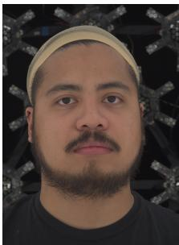  
Subject 1 Neutral

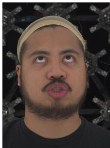  
Subject 1 Expression 2

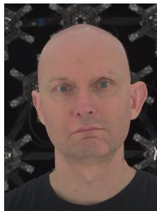  
Subject 2 Neutral

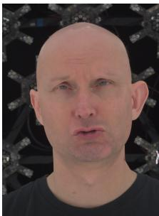  
Subject 2 Expression 2  
Figure 1: Expression-induced appearance changes are person-specific. Given the same expression instructions, the two subjects exhibit different changes in gaze, brow, and mouth geometry, illustrating information absent from a neutral reference.

We study expression-diverse references as a shared basis for conditioning and evaluation. For evaluation, we collect a standardized gallery of eight facial configurations per subject, comprising one neutral portrait and seven expressions (Figure 2). We score each generated face by its maximum embedding cosine similarity to the subject’s gallery, which provides a more expression-robust face similarity metric. We additionally report identity similarity separately for mild, intense, and extreme expressions, together with the fraction of generated frames in each regime. This makes failures at high expression intensity visible and helps interpret scores when methods produce different expression distributions.

For generation, we extend Stand-In (Xue et al., 2026) to condition on multiple references of the same person. The model is an efficient 315M-parameter LoRA adapter with only 25k training steps at batch size 16. Expression-diverse references provide complementary observations of the subject’s facial appearance that are absent from a single portrait. To train the model, we curate consistent and diverse face crops from OpenHumanVid (Li et al., 2024) and vary the number of conditioning references during training. When multiple captures are unavailable, we use LivePortrait (Guo et al., 2024) to synthesize expressive references from a single neutral portrait, using driving expressions from a subject outside the evaluation set. This allows the same video generator to operate from a single portrait. Although identity similarity is lower than with real references, it still exceeds that of all evaluated baselines.

We evaluate on a controlled benchmark containing 10 subjects and 48 expression-focused prompts per subject. Both real and synthetic reference galleries achieve higher nearest-gallery identity similarity than all evaluated baselines in each of the three intensity regimes. Under extreme expressions, CurricularFace similarity, is 74.80 with real galleries and 68.36 with synthetic galleries, compared with 60.95 for the strongest baseline (Table 2). Ablations compare expression-diverse references with repeated neutral portraits and pose-diverse neutral references, examining the role of expression coverage beyond reference count (Table 5). Across both recognizers and all evaluated baselines, ou real-gallery model wins on at least 97.9% of matched subject–prompt pairs. The win rate remains at least 96.1% on the subset where our model produces greater peak expression intensity, providing additional evidence that identity gains can persist under stronger facial deformation (Table 3).

Our contributions are threefold:

• We identify and quantify the dependence of single-reference face similarity on expression intensity in real imagery and introduce a standardized gallery-based multi-reference evaluation protocol stratified by expression intensity.

• We develop expression-diverse multi-reference conditioning and its data-curation pipeline, which enables the model to better capture person-specific facial deformations under expressive motion.

• We demonstrate improvements in identity similarity with both real expression reference galleries and reference galleries synthesized from a single portrait, both surpassing baselines in all expression regimes and especially the intense and extreme ones, even when multiple-expression captures are not available.

## 2 RELATED WORK

Video Generation Models provide the generative backbone for human video synthesis. CogVideoX (Yang et al., 2024) combines a temporally compressive 3D VAE with an expert transformer to produce long, coherent text-conditioned clips. Wan2.2 (Wan Team, 2025) introduces a two-expert architecture specialized for high- and low-noise denoising stages, providing a backbone for multiple downstream tasks. LTX-2 (HaCohen et al., 2026) jointly models video and audio, while MiniMax H3 (MiniMax, 2026) accepts multimodal character and motion references for video generation and editing. These general-purpose models provide strong visual priors, but text conditioning lacks precise control over the subject’s identity in generated videos, whereas image-to-video generation generally requires a complete initial frame rather than just a reference portrait.

Identity-Preserving Video Generation conditions pretrained video generation backbones on reference images of one or more identities. The most common approach is to use a single reference image per identity and inject its features into the video generator. ConsisID (Yuan et al., 2025b) decomposes a reference face into low-frequency global features and high-frequency local details and injects them at different depths of a diffusion transformer. Concat-ID (Zhong et al., 2025) instead concatenates VAE-encoded reference features with video latents, while Stand-In (Xue et al., 2026) adds a lightweight conditional image branch with restricted self-attention and conditional position mapping. Phantom (Liu et al., 2025) learns joint text–image injection from text–image–video triplets.

Benchmarking Video Generation Models for facial identity similarity typically relies on a single reference. VBench (Huang et al., 2024) evaluates video generation along 16 disentangled dimensions. Its subject-consistency metric compares DINO features across frames of a generated video, measuring temporal stability but not facial identity relative to a reference person. OpenS2V-Eval (Yuan et al., 2025a) more directly evaluates subject-to-video generation. For human identity, its FaceSim protocol detects faces and computes CurricularFace (Huang et al., 2020) cosine simi larity to the input face. However, as we show below, this single-reference comparison can penalize genuine identity-preserving expression changes when the generated face departs from the reference expression. Our benchmark instead compares each frame with the nearest member of a standardized expression gallery and reports results stratified by expression intensity.

Facial Reenactment and Related Tasks. Facial reenactment animates a source portrait using head pose and expressions extracted from a driving video. LivePortrait (Guo et al., 2024) extracts appearance features from a single source image, estimates implicit 3D keypoints for the source and driving frames, warps the source features according to their motion, and decodes the result into animated frames. Person-specific 3D approaches such as GaussianAvatars (Qian et al., 2024) instead rig optimized 3D Gaussians to a parametric face model, and video face-swapping systems such as OmniFace (Guo et al., 2026) transfer a source identity onto an existing target video while preserving its motion and scene. These tasks receive an explicit driving signal and are distinct from our text-driven generation setting.

## 3 EVALUATING IDENTITY FIDELITY AT HIGH EXPRESSION INTENSITY

Previous work evaluates facial identity by comparing a generated face with a single reference image of the same subject in the embedding space of a pretrained face-recognition model. However, we show that the face similarity score is entangled with the expression variance. We collect a gallery of reference images $\mathcal { G } = \{ \dot { I } _ { i , e } \}$ for 10 subjects $i \in \{ 1 , \ldots , \bar { 1 0 } \}$ and 8 expressions $e \in \{ 0 , \ldots , 7 \}$ where $e = 0$ is the neutral expression. The images were taken in a light stage with a fixed frontal camera position and flat lighting setup, as shown in Figure 2. For each subject i, we compare each non-neutral image $( e \neq 0 )$ with the neutral image $( e = 0 )$ , computing cosine similarity separately with ArcFace (Deng et al., $2 0 1 9 ) \left( s _ { A r c } \right)$ and CurricularFace (Huang et al., $2 0 2 0 ) \left( s _ { C u r } \right)$ . We measure expression intensity as $\Delta \Psi _ { i , e } = \| \Psi _ { i , e } - \Psi _ { i , 0 } \| _ { 2 }$ , where $\Psi _ { i , e }$ is estimated using SMIRK (Retsinas et al., 2024) (Appendix A.1). As shown in Figure 3, both identity metrics decrease as expression intensity increases, both in our collected dataset and in the publicly available MEAD dataset (Wang et al., 2020). To further quantify this, we report both Pearson’s r and Spearman’s $\rho$ in Table 1.

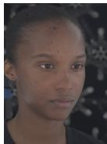  
Neutral (0)

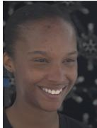  
Expression 1

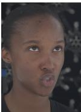  
Expression 2

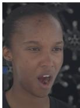  
Expression 3

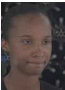  
Expression 4

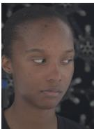  
Expression 5

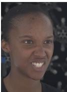  
Expression 6

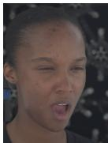  
Expression 7  
Figure 2: Example gallery for one of the 10 subjects with 8 expressions including neutral. All subjects were asked to perform the same set of expressions, whose instructions are listed in Appendix C. The gallery captures diverse expression-dependent facial configurations to support more robust identity evaluation and provide richer information for video generation models.

Table 1: Correlation between expression intensity $\Delta \Psi$ and identity similarity on both datasets.
<table><tr><td colspan="2"></td><td colspan="2">ArcFace</td><td colspan="2">CurricularFace</td></tr><tr><td>Dataset</td><td>n</td><td>Pearson&#x27;s r</td><td> $\mathrm { S p e a r m a n " s } \rho$ </td><td>Pearson&#x27;s r</td><td>Spearman&#x27;s  $\rho$ </td></tr><tr><td>Lightstage</td><td>70</td><td>-0.587</td><td>-0.662</td><td>-0.636</td><td>-0.701</td></tr><tr><td>MEAD</td><td>24,190</td><td>-0.521</td><td>-0.590</td><td>-0.496</td><td>-0.567</td></tr></table>

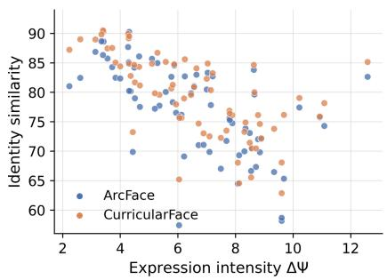  
(a) Lightstage

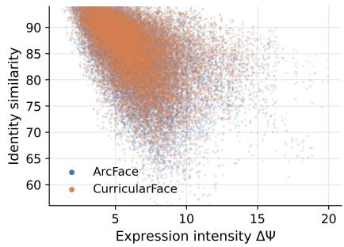  
(b) MEAD  
Figure 3: ArcFace and CurricularFace similarity versus expression intensity on real images. Each point represents a non-neutral photograph (Lightstage) or video frame (MEAD), measured relative to the subject’s neutral reference. MEAD preprocessing is described in Appendix A.2.

Therefore, for recognizer $R \ \in \ \{ \mathrm { A r c } , \mathrm { C u r } \}$ , we define the nearest-gallery identity similarity as $\begin{array} { r } { s _ { R } ^ { * } ( \hat { I } _ { i } ) \ = \ \operatorname* { m a x } _ { e \in \{ 0 , \dots , 7 \} } s _ { R } ( I _ { i , e } , \hat { I } _ { i } ) ^ { 1 } } \end{array}$ , where $\hat { I } _ { i }$ is a frame generated for subject i. This provides a more robust measure of identity fidelity when the expression intensity is high.

Furthermore, we report the nearest-gallery identity similarities for three ranges of ∆Ψ: mild $( \Delta \Psi < 4 . 5 )$ , intense $( 4 . 5 \le \Delta \Psi < 8 . 5 )$ , and extreme $( \Delta \Psi \ge 8 . 5 )$ . As shown in Figure 4, the thresholds approximately correspond to the first and third quartiles of ∆Ψ across the 70 non-neutral real photographs, which already depict deliberately intense expressions. This places the majority of photographs in the intense regime while retaining similarly sized mild and extreme tails.

We combine the six basic emotions proposed by Ekman (1992) with four environments and two triggers to create 48 prompts per subject (Appendix E). The prompted expressions differ from the reference configurations to discourage direct copying.

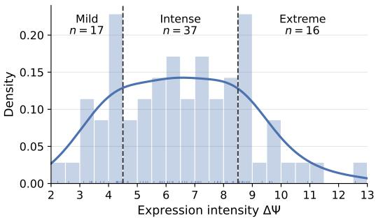  
Figure 4: Distribution of expression intensity $\Delta \Psi$ across the 70 non-neutral light-stage photographs. The solid curve is a kernel density estimate of the density histogram, and marks along the horizontal axis denote individual photographs.

## 4 TRAINING MULTI-REFERENCE SUBJECT-TO-VIDEO MODELS

Baselines. We provide the neutral portrait to the single-reference subject-to-video baselines: ConsisID (Yuan et al., 2025b), Concat-ID (Zhong et al., 2025), Stand-In (Xue et al., 2026), and Phantom (Liu et al., 2025). For Gen-4.5 (Runway Research, 2025), we use image-to-video mode through the official API, with the text prompt and the neutral portrait as the initial frame. For AnyID (Wang et al., 2026), which accepts up to five references, we provide the neutral portrait and four other expression images (1, 3, 5, 7). We use official checkpoints for the locally run baselines. For Stand-In, we use its adapter for Wan 2.2.

Failure Mode of Existing Methods. We analyze identity preservation across all generated frames at different expression intensities. Figure 6 shows that the single-reference models exhibit a substantial drop in identity similarity when the expression intensity $\bar { \Delta \Psi }$ is large despite high similarity at low $\Delta \bar { \Psi }$ Some common artifacts for these models are presented in Figure 5. The multi-reference model AnyID (Wang et al., 2026) shows a more stable curve, benefiting from our expression-diverse references, but still has low identity similarity across all intensity regimes.

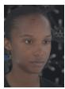  
Reference

  
(a) Distorted mouth

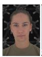  
Reference

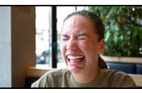  
Phantom

  
Reference  
(b) Distorted glabella

  
Gen-4.5

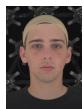  
Reference

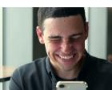  
AnyID  
(c) Incorrect facial features  
Figure 5: Representative facial artifacts produced by existing identity-preserving video generation methods under expressive motion. Each generated frame is shown beside the neutral reference portrait provided to the method.

Data Curation. We use the OpenHumanVid (Li et al., 2024) dataset for training our multi-reference subject-to-video models. For each video, we sample 10 evenly spaced frames and use SCRFD (Guo et al., 2021) to detect the face. We retain the largest detected face with a detection score above 0.5 and crop it using a bounding box expanded by a factor of 1.6. We compute ArcFace embeddings for the retained crops and cluster them by linking together any two crops with cosine similarity above 0.35. Videos with more than 2 clusters or more than 40% of the crops outside the dominant cluster are treated as multi-subject videos and are discarded, and we keep the largest cluster for the remaining videos. If more than eight crops remain, we select a diverse subset of eight. Starting from the highest-quality crop $i _ { 0 } = \arg \operatorname* { m a x } _ { j } Q ( I _ { j } )$ , we greedily add the farthest remaining crop $i _ { k + 1 }$ until eight crops have been selected:

$$
i _ { k + 1 } = \arg \operatorname* { m a x } _ { j } \operatorname* { m i n } _ { \substack { j ^ { \prime } \in \{ 0 , 1 , \dots , k \} } } 0 . 7 5 \cdot \left( 1 - s _ { A r c } ( I _ { j } , I _ { i _ { j ^ { \prime } } } ) \right) + 0 . 2 5 \cdot \Delta t ( j , i _ { j ^ { \prime } } )
$$

where $Q ( I _ { j } )$ is the quality score, $s _ { A r c } ( I _ { j } , I _ { i _ { j ^ { \prime } } } )$ is the ArcFace cosine similarity, and $\Delta t ( j , i _ { j ^ { \prime } } )$ is the temporal distance between the two frames, normalized to [0, 1].

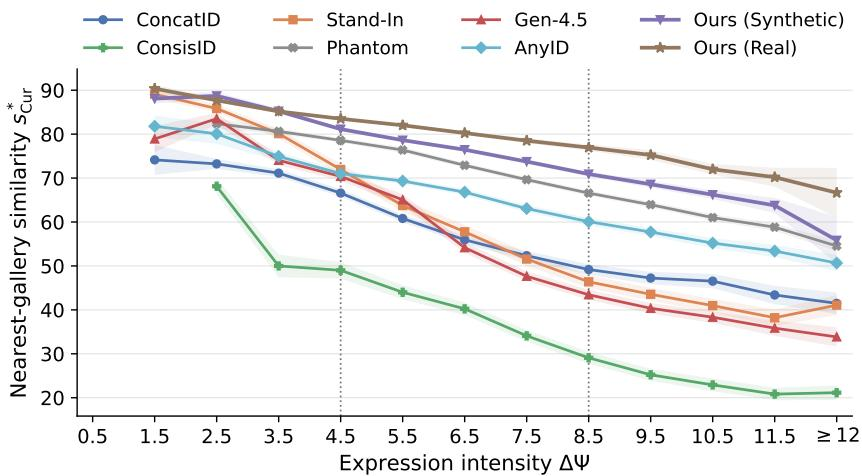  
Figure 6: Distribution of nearest-gallery CurricularFace identity similarity in different bins of expression intensity ∆Ψ. We use all generated frames from the baselines and our method, run SMIRK (Retsinas et al., 2024) to obtain the expression vector Ψ, and measure $\Delta \Psi = \lVert \Psi - \Psi _ { \mathrm { n e u t r a l } } \rVert _ { 2 }$ against the neutral reference (see Appendix A.1 for details). Each point gives the mean identity similarity within a unit-width $\Delta \Psi$ bin, connected across bins; the final point aggregates the open-ended $\Delta \Psi \ge 1 2$ bucket. Shaded regions denote 95% confidence intervals computed using clip-clustered standard errors. Dotted lines mark the thresholds between mild, intense, and extreme expressions.

Architecture and Training. The pipeline for our method is shown in Figure 7. We build on Stand-In (Xue et al., 2026), a single-reference identity-preserving adapter for Wan2.2-T2V-A14B (Wan et al., 2025). It adds rank-128 LoRA adapters to the query, key, and value projections of each selfattention block, applied only to reference-image tokens, while the backbone parameters, including those used to process video tokens, remain frozen. We extend this architecture to accept multiple reference images. We independently resize and VAE-encode each of the N references at $5 1 2 \times 5 1 2$ resolution, yielding 1024 tokens per reference. All references share diffusion timestep 0 and the same grid of 3D RoPE (Su et al., 2021) coordinates at temporal index −1 and spatial indices starting beyond the video grid, namely $\{ - 1 \} \times [ H _ { V } , H _ { V } + H _ { I } \stackrel { . } { ) } \times [ W _ { V } , W _ { V } + W _ { I } )$ , whereas the video tokens are placed on $[ 0 , F ) \times \bar { [ 0 , H _ { V } ) \times [ 0 , W _ { V } ) }$ , where $F = 2 1$ is the number of latent frames, compressed by the VAE from 81 frames. Reference tokens attend only within their own image, while video tokens attend to all tokens. The attention mask over the concatenated tokens is

$$
M _ { Q , K } ( i , j ) = \left\{ \begin{array} { l l } { 1 } & { \mathrm { i f ~ } i \mathrm { ~ i s ~ a ~ v i d e o ~ t o k e n } } \\ { 1 } & { \mathrm { i f ~ } i , j \mathrm { ~ a r e ~ i m a g e ~ t o k e n s ~ f r o m ~ t h e ~ s a m e ~ r e f e r e n c e ~ i m a g e } } \\ { 0 } & { \mathrm { o t h e r w i s e . } } \end{array} \right.
$$

The reference tokens do not attend to the text prompt in the cross-attention layers, and are discarded before untokenization and VAE decoding. We train with 400k randomly selected unique clips. During training, we shuffle the references. At each step, with probability 0.5, we use all N available images; otherwise, we draw k uniformly from $\{ 1 , \ldots , N \}$ and randomly select a subset of size k. This improves robustness to different reference counts. We use an effective batch size of 16.

Inference Pipeline with a Single Reference. Our model provides the best results when multiple references are provided, but when only a single reference is available, we use LivePortrait (Guo et al., 2024) to synthesize seven expressive references, driven by expressions from a held-out subject. The portrait and synthesized images form an eight-image gallery (see example in Figure 9, Appendix D).

## 5 RESULTS

## 5.1 QUALITATIVE RESULTS

In Figure 8, we show videos generated by our model using a real reference gallery, Ours (Real), or a LivePortrait-generated gallery, Ours (Synthetic), alongside the representative baselines Stand-In and

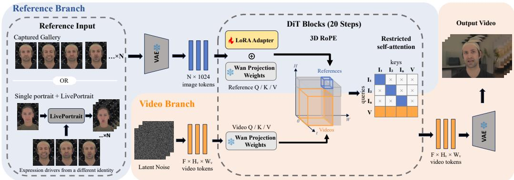  
Figure 7: Overview of our multi-reference subject-to-video generation pipeline.

AnyID. With information from a diverse set of expressions, our model produces frames that better preserve identity under strong expressions.

## 5.2 RESULTS ON OUR EVALUATION DATASET

We evaluate the baselines and our models on the evaluation dataset introduced above. Table 2 shows the nearest-gallery identity similarities $s _ { \mathrm { A r c } } ^ { * }$ and $s _ { \mathrm { C u r } } ^ { * } ,$ stratified by expression intensity. Our model, whether using synthetic or real reference galleries, outperforms all baselines in all three expressionintensity regimes. The performance gap is especially pronounced in the intense and extreme regimes, demonstrating the effectiveness of expression-diverse multi-reference conditioning in preserving identity under expressive motion.

Table 2: Identity fidelity on our evaluation dataset. The percentage columns report the fraction of each model’s frames in each expression-intensity regime.
<table><tr><td></td><td colspan="2">All frames</td><td colspan="3">Mild</td><td colspan="3">Intense</td><td colspan="3">Extreme</td></tr><tr><td>Model</td><td> $s _ { \mathrm { A r c } } ^ { * } \uparrow$ </td><td> $s _ { \mathrm { C u r } } ^ { * } \uparrow$ </td><td>%</td><td> $s _ { \mathrm { A r c } } ^ { * } \uparrow$ </td><td> $s _ { \mathrm { C u r } } ^ { * } \uparrow$ </td><td>%</td><td> $s _ { \mathrm { A r c } } ^ { * } \uparrow$ </td><td> $s _ { \mathrm { C u r } } ^ { * } \uparrow$ </td><td>%</td><td>sArc ↑</td><td> $s _ { \mathrm { C u r } } ^ { * } \uparrow$ </td></tr><tr><td>Concat-ID [ICCVW2025]</td><td>59.31</td><td>58.19</td><td>24.6</td><td>71.64</td><td>70.44</td><td>54.7</td><td>58.47</td><td>57.17</td><td>20.7</td><td>46.82</td><td>46.30</td></tr><tr><td>Phantom [ICCV2025]</td><td>65.67</td><td>66.85</td><td>7.0</td><td>80.40</td><td>79.77</td><td>40.8</td><td>71.84</td><td>72.20</td><td>52.2</td><td>58.88</td><td>60.95</td></tr><tr><td>ConsisID [CVPR2025]</td><td>33.02</td><td>31.81</td><td>3.0</td><td>50.88</td><td>50.53</td><td>50.3</td><td>39.19</td><td>38.31</td><td>46.8</td><td>25.24</td><td>23.63</td></tr><tr><td>Stand-In [CVPR2026]</td><td>54.37</td><td>53.97</td><td>15.9</td><td>81.04</td><td>81.24</td><td>39.7</td><td>56.87</td><td>56.28</td><td>44.5</td><td>42.63</td><td>42.18</td></tr><tr><td>AnyID [CVPR2026]</td><td>62.83</td><td>62.74</td><td>7.8</td><td>73.86</td><td>73.77</td><td>54.4</td><td>66.36</td><td>66.02</td><td>37.8</td><td>55.48</td><td>55.77</td></tr><tr><td>Gen-4.5</td><td>55.02</td><td>54.52</td><td>22.1</td><td>76.41</td><td>76.99</td><td>44.2</td><td>55.66</td><td>55.07</td><td>33.7</td><td>40.17</td><td>39.07</td></tr><tr><td>Ours (Synthetic)</td><td>76.35</td><td>76.54</td><td>14.9</td><td>83.16</td><td>84.31</td><td>71.0</td><td>76.48</td><td>76.53</td><td>14.1</td><td>68.48</td><td>68.36</td></tr><tr><td>Ours (Real)</td><td>80.78</td><td>81.68</td><td>29.0</td><td>83.68</td><td>85.03</td><td>63.5</td><td>80.23</td><td>80.95</td><td>7.4</td><td>74.27</td><td>74.80</td></tr></table>

Furthermore, Table 3 shows that our model achieves higher identity fidelity on matched subject– prompt pairs, including the subset where our real-gallery model produces greater peak expression intensity than the competing method.

## 6 ABLATION STUDIES

## 6.1 NUMBER OF REFERENCE IMAGES

Increasing the reference count improves overall CurricularFace similarity by approximately 1.3 points per added reference, with the largest gains under intense and extreme expressions (Table 4). A ninth reference provides no further overall gain, which justifies our choice of using 8 references in the gallery. For context, we also report AnyID (Wang et al., 2026), which accepts 5 references.

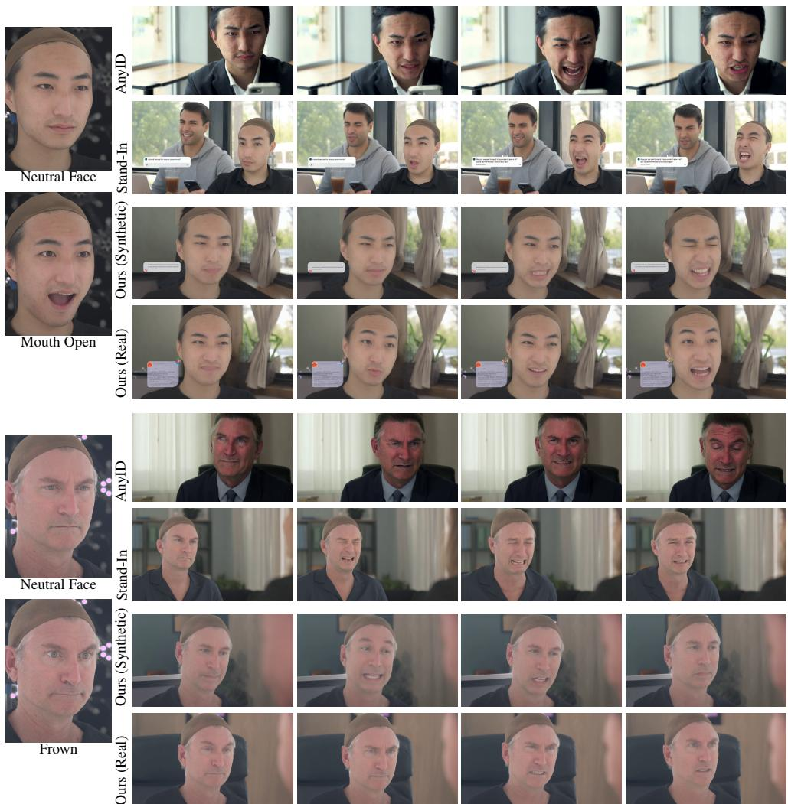  
Figure 8: Qualitative comparison. The leftmost images are the subject’s neutral portrait and one expressive reference; each row shows four temporally ordered frames from the same generated video.

Table 3: Win rates for Ours (Real) on matched subject–prompt pairs, using per-video mean nearestgallery similarity. The right-hand columns include only pairs where ours has greater peak expression intensity.
<table><tr><td rowspan="2">Baseline</td><td colspan="2">All pairs</td><td colspan="2">Ours has higher peak intensity</td></tr><tr><td> $s _ { \mathrm { A r c } } ^ { * }$  ←</td><td> $s _ { \mathrm { C u r } } ^ { * } \uparrow$ </td><td> $s _ { \mathrm { A r c } } ^ { * }$  ←</td><td> $s _ { \mathrm { C u r } } ^ { * }$  ↑</td></tr><tr><td>Concat-ID</td><td>97.9%</td><td>99.0%</td><td>96.1%</td><td>98.3%</td></tr><tr><td>Phantom</td><td>98.8%</td><td>98.5%</td><td>96.9%</td><td>96.9%</td></tr><tr><td>ConsisID</td><td>100.0%</td><td>100.0%</td><td>100.0%</td><td>100.0%</td></tr><tr><td>Stand-In</td><td>97.9%</td><td>98.3%</td><td>96.4%</td><td>96.4%</td></tr><tr><td>AnyID</td><td>99.0%</td><td>99.2%</td><td>96.9%</td><td>97.7%</td></tr><tr><td>Gen-4.5</td><td>100.0%</td><td>100.0%</td><td>100.0%</td><td>100.0%</td></tr></table>

## 6.2 EXPRESSION DIVERSITY VS. POSE DIVERSITY

Table 5 isolates the effect of expression diversity by comparing three sets of eight references: repeated neutral images, pose-diverse neutral images, and expression-diverse images. The results show that the expression-diverse set achieves higher fidelity than the pose-diverse set in all three

Table 4: Effect of reference count on identity fidelity. Each additional reference adds an expression to the preceding reference set; the ninth reference uses an held-out expression outside the standard gallery. Scores within 0.5 points of the best value in each similarity column are bolded.
<table><tr><td rowspan="2">Model</td><td rowspan="2">Refs.</td><td colspan="2">All frames</td><td colspan="3">Mild</td><td colspan="3">Intense</td><td colspan="3">Extreme</td></tr><tr><td> $s _ { \mathrm { A r c } } ^ { * }$ </td><td>个  $s _ { \mathrm { C u r } } ^ { * } \uparrow$ </td><td>%</td><td> $s _ { \mathrm { A r c } } ^ { * } \uparrow$ </td><td> $s _ { \mathrm { C u r } } ^ { * } \uparrow$ </td><td>%</td><td> $s _ { \mathrm { A r c } } ^ { * } \uparrow$ </td><td> $s _ { \mathrm { C u r } } ^ { * } \uparrow$ </td><td>%</td><td> $s _ { \mathrm { A r c } } ^ { * } \uparrow$ </td><td> $s _ { \mathrm { C u r } } ^ { * } \uparrow$ </td></tr><tr><td>AnyID</td><td>5</td><td>62.83</td><td>62.74</td><td>7.8</td><td>73.86</td><td>73.77</td><td>54.4</td><td>66.36</td><td>66.02</td><td>37.8</td><td>55.48</td><td>55.77</td></tr><tr><td>Ours</td><td>5</td><td>77.22</td><td>77.77</td><td>24.9</td><td>83.92</td><td>85.05</td><td>60.6</td><td>77.03</td><td>77.39</td><td>14.5</td><td>66.51</td><td>66.82</td></tr><tr><td>Ours</td><td>6</td><td>78.36</td><td>78.94</td><td>25.3</td><td>83.62</td><td>84.78</td><td>63.8</td><td>77.83</td><td>78.24</td><td>10.8</td><td>69.17</td><td>69.39</td></tr><tr><td>Ours</td><td>7</td><td>79.59</td><td>80.34</td><td>27.4</td><td>83.72</td><td>85.03</td><td>63.5</td><td>78.93</td><td>79.49</td><td>9.1</td><td>71.80</td><td>72.18</td></tr><tr><td>Ours</td><td>8</td><td>80.78</td><td>81.68</td><td>29.0</td><td>83.68</td><td>85.03</td><td>63.5</td><td>80.23</td><td>80.95</td><td>7.4</td><td>74.27</td><td>74.80</td></tr><tr><td>Ours</td><td>9</td><td>80.71</td><td>81.45</td><td>28.4</td><td>83.45</td><td>84.51</td><td>64.6</td><td>80.33</td><td>80.97</td><td>7.1</td><td>73.16</td><td>73.50</td></tr></table>

regimes. The repeated neutral set achieves the highest fidelity in the mild regime, but shows a similar score in the intense regime and a lower score in the extreme regime compared to the expressiondiverse set. The repeated neutral set also produces a much lower share of intense and extreme frames. This suggests that its high overall similarity comes partly from suppressing expression in tensity, highlighting the importance of evaluation stratified by intensity.

Table 5: Effect of reference-image diversity on identity similarity. Scores within 0.5 points of the best value in each similarity column are bolded.
<table><tr><td></td><td colspan="2">All frames</td><td colspan="3">Mild</td><td colspan="3">Intense</td><td colspan="3">Extreme</td></tr><tr><td>Reference set</td><td> $s _ { \mathrm { A r c } } ^ { * } \ \mathrm { \uparrow }$ </td><td> $s _ { \mathrm { C u r } } ^ { * } \uparrow$ </td><td>%</td><td> $s _ { \mathrm { A r c } } ^ { * } \uparrow$ </td><td> $s _ { \mathrm { C u r } } ^ { * } \uparrow$ </td><td>%</td><td> $s _ { \mathrm { A r c } } ^ { * } \cdot$  ←</td><td> $s _ { \mathrm { C u r } } ^ { * } \uparrow$ </td><td>%</td><td> $s _ { \mathrm { A r c } } ^ { * } \cdot \mathrm { ~ \ r ~ { ~ \ r ~ } ~ }$  ←</td><td> $s _ { \mathrm { C u r } } ^ { * } \uparrow$ </td></tr><tr><td>Repeated neutral</td><td>85.85</td><td>86.36</td><td>71.5</td><td>88.21</td><td>88.71</td><td>27.3</td><td>80.55</td><td>81.06</td><td>1.1</td><td>64.93</td><td>66.31</td></tr><tr><td>Pose-diverse neutral</td><td>57.27</td><td>57.41</td><td>8.7</td><td>67.75</td><td>67.71</td><td>60.0</td><td>59.46</td><td>59.52</td><td>31.2</td><td>50.11</td><td>50.47</td></tr><tr><td>Expression-diverse</td><td>80.78</td><td>81.68</td><td>29.0</td><td>83.68</td><td>85.03</td><td>63.5</td><td>80.23</td><td>80.95</td><td>7.4</td><td>74.27</td><td>74.80</td></tr></table>

## 6.3 TEMPORAL POSITIONAL EMBEDDING

We design our network to treat the reference images as an unordered set, so all the references are assigned the same temporal embedding to avoid introducing an ordering bias during training. For comparison, we also train a variant that assigns each reference a distinct temporal embedding. During training, we shuffle the reference images, and for each image $i = 1 , 2 , \cdots , N$ in the shuffled order, we assign it a temporal embedding −(i + 1) on the video-to-image attention path. Referenceimage self-attention retains the shared coordinate −1. This negative-temporal variant is trained and evaluated with the same eight expression-diverse references and generation settings as ours. The shared-coordinate model achieves higher identity fidelity in all regimes, shown in Table 6.

Table 6: Effect of temporal positional embeddings for multiple references.
<table><tr><td></td><td colspan="2">All frames</td><td colspan="3">Mild</td><td colspan="3">Intense</td><td colspan="3">Extreme</td></tr><tr><td>Temporal coordinates</td><td> $s _ { \mathrm { A r c } } ^ { * }$  ↑</td><td> $s _ { \mathrm { C u r } } ^ { * } \uparrow$ </td><td>%</td><td> $s _ { \mathrm { A r c } } ^ { * } \uparrow$ </td><td> $s _ { \mathrm { C u r } } ^ { * } \uparrow$ </td><td>%</td><td> $s _ { \mathrm { A r c } } ^ { * } \uparrow$ </td><td> $s _ { \mathrm { C u r } } ^ { * } \uparrow$ </td><td>%</td><td> $s _ { \mathrm { A r c } } ^ { * }$  ←</td><td> $s _ { \mathrm { C u r } } ^ { * } \uparrow$ </td></tr><tr><td>Distinct negative</td><td>79.98</td><td>80.84</td><td>31.9</td><td>82.75</td><td>84.20</td><td>61.3</td><td>79.35</td><td>79.96</td><td>6.7</td><td>72.56</td><td>72.94</td></tr><tr><td>Shared t = −1 (ours)</td><td>80.78</td><td>81.68</td><td>29.0</td><td>83.68</td><td>85.03</td><td>63.5</td><td>80.23</td><td>80.95</td><td>7.4</td><td>74.27</td><td>74.80</td></tr></table>

## 7 CONCLUSION

We show the limitations of a single neutral portrait for capturing person-specific facial changes and evaluating identity under strong expressions. To address this, we introduce an expression-diverse gallery for evaluation and propose a multi-reference conditioning model, which improves identity similarity across all expression-intensity regimes, especially under extreme expressions. These results highlight the importance of expression diversity in identity-preserving video generation. We encourage future work to provide larger expression-diverse datasets for benchmarking and training.

## AI USE STATEMENT

In this work, we used generative AI tools to provide feedback on research methodology and experiments and to help implement methods. We have not used generative AI tools for proposing or refining hypotheses, cleaning and reformatting datasets, or interpreting results. Generating synthetic datasets, helping develop theoretical models or conceptual frameworks, formulating mathematical claims, providing critical ingredients for proving mathematical claims, assisting in the writing of proofs, assisting with translation, and supporting qualitative and thematic data analysis are not applicable to this work. Additionally, we used generative AI tools for proposing the title and editing the paper to improve readability. We have reviewed all AI-assisted work. AI-assisted edits are manually reviewed before incorporation into the submitted work. We evaluate feedback from generative AI and decide which suggestions to adopt. AI-written code is manually audited. We take responsibility for the final content of this work, including text, claims, or artifacts produced with the aid of generative AI.

## ETHICS STATEMENT

Our work includes photographs of human faces and expressions. All subjects have signed consent forms, granting permission for the use of their images in our research and for publication in academic venues. We ensure that all data is handled in accordance with relevant privacy laws and regulations, and that any sensitive information is properly anonymized when necessary.

## REPRODUCIBILITY STATEMENT

We support reproducibility by providing detailed descriptions of our evaluation pipelines and training and inference settings, along with the expressions and prompts used in our evaluation set, in the paper and supplementary materials. We will make code, data, and model weights publicly available upon acceptance, before the camera-ready version is submitted.

## REFERENCES

Jiankang Deng, Jia Guo, Niannan Xue, and Stefanos Zafeiriou. Arcface: Additive angular margin loss for deep face recognition. In Proceedings of the IEEE/CVF conference on computer vision and pattern recognition, pp. 4690–4699, 2019.

Paul Ekman. Facial expressions of emotion: New findings, new questions. Psychological Science, 3, Issue 1:34–38, 1992. doi: 10.1111/j.1467-9280.1992.tb00253.x.

Yu Gao, Haoyuan Guo, Tuyen Hoang, Weilin Huang, Lu Jiang, Fangyuan Kong, Huixia Li, Jiashi Li, Liang Li, Xiaojie Li, et al. Seedance 1.0: Exploring the boundaries of video generation models. arXiv preprint arXiv:2506.09113, 2025.

Jia Guo, Jiankang Deng, Alexandros Lattas, and Stefanos Zafeiriou. Sample and computation redistribution for efficient face detection. arXiv preprint arXiv:2105.04714, 2021.

Jianzhu Guo, Dingyun Zhang, Xiaoqiang Liu, Zhizhou Zhong, Yuan Zhang, Pengfei Wan, and Di Zhang. Liveportrait: Efficient portrait animation with stitching and retargeting control. arXiv preprint arXiv:2407.03168, 2024.

Xu Guo, Fulong Ye, Xinghui Li, Pengqi Tu, Pengze Zhang, Qichao Sun, Songtao Zhao, Xiangwang Hou, and Qian He. OmniFace: Bridging the image-to-video gap for high-fidelity face swapping via diffusion transformer. In European Conference on Computer Vision, 2026.

Yoav HaCohen, Benny Brazowski, Nisan Chiprut, Yaki Bitterman, Andrew Kvochko, Avishai Berkowitz, Daniel Shalem, Daphna Lifschitz, Dudu Moshe, Eitan Porat, et al. Ltx-2: Efficient joint audio-visual foundation model. arXiv preprint arXiv:2601.03233, 2026.

Yuge Huang, Yuhan Wang, Ying Tai, Xiaoming Liu, Pengcheng Shen, Shaoxin Li, Jilin Li, and Feiyue Huang. Curricularface: adaptive curriculum learning loss for deep face recognition. In 2020 IEEE/CVF conference on computer vision and pattern recognition (CVPR), pp. 5900–5909. IEEE, 2020.

Ziqi Huang, Yinan He, Jiashuo Yu, Fan Zhang, Chenyang Si, Yuming Jiang, Yuanhan Zhang, Tianxing Wu, Qingyang Jin, Nattapol Chanpaisit, et al. VBench: Comprehensive benchmark suite for video generative models. In Proceedings of the IEEE/CVF Conference on Computer Vision and Pattern Recognition, pp. 21807–21818, 2024.

Hui Li, Mingwang Xu, Yun Zhan, Shan Mu, Jiaye Li, Kaihui Cheng, Yuxuan Chen, Tan Chen, Mao Ye, Jingdong Wang, et al. Openhumanvid: A large-scale high-quality dataset for enhancing human-centric video generation. arXiv preprint arXiv:2412.00115, 2024.

Tianye Li, Timo Bolkart, Michael J Black, Hao Li, and Javier Romero. Learning a model of facial shape and expression from 4d scans. ACM Trans. Graph., 36(6):194–1, 2017.

Lijie Liu, Tianxiang Ma, Bingchuan Li, Zhuowei Chen, Jiawei Liu, Gen Li, Siyu Zhou, Qian He, and Xinglong Wu. Phantom: Subject-consistent video generation via cross-modal alignment. In Proceedings ofthe IEEE/CVF International Conference on Computer Vision (ICCV), pp. 14951– 14961, October 2025.

MiniMax. MiniMax H3: An open model breaking the boundaries between tasks and modalities. MiniMax Research, 2026. URL https://www.minimax.io/blog/minimax-h3. Accessed September 23, 2026.

Shenhan Qian, Tobias Kirschstein, Liam Schoneveld, Davide Davoli, Simon Giebenhain, and Matthias Nießner. GaussianAvatars: Photorealistic head avatars with rigged 3D gaussians. In Proceedings of the IEEE/CVF Conference on Computer Vision and Pattern Recognition, pp. 20299– 20309, 2024.

George Retsinas, Panagiotis P. Filntisis, Radek Danecek, Victoria F. Abrevaya, Anastasios Roussos, Timo Bolkart, and Petros Maragos. 3d facial expressions through analysis-by-neural-synthesis. In Conference on Computer Vision and Pattern Recognition (CVPR), 2024.

Runway Research. Runway gen-4.5: State-of-the-art ai video generation. https://runway. com/research/introducing-runway-gen-4.5, 2025. Accessed: 2026-09-18.

Jianlin Su, Yu Lu, Shengfeng Pan, Bo Wen, and Yunfeng Liu. Roformer: Enhanced transformer with rotary position embedding, 2021.

Team Wan, Ang Wang, Baole Ai, Bin Wen, Chaojie Mao, Chen-Wei Xie, Di Chen, Feiwu Yu, Haiming Zhao, Jianxiao Yang, Jianyuan Zeng, Jiayu Wang, Jingfeng Zhang, Jingren Zhou, Jinkai Wang, Jixuan Chen, Kai Zhu, Kang Zhao, Keyu Yan, Lianghua Huang, Mengyang Feng, Ningyi Zhang, Pandeng Li, Pingyu Wu, Ruihang Chu, Ruili Feng, Shiwei Zhang, Siyang Sun, Tao Fang, Tianxing Wang, Tianyi Gui, Tingyu Weng, Tong Shen, Wei Lin, Wei Wang, Wei Wang, Wenmeng Zhou, Wente Wang, Wenting Shen, Wenyuan Yu, Xianzhong Shi, Xiaoming Huang, Xin Xu, Yan Kou, Yangyu Lv, Yifei Li, Yijing Liu, Yiming Wang, Yingya Zhang, Yitong Huang, Yong Li, You Wu, Yu Liu, Yulin Pan, Yun Zheng, Yuntao Hong, Yupeng Shi, Yutong Feng, Zeyinzi Jiang, Zhen Han, Zhi-Fan Wu, and Ziyu Liu. Wan: Open and advanced large-scale video generative models. arXiv preprint arXiv:2503.20314, 2025.

Wan Team. Wan2.2: Open and advanced large-scale video generative models. https:// github.com/Wan-Video/Wan2.2, 2025. Accessed September 24, 2026.

Jiahao Wang, Hualian Sheng, Sijia Cai, Yuxiao Yang, Weizhan Zhang, Caixia Yan, Bing Deng, and Jieping Ye. Anyid: Ultra-fidelity universal identity-preserving video generation from any visual references. In Proceedings of the IEEE/CVF Conference on Computer Vision and Pattern Recognition (CVPR), pp. 12808–12817, June 2026.

Kaisiyuan Wang, Qianyi Wu, Linsen Song, Zhuoqian Yang, Wayne Wu, Chen Qian, Ran He, Yu Qiao, and Chen Change Loy. Mead: A large-scale audio-visual dataset for emotional talkingface generation. In ECCV, August 2020.

Bowen Xue, Zheng-Peng Duan, Qixin Yan, Wenjing Wang, Hao Liu, Chun-Le Guo, Chongyi Li, Chen Li, and Jing Lyu. Stand-in: A lightweight and plug-and-play identity control for video generation. In Proceedings of the IEEE/CVF conference on computer vision and pattern recognition, 2026.

Zhuoyi Yang, Jiayan Teng, Wendi Zheng, Ming Ding, Shiyu Huang, Jiazheng Xu, Yuanming Yang, Wenyi Hong, Xiaohan Zhang, Guanyu Feng, et al. CogVideoX: Text-to-video diffusion models with an expert transformer. arXiv preprint arXiv:2408.06072, 2024.

Shenghai Yuan, Xianyi He, Yufan Deng, Yang Ye, Jinfa Huang, Bin Lin, Jiebo Luo, and Li Yuan. Opens2v-nexus: A detailed benchmark and million-scale dataset for subject-to-video generation. arXiv preprint arXiv:2505.20292, 2025a.

Shenghai Yuan, Jinfa Huang, Xianyi He, Yunyang Ge, Yujun Shi, Liuhan Chen, Jiebo Luo, and Li Yuan. Identity-preserving text-to-video generation by frequency decomposition. In Proceedings ofthe Computer Vision and Pattern Recognition Conference, pp. 12978–12988, 2025b.

Yong Zhong, Zhuoyi Yang, Jiayan Teng, Xiaotao Gu, and Chongxuan Li. Concat-id: Towards universal identity-preserving video synthesis. In 2025 IEEE/CVF International Conference on Computer Vision Workshops (ICCVW), pp. 1927–1936. IEEE, 2025.

## A IMPLEMENTATION DETAILS

## A.1 FACE DETECTION AND EXPRESSION INTENSITY DEFINITION

We detect the faces with SCRFD-10g (Guo et al., 2021) at a detection size of $6 4 0 \times 6 4 0$ with a confidence threshold of 0.5. When more than one face is found we keep the one with the highest detection confidence. The detector’s five facial keypoints define a similarity transform to the standard ArcFace template, giving a $1 1 2 \times 1 1 2$ aligned crop; this single crop is embedded by both recognizers, ArcFace (Deng et al., 2019) and CurricularFace (Huang et al., 2020). Identity similarity is the cosine similarity between $\ell _ { 2 }$ -normalized embeddings, reported ×100, following the convention of Wang et al. (2026). Frames with no detectable face are dropped from all frame-level statistics, and a video with no detectable face in any sampled frame is excluded from the paired comparisons. The share of sampled frames with a detected face is above 98.8% for every evaluated method and above 99.7% for ours.

For expressions, the crops are encoded by the SMIRK Retsinas et al. (2024) encoder. We define $\Psi = [ \psi _ { \mathrm { e x p r } } ; \ \psi _ { \mathrm { e y e l i d } } ; \ \psi _ { \mathrm { j a w } } ]$ , a 55-dimensional vector formed by the 50 FLAME (Li et al., 2017) expression coefficients, the 2 eyelid parameters, and the 3 jaw-rotation parameters predicted by SMIRK. The expression intensity of a frame is $\Delta \Psi = \lVert \Psi - \Psi _ { \mathrm { n e u t r a l } } \rVert _ { 2 }$

## A.2 MEAD DATASET PREPROCESSING

For MEAD (Figure 3b), we use frontal-view videos of 48 subjects covering seven non-neutral emotions, three intensity levels, and three utterances per emotion and intensity level. We sample eight evenly spaced frames per clip, yielding 24,192 frames; 24,190 have valid expression estimates and contribute to the correlation analysis. The neutral expression vector is the coordinate-wise median over sampled neutral-clip frames, and the neutral identity embedding is the normalized mean of their embeddings.

## B SUPPLEMENTAL EXPERIMENTS

## B.1 EVALUATION WITH HELD-OUT EXPRESSIONS

We conduct two additional evaluations using four held-out expressions (H1, H2, H3, H4) that were not used in the original eight-image gallery. Each expression is available for all 10 evaluation subjects to form a 40-image held-out gallery.

Table 7 shows the superiority of nearest-gallery matching over using only the neutral portrait for identity similarity evaluation across all held-out expressions. Nearest-gallery matching reduces the range of the four expression-level means from 3.81 to 0.70 for ArcFace and from 3.53 to 1.75 for CurricularFace. Thus, the benefit generalizes beyond the expressions represented in the gallery.

Table 7: Identity similarity of real photographs showing expressions excluded from the eight-image gallery (mean ± standard error over 10 subjects).
<table><tr><td rowspan="2">Held-out expression</td><td colspan="2">ArcFace</td><td colspan="2">CurricularFace</td></tr><tr><td></td><td>Neutral Nearest gallery</td><td></td><td>Neutral Nearest gallery</td></tr><tr><td>H1</td><td> $7 8 . 0 5 \pm 3 . 3 5$ </td><td> $8 0 . 5 1 \pm 3 . 0 5$ </td><td> $7 8 . 7 0 \pm 3 . 7 6$ </td><td> $8 1 . 0 3 \pm 3 . 3 2$ </td></tr><tr><td>H2</td><td> $7 5 . 3 5 \pm 3 . 5 3$ </td><td> $8 0 . 9 4 \pm 3 . 5 9$ </td><td> $7 6 . 8 9 \pm 3 . 4 3$ </td><td> $8 2 . 3 3 \pm 3 . 3 4$ </td></tr><tr><td>H3</td><td> $7 7 . 8 5 \pm 2 . 7 9$ </td><td> $8 1 . 0 5 \pm 2 . 5 0$ </td><td> $7 9 . 9 6 \pm 2 . 1 7$ </td><td> $8 2 . 7 8 \pm 2 . 3 2$ </td></tr><tr><td>H4</td><td> $7 9 . 1 7 \pm 2 . 8 0$ </td><td> $8 1 . 2 1 \pm 2 . 2 5$ </td><td> $8 0 . 4 2 \pm 2 . 3 0$ </td><td> $8 2 . 0 2 \pm 2 . 1 3$ </td></tr></table>

Although the standard practice in identity-preserving video generation models is to evaluate identity similarity using the same reference images that the model is conditioned on, to assess whether our gains depend on overlap between conditioning and evaluation images, Table 8 evaluates all models against four held-out expressions that are not used for conditioning. The results demonstrate that the model ordering remains consistent with the original evaluation.

Table 8: Nearest-gallery identity similarity using four held-out expressions. None of these photographs is used to condition any model. Mild, Intense, and Extreme restrict evaluation to frames in the corresponding expression-intensity regime.
<table><tr><td rowspan="2">Model</td><td colspan="2">All frames</td><td colspan="2">Mild</td><td colspan="2">Intense</td><td colspan="2">Extreme</td></tr><tr><td> $s _ { \mathrm { A r c } } ^ { * }$  ←</td><td> $s _ { \mathrm { C u r } } ^ { * }$  ↑</td><td> $s _ { \mathrm { A r c } } ^ { * }$  ↑</td><td> $s _ { \mathrm { C u r } } ^ { * }$  ↑</td><td> $s _ { \mathrm { A r c } } ^ { * }$  ↑</td><td> $s _ { \mathrm { C u r } } ^ { * }$  ↑</td><td> $s _ { \mathrm { A r c } } ^ { * }$  ↑</td><td> $s _ { \mathrm { C u r } } ^ { * } \uparrow$ </td></tr><tr><td>Concat-ID</td><td>54.75</td><td>53.45</td><td>65.64</td><td>64.97</td><td>54.43</td><td>52.81</td><td>42.24</td><td>41.05</td></tr><tr><td>Phantom</td><td>61.77</td><td>62.11</td><td>73.01</td><td>72.99</td><td>66.77</td><td>66.96</td><td>56.20</td><td>56.71</td></tr><tr><td>ConsisID</td><td>30.41</td><td>29.72</td><td>47.02</td><td>46.89</td><td>36.45</td><td>35.91</td><td>22.90</td><td>22.02</td></tr><tr><td>Stand-In</td><td>51.87</td><td>51.50</td><td>74.53</td><td>75.33</td><td>54.02</td><td>53.34</td><td>41.28</td><td>40.74</td></tr><tr><td>AnyID</td><td>59.24</td><td>58.32</td><td>70.21</td><td>69.37</td><td>63.09</td><td>62.13</td><td>51.25</td><td>50.39</td></tr><tr><td>Gen-4.5</td><td>52.26</td><td>51.72</td><td>69.09</td><td>69.69</td><td>53.82</td><td>53.29</td><td>38.63</td><td>37.27</td></tr><tr><td>Ours (Synthetic)</td><td>70.99</td><td>71.18</td><td>70.38</td><td>69.48</td><td>72.05</td><td>72.38</td><td>66.20</td><td>66.85</td></tr><tr><td>Ours (Real)</td><td>76.29</td><td>76.37</td><td>77.98</td><td>77.75</td><td>76.20</td><td>76.35</td><td>70.27</td><td>70.92</td></tr></table>

## B.2 RESULTS ON OPENS2V-EVAL

OpenS2V-Eval (Yuan et al., 2025a) evaluates general-purpose subject-to-video generation. It is therefore not designed specifically for the task studied in this paper: preserving facial identity under controlled, high-intensity expression changes using multiple reference images. In particular, its prompts do not systematically elicit high-intensity expressions, and it provides only one reference image per subject. Still, for context, we evaluate on the full Human-Domain protocol of 60 videos: 30 single-face and 30 single-human entries, each with one reference image and one text prompt. Because the benchmark provides only one reference per entry, we construct an eight-image gallery using our LivePortrait-based synthetic-reference pipeline.

We follow the official OpenS2V-Eval Face Similarity evaluator and leaderboard aggregation. The evaluator uniformly samples 32 frames, computes non-negative CurricularFace cosine similarity to the benchmark reference image for frames with a detected face, and averages the per-frame scores within each video. A video with no detected face receives a score of zero. The reported score is the mean over all 60 videos, multiplied by 100. As shown in Table 9, our model obtains a much higher Face Similarity score than the baselines.

Table 9: Official OpenS2V-Eval Face Similarity on the 60-video Human-Domain protocol (30 single-face and 30 single-human videos). Baseline scores are the published leaderboard values, and ours uses the same official evaluator and aggregation with references generated by LivePortrait.
<table><tr><td>Model</td><td>Face Similarity ↑</td></tr><tr><td>ConsisID Concat-ID</td><td>43.19</td></tr><tr><td>Stand-In</td><td>50.05 47.99</td></tr><tr><td>Phantom-14B</td><td>55.04</td></tr><tr><td>Ours (Synthetic)</td><td>62.26</td></tr></table>

## C VERBAL INSTRUCTIONS FOR GALLERY EXPRESSIONS

Table 10 maps the neutral reference and seven expressions shown in the gallery to the verbal instructions used to capture them.

## D SYNTHETIC GALLERY EXAMPLE

We show an example of the synthetic gallery generated by LivePortrait in Figure 9.

Table 10: Verbal instructions associated with the neutral reference and expression images in the gallery.
<table><tr><td>Gallery expression</td><td>Verbal instruction</td></tr><tr><td>Neutral (0)</td><td>Eyes open, teeth together, and lips closed in a neutral resting expression.</td></tr><tr><td>Expression 1</td><td>Eyes squeezed shut with raised cheeks, a wrinkled nose, smil- ing lip corners, and slightly parted lips.</td></tr><tr><td>Expression 2</td><td>Eyes directed upward while the lips are pushed forward into a rounded funnel shape.</td></tr><tr><td>Expression 3</td><td>Brows drawn together near the center while the mouth stretches open wide.</td></tr><tr><td>Expression 4</td><td>Inner brows raised with one or both lip corners tightened back- ward into a restrained, dimpling expression.</td></tr><tr><td>Expression 5</td><td>Eyes looking up and to the left while the jaw shifts toward the right.</td></tr><tr><td>Expression 6</td><td>Upper lip lifted, lower lip pulled downward, and the outer brows raised.</td></tr><tr><td>Expression 7</td><td>Upper lip raised, lower lip pulled down, and the mouth stretched very wide open.</td></tr></table>

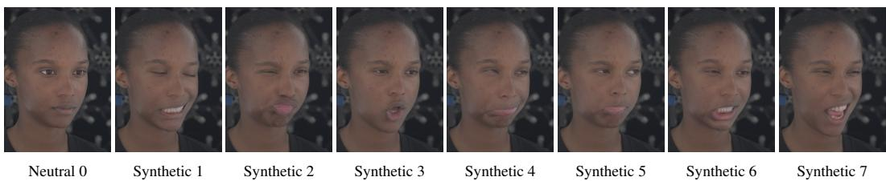  
Figure 9: Example of a synthetic expression gallery generated from a single neutral portrait. Although less natural than the real captures in Figure 2, the synthetic gallery provides additional expression information for identity-preserving video generation with the image-domain prior of the facial reenactment model.

## E PROMPT SPECIFICATION

## E.1 DETAILS OF PROMPT GENERATION PROCESS

We design prompts depicting controlled settings with a fixed camera to evaluate identity preservation under strong expressions without introducing factors such as camera movement or occlusion. We design 4 environments (Table 11) and 2 triggers, and use the 6 basic emotions proposed by Ekman (1992) (see the emotion cues in Table 12) to compile 48 prompts for each subject. We structure the prompts with the following template:

Medium close-up in {Environment Phrase}. A [GENDER]   
{Environment anchor}, face relaxed and neutral,   
looking just past the camera. {trigger}, and their   
face {emotion verb}: {cues}. The expression builds   
fast and holds at full intensity; the camera stays   
still.

Table 11: Environment Phrases
<table><tr><td>Environment</td><td>Phrase</td><td>Anchor</td></tr><tr><td>kitchen</td><td>a warmly lit, everyday kitchen</td><td>stands at the counter</td></tr><tr><td>home office</td><td>a quiet, softly lit home office</td><td>sits at the desk</td></tr><tr><td>living room</td><td>a dimly lit, quiet living room</td><td>sits on the sofa</td></tr><tr><td>cafe</td><td>a quiet, softly daylit cafe</td><td>sits at a table by the window</td></tr></table>

Table 12: Cues for each emotion
<table><tr><td>Emotion</td><td>Cues</td></tr><tr><td>joy</td><td>eyes narrow into creases, cheeks lift high, the mouth opens wide showing teeth</td></tr><tr><td>surprise</td><td>brows arch high, eyes go wide with the whites showing, the jaw drops open</td></tr><tr><td>fear</td><td>brows raise and pull together, eyes stretch wide, the lips pull back flat and tense as the mouth opens</td></tr><tr><td>anger</td><td>brows pull down hard, eyes glare, lips press tight and then part to bare clenched teeth, nostrils flare</td></tr><tr><td>disgust</td><td>nose wrinkles, upper lip lifts, lip corners pull down, eyes squint</td></tr><tr><td>sadness</td><td>inner brows lift and knit together, lip corners pull down, the chin tightens and trembles, eyes fill with tears</td></tr></table>

## E.2 FULL LIST OF PROMPTS

1. Medium close-up in a warmly lit, everyday kitchen. A [GENDER] stands at the counter, face relaxed and neutral, looking just past the camera. Someone just out of frame tells a joke, and their face breaks into uncontrollable laughter: eyes narrow into creases, cheeks lift high, the mouth opens wide showing teeth. The expression builds fast and holds at full intensity; the camera stays still.

2. Medium close-up in a warmly lit, everyday kitchen. A [GENDER] stands at the counter, face relaxed and neutral, looking just past the camera. They read a message on their phone that is absurdly funny, and their face breaks into uncontrollable laughter: eyes narrow into creases, cheeks lift high, the mouth opens wide showing teeth. The expression builds fast and holds at full intensity; the camera stays still.

3. Medium close-up in a quiet, softly lit home office. A [GENDER] sits at the desk, face relaxed and neutral, looking just past the camera. Someone just out of frame tells a joke, and their face breaks into uncontrollable laughter: eyes narrow into creases, cheeks lift high, the mouth opens wide showing teeth. The expression builds fast and holds at full intensity; the camera stays still.

4. Medium close-up in a quiet, softly lit home office. A [GENDER] sits at the desk, face relaxed and neutral, looking just past the camera. They read a message on their phone that is absurdly funny, and their face breaks into uncontrollable laughter: eyes narrow into creases, cheeks lift high, the mouth opens wide showing teeth. The expression builds fast and holds at full intensity; the camera stays still.

5. Medium close-up in a dimly lit, quiet living room. A [GENDER] sits on the sofa, face relaxed and neutral, looking just past the camera. Someone just out of frame tells a joke, and their face breaks into uncontrollable laughter: eyes narrow into creases, cheeks lift high, the mouth opens wide showing teeth. The expression builds fast and holds at full intensity; the camera stays still.

6. Medium close-up in a dimly lit, quiet living room. A [GENDER] sits on the sofa, face relaxed and neutral, looking just past the camera. They read a message on their phone that is absurdly funny, and their face breaks into uncontrollable laughter: eyes narrow into creases, cheeks lift high, the mouth opens wide showing teeth. The expression builds fast and holds at full intensity; the camera stays still.

7. Medium close-up in a quiet, softly daylit cafe. A [GENDER] sits at a table by the window, face relaxed and neutral, looking just past the camera. Someone just out of frame tells a joke, and their face breaks into uncontrollable laughter: eyes narrow into creases, cheeks lift high, the mouth opens wide showing teeth. The expression builds fast and holds at full intensity; the camera stays still.

8. Medium close-up in a quiet, softly daylit cafe. A [GENDER] sits at a table by the window, face relaxed and neutral, looking just past the camera. They read a message on their phone that is absurdly funny, and their face breaks into uncontrollable laughter: eyes narrow into creases, cheeks lift high, the mouth opens wide showing teeth. The expression builds fast and holds at full intensity; the camera stays still.

9. Medium close-up in a warmly lit, everyday kitchen. A [GENDER] stands at the counter, face relaxed and neutral, looking just past the camera. A voice just out of frame blurts out unexpected news, and their face snaps into open-mouthed astonishment: brows arch high, eyes go wide with the whites showing, the jaw drops open. The expression builds fast and holds at full intensity; the camera stays still.

10. Medium close-up in a warmly lit, everyday kitchen. A [GENDER] stands at the counter, face relaxed and neutral, looking just past the camera. They glance at their phone and see something they never expected, and their face snaps into open-mouthed astonishment: brows arch high, eyes go wide with the whites showing, the jaw drops open. The expression builds fast and holds at full intensity; the camera stays still.

11. Medium close-up in a quiet, softly lit home office. A [GENDER] sits at the desk, face relaxed and neutral, looking just past the camera. A voice just out of frame blurts out unexpected news, and their face snaps into open-mouthed astonishment: brows arch high, eyes go wide with the whites showing, the jaw drops open. The expression builds fast and holds at full intensity; the camera stays still.

12. Medium close-up in a quiet, softly lit home office. A [GENDER] sits at the desk, face relaxed and neutral, looking just past the camera. They glance at their phone and see something they never expected, and their face snaps into open-mouthed astonishment: brows arch high, eyes go wide with the whites showing, the jaw drops open. The expression builds fast and holds at full intensity; the camera stays still.

13. Medium close-up in a dimly lit, quiet living room. A [GENDER] sits on the sofa, face relaxed and neutral, looking just past the camera. A voice just out of frame blurts out unexpected news, and their face snaps into open-mouthed astonishment: brows arch high, eyes go wide with the whites showing, the jaw drops open. The expression builds fast and holds at full intensity; the camera stays still.

14. Medium close-up in a dimly lit, quiet living room. A [GENDER] sits on the sofa, face relaxed and neutral, looking just past the camera. They glance at their phone and see something they never expected, and their face snaps into open-mouthed astonishment: brows arch high, eyes go wide with the whites showing, the jaw drops open. The expression builds fast and holds at full intensity; the camera stays still.

15. Medium close-up in a quiet, softly daylit cafe. A [GENDER] sits at a table by the window, face relaxed and neutral, looking just past the camera. A voice just out of frame blurts out unexpected news, and their face snaps into open-mouthed astonishment: brows arch high, eyes go wide with the whites showing, the jaw drops open. The expression builds fast and holds at full intensity; the camera stays still.

16. Medium close-up in a quiet, softly daylit cafe. A [GENDER] sits at a table by the window, face relaxed and neutral, looking just past the camera. They glance at their phone and see something they never expected, and their face snaps into open-mouthed astonishment: brows arch high, eyes go wide with the whites showing, the jaw drops open. The expression builds fast and holds at full intensity; the camera stays still.

17. Medium close-up in a warmly lit, everyday kitchen. A [GENDER] stands at the counter, face relaxed and neutral, looking just past the camera. Something crashes loudly just out of frame, and their face freezes in wide-eyed fear: brows raise and pull together, eyes stretch wide, the lips pull back flat and tense as the mouth opens. The expression builds fast and holds at full intensity; the camera stays still.

18. Medium close-up in a warmly lit, everyday kitchen. A [GENDER] stands at the counter, face relaxed and neutral, looking just past the camera. Their phone lights up with a message that terrifies them, and their face freezes in wide-eyed fear: brows raise and pull together, eyes stretch wide, the lips pull back flat and tense as the mouth opens. The expression builds fast and holds at full intensity; the camera stays still.

19. Medium close-up in a quiet, softly lit home office. A [GENDER] sits at the desk, face relaxed and neutral, looking just past the camera. Something crashes loudly just out of frame, and their face freezes in wide-eyed fear: brows raise and pull together, eyes stretch wide, the lips pull back flat and tense as the mouth opens. The expression builds fast and holds at full intensity; the camera stays still.

20. Medium close-up in a quiet, softly lit home office. A [GENDER] sits at the desk, face relaxed and neutral, looking just past the camera. Their phone lights up with a message that terrifies them, and their face freezes in wide-eyed fear: brows raise and pull together, eyes stretch wide, the lips pull back flat and tense as the mouth opens. The expression builds fast and holds at full intensity; the camera stays still.

21. Medium close-up in a dimly lit, quiet living room. A [GENDER] sits on the sofa, face relaxed and neutral, looking just past the camera. Something crashes loudly just out of frame, and their face freezes in wide-eyed fear: brows raise and pull together, eyes stretch wide, the lips pull back flat and tense as the mouth opens. The expression builds fast and holds at full intensity; the camera stays still.

22. Medium close-up in a dimly lit, quiet living room. A [GENDER] sits on the sofa, face relaxed and neutral, looking just past the camera. Their phone lights up with a message that terrifies them, and their face freezes in wide-eyed fear: brows raise and pull together, eyes stretch wide, the lips pull back flat and tense as the mouth opens. The expression builds fast and holds at full intensity; the camera stays still.

23. Medium close-up in a quiet, softly daylit cafe. A [GENDER] sits at a table by the window, face relaxed and neutral, looking just past the camera. Something crashes loudly just out of frame, and their face freezes in wide-eyed fear: brows raise and pull together, eyes stretch wide, the lips pull back flat and tense as the mouth opens. The expression builds fast and holds at full intensity; the camera stays still.

24. Medium close-up in a quiet, softly daylit cafe. A [GENDER] sits at a table by the window, face relaxed and neutral, looking just past the camera. Their phone lights up with a message that terrifies them, and their face freezes in wide-eyed fear: brows raise and pull together, eyes stretch wide, the lips pull back flat and tense as the mouth opens. The expression builds fast and holds at full intensity; the camera stays still.

25. Medium close-up in a warmly lit, everyday kitchen. A [GENDER] stands at the counter, face relaxed and neutral, looking just past the camera. A voice just out of frame says something insulting, and their face hardens into open anger: brows pull down hard, eyes glare, lips press tight and then part to bare clenched teeth, nostrils flare. The expression builds fast and holds at full intensity; the camera stays still.

26. Medium close-up in a warmly lit, everyday kitchen. A [GENDER] stands at the counter, face relaxed and neutral, looking just past the camera. They read a message on their phone that makes their blood boil, and their face hardens into open anger: brows pull down hard, eyes glare, lips press tight and then part to bare clenched teeth, nostrils flare. The expression builds fast and holds at full intensity; the camera stays still.

27. Medium close-up in a quiet, softly lit home office. A [GENDER] sits at the desk, face relaxed and neutral, looking just past the camera. A voice just out of frame says something insulting, and their face hardens into open anger: brows pull down hard, eyes glare, lips press tight and then part to bare clenched teeth, nostrils flare. The expression builds fast and holds at full intensity; the camera stays still.

28. Medium close-up in a quiet, softly lit home office. A [GENDER] sits at the desk, face relaxed and neutral, looking just past the camera. They read a message on their phone that makes their blood boil, and their face hardens into open anger: brows pull down hard, eyes glare, lips press tight and then part to bare clenched teeth, nostrils flare. The expression builds fast and holds at full intensity; the camera stays still.

29. Medium close-up in a dimly lit, quiet living room. A [GENDER] sits on the sofa, face relaxed and neutral, looking just past the camera. A voice just out of frame says something insulting, and their face hardens into open anger: brows pull down hard, eyes glare, lips press tight and then part to bare clenched teeth, nostrils flare. The expression builds fast and holds at full intensity; the camera stays still.

30. Medium close-up in a dimly lit, quiet living room. A [GENDER] sits on the sofa, face relaxed and neutral, looking just past the camera. They read a message on their phone that makes their blood boil, and their face hardens into open anger: brows pull down hard, eyes glare, lips press tight and then part to bare clenched teeth, nostrils flare. The expression builds fast and holds at full intensity; the camera stays still.

31. Medium close-up in a quiet, softly daylit cafe. A [GENDER] sits at a table by the window, face relaxed and neutral, looking just past the camera. A voice just out of frame says something insulting, and their face hardens into open anger: brows pull down hard, eyes glare, lips press tight and then part to bare clenched teeth, nostrils flare. The expression builds fast and holds at full intensity; the camera stays still.

32. Medium close-up in a quiet, softly daylit cafe. A [GENDER] sits at a table by the window, face relaxed and neutral, looking just past the camera. They read a message on their phone that makes their blood boil, and their face hardens into open anger: brows pull down hard, eyes glare, lips press tight and then part to bare clenched teeth, nostrils flare. The expression builds fast and holds at full intensity; the camera stays still.

33. Medium close-up in a warmly lit, everyday kitchen. A [GENDER] stands at the counter, face relaxed and neutral, looking just past the camera. A foul smell drifts in from just out of frame, and their face twists into intense disgust: nose wrinkles, upper lip lifts, lip corners pull down, eyes squint. The expression builds fast and holds at full intensity; the camera stays still.

34. Medium close-up in a warmly lit, everyday kitchen. A [GENDER] stands at the counter, face relaxed and neutral, looking just past the camera. They look at their phone and see something revolting, and their face twists into intense disgust: nose wrinkles, upper lip lifts, lip corners pull down, eyes squint. The expression builds fast and holds at full intensity; the camera stays still.

35. Medium close-up in a quiet, softly lit home office. A [GENDER] sits at the desk, face relaxed and neutral, looking just past the camera. A foul smell drifts in from just out of frame, and their face twists into intense disgust: nose wrinkles, upper lip lifts, lip corners pull down, eyes squint. The expression builds fast and holds at full intensity; the camera stays still.

36. Medium close-up in a quiet, softly lit home office. A [GENDER] sits at the desk, face relaxed and neutral, looking just past the camera. They look at their phone and see something revolting, and their face twists into intense disgust: nose wrinkles, upper lip lifts, lip corners pull down, eyes squint. The expression builds fast and holds at full intensity; the camera stays still.

37. Medium close-up in a dimly lit, quiet living room. A [GENDER] sits on the sofa, face relaxed and neutral, looking just past the camera. A foul smell drifts in from just out of frame, and their face twists into intense disgust: nose wrinkles, upper lip lifts, lip corners pull down, eyes squint. The expression builds fast and holds at full intensity; the camera stays still.

38. Medium close-up in a dimly lit, quiet living room. A [GENDER] sits on the sofa, face relaxed and neutral, looking just past the camera. They look at their phone and see something revolting, and their face twists into intense disgust: nose wrinkles, upper lip lifts, lip corners pull down, eyes squint. The expression builds fast and holds at full intensity; the camera stays still.

39. Medium close-up in a quiet, softly daylit cafe. A [GENDER] sits at a table by the window, face relaxed and neutral, looking just past the camera. A foul smell drifts in from just out of frame, and their face twists into intense disgust: nose wrinkles, upper lip lifts, lip corners pull down, eyes squint. The expression builds fast and holds at full intensity; the camera stays still.

40. Medium close-up in a quiet, softly daylit cafe. A [GENDER] sits at a table by the window, face relaxed and neutral, looking just past the camera. They look at their phone and see something revolting, and their face twists into intense disgust: nose wrinkles, upper lip lifts, lip corners pull down, eyes squint. The expression builds fast and holds at full intensity; the camera stays still.

41. Medium close-up in a warmly lit, everyday kitchen. A [GENDER] stands at the counter, face relaxed and neutral, looking just past the camera. A voice just out of frame delivers devastating news, and their face crumples into open grief: inner brows lift and knit together, lip corners pull down, the chin tightens and trembles, eyes fill with tears. The expression builds fast and holds at full intensity; the camera stays still.

42. Medium close-up in a warmly lit, everyday kitchen. A [GENDER] stands at the counter, face relaxed and neutral, looking just past the camera. They read a message on their phone with devastating news, and their face crumples into open grief: inner brows lift and knit together, lip corners pull down, the chin tightens and trembles, eyes fill with tears. The expression builds fast and holds at full intensity; the camera stays still.

43. Medium close-up in a quiet, softly lit home office. A [GENDER] sits at the desk, face relaxed and neutral, looking just past the camera. A voice just out of frame delivers devastating news, and their face crumples into open grief: inner brows lift and knit together, lip corners pull down, the chin tightens and trembles, eyes fill with tears. The expression builds fast and holds at full intensity; the camera stays still.

44. Medium close-up in a quiet, softly lit home office. A [GENDER] sits at the desk, face relaxed and neutral, looking just past the camera. They read a message on their phone with devastating news, and their face crumples into open grief: inner brows lift and knit together, lip corners pull down, the chin tightens and trembles, eyes fill with tears. The expression builds fast and holds at full intensity; the camera stays still.

45. Medium close-up in a dimly lit, quiet living room. A [GENDER] sits on the sofa, face relaxed and neutral, looking just past the camera. A voice just out of frame delivers devastating news, and their face crumples into open grief: inner brows lift and knit together, lip corners pull down, the chin tightens and trembles, eyes fill with tears. The expression builds fast and holds at full intensity; the camera stays still.

46. Medium close-up in a dimly lit, quiet living room. A [GENDER] sits on the sofa, face relaxed and neutral, looking just past the camera. They read a message on their phone with devastating news, and their face crumples into open grief: inner brows lift and knit together, lip corners pull down, the chin tightens and trembles, eyes fill with tears. The expression builds fast and holds at full intensity; the camera stays still.

47. Medium close-up in a quiet, softly daylit cafe. A [GENDER] sits at a table by the window, face relaxed and neutral, looking just past the camera. A voice just out of frame delivers devastating news, and their face crumples into open grief: inner brows lift and knit together, lip corners pull down, the chin tightens and trembles, eyes fill with tears. The expression builds fast and holds at full intensity; the camera stays still.

48. Medium close-up in a quiet, softly daylit cafe. A [GENDER] sits at a table by the window, face relaxed and neutral, looking just past the camera. They read a message on their phone with devastating news, and their face crumples into open grief: inner brows lift and knit together, lip corners pull down, the chin tightens and trembles, eyes fill with tears. The expression builds fast and holds at full intensity; the camera stays still.