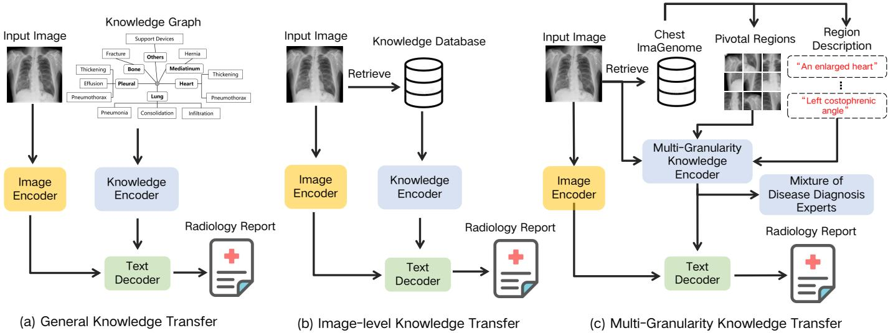
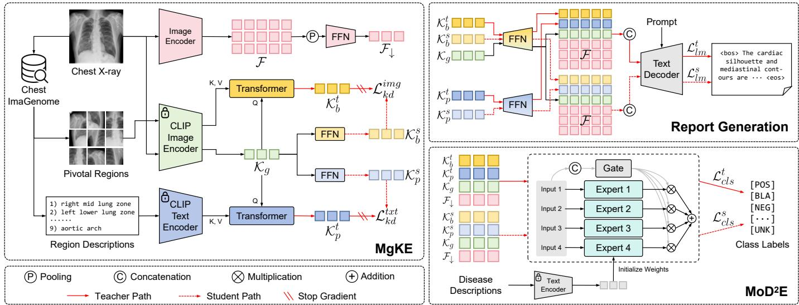
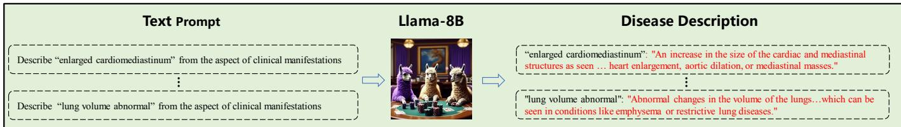
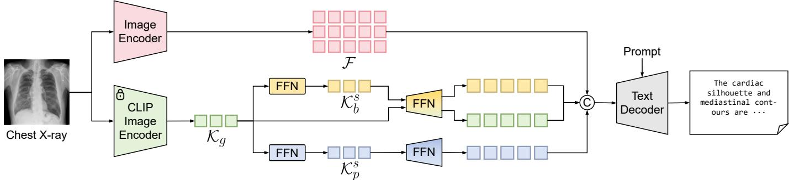
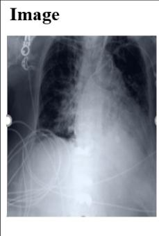

# Efficient Multi-Granularity Knowledge Transfer for Radiology Report Generation

Xubin Zhong, Zheyu Zhang, Wenjian Qin, and Ning Wen

Abstract— Radiology report generation can automatically generate clinical descriptions from X-ray images, thereby significantly improving the efficiency of radiologists. This task is challenging because it requires medical knowledge to accurately identify diseases and describe them in a professional manner. However, existing methods often overlook the importance of enhancing medical knowledge in describing pivotal areas, a capability that requires models to effectively extract and aggregate knowledge at multiple levels of granularity. Accordingly, we herein propose a novel and compact Efficient Multi-Granularity Knowledge Transfer (EMGKT) method to address the above issues. First, we encode global knowledge embeddings using a medical vision-language model, which provides contextual medical knowledge. Moreover, we devise a novel Fine-Grained Knowledge Distillation (FGKD) training task which efficiently extract fine-grained knowledge. Specifically, the FGKD training task contains teacher embeddings and student embeddings. Teacher embeddings are encoded using extra priors; while student embeddings are learned from the teacher embeddings through knowledge distillation. During inference, the student embeddings are used to enhance fine-grained knowledge while the teacher embeddings are discarded, resulting in negligible computational costs and no need for extra priors. Finally, we further develop a mixture of disease diagnosis expert classifiers to enhance knowledge extraction. The classifiers are initialized using disease embeddings and are modeled as different experts to address various granularity features. Notably, EMGKT can be efficiently applied to most existing methods. Extensive experiments are conducted on two widely-used public datasets and various baselines, which demonstrates the effectiveness and transferability of EMGKT.

Index Terms— Multiple granularity, Knowledge distillation, Mixture of experts, Radiology report generation

## I. INTRODUCTION

Radiology report generation can automatically produce clinical sentences from X-ray images, thereby significantly enhancing the efficiency of radiologists. Compared to image captioning [31]–[33] in natural scenes, radiology report generation is more challenging because it requires medical knowledge to accurately identify diseases and describe them in a professional manner. In order to leverage medical knowledge, existing methods [22], [30], [34], [35], [37] have proposed different knowledge transfer approaches. For example, as shown in Fig.1(a), existing methods [30], [34] typically construct knowledge graph and incorporate general medical expertise to enhance report generation. Moreover, some approaches [22], [35], [37] enhance the integration of image-level knowledge by utilizing retrieved expert reports from databases based on the input image.

However, these methods [22], [30], [34], [35], [37] often overlook the critical role of medical knowledge in accurately capturing and describing pivotal organ and lesion areas, which are essential for generating precise radiology reports. This poses a challenge because the varying size scales of discriminative regions require models to possess the capability to extract and aggregate knowledge embeddings at multiple levels of granularity. There have been recent attempts [2], [36], [44] to employ a detection framework to select and fuse region feature. This approach increases the model complexity and decrease the efficiency of knowledge transfer.

Accordingly, as shown in Fig.1(c), we herein propose a novel and compact Multi-Granularity Expert Knowledge Transfer method to encode and aggregate knowledge embeddings at multiple levels of granularity. First, we encode global knowledge embeddings using a pre-trained medical CLIP model [23], which provides contextual medical knowledge. Moreover, we devise a novel Fine-Grained Knowledge Distillation (FGKD) training task which efficiently extract fine-grained knowledge. Specifically, the FGKD training task contains two types of embeddings: teacher embeddings and student embeddings. Teacher embeddings are encoded by leveraging supplementary region bounding box and phrase description priors derived from Chest ImaGenome [24] or large foundation models [52]. Student embeddings are subsequently learned from the teacher embeddings through the process of knowledge distillation. During inference, the student embeddings are applied to augment fine-grained knowledge, whereas the teacher embeddings are discarded. Therefore, this approach incurs negligible computational costs and eliminates the need for additional priors. Finally, to further enhance multigranularity knowledge transfer, we propose a novel classifier, namely Mixture of Disease Diagnosis Experts, which is built upon detailed text description of disease symptoms and the Mixture of Experts (MoE) approach [25]. In summary, the contributions of this paper are as follows:

  
Fig. 1. Comparison of knowledge transfer approaches in radiology report generation. Existing methods achieve knowledge transfer through two primary approaches: (a) general knowledge transfer, which leverages symptom statistics to construct knowledge graph, and (b) image-level knowledge transfer, which utilizes retrieved reports from knowledge database. (c) We propose a methodology that employs extra priors [24] to parse images and identify discriminative regions during training. This approach efficiently integrates global image context along with knowledge extracted from these critical areas by leveraging a multi-granularity knowledge encoder coupled with a mixture of disease diagnosis expert module.

• To the best of our knowledge, EMGKT is the first multigranularity knowledge transfer approach for radiology report generation, in which a novel fine-grained knowledge distillation training task is devised to achieve fine-grained knowledge encoding.

• We propose a mixture of disease diagnosis experts classifier to promote knowledge transfer, which is built upon detailed text description of disease symptoms and the MoE approach.

• Our EMGKT is compact and orthogonal to other radiology report generation networks. Experimental results show that EMGKT can be efficiently applied to various baselines and significantly improve report generation performance.

## II. RELATED WORK

## A. Image Caption Generation

Image caption generation [7]–[9] has garnered significant attention within the field of computer vision. It offers crucial support for comprehending and interpreting the real world by automatically generating descriptive captions for images [7]– [10]. For example, Xu et al. [11] presented an attention-based model capable of autonomously directing its focus on salient objects within images and generating descriptive content. Moreover, the applications of vision-language models [12] have further promoted the development of image caption generation. For instance, Li et al. [9] proposed to advance the general understanding of multi-modal data by pre-training a BLIP model on a vast corpus of image-text pairs. This approach enhances the model’s ability to integrate and interpret information across visual and textual domains, consequently elevating the performance of image caption generation.

## B. Radiology Report Generation

Compared to image caption generation, radiology report generation is a less explored area, primarily due to its inherent complexities [1]–[3], [5], [6], [35], [36]. In response to these distinct challenges, existing approaches for radiology report generation [1]–[3], [5], [6], [35], [36] can be classified into three categories. The first class of methods typically aims to address the misalignment issue between the medical vision and text modalities. For instance, Chen et al. [6] developed a shared memory framework designed to document the correspondence between image and text data, thereby enhancing cross-modal interaction and generation capabilities. Hou et al. [3] proposed to maintain consistency between images and lengthy reports by modeling the semantic structure of reports. While Luo [1] et al. devised pseudo words to eliminate modality differences and construct a unified common feature space for images and texts. Zhou et al. [44] devised a fine-grained visual-text alignment and fusion strategy that ensures consistency across multi-source cross-attention maps for precise alignment.

The second category of methods tend to focus on extracting fine-grained features for important region description. For example, Tim et al. [2] directly extracted local visual features of anatomical regions based on off-the-shelf detection frameworks [41]. Moreover, Chen et al. [36] proposed an adaptive detection framework to obtain anomalous regions. However, the implementation of these detection frameworks tends to escalate model complexity and ignore the efficiency of knowledge transfer processes. Accordingly, we herein introduce a novel knowledge distillation training task to achieve efficient encoding of fine-grained knowledge. The third class of methods typically incorporate prior medical knowledge to generate clinical sentences [34], [35]. For example, Huang et al. [34] proposed to incorporate clinical knowledge by construct symptom graphs during the decoding stage. Jin et al. [22] proposed to integrate disease diagnosis knowledge by converting the diagnostic results into token prompts that explicitly direct the generation process. While Bu et al. [35] built image-level expert knowledge for each disease, providing expert insights during the decoding process. However, these methods overlook the significance of incorporating multigranularity knowledge in the generation of medical reports. Accordingly, we herein propose a novel method that enables exisiting methods to efficiently learn and aggreate multigranularity knowledge. In the experimentation section, we further demonstrate that our approach can be applied to various radiology report generation methods.

  
Fig. 2. Overview of our method EMGKT during training phrase. Multi-granularity Knowledge Encoder (MgKE) efficiently encodes and integrate multi-granularity knowledge embeddings, which includes a novel fine-grained knowledge distillation approach. Mixture of Disease Diagnosis Experts $( \mathsf { M o D } ^ { \dag } \mathsf { E } )$ further enhances disease knowledge by initializing classifiers using text embeddings of detailed disease descriptions; and subsequently fuses classification scores using a mixture of experts approach.

## C. Knowledge Distillation

Knowledge distillation (KD) [45] is a widely adopted technique for transferring knowledge from a large, well-trained teacher model to a lightweight student model, thereby improving the student’s performance without incurring additional inference cost. Existing KD approaches can be broadly divided into three categories. The first category, response-based distillation [45], [50], encourages the student to mimic the teacher’s output logits or soft predictions. For instance, Hinton et al. [45] introduced the concept of “soft targets” to convey the teacher’s dark knowledge, while Zhao et al. [50] decoupled the classical KD loss into target-class and non-target-class components to improve distillation efficiency. The second category, featurebased distillation [46], [47], instead aligns the intermediate feature representations between the teacher and student networks. Romero et al. [46] proposed FitNets to guide the student using the teacher’s hidden layer activations, and Heo et al. [47] further introduced margin-based activation transfer to preserve more informative features. The third category, relation-based distillation [48], [49], focuses on transferring structural knowledge, such as the relationships or similarities among multiple samples or feature dimensions, rather than the individual outputs. Park et al. [48] proposed relational knowledge distillation to capture mutual relations of data examples, while Tung et al. [49] preserved pairwise activation similarities across the teacher and student networks. However, these methods are typically designed for generic classification or recognition tasks and overlook the fine-grained, regionlevel knowledge that is essential for medical imaging, where subtle anatomical and pathological details often determine diagnostic accuracy. Accordingly, we herein propose a finegrained knowledge distillation approach tailored to radiology report generation, which efficiently transfers multi-granularity knowledge to guide the encoding of both global and local disease-related representations.

## III. METHOD

EMGKT can be efficiently applied to existing radiology report generation methods [6], [22]. In this section, we take one representative work PromptMRG [22] as an example. As illustrated in Fig.2, our baseline framework comprises two main stages: feature encoding and report generation. During the encoding stage, each input image I is processed by an image encoder [13] and subsequently transformed into image features $\mathcal { F } \in \mathbb { R } ^ { B \times L \times D }$ , where B is the batch size, L is the number of the processed patches and D is the dimension. In the report generation stage, image features F and the text embeddings $\mathcal { T } _ { n - 1 }$ of previously generated word $\mathcal { W } _ { n - 1 }$ are fed into the text decoder [14], which then produces the log probability $\mathcal { P } _ { n }$ of the next word.

  
Fig. 3. Illustration of disease description generation using LLM.

$$
\mathcal { P } _ { n } = f _ { d } ( \mathcal { F } , \mathcal { T } _ { n - 1 } ) , \quad \mathcal { F } = f _ { i } ( \mathcal { T } ) , \quad \mathrm { a n d } \quad \mathcal { T } _ { n - 1 } = f _ { t } ( \mathcal { W } _ { n - 1 } ) ,\tag{1}
$$

where $f _ { d } , \ f _ { i }$ , and $f _ { t }$ denote text decoder, image encoder, and text encoder, respectively. Finally, the n-th word can be predicted after applying the softmax function to $\mathcal { P } _ { n }$ , as formulated below:

$$
\mathcal { W } _ { n } = \operatorname { s o f t m a x } ( \mathcal { P } _ { n } ) .\tag{2}
$$

As shown in Fig.2, EMGKT consists of two main modules, namely, Multi-granularity Knowledge Encoder (MgKE) (in Section III-A) and Mixture of Disease Diagnosis Experts (MoD2E) (in Section III-B).

## A. Multi-Granularity Knowledge Encoder

Precise descriptions of pivotal regions are essential for radiology reports. In order to capture different sizes of pivotal regions and promote precise region descriptions, we propose a novel Multi-granularity Knowledge Encoder (MgKE) module. MgKE constructs and integrates two types of knowledge embeddings: global $\kappa _ { g }$ and fine-grained region $\boldsymbol { \mathcal { K } } _ { f }$ ; each type of embeddings represents one granularity-specific, which are extracted from a medical CLIP model [23].

Global Knowledge Embedding. As shown in Fig.2, given a X-ray Image $\mathcal { T } \in \mathbb { R } ^ { H \times W \times 3 }$ , we extract global knowledge embedding $\kappa _ { g }$ using a medical CLIP image encoder [23]. The CLIP model is pre-trained using image-report pairs, thereby providing medical context knowledge. This process can be represented as:

$$
\begin{array} { r } { \mathcal { K } _ { g } = f _ { c } ( \mathcal { T } ) , } \end{array}\tag{3}
$$

where $f _ { c }$ denotes the CLIP image encoder.

Fine-Grained Knowledge Embedding. The encoding of finegrained knowledge often necessitates comprehensive priors [24], [52], posing challenges to the efficient extraction of fine-grained knowledge embeddings. To address this issue, we devise a knowledge distillation task that introduces negligible computation during inference.

First, as shown in Fig.2, for each image I, we obtain a set of region priors of bounding boxes $B \bar { = } \{ b _ { i } \} _ { i = 1 } ^ { M }$ and text descriptions $\bar { P } = \{ p _ { i } \} _ { i = 1 } ^ { M }$ from Chest ImaGenome [24]. These priors can also be obtained using large foundation models following [44]. Subsequently, we utilize $B = \{ b _ { i } \} _ { i = 1 } ^ { M }$ 1 and $P = \{ p _ { i } \} _ { i = 1 } ^ { M }$ to extract teacher knowledge embeddings, which can be formulated as follows:

$$
\begin{array} { r } { \mathcal { K } _ { b } ^ { t } = \Phi _ { b } ( f _ { c } ( \mathcal { T } , B ) ) \quad \mathrm { a n d } \quad \mathcal { K } _ { p } ^ { t } = \Phi _ { p } ( f _ { p } ( P ) ) , } \end{array}\tag{4}
$$

where $\mathcal { K } _ { b } ^ { t }$ and ${ \mathcal { K } } _ { p } ^ { t }$ denotes teacher vision embeddings and teacher text embeddings, respectively; while $\Phi _ { b } ( \cdot )$ and $\Phi _ { p } ( \cdot )$ represent transformer attention modules [15] and $f _ { p } ( \cdot )$ denotes the CLIP text encoder.

Subsequently, we construct a teacher feature stream by augmenting image feature $\mathcal { F }$ with these teacher embeddings as following:

$$
\mathcal { P } _ { n } ^ { t } = f _ { d } ( \mathcal { F } ^ { t } , \mathcal { T } _ { n - 1 } ) ,\tag{5}
$$

$$
\mathcal { F } ^ { t } = C o n c a t ( \mathcal { F } , F F N ( \mathcal { K } _ { g } ) , F F N ( \mathcal { K } _ { b } ^ { t } ) , F F N ( \mathcal { K } _ { p } ^ { t } ) ) ,\tag{6}
$$

where Concat(·) represents feature concatenation and $F F N ( \cdot )$ denotes feed-forward network [15] to align the dimensions of knowledge embeddings and image features. As the teacher embeddings $\mathcal { K } _ { b } ^ { t }$ and ${ \mathcal { K } } _ { p } ^ { t }$ are obtained using extra labels which increases the computation cost during inference, we creatively propose to extract fine-grained knowledge $\boldsymbol { \mathcal { K } } _ { f }$ from global knowledge $\kappa _ { g }$ using $\mathcal { K } _ { b } ^ { t }$ and ${ \mathcal { K } } _ { p } ^ { t }$ as distillation supervision signal:

$$
\begin{array} { r } { \mathcal { K } _ { b } ^ { s } = F F N ( \mathcal { K } _ { g } ) \quad \mathrm { a n d } \quad \mathcal { K } _ { p } ^ { s } = F F N ( \mathcal { K } _ { g } ) } \end{array}\tag{7}
$$

$$
\mathcal { L } _ { k d } = | | \mathcal { K } _ { b } ^ { s } - s g ( \mathcal { K } _ { b } ^ { t } ) | | ^ { 2 } + | | \mathcal { K } _ { p } ^ { s } - s g ( \mathcal { K } _ { p } ^ { t } ) | | ^ { 2 } ,\tag{8}
$$

where $| | \cdot | | ^ { 2 }$ represents $L _ { 2 }$ loss function; sg(·) stands for the stop-gradient operator.

Finally, we use the student feature stream for report generation as follows:

$$
\mathcal { P } _ { n } ^ { s } = f _ { d } ( \mathcal { F } ^ { s } , \mathcal { T } _ { n - 1 } ) ,\tag{9}
$$

$$
\mathcal { F } ^ { s } = C o n c a t ( \mathcal { F } , F F N ( \mathcal { K } _ { g } ) , F F N ( \mathcal { K } _ { b } ^ { s } ) , F F N ( \mathcal { K } _ { p } ^ { s } ) ) .\tag{10}
$$

Notably, the teacher embeddings and student embeddings are trained using the same loss functions (see details in Section III-C). Excluding the parameters of the CLIP image encoder, all other parameters are iteratively updated using the overall loss functions. Moreover, teacher embedding $\mathcal { K } _ { b } ^ { t }$ and ${ \mathcal { K } } _ { p } ^ { t }$ are only constructed for training while abandoned during inference. We present the overall framework of our method during inference stage in Fig. 4.

## B. Mixture of Disease Diagnosis Experts

Disease classification is typically used as an auxiliary task for improving the diagnostic accuracy of radiology report generation [6], [16], [22]. Existing methods typically construct disease classifiers that are randomly initialized and optimized using image-based labels. However, compared to common object classification [26], [27], disease identification pays more attention to the complexity and professionalism of the medical field, requiring medical expert knowledge [16], [22], [28].

To address the above issues, we introduce a novel classifier,termed as Mixture of Disease Diagnosis Experts classifier $( \mathbf { M o D ^ { 2 } E } )$ , designed to enhance the extraction of multigranularity knowledge. As shown in Fig. 3, we firstly devise medical prompts to generate detailed description from a large language model [29] for each disease. As illustrated in Fig.2, the disease descriptions are encoded into text embeddings which are then used to initialize disease classifiers [43]. Moreover, we model different classifiers as distinct diagnosis experts for varying granularity and modality features, and fuse their classification scores using the MoE approach [25]. This process can be expressed as:

$$
\mathcal { C } = \sum _ { i = 1 } ^ { M } \mathcal { G } _ { i } ( \mathbf { x } ; \boldsymbol { \Theta } _ { i } ) f _ { i } \left( \mathbf { x } _ { i } ; \mathbf { W } _ { i } \right) ,\tag{11}
$$

$$
\mathcal { G } _ { i } ( \mathbf { x } ; \Theta _ { i } ) = \mathrm { s o f t m a x } ( g ( \mathbf { x } ; \Theta _ { i } ) ) ,\tag{12}
$$

$$
x _ { i } \in \{ \mathcal { F } _ { \downarrow } , \mathcal { K } _ { g } , \mathcal { K } _ { b } , \mathcal { K } _ { p } \} , \mathrm { a n d } \quad \mathcal { F } _ { \downarrow } = F F N ( A v g ( \mathcal { F } ) )\tag{13}
$$

where $g ( \mathbf { x } ; \mathbf { \Theta } \Theta _ { i } )$ and $f _ { i } \left( \mathbf { x } _ { i } ; \mathbf { W } _ { i } \right)$ represent weight assignment and disease classification functions [25], respectively. $A v g ( \cdot )$ denotes the average pooling operation. Accordingly, the disease classification loss for the teacher embeddings scores $\mathcal { C } ^ { t }$ can be denoted as follows:

$$
\mathcal { C } ^ { t } = \sum _ { i = 1 } ^ { M } \mathcal { G } _ { i } ( \mathcal { F } _ { \downarrow } , \mathcal { K } _ { g } , \mathcal { K } _ { b } ^ { t } , \mathcal { K } _ { p } ^ { t } ; \Theta _ { i } ) f _ { i } \left( \mathbf { x } _ { i } ; \mathbf { W } _ { i } \right) ,\tag{14}
$$

While the disease classification scores for the student embeddings stream $\mathcal { C } ^ { s }$ can be represented as follows:

$$
\mathcal { C } ^ { s } = \sum _ { i = 1 } ^ { M } \mathcal { G } _ { i } ( \mathcal { F } _ { \downarrow } , \mathcal { K } _ { g } , \mathcal { K } _ { b } ^ { s } , \mathcal { K } _ { p } ^ { s } ; \Theta _ { i } ) f _ { i } \left( \mathbf { x } _ { i } ; \mathbf { W } _ { i } \right) ,\tag{15}
$$

## C. Training Objective

Following previous works [6], [16], [22], we utilize language modeling loss $\mathcal { L } _ { l m }$ to optimize the report generation task. The formulation of $\mathcal { L } _ { l m }$ is represented as follows:

$$
\mathcal { L } _ { l m } = \mathcal { L } _ { l m } ^ { t } + \mathcal { L } _ { l m } ^ { s } ,\tag{16}
$$

$$
\mathcal { L } _ { l m } ^ { t } = - \sum _ { n = 1 } ^ { N } \log p \left( T _ { n } \mid T _ { 1 } , \ldots , T _ { n - 1 } , \mathcal { F } , \mathcal { K } _ { g } , \mathcal { K } _ { b } ^ { t } , \mathcal { K } _ { p } ^ { t } \right) .\tag{17}
$$

$$
\mathcal { L } _ { l m } ^ { s } = - \sum _ { n = 1 } ^ { N } \log p \left( T _ { n } \mid T _ { 1 } , \ldots , T _ { n - 1 } , \mathcal { F } , \mathcal { K } _ { g } , \mathcal { K } _ { b } ^ { s } , \mathcal { K } _ { p } ^ { s } \right) ,\tag{18}
$$

where $\mathcal { L } _ { l m } ^ { t }$ and $\mathcal { L } _ { l m } ^ { s }$ denotes language modeling loss for feature streams of teacher and student knowledge embeddings, respectively.

Moreover, we employ Cross-Entropy loss $\mathcal { L } _ { c e }$ to supervise the disease classification task, which can be denoted as follows:

$$
\mathcal { L } _ { c l s } = \mathcal { L } _ { c e } ( \mathcal { C } ^ { t } , \hat { \mathcal { C } } ) + \mathcal { L } _ { c e } ( \mathcal { C } ^ { s } , \hat { \mathcal { C } } ) ,\tag{19}
$$

where $\mathcal { C } ^ { t }$ and $\mathcal { C } ^ { s }$ represent the predicted disease logit probabilities for feature streams of teacher and student knowledge embeddings, respectively; while $\hat { \mathcal { C } }$ denotes ground-truth disease labels.

Finally, the overall loss function can be formulated as follows:

$$
\mathcal { L } _ { a l l } = \alpha \mathcal { L } _ { l m } + \beta \mathcal { L } _ { c l s } + \gamma \mathcal { L } _ { k d } .\tag{20}
$$

where $\alpha$ is set to 1.0 following that in [22]; while $\gamma$ and $\beta$ are empirically set to 10.0 and 8.0, respectively.

## IV. EXPERIMENT

## A. Dataset and Evaluation Metrics

Dataset. IU $\mathbf { X } { \mathrm { - r a y } } ^ { 1 }$ [17] and MIMIC-CXR2 [18] are the two most popular benchmarks for radiology report generation. IU X-ray is a small dataset, containing 7,470 chest X-ray images and 3,955 corresponding reports; while MIMIC-CXR is a large-scale dataset,including 377,110 images and 227,835 corresponding reports. To ensure consistency and fairness in the comparative analysis, we adopted the data processing methodologies employed by the baseline models [4], [6], [22].

Evaluation Metrics. Following previous works [6], [16], [22], we evaluate our method on natural language generation (NLG) metrics including BLEU [19], METEOR [20] and ROUGE-L [21], which are widely used to assess the fluency and accuracy of generated reports. Moreover, we follow [22] and use the model trained on MIMIC-CXR training set to directly perform the evaluation on the whole set of IU X-Ray. We also employ the CE metrics for disease classifications, including precision, recall, and F1-score. [22].

## B. Experiments Results and Analyses

Comparison with Baselines. To demonstrate the effectiveness and transferability of EMGKT, we evaluate it on three representative baseline models: R2GenCMN [6], PromptMRG [22], and REVTAF-base [44]. Specifically, R2GenCMN [6] and PromptMRG [22] are trained using priors from Chest ImaGenome [24], whereas REVTAF-base [44] is trained using priors derived from large foundation models, following the setting in [44]. We integrate EMGKT into each of these baselines and compare the enhanced models against their original counterparts, with the results summarized in Table I.

It can be observed that EMGKT improves all NLG metrics across the three baselines, indicating that it can effectively integrate multi-granularity knowledge to generate more accurate reports. We further conduct cross-dataset knowledge transfer experiments on the IU X-Ray dataset, where models trained on the MIMIC-CXR training set are directly evaluated on IU X-Ray without any additional fine-tuning. As shown in Table I, even in the absence of region-location or regiondescription annotations for IU X-Ray, EMGKT consistently improves report generation performance by effectively transferring the knowledge learned from MIMIC-CXR. Moreover, as illustrated in Table II, our approach substantially improves the disease classification performance of all baseline models, outperforming several strong existing methods. The overall framework of EMGKT during the inference stage is presented in Fig. 4.

TABLE I  
COMPARISON BETWEEN BASELINES AND THE IMPROVED NETWORK WITH EMGKT. △ DENOTES THE IMPROVEMENTS COMPARED TO THE BASELINES. \* DENOTES OUR RE-IMPLEMENTATION OF BASELINES.
<table><tr><td>Method</td><td colspan="6">NLG Metrics</td></tr><tr><td></td><td>BLEU-1</td><td>BLEU-2</td><td>BLEU-3</td><td>BLEU-4</td><td>METEOR</td><td>ROUGE-L</td></tr><tr><td>Experimental results on MIMIC-CXR dataset.</td><td colspan="6"></td></tr><tr><td>R2GenCMN [6]</td><td>0.344</td><td>0.210</td><td>0.139</td><td>0.098</td><td>0.136</td><td>0.275</td></tr><tr><td>+Ours △</td><td>0.356</td><td>0.219</td><td>0.146</td><td>0.105</td><td>0.139</td><td>0.278</td></tr><tr><td></td><td>0.012</td><td>0.009</td><td>0.007</td><td>0.007</td><td>0.003</td><td>0.003</td></tr><tr><td>PromptMRG* [22] +Ours △</td><td>0.395</td><td>0.236</td><td>0.154</td><td>0.112</td><td>0.154</td><td>0.267</td></tr><tr><td></td><td>0.409</td><td>0.250</td><td>0.166</td><td>0.117</td><td>0.157</td><td>0.273</td></tr><tr><td></td><td>0.014</td><td>0.014</td><td>0.012</td><td>0.005</td><td>0.003</td><td>0.006</td></tr><tr><td>REVTAF-base * [44]</td><td>0.432</td><td>0.283</td><td>0.210</td><td>0.159</td><td>0.177</td><td>0.311</td></tr><tr><td>+Ours</td><td>0.466</td><td>0.319</td><td>0.236</td><td>0.184</td><td>0.198</td><td>0.334</td></tr><tr><td></td><td>0.034</td><td>0.036</td><td>0.026</td><td>0.025</td><td>0.021</td><td>0.023</td></tr><tr><td colspan="7">Experimental Results on IU-XRAY dataset.</td></tr><tr><td>R2GenCMN* [6] +Ours</td><td>0.397</td><td>0.230</td><td>0.138</td><td>0.085</td><td>0.140</td><td>0.281</td></tr><tr><td></td><td>0.405</td><td>0.235</td><td>0.140</td><td>0.088</td><td>0.143</td><td>0.283</td></tr><tr><td>△</td><td>0.008</td><td>0.005</td><td>0.002</td><td>0.003</td><td>0.003</td><td>0.002</td></tr><tr><td>PromptMRG* [22] +Ours △</td><td>0.408</td><td>0.241</td><td>0.152</td><td>0.101</td><td>0.162</td><td>0.310</td></tr><tr><td></td><td>0.428</td><td>0.261</td><td>0.168</td><td>0.113</td><td>0.167</td><td>0.321</td></tr><tr><td></td><td>0.020</td><td>0.020</td><td>0.016</td><td>0.012</td><td>0.005</td><td>0.011</td></tr><tr><td>REVTAF-base * [44]</td><td>0.419</td><td>0.247</td><td>0.157</td><td>0.105</td><td>0.176</td><td>0.313</td></tr><tr><td>+Ours</td><td>0.428</td><td>0.255</td><td>0.164</td><td>0.110</td><td>0.176</td><td>0.313</td></tr><tr><td>△</td><td>0.009</td><td>0.008</td><td>0.007</td><td>0.005</td><td>0</td><td>0</td></tr></table>

  
Fig. 4. Overview of EMGKT during inference phrase.

TABLE II  
THE COMPARISON OF THE CLINICAL EFFICACY METRICS ON MIMIC-CXR DATASET.
<table><tr><td>Method</td><td>Precision</td><td>Recall</td><td>F1-Score</td></tr><tr><td>R2GenCMN [6]</td><td>0.334</td><td>0.275</td><td>0.278</td></tr><tr><td>GSKET [40]</td><td>0.458</td><td>0.348</td><td>0.371</td></tr><tr><td>Clinical-BERT [42]</td><td>0.397</td><td>0.435</td><td>0.415</td></tr><tr><td>KiUT [34]</td><td>0.371</td><td>0.318</td><td>0.321</td></tr><tr><td>DCL [39]</td><td>0.471</td><td>0.352</td><td>0.373</td></tr><tr><td>METransformer [38]</td><td>0.364</td><td>0.309</td><td>0.311</td></tr><tr><td>PromptMRG [22]</td><td>0.501</td><td>0.509</td><td>0.476</td></tr><tr><td>REVTAF-base [44]</td><td>0.612</td><td>0.605</td><td>0.580</td></tr><tr><td>REVTAF [44]</td><td>0.628</td><td>0.613</td><td>0.592</td></tr><tr><td>R2GenCMN [6] + Ours</td><td>0.372</td><td>0.289</td><td>0.306</td></tr><tr><td>PromptMRG [22] + Ours</td><td>0.517</td><td>0.518</td><td>0.488</td></tr><tr><td>REVTAF-base [44] + Ours</td><td>0.633</td><td>0.618</td><td>0.598</td></tr></table>

Comparison with State-of-the-art Methods. To verify the effectiveness of our model, we compare its performance against various state-of-the-art (SOTA) models, including R2Gen [16], M2TR, MKSG [40], M2KT, ME [38], KiUT [34], DCL [39], UAR [51], RGRG [2], PromptMRG [22], EKAGen [35], PriorRG, and REVTAF [44]. Detailed comparison results on the MIMIC-CXR and IU X-Ray datasets are presented in Table III and Table IV, respectively.

For the MIMIC-CXR dataset, as shown in Table III, our proposed method achieves the best performance on BLEU-1 through BLEU-4 as well as all three CE metrics, obtaining absolute improvements of 0.1%, 0.1%, 0.1%, and 0.2% on BLEU-1 to BLEU-4, and 0.5%, 0.5%, and 0.6% on Precision, Recall, and F1, respectively, over the second-best method REVTAF. Notably, REVTAF attains marginally higher ME-TEOR (0.199 vs. 0.198) and ROUGE-L (0.336 vs. 0.334)

TABLE III  
COMPARISON WITH OTHER SOTA METHODS ON THE MIMIC-CXR DATASET. THE BEST RESULTS ARE HIGHLIGHTED IN BOLD.
<table><tr><td rowspan="2">Model</td><td rowspan="2">Year</td><td colspan="5">NLG Metrics</td><td colspan="4">CE Metrics</td><td rowspan="2">Avg</td></tr><tr><td>BLEU-1</td><td>BLEU-2</td><td>BLEU-3</td><td>BLEU-4</td><td>METEOR</td><td>ROUGE</td><td>Precision</td><td>Recall</td><td>F1</td></tr><tr><td>R2Gen</td><td>ACL 2020</td><td>0.353</td><td>0.218</td><td>0.145</td><td>0.103</td><td>0.142</td><td>0.277</td><td>0.333</td><td>0.273</td><td>0.276</td><td>0.236</td></tr><tr><td>M2TR</td><td>ACL 2021</td><td>0.378</td><td>0.232</td><td>0.154</td><td>0.107</td><td>0.145</td><td>0.272</td><td>0.240</td><td>0.428</td><td>0.308</td><td>0.252</td></tr><tr><td>MKSG</td><td>MIA 2022</td><td>0.363</td><td>0.228</td><td>0.156</td><td>0.115</td><td></td><td>0.284</td><td>0.458</td><td>0.348</td><td>0.371</td><td></td></tr><tr><td>M2KT</td><td>MIA 2023</td><td>0.386</td><td>0.237</td><td>0.157</td><td>0.111</td><td></td><td>0.274</td><td>0.420</td><td>0.339</td><td>0.352</td><td></td></tr><tr><td>ME</td><td>CVPR 2023</td><td>0.386</td><td>0.250</td><td>0.169</td><td>0.124</td><td>0.152</td><td>0.291</td><td>0.364</td><td>0.309</td><td>0.311</td><td>0.262</td></tr><tr><td>KiUT</td><td>CVPR 2023</td><td>0.393</td><td>0.243</td><td>0.159</td><td>0.113</td><td>0.160</td><td>0.285</td><td>0.371</td><td>0.318</td><td>0.321</td><td>0.263</td></tr><tr><td>DCL</td><td>CVPR 2023</td><td></td><td></td><td></td><td>0.109</td><td>0.150</td><td>0.284</td><td>0.471</td><td>0.352</td><td>0.373</td><td></td></tr><tr><td>UAR</td><td>ICCV 2023</td><td>0.363</td><td>0.229</td><td>0.158</td><td>0.107</td><td>0.157</td><td>0.289</td><td></td><td></td><td></td><td></td></tr><tr><td>RGRG</td><td>CVPR 2023</td><td>0.373</td><td>0.249</td><td>0.175</td><td>0.126</td><td>0.168</td><td>0.264</td><td>0.461</td><td>0.475</td><td>0.447</td><td>0.304</td></tr><tr><td>PromptMRG</td><td>AAAI 2024</td><td>0.398</td><td>0.239</td><td>0.156</td><td>0.112</td><td>0.157</td><td>0.268</td><td>0.501</td><td>0.509</td><td>0.476</td><td>0.313</td></tr><tr><td>EKAĠen</td><td>CVPR 2024</td><td>0.419</td><td>0.258</td><td>0.170</td><td>0.119</td><td>0.157</td><td>0.287</td><td>0.517</td><td>0.483</td><td>0.499</td><td>0.323</td></tr><tr><td>PriorRG</td><td>AAAI 2026</td><td>0.412</td><td>0.290</td><td>0.220</td><td>0.175</td><td>0.189</td><td>0.324</td><td>0.541</td><td>0.485</td><td>0.511</td><td></td></tr><tr><td>REVTAF</td><td>ICCV 2025</td><td>0.465</td><td>0.318</td><td>0.235</td><td>0.182</td><td>0.199</td><td>0.336</td><td>0.628</td><td>0.613</td><td>0.592</td><td>0.397</td></tr><tr><td>Ours</td><td></td><td>0.466</td><td>0.319</td><td>0.236</td><td>0.184</td><td>0.198</td><td>0.334</td><td>0.633</td><td>0.618</td><td>0.598</td><td>0.398</td></tr></table>

TABLE IV  
COMPARING THE PERFORMANCE OF OUR MODEL WITH OTHER SOTA METHODS ON THE IU X-RAY DATASET.
<table><tr><td rowspan="2">Model</td><td rowspan="2">Year</td><td colspan="6">NLG Metrics</td><td colspan="3">CE Metrics</td><td rowspan="2">Avg</td></tr><tr><td>BLEU-1</td><td>BLEU-2</td><td>BLEU-3</td><td>BLEU-4</td><td>METEOR</td><td>ROUGE</td><td>Precision</td><td>Recall</td><td>F1</td></tr><tr><td>R2Gen</td><td>ACL 2020</td><td>0.289</td><td>0.155</td><td>0.087</td><td>0.052</td><td>0.128</td><td>0.243</td><td>0.151</td><td>0.145</td><td>0.145</td><td>0.155</td></tr><tr><td>M2KT</td><td>MIA 2023</td><td>0.371</td><td>0.239</td><td>0.151</td><td>0.078</td><td>0.153</td><td>0.261</td><td>0.153</td><td>0.145</td><td>0.145</td><td>0.188</td></tr><tr><td>DCL</td><td>CVPR 2023</td><td>0.354</td><td>0.230</td><td>0.148</td><td>0.074</td><td>0.152</td><td>0.267</td><td>0.168</td><td>0.167</td><td>0.162</td><td>0.191</td></tr><tr><td>RGRG</td><td>CVPR 2023</td><td>0.266</td><td>0.215</td><td>0.147</td><td>0.063</td><td>0.146</td><td>0.180</td><td>0.183</td><td>0.187</td><td>0.180</td><td>0.174</td></tr><tr><td>CVT2Dis.</td><td>Artif.Intell.Med 2022</td><td>0.383</td><td>0.236</td><td>0.157</td><td>0.082</td><td>0.147</td><td>0.277</td><td>0.174</td><td>0.172</td><td>0.168</td><td>0.200</td></tr><tr><td>PromptMRG</td><td>AAAI 2024</td><td>0.401</td><td>0.247</td><td>0.160</td><td>0.098</td><td>0.160</td><td>0.281</td><td>0.213</td><td>0.229</td><td>0.211</td><td>0.222</td></tr><tr><td>REVTAF</td><td>ICCV 2025</td><td>0.420</td><td>0.249</td><td>0.159</td><td>0.107</td><td>0.176</td><td>0.309</td><td>0.286</td><td>0.282</td><td>0.273</td><td>0.251</td></tr><tr><td>Ours</td><td></td><td>0.428</td><td>0.255</td><td>0.164</td><td>0.110</td><td>0.176</td><td>0.313</td><td>0.303</td><td>0.302</td><td>0.293</td><td>0.260</td></tr></table>

TABLE V  
ABLATION EXPERIMENTS OF EFFICIENT MULTI-GRANULARITY KNOWLEDGE TRANSFER.
<table><tr><td>Multi-Granularity Knowledge Encoder</td><td>Mixture of Disease Diagnosis Experts</td><td>BLEU-1</td><td>BLEU-2</td><td>BLEU-3</td><td>BLEU-4</td><td>METEOR</td><td>ROUGE-L</td><td>Inference ms/img</td></tr><tr><td></td><td></td><td>0.395</td><td>0.236</td><td>0.154</td><td>0.112</td><td>0.154</td><td>0.267</td><td>124</td></tr><tr><td>√</td><td></td><td>0.405</td><td>0.246</td><td>0.162</td><td>0.114</td><td>0.154</td><td>0.272</td><td>137</td></tr><tr><td>√</td><td>√</td><td>0.409</td><td>0.250</td><td>0.166</td><td>0.117</td><td>0.157</td><td>0.273</td><td>137</td></tr></table>

TABLE VI  
ABLATION EXPERIMENTS ON THE STRUCTURE OF MULTI-GRANULARITY KNOWLEDGE ENCODER.
<table><tr><td>Global Embeddings</td><td>Fine-Grained Vision Embeddings</td><td>Fine-Grained Text Embeddings</td><td>BLEU-1</td><td>BLEU-2</td><td>BLEU-3</td><td>BLEU-4</td><td>METEOR</td><td>ROUGE-L</td></tr><tr><td></td><td></td><td></td><td>0.395</td><td>0.236</td><td>0.154</td><td>0.112</td><td>0.154</td><td>0.267</td></tr><tr><td>√</td><td></td><td></td><td>0.401</td><td>0.243</td><td>0.160</td><td>0.112</td><td>0.156</td><td>0.271</td></tr><tr><td>V</td><td>√</td><td></td><td>0.406</td><td>0.247</td><td>0.162</td><td>0.114</td><td>0.154</td><td>0.272</td></tr><tr><td>V</td><td>√</td><td>√</td><td>0.409</td><td>0.250</td><td>0.166</td><td>0.117</td><td>0.157</td><td>0.273</td></tr></table>

scores, indicating that the two methods remain highly competitive on these two metrics. Overall, our method achieves the highest average score of 0.398 across all evaluation metrics, marginally surpassing REVTAF (0.397) by 0.1%.

For the IU X-Ray dataset, we follow PromptMRG [22] to evaluate on the entire dataset using models pre-trained on MIMIC-CXR. As illustrated in Table IV, our method consistently achieves the best performance across all NLG metrics except METEOR, on which it ties with REVTAF at 0.176, and further attains the highest performance on all CE metrics, surpassing the second-best REVTAF by 1.7%, 2.0%, and 2.0% on Precision, Recall, and F1, respectively. Overall, our model achieves the highest average score of 0.260, outperforming REVTAF (0.251) by 0.9%. These results demonstrate that EMGKT consistently improves both report generation quality and diagnostic accuracy across the two benchmarks, with a more pronounced advantage in the crossdataset transfer setting on IU X-Ray, where CE metrics benefit substantially from the multi-granularity knowledge learned on MIMIC-CXR.

Ablation Study. To verify the effectiveness of each component of EMGKT, we conducted various ablation experiments using PromptMRG [22] as baseline model on MIMIC-CXR test set. Experiment results are presented in Table V−VII.

First, as shown in Table V, equipped with $\mathrm { M g K E } ,$ , the performance of the baseline is notably improved by 1.0% in terms of BLEU-1 metric. Furthermore, when $\mathbf { M o D ^ { 2 } E }$ is integrated, the performance of the baseline improves by 0.50% in terms of the BLEU-1 metric. When both $\mathbf { M g K E }$ and $\mathbf { M o D ^ { 2 } E }$ are employed, the performance of the baseline is consistently enhanced by 1.40% in terms of the BLEU-1 metric. It can also be observed both MgKE and $\mathbf { M o D ^ { 2 } E }$ introduce negligible computational overhead during inference, highlighting the knowledge transfer efficiency of EMGKT.

Secondly, we conducted experiments to demonstrate the architecture of MgKE, as illustrated in Table VI. Upon integrating global knowledge embeddings $( { \boldsymbol { \cal { K } } } _ { g }$ in $\operatorname { E q . } ( 3 ) )$ , the baseline performance across all report generation metrics is enhanced. Moreover, the incorporation of both fine-grained visual and textual embeddings further improves these metrics. report generation metrics.

Finally, we conduct ablation studies to verify the structure of $\mathrm { { \bf M o D ^ { 2 } E } } .$ , as shown in Table VII. The CLIP embeddings are encoded using detailed disease descriptions, aiming to promote the disease knowledge extraction. It can be observed that this technique effectively improves report generation metrics. Furthermore, the MoE approach can further improve all the report generation metrics.

## V. QUALITATIVE ANALYSIS

As shown in Fig.5, the baseline model exhibits suboptimal performance, primarily due to the incorrect identification and presentation of important regions. In contrast, our EMGKT significantly improves report generation by precisely pinpointing pivotal regions and refining the corresponding descriptions in the baseline model.

## VI. CONCLUSION

In this paper, we propose a novel Efficient Multi-Granularity Knowledge Transfer (EMGKT) approach for radiology report generation. EMGKT consists two main components, namely, Multi-granularity Knowledge Encoder (MgKE) and Mixture of Disease Diagnosis Experts $( \mathrm { { M o D ^ { 2 } E } ) }$ . MgKE extracts multigranularity knowledge embeddings based on the CLIP model and a novel knowledge distillation task. While $\mathbf { M o D ^ { 2 } E }$ further promotes knowledge extraction by using text embeddings as the initialization parameters of classifiers and employing the MoE approach to handle different granularity features. Finally, extensive experiments are conducted to demonstrate the effectiveness and transferability of EMGKT on two widely-used benchmarks and various baselines.

## REFERENCES

[1] Y. Luo et al., “Textual inversion and self-supervised refinement for radiology report generation,” in Proc. Int. Conf. Med. Image Comput Comput.-Assist. Intervent., 2024, pp. 681–691.

[2] T. Tanida, P. Muller, G. Kaissis, and D. Rueckert, “Interactive and ex-¨ plainable region-guided radiology report generation,” in Proc. IEEE/CVF Conf. Comput. Vis. Pattern Recognit., 2023, pp. 7433–7442.

[3] W. Hou, K. Xu, Y. Cheng, W. Li, and J. Liu, “ORGAN: Observationguided radiology report generation via tree reasoning,” arXiv preprint arXiv:2306.06466, 2023.

[4] W. Chen et al., “Visual-linguistic causal intervention for radiology report generation,” arXiv preprint arXiv:2303.09117, 2023.

[5] M. Li et al., “Dynamic graph enhanced contrastive learning for chest X-ray report generation,” in Proc. IEEE/CVF Conf. Comput. Vis. Pattern Recognit., 2023, pp. 3334–3343.

[6] Z. Chen, Y. Shen, Y. Song, and X. Wan, “Cross-modal memory networks for radiology report generation,” arXiv preprint arXiv:2204.13258, 2022.

[7] J. Johnson, A. Karpathy, and L. Fei-Fei, “DenseCap: Fully convolutional localization networks for dense captioning,” in Proc. IEEE Conf. Comput. Vis. Pattern Recognit., 2016, pp. 4565–4574.

[8] P. Wang et al., “OFA: Unifying architectures, tasks, and modalities through a simple sequence-to-sequence learning framework,” in Proc. Int. Conf. Mach. Learn., 2022, pp. 23318–23340.

[9] J. Li, D. Li, S. Savarese, and S. Hoi, “BLIP-2: Bootstrapping languageimage pre-training with frozen image encoders and large language models,” in Proc. Int. Conf. Mach. Learn., 2023, pp. 19730–19742.

[10] Z. Yang, Y. Yuan, Y. Wu, W. W. Cohen, and R. R. Salakhutdinov, “Review networks for caption generation,” in Adv. Neural Inf. Process. Syst., 2016, pp. 1–9.

[11] K. Xu et al., “Show, attend and tell: Neural image caption generation with visual attention,” in Proc. Int. Conf. Mach. Learn., 2015, pp. 2048– 2057.

[12] F. Chen et al., “VLP: A survey on vision-language pre-training,” Mach. Intell. Res., no. 1, pp. 38–56, 2023.

[13] K. He, X. Zhang, S. Ren, and J. Sun, “Deep residual learning for image recognition,” in Proc. IEEE Conf. Comput. Vis. Pattern Recognit., 2016, pp. 770–778.

[14] J. Chung, C. Gulcehre, K. Cho, and Y. Bengio, “Empirical evaluation of gated recurrent neural networks on sequence modeling,” arXiv preprint arXiv:1412.3555, 2014.

[15] A. Vaswani et al., “Attention is all you need,” in Adv. Neural Inf. Process. Syst., 2017, pp. 1–11.

[16] Z. Chen, Y. Song, T. Chang, and X. Wan, “Generating radiology reports via memory-driven transformer,” arXiv preprint arXiv:2010.16056, 2020.

[17] D. Demner-Fushman et al., “Preparing a collection of radiology examinations for distribution and retrieval,” J. Amer. Med. Inform. Assoc., no. 2, pp. 304–310, 2016.

[18] A. E. Johnson et al., “MIMIC-CXR-JPG, a large publicly available database of labeled chest radiographs,” arXiv preprint arXiv:1901.07042, 2019.

[19] K. Papineni, S. Roukos, T. Ward, and W. Zhu, “BLEU: A method for automatic evaluation of machine translation,” in Proc. 40th Annu. Meeting Assoc. Comput. Linguistics, 2002, pp. 311–318.

[20] S. Banerjee and A. Lavie, “METEOR: An automatic metric for MT evaluation with improved correlation with human judgments,” in Proc. ACL Workshop Intrinsic Extrins. Eval. Measures Mach. Transl. Summarization, 2005, pp. 65–72.

[21] C. Lin, “ROUGE: A package for automatic evaluation of summaries,” in Proc. Text Summarization Branches Out, 2004, pp. 74–81.

[22] H. Jin, H. Che, Y. Lin, and H. Chen, “PromptMRG: Diagnosis-driven prompts for medical report generation,” in Proc. AAAI Conf. Artif. Intell., 2024, pp. 2607–2615.

[23] K. You et al., “CXR-CLIP: Toward large scale chest X-ray languageimage pre-training,” in Proc. Int. Conf. Med. Image Comput. Comput.- Assist. Intervent., 2023, pp. 101–111.

[24] J. T. Wu et al., “Chest imagenome dataset for clinical reasoning,” arXiv preprint arXiv:2108.00316, 2021.

[25] S. Masoudnia and R. Ebrahimpour, “Mixture of experts: A literature survey,” Artif. Intell. Rev., pp. 275–293, 2014.

[26] L. Chen, S. Li, Q. Bai, J. Yang, S. Jiang, and Y. Miao, “Review of image classification algorithms based on convolutional neural networks,” Remote Sens., no. 22, p. 4712, 2021.

TABLE VII  
ABLATION EXPERIMENTS ON THE STRUCTURE OF DISEASE CLASSIFIERS.
<table><tr><td>CLIP Embedding Initialization</td><td>Mixture of Experts</td><td>BLEU-1</td><td>BLEU-2</td><td>BLEU-3</td><td>BLEU-4</td><td>METEOR</td><td>ROUGE-L</td></tr><tr><td></td><td></td><td>0.395</td><td>0.236</td><td>0.154</td><td>0.112</td><td>0.154</td><td>0.267</td></tr><tr><td rowspan="3">√</td><td></td><td>0.400</td><td>0.245</td><td>0.161</td><td>0.113</td><td>0.152</td><td>0.272</td></tr><tr><td>√</td><td>0.402</td><td>0.243</td><td>0.158</td><td>0.110</td><td>0.155</td><td>0.270</td></tr><tr><td>√</td><td>0.409</td><td>0.250</td><td>0.166</td><td>0.117</td><td>0.157</td><td>0.273</td></tr></table>

  
Fig. 5. Visualization results of the baseline and our method. Content rendered in blue font signifies alignment with the ground-truth, whereas content in red font denotes discrepancies or inaccuracies.

Ground-Truth   
again there is substantial cardiomegaly with bilateral opacifications that most likely represent pulmonary edema more focal opacification at the right base medially could represent

As compared to the previous radiograph the signs indicative of pulmonary edema have decreased in severity. however signs of mild - to - moderate pulmonary edema are still clearly visible. moderate cardiomegaly persists. the monitoring and support devices are constant. unchanged bilateral pleural effusions and retrocardia atelectasis. no newly appeared focal parenchymal opacities. the left pectoral pacemaker is in unchanged position.

Baseline + EMGKT change. the monitoring and support devices are in constant position. unchanged moderate cardiomegaly with retrocardiac atelectasis and mild fluid overload. the pre - existing base has slightly increased in extent

[27] Y. Rao, W. Zhao, Z. Zhu, J. Lu, and J. Zhou, “Global filter networks for image classification,” in Adv. Neural Inf. Process. Syst., 2021, pp. 980–993.

[28] H. E. Kim, A. Cosa-Linan, N. Santhanam, M. Jannesari, M. E. Maros, and T. Ganslandt, “Transfer learning for medical image classification: A literature review,” BMC Med. Imaging, no. 1, p. 69, 2022.

[29] H. Touvron et al., “Llama 2: Open foundation and fine-tuned chat models,” arXiv preprint arXiv:2307.09288, 2023.

[30] J. Hu, Z. Li, Z. Chen, Z. Li, X. Wan, and T. Chang, “Graph enhanced contrastive learning for radiology findings summarization,” in Proc. 60th Annu. Meeting Assoc. Comput. Linguistics, 2022, pp. 1–12.

[31] N. Rotstein, D. Bensa¨ıd, S. Brody, R. Ganz, and R. Kimmel, “FuseCap: Leveraging large language models for enriched fused image captions,” in Proc. IEEE/CVF Winter Conf. Appl. Comput. Vis., 2024, pp. 5689–5700.

[32] L. Wang, J. He, S. Li, N. Liu, and E. Lim, “Mitigating fine-grained hallucination by fine-tuning large vision-language models with caption rewrites,” in Proc. Int. Conf. Multimedia Model., 2024, pp. 32–45.

[33] Z. Yao, R. Wang, and X. Chen, “HiFi-Score: Fine-grained image description evaluation with hierarchical parsing graphs,” in Proc. Eur. Conf. Comput. Vis., 2025, pp. 441–458.

[34] Z. Huang, X. Zhang, and S. Zhang, “KiUT: Knowledge-injected Utransformer for radiology report generation,” in Proc. IEEE/CVF Conf. Comput. Vis. Pattern Recognit., 2023, pp. 19809–19818.

[35] S. Bu, T. Li, Y. Yang, and Z. Dai, “Instance-level expert knowledge and aggregate discriminative attention for radiology report generation,” in Proc. IEEE/CVF Conf. Comput. Vis. Pattern Recognit., 2024, pp. 14194–14204.

[36] W. Chen, L. Shen, J. Lin, J. Luo, X. Li, and Y. Yuan, “Fine-grained image-text alignment in medical imaging enables explainable cyclic image-report generation,” in Proc. 62nd Annu. Meeting Assoc. Comput. Linguistics, 2024, pp. 9494–9509.

[37] F. Liu, X. Wu, S. Ge, W. Fan, and Y. Zou, “Exploring and distilling posterior and prior knowledge for radiology report generation,” in Proc. IEEE/CVF Conf. Comput. Vis. Pattern Recognit., 2021, pp. 13753– 13762.

[38] Z. Wang, L. Liu, L. Wang, and L. Zhou, “MeTransformer: Radiology report generation by transformer with multiple learnable expert tokens,” in Proc. IEEE/CVF Conf. Comput. Vis. Pattern Recognit., 2023, pp. 11558–11567.

[39] M. Li, B. Lin, Z. Chen, H. Lin, X. Liang, and X. Chang, “Dynamic graph enhanced contrastive learning for chest X-ray report generation,” in Proc. IEEE/CVF Conf. Comput. Vis. Pattern Recognit., 2023, pp. 3334–3343.

[40] S. Yang, X. Wu, S. Ge, S. K. Zhou, and L. Xiao, “Knowledge matters: Chest radiology report generation with general and specific knowledge,” Med. Image Anal., p. 102510, 2022.

[41] S. Ren, K. He, R. Girshick, and J. Sun, “Faster R-CNN: Towards realtime object detection with region proposal networks,” in Adv. Neural Inf. Process. Syst., 2015, pp. 1–9.

[42] B. Yan and M. Pei, “Clinical-BERT: Vision-language pre-training for radiograph diagnosis and reports generation,” in Proc. AAAI Conf. Artif. Intell., 2022, pp. 2982–2990.

[43] Y. Liao, A. Zhang, M. Lu, Y. Wang, X. Li, and S. Liu, “Gen-VLKT: Simplify association and enhance interaction understanding for HOI detection,” in Proc. IEEE/CVF Conf. Comput. Vis. Pattern Recognit., 2022, pp. 20123–20132.

[44] Q. Zhou et al., “Learnable retrieval enhanced visual-text alignment and fusion for radiology report generation,” in Proc. IEEE/CVF Int. Conf. Comput. Vis., 2025, pp. 22529–22538.

[45] G. Hinton, O. Vinyals, and J. Dean, “Distilling the knowledge in a neural network,” arXiv preprint arXiv:1503.02531, 2015.

[46] A. Romero, N. Ballas, S. E. Kahou, A. Chassang, C. Gatta, and Y. Bengio, “FitNets: Hints for thin deep nets,” in Proc. Int. Conf. Learn. Represent., 2015.

[47] B. Heo, J. Kim, S. Yun, H. Park, N. Kwak, and J. Y. Choi, “A comprehensive overhaul of feature distillation,” in Proc. IEEE/CVF Int. Conf. Comput. Vis., 2019, pp. 1921–1930.

[48] W. Park, D. Kim, Y. Lu, and M. Cho, “Relational knowledge distillation,” in Proc. IEEE/CVF Conf. Comput. Vis. Pattern Recognit., 2019, pp. 3967–3976.

[49] F. Tung and G. Mori, “Similarity-preserving knowledge distillation,” in Proc. IEEE/CVF Int. Conf. Comput. Vis., 2019, pp. 1365–1374.

[50] B. Zhao, Q. Cui, R. Song, Y. Qiu, and J. Liang, “Decoupled knowledge distillation,” in Proc. IEEE/CVF Conf. Comput. Vis. Pattern Recognit., 2022, pp. 11953–11962.

[51] Y. Li, B. Yang, X. Cheng, Z. Zhu, H. Li, and Y. Zou, “Unify, align and refine: Multi-level semantic alignment for radiology report generation,” in Proc. IEEE/CVF Int. Conf. Comput. Vis., 2023, pp. 2863–2874.

[52] C. Wu, X. Zhang, Y. Zhang, Y. Wang, and W. Xie, “Medklip: Medical knowledge enhanced language-image pre-training in radiology,” arXiv preprint arXiv:2301.02228, 2023.