# FLYMARK: TRAINING-FREE INVISIBLE WATER-MARKING OF 3D GAUSSIAN SPLATTING VIA A FRUIT FLY CONNECTOME

Ziyuan Luo1 Haoliang Li2 Renjie Wan1∗

1Department of Computer Science, Hong Kong Baptist University

2Department of Electrical Engineering, City University of Hong Kong

## ABSTRACT

A trained 3D Gaussian Splatting (3DGS) scene ships as a portable parameter array that can be copied, pruned, requantized, or repackaged outside its training pipeline, so ownership evidence is most useful when it lives in the released parameters and remains checkable long after the embedding tooling is gone. Existing 3DGS watermarks typically tie embedding or extraction to scene optimization, a learned decoder, or rendered views, so the evidence survives only as long as a second trained artifact does. FLYMARK instead writes a keyed message into the parameters a 3DGS file already stores. Its carrier directions are derived from the photoreceptors of a published connectome, a citable versioned artifact that fixes the geometry exhaustively and leaves nothing to tune per scene. A virtual observer reads conewise apparent luminance along a scene-normalized orbit from stored centers, colors, and opacities; a keyed dithered quantization-index-modulation code replicates each message bit across these observations; and one sparse bounded least-squares solve realizes the targets through achromatic shifts of existing degree-zero colors under a hard per-channel linear-RGB bound. All geometry and higher-order appearance parameters are preserved bit-identically, and extraction needs only cone queries, rounding, and majority voting. Under a model-domain threat model on synthetic and real scenes, FLYMARK attains high clean bit accuracy and visual fidelity while cleanly separating matched from wrong keys.

## 1 INTRODUCTION

A fruit fly never chooses where to look. The directions its few thousand photoreceptors sample are fixed by development: clustered, strikingly uneven, and essentially the same for every fly of the species. What is new is that this pattern has now been written down, neuron by neuron, in a published versioned connectome (Berg et al., 2026; Nern et al., 2025). A fly’s field of view is now an artifact anyone can cite. This paper asks what such an artifact is good for outside neuroscience, and answers with an unlikely application: watermarking 3D assets. A watermark needs a place to look that an owner today and an auditor years later can agree on exactly, and a fly’s retina is such a place.

We therefore hire the fly as a measuring instrument. Anatomy is an unusually good place to keep this kind of agreement: the photoreceptor directions are public, reproducible from a versioned release, tunable by no one, and densely clustered enough to hide thousands of symbols. FLYMARK turns this virtual fly into a watermark for 3D Gaussian Splatting (3DGS), writing a keyed message into the parameters a 3DGS file already stores and reading it back by flying an orbit around the scene.

The need for such a witness is acute. 3DGS made radiance-field reconstruction real-time and editable, but it ships as a plain array of anisotropic primitives (Kerbl et al., 2023), and once a trained scene leaves its creator that array can be copied, pruned, requantized, or repackaged entirely outside the original pipeline. Ownership evidence must therefore live in the released parameters so that it travels with the file, survive the transformations asset pipelines routinely apply, and leave rendered appearance unchanged under an auditable bound. A fourth requirement is easy to overlook yet decisive: verification must succeed from the released file and a secret key alone. Embedding and verification should be training-free after base-scene reconstruction and model-domain, depending on no renderer convention and no artifact that must be kept alive alongside the asset.

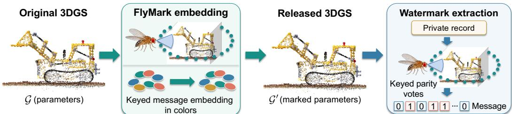  
Figure 1: FLYMARK writes a message where a fly looks. A virtual observer carries the connectome’s photoreceptor directions around the scene, and each direction reads an opacity-weighted cone of Gaussians. Embedding perturbs only the stored degree-zero colors, so the marked render G′ is high visual fidelity from G; extraction replays the same orbit readout with the key. The fly, orbit, and bit glyphs are schematic.

Published 3DGS watermarks trade off these requirements in different ways. GaussianMarker densifies selected Gaussians and trains decoders (Huang et al., 2024); GuardSplat learns spherical-harmonic offsets together with an image decoder (Chen et al., 2025); 3D-GSW likewise relies on learned decoding (Jang et al., 2025); GS-Hider couples secured spherical-harmonic features with learned scene and message decoders (Zhang et al., 2024); MarkSplatter uses splatter-image structure and a learned extractor (Huang et al., 2025); and Splats in Splats hides 3D content in spherical-harmonic coefficients (Guo et al., 2026). Learned extraction can improve image-domain robustness, but it requires retaining a trained component, and image readouts inherit rendering conventions. This leaves a complementary question: can a message be written into existing 3DGS parameters and recovered from the released file by a deterministic procedure with no learned weights at all?

Answering it takes more than perturbing parameters, because three obstacles constrain any such design. First, there is no stable carrier index. A symbol attached to one Gaussian disappears when that primitive is pruned, and a row index is not a geometric identity after reordering, so a readout must be addressed by scene-relative geometry and must aggregate many Gaussians at once. Second, aggregation couples the edits. Aggregated measurements share Gaussians, so moving one color perturbs several measurements and writing the message becomes a coupled inverse problem rather than a sequence of local edits. Third, a hard edit budget leaves some targets unattainable. Under a strict per-parameter fidelity bound and display-gamut limits, shared variables and active bounds guarantee that part of the requested signal is never realized, so any code that needs every symbol to land exactly is unusable.

FLYMARK answers these obstacles with three commitments. Observe, do not index: the carrier is the fly’s retina, projected into a common display plane and rotated with a virtual observer that orbits the scene in scene-normalized units, so each of the 825 directions defines a cone whose opacity-weighted mean luminance is computed from stored centers, colors, and opacities alone. Code with redundancy and a key: every message bit is replicated across the observation array, and keyed dithered quantization index modulation (Chen & Wornell, 2001) turns each eligible observation into a parity vote decoded by majority, so partially realized or locally damaged observations are absorbed rather than fatal (Cox et al., 1997); following Kerckhoffs’ principle (Kerckhoffs, 1883; Cayre et al., 2005), the retina, the orbit, and the decoder are public and secrecy resides only in the key-derived dither. Solve once, under a hard bound: because luminance weights sum to one, an achromatic shift of a stored color moves every observation containing it linearly, so all parity targets assemble into a single sparse bounded least-squares solve (Virtanen et al., 2020) that rewrites only existing degree-zero colors within a hard per-channel linear-RGB limit and the display gamut. Point count, positions, covariances, opacities, and higher-order spherical harmonics are preserved bit-identically, and verification repeats the orbit readout with cone queries, rounding, and voting (Figure 1). Our contributions can be summarized as folows:

• the fly’s eye as a watermark carrier: we show that a published connectome’s photoreceptor layout can serve as a public, non-tunable, reproducible measuring geometry for ownership evidence, read directly from existing 3DGS parameters;

• a keyed QIM code that spreads message bits over redundant cone observations and recovers them by deterministic parity voting and majority aggregation, with no learned decoder;

• a sparse linear color-realization formulation that fits all code targets in one gamut-aware bounded least-squares solve, modifying only existing colors under a hard per-channel shift bound.

With one configuration frozen before any held-out or real scene is evaluated, we measure clean bit recovery, visual fidelity, robustness to model transformations, and wrong-key separation across synthetic and real 3DGS scenes, against published baselines and matched parameter-space controls. FLYMARK attains high clean bit accuracy at high fidelity, sustains recovery under model-domain attacks, and cleanly separates matched from wrong keys, while a separate natural-image experiment shows that the same retinal carrier and keyed QIM code support bounded watermarking of ordinary 2D images.

## 2 RELATED WORK

Radiance-field representations. NeRF introduced continuous view synthesis through coordinate networks (Mildenhall et al., 2020). Anti-aliased and unbounded extensions (Barron et al., 2021; 2022) and explicit factorizations that reduce or avoid multilayer-perceptron inference (Fridovich-Keil et al., 2022; Chen et al., 2022) broadened this representation family. 3DGS instead optimizes anisotropic Gaussians for differentiable splatting rather than ray marching (Kerbl et al., 2023); later work improves structure, anti-aliasing, compactness, and compression (Lu et al., 2024; Yu et al., 2024; Lee et al., 2024; Niedermayr et al., 2024). These advances yield portable scene assets whose parameters can be distributed and transformed, motivating model-level watermarking.

Watermarking radiance fields and 3DGS. NeRF watermarking uses joint optimization, image decoding, or codebooks (Li et al., 2023; Luo et al., 2023; Jang et al., 2024; Luo et al., 2025). 3DGS methods include uncertainty-guided densification and learned extraction (GaussianMarker (Huang et al., 2024)), secured spherical-harmonic features with learned decoders (GS-Hider (Zhang et al., 2024)), splatter-image representations (MarkSplatter (Huang et al., 2025)), learned robust decoding (3D-GSW (Jang et al., 2025)), learned spherical-harmonic offsets (GuardSplat (Chen et al., 2025)), and hidden 3D structure (Splats in Splats (Guo et al., 2026)). Other work explores universal, generalizable, compressed, native, quantization-aware, policy-guided, and explainable watermarking (Tan et al., 2024; Li et al., 2025; In et al., 2026; Qin et al., 2026; Wang et al., 2026; Li et al., 2026; Cai et al., 2026). FLYMARK instead uses existing degree-zero colors for a parameter-space code decoded without learned weights.

Robust coding and watermark evaluation. Our keyed carrier draws on spread-spectrum redundancy (Cox et al., 1997) and dithered-QIM reconstruction sets (Chen & Wornell, 2001), placing repeated symbols in a scene-normalized orbit read from model parameters. Learned image watermarking studies distortion robustness (Zhu et al., 2018; Tancik et al., 2020; Jia et al., 2021; Zhang et al., 2019), while neural-network ownership encodes signatures in model behavior or features (Adi et al., 2018; Rouhani et al., 2019). 3DGS removal attacks and broad-view protocols motivate measuring recovery alongside asset damage (Huang et al., 2026; Zeng et al., 2026; Matsubara et al., 2026). We therefore evaluate bit accuracy, direct and ground-truth-referenced fidelity, attack curves, damage-matched robustness, and wrong-key calibration.

## 3 FLYMARK

## 3.1 EMBEDDING CONTRACT

Let a static 3DGS asset be $\mathcal { G } = \{ g _ { i } \} _ { i = } ^ { N }$ with $g _ { i } = ( \mathbf { x } _ { i } , \pmb { \Sigma } _ { i } , \alpha _ { i } , \mathbf { c } _ { i } ^ { ( 0 ) } , \mathbf { c } _ { i } ^ { ( > 0 ) } )$ collecting position, covariance, opacity, degree-zero color, and the remaining spherical-harmonic coefficients. Given a message b $\in \dot { \{ 0 , 1 \} } ^ { B }$ of length B and a secret key K, embedding produces a marked asset $\mathcal { G } ^ { \prime }$ that is verifiable from its parameters and satisfies the contract

$$
N ^ { \prime } = N , \quad ( \mathbf { x } _ { i } ^ { \prime } , \pmb { \Sigma } _ { i } ^ { \prime } , \alpha _ { i } ^ { \prime } , \mathbf { c } _ { i } ^ { ( > 0 ) ^ { \prime } } ) = ( \mathbf { x } _ { i } , \pmb { \Sigma } _ { i } , \alpha _ { i } , \mathbf { c } _ { i } ^ { ( > 0 ) } ) , \quad \| \mathbf { r } _ { i } ^ { \prime } - \mathbf { r } _ { i } \| _ { \infty } \leq \epsilon ,\tag{1}
$$

where $\mathbf { r } _ { i } \in [ 0 , 1 ] ^ { 3 }$ is the display-linear RGB value represented by ${ \bf c } _ { i } ^ { ( 0 ) }$ and $\epsilon = 0 . 0 2$ . The embedding budget is thus a bounded achromatic edit of selected existing degree-zero colors, making the trade-off between message recovery and appearance explicit and auditable at the file level.

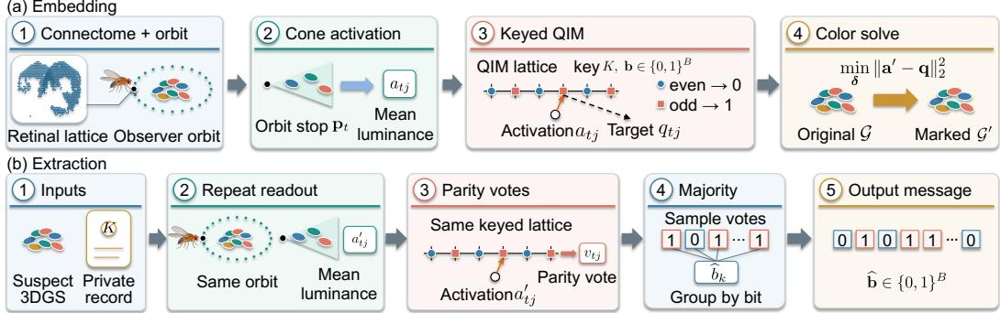  
Figure 2: FlyMark’s embedding and extraction paths. (a) The connectome-derived retinal lattice and observer orbit define a cone-wise mean-luminance readout $a _ { t j }$ from the original Gaussian model ${ \mathcal { G } } .$ The key $K$ and message $\mathbf { b } \in \{ 0 , 1 \} ^ { B }$ determine keyed QIM targets $q _ { t j }$ : even lattice points encode 0 and odd points encode 1. A color solve adjusts the colors of existing Gaussians to produce the marked model $\mathcal { G } ^ { \prime }$ . (b) Given a suspect 3DGS model and the private record, the verifier repeats the same orbit readout to obtain $a _ { t j } ^ { \prime } ,$ converts each activation into a parity vote $v _ { t j }$ on the keyed lattice, and takes a majority vote within each message-bit group to recover message. The displayed votes and message bits are schematic.

## 3.2 PARAMETER-SPACE READOUT

The detector measures an opacity-weighted apparent luminance

$$
\begin{array} { r } { \ell _ { i } = \alpha _ { i } \mathbf { w } ^ { \top } \mathbf { r } _ { i } , \qquad \mathbf { w } = ( 0 . 2 1 2 6 , 0 . 7 1 5 2 , 0 . 0 7 2 2 ) ^ { \top } . } \end{array}\tag{2}
$$

This functional uses three quantities that every 3DGS file stores explicitly: the Gaussian center, its degree-zero color, and its opacity. Reading them directly makes the carrier signal reproducible from the parameter array alone and stable across rasterizer implementations, tile orders, camera intrinsics, and image codecs, which is the property we need for a code that must be re-read after arbitrary repackaging. Figure 2 summarizes the complete embedding and extraction paths and distinguishes the released marked asset from the private verification record.

## 3.3 CONNECTOME CARRIER AND SCENE-NORMALIZED ORBIT

A carrier geometry has to be agreed upon by the embedder and the verifier, reproducible years later, and rich enough to place thousands of redundant symbols. A published connectome satisfies all three at once: it is a citable artifact with a fixed sample list, it requires no design choices beyond a projection convention, and its density varies strongly across the visual field.

From the MaleCNS v1.0 reconstruction (Berg et al., 2026), we obtain a two-dimensional display coordinate $( u , v )$ for each of 3,335 photoreceptors. Collapsing exact duplicate coordinates leaves $C = 8 2 5$ distinct samples, and each sample becomes a pinhole direction

$$
\mathbf { d } _ { j } = \frac { ( u _ { j } - \frac { 1 } { 2 } , \frac { 1 } { 2 } - v _ { j } , 1 ) } { \| ( u _ { j } - \frac { 1 } { 2 } , \frac { 1 } { 2 } - v _ { j } , 1 ) \| _ { 2 } } \in \mathbb { S } ^ { 2 } .\tag{3}
$$

The lattice therefore serves as a deterministic carrier geometry whose structure is inherited from anatomy; Appendix F visualizes the source samples and collapsed directions.

To express the readout in scene-independent units, we define a scene frame whose center o is the midpoint of the Gaussian bounding box and whose radius $\rho$ is the 95th percentile of $\lVert \mathbf { x } _ { i } - \mathbf { o } \rVert _ { 2 }$ . At $T = 2 4$ equally spaced azimuths, a virtual observer occupies

$$
{ \bf p } _ { t } = { \bf o } + 1 . 5 \rho \left[ \cos \eta \cos \theta _ { t } \quad \sin \eta \quad \cos \eta \sin \theta _ { t } \right] ^ { \top } , \quad \eta = 1 0 ^ { \circ } , \quad \theta _ { t } = 2 \pi t / T ,\tag{4}
$$

and looks toward $\mathbf { o . }$ For stop t and carrier $j ,$ the set $\mathcal { C } _ { t j }$ collects Gaussians whose center direction lies within angular radius $\gamma$ of the rotated carrier direction, where $\gamma$ is one half of the lattice’s median nearest-neighbor angular spacing. The activation is the cone mean

$$
a _ { t j } = \frac { 1 } { | \mathcal { C } _ { t j } | } \sum _ { i \in \mathcal { C } _ { t j } } \ell _ { i } .\tag{5}
$$

An observation is eligible when its cone contains at least eight Gaussians, at least 80% of them lie inside the 95th-percentile scene body, and $a _ { t j } \in [ 0 . 0 5 , 0 . 9 5 ]$ ]. These three criteria keep well-supported, scene-anchored, and unsaturated observations, which are the ones a bounded color edit can actually steer. Each message bit is repeated across the flattened $T \times C$ array, so a single disturbed cone is absorbed by its peers.

## 3.4 KEYED DITHERED QIM

Let $h ( t , j ) = ( t C + j )$ mod B assign observation $( t , j )$ to message bit $b _ { h ( t , j ) }$ . From the private key $K$ , a counter-based generator produces independent dithers $u _ { t j } \in [ 0 , \Delta )$ with step $\Delta = 0 . 0 2$ . The requested reconstruction point is the nearest lattice point of the desired parity,

$$
q _ { t j } = u _ { t j } + \Delta \arg \operatorname* { m i n } _ { z \in \mathbb { Z } : z \ \mathrm { m o d } \ 2 = b _ { h ( t , j ) } } \left| \frac { a _ { t j } - u _ { t j } } { \Delta } - z \right| .\tag{6}
$$

Keyed dithering randomizes the phase of the two parity cosets, and repeated assignment turns the large carrier array into a code of length B with heavy replication. The construction follows classical QIM, moving each host signal onto a keyed quantization set (Chen & Wornell, 2001).

## 3.5 ONE BOUNDED COLOR-REALIZATION SOLVE

Perturbing a writable Gaussian by an achromatic shift $\delta _ { i }$ gives $\mathbf { r } _ { i } ^ { \prime } = \mathbf { r } _ { i } + \delta _ { i } \mathbf { 1 }$ . Since the luminance weights sum to one, Equation 5 responds linearly:

$$
a _ { t j } ^ { \prime } = a _ { t j } + \sum _ { i \in \mathcal { C } _ { t j } } \frac { \alpha _ { i } } { | \mathcal { C } _ { t j } | } \delta _ { i } .\tag{7}
$$

Stacking the eligible observations produces a sparse matrix A and a residual $\mathbf { r } = \mathbf { q } - \mathbf { a }$ , and we realize all targets at once through

$$
\delta ^ { \star } = \underset { \ell \le \delta \le u } { \operatorname { a r g m i n } } \| \mathbf { A } \delta - \mathbf { r } \| _ { 2 } ^ { 2 } , \qquad l _ { i } = \operatorname* { m a x } \bigl ( - \epsilon , - \underset { c } { \operatorname* { m i n } } r _ { i c } \bigr ) , \quad u _ { i } = \operatorname* { m i n } ( \epsilon , 1 - \underset { c } { \operatorname* { m a x } } r _ { i c } ) .\tag{8}
$$

The bounds enforce $\| \mathbf { r } _ { i } ^ { \prime } - \mathbf { r } _ { i } \| _ { \infty } \leq 0 . 0 2$ and $\mathbf { r } _ { i } ^ { \prime } \in [ 0 , 1 ] ^ { 3 }$ simultaneously. Gaussians whose stored degree-zero color already lies outside the display gamut are held out of the variable set and preserved bit-identically. One call to a bounded least-squares solver, using a trust-region reflective outer method with an LSMR inner solver, produces every shift (Virtanen et al., 2020). Shared Gaussians and active bounds leave some carrier targets only partially realized, and redundant majority decoding absorbs those residuals, so embedding completes in a single solve.

## 3.6 EXTRACTION AND OWNERSHIP SCORE

The private verification record stores the key, the expected message, the carrier directions, the cone radius, and the embedding-time eligibility mask. Given a suspect model, the owner reconstructs the scene frame and orbit, evaluates Equations 2 and 5, and quantizes

$$
\widetilde { z } _ { t j } = \left\lfloor \frac { a _ { t j } ^ { \prime } - u _ { t j } } { \Delta } + \frac { 1 } { 2 } \right\rfloor , \qquad v _ { t j } = \widetilde { z } _ { t j } \bmod 2 .\tag{9}
$$

For each index $k ,$ the decoded bit $\widehat { b } _ { k }$ is the majority of the eligible votes with $h ( t , j ) = k$ . The recovered message is $\widehat { \mathbf { b } } = ( \widehat { b } _ { 0 } , \dots , \widehat { b } _ { B - 1 } )$ , and the primary recovery metric is $\begin{array} { r } { \mathrm { B i t A c c } = B ^ { - 1 } \sum _ { k } \mathcal { K } [ \widehat { b } _ { k } = } \end{array}$ $b _ { k } ]$ , which is reported without any decision threshold. When an explicit ownership decision is required, the owner thresholds the number of correct bits at a preselected operating point, and Section 4.2.3 calibrates that use separately.

## 3.7 IMPLEMENTATION DETAILS

The main evaluation sets $B = 3 2$ message bits; the sensitivity study also evaluates $B = 1 6$ and $B = 6 4$ . The implementation uses vectorized NumPy geometry and SciPy’s sparse bounded leastsquares solver (Harris et al., 2020; Virtanen et al., 2020). The trust-region reflective outer solve uses tolerance $1 0 ^ { - 6 }$ and at most 200 iterations, and its LSMR inner solves use tolerance $1 0 ^ { - 4 }$ with the same iteration cap. Embedding stores the carrier, the key-derived protocol data, and the embedding-time eligibility mask. Fixed-mask decoding is the primary protocol, and recomputing eligibility from the received model provides a stricter secondary check. Extraction builds one spatial index per orbit stop and then performs cone queries, arithmetic, rounding, and majority voting, so both embedding and extraction run on CPU with the model file as their only input.

## 4 EXPERIMENTS

## 4.1 EXPERIMENTAL SETUP

We protect a static vanilla 3DGS whose parameter array is available to the verifier. The owner holds a secret key and a verification record, while the lattice, the orbit construction, and the decoding algorithm may be published. An experimental cell is a scene/key pair: clean recovery is measured once per cell, and stochastic attacks additionally vary the attack seed. The adversary may serialize, reorder, quantize, prune, inject, perturb, smooth, or average the released asset. All methods start from the same scene reconstruction wherever an official baseline supports that scene.

Datasets. We use eight NeRF Synthetic scenes (Mildenhall et al., 2020) and nine Mip-NeRF 360 scenes (Barron et al., 2022). Lego and Chair are development scenes; Ficus and Materials select the QIM step; Drums, Hotdog, Mic, and Ship are held-out Synthetic tests; all nine real scenes test external transfer. Each vanilla 3DGS base (Kerbl et al., 2023) trains for 30,000 iterations from reconstruction seed 0. Keys 17, 29, and 43 yield 30 cells on the cross-method corpus and 27 cells across the nine real scenes for FLYMARK. The selected $\Delta = 0 . 0 2$ and all other settings are frozen before held-out or real-scene evaluation; Appendix B details scene roles and selection.

Baselines. We compare with three published 3DGS watermark systems and two matched parameterspace controls: 1) GaussianMarker (Huang et al., 2024), uncertainty-guided Gaussian densification with a learned decoder; 2) 3D-GSW (Jang et al., 2025), a learned-decoder watermark; 3) GuardSplat (Chen et al., 2025), which learns spherical-harmonic offsets and an image decoder; 4) RandomCone-QIM, which substitutes 825 blue-noise carrier directions while retaining FLY-MARK’s other stages; and 5) SpatialHash-QIM, which replaces cone aggregation with keyed spatial assignment under the same message length and color budget. Published methods use their official implementations; Appendix B specifies their configurations. Bit accuracy is normalized by each method’s native message length. GuardSplat covers eight Synthetic scenes (24 cells); the others cover ten scenes (30 cells).

Evaluation metrics. We measure message recovery, appearance, robustness, ownership separation, and cost. For message recovery, the primary metric is bit accuracy, BitAcc = correct bits/message bits, and a threshold enters only at ownership operating points. For appearance, direct fidelity compares marked against original renders with PSNR, SSIM (Wang et al., 2004), and LPIPS using an AlexNet backbone (Zhang et al., 2018), and ground-truth fidelity reports the change in novel-view PSNR against identical targets. For robustness, we report bit-accuracy curves and an unweighted macro AUC over ordinal severity indices within each attack family. For ownership, we measure wrong-key scores, false positives at a preselected cutoff, overwrite, and keyed-copy collusion. Structural audits compare serialized arrays for point count, geometry, opacity, non-DC spherical harmonics, gamut behavior, and the hard color bound.

Attacks. The ten standard attacks include pruning, Gaussian injection, color, opacity and position noise, float16 round trips, color quantization, SH truncation, and row reordering. We additionally test targeted purification, local color smoothing, and spatial partial theft, plus overwrite and copy collusion for ownership analysis. Damage-matched comparison selects the most severe measured candidate inside a ground-truth PSNR-loss budget without consulting recovery or interpolating missing severities. Appendix B specifies severities and seeds.

Table 1: Clean message recovery and direct visual fidelity. Bit accuracy is the fraction of correctly recovered message bits, aggregated scene first. Fidelity compares marked renders against the corresponding unmarked 3DGS renders. GuardSplat covers the eight Synthetic scenes and the remaining methods cover all ten scenes. Arrows indicate the preferred direction.
<table><tr><td>Method</td><td>Cells</td><td>Bit acc. ↑</td><td>PSNR ↑</td><td>SSIM↑</td><td>LPIPS ↓</td></tr><tr><td>FlyMark</td><td>30</td><td>99.27</td><td>44.21</td><td>0.993</td><td>0.0021</td></tr><tr><td>RandomCone-QIM</td><td>30</td><td>95.94</td><td>43.36</td><td>0.991</td><td>0.0026</td></tr><tr><td>SpatialHash-QIM</td><td>30</td><td>83.12</td><td>44.41</td><td>0.991</td><td>0.0022</td></tr><tr><td>GaussianMarker</td><td>30</td><td>98.75</td><td>30.11</td><td>0.954</td><td>0.0411</td></tr><tr><td>3D-GSW</td><td>30</td><td>86.67</td><td>32.59</td><td>0.970</td><td>0.0266</td></tr><tr><td>GuardSplat</td><td>24</td><td>62.11</td><td>41.06</td><td>0.996</td><td>0.0025</td></tr></table>

## 4.2 RESULTS

## 4.2.1 CLEAN RECOVERY AND FIDELITY

Table 1 places clean recovery beside marked-versus-unmarked visual fidelity. Across 30 scene/key cells, FLYMARK recovers 953 of 960 message bits (99.27%) while reaching 44.21 dB direct PSNR; recomputing eligibility from the received model still recovers 98.96% of bits. Relative to ground truth, the mean novel-view PSNR change is 0.52 dB, with a worst cell of 1.41 dB.

The matched spatial-assignment control reaches comparable direct fidelity but lower recovery, supporting the value of redundant cone observations beyond the color budget alone. Among published systems, GaussianMarker comes closest in bit accuracy; FLYMARK leads the table while retaining higher direct fidelity and no learned decoder weights.

Table 2 tests the fixed carrier, orbit, and QIM settings beyond development scenes. Both the held-out Synthetic and nine-real-scene aggregates retain high clean bit accuracy and direct fidelity. This transfer spans white-background Synthetic scenes and varied real captures without retuning the carrier, orbit, or QIM step.

Appearance also holds away from the official trajectories. On the ten-scene cross-method corpus, multi-shell sampling of 37 to 158

Table 2: Role-separated FLYMARK results. Held-out Synthetic and all nine real scenes are excluded from method selection.
<table><tr><td>Role</td><td>Cells</td><td>Bit acc. ↑</td><td>PSNR ↑</td><td>LPIPS↓</td></tr><tr><td>Development</td><td>6</td><td>100.00</td><td>43.82</td><td>0.0015</td></tr><tr><td>Validation</td><td>6</td><td>98.96</td><td>48.48</td><td>0.0003</td></tr><tr><td>Held-out</td><td>12</td><td>98.96</td><td>45.20</td><td>0.0021</td></tr><tr><td>External real</td><td>27</td><td>96.64</td><td>38.02</td><td>0.0045</td></tr></table>

viewpoints per scene, including cameras outside those paths, keeps direct PSNR above 38.7 dB and LPIPS below 0.0060 on every scene, with per-scene values in Appendix E. Structural audits of every clean cell confirm the embedding contract of Equation 1, including identical point count, positions, scales, rotations, opacity, and non-DC spherical harmonics, the 0.02 linear-RGB bound on modified rows, and bit-identical preservation of pre-existing out-of-gamut rows.

The paired outputs and amplified differences in Figure 3 show the spatially diffuse color changes alongside intact message recovery in the displayed scenes.

## 4.2.2 ROBUSTNESS TO MODEL TRANSFORMATIONS

We report model-attack recovery as per-severity curves (Figure 4) and ten-family AUC (Table 3).

Redundancy across directions and orbit stops sustains recovery through moderate deletion and parameter perturbation; noise or quantization near the QIM step $\Delta \ : = \ : 0 . 0 2$ reduces it. Across the ten-family summary, FLYMARK has the strongest macro-AUC point estimate among the fully matched parameter-space constructions. Reordering, float16 round trips, SH truncation, and color requantization largely preserve the DC-color code, whereas deleting or displacing vote-carrying Gaussians is more disruptive. On the matched Lego, held-out Hotdog, and real Bonsai subset, its macro AUC is comparable to GaussianMarker and 3D-GSW; on the two Synthetic scenes supported by GuardSplat, it is higher.

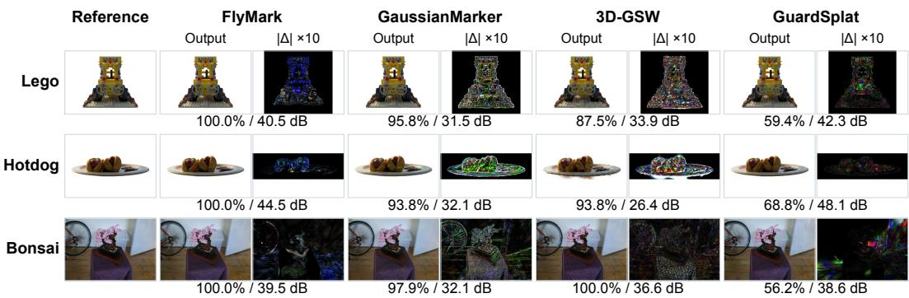

Figure 3: Registered-view qualitative comparison on Lego, Hotdog, and Bonsai. Every method is shown as an equal-size output/difference pair, where the right panel is the 10× absolute RGB difference from the matched reference under a shared display transform. In the one-line annotation beneath each marked pair, the value before the slash is key-17 bit accuracy (%) and the value after it is direct PSNR (dB) for the displayed frame. Each row uses identical cameras and crops across methods, and Bonsai uses the third registered view (frame 29). Tables 1 and 2 report aggregate recovery and fidelity; Appendix H shows all three registered views.  
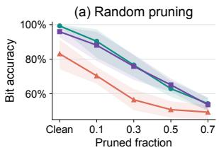

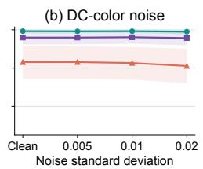

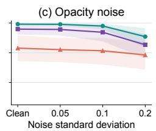  
FlyMark RandomCone-QIM SpatialHash-QIM

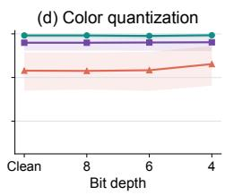  
Figure 4: Bit accuracy under four representative model-attack families. Lines are scene-first means over ten scenes and three watermark keys, and shaded regions show hierarchical-bootstrap uncertainty. The clean point is repeated as severity zero.

Robustness is also assessed at comparable visual damage. Under a measured 2 dB ground-truth PSNRloss budget, FLYMARK retains 97.19% of bits across all 30 available cells, similar to RandomCone-QIM and ahead of SpatialHash-QIM on commonly measured cells. Targeted attacks probe a different regime: local smoothing retains 97.92% bit accuracy at severity 0.4, while opacity- and scale-guided purification retain 63.54% and 70.83% at severity 0.1, with respective ground-truth PSNR losses of 1.35 and 1.30 dB. Appendix D gives the complete profiles, fidelity costs, and published-baseline coverage at the damage budget.

## 4.2.3 WRONG-KEY CALIBRATION

Figure 5 shows clear score separation: five million wrong-key trials, each changing the QIM dither and expected message, peak near 16 correct bits and never exceed 29, while matched scores range from 30 to 32. At the preselected 30-bit ownership cutoff, all matched cells and no wrong-key trial are accepted; unmarked-model, wrong-message, and cross-scene controls also yield no acceptance. This cutoff serves ownership decisions, while bit accuracy remains the unthresholded recovery metric. Appendix D examines overwrite and keyed-copy collusion.

Table 3: Bit-accuracy AUC for all ten standard attack families. Values average over ten scenes, three watermark keys, and three stochastic seeds where applicable. AUC integrates over ordinal severity within a family, and Macro is the unweighted family mean.
<table><tr><td rowspan="2">Method</td><td rowspan="2">Injection</td><td rowspan="2"> $\begin{array} { c } { { \mathrm { D C } } } \\ { { \mathrm { n o i s e } } } \end{array}$ </td><td rowspan="2">fp16 Quant.</td><td rowspan="2"></td><td rowspan="2">Opacity noise</td><td rowspan="2">Opacity prune</td><td rowspan="2">Position Random noise</td><td rowspan="2">prune</td><td rowspan="2">Reorder</td><td rowspan="2"> $\begin{array} { c } { { \operatorname { S H } } } \\ { { \operatorname { t r u n c . } } } \end{array}$ </td><td rowspan="2">Macro</td></tr><tr><td></td></tr><tr><td>FlyMark</td><td>0.793</td><td></td><td>0.992 0.983</td><td>0.992</td><td>0.974</td><td>0.733</td><td>0.767</td><td>0.767</td><td>0.993</td><td>0.993</td><td>0.899</td></tr><tr><td>RandomCone-QIM</td><td>0.801</td><td>0.960 0.954</td><td></td><td>0.960</td><td>0.934</td><td>0.696</td><td>0.771</td><td>0.760</td><td>0.959</td><td>0.959</td><td>0.875</td></tr><tr><td>SpatialHash-QIM</td><td>0.539</td><td>0.827 0.718</td><td></td><td>0.837</td><td>0.814</td><td>0.544</td><td>0.535</td><td>0.609</td><td>0.831</td><td>0.831</td><td>0.709</td></tr></table>

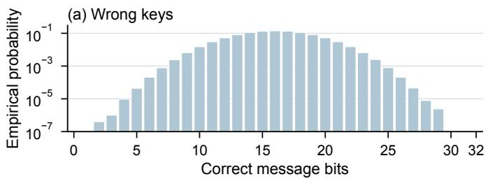

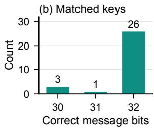  
Figure 5: Wrong-key calibration. The left panel plots empirical probability by correct message bits over five million wrong-key trials (logarithmic vertical axis); the right panel counts clean matched-key scores across 30 scene/key cells. The preselected ownership cutoff is 30 correct bits.

Table 4: Component study on four development/validation scenes with key 17. Attacked bit accuracy averages component-attack conditions by scene; fidelity is direct marked-versus-original PSNR.
<table><tr><td>Variant</td><td>Clean bit acc.</td><td>Recomputed</td><td>Attacked bit acc.</td><td>PSNR (dB)</td></tr><tr><td>Full method</td><td>100.00</td><td>99.22</td><td>68.91</td><td>46.02</td></tr><tr><td>One orbit stop</td><td>89.06</td><td>89.84</td><td>62.50</td><td>50.13</td></tr><tr><td>No keyed dither</td><td>91.41</td><td>89.84</td><td>66.41</td><td>46.29</td></tr><tr><td>No scene-body gate</td><td>99.22</td><td>99.22</td><td>68.75</td><td>45.83</td></tr><tr><td>Differential cone pairs</td><td>96.09</td><td>96.09</td><td>86.56</td><td>50.14</td></tr><tr><td>Gamut only; no 0.02 bound</td><td>100.00</td><td>100.00</td><td>78.44</td><td>30.62</td></tr></table>

## 4.2.4 COMPONENT ATTRIBUTION

Table 4 isolates orbit redundancy, keyed dithering, eligibility, and the color constraint. One stop lowers clean bit accuracy by 10.94 points even as PSNR rises, so multi-stop voting contributes beyond stronger color edits. Removing dither costs 8.59 points; both variants have higher direct PSNR than the full method, separating their recovery losses from larger visual edits. Removing the scene-body gate changes clean and attacked means by less than one point. Differential cone pairs use a different detector and favor attacked recovery. Gamut-only writes retain clean bits but fall to 30.62 dB, motivating the hard 0.02 bound.

One-factor sweeps show that a 64-bit message retains 96.48% clean bit accuracy and twelve orbit stops retain 97.66%. Varying the color bound shifts the fidelity and recovery trade-off without changing the carrier (Appendix F).

## 4.2.5 EFFICIENCY

Table 5 reports a 72.23 s median CPU embed, 2.90 s extraction, and 0.65 GiB median peak RSS. The one-time bounded solve writes the code; verification builds spatial indices and computes cone means and keyed votes without rendering or learned decoder weights. Its retained state is only the expected message, key, and carrier specification. A paired three-scene render check gives a mean marked/unmarked throughput ratio of 1.01, consistent with unchanged Gaussian count and geometry. Baseline timings use one GPU for embedding and the full test split for extraction.

## 4.2.6 EXTENSION TO 2D IMAGES

For 2D images, we apply the retinal readout to bilinear luminance samples and realize keyed QIM with bounded pixel-color edits. On all 200 BSDS500 test images (Arbeláez et al., 2011), three keys each, saved 8-bit PNGs yield 99.95% clean bit accuracy and 59.00 dB mean direct sRGB PSNR. Appendix G gives the protocol.

## 5 CONCLUSION

FLYMARK embeds a keyed message in existing degree-zero colors of a static 3DGS asset. A connectome-derived carrier and orbit-based luminance readout define the code; one bounded color solve realizes it without new Gaussians, geometry changes, or decoder training. Across Synthetic and real scenes, the method combines accurate recovery and high visual fidelity; model-transformation and wrong-key tests assess robustness and ownership verification. These results establish biologically derived sampling as a practical model-domain watermark carrier.

Table 5: Implementation resource costs. FLYMARK uses CPU; published baselines use one GPU where applicable.
<table><tr><td>Method</td><td>Embed median (s)</td><td>Extract/test (s)</td><td>Peak RSS (GiB)</td><td>Params</td><td>Decoder MB</td></tr><tr><td>FlyMark</td><td>72.23</td><td>2.90</td><td>0.65</td><td>0</td><td>0.00</td></tr><tr><td>GaussianMarker</td><td>218.57</td><td>13.20</td><td>13.00</td><td>291,456</td><td>5.74</td></tr><tr><td>3D-GSW</td><td>1400.66</td><td>12.21</td><td>8.85</td><td>281,952</td><td>1.18</td></tr><tr><td>GuardSplat</td><td>226.46</td><td>13.59</td><td>1.94</td><td>205,344</td><td>1.22</td></tr></table>

Limitation. The present formulation targets static 3DGS assets. Future work can adapt its carrier readout and bounded embedding to NeRF scenes (Mildenhall et al., 2020) and VGGT-derived 3D reconstructions (Wang et al., 2025), and extend it with temporally consistent readouts for 4D scenes.

## AI USE STATEMENT

Generative AI tools were not used to generate synthetic data sets, help develop theoretical models or conceptual frameworks, formulate mathematical claims, propose or refine hypotheses, design or provide feedback on research methodology or experiments, implement methods, clean or reformat datasets, or interpret results; providing critical ingredients for proving mathematical claims, assisting in the writing of proofs, translation, and qualitative or thematic data analysis are not applicable to thi work. Additionally, we used generative AI tools to edit the manuscript for readability and to search for and identify relevant literature. We have reviewed all AI-assisted work: every AI-edited passage was checked by the authors against the intended technical content, and every reference surfaced by an AI tool was verified against the primary publication before citation. We take responsibility for the final content of this work, including text, claims or artifacts produced with the aid of generative AI.

## ETHICS STATEMENT

This work studies ownership evidence for 3D assets using public datasets and a published connectome resource. The method infers no biological or personal attributes. As with other watermarks, ownership scores should be weighed alongside provenance records and legal context, and our wrong-key experiment provides an empirically calibrated operating point for that use.

## REPRODUCIBILITY STATEMENT

Section 3 specifies the complete readout, QIM rule, color bounds, and decoder. Appendix B details the evaluation protocol. The Supplementary Materials include code and a detailed README file for reproducing all reported results.

## REFERENCES

Yossi Adi, Carsten Baum, Moustapha Cisse, Benny Pinkas, and Joseph Keshet. Turning your weakness into a strength: Watermarking deep neural networks by backdooring. In USENIX Security Symposium, 2018.

Pablo Arbeláez, Michael Maire, Charless Fowlkes, and Jitendra Malik. Contour detection and hierarchical image segmentation. IEEE Transactions on Pattern Analysis and Machine Intelligence, 2011.

Jonathan T. Barron, Ben Mildenhall, Matthew Tancik, Peter Hedman, Ricardo Martin-Brualla, and Pratul P. Srinivasan. Mip-NeRF: A multiscale representation for anti-aliasing neural radiance fields. In IEEE/CVF International Conference on Computer Vision, 2021.

Jonathan T. Barron, Ben Mildenhall, Dor Verbin, Pratul P. Srinivasan, and Peter Hedman. Mip-NeRF 360: Unbounded anti-aliased neural radiance fields. In IEEE/CVF Conference on Computer Vision and Pattern Recognition, 2022.

Stuart Berg, Isabella R. Beckett, Marta Costa, Philipp Schlegel, Michał Januszewski, Elizabeth C. Marin, Aljoscha Nern, Stephan Preibisch, Wei Qiu, Shin-ya Takemura, et al. Sexual dimorphism in the complete Drosophila male central nervous system connectome. Cell, 2026.

Mingshu Cai, Jiajun Li, Osamu Yoshie, Yuya Ieiri, and Yixuan Li. Where, what, why: Toward explainable 3d-GS watermarking. In IEEE/CVF Conference on Computer Vision and Pattern Recognition, 2026.

François Cayre, Caroline Fontaine, and Teddy Furon. Watermarking security: Theory and practice. IEEE Transactions on Signal Processing, 2005.

Anpei Chen, Zexiang Xu, Andreas Geiger, Jingyi Yu, and Hao Su. TensoRF: Tensorial radiance fields. In European Conference on Computer Vision, 2022.

Brian Chen and Gregory W. Wornell. Quantization index modulation: A class of provably good methods for digital watermarking and information embedding. IEEE Transactions on Information Theory, 2001.

Zixuan Chen, Guangcong Wang, Jiahao Zhu, Jianhuang Lai, and Xiaohua Xie. GuardSplat: Efficient and robust watermarking for 3d gaussian splatting. In IEEE/CVF Conference on Computer Vision and Pattern Recognition, 2025.

Ingemar J. Cox, Joe Kilian, F. Thomson Leighton, and Talal Shamoon. Secure spread spectrum watermarking for multimedia. IEEE Transactions on Image Processing, 1997.

Bradley Efron and Robert Tibshirani. Bootstrap methods for standard errors, confidence intervals, and other measures of statistical accuracy. Statistical Science, 1986.

Sara Fridovich-Keil, Alex Yu, Matthew Tancik, Qinhong Chen, Benjamin Recht, and Angjoo Kanazawa. Plenoxels: Radiance fields without neural networks. In IEEE/CVF Conference on Computer Vision and Pattern Recognition, 2022.

Yijia Guo, Wenkai Huang, Yang Li, Gaolei Li, Hang Zhang, Liwen Hu, Jianhua Li, Tiejun Huang, and Lei Ma. Splats in splats: Robust and effective 3d steganography towards gaussian splatting. In AAAI Conference on Artificial Intelligence, 2026.

Charles R. Harris, K. Jarrod Millman, Stéfan J. van der Walt, Ralf Gommers, Pauli Virtanen, David Cournapeau, Eric Wieser, Julian Taylor, Sebastian Berg, Nathaniel J. Smith, et al. Array programming with NumPy. Nature, 2020.

Wenkai Huang, Yijia Guo, Gaolei Li, Lei Ma, Hang Zhang, Liwen Hu, Jiazheng Wang, Jianhua Li, and Tiejun Huang. Can protective watermarking safeguard the copyright of 3d gaussian splatting? In AAAI Conference on Artificial Intelligence, 2026.

Xiufeng Huang, Ruiqi Li, Yiu-ming Cheung, Ka Chun Cheung, Simon See, and Renjie Wan. GaussianMarker: Uncertainty-aware copyright protection of 3d gaussian splatting. In Advances in Neural Information Processing Systems, 2024.

Xiufeng Huang, Ziyuan Luo, Qi Song, Ruofei Wang, and Renjie Wan. MarkSplatter: Generalizable watermarking for 3d gaussian splatting model via splatter image structure. In ACM International Conference on Multimedia, 2025.

Sumin In, Youngdong Jang, Utae Jeong, MinHyuk Jang, Hyeongcheol Park, Eunbyung Park, and Sangpil Kim. CompMarkGS: Robust watermarking for compressed 3d gaussian splatting. In International Conference on Learning Representations, 2026.

Youngdong Jang, Dong In Lee, MinHyuk Jang, Jong Wook Kim, Feng Yang, and Sangpil Kim. WateRF: Robust watermarks in radiance fields for protection of copyrights. In IEEE/CVF Conference on Computer Vision and Pattern Recognition, 2024.

Youngdong Jang, Hyunje Park, Feng Yang, Heeju Ko, Euijin Choo, and Sangpil Kim. 3D-GSW: 3d gaussian splatting for robust watermarking. In IEEE/CVF Conference on Computer Vision and Pattern Recognition, 2025.

Zhaoyang Jia, Han Fang, and Weiming Zhang. MBRS: Enhancing robustness of dnn-based watermarking by mini-batch of real and simulated JPEG compression. In ACM International Conference on Multimedia, 2021.

Bernhard Kerbl, Georgios Kopanas, Thomas Leimkühler, and George Drettakis. 3D Gaussian Splatting for real-time radiance field rendering. ACM Transactions on Graphics, 2023.

Auguste Kerckhoffs. La cryptographie militaire. Journal des sciences militaires, 1883.

Joo Chan Lee, Daniel Rho, Xiangyu Sun, Jong Hwan Ko, and Eunbyung Park. Compact 3d gaussian representation for radiance field. In IEEE/CVF Conference on Computer Vision and Pattern Recognition, 2024.

Chenxin Li, Brandon Y. Feng, Zhiwen Fan, Panwang Pan, and Zhangyang Wang. StegaNeRF: Embedding invisible information within neural radiance fields. In IEEE/CVF International Conference on Computer Vision, 2023.

Lijiang Li, Jinglu Wang, Xiang Ming, and Yan Lu. GS-Marker: Generalizable and robust watermarking for 3d gaussian splatting. arXiv preprint arXiv:2503.18718, 2025.

Nan Li, Yike Zeng, Qian Zhang, Qi Zhang, Zhiyi Pan, Wei Feng, and Liang Wan. Write where it matters: Policy-guided watermarks for 3d gaussian splatting. In IEEE/CVF Conference on Computer Vision and Pattern Recognition, 2026.

Tao Lu, Mulin Yu, Linning Xu, Yuanbo Xiangli, Limin Wang, Dahua Lin, and Bo Dai. Scaffold-GS: Structured 3d gaussians for view-adaptive rendering. In IEEE/CVF Conference on Computer Vision and Pattern Recognition, 2024.

Ziyuan Luo, Qing Guo, Ka Chun Cheung, Simon See, and Renjie Wan. CopyRNeRF: Protecting the copyright of neural radiance fields. In IEEE/CVF International Conference on Computer Vision, 2023.

Ziyuan Luo, Anderson Rocha, Boxin Shi, Qing Guo, Haoliang Li, and Renjie Wan. The NeRF signature: Codebook-aided watermarking for neural radiance fields. IEEE Transactions on Pattern Analysis and Machine Intelligence, 2025.

Tomoya Matsubara, Lingfeng Yao, Chenpei Huang, Miao Pan, and Hideo Saito. MSVS: Multi-shell viewpoint sampling for comprehensive evaluation of 3d watermarking. In IEEE International Conference on Acoustics, Speech and Signal Processing, 2026.

Ben Mildenhall, Pratul P. Srinivasan, Matthew Tancik, Jonathan T. Barron, Ravi Ramamoorthi, and Ren Ng. NeRF: Representing scenes as neural radiance fields for view synthesis. In European Conference on Computer Vision, 2020.

Aljoscha Nern, Frank Loesche, Shin-ya Takemura, Laura E. Burnett, Marisa Dreher, Eyal Gruntman, Judith Hoeller, Gary B. Huang, Michał Januszewski, et al. Connectome-driven neural inventory of a complete visual system. Nature, 2025.

Simon Niedermayr, Josef Stumpfegger, and Rüdiger Westermann. Compressed 3d gaussian splatting for accelerated novel view synthesis. In IEEE/CVF Conference on Computer Vision and Pattern Recognition, 2024.

Hao Qin, Yukai Sun, Luyuan Chen, Mengxu Lu, Feng Zhang, Ming Kong, Zhenhong Du, and Qiang Zhu. NGS-Marker: Robust native watermarking for 3d gaussian splatting. In International Conference on Learning Representations, 2026.

Bita Darvish Rouhani, Huili Chen, and Farinaz Koushanfar. DeepSigns: An end-to-end watermarking framework for ownership protection of deep neural networks. In International Conference on Architectural Support for Programming Languages and Operating Systems, 2019.

Yuqi Tan, Xiang Liu, Shuzhao Xie, Bin Chen, Shu-Tao Xia, and Zhi Wang. WATER-GS: Toward copyright protection for 3d gaussian splatting via universal watermarking. arXiv preprint arXiv:2412.05695, 2024.

Matthew Tancik, Ben Mildenhall, and Ren Ng. StegaStamp: Invisible hyperlinks in physical photographs. In IEEE/CVF Conference on Computer Vision and Pattern Recognition, 2020.

Pauli Virtanen, Ralf Gommers, Travis E. Oliphant, Matt Haberland, Tyler Reddy, David Cournapeau, Evgeni Burovski, Pearu Peterson, Warren Weckesser, Jonathan Bright, et al. SciPy 1.0: Fundamental algorithms for scientific computing in python. Nature Methods, 2020.

Boyu Wang, Jun Xia, and Mingsong Chen. Robust3DGSW: Toward robust watermarking for quantization-aware 3d gaussian splatting. In IEEE/CVF Conference on Computer Vision and Pattern Recognition, 2026.

Jianyuan Wang, Minghao Chen, Nikita Karaev, Andrea Vedaldi, Christian Rupprecht, and David Novotny. VGGT: Visual geometry grounded transformer. In Proceedings of the IEEE/CVF Conference on Computer Vision and Pattern Recognition (CVPR), 2025.

Zhou Wang, Alan C. Bovik, Hamid R. Sheikh, and Eero P. Simoncelli. Image quality assessment: From error visibility to structural similarity. IEEE Transactions on Image Processing, 2004.

Zehao Yu, Anpei Chen, Binbin Huang, Torsten Sattler, and Andreas Geiger. Mip-splatting: Alias-free 3d gaussian splatting. In IEEE/CVF Conference on Computer Vision and Pattern Recognition, 2024.

Qingyuan Zeng, Shu Jiang, Jiajing Lin, Zhenzhong Wang, Kay Chen Tan, and Min Jiang. Fading the digital ink: A universal black-box attack framework for 3dgs watermarking systems. In AAAI Conference on Artificial Intelligence, 2026.

Kevin Alex Zhang, Lei Xu, Alfredo Cuesta-Infante, and Kalyan Veeramachaneni. Robust invisible video watermarking with attention. arXiv preprint arXiv:1909.01285, 2019.

Richard Zhang, Phillip Isola, Alexei A. Efros, Eli Shechtman, and Oliver Wang. The unreasonable effectiveness of deep features as a perceptual metric. In IEEE Conference on Computer Vision and Pattern Recognition, 2018.

Xuanyu Zhang, Jiarui Meng, Runyi Li, Zhipei Xu, Yongbing Zhang, and Jian Zhang. GS-Hider: Hiding messages into 3d gaussian splatting. In Advances in Neural Information Processing Systems, 2024.

Jiren Zhu, Russell Kaplan, Justin Johnson, and Li Fei-Fei. HiDDeN: Hiding data with deep networks. In European Conference on Computer Vision, 2018.

## A APPENDIX OVERVIEW

This appendix is organized as follows.

• Section B specifies the datasets, baseline adaptations, metrics, statistics, and frozen hyperparameters.

• Section C expands the readout and constrained-realization derivation.

• Section D presents damage-matched, adaptive-attack, and ownership results.

• Section E reports per-scene multi-shell fidelity.

• Section F covers carrier geometry and one-factor sensitivity.

• Section G describes the bounded image-domain extension and its evaluation protocol.

• Section H collects the registered qualitative views.

## B COMPLETE EXPERIMENTAL PROTOCOL

## B.1 DATASETS AND SCENE ROLES

Table 6 gives the method-selection and test roles used throughout the paper.

Table 6: Dataset roles and clean evaluation cells. Every scene uses watermark keys 17, 29, and 43.
<table><tr><td>Dataset</td><td>Role</td><td>Scenes</td><td>Count</td><td>Cells</td></tr><tr><td>NeRF Synthetic</td><td>Development</td><td>Lego, Chair</td><td>2</td><td>6</td></tr><tr><td>NeRF Synthetic</td><td>Validation</td><td>Ficus, Materials</td><td>2</td><td>6</td></tr><tr><td>NeRF Synthetic</td><td>Held-out test</td><td>Drums, Hotdog, Mic, Ship</td><td>4</td><td>12</td></tr><tr><td>Mip-NeRF 360</td><td>External real test</td><td>All nine scenes</td><td>9</td><td>27</td></tr></table>

NeRF Synthetic uses its canonical train/validation/test transforms and white background, and in particular Lego and held-out Hotdog each contain 100/100/200 views. Mip-NeRF 360 uses the official scene images and held-out rendering split with black background. Its nine scenes are Bicycle, Bonsai, Counter, Flowers, Garden, Kitchen, Room, Stump, and Treehill. Base models train for 30,000 iterations from reconstruction seed 0 with the public reference 3DGS implementation (Kerbl et al., 2023). Base training happens once per scene. On the ten-scene cross-method corpus, all compared methods start from the same saved model; the seven additional real scenes use the same frozen FLYMARK settings.

The QIM step is selected using Ficus and Materials only, from the registered candidate set {0.01, 0.02, 0.04, 0.08}, after which $\Delta = 0 . 0 2$ and all remaining settings are frozen before held-out Synthetic or external-real scenes are evaluated. The three secret keys apply to every main-method scene. Representative cross-method attack comparisons use key 17 and stochastic attack seed 101 on Lego, Hotdog, and Bonsai, which is the intersection for which comparable saved attack candidates exist across systems.

## B.2 FLYMARK HYPERPARAMETERS

Table 7 records the exact frozen configuration used in the main study.

## B.3 BASELINES AND CONTROLS

GaussianMarker uses its official uncertainty-aware embedding code, fixed 48-bit decoder checkpoint, and 2,000 embedding iterations (Huang et al., 2024); we evaluate its native 48-bit message and normalize recovery by 48. 3D-GSW uses the official 32-bit decoder configuration, eight embedding epochs, and published loss weights (Jang et al., 2025). GuardSplat uses its official 32-bit architecture with 200 decoder-training epochs and 100 watermark epochs (Chen et al., 2025), and its aggregate evaluation covers the eight Synthetic scenes. For the complete qualitative comparison, we additionally run key 17 on Bonsai through GuardSplat’s official LLFF camera path with the same 100-epoch configuration, and this targeted cell stays outside the aggregate baseline table. Seed adapters select deterministic messages while leaving baseline losses, renderers, camera sets, optimizers, and decoder architectures as published.

Table 7: Frozen FLYMARK configuration. The angular cone radius is derived from the carrier lattice instead of being specified as an absolute angle.
<table><tr><td>Quantity</td><td>Value</td></tr><tr><td>Message length B</td><td>32 bits</td></tr><tr><td>Source carrier</td><td>3,335 MaleCNS photoreceptors</td></tr><tr><td>Distinct directions</td><td>825 after exact UV collapse</td></tr><tr><td>Orbit stops</td><td>24</td></tr><tr><td>Orbit radius / elevation / phase</td><td> $1 . 5 \rho / 1 0 ^ { \circ } / 0 ^ { \circ }$ </td></tr><tr><td>Scene center / radius ρ</td><td>bounding-box midpoint / 95th-percentile distance</td></tr><tr><td>Cone radius</td><td>0.5× median nearest-neighbor angular spacing</td></tr><tr><td>Minimum support / body fraction</td><td>8 Gaussians / 0.8</td></tr><tr><td>Eligible activation interval</td><td>[0.05, 0.95]</td></tr><tr><td>QIM step ∆</td><td>0.02</td></tr><tr><td>Linear-RGB shift bound €</td><td>0.02 per channel</td></tr><tr><td>Bounded solver</td><td>trust-region reflective + LSMR</td></tr><tr><td>Outer tolerance / maximum iterations</td><td> $1 0 ^ { - 6 } / \bar { 2 } 0 0$ </td></tr><tr><td>LSMR tolerance / maximum iterations</td><td> $1 0 ^ { - 4 } / 2 0 0$ </td></tr><tr><td>Primary eligibility mode</td><td>fixed embedding-time mask</td></tr><tr><td>Secondary eligibility mode</td><td>recomputed from received model</td></tr></table>

RandomCone-QIM uses 825 deterministic blue-noise directions over the same forward cap and otherwise shares FLYMARK’s orbit, eligibility, QIM, and solve. SpatialHash-QIM keeps the message length and color budget while replacing cone aggregation with a keyed spatial assignment. The nowatermark control serializes an unmodified model through the same I/O path. Together these controls separate the contribution of the complete orbit code from that of a generic bounded perturbation or of file handling.

## B.4 FIDELITY, ATTACKS, AND STATISTICS

Direct fidelity averages per-view metrics between marked and original renders over each official test split. Ground-truth quality evaluates both models against the same test targets and reports the PSNR change. PSNR and SSIM are computed in RGB, and LPIPS uses the AlexNet backbone. Structural audits compare saved model fields and require identical point count, positions, scales, rotations, opacity, and non-DC SH coefficients, a maximum absolute linear-RGB change of at most 0.02 on modified rows, no new or modified out-of-gamut rows, and bit-identical preservation of pre-existing out-of-gamut DC rows.

Standard attacks use these severities: random pruning {0.1, 0.3, 0.5, 0.7}; opacity pruning {0.1, 0.3, 0.5}; Gaussian injection {0.05, 0.1, 0.3}; DC-noise standard deviation {0.005, 0.01, 0.02} in linear RGB; relative opacity-noise standard deviation {0.05, 0.1, 0.2}; position-noise standard deviation {0.001, 0.005, 0.01}ρ; float16 round trip; 8/6/4-bit linear-RGB quantization; SH truncation to degree 2/1/0; and row reordering. Stochastic attacks use seeds 101, 202, and 303.

Each scalar metric is first averaged within a scene. Hierarchical-bootstrap intervals resample scenes and then cells within sampled scenes for 10,000 draws (Efron & Tibshirani, 1986). Paired contrasts resample or permute scene-level paired differences with Holm adjustment across the registered comparison family. Attack AUC prepends the clean point and integrates over equally spaced ordinal severity indices, and the macro value is an unweighted mean over attack families. Damage-matched selection takes the most severe measured candidate whose ground-truth PSNR drop lies inside a given budget, decided without consulting recovery, and it performs no extrapolation across missing severities.

For efficiency measurements, FLYMARK runs on an Intel Xeon Platinum 8480C CPU; learned baselines use one NVIDIA H100 80GB GPU where applicable.

## C EMBEDDING AND EXTRACTION DETAILS

## C.1 CARRIER MEMBERSHIP

At orbit stop $t ,$ let $\mathbf { R } _ { t }$ map the observer’s local axes into world coordinates. A Gaussian with nonzero displacement from $\mathbf { p } _ { t }$ has direction $\mathbf { s } _ { t i } = ( \mathbf { x } _ { i } - \mathbf { p } _ { t } ) / \| \mathbf { x } _ { i } - \mathbf { p } _ { t } \| _ { 2 }$ and belongs to carrier $j$ when

$$
\lVert \mathbf { s } _ { t i } - \mathbf { R } _ { t } \mathbf { d } _ { j } \rVert _ { 2 } \leq 2 \sin ( \gamma / 2 ) ,\tag{10}
$$

which is the chord-distance form of an angular cone query. A separate scene-body indicator records whether $\lVert \mathbf { x } _ { i } - \mathbf { o } \rVert _ { 2 }$ falls below the 95th-percentile radius. That indicator drives the 80% body-fraction eligibility gate, while activation means use every Gaussian center inside an eligible cone.

## C.2 QIM TARGET AND VOTE RULE

For normalized activation $y _ { t j } = ( a _ { t j } - u _ { t j } ) / \Delta$ , the two reconstruction cosets are the even and the odd integers, so Equation 6 requests a change of at most $\Delta$ before shared-variable and gamut constraints take effect. Ties resolve toward the lower parity-constrained reconstruction point. At decoding time, rounding $y _ { t j }$ to the nearest integer recovers its parity. For bit $k ,$ define

$$
s _ { k } = \sum _ { ( t , j ) : h ( t , j ) = k } m _ { t j } ( 2 v _ { t j } - 1 ) , \qquad \widehat { b } _ { k } = | \mathcal { k } [ s _ { k } > 0 ] ,\tag{11}
$$

where $m _ { t j }$ is the fixed or recomputed eligibility mask.

## C.3 SPARSE LINEAR SYSTEM AND COLOR WRITEBACK

Index the M eligible observations by m $ ( t , j )$ and the V writable Gaussians by $v  i .$ . The system matrix is

$$
A _ { m v } = \left\{ \begin{array} { l l } { \alpha _ { i } / | \mathcal { C } _ { t j } | , } & { i \in \mathcal { C } _ { t j } , } \\ { 0 , } & { \mathrm { o t h e r w i s e } . } \end{array} \right.\tag{12}
$$

Because $\mathbf { 1 } ^ { \top } \mathbf { w } = 1$ , this coefficient already contains the luminance response of an achromatic linear-RGB shift. A Gaussian may participate in many cones and stops, so Equation 8 reconciles overlapping target requests jointly. Bounds are built per Gaussian from ϵ together with the smallest channel-wise gamut headroom. Only the selected rows are converted back to DC spherical-harmonic coefficients, and untouched rows keep their original stored values. This selective writeback matters because a trained 3DGS may legitimately store raw degree-zero colors outside the display gamut even when its rendered color is clipped.

Embedding assembles the sparse matrix and calls the bounded solver once. Extraction performs no optimization: it builds one spatial index per orbit stop, queries the 825 cone directions, computes means, and majority-decodes, using only the model file and verification record.

## D ADDITIONAL ROBUSTNESS AND OWNERSHIP RESULTS

## D.1 DAMAGE-MATCHED STANDARD ATTACKS

Table 8 reports bit accuracy at a measured 2 dB ground-truth PSNR-loss budget on the representative attack subset. For each condition, selection uses the most severe measured candidate inside the budget without consulting recovery. Cells without an eligible candidate remain missing rather than being extrapolated from more damaging severities.

## D.2 ADAPTIVE ATTACKS

Table 8: Damage-matched bit accuracy at a measured 2 dB ground-truth PSNR-loss budget on the representative Lego/Hotdog/Bonsai attack subset. Cells without a measured severity inside the budget are marked missing and are never extrapolated.
<table><tr><td>Method</td><td>Selected cells</td><td>Missing cells</td><td>Bit acc.</td></tr><tr><td>FlyMark</td><td>30</td><td>0</td><td>97.19</td></tr><tr><td>RandomCone-QIM</td><td>30</td><td>0</td><td>98.02</td></tr><tr><td>SpatialHash-QIM</td><td>20</td><td>10</td><td>82.97</td></tr><tr><td>GaussianMarker</td><td>0</td><td>30</td><td></td></tr><tr><td>3D-GSW</td><td>10</td><td>20</td><td>100.00</td></tr><tr><td>GuardSplat</td><td>1</td><td>19</td><td>56.25</td></tr></table>

Table 9: Adaptive attacks on Lego, Hotdog, and Bonsai. Bit accuracy averages the available evaluation units, and ground-truth PSNR loss quantifies the accompanying asset change. Spatial partial theft includes three spatial selections per scene.
<table><tr><td>Attack</td><td>Severity</td><td>Scenes/cells</td><td>Bit acc.</td><td>Mean GT drop (dB)</td></tr><tr><td>Purification by opacity</td><td>0.1</td><td>3</td><td>63.54</td><td>1.35</td></tr><tr><td>Purification by opacity</td><td>0.3</td><td>3</td><td>50.00</td><td>2.78</td></tr><tr><td>Purification by opacity</td><td>0.5</td><td>3</td><td>46.88</td><td>6.47</td></tr><tr><td>Purification by scale</td><td>0.1</td><td>3</td><td>70.83</td><td>1.30</td></tr><tr><td>Purification by scale</td><td>0.3</td><td>3</td><td>59.38</td><td>1.73</td></tr><tr><td>Purification by scale</td><td>0.5</td><td>3</td><td>57.29</td><td>3.63</td></tr><tr><td>Local color smoothing</td><td>0.02</td><td>3</td><td>100.00</td><td>1.36</td></tr><tr><td>Local color smoothing</td><td>0.05</td><td>3</td><td>100.00</td><td>1.50</td></tr><tr><td>Local color smoothing</td><td>0.1</td><td>3</td><td>100.00</td><td>1.82</td></tr><tr><td>Local color smoothing</td><td>0.2</td><td>3</td><td>100.00</td><td>2.59</td></tr><tr><td>Local color smoothing</td><td>0.4</td><td>3</td><td>97.92</td><td>4.20</td></tr><tr><td>Spatial partial theft</td><td>0.25</td><td>9</td><td>52.08</td><td>23.26</td></tr><tr><td>Spatial partial theft</td><td>0.5</td><td>9</td><td>50.00</td><td>20.21</td></tr><tr><td>Spatial partial theft</td><td>0.75</td><td>9</td><td>58.68</td><td>15.89</td></tr></table>

Table 9 expands the targeted-attack results summarized in the main paper. Local color smoothing preserves high bit accuracy across its measured severities. Opacity- and scale-guided purification reduce recovery at smaller visual losses than spatial partial theft, whose fragments have much larger ground-truth PSNR drops. These results separate attacks on the color readout from attacks that remove or alter its Gaussian support.

## D.3 OVERWRITE AND COPY COLLUSION

An independent-key overwrite re-embeds into an already marked model. Table 10 reports both the original owner’s and the attacker’s recovery after that second bounded solve. With smaller color budgets, the owner’s message remains fully decodable while the attacker’s recovery increases with its permitted change. At the same 0.02 bound used by the owner, both messages remain recoverable.

Table 10: Targeted overwrite. Bit accuracy is evaluated for both the original owner and the attacker after the attacker’s own bounded solve. Results average three scenes and three attacker keys.
<table><tr><td>Attacker bound</td><td>Cells</td><td>Owner bit acc.</td><td>Attacker bit acc.</td><td>Final/base PSNR</td></tr><tr><td>0.005</td><td>9</td><td>100.00</td><td>59.72</td><td>40.47</td></tr><tr><td>0.010</td><td>9</td><td>100.00</td><td>78.12</td><td>40.11</td></tr><tr><td>0.020</td><td>9</td><td>95.49</td><td>100.00</td><td>38.10</td></tr></table>

Table 11 evaluates per-Gaussian color averaging of differently keyed copies. A two-copy mixture retains 93.92% member-key recovery while an unrelated key is near chance at 46.88%; member-key recovery is 79.17% for three copies. This test complements wrong-key calibration by probing keys that are actually present in a mixed asset.

Table 11: Copy collusion by per-Gaussian linear-RGB averaging over Lego, Hotdog, and Bonsai. Member rows decode a key present in the mixture, and the non-member row tests an unrelated key.
<table><tr><td>Copies</td><td>Decoded key</td><td>Cells</td><td>Bit acc.</td><td>Colluded/base PSNR</td></tr><tr><td>2</td><td>non-member</td><td>9</td><td>46.88</td><td>42.03</td></tr><tr><td>2</td><td>member</td><td>18</td><td>93.92</td><td>42.03</td></tr><tr><td>3</td><td>member</td><td>9</td><td>79.17</td><td>42.76</td></tr></table>

## E ADDITIONAL VIEWPOINT FIDELITY

## E.1 MULTI-SHELL VIEWS

Table 12: Direct fidelity under multi-shell viewpoint sampling (Matsubara et al., 2026). The view count follows the scene-specific two-shell sampling protocol.
<table><tr><td>Scene</td><td>Views</td><td>PSNR</td><td>SSIM</td><td>LPIPS</td></tr><tr><td>Bonsai</td><td>37</td><td>38.74</td><td>0.988</td><td>0.0060</td></tr><tr><td>Garden</td><td>37</td><td>42.73</td><td>0.995</td><td>0.0015</td></tr><tr><td>Chair</td><td>134</td><td>44.35</td><td>0.998</td><td>0.0015</td></tr><tr><td>Drums</td><td>134</td><td>39.94</td><td>0.991</td><td>0.0028</td></tr><tr><td>Ficus</td><td>158</td><td>50.84</td><td>0.999</td><td>0.0002</td></tr><tr><td>Hotdog</td><td>126</td><td>42.32</td><td>0.994</td><td>0.0039</td></tr><tr><td>Lego</td><td>72</td><td>41.00</td><td>0.990</td><td>0.0029</td></tr><tr><td>Materials</td><td>121</td><td>42.60</td><td>0.993</td><td>0.0024</td></tr><tr><td>Mic</td><td>109</td><td>51.80</td><td>0.999</td><td>0.0002</td></tr><tr><td>Ship</td><td>109</td><td>40.94</td><td>0.993</td><td>0.0049</td></tr></table>

Multi-shell evaluation samples 37 to 158 viewpoints per scene in the ten-scene cross-method corpus, including cameras away from the official test paths. Every sampled scene stays above 38.7 dB direct PSNR and below 0.0060 LPIPS (Table 12), which supports the spatial reach of the fidelity result.

## F CARRIER GEOMETRY AND SENSITIVITY EVIDENCE

## F.1 CARRIER ANGULAR GEOMETRY

The source array is reconstructed from the published MaleCNS visual-system entries and matches all 3,335 expected photoreceptors exactly. Figure 6 displays these samples in their common display projection and the 825 distinct coordinates obtained by exact duplicate collapse. Color encodes the number of photoreceptors at each retained direction. The resulting carrier is clustered and nonuniform; its construction is deterministic rather than scene-specific.

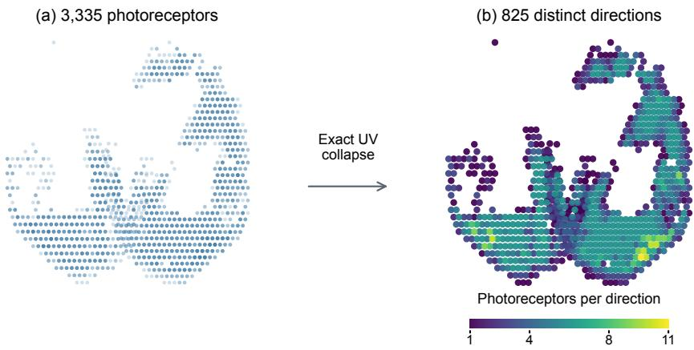  
Figure 6: Connectome-derived carrier construction. Left: 3,335 mapped MaleCNS photoreceptors in the common display projection, with coincident samples overplotted. Right: 825 distinct projected coordinates after exact duplicate collapse. All right-panel markers have the same size; color shows the number of source photoreceptors mapped to each direction.

Table 13 compares geometric summaries against three equal-count controls over the same forward cap. The connectome-derived directions cover 24.8% of uniformly sampled cap directions at their local half-spacing cone radius, while the controls cover 58.7% to 70.4%.

Table 13: Angular geometry of the 825-direction lattices. Coverage is the fraction of 20,000 uniformly sampled cap directions within the method’s cone radius. Random-cone values average the three registered seeds.
<table><tr><td>Lattice</td><td>Mean NN angle</td><td>Cone radius</td><td>Covered cap</td><td>P95 nearest angle</td></tr><tr><td>FlyMark</td><td>1.037°</td><td>0.532°</td><td>24.80%</td><td>8.105°</td></tr><tr><td>Fibonacci</td><td>1.770°</td><td>0.881°</td><td>70.41%</td><td>1.101°</td></tr><tr><td>Regular hex</td><td>1.631°</td><td>0.812°</td><td>58.97%</td><td>1.434°</td></tr><tr><td>Random cone</td><td>1.664°</td><td>0.819°</td><td>58.72%</td><td>1.201°</td></tr></table>

## F.2 ONE-FACTOR SENSITIVITY

All sensitivity settings use the four development/validation scenes with key 17 and change one factor from the frozen reference, so the reference row has a different scope from the ten-scene main estimate. The grid traces a smooth capacity and fidelity trade-off: 16 bits are recovered perfectly in this subset and 64 bits retain 96.48%; tighter color bounds raise PSNR and lower recovery, while a 0.04 bound reaches 100% at 40.28 dB; twelve or more orbit stops retain at least 97.66% clean bit accuracy; and smaller cones improve both recovery and fidelity here, while larger cones increase overlap among the constraints of the joint solve.

Table 14: One-factor-at-a-time sensitivity on four development/validation scenes. Bit accuracy and recomputed-mask accuracy are percentages.
<table><tr><td>Setting</td><td>Bit acc.</td><td>Recomputed</td><td>PSNR (dB)</td><td>LPIPS</td></tr><tr><td>Reference:  $B = 3 2 , \epsilon = \Delta = 0 . 0 2 , T = 2 4$ </td><td>100.00</td><td>99.22</td><td>46.02</td><td>0.0009</td></tr><tr><td>Message length = 16</td><td>100.00</td><td>100.00</td><td>46.05</td><td>0.0009</td></tr><tr><td>Message length = 64</td><td>96.48</td><td>96.48</td><td>46.32</td><td>0.0009</td></tr><tr><td>€ = 0.005</td><td>70.31</td><td>70.31</td><td>58.39</td><td>0.0000</td></tr><tr><td>€ = 0.01</td><td>87.50</td><td>88.28</td><td>52.47</td><td>0.0002</td></tr><tr><td>€ = 0.04</td><td>100.00</td><td>100.00</td><td>40.28</td><td>0.0032</td></tr><tr><td>∆ = 0.01</td><td>100.00</td><td>100.00</td><td>47.20</td><td>0.0011</td></tr><tr><td>∆ = 0.04</td><td>87.50</td><td>86.72</td><td>44.69</td><td>0.0013</td></tr><tr><td>∆ = 0.08</td><td>77.34</td><td>78.12</td><td>43.52</td><td>0.0015</td></tr><tr><td>Orbit stops = 8</td><td>94.53</td><td>93.75</td><td>48.65</td><td>0.0005</td></tr><tr><td>Orbit stops = 12</td><td>97.66</td><td>97.66</td><td>47.82</td><td>0.0007</td></tr><tr><td>Orbit stops = 48</td><td>98.44</td><td>99.22</td><td>45.01</td><td>0.0012</td></tr><tr><td>Orbit radius = 1.0ρ</td><td>100.00</td><td>100.00</td><td>47.01</td><td>0.0008</td></tr><tr><td>Orbit radius = 1.25ρ</td><td>100.00</td><td>100.00</td><td>46.46</td><td>0.0008</td></tr><tr><td>Orbit radius = 2.0ρ</td><td>92.19</td><td>92.19</td><td>47.12</td><td>0.0007</td></tr><tr><td>Orbit phase = 3.75°</td><td>97.66</td><td>97.66</td><td>46.00</td><td>0.0010</td></tr><tr><td>Orbit phase = 7.5°</td><td>98.44</td><td>98.44</td><td>46.13</td><td>0.0009</td></tr><tr><td>Elevation = 0°</td><td>97.66</td><td>97.66</td><td>46.28</td><td>0.0009</td></tr><tr><td>Elevation = 20°</td><td>99.22</td><td>99.22</td><td>46.26</td><td>0.0009</td></tr><tr><td>Elevation = 30°</td><td>97.66</td><td>97.66</td><td>45.98</td><td>0.0010</td></tr><tr><td>Cone multiplier = 0.25</td><td>100.00</td><td>100.00</td><td>48.32</td><td>0.0006</td></tr><tr><td>Cone multiplier = 0.75</td><td>89.06</td><td>88.28</td><td>45.66</td><td>0.0009</td></tr><tr><td>Cone multiplier = 1.0</td><td>88.28</td><td>85.94</td><td>46.19</td><td>0.0007</td></tr></table>

## G TWO-DIMENSIONAL IMAGE EXTENSION

We test whether the retinal carrier and keyed QIM code also work with raster images on the official BSDS500 natural-image collection (Arbeláez et al., 2011). All 100 validation images select the image-domain QIM step; all 200 disjoint test images are evaluated once with each of three keys. Images retain their native $3 2 1 \times 4 8 1$ or $4 8 1 \times 3 2 1$ pixel dimensions. There is no image-specific training or learned decoder.

Let $X _ { p } ^ { \mathrm { l i n } } ~ \in ~ [ 0 , 1 ] ^ { 3 }$ be linear RGB at pixel p, and let $A _ { j p } ^ { \mathrm { i m g } }$ be the bilinear sampling weight at retinal UV location j after exact collapse to 825 unique locations. The image-domain reading is $\begin{array} { r } { r _ { j } = \sum _ { p } A _ { j p } ^ { \mathrm { i m g } } \pmb { w } ^ { \top } X _ { p } ^ { \mathrm { l i n } } } \end{array}$ , where $\pmb { w } = ( 0 . 2 1 2 6 , 0 . 7 1 5 2 , 0 . 0 7 2 2 ) ^ { \top }$ is the luminance vector. Eligible readings lie in [0.05, 0.95]. As in the 3DGS method, keyed QIM assigns eligible readings to message bits modulo the message length and sets parity-constrained targets $q _ { j } .$ . An achromatic scalar change $\delta _ { p }$ to each writable pixel is found in one sparse bounded least-squares solve:

$$
\operatorname* { m i n } _ { \delta } \sum _ { j \in E } \left( \sum _ { p } A _ { j p } ^ { \mathrm { i m } } \delta _ { p } - ( q _ { j } - r _ { j } ) \right) ^ { 2 } , \quad | \delta _ { p } | \le 0 . 0 2 , \quad 0 \le X _ { p , c } ^ { \mathrm { l i n } } + \delta _ { p } \le 1 \mathrm { ~ f o r ~ e v e r y ~ } c .\tag{13}
$$

The result is stored as an 8-bit sRGB PNG. Quantized channel values are restricted to those that preserve the same 0.02 linear-RGB bound in the stored image, which is then reopened for extraction. The original eligible sample set is retained in the verification record.

We evaluate QIM steps {0.008, 0.012, 0.016} with key 17 on the complete validation split, ranking by clean bit accuracy and breaking ties by direct PSNR. This selects 0.008 before evaluating the test split. Each test image is marked with keys 17, 29, and 43 and measured after PNG storage. The primary metric is correct message bits divided by B; direct PSNR compares the saved PNG with the decoded source image in sRGB. We average keys within each image and then average images; intervals resample the 200 images 10,000 times. For ownership controls, the unmarked image is read under a matching key, while each wrong candidate key independently determines its dither and expected message.

Table 15 reports bit accuracy after PNG storage for the marked images and both ownership controls.

Table 15: 2D image bit accuracy on the complete BSDS500 test split (200 images, three marking keys per image). Higher is better. Confidence intervals use image-first bootstrap resampling; wrong-key scores average three candidate keys per marked image.
<table><tr><td>Condition</td><td>Bit accuracy (%)</td><td>95% CI (%)</td></tr><tr><td>Marked PNG</td><td>99.95</td><td>99.88 to 100.00</td></tr><tr><td>Unmarked, matched key</td><td>49.15</td><td>48.43 to 49.85</td></tr><tr><td>Marked, wrong candidate key</td><td>50.50</td><td>50.37 to 50.63</td></tr></table>

## H ADDITIONAL FIXED-VIEW QUALITATIVE RESULTS

Figures 7, 8, and 9 contain every registered qualitative view, taken at normalized positions 0.2, 0.5, and 0.8 of the sorted official test split. The indices were fixed before metric inspection, and each row compares all four published methods at exactly the same camera and crop. Every marked output is followed immediately by an equal-size absolute RGB difference from the matched reference, multiplied by ten under a shared display transform. In the line below each pair, the value before the slash is key-17 bit accuracy (%) and the value after it is direct PSNR (dB) for that frame; aggregate results are reported in Tables 1 and 2.

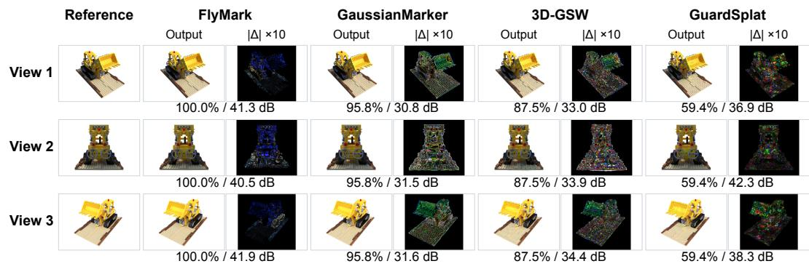  
Figure 7: Lego at registered frames 40, 100, and 159. For FLYMARK, GaussianMarker, 3D-GSW, and GuardSplat, the equal-size panel to the right of each output shows its 10× absolute RGB difference from the matched reference. The one-line values are key-17 bit accuracy (%) / direct PSNR (dB), with PSNR evaluated at the displayed frame.

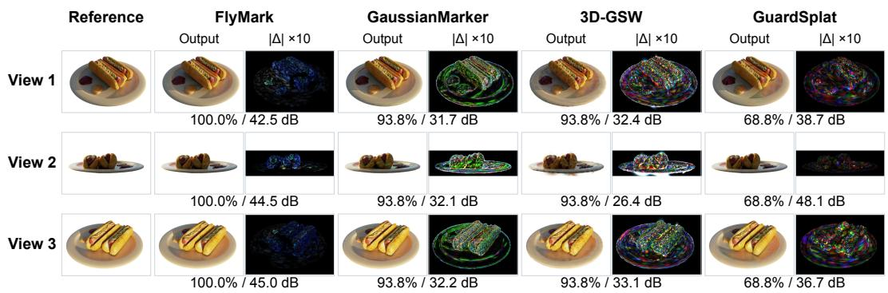  
Figure 8: Hotdog at registered frames 40, 100, and 159. For FLYMARK, GaussianMarker, 3D-GSW, and GuardSplat, the equal-size panel to the right of each output shows its 10× absolute RGB difference from the matched reference. The one-line values are key-17 bit accuracy (%) / direct PSNR (dB), with PSNR evaluated at the displayed frame.

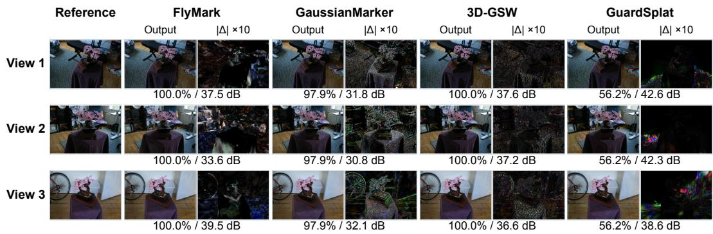  
Figure 9: Bonsai at registered frames 7, 18, and 29, including the targeted GuardSplat key-17 qualitative cell. For every method, the equal-size panel to the right of each output shows its 10× absolute RGB difference from the matched reference. The one-line values are key-17 bit accuracy (%) / direct PSNR (dB), with PSNR evaluated at the displayed frame.