# FROM SUPPRESSION TO REPAIR: MITIGATING OBJECT HALLUCINATION IN LARGE VISION-LANGUAGE MOD-ELS VIA LOCALIZED DISTRIBUTION ALIGNMENT

Chen Zhao1 Xingping Dong1,† Jiachun Shi1 Liang Peng1 Chong Wang1 Zhen Lei2 Ran He2 Bo Du¹

1School of Computer Science, Wuhan University 2Institute of Automation, Chinese Academy of Sciences

zhaochen.whu2026@gmail.comxingpingdong@whu.edu.cn 2023302111051@whu.edu.cnpengliang@whu.edu.cn cwang@whu.edu.cnzhen.lei@ia.ac.cn rhe@nlpr.ia.ac.cndubo@whu.edu.cn

## ABSTRACT

Object hallucination remains a major obstacle for large vision-language models (LVLMs) to generate reliable content. An intuitive mitigation strategy is to suppress hallucination-related components in hidden representations. However, these components may also contain useful information, and suppressing them can weaken the model's multimodal capabilities. In this paper, we propose ResOT, a training-free method that repairs representations at inference time through localized distribution alignment. Specifically, ResOT projects dominant hallucinated directions away from the faithful subspace, forming a low-dimensional residual subspace for intervention. Within this subspace, ResOT uses Gaussian optimal transport (OT) to align the hallucinated distribution with the faithful one. The resulting map defines repair targets with minimal changes to the original representations. At inference, ResOT adaptively controls how far each token state moves toward its OT target. Experiments on three representative LVLMs show that ResOT substantially reduces object hallucination while improving image caption quality and multimodal performance across multiple benchmarks. Code will be released.

## 1 INTRODUCTION

Large vision-language models (LVLMs) can generate fluent and informative responses to visual input (Bai et al., 2023; Chen et al., 2024b), but they still describe objects that are not present in the image. This phenomenon, known as object hallucination, undermines the reliability of LVLMs (Bai et al., 2024; Li et al., 2023; Rohrbach et al., 2018). One approach to reducing object hallucination is to fine-tune LVLMs with additional data, but this often incurs substantial training costs (Jiang et al., 2024; Liu et al., 2024a). Representation-based methods offer a training-free alternative by modifying the model's hidden representations (Liu et al., 2025; Lin et al., 2026). Some of these methods identify hallucination-related directions or subspaces and suppress the corresponding components (Yang et al., 2025a; Dastmalchi et al., 2026). However, being associated with hallucination does not make a component specific to hallucination (Hua et al., 2025; Zhu et al., 2026). The same components may also carry useful information for visual understanding, so suppressing them can compromise image caption quality or multimodal capabilities.

Therefore, we seek to repair the hallucination-related components rather than discard them. Instead of simply reducing the contribution of these components, we use their distribution in faithful representations to set repair targets. Figure 1 illustrates the key distinction: suppression-based interventions reduce the variation of hallucinated representations along the selected direction, but may also inadvertently alter faithful representations; in contrast, repair-based interventions use the faithful distribution to define where the representation should move.

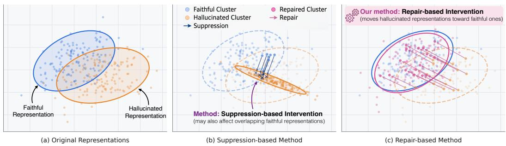  
Figure 1: Conceptual comparison of suppression and repair. (a) Faithful (blue) and hallucinated (orange) representations form partially overlapping clusters. (b) Suppression compresses the orange cluster into a narrow band and also displaces some faithful points (blue arrows). (c) Repair instead moves the orange points toward the blue cluster (pink arrows), forming the repaired cluster in pink.

The choice of alignment space is also important, as it determines which distributional differences the repair addresses. The dominant faithful subspace is spanned by the leading directions of faithful representations. We examine a low-dimensional residual subspace orthogonal to it. Our held-out analysis shows that this residual subspace reveals a clearer mismatch between faithful and hallucinated representations (Section 4.4). Importantly, faithful representations are not confined to their dominant subspace; they still have components in the residual subspace. Removing these components would discard variation present in faithful representations. These observations motivate localized distribution alignment: expose and correct the residual mismatch while leaving components in the dominant faithful subspace unchanged.

In this paper, we introduce ResOT, a training-free method that implements this localized repair at inference time. During offline calibration, ResOT processes each image with its paired faithful and hallucinated descriptions to collect two sets of hidden representations. It estimates the dominant subspaces of these representations, then projects the dominant hallucinated directions away from the faithful subspace. The leading residual directions define the repair subspace. We project both sets of calibration representations into this subspace and fit a Gaussian distribution to each. Gaussian optimal transport (OT) then provides a closed-form map from the hallucinated distribution to the faithful one. During inference, ResOT projects the current token state into the same subspace and applies the map to obtain its repair target. A likelihood-based gate compares the projected state's likelihood under the two fitted distributions and controls how far it moves toward the target. The resulting correction is added back to the hidden state along the residual directions, leaving the orthogonal component unchanged. The LVLM weights remain fixed throughout calibration and inference.

Our theoretical analysis supports the repair subspace and transport target. The residual subspace captures as much of the dominant hallucinated directions as possible while remaining orthogonal to the dominant faithful subspace, helping expose the residual differences to be repaired. In this subspace, if components are removed via orthogonal projection, suppression cannot match the original faithful distribution as long as those components are also present in the faithful representation. Gaussian OT instead aligns the fitted residual distributions with minimum expected squared displacement.

We combined ResOT with LLaVA-1.5, mPLUG-Owl2, and InstructBLIP (Liu et al., 2023; Ye et al., 2024; Dai et al., 2023) and conducted experiments on multiple benchmarks. The results demonstrate that ResOT reduces object hallucination while improving image caption quality and multimodal performance. Compared to the vanilla models, it reduces the CHAIRs metric by 13.9%-46.8% and achieves average relative improvements of 27.67% and 5.86% on the BLEU-1 and MME metrics (Papineni et al., 2002; Fu et al., 2025), respectively. On LLaVA-1.5, ResOT achieves the highest throughput among the evaluated inference-time methods that keep the LVLM weights unchanged. It retains 81.24% of the original model's generation throughput (tokens per second) while requiring only an additional 8.15 MiB of peak GPU memory.

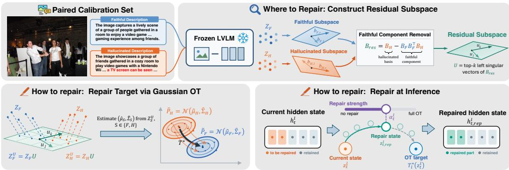  
Figure 2: Overview of ResOT. Where to repair (top): the orange hallucinated directions are projected away from the blue faithful subspace to form the green residual subspace. How to repair (bottom): Gaussian OT aligns the orange and blue residual distributions to define repair targets (left); a likelihood-based gate controls the movement toward each target during inference (right).

## 2 RELATED WORK

## 2.1 HALLUCINATION IN LARGE VISION-LANGUAGE MODELS

Object hallucination in LVLMs has been studied from multiple perspectives, such as visual perception, cross-modal alignment, and reliance on language priors (Zhao et al., 2025; Jain et al., 2024; Xing et al., 2024; Liu et al., 2024b). One line of research involves training-based methods, which typically use supervised fine-tuning (Liu et al., 2024a), contrastive learning (Jiang et al., 2024), RLHF (Sun et al., 2024), and DPO (Yang et al., 2025b; Yu et al., 2024a). However, these methods often require additional supervision signals and parameter optimization. Other approaches focus on interventions during decoding. They adjust token selections through visual contrast (Leng et al., 2024; Chen et al., 2024a), attention signals (Zhou et al., 2025; Huang et al., 2024), or intermediatelayer predictions (Wang et al., 2025; Chuang et al., 2024). Although these methods avoid retraining, they can introduce substantial inference overhead due to extra forward passes or complex decoding procedures. Post-hoc approaches revise unsupported content using learned revisors (Zhou et al., 2024) or visual verification (Yin et al., 2024). These methods add a correction stage after generation.

ResOT is most closely related to representation-based interventions. Existing methods steer latent activations (Liu et al., 2025; Li et al., 2025), intervene on attention heads (Chen et al., 2025), or suppress hallucination-related components (Yang et al., 2025a; Dastmalchi et al., 2026). More selective approaches use evidence-consistent subspace editing (Lin et al., 2026) or targeted parameter updates (Zhu et al., 2026) to limit interference with useful information. ResOT instead defines a faithful target distribution within a residual subspace. Its key distinction is the use of distribution alignment rather than component removal to determine the update.

## 2.2 OPTIMAL TRANSPORT FOR REPRESENTATION ALIGNMENT

Optimal transport (OT) aligns distributions by finding a transport plan that minimizes the cost of moving probability mass between them (Villani, 2009; Peyré & Cuturi, 2019). It has been widely used for feature alignment and domain adaptation (Courty et al., 2017; Damodaran et al., 2018). Empirical OT estimates a coupling between samples, often using iterative solvers such as Sinkhorn (Cuturi, 2013). Under squared Euclidean cost, the OT map between non-degenerate Gaussian distributions has a closed-form affine expression determined by their means and covariances (Peyré & Cuturi, 2019). ResOT uses this map to define repair targets in a low-dimensional residual subspace. The map is estimated offline and applied during generation, without an online transport solver.

## 3 METHOD

ResOT consists of two stages: offline calibration and online repair, as shown in Figure 2. During calibration, a residual subspace is identified at each selected layer, and a Gaussian optimal transport

map is estimated within this subspace. During inference, ResOT uses this map to define a repair target for the current token state and adaptively controls the movement toward that target.

## 3.1 LVLM GENERATION AND CALIBRATION REPRESENTATIONS

An LVLM encodes an image V into visual features and maps them to the input space of the language decoder (Liu et al., 2023; Dai et al., 2023; Ye et al., 2024). By combining these visual features with the prompt text $x ,$ the decoder can generate a response autoregressively. At decoding step $t ,$ the available context consists of the image, the prompt, and the previously generated tokens $y _ { < t }$ . We denote by $h _ { t } ^ { \ell } \in \mathbb { R } ^ { d }$ the hidden state at the final text position in layer $\ell ,$ computed from this context (i.e., the state prior to the generation of $y _ { t } )$

Like prior representation-based interventions (Yang et al., 2025a; Zhu et al., 2026), ResOT uses a paired calibration set to determine where to repair and how the repair should be performed. The set contains N images, each paired with a faithful description and a hallucinated description. We process the two image-description inputs separately and extract the hidden state at the final text position of each complete description. At each selected layer, stacking these states gives $Z _ { F } ^ { \ell } , Z _ { H } ^ { \ell } \in$ $\mathbb { R } ^ { N \times d }$ . We refer to them as faithful and hallucinated representations according to the descriptions from which they are extracted.

ResOT estimates its subspaces and transport maps from these complete descriptions and reuses them at the current decoding position. This follows the strategy of deriving textual steering directions from final-position representations of paired captions and applying them during generation (Liu et al., 2025). During the calibration and inference stages, the parameters of the LVLM remain fixed.

## 3.2 RESIDUAL SUBSPACE REPRESENTATION REPAIR

## 3.2.1 LOCATING THE REPAIR SUBSPACE

ResOT constructs a repair subspace from the dominant hallucinated directions that lie outside the dominant faithful subspace. This step projects the hallucinated basis to select intervention directions. For clarity, we omit the layer index l when describing offline calibration.

Given $Z _ { F } , Z _ { H } \in \mathbb { R } ^ { N \times d }$ , we compute their singular value decompositions: $Z _ { F } ~ = ~ L _ { F } S _ { F } R _ { F } ^ { \intercal }$ ${ \cal Z } _ { H } ~ = ~ { \cal L } _ { H } { \cal S } _ { H } { \cal R } _ { H } ^ { \top }$ . With the right singular vectors ordered by the decreasing singular value, we use the top-r columns of $R _ { F }$ and $R _ { H }$ to form $B _ { F } ~ = ~ [ b _ { F , 1 } , b _ { F , 2 } , \ldots , b _ { F , r } ] ~ \in ~ \mathbb { R } ^ { d \times r }$ and $B _ { H } = [ b _ { H , 1 } , b _ { H , 2 } , \ldots , b _ { H , r } ] \in \mathbb { R } ^ { d \times r }$ , where $B _ { F }$ and $B _ { H }$ are orthonormal bases for the dominant faithful and hallucinated subspaces. The projection of $B _ { H }$ onto the faithful subspace is $B _ { F } B _ { F } ^ { \top } B _ { H }$ Removing this component gives

$$
B _ { \mathrm { r e s } } = B _ { H } - B _ { F } B _ { F } ^ { \top } B _ { H } = ( I _ { d } - B _ { F } B _ { F } ^ { \top } ) B _ { H } .\tag{1}
$$

We compute $B _ { \mathrm { r e s } } = \bar { L } \bar { S } \bar { R } ^ { \top }$ and let $q = \mathrm { r a n k } ( B _ { \mathrm { r e s } } )$ . For $k \leq q .$ the residual basis is $U = { \bar { L } } [ :$ $, 1 : k ] \ \bar { \in } \ \mathbb { R } ^ { d \times k }$ . Its columns are orthonormal and satisfy $B _ { F } ^ { \top } U = 0$ . All subsequent updates lie in span(U), leaving components in the dominant faithful subspace unchanged. However, faithful representations are not confined to their dominant subspace and can still have nonzero components in the residual subspace. We therefore use the distribution of these components as a reference for repair rather than setting all residual components to zero.

## 3.2.2 GAUSSIAN OPTIMAL TRANSPORT IN THE RESIDUAL SUBSPACE

After obtaining the residual subspace, we project both sets of calibration representations into the residual subspace: $Z _ { F } ^ { U } = Z _ { F } U , \dot { Z _ { H } ^ { U } } = Z _ { H } \dot { U }$ , where each row is a k-dimensional residual coordinate vector. Let $( \hat { \mu } _ { F } , \hat { \Sigma } _ { F } )$ and $( \hat { \mu } _ { H } , \hat { \Sigma } _ { H } )$ denote their empirical means and covariances. Critically, a finite calibration set may produce noisy or ill-conditioned covariance estimates. We therefore apply covariance shrinkage (Ledoit & Wolf, 2004) before computing the transport map:

$$
\hat { \Sigma } _ { s }  ( 1 - \rho ) \hat { \Sigma } _ { s } + \rho \frac { \mathrm { t r } ( \hat { \Sigma } _ { s } ) } { k } I _ { k } + \epsilon I _ { k } , \qquad s \in \{ F , H \} .\tag{2}
$$

Here, $\rho ~ \in ~ [ 0 , 1 ]$ is the shrinkage coefficient, and $\epsilon > 0$ ensures positive definiteness. We then approximate the residual distributions as $\boldsymbol { \tilde { P } _ { F } } = \mathcal { N } ( \boldsymbol { \hat { \mu } _ { F } } , \boldsymbol { \hat { \Sigma } _ { F } } )$ and $\boldsymbol { \tilde { P } _ { H } } = \mathcal { N } ( \boldsymbol { \hat { \mu } _ { H } } , \boldsymbol { \hat { \Sigma } _ { H } } )$

We seek a map that transports the hallucinated approximation to the faithful one with minimum expected squared displacement:

$$
T ^ { \star } = \arg \operatorname* { m i n } _ { T \in { \mathcal { T } } } \mathbb { E } _ { z \sim { \tilde { P } } _ { H } } \left\| T ( z ) - z \right\| _ { 2 } ^ { 2 } \quad \mathrm { s u b j e c t ~ t o } \quad T _ { \# } { \tilde { P } } _ { H } = { \tilde { P } } _ { F } .\tag{3}
$$

Here, $\tau$ denotes measurable maps from $\mathbb { R } ^ { k }$ to $\mathbb { R } ^ { k }$ , and $T _ { \# } \tilde { P } _ { H }$ is the distribution obtained by applying $T$ to samples from $\tilde { P } _ { H }$ . For non-degenerate Gaussian distributions, the optimal map has a closedform affine solution (Brenier, 1991; Peyré & Cuturi, 2019):

$$
T ^ { \star } ( z ) = \hat { \mu } _ { F } + A ( z - \hat { \mu } _ { H } ) ,\tag{4}
$$

where $A = \hat { \Sigma } _ { H } ^ { - { \frac { 1 } { 2 } } } \left( \hat { \Sigma } _ { H } ^ { \frac { 1 } { 2 } } \hat { \Sigma } _ { F } \hat { \Sigma } _ { H } ^ { \frac { 1 } { 2 } } \right) ^ { \frac { 1 } { 2 } } \hat { \Sigma } _ { H } ^ { - { \frac { 1 } { 2 } } }$ . The map exactly aligns the fitted Gaussian distributions and defines a full OT target $T ^ { \star } ( z )$ for each residual state $z .$ Since U has orthonormal columns,

$$
\left\| U ( T ^ { \star } ( z ) - z ) \right\| _ { 2 } = \left\| T ^ { \star } ( z ) - z \right\| _ { 2 } .\tag{5}
$$

Thus, the displacement measured in residual coordinates equals the magnitude of the corresponding correction in the original hidden space.

## 3.2.3 REPAIR AT INFERENCE

At inference, ResOT decomposes the current hidden state into residual and orthogonal components. For the residual component, the OT map defines a full repair target, while a likelihood-based gate determines how much of the correction is applied. Subsequently, this repaired residual component is combined with the unchanged orthogonal component to form the repaired hidden state.

Each selected layer l has a residual basis $U ^ { \ell }$ and an OT map $T _ { \ell } ^ { \star }$ , both estimated offline. At decoding step $t ,$ we compute

$$
\begin{array} { r } { z _ { t } ^ { \ell } = ( U ^ { \ell } ) ^ { \top } h _ { t } ^ { \ell } , \qquad h _ { t , \perp } ^ { \ell } = \big ( I _ { d } - U ^ { \ell } ( U ^ { \ell } ) ^ { \top } \big ) h _ { t } ^ { \ell } . } \end{array}\tag{6}
$$

The full OT target is $\tilde { z } _ { t } ^ { \ell } = T _ { \ell } ^ { \star } ( z _ { t } ^ { \ell } )$ . The OT map defines where the residual state should move, but it does not determine how strongly the full correction should be applied to each decoding state. We therefore use a likelihood-based gate to adjust the fraction of the correction applied to each state:

$$
\boldsymbol { s } _ { t } ^ { \ell } = \frac { 1 } { k } \left[ \log \mathcal { N } \left( \boldsymbol { z } _ { t } ^ { \ell } ; \hat { \boldsymbol { \mu } } _ { H } ^ { \ell } , \hat { \boldsymbol { \Sigma } } _ { H } ^ { \ell } \right) - \log \mathcal { N } \left( \boldsymbol { z } _ { t } ^ { \ell } ; \hat { \boldsymbol { \mu } } _ { F } ^ { \ell } , \hat { \boldsymbol { \Sigma } } _ { F } ^ { \ell } \right) \right] , \qquad \boldsymbol { g } _ { t } ^ { \ell } = \sigma ( \boldsymbol { s } _ { t } ^ { \ell } ) ,\tag{7}
$$

where $\sigma$ is the sigmoid function. A large $g _ { t } ^ { \ell }$ indicates stronger relative evidence for the hallucinated approximation and assigns a larger fraction of the OT correction. We set $\alpha _ { t } ^ { \ell } = \alpha g _ { t } ^ { \ell }$ , where $\alpha \in [ 0 , 1 ]$ is the global repair strength. We then interpolate between the current residual state and its OT target:

$$
z _ { t , \mathrm { r e p } } ^ { \ell } = ( 1 - \alpha _ { t } ^ { \ell } ) z _ { t } ^ { \ell } + \alpha _ { t } ^ { \ell } \tilde { z } _ { t } ^ { \ell } .\tag{8}
$$

Combining this coordinate with the unchanged orthogonal component, we have

$$
h _ { t , \mathrm { r e p } } ^ { \ell } = h _ { t } ^ { \ell } + \alpha _ { t } ^ { \ell } U ^ { \ell } ( T _ { \ell } ^ { \star } ( z _ { t } ^ { \ell } ) - z _ { t } ^ { \ell } ) .\tag{9}
$$

In practice, we additionally clip the norm of the OT correction to prevent unusually large updates.   
The repaired state then proceeds through the remaining frozen decoder layers.

## 3.2.4 THEORETICAL ANALYSIS

We next analyze ResOT's residual subspace construction and Gaussian OT, and compare them with projection-based suppression methods, which we model as a rank-reducing orthogonal projection. All proofs are provided in Appendix $\mathbf { A } .$

Proposition 1. Let $B _ { \mathrm { r e s } } = ( I _ { d } - B _ { F } B _ { F } ^ { \top } ) B _ { H }$ , and $U \in \mathbb { R } ^ { d \times k }$ contain its top-k left singular vectors, where $k \leq \mathrm { r a n k } ( B _ { \mathrm { r e s } } )$ . For any orthonormal basis $V \in \mathbb { R } ^ { d \times k }$ satisfying $B _ { F } ^ { \top } V = 0$

$$
\left\| V ^ { \top } B _ { H } \right\| _ { F } ^ { 2 } \leq \left\| U ^ { \top } B _ { H } \right\| _ { F } ^ { 2 } = \sum _ { i = 1 } ^ { k } \sigma _ { i } ^ { 2 } ( B _ { \mathrm { r e s } } ) .
$$

This term $\big \| V ^ { \top } B _ { H } \big \| _ { F } ^ { 2 }$ measures the total squared projection of the dominant hallucinated directions onto à candidate subspace. ResOT maximizes this for a fixed dimension, while excluding the dominant faithful subspace.

Proposition 2. Let $\tilde { P } _ { H } , \tilde { P } _ { F } \in \mathcal { P } _ { 2 } ( \mathbb { R } ^ { k } )$ , where $\mathcal { P } _ { 2 } ( \mathbb { R } ^ { k } )$ denotes probability distributions with finite second moments. Let $\mu _ { F }$ and $\Sigma _ { F }$ be the mean and covariance of $\tilde { P } _ { F }$ For $T _ { \Pi } ( z ) = \Pi z$ , where $\Pi = \Pi ^ { \top } = \Pi ^ { 2 }$ and rank(πI) < k,

$$
\begin{array} { r } { W _ { 2 } ^ { 2 } \big ( ( T _ { \Pi } ) _ { \# } \tilde { P } _ { H } , \tilde { P } _ { F } \big ) = W _ { 2 } ^ { 2 } \big ( ( T _ { \Pi } ) _ { \# } \tilde { P } _ { H } , ( T _ { \Pi } ) _ { \# } \tilde { P } _ { F } \big ) + \big \| ( I _ { k } - \Pi ) \mu _ { F } \big \| _ { 2 } ^ { 2 } + \operatorname { t r } \big ( ( I _ { k } - \Pi ) \Sigma _ { F } \big ) . } \end{array}
$$

The first term measures the degree of mismatch within the retained subspace. The remaining terms equal the expected squared norm of the faithful component that was removed by projection. If this value is positive, even when the projected distribution matches perfectly, there will still be a positive Wasserstein distance from the original faithful distribution.

Proposition 3. Let $Z \in \mathbb { R } ^ { k }$ be any random vector with finite second moment, mean $\mu _ { H }$ and covariance $\Sigma _ { H } \in \mathbb { S } _ { + + } ^ { k }$ . Given a target $\overset { \cdot } { \mu } _ { F } \in \mathbb { R } ^ { k }$ and $\Sigma _ { F } \in \mathbb { S } _ { + + } ^ { \tilde { k } }$ defne

$$
\begin{array} { r } {  { \mathcal { A } } _ { H  F } = \{ T _ { A } ( z ) = \mu _ { F } + A ( z - \mu _ { H } )  { \vert } A \Sigma _ { H } A ^ { \top } = \Sigma _ { F } \} . } \end{array}
$$

Then the Gaussian OT map $T ^ { \star }$ is the unique minimizer:

$$
T ^ { \star } = \arg \operatorname* { m i n } _ { T _ { A } \in \mathcal { A } _ { H  F } } \mathbb { E } [ | | T _ { A } ( Z ) - Z | | _ { 2 } ^ { 2 } ] .
$$

This objective depends only on the first two moments of the source distribution. Therefore, the same affine map remains optimal without assuming that the source distribution is Gaussian. When both the source and target distributions are Gaussian, this map also aligns their complete distributions; otherwise, the proposition guarantees only the optimality of the affine moment matching.

## 4 EXPERIMENTS

We organize our evaluation around three questions. RQ1: Does ResOT reduce object hallucination while maintaining caption quality? RQ2: Does ResOT preserve multimodal performance? RQ3: How do ResOT's residual subspace and OT-based repair affect task performance, and how robust is the method to calibration size and corruption?

## 4.1 EXPERIMENTAL SETUP

Baselines. ResOT is calibrated using 5,000 paired descriptions from the LURE training data (Zhou et al., 2024). We compare ResOT against vanilla LVLMs and two categories of training-free mitigation methods. The vanilla baselines are LLaVA-1.5 (Liu et al., 2023), mPLUG-Owl2 (Ye et al., 2024), and InstructBLIP (Dai et al., 2023), all equipped with 7B language decoders and evaluated using greedy decoding. Decoding-time baselines include OPERA (Huang et al., 2024), VCD (Leng et al., 2024), HALC (Chen et al., 2024a), and SGRS (Zhang et al., 2026). Representation-level baselines include ICT (Chen et al., 2025), VTI (Liu et al., 2025), VISTA (Li et al., 2025), Nullu (Yang et al., 2025a), HulluEdit (Lin et al., 2026), and Revis (Wu et al., 2026).

Benchmarks and Metrics. We evaluate ResOT along three dimensions: object hallucination, generation quality, and multimodal performance. POPE (Li et al., 2023) measures discriminative object hallucination through yes/no object-existence questions. We report accuracy, precision, and F1 score. CHAIR (Rohrbach et al., 2018) evaluates hallucinated objects in open-ended captions using CHAIRs $( \mathbf { C } _ { s } )$ and CHAIRi (Ci), while BLEU-1 (Papineni et al., 2002) evaluates caption quality. MME (Fu et al., 2025) evaluates multimodal perception and cognition. We further use GPT-4o to assess the accuracy and detail of open-ended descriptions on sampled COCO images (Lin et al., 2014). To broaden the evaluation, we assess hallucination on MMHal-Bench and AMBER (Sun et al., 2024; Wang et al., 2023). We also evaluate multimodal capabilities on ScienceQA, MM-Bench, TextVQA, MMMU, and MM-Vet (Lu et al., 2022; Liu et al., 2024c; Singh et al., 2019; Yue et al., 2024; Yu et al., 2024b). Full results are reported in Appendix C.

Table 1: Average POPE results across the random, popular and adversarial splits. Higher values indicate better performance. The best results are highlighted in bold.
<table><tr><td rowspan="2">Method</td><td colspan="3">LLaVA-1.5</td><td colspan="3">mPLUG-Owl2</td><td colspan="3">InstructBLIP</td></tr><tr><td>Acc. ↑</td><td>Prec. ↑</td><td>F1↑</td><td>Acc. ↑</td><td>Prec. ↑</td><td>F1↑</td><td>Acc. ↑</td><td>Prec. ↑</td><td>F1↑</td></tr><tr><td>Vanilla</td><td>84.20</td><td>82.30</td><td>84.67</td><td>78.23</td><td>72.07</td><td>81.07</td><td>84.17</td><td>83.07</td><td>84.60</td></tr><tr><td>OPERA</td><td>84.67</td><td>83.37</td><td>85.13</td><td>79.77</td><td>74.37</td><td>82.03</td><td>85.00</td><td>83.93</td><td>85.43</td></tr><tr><td>VCD</td><td>81.13</td><td>77.83</td><td>82.30</td><td>76.73</td><td>70.83</td><td>79.77</td><td>75.97</td><td>78.20</td><td>81.63</td></tr><tr><td>HALC</td><td>84.83</td><td>82.80</td><td>85.53</td><td>78.30</td><td>72.23</td><td>81.13</td><td>84.60</td><td>83.37</td><td>85.13</td></tr><tr><td>VISTA</td><td>84.23</td><td>80.03</td><td>85.47</td><td>76.00</td><td>69.33</td><td>79.70</td><td>85.20</td><td>84.87</td><td>85.50</td></tr><tr><td>ICT</td><td>85.43</td><td>83.10</td><td>86.07</td><td>79.07</td><td>73.37</td><td>81.57</td><td>55.50</td><td>53.00</td><td>69.20</td></tr><tr><td>VTI</td><td>85.21</td><td>81.73</td><td>86.23</td><td>80.09</td><td>79.75</td><td>81.96</td><td>83.70</td><td>81.00</td><td>84.63</td></tr><tr><td>Nullu</td><td>85.53</td><td>86.07</td><td>85.70</td><td>77.87</td><td>71.60</td><td>80.87</td><td>84.63</td><td>83.20</td><td>85.20</td></tr><tr><td>Revis</td><td>85.19</td><td>82.15</td><td>86.09</td><td>78.24</td><td>72.10</td><td>81.12</td><td>84.82</td><td>83.78</td><td>85.30</td></tr><tr><td>HulluEdit</td><td>85.63</td><td>82.76</td><td>86.46</td><td>79.64</td><td>74.59</td><td>81.72</td><td>83.08</td><td>80.25</td><td>84.14</td></tr><tr><td>SGRS</td><td>85.12</td><td>81.96</td><td>86.05</td><td>78.01</td><td>71.78</td><td>80.98</td><td>84.46</td><td>83.09</td><td>85.03</td></tr><tr><td>ResOT</td><td>86.13</td><td>84.43</td><td>86.54</td><td>82.50</td><td>81.57</td><td>82.49</td><td>86.15</td><td>86.93</td><td>85.94</td></tr></table>

Table 2: Captioning results on COCO evaluated by CHAIR and BLEU-1. Lower $\mathbf { C } _ { s }$ and $\mathrm { C } _ { i }$ indicate fewer hallucinated objects, while higher BLEU-1 indicates better caption quality. The maximum generation length is set to 512 tokens. The best results are highlighted in bold.
<table><tr><td rowspan="2">Method</td><td colspan="3">LLaVA-1.5</td><td colspan="3">mPLUG-Owl2</td><td colspan="3">InstructBLIP</td></tr><tr><td>Cs↓</td><td>Ci↓</td><td>BLEU-1 ↑</td><td>Cs↓</td><td>Ci↓</td><td>BLEU-1 ↑</td><td>Cs↓</td><td>Ci ↓</td><td>BLEU-1 ↑</td></tr><tr><td>Vanilla</td><td>0.514</td><td>0.1451</td><td>0.1739</td><td>0.568</td><td>0.1639</td><td>0.1559</td><td>0.462</td><td>0.1310</td><td>0.1740</td></tr><tr><td>OPERA</td><td>0.454</td><td>0.1317</td><td>0.1769</td><td>0.488</td><td>0.1503</td><td>0.1769</td><td>0.398</td><td>0.1242</td><td>0.1524</td></tr><tr><td>VCD</td><td>0.484</td><td>0.1437</td><td>0.1743</td><td>0.580</td><td>0.1808</td><td>0.1689</td><td>0.566</td><td>0.1808</td><td>0.1698</td></tr><tr><td>HALC</td><td>0.380</td><td>0.1270</td><td>0.1870</td><td>0.500</td><td>0.1432</td><td>0.1762</td><td>0.620</td><td>0.1770</td><td>0.1580</td></tr><tr><td>VISTA</td><td>0.436</td><td>0.1336</td><td>0.1619</td><td>0.528</td><td>0.1638</td><td>0.1426</td><td>0.434</td><td>0.1345</td><td>0.1508</td></tr><tr><td>ICT</td><td>0.498</td><td>0.1439</td><td>0.1797</td><td>0.716</td><td>0.2037</td><td>0.1585</td><td>0.482</td><td>0.1349</td><td>0.1196</td></tr><tr><td>VTI</td><td>0.322</td><td>0.1195</td><td>0.2017</td><td>0.314</td><td>0.1194</td><td>0.2087</td><td>0.428</td><td>0.1236</td><td>0.1379</td></tr><tr><td>Nullu</td><td>0.394</td><td>0.1150</td><td>0.1581</td><td>0.412</td><td>0.1395</td><td>0.1830</td><td>0.440</td><td>0.1429</td><td>0.1658</td></tr><tr><td>Revis</td><td>0.430</td><td>0.1361</td><td>0.1740</td><td>0.460</td><td>0.1489</td><td>0.1711</td><td>0.440</td><td>0.1211</td><td>0.1744</td></tr><tr><td>HulluEdit</td><td>0.404</td><td>0.1287</td><td>0.1669</td><td>0.362</td><td>0.1324</td><td>0.1515</td><td>0.442</td><td>0.1203</td><td>0.1633</td></tr><tr><td>SGRS</td><td>0.348</td><td>0.1132</td><td>0.2091</td><td>0.330</td><td>0.1188</td><td>0.1798</td><td>0.436</td><td>0.1288</td><td>0.1757</td></tr><tr><td>ResOT</td><td>0.292</td><td>0.0953</td><td>0.2334</td><td>0.302</td><td>0.0898</td><td>0.2293</td><td>0.398</td><td>0.1146</td><td>0.1770</td></tr></table>

## 4.2 OBJECT HALLUCINATION AND CAPTION QUALITY (RQ1)

To answer RQ1, we evaluate ResOT in two settings. POPE measures discriminative object hallucination, while CHAIR measures hallucination in open-ended image captioning. We also assess caption quality using BLEU-1 and a GPT-based evaluation of visual accuracy and detailedness.

Results on POPE. Table 1 reports results averaged over the random, popular, and adversarial splits. ResOT achieves the highest accuracy and F1 score across all three backbones. It also obtains the highest precision on mPLUG-Owl2 and InstructBLIP. These improvements show that ResOT improves object existence judgments across the three LVLMs.

Results on CHAIR. Table 2 evaluates open-ended COCO captions. ResOT achieves the lowest $\mathrm { C } _ { s }$ and $\mathrm { C } _ { i } .$ These reductions are accompanied by higher BLEU-1 scores, rather than a decline in reference-based image description quality. Table 5 reports additional captioning metrics.

GPT-based Evaluation. We use GPT-4o to compare descriptions on the 500 COCO validation images selected by OPERA. Following the evaluation prompt used in previous works (Wang et al., 2025; Yang et al., 2025a), we repeat the scoring five times and report the mean scores. We compare ResOT with the vanilla backbone and Nullu, a representative suppression-based method. As shown in Table 3, ResOT achieves higher accuracy than both baselines across all three backbones and higher detailedness in five of the six comparisons. These results demonstrate improved visual faithfulness while retaining informative content.

Table 3: GPT-4o evaluation on COCO image descriptions. Each entry reports the baseline/ResOT scores for visual accuracy (Acc.) and detailedness (Det.); higher values indicate better performance.
<table><tr><td rowspan="2">Backbone</td><td colspan="2">Vanilla vs. ResOT</td><td colspan="2">Nullu vs. ResOT</td></tr><tr><td>Acc.</td><td>Det.</td><td>Acc.</td><td>Det.</td></tr><tr><td>LLaVA-1.5</td><td>5.72 / 6.77</td><td>6.09 / 5.81</td><td>6.22 / 6.32</td><td>5.76 / 5.82</td></tr><tr><td>mPLUG-Owl2</td><td>5.65 / 6.52</td><td>5.90 / 5.94</td><td>6.38 / 6.88</td><td>6.22 / 6.24</td></tr><tr><td>InstructBLIP</td><td>5.68 / 6.38</td><td>5.82 / 5.94</td><td>5.36 / 6.48</td><td>5.72 / 6.00</td></tr></table>

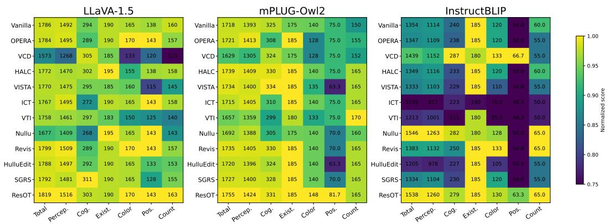  
Figure 3: MME results across three LVLM backbones. Each cell reports the raw score, while color intensity indicates the normalized score within each metric. We report the total, perception and cognition scores, together with four perception subcategories: existence, color, position and count.

## 4.3 MULTIMODAL CAPABILITY ASSESSMENT (RQ2)

To answer RQ2, we use MME to evaluate multimodal performance, which covers both perception and cognition. Additional experimental results are reported in Appendix C.2.

Results on multimodal capability benchmarks. Figure 3 reports MME results. ResOT improves the total, perception, and cognition scores over the vanilla model on all three backbones. It achieves the highest total and perception scores on LLaVA-1.5 and mPLUG-Owl2, together with the best or tied-best results in most object-related subcategories. We further experiment on other multimodal capability benchmarks. Across MMMU, TextVQA, ScienceQA, and MMBench, ResOT outperformed Vanilla in 9 out of 12 settings (Table 9). These results demonstrate that ResOT preserves and often improves broader multimodal performance.

## 4.4 ANALYSIS OF LOCALIZED REPRESENTATION REPAIR

To answer RQ3, we compare ResOT with Nullu via representation visualizations and ablations of the intervention subspace and repair operation. We also evaluate calibration sample efficiency and robustness to contamination. More mechanism analyses are provided in Appendix D.

Representation Distribution Visualization. In our held-out analysis, we use 4,000 calibration pairs to estimate the parameters, while the remaining 1,000 pairs are used for visualization and quantitative analysis. Figure 4 visualizes the representations at layer 24. We can see that the residual subspace exposes a clearer difference between faithful and hallucinated representations than the original and Nullu-style subspaces. Since there is still overlap between these two distributions, the residual subspace should not be interpreted as containing only hallucination-specific features. OT repair reduces the mismatch without discarding the residual components. This provides empirical evidence for the distinction between localization and suppression.

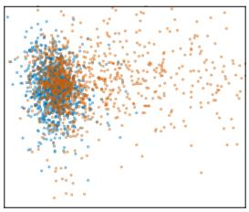

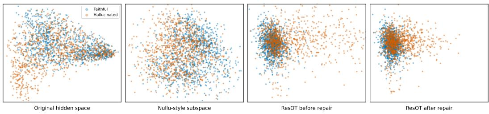

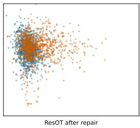

Figure 4: Representation visualization at layer 24. From left to right: the original representation space, the Nullu-style subspace, and the ResOT residual subspace before and after repair. Faithful and hallucinated representations are evaluated on the held-out split. We use PCA for visualization.  
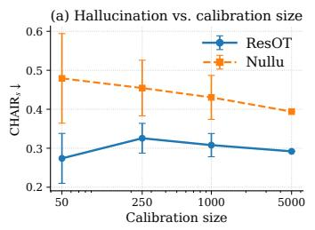

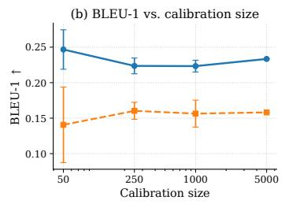

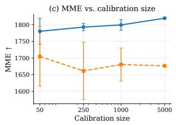

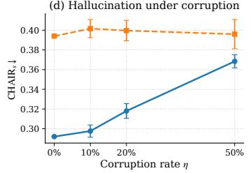

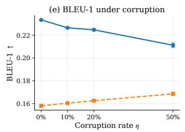

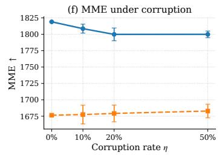  
Figure 5: Effect of calibration size and corruption. We compare ResOT and Nullu under different calibration sizes and corruption rates. Error bars denote the standard deviation across random trials.

Table 4: Ablation study results on subspace construction and intervention operations.

Ablation Study. Table 4 separates the effects of the intervention subspace, repair operation, and likelihood-based gate. We first compare subspaces using ungated Gaussian OT. The residual subspace achieves lower $\mathrm { C } _ { s }$ and higher BLEU-1 and MME than either the random or Nullu-style subspace, showing that the choice of repair subspace is crucial. With the residual subspace fixed, replacing suppression with ungated Gaussian OT achieves better results. Mean-only alignment improves over sup-

<table><tr><td>Variant</td><td> ${ \mathrm { C } } _ { s } \downarrow$ </td><td>BLEU-1 ↑ MME↑</td></tr><tr><td> $\mathrm { R a n d S u b + O T }$ </td><td>0.516</td><td>0.1748 1787.17</td></tr><tr><td> $\mathrm { N u l l u S u b + O T }$ </td><td>0.424</td><td>0.1681 1764.82</td></tr><tr><td> ${ \mathrm { R e s S u b } } + { \mathrm { S u p } }$ </td><td>0.378</td><td>0.1903 1784.96</td></tr><tr><td> $\mathrm { R e s S u b + M e a n }$ </td><td>0.320</td><td>0.2140 1798.35</td></tr><tr><td> $\mathrm { R e s S u b + O T w / o \ G a t e }$ </td><td>0.292</td><td>0.2268 1814.17</td></tr><tr><td> $\mathrm { R e s S u b + O T \ w / G a t e }$ </td><td>0.292</td><td>0.2334 1819.02</td></tr></table>

pression but remains below Gaussian OT on all three metrics. Therefore, matching covariance as well as the mean provides an additional benefit. At the same reported $\mathrm { C } _ { s } .$ adding the likelihoodbased gate further improves BLEU-1 and MME.

Calibration Set Analysis. Figure 5 examines the effect of calibration size and corruption. In experiments controlling for the number of calibration pairs, ResOT already outperforms Nullu in $\mathrm { C } _ { s } ,$ BLEU-1, and MME with only 50 calibration pairs. Performance variability across trials generally decreases as the calibration set grows. We also corrupt an η fraction of the calibration pairs, with the corrupted samples split evenly between image-text mismatches and faithful/hallucinated label swaps. As the corruption rate η increases, ResOT retains its advantage over Nullu on all three metrics. These results demonstrate that ResOT remains effective with few calibration pairs and is robust to imperfect calibration data.

## 5 CONCLUSION

In this work, we introduce ResOT, which mitigates object hallucination by repairing hallucinationrelated representations rather than directly suppressing them. ResOT confines the intervention to the residual subspace and uses Gaussian optimal transport to move representations toward a faithful target with minimum expected squared displacement. A likelihood-based gate further adjusts how much of this correction is applied during decoding. Across multiple benchmarks and three representative LVLMs, ResOT consistently reduces object hallucination while preserving or even improving image caption quality and broader multimodal performance. These results indicate that hallucination-related components do not always need to be removed; repairing their distribution provides a practical alternative to direct suppression.

## REFERENCES

Peter Anderson, Basura Fernando, Mark Johnson, and Stephen Gould. Spice: Semantic propositional image caption evaluation. In European conference on computer vision, pp. 382–398. Springer, 2016.

Jinze Bai, Shuai Bai, Shusheng Yang, Shijie Wang, Sinan Tan, Peng Wang, Junyang Lin, Chang Zhou, and Jingren Zhou. Qwen-vl: A versatile vision-language model for understanding, localization, text reading, and beyond. arXiv preprint arXiv:2308.12966, 2023.

Zechen Bai, Pichao Wang, Tianjun Xiao, Tong He, Zongbo Han, Zheng Zhang, and Mike Zheng Shou. Hallucination of multimodal large language models: A survey. arXiv preprint arXiv:2404.18930, 2024.

Yann Brenier. Polar factorization and monotone rearrangement of vector-valued functions. Communications on Pure and Applied Mathematics, 44(4):375–417, 1991. doi: 10.1002/cpa. 3160440402.

Junzhe Chen, Tianshu Zhang, Shiyu Huang, Yuwei Niu, Linfeng Zhang, Lijie Wen, and Xuming Hu. Ict: Image-object cross-level trusted intervention for mitigating object hallucination in large vision-language models. In Proceedings of the Computer Vision and Pattern Recognition Conference, pp. 4209–4221, 2025.

Zhaorun Chen, Zhuokai Zhao, Hongyin Luo, Huaxiu Yao, Bo Li, and Jiawei Zhou. Halc: Object hallucination reduction via adaptive focal-contrast decoding. In Proceedings of the 41st International Conference on Machine Learning, volume 235, pp. 7824–7846, 2024a.

Zhe Chen, Jiannan Wu, Wenhai Wang, Weijie Su, Guo Chen, Sen Xing, Muyan Zhong, Qinglong Zhang, Xizhou Zhu, Lewei Lu, et al. Internvl: Scaling up vision foundation models and aligning for generic visual-linguistic tasks. In Proceedings of the IEEE/CVF conference on computer vision and pattern recognition, pp. 24185–24198, 2024b.

Yung-Sung Chuang, Yujia Xie, Hongyin Luo, Yoon Kim, James R Glass, and Pengcheng He. Dola: Decoding by contrasting layers improves factuality in large language models. In International Conference on Learning Representations, volume 2024, pp. 54158–54183, 2024.

Nicolas Courty, Rémi Flamary, Devis Tuia, and Alain Rakotomamonjy. Optimal transport for domain adaptation. IEEE Transactions on Pattern Analysis and Machine Intelligence, 39(9):1853– 1865, 2017.

Marco Cuturi. Sinkhorn distances: Lightspeed computation of optimal transport. In Advances in Neural Information Processing Systems, volume 26, 2013.

Wenliang Dai, Junnan Li, Dongxu Li, Anthony Tiong, Junqi Zhao, Weisheng Wang, Boyang Li, Pascale N Fung, and Steven Hoi. Instructblip: Towards general-purpose vision-language models with instruction tuning. Advances in neural information processing systems, 36:49250–49267, 2023.

Bharath Bhushan Damodaran, Benjamin Kellenberger, Rémi Flamary, Devis Tuia, and Nicolas Courty. Deepjdot: Deep joint distribution optimal transport for unsupervised domain adaptation. In Proceedings of the European Conference on Computer Vision, pp. 467–483, 2018.

Hamidreza Dastmalchi, Aijun An, Ali Cheraghian, and Hamed Barzamini. Fighting hallucinations with counterfactuals: Diffusion-guided perturbations for lvlm hallucination suppression. In Proceedings of the IEEE/CVF Conference on Computer Vision and Pattern Recognition (CVPR), 2026.

Chaoyou Fu, Peixian Chen, Yunhang Shen, Yulei Qin, Mengdan Zhang, Xu Lin, Jinrui Yang, Xiawu Zheng, Ke Li, Xing Sun, et al. Mme: A comprehensive evaluation benchmark for multimodal large language models. In Advances in Neural Information Processing Systems, volume 38, pp. 162549–162567, 2025.

Jack Hessel, Ari Holtzman, Maxwell Forbes, Ronan Le Bras, and Yejin Choi. Clipscore: A reference-free evaluation metric for image captioning. In Proceedings of the 2021 conference on empirical methods in natural language processing, pp. 7514–7528, 2021.

Zhenglin Hua, Jinghan He, Zijun Yao, Tianxu Han, Haiyun Guo, Yuheng Jia, and Junfeng Fang. Steering LVLMs via sparse autoencoder for hallucination mitigation. In Findings of the Association for Computational Linguistics: EMNLP 2025, pp. 10808–10828, 2025.

Qidong Huang, Xiaoyi Dong, Pan Zhang, Bin Wang, Conghui He, Jiaqi Wang, Dahua Lin, Weiming Zhang, and Nenghai Yu. Opera: Alleviating hallucination in multi-modal large language models via over-trust penalty and retrospection-allocation. In Proceedings of the IEEE/CVF Conference on Computer Vision and Pattern Recognition, pp. 13418–13427, 2024.

Jitesh Jain, Jianwei Yang, and Humphrey Shi. Vcoder: Versatile vision encoders for multimodal large language models. In 2024 IEEE/CVF Conference on Computer Vision and Pattern Recognition (CVPR), pp. 27992–28002. IEEE, 2024.

Chaoya Jiang, Haiyang Xu, Mengfan Dong, Jiaxing Chen, Wei Ye, Ming Yan, Qinghao Ye, Ji Zhang, Fei Huang, and Shikun Zhang. Hallucination augmented contrastive learning for multimodal large language model. In Proceedings of the IEEE/CVF Conference on Computer Vision and Pattern Recognition, pp. 27036–27046, 2024.

Olivier Ledoit and Michael Wolf. A well-conditioned estimator for large-dimensional covariance matrices. Journal of Multivariate Analysis, 88(2):365–411, 2004.

Sicong Leng, Hang Zhang, Guanzheng Chen, Xin Li, Shijian Lu, Chunyan Miao, and Lidong Bing. Mitigating object hallucinations in large vision-language models through visual contrastive decoding. In Proceedings of the IEEE/CVF Conference on Computer Vision and Pattern Recognition, pp. 13872–13882, 2024.

Yifan Li, Yifan Du, Kun Zhou, Jinpeng Wang, Xin Zhao, and Ji-Rong Wen. Evaluating object hallucination in large vision-language models. In Proceedings of the 2023 conference on empirical methods in natural language processing, pp. 292–305, 2023.

Zhuowei Li, Haizhou Shi, Yunhe Gao, Di Liu, Zhenting Wang, Yuxiao Chen, Ting Liu, Long Zhao, Hao Wang, and Dimitris N. Metaxas. The hidden life of tokens: Reducing hallucination of large vision-language models via visual information steering. In International Conference on Machine Learning, pp. 35799–35819, 2025.

Chin-Yew Lin. Rouge: A package for automatic evaluation of summaries. In Text Summarization Branches Out, pp. 74–81. Association for Computational Linguistics, 2004.

Tsung-Yi Lin, Michael Maire, Serge Belongie, James Hays, Pietro Perona, Deva Ramanan, Piotr Dollár, and C Lawrence Zitnick. Microsoft coco: Common objects in context. In European conference on computer vision, pp. 740–755. Springer, 2014.

Yangguang Lin, Quan Fang, Yufei Li, Jiachen Sun, Junyu Gao, and Jitao Sang. Hulluedit: Singlepass evidence-consistent subspace editing for mitigating hallucinations in large vision-language models. In Proceedings of the IEEE/CVF Conference on Computer Vision and Pattern Recognition, pp. 11086–11095, 2026.

Fuxiao Liu, Kevin Lin, Linjie Li, Jianfeng Wang, Yaser Yacoob, and Lijuan Wang. Mitigating hallucination in large multi-modal models via robust instruction tuning. In International Conference on Learning Representations, volume 2024, pp. 57689–57733, 2024a.

Haotian Liu, Chunyuan Li, Qingyang Wu, and Yong Jae Lee. Visual instruction tuning. Advances in neural information processing systems, 36:34892–34916, 2023.

Sheng Liu, Haotian Ye, and James Y Zou. Reducing hallucinations in large vision-language models via latent space steering. In International Conference on Learning Representations, volume 2025, pp. 72402–72419, 2025.

Shi Liu, Kecheng Zheng, and Wei Chen. Paying more attention to image: A training-free method for alleviating hallucination in lvlms. In European Conference on Computer Vision, pp. 125–140. Springer, 2024b.

Yuan Liu, Haodong Duan, Yuanhan Zhang, Bo Li, Songyang Zhang, Wangbo Zhao, Yike Yuan, Jiaqi Wang, Conghui He, Ziwei Liu, Kai Chen, and Dahua Lin. MMBench: Is your multi-modal model an all-around player? In European Conference on Computer Vision, pp. 216–233. Springer, 2024c.

Pan Lu, Swaroop Mishra, Tanglin Xia, Liang Qiu, Kai-Wei Chang, Song-Chun Zhu, Oyvind Tafjord, Peter Clark, and Ashwin Kalyan. Learn to explain: Multimodal reasoning via thought chains for science question answering. In Advances in Neural Information Processing Systems, volume 35, pp. 2507–2521. Curran Associates, Inc., 2022.

Kishore Papineni, Salim Roukos, Todd Ward, and Wei-Jing Zhu. Bleu: a method for automatic evaluation of machine translation. In Proceedings of the 40th Annual Meeting of the Association for Computational Linguistics, pp. 311–318, 2002.

Gabriel Peyré and Marco Cuturi. Computational optimal transport. Foundations and Trends in Machine Learning, 11(5–6):355–607, 2019.

Anna Rohrbach, Lisa Anne Hendricks, Kaylee Burns, Trevor Darrell, and Kate Saenko. Object hallucination in image captioning. In Proceedings of the 2018 Conference on Empirical Methods in Natural Language Processing, pp. 4035–4045, 2018.

Amanpreet Singh, Vivek Natarajan, Meet Shah, Yu Jiang, Xinlei Chen, Dhruv Batra, Devi Parikh, and Marcus Rohrbach. Towards VQA models that can read. In Proceedings of the IEEE/CVF Conference on Computer Vision and Pattern Recognition, pp. 8317–8326, 2019.

Zhiqing Sun, Sheng Shen, Shengcao Cao, Haotian Liu, Chunyuan Li, Yikang Shen, Chuang Gan, Liangyan Gui, Yu-Xiong Wang, Yiming Yang, Kurt Keutzer, and Trevor Darrell. Aligning large multimodal models with factually augmented RLHF. In Findings of the Association for Computational Linguistics: ACL 2024, pp. 13088–13110. Association for Computational Linguistics, 2024.

Cédric Villani. Optimal Transport: Old and New, volume 338. Springer, 2009.

Chenxi Wang, Xiang Chen, Ningyu Zhang, Bozhong Tian, Haoming Xu, Shumin Deng, and Huajun Chen. Mllm can see? dynamic correction decoding for hallucination mitigation. In International Conference on Learning Representations, volume 2025, pp. 13712–13736, 2025.

Junyang Wang, Yuhang Wang, Guohai Xu, Jing Zhang, Yukai Gu, Haitao Jia, Jiaqi Wang, Haiyang Xu, Ming Yan, Ji Zhang, and Jitao Sang. AMBER: An LLM-free multi-dimensional benchmark for MLLMs hallucination evaluation. arXiv preprint arXiv:2311.07397, 2023.

Jialin Wu, Wei Shi, Han Shen, Peigui Qi, Kunsheng Tang, Zhicong Huang, Binghao Wang, and Zhou Yang. Revis: Sparse latent steering to mitigate object hallucination in large vision-language models. In Forty-third International Conference on Machine Learning, 2026.

Yun Xing, Yiheng Li, Ivan Laptev, and Shijian Lu. Mitigating object hallucination via concentric causal attention. Advances in neural information processing systems, 37:92012–92035, 2024.

Le Yang, Ziwei Zheng, Boxu Chen, Zhengyu Zhao, Chenhao Lin, and Chao Shen. Nullu: Mitigating object hallucinations in large vision-language models via halluspace projection. In Proceedings of the Computer Vision and Pattern Recognition Conference, pp. 14635–14645, 2025a.

Zhihe Yang, Xufang Luo, Dongqi Han, Yunjian Xu, and Dongsheng Li. Mitigating hallucinations in large vision-language models via dpo: On-policy data hold the key. In Proceedings of the IEEE/CVF Conference on Computer Vision and Pattern Recognition, pp. 10610–10620, 2025b.

Qinghao Ye, Haiyang Xu, Jiabo Ye, Ming Yan, Anwen Hu, Haowei Liu, Qi Qian, Ji Zhang, and Fei Huang. mplug-owl2: Revolutionizing multi-modal large language model with modality collaboration. In Proceedings of the ieee/cvf conference on computer vision and pattern recognition, pp. 13040–13051, 2024.

Shukang Yin, Chaoyou Fu, Sirui Zhao, Tong Xu, Hao Wang, Dianbo Sui, Yunhang Shen, Ke Li, Xing Sun, and Enhong Chen. Woodpecker: Hallucination correction for multimodal large language models. Science China Information Sciences, 67(12):220105, 2024.

Tianyu Yu, Yuan Yao, Haoye Zhang, Taiwen He, Yifeng Han, Ganqu Cui, Jinyi Hu, Zhiyuan Liu, Hai-Tao Zheng, Maosong Sun, and Tat-Seng Chua. Rlhf-v: Towards trustworthy mllms via behavior alignment from fine-grained correctional human feedback. In Proceedings of the IEEE/CVF Conference on Computer Vision and Pattern Recognition, pp. 13807–13816, 2024a.

Weihao Yu, Zhengyuan Yang, Linjie Li, Jianfeng Wang, Kevin Lin, Zicheng Liu, Xinchao Wang, and Lijuan Wang. MM-vet: Evaluating large multimodal models for integrated capabilities. In Proceedings of the 41st International Conference on Machine Learning, volume 235 of Proceedings of Machine Learning Research, pp. 57730–57754. PMLR, 2024b.

Xiang Yue, Yuansheng Ni, Kai Zhang, Tianyu Zheng, Ruoqi Liu, Ge Zhang, Samuel Stevens, Dongfu Jiang, Weiming Ren, Yuxuan Sun, Cong Wei, Botao Yu, Ruibin Yuan, Renliang Sun, Ming Yin, Boyuan Zheng, Zhenzhu Yang, Yibo Liu, Wenhao Huang, Huan Sun, Yu Su, and Wenhu Chen. MMMU: A massive multi-discipline multimodal understanding and reasoning benchmark for expert AGI. In Proceedings of the IEEE/CVF Conference on Computer Vision and Pattern Recognition, pp. 9556–9567, 2024.

Xiaofeng Zhang, Yuanchao Zhu, Chaochen Gu, Xiaosong Yuan, Qiyan Zhao, Jiawei Cao, Barrett Tang, Sinan Fan, Yaomin Shen, Chen Shen, and Hao Tang. Hallucination begins where saliency drops. In International Conference on Learning Representations, volume 2026, pp. 15062–15083, 2026.

Linxi Zhao, Yihe Deng, Weitong Zhang, and Quanquan Gu. Mitigating object hallucination in large vision-language models via image-grounded guidance. In ICML 2025, 2025.

Guanyu Zhou, Yibo Yan, Xin Zou, Kun Wang, Aiwei Liu, and Xuming Hu. Mitigating modality prior-induced hallucinations in multimodal large language models via deciphering attention causality. In International Conference on Learning Representations, 2025.

Yiyang Zhou, Chenhang Cui, Jaehong Yoon, Linjun Zhang, Zhun Deng, Chelsea Finn, Mohit Bansal, and Huaxiu Yao. Analyzing and mitigating object hallucination in large vision-language models. In International Conference on Learning Representations, volume 2024, pp. 56969– 56998, 2024.

Xingyu Zhu, Junfeng Fang, Shuo Wang, Beier Zhu, Zhicai Wang, Yonghui Yang, and Xiangnan He. Mitigating hallucinations in large vision-language models without performance degradation. In Proceedings of the 64th Annual Meeting of the Association for Computational Linguistics, pp. 1995–2009, 2026.

## A PROOF

## A.1 PROOF OF PROPOSITION 1

Since $B _ { F }$ has orthonormal columns,

$$
B _ { F } ^ { \top } B _ { \mathrm { r e s } } = B _ { F } ^ { \top } ( I _ { d } - B _ { F } B _ { F } ^ { \top } ) B _ { H } = 0 .
$$

Therefore, every left singular vector of $B _ { \mathrm { r e s } }$ associated with a nonzero singular value is orthogonal to $\mathrm { S p a n } ( B _ { F } )$ . Since $k \leq \mathrm { r a n k } ( B _ { \mathrm { r e s } } )$ , the selected basis $U$ satisfies $B _ { F } ^ { \top } U \bar { = } 0$

Now consider any feasible orthonormal basis V such that $B _ { F } ^ { \top } V ~ = ~ 0$ . This condition gives $V ^ { \top } B _ { F } B _ { F } ^ { \top } = 0$ , and hence,

$$
V ^ { \top } B _ { H } = V ^ { \top } ( I _ { d } - B _ { F } B _ { F } ^ { \top } ) B _ { H } = V ^ { \top } B _ { \mathrm { r e s } } .
$$

Let $\boldsymbol { B _ { \mathrm { r e s } } } = \boldsymbol { Q \Sigma R } ^ { \intercal }$ be a full singular value decomposition with $Q = [ q _ { 1 } , . . . , q _ { d } ]$ and $\sigma _ { 1 } \geq \cdots \geq$ $\sigma _ { d } \geq 0$ . Then

$$
\left\| V ^ { \top } B _ { H } \right\| _ { F } ^ { 2 } = \left\| V ^ { \top } B _ { \mathrm { r e s } } \right\| _ { F } ^ { 2 } = \sum _ { i = 1 } ^ { d } { \sigma _ { i } ^ { 2 } \left\| V ^ { \top } q _ { i } \right\| _ { 2 } ^ { 2 } } .
$$

Define $a _ { i } = \left\| V ^ { \top } q _ { i } \right\| _ { 2 } ^ { 2 }$ .Since $V ^ { \top } V = I _ { k }$ and $Q$ is orthogonal, we have

$$
\sum _ { i = 1 } ^ { d } a _ { i } = \operatorname { t r } ( V ^ { \top } Q Q ^ { \top } V ) = k , \qquad 0 \leq a _ { i } \leq 1 .
$$

The singular values are ordered in decreasing order, so the weighted sum is maximized by placing unit weight on the first k terms:

$$
\sum _ { i = 1 } ^ { d } \sigma _ { i } ^ { 2 } a _ { i } \le \sum _ { i = 1 } ^ { k } \sigma _ { i } ^ { 2 } .
$$

This upper bound is attained by $V = U = [ q _ { 1 } , . . . , q _ { k } ]$ . Since $U ^ { \top } B _ { H } = U ^ { \top } B _ { \mathrm { r e s } } ,$ , we obtain

$$
\left\| V ^ { \top } B _ { H } \right\| _ { F } ^ { 2 } \leq \left\| U ^ { \top } B _ { H } \right\| _ { F } ^ { 2 } = \sum _ { i = 1 } ^ { k } \sigma _ { i } ^ { 2 } ( B _ { \mathrm { r e s } } ) .
$$

This proves the claim.

## A.2 PROOF OF PROPOSITION 2

Let $Q _ { H } = ( T _ { \Pi } ) _ { \# } { \tilde { P } } _ { H }$ and $Q _ { F } = ( T _ { \Pi } ) _ { \# } { \tilde { P } } _ { F }$ , where $T _ { \Pi } ( z ) = \Pi z$ . Consider any coupling $\gamma \in$ $\Pi ( Q _ { H } , \tilde { P } _ { F } )$ and let $( X , Y ) \sim \gamma$ . Because X lies in the range of II, we have $\Pi X \ = \ X$ and $( I _ { k } - \Pi ) X = 0$ . The retained and removed components are orthogonal, so

$$
\begin{array} { c } { { | | X - Y | | _ { 2 } ^ { 2 } = | | \Pi ( X - Y ) | | _ { 2 } ^ { 2 } + | | ( I _ { k } - \Pi ) ( X - Y ) | | _ { 2 } ^ { 2 } } } \\ { { = | | \Pi ( X - Y ) | | _ { 2 } ^ { 2 } + | | ( I _ { k } - \Pi ) Y | | _ { 2 } ^ { 2 } . } } \end{array}
$$

The joint distribution of (X, IIY) is a coupling of $Q _ { H }$ and $Q _ { F }$ . Therefore,

$$
\mathbb { E } _ { \gamma } \left[ | | X - \Pi Y | | _ { 2 } ^ { 2 } \right] \geq W _ { 2 } ^ { 2 } ( Q _ { H } , Q _ { F } ) .
$$

The second term depends only on the marginal distribution of $Y$ , which gives

$$
\mathbb { E } _ { \gamma } \left[ | | ( I _ { k } - \Pi ) Y | | _ { 2 } ^ { 2 } \right] = \mathbb { E } _ { Y \sim \tilde { P } _ { F } } [ | | ( I _ { k } - \Pi ) Y | | _ { 2 } ^ { 2 } ] .
$$

It follows that

$$
W _ { 2 } ^ { 2 } ( Q _ { H } , \tilde { P } _ { F } ) \geq W _ { 2 } ^ { 2 } ( Q _ { H } , Q _ { F } ) + \mathbb { E } _ { Y \sim \tilde { P } _ { F } } [ | | ( I _ { k } - \Pi ) Y | | _ { 2 } ^ { 2 } ] .
$$

It remains to show that this lower bound is attainable. Let $\eta$ be an optimal coupling between $Q _ { H }$ and $Q _ { F }$ . Sample $( X , U ) \sim \eta ,$ and then sample $Y$ from the conditional distribution of $\tilde { P } _ { F }$ given $\Pi Y = U$ . This gives a coupling between $Q _ { H }$ and $\tilde { P } _ { F }$ for which $( X , \Pi Y ) \sim \eta$ Hence,

$$
\begin{array} { r } { \mathbb { E } \left[ | | X - Y | | _ { 2 } ^ { 2 } \right] = \mathbb { E } \left[ | | X - \Pi Y | | _ { 2 } ^ { 2 } \right] + \mathbb { E } \left[ | | ( I _ { k } - \Pi ) Y | | _ { 2 } ^ { 2 } \right] } \\ { = W _ { 2 } ^ { 2 } ( Q _ { H } , Q _ { F } ) + \mathbb { E } _ { Y \sim \tilde { P } _ { F } } \left[ | | ( I _ { k } - \Pi ) Y | | _ { 2 } ^ { 2 } \right] . } \end{array}
$$

Combining the two inequalities gives

$$
W _ { 2 } ^ { 2 } ( Q _ { H } , \tilde { P } _ { F } ) = W _ { 2 } ^ { 2 } ( Q _ { H } , Q _ { F } ) + \mathbb { E } _ { Y \sim \tilde { P } _ { F } } \left[ | | ( I _ { k } - \Pi ) Y | | _ { 2 } ^ { 2 } \right] .
$$

Let $\mu _ { F }$ and $\Sigma _ { F }$ be the mean and covariance of $\tilde { P } _ { F }$ . The remaining expectation can be written as

$$
\begin{array} { r l } & { \mathbb { E } \left[ | | ( I _ { k } - \Pi ) Y | | _ { 2 } ^ { 2 } \right] = | | ( I _ { k } - \Pi ) \mu _ { F } | | _ { 2 } ^ { 2 } + \operatorname { t r } \big ( ( I _ { k } - \Pi ) \Sigma _ { F } ( I _ { k } - \Pi ) \big ) } \\ & { \qquad = | | ( I _ { k } - \Pi ) \mu _ { F } | | _ { 2 } ^ { 2 } + \operatorname { t r } \big ( ( I _ { k } - \Pi ) \Sigma _ { F } \big ) . } \end{array}
$$

Substituting this expression gives

$$
\begin{array} { r } { W _ { 2 } ^ { 2 } \big ( ( T _ { \Pi } ) _ { \# } \tilde { P } _ { H } , \tilde { P } _ { F } \big ) = W _ { 2 } ^ { 2 } \big ( ( T _ { \Pi } ) _ { \# } \tilde { P } _ { H } , ( T _ { \Pi } ) _ { \# } \tilde { P } _ { F } \big ) } \\ { + \left. ( I _ { k } - \Pi ) _ { \# } F \right. _ { 2 } ^ { 2 } + \mathrm { t r } \big ( ( I _ { k } - \Pi ) \Sigma _ { F } \big ) . } \end{array}
$$

Thus, whenever the removed subspace contains nonzero faithful energy, the projected distribution remains at a strictly positive Wasserstein distance from $\tilde { P } _ { F }$ □

## A.3 PROOF OF PROPOSITION 3

Let $X = Z - \mu _ { H }$ and $\delta = \mu _ { F } - \mu _ { H }$ . Then $\mathbb { E } \left[ X \right] = 0 , \operatorname { C o v } ( X ) = \Sigma _ { H }$ , and

$$
T _ { A } ( Z ) - Z = \delta + ( A - I _ { k } ) X .
$$

Since the cross term has zero expectation,

$$
\begin{array} { r l } & { \mathbb { E } \left[ | | T _ { A } ( Z ) - Z | | _ { 2 } ^ { 2 } \right] = | | \delta | | _ { 2 } ^ { 2 } + \mathbb { E } \left[ | | ( A - I _ { k } ) X | | _ { 2 } ^ { 2 } \right] } \\ & { \quad \quad \quad = | | \delta | | _ { 2 } ^ { 2 } + \mathrm { t r } \left[ ( A - I _ { k } ) \Sigma _ { H } ( A - I _ { k } ) ^ { \top } \right] } \\ & { \quad \quad \quad = | | \mu _ { F } - \mu _ { H } | | _ { 2 } ^ { 2 } + \mathrm { t r } ( \Sigma _ { H } ) + \mathrm { t r } ( A \Sigma _ { H } A ^ { \top } ) - 2 \mathrm { t r } ( A \Sigma _ { H } ) } \\ & { \quad \quad = | | \mu _ { F } - \mu _ { H } | | _ { 2 } ^ { 2 } + \mathrm { t r } ( \Sigma _ { H } ) + \mathrm { t r } ( \Sigma _ { F } ) - 2 \mathrm { t r } ( A \Sigma _ { H } ) . } \end{array}
$$

The first three terms are independent of A. Thus, minimizing the expected distortion is equivalent to solving

$$
\operatorname* { m a x } _ { A : A \Sigma _ { H } A ^ { \top } = \Sigma _ { F } } \mathrm { t r } ( A \Sigma _ { H } ) .
$$

For any feasible A, define $Q = \Sigma _ { F } ^ { - \frac { 1 } { 2 } } A \Sigma _ { H } ^ { \frac { 1 } { 2 } }$ . The feasibility constraint implies

$$
Q Q ^ { \top } = \Sigma _ { F } ^ { - { \frac { 1 } { 2 } } } A \Sigma _ { H } A ^ { \top } \Sigma _ { F } ^ { - { \frac { 1 } { 2 } } } = I _ { k } .
$$

So $Q$ is orthogonal. We can write $A = \Sigma _ { F } ^ { \frac { 1 } { 2 } } Q \Sigma _ { H } ^ { - \frac { 1 } { 2 } }$ , which gives $\mathrm { t r } ( A \Sigma _ { H } ) = \mathrm { t r } ( Q \Sigma _ { H } ^ { \frac { 1 } { 2 } } \Sigma _ { F } ^ { \frac { 1 } { 2 } } )$ . Let $M = \Sigma _ { H } ^ { \frac { 1 } { 2 } } \Sigma _ { F } ^ { \frac { 1 } { 2 } }$ . By the von Neumann trace inequality, for any orthogonal $Q .$

$$
\mathrm { t r } ( Q M ) \leq \vert \vert M \vert \vert _ { \star } = \mathrm { t r } \left( ( M M ^ { \top } ) ^ { \frac { 1 } { 2 } } \right) .
$$

Since $M M ^ { \top } = \Sigma _ { H } ^ { \frac { 1 } { 2 } } \Sigma _ { F } \Sigma _ { H } ^ { \frac { 1 } { 2 } }$ , we have

$$
\mathrm { t r } ( { \cal A } \Sigma _ { H } ) \leq \mathrm { t r } \left[ ( \Sigma _ { H } ^ { \frac { 1 } { 2 } } \Sigma _ { F } \Sigma _ { H } ^ { \frac { 1 } { 2 } } ) ^ { \frac { 1 } { 2 } } \right] .
$$

We define $S = ( \Sigma _ { H } ^ { \frac { 1 } { 2 } } \Sigma _ { F } \Sigma _ { H } ^ { \frac { 1 } { 2 } } ) ^ { \frac { 1 } { 2 } }$ . The proposed matrix $A ^ { \star } = \Sigma _ { H } ^ { - \frac { 1 } { 2 } } S \Sigma _ { H } ^ { - \frac { 1 } { 2 } }$ is feasible. Furthermore,

$$
\mathrm { t r } ( A ^ { \star } \Sigma _ { H } ) = \mathrm { t r } ( \Sigma _ { H } ^ { - \frac { 1 } { 2 } } S \Sigma _ { H } ^ { \frac { 1 } { 2 } } ) = \mathrm { t r } ( S ) .
$$

Therefore, $A ^ { \star }$ attains the upper bound and therefore minimizes the expected displacement. It remains to show that the minimizer is unique. Let $M = U \Lambda V ^ { \top }$ be a singular value decomposition of $M$ Since $\Sigma _ { H }$ and $\Sigma _ { F }$ are positive definite, every singular value in $\Lambda$ is strictly positive. For any orthogonal $Q .$

$$
\operatorname { t r } ( Q M ) = \operatorname { t r } ( V ^ { \top } Q U \Lambda ) \leq \operatorname { t r } ( \Lambda ) .
$$

The equality holds only when $V ^ { \top } Q U = I _ { k } .$ Hence, the corresponding feasible A is unique. Since $A ^ { \star }$ attains the maximum, it is the unique minimizer. Consequently, $T ^ { \star }$ is the unique affine map that matches the first and second moments of the target with the smallest expected squared change, even when the source distribution is non-Gaussian. □

## B IMPLEMENTATION AND EVALUATION DETAILS

Backbones and Calibration Data. We evaluate ResOT on LLaVA-1.5-7B, InstructBLIP-Vicuna-7B, and mPLUG-Owl2-LLaMA2-7B. For the vanilla models and ResOT, we use greedy decoding. For each backbone, we use the same 5,000 calibration pairs from the LURE training data (Zhou et al., 2024). Each pair contains an image from the COCO training set, a faithful caption from LLaVA-Instruct-150K, and a corresponding hallucinated caption generated by GPT-3.5.

Evaluation Protocols. For POPE, we evaluate on the random, popular, and adversarial splits, each containing 3,000 samples. We parse each response by checking whether its first generated word is “yes" or “no"; otherwise, the prediction is labeled as unknown and counted as incorrect. For CHAIR, we evaluate object hallucination on the COCO 2014 validation set (Lin et al., 2014). Following prior work (Huang et al., 2024; Yang et al., 2025a), we use the subset of 500 images selected by OPERA for evaluation. We use the fixed prompt: Please describe this image in detail. For MME, we follow the official yes/no evaluation protocol. Each image is paired with two questions, and the score combines question-level accuracy with image-level pair accuracy. For GPT-assisted open-ended evaluation, we use GPT-4o as an external judge to assess image description quality. Given an image, the prompt and two model responses, GPT-4o assigns each response a score from 1 to 10 for visual accuracy and detailedness. We repeat each comparison five times and report the mean score.

Baseline Implementation. We compare with decoding-based methods, including OPERA, VCD, HALC, and SGRS, and representation-level methods, including ICT, VTI, VISTA, Nullu, HulluEdit, and Revis. For each baseline, we use the official code and the hyperparameters recommended in the corresponding paper. Vanilla and ResOT use greedy decoding. OPERA uses beam search with five beams, while SGRS uses saliency-guided top-k rejection sampling. Within each benchmark, we keep the LVLM backbone, prompt, and maximum generation length the same across all methods.

Hyperparameter Settings. ResOT uses two rank parameters. The rank r determines the number of dominant directions used to estimate the faithful and hallucinated subspaces, while k determines the dimension of the residual repair subspace. We set $r \ = \ k$ and select this shared rank from {8, 16, 32, 64, 128}. The repair strength α is selected from $\{ 0 . 1 , 0 . 2 , \ldots , 1 . 0 \}$ . At each decoding step, repair is applied only to the final-position hidden state in decoder layers 16–31. We set the covariance shrinkage coefficient to $\rho = 0 . 0 5$ and the numerical stability term to $\epsilon = 1 0 ^ { - 6 }$ . For each layer, the correction threshold is set to the 95th percentile of OT correction norms computed from the hallucinated calibration representations.

We split the calibration set by image into fitting and validation subsets of 4,500 and 500 pairs, respectively. The fitting subset is used to estimate the residual subspaces and Gaussian OT maps, while the validation subset is used to select the shared rank $r \ = \ k$ and repair strength α. For each candidate configuration, we measure generative hallucination using $\mathrm { C H A I R } _ { i }$ based on COCO ground-truth object annotations, object-level multimodal preservation using balanced accuracy on yes/no questions constructed from present and absent objects, and generation quality using BLEU-1 against the faithful reference captions. We first retain the five configurations with the highest balanced accuracy, and then select the one with the best average rank across CHAIRi and BLEU-1. After selecting r = k and α, we estimate the residual subspaces and Gaussian OT maps using all 5,000 calibration pairs.

## C ADDITIONAL EXPERIMENTAL RESULTS

## C.1 MORE EVALUATION OF CAPTION QUALITY

Across the methods reported in Table 5, ResOT achieves the highest scores on BLEU-1–4 (Papineni et al., 2002), ROUGE-L (Lin, 2004), CLIPScore (Hessel et al., 2021) and SPICE (Anderson et al., 2016) for all three backbones. The gains are largest on LLaVA-1.5 and mPLUG-Owl2, while InstructBLIP shows smaller but consistent improvements. These results indicate that ResOT preserves and generally improves generation quality across different LVLMs.

Table 5: Comparison of caption quality across different LVLMs. Higher values are better.
<table><tr><td>Model</td><td>Method</td><td>BLEU-1</td><td>BLEU-2</td><td>BLEU-3</td><td>BLEU-4</td><td>ROUGE-L</td><td>CLIPScore</td><td>SPICE</td></tr><tr><td rowspan="3">LLaVA-1.5</td><td>Vanilla</td><td>0.1739</td><td>0.1174</td><td>0.0738</td><td>0.0465</td><td>0.1804</td><td>0.8174</td><td>0.1827</td></tr><tr><td>Nullu</td><td>0.1581</td><td>0.1091</td><td>0.0689</td><td>0.0429</td><td>0.1707</td><td>0.8215</td><td>0.1761</td></tr><tr><td>ResOT</td><td>0.2334</td><td>0.1554</td><td>0.0979</td><td>0.0609</td><td>0.2062</td><td>0.8251</td><td>0.1961</td></tr><tr><td rowspan="3">mPLUG-Owl2</td><td>Vanilla</td><td>0.1559</td><td>0.1157</td><td>0.0740</td><td>0.0472</td><td>0.1788</td><td>0.8180</td><td>0.1783</td></tr><tr><td>Nullu</td><td>0.1830</td><td>0.1243</td><td>0.0788</td><td>0.0496</td><td>0.1915</td><td>0.8217</td><td>0.1926</td></tr><tr><td>ResOT</td><td>0.2293</td><td>0.1565</td><td>0.1014</td><td>0.0654</td><td>0.2213</td><td>0.8281</td><td>0.2105</td></tr><tr><td rowspan="3">InstructBLIP</td><td>Vanilla</td><td>0.1740</td><td>0.1224</td><td>0.0790</td><td>0.0505</td><td>0.1779</td><td>0.8151</td><td>0.1884</td></tr><tr><td>Nullu</td><td>0.1658</td><td>0.1162</td><td>0.0747</td><td>0.0475</td><td>0.1762</td><td>0.8139</td><td>0.1859</td></tr><tr><td>ResOT</td><td>0.1770</td><td>0.1241</td><td>0.0803</td><td>0.0514</td><td>0.1849</td><td>0.8180</td><td>0.1887</td></tr></table>

Table 6: AMBER results across three LVLM backbones. Lower CHAIR, Hal, and Cog indicate less hallucination, while higher Cover indicates better object coverage.
<table><tr><td>Backbone</td><td>Method</td><td>CHAIR↓</td><td>Cover ↑</td><td>Hal↓</td><td>Cog↓</td></tr><tr><td rowspan="3">LLaVA-1.5</td><td>Vanilla</td><td>7.6</td><td>48.7</td><td>35.4</td><td>4.2</td></tr><tr><td>Nullu</td><td>7.6</td><td>49.2</td><td>37.8</td><td>3.7</td></tr><tr><td>ResOT</td><td>6.0</td><td>48.2</td><td>25.1</td><td>2.4</td></tr><tr><td rowspan="3">mPLUG-Owl2</td><td>Vanilla</td><td>9.3</td><td>50.3</td><td>40.8</td><td>5.3</td></tr><tr><td>Nullu</td><td>6.6</td><td>48.3</td><td>27.7</td><td>3.0</td></tr><tr><td>ResOT</td><td>5.0</td><td>48.9</td><td>21.3</td><td>1.8</td></tr><tr><td rowspan="3">InstructBLIP</td><td>Vanilla</td><td>7.5</td><td>52.8</td><td>36.3</td><td>3.8</td></tr><tr><td>Nullu</td><td>8.6</td><td>51.3</td><td>33.9</td><td>3.6</td></tr><tr><td>ResOT</td><td>6.4</td><td>52.9</td><td>31.1</td><td>3.2</td></tr></table>

## C.2 RESULTS ON ADDITIONAL BENCHMARKS

We further evaluate ResOT on additional hallucination and multimodal benchmarks. AM-BER (Wang et al., 2023) provides fine-grained analysis of object hallucination, while MMHal-Bench (Sun et al., 2024) evaluates hallucination in open-ended responses. We also use MM-Vet (Yu et al., 2024b), MMMU (Yue et al., 2024), TextVQA (Singh et al., 2019), ScienceQA (Lu et al., 2022), and MMBench (Liu et al., 2024c) to assess broader multimodal capabilities.

Results on AMBER. On AMBER, ResOT achieved the lowest CHAIR, Hal, and Cog scores on all three backbones (Table 6). Its object coverage remains close to the best result for each backbone. Therefore, the reduction in hallucinations is accompanied by a slight change in the object coverage.

Results on MMHal-Bench. On MMHal-Bench, ResOT achieves the highest average score on all three backbones and reduces the hallucination rate compared to Vanilla (Table 7). It obtains the lowest hallucination rate on LLaVA-1.5 and InstructBLIP and ties with Nullu on mPLUG-Owl2.

Results on MM-Vet. ResOT improves the overall MM-Vet score across all three backbones (Table 8). Performance varies across individual skills, but the overall score consistently increases for every model. Together with the hallucination results, this suggests that ResOT reduces hallucination without broadly degrading multimodal capability.

Evaluation on Additional Multimodal Benchmarks. Across MMMU, TextVQA, ScienceQA, and MMBench, ResOT consistently outperforms Nullu across all three backbones (Table 9). Compared with the vanilla models, ResOT improves performance in 9 of the 12 settings and matches the baseline in one, with only modest decreases on TextVQA for mPLUG-Owl2 and InstructBLIP. Overall, the results show that ResOT preserves or improves general multimodal performance while reducing hallucination.

Table 7: MMHal-Bench results across three LVLM backbones. Avg. denotes average score, and Hall. denotes hallucination rate.
<table><tr><td rowspan="2">Method</td><td colspan="2">LLaVA-1.5</td><td colspan="2">mPLUG-Owl2</td><td colspan="2">InstructBLIP</td></tr><tr><td>Avg. ↑</td><td>Hall. ↓</td><td>Avg. ↑</td><td>Hall. ↓</td><td>Avg. ↑</td><td>Hall. ↓</td></tr><tr><td>Vanilla</td><td>2.1250</td><td>0.6458</td><td>1.9479</td><td>0.6667</td><td>1.8229</td><td>0.6458</td></tr><tr><td>Nullu</td><td>2.1146</td><td>0.6562</td><td>1.9583</td><td>0.6458</td><td>1.6250</td><td>0.6979</td></tr><tr><td>ResOT</td><td>2.2708</td><td>0.5938</td><td>2.0104</td><td>0.6458</td><td>1.9583</td><td>0.6146</td></tr></table>

Table 8: MM-Vet results across three LVLM backbones. We report scores on recognition (Rec.), OCR, knowledge (Know.), generation (Gen.), spatial reasoning (Spat.), math, and the overall total score. Higher scores indicate better performance.
<table><tr><td>Backbone</td><td>Method</td><td>Rec.</td><td>OCR</td><td>Know.</td><td>Gen.</td><td>Spat.</td><td>Math</td><td>Total</td></tr><tr><td>LLaVA-1.5</td><td>Vanilla</td><td>34.0</td><td>22.6</td><td>16.1</td><td>20.1</td><td>24.4</td><td>11.5</td><td>29.5</td></tr><tr><td></td><td>ResOT</td><td>34.6</td><td>23.2</td><td>16.3</td><td>19.4</td><td>27.1</td><td>11.5</td><td>31.0</td></tr><tr><td>mPLUG-Owl2</td><td>Vanilla ResOT</td><td>38.7 38.2</td><td>27.0 28.2</td><td>23.8 23.6</td><td>25.4 24.9</td><td>29.5 30.9</td><td>3.8 3.8</td><td>34.3 34.5</td></tr><tr><td></td><td></td><td></td><td></td><td></td><td></td><td></td><td></td><td></td></tr><tr><td>InstructBLIP</td><td>Vanilla</td><td>30.9</td><td>15.9</td><td>15.4</td><td>16.0</td><td>17.3</td><td>8.1</td><td>25.8</td></tr><tr><td></td><td>ResOT</td><td>33.5</td><td>17.1</td><td>19.6</td><td>18.0</td><td>18.1</td><td>7.3</td><td>27.7</td></tr></table>

## C.3 COMPLEXITY ANALYSIS

ResOT estimates the residual subspace and Gaussian OT map offline, while online inference only applies the transport maps to the current token hidden representations. Let L denote the number of intervened layers. At each layer, projection into the residual subspace and reconstruction in the original representation space cost $O ( d k )$ . Evaluating the affine transport map and the Gaussian likelihood ratio costs $O ( \dot { k } ^ { 2 } )$ , while correction clipping costs $O ( k )$ . The total additional computation per generated token is therefore $O ( L ( d k + k ^ { 2 } ) )$ . Since $k \ll d ,$ the dominant term is $\bar { O } ( L d k )$ Storing the residual bases, transport maps, and Gaussian statistics requires $O ( L ( d k + k ^ { 2 } ) )$ memory.

On LLaVA-1.5, ResOT retains 81.24% of the throughput of its paired vanilla run and increases peak GPU memory by 8.15 MiB (Table 10). All efficiency measurements in Table 10 were conducted under the same hardware configuration. The additional state is stored separately from the model weights, so the intervention can be enabled or disabled without modifying the backbone checkpoint.

## D SENSITIVITY AND ABLATION ANALYSIS

## D.1 QUANTITATIVE ANALYSIS OF REPRESENTATIONS

For the analyses in this subsection, we fit the subspaces and transport maps on 4,000 paired descriptions and evaluate them on the remaining 1,000 pairs. All visualizations and quantitative results are computed on the held-out split.

Visualization across Layers. Figure 6 extends the representation visualization to layers 16, 24 and 31. Across all three layers, we observe a consistent pattern: the residual subspace makes the difference between faithful and hallucinated representations more apparent, while Gaussian OT moves the hallucinated distribution toward the faithful one. This shows that the representation pattern observed at layer 31 is not specific to a single layer.

Subspace Separability. To quantify the localization achieved by subspace construction, we compare the separability of faithful and hallucinated representations in the Nullu-style subspace and the ResOT residual space before repair. As shown in Table 11, the residual space consistently yields a higher Mahalanobis distance, LDA accuracy, and LDA AUC across all evaluated layers, demonstrating that it better isolates hallucination-related deviations.

Table 9: Results on MMMU, TextVQA, ScienceQA, and MMBench across three LVLM backbones. Higher values are better.
<table><tr><td>Model</td><td>Method</td><td>MMMU</td><td>TextVQA</td><td>ScienceQA</td><td>MMBench</td></tr><tr><td rowspan="3">LLaVA-1.5</td><td>Vanilla</td><td>35.22</td><td>45.87</td><td>65.25</td><td>61.76</td></tr><tr><td>Nullu</td><td>34.89</td><td>43.04</td><td>64.95</td><td>59.29</td></tr><tr><td>ResOT</td><td>35.89</td><td>46.15</td><td>65.49</td><td>61.76</td></tr><tr><td rowspan="3">mPLUG-Owl2</td><td>Vanilla</td><td>36.56</td><td>55.36</td><td>68.07</td><td>63.62</td></tr><tr><td>Nullu</td><td>36.11</td><td>55.04</td><td>68.02</td><td>63.24</td></tr><tr><td>ResOT</td><td>36.67</td><td>55.17</td><td>68.22</td><td>63.85</td></tr><tr><td rowspan="3">InstructBLIP</td><td>Vanilla</td><td>31.67</td><td>33.25</td><td>54.19</td><td>26.16</td></tr><tr><td>Nullu</td><td>31.67</td><td>31.11</td><td>54.27</td><td>24.73</td></tr><tr><td>ResOT</td><td>33.11</td><td>33.01</td><td>54.83</td><td>27.32</td></tr></table>

Table 10: Inference efficiency on LLaVA-1.5 with 128 generated tokens. Changes are computed against each method's paired Vanilla run.
<table><tr><td>Method</td><td>Tokens/s (vs. Vanilla) ↑</td><td>Peak Memory Increase (MiB) ↓</td><td>Preserves LVLM Weights</td></tr><tr><td>OPERA</td><td>0.752 (-97.87%)</td><td>25219.631</td><td>√</td></tr><tr><td>VCD</td><td>17.462 (—52.64%)</td><td>724.160</td><td>√</td></tr><tr><td>HALC</td><td>1.858 (-95.21%)</td><td>4728.521</td><td>√</td></tr><tr><td>ICT</td><td>24.285 (-39.46%)</td><td>0.250</td><td>√</td></tr><tr><td>VTI</td><td>29.940 (−24.77%)</td><td>56.504</td><td>√</td></tr><tr><td>VISTA</td><td>22.200 (—51.43%)</td><td>3761.718</td><td>√</td></tr><tr><td>Nullu</td><td>45.850 (-1.64%)</td><td>0.000</td><td>x</td></tr><tr><td>HulluEdit</td><td>17.843 (-56.16%)</td><td>112.595</td><td>√</td></tr><tr><td>ResOT</td><td>40.071 (-18.76%)</td><td>8.147</td><td>√</td></tr></table>

Center Alignment by Gaussian OT. Table 12 further quantifies the repair effect. Faithful and hallucinated centers are clearly separated in the residual subspace before repair. After applying Gaussian OT, the distance between the faithful and repaired centers is significantly reduced.

Selectivity of Representation Repair. For each class $C \in \{ F , H \}$ , we measure the average relative displacement of each sample in the full latent space:

$$
D _ { C } ^ { \ell } = \frac { 1 } { N _ { C } } \sum _ { i = 1 } ^ { N _ { C } } { \frac { \left\| h _ { C , i } ^ { \ell , \mathrm { a f t e r } } - h _ { C , i } ^ { \ell , \mathrm { b e f o r e } } \right\| _ { 2 } } { \left\| h _ { C , i } ^ { \ell , \mathrm { b e f o r e } } \right\| _ { 2 } } } .\tag{10}
$$

Here, $N _ { C }$ is the number of samples in class C, and the hidden states are measured before and after repair. For this analysis, we set $\alpha = 1$ . Table 13 shows that hallucinated representations exhibit larger relative displacements than faithful representations across layers. This difference shows that ResOT applies the repair selectively rather than shifting all representations uniformly.

## D.2 HYPERPARAMETER SENSITIVITY

Figure 7 analyzes the sensitivity of ResOT to the repair strength α and residual subspace rank on LLaVA-1.5. With the rank fixed at 32, increasing α generally lowers $\mathbf { C } _ { s }$ and improves BLEU-1, while MME peaks at $\alpha = 0 . 8$ and drops beyond this point. Smaller ranks favor $\bar { \mathsf { C } } _ { s }$ and BLEU-1, whereas ranks above 32 weaken all three metrics. The sensitivity analysis shows that larger repair strength is not uniformly beneficial and that overly large residual ranks can degrade performance.

## D.3 GAUSSIAN DIAGNOSTICS IN THE RESIDUAL SUBSPACE

ResOT models faithful and hallucinated residual representations with Gaussian distributions to obtain a closed-form transport map. We therefore examine how well this approximation describes the residual representations used to estimate the OT maps. We use the same 5,000 calibration pairs after hyperparameter selection. At each layer, faithful and hallucinated residual vectors are whitened separately using their estimated means and covariances. For the marginal analysis, we aggregate the whitened coordinate values across samples and dimensions and compare them with N(0, 1). To examine the joint distribution, we compute the squared Mahalanobis distance of each residual vector and compare its distribution with $\chi _ { k } ^ { 2 } ,$ , where k is the residual dimension.

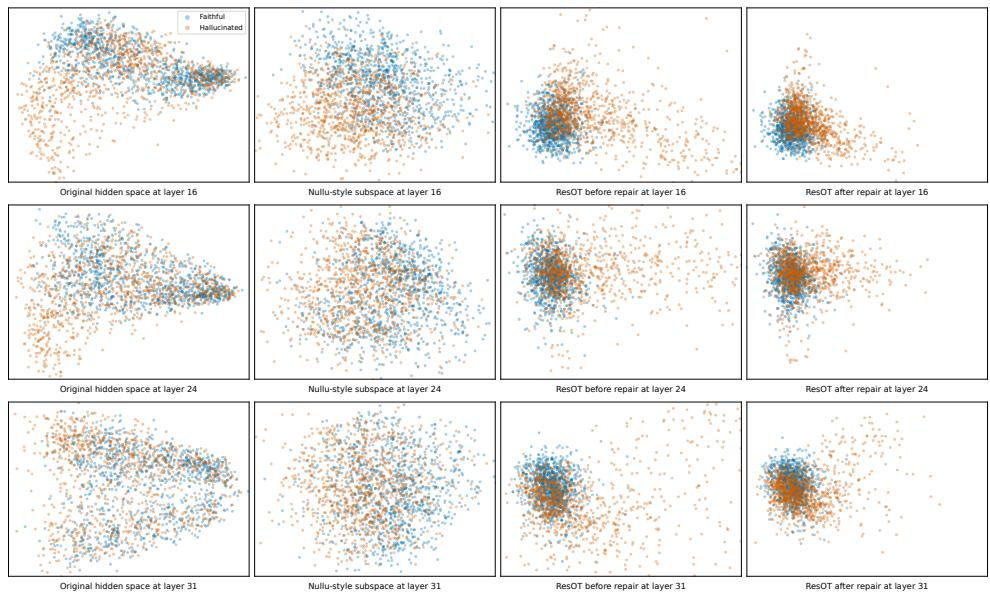  
Figure 6: Representation visualizations across layers. Rows correspond to layers 16, 24, and 31. Columns show the original representation space, the Nullu-style subspace, and the ResOT residual subspace before and after repair. We use PCA for visualization.

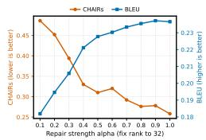  
(a) CHAIR vs. α

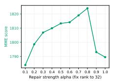  
(b) MME vs. α

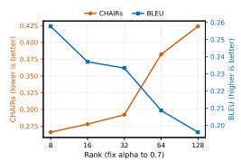  
(c) CHAIR vs. rank

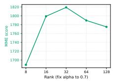  
(d) MME vs. rank  
Figure 7: Sensitivity analysis of the repair strength α and residual subspace rank on LLaVA-1.5. For α sensitivity, we fix the rank to 32. For rank sensitivity, we fix α to 0.7.

Figure 8 provides a detailed view at layer 31. The whitened marginal distributions broadly follow the standard normal reference, and the normal Q-Q plots remain close to the diagonal over much of the central range. Larger deviations appear toward the tails. The Mahalanobis Q-Q plots show more noticeable departures from the $\chi _ { k } ^ { 2 }$ reference, indicating that the joint residual distributions are not exactly multivariate Gaussian. Thus, the marginal coordinates are reasonably approximated by Gaussian distributions in their central regions, while the full joint distributions retain structure beyond a Gaussian model.

Figure 9 extends the diagnostic across all repaired layers. The marginal KS distances remain relatively small and stable across layers, whereas the Mahalanobis KS distances are generally larger. The same pattern appears across all three backbones, suggesting that the behavior observed at layer 24 is not specific to a single layer or model.

Overall, these diagnostics support using a Gaussian model as a compact approximation of the residual distributions rather than as an exact description of their full shape. ResOT uses the estimated means and covariances to construct the transport map, while the observed departures from Gaussianity are concentrated more strongly in the joint distribution and its tails.

Table 11: Separability between faithful and hallucinated LLaVA-1.5 representations in the subspace on the evaluation split. Higher values indicate stronger separability.
<table><tr><td>Layer</td><td>Setting</td><td>Mahalanobis Dist. ↑</td><td>LDA Acc. ↑</td><td>LDA AUC ↑</td></tr><tr><td rowspan="2">16</td><td>Nullu-style</td><td>1.5033</td><td>0.7795</td><td>0.8674</td></tr><tr><td>ResOT before repair</td><td>2.4725</td><td>0.8865</td><td>0.9544</td></tr><tr><td rowspan="2">24</td><td>Nullu-style</td><td>1.3405</td><td>0.7590</td><td>0.8366</td></tr><tr><td>ResOT before repair</td><td>2.1708</td><td>0.8565</td><td>0.9351</td></tr><tr><td rowspan="2">31</td><td>Nullu-style</td><td>1.2530</td><td>0.7325</td><td>0.8161</td></tr><tr><td>ResOT before repair</td><td>1.9297</td><td>0.8460</td><td>0.9149</td></tr></table>

Table 12: Center-distance analysis across layers. F, H, and R denote faithful, hallucinated, and repaired representations, respectively.

<table><tr><td>Layer</td><td>Nullu (F → H)</td><td>Before repair (F → H)</td><td>After repair (F → R)</td></tr><tr><td>16</td><td>1.9758</td><td>1.2845</td><td>0.0537</td></tr><tr><td>24</td><td>4.0293</td><td>2.9075</td><td>0.1265</td></tr><tr><td>31</td><td>4.4187</td><td>2.5757</td><td>0.0994</td></tr></table>

Table 13: Average relative displacement of faithful and hallucinated samples in the representation space. H/F denotes the ratio of hallucinated to faithful displacement. The 16–31 row reports the average across all selected layers.
<table><tr><td>Layer</td><td>Faithful (%)</td><td>Hallucinated (%)</td><td>H/F</td></tr><tr><td>16</td><td>1.5903</td><td>7.1353</td><td>4.49×</td></tr><tr><td>24</td><td>1.1953</td><td>5.9745</td><td>5.00×</td></tr><tr><td>31</td><td>1.3840</td><td>4.2196</td><td>3.05×</td></tr><tr><td>16-31</td><td>1.3425</td><td>6.0281</td><td>4.49×</td></tr></table>

## E LIMITATION

ResOT uses a low-dimensional Gaussian model to define the transport target. This model can capture differences in mean and covariance but does not describe all higher-order structure in the residual distributions. In addition, calibration uses representations from complete descriptions, whereas repair is applied to a partially generated context. This potential distributional shift remains insufficiently explored. Our evaluation focuses primarily on object hallucination. The applicability of ResOT to other forms of multimodal error remains to be verified.

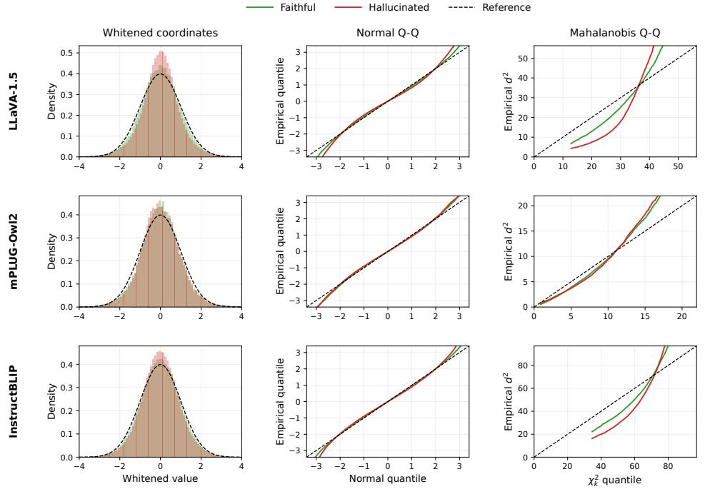  
Figure 8: Gaussian diagnostics at layer 31. Columns show histograms of whitened coordinates (left), normal Q-Q plots (middle), and Mahalanobis Q-Q plots (right). Green and red denote faithful and hallucinated representations, respectively. Dashed black lines show the standard normal reference in the histograms and $y = x$ in the Q-Q plots.

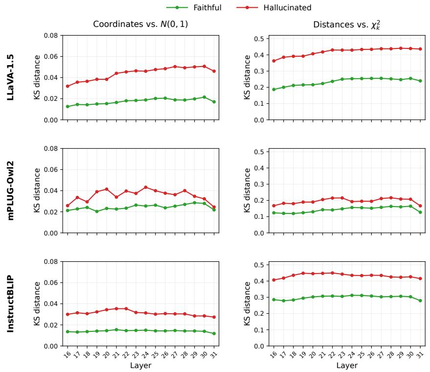  
Figure 9: Gaussian diagnostics across layers 16–31. Columns report the KS distance of whitened coordinate values to $\mathcal { N } ( 0 , 1 )$ (left) and the KS distance of squared Mahalanobis distances to $\chi _ { k } ^ { 2 }$ (right). Green and red curves denote faithful and hallucinated representations, respectively.