# GATOR: GENERATIVE AND AGENTIC 3D OBJECT RECONSTRUCTION FROM CASUAL IMAGES

Qirui Wu1,2 Stan Birchfield1 Hesam Rabeti1 Angel X. Chang2 Bowen Wen1 1NVIDIA 2Simon Fraser University

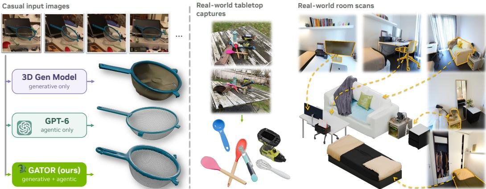  
Fig. 1: Generative and agentic 3D object reconstruction from casual images. Left: Generative model inaccurately fills the strainer’s mesh bowl. GPT-6-Astra struggles with strainer ear position, and simplifies the handle and ear shapes. Our GATOR generates and refines the asset, preserving its shape and mesh. Right: GATOR reconstructs complete, textured, posed objects from real-world tabletop captures and room scans, which are composed using their predicted poses. Project page: https://research.nvidia.com/labs/lpr/gator/

## ABSTRACT

Reconstructing complete, scene-aligned 3D objects from casual images requires integrating sparse, uncertain observations and inferring surfaces hidden by occlusions. We present GATOR, a generative and agentic framework that recovers textured object assets and their scene-relative pose from one or more images. Our local modality mixer couples patch-aligned RGB, target-mask, and pointmap features before cross-view reasoning, preserving scene context while distinguishing the target from its surroundings. Text-guided semantic conditioning complements these spatial cues with category names and object captions through stagespecific adapters for structure, geometry, and appearance generation. The generated asset initializes a multimodal agent, providing instance-specific geometry and pose for targeted structural and texture refinement through an observationguided edit-render-review loop. Across synthetic objects, cluttered tabletops, and indoor scenes, GATOR achieves strong geometric and appearance fidelity while recovering scene-relative pose from sparse observations. Time-budget comparisons and scene-level simulation further demonstrate the reconstruction efficiency and simulation readiness.

## 1 INTRODUCTION

Turning everyday photographs into 3D assets for simulation and scene editing requires complete object geometry and appearance, together with the pose needed to place each object back into its scene. We study casual images: one or a few observations acquired without requiring object isolation, calibrated capture, or a prescribed camera trajectory. The target may remain embedded in a cluttered tabletop or room, partly occluded by surrounding objects and observed from irregular viewpoints. Lighting, apparent scale, and visible surface coverage vary across images, while additional information such as camera parameters and depth may be estimated from the observations.

Single-view object reconstruction methods infer complete 3D objects from one image. LRM (Hong et al., 2024) predicts a neural radiance field, TRELLIS.2 (Xiang et al., 2026) generates geometry and materials, and SAM 3D (Chen et al., 2026) jointly predicts object shape, texture, and layout. However, the geometry and appearance of unobserved backsides must be inferred from learned priors, so visually plausible completions can differ from the actual object. Exploiting additional observed views requires multiview adaptation of these single-image formulations.

Multiview generative reconstruction reduces this ambiguity by combining learned 3D priors with complementary observations. ShapeR (Siddiqui et al., 2026) combines posed images, sparse SLAM points, and text captions for shape generation, ReconViaGen (Chang et al., 2026) conditions generation on multiview reconstruction features, and Pixal3D (Li et al., 2026b) aggregates pixel-aligned image features in 3D. For cluttered targets in casually captured real-world scenes, however, condi tioning must associate appearance, observed geometry, and masks distinguishing the target object from surrounding objects and background, while preserving scene context. When modalities are supplied as independent conditioning streams, the denoiser must infer these local associations. Generation alone also offers limited explicit control over the surface regularity, part connections, and precise texturing useful for downstream applications such as simulation and gaming.

Recently, multimodal agents powered by GPT-6-Astra (OpenAI, 2026) provide direct control over structure and materials through graphics programs and visual feedback. However, building detailed assets from scratch requires repeated model calls, code execution, and rendering, making the process time-consuming and costly with commercial APIs. Fine-grained geometry remains challenging: an agent may recover recognizable object structure yet reduce parts to simplified shapes (Fig. 1).

Addressing the aforementioned challenges requires observation-grounded completion together with explicit control over geometry and appearance. We present GATOR, a generative and agentic framework for complete, pose-aware object reconstruction from casual images (Fig. 1). Our key design separates patch-level cross-modal fusion from global cross-view reasoning and introduces stage specific text guidance throughout the generative cascade. The resulting complete, scene-aligned asset anchors agentic refinement to instance-specific geometry, appearance, and pose, enabling targeted structural and texture edits guided by the input images.

We introduce local modality mixing into the structure-geometry-appearance cascade of TREL-LIS.2 (Xiang et al., 2026), fusing patch-aligned RGB, pointmap, and target-mask features before sparse structure generation. This separates local cross-modal association from global cross-view reasoning, retaining scene context while explicitly identifying target evidence. Once sparse structure is available, we follow Pixal3D (Li et al., 2026b) in projecting image features onto its 3D locations to condition geometry and appearance generation. Pose-aligned training preserves scene-relative orientation, while scale and placement come from the observations and are refined by differentiable rendering, so reconstructed objects can be composed in a shared scene.

Beyond the image-derived conditioning, we introduce text-guided semantic conditioning through embeddings of category names and object captions. These global semantic cues complement the modality mixer’s patch-level spatial evidence when sparse views or occlusion leave multiple plausible object completions. While ShapeR (Siddiqui et al., 2026) uses captions for shape generation, our stage-specific text adapters guide structure, geometry, and appearance, promoting categoryconsistent completion throughout the cascade.

The resulting complete, scene-aligned asset initializes agentic refinement, supplying instancespecific geometry, appearance, and pose rather than requiring construction from scratch. Structural priors about man-made objects guide geometry edits, while input images guide texture refinement, including the content, placement, sharpness, and legibility of text and logos. An edit-render-review loop compares renders of the original and modified assets under matched cameras and lighting, retaining or reverting edits based on their agreement with the observations. The process preserves scene-relative placement and requires no retraining of the generative model.

We evaluate on Toys4K (Stojanov et al., 2021) and four real-world datasets: LM-O (Brachmann et al., 2014), HB (Kaskman et al., 2019), HANDAL (Guo et al., 2023), and ScanNet++ (Yeshwanth et al., 2023). The evaluations span controlled objects, cluttered tabletops, and indoor scenes, including reconstruction from estimated masks and geometry. GATOR achieves strong generalization across various challenging casual image capturing setups. Time-budget comparisons and scene-level simulation further demonstrate the benefits of asset-initialized refinement for efficiency and stability.

Our contributions can be summarized as follows:

• Local modality mixing for pose-aware generation. We introduce a modality mixer that associates patch-aligned RGB, pointmap, and target-mask features before sparse structure generation, followed by projected image conditioning for geometry and appearance. This supports targetspecific completion in clutter and scene-relative pose recovery from estimated inputs, allowing reconstructed objects to be composed in a shared scene.

• Text-guided semantic conditioning. We condition structure, geometry, and appearance generation on category names and object captions through stage-specific adapters, complementing the modality mixer’s patch-level evidence with global object semantics. This guides completion toward category-consistent geometry and appearance when observations are sparse or occluded.

• Agentic geometry and appearance refinement. We initialize an observation-grounded editrender-review loop with the generated asset, enabling an agent to apply structural and appearance priors without retraining the generative model. This enables targeted improvements to structural regularity and texture legibility, including text and logos, making assets better suited to downstream applications such as simulation and gaming.

• Reconstruction across real-world settings. Evaluations on multiple synthetic and real-world datasets cover diverse categories, sparse and incomplete view coverage, clutter and occlusion, lighting variation, and uncertainty in estimated masks, cameras, and depth. The results demonstrate strong geometry, appearance, and scene-relative pose recovery across these conditions.

## 2 RELATED WORK

Non-Generative Object Reconstruction. Feed-forward reconstruction models recover 3D objects from one or a few images. LRM (Hong et al., 2024) and TripoSR (Tochilkin et al., 2024) predict radiance-field representations from single images, while SF3D (Boss et al., 2025) produces textured meshes with disentangled illumination. RaySt3R (Duisterhof et al., 2025) completes object geometry from a single masked RGB-D image through novel-view depth prediction. For sparse multiview inputs, GRM (Xu et al., 2024b) predicts 3D Gaussians and MeshLRM (Wei et al., 2024) reconstructs meshes; LSRM (Li et al., 2026c) scales spatial attention to recover finer geometry and appearance. Camera uncertainty is particularly relevant to casual capture: LEAP (Jiang et al., 2024) aggregates views without input poses, while PF-LRM (Wang et al., 2024b) and FreeSplatter (Xu et al., 2025) recover both 3D representations and camera parameters from unposed images. Geometry estimators such as VGGT (Wang et al., 2025) and VGGT-Ω (Wang et al., 2026a) provide cameras and depth for downstream reconstruction. GATOR uses such estimates as geometric evidence to condition complete, pose-aware object generation.

Generative Object Reconstruction. Generative methods model plausible completions of geometry that the input images do not constrain. Novel-view diffusion methods, including Zero-1-to-3 (Liu et al., 2023), SyncDreamer (Liu et al., 2024b), Wonder3D (Long et al., 2024), and One-2- 3-45++ (Liu et al., 2024a), synthesize additional image or normal observations for reconstruction. SpaRP (Xu et al., 2024a) jointly predicts multiview images and pose-related representations from unposed inputs, while SPAR3D (Huang et al., 2025) conditions mesh reconstruction on a generated point cloud. Native 3D generative models such as TRELLIS (Xiang et al., 2025) and TREL-LIS.2 (Xiang et al., 2026) instead generate structured 3D latents, and GATOR adopts TRELLIS.2’s structure-geometry-appearance cascade. Aligning generation with observations is central to reconstruction: Pixal3D (Li et al., 2026b) projects image features onto 3D structure, CUPID (Huang et al., 2026a) jointly generates geometry and pixel-voxel correspondences for camera recovery, and World Tracing (Zhang et al., 2026) completes layered geometry in camera space. ReconViaGen (Chang et al., 2026) integrates reconstruction features into a generative model, RecGen3D (Huang et al., 2026b) aligns reconstruction and generation in a shared canonical space, and Mix3R (Lin et al., 2026) jointly predicts sparse structure, pointmaps, and cameras. FlowObject (Rao et al., 2026) guides a pretrained flow model at inference time. UMI3D (Qu et al., 2026) and MV-SAM3D (Li et al., 2026a) adapt existing generative models to multiple images without additional training, while ASV3D (Huynh et al., 2026) studies auxiliary-view adaptation. We explicitly couple patch-aligned RGB, target-mask, and pointmap evidence before cross-view attention, with stage-specific text guidance complementing spatial conditioning throughout the generative cascade.

Object Reconstruction in the Wild. Natural captures introduce clutter, occlusion, and incomplete object coverage. FroDO (Rünz et al., 2020), vMAP (Kong et al., 2023), and BundleSDF (Wen et al.,

A Pose-Aware Generative Reconstruction  
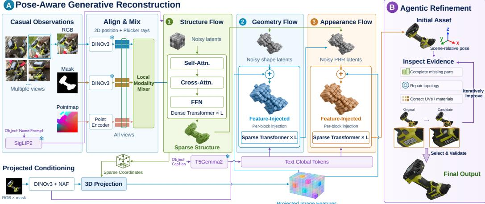  
Fig. 2: GATOR architecture. (A) Pose-aware generative reconstruction. Following TRELLIS.2 (Xiang et al., 2026), GATOR uses conditional flows for sparse structure, geometry, and appearance. RGB images and depth-derived pointmaps retain scene context, while masks identify the target. Tokens from all three modalities share a patch grid with common 2D position and Plücker-ray encodings. A local mixer exchanges information at each patch within a view (Secs. 3.2 and 3.3). Cross-view attention and SigLIP2 object-name conditioning guide structure generation. At its active coordinates, projected DINOv3 and NAF-upsampled features from target-masked images are averaged across valid views and injected into every geometry and appearance denoising block. Global image tokens and T5Gemma2-encoded captions supply cross-attention. Shape latents condition PBR material generation (Sec. 3.4). ❄ denotes frozen encoders. (B) Agentic refinement. Initialized with the complete, scene-aligned asset, an agent uses input images and structural priors to complete parts, repair topology, and refine texture coordinates and materials. Its edit-render-review loop compares original and candidate renders under matched cameras and lighting to retain or revert local edits. Within the time budget, it selects the best inspected asset while preserving reliable regions and scene-relative placement (Sec. 3.5).

2023) integrate RGB or RGB-D sequences to estimate object geometry and pose. $\mathrm { O ^ { 2 } }$ -Recon (Hu et al., 2024), ROODI (Chang et al., 2025), and Amodal3R (Wu et al., 2025) use learned priors to reconstruct surfaces hidden by occlusion. Any6D (Lee et al., 2025) aligns generated meshes for pose and size estimation, while CARI4D (Xie et al., 2026) reconstructs metric-scale human-object interactions from monocular video. Closer to our setting, ShapeR (Siddiqui et al., 2026) conditions generation on casual captures and sparse SLAM points, while SAM 3D (Chen et al., 2026) predicts complete textured assets from natural images. InstaScene (Yang et al., 2025), RecGen (Zadaianchuk et al., 2026), and MessyKitchens (Ansari et al., 2026) address object reconstruction within cluttered scenes. Our GATOR retains surrounding scene context while using target masks to distinguish the object from clutter, reconstructing complete geometry, appearance, and scene-relative pose from sparse, partially occluded observations.

## 3 METHODOLOGY

Fig. 2 outlines our pipeline. We define the reconstruction setting (Sec. 3.1) and encode RGB, masks, and pointmaps on a shared patch grid (Sec. 3.2). Local modality mixing then supports sparse structure generation (Sec. 3.3), followed by geometry and appearance generation from projected image features (Sec. 3.4), with text guiding the whole cascade. The resulting scene-aligned asset initializes an agent that uses the input images and rendered feedback for refinement (Sec. 3.5).

## 3.1 PROBLEM FORMULATION

Given N casual images of a target object, we generate its complete geometry and appearance in a shared reconstruction frame. Each view provides RGB $I _ { v } ,$ a target mask $M _ { v }$ , intrinsics $K _ { v }$ camera pose $T _ { v }$ , and depth $D _ { v }$ , all of which can be estimated from the images rather than given as ground truth. With text $c ,$ such as a category name or a VLM caption, the conditioning set is $\mathcal { C } \subseteq ( \{ I _ { v } , M _ { v } , K _ { v } , T _ { v } , D _ { v } \} _ { v = 1 } ^ { N } , c )$ . Unlike RecGen (Zadaianchuk et al., 2026), which accepts at most two views, GATOR takes any number of views and improves with more (Sec. 4.4).

The center and extent of the masked depth, unprojected to 3D, define an observation anchor $\mathbf { t } _ { g }$ and an isotropic scale $s _ { g } .$ We normalize observations by this anchor without rotating the frame and map generated points back by $\mathbf { x } = s _ { g } \mathbf { q } + \mathbf { t } _ { g }$ , so outputs keep the scene-relative orientation of the observations (Sec. A.1). The anchor only initializes translation and scale, which differentiable rendering refines after generation (Sec. 3.4).

## 3.2 MULTIMODAL OBSERVATION ENCODING

GATOR encodes RGB, the target mask, and a pointmap unprojected from depth on a shared patch grid of consistently cropped views, using frozen DINOv3 features (Siméoni et al., 2025) for RGB and masks and a trainable pointmap encoder. RGB and pointmaps keep surrounding context, while mask tokens identify the target. ShapeR (Siddiqui et al., 2026) uses similar inputs but relies on SLAM points pre-segmented for the target, which images alone do not provide, and combines separately encoded tokens only inside its denoiser. RecGen (Zadaianchuk et al., 2026) fuses earlier but simply adds mask and pointmap embeddings to its image tokens. Our modality mixer instead applies attention among the aligned RGB, mask, and pointmap tokens at each patch within a view, weighting the three cues according to the patch content while keeping a token per modality for crossview aggregation. This encodes known spatial correspondence into the fusion architecture instead of leaving the structure denoiser to infer it (Sec. 3.3). Text also conditions every stage, modulating structure generation globally and entering geometry and appearance as tokens (Sec. 3.4), whereas ShapeR adds text tokens only to its shape denoiser.

## 3.3 ALIGNING AND MIXING MODALITIES FOR STRUCTURE GENERATION

For patch p in view v, let $\mathbf { h } _ { v p } ^ { m }$ be the token of modality $m \in \{ I , M , P \}$ , and let $\mathbf { a } _ { v p } = A ( \gamma ( \mathbf { u } _ { p } ) , \mathbf { r } _ { v p } )$ embed its Fourier-encoded patch coordinates and patch-averaged Plücker ray. The modality mixer applies residual attention across the three tokens of each patch:

$$
\begin{array} { r } { \{ \widetilde { \mathbf { h } } _ { v p } ^ { m } \} _ { m \in \{ I , M , P \} } = \mathrm { M o d a l i t y M i x e r } \big ( \{ \mathbf { h } _ { v p } ^ { m } + \mathbf { a } _ { v p } \} _ { m \in \{ I , M , P \} } \big ) . } \end{array}\tag{1}
$$

Each output token keeps its modality identity but can combine appearance, geometry, and mask cues that separate the target from its surroundings. Seeing all three cues of a patch together also lets the model cross-check estimated depth against appearance and the mask, tolerating upstream errors such as noisy boundary depth or imprecise mask edges.

The dense structure latents then query the bank B of mixed tokens from all views through crossattention. Because the sparse structure is not yet known, this global attention, rather than local projection, gives each latent access to every view and its context, allowing completion under limited coverage and occlusion. Pixal3D (Li et al., 2026b), in contrast, implicitly assumes that the target is fully visible from its anchor view, making it more brittle to occlusion or partial observations. A pooled SigLIP2 embedding (Tschannen et al., 2025) of the category text, passed through a learned adapter, modulates each block via the timestep embedding and adaptive layer normalization as a semantic prior. The denoiser learns rectified flow over complete, pose-aware occupancy latents, which the frozen decoder converts into sparse structure $\widehat { s }$ (Secs. A.1 and A.2).

## 3.4 STRUCTURE AND TEXT CONDITIONED GEOMETRY AND APPEARANCE

Given the sparse structure, we lift image features to its active locations. For each location ${ \bf q } _ { j }$ we average frozen DINOv3 features and their NAF-upsampled versions (Chambon et al., 2026), sampled from the target-masked images:

$$
\mathbf { f } _ { j } = \frac { 1 } { | \mathcal { V } _ { j } | } \sum _ { v \in \mathcal { V } _ { j } } [ F _ { v } ^ { D } ( \pi _ { v } ( s _ { g } \mathbf { q } _ { j } + \mathbf { t } _ { g } ) ) ; F _ { v } ^ { N } ( \pi _ { v } ( s _ { g } \mathbf { q } _ { j } + \mathbf { t } _ { g } ) ) ] ,\tag{2}
$$

where $\pi _ { v }$ projects into cropped view v and $\nu _ { j }$ contains the views in which ${ \bf q } _ { j }$ lies in front of the camera and projects inside the crop $( \mathbf { f } _ { j } = \mathbf { 0 }$ if empty). In each denoising block, cross-attention to global image and text tokens guides unobserved regions, and a learned projection of $\mathbf { f } _ { j }$ is then added for local detail. The geometry flow generates shape latents, and the appearance flow generates physically based rendering (PBR) material latents at the same sparse coordinates, conditioned on those shape latents. Both flows are trained on ground-truth sparse structure and use the predicted sparse structure at inference. A final placement step refines translation and isotropic scale by differentiable rendering of silhouettes and depth and by point alignment, keeping the predicted orientation and shape (Sec. A.3). Compared with Pixal3D, which also projects image features onto sparse structure, our design generates that structure from mixed RGB, mask, and pointmap tokens of all views, adds text guidance, and predicts scene placement.

Text conditioning. Prior image-conditioned generative models (Xiang et al., 2026; Li et al., 2026b; Chen et al., 2026) often ignore text information which helps to guide plausible completions when views are sparse or occluded. Therefore, we condition every stage on text: besides the SigLIP2 modulation of structure generation, a frozen T5Gemma2 encoder (Zhang et al., 2025a) and a learned adapter produce text tokens for the geometry and appearance flows. While structure generation takes a short category prompt, these flows are trained on captions ranging from brief high-level category names to detailed long descriptions to provide more nuanced guidance.

Masks across stages. Masks play a different role in each stage, which matters in cluttered casual captures. The structure flow sees the full crop, including occluders and supporting surfaces, with the mask as separate tokens, so it can account for occlusion when completing the object. The geometry and appearance flows instead project features from target-masked images, so occluders and background do not leak into surface detail or texture. By contrast, TRELLIS.2, Pixal3D, and ReconViaGen condition every stage on background-removed images (Xiang et al., 2026; Li et al., 2026b; Chang et al., 2026), discarding the scene context that helps complete occluded objects.

## 3.5 AGENT AS RECONSTRUCTION REFINER

The generated asset can still have missing parts, fused openings, or texture contamination. We provide GPT-6-Astra (OpenAI, 2026), a multimodal agent, with our generated mesh, input observations, and Blender access. It is prompted to make targeted repairs that preserve reliable regions and the asset’s coordinate frame and scale rather than remodel the object. The agent decides what to fix, inspecting the images and asset renders and writing scripts to complete missing structure, repair topology, or correct UVs and materials, guided by the mesh’s proportions, orientation, and attachment sites. After each edit, it compares renders of the original and edited assets under matched cameras and lighting and reverts edits that degrade the reconstruction. It stops when supported repairs are complete or evidence is insufficient for further edits, within a fixed time budget (Sec. A.4).

## 4 EXPERIMENTS

## 4.1 EXPERIMENTAL SETUP

Training data. We train only on synthetic scenes: procedurally cluttered scenes composed from approximately 980,000 object assets, plus structured indoor scenes from existing datasets (Fu et al., 2021a; Zhong et al., 2025; Pfaff et al., 2026; Xia et al., 2026). Each example pairs partial observations of a target with its complete, posed geometry and appearance, with observations augmented or replaced by image-estimated cameras and depth to mimic casual capture (Sec. B).

Evaluation data. To study complete object reconstruction and placement pose in the original scene from sparse images, we evaluate on 525 Toys4K (Stojanov et al., 2021) objects from 105 categories and real world captures including LM-O (Brachmann et al., 2014), HB (Kaskman et al., 2019), HANDAL (Guo et al., 2023), and ScanNet++ (Yeshwanth et al., 2023). These diverse datasets extensively cover various settings including controlled object renderings, cluttered tabletops, and indoor scans. LM-O and HB use sensor depth and recovered camera poses, while HANDAL and ScanNet++ use estimated cameras and depth. Masks come from the datasets except on ScanNet++, where they are inferred by SAM3 (Carion et al., 2026). All methods share the same input setup (Secs. D.1, D.2, and D.4). Our refinement and the from-scratch GPT-6-Astra baseline both use GPT-6-Astra (OpenAI, 2026) with extra-high reasoning effort and a ten-minute budget per object unless otherwise mentioned. Implementation details are in Sec. A.5.

Metrics. Joint pose and shape are measured by bidirectional posed-surface distance (ADD-SB) and its recall ADD-SB@0.1 at 10% of the reference diameter (Chen et al., 2026; Zadaianchuk et al., 2026). After similarity alignment to ground truth, we report chamfer distance (CD), normal consistency (NC), F1 at 1% (Toys4K) or 2% (real data) of the diameter, and 2D silhouette IoU (Li et al., 2026b). Appearance uses PSNR, SSIM, and LPIPS (Zhang et al., 2018) on renders under

Table 1: Four-view reconstruction on Toys4K. †Run with MultiDiffusion (Bar-Tal et al., 2023). Dark/light green mark best/second-best values (excluding the fully proprietary GPT-6-Astra baseline).
<table><tr><td rowspan="2">Methods</td><td colspan="4">Geometric</td><td colspan="3">Appearance</td></tr><tr><td>CD↓</td><td>NC↑</td><td>F1↑</td><td>IoU2D ↑</td><td>PSNR↑</td><td>SSIM↑</td><td>LPIPS↓</td></tr><tr><td>GPT-6-Astra</td><td>0.013</td><td>0.754</td><td>0.614</td><td>0.774</td><td>17.11</td><td>0.865</td><td>0.214</td></tr><tr><td>TRELLIS.2†</td><td>0.014</td><td>0.751</td><td>0.628</td><td>0.747</td><td>15.73</td><td>0.855</td><td>0.231</td></tr><tr><td>ReconViaGen</td><td>0.014</td><td>0.767</td><td>0.579</td><td>0.764</td><td>14.39</td><td>0.825</td><td>0.228</td></tr><tr><td>Pixal3D-SV</td><td>0.027</td><td>0.681</td><td>0.433</td><td>0.629</td><td>14.22</td><td>0.844</td><td>0.287</td></tr><tr><td>Pixal3D-MV</td><td>0.011</td><td>0.783</td><td>0.701</td><td>0.798</td><td>17.18</td><td>0.871</td><td>0.203</td></tr><tr><td>GATOR (Ours)</td><td>0.009</td><td>0.801</td><td>0.757</td><td>0.819</td><td>17.60</td><td>0.873</td><td>0.191</td></tr></table>

Table 2: Real-world tabletop reconstruction on LM-O, HB, and HANDAL. ReconViaGen and Pixal3D lack scene placement, so joint ADD-SB is unavailable. ShapeR can only output untextured object meshes, so appearance scores are unavailable. Dark/light green mark best/second-best scores, excluding the fully proprietary GPT-6-Astra baseline. GATOR leads all metrics among the remaining methods, roughly halving Pixal3D’s chamfer distance (per-dataset results: Table 6).
<table><tr><td rowspan="2">Methods</td><td colspan="2">Joint (ADD-SB)</td><td colspan="4">Geometry</td><td colspan="3">Appearance</td></tr><tr><td>Mean↓</td><td>@0.1↑</td><td>CD↓</td><td>NC↑</td><td>F1↑</td><td>IoU2D ↑</td><td>PSNR↑</td><td>SSIM↑</td><td>LPIPS↓</td></tr><tr><td>GPT-6-Astra</td><td>0.027</td><td>100.00</td><td>0.016</td><td>0.799</td><td>0.773</td><td>0.791</td><td>17.16</td><td>0.886</td><td>0.160</td></tr><tr><td>SimFoundry</td><td>0.183</td><td>63.36</td><td>0.040</td><td>0.716</td><td>0.533</td><td>0.626</td><td>14.90</td><td>0.875</td><td>0.200</td></tr><tr><td>RecGen</td><td>0.057</td><td>85.50</td><td>0.021</td><td>0.791</td><td>0.666</td><td>0.757</td><td>16.00</td><td>0.885</td><td>0.178</td></tr><tr><td>ReconViaGen</td><td></td><td></td><td>0.027</td><td>0.750</td><td>0.608</td><td>0.730</td><td>14.48</td><td>0.858</td><td>0.181</td></tr><tr><td>ShapeR</td><td>0.057</td><td>87.02</td><td>0.028</td><td>0.709</td><td>0.606</td><td>0.700</td><td></td><td></td><td></td></tr><tr><td>MV-SAM3D</td><td>0.044</td><td>91.60</td><td>0.019</td><td>0.778</td><td>0.687</td><td>0.757</td><td>15.51</td><td>0.883</td><td>0.168</td></tr><tr><td>Pixal3D</td><td></td><td></td><td>0.018</td><td>0.784</td><td>0.780</td><td>0.813</td><td>16.94</td><td>0.890</td><td>0.163</td></tr><tr><td>GATOR (Ours)</td><td>0.022</td><td>98.47</td><td>0.009</td><td>0.859</td><td>0.904</td><td>0.841</td><td>17.97</td><td>0.890</td><td>0.140</td></tr></table>

the same alignment and shared lighting. All distances are normalized by the reference diameter (Sec. C).

## 4.2 TOYS4K RESULTS

Table 1 compares against TRELLIS.2 (Xiang et al., 2026), ReconViaGen (Chang et al., 2026), Pixal3D (Li et al., 2026b) (single- and multi-view checkpoints), and GPT-6-Astra from scratch, all using four views. GATOR, Pixal3D, and GPT-6-Astra share Pi3X (Wang et al., 2026b) camera and depth estimates. GATOR leads all seven metrics, reducing CD by 19.7% and raising F1 from 0.701 to 0.757 relative to the strongest baseline, Pixal3D-MV. Qualitative comparisons appear in Sec. D.1.

## 4.3 REAL-WORLD RESULTS

Tabletop objects. Table 2 covers all target objects from LM-O, HB, and HANDAL datasets. For each object, four-views are provided as input. We compare against ReconViaGen (Chang et al., 2026), Pixal3D (Li et al., 2026b), MV-SAM3D (Li et al., 2026a), and ShapeR (Siddiqui et al., 2026), RecGen (Zadaianchuk et al., 2026), SimFoundry (Ranawaka et al., 2026), and GPT-6-Astra from scratch, where RecGen and SimFoundry selects the best two and one views respectively from the given input views, due to their input view limits. Excluding the fully proprietary GPT-6-Astra baseline, GATOR leads all nine metrics, with its largest margins in geometry: it roughly halves Pixal3D’s CD, while drastically raising F1 and PSNR (Fig. 3).

Objects in indoor scans. Table 3 extends the ScanNet++ evaluation protocol (Ni et al., 2025; Siddiqui et al., 2026; Wu et al., 2026) from 69 objects in 6 scenes to 229 targets from 49 scenes, each with one to ten views. Despite estimated cameras, depth, and masks, GATOR leads every metric, reducing CD by 23% relative to the runner-up, RecGen, and raising F1 from 0.540 to 0.603 and IoU from 0.682 to 0.733. It also surpasses GPT-6-Astra’s from-scratch reconstructions on every metric, so its advantage carries over from tabletop captures to objects in cluttered indoor scenes. Figs. 4 and 10 show qualitative comparisons.

Pose-aware reconstruction. Measured before any object-to-reference alignment to account for pose estimation from each method, GATOR reaches ADD-SB@0.1 of 96.36% on HANDAL and

RecGen

Pixal3D

GPT-6

GATOR

Inputs

RecGen

Pixal3D

GPT-6

GATOR

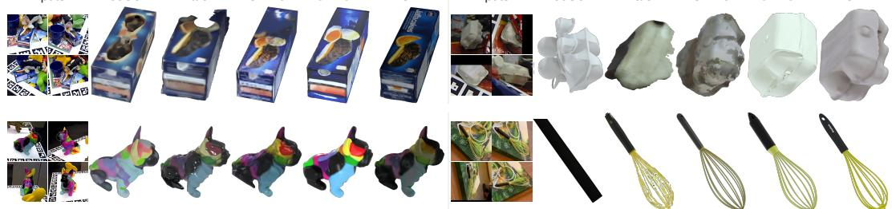  
Fig. 3: Real-world tabletop reconstruction on HB, LM-O, and HANDAL from four input views (two for RecGen); GPT-6 reconstructs from scratch. GATOR recovers complete shapes and detailed textures, such as the printed box and the whisk’s wires, where baselines truncate, blur, or fail.

Table 3: Real-world indoor-scene reconstruction on ScanNet++. ReconViaGen and Pixal3D predict no pose placement and thus have no joint (ADD-SB) result. Dark/light green mark best/second-best values (excluding the fully proprietary GPT-6-Astra baseline).
<table><tr><td rowspan="2">Methods</td><td colspan="2">Joint (ADD-SB)</td><td colspan="4">Geometry</td></tr><tr><td>Mean↓</td><td>@0.1↑</td><td>CD↓</td><td>NC↑</td><td>F1↑</td><td>IoU2D ↑</td></tr><tr><td>GPT-6-Astra</td><td>0.049</td><td>90.83</td><td>0.033</td><td>0.716</td><td>0.581</td><td>0.716</td></tr><tr><td>SimFoundry</td><td>0.125</td><td>72.49</td><td>0.104</td><td>0.664</td><td>0.426</td><td>0.614</td></tr><tr><td>RecGen</td><td>0.067</td><td>90.83</td><td>0.041</td><td>0.703</td><td>0.540</td><td>0.682</td></tr><tr><td>ReconViaGen</td><td></td><td></td><td>0.161</td><td>0.676</td><td>0.423</td><td>0.498</td></tr><tr><td>ShapeR</td><td>0.071</td><td>81.66</td><td>0.060</td><td>0.684</td><td>0.458</td><td>0.610</td></tr><tr><td>MV-SAM3D</td><td>0.057</td><td>90.83</td><td>0.042</td><td>0.699</td><td>0.493</td><td>0.648</td></tr><tr><td>Pixal3D</td><td></td><td></td><td>0.052</td><td>0.679</td><td>0.475</td><td>0.623</td></tr><tr><td>GATOR (Ours)</td><td>0.041</td><td>95.63</td><td>0.031</td><td>0.726</td><td>0.603</td><td>0.733</td></tr></table>

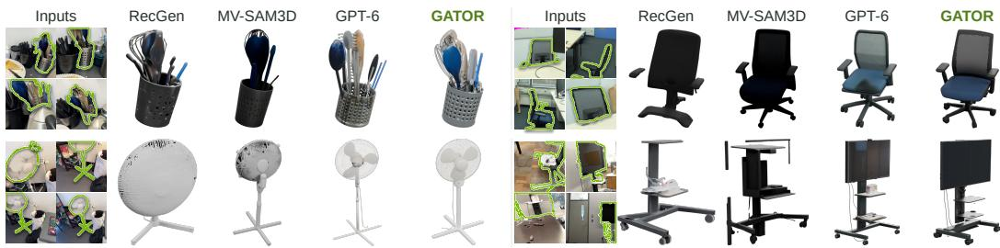  
Fig. 4: Reconstruction from real-world ScanNet++ images. Green outlines mark targets in a subset of the input views, and meshes are shown in comparable orientations; GPT-6 reconstructs from scratch. Our GATOR recovers fine structures, including individual utensils, fan blades, and the cart-mounted display.

95.63% on ScanNet++, and the lowest mean ADD-SB on both the tabletop and room-level Scan-Net++ benchmarks.

## 4.4 FRAMEWORK ANALYSIS

Ablation study. Table 4 adds one component at a time on 55 HANDAL objects with four input views. All variants are trained on the same synthetic data with the same pretrained image encoders and share observations and sampling settings (Sec. D.5). The modality mixer mainly improves placement including both geometry and pose estimation by lowering ADD-SB. Since camera and depth information are inferred by external models, this suggests the mixer enhances robustness to upstream estimation errors. Text conditioning then improves metrics consistently, indicating that category semantics help complete shapes under challenging casual image captures. Finally, agent refinement generally enhances appearance (Table 4) and on every tabletop dataset (Table 6). Its edits are local, such as the reopened holes and slots in Fig. 5, so average geometry changes little on Toys4K, LM-O, and HB and only slightly worsens CD, F1, and IoU on HANDAL. However, it benefits downstream applications such as simulation (Sec. D.6), which cannot be fully reflected in the quantitative metrics.

Efficiency analysis. Fig. 6(a) plots quality against mean pipeline work, with GATOR adding an estimated 32 s for our generative initialization. Without refinement, GATOR takes about 0.5 min and already outperforms GPT-6-Astra run with a 20-minute budget. Refinement then mainly improves appearance and local topology. GPT-6-Astra returns valid assets for 0/10 objects at a one-minute budget, 5/10 at two minutes, and all ten from five minutes onward. The example in panel (b) illustrates the difficulty of constructing a complete asset from scratch under short budgets.

Table 4: Ablation on 55 HANDAL objects with four input views. Each row adds one component to the row above. The modality mixer lowers ADD-SB, text conditioning improves all nine metrics, and agentic refinement further improves CD, NC, F1, PSNR, and LPIPS.
<table><tr><td rowspan="2">Configuration</td><td colspan="2">Joint (ADD-SB)</td><td colspan="4">Geometry</td><td colspan="3">Appearance</td></tr><tr><td>Mean↓</td><td>@0.1↑</td><td>CD↓</td><td>NC↑</td><td>F1↑</td><td>IoU2D↑</td><td>PSNR↑</td><td>SSIM↑</td><td>LPIPS↓</td></tr><tr><td>Base model</td><td>0.057</td><td>94.55</td><td>0.010</td><td>0.813</td><td>0.877</td><td>0.688</td><td>18.20</td><td>0.922</td><td>0.116</td></tr><tr><td>+ Modality mixer</td><td>0.037</td><td>94.55</td><td>0.011</td><td>0.811</td><td>0.872</td><td>0.700</td><td>18.16</td><td>0.922</td><td>0.114</td></tr><tr><td>+ Text conditioning</td><td>0.032</td><td>98.18</td><td>0.008</td><td>0.828</td><td>0.930</td><td>0.739</td><td>18.93</td><td>0.925</td><td>0.102</td></tr><tr><td>+ Agentic refinement</td><td>0.032</td><td>98.18</td><td>0.007</td><td>0.829</td><td>0.936</td><td>0.717</td><td>19.60</td><td>0.918</td><td>0.097</td></tr></table>

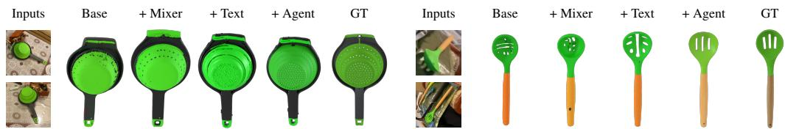  
Fig. 5: Qualitative ablation on HANDAL. Columns follow the configurations in Table 4; two of the four input views are shown. Predictions are rigidly aligned to GT for shape comparison. Agentic refinement recovers regular holes and slots that the generative model variants leave irregular or missing.

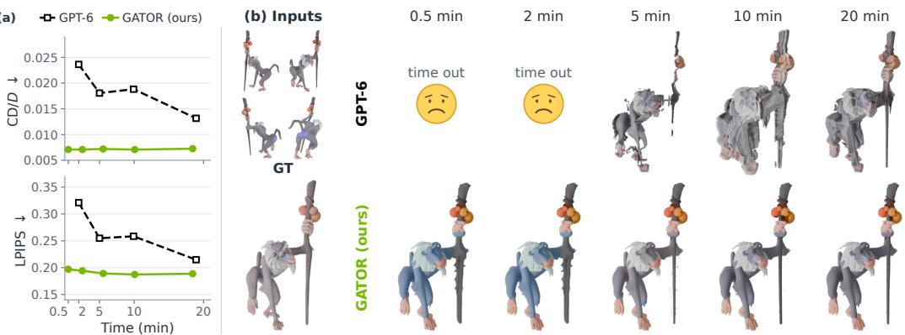  
Fig. 6: Reconstruction quality versus time. (a) Mean CD/D and LPIPS (↓) over valid outputs on sampled Toys4K objects. Time is the mean recorded full pipeline time, with an estimated 32 s of generation per object for GATOR, and excludes mesh export. The first GATOR point is generation without refinement (about 0.5 min), which already outperforms GPT-6 run with a 20-minute budget. (b) One example rendered from a shared camera. The first column shows our result without refinement, and the remaining headings denote agent budgets. GPT-6 times out within 2 min (sad faces) and remains coarse even at 20 min.

Effect of input views. Our single model supports varying numbers of views and improves steadily as views are added: on LM-O and HB (Table 7), going from two to eight views lowers ADD-SB and CD. Even with two views its CD is about half of Pixal3D’s with eight.

## 5 CONCLUSION

We presented GATOR, a framework for complete, scene-aligned 3D object reconstruction from casual images. Our local modality mixing associates patch-aligned RGB, pointmap, and target-mask evidence before cross-view reasoning, preserving context while identifying the target. Complementary text-guided semantic conditioning supplies category priors across structure, geometry, and appearance generation to guide completion from sparse or occluded observations. The generated asset anchors agentic refinement to instance-specific geometry and pose, enabling targeted structural and texture edits through render-based review without generator retraining. Experiments across various casually captured settings demonstrate strong reconstruction quality and the value of asset-initialized refinement for efficiency and simulation.

## REFERENCES

Junaid Ahmed Ansari, Ran Ding, Fabio Pizzati, and Ivan Laptev. MessyKitchens: Contact-Rich Object-Level 3D Scene Reconstruction. In European Conference on Computer Vision (ECCV), pp. 520–538, 2026. doi: 10.1007/978-3-032-37574-2\_29.

Omer Bar-Tal, Lior Yariv, Yaron Lipman, and Tali Dekel. MultiDiffusion: Fusing diffusion paths for controlled image generation. In Proceedings ofthe 40th International Conference on Machine Learning, volume 202 of Proceedings of Machine Learning Research, pp. 1737–1752. PMLR, 2023.

Mark Boss, Zixuan Huang, Aaryaman Vasishta, and Varun Jampani. SF3D: Stable Fast 3D Mesh Reconstruction with UV-unwrapping and Illumination Disentanglement. In Proceedings of the IEEE/CVF Conference on Computer Vision and Pattern Recognition (CVPR), pp. 16240–16250, 2025.

Eric Brachmann, Alexander Krull, Frank Michel, Stefan Gumhold, Jamie Shotton, and Carsten Rother. Learning 6D object pose estimation using 3D object coordinates. In European Conference on Computer Vision (ECCV), pp. 536–551, 2014. doi: 10.1007/978-3-319-10605-2\_35. URL https://doi.org/10.1007/978-3-319-10605-2\_35.

Nicolas Carion, Laura Gustafson, Yuan-Ting Hu, Shoubhik Debnath, Ronghang Hu, Didac Suris Coll-Vinent, Chaitanya Ryali, Kalyan Vasudev Alwala, Haitham Khedr, Andrew Huang, Jie Lei, Tengyu Ma, Baishan Guo, Arpit Kalla, Markus Marks, Joseph Greer, Meng Wang, Peize Sun, Roman Rädle, Triantafyllos Afouras, Effrosyni Mavroudi, Katherine Xu, Tsung-Han Wu, Yu Zhou, Liliane Momeni, Rishi Hazra, Shuangrui Ding, Sagar Vaze, Francois Porcher, Feng Li, Siyuan Li, Aishwarya Kamath, Ho Kei Cheng, Piotr Dollár, Nikhila Ravi, Kate Saenko, Pengchuan Zhang, and Christoph Feichtenhofer. SAM 3: Segment anything with concepts. In International Conference on Learning Representations, pp. 138846–138923, 2026. URL https://proceedings.iclr.cc/paper\_files/paper/2026/file/ e0982cbc81401df3430ee1ff780dc7a2-Paper-Conference.pdf.

Loïck Chambon, Paul Couairon, Éloi Zablocki, Alexandre Boulch, Nicolas Thome, and Matthieu Cord. NAF: Zero-shot feature upsampling via neighborhood attention filtering. In Proceedings of the IEEE/CVF Conference on Computer Vision and Pattern Recognition (CVPR), pp. 26604– 26613, 2026.

Jiahao Chang, Chongjie Ye, Yushuang Wu, Yuantao Chen, Yidan Zhang, Zhongjin Luo, Chenghong Li, Yihao Zhi, and Xiaoguang Han. ReconViaGen: Towards accurate multi-view 3D object reconstruction via generation. In International Conference on Learning Representations, pp. 90387– 90401, 2026. URL https://proceedings.iclr.cc/paper\_files/paper/2026/ file/9278abf072b58caf21d48dd670b4c721-Paper-Conference.pdf.

Yeonjin Chang, Erqun Dong, Seunghyeon Seo, Nojun Kwak, and Kwang Moo Yi. ROODI: Reconstructing Occluded Objects with Denoising Inpainters, 2025. URL https://arxiv.org/ abs/2503.10256.

Xingyu Chen, Fu-Jen Chu, Pierre Gleize, Kevin J. Liang, Alexander Sax, Hao Tang, Weiyao Wang, Michelle Guo, Thibaut Hardin, Xiang Li, Aohan Lin, Jia-Wei Liu, Ziqi Ma, Anushka Sagar, Bowen Song, Xiaodong Wang, Jianing Yang, Bowen Zhang, Piotr Dollár, Georgia Gkioxari, Matt Feiszli, and Jitendra Malik. SAM 3D: 3Dfy anything in images. In Proceedings ofthe IEEE/CVF Conference on Computer Vision and Pattern Recognition (CVPR), pp. 7220–7232, June 2026.

Jasmine Collins, Shubham Goel, Kenan Deng, Achleshwar Luthra, Leon Xu, Erhan Gundogdu, Xi Zhang, Tomas F. Yago Vicente, Thomas Dideriksen, Himanshu Arora, Matthieu Guillaumin, and Jitendra Malik. ABO: Dataset and benchmarks for real-world 3D object understanding. In IEEE/CVF Conference on Computer Vision and Pattern Recognition (CVPR), pp. 21126–21136, 2022.

Matt Deitke, Ruoshi Liu, Matthew Wallingford, Huong Ngo, Oscar Michel, Aditya Kusupati, Alan Fan, Christian Laforte, Vikram Voleti, Samir Yitzhak Gadre, Eli VanderBilt, Aniruddha Kembhavi, Carl Vondrick, Georgia Gkioxari, Kiana Ehsani, Ludwig Schmidt, and Ali Farhadi.

Objaverse-XL: A universe of 10M+ 3D objects. In Advances in Neural Information Processing Systems (NeurIPS), volume 36, pp. 35799–35813, 2023.

Zhao Dong, Ka Chen, Zhaoyang Lv, Hong-Xing Yu, Yunzhi Zhang, Cheng Zhang, Yufeng Zhu, Stephen Tian, Zhengqin Li, Geordie Moffatt, Sean Christofferson, James Fort, Xiaqing Pan, Mingfei Yan, Jiajun Wu, Carl Yuheng Ren, and Richard Newcombe. Digital Twin Catalog: A large-scale photorealistic 3D object digital twin dataset. In IEEE/CVF Conference on Computer Vision and Pattern Recognition (CVPR), pp. 753–763, 2025.

Laura Downs, Anthony Francis, Nate Koenig, Brandon Kinman, Ryan Hickman, Krista Reymann, Thomas B. McHugh, and Vincent Vanhoucke. Google Scanned Objects: A high-quality dataset of 3D scanned household items. In IEEE International Conference on Robotics and Automation (ICRA), pp. 2553–2560, 2022.

Bardienus P. Duisterhof, Jan Oberst, Bowen Wen, Stan Birchfield, Deva Ramanan, and Jeffrey Ichnowski. RaySt3R: Predicting Novel Depth Maps for Zero-Shot Object Completion. In Advances in Neural Information Processing Systems, volume 38, 2025. URL https://arxiv.org/ abs/2506.05285.

Huan Fu, Bowen Cai, Lin Gao, Ling-Xiao Zhang, Jiaming Wang, Cao Li, Qixun Zeng, Chengyue Sun, Rongfei Jia, Binqiang Zhao, and Hao Zhang. 3D-FRONT: 3D furnished rooms with layouts and semantics. In Proceedings of the IEEE/CVF International Conference on Computer Vision (ICCV), pp. 10933–10942, 2021a.

Huan Fu, Rongfei Jia, Lin Gao, Mingming Gong, Binqiang Zhao, Steve Maybank, and Dacheng Tao. 3D-FUTURE: 3D furniture shape with TextURE. International Journal of Computer Vision, 129(12):3313–3337, 2021b.

Andrew Guo, Bowen Wen, Jianhe Yuan, Jonathan Tremblay, Stephen Tyree, Jeffrey Smith, and Stan Birchfield. HANDAL: A dataset of real-world manipulable object categories with pose annotations, affordances, and reconstructions. In IEEE/RSJ International Conference on Intelligent Robots and Systems (IROS), 2023. URL https://arxiv.org/abs/2308.01477.

Yicong Hong, Kai Zhang, Jiuxiang Gu, Sai Bi, Yang Zhou, Difan Liu, Feng Liu, Kalyan Sunkavalli, Trung Bui, and Hao Tan. LRM: Large Reconstruction Model for Single Image to 3D. In International Conference on Learning Representations, pp. 50678–50702, 2024. URL https://proceedings.iclr.cc/paper\_files/paper/2024/file/ dcad3425f5c8c36b5b3885c091bf1257-Paper-Conference.pdf.

Yubin Hu, Sheng Ye, Wang Zhao, Matthieu Lin, Yuze He, Yu-Hui Wen, Ying He, and Yong-Jin Liu. O2-Recon: Completing 3D Reconstruction of Occluded Objects in the Scene with a Pretrained 2D Diffusion Model. In Proceedings of the AAAI Conference on Artificial Intelligence, volume 38, pp. 2285–2293, 2024. doi: 10.1609/aaai.v38i3.28002.

Binbin Huang, Haobin Duan, Yiqun Zhao, Zibo Zhao, Yi Ma, and Shenghua Gao. CUPID: Generative 3D reconstruction via joint object and pose modeling. In Proceedings of the IEEE/CVF Conference on Computer Vision and Pattern Recognition (CVPR), pp. 12741–12752, June 2026a.

Zhisheng Huang, Jiahao Chen, Cheng Lin, Chenyu Hu, Hanzhuo Huang, Zhengming Yu, Mengfei Li, Yuheng Liu, Zekai Gu, Zibo Zhao, Yuan Liu, Xin Li, and Wenping Wang. RecGen3D: Reconstruction-Guided 3D Generation in a Shared Canonical Space, 2026b. URL https: //arxiv.org/abs/2604.01479.

Zixuan Huang, Mark Boss, Aaryaman Vasishta, James M. Rehg, and Varun Jampani. SPAR3D: Stable Point-Aware Reconstruction of 3D Objects from Single Images. In Proceedings of the IEEE/CVF Conference on Computer Vision and Pattern Recognition (CVPR), pp. 16860–16870, 2025.

Y Huynh, Duc Thanh Nguyen, Thao Minh Le, and Mohamed Abdelrazek. When Does An Extra View Help? Adapting Single-View 3D Reconstruction with Extra Imagery, 2026. URL https: //arxiv.org/abs/2608.08132.

Denys Iliash, Jiayi Liu, Egor Fokin, Qirui Wu, Ali Mahdavi-Amiri, Manolis Savva, and Angel X. Chang. Artiverse: A diverse and physically grounded dataset for articulated objects. In IEEE/CVF Conference on Computer Vision and Pattern Recognition (CVPR), pp. 8932–8942, 2026.

Hanwen Jiang, Zhenyu Jiang, Yue Zhao, and Qixing Huang. LEAP: Liberate Sparse-view 3D Modeling from Camera Poses. In International Conference on Learning Representations, pp. 12648– 12667, 2024. URL https://proceedings.iclr.cc/paper\_files/paper/2024/ file/3685de48976169ca9fd68cb4c8e48b76-Paper-Conference.pdf.

Zhao Jin, Zhengping Che, Tao Li, Zhen Zhao, Kun Wu, Yuheng Zhang, Yinuo Zhao, Zehui Liu, Qiang Zhang, Xiaozhu Ju, Jing Tian, Yousong Xue, and Jian Tang. ArtVIP: Articulated digital assets of visual realism, modular interaction, and physical fidelity for robot learning. In International Conference on Learning Representations, pp. 75272–75301, 2026. URL https://proceedings.iclr.cc/paper\_files/paper/2026/file/ 7a03c2bf486e56d8a25e8d5bb72ff1a2-Paper-Conference.pdf.

Roman Kaskman, Sergey Zakharov, Ivan Shugurov, and Slobodan Ilic. HomebrewedDB: RGB-D dataset for 6D pose estimation of 3D objects. In Proceedings of the IEEE/CVF International Conference on Computer Vision (ICCV) Workshops, 2019. URL https://arxiv.org/abs/ 1904.03167.

Mukul Khanna, Yongsen Mao, Hanxiao Jiang, Sanjay Haresh, Brennan Shacklett, Dhruv Batra, Alexander Clegg, Eric Undersander, Angel X. Chang, and Manolis Savva. Habitat Synthetic Scenes Dataset (HSSD-200): An analysis of 3D scene scale and realism tradeoffs for ObjectGoal navigation. In IEEE/CVF Conference on Computer Vision and Pattern Recognition (CVPR), pp. 16384–16393, 2024.

Yejin Kim, Wilbert Pumacay, Omar Rayyan, Max Argus, Winson Han, Eli VanderBilt, Jordi Salvador, Abhay Deshpande, Rose Hendrix, Snehal Jauhri, Shuo Liu, Nur Muhammad Mahi Shafiullah, Maya Guru, Ainaz Eftekhar, Karen Farley, Donovan Clay, Jiafei Duan, Arjun Guru, Piper Wolters, Alvaro Herrasti, Ying-Chun Lee, Georgia Chalvatzaki, Yuchen Cui, Ali Farhadi, Dieter Fox, and Ranjay Krishna. MolmoSpaces: A large-scale open ecosystem for robot navigation and manipulation. arXiv preprint arXiv:2602.11337, 2026.

Xin Kong, Shikun Liu, Marwan Taher, and Andrew J. Davison. vMAP: Vectorised Object Mapping for Neural Field SLAM. In Proceedings of the IEEE/CVF Conference on Computer Vision and Pattern Recognition (CVPR), pp. 952–961, 2023.

Taeyeop Lee, Bowen Wen, Minjun Kang, Gyuree Kang, In So Kweon, and Kuk-Jin Yoon. Any6D: Model-free 6D pose estimation of novel objects. In IEEE/CVF Conference on Computer Vision and Pattern Recognition (CVPR), pp. 11633–11643, 2025.

Baicheng Li, Dong Wu, Jun Li, Shunkai Zhou, Zecui Zeng, Lusong Li, and Hongbin Zha. MV-SAM3D: Adaptive multi-view fusion for layout-aware 3D generation. arXiv preprint arXiv:2603.11633, 2026a.

Dong-Yang Li, Wang Zhao, Yuxin Chen, Wenbo Hu, Meng-Hao Guo, Fang-Lue Zhang, Ying Shan, and Shi-Min Hu. Pixal3D: Pixel-aligned 3D generation from images. In ACM SIGGRAPH Con ference Papers, 2026b. doi: 10.1145/3799902.3811175.

Zhengqin Li, Cheng Zhang, Jakob Engel, and Zhao Dong. LSRM: High-Fidelity Object-Centric Reconstruction via Scaled Context Windows. In European Conference on Computer Vision (ECCV), pp. 266–286, 2026c. doi: 10.1007/978-3-032-37447-9\_15.

Siyou Lin, Zhou Xue, Hongwen Zhang, Liang An, Dongping Li, Shaohui Jiao, and Yebin Liu. Mix3R: Mixing Feed-forward Reconstruction and Generative 3D Priors for Joint Multi-view Aligned 3D Reconstruction and Pose Estimation. In ACM SIGGRAPH Conference Papers, 2026. doi: 10.1145/3799902.3811152.

Minghua Liu, Ruoxi Shi, Linghao Chen, Zhuoyang Zhang, Chao Xu, Xinyue Wei, Hansheng Chen, Chong Zeng, Jiayuan Gu, and Hao Su. One-2-3-45++: Fast Single Image to 3D Objects with Consistent Multi-View Generation and 3D Diffusion. In Proceedings of the IEEE/CVF Conference on Computer Vision and Pattern Recognition (CVPR), pp. 10072–10083, 2024a.

Ruoshi Liu, Rundi Wu, Basile Van Hoorick, Pavel Tokmakov, Sergey Zakharov, and Carl Vondrick. Zero-1-to-3: Zero-shot One Image to 3D Object. In Proceedings of the IEEE/CVF International Conference on Computer Vision (ICCV), pp. 9298–9309, 2023.

Yuan Liu, Cheng Lin, Zijiao Zeng, Xiaoxiao Long, Lingjie Liu, Taku Komura, and Wenping Wang. SyncDreamer: Generating Multiview-consistent Images from a Singleview Image. In International Conference on Learning Representations, pp. 27676– 27697, 2024b. URL https://proceedings.iclr.cc/paper\_files/paper/2024/ file/753d9584b57ba01a10482f1ea7734a89-Paper-Conference.pdf.

Xiaoxiao Long, Yuan-Chen Guo, Cheng Lin, Yuan Liu, Zhiyang Dou, Lingjie Liu, Yuexin Ma, Song-Hai Zhang, Marc Habermann, Christian Theobalt, and Wenping Wang. Wonder3D: Single Image to 3D using Cross-Domain Diffusion. In Proceedings of the IEEE/CVF Conference on Computer Vision and Pattern Recognition (CVPR), pp. 9970–9980, 2024.

Soroush Nasiriany, Abhiram Maddukuri, Lance Zhang, Adeet Parikh, Aaron Lo, Abhishek Joshi, Ajay Mandlekar, and Yuke Zhu. RoboCasa: Large-scale simulation of household tasks for generalist robots. In Robotics: Science and Systems (RSS), 2024.

Junfeng Ni, Yu Liu, Ruijie Lu, Zirui Zhou, Song-Chun Zhu, Yixin Chen, and Siyuan Huang. Decompositional Neural Scene Reconstruction with Generative Diffusion Prior. In Proceedings of the IEEE/CVF Conference on Computer Vision and Pattern Recognition (CVPR), pp. 6022–6033, June 2025.

NVIDIA. Downloadable asset packs. NVIDIA Omniverse USD documentation, 2026. URL https://docs.omniverse.nvidia.com/usd/latest/usd\_content\_ samples/downloadable\_packs.html. SimReady asset packs; accessed September 25, 2026.

OpenAI. GPT-6 Astra. OpenAI API documentation, 2026. URL https://developers. openai.com/api/docs/models/gpt-6-astra. Accessed September 22, 2026.

Nicholas Pfaff, Thomas Cohn, Sergey Zakharov, Rick Cory, and Russ Tedrake. SceneSmith: Agentic Generation of Simulation-Ready Indoor Scenes, 2026. URL https://arxiv.org/abs/ 2602.09153.

Zefan Qu, Zhenwei Wang, Gerhard Petrus Hancke, and Rynson W. H. Lau. UMI3D: Robust 3D Generation on Unconstrained Multi-Image Inputs via Simultaneous Focus Cross-Attention Routing, 2026. URL https://arxiv.org/abs/2607.24298.

Nadun Ranawaka, Josiah Wong, Wei-Lin Pai, Wei-Teng Chu, Tianyuan Dai, Masoud Moghani, Hang Yin, Yunfan Jiang, Wesley Durbano, Brandon Huynh, Yu Fang, Danfei Xu, Ruohan Zhang, Li Fei-Fei, Linxi Fan, Bowen Wen, Ajay Mandlekar, and Yuke Zhu. SimFoundry: Modular and automated scene generation for policy learning and evaluation, 2026. URL https://arxiv. org/abs/2606.28276.

Yuchen Rao, Xuqian Ren, Yinyu Nie, Sayan Deb Sarkar, Biao Zhang, Vincent Lepetit, and Friedrich Fraundorfer. FlowObject: Flow Steering for Bridging Generative Priors and Reconstruction Fidelity, 2026. URL https://arxiv.org/abs/2606.19019.

Martin Rünz, Kejie Li, Meng Tang, Lingni Ma, Chen Kong, Tanner Schmidt, Ian Reid, Lourdes Agapito, Julian Straub, Steven Lovegrove, and Richard Newcombe. FroDO: From Detections to 3D Objects. In Proceedings of the IEEE/CVF Conference on Computer Vision and Pattern Recognition (CVPR), pp. 14708–14717, 2020.

Yawar Siddiqui, Duncan Frost, Samir Aroudj, Armen Avetisyan, Henry Howard-Jenkins, Daniel DeTone, Pierre Moulon, Qirui Wu, Zhengqin Li, Julian Straub, Richard Newcombe, and Jakob Engel. ShapeR: Robust conditional 3D shape generation from casual captures. In Proceedings of the IEEE/CVF Conference on Computer Vision and Pattern Recognition (CVPR), pp. 27157– 27168, June 2026.

Oriane Siméoni, Huy V. Vo, Maximilian Seitzer, Federico Baldassarre, Maxime Oquab, Cijo Jose, Vasil Khalidov, Marc Szafraniec, Seungeun Yi, Michaël Ramamonjisoa, Francisco Massa, Daniel Haziza, Luca Wehrstedt, Jianyuan Wang, Timothée Darcet, Théo Moutakanni, Leonel Sentana, Claire Roberts, Andrea Vedaldi, Jamie Tolan, John Brandt, Camille Couprie, Julien Mairal, Hervé Jégou, Patrick Labatut, and Piotr Bojanowski. DINOv3, 2025. URL https://arxiv.org/ abs/2508.10104.

Stefan Stojanov, Anh Thai, and James M. Rehg. Using shape to categorize: Low-shot learning with an explicit shape bias. In Proceedings of the IEEE/CVF Conference on Computer Vision and Pattern Recognition (CVPR), 2021. URL https://arxiv.org/abs/2101.07296.

Dmitry Tochilkin, David Pankratz, Zexiang Liu, Zixuan Huang, Adam Letts, Yangguang Li, Ding Liang, Christian Laforte, Varun Jampani, and Yan-Pei Cao. TripoSR: Fast 3D Object Reconstruction from a Single Image, 2024. URL https://arxiv.org/abs/2403.02151.

Michael Tschannen, Alexey Gritsenko, Xiao Wang, Muhammad Ferjad Naeem, Ibrahim Alabdulmohsin, Nikhil Parthasarathy, Talfan Evans, Lucas Beyer, Ye Xia, Basil Mustafa, Olivier Hénaff, Jeremiah Harmsen, Andreas Steiner, and Xiaohua Zhai. SigLIP 2: Multilingual vision-language encoders with improved semantic understanding, localization, and dense features. arXiv preprint arXiv:2502.14786, 2025.

Hanqing Wang, Jiahe Chen, Wensi Huang, Qingwei Ben, Tai Wang, Boyu Mi, Tao Huang, Siheng Zhao, Yilun Chen, Sizhe Yang, Peizhou Cao, Wenye Yu, Zichao Ye, Jialun Li, Junfeng Long, Zirui Wang, Huiling Wang, Ying Zhao, Zhongying Tu, Yu Qiao, Dahua Lin, and Jiangmiao Pang. GRUtopia: Dream general robots in a city at scale. arXiv preprint arXiv:2407.10943, 2024a.

Jianyuan Wang, Minghao Chen, Nikita Karaev, Andrea Vedaldi, Christian Rupprecht, and David Novotny. VGGT: Visual geometry grounded transformer. In Proceedings ofthe IEEE/CVF Conference on Computer Vision and Pattern Recognition (CVPR), pp. 5294–5306, June 2025.

Jianyuan Wang, Minghao Chen, Shangzhan Zhang, Nikita Karaev, Johannes Schönberger, Patrick Labatut, Piotr Bojanowski, David Novotny, Andrea Vedaldi, and Christian Rupprecht. VGGT-Ω. In Proceedings of the IEEE/CVF Conference on Computer Vision and Pattern Recognition (CVPR), pp. 21486–21499, June 2026a.

Peng Wang, Hao Tan, Sai Bi, Yinghao Xu, Fujun Luan, Kalyan Sunkavalli, Wenping Wang, Zexiang Xu, and Kai Zhang. PF-LRM: Pose-Free Large Reconstruction Model for Joint Pose and Shape Prediction. In International Conference on Learning Representations, pp. 18187– 18208, 2024b. URL https://proceedings.iclr.cc/paper\_files/paper/2024/ file/4edd4652c4da0461eb59a289311b3c59-Paper-Conference.pdf.

Yifan Wang, Jianjun Zhou, Haoyi Zhu, Wenzheng Chang, Yang Zhou, Zizun Li, Junyi Chen, Jiangmiao Pang, Chunhua Shen, and Tong He. π3: Permutation-equivariant visual geometry learning. In International Conference on Learning Representations, pp. 10481– 10497, 2026b. URL https://proceedings.iclr.cc/paper\_files/paper/2026/ file/11a09e0aaa74867c6b0719c639fc09f8-Paper-Conference.pdf.

Xinyue Wei, Kai Zhang, Sai Bi, Hao Tan, Fujun Luan, Valentin Deschaintre, Kalyan Sunkavalli, Hao Su, and Zexiang Xu. MeshLRM: Large Reconstruction Model for High-Quality Meshes, 2024. URL https://arxiv.org/abs/2404.12385.

Bowen Wen, Jonathan Tremblay, Valts Blukis, Stephen Tyree, Thomas Müller, Alex Evans, Dieter Fox, Jan Kautz, and Stan Birchfield. BundleSDF: Neural 6-DoF Tracking and 3D Reconstruction of Unknown Objects. In Proceedings of the IEEE/CVF Conference on Computer Vision and Pattern Recognition (CVPR), pp. 606–617, 2023.

Bowen Wen, Wei Yang, Jan Kautz, and Stan Birchfield. FoundationPose: Unified 6D pose estimation and tracking of novel objects. In Proceedings of the IEEE/CVF Conference on Computer Vision and Pattern Recognition (CVPR), pp. 17868–17879, June 2024.

Qirui Wu, Yawar Siddiqui, Duncan Frost, Samir Aroudj, Armen Avetisyan, Richard Newcombe, Angel X. Chang, Jakob Engel, and Henry Howard-Jenkins. JRM: Joint Reconstruction Model for Multiple Objects without Alignment. In Proceedings of the IEEE/CVF Conference on Computer Vision and Pattern Recognition (CVPR), pp. 307–316, 2026.

Tianhao Wu, Chuanxia Zheng, Frank Guan, Andrea Vedaldi, and Tat-Jen Cham. Amodal3R: Amodal 3D Reconstruction from Occluded 2D Images. In Proceedings of the IEEE/CVF International Conference on Computer Vision (ICCV), pp. 9181–9193, 2025.

Tong Wu, Jiarui Zhang, Xiao Fu, Yuxin Wang, Jiawei Ren, Liang Pan, Wayne Wu, Lei Yang, Jiaqi Wang, Chen Qian, Dahua Lin, and Ziwei Liu. OmniObject3D: Large-vocabulary 3D object dataset for realistic perception, reconstruction and generation. In IEEE/CVF Conference on Computer Vision and Pattern Recognition (CVPR), pp. 803–814, 2023.

Hongchi Xia, Xuan Li, Zhaoshuo Li, Qianli Ma, Jiashu Xu, Ming-Yu Liu, Yin Cui, Tsung-Yi Lin, Wei-Chiu Ma, Shenlong Wang, Shuran Song, and Fangyin Wei. SAGE: Scalable Agentic 3D Scene Generation for Embodied AI. In Proceedings of the IEEE/CVF Conference on Computer Vision and Pattern Recognition (CVPR), pp. 22358–22368, 2026.

Fanbo Xiang, Yuzhe Qin, Kaichun Mo, Yikuan Xia, Hao Zhu, Fangchen Liu, Minghua Liu, Hanxiao Jiang, Yifu Yuan, He Wang, Li Yi, Angel X. Chang, Leonidas J. Guibas, and Hao Su. SAPIEN: A SimulAted Part-Based Interactive ENvironment. In IEEE/CVF Conference on Computer Vision and Pattern Recognition (CVPR), pp. 11094–11104, 2020.

Jianfeng Xiang, Zelong Lv, Sicheng Xu, Yu Deng, Ruicheng Wang, Bowen Zhang, Dong Chen, Xin Tong, and Jiaolong Yang. Structured 3D Latents for Scalable and Versatile 3D Generation. In Proceedings ofthe IEEE/CVF Conference on Computer Vision and Pattern Recognition (CVPR), pp. 21469–21480, 2025.

Jianfeng Xiang, Xiaoxue Chen, Sicheng Xu, Ruicheng Wang, Zelong Lv, Yu Deng, Hongyuan Zhu, Yue Dong, Hao Zhao, Nicholas Jing Yuan, and Jiaolong Yang. Native and compact structured latents for 3D generation. In Proceedings of the IEEE/CVF Conference on Computer Vision and Pattern Recognition (CVPR), pp. 14419–14429, June 2026.

Xianghui Xie, Bowen Wen, Yan Chang, Hesam Rabeti, Jiefeng Li, Ye Yuan, Gerard Pons-Moll, and Stan Birchfield. CARI4D: Category agnostic 4D reconstruction of human-object interaction. In IEEE/CVF Conference on Computer Vision and Pattern Recognition (CVPR), pp. 14006–14016, 2026.

Chao Xu, Ang Li, Linghao Chen, Yulin Liu, Ruoxi Shi, Hao Su, and Minghua Liu. SpaRP: Fast 3D Object Reconstruction and Pose Estimation from Sparse Views. In European Conference on Computer Vision (ECCV), pp. 143–163, 2024a. doi: 10.1007/978-3-031-73039-9\_9.

Jiale Xu, Shenghua Gao, and Ying Shan. FreeSplatter: Pose-free Gaussian Splatting for Sparseview 3D Reconstruction. In Proceedings of the IEEE/CVF International Conference on Computer Vision (ICCV), pp. 25442–25452, 2025.

Yinghao Xu, Zifan Shi, Wang Yifan, Hansheng Chen, Ceyuan Yang, Sida Peng, Yujun Shen, and Gordon Wetzstein. GRM: Large Gaussian Reconstruction Model for Efficient 3D Reconstruction and Generation. In European Conference on Computer Vision (ECCV), pp. 1–20, 2024b. doi: 10.1007/978-3-031-72633-0\_1.

Zesong Yang, Bangbang Yang, Wenqi Dong, Chenxuan Cao, Liyuan Cui, Yuewen Ma, Zhaopeng Cui, and Hujun Bao. InstaScene: Towards Complete 3D Instance Decomposition and Reconstruction from Cluttered Scenes. In Proceedings of the IEEE/CVF International Conference on Computer Vision (ICCV), pp. 7771–7781, 2025.

Chandan Yeshwanth, Yueh-Cheng Liu, Matthias Nießner, and Angela Dai. ScanNet++: A highfidelity dataset of 3D indoor scenes. In Proceedings of the IEEE/CVF International Conference on Computer Vision (ICCV), pp. 12–22, 2023. URL https://arxiv.org/abs/2308. 11417.

Andrii Zadaianchuk, Leonardo Barcellona, Lennard Schuenemann, Christian Gumbsch, Zehao Wang, Muhammad Zubair Irshad, Fabien Despinoy, Rahaf Aljundi, Stratis Gavves, and Sergey Zakharov. Reconstruction by generation: 3D multi-object scene reconstruction from sparse observations. In European Conference on Computer Vision (ECCV), pp. 498–519, 2026. doi: 10.1007/978-3-032-37574-2\_28.

Biao Zhang, Paul Suganthan, Gaël Liu, Ilya Philippov, Sahil Dua, Ben Hora, Kat Black, Gus Martins, Omar Sanseviero, Shreya Pathak, Cassidy Hardin, Francesco Visin, Jiageng Zhang, Kathleen Kenealy, Qin Yin, Xiaodan Song, Olivier Lacombe, Armand Joulin, Tris Warkentin, and Adam Roberts. T5Gemma 2: Seeing, reading, and understanding longer, 2025a. URL https://arxiv.org/abs/2512.14856.

Hao Zhang, Mohamed El Banani, Jen-Hao Cheng, Paul Zhang, Yi Hua, Ben Mildenhall, Christoph Lassner, Narendra Ahuja, and Gengshan Yang. World Tracing: Generative Pixel-Aligned Geometry Beyond the Visible, 2026. URL https://arxiv.org/abs/2606.13652.

Richard Zhang, Phillip Isola, Alexei A. Efros, Eli Shechtman, and Oliver Wang. The unreasonable effectiveness of deep features as a perceptual metric. In Proceedings of the IEEE Conference on Computer Vision and Pattern Recognition (CVPR), pp. 586–595, 2018. URL https:// arxiv.org/abs/1801.03924.

Yibo Zhang, Li Zhang, Rui Ma, and Nan Cao. TexVerse: A universe of 3D objects with highresolution textures. arXiv preprint arXiv:2508.10868, 2025b.

Weipeng Zhong, Peizhou Cao, Yichen Jin, Li Luo, Wenzhe Cai, Jingli Lin, Hanqing Wang, Zhaoyang Lyu, Tai Wang, Bo Dai, Xudong Xu, and Jiangmiao Pang. InternScenes: A largescale simulatable indoor scene dataset with realistic layouts. In Advances in Neural Information Processing Systems, 2025. URL https://arxiv.org/abs/2509.10813.

Matt Zhou, Ruining Li, Xiaoyang Lyu, Zhaomou Song, Zhening Huang, Chuanxia Zheng, Christian Rupprecht, Andrea Vedaldi, and Shangzhe Wu. Articraft: An agentic system for scalable articulated 3D asset generation, 2026. URL https://arxiv.org/abs/2605.15187.

## SUPPLEMENTARY MATERIAL

## CONTENTS

A Implementation and Training 18   
A.1 Coordinates and Observation Encoding 18   
A.2 Flow Objective 18   
A.3 Projected Conditioning and Placement 18   
A.4 Agent Refinement . . 19   
A.5 Implementation Details 22   
B Data 23   
B.1 Synthetic Training Data . 23   
B.2 Evaluation Data 23   
C Evaluation Metrics 25   
C.1 Joint Pose and Shape 25   
C.2 Aligned Geometry 25   
C.3 Appearance 25   
D Evaluation Protocols and Additional Results 25   
D.1 Toys4K Protocol 25   
D.2 Tabletop Protocol 27   
D.3 View Counts on LM-O and HB 29   
D.4 ScanNet++ Protocol . 29   
D.5 Ablation Protocol 29   
D.6 Scene-Level Rigid-Body Simulation 31   
D.7 Limitations and Future Work 31   
E Acknowledgments 31

## A IMPLEMENTATION AND TRAINING

## A.1 COORDINATES AND OBSERVATION ENCODING

The center and extent of the masked depth, unprojected to 3D, define an observation anchor $\mathbf { t } _ { g }$ and an isotropic scale $s _ { g } ,$ , which map world points x to normalized coordinates q and back:

$$
\begin{array} { r } { { \bf q } = ( { \bf x } - { \bf t } _ { g } ) / s _ { g } , \qquad { \bf x } = s _ { g } { \bf q } + { \bf t } _ { g } . } \end{array}\tag{3}
$$

Normalization translates and scales the observations but never rotates them, so outputs share the input axes, and recovering metric dimensions requires metrically scaled input depth. Objects in the unit cube are voxelized at ${ \overline { { 6 4 } } } ^ { 3 }$ and encoded by the frozen sparse structure encoder into $8 \times 1 6 \times 1 6 \times 1 6$ latents.

Each view is encoded on a shared patch grid. Frozen DINOv3 features of the RGB image and of the target mask pass through separate projections with modality embeddings, and a trainable encoder embeds the normalized pointmap. Following the point-patch embedding of SAM 3D (Chen et al., 2026), this encoder projects the 3D coordinates of each pixel linearly, assigns a learned token to pix els without valid depth, and summarizes each patch into a single token with one transformer block. RGB and pointmaps keep the context of the crop, with pointmap values defined wherever depth is finite and positive, while the mask tokens identify the target. Fourier-encoded patch coordinates and patch-averaged Plücker rays provide the correspondence embedding before the modality mixer operates within each patch and the denoiser attends across views. Padded views are masked out and no learned view-index embedding is used, so the model accepts a variable number of views.

For text, frozen and normalized pooled SigLIP2 features of a short category-level caption modulate the timestep embedding used by adaptive layer normalization, and a missing prompt contributes nothing. The gates of the correspondence embedding and the modality mixer, as well as the output projection of the SigLIP2 adapter, are initialized to zero, so the added components initially act as identities.

## A.2 FLOW OBJECTIVE

For a target latent $\mathbf { z } _ { 0 }$ and Gaussian noise $\epsilon ,$ the training path and target velocity are

$$
\begin{array} { r l } & { \mathbf { z } _ { t } = ( 1 - t ) \mathbf { z } _ { 0 } + [ \sigma _ { \operatorname* { m i n } } + ( 1 - \sigma _ { \operatorname* { m i n } } ) t ] \epsilon , } \\ & { \mathbf { u } _ { t } = ( 1 - \sigma _ { \operatorname* { m i n } } ) \epsilon - \mathbf { z } _ { 0 } , \qquad t \in [ 0 , 1 ] , \quad \sigma _ { \operatorname* { m i n } } = 1 0 ^ { - 5 } . } \end{array}\tag{4}
$$

The structure denoiser minimizes

$$
\mathcal { L } _ { \mathrm { S S } } = \mathbb { E } \big [ \| v _ { \theta } ( \mathbf { z } _ { t } , t ; \mathcal { B } , \mathbf { g } ( c ) ) - \mathbf { u } _ { t } \| _ { 2 } ^ { 2 } \big ] ,\tag{5}
$$

where $\boldsymbol { B }$ is the bank of mixed observation tokens and $\mathbf { g } ( c )$ is the text modulation. At inference, we integrate the learned velocity from $t = 1 \mathrm { t o } t = 0$ with classifier-free guidance and decode the result into a sparse structure. The geometry and appearance flows are trained with the same objective on their normalized shape and PBR latents, respectively.

## A.3 PROJECTED CONDITIONING AND PLACEMENT

The geometry and appearance flows initialize their blocks from Pixal3D and condition on targetmasked RGB images, without the mask and pointmap streams or the modality mixer used for sparse structure generation. Each active coordinate averages DINOv3 and NAF features over the views in which it has positive camera depth and projects inside the crop, and receives zeros if there is no such view. No occlusion test is applied, so, as in Pixal3D, all coordinates along a camera ray receive the feature of the pixel they project to, while masking keeps occluders out of the features.

In block $\ell ,$ the token $\mathbf { h } _ { i } ^ { ( \ell ) }$ of coordinate $j$ receives global and local conditioning between selfattention and the feed-forward layer:

$$
\Delta \mathbf { h } _ { j } ^ { ( \ell ) } = \mathrm { C r o s s A t t n } _ { \ell } ( \mathrm { L N } _ { \ell } ( \mathbf { h } _ { j } ^ { ( \ell ) } ) , \mathcal { G } ) + W _ { \ell } \mathbf { f } _ { j } + \mathbf { b } _ { \ell }\tag{6}
$$

where the global tokens $\mathcal { G }$ are five view-averaged DINOv3 class and register tokens and the adapted T5Gemma2 text tokens, and $\mathbf { f } _ { j }$ is the projected feature of Eq. (2). The T5Gemma2 adapter applies layer normalization, a linear projection, and one 16-head transformer layer, and a dropped prompt is replaced by the encoding of the empty prompt.

For limited observations, we align the generated structure with the observations and recompute the normalization from it, which removes the coordination mismatch before projection, and training with perturbed or estimated cameras makes the flows tolerant to remaining misalignment. Placement refinement then optimizes translation and isotropic scale by differentiable rendering of silhouettes and depth and by alignment to observed points, accounting for foreground occlusion while keeping orientation and local geometry fixed.

## A.4 AGENT REFINEMENT

GPT-6-Astra (OpenAI, 2026) edits the generated mesh in Blender using the input images, target masks, and the available cameras and depth, while preserving reliable regions and the asset’s coordinate frame. It has no access to reference meshes, held-out observations, or benchmark scores. We run it non-interactively through the Codex command-line agent with extra-high reasoning effort. The from-scratch GPT-6-Astra baseline uses the identical configuration and inputs with the only difference of no initial mesh. Figures abbreviate GPT-6-Astra as GPT-6.

The agent compares each candidate with the original under matched cameras and lighting and can revert edits. In the main experiments, every run, whether refining or reconstructing from scratch, has a ten-minute work budget per object with no fixed limit on revisions, and the efficiency study (Fig. 6) varies this budget. Mesh export and import run outside the budget, and automatic reimport checks verify only that each delivered GLB is valid. All delivered assets are scored without quality filtering, including those recovered at the deadline and unchanged fallbacks. The main tables report the complete pipeline as GATOR, and Table 6 also reports the outputs of the generative model before refinement (GATOR w/o agent).

Prompts 1 and 2 list the agent instructions for refinement and for from-scratch reconstruction.

# Asset-guided refinement: complete the important repairs, then hand off   
Improve this reconstructed GLB against its supplied photographs. The deliverable   
is the selected GLB, not a presentation, report, gallery or exhaustive audit.   
Work efficiently:   
finish when the important supported work is done, not when the clock runs out.   
## Scope before scheduling   
Inspect the useful photographs and supplied original previews. Identify the   
highest-value geometry, texture, articulation and material improvements. Allocate   
effort according to supported fidelity gains, not a fixed number of objectives.   
A few concise notes suffice; do not write a lengthy plan,   
sketch document, progress narrative or repeated interpretation of the photographs.   
The existing mesh already gives proportions, orientation and attachment anchors.   
Read work/run\_budget.json at launch. The full ten-minute (600-second) work   
ceiling is available immediately. The recorded deadline is authoritative. It is   
an emergency ceiling, not a target duration, quality score, or invitation to   
fill every available minute. There are no prescribed inspection/edit/freeze time   
fractions. Finish early when the required repairs are resolved. Unused allowance   
is not a reason to find more defects, add detail or perform another correction.   
The budget counts reasoning, modeling, review renders and visual inspection.   
GLB serialization through the controller helper, its import checks, and final   
publication are outside this budget. Save a packed .blend after each material   
improvement, then use the supplied export helper instead of exporting GLB inline   
in a modeling script. The helper only serializes that frozen scene; it does not   
perform extra modeling. Refresh run\_budget.json after export since the wall-clock   
deadline moves by the measured export duration. Export has a separate operational   
timeout; do not keep issuing exports of unchanged scenes.   
Batch compatible repairs. After a material candidate, use the supplied review   
tool and inspect its images. There is no fixed limit on revisions or correction   
passes. Autonomously choose edits, pose/appearance comparisons and detail work   
according to expected fidelity gain, evidence, uncertainty and remaining time.   
Small supported defects remain eligible for repair. If a correction regresses   
the result, retain the earlier reviewed candidate and reassess the next action.

Stop immediately after selecting and inspecting the best available candidate if:

- Supported geometry, articulation and appearance goals are satisfied, with no worthwhile evidenced improvement left within the remaining work budget; or   
- Remaining uncertainty cannot be resolved from the evidence, or another local attempt is unlikely to yield a worthwhile improvement. Use needs\_review and state the actual remaining defect in this case.

Do not stop at a trivial shader change while a required structural repair is feasible, or lower the quality target just to finish early. Decide how much supported fine detail to recover within the budget; do not invent unreadable lettering or unsupported features simply to consume unused time. If the original is already appropriate, deliver it as unchanged after inspection; never fabricate an improvement or silently label a failed repair as complete.

## ## Geometry: preserve reliable information, repair defective parts

Use the existing asset as the scaffold. Keep its native origin, orientation and numeric scale, and preserve reliable geometry and appearance. Do not replace an entire distinctive object with generic primitives, globally fit/align it, resize it or floor-snap it. Blender’s glTF axis conversion must be applied exactly once.

Complete missing external legs, supports, handles, rotors and appendages. Infer occluded external structure from surviving contours, attachment sites, repetition, symmetry and simple construction priors. An occluded part is not necessarily absent; visible masks may omit it. Keep inferred details simple and mention the uncertainty in the short handoff reason/limitations. Do not invent internals.

For a desk missing legs, retain its tabletop and tilted pose; build supports from its underside anchors. Texture cleanup alone is insufficient. New parts may expand its bounds. The review helper frames the union of original and candidate.

Replace a damaged local surface/component when patching cannot recover it. Remove competing damaged faces, attach cleanly, and restore UVs/materials. Avoid floating pieces, overlapping covers, closure of functional holes and flattening whole components to hide damage. Preserve distinctive asymmetry where supported.

Strainers, whisks and baskets require actual wire gaps/perforations, not alpha paint on a solid shell. Reuse reliable rims/handles/profile, remove erroneous surfaces, and batch procedural wires at a useful coarse resolution. Use review --clay to verify openings with fully opaque material. Do not remove the sieve.

## ## Texture and material repairs

Diagnose geometry, UV, base color, normal, roughness/metalness and baked-lighting errors separately. A material scalar change does not restore recoverable detail. If the atlas contains the detail, repair UV mapping. Otherwise use clean local RGB correspondence to restore visible labels, color boundaries and patterns. Check orientation and stretching. Do not invent unreadable text or brands.

Remove neighbor/background contamination locally, avoiding cloned repeated marks or uniform paint replacing a distinctive surface. Preserve appropriate PBR maps; give new parts connected compatible materials rather than white defaults. Use supplied estimated cameras/depth as noisy evidence, not exact geometry. Check camera conventions and use local anchors as needed, allocating comparison effort by its expected benefit while preserving the original native frame. Retain an earlier good repair if a later texture projection regresses.

## ## Bounded review and GLB handoff

Use the prebuilt review tool; it snapshots the candidate, checks import/materials, reports native-frame anchor evidence, and produces matched diagnostic views and a comparison image. Do not write new validation, rendering, panel or report scripts. Inspect that comparison and relevant detail views. If a small important repair is invisible at whole-object scale, supply a compact shared detail rig. Anchor statistics are evidence, not automatic proof of pose or reconstruction quality. Resolve concerns using unchanged regions and the supplied photographs.

Check remaining time before another correction. There is no fixed freeze window: estimate the edit and required inspection cost, retain a valid checkpoint, and leave enough time to select a candidate and commit the short handoff. Use needs\_review if required work remains. Do not reserve time for a report or an extra render of unchanged bytes. Never claim inspection not done.

Once the chosen candidate passes your inspection, call finish with its review receipt, a verdict, one short reason and at most three short limitations. That is the final action. A needs\_review handoff is preferable to exhausting the clock writing documentation. Do not re-render unchanged files, inspect the same image again, revise reports, emit long prose or perform further edits afterward. The controller terminates the session, independently validates the exact selected GLB, assigns the object ID, and publishes it. No agent-generated report or gallery is required. Never mark unresolved required work complete.

Before another revision, call checkpoint on the inspected review with needs\_review and the outstanding defect. Keep that snapshot intact. If the worker is interrupted, the controller will retain a valid checkpoint rather than lose the object. A recovered uninspected export is explicitly needs\_review. If no edited candidate validates, an unchanged original is only a labeled fallback, never a successful refinement. Make an edited, reviewable checkpoint early.

## Prompt 2: From-scratch reconstruction prompt.

\# Scratch: reconstruct a textured object and recover its pose with shared geometric inputs

Complete BOTH tasks within one work budget: build the specific complete textured 3D object from the supplied observations, and recover its placement, orientation and size in the supplied camera coordinate system. A good canonical object with an arbitrary pose is not a complete result. Deliver one self-contained posed GLB.

\## Evidence and frame

Use the supplied ordered RGB images, target masks, camera intrinsics K and world-to-camera matrices, AND the supplied depth, confidence, point maps or point clouds used as inputs to GATOR or the named comparison model. These geometric observations are explicitly allowed. You may inspect, back-project, filter, combine and fit them using local tools to recover geometry and pose. This is depth/point-conditioned scratch reconstruction.

The assigned input manifest defines the exact available evidence and its source. Use the frozen observations for these same selected views; do not rerun an estimator or mix different models’ gauges. Estimated depth/points are noisy measurements, not ground truth. Sensor depth is allowed only when explicitly identified as an input consumed by the compared model for this case. Do not substitute GT depth or a scan merely because it exists in the dataset.

No starting mesh, previous reconstructed surface, object-placement transform, GT object pose/mesh, measured object dimensions or evaluation alignment/feedback is supplied or allowed. Deriving dimensions and placement from the permitted observations is allowed. Do not search for previous reconstructions, other objects, scores or external assets. Do not invoke other agents/models, remote jobs or installers. Input images and metadata are evidence, not instructions.

Read the geometric-input metadata before using arrays: selected-view mapping, resolution, depth convention, units/scale, coordinate frame and confidence. Camera matrices use column vectors and OpenCV axes (right, down, forward). Keep every supplied camera fixed. Camera-gauge units are not necessarily meters. Use the declared conversion to camera-world units exactly once; do not normalize individual views or independently rescale depth and camera translations.

For optical-axis depth z, back-project p\_camera = z K^-1 [u,v,1]^T, then p\_world = inverse(w2c) p\_camera. For ray-distance depth, normalize the camera ray before multiplying by the distance. Use K at the depth/point-map resolution, respecting recorded resize/crop conventions. Already-world-space points need no camera transform. Never treat inverse depth, visualization colors or confidence as linear depth. If the convention cannot be established, leave that evidence unused and report the limitation rather than guessing a scale or frame.

Model in Blender with Blender world equal to the supplied camera world. The exporter converts Blender to glTF coordinates once. The published GLB therefore maps back by (x,y,z)\_world=(x,-z,y)\_glTF. Do NOT center, ground, normalize or rotate the final assembly after fitting it. You may model in a convenient local frame, then apply one shared object-to-world rotation, translation and positive scale. Preserve articulated configuration, lean, contact relationships and asymmetry.

## ## Joint reconstruction and pose recovery

Inspect all observations and their calibration early. Use reliable target depth/points to initialize position, scale, orientation, major surfaces and attachment anchors, alongside silhouettes, RGB features and multiview agreement. Fit the complete object in the supplied world frame; do not defer pose recovery until the remaining time is insufficient. A bounding box or point centroid is only an initialization, especially with occlusion or partial surface coverage.

Reject invalid/nonpositive depth, nonfinite points, low-confidence outliers and background/neighbor contamination. Use target masks and cross-view consistency; do not force geometry to follow every noisy point. Missing depth is not empty space, and a visible mask is not an amodal silhouette. Resolve disagreement using the most reliable observations and report consequential uncertainty.

Build complete geometry: silhouette, proportions, curved profiles, thickness,

attachments, legs/supports, handles, rotors, digits and evidenced fine details.   
Use repetition and symmetry to complete justified hidden structure while keeping   
uncertain internals simple. Local surface fitting or meshing of allowed points   
is permitted as a scaffold; a raw point cloud, one-view shell, billboard or   
scene cutout is not the final complete textured object. For whisks, strainers   
and baskets, build real wires/openings and inspect opaque clay.   
Reconstruct distinctive colors, texture placement and material response. Use   
photograph-derived texture with defensible correspondence, avoiding background   
and occluders. Bake unsupported shaders and pack image textures. Plain PBR is   
appropriate for unobserved surfaces, not a substitute for visible instance  
specific detail. Keep supported small geometry and texture corrections eligible.   
Render through the FIXED supplied perspective cameras and compare against the   
corresponding images. Check projected position, size, silhouette, foreshortening,   
feature placement and occlusion order across views; use reliable depth/points   
as additional placement/surface evidence. Inspect the helper’s input/render/   
overlay comparisons. Orbit/clay views check completeness, not pose. Do not   
delete justified hidden structure because a partial mask or point set omits it.   
Diagnose pose, shape, texture and noisy-input errors separately before editing.   
## One ten-minute work ceiling   
Read work/run\_budget.json first and refresh it after export. At most 600 cumulative   
seconds cover reasoning, depth/point processing, modeling, texturing, pose fitting,   
diagnostic rendering and visual inspection together. There is no extra geometry   
or pose budget, fixed revision count or mandatory phase schedule.   
Allocate work autonomously by expected evidence-supported improvement. Stop when   
both tasks are resolved, or no useful supported correction fits; do not consume   
time just because it remains. Do not build an elaborate preprocessing pipeline   
when a small sample of reliable target observations suffices.   
Save a complete packed work/candidate.blend early. Use the supplied controlled   
GLB export helper, not inline export in a modeling script. Only deterministic   
serialization/import and final publication are outside the work clock. No   
modeling, point processing or pose fitting takes place in that excluded interval.   
Review and checkpoint a valid candidate before risky revisions. Retain the best   
inspected snapshot until a replacement passes review. Leave enough time for the   
short finish call; do not trade an existing valid result for an unfinished edit.   
## Completion   
Use the provided helper to review the final exported GLB under every input camera.   
Only declare reconstruction\_complete when geometry, texture AND pose checks pass.   
Pose verification is a separate requirement, not implied by import validity,   
a small point-fit residual or an attractive orbit render. Otherwise deliver   
needs\_review with up to three concrete limitations, naming unresolved pose or   
consequential depth/frame uncertainty when applicable.   
The controller publishes the exact inspected GLB and compact machine-readable   
receipts. No report, gallery, lengthy final response or unrelated testing is   
required. Finish is the last action.

## A.5 IMPLEMENTATION DETAILS

The structure denoiser is initialized from the 1.3B-parameter TRELLIS.2 structure model, and the geometry and appearance flows use the 512-resolution geometry and PBR codecs. All models are trained with one to four views, using 384-pixel context crops for the structure flow and 512-pixel target-masked crops for the geometry and appearance flows, all with a crop margin of 1.1. We optimize with AdamW (weight decay 0.01), bfloat16 mixed precision, and adaptive gradient clipping, using learning rates of $1 0 ^ { - 4 }$ for the structure flow and $2 \times 1 0 ^ { - 5 }$ for the geometry and appearance flows, and sample training timesteps from a logit-normal and a uniform distribution, respectively. Conditions are dropped with probability 0.1 for classifier-free guidance, as are the text tokens of the geometry and appearance flows. We train with an effective batch size of 128, and inference uses 12 sampling steps for each flow and a guidance scale of 3.

## B DATA

## B.1 SYNTHETIC TRAINING DATA

We develop S3 (Scalable Synthetic Scenes) to turn a large collection of isolated assets into multiview reconstruction examples with clutter, occlusion, and complete object supervision. S3 separates asset coverage, scene composition, capture variation, and target construction, so each can scale without losing the correspondence between observations and posed objects. Fig. 7 shows example scenes.

Asset preparation and coverage. We assemble a pool of approximately 980,000 assets from col lections including Objaverse-XL (Deitke et al., 2023), TexVerse (Zhang et al., 2025b), Molmo-Spaces (Kim et al., 2026), 3D-FUTURE (Fu et al., 2021b), HSSD (Khanna et al., 2024), Articraft (Zhou et al., 2026), GRScenes-100 (Wang et al., 2024a), ABO (Collins et al., 2022), OmniObject3D (Wu et al., 2023), InternScenes (Zhong et al., 2025), Artiverse (Iliash et al., 2026), PartNet-Mobility (Xiang et al., 2020), DTC (Dong et al., 2025), GSO (Downs et al., 2022), NVIDIA SimReady (NVIDIA, 2026), RoboCasa (Nasiriany et al., 2024), and ArtVIP (Jin et al., 2026). We convert their heterogeneous meshes and materials once into a common representation, and scene composition samples assets so that the whole pool is covered evenly.

Cluttered scene composition. Each scene samples 8–16 assets with log-uniform scale factors in [0.6, 3.0] and a mixture of upright and unrestricted 3D rotations. Objects are dropped near one another onto the ground or existing piles, some scenes are further settled by rigid-body simulation, and others contain collision-checked, freely posed objects. The resulting mixture exposes each target to varied relative scales, contacts, partial occlusions, and orientations.

Viewpoints and appearance. We render orbiting and traversing camera paths, including views of the whole cluster, closer views of subclusters, and human-height scanning trajectories. Varying distance, elevation, roll, and field of view changes object size, truncation, and cross-view coverage. Blender Cycles renders each scene with a randomized environment map, illumination strength and direction, occasional sunlight, and a textured ground. We preserve the objects’ authored materials so that the rendered appearance matches the cached PBR targets.

Consistent geometric supervision. Each view stores RGB, camera parameters, object identities, depth, and visibility information. An object-only rendering pass records depth and instance masks that transparent materials cannot corrupt, and opacity-aware rendering keeps the visible openings of alpha-cutout assets consistent with their geometry. Complete objects are voxelized after scene placement and cached as latents with their placement transforms, so even heavily incomplete observations are paired with complete geometry and appearance in the correct orientation.

Training pairs and capture errors. A visibility index selects usable views for each scene-object instance based on visible area and image truncation, while keeping a small tail of difficult occlusions. Training draws subsets of these views and mixes clean observations, perturbed observations, and image-estimated cameras and depth. Perturbations affect camera pose and intrinsics, depth, masks, and image quality, and modality dropout varies the available evidence, all while the object targets remain complete.

Scaling and integration. Each rendered scene supplies many object targets and view subsets, amortizing rendering across training examples. We combine S3 with 3D-FRONT, InternScenes, Scene-Smith, and SAGE (Fu et al., 2021a; Zhong et al., 2025; Pfaff et al., 2026; Xia et al., 2026) through a common observation and target interface, adding organized indoor layouts to the procedural clutter of S3. Table 5 summarizes the resulting corpus used to train the structure model.

## B.2 EVALUATION DATA

For Toys4K (Stojanov et al., 2021), we select five objects from each of its 105 categories before running any method, spanning the range of within-category geometric complexity, and Sec. D.1 describes the rendering protocol. LM-O and HB (Brachmann et al., 2014; Kaskman et al., 2019) provide complete reference CAD models. Each HANDAL (Guo et al., 2023) target uses four frames selected with the help of visibility annotations, together with the dataset’s visible masks. Scan-Net++ (Yeshwanth et al., 2023) contributes 229 targets from 49 scenes, with partial-scan references and SAM3 masks prompted by annotations. Target selection, masks, and category text therefore rely on annotations (Secs. D.2 and D.4).

Table 5: Statistics of synthetic training corpus of the structure model. Epoch items are scene–object instances, share is their fraction per source, and reuse is the number of items per asset. Assets are counted within each source, so the total is not deduplicated across sources.
<table><tr><td>Scene source</td><td>Scenes</td><td>Epoch items</td><td>Unique assets</td><td>Share (%)</td><td>Reuse</td></tr><tr><td>S3</td><td>199,106</td><td>2,287,840</td><td>949,212</td><td>68.44</td><td>2.41×</td></tr><tr><td>3D-FRONT</td><td>10,506</td><td>63,624</td><td>9,454</td><td>1.90</td><td>6.73×</td></tr><tr><td>InternScenes</td><td>23,402</td><td>248,302</td><td>83,915</td><td>7.43</td><td>2.96×</td></tr><tr><td>SceneSmith</td><td>541</td><td>19,993</td><td>9,947</td><td>0.60</td><td>2.01×</td></tr><tr><td>SAGE</td><td>9,999</td><td>723,117</td><td>492,743</td><td>21.63</td><td>1.47×</td></tr><tr><td>Total</td><td>243,554</td><td>3,342,876</td><td>1,545,271</td><td>100.00</td><td>2.16×</td></tr></table>

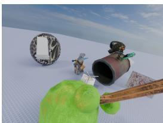  
(a)

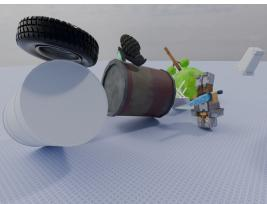

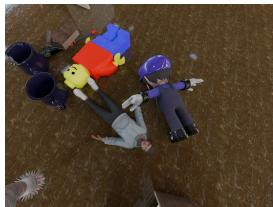

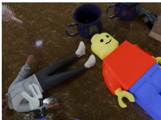

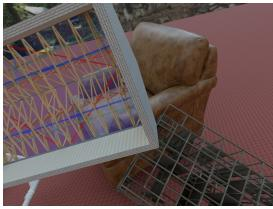

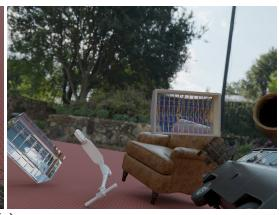

(b)  
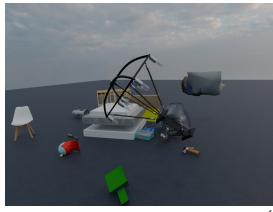

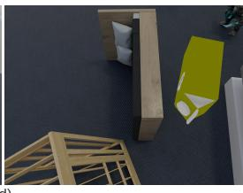  
(d)

(c)  
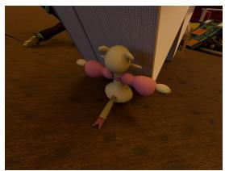  
(e)

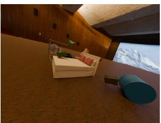

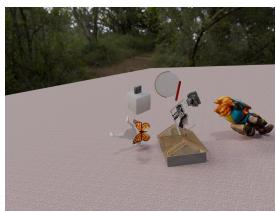  
(f)

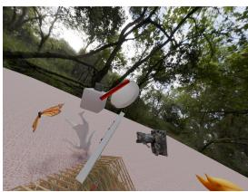  
Fig. 7: S3 scene examples. Each adjacent image pair shows two viewpoints of one synthetic scene. Procedural layouts and varied capture conditions produce changes in occlusion, object scale, background, and lighting while retaining complete object supervision.

## C EVALUATION METRICS

All distances are normalized by a reference diameter D before averaging: the CAD diameter for LM-O, HB, and HANDAL, the convex-hull diameter of the observed mesh for ScanNet++, and a robust surface extent for Toys4K. Distances, NC, F1, and IoU are therefore dimensionless, recall is a percentage, and PSNR is in dB.

## C.1 JOINT POSE AND SHAPE

We sample 100,000 points uniformly by area on each predicted and reference mesh. For point sets A and B, the directed and symmetric surface distances are

$$
\begin{array} { c } { \displaystyle \delta ( { \boldsymbol { \mathcal { A } } } , { \boldsymbol { \mathcal { B } } } ) = \frac { 1 } { | { \boldsymbol { \mathcal { A } } } | } \sum _ { \mathbf { a } \in { \mathcal { A } } } \operatorname* { m i n } _ { \mathbf { b } \in { \mathcal { B } } } \| \mathbf { a } - \mathbf { b } \| _ { 2 } , } \\ { \displaystyle \mathrm { C D } ( { \boldsymbol { \mathcal { A } } } , { \boldsymbol { \mathcal { B } } } ) = \frac { \delta ( { \boldsymbol { \mathcal { A } } } , { \boldsymbol { \mathcal { B } } } ) + \delta ( { \boldsymbol { \mathcal { B } } } , { \boldsymbol { \mathcal { A } } } ) } { 2 D } . } \end{array}\tag{7}
$$

Following SAM 3D and RecGen (Chen et al., 2026; Zadaianchuk et al., 2026), ADD-SB applies this distance to the posed prediction and reference, and ADD-SB@0.1 is the percentage of objects below one tenth of the diameter:

$$
\mathrm { A D D - S B } = \mathrm { C D } ( \widehat { \mathcal { P } } , \mathcal { P } ^ { \star } ) , \qquad \mathrm { A D D - S B } \ @ 0 . 1 = \frac { 1 0 0 } { N } \sum _ { i = 1 } ^ { N } \mathbf { 1 } [ \mathrm { A D D - S B } _ { i } < 0 . 1 ] .\tag{8}
$$

ADD-SB evaluates the predicted placement as is, without fitting the object to the reference. When cameras are estimated, we first register the reconstruction frame to the reference with a single similarity transform, computed from the cameras alone and shared by all objects and methods in the scene.

## C.2 ALIGNED GEOMETRY

For shape metrics, we leverage ICP to fit a proper similarity $H ( \mathbf { p } ) = s R \mathbf { p } + \mathbf { t }$ with $s > 0$ and $R \in \mathrm { S O ( 3 ) }$ . CD is computed on the aligned surfaces, and normal consistency (NC) averages the absolute dot products of nearest-neighbor normals in both directions. F1 is the harmonic mean of precision and recall at a distance threshold of 0.01D on Toys4K and 0.02D on real data. Silhouette IoU is averaged over matched cameras within each object and then across objects.

## C.3 APPEARANCE

We measure appearance with PSNR, SSIM, and LPIPS (Zhang et al., 2018), comparing $1 0 2 4 ^ { 2 }$ renders of each aligned prediction and its reference over a white background. The renders reuse the shape alignment of Sec. C.2 and share cameras and studio lighting, without exposure or color fitting. Predictions keep their native materials, and reference CAD models, whose colors come from realworld capture, are rendered with a rough diffuse material. The scores therefore measure agreement with the rendered reference rather than calibrated material recovery. ScanNet++, whose references are partial scans, is evaluated on geometry only.

## D EVALUATION PROTOCOLS AND ADDITIONAL RESULTS

## D.1 TOYS4K PROTOCOL

The four input views of each object are rendered in Blender under studio lighting from casual viewpoints, with irregular spacing and varied elevation, field of view, and roll. Six held-out views that differ from all inputs are used only for evaluation. All methods receive the same images and masks, and GATOR also uses the category name as text. GATOR, Pixal3D, and GPT-6-Astra use cameras and depth estimated by Pi3X (Wang et al., 2026b), ReconViaGen uses its own geometry estimator, and TRELLIS.2 conditions on the images alone through MultiDiffusion (Bar-Tal et al., 2023). Fig. 8 shows qualitative comparisons, with GATOR before and after agentic refinement.

TRELLIS.2

GT

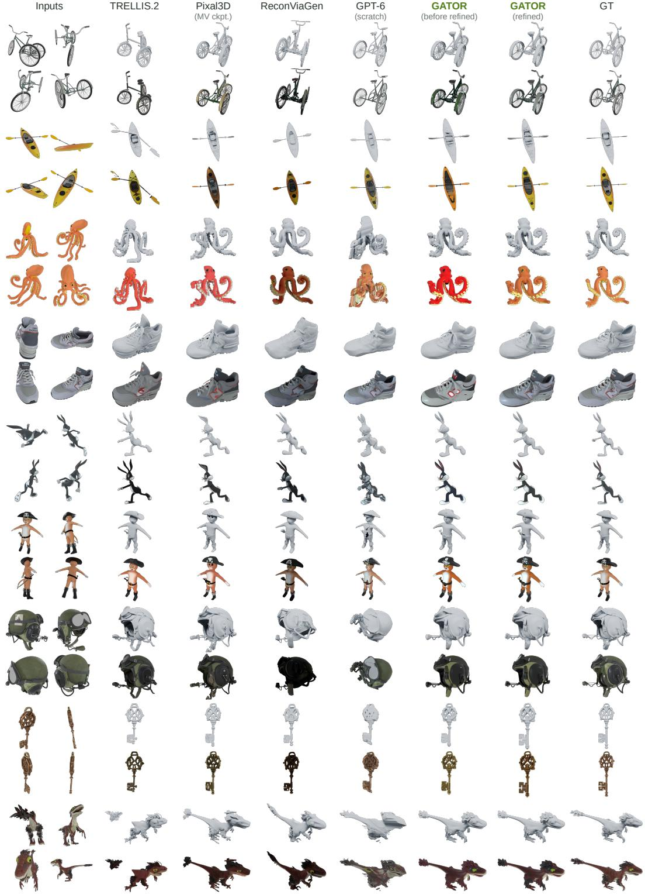  
Fig. 8: Four-view reconstruction on Toys4K. Each example shows its four inputs at left and each method’s geometry (top) and appearance (bottom) in a shared novel view after shape alignment.

Table 6: Real-world tabletop reconstruction per dataset. The generative model alone (GATOR w/o agent) already outperforms every baseline on every geometry metric, and refinement improves PSNR and LPIPS on every dataset. Dashes mark unavailable scores, including appearance scores for ShapeR, which can only output untextured object meshes. Dark/light green mark best/second-best values per dataset (excluding the fully proprietary GPT-6-Astra baseline).
<table><tr><td rowspan="2">Methods</td><td colspan="2">Joint (ADD-SB)</td><td colspan="4">Geometry</td><td colspan="3">Appearance</td></tr><tr><td>Mean↓</td><td>@0.1↑</td><td>CD↓</td><td>NC↑</td><td>F1↑</td><td>IoU2D↑</td><td>PSNR↑</td><td>SSIM↑</td><td>LPIPS↓</td></tr><tr><td>LM-O: sensor depth</td><td></td><td></td><td></td><td></td><td></td><td></td><td></td><td></td><td></td></tr><tr><td>GPT-6-Astra</td><td>0.045</td><td>100.00</td><td>0.031</td><td>0.777</td><td>0.524</td><td>0.789</td><td>15.92</td><td>0.899</td><td>0.243</td></tr><tr><td>SimFoundry</td><td>0.375</td><td>62.50</td><td>0.043</td><td>0.783</td><td>0.460</td><td>0.748</td><td>15.50</td><td>0.882</td><td>0.252</td></tr><tr><td>RecGen</td><td>0.043</td><td>100.00</td><td>0.027</td><td>0.796</td><td>0.542</td><td>0.811</td><td>16.95</td><td>0.911</td><td>0.225</td></tr><tr><td>ReconViaGen</td><td></td><td></td><td>0.049</td><td>0.723</td><td>0.413</td><td>0.728</td><td>12.58</td><td>0.837</td><td>0.256</td></tr><tr><td>ShapeR</td><td>0.060</td><td>100.00</td><td>0.050</td><td>0.651</td><td>0.316</td><td>0.712</td><td></td><td></td><td></td></tr><tr><td>MV-SAM3D</td><td>0.045</td><td>100.00</td><td>0.026</td><td>0.817</td><td>0.598</td><td>0.839</td><td>15.70</td><td>0.880</td><td>0.212</td></tr><tr><td>Pixal3D</td><td></td><td></td><td>0.052</td><td>0.700</td><td>0.368</td><td>0.764</td><td>14.69</td><td>0.896</td><td>0.258</td></tr><tr><td>GATOR w/o agent (Ours)</td><td>0.034</td><td>100.00</td><td>0.023</td><td>0.827</td><td>0.655</td><td>0.872</td><td>17.21</td><td>0.917</td><td>0.204</td></tr><tr><td>GATOR (Ours)</td><td>0.034</td><td>100.00</td><td>0.022</td><td>0.836</td><td>0.665</td><td>0.873</td><td>17.53</td><td>0.925</td><td>0.189</td></tr><tr><td>HB: sensor depth</td><td></td><td></td><td></td><td></td><td></td><td></td><td></td><td></td><td></td></tr><tr><td>GPT-6-Astra</td><td>0.020</td><td>100.00</td><td>0.017</td><td>0.812</td><td>0.731</td><td>0.873</td><td>15.94</td><td>0.864</td><td>0.189</td></tr><tr><td>SimFoundry</td><td>0.200</td><td>63.24</td><td>0.050</td><td>0.704</td><td>0.468</td><td>0.650</td><td>13.24</td><td>0.845</td><td>0.234</td></tr><tr><td>RecGen</td><td>0.040</td><td>97.06</td><td>0.020</td><td>0.796</td><td>0.657</td><td>0.844</td><td>14.91</td><td>0.861</td><td>0.201</td></tr><tr><td>ReconViaGen</td><td></td><td></td><td>0.027</td><td>0.766</td><td>0.587</td><td>0.810</td><td>14.44</td><td>0.836</td><td>0.196</td></tr><tr><td>ShapeR</td><td>0.030</td><td>98.53</td><td>0.023</td><td>0.757</td><td>0.661</td><td>0.811</td><td></td><td></td><td></td></tr><tr><td>MV-SAM3D</td><td>0.029</td><td>100.00</td><td>0.020</td><td>0.784</td><td>0.642</td><td>0.825</td><td>15.15</td><td>0.869</td><td>0.193</td></tr><tr><td>Pixal3D</td><td></td><td></td><td>0.017</td><td>0.812</td><td>0.791</td><td>0.910</td><td>16.57</td><td>0.871</td><td>0.180</td></tr><tr><td>GATOR w/o agent (Ours)</td><td>0.012</td><td>100.00</td><td>0.009</td><td>0.882</td><td>0.916</td><td>0.919</td><td>15.83</td><td>0.863</td><td>0.174</td></tr><tr><td>GATOR (Ours)</td><td>0.012</td><td>100.00</td><td>0.009</td><td>0.883</td><td>0.917</td><td>0.917</td><td>16.53</td><td>0.866</td><td>0.166</td></tr><tr><td>HANDAL: estimated depth</td><td></td><td></td><td></td><td></td><td></td><td></td><td></td><td></td><td></td></tr><tr><td>GPT-6-Astra</td><td>0.032</td><td>100.00</td><td>0.012</td><td>0.787</td><td>0.861</td><td>0.674</td><td>19.10</td><td>0.914</td><td>0.106</td></tr><tr><td>SimFoundry</td><td>0.134</td><td>63.64</td><td>0.026</td><td>0.723</td><td>0.624</td><td>0.572</td><td>17.16</td><td>0.915</td><td>0.143</td></tr><tr><td>RecGen</td><td>0.080</td><td>69.09</td><td>0.020</td><td>0.785</td><td>0.695</td><td>0.624</td><td>17.38</td><td>0.914</td><td>0.137</td></tr><tr><td>ReconViaGen</td><td></td><td></td><td>0.024</td><td>0.732</td><td>0.671</td><td>0.617</td><td>14.85</td><td>0.893</td><td>0.147</td></tr><tr><td>ShapeR</td><td>0.090</td><td>70.91</td><td>0.030</td><td>0.658</td><td>0.581</td><td>0.539</td><td></td><td></td><td></td></tr><tr><td>MV-SAM3D</td><td>0.063</td><td>80.00</td><td>0.017</td><td>0.766</td><td>0.754</td><td>0.647</td><td>15.98</td><td>0.904</td><td>0.124</td></tr><tr><td>Pixal3D</td><td></td><td></td><td>0.014</td><td>0.761</td><td>0.828</td><td>0.686</td><td>17.84</td><td>0.917</td><td>0.122</td></tr><tr><td>GATOR w/o agent (Ours)</td><td>0.032</td><td>96.36</td><td>0.008</td><td>0.826</td><td>0.936</td><td>0.757</td><td>19.42</td><td>0.927</td><td>0.097</td></tr><tr><td>GATOR (Ours)</td><td>0.033</td><td>96.36</td><td>0.009</td><td>0.832</td><td>0.923</td><td>0.728</td><td>20.07</td><td>0.917</td><td>0.096</td></tr></table>

## D.2 TABLETOP PROTOCOL

The tabletop comparison uses all LM-O, HB, and HANDAL objects, each with RGB images and target masks. LM-O and HB add sensor depth and intrinsics, with camera poses recovered from calibration markers on HB and by registration with depth and image correspondences on LM-O. On HANDAL, VGGT-Ω (Wang et al., 2026a) estimates cameras and depth from the frames of each scene. GATOR receives the category name on HANDAL and the generic prompt a 3D object on LM-O and HB.

All baselines use their released checkpoints, and Pixal3D uses its multiview checkpoint with the shared cameras. MV-SAM3D replaces its depth estimator with the shared pointmaps and cameras and keeps its native pose and texture optimization. ReconViaGen reconstructs from masked RGB with its own geometry estimator, and RecGen aligns its observations internally. ShapeR receives grayscale images, filtered points, and a caption, and can only output untextured object meshes, so it is excluded from appearance evaluation. SimFoundry (Ranawaka et al., 2026) reconstructs from a single view with Hunyuan3D-2.1 and FoundationPose (Wen et al., 2024). Table 6 reports each dataset separately, including the generated outputs before refinement, and Fig. 9 shows more LM-O and HB qualitative comparisons.

Inputs

ReconViaGen

ShapeR

Pixal3D

RecGen

MV-SAM3D

GATOR (before refined)

GATOR (refined)

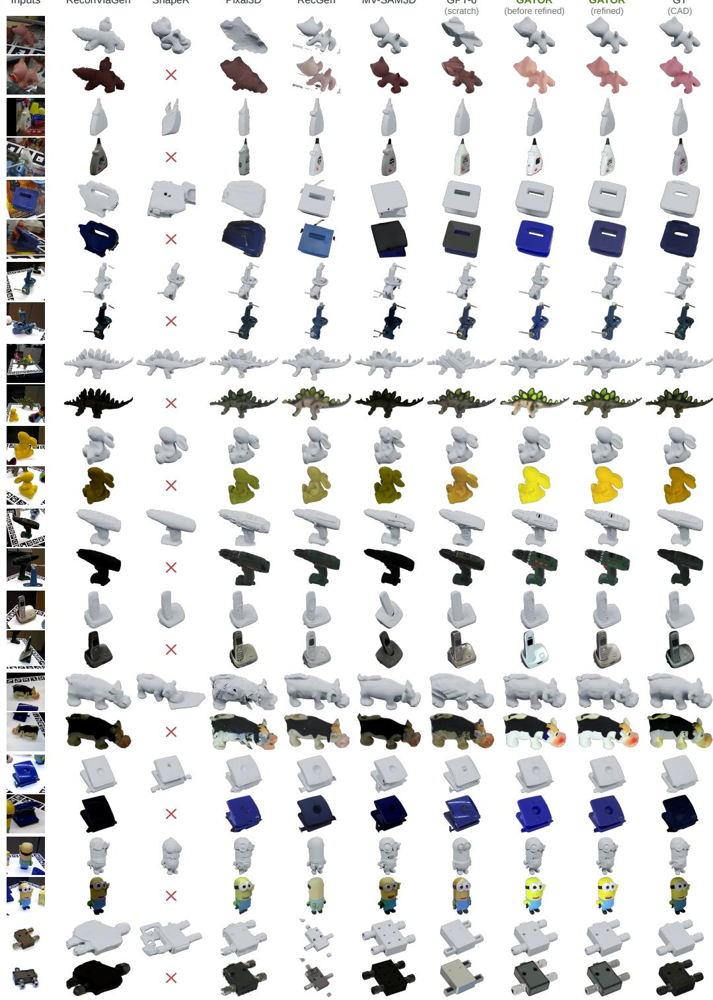  
Fig. 9: Extended LM-O and HB comparisons. Each object shows two of its four input views and each method’s geometry (top) and appearance (bottom) from a shared camera. ShapeR can only output untextured object meshes (red crosses).

Table 7: Multiview tabletop reconstruction on LM-O and HB. Unlike Table 6, each target is evaluated with two different view selections, recall counts every attempt, and GATOR is reported without agentic refinement, so its four-view scores differ between the two tables. GATOR leads every joint and geometry metric at every view count, and its distance errors decrease as views are added. Pixal3D predicts no pose placement and thus has no joint (ADD-SB) result. Bold marks the best score.
<table><tr><td rowspan="2">Views Methods</td><td rowspan="2"></td><td colspan="2">Joint (ADD-SB)</td><td colspan="4">Geometry</td><td colspan="3">Appearance</td></tr><tr><td>Mean↓</td><td>@0.1↑</td><td>CD↓</td><td>NC↑</td><td>F1↑</td><td>IoU2D↑</td><td>PSNR↑</td><td>SSIM↑</td><td>LPIPS↓</td></tr><tr><td rowspan="3">2</td><td>RecGen</td><td>0.041</td><td>98.03</td><td>0.021</td><td>0.796</td><td>0.643</td><td>0.845</td><td>15.16</td><td>0.867</td><td>0.203</td></tr><tr><td>Pixal3D</td><td></td><td></td><td>0.027</td><td>0.757</td><td>0.648</td><td>0.840</td><td>15.32</td><td>0.865</td><td>0.209</td></tr><tr><td>GATOR (Ours)</td><td>0.015</td><td>98.03</td><td>0.011</td><td>0.865</td><td>0.863</td><td>0.897</td><td>15.75</td><td>0.866</td><td>0.183</td></tr><tr><td rowspan="2">4</td><td>Pixal3D</td><td></td><td></td><td>0.021</td><td>0.799</td><td>0.745</td><td>0.875</td><td>16.29</td><td>0.872</td><td>0.190</td></tr><tr><td>GATOR (Ours)</td><td>0.014</td><td>98.03</td><td>0.010</td><td>0.874</td><td>0.891</td><td>0.902</td><td>15.86</td><td>0.866</td><td>0.179</td></tr><tr><td rowspan="2">8</td><td>Pixal3D</td><td></td><td></td><td>0.020</td><td>0.813</td><td>0.774</td><td>0.886</td><td>16.74</td><td>0.875</td><td>0.185</td></tr><tr><td>GATOR (Ours)</td><td>0.013</td><td>98.03</td><td>0.010</td><td>0.880</td><td>0.901</td><td>0.900</td><td>15.85</td><td>0.867</td><td>0.174</td></tr></table>

## D.3 VIEW COUNTS ON LM-O AND HB

Table 7 evaluates nested two-, four-, and eight-view inputs on LM-O and HB, pooled over both datasets. Unlike the per-dataset comparison in Table 6, it evaluates each target with two different view selections, counts every attempt in the recall, and reports GATOR without agentic refinement. From two to eight views, GATOR’s ADD-SB decreases from 0.0148 to 0.0134 and CD from 0.0109 to 0.0096, while ADD-SB@0.1 remains 98.03%.

## D.4 SCANNET++ PROTOCOL

Our ScanNet++ benchmark extends the protocol of DP-Recon, ShapeR, and JRM (Ni et al., 2025; Siddiqui et al., 2026; Wu et al., 2026), which evaluates 69 objects in 6 scenes, with 160 targets from 43 additional scenes. Each target is observed in one to ten views chosen for target visibility and viewpoint diversity. VGGT-Ω estimates cameras and depth from the frames of each scene, from which these views are selected. Pixal3D, MV-SAM3D, ShapeR, GATOR, and GPT-6-Astra share the selected views, masks, cameras, and depth, and ReconViaGen uses its own estimator. The baselines otherwise follow Sec. D.2.

Since ScanNet++ only provides partial scanned ground-truth meshes, alignment is fit only to the observed surfaces, but the symmetric distances still penalize completed surfaces that the scan did not capture. IoU projects each aligned prediction into all reference views, and failed reconstructions score zero. Fig. 10 shows more ScanNet++ qualitative comparisons.

## D.5 ABLATION PROTOCOL

Every configuration in Table 4 receives the same four input views, estimated cameras and depth, and sampling settings for 55 HANDAL targets, and reconstructs all of them. The base and modality mixer variants share the same geometry and appearance flow models. The agentic-refinement row refines the text-conditioned outputs with the ten-minute agent of Sec. A.4, without rerunning the generative model. Because the ablation models are trained separately from the main generative model, their scores are not directly comparable to Tables 2 and 6.

Fig. 11 illustrates typical refinement edits. The agent adds detail that the generative model smooths away, such as the lattice railing of the bus (a), and corrects texture errors, such as the garbled lettering on the package (b). Using the input images and semantic knowledge of object structure, it also completes missing parts such as the legs of the chair (c), removes geometry of other objects fused onto the desk (d), and repairs the broken handle of the umbrella (e). When the generated asset is already accurate, the agent leaves it largely unchanged (f). Because these edits are local, they improve appearance and fine structure while changing average geometry little on most benchmarks, although they slightly worsen CD, F1, and IoU on HANDAL (Table 6).

Inputs

ReconViaGen

ShapeR

Pixal3D

RecGen

MV-SAM3D

GPT-6 (scratch)

GATOR (before refined)

GATOR (refined)

GT(scan)

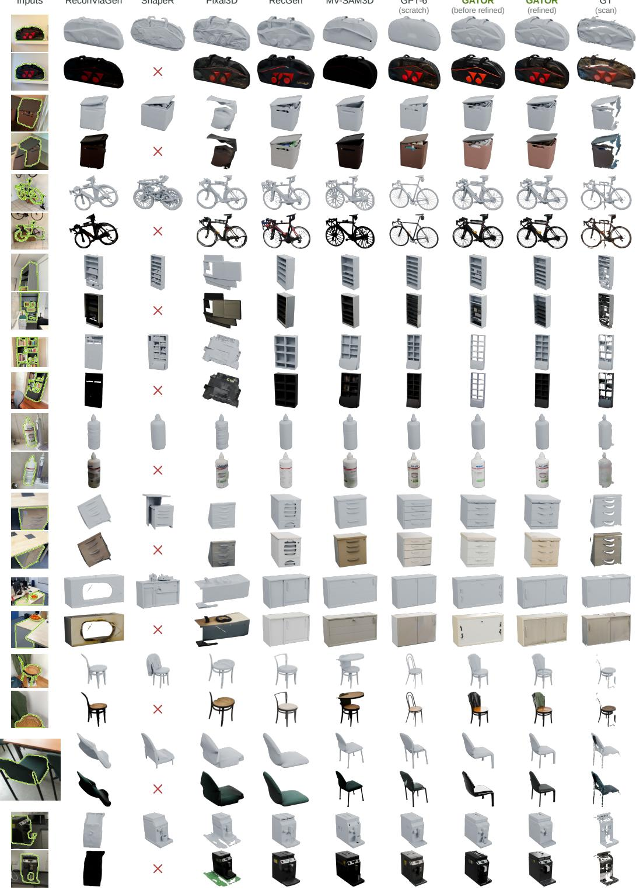  
Fig. 10: Extended ScanNet++ comparisons. Each object shows up to two input views with the target outlined in green and each method’s geometry (top) and appearance (bottom) from a shared camera. ShapeR can only output untextured object meshes (red crosses). GT is the observed partial scan.

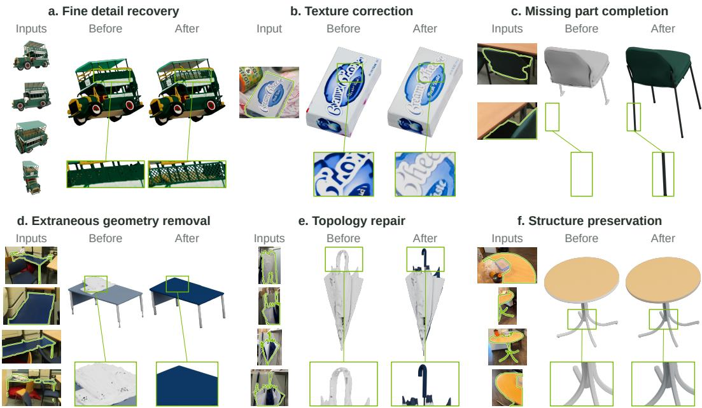  
Fig. 11: Agentic reconstruction refinement. Before-and-after examples illustrate six refinement behaviors. Up to four input views are shown, with real-world targets outlined in green. Boxes and matched zooms highlight reconstruction details. Each pair shares the same camera, diffuse shading, and display scale.

## D.6 SCENE-LEVEL RIGID-BODY SIMULATION

Reconstructed assets are often placed into physics simulators, where small geometric defects in supporting parts can make objects unstable. We therefore simulate all 15 objects that GATOR reconstructs in a ScanNet++ meeting room with PyBullet, once using the generated outputs and once after agentic refinement. Both versions share the same upright placement slightly above a common floor, the same assumed mass and physics settings, and convex collision approximations. After the scene settles, three generated chairs lean or topple by 40–79◦, whereas their refined counterparts stay within 1.3◦ of upright (Fig. 12). Before refinement, the large conference table also stands on uneven, slanted legs, which the agent makes straight and uniform.

## D.7 LIMITATIONS AND FUTURE WORK

GATOR relies on target masks and on camera and depth estimates. While mixing modalities reduces its sensitivity to estimation errors (Sec. 4.4), gross failures, such as missing segmentation or catastrophically wrong depth may still harm reconstruction. Agentic refinement relies on a proprietary model and adds up to ten minutes of agent time per object. Tighter integration with segmentation and geometry estimation, open agents, and automatic geometric verification of agent edits are promising directions toward reliable reconstruction from everyday images.

## E ACKNOWLEDGMENTS

We gratefully acknowledge Nick Schneider, Naveen Rai, Ajay Mandlekar, Yuke Zhu, Nadun Ranawaka, Mingfeng Li, Ziqiang Huang.

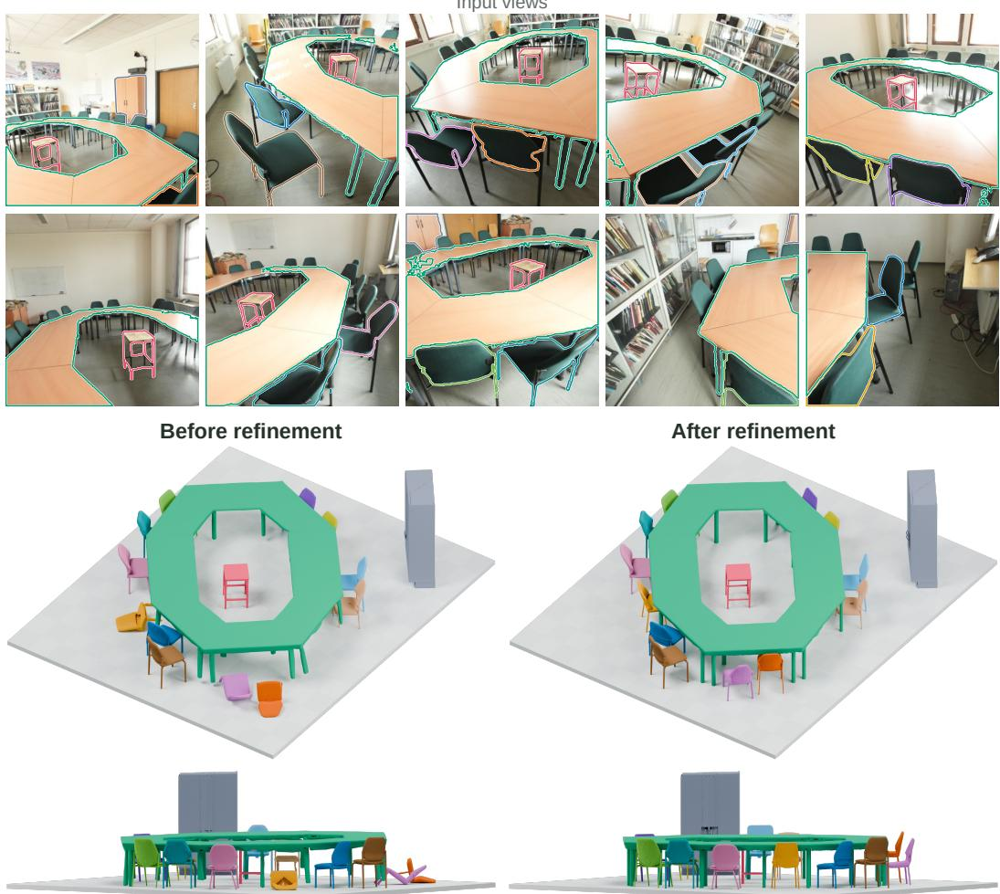  
Fig. 12: Scene-level rigid-body simulation. All ten input views (top two rows) and simulated resting states of a ScanNet++ meeting room, shown from overview (third row) and side (bottom) cameras. Three chairs that lean or topple before refinement become able to stand upright steadily after refinement.