# GenIA: Generative Reconstruction with Test-Time Input Alignment

Stefano Esposito1, Naama Pearl1, Polina Karpikova1, Samuel Rota Bulò2, Lorenzo Porzi2, Peter Kontschieder2, Andreas Geiger1, Jonathon Luiten2

1Tübingen AI Center, University of Tübingen 2Meta Reality Labs

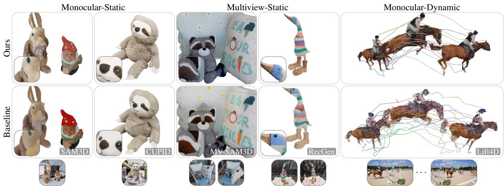  
Figure 1. GenIA reconstructs complete, detailed, and input-aligned 3D objects from monocular images, multi-view images, and monocular videos. Our inference-time framework aligns the frozen SAM3D [9] model to the inputs using geometric and photometric constraints, improving pose and appearance consistency while preserving generative completion. These contributions extend SAM3D beyond the single-view static setting it was trained for, enabling multi-view reconstruction. Given a temporal coarse shape as input, they enable dynamic reconstruction with improved image quality and stable tracking. We show object reconstructions from custom and DAVIS [54] scenes, alongside representative baselines (SAM3D [9], CUPID [15], MV-SAM3D [27], RecGen [85], Lift4D [36]) and input images.

## Abstract

Reconstructing complete 3D object assets from monocular or sparse multi-view observations remains challenging. Generative 3D foundation models can complete object geometry beyond the observed views, but their predictions may not faithfully reproduce the observed geometry, appearance, or pose. We introduce GenIA, a framework for test-time input-aligned generation that grounds SAM3D’s generative prior in geometric and photometric observations without retraining the foundation model. We improve object pose by deriving translation and scale from geometry while retaining the learned rotation prior, and align appearance through visibility-biased attention, cross-observation fusion, and differentiable rendering guidance during denoising. An optional post-denoising refinement further adapts the appearance latent, lightweight decoder adapters, and object placement to the observations. Ourframework

also supports externally supplied geometry; when given temporal shapes of dynamic objects, it recovers a shared, input-aligned canonical appearance and stable world-space placement. Across synthetic and real benchmarks, GenIA improves pose prediction and object reconstruction from monocular, multi-view, and dynamic inputs, outperforming recent optimization-based, per-frame image-to-3D, and video-to-4D methods. Our project page is available at https://facebookresearch.github.io/GenIA.

## 1. Introduction

Photorealistic 3D reconstruction requires recovering complete geometry, faithful appearance, and correct placement from one or more observations. For dynamic objects, these properties must also remain coherent over time. Such assets are central to content creation, immersive media, robotics simulation, and embodied AI, yet remain difficult to recover from casual images or videos. The core challenge is to combine generative priors that complete unseen regions with reconstruction constraints that faithfully reproduce the observed evidence.

Recent 3D foundation models learn strong generative priors from large-scale data, but often trade fidelity to the observed inputs for generative completeness. SAM3D [9], for example, predicts complete object geometry, appearance, and rigid pose from a single image, but its geometry and appearance may not tightly reproduce the observations, and its pose estimates can be inaccurate. At the other extreme, pixel-aligned predictors like Pixal3D [28] faithfully reconstruct observed geometry and appearance but offer weaker completion of unseen regions and typically do not recover explicit object pose. Another line of work narrows this gap by retraining generative models with reconstruction cues: ReconViaGen [3] conditions structured-latent generation on multi-view features and steers sampling toward the inputs, while CUPID [15] jointly recovers camera pose and injects pixel-aligned features into a single-image generator. However, both specialize the generator to a particular input setting at training time, and neither addresses dynamic objects.

In this work, we instead align the generative prior to its inputs at inference time, without retraining the foundation model. We call this approach test-time Input-Aligned Generation (GenIA). Geometric and photometric signals constrain the observed regions, while the generative is steered toward consistent completion of what remains unseen. The same mechanism spans monocular, multi-view, and dynamic inputs.

GenIA aligns generation to the observations at three levels. First, we recover translation and scale using depthderived cues while retaining the generative rotation prior. Second, we condition appearance on geometry and visibility, directing local features toward the image regions that observe them and fusing predictions across views or frames with visibility weighting. Third, differentiable rendering provides both in-trajectory guidance and optional post-denoising refinement. Our grounding mechanisms are geometry-predictor agnostic and therefore also support externally supplied shapes. We demonstrate this with Action-Mesh [60], which provides canonical dynamic geometry but neither world-space placement nor appearance; GenIA complements it with input-aligned canonical appearance and temporally stable rigid placement.

GenIA improves pose and object reconstruction from monocular and multi-view inputs without retraining the underlying foundation model, and produces temporally consistent dynamic video reconstructions. It outperforms perframe image-to-3D, optimization-based, and recent video-to-4D methods on both real and synthetic benchmarks.

Our contributions are:

1. An inference-time framework that aligns SAM3D’s generative prior with geometric and photometric observations without retraining the foundation model, optionally supporting externally supplied temporal geometry.

2. A visibility-aware appearance approach combining attention bias, rendering guidance, and cross-observation fusion for monocular, multi-view, and dynamic inputs, all applied to the frozen generator.

3. A geometry-grounded object placement strategy with sequence-level rotation aggregation for improved and temporally stable poses.

4. An optional post-denoising refinement that jointly optimizes the appearance latent, lightweight decoder adapters, and object placement via differentiable rendering, bridging the gap between the frozen decoder’s capacity and the observed appearance while preserving the pretrained prior.

## 2. Related work

## 2.1. 3D reconstruction and generation

High-fidelity 3D reconstruction was long dominated by per-scene optimization, from neural radiance fields [48, 49, 66, 83] to 3D Gaussian Splatting [23]. Monocular depth estimation has simultaneously progressed from specialized predictors [57] to foundation-scale models [2, 21, 80], while general 3Dfoundation models directly regress dense geometry and cameras from uncalibrated image collections [22, 26, 65, 69, 70]. Building on these advances, feed-forward 3DGS models recover scene-level Gaussian representations from calibrated views [4, 10, 76] or uncalibrated image collections [13, 16, 35, 41, 46], while recurrent refinement methods improve these predictions through rendering feedback [53, 77]. While faithful to the observed imagery, these methods reconstruct only visible geometry and do not recover complete, object-centric assets with explicit world-space grounding.

Complementary to reconstruction, object-centric generation infers complete geometry and appearance conditioned on text or sparse observations. Early approaches distill pretrained 2D diffusion priors through score distillation [34, 55, 63] or improve the multi-view consistency of image-conditioned generation [38, 40, 42], while large reconstruction models [5, 14, 78] bridge the two paradigms by regressing complete objects from single or sparse views. Recent methods instead operate directly in native 3D representations, learning structured latent spaces over voxels, meshes, or Gaussian primitives [29, 73, 74, 79, 89]. Pixal3D [28] departs from canonical-space generation by predicting pixelaligned assets through explicit image-to-geometry correspondence. ReconViaGen [3] and CUPID [15] narrow the gap between generation and reconstruction through stronger learned alignment to the input: ReconViaGen targets multiview reconstruction, while CUPID jointly models object generation and camera pose from a single image. These approaches rely on specialized architectures and incorporate alignment directly into the training process; in contrast, we ground pose and appearance at inference time on a frozen generator, with the same framework spanning monocular, multi-view, and dynamic inputs.

Our work builds on SAM3D [9], which predicts complete object geometry, appearance, and pose from a single image using large-scale generative priors. Subsequent work accelerates inference [12], extends generation to multiple views [27, 90], or retrains the pipeline for pose-conditioned appearance [85]. Nevertheless, these approaches remain driven primarily by learned priors and do not explicitly enforce consistency with observed images during inference.

Our work is complementary to this line of research. Rather than improving the underlying generative prior, we ground SAM3D’s pose and appearance in observations through depth-based initialization, visibility-aware reasoning, differentiable rendering guidance, and optional test-time refinement.

## 2.2. 4D reconstruction and generation

Dynamic reconstruction extends static reconstruction by enforcing temporal consistency across geometry, appearance, and motion. Early deformable neural rendering methods [11, 25, 43, 51, 52, 56, 67, 71, 81, 82] optimize dynamic scenes for each video, introducing explicit timevarying Gaussian representations through persistent tracking, deformation fields, or compact motion models. Perscene monocular methods improve dynamic reconstruction via temporally consistent meshes [37], better motion representations [33, 72], or diffusion-based inpainting of novel views [7]. Other methods optimize over learned priors [8, 31, 45, 88] or predict 4D geometry and motion directly [20, 47, 87]. However, optimization-based methods are costly per sequence, and all of these methods recover geometry only for surfaces observed in the input, leaving unseen regions incomplete.

Generative video-to-4D introduces learned priors to aid or replace per-sequence optimization. Early approaches distill pretrained 2D diffusion models into dynamic representations and supervise 4D optimization using generated multi-view videos [17, 30, 75]. Feed-forward methods directly predict temporally complete geometry from monocular videos [44, 59], while more recent work unifies reconstruction and generation in learned spatio-temporal latent spaces [60, 61, 84, 86]. Other works combine image-to-3D priors with per-sequence deformation optimization [6, 36, 62, 64].

Rather than generating 4D geometry itself, we leverage temporally coherent geometry from existing backbones such as ActionMesh and recover the complementary components they lack: observation-grounded appearance and stable world-space trajectories, without dataset-level retraining.

## 3. Preliminaries

Each observation provides an image I, an object mask M, a depth map D, the camera intrinsics K and extrinsics E.

## 3.1. SAM3D

We build on SAM3D [9], which operates on a single observation. SAM3D predicts a coarse occupancy grid O, appearance A, and pose $\boldsymbol \rho : = ( R , { \bf t } , s )$ , mapping local object coordinates to the camera frame. These are predicted conditioned on a single observation $( I , M , K , D )$ . K and D are internally predicted by a monocular depth estimator (MoGe [68]) and converted into a conditioning pointmap $P .$ The camera extrinsics E are assumed to be identity, so world and camera space coincide.

The model is a two-stage rectified flow-matching pipeline that denoises a set of modality m latents $\mathbf { x } ^ { m }$ , conditioned on input features c. The first stage predicts the coarse shape O and the pose $\rho ;$ the second predicts a structured latent (SLAT) $Z$ that jointly encodes fine geometry S and appearance A. Both stages use 25-step rectified conditional flow matching with a linear interpolant $\mathbf { x } _ { \tau } ^ { m } : = \tau \mathbf { x } _ { 1 } ^ { m } + \left( 1 - \tau \right) \mathbf { x } _ { 0 } ^ { m } , \tau \in \left[ 0 , 1 \right]$ $\mathbf { x } _ { 0 } ^ { m } \sim \mathcal { N } ( \mathbf { 0 } , \mathbf { I } )$ , target velocity $\mathbf { v } ^ { m } : = \dot { \mathbf { x } } _ { \tau } ^ { m } = \mathbf { x } _ { 1 } ^ { m } - \mathbf { x } _ { 0 } ^ { m }$ , and learned velocity $\mathbf { v } _ { \theta } ^ { m } ( \mathbf { x } _ { \tau } ^ { m } , \mathbf { c } , \tau )$ . Generation then integrates the ODE

$$
\begin{array} { r } { \mathbf { x } _ { \tau + \Delta \tau } ^ { m } = \mathbf { x } _ { \tau } ^ { m } + \mathbf { v } _ { \theta } ^ { m } ( \mathbf { x } _ { \tau } ^ { m } , \mathbf { c } , \tau ) \Delta \tau . } \end{array}\tag{1}
$$

The velocity is classifier-free guided: each step evaluates a conditioned pass and a condition-free pass, in which the conditioning c is replaced by a null embedding ∅, and extrapolates between them with guidance strength w:

$$
\begin{array} { r } { \mathbf { v } _ { \theta } ^ { m } : = \mathbf { \epsilon } ( 1 + w ) \mathbf { v } _ { \theta } ^ { m } ( \mathbf { x } _ { \tau } ^ { m } , \mathbf { c } , \tau ) \ - \ w \mathbf { v } _ { \theta } ^ { m } ( \mathbf { x } _ { \tau } ^ { m } , \mathbf { \emptyset } , \tau ) } \end{array}\tag{2}
$$

Coarse geometry stage. DINOv2 [50] encodes the image– mask pair at full and mask-cropped resolution into four token channels, concatenated with separately embedded pointmap tokens into the conditioning c. A Mixture-of-Transformers [32] jointly denoises (i) a coarse, voxelized version of the true object shape as a $1 6 ^ { 3 } \times 8$ shape latent $\mathbf { x } ^ { O }$ , decoded by the structure decoder $\mathcal { D } _ { o }$ into a $6 4 ^ { 3 }$ occupancy grid O, and (ii) an object pose as three pose tokens $\mathbf { x } ^ { R } , \mathbf { x } ^ { \mathbf { t } } , \mathbf { x } ^ { s }$ decoded by the pose decoder $\mathcal { D } _ { \rho }$ into $\rho .$ . Information flows unidirectionally from the shape stream to the pose stream through multi-modal self-attention.

Fine geometry and appearance stage. The input images and masks are encoded as in the coarse geometry stage into the conditioning c; pointmap tokens are omitted. A sparse latent flow transformer denoises the SLAT Z over the active voxels of the coarse occupancy O. The representation can be decoded with $\mathcal { D } _ { g }$ to a set of 3D Gaussians in the object frame defined by the predicted coarse shape O.

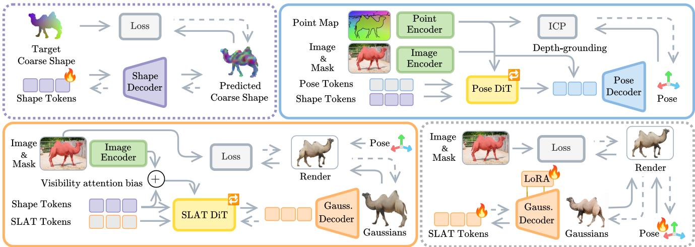  
Figure 2. Our pipeline. Left to right, top to bottom, we obtain the coarse shape from SAM3D’s first pass or (optionally) inject an external one into SAM3D’s shape tokens (Sec. 4.1), denoise each object’s per-frame pose over that fixed shape (Sec. 4.2), predict observation-aligned appearance as SLAT features (Sec. 4.3), and (optionally) do test-time refinement of the reconstruction against the input views (Sec. 4.4). Dotted arrows denote gradient flow. We illustrate the single-view setting; multi-view and dynamic extensions are described in the text.

## 4. Method

Given posed observations, GenIA recovers input-aligned object reconstructions with per-frame world-space poses. By default, SAM3D jointly denoises coarse shape and rotation. When external geometry is available, we instead inject it into SAM3D’s coarse latent representation (Sec. 4.1) and keep the shape fixed while denoising rotation. We then derive translation and scale from depth while retaining SAM3D’s rotation prior (Sec. 4.2), recover a shared appearance representation using visibility and rendering constraints (Sec. 4.3), and optionally refine the instance representation and worldspace pose at test time (Sec. 4.4). Figure 2 summarizes the pipeline. All stages operate at inference time without updating the pretrained SAM3D weights; optional refinement optimizes only an object-specific appearance latent, a lightweight low-rank decoder adapter, and pose.

We index each observation by view $j \in \{ 1 , \dots , n _ { \mathrm { v } } \}$ and frame $k \in \{ 1 , \ldots , n _ { \mathrm { f } } \} \colon n _ { \mathrm { v } }$ distinguishes monocular (= 1) from multi-view $( > 1 )$ inputs, while $n _ { \mathrm { f } }$ distinguishes static (= 1) from dynamic (> 1) scenes. Rather than using MoGe, which provides single-view depth but no camera pose, we use MapAnything [22] to obtain metric depth and camera calibration $( D _ { ( k , j ) } , E _ { ( k , j ) } , K _ { ( k , j ) } )$ across all settings. Our framework remains agnostic to the geometry predictor, supporting any method that provides geometrically consistent pointmaps and camera parameters.

## 4.1. Optional Shape Injection

When external geometry S is available, we replace SAM3D’s coarse shape prediction by voxelizing S into an occupancy grid O and inverting it into the clean latent $\mathbf { x } _ { 1 } ^ { O }$ expected by SAM3D’s frozen occupancy decoder. The inversion uses a reconstruction objective with moment-matching regularization to match the empirical distribution of SAM3D shape tokens $( \mathbb { E } [ \mathbf { x } _ { 1 } ^ { O } ] \approx 0 , \mathrm { V a r } ( \mathbf { x } _ { 1 } ^ { O } ) \approx 0 . 9 )$ . Pose denoising (Sec. 4.2) is then conditioned on the injected latent; without external geometry, injection is skipped and SAM3D denoises coarse shape and pose jointly.

For dynamic inputs, this external geometry additionally specifies an object-local deformation field $\delta ,$ relating the canonical shape to each frame (details in Sec. A.3). We invert each deformed shape while preserving these correspondences.

## 4.2. Pose prediction

We use SAM3D’s coarse geometry model to predict the reconstructed object’s world-space pose $\rho _ { k } : = ( R _ { k } , \mathbf { t } _ { k } , s _ { k } )$ at frame k.

Denoising. Without external geometry, coarse shape and pose are jointly denoised for SAM3D’s default 25 steps. With an injected shape latent $\mathbf { x } _ { k , 1 } ^ { O }$ , the fixed shape conditions the pose integration (1) for 10 steps. For static multi-view inputs $( n _ { \mathrm { v } } ~ > ~ 1 )$ , we denoise the pose from the first view $( j = 1 )$ . For dynamic objects, the injected shapes already capture non-rigid motion and local rotation, so we only need to recover a single global root orientation R rather than one per frame. We find this as the coordinate-wise median of the rotation velocities predicted across frames at each ODE step.

Depth-grounded translation and scale. Translation and scale dominate SAM3D’s image-space pose errors (ablated in Sec. A.1). We therefore retain the denoised rotation $R _ { k }$ and instead estimate translation and scale from geometric cues. Given the camera-space pointmap $P _ { k }$ , object mask $M _ { k }$ , and intrinsics $K _ { k } = ( f _ { x } , f _ { y } , c _ { x } , c _ { y } )$ , we measure three quantities: the object’s depth $d _ { k }$ (the median z of $P _ { k }$ over the mask), its center $( \bar { u } _ { k } , \bar { v } _ { k } )$ , and its angular size $a _ { k } = \operatorname* { m a x } ( { \Delta u _ { k } } / { f _ { x } } , { \Delta v _ { k } } / { f _ { y } } )$ , where $( \Delta u _ { k } , \Delta v _ { k } )$ is the extent of the mask bounding box in pixels. We then seek the translation and scale at which the posed coarse shape O, projected with $K _ { k } .$ , yields matching predictions: a silhouette with angular size aˆ, center (ˆu, vˆ), and median visible depth ˆd. We initialize by back-projecting the mask at $d _ { k }$

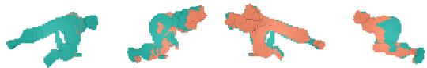  
Figure 3. Visibility on the object’s coarse shape. Left: camera view; orbiting reveals visible and occluded voxels.

$$
\mathbf { t }  d _ { k } ( \frac { \bar { u } _ { k } - c _ { x } } { f _ { x } } , \frac { \bar { v } _ { k } - c _ { y } } { f _ { y } } , 1 ) , \qquad s  d _ { k } a _ { k } ,\tag{3}
$$

We then perform five fixed-point iterations that update, in order, scale, depth, and lateral position, each from the residual of its own predicted quantity:

$$
\begin{array} { r l r } & { } & { s  s \frac { a _ { k } } { \hat { a } } , \qquad \mathbf { t } _ { z }  \mathbf { t } _ { z } + d _ { k } - \hat { d } , } \\ & { } & { ( \mathbf { t } _ { x } , \mathbf { t } _ { y } )  ( \mathbf { t } _ { x } , \mathbf { t } _ { y } ) + \big ( \frac { \bar { u } _ { k } - \hat { u } } { f _ { x } } , \frac { \bar { v } _ { k } - \hat { v } } { f _ { y } } \big ) \mathbf { t } _ { z } , } \end{array}\tag{4}
$$

The result replaces the denoised translation and scale. For multi-view inputs, translation and scale are estimated per view as above, mapped to world coordinates with $E _ { ( k , j ) }$ and the median center and scale define a shared world-space pose. For dynamic objects, they remain frame-specific. The object’s world-space pose at frame k then follows by composing the camera-space pose $\rho _ { ( k , j ) }$ with $E _ { ( k , j ) }$

Registration. Finally, we refine the initialized pose by registering the coarse shape to the metric input pointmap with a short iterative closest point (ICP) optimization [1] (details in Sec. A.9).

## 4.3. Appearance prediction

With the coarse shape O fixed and the object pose $\rho$ given, the appearance stage predicts a structured latent representation Z that encodes fine geometry and appearance. Conditioned on the voxel grid and the input images, a sparse latent flow transformer denoises Z through (1); the resulting latent is decoded into a set of 3D Gaussians (Sec. 3).

Conditioned on one observation, the SAM3D backbone predicts the velocity for the latent trajectory. At every denoising step, we first bias cross-attention toward image patches that observe each voxel and then apply rendering guidance to the resulting velocity prediction. The per-observation guided velocity predictions are then fused at every denoising step using visibility-based weights, yielding a shared latent trajectory.

In the following, we index observations by $b \in$ $\{ 1 , \ldots , n _ { \mathrm { o } } \}$ : a camera view in the static multi-view setting $( n _ { \mathrm { o } } { = } n _ { \mathrm { v } } )$ and a frame in the dynamic setting $( n _ { \mathrm { o } } { = } n _ { \mathrm { f } } )$ .

Per-voxel visibility. A voxel occluded in a view receives no reliable appearance information from it. We therefore compute a per-observation voxel visibility mask $\nu _ { i } ( b ) \in$ $\{ 0 , 1 \}$ . A voxel i is marked visible $\nu _ { i } ( b ) = 1$ if the ray from the voxel to the camera reaches the image plane without first intersecting another occupied cell, accounting for selfocclusion. Figure 3 visualizes the resulting visibility on a voxelized shape. For each voxel, we also define $\Pi _ { i } ( b )$ as the set of conditioning patches covering voxel i in observation $b ;$ if the voxel is not visible, then $\Pi _ { i } ( b ) = \emptyset$ (details in Sec. A.4).

Visibility attention bias. The appearance predictor crossattends to conditioning patches c. We bias this attention toward the patches that directly observe the voxels. For each voxel i and observation b, we add +α (α=5) to the logits of $\Pi _ { i } ( b )$ in the full- and cropped-RGB conditioning groups; occluded voxels receive no bias. The bias is applied only to the conditioned CFG branch $\mathbf { v } _ { \theta } ( \mathbf { x } _ { \tau } , \mathbf { c } , \tau )$ . Since softmax spans all conditioning tokens, we also subtract a per-voxel offset from the RGB logits to approximately preserve the attention share of unbiased mask and global tokens while retaining the $e ^ { \alpha }$ visible-patch boost; derivation and exact passive-stream compensation are given in Sec. A.5.

Rendering guidance. The visibility bias acts through the frozen conditioning pathway; rendering guidance, instead, directly supervises the decoded reconstruction during the flow trajectory. Each observation’s latent $Z _ { b }$ is advanced by its own CFG-combined velocity ${ \mathbf { v } } _ { \theta } ^ { ( b ) } \left( 2 \right) ;$ ; rendering guidance corrects this velocity independently for every observation. At each ODE step τ, we estimate the clean latent by extrapolating along the flow using the flow-matching analogue of Tweedie’s formula: $\hat { Z } _ { b } ( \tau ) = Z _ { b } ( \tau ) + ( 1 - \tau ) \mathbf { v } _ { \theta } ^ { ( b ) }$ . This is decoded to Gaussians and rendered under the fixed pose $\rho _ { b }$ to obtain $( \hat { I } _ { b } , \hat { D } _ { b } )$ . The per-observation rendering loss combines photometric and depth supervision:

$$
\begin{array} { r l } { \mathcal { L } _ { \mathrm { r e n d } } ^ { ( b ) } = \mathcal { L } _ { \mathrm { r g h } } ( \hat { I } _ { b } , I _ { b } ) + 0 . 2 \mathcal { L } _ { \mathrm { s s i m } } ( \hat { I } _ { b } , I _ { b } ) } & { } \\ { + 0 . 5 \mathcal { L } _ { \mathrm { l p i p s } } ( \hat { I } _ { b } , I _ { b } ) + 0 . 1 \mathcal { L } _ { \mathrm { d e p t h } } ( \hat { D } _ { b } , D _ { b } ) . } & { } \end{array}\tag{5}
$$

Implementation details are in Sec. A.6. The rendering gradient corrects each observation’s velocity. To do so, we first rescale the gradient to the current velocity norm and then apply $\mathbf { v } _ { \theta } ^ { ( b ) }  \mathbf { v } _ { \theta } ^ { ( b ) } - \lambda \nabla _ { Z _ { b } ( \tau ) } \mathcal { L } _ { \mathrm { r e n d } } ^ { ( b ) }$ , where λ controls the relative guidance strength.

Visibility-weighted observation fusion. For each voxel $i ,$ we fuse the per-observation latents as $\begin{array} { r l } { ( Z ) _ { i } } & { { } = } \end{array}$ $\begin{array} { r } { \sum _ { b = 1 } ^ { n _ { \mathrm { o } } } w _ { i } ( b ) ( Z _ { b } ) _ { i } } \end{array}$ , with

$$
\begin{array} { r } { \tilde { w } _ { i } ( b ) = \frac { \exp ( \gamma \nu _ { i } ( b ) ) } { \sum _ { b ^ { \prime } = 1 } ^ { n _ { 0 } } \exp ( \gamma \nu _ { i } ( b ^ { \prime } ) ) } , \qquad w _ { i } ( b ) = \frac { \operatorname* { m a x } ( \tilde { w } _ { i } ( b ) , \epsilon ) } { \sum _ { b ^ { \prime } = 1 } ^ { n _ { 0 } } \operatorname* { m a x } ( \tilde { w } _ { i } ( b ^ { \prime } ) , \epsilon ) } . } \end{array}\tag{6}
$$

We use $\gamma = 3 0$ and $\epsilon = 1 0 ^ { - 3 }$ . Since visibility is binary, observations that see a voxel receive equal weight, while the floor retains a small contribution from occluded observations. Visibility is computed once on fixed coarse geometry and remains constant throughout denoising.

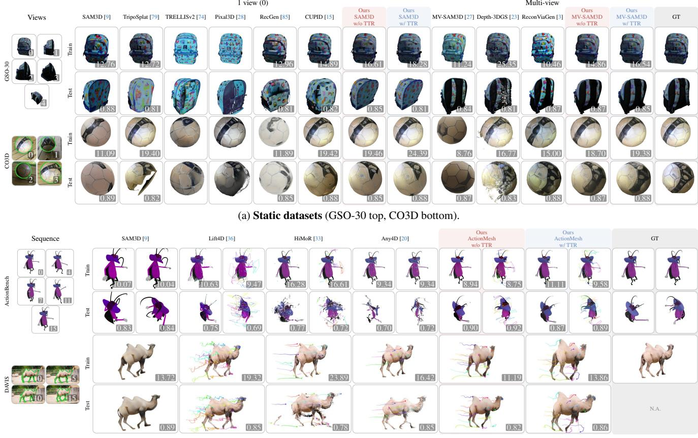  
(b) Dynamic datasets (ActionBench top, DAVIS bottom).  
Figure 4. Qualitative comparison. (a) GSO-30 and CO3D reconstructed from one input view and from multi-view inputs (5 views for GSO-30, 4 for CO3D). (b) ActionBench and DAVIS reconstructed from 16-frame sequences; for DAVIS, we show the first and last reconstructed frames. Methods are described in Sec. 5. DAVIS provides no ground-truth test views, so its test subrow shows synthesized novel views at the same timestamps. Each render is badged with per-scene PSNR ( ) on train views and CLIP-I ( ) on test views.

In the static multi-view setting, all observations share the same voxel grid, and fusion is applied at every ODE step.

The same formulation extends to dynamic objects, using the deformation field δ (Sec. 4.1) to establish correspondences between each frame-specific grid $O _ { b }$ and the canonical grid O. At every ODE step, per-frame predictions are mapped to the canonical grid and fused with the same visibility-weighted rule (see Sec. A.3).

## 4.4. Optional Test-time refinement

The frozen generative decoder may only approximately reproduce instance-specific appearance and geometry. We therefore optionally refine a low-rank Gaussian-decoder adapter $\Delta \mathcal { D } _ { g }$ , together with the canonical latent Z and the world-space poses ρ for 100 iterations per object, while keeping all pretrained parameters fixed (TTR). Using the rendering objective of (5), we optimize these test-time variables by rendering each observation as $\mathcal { R } ( \mathcal { D } _ { g } ( Z ; \Delta \mathcal { D } _ { g } ) , \rho _ { ( k , j ) } )$ and

minimizing

$$
\mathcal { L } _ { \mathrm { t t r } } = \sum _ { k = 1 } ^ { n _ { \mathrm { f } } } \sum _ { j = 1 } ^ { n _ { \mathrm { v } } } \mathcal { L } _ { \mathrm { r e n d } } ^ { ( k , j ) } + ~ \mu ~ \Vert Z - Z ^ { 0 } \Vert ^ { 2 } ,\tag{7}
$$

where the final term anchors the optimized latent to its initial prediction $Z ^ { 0 }$ , preserving the prior’s completion of regions the observations do not constrain. For dynamic objects, the canonical Gaussians are warped by $\delta _ { c  k }$ before rendering each frame. The latent anchor and decoder adapter are complementary: the anchor preserves the predicted latent and its completion of unobserved regions, while $\Delta \mathcal { D } _ { g }$ provides instance-specific capacity beyond the frozen decoder’s range. We observe that latent-only refinement, which forces appearance residuals into the globally coupled latent, primarily improves observed views, whereas decoder adaptation also improves held-out views. Additional details are given in Sec. A.7.

## 5. Results

Baselines. We compare against state-of-the-art methods covering each of our input settings. Monocular static: We

<table><tr><td rowspan="3">#V</td><td rowspan="3">Method</td><td colspan="4">GSO-30</td><td colspan="3">CO3D</td></tr><tr><td>Train</td><td colspan="3">Test</td><td>Train</td><td colspan="2">Test</td></tr><tr><td>PSNR ↑</td><td>co-PSNR ↑</td><td>LPIPS ↓</td><td>CLIP-I↑</td><td>PSNR ↑</td><td>LPIPS ↓</td><td>CLIP-I↑</td></tr><tr><td rowspan="7">1</td><td>SAM3D [9]</td><td>15.461</td><td>11.860</td><td>0.411</td><td>0.883</td><td>13.531</td><td>0.524</td><td>0.854</td></tr><tr><td>TripoSplat [79]</td><td>20.574</td><td>13.564</td><td>0.360</td><td>0.876</td><td>20.162</td><td>0.517</td><td>0.839</td></tr><tr><td>RecGen [85]</td><td>12.879</td><td>10.651</td><td>0.431</td><td>0.868</td><td>12.282</td><td>0.533</td><td>0.862</td></tr><tr><td>CUPID [15]</td><td>18.958</td><td>13.213</td><td>0.386</td><td>0.881</td><td>18.840</td><td>0.462</td><td>0.871</td></tr><tr><td>Ours w/o TTR</td><td>20.231</td><td>12.280</td><td>0.394</td><td>0.884</td><td>17.813</td><td>0.454</td><td>0.858</td></tr><tr><td>Ours w/ TTR</td><td>24.471</td><td>12.781</td><td>0.379</td><td>0.884</td><td>22.145</td><td>0.436</td><td>0.878</td></tr><tr><td>STREAM3D [90]</td><td>13.734</td><td>12.009</td><td>0.424</td><td>0.868</td><td>11.179</td><td>0.560</td><td>0.851</td></tr><tr><td rowspan="5">2</td><td>MV-SAM3D [27]</td><td>14.190</td><td>12.419</td><td>0.390</td><td>0.879</td><td>12.540</td><td>0.514</td><td>0.870</td></tr><tr><td>RecGen [85]</td><td>12.631</td><td>11.062</td><td>0.418</td><td>0.871</td><td>11.683</td><td>0.523</td><td>0.868</td></tr><tr><td>Ours w/o TTR</td><td>18.994</td><td>14.611</td><td>0.325</td><td>0.899</td><td>16.699</td><td>0.422</td><td>0.874</td></tr><tr><td>Ours w/ TTR</td><td>21.821</td><td>15.993</td><td>0.301</td><td>0.897</td><td>19.026</td><td>0.392</td><td>0.885</td></tr><tr><td>STREAM3D [90]</td><td></td><td></td><td></td><td></td><td></td><td></td><td></td></tr><tr><td rowspan="6">5/4</td><td></td><td>11.602</td><td>11.026</td><td>0.450</td><td>0.870</td><td>12.484</td><td>0.515</td><td>0.847</td></tr><tr><td>Depth-3DGS [23]</td><td>29.096</td><td>23.126</td><td>0.372</td><td>0.830</td><td>18.411</td><td>0.477</td><td>0.800</td></tr><tr><td>MV-SAM3D [27]</td><td>14.068</td><td>13.217</td><td>0.363</td><td>0.885</td><td>12.162</td><td>0.509</td><td>0.868</td></tr><tr><td>ReconViaGen [3]</td><td>14.796</td><td>13.977</td><td>0.296</td><td>0.908</td><td>12.322</td><td>0.534</td><td>0.826</td></tr><tr><td>Ours w/o TTR</td><td>18.627</td><td>16.242</td><td>0.254</td><td>0.913</td><td>16.038</td><td>0.411</td><td>0.871</td></tr><tr><td>Ours w/ TTR</td><td>21.527</td><td>18.503</td><td>0.228</td><td>0.914</td><td>17.151</td><td>0.377</td><td>0.886</td></tr></table>

(a) Static scenes – GSO-30 and CO3D
<table><tr><td rowspan="3">Method</td><td colspan="4">ActionBench</td><td colspan="4">DAVIS</td></tr><tr><td>Train</td><td></td><td>Test</td><td></td><td>Train</td><td>Test</td><td>Pseudo-GT tracks</td><td></td></tr><tr><td>PSNR ↑</td><td>co-PSNR ↑</td><td>LPIPS ↓</td><td>CLIP-I↑</td><td>PSNR ↑</td><td>CLIP-I↑</td><td>δavg ↑</td><td>Err (px) ↓</td></tr><tr><td>SAM3D [9]</td><td>12.239</td><td>9.900</td><td>0.504</td><td>0.882</td><td>11.542</td><td>0.881</td><td></td><td></td></tr><tr><td>Any4D [20]</td><td></td><td></td><td></td><td></td><td></td><td></td><td>0.470</td><td>10.19</td></tr><tr><td>Lift4D [36]</td><td>11.273</td><td>8.166</td><td>0.704</td><td>0.783</td><td>12.407</td><td>0.893</td><td>0.408</td><td>7.15</td></tr><tr><td>HiMoR [33]</td><td>19.107</td><td>12.072</td><td>0.702</td><td>0.708</td><td>18.341</td><td>0.770</td><td>0.628</td><td>4.63</td></tr><tr><td>Ours w/o TTR</td><td>11.163</td><td>9.597</td><td>0.499</td><td>0.855</td><td>10.573</td><td>0.869</td><td>0.594</td><td>3.91</td></tr><tr><td>Ours w/ TTR</td><td>12.097</td><td>9.661</td><td>0.502</td><td>0.846</td><td>13.423</td><td>0.899</td><td>0.595</td><td>3.91</td></tr></table>

(b) Dynamic scenes – ActionBench and DAVIS

Table 1. Full benchmarks. Per-dataset image quality metrics across methods and, where applicable, number of input views (#V). “–” denotes metrics not reported by the corresponding method. Baselines, datasets, metrics and geometric backbones used by our method are detailed in Sec. 5. TRELLISv2 and Pixal3D predict lighting-disentangled materials and are therefore evaluated qualitatively only. Best and second best per (#V, dataset, metric) group are shown in bold and underlined, respectively.

use SAM3D [9] as the geometry predictor and compare against SAM3D, RecGen [85], TripoSplat [79], and CU-PID [15]. We additionally compare qualitatively with TREL-LISv2 [74] and Pixal3D [28], whose lighting-disentangled material predictions lack scene illumination and therefore do not support comparable photometric re-rendering. Multiview static: We use MV-SAM3D [27] as the geometry backbone (implemented in our framework and parallelized) and evaluate with varying numbers of input views. We compare against MV-SAM3D, STREAM3D [90], ReconViaGen [3], and RecGen [85] (up to two input views). We further include Depth-3DGS [23], a per-scene optimization baseline detailed in Sec. A.8. Monocular dynamic: We use ActionMesh [60] canonical geometry and deformations, and recover its missing world-space pose with our pose stage. We compare against per-frame SAM3D, Lift4D [36], which combines 3D mesh generation with per-scene object optimization, and the per-scene optimization baseline HiMoR [33]. Additionally, we compare against Any4D [20], which predicts temporal point clouds for 3D tracking. We run all baselines on the same inputs as our method, including geometric priors where supported.

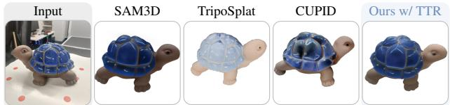  
Figure 5. GenIA with TTR completes the unseen surface with colors consistent with the input. A real scene rendered from the side opposite the input view. SAM3D completes the object with a smooth, synthetic appearance driven by its generative prior. TripoSplat and CUPID closely match the observed side but degrade on unseen surfaces, with washed-out colors or appearance drift.

Datasets. Static: GSO-30 [24], a synthetic multi-view benchmark with a single object on a white background, and selected CO3D [58] scenes, a real multi-view dataset with one object; both are also evaluated with a single input view. Dynamic: Selected scenes from ActionBench [60], a synthetic monocular benchmark with a single object on a white background, which we re-render with one held-out view per timestamp; and DAVIS [54], comprising monocular in-thewild videos with one object per scene (16 frames at stride 2 over the first 32 frames). Exact scenes used and data processing are in Sec. A.12.

Metrics. We report foreground-masked PSNR on training views and LPIPS/CLIP-I on held-out views. Pixel-aligned metrics are sensitive to pose errors and penalize plausible completions that differ from ground truth, so we additionally report CLIP-I as a coarse semantic measure, despite its limited sensitivity to fine texture and temporal consistency (Sec. A.13). To reduce pose-induced bias, we refine each method’s pose against the inputs while fixing shape and appearance; per-scene optimization methods are exempt (Sec. A.10). On GSO-30 and ActionBench, co-PSNR further isolates held-out pixels visible in at least one input view. For DAVIS, which lacks test views, we follow Lift4D [36] by synthesizing rotated novel views and averaging CLIP-I against the closest training image. We evaluate tracking against CoTracker3 [19] pseudo-ground-truth using δavg, reprojection error (Err), and AJ; these scores measure agreement with CoTracker3 rather than absolute accuracy (see Sec. A.11).

## 5.1. Analysis

Across datasets, GenIA aligns the frozen SAM3D model to the inputs, improving pose and appearance reconstruction (Tab. 1) while remaining competitive on runtime (Fig. 6).

In the single-view setting, SAM3D, RecGen, and TREL-LISv2 can realistically complete unobserved geometry but often misalign appearance, especially for symmetric objects. Relative to SAM3D, we better resolve these ambiguities and improve color and lighting alignment, with gains extending to held-out views. Pixal3D, TripoSplat, and CUPID are strongly input-aligned and even achieve higher co-PSNR than our method on synthetic scenes. However, they more

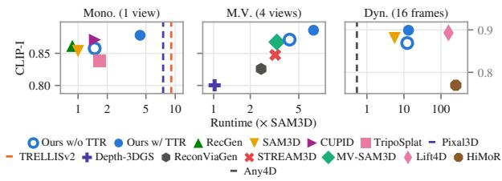

Figure 6. Our method adds a small overhead over SAM3D. Median runtime versus mean CLIP-I, with runtime given as a multiple of SAM3D’s, which takes 25 s on our hardware (a single A100-40 GB). The two static panels are scored on CO3D; the dynamic panel is scored on DAVIS. Without TTR, rendering guidance is the main overhead: runtime is approximately affine in view count, with per-view cost comparable to multi-view baselines. TTR adds a largely view-independent cost, while improving CLIP-I. On dynamic sequences, GenIA costs 13 SAM3D’s single-image runtime including ActionMesh (12 without TTR), versus 160 for Lift4D and 250 for HiMoR, and with TTR achieves the highest CLIP-I.

frequently produce incomplete or washed-out occluded geometry or textures (see Fig. 5). On held-out views, our method achieves superior metrics, particularly on real scenes, while qualitatively better preserving backside geometry and appearance.

Similar misalignment persists for MV-SAM3D, STREAM3D, and RecGen in the multi-view setting, with ReconViaGen being the most input-aligned generative baseline. Without TTR, GenIA outperforms all baselines, including ReconViaGen. Depth-3DGS leads training-view PSNR and co-PSNR, but remains incomplete in unobserved regions. TTR further improves fidelity and perceptual quality.

On dynamic scenes, per-frame SAM3D is temporally inconsistent in geometry and appearance and provides no tracking correspondences. HiMoR and Any4D reconstruct only observed regions. Lift4D, the closest baseline to ours, is noisier and less temporally stable. In comparison, our method inherits the quality of the injected coarse geometry from ActionMesh and results in coherent shape and appearance. With TTR, GenIA ranks second to HiMoR on DAVIS training-view PSNR and $\delta _ { \mathrm { a v g } } ,$ while achieving the lowest reprojection error and highest CLIP-I. On ActionBench, Hi-MoR leads training-view PSNR and co-PSNR, as expected for a per-scene optimizer fitted to the input view, while GenIA is on par with per-frame SAM3D and achieves the best held-out LPIPS. Per-frame SAM3D has the highest Action-Bench CLIP-I, reflecting its insensitivity to pose alignment.

Our method struggles on ActionBench scenes due to large inter-frame motion, where errors in the coarse geometry or pose can propagate and substantially degrade reconstruction. Peak GPU memory on CO3D (1 input view) is 19.7 GB without TTR versus SAM3D’s 18.0 GB; TTR increases it to 31.8 GB due to back-propagation through the Gaussian decoder. Additional results are provided in Sec. A.2.

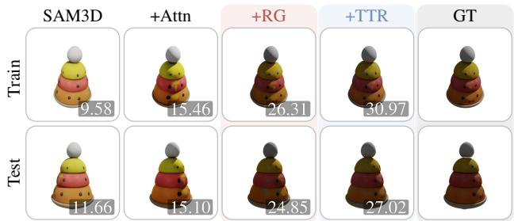  
Figure 7. Our appearance prediction better aligns with the input observations. Incremental appearance ablation on GSO-30, following Sec. 5.2. Attention bias injects pose information into SAM3D’s pose-blind appearance predictor, helping resolve ambiguous appearance assignment on symmetric coarse geometry. Rendering guidance further improves color and detail matching, while optional TTR provides additional gains, including on heldout views. We show one train and one held-out test view, badged with PSNR and co-PSNR ( ).

## 5.2. Ablations

We ablate our contributions cumulatively; Figure 7 shows the appearance ablation on a static monocular GSO scene. We use ground-truth coarse geometry to isolate the contribution of the appearance components. Starting from SAM3D appearance prediction (Base), we add visibility attention bias (+Attn), rendering guidance (+RG), and test-time refinement (+TTR), progressively improving both training- and testview quality. Full ablations for real and synthetic multi-view and monocular dynamic settings, together with ablations of our pose prediction components, are provided in Sec. A.1.

## 6. Conclusion

We presented GenIA, an inference-time framework that aligns a frozen generative 3D prior to its observations. We ground translation and scale in depth while retaining the prior’s rotation, and align appearance through visibilitybiased attention, rendering guidance, and cross-observation fusion. This improves pose and novel-view quality for static monocular and multi-view inputs and, with external dynamic geometry, yields temporally coherent reconstructions and accurate tracks.

Limitations and future work. Dynamic geometry currently relies on an external predictor; removing this dependence would enable unified, input-aligned 3D/4D shape prediction. Unlike pose and appearance, coarse shape is not directly grounded in the observed silhouette and depth, as we found the geometry prior difficult to steer reliably. Rotation remains prior-driven and only weakly corrected by noisesensitive registration, while pose errors from masks, depth, and cameras can also degrade the differentiable rendering supervision signal.

Acknowledgements: The authors affiliated with the Tübingen AI Center acknowledge the support of the Deutsche Forschungsgemeinschaft (DFG, German Research Foundation) under Germany’s Excellence Strategy (EXC number 2064/1, project number 390727645). Stefano Esposito acknowledges travel support from the European Union’s Horizon 2020 research and innovation program under ELISE Grant Agreement No. 951847.

## References

[1] Paul J. Besl and Neil D. McKay. A Method for Registration of 3-D Shapes. IEEE Trans. on Pattern Analysis and Machine Intelligence (PAMI), 14(2):239–256, 1992. 5

[2] Aleksei Bochkovskii, Amaël Delaunoy, Hugo Germain, Marcel Santos, Yichao Zhou, Stephan R. Richter, and Vladlen Koltun. Depth Pro: Sharp Monocular Metric Depth in Less Than a Second. In Proc. ofthe International Conf. on Learning Representations (ICLR), 2025. 2

[3] Jiahao Chang, Chongjie Ye, Yushuang Wu, Yuantao Chen, Yidan Zhang, Zhongjin Luo, Chenghong Li, Yihao Zhi, and Xiaoguang Han. ReconViaGen: Towards Accurate Multiview 3D Object Reconstruction via Generation. In Proc. of the International Conf. on Learning Representations (ICLR), 2026. 2, 6, 7, 19, 20

[4] David Charatan, Sizhe Li, Andrea Tagliasacchi, and Vincent Sitzmann. pixelSplat: 3D Gaussian Splats from Image Pairs for Scalable Generalizable 3D Reconstruction. In Proc. IEEE Conf. on Computer Vision and Pattern Recognition (CVPR), 2024. 2

[5] Anpei Chen, Haofei Xu, Stefano Esposito, Siyu Tang, and Andreas Geiger. LaRa: Efficient Large-Baseline Radiance Fields. In Proc. ofthe European Conf. on Computer Vision (ECCV), 2024. 2, 21

[6] Jianqi Chen, Biao Zhang, Xiangjun Tang, and Peter Wonka. V2M4: 4D Mesh Animation Reconstruction from a Single Monocular Video. In Proc. of the IEEE International Conf. on Computer Vision (ICCV), pages 11643–11653, 2025. 3

[7] Kaihua Chen, Tarasha Khurana, and Deva Ramanan. Reconstruct, Inpaint, Test-Time Finetune: Dynamic Novel-view Synthesis from Monocular Videos. In Advances in Neural Information Processing Systems (NeurIPS), 2025. 3

[8] Xingyu Chen, Yue Chen, Yuliang Xiu, Andreas Geiger, and Anpei Chen. Easi3R: Estimating Disentangled Motion from DUSt3R Without Training. In Proc. ofthe IEEE International Conf. on Computer Vision (ICCV), 2025. 3

[9] Xingyu Chen, Fu-Jen Chu, Pierre Gleize, Kevin J. Liang, Alexander Sax, Hao Tang, Weiyao Wang, Michelle Guo, Thibaut Hardin, Xiang Li, Aohan Lin, Jia-Wei Liu, Ziqi Ma, Anushka Sagar, Bowen Song, Xiaodong Wang, Jianing Yang, Bowen Zhang, Piotr Dollár, Georgia Gkioxari, Matt Feiszli, and Jitendra Malik. SAM 3D: 3Dfy Anything in Images. In Proc. IEEE Conf. on Computer Vision and Pattern Recognition (CVPR), pages 7220–7232, 2026. 1, 2, 3, 6, 7, 19, 20, 21

[10] Yuedong Chen, Haofei Xu, Chuanxia Zheng, Bohan Zhuang, Marc Pollefeys, Andreas Geiger, Tat-Jen Cham, and Jianfei

Cai. MVSplat: Efficient 3D Gaussian Splatting from Sparse Multi-View Images. In Proc. ofthe European Conf. on Computer Vision (ECCV), 2024. 2

[11] Jiemin Fang, Taoran Yi, Xinggang Wang, Lingxi Xie, Xiaopeng Zhang, Wenyu Liu, Matthias Nießner, and Qi Tian. Fast Dynamic Radiance Fields with Time-Aware Neural Voxels. In ACM Trans. on Graphics, 2022. 3

[12] Weilun Feng, Mingqiang Wu, Zhiliang Chen, Chuanguang Yang, Haotong Qin, Yuqi Li, Xiaokun Liu, Guoxin Fan, Zhulin An, Libo Huang, Yulun Zhang, Michele Magno, and Yongjun Xu. Fast-SAM3D: 3Dfy Anything in Images but Faster. In Proc. of the International Conf. on Machine Learning (ICML), 2026. 3

[13] Sensen Gao, Zhaoqing Wang, Qihang Cao, Dongdong Yu, Changhu Wang, and Jia-Wang Bian. PixWorld: Unifying 3D Scene Generation and Reconstruction in Pixel Space. arXiv preprint arXiv:2607.05373, 2026. 2

[14] Yicong Hong, Kai Zhang, Jiuxiang Gu, Sai Bi, Yang Zhou, Difan Liu, Feng Liu, Kalyan Sunkavalli, Trung Bui, and Hao Tan. LRM: Large Reconstruction Model for Single Image to 3D. In Proc. of the International Conf. on Learning Representations (ICLR), 2024. 2

[15] Binbin Huang, Haobin Duan, Yiqun Zhao, Zibo Zhao, Yi Ma, and Shenghua Gao. CUPID: Generative 3D Reconstruction via Joint Object and Pose Modeling. In Proc. IEEE Conf. on Computer Vision and Pattern Recognition (CVPR), 2026. 1, 2, 6, 7, 19, 20

[16] Lihan Jiang, Yucheng Mao, Linning Xu, Tao Lu, Kerui Ren, Yichen Jin, Xudong Xu, Mulin Yu, Jiangmiao Pang, Feng Zhao, Dahua Lin, and Bo Dai. AnySplat: Feed-forward 3D Gaussian Splatting from Unconstrained Views. ACM Trans. on Graphics, 44(6):1–16, 2025. 2

[17] Yanqin Jiang, Li Zhang, Jin Gao, Weiming Hu, and Yao Yao. Consistent4D: Consistent 360° Dynamic Object Generation from Monocular Video. In Proc. of the International Conf. on Learning Representations (ICLR), pages 51844–51861, 2024. 3

[18] Damjan Kalajdzievski. A Rank Stabilization Scaling Factor for Fine-Tuning with LoRA. arXiv preprint arXiv:2312.03732, 2023. 17

[19] Nikita Karaev, Yuri Makarov, Jianyuan Wang, Natalia Neverova, Andrea Vedaldi, and Christian Rupprecht. Co-Tracker3: Simpler and Better Point Tracking by Pseudo-Labelling Real Videos. In Proc. of the IEEE International Conf. on Computer Vision (ICCV), pages 6013–6022, 2025. 7, 19

[20] Jay Karhade, Nikhil Keetha, Yuchen Zhang, Tanisha Gupta, Akash Sharma, Sebastian Scherer, and Deva Ramanan. Any4D: Unified Feed-Forward Metric 4D Reconstruction. In Proc. IEEE Conf. on Computer Vision and Pattern Recognition (CVPR), 2026. 3, 6, 7, 20, 21

[21] Bingxin Ke, Kevin Qu, Tianfu Wang, Nando Metzger, Shengyu Huang, Bo Li, Anton Obukhov, and Konrad Schindler. Marigold: Affordable Adaptation of Diffusion-Based Image Generators for Image Analysis. IEEE Trans. on Pattern Analysis and Machine Intelligence (PAMI), 2025. 2

[22] Nikhil Keetha, Norman Müller, Johannes Schönberger, Lorenzo Porzi, Yuchen Zhang, Tobias Fischer, Arno

Knapitsch, Duncan Zauss, Ethan Weber, Nelson Antunes, Jonathon Luiten, Manuel Lopez-Antequera, Samuel Rota Bulò, Christian Richardt, Deva Ramanan, Sebastian Scherer, and Peter Kontschieder. MapAnything: Universal Feed-Forward Metric 3D Reconstruction. In Proc. of the International Conf. on 3D Vision (3DV), 2026. 2, 4, 22

[23] Bernhard Kerbl, Georgios Kopanas, Thomas Leimkühler, and George Drettakis. 3D Gaussian Splatting for Real-Time Radiance Field Rendering. ACM Trans. on Graphics, 42(4), 2023. 2, 6, 7, 18, 19, 20

[24] Xin Kong, Shikun Liu, Xiaoyang Lyu, Marwan Taher, Xiaojuan Qi, and Andrew J. Davison. EscherNet: A Generative Model for Scalable View Synthesis. In Proc. IEEE Conf. on Computer Vision and Pattern Recognition (CVPR), 2024. 7, 21

[25] Jiahui Lei, Yijia Weng, Adam W. Harley, Leonidas Guibas, and Kostas Daniilidis. MoSca: Dynamic Gaussian Fusion from Casual Videos via 4D Motion Scaffolds. In Proc. IEEE Conf. on Computer Vision and Pattern Recognition (CVPR), 2025. 3

[26] Vincent Leroy, Yohann Cabon, and Jérôme Revaud. Grounding Image Matching in 3D with MASt3R. In Proc. of the European Conf. on Computer Vision (ECCV), 2024. 2

[27] Baicheng Li, Dong Wu, Jun Li, Shunkai Zhou, Zecui Zeng, Lusong Li, and Hongbin Zha. MV-SAM3D: Adaptive Multi-View Fusion for Layout-Aware 3D Generation. arXiv preprint arXiv:2603.11633, 2026. 1, 3, 6, 7, 19, 20

[28] Dong-Yang Li, Wang Zhao, Yuxin Chen, Wenbo Hu, Meng-Hao Guo, Fang-Lue Zhang, Ying Shan, and Shi-Min Hu. Pixal3D: Pixel-Aligned 3D Generation from Images. In ACM Trans. on Graphics, 2026. 2, 6, 7, 19, 20

[29] Yangguang Li, Zi-Xin Zou, Zexiang Liu, Dehu Wang, Yuan Liang, Zhipeng Yu, Xingchao Liu, Yuan-Chen Guo, Ding Liang, Wanli Ouyang, and Yan-Pei Cao. TripoSG: High-Fidelity 3D Shape Synthesis using Large-Scale Rectified Flow Models. IEEE Trans. on Pattern Analysis and Machine Intelligence (PAMI), 2025. 2

[30] Zhiqi Li, Yiming Chen, and Peidong Liu. DreamMesh4D: Video-to-4D Generation with Sparse-Controlled Gaussian-Mesh Hybrid Representation. In Advances in Neural Information Processing Systems (NeurIPS), 2024. 3

[31] Zhengqi Li, Richard Tucker, Forrester Cole, Qianqian Wang, Linyi Jin, Vickie Ye, Angjoo Kanazawa, Aleksander Holynski, and Noah Snavely. MegaSaM: Accurate, Fast and Robust Structure and Motion from Casual Dynamic Videos. In Proc. IEEE Conf. on Computer Vision and Pattern Recognition (CVPR), 2025. 3

[32] Weixin Liang, Lili Yu, Liang Luo, Srinivasan Iyer, Ning Dong, Chunting Zhou, Gargi Ghosh, Mike Lewis, Wen-tau Yih, Luke Zettlemoyer, and Xi Victoria Lin. Mixture-of-Transformers: A Sparse and Scalable Architecture for Multi-Modal Foundation Models. Transactions on Machine Learning Research, 2025. 3

[33] Yiming Liang, Tianhan Xu, and Yuta Kikuchi. HiMoR: Monocular Deformable Gaussian Reconstruction with Hierarchical Motion Representation. In Proc. IEEE Conf. on Computer Vision and Pattern Recognition (CVPR), 2025. 3, 6, 7, 19, 20, 21

[34] Chen-Hsuan Lin, Jun Gao, Luming Tang, Towaki Takikawa, Xiaohui Zeng, Xun Huang, Karsten Kreis, Sanja Fidler, Ming-Yu Liu, and Tsung-Yi Lin. Magic3D: High-Resolution Textto-3D Content Creation. In Proc. IEEE Conf. on Computer Vision and Pattern Recognition (CVPR), pages 300–309, 2023. 2

[35] Haotong Lin, Sili Chen, Jun Hao Liew, Donny Y. Chen, Zhenyu Li, Guang Shi, Jiashi Feng, and Bingyi Kang. Depth Anything 3: Recovering the Visual Space from Any Views. In Proc. of the International Conf. on Learning Representations (ICLR), 2026. 2

[36] Yehonathan Litman, Xiaoxuan Ma, Manan Shah, Nicolás Ugrinovic, Kris Kitani, Fernando De la Torre, and Shubham Tulsiani. Lift4D: Harmonizing Single-View 3D Estimation for 4D Reconstruction In-the-Wild. In ACM Trans. on Graphics, 2026. 1, 3, 6, 7, 19, 20, 21

[37] Isabella Liu, Hao Su, and Xiaolong Wang. Dynamic Gaussians Mesh: Consistent Mesh Reconstruction from Dynamic Scenes. In Proc. of the International Conf. on Learning Representations (ICLR), 2025. 3

[38] Ruoshi Liu, Rundi Wu, Basile Van Hoorick, Pavel Tokmakov, Sergey Zakharov, and Carl Vondrick. Zero-1-to-3: Zero-shot One Image to 3D Object. In Proc. ofthe IEEE International Conf. on Computer Vision (ICCV), pages 9298–9309, 2023. 2

[39] Shih-Yang Liu, Chien-Yi Wang, Hongxu Yin, Pavlo Molchanov, Yu-Chiang Frank Wang, Kwang-Ting Cheng, and Min-Hung Chen. DoRA: Weight-Decomposed Low-Rank Adaptation. In Proc. ofthe International Conf. on Machine Learning (ICML), 2024. 17

[40] Yuan Liu, Cheng Lin, Zijiao Zeng, Xiaoxiao Long, Lingjie Liu, Taku Komura, and Wenping Wang. SyncDreamer: Generating Multiview-consistent Images from a Single-view Image. In Proc. ofthe International Conf. on Learning Representations (ICLR), pages 27676–27697, 2024. 2

[41] Yifan Liu, Zhiyuan Min, Zhenwei Wang, Junta Wu, Tengfei Wang, Yixuan Yuan, Yawei Luo, and Chunchao Guo. World-Mirror: Universal 3D World Reconstruction with Any-Prior Prompting. In Proc. of the International Conf. on Machine Learning (ICML), 2026. 2

[42] Xiaoxiao Long, Yuan-Chen Guo, Cheng Lin, Yuan Liu, Zhiyang Dou, Lingjie Liu, Yuexin Ma, Song-Hai Zhang, Marc Habermann, Christian Theobalt, and Wenping Wang. Wonder3D: Single Image to 3D using Cross-Domain Diffusion. In Proc. IEEE Conf. on Computer Vision and Pattern Recognition (CVPR), pages 9970–9980, 2024. 2

[43] Jonathon Luiten, Georgios Kopanas, Bastian Leibe, and Deva Ramanan. Dynamic 3D Gaussians: Tracking by Persistent Dynamic View Synthesis. In Proc. ofthe International Conf. on 3D Vision (3DV), 2024. 3

[44] Anagh Malik, Dorian Chan, Xiaoming Zhao, David B. Lindell, Oncel Tuzel, and Jen-Hao Rick Chang. Velox: Learning Representations of 4D Geometry and Appearance. In Proc. IEEE Conf. on Computer Vision and Pattern Recognition (CVPR), 2026. 3

[45] Kirill Mazur, Marwan Taher, and Andrew J. Davison. 4d primitive-mache: Glueing primitives for persistent 4d scene reconstruction. In Proc. IEEE Conf. on Computer Vision and Pattern Recognition (CVPR), pages 7372–7381, 2026. 3

[46] Lars Mescheder, Wei Dong, Shiwei Li, Xuyang Bai, Marcel Santos, Peiyun Hu, Bruno Lecouat, Mingmin Zhen, Amaël Delaunoy, Tian Fang, Yanghai Tsin, Stephan R. Richter, and Vladlen Koltun. Sharp Monocular View Synthesis in Less Than a Second. In Proc. ofthe International Conf. on Learning Representations (ICLR), 2026. 2

[47] Zhenxing Mi, Yuxin Wang, and Dan Xu. One4D: Unified 4D Generation and Reconstruction via Decoupled LoRA Control. In Proc. of the European Conf. on Computer Vision (ECCV), 2026. 3

[48] Ben Mildenhall, Pratul P. Srinivasan, Matthew Tancik, Jonathan T. Barron, Ravi Ramamoorthi, and Ren Ng. NeRF: Representing Scenes as Neural Radiance Fields for View Synthesis. In Proc. ofthe European Conf. on Computer Vision (ECCV), 2020. 2

[49] Thomas Müller, Alex Evans, Christoph Schied, and Alexander Keller. Instant Neural Graphics Primitives with a Multiresolution Hash Encoding. ACM Trans. on Graphics, 41(4): 102:1–102:15, 2022. 2

[50] Maxime Oquab, Timothée Darcet, Théo Moutakanni, Huy Vo, Marc Szafraniec, Vasil Khalidov, Pierre Fernandez, Daniel Haziza, Francisco Massa, Alaaeldin El-Nouby, Mahmoud Assran, Nicolas Ballas, Wojciech Galuba, Russell Howes, Po-Yao Huang, Shang-Wen Li, Ishan Misra, Michael Rabbat, Vasu Sharma, Gabriel Synnaeve, Hu Xu, Hervé Jegou, Julien Mairal, Patrick Labatut, Armand Joulin, and Piotr Bojanowski. DINOv2: Learning Robust Visual Features without Supervision. Transactions on Machine Learning Research, 2024. 3

[51] Keunhong Park, Utkarsh Sinha, Jonathan T. Barron, Sofien Bouaziz, Dan B. Goldman, Steven M. Seitz, and Ricardo Martin-Brualla. Nerfies: Deformable Neural Radiance Fields. In Proc. of the IEEE International Conf. on Computer Vision (ICCV), 2021. 3

[52] Keunhong Park, Utkarsh Sinha, Peter Hedman, Jonathan T. Barron, Sofien Bouaziz, Dan B. Goldman, Ricardo Martin-Brualla, and Steven M. Seitz. HyperNeRF: A Higher-Dimensional Representation for Topologically Varying Neural Radiance Fields. ACM Trans. on Graphics, 40(6), 2021. 3

[53] Naama Pearl, Stefano Esposito, Haofei Xu, Amit Peleg, Patricia Gschossmann, Lorenzo Porzi, Peter Kontschieder, Gerard Pons-Moll, and Andreas Geiger. Learn2Splat: Extending the Horizon of Learned 3DGS Optimization. arXiv preprint arXiv:2605.15760, 2026. 2

[54] Federico Perazzi, Jordi Pont-Tuset, Brian McWilliams, Luc Van Gool, Markus Gross, and Alexander Sorkine-Hornung. A Benchmark Dataset and Evaluation Methodology for Video Object Segmentation. In Proc. IEEE Conf. on Computer Vision and Pattern Recognition (CVPR), 2016. 1, 7

[55] Ben Poole, Ajay Jain, Jonathan T. Barron, and Ben Mildenhall. DreamFusion: Text-to-3D using 2D Diffusion. In Proc. of the International Conf. on Learning Representations (ICLR), 2023. 2

[56] Albert Pumarola, Enric Corona, Gerard Pons-Moll, and Francesc Moreno-Noguer. D-NeRF: Neural Radiance Fields

for Dynamic Scenes. In Proc. IEEE Conf. on Computer Vision and Pattern Recognition (CVPR), 2021. 3

[57] René Ranftl, Katrin Lasinger, David Hafner, Konrad Schindler, and Vladlen Koltun. Towards Robust Monocular Depth Estimation: Mixing Datasets for Zero-shot Crossdataset Transfer. IEEE Trans. on Pattern Analysis and Machine Intelligence (PAMI), 44(3):1623–1637, 2022. 2

[58] Jeremy Reizenstein, Roman Shapovalov, Philipp Henzler, Luca Sbordone, Patrick Labatut, and David Novotny. Common Objects in 3D: Large-Scale Learning and Evaluation of Real-life 3D Category Reconstruction. In Proc. of the IEEE International Conf. on Computer Vision (ICCV), 2021. 7, 21

[59] Jiawei Ren, Kevin Xie, Ashkan Mirzaei, Hanxue Liang, Xiaohui Zeng, Karsten Kreis, Ziwei Liu, Antonio Torralba, Sanja Fidler, Seung Wook Kim, and Huan Ling. L4GM: Large 4D Gaussian Reconstruction Model. In Advances in Neural Information Processing Systems (NeurIPS), 2024. 3

[60] Remy Sabathier, David Novotny, Niloy Mitra, and Tom Monnier. ActionMesh: Animated 3D Mesh Generation with Temporal 3D Diffusion. In Proc. IEEE Conf. on Computer Vision and Pattern Recognition (CVPR), 2026. 2, 3, 7, 21

[61] Dvir Samuel, Yuval Atzmon, Gal Chechik, and Yoni Kasten. Fast 4D Mesh Generation by Spatio-Temporal Attention Chains. arXiv preprint arXiv:2605.19786, 2026. 3

[62] Lu Sang, Zehranaz Canfes, Dongliang Cao, Riccardo Marin, Florian Bernard, and Daniel Cremers. TwoSquared: 4D Generation from 2D Image Pairs. In Proc. ofthe International Conf. on 3D Vision (3DV), pages 659–669, 2026. 3

[63] Jiaxiang Tang, Jiawei Ren, Hang Zhou, Ziwei Liu, and Gang Zeng. DreamGaussian: Generative Gaussian Splatting for Efficient 3D Content Creation. In Proc. of the International Conf. on Learning Representations (ICLR), pages 33879– 33896, 2024. 2

[64] Narek Tumanyan, Samuel Rota Bulò, Denis Rozumny, Lorenzo Porzi, Adam W. Harley, Tali Dekel, Peter Kontschieder, and Jonathon Luiten. DRoPS: Dynamic 3D Reconstruction of Pre-Scanned Objects. arXiv preprint arXiv:2603.24770, 2026. 3

[65] Jianyuan Wang, Minghao Chen, Nikita Karaev, Andrea Vedaldi, Christian Rupprecht, and David Novotny. VGGT: Visual Geometry Grounded Transformer. In Proc. IEEE Conf. on Computer Vision and Pattern Recognition (CVPR), 2025. 2

[66] Peng Wang, Lingjie Liu, Yuan Liu, Christian Theobalt, Taku Komura, and Wenping Wang. NeuS: Learning Neural Implicit Surfaces by Volume Rendering for Multi-view Reconstruction. In Advances in Neural Information Processing Systems (NeurIPS), 2021. 2

[67] Qianqian Wang, Vickie Ye, Hang Gao, Weijia Zeng, Jake Austin, Zhengqi Li, and Angjoo Kanazawa. Shape of Motion: 4D Reconstruction from a Single Video. In Proc. ofthe IEEE International Conf. on Computer Vision (ICCV), 2025. 3

[68] Ruicheng Wang, Sicheng Xu, Cassie Dai, Jianfeng Xiang, Yu Deng, Xin Tong, and Jiaolong Yang. MoGe: Unlocking Accurate Monocular Geometry Estimation for Open-Domain Images with Optimal Training Supervision. In Proc. IEEE Conf. on Computer Vision and Pattern Recognition (CVPR), pages 5261–5271, 2025. 3

[69] Shuzhe Wang, Vincent Leroy, Yohann Cabon, Boris Chidlovskii, and Jérôme Revaud. DUSt3R: Geometric 3D Vision Made Easy. In Proc. IEEE Conf. on Computer Vision and Pattern Recognition (CVPR), 2024. 2

[70] Yifan Wang, Jianjun Zhou, Haoyi Zhu, Wenzheng Chang, Yang Zhou, Zizun Li, Junyi Chen, Jiangmiao Pang, Chunhua Shen, and Tong He. $\pi ^ { 3 } { \mathrm { : } }$ Permutation-Equivariant Visual Geometry Learning. In Proc. of the International Conf. on Learning Representations (ICLR), 2026. 2

[71] Guanjun Wu, Taoran Yi, Jiemin Fang, Lingxi Xie, Xiaopeng Zhang, Wei Wei, Wenyu Liu, Qi Tian, and Xinggang Wang. 4D Gaussian Splatting for Real-Time Dynamic Scene Rendering. In Proc. IEEE Conf. on Computer Vision and Pattern Recognition (CVPR), pages 20310–20320, 2024. 3

[72] Junyi Wu, Jiachen Tao, Haoxuan Wang, Gaowen Liu, Ramana Rao Kompella, and Yan Yan. Orientation-anchored Hyper-Gaussian for 4D Reconstruction from Casual Videos. In Advances in Neural Information Processing Systems (NeurIPS), 2025. 3

[73] Jianfeng Xiang, Zelong Lv, Sicheng Xu, Yu Deng, Ruicheng Wang, Bowen Zhang, Dong Chen, Xin Tong, and Jiaolong Yang. Structured 3D Latents for Scalable and Versatile 3D Generation. In Proc. IEEE Conf. on Computer Vision and Pattern Recognition (CVPR), 2025. 2

[74] Jianfeng Xiang, Xiaoxue Chen, Sicheng Xu, Ruicheng Wang, Zelong Lv, Yu Deng, Hongyuan Zhu, Yue Dong, Hao Zhao, Nicholas Jing Yuan, and Jiaolong Yang. Native and Compact Structured Latents for 3D Generation. In Proc. IEEE Conf. on Computer Vision and Pattern Recognition (CVPR), pages 14419–14429, 2026. 2, 6, 7, 19, 20

[75] Yiming Xie, Chun-Han Yao, Vikram Voleti, Huaizu Jiang, and Varun Jampani. SV4D: Dynamic 3D Content Generation with Multi-Frame and Multi-View Consistency. In Proc. of the International Conf. on Learning Representations (ICLR), 2025. 3

[76] Haofei Xu, Songyou Peng, Fangjinhua Wang, Hermann Blum, Daniel Barath, Andreas Geiger, and Marc Pollefeys. Depth-Splat: Connecting Gaussian Splatting and Depth. In Proc. IEEE Conf. on Computer Vision and Pattern Recognition (CVPR), 2025. 2

[77] Haofei Xu, Daniel Barath, Andreas Geiger, and Marc Pollefeys. ReSplat: Learning Recurrent Gaussian Splatting. In Proc. of the European Conf. on Computer Vision (ECCV), 2026. 2

[78] Jiale Xu, Weihao Cheng, Yiming Gao, Xintao Wang, Shenghua Gao, and Ying Shan. InstantMesh: Efficient 3D Mesh Generation from a Single Image with Sparse-view Large Reconstruction Models. arXiv preprint arXiv:2404.07191, 2024. 2

[79] Runjie Yan, Yan-Pei Cao, Peng Wang, Ding Liang, and Yuan-Chen Guo. Generative 3D Gaussians with Learned Density Control. In ACM Trans. on Graphics, 2026. 2, 6, 7, 19, 20

[80] Lihe Yang, Bingyi Kang, Zilong Huang, Xiaogang Xu, Jiashi Feng, and Hengshuang Zhao. Depth Anything: Unleashing the Power of Large-Scale Unlabeled Data. In Proc. IEEE Conf. on Computer Vision and Pattern Recognition (CVPR), 2024. 2

[81] Ziyi Yang, Xinyu Gao, Wen Zhou, Shaohui Jiao, Yuqing Zhang, and Xiaogang Jin. Deformable 3D Gaussians for High-Fidelity Monocular Dynamic Scene Reconstruction. In Proc. IEEE Conf. on Computer Vision and Pattern Recognition (CVPR), 2024. 3

[82] Zeyu Yang, Zijie Pan, Xiatian Zhu, Li Zhang, Jianfeng Feng, Yu-Gang Jiang, and Philip H. S. Torr. 4D Gaussian Splatting: Modeling Dynamic Scenes with Native 4D Primitives. arXiv preprint arXiv:2412.20720, 2024. 3

[83] Lior Yariv, Jiatao Gu, Yoni Kasten, and Yaron Lipman. Volume Rendering of Neural Implicit Surfaces. In Advances in Neural Information Processing Systems (NeurIPS), 2021. 2

[84] Jiraphon Yenphraphai, Ashkan Mirzaei, Jianqi Chen, Jiaxu Zou, Sergey Tulyakov, Raymond A. Yeh, Peter Wonka, and Chaoyang Wang. ShapeGen4D: Towards High Quality 4D Shape Generation from Videos. In Proc. of the International Conf. on Learning Representations (ICLR), 2026. 3

[85] Andrii Zadaianchuk, Leonardo Barcellona, Lennard Schuenemann, Christian Gumbsch, Zehao Wang, Muhammad Zubair Irshad, Fabien Despinoy, Rahaf Aljundi, Stratis Gavves, and Sergey Zakharov. Reconstruction by Generation: 3D Multi-Object Scene Reconstruction from Sparse Observations. In Proc. of the European Conf. on Computer Vision (ECCV), 2026. 1, 3, 6, 7, 19, 20

[86] Bowen Zhang, Sicheng Xu, Chuxin Wang, Jiaolong Yang, Feng Zhao, Dong Chen, and Baining Guo. Gaussian Variation Field Diffusion for High-fidelity Video-to-4D Synthesis. In Proc. of the IEEE International Conf. on Computer Vision (ICCV), pages 12502–12513, 2025. 3

[87] Chuhan Zhang, Guillaume Le Moing, Skanda Koppula, Ignacio Rocco, Liliane Momeni, Junyu Xie, Shuyang Sun, Rahul Sukthankar, Joëlle K. Barral, Raia Hadsell, Zoubin Ghahramani, Andrew Zisserman, Junlin Zhang, and Mehdi S. M. Sajjadi. Efficiently Reconstructing Dynamic Scenes One D4RT at a Time. In Proc. IEEE Conf. on Computer Vision and Pattern Recognition (CVPR), 2026. 3

[88] Junyi Zhang, Charles Herrmann, Junhwa Hur, Varun Jampani, Trevor Darrell, Forrester Cole, Deqing Sun, and Ming-Hsuan Yang. MonST3R: A Simple Approach for Estimating Geometry in the Presence of Motion. In Proc. of the International Conf. on Learning Representations (ICLR), 2025. 3

[89] Zibo Zhao, Zeqiang Lai, Qingxiang Lin, Yunfei Zhao, Haolin Liu, Shuhui Yang, Yifei Feng, Mingxin Yang, Sheng Zhang, Xianghui Yang, et al. Hunyuan3D 2.0: Scaling Diffusion Models for High Resolution Textured 3D Assets Generation. arXiv preprint arXiv:2501.12202, 2025. 2

[90] Kaichen Zhou, Zeyang Bai, Xinhai Chang, Mengyu Wang, Paul Liang, and Fangneng Zhan. Stream3D: Sequential Multi-View 3D Generation via Evidential Memory. In Proc. IEEE Conf. on Computer Vision and Pattern Recognition (CVPR) Workshops, 2026. 3, 7, 19, 20

## A. Supplementary Material

## A.1. Extended ablations

We cumulatively ablate the three components of our appearance stage on top of SAM3D’s appearance prediction (Base): visibility attention bias (Attn), rendering guidance (RG), and test-time refinement (TTR). Quantitative results are reported in Tabs. 3a and 3b, with qualitative comparisons in Figs. 8 to 11.

Table 2 reports cumulative pose ablations across static and dynamic settings. All dynamic sequences are additionally evaluated for tracking against CoTracker3 (Sec. A.11). Rotation averaging across frames leaves DAVIS essentially unchanged and modestly reduces reprojection error and jitter on ActionBench. Depth-grounded translation and scale then provide the largest gains, reducing reprojection error by 1.4– 2.8 and relative jitter by 2–4 across the dynamic settings while also improving static-view PSNR. ICP registration behaves differently across settings. For static reconstruction, it halves Chamfer distance. On deforming geometry, its effect is dataset-dependent: on DAVIS it improves masked depth but worsens appearance and reprojection error, likely reflecting noise in the MapAnything depth and pose predictions; on ActionBench, where geometry and cameras are more reliable, it also improves PSNR.

## A.2. Additional results

Figures 12 to 15 provide additional qualitative comparisons across all benchmarks. Figure 16 shows two representative failure cases on dynamic scenes.

## A.3. Dynamic shape injection

For dynamic objects, we inject a sequence of fixed-topology meshes, where each vertex indexes the same point across frames (as in ActionMesh and ActionBench), and invert each deformed shape independently as described in Sec. 4.1. The shared topology provides both the deformation field used to animate the canonical reconstruction and the coarsegeometry correspondences used to fuse per-frame appearance.

We recover a per-vertex rigid deformation directly from the mesh sequence. Let $V _ { n } ^ { ( k ) }$ denote the position of vertex n at frame k, and ${ \bar { V } } _ { n } = V _ { n } ^ { ( c ) }$ its position in the canonical frame c. For each canonical vertex n and frame k, we estimate a local rotation $R _ { n } ^ { ( k ) } \ \in \ \mathrm { S O } ( 3 )$ by aligning its canonical neighborhood $\kappa ( n )$ , the $K = 8$ nearest canonical vertices, to its deformed counterpart using Kabsch:

$$
R _ { n } ^ { ( k ) } = \underset { R \in \mathrm { S O } ( 3 ) } { \mathrm { a r g m i n } } \sum _ { w \in { \cal K } ( n ) } \left\| R ( \bar { V } _ { w } - \bar { V } _ { n } ) - ( V _ { w } ^ { ( k ) } - V _ { n } ^ { ( k ) } ) \right\| ^ { 2 } .
$$

Together with the deformed vertex positions $V _ { n } ^ { ( k ) }$ , these rotations define the deformation field $\delta _ { c  k }$ of Sec. 4.1, which maps canonical vertex n to $( V _ { n } ^ { ( k ) } , R _ { n } ^ { ( k ) } )$ and is the identity at the canonical frame. We use δ to warp the canonical Gaussians, with their centers following the vertex motion and their covariances following the local rotations.

Fixed topology provides correspondences between each frame’s voxel grid and the canonical grid. Each per-frame voxel is thus associated with a canonical voxel, with the correspondence reducing to the identity at the canonical frame (Fig. 17).

Per-frame appearance fusion. At every ODE step, we use these correspondences to map each frame’s prediction onto the canonical grid, where the per-frame predictions are fused. The voxel correspondence can be many-to-one when multiple native voxels map to the same canonical cell. Collisions within each canonical voxel are masked using visibility and then averaged, as in visibility-weighted fusion (Sec. 4.3).

Pose denoising with clean shape latents. When the shape latents are injected, we fix the clean shape latent $\mathbf { x } _ { 1 } ^ { O }$ and predict the object’s pose. Because SAM3D jointly denoises shape and pose, the network expects a shape token at every ODE step τ . We fix the target geometry and preserve the training-time trajectory using an interpolated intermediate shape token $\mathbf { x } _ { \tau } ^ { O } \dot { = } \tau \mathbf { x } _ { 1 } ^ { O } + \left( 1 - \tau \right) \mathbf { x } _ { 0 } ^ { O }$ , where $\mathbf { x } _ { 0 } ^ { O } \sim \mathcal { N } ( \mathbf { 0 } , \mathbf { I } )$ is fixed.

## A.4. Voxel-to-patch mapping

For each tokenized conditioning stream, we map a voxel’s pixel footprint (Sec. 4.3) through the corresponding crop– pad–resize transformation (mask-bounding-box crop for cropped streams; pad-to-square for full-image streams) and bin it into the $3 7 \times 3 7$ DINOv2 patch grid. The resulting patch set $\Pi _ { i } ( b )$ is dilated by one patch to account for projection quantization.

During visibility-weighted fusion (Sec. 4.3), a canonical voxel that no voxel of frame b maps to receives no contribution from that frame; every canonical voxel is reached at least by the canonical frame, whose correspondence is the identity.

## A.5. Passive-stream compensation

The visibility attention bias (Sec. 4.3) increases the logits of projected patches in the active RGB conditioning groups, while softmax is normalized over all conditioning tokens. This unintentionally reduces the attention assigned to unmodified mask and global tokens.

We compensate with a per-voxel offset. Let κ denote the fraction of active RGB tokens receiving bias α. Assuming uniform pre-bias logits within the active tokens, their pooled exponentiated mass increases by $\kappa e ^ { \alpha } + 1 - \kappa$ . We therefore subtract

$$
\beta = \log ( \kappa e ^ { \alpha } + 1 - \kappa )\tag{8}
$$

Table 2. Pose ablations across datasets. Four-step cumulative ablation, with each row adding one component of Sec. 4.2. We evaluate dynamic scenes (DAVIS and ActionBench with ActionMesh geometry) and static GSO-30 single- and multi-view settings with injected ground-truth geometry. Dynamic settings report reprojection error and relative jitter against the CoTracker3 pseudo-reference (Sec. A.11) together with masked depth $L _ { 1 } .$ . GSO-30 additionally measures placement of the injected coarse shape against ground truth using Chamfer distance. Jit. is relative: 1.0 matches the reference motion, while larger values indicate greater jitter. Rotation averaging is inert on static settings by construction, since it averages velocities across frames. ICP registration is most beneficial for static multi-view alignment, where it halves Chamfer distance; on DAVIS, it improves depth at the cost of appearance quality.
<table><tr><td rowspan="2">Variant</td><td colspan="4">DAVIS</td><td colspan="4">ActionBench</td><td colspan="2">GSO-30</td><td colspan="2">GSO-30 MV</td></tr><tr><td>PSNR↑</td><td>Err ↓</td><td>Jit. →1</td><td>Depth↓</td><td>PSNR ↑</td><td>Err↓</td><td>Jit. →1</td><td>Depth ↓</td><td>PSNR↑</td><td>CD↓</td><td>PSNR ↑</td><td>CD↓</td></tr><tr><td>Base</td><td>15.69</td><td>9.46</td><td>8.86</td><td>0.3203</td><td>14.04</td><td>8.69</td><td>5.69</td><td>0.6350</td><td>15.29</td><td>0.0376</td><td>15.70</td><td>0.0372</td></tr><tr><td>+ Rotation averaging</td><td>15.69</td><td>9.46</td><td>8.83</td><td>0.3239</td><td>14.06</td><td>8.30</td><td>5.26</td><td>0.6357</td><td>15.29</td><td>0.0376</td><td>15.69</td><td>0.0372</td></tr><tr><td>+ Depth-ground (t, s)</td><td>16.44</td><td>3.44</td><td>2.23</td><td>0.2682</td><td>14.91</td><td>5.92</td><td>2.67</td><td>0.6530</td><td>16.12</td><td>0.0375</td><td>17.34</td><td>0.0373</td></tr><tr><td>+ ICP registration</td><td>15.85</td><td>3.94</td><td>2.17</td><td>0.2297</td><td>15.32</td><td>5.88</td><td>2.67</td><td>0.6417</td><td>20.90</td><td>0.0205</td><td>25.30</td><td>0.0184</td></tr></table>

<table><tr><td rowspan="3" colspan="3"></td><td colspan="5">GSO-30</td><td colspan="3">CO3D</td></tr><tr><td rowspan="2">Components</td><td rowspan="2">Train PSNR ↑</td><td colspan="3"></td><td rowspan="2">Train</td><td colspan="2">Test</td></tr><tr><td>co-PSNR ↑</td><td>LPIPS ↓</td><td>CLIP-I↑ PSNR ↑</td><td>LPIPS ↓</td><td>CLIP-I↑</td></tr><tr><td rowspan="5">1</td><td>X</td><td>X</td><td>X</td><td>17.833</td><td>15.599</td><td>0.291</td><td>0.891</td><td>13.675</td><td>0.523</td><td>0.867</td></tr><tr><td>√</td><td>X</td><td>X</td><td>18.810</td><td>16.081</td><td>0.289</td><td>0.891</td><td>14.645</td><td>0.499</td><td>0.864</td></tr><tr><td>X</td><td>√</td><td>X</td><td>22.907</td><td>19.458</td><td>0.253</td><td>0.897</td><td>16.549</td><td>0.484</td><td>0.859</td></tr><tr><td>√</td><td>V</td><td>X</td><td>23.409</td><td>19.808</td><td>0.249</td><td>0.897</td><td>17.813</td><td>0.454</td><td>0.858</td></tr><tr><td>√</td><td>√</td><td>√</td><td>27.328</td><td>21.523</td><td>0.226</td><td>0.901</td><td>22.145</td><td>0.436</td><td>0.878</td></tr><tr><td rowspan="5">5/4</td><td>X</td><td>X</td><td>X</td><td>19.160</td><td>18.972</td><td>0.231</td><td>0.909</td><td>12.651</td><td>0.488</td><td>0.890</td></tr><tr><td>√</td><td>X</td><td>X</td><td>19.761</td><td>19.588</td><td>0.222</td><td>0.910</td><td>13.497</td><td>0.462</td><td>0.889</td></tr><tr><td>X</td><td>V</td><td>X</td><td>22.890</td><td>22.350</td><td>0.193</td><td>0.916</td><td>15.149</td><td>0.443</td><td>0.883</td></tr><tr><td>V</td><td>V</td><td>X</td><td>23.123</td><td>22.582</td><td>0.187</td><td>0.918</td><td>16.038</td><td>0.411</td><td>0.871</td></tr><tr><td>7</td><td>V</td><td>√</td><td>26.282</td><td>24.950</td><td>0.142</td><td>0.933</td><td>17.151</td><td>0.377</td><td>0.886</td></tr></table>

(a) Static scenes – GSO-30 and CO3D
<table><tr><td colspan="3"></td><td colspan="4">ActionBench</td><td colspan="2">DAVIS</td></tr><tr><td colspan="3">Components</td><td>Train</td><td></td><td>Test</td><td></td><td>Train</td><td>Test</td></tr><tr><td>Attn</td><td>RG</td><td>TTR</td><td>PSNR ↑</td><td>co-PSNR ↑</td><td>LPIPS ↓</td><td>CLIP-I↑</td><td>PSNR ↑</td><td>CLIP-I↑</td></tr><tr><td>×</td><td>X</td><td>×</td><td>13.925</td><td>13.895</td><td>0.282</td><td>0.877</td><td>9.918</td><td>0.867</td></tr><tr><td>√</td><td>X</td><td>X</td><td>13.469</td><td>13.292</td><td>0.250</td><td>0.887</td><td>10.014</td><td>0.868</td></tr><tr><td>×</td><td>√</td><td>X</td><td>16.773</td><td>16.684</td><td>0.185</td><td>0.917</td><td>10.475</td><td>0.866</td></tr><tr><td>√</td><td>V</td><td>×</td><td>16.501</td><td>16.387</td><td>0.184</td><td>0.916</td><td>10.573</td><td>0.869</td></tr><tr><td>L</td><td>√</td><td>√</td><td>20.383</td><td>20.284</td><td>0.167</td><td>0.917</td><td>13.423</td><td>0.899</td></tr></table>

(b) Dynamic scenes – ActionBench and DAVIS

Table 3. Appearance ablations. Per-dataset novel-view synthesis across the component ladder: the columns toggle Attn (visibility attention bias), RG (rendering guidance), and TTR (test-time refinement); $\checkmark / \times$ mark a component on/off and $^ { 6 6 } - ^ { 5 5 }$ a component that does not apply (or a metric not reported). Held-out views report co-PSNR where the dataset has co-visibility masks, otherwise only LPIPS and CLIP-I. All GSO-30 and ActionBench variants share ground-truth shape and pose. CO3D uses SAM3D- and MV-SAM3D-predicted shape and pose. DAVIS uses the ActionMesh backbone. Metrics are averaged across scenes and views (GSO-30, CO3D), views and time (ActionBench), or time (DAVIS). Best and second best per (#V, dataset, metric) group are shown in bold and underlined, respectively.

from all active RGB logits. Under this approximation, the pooled active mass is restored, and hence the baseline attention share of mask and global tokens is preserved (Fig. 18). Independently of this assumption, the common offset leaves within-active ratios unchanged, so visible patches retain their exact $e ^ { \alpha }$ multiplicative boost. In practice, β is computed per voxel from the active bias row and folded into the additive

bias.

We also evaluate a post-softmax oracle that uses the actual attention distribution to restore the baseline mass of each active conditioning group individually. Unlike the closedform approximation, this accounts for non-uniform logits. On GSO-30 and CO3D, no compensation (OFF), the closedform approximation (APPROX), and the oracle (EXACT) yield nearly identical reconstruction metrics, indicating that the compensation is primarily a principled correction rather than a source of measurable quality gains. We use APPROX because it adds essentially no cost, whereas EXACT incurs a 1.3–1.8 overhead in the appearance block.

## A.6. Rendering loss details

We detail the terms of the per-observation rendering loss (5), used in appearance prediction (Sec. 4.3) and in test-time refinement (Sec. 4.4). Here, we drop the observation index b: every quantity below belongs to one observation, rendered under its fixed pose. Since only the object is rendered, the observed image I enters each term as the composite $\bar { I } =$ $M \odot I + ( 1 - M ) \eta$ , where the renderer background color η is resampled uniformly at each step to prevent the model from encoding a fixed background into the appearance. Each term is as follows:

$$
\begin{array} { r l } & { \mathcal { L } _ { \mathrm { r g b } } = \| \hat { I } - \bar { I } \| _ { 1 } , } \\ & { \mathcal { L } _ { \mathrm { s s i m } } = \big ( 1 - \mathrm { S S I M } ( \hat { I } , \bar { I } ) \big ) , } \\ & { \mathcal { L } _ { \mathrm { l p i p s } } = \mathrm { L P I P S } ( \hat { I } , \bar { I } ) , } \\ & { \mathcal { L } _ { \mathrm { d e p t h } } = \frac { \| M \odot ( \hat { D } - D ) \| _ { 1 } } { \| M \| _ { 1 } } . } \end{array}\tag{9}
$$

$\mathcal { L } _ { \mathrm { r g b } }$ is evaluated over an image pyramid at scales $( 1 , { \frac { 1 } { 2 } } , { \frac { 1 } { 4 } } )$ with weights $( 0 . 5 , 0 . 3 , 0 . 2 )$ , while $\mathcal { L } _ { \mathrm { l p i p s } }$ is computed on the object’s bounding-box crop. ${ \mathcal { L } } _ { \mathrm { d e p t h } }$ is the object-masked mean absolute error in z-depth.

Gradient masking. Generated Gaussians are semitransparent; therefore, primitives decoded from voxels that

Views

1 view (0)

5 views (0–4)

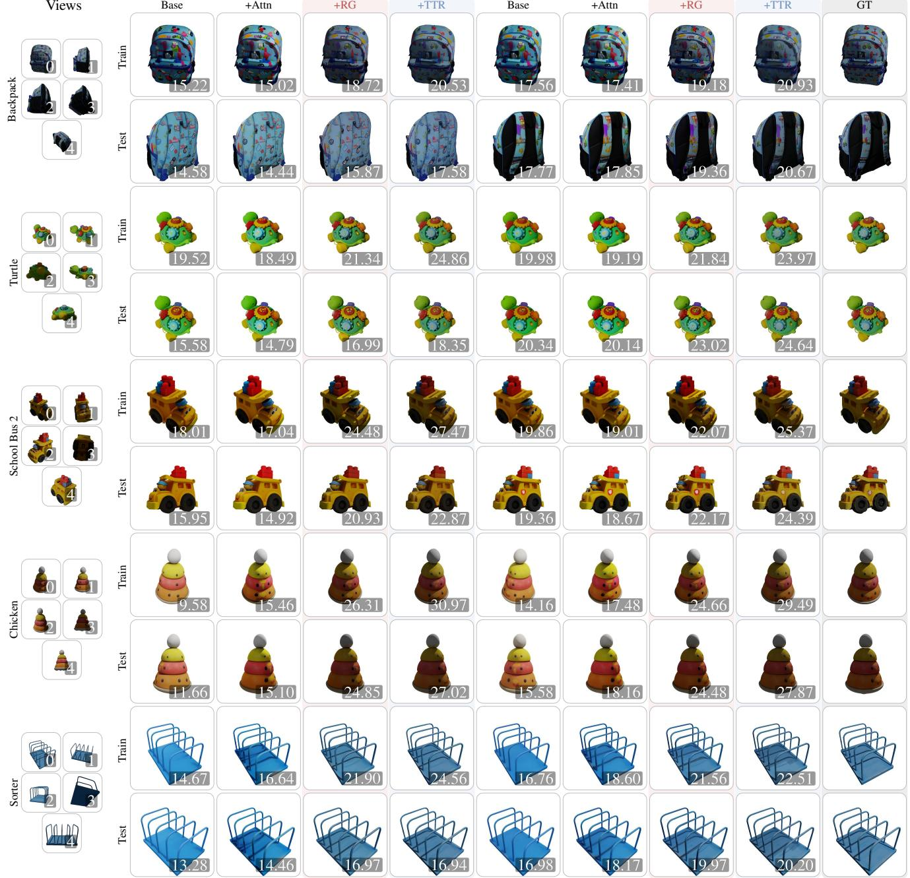

Figure 8. Qualitative appearance ablation on GSO-30 with ground-truth geometry. Every column is our method on the GT-voxelized mesh (shared GT shape and pose), so geometry is fixed and only appearance differs. Cumulative ladder, where each column adds one component to the column on its left. The label names only what that step adds: Base (SAM3D appearance prediction + observation fusion) +Attn (visibility attention bias) +RG (rendering guidance) +TTR (test-time refinement). Each scene spans two subrows: rendered from the first input (train) view and from a held-out novel (test) view, each against its GT. Each render is badged (bottom-right) with its per-scene appearance score: PSNR ( ) on the train views and co-visible PSNR (co-PSNR, ; Sec. 5) on the test views.

are not directly observed still contribute marginally to the rendered image. Consequently, the loss produces gradients for regions of the object that it cannot directly constrain. Left unchecked, these push the unseen surface away from the generative prior, producing holes and floaters in novel views. We apply a per-Gaussian stop-gradient: Gaussians occluded in one observation are detached before rendering that observation, so the rendering gradient flows only through directly observed geometry.

Opacity anchor. During test-time refinement, the adapted decoder may reduce the opacity of occluded Gaussians to lower the reconstruction error, effectively hollowing out unseen surfaces. We therefore introduce an opacity anchor that penalizes deviations from the initial opacity values. We find that this simple constraint is sufficient to preserve solid object geometry in novel views. The anchor is one-sided, penalizing only opacity drops below the initial value $\sigma _ { j } ^ { 0 }$ over the set $\mathcal { O }$ of Gaussians occluded in every observation,

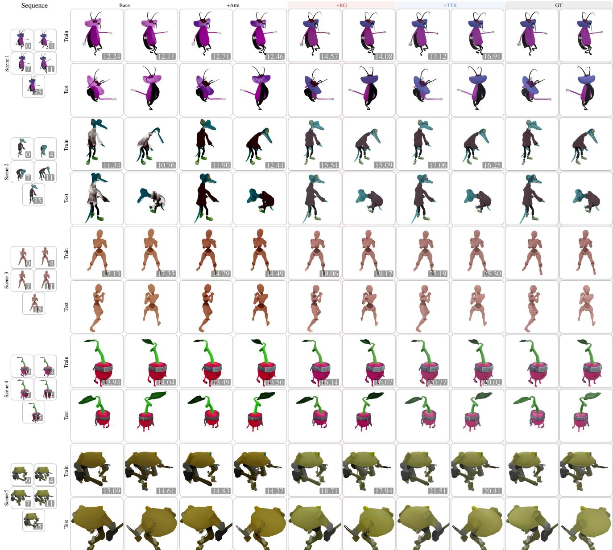  
Figure 9. Qualitative appearance ablation on ActionBench with ground-truth geometry. Every column is our method on the per-frame GT mesh (shared GT shape and pose), so only appearance differs. Cumulative ladder, where each column adds one component to the column on its left. The label names only what that step adds: Base (SAM3D appearance prediction + observation fusion) +Attn (visibility attention bias)  +RG (rendering guidance)  +TTR (test-time refinement). Each scene spans two subrows: rendered from the input (train) view and from the held-out (test) view, each against its GT. Each render is badged (bottom-right) with its per-scene appearance score: PSNR ( ) on the train views and co-visible PSNR (co-PSNR, ; Sec. 5) on the test views.

$$
\mathcal { L } _ { \mathrm { o p } } = \omega _ { \mathrm { o p } } \frac { 1 } { | O | } \sum _ { j \in \mathcal { O } } \operatorname* { m a x } \bigl ( 0 , \sigma _ { j } ^ { 0 } - \sigma _ { j } \bigr ) ^ { 2 } , \qquad \omega _ { \mathrm { o p } } = 0 . 1 .\tag{10}
$$

## A.7. Test-time refinement details

Test-time refinement (Sec. 4.4) optimizes the canonical latent $Z ,$ Gaussian-decoder adapter $\Delta \mathcal { D } _ { g }$ , and pose $\rho$ for 100 iterations per object using AdamW with PyTorch-default $\beta ,$

1 view (0)

4 views (0–3)

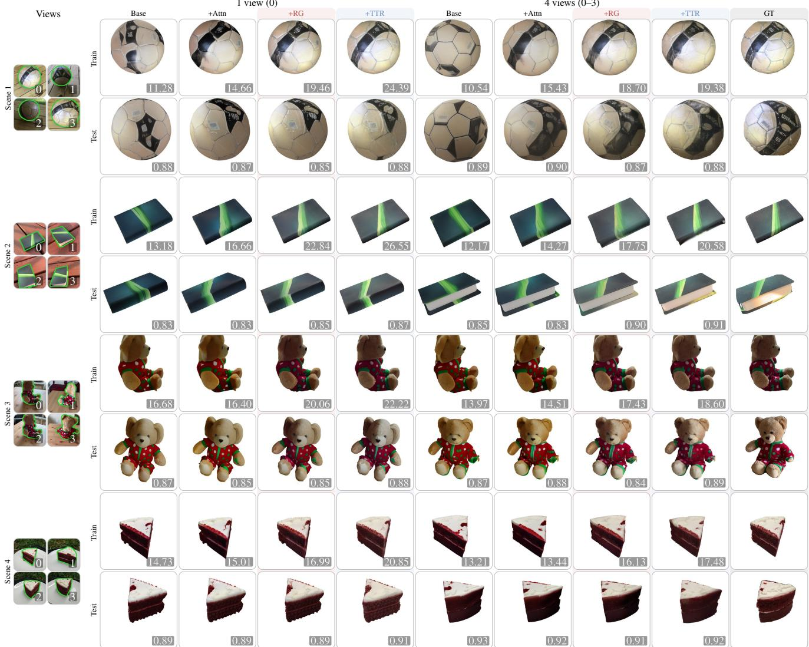  
Figure 10. Qualitative appearance ablation on CO3D with SAM3D geometry. Every column is our method on predicted shape and pose (CO3D has no ground-truth mesh); SAM3D geometry from 1 input view and MV-SAM3D geometry from 4 input views. Only appearance differs. Cumulative ladder, where each column adds one component to the column on its left. The label names only what that step adds: Base (SAM3D appearance prediction + observation fusion) +Attn (visibility attention bias) +RG (rendering guidance) +TTR (test-time refinement). Each scene spans two subrows: the reconstruction rendered from the first input (train) view and from a held-out target (test) view, each against its GT. Each render is badged (bottom-right) with its per-scene appearance score: PSNR ( ) on the train views and CLIP-I ( ) on the test views.

ϵ, and weight decay. Each iteration renders one randomly sampled observation (a stochastic estimate of the sum over observations in (7)), and objects in multi-object scenes are refined sequentially. Learning rates are linearly warmed up for 10 iterations and then fixed at $1 0 ^ { - 4 }$ for $Z , 1 0 ^ { - 3 }$ for $\Delta \mathcal { D } _ { g } ,$ and $1 0 ^ { - 2 } / 1 0 ^ { - 3 }$ for pose rotation/translation. Scale is not refined.

$\Delta \mathcal { D } _ { g }$ is a rank-4 DoRA [39] adapter applied to every linear layer of the Gaussian decoder, with $\alpha \ : = \ : 0 . 5$ and rank-stabilized scaling $\alpha / \sqrt { r } [ 1 8 ]$ ]. Its second factor is zeroinitialized, so refinement starts exactly from the unadapted decoder prediction.

The latent anchor in (7) is an MSE to the initial latent $Z ^ { 0 }$ with $\mu = 0 . 0 1$ . The rendering objective follows (5) with the same weights. Visibility for its stop-gradient mask and opacity anchor is determined by a depth test against rendered expected depth with relative behind-surface tolerance 0.02.

All remaining parameters, including the SAM3D model and mesh decoder, remain frozen. The in-loop Gaussiandecoder forward uses bfloat16 autocast to reduce memory.

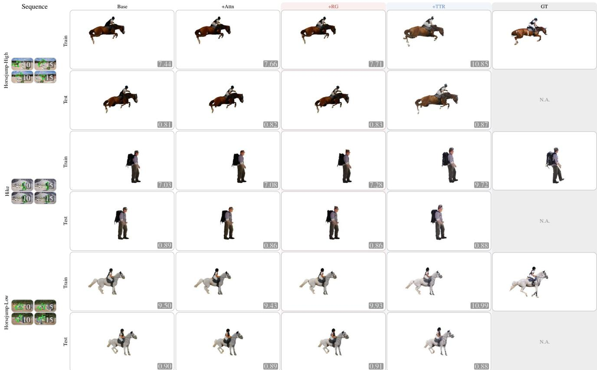  
Figure 11. Qualitative appearance ablation on DAVIS with ActionMesh geometry. Every column is GenIA on the same ActionMeshpredicted temporal coarse shape, so only appearance differs. Cumulative ladder, where each column adds one component to the column on its left. The label names only what that step adds: Base (SAM3D appearance prediction + observation fusion) +Attn (visibility attention bias) +RG (rendering guidance) +TTR (test-time refinement). Each scene spans two subrows: the reconstruction rendered from the input (train) view against its GT (the input frame foreground-composited on white via the DAVIS annotation mask), and a synthesized nove view at the same timestamp (test). Each render is badged with per-scene PSNR ( ) on train views and CLIP-I ( ) on test views.

## A.8. Depth-3DGS baseline

Depth-3DGS is a prior-free, per-scene 3DGS [23] baseline using the same cameras and depth as GenIA. We initialize up to 100k Gaussians by unprojecting foreground depth pixels into a common frame. We optimize the standard 3DGS photometric loss $( L _ { 1 }$ and SSIM with weight 0.2) over the masked foreground, together with an inverse-depth $L _ { 1 }$ loss weighted by $1 0 ^ { - 2 }$ . Each scene is optimized for 1000 iterations, with adaptive density control rescaled from the standard 30k-iteration schedule and opacity resets disabled. We use degree-0 spherical harmonics for view-independent color.

## A.9. ICP registration

The ICP registration step of Sec. 4.2 aligns the coarse shape to the metric input pointmap using one similarity transform per object, which is composed with the pose of every frame. This absorbs systematic alignment error while preserving per-frame motion. We match observed pointmap samples to points rendered from the coarse shape rather than using a pixel-aligned loss, which under small misregistration can compare unrelated surfaces. Matching from observed to rendered points also naturally handles occlusion, since unobserved parts of the object are not required to explain any measurements. Let $\mathcal { P }$ be the observed foreground pointmap and $\hat { \mathcal { P } } ( \rho )$ the surface unprojected from the depth rendered under the current pose. We minimize the one-directional nearest-neighbor objective

$$
\mathcal { L } _ { \mathrm { r e g } } ( \rho ) = \frac { 1 } { | \mathcal { P } | } \sum _ { p \in \mathcal { P } } \operatorname* { m i n } _ { q \in \hat { \mathcal { P } } ( \rho ) } \Vert p - q \Vert ^ { 2 }\tag{11}
$$

by gradient descent over the similarity transform.

## A.10. Pose refinement for baselines

Pose misregistration can dominate pixel-aligned object reconstruction metrics. We therefore report pose-refined results, keeping shape and appearance fixed while optimizing only rotation, translation, and scale against the input observations. For pose-predicting methods (e.g. SAM3D and MV-SAM3D), refinement starts from the predicted pose. For methods without pose prediction, such as TripoSplat and TRELLISv2, we initialize translation and scale as in GenIA, obtain rotation by rendering-based search, and apply the same refinement. This isolates reconstruction quality from pose-estimation error while giving each method its best alignment to the inputs. Methods that reconstruct directly in the input camera frames are exempt, as they are already aligned.

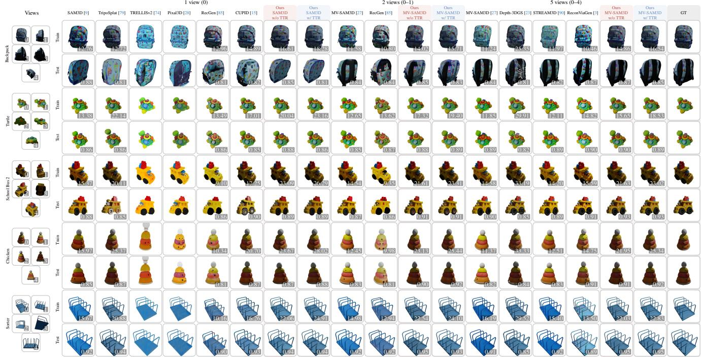  
Figure 12. Qualitative comparison on GSO-30. Each render is badged (bottom-right) with its per-scene PSNR ( ) on the train views and CLIP-I ( ) on the test views.

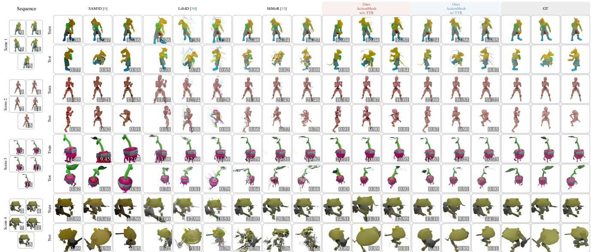  
Figure 13. Qualitative comparison on ActionBench. Each render is badged (bottom-right) with its per-scene PSNR ( ) on the train views and CLIP-I ( ) on the test views.

## A.11. Pseudo-ground-truth 2D tracking

We use the off-the-shelf point tracker CoTracker3 [19] as a pseudo-reference. For each sequence, we place a uniform grid of queries on the first-frame object mask and track them throughout the clip. To reduce tracker errors, we retain only cycle-consistent queries whose backward track returns within 0.3 pixels of their starting point. This removes 40– 60% of queries and more than halves the reference error on

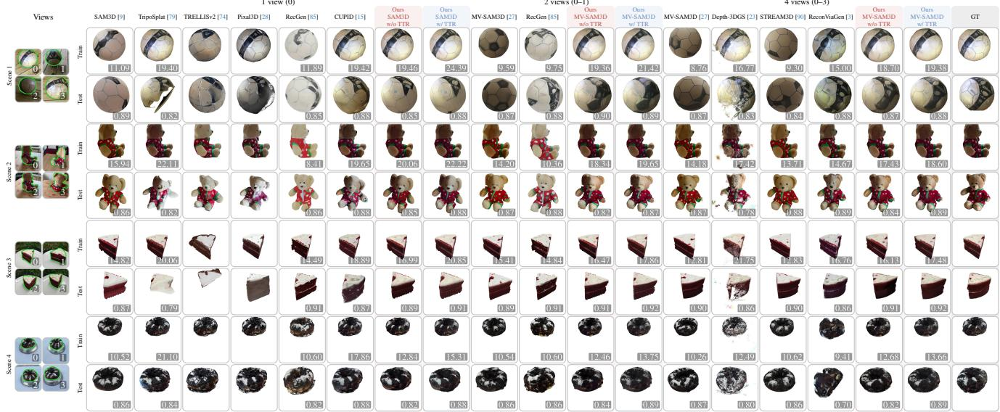  
Figure 14. Qualitative comparison on CO3D. Novel-view synthesis on 4 held-out CO3D (LaRa) scenes, reconstructed from 1, 2 and 4 input views. We compare each setting’s baselines (SAM3D, TripoSplat, TRELLISv2, Pixal3D, RecGen, and CUPID at 1 view; MV-SAM3D and RecGen at 2 views; MV-SAM3D, Depth-3DGS, STREAM3D, and ReconViaGen at 4 views) against our method on that setting’s geometry backbone (SAM3D at 1 view, MV-SAM3D at 2 and 4 views). RecGen’s released checkpoint takes at most two views, so we show it at its maximum, in the 2-view group. TRELLISv2 and Pixal3D are qualitative-only baselines: they predict mesh materials withou environment lighting, so their renders show unshaded base color (Sec. 5). Each scene spans two subrows: the reconstruction rendered from the first input (train) view and from the held-out target (test) view, each against its GT. Each render is badged (bottom-right) with its per-scene PSNR ( ) on the train views and CLIP-I ( ) on the test views.

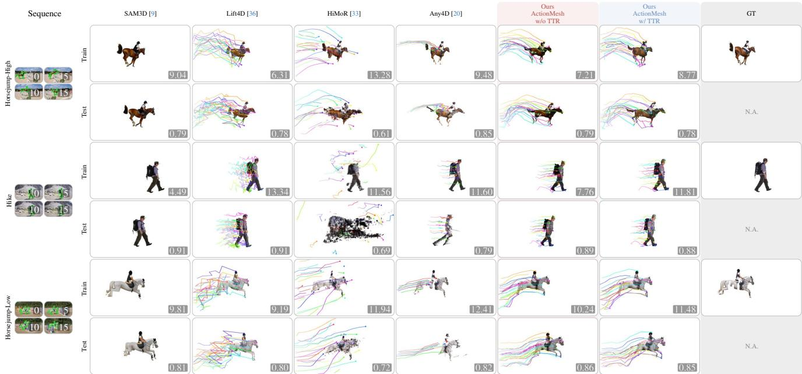  
Figure 15. Qualitative comparison on DAVIS. Each scene spans two subrows. The train subrow re-renders the input viewpoint, against the input frame as GT. DAVIS is monocular and has no second camera, so the test subrow is instead a synthesized novel view of the same timestamp. Each reconstruction is badged (bottom-right) with its per-scene PSNR ( ).

## annotated sequences.

For reconstruction-based methods, each query is matched to the reconstructed surface point whose projection is nearest in the first frame and propagated through the recovered pose and deformation, with visibility determined by geometric self-occlusion. The initial query-to-surface distance bounds the attainable tracking error, remaining below one pixel for every method on both datasets. Since the same CoTracker3 tracks are used for every method, tracking measures the temporal consistency of the recovered 4D reconstruction.

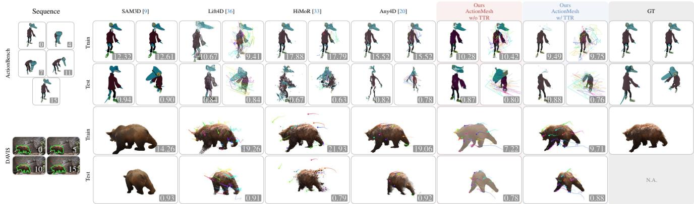  
Figure 16. Failure cases. Dynamic geometry currently relies on an external predictor (ActionMesh) rather than being directly grounded in the observations. Rotation stays prior-driven, corrected only by noise-sensitive ICP registration. Both failure modes surface on dynamic scenes below: incorrect world-space placement from registration, non-rigid deformation errors inherited from ActionMesh, or a combination of the two, can strongly impact the final reconstruction quality. Each render is badged with per-scene PSNR ( ) on train views and CLIP-I ( ) on test views (DAVIS shows a synthesized novel view in place of a held-out test view; its GT test tile is left blank).

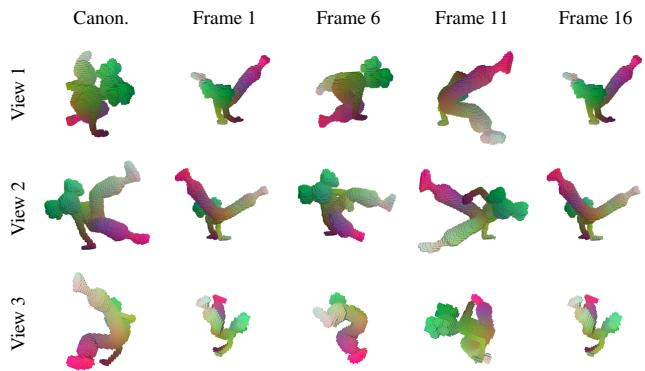  
Figure 17. Per-frame to canonical voxel correspondence on ActionBench (scene 000-003). Each frame’s mesh is voxelized in its own bounding box (its native per-frame grid); every voxel is matched to a canonical voxel through the shared fixed topology (Sec. A.3) and colored by that canonical voxel’s position, so a correct correspondence keeps each body part a constant color throughout the sequence. In this example, columns show the canonical frame c=5 and frames 1, 6, 11, 16; rows show three orbit viewpoints.

Beyond the DAVIS $\delta _ { \mathrm { a v g } }$ and reprojection error reported in Tab. 1b, the reference’s occlusion labels yield an average Jaccard of 0.42 for HiMoR against 0.37 for GenIA (with or without test-time refinement) and 0.27 for Lift4D; Any4D exports no point visibility, so AJ is unavailable for it. On ActionBench the same protocol places Any4D closest to CoTracker3 $( \delta _ { \mathrm { a v g } } { = } 0 . 7 1 )$ , ahead of HiMoR (0.65) and GenIA (0.50, with or without test-time refinement). These metrics measure agreement with CoTracker3 rather than absolute tracking accuracy and should therefore be interpreted as a coarse relative comparison, with which a pure point tracker like Any4D naturally agrees most closely.

## A.12. Datasets and scenes

GSO-30. We use the 30 EscherNet [24] objects (alarm, backpack, bell, blocks, chicken, cream, elephant, grandfather, grandmother, hat, leather, lion, lunch\_bag, mario, oil, school\_bus1, school\_bus2, shoe, shoe1, shoe2, shoe3, soap, sofa, sorter, sorting\_board, stucking\_cups, teapot, toaster, train, turtle), each rendered from 25 views at 5122. Views 0–9 are input candidates (the first #V are used; view 0 for monocular input), while views 10–24 are held out.

CO3D. We evaluate ten CO3Dv2 [58] sequences (34\_1479\_4753, 50\_2928\_8645, 123\_14363\_28981, 167\_18184\_34441, 189\_20393\_38136, 247\_26441\_50907, 247\_26469\_51778, 374\_42274\_84517, 391\_47032\_93657, 415\_57121\_110109) following LaRa [5]. Camera poses are clustered into four groups; one view per cluster forms the input set (the first #V are used), and four further views, chosen greedily to maximize angular separation from the input views and from each other, are held out for testing. Foreground masks are provided by CO3D.

ActionBench. We use six ActionBench [60] scenes (000-001\_09, 000-004\_28, 000-004\_59, 000-007\_17, 000-007\_84, 000-008\_95), rerendered from the source Sketchfab animations with known cameras. We render 16 keyframes from a fixed input camera and export the deformed mesh per frame; an additional upper-hemisphere camera at each timestamp provides the held-out view.

DAVIS. We use ten sequences (bear, blackswan, camel, car-roundabout, cows, hike, horsejump-high, horsejump-low, mallard-water, rhino), sampling 16 frames at stride 2 from the first 32. DAVIS annotations provide object masks.

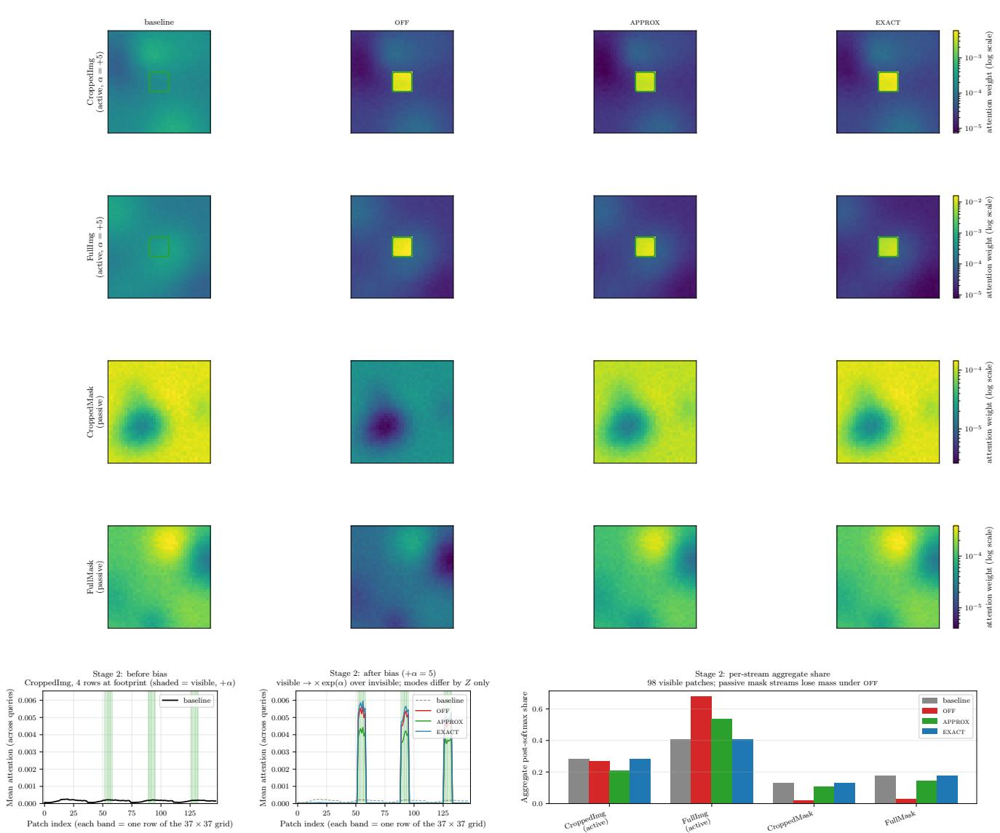

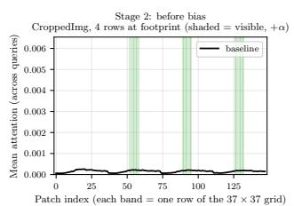

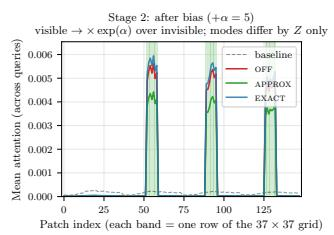

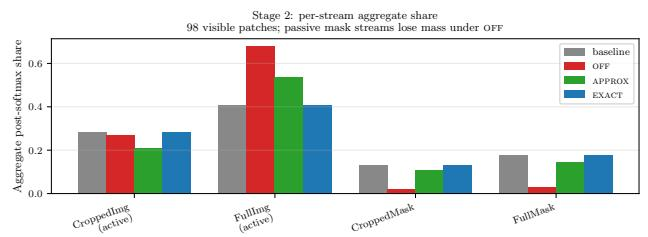  
Figure 18. Simulated effect of passive-stream compensation for visibility-biased attention. We visualize four simulated DINOv2 37 37 streams. Visibility bias (α > 0) boosts projected patches in the active RGB streams (CroppedImg, FullImg), which in turn suppresses the passive mask streams (CroppedMask, FullMask) through softmax normalization. Without compensation (OFF), passive-stream attention decreases; the closed-form approximation (APPROX) nearly restores its unbiased level and closely matches the post-softmax oracle (EXACT)

GSO-30 and ActionBench use ground-truth depth and camera poses; CO3D and DAVIS use MapAnything [22] predictions from the input observations.

## A.13. Metric reliability

Overall, the quantitative rankings broadly agree with the qualitative comparisons (Figs. 12 to 15), but each metric has limitations. PSNR remains sensitive to small residual misalignments after pose refinement, so we interpret it together with LPIPS, which is more tolerant to local shifts, and co-PSNR, which evaluates only regions constrained by an input view. CLIP-I varies over a relatively narrow range (0.71–0.91 in Tab. 1) and is comparatively tolerant to pose because each image is cropped to its own object bounding box. On ActionBench, per-frame SAM3D leads CLIP-I (Tab. 1b), whereas our reconstruction inherits ActionMesh deformation and placement errors. With ground-truth geometry, the same appearance stage reaches 0.92 (Tab. 3b)

versus 0.86, indicating that geometry quality strongly affects the score. TTR can further reduce CLIP-I when it fits the input view to geometry that is inaccurate from the held-out viewpoint. On DAVIS, CLIP-I compares each synthesized novel view with its corresponding input frame, measuring appearance consistency under viewpoint change rather than absolute reconstruction accuracy.