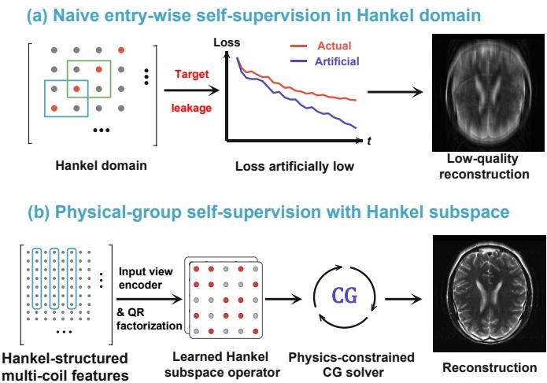
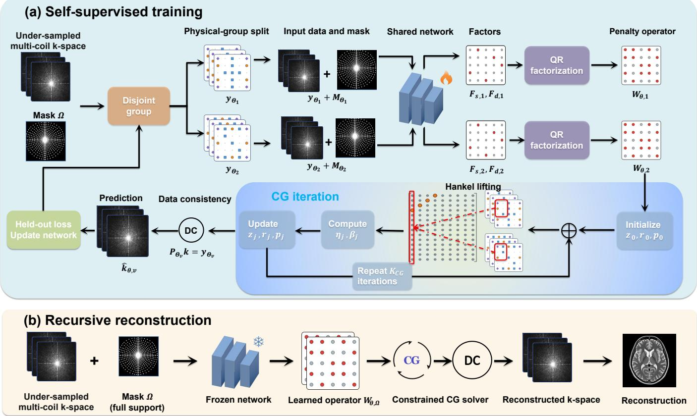
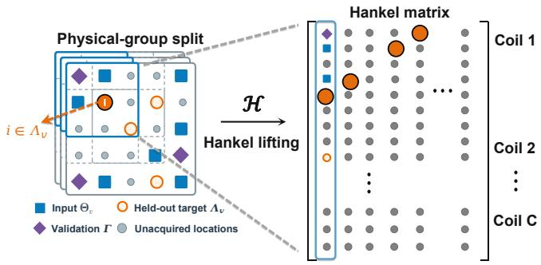
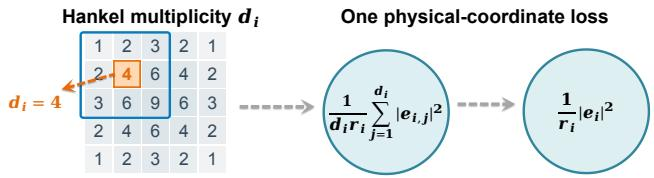
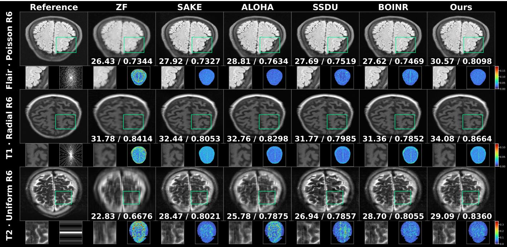
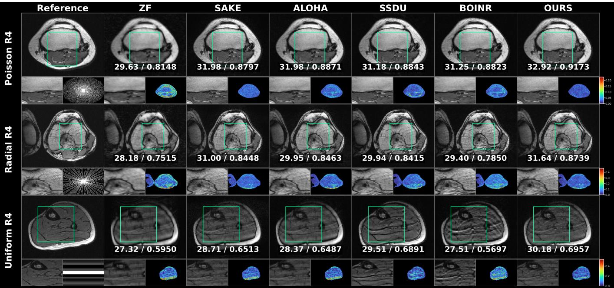
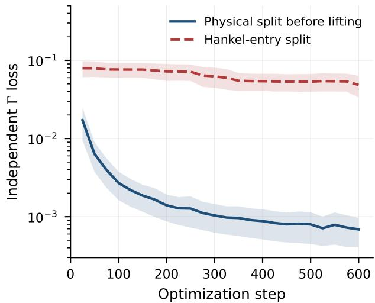

# Hankel Subspace Self-Supervised Learning for Parallel MRI Reconstruction

Mingyu Hu, Siquan Zhu, Xijun Zhong, and Qiegen Liu, Senior Member, IEEE

Abstract—Parallel magnetic resonance imaging reconstruction is an ill-posed inverse problem under undersampling. Multi-coil acquisition and Hankel lifting expose complementary repeated information: observations of the same anatomy across coils and repeated local k-space neighborhoods in overlapping windows. These dependencies guide recovery of missing k-space data. However, splitting lifted Hankel entries for self-supervision can place the original sample in both input and target, causing data leakage. We propose Hankel Subspace Self-Supervised Reconstruction (HSSRecon), a scan-specific reconstruction framework for parallel magnetic resonance imaging. HSSRecon partitions data by physical acquisition units before Hankel lifting and applies multiplicity normalization to repeated Hankel copies in overlapping windows. Rather than learning a mapping that directly predicts missing data, the network learns a compact complex-valued Hankel subspace operator. Reconstruction is performed over the original k-space variables using a conjugategradient solver with hard data consistency. This design separates structural learning in the Hankel domain from data consistency in the physical domain: the former exploits multi-coil and local Hankel correlations, while the latter solves over unacquired degrees of freedom. We provide theoretical analyses of physicalgroup splitting and multiplicity normalization, and establish positive definiteness, uniqueness, hard data consistency, and a finite-step conjugate-gradient error bound for the system. On fastMRI brain data with three contrasts and three sampling masks, HSSRecon achieves competitive peak signal-to-noise ratio, structural similarity, and normalized mean squared error across six aggregated conditions. Ablations show that physical-group splitting avoids leakage caused by Hankel-entry splitting, while the learned subspace operator outperforms a matched fixed operator.

Index Terms—Parallel MRI reconstruction, self-supervised learning, scan-specific learning, Hankel matrix, structured lowrank modeling.

## I. INTRODUCTION

Parallel MRI reduces acquisition time by undersampling multi-coil k-space. Reconstruction must recover the missing complex coefficients while preserving the acquired data and dependencies among coils. The acquisition contains two complementary forms of redundancy: inter-coil correlations induced by coil sensitivities and local k-space repetitions exposed by overlapping Hankel lifting. These dependencies are not merely nuisance correlations. They provide structural constraints that can reduce the ambiguity of the reconstruction.

Classical parallel MRI uses coil information in complementary ways. SENSE [1] reconstructs with sensitivity maps, whereas GRAPPA [2] interpolates local multi-coil k-space samples. ESPIRiT [3] estimates a calibrated signal subspace, and SPIRiT [4] enforces multi-coil self-consistency. Block-Hankel lifting provides a joint representation of local multicoil relations.

Structured low-rank methods use this lift in different ways. SAKE [5] performs calibrationless matrix completion. LO-RAKS [6] and P-LORAKS [7] model local annihilation relations. ALOHA [8] connects transform sparsity to low-rank Hankel structure. Other work learns or streamlines the structural model [9]. Deep-SLR [10] combines structured low-rank iterations with learned regularization. Convolutional framelet analyses relate learned convolutional representations to lowrank factorizations [11], [12]. Separable Hankel regularization reduces the cost of large lifts [13]. SMS-HSL [14] learns signal and null subspaces for slice separation, with subsequent work on accelerated T1 mapping [15], [16]. HKGM [17] learns a one-shot generative prior in Hankel k-space for parallel imaging. These studies establish that inter-coil and local Hankel redundancy can provide useful reconstruction priors. Most of them, however, use calibration, explicit matrix completion, or iterative prior optimization rather than learning the structural constraint from the same scan through a selfsupervised target.

Model-based networks show how a learned regularizer can be coupled to the acquisition model [18], [19], while RAKI [20] learns scan-specific interpolation from acquired calibration data. Self-supervised reconstruction instead forms training targets from the acquired measurements themselves [21]. SSDU [22] separates input and loss samples. Multi-mask SSDU [23] repeats that split to obtain more training views. Zero-shot self-supervision [24] adapts to one scan with reference-free selection. Deep unfolding informed by matrix completion has also been used for self-supervised k-space interpolation [25]. These methods define their input and target roles in the original acquisition coordinates, whereas structured Hankel modeling provides a complementary prior for plausible k-space reconstructions. Their combination is nontrivial because overlapping Hankel lifting duplicates physical coordinates.

A key requirement of self-supervised reconstruction is to ensure that measurements used as targets cannot be accessed by the predictor. Earlier self-supervised formulations address this issue by explicitly defining which acquired samples are used as inputs and which are reserved as targets [26]–[30]. In the present setting, Hankel lifting does not preserve a one-toone correspondence between physical coefficients and lifted entries: one physical coefficient may occupy several entries after overlapping windows are formed. Splitting entries after lifting can therefore leave a copy of a held-out target in the input. Moreover, a lifted loss without multiplicity correction gives greater weight to coefficients that appear more often. A valid self-supervised formulation with an overlapping Hankel lift must therefore both exclude targets at the level of physical acquisition and account for repeated coordinates, as illustrated in Fig. 1(a).

The central design question is how to retain inter-coil and local Hankel redundancy without allowing repeated representations to leak targets or alter the physical loss. Hankel Subspace Self-Supervised Reconstruction (HSSRecon) addresses this question by assigning input, held-out, and validation roles to physical acquisition units before overlapping windows are formed and correcting repeated Hankel copies with multiplicity normalization. It then learns a Hankel subspace operator and solves for the physical k-space variables with a physics-constrained conjugate-gradient (CG) solver. Fig. 1 summarizes this contrast: entry-wise splitting after lifting can leak held-out coefficients in (a), whereas physical-group selfsupervision learns a Hankel subspace operator and uses a physics-constrained CG solver in (b).

  
Fig. 1. Hankel-domain leakage and leakage-safe physical-group selfsupervision. (a) Naive entry-wise splitting after lifting can expose held-out coefficients through duplicated entries, producing an artificially low loss. (b) Physical-group splitting enables a learned Hankel subspace operator and a physics-constrained CG solver for reconstruction.

The main contributions are summarized as follows:

• We introduce HSSRecon, a Hankel-subspace selfsupervised reconstruction framework for parallel MRI. It learns a compact subspace from multi-coil k-space redundancy and couples it with a CG solver with hard data consistency.

• We develop a leakage-safe physical-group supervision scheme for overlapping Hankel lifts. Splitting before lifting excludes duplicated copies of held-out coefficients, while multiplicity normalization preserves the physical loss.

• We provide theoretical and empirical validation of HSSRecon. The analysis establishes well-posed reconstruction and finite-step CG bounds, while experiments demonstrate competitive quality across the evaluated multi-coil datasets and sampling masks.

## II. METHOD

## A. Overview

Let $x \in \mathbb { C } ^ { H \times W }$ denote the object and let $s _ { c } \in \mathbb { C } ^ { H \times W }$ be the sensitivity map of coil $c .$ The acquired multi-coil k-space is:

$$
y _ { c } = M _ { \Omega } \odot \mathcal { F } \{ s _ { c } x \} + \varepsilon _ { c } , \qquad c = 1 , \ldots , C ,\tag{1}
$$

where $M _ { \Omega }$ is the physical acquisition mask, Ω is its support, $\mathcal { F }$ is the centered orthonormal Fourier transform, and $\varepsilon _ { c }$ denotes measurement noise supported on Ω. We write $y ~ = ~ ( y _ { 1 } , \dotsc , y _ { C } )$ for the multi-coil measurement. For any support $S , P _ { S }$ is the coordinate projector that retains entries in S and sets all other entries to zero, so $P _ { S } y$ has the same dimensions as y.

The HSSRecon framework has three functional components. First, leakage-safe physical-group self-supervision defines the input, held-out, and validation views before Hankel lifting. Second, the Hankel subspace learner maps visible multi-coil data and mask geometry to a compact complex operator. Third, the physics-constrained reconstruction solver uses this operator to recover missing coefficients while retaining all acquired samples. We update the shared learner using the held-out prediction loss and select the checkpoint using the validation groups. At deployment, the selected learner operates on the full acquired support. Fig. 2 and Algorithm 1 summarize the workflow.

## B. Hankel Subspace Self-Supervision

Self-supervision is defined on physical acquisition units rather than on individual entries of a lifted matrix. An acquired phase-encoding line, a spoke-shaped set of Cartesiangrid samples, or a sampled spatial coordinate shared across coils is treated as one unit. This choice retains inter-coil measurements as a single observation and prevents a held-out coefficient from reappearing through overlapping windows. The resulting supervision uses two operations: physical-group splitting before Hankel lifting and multiplicity normalization of the repeated Hankel copies, as summarized in Fig. 3.

Let $\mathcal { G } = \{ g _ { 1 } , \dotsc , g _ { G } \}$ partition the acquired support into physical sampling units. We use acquired phase-encoding lines for uniform masks, disjoint spoke-shaped Cartesiangrid groups for radial masks, and individual acquired spatial coordinates for Poisson masks. Each group contains the corresponding measurements from all coils. For view $v ,$ the groups are split into:

$$
\mathcal { G } = \mathcal { G } _ { \Theta _ { v } } \dot { \cup } \mathcal { G } _ { \Lambda _ { v } } \dot { \cup } \mathcal { G } _ { \Gamma } , \qquad \Theta _ { v } \cap \Lambda _ { v } = \emptyset ,\tag{2}
$$

where $\Theta _ { v } , \ \Lambda _ { v } .$ , and Γ are the unions of input, held-out, and validation groups, respectively. We draw $\Gamma$ once before training. Only the remaining groups are repartitioned into $\Theta _ { v }$ and $\Lambda _ { v }$ at each update. Splitting before lifting excludes every

  
Fig. 2. Overview of HSSRecon. (a) During self-supervised training, the acquired multi-coil k-space and mask are split into disjoint physical groups, processed by the shared learner to produce factorized subspaces, and used in a constrained Hankel CG loop. The learner is updated using the physical held-out loss. (b) During reconstruction, the trained learner is frozen. It uses the full acquired data and mask to construct the subspace operator, after which the constrained CG solver reconstructs the missing k-space coefficients, followed by inverse Fourier imaging.

Hankel copy of a held-out coefficient from the input. The Hankel subspace learner receives $\begin{array} { c c l } { y _ { \Theta _ { v } } } & { = } & { P _ { \Theta _ { v } } y } \end{array}$ and mask descriptors. $\Lambda _ { v }$ supplies training targets, and Γ is reserved for reference-free model selection.

1) Hankel Multiplicity Normalization: Let H be a block-Hankel lifting operator that extracts overlapping $k _ { h } \ \times \ k _ { w }$ neighborhoods from all coils:

$$
\begin{array} { r } { \mathcal { H } ( k ) = \left[ \begin{array} { c } { \mathcal { E } _ { 1 } ( k ) ^ { \mathsf { T } } } \\ { \vdots } \\ { \mathcal { E } _ { N } ( k ) ^ { \mathsf { T } } } \end{array} \right] \in \mathbb { C } ^ { N \times F } , \qquad F = C k _ { h } k _ { w } . } \end{array}\tag{3}
$$

Each coefficient $k _ { i }$ at one coil and one k-space location appears in $d _ { i }$ overlapping windows. For this lifting construction, $D = \mathcal { H } ^ { * } \mathcal { H }$ is diagonal with $D _ { i i } = d _ { i } > 0$ . Define:

$$
\overline { { \mathcal { H } } } = \mathcal { H } D ^ { - 1 / 2 } , \qquad \mathcal { H } ^ { \dag } = D ^ { - 1 } \mathcal { H } ^ { * } , \qquad P _ { \mathcal { H } } = \mathcal { H } D ^ { - 1 } \mathcal { H } ^ { * } .\tag{4}
$$

Here $\mathcal { H } ^ { \dagger } Z$ averages overlapping copies of a lifted estimate $Z$ back to physical coordinates, and $P _ { \mathcal { H } }$ projects it onto the range of the lift. For a held-out support Λ:

$$
\sum _ { a \in \mathcal { C } ( \Lambda ) } \frac { \left| [ P _ { \mathcal { H } } Z ] _ { a } - [ \mathcal { H } y ] _ { a } \right| ^ { 2 } } { d _ { \pi ( a ) } r _ { \pi ( a ) } } = \sum _ { i \in \Lambda } \frac { \left| [ \mathcal { H } ^ { \dagger } P _ { \mathcal { H } } Z ] _ { i } - y _ { i } \right| ^ { 2 } } { r _ { i } } ,\tag{5}
$$

Here $\mathcal { C } ( \Lambda )$ contains all lifted copies of coordinates in $\Lambda , \pi ( a )$ identifies the physical coordinate of copy a, and $r _ { i } > 0$ is its pre-draw probability of target inclusion. For the jth lifted copy $a _ { i , j }$ of coordinate i, define $e _ { i , j } = [ P _ { \mathcal { H } } Z ] _ { a _ { i , j } } - [ \mathcal { H } y ] _ { a _ { i , j } }$ and $\begin{array} { r } { e _ { i } = [ \mathcal { H } ^ { \dagger } P _ { \mathcal { H } } Z ] _ { i } - y _ { i } } \end{array}$ . Because $P _ { \mathcal { H } } Z$ lies in the range of H, the copies have the same residual after projection, $e _ { i , 1 } = \cdots =$ $e _ { i , d _ { i } } = e _ { i } .$ . Thus, the factor $1 / d _ { i }$ removes repeated counting, while $1 / r _ { i }$ retains the pre-draw weighting by target inclusion. For a uniform fixed-size draw of K target groups from $\mathcal { G } _ { \mathrm { t r a i n } } .$ which contains the groups not reserved for validation, $r _ { i } =$ $K / | \mathcal { G } _ { \mathrm { t r a i n } } |$

  
Fig. 3. Leakage-safe physical grouping and Hankel multiplicity normalization. (a) Acquired multi-coil data are split into input $\Theta _ { v } .$ , held-out $\Lambda _ { v } ,$ and validation Γ groups before Hankel lifting. (b) After projection onto range(H), the d copies of $k _ { i }$ satisfy $\begin{array} { r } { \frac { 1 } { r _ { i } } \left( \frac { 1 } { d _ { i } } \sum _ { j } | \bar { e } _ { i , j } | ^ { 2 } \right) = \bar { \frac { 1 } { r _ { i } } } | \bar { e } _ { i } | ^ { 2 } } \end{array}$ . The global factors $1 / V$ and $1 / Z _ { v }$ are omitted for clarity.

For a Hankel-consistent lifted estimate, obtained after projection onto the range of H, the $d _ { i }$ copies share the same residual. Thus, their weighted squared errors reduce to one physical-coordinate contribution, as illustrated in Fig. 3(b). The same correction applies to the two-dimensional multi-coil lift used here.

2) Physical Held-Out Objective: For view $v ,$ let $\widehat { k } _ { \theta , v }$ denote the reconstruction produced from $y _ { \Theta _ { \tau } }$ and $W _ { \theta , v }$ . The selfsupervised loss is evaluated on the physical held-out coordinates:

$$
\mathcal { L } _ { \mathrm { S S L } } ( \theta ) = \frac { 1 } { V } \sum _ { v = 1 } ^ { V } \frac { 1 } { Z _ { v } } \sum _ { i \in \Lambda _ { v } } \frac { 1 } { r _ { i } } \left. \widehat { k } _ { \theta , v , i } - y _ { i } \right. _ { 2 } ^ { 2 } ,\tag{6}
$$

where $r _ { i }$ is fixed by the sampling design before the view is drawn, and $Z _ { v } > 0$ sets the optimization scale. In the reported two-view implementation, the two weighted sums are divided by the common factor $2 C | \Lambda _ { 1 } |$ . Thus $V = 2$ and $Z _ { v } = C | \Lambda _ { 1 } |$ for both views. The loss is evaluated in physical k-space. Eq. (5) gives its equivalent multiplicity-corrected lifted form. Held-out values enter only the loss, while the Hankel prior enters the constrained solve below. The normalization sets the optimization scale. For the reported two-view training, we also penalize disagreement between the two predicted operators:

$$
\mathcal { L } _ { \mathrm { t r a i n } } = \mathcal { L } _ { \mathrm { S S L } } + \lambda _ { \mathrm { c v } } \frac { \Vert W _ { \boldsymbol { \theta } , 1 } - W _ { \boldsymbol { \theta } , 2 } \Vert _ { F } ^ { 2 } } { F ^ { 2 } } .\tag{7}
$$

This term compares the two operators without using held-out values.

## C. Hankel Subspace Learner

The Hankel subspace learner maps the real and imaginary parts of $y _ { \Theta _ { v } }$ , the input mask, and a descriptor of the geometry of the full acquired mask to a scan-specific embedding. The descriptor contains sampling locations but no held-out values. A convolutional trunk with a $5 \times 5$ input layer and $3 \times 3$ blocks consisting of convolution, normalization, and GELU operations, followed by global pooling, produces a scan-specific embedding. A second encoder adds mask statistics. Complex heads output the structural (s) and sampling-conditioned innovation (d) factors:

$$
F _ { s , v } \in \mathbb { C } ^ { F \times q _ { s } } , \qquad F _ { d , v } \in \mathbb { C } ^ { F \times q _ { d } } ,\tag{8}
$$

where $q _ { s }$ and $q _ { d }$ are their respective column counts. The reported configuration uses $q _ { s } = 1 6$ and $q _ { d } = 8 .$

For full-column-rank factors, $F _ { s , v } R$ spans the same subspace for any invertible R. A reduced complex QR decomposition then gives the structural projector:

$$
F _ { s , v } = Q _ { s , v } R _ { s , v } , \qquad P _ { s , v } = Q _ { s , v } Q _ { s , v } ^ { H } .\tag{9}
$$

We remove the structural component from the innovation factor before its QR decomposition:

$$
\begin{array} { l } { { \widetilde { F } _ { d , v } = ( I - P _ { s , v } ) F _ { d , v } , } } \\ { { \widetilde { F } _ { d , v } = Q _ { d , v } R _ { d , v } , \qquad P _ { d , v } = Q _ { d , v } Q _ { d , v } ^ { H } . } } \end{array}\tag{10}
$$

We combine the structural and innovation projectors to define the operator:

$$
W _ { \theta , v } = P _ { s , v } + \alpha _ { v } P _ { d , v } , \qquad 0 \le \alpha _ { v } \le \alpha _ { \mathrm { m a x } } .\tag{11}
$$

We set $\alpha _ { \mathrm { m a x } } = 0 . 1$ and compute $\alpha _ { v }$ by multiplying it by the two sigmoid outputs for innovation weighting and confidence gating. The resulting $W _ { \theta , v }$ is Hermitian positive semidefinite. When both factors entering QR have full column rank, it depends on their subspaces rather than their arbitrary factor coordinates. This invariance is not asserted for rank-deficient factors.

The network processes the real and imaginary input channels to produce complex factors, and $( \cdot ) ^ { H }$ denotes Hermitian transpose. The feature dimension $F ~ = ~ C k _ { h } k _ { w }$ counts the entries in a $k _ { h } \times k _ { w }$ neighborhood across $C$ coils. In the quadratic below, $W _ { \theta , { \boldsymbol { v } } }$ weights filter directions with residual Hankel energy. It is not a projector onto a reconstructed signal subspace.

## D. Physics-Constrained Reconstruction Solver

For a fixed $W _ { \theta , v }$ , we formulate reconstruction as the following constrained quadratic problem over multi-coil k-space:

$$
\begin{array} { r l } { \widehat { k } _ { \theta , v } ^ { ( \infty ) } = \arg \operatorname* { m i n } _ { k } \frac { \lambda _ { H } } { 2 } \left\| \overline { { \mathcal { H } } } ( k ) W _ { \theta , v } ^ { 1 / 2 } \right\| _ { F } ^ { 2 } } & { } \\ { + \frac { \lambda _ { 0 } } { 2 } \left\| k \right\| _ { 2 } ^ { 2 } } & { \mathrm { s . t . } \quad P _ { \Theta _ { v } } k = P _ { \Theta _ { v } } y . } \end{array}\tag{12}
$$

Here $\lambda _ { H } \geq 0$ weights the learned Hankel penalty and $\lambda _ { 0 } > 0$ is a ridge term. The first term penalizes energy along the filter directions selected by $W _ { \theta , v } .$ . The constraint retains all input measurements.

The normal map uses $\overline { { \mathcal { H } } } ~ = ~ \mathcal { H } D ^ { - 1 / 2 }$ , so a coefficient appearing in more windows does not gain weight solely from its copy count. We absorb the normal map’s fixed scalar normalization into $\lambda _ { H }$

Let $N _ { v }$ contain an orthonormal basis of the free-coordinate space ker $P _ { \Theta _ { v } }$ , and set $k _ { \mathrm { d c } , v } = P _ { \Theta _ { v } } y .$ . Every feasible reconstruction has the form $k = k _ { \mathrm { d c } , v } + N _ { v } z$ , where z contains only unmeasured coefficients. Define the feature-space action $\mathcal { W } _ { \theta , v } ( Z ) = Z W _ { \theta , v }$ and the physical normal operator $R _ { \theta , v }$ and right-hand side $c _ { v }$ by:

$$
R _ { \theta , v } = \lambda _ { H } \overline { { \mathcal { H } } } ^ { * } \mathcal { W } _ { \theta , v } \overline { { \mathcal { H } } } + \lambda _ { 0 } I , \qquad c _ { v } = - N _ { v } ^ { H } R _ { \theta , v } k _ { \mathrm { d c } , v } .\tag{13}
$$

The reduced normal matrix is:

$$
A _ { v } = N _ { v } ^ { H } R _ { \theta , v } N _ { v } \times 0 .\tag{14}
$$

CG solves $A _ { v } z = c _ { v }$ in the free-coordinate space. With $r _ { 0 } =$ $c _ { v } - A _ { v } z _ { 0 }$ and $p _ { 0 } = r _ { 0 }$ , its iterations are:

$$
\begin{array} { r l } { r _ { j } = c _ { v } - A _ { v } z _ { j } , } & { { } \ z _ { j + 1 } = z _ { j } + \eta _ { j } p _ { j } , } \\ { p _ { j + 1 } = r _ { j + 1 } + \beta _ { j } p _ { j } . } \end{array}\tag{15}
$$

where $\eta _ { j }$ and $\beta _ { j }$ are the standard CG scalars. After at most $K _ { \mathrm { C G } }$ iterations, it returns $\widehat { k } _ { \theta , v } ^ { ( K _ { \mathrm { C G } } ) } = k _ { \mathrm { d c } , v } + N _ { v } z _ { K _ { \mathrm { C G } } }$ This parametrization preserves hard data consistency at every iteration. The implementation also writes the acquired values back to the returned array to suppress numerical drift.

Algorithm 1 HSSRecon   
Require: Acquired multi-coil k-space y, support Ω, physical   
groups ${ \mathcal { G } } ,$ training updates T, and CG budget $K _ { \mathrm { C G } }$   
Ensure: Reconstructed multi-coil k-space bk and image   
1: Fix validation groups $\mathcal { G } _ { \Gamma }$ and initialize θ   
2: for $t = 1 , \dots , T$ do   
3: For $v = 1 , 2 ,$ partition $\mathcal { G } \backslash \mathcal { G } _ { \Gamma }$ into $\mathcal { G } _ { \Theta _ { v } }$ and $\mathcal { G } _ { \Lambda _ { \tau } }$ before   
lifting   
4: for $v = 1 , 2$ do   
5: Form $\boldsymbol { y } _ { \boldsymbol { \Theta } _ { v } } ~ = ~ P _ { \boldsymbol { \Theta } _ { v } } \boldsymbol { y }$ and predict $W _ { \theta , v }$ from visible   
values and mask geometry   
6: Initialize $z _ { 0 . } = 0$ and run up to $K _ { \mathrm { C G } }$ steps on $A _ { v } z =$   
$c _ { v }$ and set $\widehat { k } _ { \theta , v } = k _ { \mathrm { d c } , v } + N _ { v } z _ { K _ { \mathrm { C G } } }$   
7: Evaluate the physical held-out loss on $\Lambda _ { v }$   
8: end for   
9: Add cross-view operator consistency, backpropagate   
${ \mathcal { L } } _ { \mathrm { t r a i n } } ,$ and update θ   
10: Select checkpoints using only validation support Γ   
11: end for   
12: Freeze the selected learner and selection rule   
13: Iterative reconstruction: predict $W _ { \theta , \Omega }$ from the full   
acquired support and run constrained CG   
14: Restore acquired values and return bk and its inverse   
Fourier image

## E. Theoretical Analysis

We establish the effect of physical splitting and multiplicity correction, then analyze the constrained reconstruction for a fixed view and operator.

Proposition 1 (Physical splitting and multiplicity correction): For a pure lift that copies each physical entry and has $d _ { i } \ > \ 0$ , the physical split in Eq. (2) excludes every lifted copy of a held-out value from the current view’s input. For any lifted estimate $Z , { \mathrm { E q . ~ } } ( 5 )$ counts each physical-coordinate error once after projection onto the lift’s range and multiplicity correction. The normalized lift also satisfies:

$$
\begin{array} { r } { \overline { { \mathcal { H } } } ^ { * } \overline { { \mathcal { H } } } = I , \qquad \| \overline { { \mathcal { H } } } k \| _ { F } ^ { 2 } = \| k \| _ { 2 } ^ { 2 } . } \end{array}\tag{16}
$$

This isometry links multiplicity correction to the solver’s spectral scale. For the orthogonal structural and innovation subspaces in Eqs. (9)–(11), assuming full column rank at both QR steps, the eigenvalues of $W _ { \theta , \iota }$ belong to $\{ 0 , 1 , \alpha _ { v } \}$ . Hence its spectral norm $w _ { v } = \| W _ { \theta , v } \| _ { 2 }$ is bounded by $\operatorname* { m a x } \{ 1 , \alpha _ { \mathrm { m a x } } \}$ This bound limits the penalty strength without requiring the learned filter directions to match the signal.

Theorem 1 (Constrained reconstruction): Fix view v and $W _ { \theta , v } \succeq 0$ , with $\lambda _ { H } \geq 0$ and $\lambda _ { 0 } > 0$ . Then $A _ { v }$ is Hermitian positive definite, Eq. (12) has a unique minimizer, and every iterate $k ^ { ( j ) } = k _ { \mathrm { d c } , v } + N _ { v } z _ { j }$ satisfies hard data consistency. With $w _ { v } = \| W _ { \theta , v } \| _ { 2 }$ , the normalized lift gives:

$$
\begin{array} { c } { { \lambda _ { 0 } I \preceq A _ { v } \preceq ( \lambda _ { 0 } + \lambda _ { H } w _ { v } ) I , } } \\ { { \kappa _ { v } \leq 1 + \displaystyle \frac { \lambda _ { H } w _ { v } } { \lambda _ { 0 } } . } } \end{array}\tag{17}
$$

Here $\mu _ { v } = \lambda _ { \operatorname* { m i n } } ( A _ { v } ) , \kappa _ { v } = \lambda _ { \operatorname* { m a x } } ( A _ { v } ) / \mu _ { v } ,$ and $e _ { 0 } = z _ { 0 } -$ $A _ { v } ^ { - 1 } c _ { v }$ . With $\Vert u \Vert _ { A _ { v } } = ( u ^ { H } A _ { v } u ) ^ { 1 / 2 }$ and $\delta _ { \mathrm { C G } } ( K ) = \Vert \widehat { k } _ { \theta , v } ^ { ( K ) } -$

$\widehat { k } _ { \theta , v } ^ { ( \infty ) } \| _ { 2 }$ , exact-arithmetic CG satisfies:

$$
\delta _ { \mathrm { C G } } ( K ) \leq \frac { 2 } { \sqrt { \mu _ { v } } } \left( \frac { \sqrt { \kappa _ { v } } - 1 } { \sqrt { \kappa _ { v } } + 1 } \right) ^ { K } \| e _ { 0 } \| _ { A _ { v } } .\tag{18}
$$

For the final residual $r _ { K } = c _ { v } - A _ { v } z _ { K }$ , the remaining solver error also admits the computable bound:

$$
\delta _ { \mathrm { C G } } ( K ) \leq \frac { \| r _ { K } \| _ { 2 } } { \mu _ { v } } \leq \frac { \| r _ { K } \| _ { 2 } } { \lambda _ { 0 } } .\tag{19}
$$

Corollary 1 (Reconstruction error bound): Under the conditions of Theorem 1, for any evaluation reference $k _ { \star }$ , define the feasible comparison point and its Hankel penalty response on free coordinates:

$$
\begin{array} { r } { k _ { \mathrm { r e f } } = P _ { \Theta _ { v } } y + ( I - P _ { \Theta _ { v } } ) k _ { \star } , } \\ { g _ { H , v } ( k _ { \mathrm { r e f } } ) = N _ { v } ^ { H } \overline { { \mathcal { H } } } ^ { * } \mathcal { W } _ { \theta , v } ( \overline { { \mathcal { H } } } k _ { \mathrm { r e f } } ) . } \end{array}
$$

The finite-step reconstruction obeys:

$$
\begin{array} { r l } { \displaystyle \| \widehat { k } _ { \theta , v } ^ { ( K ) } - k _ { \star } \| _ { 2 } \leq \| P _ { \Theta _ { v } } ( y - k _ { \star } ) \| _ { 2 } } & { } \\ { + \frac { \lambda _ { H } } { \mu _ { v } } \| g _ { H , v } ( k _ { \mathrm { r e f } } ) \| _ { 2 } } & { } \\ { + \frac { \lambda _ { 0 } } { \mu _ { v } } \| N _ { v } ^ { H } k _ { \mathrm { r e f } } \| _ { 2 } + \delta _ { \mathrm { C G } } ( K ) . } \end{array}\tag{20}
$$

The spectral bound in Eq. (17) has no explicit multiplicity factor. The corresponding unnormalized bound contains maxi di. The exact-arithmetic contraction in Eq. (18) and the residual bound in Eq. (19) quantify error relative to the exact solution of the fixed quadratic.

The four terms in Eq. (20) account for input measurement discrepancy, Hankel and ridge penalty responses at $k _ { \mathrm { r e f } } ,$ and incomplete solution. Any discrepancy between the acquired measurements and $k _ { \star }$ remains in every data-consistent reconstruction. The ridge term can also bias free coefficients even when the Hankel response vanishes. These bounds apply to a fixed view and operator. They do not establish recovery of the true signal subspace or convergence of network training. Proofs are given in the Appendix.

## III. EXPERIMENTS

## A. Experimental Setup

Datasets: We evaluate the proposed method on two fully sampled multi-coil benchmarks: fastMRI brain [31], [32] and an independent 10-subject panel selected from the public Stanford 2D FSE dataset [33], [34]. Both datasets provide complex multi-coil k-space. For each case, all methods use the same multi-coil measurements and undersampling mask. Fully sampled data are used only to form the reference RSS images, compute quantitative scores, and produce visualizations after training and model selection. The fastMRI panel contains three contrasts (AXFLAIR, AXT1PRE, and AXT2), five subjects per contrast, and slices 003, 008, and 012. Its working grid is 640 × 320 with 16 or 20 receiver coils. We retrospectively apply Poisson, radial, and uniform masks at $R \ \in \ \{ 6 , 8 \}$ yielding $3 \times 5 \times 3 \times 3 \times 2 = 2 7 0$ cases.

The Stanford panel contains 10 held-out subjects and three interior slices per subject. Unlike fastMRI, it represents a single 2D FSE Bone acquisition setting rather than three contrasts, with 16 receiver coils. It uses the same three mask families at $R = 4$ , giving 30 cases per mask and 90 cases in total. The data retain native full-FOV matrices rather than a common working grid: the first spatial dimension ranges from 174 to 256, and the second is either 320 or 352. This variable native geometry provides a complementary test of transfer across acquisition and anatomy.

Compared methods: We compare zero filling (ZF), calibrationless SAKE [5], ALOHA [8], SSDU [22], BOINR [35], and HSSRecon. ZF, SAKE, and ALOHA do not use external training data. SSDU is a reference-free self-supervised method trained at the dataset level. One model is trained for each contrast, mask, and acceleration factor in the fastMRI experiment. Each model uses five training subjects that do not overlap with the test subjects and 50 training slices. In the Stanford experiment, one model is trained for each mask using five such training subjects and 55 training slices. BOINR and HSSRecon optimize their parameters independently for each test scan using its acquired measurements. The reported BOINR results use RSS-based phase estimation from acquired ACS data, followed by acquired-data hard consistency. These choices are fixed before scoring. We verify physical support, duplicate handling, hard data consistency, and solver residuals for each case.

Implementation details: HSSRecon uses a 3×3 Hankel lift, factorized structural and innovation subspaces, two physical training views, a 24-step CG budget, $\lambda _ { H } = 1 , \lambda _ { 0 } = 1 0 ^ { - 3 }$ $\lambda _ { \mathrm { c v } } ~ = ~ 0 . 1$ , and hard consistency on acquired samples. The fastMRI comparison uses 300 updates for Poisson and radial masks and 1000 updates for the uniform mask. The Stanford panel uses prespecified iteration budgets of 300, 600, and 1000 updates for Poisson, radial, and uniform masks, respectively. Checkpoint selection withholds the Γ groups and uses the larger loss from two partitions formed with the same physicalgroup rule used during reconstruction. Training and selection use a zero-filled CG start. The same HSSRecon architecture, hard data consistency operator, and metric implementation are used for both benchmarks. The source code and implementation details are available at https://github.com/yqx7150/ HSSRecon.

Evaluation metrics: All outputs are converted to root-sumof-squares (RSS) magnitude images and normalized by the maximum intensity of the fully sampled reference. We report peak signal-to-noise ratio (PSNR, dB), structural similarity index measure (SSIM), and normalized mean squared error (NMSE) with the same implementation for every method.

## B. Experimental Results

Quantitative comparison: Tables I–III summarize the quantitative results under the two evaluation protocols. Table I groups the fastMRI cases by sampling pattern and acceleration factor and pools the three contrasts. Table II groups the cases by contrast and acceleration factor and averages the three masks within each subject. Table III reports the three sampling patterns on the Stanford cohort at $R = 4 .$ . Each entry gives the mean PSNR/SSIM/NMSE. The rightmost columns in the two fastMRI tables report the raw two-sided paired t-test on

PSNR after averaging the six displayed mask–acceleration combinations at $R = 6 ,$ 8 for each subject within each contrast. The Stanford panel is reported descriptively because it serves as external validation and is scored on its native full-FOV grid. Only $R = 6$ and $R = 8$ are shown for fastMRI. Table I contains $n = 1 5$ subject means for each mask and acceleration combination, Table II contains $n = 5$ subject means for each contrast and acceleration combination, and Table III contains $n = 1 0$ subject means per sampling pattern.

In Table I, HSSRecon has the highest PSNR and SSIM and the lowest NMSE in all six displayed $R = 6 / R = 8$ conditions. Table II shows the same ordering for AXFLAIR and AXT1PRE. For AXT2, HSSRecon leads at $R \ = \ 6 .$ At $R \ = \ 8 ,$ SSDU has a slightly higher PSNR (31.52 versus 31.44 dB) and lower NMSE (0.0146 versus 0.0157), whereas HSSRecon retains the higher SSIM (0.8403 versus 0.8041). Relative to $\mathrm { Z F }$ and SAKE, HSSRecon improves all six displayed mask and acceleration combinations. The paired PSNR tests use one observation for each subject within each contrast after averaging its six displayed mask–acceleration combinations at $R = 6 , 8 .$ . The raw paired p-values are below $1 0 ^ { - 4 }$ for ZF, SAKE, ALOHA, and BOINR, and equal to $1 . 7 \times 1 0 ^ { - 3 }$ for SSDU.

Table III shows that HSSRecon achieves the highest PSNR and SSIM under Poisson sampling and the highest PSNR under radial sampling. Under uniform sampling, BOINR has the highest PSNR, while SSDU has the highest SSIM and lowest NMSE. Across the three sampling patterns, HSSRecon achieves the lowest mean NMSE, although its advantage does not extend to every reported metric.

Qualitative comparison: Fig. 4 presents three fastMRI brain examples at $R \ : = \ : 6$ from different contrasts and sampling patterns. Fig. 5 presents one Stanford example for each sampling pattern at $R = 4$ . In these examples, HSSRecon reduces structured aliasing and local boundary errors. The uniform Stanford example also illustrates the metric differences reported in Table III.

## C. Ablation Study

We evaluate the contribution of each component on nine AXT2/Poisson $R = 6$ slices, with three per subject. Apart from the tested change, learned variants share the acquired data, masks, $3 \times 3$ Hankel lift, two views, 24 CG steps, and hard data consistency. The training budget for this analysis is capped at 600 updates. Checkpoint selection uses Γ, excluded from gradient updates, before reference-based scoring. Table IV gives mean PSNR, SSIM, and NMSE across the nine slices.

For the Fixed operator control, we construct a Hankel matrix from the full acquired k-space, with unacquired entries set to zero. The 16 lowest-energy right singular vectors define the structural subspace, and the next eight define the innovation subspace. Its innovation weight is set to match the learned operator’s trace without reference data. We compute the fixed operator once per scan and hold it fixed across both views and all reconstruction solves. Both settings use the same CG solver and hard data consistency. Relative to the fixed operator, the learned operator improves PSNR by 6.23 dB. This comparison assesses learning and view conditioning jointly.

TABLE I  
QUANTITATIVE COMPARISON ON THE FASTMRI BRAIN BENCHMARK AT R = 6 AND R = 8. ENTRIES ARE MEAN PSNR/SSIM/NMSE; THE RIGHTMOST p-VALUE IS A RAW TWO-SIDED PAIRED t-TEST ON PSNR AFTER EACH CONTRAST–SUBJECT UNIT IS AVERAGED OVER THE SIX DISPLAYED MASK–ACCELERATION CONDITIONS AT $R = 6 , 8$
<table><tr><td>Method</td><td>Poisson R6</td><td>Poisson R8</td><td>Radial R6</td><td>Radial R8</td><td>Uniform R6</td><td>Uniform R8</td><td>p-value</td></tr><tr><td>ZF</td><td>28.18/0.7953/0.0281</td><td>27.84/0.7763/0.0308</td><td>28.52/0.7826/0.0266</td><td>26.71/0.7399/0.0394</td><td>23.95/0.6529/0.0715</td><td>23.50/0.6153/0.0791</td><td> $\overline { { 3 . 4 \times 1 0 ^ { - 9 } } }$ </td></tr><tr><td>SAKE [5]</td><td>31.56/0.7680/0.0145</td><td>30.74/0.7348/0.0179</td><td>31.13/0.7663/0.0149</td><td>29.82/0.7313/0.0197</td><td>28.46/0.7150/0.0251</td><td>26.84/0.6682/0.0361</td><td> $2 . 7 \times 1 0 ^ { - 7 }$ </td></tr><tr><td>ALOHA [8]</td><td>31.78/0.8004/0.0143</td><td>30.86/0.7724/0.0176</td><td>31.21/0.8076/0.0150</td><td>29.62/0.7677/0.0210</td><td>27.68/0.7572/0.0316</td><td>26.34/0.7090/0.0425</td><td> $5 . 9 \times 1 0 ^ { - 6 }$ </td></tr><tr><td>SSDU [22]</td><td>31.66/0.7933/0.0167</td><td>31.01/0.7660/0.0191</td><td>31.20/0.7925/0.0171</td><td>30.26/0.7624/0.0207</td><td>29.49/0.7615/0.0237</td><td>26.70/0.6883/0.0394</td><td> $1 . 7 \times 1 0 ^ { - 3 }$ </td></tr><tr><td>BOINR [35]</td><td>30.92/0.7808/0.0182</td><td>30.09/0.7417/0.0216</td><td>30.16/0.7610/0.0198</td><td>29.02/0.7207/0.0250</td><td>29.60/0.7467/0.0230</td><td>27.23/0.6738/0.0356</td><td> $5 . 6 \times 1 0 ^ { - 8 }$ </td></tr><tr><td>HSSRecon</td><td>32.92/0.8367/0.0116</td><td>31.98/0.8099/0.0143</td><td>31.94/0.8251/0.0128</td><td>30.46/0.7915/0.0175</td><td>30.33/0.7929/0.0180</td><td>27.94/0.7419/0.0296</td><td></td></tr></table>

TABLE II

QUANTITATIVE COMPARISON ON THE FASTMRI BRAIN BENCHMARK AT $R = 6 ~ \mathrm { A N D } ~ R = 8 .$ . ENTRIES ARE MEAN PSNR/SSIM/NMSE; THE RIGHTMOST p-VALUE IS A RAW TWO-SIDED PAIRED t-TEST ON PSNR AFTER EACH CONTRAST–SUBJECT UNIT IS AVERAGED OVER THE SIX DISPLAYED MASK–ACCELERATION CONDITIONS AT $R = 6 , 8$ .
<table><tr><td>Method</td><td>AXFLAIR R6</td><td>AXFLAIR R8</td><td>AXT1PRE R6</td><td>AXT1PRE R8</td><td>AXT2 R6</td><td>AXT2 R8</td><td>p-value</td></tr><tr><td>ZF</td><td>25.96/0.6867/0.0464</td><td>25.21/0.6464/0.0541</td><td>27.69/0.7616/0.0361</td><td>26.83/0.7380/0.0421</td><td>27.00/0.7824/0.0437</td><td>26.02/0.7471/0.0531</td><td> $\overline { { 3 . 4 \times 1 0 ^ { - 9 } } }$ </td></tr><tr><td>SAKE [5]</td><td>28.73/0.6927/0.0244</td><td>27.48/0.6523/0.0321</td><td>30.54/0.7363/0.0165</td><td>29.52/0.7036/0.0214</td><td>31.88/0.8203/0.0137</td><td>30.40/0.7784/0.0202</td><td> $2 . 7 \times 1 0 ^ { - 7 }$ </td></tr><tr><td>ALOHA [8]</td><td>28.65/0.7422/0.0264</td><td>27.44/0.7003/0.0344</td><td>30.92/0.7847/0.0158</td><td>29.78/0.7493/0.0208</td><td>31.11/0.8383/0.0187</td><td>29.60/0.7995/0.0260</td><td> $5 . 9 \times 1 0 ^ { - 6 }$ </td></tr><tr><td>SSDU [22]</td><td>28.02/0.7335/0.0325</td><td>26.82/0.6810/0.0421</td><td>30.88/0.7668/0.0162</td><td>29.64/0.7316/0.0225</td><td>33.45/0.8470/0.0088</td><td>31.52/0.8041/0.0146</td><td> $1 . 7 \times 1 0 ^ { - 3 }$ </td></tr><tr><td>BOINR [35]</td><td>27.68/0.7148/0.0337</td><td>26.56/0.6614/0.0424</td><td>30.59/0.7524/0.0169</td><td>29.43/0.7050/0.0222</td><td>32.41/0.8212/0.0104</td><td>30.35/0.7698/0.0178</td><td> $5 . 6 \times 1 0 ^ { - 8 }$ </td></tr><tr><td>HSSRecon</td><td>29.56/0.7680/0.0222</td><td>28.10/0.7275/0.0302</td><td>32.10/0.8077/0.0116</td><td>30.85/0.7756/0.0155</td><td>33.53/0.8790/0.0085</td><td>31.44/0.8403/0.0157</td><td></td></tr></table>

  
Fig. 4. Qualitative fastMRI brain comparisons at $R = 6 .$ . The rows labeled Flair, T1, and T2 in the image correspond to AXFLAIR/Poisson, AXT1PRE/radial and AXT2/uniform. The image label “Radial” denotes the rasterized Cartesian-grid mask. Columns show the reference, ZF, SAKE, ALOHA, SSDU, BOINR, and HSSRecon (labeled “Ours” in the image). Each reconstruction is annotated with PSNR/SSIM from the same scoring procedure. Below the reference are the ROI detail and acquisition mask. Below each reconstruction are the corresponding ROI detail and absolute RSS error map over the brain foreground. A common reconstruction window is used, with a shared error scale within each row.

The physical split removes all duplicate copies of the target coordinates from the input. In contrast, splitting after the Hankel lift left 99.996% of the target coordinates accessible through duplicate entries. The leakage control therefore reached a near-zero first-step training loss of $2 . 6 8 \times 1 0 ^ { - 8 }$ compared with 0.118 for the physical split. However, its heldout Γ loss at the first evaluation was 0.0793, compared with 0.0172, and its reconstruction PSNR was 4.73 dB lower.

## IV. DISCUSSION

Compared with physical splitting, the control that splits after lifting reached near-zero training loss but had higher Γ selection loss and poorer reconstruction. Nearly every held-out physical coordinate was also present in the input after lifting, consistent with prediction from duplicate entries. Splitting physical groups before lifting removes this route. Multiplicity correction prevents window overlap from changing the weight of a physical coefficient.

  
Fig. 5. Qualitative Stanford 2D FSE Bone10 comparisons at $R = 4$ . Rows correspond to Poisson, radial, and uniform sampling. Columns show the reference, ZF, SAKE, ALOHA, SSDU, BOINR, and HSSRecon. The lower panels show the acquired mask for the reference and foreground absolute RSS error maps for the reconstructions. Scores use the original full-FOV image grid.

TABLE III  
QUANTITATIVE COMPARISON ON THE STANFORD 2D FSE BONE10 PANEL AT R = 4. ENTRIES ARE MEAN PSNR/SSIM/NMSE OVER 10 SUBJECTS AND THREE INTERIOR SLICES PER MASK.
<table><tr><td>Method</td><td>Poisson R4</td><td>Radial R4</td><td>Uniform R4</td></tr><tr><td>ZF</td><td></td><td></td><td>32.36/0.8439/0.030430.22/0.7940/0.040928.10/0.6910/0.0606</td></tr><tr><td>SAKE [5]</td><td>36.21/0.8911/0.018733.60/0.8577/0.023030.78/0.7619/0.0381</td><td></td><td></td></tr><tr><td>ALOHA [8]</td><td></td><td></td><td>35.85/0.9031/0.019432.57/0.8619/0.027329.57/0.7480/0.0458</td></tr><tr><td>SSDU [22]</td><td>36.14/0.9072/0.019734.07/0.8807/0.025832.58/0.8245/0.0334</td><td></td><td></td></tr><tr><td>BOINR [35]</td><td>36.07/0.9035/0.018734.07/0.8608/0.023132.62/0.7928/0.0350</td><td></td><td></td></tr><tr><td>HSSRecon</td><td>37.15/0.9199/0.018534.30/0.8790/0.022131.29/0.7783/0.0344</td><td></td><td></td></tr></table>

TABLE IV

SUBSPACE AND SPLIT ABLATIONS ON NINE AXT2/POISSON $R = 6$ SLICES.
<table><tr><td>Setting</td><td>PSNR (dB)</td><td>SSIM</td><td>NMSE</td></tr><tr><td>HSSRecon</td><td>35.12</td><td>0.9365</td><td>0.0055</td></tr><tr><td>Fixed operator</td><td>28.89</td><td>0.8304</td><td>0.0243</td></tr><tr><td>Hankel-entry split</td><td>30.39</td><td>0.8583</td><td>0.0169</td></tr></table>

The quantitative results support the value of this framework under the prespecified fastMRI brain evaluation setting. In the displayed summary over mask and acceleration combinations, HSSRecon has the highest mean PSNR and SSIM in all six $R \ : = \ : 6 / R \ : = \ : 8$ groups, and it improves over ZF and SAKE throughout the six groups in Table I. Table II gives a more qualified view. The gains are clear for AXFLAIR and AXT1PRE, whereas the AXT2 R8 PSNR is close to, and slightly below, SSDU. HSSRecon still has the higher AXT2 R8 SSIM in that comparison. These results indicate that the learned Hankel operator is useful beyond a single contrast or sampling pattern.

The independent Stanford 2D FSE panel provides a complementary robustness check. The ordering is favorable for HSSRecon under Poisson and radial sampling, whereas the uniform results favor BOINR or SSDU on individual metrics.

  
Fig. 6. Held-out Γ selection loss for the physical split before lifting and the split of Hankel entries after lifting. The curves show means over nine slices. Shaded bands indicate one sample standard deviation. The vertical axis is logarithmic. Γ is excluded from gradient updates but used for checkpoint selection. The split after lifting retains higher selection loss despite its nearzero training loss.

This pattern is consistent with the role of the learned Hankel operator: its benefit depends on whether the sampling geometry supplies local multi-coil relations that can be identified from the acquired data. The larger relative gains on fastMRI brain than on Stanford Bone10 may reflect the amount of structural evidence available to the scan-specific learner. The fastMRI carrier uses a larger, standardized working grid and 16 or 20 coils, whereas the Stanford carriers have smaller, variable matrices with 16 coils. The fastMRI setup provides more overlapping Hankel neighborhoods and, in some cases, richer inter-coil measurements for subspace estimation. The fastMRI results also use $R \ = \ 6 / 8 .$ , whereas Stanford uses $R = 4$ , so the two panels do not have the same reconstruction difficulty or improvement headroom.

The separation between the learner and the solver also clarifies the role of each part of the framework. The encoder does not output the missing coefficients. It produces factor matrices whose QR projectors define the learned Hankel penalty operator. The constrained CG procedure then determines the physical k-space values while preserving the acquired samples. This separation makes the projector, the hard data-consistency residual, and the solver residual available for separate inspection. The theoretical result guarantees a well-posed quadratic problem and a standard finite-step CG bound under the stated conditions.

The present evaluation covers only two 2D cohorts and does not isolate frequency-specific fidelity. Future work will extend validation to larger subject-matched 3D and dynamic MRI cohorts, where inter-slice and temporal dependencies may provide additional constraints, and will use frequencyresolved metrics to assess high-frequency fidelity [36]–[38].

## V. CONCLUSION

In this paper, we proposed HSSRecon, a scan-specific Hankel-subspace self-supervised reconstruction framework that combines physical-group self-supervision with a multiplicity-aware Hankel penalty and reconstruction with hard data consistency. Its analysis establishes an exact loss correspondence and a well-posed constrained solve under the stated conditions. The tested fastMRI brain results favor HSSRecon in pooled summaries over mask and acceleration combinations, with a contrast-specific exception at AXT2 $R = 8 .$ . On the independent Stanford Bone10 panel, HSSRecon achieved the highest PSNR under Poisson and radial sampling, while other methods led under uniform sampling. The ablations further show that physical splitting prevents leakage through duplicate Hankel entries and that the learned operator improves PSNR over the fixed-operator control.

## APPENDIX

## A. Proof of Proposition 1

For a pure lift that copies each physical entry, each lifted entry is a copy of exactly one physical coordinate. Consequently, $\mathcal { H } ^ { \ast } \mathcal { H } = D$ is diagonal and its ith diagonal element is the number $d _ { i }$ of copies of coordinate i. Because $P _ { \mathcal { H } } Z$ belongs to the range of H, all copies associated with coordinate i have the same value, $[ { \mathcal { H } } ^ { \dagger } P _ { { \mathcal { H } } } Z ] _ { i }$ . Summing the $d _ { i }$ identical terms in Eq. (5) cancels the factor $d _ { i }$ and gives the corresponding physical-coordinate loss divided by $r _ { i } .$

If the split is performed before lifting, $y _ { \Theta } .$ is zero on every physical coordinate in $\Lambda _ { v }$ . Since H only copies physical coordinates, every lifted copy of a held-out coordinate is also absent from $\mathcal { H } ( y _ { \Theta _ { v } } )$ . This proves both the exact quotient identity and the exclusion of duplicate held-out entries at the level of the physical support. Finally, the normalization gives:

$$
\overline { { \mathcal { H } } } ^ { * } \overline { { \mathcal { H } } } = D ^ { - 1 / 2 } \mathcal { H } ^ { * } \mathcal { H } D ^ { - 1 / 2 } = I .\tag{21}
$$

This proves Eq. (16).

## B. Proof of Theorem 1

Since $W _ { \theta , v } \succeq 0$ , for any vector u:

$$
u ^ { H } R _ { \theta , v } u = \lambda _ { H } \| ( \overline { { \mathcal { H } } } u ) W _ { \theta , v } ^ { 1 / 2 } \| _ { F } ^ { 2 } + \lambda _ { 0 } \| u \| _ { 2 } ^ { 2 } \geq \lambda _ { 0 } \| u \| _ { 2 } ^ { 2 } .\tag{22}
$$

Eq. (16) and $\| Z W _ { \theta , v } ^ { 1 / 2 } \| _ { F } ^ { 2 } \le w _ { v } \| Z \| _ { F } ^ { 2 }$ also give $u ^ { H } R _ { \theta , v } u \ \leq$ $( \lambda _ { 0 } + \lambda _ { H } w _ { v } ) \| u \| _ { 2 } ^ { 2 }$ . Since $N _ { v }$ is orthonormal, both bounds hold for $A _ { v } ,$ , establishing Eq. (17). Replacing the normalized lift by H under the same $W _ { \theta , v }$ and regularization weights gives the upper spectral bound $\lambda _ { 0 } + \lambda _ { H } w _ { \iota }$ max d , since $\| \mathcal { H } \| _ { 2 } ^ { 2 } = \operatorname* { m a x } _ { i } d _ { i }$ . For full-rank QR factors, $P _ { s , v } P _ { d , v } = 0$ . The structural subspace, innovation subspace, and their orthogonal complement are invariant spaces of $W _ { \theta , v }$ with eigenvalues 1, $\alpha _ { v } .$ , and 0, respectively. Thus $A _ { v }$ is Hermitian positive definite, $\mu _ { v } \geq \lambda _ { 0 }$ , and the reduced quadratic has the unique solution $z _ { \infty } = A _ { v } ^ { - 1 } c _ { v }$ . Since $P _ { \Theta _ { v } } N _ { v } = 0$ , every iterate $k _ { \mathrm { d c } , v } + N _ { v } z _ { j }$ retains the input measurements.

For $e _ { K } = z _ { K } - z _ { \infty }$ , the standard exact-arithmetic CG bound is:

$$
\left\| e _ { K } \right\| _ { A _ { v } } \le 2 \left( \frac { \sqrt { \kappa _ { v } } - 1 } { \sqrt { \kappa _ { v } } + 1 } \right) ^ { K } \left\| e _ { 0 } \right\| _ { A _ { v } } .\tag{23}
$$

Because $N _ { v }$ is orthonormal and $A _ { v } ~ \succeq ~ \mu _ { v } I , ~ \delta _ { \mathrm { C G } } ( K ) ~ =$ $\| N _ { v } e _ { K } \| _ { 2 } ~ = ~ \| e _ { K } \| _ { 2 } ~ \le ~ \| e _ { K } \| _ { A _ { v } } / \sqrt { \mu _ { v } } ,$ proving Eq. (18). Also, $r _ { K } ~ = ~ A _ { v } ( z _ { \infty } - z _ { K } )$ , so $\delta _ { \mathrm { C G } } ( K ) = \| A _ { v } ^ { - 1 } r _ { K } \| _ { 2 } \leq$ $\| r _ { K } \| _ { 2 } / \mu _ { v } \le \| r _ { K } \| _ { 2 } / \lambda _ { 0 }$ , proving Eq. (19). The residual bound holds for any feasible iterate with this exact reduced-system residual. □

## C. Proof of Corollary 1

The chosen $k _ { \mathrm { r e f } }$ satisfies $P _ { \Theta _ { v } } k _ { \mathrm { r e f } } = P _ { \Theta _ { v } } y$ and $k _ { \mathrm { r e f } } - k _ { \star } =$ $P _ { \Theta _ { v } } ( y - k _ { \star } )$ . Let $d = \widehat { k } _ { \theta , v } ^ { ( \infty ) } - k _ { \mathrm { r e f } } = N _ { v } u$ . The free-space first-order condition gives:

$$
0 = A _ { v } u + \lambda _ { H } g _ { H , v } ( k _ { \mathrm { r e f } } ) + \lambda _ { 0 } N _ { v } ^ { H } k _ { \mathrm { r e f } } .\tag{24}
$$

Solving this first-order condition for d separates the Hankel and ridge contributions:

$$
d = - N _ { v } A _ { v } ^ { - 1 } \big [ \lambda _ { H } g _ { H , v } ( k _ { \mathrm { r e f } } ) + \lambda _ { 0 } N _ { v } ^ { H } k _ { \mathrm { r e f } } \big ] .\tag{25}
$$

Using $\| A _ { v } ^ { - 1 } \| _ { 2 } = 1 / \mu _ { v }$ yields:

$$
\| d \| _ { 2 } \leq \frac { \lambda _ { H } } { \mu _ { v } } \| g _ { H , v } ( k _ { \mathrm { r e f } } ) \| _ { 2 } + \frac { \lambda _ { 0 } } { \mu _ { v } } \| N _ { v } ^ { H } k _ { \mathrm { r e f } } \| _ { 2 } .\tag{26}
$$

The triangle inequality, together with the identity for the comparison point and the definition of $\delta _ { \mathrm { C G } } ( K )$ , gives Eq. (20). Moreover, hard data consistency gives $P _ { \Theta _ { v } } ( \widehat { k } _ { \theta , v } ^ { ( K ) } - k _ { \star } ) \ =$ $P _ { \Theta _ { v } } ( y - k _ { \star } )$ . Since a coordinate projection cannot increase the norm:

$$
\| \widehat { k } _ { \theta , v } ^ { ( K ) } - k _ { \star } \| _ { 2 } \geq \| P _ { \Theta _ { v } } ( y - k _ { \star } ) \| _ { 2 } .\tag{27}
$$

The input measurement discrepancy is therefore unavoidable. □

[1] K. P. Pruessmann, M. Weiger, M. B. Scheidegger, and P. Boesiger, “SENSE: sensitivity encoding for fast MRI,” Magnetic Resonance in Medicine, vol. 42, no. 5, pp. 952–962, 1999.

[2] M. A. Griswold, P. M. Jakob, R. M. Heidemann, M. Nittka, V. Jellus, J. Wang, B. Kiefer, and A. Haase, “Generalized autocalibrating partially parallel acquisitions (GRAPPA),” Magnetic Resonance in Medicine, vol. 47, no. 6, pp. 1202–1210, 2002.

[3] M. Uecker, P. Lai, M. J. Murphy, P. Virtue, M. Elad, J. M. Pauly, S. S. Vasanawala, and M. Lustig, “ESPIRiT–an eigenvalue approach to autocalibrating parallel MRI: Where SENSE meets GRAPPA,” Magnetic Resonance in Medicine, vol. 71, no. 3, pp. 990–1001, 2014.

[4] M. Lustig and J. M. Pauly, “SPIRiT: Iterative self-consistent parallel imaging reconstruction from arbitrary k-space,” Magnetic Resonance in Medicine, vol. 64, no. 2, pp. 457–471, 2010.

[5] P. J. Shin, P. E. Z. Larson, M. A. Ohliger, M. Elad, J. M. Pauly, D. B. Vigneron, and M. Lustig, “Calibrationless parallel imaging reconstruction based on structured low-rank matrix completion,” Magnetic Resonance in Medicine, vol. 72, no. 4, pp. 959–970, 2014.

[6] J. P. Haldar, “Low-rank modeling of local k-space neighborhoods (LO-RAKS) for constrained MRI,” IEEE Transactions on Medical Imaging, vol. 33, no. 3, pp. 668–681, 2014.

[7] J. P. Haldar and J. Zhuo, “P-LORAKS: Low-rank modeling of local kspace neighborhoods with parallel imaging data,” Magnetic Resonance in Medicine, vol. 75, no. 4, pp. 1499–1514, 2016.

[8] K. H. Jin, D. Lee, and J. C. Ye, “A general framework for compressed sensing and parallel MRI using annihilating filter based low-rank Hankel matrix,” IEEE Transactions on Computational Imaging, vol. 2, no. 4, pp. 480–495, 2016.

[9] C. Qian, M. Han, L. Zhu, Z. Wang, F. Guan, Y. Guo, D. Ruan, Y. Guo, T. Kang, J. Lin, C. Wang, M. Mani, M. Jacob, M. Lin, D. Guo, X. Qu, and J. Zhou, “Fast and ultra-high shot diffusion MRI image reconstruction with self-adaptive Hankel subspace,” Medical Image Analysis, vol. 102, p. 103546, 2025.

[10] A. Pramanik, H. K. Aggarwal, and M. Jacob, “Deep generalization of structured low-rank algorithms (Deep-SLR),” IEEE Transactions on Medical Imaging, vol. 39, no. 12, pp. 4186–4197, 2020.

[11] J. C. Ye, Y. Han, and E. Cha, “Deep convolutional framelets: A general deep learning framework for inverse problems,” SIAM Journal on Imaging Sciences, vol. 11, no. 2, pp. 991–1048, 2018.

[12] S. Zhao, L. C. Potter, K. Lee, and R. Ahmad, “Convolutional framework for accelerated magnetic resonance imaging,” in 2020 IEEE 17th International Symposium on Biomedical Imaging, pp. 1065–1068, IEEE, 2020.

[13] X. Zhang, H. Lu, D. Guo, Z. Lai, H. Ye, X. Peng, B. Zhao, and X. Qu, “Accelerated MRI reconstruction with separable and enhanced low-rank Hankel regularization,” IEEE Transactions on Medical Imaging, vol. 41, no. 9, pp. 2486–2498, 2022.

[14] S. Park and J. Park, “SMS-HSL: Simultaneous multislice aliasing separation exploiting Hankel subspace learning,” Magnetic Resonance in Medicine, vol. 78, no. 4, pp. 1392–1404, 2017.

[15] S. Kim and S. Park, “Simultaneous multislice brain MRI T1 mapping with improved low-rank modeling,” Tomography, vol. 7, no. 4, pp. 545– 554, 2021.

[16] S. Kim, H. Wu, and J.-H. Han, “Model-based simultaneous multi-slice (SMS) reconstruction with Hankel subspace learning for accelerated MR T1 mapping,” Mathematics, vol. 11, no. 13, p. 2963, 2023.

[17] H. Peng, C. Jiang, J. Cheng, M. Zhang, S. Wang, D. Liang, and Q. Liu, “One-shot generative prior in Hankel-k-space for parallel imaging reconstruction,” IEEE Transactions on Medical Imaging, vol. 42, no. 11, pp. 3420–3435, 2023.

[18] K. Hammernik, T. Klatzer, E. Kobler, M. P. Recht, D. K. Sodickson, T. Pock, and F. Knoll, “Learning a variational network for reconstruction of accelerated MRI data,” Magnetic Resonance in Medicine, vol. 79, no. 6, pp. 3055–3071, 2018.

[19] H. K. Aggarwal, M. P. Mani, and M. Jacob, “MoDL: Model-based deep learning architecture for inverse problems,” IEEE Transactions on Medical Imaging, vol. 38, no. 2, pp. 394–405, 2019.

[20] M. Akc¸akaya, S. Moeller, S. Weingartner, and K. U¨ gurbil, “Scan-specific˘ robust artificial-neural-networks for k-space interpolation (RAKI) reconstruction: Database-free deep learning for fast imaging,” Magnetic Resonance in Medicine, vol. 81, no. 1, pp. 439–453, 2019.

[21] J. Joo, H. Kim, H. Won, D. Lee, T. Eo, and D. Hwang, “AeSPa: Attention-guided self-supervised parallel imaging for MRI reconstruction,” in Proceedings of the IEEE/CVF Conference on Computer Vision and Pattern Recognition, pp. 5217–5226, IEEE/CVF, June 2025.

[22] B. Yaman, S. A. H. Hosseini, S. Moeller, J. Ellermann, K. Ugurbil, and˘ M. Akc¸akaya, “Self-supervised learning of physics-guided reconstruction neural networks without fully sampled reference data,” Magnetic Resonance in Medicine, vol. 84, no. 6, pp. 3172–3191, 2020.

[23] B. Yaman, H. Gu, S. A. H. Hosseini, O. B. Demirel, S. Moeller, J. Ellermann, K. Ugurbil, and M. Akc¸akaya, “Multi-mask self-supervised˘ learning for physics-guided neural networks in highly accelerated MRI,” NMR in Biomedicine, vol. 35, no. 12, p. e4798, 2022.

[24] B. Yaman, S. A. H. Hosseini, and M. Akcakaya, “Zero-shot selfsupervised learning for MRI reconstruction,” in International Conference on Learning Representations, 2022. [Online]. Available: https: //openreview.net/forum?id=085y6YPaYjP.

[25] C. Luo, H. Wang, Y. Liu, T. Xie, G. Chen, Q. Jin, D. Liang, and Z.-X. Cui, “Matrix completion-informed deep unfolded equilibrium models for self-supervised k-space interpolation in MRI,” Medical Physics, vol. 52, no. 7, p. e17924, 2025.

[26] J. Batson and L. Royer, “Noise2Self: Blind denoising by selfsupervision,” in Proceedings of the 36th International Conference on Machine Learning, vol. 97 of Proceedings of Machine Learning Research, pp. 524–533, PMLR, 2019.

[27] H. K. Aggarwal, A. Pramanik, M. John, and M. Jacob, “ENSURE: A general approach for unsupervised training of deep image reconstruction algorithms,” IEEE Transactions on Medical Imaging, vol. 42, no. 4, pp. 1133–1144, 2023.

[28] C. Millard and M. Chiew, “A theoretical framework for self-supervised MR image reconstruction using sub-sampling via variable density Noisier2Noise,” IEEE Transactions on Computational Imaging, vol. 9, pp. 707–720, 2023.

[29] F. Wang, H. Qi, A. De Goyeneche, R. Heckel, M. Lustig, and E. Shimron, “K-band: Self-supervised MRI reconstruction via stochastic gradient descent over k-space subsets.” arXiv preprint arXiv:2308.02958, 2023. Revised 2024.

[30] S. Xu, K. Hammernik, D. Rueckert, S. Gatidis, and T. Kustner, “Towards¨ a unified theoretical framework for splitting-based self-supervised MRI reconstruction.” arXiv preprint arXiv:2601.04775, 2026. Preprint, version 3 revised 2026-05-06.

[31] F. Knoll, J. Zbontar, A. Sriram, M. J. Muckley, M. Bruno, A. Defazio, M. Parente, K. J. Geras, J. Katsnelson, H. Chandarana, Z. Zhang, M. Drozdzal, A. Romero, M. Rabbat, P. Vincent, J. Pinkerton, D. Wang, N. Yakubova, E. Owens, C. L. Zitnick, M. P. Recht, D. K. Sodickson, and Y. W. Lui, “fastMRI: A publicly available raw k-space and DICOM dataset of knee images for accelerated MR image reconstruction using machine learning,” Radiology: Artificial Intelligence, vol. 2, no. 1, p. e190007, 2020.

[32] M. J. Muckley, B. Riemenschneider, A. Radmanesh, S. Kim, G. Jeong, J. Ko, Y. Jun, H. Shin, D. Hwang, M. Mostapha, S. Arberet, D. Nickel, Z. Ramzi, P. Ciuciu, J.-L. Starck, J. Teuwen, D. Karkalousos, C. Zhang, A. Sriram, Z. Huang, N. Yakubova, Y. W. Lui, and F. Knoll, “Results of the 2020 fastMRI challenge for machine learning MR image reconstruction,” IEEE Transactions on Medical Imaging, vol. 40, no. 9, pp. 2306– 2317, 2021.

[33] J. Y. Cheng, “Stanford 2d fse.” MRIdata.org, 2018. Accessed: Sep. 30, 2026.

[34] Z. Fabian, R. Heckel, and M. Soltanolkotabi, “Data augmentation for deep learning based accelerated MRI reconstruction with limited data,” in Proceedings of the 38th International Conference on Machine Learning, vol. 139 of Proceedings of Machine Learning Research, pp. 3057–3067, PMLR, 2021.

[35] H. Yu, J. A. Fessler, and Y. Jiang, “Bilevel optimized implicit neural representation for scan-specific accelerated MRI reconstruction,” IEEE Transactions on Medical Imaging, vol. 45, no. 7, pp. 3792–3808, 2026.

[36] T. Peng, R. Zha, Z. Li, X. Liu, and Q. Zou, “Three-dimensional MRI reconstruction with 3D gaussian representations: Tackling the undersampling problem,” IEEE Transactions on Medical Imaging, vol. 45, no. 5, pp. 1905–1917, 2026.

[37] X. Shen, J. Feng, Z. Li, Q. Zou, Y. Zhang, and H. Wei, “Freebreathing dynamic MRI reconstruction via joint time-dependent coil sensitivity estimation using implicit neural representation,” Medical Image Analysis, vol. 108, p. 103847, 2026.

[38] S. Xu, M. Fr”uh, K. Hammernik, A. Lingg, J. K”ubler, P. Krumm, D. Rueckert, S. Gatidis, and T. K”ustner, “Self-supervised feature learning for cardiac cine MR image reconstruction,” IEEE Transactions on Medical Imaging, vol. 44, no. 9, pp. 3858–3869, 2025.