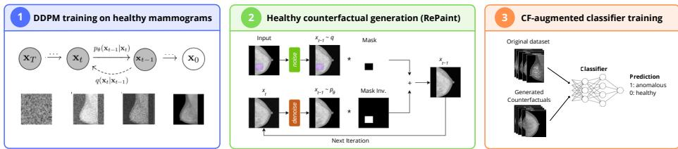
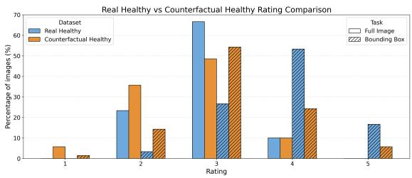
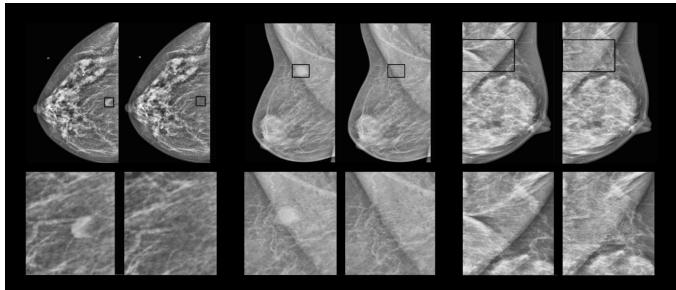
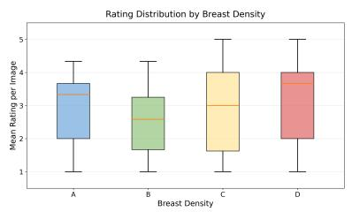
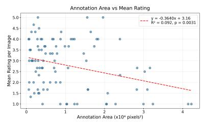

# Healthy Counterfactual Generation via Difusion Inpainting for Mammography Classification

Inês Cruchinho Garcia, Mariana Mourão, Francisco Maria Calisto, Carlos Santiago, and Jacinto Nascimento

Institute for Systems and Robotics, Instituto Superior Técnico, Lisbon, Portugal ines.cruchinho.garcia@tecnico.ulisboa.pt

Abstract. False negatives remain a critical limitation of computer-aided diagnosis (CAD) systems for breast cancer screening due to delayed detection and treatment. To address this issue, we propose a counterfactual data augmentation strategy that generates healthy mammograms by "erasing" lesions from anomalous images, thereby enriching the training distribution. We train a Denoising Difusion Probabilistic Model on BI-RADS 1 (healthy) mammograms and use a RePaint-based sampling strategy to inpaint realistic normal tissue within annotated lesion bounding boxes. The resulting healthy counterfactuals replace annotated lesion regions with realistic healthy tissue while preserving patient-specific anatomical structure, as supported by similarity metrics between real and generated images. Image realism was further assessed by radiologists and found to be consistent with the original dataset quality. We evaluate counterfactual augmentation across four representative classifier architectures: a convolutional neural network (ConvNeXt), a vision transformer (ViT), a vision-language model pre-trained on mammogramreport pairs (Mammo-CLIP) and a multi-scale attention-based multipleinstance learning framework (FPN-MIL). Experiments conducted on the VinDr-Mammo dataset show improvements in sensitivity across all architectures, particularly at 80% fixed specificity, contributing towards more reliable CAD systems for breast cancer. Code is available at: https: //github.com/ines03garcia/difusion-based-counterfactual-generation.

Keywords: Counterfactual Generation · Difusion Models · Inpainting · Data Augmentation · Mammography

## 1 Introduction

False negatives in breast cancer detection systems are associated with delayed diagnosis and worse patient outcomes. Although mammography remains the primary modality for early breast cancer screening, its sensitivity is afected by multiple factors, including inter-patient anatomical variability [1]. Beyond missed detections, an additional concern in computer-aided diagnosis (CAD) is whether predictions are driven by clinically meaningful evidence. Deep learning models may achieve strong aggregate performance while relying on spurious correlations rather than lesion-specific cues [13]. Such efects have been observed in breast imaging settings [24]. For clinical deployment, CAD systems must not only improve sensitivity but also ensure that predictions are based on regions of interest (ROI) [22].

Counterfactuals represent ’what-if’ scenarios, such as: how would this patient’s mammogram look if there were no findings? Difusion models have emerged as a leading approach for high-fidelity image generation [2]. Building on the Denoising Difusion Probabilistic Model (DDPM) framework, these methods iteratively learn to reverse a gradual noise corruption process, enabling the sampling of images from random Gaussian noise. Commonly used to synthesize medical images [27], including X-rays [25] and breast MRIs [11], difusion models have been recently explored for mammogram generation [18]. Focusing on counterfactuals, their applications include data augmentation [8], explainability [6] and classifier performance enhancement [4], but a critical challenge remains the unintended modification of unrelated morphology [16]. To address this, our approach restricts modifications to previously annotated lesion regions by employing masked difusion inpainting. The inpainted area is iteratively conditioned on the surrounding tissue, ensuring anatomical coherence while preventing unintended modifications outside the annotated bounding box. Rather than generating lesions, an approach hindered by data scarcity, high anomaly variability, and complex distributional patterns [26], we generate healthy counterfactuals, i.e., anatomically plausible normal counterparts of originally abnormal images. Although healthy counterfactuals have previously been explored in mammography [21], their use as a data augmentation strategy remains largely underexplored. By incorporating these counterfactuals into the training set of four diverse classifier architectures, we aim to enhance the robustness of CAD systems for breast cancer detection. Specifically, we select architectures with distinct inductive biases: a convolutional neural network (ConvNeXt) [14], a transformer-based vision model (ViT) [3], a mammography-specific image encoder (Mammo-CLIP) [7] and a multiple-instance learning classifier (FPN-MIL) [17].

Comparative evaluation on the VinDr-Mammo dataset against standard augmentation baselines demonstrates consistent sensitivity gains, particularly at a clinically relevant operating point of 80% specificity, supporting healthy counterfactual augmentation as a strategy for reducing missed detections in mammography classification.

## 2 Method

To investigate whether counterfactuals enhance deep learning classifiers for mammography, we propose a three-stage pipeline (Figure 1). First, a DDPM [10] is trained exclusively on BI-RADS 1 mammograms to model the distribution of normal breast tissue. Second, the RePaint [15] sampling mechanism is employed to inpaint healthy tissue within annotated lesion bounding boxes, producing healthy counterfactuals. Third, the synthetic images are incorporated into the training set to obtain counterfactual-augmented models.

  
Fig. 1. Overview of the proposed pipeline. First, a DDPM is trained on healthy mammograms to learn the distribution of healthy breast tissue. Second, RePaint is used to generate healthy counterfactuals via mask-guided inpainting of lesion regions, using binary masks derived from bounding-box annotations. Finally, the generated counterfactuals are incorporated into the training set for classification.

## 2.1 Denoising Difusion Probabilistic Model (DDPM)

We train a DDPM [10] with a U-Net backbone to model the distribution of healthy mammograms (BI-RADS 1). Following the standard difusion framework, Gaussian noise is progressively added to images according to a predefined variance schedule, defining a forward noising process. The network is trained to predict the injected noise at each timestep by minimizing a mean squared error (MSE) objective, thereby learning the corresponding denoising process. In inference, sampling is performed by iteratively denoising random Gaussian noise using the learned reverse transitions. Training exclusively on healthy images enables the model to capture normal breast anatomy for subsequent counterfactual generation.

## 2.2 RePaint Inpainting

We use RePaint [15] to perform mask-conditioned difusion inpainting. Given a binary lesion mask M, known pixels are re-noised to the current timestep, while masked regions are updated via the learned reverse transition. At each step:

$$
x _ { t - 1 } = M \odot x _ { t - 1 } ^ { \mathrm { k n o w n } } + ( 1 - M ) \odot \hat { x } _ { t - 1 } .
$$

where $x _ { t - 1 }$ denotes the resulting image at timestep $t \mathrm { ~ - ~ } 1 , \ x _ { t - 1 } ^ { \mathrm { k n o w n } }$ represents the region to preserve with corresponding noise at t − 1, and $\hat { x } _ { t - 1 }$ denotes the newly generated content based on $x _ { t }$ . The operator ⊙ represents element-wise multiplication.

## 3 Experiments

## 3.1 Dataset

We conduct experiments on the publicly available VinDr-Mammo dataset [19], preprocessed by [7]. The dataset comprises 5,000 full-field digital mammography exams, each containing four standard views: craniocaudal (CC) and mediolateral oblique (MLO) views of both breasts, totalling 20,000 mammograms. Following the original data splits and folds, 16,000 images (80%) were used for training and 4,000 (20%) for testing. To balance anatomical fidelity and computational eficiency during counterfactual generation, mammograms were resized to 512 × 512 pixels using zero padding to preserve aspect ratio. Synthesized images were later resized back to their original resolution of $1 5 2 0 \times 9 1 2$ pixels. Contrast Limited Adaptive Histogram Equalization (CLAHE) was applied to normalize local contrast across mammograms.

## 3.2 Counterfactual Generation

DDPM Training The DDPM was trained on BI-RADS 1 mammograms using an NVIDIA A100 GPU with 80 GB of memory. Although BI-RADS 2 corresponds to benign findings, these cases were excluded from this training stage to avoid generation of any lesion-like structures. We used the OpenAI guided-diffusion implementation in PyTorch. The model is based on a U-Net backbone with 256 base channels and was trained on single-channel images resized to $5 1 2 \times 5 1 2$ pixels. Training used an MSE noise-prediction objective with a linear variance schedule over 1,000 difusion timesteps, with an AdamW optimizer $( \mathrm { L R } = 1 \times 1 0 ^ { - 4 }$ , batch size=16), for approximately 8,000 iterations until validation loss convergence.

Sampling using RePaint The trained DDPM was integrated into the Re-Paint mechanism to generate lesion-free counterfactual mammograms. For each anomalous image, a binary lesion mask was constructed from the annotated bounding box, with lesion pixels set to 0 (to be inpainted) and surrounding tissue set to 1 (to be preserved).

Sampling was performed using mask-conditioned reverse difusion with 500 respaced timesteps to improve computational eficiency. At each timestep, known regions were re-noised and reinserted to preserve anatomical context, while masked regions were updated according to the learned reverse transition. One counterfactual image was generated per anomalous annotated mammogram and subsequently added to the training set.

## 3.3 Counterfactual Augmentation

To evaluate the impact of counterfactual augmentation across diferent inductive biases, we selected four classifiers: ConvNeXt [14] as a hierarchical CNN, ViT [3] for modelling long-range dependencies, Mammo-CLIP [7] as a VinDr-Mammo pretrained encoder, and FPN-MIL [17] for weakly supervised multi-scale aggregation.

ConvNeXt and ViT were initialized with ImageNet-pretrained weights, while Mammo-CLIP and FPN-MIL used EficientNet backbones pretrained on VinDr-Mammo. Models were fine-tuned using binary cross-entropy loss, AdamW (LR =

$3 \times 1 0 ^ { - 4 } )$ , a batch size of 8, cosine annealing and positive class weighting to account for the imbalance between healthy and anomalous samples.

Models were first trained using 4-fold cross-validation to estimate an appropriate training duration. Three folds of the training set were used for model fitting, while the remaining fold, comprising 3,200 images, was used for validation. The optimal number of epochs was averaged across folds and subsequently used to retrain each model on the full training set. For counterfactual augmentation, one healthy counterfactual was generated for each annotated image, adding 1,410 negative samples to the training set, increasing the size of the negative class by 13%. Positive-class weights were recalculated after augmentation to account for the resulting change in class distribution.

## 4 Results

We evaluated the realism and clinical plausibility of the generated counterfactuals through distributional metrics and radiologists’ studies. The efectiveness of the proposed data augmentation is assessed using standard classification performance metrics. We did not perform matched-pair prediction-consistency analysis because its interpretation of what the classifier’s learning is limited in the context of counterfactual image generation.

## 4.1 Healthy Counterfactual Generation Quality Assessment

Distributional Metrics We evaluate the realism of the generated images using distributional metrics based on the Fréchet Inception Distance (FID) [9] and two variants of the Fréchet Radiomic Distance (FRD) [12], which assess perceptual quality and radiomic consistency.

Table 1 shows the results obtained with our approach, where the low FID and FRD values suggest that the edits remain close to the distribution of real healthy mammograms. We also report results from MammoFlow [5] on VinDr-Mammo, although their results are for full image generation and are not restricted to healthy cases.

We also assess only the generated patch by cropping each counterfactual to the edited bounding-box region and compare the generated healthy patches with real healthy patches from VinDr-Mammo. Our scores are better than those reported by Osuala et al. [20], who evaluate synthetic mass patches against real mass patches from the CBIS-DDSM [23]. Although the datasets and patch types difer, our results indicate competitive realism.

Expert Reader Study To complement the metrics-based evaluation, we conducted two expert assessments of the generated healthy counterfactual mammograms: a blind review by an experienced radiologist and a broader inspection of counterfactuals involving multiple radiologists.

Table 1. Quantitative comparison of image realism, measured by FID, and radiomic consistency, measured by FRD, between generated and real mammograms. Lower values indicate greater similarity to the corresponding real-image distribution. Results from the proposed method are shown in bold. Prior results are included for reference, although they are not directly comparable due to diferences in protocol.
<table><tr><td>Compared Distributions</td><td>Dataset</td><td>Scale</td><td>FID↓</td><td>FRDv0↓</td><td>FRDv1↓</td></tr><tr><td>Healthy CF. vs. Real Healthy (ours)</td><td>VinDr-Mammo</td><td>image</td><td>10.1</td><td>12.3</td><td>7.5</td></tr><tr><td>Synthetic vs. Real [5]</td><td>VinDr-Mammo</td><td>image</td><td>67.5</td><td></td><td>12.4</td></tr><tr><td>Healthy CF. vs. Real Healthy (ours)</td><td>VinDr-Mammo</td><td>patch</td><td>37.7</td><td>12.3</td><td>10.9</td></tr><tr><td>Synthetic Masses vs. Real Masses [20]</td><td>CBIS-DDSM</td><td>patch</td><td>58.0</td><td>18.1</td><td></td></tr></table>

Blind Evaluation Test: An experienced radiologist with over 35 years of experience blindly evaluated 70 healthy counterfactual mammograms and 30 real healthy mammograms. Each image was rated on a five-point Likert scale in two stages: first for full-image realism, assessing whether the image could plausibly resemble a real mammogram, and then for regional healthiness, assessing whether the tissue within the bounding box appeared healthy.

The rating distributions are shown in Fig. 2. For full-image realism, both real and counterfactual mammograms were frequently assigned intermediate ratings (2–3). Counterfactuals showed a slight shift toward lower ratings, indicating a small reduction in perceived realism. A similar trend was observed in the bounding-boxes healthiness assessment: regions from real healthy mammograms received higher ratings than counterfactual regions, although both distributions remained concentrated within a similar range (3–4).

The radiologist also noted several quality limitations in the original dataset, including low contrast, unrealistic soft-tissue appearance, implausible superposition in the axillary region and incomplete breast coverage, with some mammograms cropping posterior or inferior tissue. These observations suggest that part of the perceived lack of realism may reflect limitations already present in the source images rather than artifacts introduced by counterfactual generation.

These findings indicate that the counterfactual edits introduced some perceptible diferences, but their ratings remain broadly aligned with those of real healthy mammograms.

CF-focused assessment: A balanced subset of 100 synthetic images, spanning diferent breast density and BI-RADS categories, was evaluated by six radiologists. Each expert independently reviewed 40 full-image counterfactuals, such that each image received two to three evaluations. Figure 3 presents three highquality counterfactuals that received unanimous positive ratings (5/5) from all reviewing radiologists.

The rating distributions stratified by breast density are shown in Fig. 4. Density D mammograms received the strongest overall ratings, while density C cases showed the largest proportion of upper-end ratings compared with densities A and B. This may be partly related to the greater prevalence of denser mammograms in the training dataset.

Fig. 2. Distribution of radiologist ratings for real healthy mammograms and generated healthy counterfactuals. Ratings were assigned on a five-point Likert scale. For the fullimage assessment, higher scores indicated that an image was more likely to resemble a real mammogram; for the bounding-box assessment, higher scores indicated that the highlighted tissue was more likely to resemble healthy breast tissue.  
  
Fig. 3. Three lesion-free counterfactual mammograms rated 5/5 for realism by all three reviewing radiologists. For each example, the original image is shown on the left and the corresponding counterfactual on the right. Zoomed views of the regions of interest are shown in the bottom row.

Inpainting quality was also negatively correlated with lesion size (Fig. 4). Smaller lesions were reconstructed more convincingly, whereas larger masked regions tended to receive lower ratings.

## 4.2 Data Augmentation

Classification Performance Table 2 shows the efect of adding healthy counterfactual images as data augmentation across four classification backbones. Recall and performance at fixed specificity (shown through Recall at 80% Spec.) improve consistently across all models. The largest recall gains are observed for ConvNeXt and FPN-MIL, with improvements of 4.6% and 1.9%, respectively. Improvements in recall at 80% specificity range from 0.6% to 1.3%, suggesting that counterfactual augmentation can improve sensitivity under a clinically relevant operating constraint. Balanced accuracy and F1-score show modest improvements across all models.

Specificity and ROC-AUC reveal a more mixed pattern. While specificity improves slightly for ViT, it decreases for ConvNeXt, Mammo-CLIP, and FPN-

  
Fig. 4. Radiologist evaluation of counterfactual realism for a balanced subset of counterfactuals. Left: Boxplot showing the distribution of mean realism ratings across breast density categories. Right: Scatter plot with linear regression illustrating the correlation between mean realism ratings and annotation area.

Table 2. Classification performance of ConvNeXt, ViT, Mammo-CLIP and FPN-MIL under baseline training and counterfactual augmentation (CF) on the original test set. Improved results are highlighted in bold. Recall values with fixed specificity (80%) are also reported.
<table><tr><td>Metric</td><td>ConvNeXt [14] Baseline CF</td><td>Baseline</td><td>ViT [3] CF</td><td>Mammo-CLIP [19] Baseline CF</td><td></td><td>[FPN-MIL [17] Baseline CF</td></tr><tr><td>Balanced Acc.</td><td>73.1</td><td>73.2</td><td>72.3 72.7</td><td>77.1</td><td>77.3</td><td>76.7 76.8</td></tr><tr><td>Recall</td><td>63.5</td><td>68.1</td><td>63.1 63.7</td><td>69.0</td><td>70.7</td><td>73.1 75.0</td></tr><tr><td>Specificity</td><td>82.6</td><td>78.2</td><td>81.6 81.7</td><td>85.2</td><td>83.8</td><td>80.2 78.6</td></tr><tr><td>F1-score</td><td>63.9</td><td>64.1</td><td>62.9 63.3</td><td>69.3</td><td>69.4</td><td>68.6 68.7</td></tr><tr><td>ROC-AUC</td><td>80.3</td><td>80.2</td><td>77.8 78.4</td><td>84.6</td><td>84.8</td><td>84.1 84.0</td></tr><tr><td>Recall (at 80% Spec.)</td><td>65.9</td><td>66.5</td><td>63.7 65.0</td><td>73.7</td><td>74.7</td><td>73.2 74.5</td></tr></table>

MIL. ROC-AUC improves modestly for ViT and Mammo-CLIP, but remains nearly unchanged for ConvNeXt and FPN-MIL.

These results suggest that healthy counterfactual augmentation consistently improves sensitivity, particularly at the clinically relevant operating point of 80% specificity, while introducing a slight reduction in specificity for some models. Although gains in balanced accuracy, F1-score, and ROC-AUC are more modest, the improved sensitivity highlights the potential of the proposed augmentation strategy for computer-aided breast cancer screening, where reducing missed diagnoses is often prioritised.

## 5 Conclusion

In this work, we introduced a difusion-based counterfactual augmentation framework for mammography classification. The proposed method generates lesionfree counterfactuals by training a DDPM exclusively on healthy mammograms and applying RePaint-based inpainting within annotated lesion regions, while preserving the surrounding patient-specific anatomy.

Distributional metrics and expert reader assessments indicate that the generated images are consistent with real healthy mammograms. When used for data augmentation, they consistently improved sensitivity, particularly at a clinically relevant operating point of 80% specificity, across diverse classification architectures. Improvements in F1-score, balanced accuracy and ROC-AUC were more modest, while specificity slightly decreased for some models.

Our work proposes healthy counterfactual generation as a strategy for data augmentation in mammography, producing realistic patient-specific lesion-free mammograms that consistently improve sensitivity across models with diferent inductive biases.

Acknowledgments. We gratefully acknowledge Dr Cristina Ribeiro da Fonseca and Dr João Abrantes and his team for their assistance in evaluating the synthetic mammograms in the counterfactual quality assessment. This work is funded by LARSyS FCT funding (10.54499/LA/P/0083/2020, 10.54499/UIDP/50009/2020, and 10.54499/ UIDB/50009/2020), and by the FCT project MIA-BREAST (10.54499/2022.0485.PT DC).

Disclosure of Interests. The authors have no competing interests to declare that are relevant to the content of this article.

## References

1. Attallah, O.: A deep learning-driven cad for breast cancer detection via thermograms: A compact multi-architecture feature strategy. Applied Sciences 15(13), 7181 (2025). https://doi.org/10.3390/app15137181

2. Dhariwal, P., et al.: Difusion models beat gans on image synthesis. In: Advances in Neural Information Processing Systems (NeurIPS). vol. 34, pp. 8780–8794 (2021)

3. Dosovitskiy, A., et al.: An image is worth 16x16 words: Transformers for image recognition at scale. In: International Conference on Learning Representations (ICLR) (2021), https://openreview.net/forum?id=YicbFdNTTy

4. Drexlin, D.J., et al.: MeDi: Metadata-Guided Difusion Models for Mitigating Biases in Tumor Classification . In: proceedings of Medical Image Computing and Computer Assisted Intervention – MICCAI 2025. vol. LNCS 15973, pp. 379 – 388 (2025)

5. Du, Y., et al.: Mammoflow: Multiview mammogram synthesis with anatomically consistent flow matching (2026)

6. Fathi, N., et al.: DecoDEx: Confounder detector guidance for improved difusionbased counterfactual explanations. In: Medical Imaging with Deep Learning (2024), https://openreview.net/forum?id=M6CfJ5H7XH

7. Ghosh, S., et al.: Mammo-CLIP: A Vision Language Foundation Model to Enhance Data Eficiency and Robustness in Mammography . In: proceedings of Medical Image Computing and Computer Assisted Intervention – MICCAI 2024. vol. LNCS 15012, pp. 632 – 642 (2024)

8. Heo, C., et al.: Semantic Interpolative Difusion Model: Bridging the Interpolation to Masks and Colonoscopy Image Synthesis for Robust Generalization . In: proceedings of Medical Image Computing and Computer Assisted Intervention – MICCAI 2025. vol. LNCS 15970, pp. 519 – 529 (2025)

9. Heusel, M., et al.: Gans trained by a two time-scale update rule converge to a nash equilibrium. CoRR abs/1706.08500 (2017), http://arxiv.org/abs/1706.08500

10. Ho, J., et al.: Denoising difusion probabilistic models. In: Proceedings of the 34th International Conference on Neural Information Processing Systems (2020)

11. Ibarra, S., et al.: Comparing conditional difusion models for synthesizing contrastenhanced breast mri from pre-contrast images. In: Artificial Intelligence and Imaging for Diagnostic and Treatment Challenges in Breast Care (Deep-Breath) – MIC-CAI 2025. pp. 226–236 (2025). https://doi.org/10.1007/978-3-032-05559-0\_23

12. Konz, N., et al.: Fréchet radiomic distance (frd): A versatile metric for comparing medical imaging datasets. Medical Image Analysis 110, 103943 (May 2026). https: //doi.org/10.1016/j.media.2026.103943, http://dx.doi.org/10.1016/j.media.2026. 103943

13. Li, W., et al.: Let samples speak: Mitigating spurious correlation by exploiting the clusterness of samples. In: Proceedings of the IEEE/CVF Conference on Computer Vision and Pattern Recognition (CVPR). pp. 15486–15496 (2025)

14. Liu, Z., et al.: A convnet for the 2020s. In: Proceedings of the IEEE/CVF Conference on Computer Vision and Pattern Recognition (CVPR). pp. 11966–11976 (2022). https://doi.org/10.1109/CVPR52688.2022.01167

15. Lugmayr, A., et al.: Repaint: Inpainting using denoising difusion probabilistic models. In: 2022 IEEE/CVF Conference on Computer Vision and Pattern Recognition (CVPR). pp. 11451–11461 (2022). https://doi.org/10.1109/CVPR52688.20 22.01117

16. Min, H., et al.: InstructX2X: An Interpretable Local Editing Model for Counterfactual Medical Image Generation . In: proceedings of Medical Image Computing and Computer Assisted Intervention – MICCAI 2025. vol. LNCS 15975, pp. 279 – 288 (2025)

17. Mourão, M., et al.: Multi-scale Attention-based Multiple Instance Learning for Breast Cancer Diagnosis . In: proceedings of Medical Image Computing and Computer Assisted Intervention – MICCAI 2025. vol. LNCS 15974, pp. 364 – 374 (2025)

18. Na, I., et al.: Radiomicsfill-mammo: Synthetic mammogram mass manipulation with radiomics features. In: Medical Image Computing and Computer Assisted Intervention – MICCAI 2024. pp. 723–733 (2024)

19. Nguyen, H.T., et al.: Vindr-mammo: A large-scale benchmark dataset for computer-aided diagnosis in full-field digital mammography. medRxiv (2022). https://doi.org/10.1101/2022.03.07.22272009

20. Osuala, R., et al.: Enhancing the utility of privacy-preserving cancer classification using synthetic data (2024)

21. Sanchez, P., et al.: What is healthy? generative counterfactual difusion for lesion localization. In: Deep Generative Models – MICCAI 2022 Workshop. pp. 34–44 (2022). https://doi.org/10.1007/978-3-031-18576-2\_4

22. Saporta, A., et al.: Benchmarking saliency methods for chest x-ray interpretation. Nature Machine Intelligence 4(10), 867–878 (2022). https://doi.org/10.1038/s422 56-022-00536-x

23. Sawyer-Lee, R., et al.: Curated breast imaging subset of ddsm (cbis-ddsm) (2016). https://doi.org/10.7937/K9/TCIA.2016.7O02S9CY

24. Won, J.B., et al.: SpurBreast: A Curated Dataset for Investigating Spurious Correlations in Real-world Breast MRI Classification . In: proceedings of Medical Image Computing and Computer Assisted Intervention – MICCAI 2025. vol. LNCS 15975, pp. 555 – 564 (2025)

25. Xie, C., et al.: SV-DRR: High-Fidelity Novel View X-Ray Synthesis Using Difusion Model . In: proceedings of Medical Image Computing and Computer Assisted Intervention – MICCAI 2025. vol. LNCS 15963, pp. 572 – 582 (2025)

26. Zhang, H., et al.: Paired Image Generation with Difusion-Guided Difusion Models . In: proceedings of Medical Image Computing and Computer Assisted Intervention – MICCAI 2025. vol. LNCS 15963, pp. 371 – 381 (2025)

27. Zhang, Y., et al.: High-Fidelity Unified One-to-Many Medical Image Synthesis via Text-Conditioned Latent Difusion . In: proceedings of Medical Image Computing and Computer Assisted Intervention – MICCAI 2025. vol. LNCS 15975, pp. 258 – 267 (2025)